# 第十六章：17.远程过程调用

概述

在本章中，您将了解远程过程调用，这是虚幻引擎 4 网络框架的另一个重要多人游戏概念。您还将学习如何在虚幻引擎 4 中使用枚举，以及如何使用双向循环数组索引，这是一种帮助您在两个方向上迭代数组并在超出其索引限制时循环的方法。

在本章结束时，您将了解远程过程调用是如何使服务器和客户端在彼此上执行逻辑的。您还将能够在虚幻引擎 4 编辑器中公开枚举，并使用双向循环数组索引来循环遍历数组。

# 介绍

在上一章中，我们涵盖了一些关键的多人游戏概念，包括服务器-客户端架构，连接和所有权，角色和变量复制。我们还看到监听服务器比专用服务器更快设置，但不够轻量级。我们利用这些知识创建了一个基本的第一人称射击角色，可以行走，跳跃和四处张望。

在本章中，我们将介绍**远程过程调用**（**RPC**），这是另一个重要的多人游戏概念，允许服务器在客户端上执行函数，反之亦然。到目前为止，我们已经学习了变量复制作为服务器和客户端之间通信的一种形式，但这还不够，因为服务器可能需要在客户端上执行特定的逻辑，而不涉及更新变量的值。客户端还需要一种方式告诉服务器其意图，以便服务器可以验证操作并让其他客户端知道。这将确保多人游戏世界同步，我们将在本章中更详细地探讨这一点。我们还将介绍如何在虚幻引擎 4 中使用枚举，以及双向循环数组索引的使用，这有助于您在两个方向上迭代数组，并在超出其索引限制时循环。

在第一个主题中，我们将研究 RPC。

# 远程过程调用

我们在*第十六章*，*多人游戏基础*中涵盖了变量复制，虽然这是一个非常有用的功能，但在允许在远程机器上执行自定义代码（客户端到服务器或服务器到客户端）方面有一些限制，主要有两个原因：

+   第一个原因是变量复制严格来说是一种服务器到客户端的通信形式，因此客户端无法使用变量复制来告诉服务器通过改变变量的值来执行一些自定义逻辑。

+   第二个原因是变量复制，顾名思义，是由变量的值驱动的，因此即使变量复制允许客户端到服务器的通信，也需要您在客户端更改变量的值来触发服务器上的`RepNotify`功能来运行自定义逻辑，这并不是很实际。

为了解决这个问题，虚幻引擎 4 支持 RPC。RPC 的工作原理就像一个普通的函数，可以定义和调用，但是它不会在本地执行，而是在远程机器上执行。使用 RPC 的主要目标是有可能在远程机器上执行特定的逻辑，这与变量没有直接关联。要能够使用 RPC，请确保在打开复制的角色中定义它们。

有三种类型的 RPC，每种都有不同的目的：

+   服务器 RPC

+   多播 RPC

+   客户端 RPC

让我们详细了解这三种类型，并解释何时应该使用它们：

## 服务器 RPC

每当您希望服务器在定义了 RPC 的角色上运行函数时，您就会使用服务器 RPC。您希望这样做的两个主要原因是：

+   第一个原因是出于安全考虑，因为在制作多人游戏时，特别是竞争性游戏，您总是要假设客户端会尝试作弊。确保没有作弊的方法是强制客户端在服务器上执行对游戏玩法至关重要的函数。

+   第二个原因是为了同步性，因为关键的游戏逻辑只在服务器上执行，这意味着重要的变量只会在那里被改变，这将触发变量复制逻辑，在变量被改变时更新客户端。

一个例子是当客户端的角色尝试开火时。由于客户端可能会尝试作弊，您不能只在本地执行开火逻辑。正确的做法是让客户端调用一个告诉服务器验证`Fire`动作的服务器 RPC，确保角色有足够的弹药并且装备了武器等等。如果一切都符合要求，那么它将扣除弹药变量，并最终执行一个多播 RPC（*在下一个 RPC 类型中介绍*），告诉所有客户端在该角色上播放开火动画。

### 声明

要声明服务器 RPC，您需要在`UFUNCTION`宏上使用`Server`修饰符。请看以下例子：

```cpp
UFUNCTION(Server, Reliable, WithValidation)
void ServerRPCFunction(int32 IntegerParameter, float FloatParameter,   AActor* ActorParameter); 
```

在上述代码中，`Server`修饰符在`UFUNCTION`宏上被用来声明该函数是一个服务器 RPC。您可以像普通函数一样在服务器 RPC 上有参数，但是有一些注意事项将在本主题后面解释，以及`Reliable`和`WithValidation`修饰符的目的。

### 执行

要执行服务器 RPC，您需要在定义它的角色实例上从客户端调用它。请看以下例子：

```cpp
void ARPCTest::CallMyOwnServerRPC(int32 IntegerParameter)
{
  ServerMyOwnRPC(IntegerParameter);
}
void ARPCTest::CallServerRPCOfAnotherActor(AAnotherActor* OtherActor)
{
  if(OtherActor != nullptr)
  {
    OtherActor->ServerAnotherActorRPC();
  }
}
```

第一个代码片段实现了`CallMyOwnServerRPC`函数，该函数调用了其自己`ARPCTest`类中定义的`ServerMyOwnRPC` RPC 函数，带有一个整数参数。这将在该角色实例的服务器版本上执行`ServerMyOwnRPC`函数的实现。

第二个代码片段实现了`CallServerRPCOfAnotherActor`函数，该函数调用了`ServerAnotherActorRPC` RPC 函数，在`AAnotherActor`中定义，在`OtherActor`实例上只要它是有效的。这将在`OtherActor`实例的服务器版本上执行`ServerAnotherActorRPC`函数的实现。

### 有效连接

从客户端调用服务器 RPC 时需要考虑的一个重要事项是定义它的角色需要有一个有效的连接。如果尝试在没有有效连接的角色上调用服务器 RPC，则什么也不会发生。您必须确保该角色要么是玩家控制器，要么被一个（*如果适用*）控制，或者其拥有的角色有一个有效的连接。

## 多播 RPC

当您希望服务器告诉所有客户端在定义了 RPC 的角色上运行函数时，您可以使用多播 RPC。

一个例子是当客户端的角色尝试开火时。在客户端调用服务器 RPC 请求允许开火，并且服务器处理了请求（所有验证都通过，弹药已经扣除，线性跟踪/抛射物已经处理），然后我们需要进行多播 RPC，以便该特定角色的所有实例都播放开火动画。这将确保无论哪个客户端正在观察角色，角色都会一直播放开火动画。

### 声明

要声明多播 RPC，您需要在`UFUNCTION`宏上使用`NetMulticast`修饰符。请看以下例子：

```cpp
UFUNCTION(NetMulticast)
void MulticastRPCFunction(int32 IntegerParameter, float   FloatParameter, AActor* ActorParameter); 
```

在前面的代码中，`NetMulticast`修饰符用于`UFUNCTION`宏，表示接下来的函数是一个多播 RPC。你可以像普通函数一样在多播 RPC 中使用参数，但与服务器 RPC 一样有相同的注意事项。

### 执行

要执行多播 RPC，你需要在定义它的角色实例上从服务器调用它。看一下下面的例子：

```cpp
void ARPCTest::CallMyOwnMulticastRPC(int32 IntegerParameter)
{
  MulticastMyOwnRPC(IntegerParameter);
}
void ARPCTest::CallMulticastRPCOfAnotherActor(AAnotherActor*   OtherActor)
{
  if(OtherActor != nullptr)
  {
    OtherActor->MulticastAnotherActorRPC();
  }
}
```

第一个代码片段实现了`CallMyOwnMulticastRPC`函数，它调用了其自己`ARPCTest`类中定义的`MulticastMyOwnRPC` RPC 函数，带有一个整数参数。这将在该角色实例的所有客户端版本上执行`MulticastMyOwnRPC`函数的实现。

第二个代码片段实现了`CallMulticastRPCOfAnotherActor`函数，它调用了`AAnotherActor`中定义的`MulticastAnotherActorRPC` RPC 函数，只要`OtherActor`实例有效。这将在`OtherActor`实例的所有客户端版本上执行`MulticastAnotherActorRPC`函数的实现。

## 客户端 RPC

当你想要在定义 RPC 的角色的拥有客户端上运行函数时，你可以使用客户端 RPC。要设置拥有客户端，你需要在服务器上调用 SetOwner，并使用客户端的玩家控制器进行设置。

例如，当角色被抛射物击中并播放只有该客户端会听到的疼痛声音时。通过从服务器调用客户端 RPC，声音只会在拥有客户端上播放，因此其他客户端不会听到。

### 声明

要声明客户端 RPC，你需要在`UFUNCTION`宏上使用`Client`修饰符。看一下下面的例子：

```cpp
UFUNCTION(Client)
void ClientRPCFunction(int32 IntegerParameter, float FloatParameter,   AActor* ActorParameter); 
```

在前面的代码中，`Client`修饰符用于`UFUNCTION`宏，表示接下来的函数是一个客户端 RPC。你可以像普通函数一样在客户端 RPC 中使用参数，但与服务器 RPC 和多播 RPC 一样有相同的注意事项。

### 执行

要执行客户端 RPC，你需要在定义它的角色实例上从服务器调用它。看一下下面的例子：

```cpp
void ARPCTest::CallMyOwnClientRPC(int32 IntegerParameter)
{
  ClientMyOwnRPC(IntegerParameter);
}
void ARPCTest::CallClientRPCOfAnotherActor(AAnotherActor* OtherActor)
{
  if(OtherActor != nullptr)
  {
    OtherActor->ClientAnotherActorRPC();
  }
}
```

第一个代码片段实现了`CallMyOwnClientRPC`函数，它调用了其自己`ARPCTest`类中定义的`ClientMyOwnRPC` RPC 函数，带有一个整数参数。这将在该角色实例的拥有客户端版本上执行`ClientMyOwnRPC`函数的实现。

第二个代码片段实现了`CallClientRPCOfAnotherActor`函数，它调用了`AAnotherActor`中定义的`ClientAnotherActorRPC` RPC 函数，只要`OtherActor`实例有效。这将在`OtherActor`实例的拥有客户端版本上执行`ClientAnotherActorRPC`函数的实现。

## 在使用 RPC 时需要考虑的重要事项

RPC 非常有用，但在使用它们时有一些需要考虑的事项，比如：

**实现**

RPC 的实现与典型函数略有不同。你不应该像通常那样实现函数，而是只实现它的`_Implementation`版本，即使你没有在头文件中声明它。看一下下面的例子：

**服务器 RPC：**

```cpp
void ARPCTest::ServerRPCTest_Implementation(int32 IntegerParameter,   float FloatParameter, AActor* ActorParameter)
{
}
```

在前面的代码片段中，我们实现了`ServerRPCTest`函数的`_Implementation`版本，它使用了三个参数。

**多播 RPC：**

```cpp
void ARPCTest::MulticastRPCTest_Implementation(int32 IntegerParameter,   float FloatParameter, AActor* ActorParameter)
{
}
```

在前面的代码片段中，我们实现了`MulticastRPCTest`函数的`_Implementation`版本，它使用了三个参数。

**客户端 RPC：**

```cpp
void ARPCTest::ClientRPCTest_Implementation(int32 IntegerParameter,   float FloatParameter, AActor* ActorParameter)
{
}
```

在前面的代码片段中，我们实现了`ClientRPCTest`函数的`_Implementation`版本，它使用了三个参数。

从前面的例子中可以看出，无论你正在实现的 RPC 的类型是什么，你都应该只实现函数的`_Implementation`版本，而不是普通版本，就像下面的代码片段中所演示的那样：

```cpp
void ARPCTest::ServerRPCFunction(int32 IntegerParameter, float   FloatParameter, AActor* ActorParameter)
{
}
```

在上面的代码中，我们正在定义`ServerRPCFunction`的正常实现。如果您像这样实现 RPC，将会收到一个错误，说它已经被实现了。原因是当您在头文件中声明 RPC 函数时，虚幻引擎 4 将自动在内部创建正常的实现，然后调用`_Implementation`版本。如果您创建自己版本的正常实现，构建将失败，因为它会找到相同函数的两个实现。要解决此问题，只需确保只实现 RPC 的`_Implementation`版本。

接下来，我们转到名称前缀。

**名称前缀**

在虚幻引擎 4 中，最好使用相应类型的前缀来命名 RPC。看看以下示例：

+   一个`ServerRPCFunction`。

+   一个`MulticastRPCFunction`。

+   一个`ClientRPCFunction`。

**返回值**

由于 RPC 的调用和执行通常在不同的机器上进行，因此您不能有返回值，因此它总是需要是 void。

**重写**

您可以重写 RPC 的实现，通过在子类中声明和实现`_Implementation`函数而不使用`UFUNCTION`宏来扩展或绕过父功能。以下是一个示例：

父类上的声明：

```cpp
UFUNCTION(Server)
void ServerRPCTest(int32 IntegerParameter); 
```

在前面的代码片段中，我们有`ServerRPCTest`函数的父类声明，它使用一个整数参数。

子类上的重写声明：

```cpp
virtual void ServerRPCTest_Implementation(int32 IntegerParameter)   override;
```

在前面的代码片段中，我们在子类头文件中重写了`ServerRPCTest_Implementation`函数的声明。函数的实现就像任何其他重写一样，如果您仍然想执行父功能，可以调用`Super::ServerRPCTest_Implementation`。

**支持的参数类型**

在使用 RPC 时，您可以像任何其他函数一样添加参数。目前，支持最常见的类型，包括`bool`、`int32`、`float`、`FString`、`FName`、`TArray`、`TSet`和`TMap`。您需要更加注意的类型是指向任何`UObject`类或子类的指针，特别是 actors。

如果您使用 actor 参数创建 RPC，则该 actor 也需要存在于远程机器上，否则它将为`nullptr`。另一件重要的事情是要注意每个版本的 actor 的实例名称可能是不同的。这意味着如果您使用 actor 参数调用 RPC，那么在调用 RPC 时 actor 的实例名称可能与在远程机器上执行 RPC 时的实例名称不同。以下是一个示例，以帮助您理解这一点：

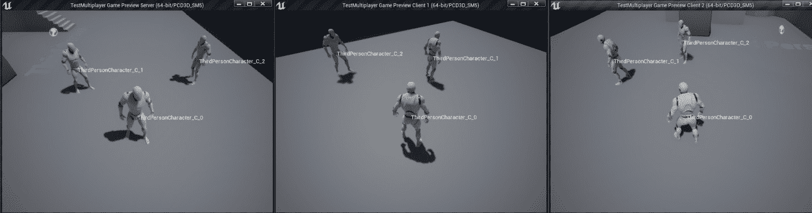

图 17.1：监听服务器和两个运行的客户端

在上面的示例中，您可以看到三个运行的客户端（其中一个是监听服务器），每个窗口都显示所有角色实例的名称。如果您查看客户端 1 窗口，其控制的角色实例称为`ThirdPersonCharacter_C_0`，但在服务器窗口上，相应的角色称为`ThirdPersonCharacter_C_1`。这意味着如果客户端 1 调用服务器 RPC 并将其`ThirdPersonCharacter_C_0`作为参数传递，那么在服务器上执行 RPC 时，参数将是`ThirdPersonCharacter_C_1`，这是该机器上等效角色的实例名称。

**在目标机器上执行 RPC**

您可以直接在目标机器上调用 RPC，并且它仍然会执行。换句话说，您可以在服务器上调用服务器 RPC 并执行，以及在客户端上调用 Multicast/Client RPC，但在这种情况下，它只会在调用 RPC 的客户端上执行逻辑。无论如何，在这些情况下，您应该始终直接调用`_Implementation`版本，以便更快地执行逻辑。

这是因为`_Implementation`版本只包含执行逻辑，没有创建和通过网络发送 RPC 请求的开销，而常规调用有。

看一下具有服务器权限的演员的以下示例：

```cpp
void ARPCTest::CallServerRPC(int32 IntegerParameter)
{
  if(HasAuthority())
  {
    ServerRPCFunction_Implementation(IntegerParameter);
  }
  else ServerRPCFunction(IntegerParameter);
}
```

在上面的示例中，您有`CallServerRPC`函数以两种不同的方式调用`ServerRPCFunction`。如果演员已经在服务器上，则调用`ServerRPCFunction_Implementation`，这将跳过前面提到的开销。

如果演员不在服务器上，则通过使用`ServerRPCFunction`执行常规调用，这将增加创建和通过网络发送 RPC 请求所需的开销。

验证

当您定义 RPC 时，您可以选择使用附加函数来检查 RPC 调用之前是否存在任何无效输入。这用于避免处理 RPC，如果输入无效，由于作弊或其他原因。

要使用验证，您需要在`UFUNCTION`宏中添加`WithValidation`修饰符。当您使用该修饰符时，您将被强制实现函数的`_Validate`版本，该版本将返回一个布尔值，指示 RPC 是否可以执行。

看一下以下示例：

```cpp
UFUNCTION(Server, WithValidation)
void ServerSetHealth(float NewHealth);
```

在上述代码中，我们声明了一个经过验证的服务器 RPC 称为`ServerSetHealth`，它接受一个浮点参数作为`Health`的新值。至于实现，如下所示：

```cpp
bool ARPCTest::ServerSetHealth_Validate(float NewHealth)
{
  return NewHealth <= MaxHealth;
}
void ARPCTest::ServerSetHealth_Implementation(float NewHealth)
{
  Health = NewHealth;
}
```

在上述代码中，我们实现了`_Validate`函数，该函数将检查新的健康值是否小于或等于健康的最大值。如果客户端尝试通过`200`和`MaxHealth`为`100`调用`ServerSetHealth`，则不会调用 RPC，这可以防止客户端使用超出一定范围的值更改健康。如果`_Validate`函数返回`true`，则会像往常一样调用`_Implementation`函数，该函数将使用`NewHealth`的值设置`Health`。

**可靠性**

当您声明 RPC 时，您需要在`UFUNCTION`宏中使用`Reliable`或`Unreliable`修饰符之一。以下是它们的快速概述：

+   `可靠`：用于确保执行 RPC，通过重复请求直到远程机器确认其接收。这应仅用于非常重要的 RPC，例如执行关键的游戏逻辑。以下是如何使用它的示例：

```cpp
UFUNCTION(Server, Reliable)
void ServerReliableRPCFunction(int32 IntegerParameter); 
```

+   `不可靠`：用于不关心 RPC 是否由于糟糕的网络条件而执行，例如播放声音或生成粒子效果。这应仅用于不太重要或非常频繁调用以更新值的 RPC，因为如果一个调用错过了，因为它经常更新，所以不重要。以下是如何使用它的示例：

```cpp
UFUNCTION(Server, Unreliable)
void ServerUnreliableRPCFunction(int32 IntegerParameter);
```

注意

有关 RPC 的更多信息，请访问[`docs.unrealengine.com/en-US/Gameplay/Networking/Actors/RPCs/index.html`](https://docs.unrealengine.com/en-US/Gameplay/Networking/Actors/RPCs/index.html)。

在下一个练习中，您将看到如何实现不同类型的 RPC。

## 练习 17.01：使用远程过程调用

在这个练习中，我们将创建一个使用`Third Person`模板的 C++项目，并按以下方式扩展它：

+   添加一个火灾计时器变量，它将防止客户端在火灾动画期间不断按下火灾按钮。

+   添加一个新的弹药整数变量，默认值为`5`，并复制给所有客户端。

+   添加一个“火灾动画剪辑”，当服务器告诉客户端射击有效时播放。

+   添加一个“无弹药声音”，当服务器告诉客户端他们没有足够的弹药时会播放。

+   每当玩家按下*左鼠标按钮*时，客户端将执行可靠且经过验证的服务器 RPC，检查角色是否有足够的弹药。如果有，它将从 Ammo 变量中减去 1，并调用一个不可靠的多播 RPC，在每个客户端播放开火动画。如果没有弹药，那么它将执行一个不可靠的客户端 RPC，只有拥有客户端才能听到`No Ammo Sound`。

以下步骤将帮助您完成练习：

1.  使用`C++`创建一个名为`RPC`的新`Third Person`模板项目，并将其保存到您选择的位置。

1.  项目创建后，应该打开编辑器以及 Visual Studio 解决方案。

1.  关闭编辑器，返回 Visual Studio。

1.  打开`RPCCharacter.h`文件，并包括`UnrealNetwork.h`头文件，其中包含我们将要使用的`DOREPLIFETIME_CONDITION`宏的定义：

```cpp
#include "Net/UnrealNetwork.h"
```

1.  声明受保护的计时器变量，以防止客户端滥用`Fire`动作：

```cpp
FTimerHandle FireTimer;
```

1.  声明受保护的可复制的弹药变量，初始为`5`发子弹：

```cpp
UPROPERTY(Replicated)
int32 Ammo = 5;
```

1.  接下来，声明一个受保护的动画蒙太奇变量，当角色开火时将会播放：

```cpp
UPROPERTY(EditDefaultsOnly, Category = "RPC Character")
UAnimMontage* FireAnimMontage;
```

1.  声明一个受保护的声音变量，当角色没有弹药时将会播放：

```cpp
UPROPERTY(EditDefaultsOnly, Category = "RPC Character")
USoundBase* NoAmmoSound;
```

1.  重写`Tick`函数：

```cpp
virtual void Tick(float DeltaSeconds) override;
```

1.  声明一个输入函数，用于处理*左鼠标按钮*的按压：

```cpp
void OnPressedFire();
```

1.  声明可靠且经过验证的服务器 RPC 以进行射击：

```cpp
UFUNCTION(Server, Reliable, WithValidation, Category = "RPC   Character")
void ServerFire();
```

1.  声明一个不可靠的多播 RPC，将在所有客户端上播放开火动画：

```cpp
UFUNCTION(NetMulticast, Unreliable, Category = "RPC Character")
void MulticastFire();
```

1.  声明一个不可靠的客户端 RPC，仅在拥有客户端中播放声音：

```cpp
UFUNCTION(Client, Unreliable, Category = "RPC Character")
void ClientPlaySound2D(USoundBase* Sound);
```

1.  现在，打开`RPCCharacter.cpp`文件，并包括`DrawDebugHelpers.h`，`GameplayStatics.h`，`TimerManager.h`和`World.h`：

```cpp
#include "DrawDebugHelpers.h"
#include "Kismet/GameplayStatics.h"
#include "TimerManager.h"
#include "Engine/World.h"
```

1.  在构造函数的末尾，启用`Tick`函数：

```cpp
PrimaryActorTick.bCanEverTick = true;
```

1.  实现`GetLifetimeReplicatedProps`函数，以便`Ammo`变量能够复制到所有客户端：

```cpp
void ARPCCharacter::GetLifetimeReplicatedProps(TArray<   FLifetimeProperty >& OutLifetimeProps) const
{
  Super::GetLifetimeReplicatedProps(OutLifetimeProps);
  DOREPLIFETIME(ARPCCharacter, Ammo);
}
```

1.  接下来，实现`Tick`函数，显示`Ammo`变量的值：

```cpp
void ARPCCharacter::Tick(float DeltaSeconds)
{
  Super::Tick(DeltaSeconds);
  const FString AmmoString = FString::Printf(TEXT("Ammo = %d"),     Ammo);
  DrawDebugString(GetWorld(), GetActorLocation(), AmmoString,     nullptr, FColor::White, 0.0f, true);
}
```

1.  在`SetupPlayerInputController`函数的末尾，将`Fire`动作绑定到`OnPressedFire`函数：

```cpp
PlayerInputComponent->BindAction("Fire", IE_Pressed, this,   &ARPCCharacter::OnPressedFire);
```

1.  实现处理*左鼠标按钮*按压的函数，该函数将调用 fire Server RPC：

```cpp
void ARPCCharacter::OnPressedFire()
{
  ServerFire();
}
```

1.  实现 fire 服务器 RPC 验证函数：

```cpp
bool ARPCCharacter::ServerFire_Validate()
{
  return true;
}
```

1.  实现 fire 服务器 RPC 实现函数：

```cpp
void ARPCCharacter::ServerFire_Implementation()
{

}
```

1.  现在，添加逻辑以在上一次射击后仍处于活动状态时中止函数：

```cpp
if (GetWorldTimerManager().IsTimerActive(FireTimer))
{
  return;
}
```

1.  检查角色是否有弹药。如果没有，那么只在控制角色的客户端中播放`NoAmmoSound`并中止函数：

```cpp
if (Ammo == 0)
{
  ClientPlaySound2D(NoAmmoSound);
  return;
}
```

1.  扣除弹药并安排`FireTimer`变量，以防止在播放开火动画时过度使用此函数：

```cpp
Ammo--;
GetWorldTimerManager().SetTimer(FireTimer, 1.5f, false);
```

1.  调用 fire 多播 RPC，使所有客户端播放开火动画：

```cpp
MulticastFire();
```

1.  实现 fire 多播 RPC，将播放开火动画蒙太奇：

```cpp
void ARPCCharacter::MulticastFire_Implementation()
{
  if (FireAnimMontage != nullptr)
  {
    PlayAnimMontage(FireAnimMontage);
  }
}
```

1.  实现在客户端播放 2D 声音的客户端 RPC：

```cpp
void ARPCCharacter::ClientPlaySound2D_Implementation(USoundBase*   Sound)
{
  UGameplayStatics::PlaySound2D(GetWorld(), Sound);
}
```

最后，您可以在编辑器中启动项目。

1.  编译代码并等待编辑器完全加载。

1.  转到`Project Settings`，转到`Engine`，然后`Input`，并添加`Fire`动作绑定：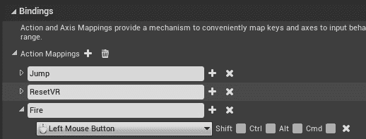

图 17.2：添加新的 Fire 动作绑定

1.  关闭`Project Settings`。

1.  在`Content Browser`中，转到`Content\Mannequin\Animations`文件夹。

1.  点击`导入`按钮，转到`Exercise17.01\Assets`文件夹，并导入`ThirdPersonFire.fbx`文件，然后确保它使用`UE4_Mannequin_Skeleton`骨架。

注意

前面提到的`Assets`文件夹可以在我们的 GitHub 存储库中找到[`packt.live/36pEvAT`](https://packt.live/36pEvAT)。

1.  打开新的动画，在详细信息面板中找到`启用根动作`选项，并将其设置为 true。这将在播放动画时防止角色移动。

1.  保存并关闭`ThirdPersonFire`。

1.  *右键单击*“内容浏览器”上的`ThirdPersonFire`，然后选择“创建->AnimMontage”。

1.  将`AnimMontage`重命名为`ThirdPersonFire_Montage`。

1.  `Animations`文件夹应该是这样的：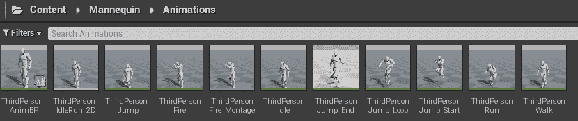

图 17.3：模特的动画文件夹

1.  打开`ThirdPerson_AnimBP`，然后打开`AnimGraph`。

1.  *右键单击*图表的空白部分，添加一个`DefaultSlot`节点（以便播放动画镜头），并将其连接在“状态机”和“输出姿势”之间。您应该会得到以下输出：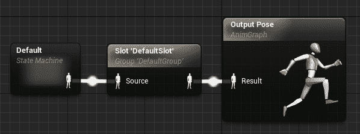

图 17.4：角色的 AnimGraph

1.  保存并关闭`ThirdPerson_AnimBP`。

1.  在“内容浏览器”中，转到“内容”文件夹，创建一个名为“音频”的新文件夹，并打开它。

1.  单击“导入”按钮，转到`Exercise17.01\Assets`文件夹，导入`noammo.wav`，然后保存。

1.  转到`Content\ThirdPersonCPP\Blueprints`，并打开`ThirdPersonCharacter`蓝图。

1.  在类默认值中，将“无弹药声音”设置为使用`noammo`，并将`Fire Anim Montage`设置为使用`ThirdPersonFire_Montage`。

1.  保存并关闭`ThirdPersonCharacter`。

1.  转到多人游戏选项，并将客户端数量设置为`2`。

1.  将窗口大小设置为 800x600，并使用 PIE 播放。

您应该会得到以下输出：

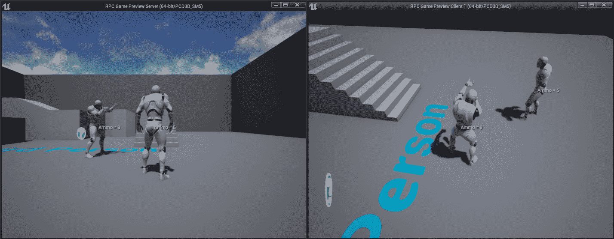

图 17.5：练习的最终结果

通过完成这个练习，您将能够在每个客户端上进行游戏，每次按下*左鼠标按钮*时，客户端的角色将播放`Fire Anim`镜头，所有客户端都将能够看到，并且其弹药将减少 1。如果您在弹药为`0`时尝试开火，该客户端将听到“无弹药声音”，并且不会执行开火动画，因为服务器没有调用多播 RPC。如果您尝试连续按下开火按钮，您会注意到只有在动画完成后才会触发新的开火。

在下一节中，我们将讨论枚举，它在游戏开发中用于许多不同的事情，比如管理角色的状态（是否空闲、行走、攻击或死亡等），或者为装备槽数组中的每个索引分配一个人类友好的名称（头部、主要武器、次要武器、躯干、手部、腰带、裤子等）。

# 枚举

枚举是一种用户定义的数据类型，它包含一系列整数常量，其中每个项目都由您分配了一个人类友好的名称，这使得代码更容易阅读。例如，我们可以使用整数变量来表示角色可能处于的不同状态 - `0`表示空闲，`1`表示行走，依此类推。这种方法的问题在于，当您开始编写诸如`if(State == 0)`之类的代码时，很难记住`0`的含义，特别是如果您有很多状态，没有使用一些文档或注释来帮助您记住。为了解决这个问题，您应该使用枚举，其中您可以编写诸如`if(State == EState::Idle)`之类的代码，这样更加明确和易于理解。

在 C++中，您有两种类型的枚举，旧的原始枚举和引入于 C++11 的新枚举类。如果您想在编辑器中使用 C++枚举，您的第一反应可能是以典型的方式来声明一个使用枚举作为参数的变量或函数，分别使用`UPROPERTY`或`UFUNCTION`。

问题是，如果您尝试这样做，将会出现编译错误。看一下以下示例：

```cpp
enum class ETestEnum : uint8
{
  EnumValue1,
  EnumValue2,
  EnumValue3
};
```

在上面的代码片段中，我们声明了一个名为`ETestEnum`的枚举类，它有三个可能的值 - `EnumValue1`，`EnumValue2`和`EnumValue3`。

之后，尝试以下示例之一：

```cpp
UPROPERTY()
ETestEnum TestEnum;
UFUNCTION()
void SetTestEnum(ETestEnum NewTestEnum) { TestEnum = NewTestEnum; }
```

在前面的代码片段中，我们声明了一个在类中使用`ETestEnum`枚举的`UPROPERTY`变量和`UFUNCTION`函数。如果您尝试编译，您将收到以下编译错误：

```cpp
error : Unrecognized type 'ETestEnum' - type must be a UCLASS, USTRUCT   or UENUM
```

注意

在虚幻引擎 4 中，最好的做法是使用字母`E`作为枚举名称的前缀。例如`EWeaponType`和`EAmmoType`。

这个错误发生的原因是，当您尝试使用`UPROPERTY`或`UFUNCTION`宏将类、结构或枚举暴露给编辑器时，您需要分别使用`UCLASS`、`USTRUCT`和`UENUM`宏将其添加到虚幻引擎 4 反射系统中。

注意

您可以通过访问以下链接了解更多关于虚幻引擎 4 反射系统的信息：[`www.unrealengine.com/en-US/blog/unreal-property-system-reflection`](https://www.unrealengine.com/en-US/blog/unreal-property-system-reflection)。

有了这些知识，修复先前的错误就很简单了，只需执行以下操作：

```cpp
UENUM()
enum class ETestEnum : uint8
{
  EnumValue1,
  EnumValue2,
  EnumValue3
};
```

在下一节中，我们将看看`TEnumAsByte`类型。

## TEnumAsByte

如果您想向使用原始枚举的引擎公开变量，那么您需要使用`TEnumAsByte`类型。如果您使用原始枚举（而不是枚举类）声明`UPROPERTY`变量，您将收到编译错误。

看下面的例子：

```cpp
UENUM()
enum ETestRawEnum
{
  EnumValue1,
  EnumValue2,
  EnumValue3
};
```

如果您使用`ETestRawEnum`声明`UPROPERTY`变量，如下所示：

```cpp
UPROPERTY()
ETestRawEnum TestRawEnum;
```

您将收到以下编译错误：

```cpp
error : You cannot use the raw enum name as a type for member   variables, instead use TEnumAsByte or a C++11 enum class with an   explicit underlying type.
```

要解决此错误，您需要将变量的枚举类型（在本例中为`ETestRawEnum`）用`TEnumAsByte<>`括起来，如下所示：

```cpp
UPROPERTY()
TEnumAsByte<ETestRawEnum> TestRawEnum;
```

## UMETA

当您使用`UENUM`宏将枚举添加到虚幻引擎反射系统时，这将允许您在枚举的每个值上使用`UMETA`宏。`UMETA`宏，就像其他宏（如`UPROPERTY`或`UFUNCTION`）一样，可以使用说明符，这些说明符将告知虚幻引擎 4 如何处理该值。以下是最常用的`UMETA`说明符列表：

### DisplayName

此说明符允许您在编辑器中显示枚举值时定义一个更易读的新名称。

看下面的例子：

```cpp
UENUM()
enum class ETestEnum : uint8
{
  EnumValue1 UMETA(DisplayName = "My First Option",
  EnumValue2 UMETA(DisplayName = "My Second Option",
  EnumValue3 UMETA(DisplayName = "My Third Option"
};
```

让我们声明以下变量：

```cpp
UPROPERTY(EditDefaultsOnly, BlueprintReadOnly, Category = "Test")
ETestEnum TestEnum;
```

然后，当您打开编辑器并查看`TestEnum`变量时，您将看到一个下拉菜单，其中`EnumValue1`，`EnumValue2`和`EnumValue3`已分别替换为`My First Option`，`My Second Option`和`My Third Option`。

### Hidden

此说明符允许您从下拉菜单中隐藏特定的枚举值。当只想在 C++中使用枚举值而不想在编辑器中使用时，通常会使用此功能。

看下面的例子：

```cpp
UENUM()
enum class ETestEnum : uint8
{
  EnumValue1 UMETA(DisplayName = "My First Option"),
  EnumValue2 UMETA(Hidden),
  EnumValue3 UMETA(DisplayName = "My Third Option")
};
```

让我们声明以下变量：

```cpp
UPROPERTY(EditDefaultsOnly, BlueprintReadOnly, Category = "Test")
ETestEnum TestEnum;
```

然后，当您打开编辑器并查看`TestEnum`变量时，您将看到一个下拉菜单。您应该注意到`My Second Option`不会出现在下拉菜单中，因此无法选择。

注意

有关所有 UMETA 说明符的更多信息，请访问[`docs.unrealengine.com/en-US/Programming/UnrealArchitecture/Reference/Metadata/#enummetadataspecifiers`](https://docs.unrealengine.com/en-US/Programming/UnrealArchitecture/Reference/Metadata/#enummetadataspecifiers)。

在下一节中，我们将看看`UENUM`宏的`BlueprintType`说明符。

## BlueprintType

此`UENUM`说明符将枚举暴露给蓝图。这意味着在创建新变量或函数的输入/输出时，下拉菜单中将有该枚举的条目，就像以下示例中一样：

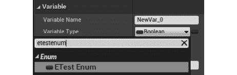

图 17.6：设置变量以使用 ETestEnum 变量类型。

它还将显示您可以在编辑器中对枚举调用的其他函数，就像这个例子一样：

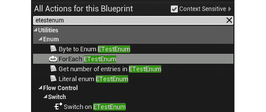

图 17.7：使用 BlueprintType 时可用的其他函数列表

### MAX

在使用枚举时，通常希望知道它有多少个值。在虚幻引擎 4 中，标准做法是将`MAX`添加为最后一个值，这将自动隐藏在编辑器中。

看一下以下示例：

```cpp
UENUM()
enum class ETestEnum : uint8
{
  EnumValue1,
  EnumValue2,
  EnumValue3,
  MAX
};
```

如果要知道 C++中`ETestEnum`有多少个值，只需执行以下操作：

```cpp
const int32 MaxCount = (int32)ETestEnum::MAX;
```

这是因为 C++中的枚举内部存储为数字，第一个值为`0`，第二个值为`1`，依此类推。这意味着只要`MAX`是最后一个值，它将始终具有枚举中的总值。需要考虑的一个重要事项是，为了使`MAX`给出正确的值，不能更改枚举的内部编号顺序，如下所示：

```cpp
UENUM()
enum class ETestEnum : uint8
{
  EnumValue1 = 4,
  EnumValue2 = 78,
  EnumValue3 = 100,
  MAX
};
```

在这种情况下，`MAX`将是`101`，因为它将使用紧接前一个值的数字，即`EnumValue3 = 100`。

使用`MAX`只能在 C++中使用，而不能在编辑器中使用，因为`MAX`值在蓝图中是隐藏的，如前所述。要在蓝图中获取枚举的条目数，应在`UENUM`宏中使用`BlueprintType`修饰符，以便在上下文菜单中公开一些有用的函数。之后，您只需要在上下文菜单中输入枚举的名称。如果选择`Get number of entries in ETestEnum`选项，将获得一个返回枚举条目数的函数。

在下一个练习中，您将在虚幻引擎 4 编辑器中使用 C++枚举。

## 练习 17.02：在虚幻引擎 4 编辑器中使用 C++枚举

在这个练习中，我们将创建一个使用`Third Person`模板的新 C++项目，并添加以下内容：

+   一个名为`EWeaponType`的枚举，包含`3`种武器-手枪、霰弹枪和火箭发射器。

+   一个名为`EAmmoType`的枚举，包含`3`种弹药类型-子弹、弹壳和火箭。

+   一个名为`Weapon`的变量，使用`EWeaponType`来告诉当前武器的类型。

+   一个名为`Ammo`的整数数组变量，保存每种类型的弹药数量，初始化值为`10`。

+   当玩家按下*1*、*2*和*3*键时，它将分别将`Weapon`设置为`Pistol`、`Shotgun`和`Rocket Launcher`。

+   当玩家按下*左鼠标按钮*时，这将消耗当前武器的弹药。

+   每次`Tick`函数调用时，角色将显示当前武器类型和相应的弹药类型和数量。

以下步骤将帮助您完成练习：

1.  使用 C++创建一个名为`Enumerations`的新`Third Person`模板项目，并将其保存到您选择的位置。

项目创建后，它应该同时打开编辑器和 Visual Studio 解决方案。

1.  关闭编辑器，返回 Visual Studio。

1.  打开`Enumerations.h`文件。

1.  创建一个名为`ENUM_TO_INT32`的宏，它将枚举转换为`int32`数据类型：

```cpp
#define ENUM_TO_INT32(Value) (int32)Value
```

1.  创建一个名为`ENUM_TO_FSTRING`的宏，它将获取`enum`数据类型的值的显示名称，并将其转换为`FString`数据类型：

```cpp
#define ENUM_TO_FSTRING(Enum, Value) FindObject<UEnum>(ANY_PACKAGE, TEXT(Enum), true)-  >GetDisplayNameTextByIndex((int32)Value).ToString()
```

1.  声明枚举`EWeaponType`和`EAmmoType`：

```cpp
UENUM(BlueprintType)
enum class EWeaponType : uint8
{
  Pistol UMETA(Display Name = «Glock 19»),
  Shotgun UMETA(Display Name = «Winchester M1897»),
  RocketLauncher UMETA(Display Name = «RPG»),    
  MAX
};
UENUM(BlueprintType)
enum class EAmmoType : uint8
{
  Bullets UMETA(DisplayName = «9mm Bullets»),
  Shells UMETA(Display Name = «12 Gauge Shotgun Shells»),
  Rockets UMETA(Display Name = «RPG Rockets»),
  MAX
};
```

1.  打开`EnumerationsCharacter.h`文件，包括`Enumerations.h`头文件：

```cpp
#include "Enumerations.h"
```

1.  声明受保护的`Weapon`变量，保存所选武器的武器类型：

```cpp
UPROPERTY(BlueprintReadOnly, Category = "Enumerations Character")
EWeaponType Weapon;
```

1.  声明受保护的`Ammo`数组，保存每种类型的弹药数量：

```cpp
UPROPERTY(EditDefaultsOnly, BlueprintReadOnly, Category =   "Enumerations Character")
TArray<int32> Ammo;
```

1.  声明`Begin Play`和`Tick`函数的受保护覆盖：

```cpp
virtual void BeginPlay() override;
virtual void Tick(float DeltaSeconds) override;
```

1.  声明受保护的输入函数：

```cpp
void OnPressedPistol();
void OnPressedShotgun();
void OnPressedRocketLauncher();
void OnPressedFire();
```

1.  打开`EnumerationsCharacter.cpp`文件，包括`DrawDebugHelpers.h`头文件：

```cpp
#include "DrawDebugHelpers.h"
```

1.  在`SetupPlayerInputController`函数的末尾绑定新的动作绑定，如下面的代码片段所示：

```cpp
PlayerInputComponent->BindAction("Pistol", IE_Pressed, this,   &AEnumerationsCharacter::OnPressedPistol);
PlayerInputComponent->BindAction("Shotgun", IE_Pressed, this,   &AEnumerationsCharacter::OnPressedShotgun);
PlayerInputComponent->BindAction("Rocket Launcher", IE_Pressed,   this, &AEnumerationsCharacter::OnPressedRocketLauncher);
PlayerInputComponent->BindAction("Fire", IE_Pressed, this,   &AEnumerationsCharacter::OnPressedFire);
```

1.  接下来，实现`BeginPlay`的重写，执行父逻辑，但也初始化`Ammo`数组的大小，大小为`EAmmoType`枚举中的条目数。数组中的每个位置也将初始化为值`10`：

```cpp
void AEnumerationsCharacter::BeginPlay()
{
  Super::BeginPlay();
  const int32 AmmoCount = ENUM_TO_INT32(EAmmoType::MAX);
  Ammo.Init(10, AmmoCount);
}
```

1.  实现`Tick`的重写：

```cpp
void AEnumerationsCharacter::Tick(float DeltaSeconds)
{
  Super::Tick(DeltaSeconds);
}
```

1.  将`Weapon`变量转换为`int32`，将`Weapon`变量转换为`FString`：

```cpp
const int32 WeaponIndex = ENUM_TO_INT32(Weapon);
const FString WeaponString = ENUM_TO_FSTRING("EWeaponType",   Weapon);
```

1.  将弹药类型转换为`FString`并获取当前武器的弹药数量：

```cpp
const FString AmmoTypeString = ENUM_TO_FSTRING("EAmmoType",   Weapon);
const int32 AmmoCount = Ammo[WeaponIndex];
```

我们使用`Weapon`来获取弹药类型字符串，因为`EAmmoType`中的条目与等效的`EWeaponType`的弹药类型匹配。换句话说，`Pistol = 0`使用`Bullets = 0`，`Shotgun = 1`使用`Shells = 1`，`RocketLauncher = 2`使用`Rockets = 2`，因此这是我们可以利用的一对一映射。

1.  在角色位置显示当前武器的名称及其对应的弹药类型和弹药数量，如下面的代码片段所示：

```cpp
const FString String = FString::Printf(TEXT("Weapon = %s\nAmmo   Type = %s\nAmmo Count = %d"), *WeaponString, *AmmoTypeString,   AmmoCount);
DrawDebugString(GetWorld(), GetActorLocation(), String, nullptr,   FColor::White, 0.0f, true);
```

1.  实现装备输入函数，将`Weapon`变量设置为相应的值：

```cpp
void AEnumerationsCharacter::OnPressedPistol()
{
  Weapon = EWeaponType::Pistol;
}
void AEnumerationsCharacter::OnPressedShotgun()
{
  Weapon = EWeaponType::Shotgun;
}
void AEnumerationsCharacter::OnPressedRocketLauncher()
{
  Weapon = EWeaponType::RocketLauncher;
}
```

1.  实现火力输入函数，该函数将使用武器索引获取相应的弹药类型计数，并减去`1`，只要结果值大于或等于 0：

```cpp
void AEnumerationsCharacter::OnPressedFire()
{
  const int32 WeaponIndex = ENUM_TO_INT32(Weapon);
  const int32 NewRawAmmoCount = Ammo[WeaponIndex] - 1;
  const int32 NewAmmoCount = FMath::Max(NewRawAmmoCount, 0);
  Ammo[WeaponIndex] = NewAmmoCount;
}
```

1.  编译代码并运行编辑器。

1.  转到`项目设置`，然后转到`引擎`，然后转到`输入`，并添加新的动作`绑定`：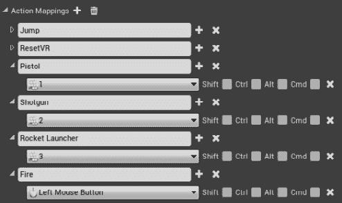

图 17.8：添加手枪、霰弹枪、火箭发射器和火焰绑定

1.  关闭`项目设置`。

1.  在单人模式下（一个客户端和禁用的专用服务器）中进行`New Editor Window (PIE)`游戏：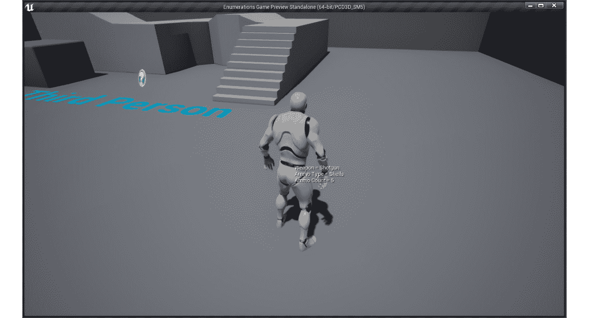

图 17.9：练习的最终结果

通过完成此练习，您将能够使用*1*、*2*和*3*键选择当前武器。您会注意到每次都会显示当前武器的类型及其对应的弹药类型和弹药数量。如果按下火键，这将减少当前武器的弹药数量，但不会低于`0`。

在下一节中，您将学习双向循环数组索引。

# 双向循环数组索引

有时，当您使用数组存储信息时，您可能希望以双向循环的方式迭代它。一个例子是射击游戏中的上一个/下一个武器逻辑，您在其中有一个包含武器的数组，并且希望能够以特定方向循环遍历它们，当您到达第一个或最后一个索引时，您希望循环回到最后一个和第一个索引。执行此示例的典型方法将是以下内容：

```cpp
AWeapon * APlayer::GetPreviousWeapon()
{
  if(WeaponIndex - 1 < 0)
  {
    WeaponIndex = Weapons.Num() - 1;
  }
  else WeaponIndex--;
  return Weapons[WeaponIndex];
}
AWeapon * APlayer::GetNextWeapon()
{
  if(WeaponIndex + 1 > Weapons.Num() - 1)
  {
    WeaponIndex = 0;
  }
  else WeaponIndex++;
  return Weapons[WeaponIndex];
}
```

在上述代码中，我们调整武器索引以在新武器索引超出武器数组限制时循环回来，这可能发生在两种情况下。第一种情况是玩家装备了库存中的最后一把武器并要求下一把武器。在这种情况下，它应该返回到第一把武器。

第二种情况是玩家装备了库存中的第一把武器并要求上一把武器。在这种情况下，它应该转到最后一把武器。

虽然示例代码有效，但仍然需要大量代码来解决这样一个微不足道的问题。为了改进这段代码，有一个数学公式将帮助您在一个函数中自动考虑这两种情况。它被称为模数（在 C++中表示为`%`运算符），它给出两个数字之间的余数。

那么我们如何使用模数来进行双向循环数组索引？让我们使用模数重写上一个例子：

```cpp
AWeapon * APlayer::GetNewWeapon(int32 Direction)
{
  const int32 WeaponCount = Weapons.Num();
  const int32 NewIndex = WeaponIndex + Direction;
  const in32 ClampedNewIndex = NewIndex % WeaponCount;
  WeaponIndex = (ClampedNewIndex + WeaponCount) % WeaponCount;
  return Weapons[WeaponIndex];
}
```

这是新版本，您可以立即看出它有点难以理解，但它更加功能齐全和紧凑。如果您不使用变量来存储每个操作的中间值，您可能可以将整个函数编写为一两行代码。

让我们分解前面的代码片段：

`const int WeaponCount = Weapons.Num()`：我们需要知道数组的大小，以确定它应该循环回`0`的索引。换句话说，如果`WeaponCount = 4`，那么数组具有索引`0`、`1`、`2`和`3`，这告诉我们索引 4 是应该回到`0`的截止索引。

`const int32 NewIndex = WeaponIndex + Direction`：这是未经夹紧到数组限制的新原始索引。`Direction`变量用于指示我们要导航数组的偏移量，如果我们想要上一个索引，则为`-1`，如果我们想要下一个索引，则为`1`。

`const int32 ClampedNewIndex = NewIndex % WeaponCount`：这将确保由于模数属性，`NewIndex`在`0`到`WeaponCount - 1`的区间内。

如果`Direction`总是`1`，那么`ClampedNewIndex`就足够了。问题是，当`WeaponIndex`为`0`且`Direction`为`-1`时，模运算不太适用于负值，这会导致`NewIndex`为`-1`。为了解决这个限制，我们需要进行一些额外的计算。

`WeaponIndex = (ClampedNewIndex + WeaponCount) % WeaponCount`：这将向`ClampedNewIndex`添加`WeaponCount`以使其为正，并再次应用模数以获得正确的夹紧索引，从而解决了问题。

`return Weapons[WeaponIndex]`：这将返回计算出的`WeaponIndex`索引位置的武器。

让我们看一个实际的例子来帮助你理解所有这些是如何工作的：

**武器** =

+   [0] 刀

+   [1] 手枪

+   [2] 霰弹枪

+   [3] 火箭发射器

`Weapons.Num() = 4`。

假设`WeaponIndex = 3`，`Direction = 1`。

然后：

`NewIndex` = *WeaponIndex + Direction* = 3 + 1 = 4

`ClampedIndex` = *NewIndex % WeaponCount* = 4 % 4 = 0

`WeaponIndex` = *(ClampedIndex + WeaponCount) % WeaponCount* = (0 + 4) % 4 = 0

在这个例子中，武器索引的起始值是`3`（火箭发射器），我们想要下一个武器（因为`Direction`是`1`）。进行计算，`WeaponIndex`现在将是`0`（刀）。这是期望的行为，因为我们有 4 个武器，所以我们回到了这种情况下，由于`Direction`是`1`，我们可以只使用`ClampedIndex`而不进行额外的计算。

让我们再次使用不同的值进行调试。

假设`WeaponIndex = 0`，`Direction = -1`：

`NewIndex` = *WeaponIndex + Direction* = 0 + -1 = -1

`ClampedIndex` = *NewIndex % WeaponCount *= -1 % 4 = -1

`WeaponIndex` = *(ClampedIndex + WeaponCount) % WeaponCount* = (-1 + 4) % 4 = 3

在这个例子中，武器索引的起始值为 0（刀），我们想要上一个武器（因为`Direction`是-`1`）。进行计算，`WeaponIndex`现在将是 3（火箭发射器）。这是期望的行为，因为我们有 4 个武器，所以我们回到了 3。在这种特定情况下，`NewIndex`是负数，所以我们不能只使用`ClampedIndex`；我们需要进行额外的计算来获得正确的值。

## Exercise 17.03: 使用双向循环数组索引在枚举之间循环

在这个练习中，我们将使用*Exercise17.02*，*在虚幻引擎 4 编辑器中使用 C++枚举*中的项目，并为武器循环添加两个新的动作映射。鼠标滚轮向上将转到上一个武器类型，鼠标滚轮向下将转到下一个武器类型。

以下步骤将帮助你完成练习：

1.  首先，从*Exercise 17.02*，*在虚幻引擎 4 编辑器中使用 C++枚举*中打开 Visual Studio 项目。

接下来，你将更新`Enumerations.h`并添加一个宏，该宏将以非常方便的方式处理双向数组循环，如下所示。

1.  打开`Enumerations.h`并添加`GET_CIRCULAR_ARRAY_INDEX`宏，该宏将应用我们已经讨论过的模数公式：

```cpp
#define GET_CIRCULAR_ARRAY_INDEX(Index, Count) (Index % Count +   Count) % Count
```

1.  打开`EnumerationsCharacter.h`并声明武器循环的新输入函数：

```cpp
void OnPressedPreviousWeapon();
void OnPressedNextWeapon();
```

1.  声明`CycleWeapons`函数，如下面的代码片段所示：

```cpp
void CycleWeapons(int32 Direction);
```

1.  打开`EnumerationsCharacter.cpp`并在`SetupPlayerInputController`函数中绑定新的动作绑定：

```cpp
PlayerInputComponent->BindAction("Previous Weapon", IE_Pressed,   this, &AEnumerationsCharacter::OnPressedPreviousWeapon);
PlayerInputComponent->BindAction("Next Weapon", IE_Pressed, this,   &AEnumerationsCharacter::OnPressedNextWeapon);
```

1.  现在，实现新的输入函数，如下面的代码片段所示：

```cpp
void AEnumerationsCharacter::OnPressedPreviousWeapon()
{
  CycleWeapons(-1);
}
void AEnumerationsCharacter::OnPressedNextWeapon()
{
  CycleWeapons(1);
}
```

在上面的代码片段中，我们定义了处理“上一个武器”和“下一个武器”动作映射的函数。每个函数都使用`CycleWeapons`函数，对于上一个武器使用方向为`-1`，对于下一个武器使用方向为`1`。

1.  实现`CycleWeapons`函数，根据当前武器索引和`Direction`参数进行双向循环。

```cpp
void AEnumerationsCharacter::CycleWeapons(int32 Direction)
{
  const int32 WeaponIndex = ENUM_TO_INT32(Weapon);
  const int32 AmmoCount = Ammo.Num();
  const int32 NextRawWeaponIndex = WeaponIndex + Direction;
  const int32 NextWeaponIndex = GET_CIRCULAR_ARRAY_INDEX(NextRawWeaponIndex , AmmoCount);
  Weapon = (EWeaponType)NextWeaponIndex;
}
```

在上面的代码片段中，我们实现了`CycleWeapons`函数，该函数使用模运算符根据提供的方向计算下一个有效武器索引。

1.  编译代码并运行编辑器。

1.  转到`Project Settings`，然后转到`Engine`，然后转到`Input`，并添加新的动作`绑定`：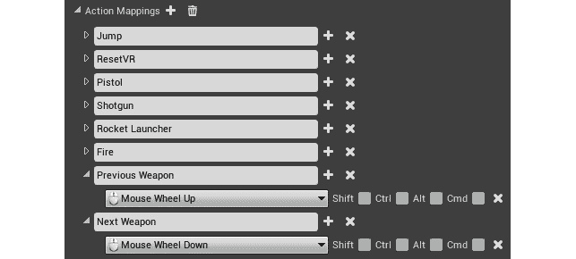

图 17.10：添加上一个武器和下一个武器绑定

1.  关闭`Project Settings`。

1.  现在，在单人模式下（一个客户端和禁用专用服务器）中播放`New Editor Window (PIE)`：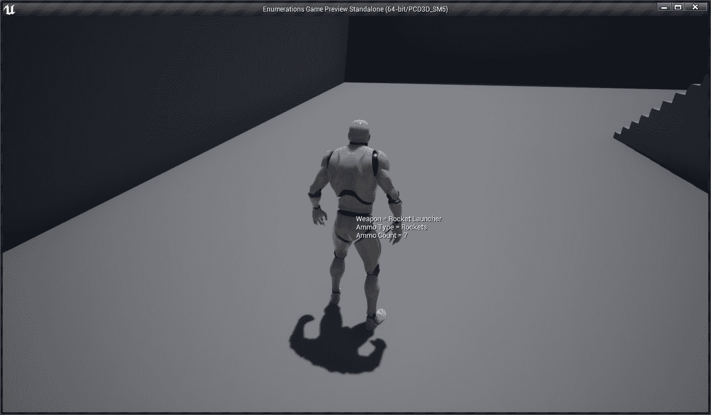

图 17.11：练习的最终结果

通过完成这个练习，您将能够使用鼠标滚轮在武器之间进行循环。如果选择火箭发射器并使用鼠标滚轮向下滚动到下一个武器，它将返回到手枪。如果使用鼠标滚轮向下滚动到上一个武器并选择手枪，它将返回到火箭发射器。

在下一个活动中，您将向我们在*第十六章*“多人游戏基础”中开始的多人 FPS 项目中添加武器和弹药的概念。

## 活动 17.01：向多人 FPS 游戏添加武器和弹药

在这个活动中，您将向我们在上一章活动中开始的多人 FPS 项目中添加武器和弹药的概念。您需要使用本章中介绍的不同类型的 RPC 来完成这个活动。

以下步骤将帮助您完成这个活动：

1.  从*Activity 16.01*“为多人 FPS 项目创建角色”中打开`MultiplayerFPS`项目。

1.  创建一个名为`Upper Body`的新`AnimMontage`插槽。

1.  从`Activity17.01\Assets`文件夹导入动画（`Pistol_Fire.fbx`，`MachineGun_Fire.fbx`和`Railgun_Fire.fbx`）到`Content\Player\Animations`。

注意

Assets 文件夹`Activity17.01\Assets`可以在我们的 GitHub 存储库中找到，网址为[`packt.live/2It4Plb`](https://packt.live/2It4Plb)。

1.  为`Pistol_Fire`，`MachineGun_Fire`和`Railgun_Fire`创建一个动画蒙太奇，并确保它们具有以下配置：

`Blend In`时间为`0.01`，`Blend Out`时间为`0.1`，并确保它使用`Upper Body`插槽。

`Blend In`时间为`0.01`，`Blend Out`时间为`0.1`，并确保它使用`Upper Body`插槽。

`Upper Body`插槽。

1.  从`Activity17.01\Assets`文件夹导入`SK_Weapon.fbx`，`NoAmmo.wav`，`WeaponChange.wav`和`Hit.wav`到`Content\Weapons`。

1.  从`Activity17.01\Assets`导入`Pistol_Fire_Sound.wav`到`Content\Weapons\Pistol`，并在`Pistol_Fire`动画的`AnimNotify` Play Sound 中使用它。

1.  创建一个名为`M_Pistol`的简单绿色材质，并将其放置在`Content\Weapons\Pistol`上。

1.  从`Activity17.01\Assets`导入`MachineGun_Fire_Sound.wav`到`Content\Weapons\MachineGun`，并在`MachineGun_Fire`动画中的`AnimNotify` Play Sound 中使用它。

1.  创建一个名为`M_MachineGun`的简单红色材质，并将其放置在`Content\Weapons\MachineGun`上。

1.  从`Activity17.01\Assets`导入`Railgun_Fire_Sound.wav`到`Content\Weapons\Railgun`，并在`Railgun_Fire`动画中使用`AnimNotify`播放声音。

1.  创建一个名为`M_Railgun`的简单白色材质，并将其放置在`Content\Weapons\Railgun`上。

1.  编辑`SK_Mannequin`骨骼网格，并从`hand_r`创建一个名为`GripPoint`的插槽，相对位置为（*X=-10.403845，Y=6.0，Z=-3.124871*），相对旋转为（*X=0.0，Y=0.0，Z=90.0*）。

1.  在`Project Settings`中添加以下输入映射，使用*第四章*，*玩家输入*中获得的知识：

+   射击（动作映射）：鼠标左键

+   上一个武器（动作映射）：鼠标滚轮向上

+   下一个武器（动作映射）：鼠标滚轮向下

+   手枪（动作映射）：1

+   机枪（动作映射）：2

+   Railgun（动作映射）：3

1.  在`MultiplayerFPS.h`中，创建`ENUM_TO_INT32(Enum)`宏，将枚举转换为`int32`，并创建`GET_CIRCULAR_ARRAY_INDEX(Index, Count)`，该宏使用双向循环数组索引将索引转换为在`0`和`-1`计数之间的索引。

1.  创建一个名为`EnumTypes.h`的头文件，其中包含以下枚举：

**EWeaponType**：手枪，机枪，电磁炮，最大

**EWeaponFireMode**：单发，自动

**EAmmoType**：子弹，弹丸，最大

1.  创建一个 C++类`Weapon`，它继承自`Actor`类，具有名为`Mesh`的骨骼网格组件作为根组件。在变量方面，它存储名称、武器类型、弹药类型、射击模式、命中扫描范围、命中扫描伤害、射速、开火时使用的动画蒙太奇以及无弹药时播放的声音。在功能方面，它需要能够开始射击（也需要停止射击，因为是自动射击模式），检查玩家是否能够开火。如果可以，它会在所有客户端上播放射击动画，并使用提供的长度在摄像机位置和方向进行一条线的射线检测，以对其命中的角色造成伤害。如果没有弹药，它将仅在拥有客户端上播放声音。

1.  编辑`FPSCharacter`以支持`Fire`、`Previous/Next Weapon`、`Pistol`、`Machine Gun`和`Railgun`的新映射。在变量方面，它需要存储每种类型的弹药数量，当前装备的武器，所有武器类和生成的实例，命中其他玩家时播放的声音，以及更换武器时的声音。在功能方面，它需要能够装备/循环/添加武器，管理弹药（添加、移除和获取），处理角色受伤时，在所有客户端上播放动画蒙太奇，并在拥有客户端上播放声音。

1.  从`AWeapon`创建`BP_Pistol`，将其放置在`Content\Weapons\Pistol`上，并使用以下值进行配置：

+   骨骼网格：`Content\Weapons\SK_Weapon`

+   材质：`Content\Weapons\Pistol\M_Pistol`

+   名称：`手枪 Mk I`

+   武器类型：`手枪`，弹药类型：`子弹`，射击模式：`自动`

+   命中扫描范围：`9999.9`，命中扫描伤害：`5.0`，射速：`0.5`

+   射击动画蒙太奇：`Content\Player\Animations\Pistol_Fire_Montage`

+   无弹药声音：`Content\Weapons\NoAmmo`

1.  从`AWeapon`创建`BP_MachineGun`，并将其放置在`Content\Weapons\MachineGun`上，并使用以下值进行配置：

+   骨骼网格：`Content\Weapons\SK_Weapon`

+   材质：`Content\Weapons\MachineGun\M_MachineGun`

+   名称：`机枪 Mk I`

+   武器类型：`机枪`，弹药类型：`子弹`，射击模式：`自动`

+   命中扫描范围：`9999.9`，命中扫描伤害：`5.0`，射速：`0.1`

+   射击动画蒙太奇：`Content\Player\Animations\MachineGun_Fire_Montage`

+   无弹药声音：`Content\Weapons\NoAmmo`

1.  从`AWeapon`创建`BP_Railgun`，并将其放置在`Content\Weapons\Railgun`上，并使用以下值进行配置：

+   骨骼网格：`Content\Weapons\SK_Weapon`

+   材质：`Content\Weapons\Railgun\M_Railgun`

+   名称：电磁炮`Mk I`，武器类型：`电磁炮`，弹药类型：`弹丸`，射击模式：`单发`

+   命中扫描范围：`9999.9`，命中扫描伤害：`100.0`，射速：`1.5`

+   开火动画蒙太奇：`Content\Player\Animations\Railgun_Fire_Montage`

+   无弹药声音：`Content\Weapons\NoAmmo`

1.  使用以下数值配置`BP_Player`：

+   武器类（索引 0：`BP_Pistol`，索引 1：`BP_MachineGun`，索引 2：`BP_Railgun`）。

+   命中声音：`Content\Weapons\Hit`。

+   武器切换声音：`Content\Weapons\WeaponChange`。

+   使网格组件阻止可见性通道，以便可以被武器的 hitscan 命中。

+   编辑`ABP_Player`，使用`Layered Blend Per Bone`节点，在`spine_01`骨骼上启用`Mesh Space Rotation Blend`，以便上半身动画使用上半身插槽。

+   编辑`UI_HUD`，使其在屏幕中央显示一个白色点十字准星，以及当前武器和弹药数量在健康和护甲指示器下方：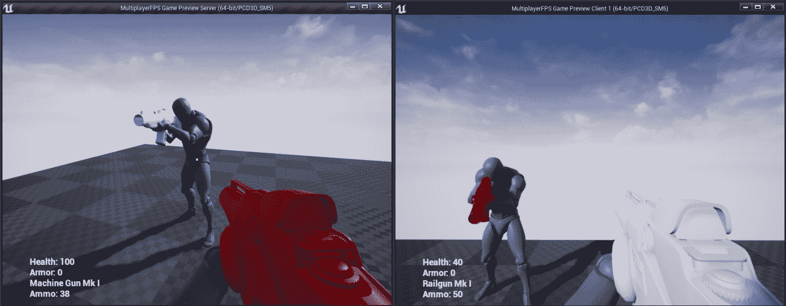

图 17.12：活动的预期结果

结果应该是一个项目，其中每个客户端都将拥有带弹药的武器，并且能够使用它们来射击和伤害其他玩家。您还可以使用*1*、*2*和*3*键以及鼠标滚轮向上和向下来选择武器。

注意：

此活动的解决方案可在以下网址找到：https://packt.live/338jEBx。

# 总结

在本章中，您学会了如何使用 RPC 允许服务器和客户端在彼此上执行逻辑。我们还学习了在虚幻引擎 4 中如何使用`UENUM`宏以及如何使用双向循环数组索引，这有助于您在两个方向上迭代数组，并在超出其索引限制时循环。

完成本章的活动后，您将拥有一个基本的可玩游戏，玩家可以互相射击和切换武器，但我们仍然可以添加更多内容，使游戏变得更加有趣。

在下一章中，我们将了解最常见的游戏框架类的实例在多人游戏中存在的位置，以及了解我们尚未涵盖的 Player State 和 Game State 类。我们还将介绍一些在多人游戏中使用的游戏模式中的新概念，以及一些有用的通用内置功能。
