# 第十八章：18. 多人游戏中的游戏框架类

概述

在本章中，您将学习游戏框架类的实例在多人游戏中的存在位置。您还将学习如何使用游戏状态和玩家状态类，以及游戏模式中的一些新概念，包括比赛状态。我们还将介绍一些可用于不同类型游戏的有用内置功能。

在本章结束时，您将能够使用游戏状态和玩家状态类来存储关于游戏和特定玩家的信息，这些信息可以被任何客户端访问。您还将了解如何充分利用游戏模式类和其他相关功能。

# 介绍

在上一章中，我们介绍了*远程过程调用*，它允许服务器和客户端在彼此上执行远程函数。我们还介绍了枚举和*双向循环数组索引*。

在本章中，我们将看看最常见的游戏框架类，并了解它们在多人游戏环境中的实例存在位置。这很重要，这样您就知道在特定游戏实例中可以访问哪些实例。例如，只有服务器应该能够访问游戏模式实例，因此如果您在玩《堡垒之夜》，玩家就不应该能够访问它并修改游戏规则。

在本章中，我们还将涵盖游戏状态和玩家状态类。顾名思义，这些类存储有关游戏状态和每个玩家的信息。最后，在本书的末尾，我们将介绍游戏模式中的一些新概念，以及一些有用的内置功能。

我们将从多人游戏中游戏框架类的工作方式开始。

# 多人游戏中的游戏框架类

虚幻引擎 4 带有一个游戏框架，它是一组类，允许您更轻松地创建游戏。游戏框架通过提供内置的常见功能来实现这一点，这些功能在大多数游戏中都存在，例如定义游戏规则的方法（游戏模式），以及控制角色的方法（玩家控制器和 pawn/character 类）。在多人游戏环境中创建游戏框架类的实例时，它可以存在于服务器、客户端和拥有客户端，即其玩家控制器作为该实例的所有者的客户端。这意味着游戏框架类的实例将始终属于以下类别之一：

+   **仅服务器**：该类的实例将只存在于服务器。

+   **服务器和客户端**：该类的实例将存在于服务器和客户端。

+   **服务器和拥有客户端**：该类的实例将存在于服务器和拥有客户端。

+   **仅拥有客户端**：该类的实例只存在于拥有客户端。

看一下以下图表，显示了每个类别以及游戏框架中最常见类的目的：

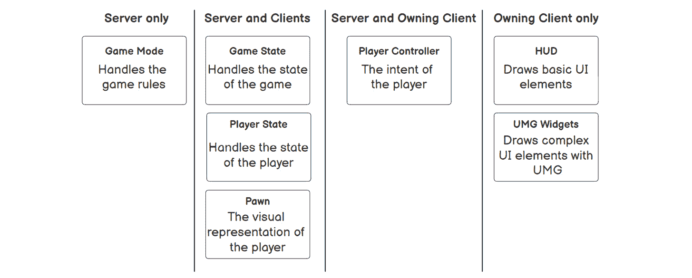

图 18.1：最常见的游戏框架类分成类别

让我们更详细地了解前面图表中每个类：

+   **游戏模式（仅服务器）**：游戏模式类定义游戏规则，其实例只能被服务器访问。如果客户端尝试访问它，实例将始终无效，以防止客户端更改游戏规则。

+   **游戏状态（服务器和客户端）**：游戏状态类存储游戏的状态，其实例可以被服务器和客户端访问。游戏状态将在未来的主题中更深入地讨论。

+   **Player State（服务器和客户端）**：Player State 类存储玩家的状态，其实例可以被服务器和客户端访问。Player State 将在未来的主题中更深入地介绍。

+   **Pawn（服务器和客户端）**：Pawn 类是玩家的视觉表示，其实例可以被服务器和客户端访问。

+   使用`UGameplayStatics::GetPlayerController`函数并指定除`0`以外的索引（将返回其玩家控制器），返回的实例将始终无效。这意味着服务器是唯一可以访问所有玩家控制器的地方。您可以通过调用`AController::IsLocalController`函数来查找玩家控制器实例是否在其拥有客户端。

+   **HUD（仅拥有客户端）**：HUD 类用作在屏幕上绘制基本形状和文本的即时模式。由于它用于 UI，因此其实例仅在拥有客户端上可用，因为服务器和其他客户端不需要知道它。

+   **UMG 小部件（仅拥有客户端）**：UMG 小部件类用于在屏幕上显示复杂的 UI。由于它用于 UI，因此其实例仅在拥有客户端上可用，因为服务器和其他客户端不需要知道它。

为了帮助您理解这些概念，我们可以以 Dota 2 为例。游戏模式定义了游戏的不同阶段（*英雄选择的前期游戏，实际游戏以及赢家的后期游戏*），最终目标是摧毁对方团队的远古。由于这是对游戏玩法至关重要的类，客户端不能访问它：

+   游戏状态存储经过的时间、白天或黑夜、每个队伍的得分等，因此服务器和客户端需要能够访问它。

+   玩家状态存储玩家的名称、选择的英雄以及击杀/死亡/协助比率，因此服务器和客户端需要能够访问它。

+   角色将是英雄、信使、幻象等，由玩家控制，因此服务器和客户端需要能够访问它。

+   玩家控制器是将输入信息传递给受控制的 pawn 的组件，因此只有服务器和拥有客户端需要能够访问它。

+   UI 类（`HUD`和`User`小部件）将在拥有客户端上显示所有信息，因此只需要在那里访问。

在下一个练习中，您将显示最常见的游戏框架类的实例值。

## 练习 18.01：显示游戏框架实例值

在这个练习中，我们将创建一个使用第三人称模板的新 C++项目，并添加以下内容：

+   在拥有客户端上，玩家控制器创建并添加到视口一个简单的 UMG 小部件，用于显示菜单实例的名称。

+   在`Tick`函数中，角色显示其自己实例的值（作为 pawn），以及是否具有游戏模式、游戏状态、玩家状态、玩家控制器和 HUD 的有效实例。

注意

如果需要，您可以回顾一下*第一章*，*虚幻引擎介绍*，以了解`Tick`函数。

以下步骤将帮助您完成练习：

1.  使用`C++`创建一个名为`GFInstances`（如游戏框架实例）的新`Third Person`模板项目，并将其保存在您选择的位置。创建项目后，它应该会打开编辑器以及 Visual Studio 解决方案。

1.  在编辑器中，创建一个名为`GFInstancePlayerController`的新`C++`类，该类派生自`PlayerController`。等待编译结束，关闭编辑器，然后返回 Visual Studio。

1.  打开`GFInstancesCharacter.h`文件，并声明`Tick`函数的受保护覆盖：

```cpp
virtual void Tick(float DeltaSeconds) override;
```

1.  打开`GFInstancesCharacter.cpp`文件，并包括`DrawDebugHelpers.h`和`PlayerController.h`：

```cpp
#include "DrawDebugHelpers.h"
#include "GameFramework/PlayerController.h"
```

1.  实现`Tick`函数：

```cpp
void AGFInstancesCharacter::Tick(float DeltaSeconds)
{
  Super::Tick(DeltaSeconds);
}
```

1.  获取游戏模式、游戏状态、玩家控制器和 HUD 的实例：

```cpp
AGameModeBase* GameMode = GetWorld()->GetAuthGameMode();
AGameStateBase* GameState = GetWorld()->GetGameState();
APlayerController* PlayerController =   Cast<APlayerController>(GetController());
AHUD* HUD = PlayerController != nullptr ? PlayerController-  >GetHUD() : nullptr;
```

在前面的代码片段中，我们将游戏模式、游戏状态、玩家控制器和 HUD 的实例存储在单独的变量中，以便我们可以检查它们是否有效。

1.  为每个游戏框架类创建一个字符串：

```cpp
const FString GameModeString = GameMode != nullptr ?   TEXT("Valid") : TEXT("Invalid");
const FString GameStateString = GameState != nullptr ?   TEXT("Valid") : TEXT("Invalid");
const FString PlayerStateString = GetPlayerState() != nullptr ?   TEXT("Valid") : TEXT("Invalid");
const FString PawnString = GetName();
const FString PlayerControllerString = PlayerController !=   nullptr ? TEXT("Valid") : TEXT("Invalid");
const FString HUDString = HUD != nullptr ? TEXT("Valid") :   TEXT("Invalid");
```

在这里，我们创建字符串来存储角色的名称以及其他游戏框架实例是否有效。

1.  在屏幕上显示每个字符串：

```cpp
const FString String = FString::Printf(TEXT("Game Mode = %s\nGame   State = %s\nPlayerState = %s\nPawn = %s\nPlayer Controller =   %s\nHUD = %s"), *GameModeString, *GameStateString,   *PlayerStateString, *PawnString, *PlayerControllerString,   *HUDString);
DrawDebugString(GetWorld(), GetActorLocation(), String, nullptr,   FColor::White, 0.0f, true);
```

在此代码片段中，我们打印了在前面的代码中创建的字符串，这些字符串指示了角色的名称以及其他游戏框架实例是否有效。

1.  在我们可以继续使用`AGFInstancesPlayerController`类之前，我们需要告诉虚幻引擎我们想要使用 UMG 功能，以便能够使用`UUserWidget`类。为此，我们需要打开`GFInstances.Build.cs`并将`UMG`添加到`PublicDependencyModuleNames`字符串数组中，如下所示：

```cpp
PublicDependencyModuleNames.AddRange(new string[] { "Core",   "CoreUObject", "Engine", "InputCore", "HeadMountedDisplay",   "UMG" });
```

如果尝试编译并从添加新模块中获得错误，则清理并重新编译项目。如果这样不起作用，请尝试重新启动您的 IDE。

1.  打开`GFInstancesPlayerController.h`并添加保护变量以创建 UMG 小部件：

```cpp
UPROPERTY(EditDefaultsOnly, BlueprintReadOnly, Category = "GF   Instance Player Controller")
TSubclassOf<UUserWidget> MenuClass;
UPROPERTY()
UUserWidget* Menu;
```

1.  声明`BeginPlay`函数的受保护覆盖：

```cpp
virtual void BeginPlay() override;
```

1.  打开`GFInstancesPlayerController.cpp`并包括`UserWidget.h`：

```cpp
#include "Blueprint/UserWidget.h"
```

1.  实现`BeginPlay`函数：

```cpp
void AGFInstancePlayerController::BeginPlay()
{
  Super::BeginPlay();
}
```

1.  如果不是拥有客户端或菜单类无效，则中止函数：

```cpp
if (!IsLocalController() || MenuClass == nullptr)
{
  return;
}
```

1.  创建小部件并将其添加到视口：

```cpp
Menu = CreateWidget<UUserWidget>(this, MenuClass);
if (Menu != nullptr)
{
  Menu->AddToViewport(0);
}
```

1.  编译并运行代码。

1.  在`Content Browser`中，转到`Content`文件夹，创建一个名为`UI`的新文件夹，并打开它。

1.  创建一个名为`UI_Menu`的新小部件蓝图并打开它。

1.  在根画布面板中添加一个名为`tbText`的`Text Block`并通过在详细面板顶部的其名称旁边点击复选框`Is Variable`来将其设置为变量。

1.  将`tbText`设置为`Size To Content`为`true`。

1.  转到`Graph`部分，在`Event Graph`中以以下方式实现`Event Construct`：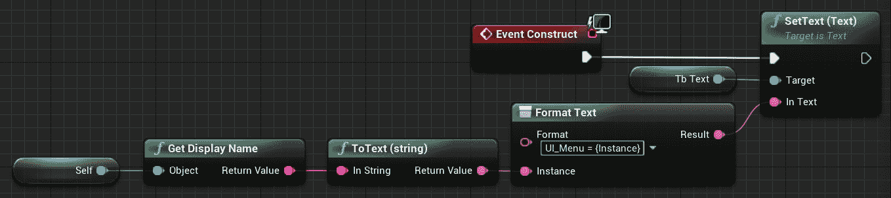

图 18.2：显示 UI_Menu 实例名称的 Event Construct

注意

您可以在以下链接找到前面的完整分辨率截图以便更好地查看：[`packt.live/38wvSr5`](https://packt.live/38wvSr5)。

1.  保存并关闭`UI_Menu`。

1.  转到`Content`文件夹并创建一个名为`BP_PlayerController`的蓝图，该蓝图派生自`GFInstancesPlayerController`。

1.  打开`BP_PlayerController`并设置`Menu` `Class`以使用`UI_Menu`。

1.  保存并关闭`BP_PlayerController`。

1.  转到`Content`文件夹并创建一个名为`BP_GameMode`的蓝图，该蓝图派生自`GFInstancesGameMode`。

1.  打开`BP_GameMode`并设置`Player Controller` `Class`以使用`BP_PlayerController`。

1.  保存并关闭`BP_GameMode`。

1.  转到`项目设置`并从左侧面板选择`地图和模式`，该面板位于`项目`类别中。

1.  将`Default` `GameMode`设置为使用`BP_GameMode`。

1.  关闭`项目设置`。

最后，您可以测试项目。

1.  运行代码并等待编辑器完全加载。

1.  转到`多人游戏选项`并将客户端数量设置为`2`。

1.  将窗口大小设置为`800x600`。

1.  在`新编辑器窗口（PIE）`中播放。

完成此练习后，您将能够在每个客户端上进行游戏。您会注意到角色是否显示游戏模式、游戏状态、玩家状态、玩家控制器和 HUD 的实例是否有效。它还显示了角色实例的名称。

现在，让我们分析在`服务器`和`客户端 1`窗口中显示的值。让我们先从`服务器`窗口开始。

## 服务器窗口

在“服务器”窗口中，您可以看到“服务器角色”的值，在背景中，您可以看到“客户端 1 角色”的值。您应该能够在左上角看到“服务器角色”，“客户端 1 角色”和`UI_Menu`UMG 小部件。UMG 小部件实例仅为“服务器角色”的玩家控制器创建，因为它是该窗口中实际控制角色的唯一玩家控制器。

让我们首先分析“服务器角色”的值。

## 服务器角色

这是监听服务器的角色，它是一个同时具有客户端的服务器，也可以玩游戏。显示在该角色上的值如下：

+   游戏模式=有效，因为游戏模式实例只存在于服务器上，这是当前游戏实例。

+   游戏状态=有效，因为游戏状态实例存在于客户端和服务器上，这是当前游戏实例。

+   玩家状态=有效，因为玩家状态实例存在于客户端和服务器上，这是当前游戏实例。

+   Pawn=ThirdPersonCharacter_2，因为 pawn 实例存在于客户端和服务器上，这是当前游戏实例。

+   玩家控制器=有效，因为玩家控制器实例存在于拥有的客户端和服务器上，这是当前游戏实例。

+   HUD=有效，因为 HUD 实例只存在于拥有的客户端上，这是情况。

接下来，我们将在同一窗口中查看“客户端 1 角色”。

## 客户端 1 角色

这是“客户端 1”正在控制的角色。显示在该角色上的值如下：

+   游戏模式=有效，因为游戏模式实例只存在于服务器上，这是当前游戏实例。

+   游戏状态=有效，因为游戏状态实例存在于客户端和服务器上，这是当前游戏实例。

+   玩家状态=有效，因为玩家状态实例存在于客户端和服务器上，这是当前游戏实例。

+   Pawn=ThirdPersonCharacter_0，因为 pawn 实例存在于客户端和服务器上，这是当前游戏实例。

+   玩家控制器=有效，因为玩家控制器实例存在于拥有的客户端和服务器上，这是当前游戏实例。

+   HUD=无效，因为 HUD 实例只存在于拥有的客户端上，这不是情况。

## 客户端 1 窗口

在“客户端 1”窗口中，您可以看到“客户端 1 角色”的值，在背景中，您可以看到“服务器角色”的值。您应该能够在左上角看到“客户端 1 角色”，“服务器角色”和`UI_Menu`UMG 小部件。UMG 小部件实例仅为“客户端 1 角色”的玩家控制器创建，因为它是该窗口中实际控制角色的唯一玩家控制器。

让我们首先分析“客户端 1 角色”的值。

## 客户端 1 角色

这是“客户端 1”正在控制的角色。显示在该角色上的值如下：

+   游戏模式=无效，因为游戏模式实例只存在于服务器上，这不是当前游戏实例。

+   游戏状态=有效，因为游戏状态实例存在于服务器和客户端上，这是当前游戏实例。

+   玩家状态=有效，因为玩家状态实例存在于服务器和客户端上，这是当前游戏实例。

+   Pawn=ThirdPersonCharacter_0，因为 pawn 实例存在于服务器和客户端上，这是当前游戏实例。

+   玩家控制器=有效，因为玩家控制器实例存在于服务器和拥有的客户端上，这是当前游戏实例。

+   HUD=有效，因为 HUD 实例只存在于拥有的客户端上，这是情况。

接下来，我们将在同一窗口中查看“服务器角色”。

## 服务器角色

这是监听服务器控制的角色。显示在该角色上的值如下：

+   **游戏模式 = 无效**，因为游戏模式实例仅存在于服务器，而不是当前游戏实例。

+   **Game State = 有效**，因为游戏状态实例存在于服务器和客户端，即当前游戏实例。

+   **Player State = 有效**，因为玩家状态实例存在于服务器和客户端，即当前游戏实例。

+   **Pawn = ThirdPersonCharacter_2**，因为 pawn 实例存在于服务器和客户端，即当前游戏实例。

+   **Player Controller = 无效**，因为玩家控制器实例存在于服务器和拥有的客户端，而不是当前游戏实例。

+   **HUD = 无效**，因为 HUD 实例仅存在于拥有的客户端，这不是情况。

通过完成这个练习，您应该更好地理解游戏框架类的每个实例存在和不存在的位置。接下来，我们将介绍玩家状态和游戏状态类，以及游戏模式和有用的内置功能的一些额外概念。

# 游戏模式、玩家状态和游戏状态

到目前为止，我们已经涵盖了游戏框架中的大部分重要类，包括游戏模式、玩家控制器和 pawn。在本章中，我们将涵盖玩家状态、游戏状态以及游戏模式的一些额外概念，以及一些有用的内置功能。

## 游戏模式

我们已经讨论了游戏模式及其工作原理，但还有一些概念尚未涵盖。

### 构造函数

要设置默认类值，可以使用构造函数如下：

```cpp
ATestGameMode::ATestGameMode()
{
  DefaultPawnClass = AMyCharacter::StaticClass();
  PlayerControllerClass = AMyPlayerController::StaticClass();
  PlayerStateClass = AMyPlayerState::StaticClass();
  GameStateClass = AMyGameState::StaticClass();
}
```

前面的代码允许您指定在使用此游戏模式时生成 pawn、player controller、player state 和 game state 时要使用的类。

**获取游戏模式实例**

如果要访问游戏模式实例，您需要使用以下代码从`GetWorld`函数中获取它：

```cpp
AGameModeBase* GameMode = GetWorld()->GetAuthGameMode();
```

前面的代码允许您访问当前游戏模式实例，以便您可以运行函数并查询某些变量的值。您必须确保仅在服务器上调用它，因为出于安全原因，这将在客户端上无效。

**比赛状态**

到目前为止，我们只使用了`AGameModeBase`类，这是框架中最基本的游戏模式类，虽然对于某些类型的游戏来说已经足够了，但在某些情况下，您可能需要更多的功能。例如，如果我们想要做一个大厅系统，只有当所有玩家标记为准备好时比赛才开始。使用`AGameModeBase`类无法实现这个例子。对于这些情况，最好使用`AGameMode`类，它是`AGameModeBase`的子类，通过使用比赛状态来支持多人比赛。比赛状态的工作方式是使用状态机，该状态机在给定时间内只能处于以下状态之一：

+   `EnteringMap`：这是当世界仍在加载并且角色尚未开始计时时的起始状态。一旦世界加载完成，它将转换到`WaitingToStart`状态。

+   `WaitingToStart`：当世界加载完成并且角色正在计时时，设置此状态，尽管玩家的 pawn 尚未生成，因为游戏尚未开始。当状态机进入此状态时，它将调用`HandleMatchIsWaitingToStart`函数。如果`ReadyToStartMatch`函数返回`true`，或者在代码中的某个地方调用了`StartMatch`函数，状态机将转换到`InProgress`状态。

+   `InProgress`：这是实际游戏发生的状态。当状态机进入此状态时，它将为玩家生成 pawn，对世界中的所有角色调用`BeginPlay`，并调用`HandleMatchHasStarted`函数。如果`ReadyToEndMatch`函数返回`true`或者在代码中的某个地方调用了`EndMatch`函数，状态机将转换到`WaitingPostMatch`状态。

+   `WaitingPostMatch`：比赛结束时设置此状态。当状态机进入此状态时，它将调用`HandleMatchHasEnded`函数。在此状态下，角色仍在进行计时，但新玩家无法加入。当开始卸载世界时，它将转换到`LeavingMap`状态。

+   `LeavingMap`：在卸载世界时设置此状态。当状态机进入此状态时，它将调用`HandleLeavingMap`函数。当开始加载新级别时，状态机将转换到`EnteringMap`状态。

+   `Aborted`：这是一个失败状态，只能通过调用`AbortMatch`函数来设置，该函数用于标记某些阻止比赛进行的错误。

为了帮助您更好地理解这些概念，我们可以再次以 Dota 2 为例：

+   `EnteringMap`：地图加载时，状态机将处于此状态。

+   `WaitingToStart`：一旦地图加载并且玩家正在选择他们的英雄，状态机将处于此状态。`ReadyToStartMatch`函数将检查所有玩家是否已选择他们的英雄；如果是，则比赛可以开始。

+   `InProgress`：当游戏实际进行时，状态机将处于此状态。玩家控制他们的英雄进行农场和与其他玩家的战斗。`ReadyToEndMatch`函数将不断检查每个远古生命值，以查看它们是否被摧毁；如果是，则比赛结束。

+   `WaitingPostMatch`：游戏结束时，状态机将处于此状态，您将看到被摧毁的远古和每个玩家的最终得分。

+   `LeavingMap`：在卸载地图时，状态机将处于此状态。

+   `Aborted`：如果其中一个玩家在初始阶段未能连接，因此中止整个比赛，状态机将处于此状态。

**重新生成玩家**

当玩家死亡并且您想要重新生成它时，通常有两种选择。第一种选择是重用相同的 pawn 实例，手动将其状态重置为默认值，并将其传送到重生位置。第二个选择是销毁 pawn 并生成一个新的，它将已经重置其状态。如果您喜欢后一种选择，那么`AGameModeBase::RestartPlayer`函数将处理为某个玩家控制器生成一个新的 pawn 实例的逻辑，并将其放置在玩家起始点。

需要考虑的一件重要事情是，该函数仅在玩家控制器尚未拥有 pawn 的情况下生成新的 pawn 实例，因此在调用`RestartPlayer`之前，请务必销毁受控 pawn。

看一下以下示例：

```cpp
void ATestGameMode::OnDeath(APlayerController* VictimController)
{
  if(VictimController == nullptr)
  {
    return;
  }

  APawn* Pawn = VictimController->GetPawn();
  if(Pawn != nullptr)
  {
    Pawn->Destroy();
  }

  RestartPlayer(VicitimController);
}
```

在上述代码中，我们有`OnDeath`函数，它获取死亡玩家的玩家控制器，销毁其受控 pawn，并调用`RestartPlayer`函数在玩家起始点生成一个新实例。默认情况下，使用的玩家起始点 actor 将始终与第一次生成玩家的玩家相同。如果要使函数在随机玩家起始点生成，则需要重写`AGameModeBase::ShouldSpawnAtStartSpot`函数并强制其返回`false`，如下所示：

```cpp
bool ATestGameMode::ShouldSpawnAtStartSpot(AController* Player)
{
  return false;
}
```

上述代码将使游戏模式使用随机玩家起始点，而不是始终使用相同的。

注意

有关游戏模式的更多信息，请访问[`docs.unrealengine.com/en-US/Gameplay/Framework/GameMode/#gamemodes`](https://docs.unrealengine.com/en-US/Gameplay/Framework/GameMode/#gamemodes)和[`docs.unrealengine.com/en-US/API/Runtime/Engine/GameFramework/AGameMode/index.html`](https://docs.unrealengine.com/en-US/API/Runtime/Engine/GameFramework/AGameMode/index.html)。

## 玩家状态

玩家状态类存储玩家的状态，例如当前得分、击杀/死亡和拾取的金币。它主要用于多人模式，以存储其他客户端需要了解的有关玩家的信息，因为它们无法访问其玩家控制器。最常用的内置变量是`PlayerName`、`Score`和`Ping`，分别提供玩家的名称、得分和延迟。

多人射击游戏中的记分牌条目是使用玩家状态的一个很好的例子，因为每个客户端都需要知道所有玩家的名称、击杀/死亡和延迟。玩家状态实例可以通过以下方式访问：

**AController::PlayerState**

此变量与控制器相关联的玩家状态，只能由服务器和拥有的客户端访问。以下示例将演示如何使用该变量：

```cpp
APlayerState* PlayerState = Controller->PlayerState;
```

**AController::GetPlayerState()**

该函数返回与控制器相关联的玩家状态，只能由服务器和拥有的客户端访问。该函数还有一个模板版本，因此您可以将其转换为自定义的玩家状态类。以下示例将演示如何使用该函数的默认版本和模板版本。

```cpp
// Default version
APlayerState* PlayerState = Controller->GetPlayerState();
// Template version
ATestPlayerState* MyPlayerState = Controller->GetPlayerState<ATestPlayerState>();
```

**APawn::GetPlayerState()**

该函数返回与控制器相关联的玩家状态，可以由服务器和客户端访问。该函数还有一个模板版本，因此您可以将其转换为自定义的玩家状态类。以下示例将演示如何使用该函数的默认版本和模板版本：

```cpp
// Default version
APlayerState* PlayerState = Pawn->GetPlayerState();
// Template version
ATestPlayerState* MyPlayerState = Pawn-  >GetPlayerState<ATestPlayerState>();
```

上述代码演示了您可以使用`GetPlayerState`函数的两种方式。您可以使用默认的`APlayerState`版本，也可以使用自动为您转换的模板版本。

**AGameState::PlayerArray**

此变量存储每个玩家的玩家状态实例，可以在服务器和客户端上访问。以下示例将演示如何使用此变量：

```cpp
TArray<APlayerState*> PlayerStates = GameState->PlayerArray;
```

为了帮助您更好地理解这些概念，我们可以再次以 Dota 2 为例。玩家状态至少应具有以下变量：

**名称**：玩家的名称

**英雄**：所选英雄

**生命值**：英雄的生命值

**法力**：英雄的法力

**统计**：英雄统计

**等级**：英雄当前所在的等级

**击杀/死亡/助攻**：玩家的击杀/死亡/助攻比例

注意

有关玩家状态的更多信息，请访问[`docs.unrealengine.com/en-US/API/Runtime/Engine/GameFramework/APlayerState/index.html`](https://docs.unrealengine.com/en-US/API/Runtime/Engine/GameFramework/APlayerState/index.html)。

## 游戏状态

游戏状态类存储游戏的状态，包括比赛经过的时间和赢得比赛所需的得分。它主要用于多人模式，以存储其他客户端需要了解的有关游戏的信息，因为它们无法访问游戏模式。最常用的变量是`PlayerArray`，它是一个包含每个连接客户端的玩家状态的数组。多人射击游戏中的记分牌是使用游戏状态的一个很好的例子，因为每个客户端都需要知道赢得比赛所需的击杀数，以及每个玩家的名称和延迟。

游戏状态实例可以通过以下方式访问：

**UWorld::GetGameState()**

此函数返回与世界关联的游戏状态，并且可以在服务器和客户端上访问。此函数还有一个模板化版本，因此您可以将其转换为自己的自定义游戏状态类。以下示例将演示如何使用此函数的默认和模板版本：

```cpp
// Default version
AGameStateBase* GameState = GetWorld()->GetGameState();
// Template version
AMyGameState* MyGameState = GetWorld()->GetGameState<AMyGameState>();
```

AGameModeBase::GameState

此变量具有与游戏模式关联的游戏状态，并且只能在服务器上访问。以下示例将演示如何使用该变量：

```cpp
AGameStateBase* GameState = GameMode->GameState;
```

AGameModeBase::GetGameState()

此函数返回与游戏模式关联的游戏状态，只能在服务器上访问。此函数还有一个模板化版本，因此您可以将其转换为自己的自定义游戏状态类。以下示例将演示如何使用此函数的默认和模板版本：

```cpp
// Default version
AGameStateBase* GameState = GameMode->GetGameState<AGameStateBase>();
// Template version
AMyGameState* MyGameState = GameMode->GetGameState<AMyGameState>();
```

为了帮助您更好地理解这些概念，我们可以再次以 Dota 2 为例。游戏状态将具有以下变量：

Elapsed Time: 比赛进行了多长时间

Radiant Kills: Radiant 团队杀死了多少 Dire 英雄

Dire Kills: Dire 团队杀死了多少 Radiant 英雄

Day/Night Timer: 用于确定是白天还是黑夜

注意

有关游戏状态的更多信息，请访问[`docs.unrealengine.com/en-US/Gameplay/Framework/GameMode/#gamestate`](https://docs.unrealengine.com/en-US/Gameplay/Framework/GameMode/#gamestate)和[`docs.unrealengine.com/en-US/API/Runtime/Engine/GameFramework/AGameState/index.html`](https://docs.unrealengine.com/en-US/API/Runtime/Engine/GameFramework/AGameState/index.html)。

## 有用的内置功能

Unreal Engine 4 自带许多有用的功能。以下是一些函数和组件的示例，在开发游戏时将会很有用：

AActor::EndPlay(const EEndPlayReason::Type EndPlayReason) void

当角色停止播放时调用此函数，这与`BeginPlay`函数相反。您有`EndPlayReason`参数，它告诉您角色停止播放的原因（如果被销毁，如果您停止了 PIE 等）。看下面的例子，它打印到屏幕上角色停止播放的事实：

```cpp
void ATestActor::EndPlay(const EEndPlayReason::Type EndPlayReason)
{
  Super::EndPlay(EndPlayReason);
  const FString String = FString::Printf(TEXT(«The actor %s has just     stopped playing"), *GetName());
  GEngine->AddOnScreenDebugMessage(-1, 2.0f, FColor::Red, String);
}
```

ACharacter::Landed(const FHitResult& Hit) void

当玩家从空中着陆时调用此函数。看下面的例子，当玩家着陆时播放声音：

```cpp
void ATestCharacter::Landed(const FHitResult& Hit)
{
  Super::Landed(Hit);
  UGameplayStatics::PlaySound2D(GetWorld(), LandSound);
}
```

UWorld::ServerTravel(const FString& FURL, bool bAbsolute, bool bShouldSkipGameNotify)

此函数将使服务器加载新地图并将所有连接的客户端一起带来。这与使用其他加载地图的方法不同，例如`UGameplayStatics::OpenLevel`函数，因为它不会带上客户端；它只会在服务器上加载地图并断开客户端。

需要考虑的一件重要事情是，服务器旅行只在打包版本中正常工作，因此在编辑器中游玩时不会带上客户端。看下面的例子，它获取当前地图名称并使用服务器旅行重新加载它并带上连接的客户端：

```cpp
void ATestGameModeBase::RestartMap()
{
  const FString URL = GetWorld()->GetName();
  GetWorld()->ServerTravel(URL, false, false);
}
```

TArray::Sort(const PREDICATE_CLASS& Predicate) void

`TArray`数据结构带有`Sort`函数，它允许您使用返回值`A`是否应该首先排序，然后是值`B`的`lambda`函数来对数组的值进行排序。看下面的例子，它将整数数组从最小值排序到最大值：

```cpp
void ATestActor::SortValues()
{
  TArray<int32> SortTest;
  SortTest.Add(43);
  SortTest.Add(1);
  SortTest.Add(23);
  SortTest.Add(8);
  SortTest.Sort([](const int32& A, const int32& B) { return A < B; });
}
```

上述代码将对`SortTest`数组进行排序，值为[43, 1, 23, 8]，从最小到最大[1, 8, 23, 43]。

AActor::FellOutOfWorld(const UDamageType& DmgType) void

在虚幻引擎 4 中，有一个称为`Kill Z`的概念，它是在`Z`中的某个值上的一个平面（在“世界设置”面板中设置），如果一个角色低于该`Z`值，它将调用`FellOutOfWorld`函数，默认情况下，销毁角色。看一下以下示例，它在屏幕上打印出角色掉出世界的事实：

```cpp
void AFPSCharacter::FellOutOfWorld(const UDamageType& DmgType)
{
  Super::FellOutOfWorld(DmgType);
  const FString String = FString::Printf(TEXT("The actor %s has fell     out of the world"), *GetName());
  GEngine->AddOnScreenDebugMessage(-1, 2.0f, FColor::Red, String);
}
```

**URotatingMovementComponent**

这个组件会以每个轴上的一定速率沿着时间旋转拥有的角色，速率由`RotationRate`变量定义。要使用它，您需要包含以下头文件：

```cpp
#include "GameFramework/RotatingMovementComponent.h"
```

声明组件变量：

```cpp
UPROPERTY(VisibleAnywhere, BlueprintReadOnly, Category = "Test Actor")
URotatingMovementComponent* RotatingMovement;
```

最后，在角色构造函数中初始化它，如下所示：

```cpp
RotatingMovement = CreateDefaultSubobject   <URotatingMovementComponent>("Rotating Movement");
RotatingMovement->RotationRate = FRotator(0.0, 90.0f, 0);
```

在上述代码中，`RotationRate`被设置为在“偏航”轴上每秒旋转`90`度。

## 练习 18.02：制作一个简单的多人拾取游戏

在这个练习中，我们将创建一个使用第三人称模板的新 C++项目，并添加以下内容：

+   在拥有客户端上，玩家控制器创建并添加到视口一个 UMG 小部件，对于每个玩家，按从高到低排序显示分数以及收集了多少拾取物。

+   创建一个简单的拾取物角色类，为拾取到它的玩家提供 10 分。拾取物还会在“偏航”轴上每秒旋转 90 度。

+   将`Kill Z`设置为`-500`，并使玩家在从世界中掉落时重生并失去 10 分。

+   当没有更多的拾取物可用时，游戏将结束。游戏结束后，所有角色将被销毁，并且在 5 秒后，服务器将进行服务器旅行调用以重新加载相同的地图并带上连接的客户端。

以下步骤将帮助您完成练习：

1.  使用 C++创建一个名为`Pickups`的新“第三人称”模板项目，并将其保存到您选择的位置。

1.  项目创建后，应该打开编辑器以及 Visual Studio 解决方案。

现在，让我们创建我们将要使用的新的 C++类：

1.  创建一个从`Actor`派生的`Pickup`类。

1.  创建一个从`GameState`派生的`PickupsGameState`类。

1.  创建一个从`PlayerState`派生的`PickupsPlayerState`类。

1.  创建一个从`PlayerController`派生的`PickupsPlayerController`类。

1.  关闭编辑器并打开 Visual Studio。

接下来，让我们来处理`Pickup`类。

1.  打开`Pickup.h`并清除所有现有函数。

1.  声明受保护的`Static Mesh`组件称为`Mesh`：

```cpp
UPROPERTY(VisibleAnywhere, BlueprintReadOnly, Category =   "Pickup")
UStaticMeshComponent* Mesh;
```

1.  声明受保护的旋转运动组件称为`RotatingMovement`：

```cpp
UPROPERTY(VisibleAnywhere, BlueprintReadOnly, Category =   "Pickup")
class URotatingMovementComponent* RotatingMovement;
```

1.  声明受保护的`PickupSound`变量：

```cpp
UPROPERTY(EditDefaultsOnly, BlueprintReadOnly, Category =   "Pickup")
USoundBase* PickupSound;
```

1.  声明受保护的构造函数和`BeginPlay`重写：

```cpp
APickup();
virtual void BeginPlay() override;
```

1.  声明受保护的`OnBeginOverlap`函数：

```cpp
UFUNCTION()
void OnBeginOverlap(UPrimitiveComponent* OverlappedComp, AActor*   OtherActor, UPrimitiveComponent* OtherComp, int32   OtherBodyIndex, bool bFromSweep, const FHitResult& Hit);
```

1.  打开`Pickup.cpp`并包括`PickupsCharacter.h`、`PickupsGameState.h`、`StaticMeshComponent.h`和`RotatingMovementComponent.h`：

```cpp
#include "PickupsCharacter.h"
#include "PickupsGameState.h"
#include "Components/StaticMeshComponent.h"
#include "GameFramework/RotatingMovementComponent.h"
```

1.  在构造函数中，将“静态网格”组件初始化为与所有内容重叠，并在重叠时调用`OnBeginOverlap`函数：

```cpp
Mesh = CreateDefaultSubobject<UStaticMeshComponent>("Mesh");
Mesh->SetCollisionProfileName("OverlapAll");
RootComponent = Mesh;
```

1.  仍然在构造函数中，初始化旋转运动组件，使其在“偏航”轴上每秒旋转`90`度：

```cpp
RotatingMovement = CreateDefaultSubobject   <URotatingMovementComponent>("Rotating Movement");
RotatingMovement->RotationRate = FRotator(0.0, 90.0f, 0);
```

1.  为了完成构造函数，启用复制并禁用`Tick`函数：

```cpp
bReplicates = true;
PrimaryActorTick.bCanEverTick = false;
```

1.  实现`BeginPlay`函数，将开始重叠事件绑定到`OnBeginOverlap`函数：

```cpp
void APickup::BeginPlay()
{
  Super::BeginPlay();
  Mesh->OnComponentBeginOverlap.AddDynamic(this,     &APickup::OnBeginOverlap);
}
```

1.  实现`OnBeginOverlap`函数，检查角色是否有效并具有权限，在游戏状态上移除拾取物，在拥有客户端上播放拾取声音，添加`10`分和拾取物给角色。完成所有这些后，拾取物将销毁自身。

```cpp
void APickup::OnBeginOverlap(UPrimitiveComponent* OverlappedComp,   AActor* OtherActor, UPrimitiveComponent* OtherComp, int32   OtherBodyIndex, bool bFromSweep, const FHitResult& Hit)
{
  APickupsCharacter* Character =     Cast<APickupsCharacter>(OtherActor);
  if (Character == nullptr || !HasAuthority())
  {
    return;
  }
  APickupsGameState* GameState =     Cast<APickupsGameState>(GetWorld()->GetGameState());
  if (GameState != nullptr)
  {
    GameState->RemovePickup();
  }
  Character->ClientPlaySound2D(PickupSound);
  Character->AddScore(10);
  Character->AddPickup();
  Destroy();
}
```

接下来，我们将处理`PickupsGameState`类。

1.  打开`PickupsGameState.h`并声明受保护的复制整数变量`PickupsRemaining`，告诉所有客户端关卡中剩余多少拾取物：

```cpp
UPROPERTY(Replicated, BlueprintReadOnly)
int32 PickupsRemaining;
```

1.  声明受保护的`BeginPlay`函数的重写：

```cpp
virtual void BeginPlay() override;
```

1.  声明受保护的`GetPlayerStatesOrderedByScore`函数：

```cpp
UFUNCTION(BlueprintCallable)
TArray<APlayerState*> GetPlayerStatesOrderedByScore() const;
```

1.  实现公共的`RemovePickup`函数，该函数从`PickupsRemaining`变量中移除一个道具：

```cpp
void RemovePickup() { PickupsRemaining--; }
```

1.  实现公共的`HasPickups`函数，该函数返回是否仍有剩余的道具：

```cpp
bool HasPickups() const { return PickupsRemaining > 0; }
```

1.  打开`PickupsGameState.cpp`并包括`Pickup.h`，`GameplayStatics.h`，`UnrealNetwork.h`和`PlayerState.h`：

```cpp
#include "Pickup.h"
#include "Kismet/GameplayStatics.h"
#include "Net/UnrealNetwork.h"
#include "GameFramework/PlayerState.h"
```

1.  实现`GetLifetimeReplicatedProps`函数，并使`PickupRemaining`变量复制到所有客户端：

```cpp
void APickupsGameState::GetLifetimeReplicatedProps(TArray<   FLifetimeProperty >& OutLifetimeProps) const
{
  Super::GetLifetimeReplicatedProps(OutLifetimeProps);
  DOREPLIFETIME(APickupsGameState, PickupsRemaining);
}
```

1.  实现`BeginPlay`覆盖函数，并通过获取世界中的所有道具来设置`PickupsRemaining`的值：

```cpp
void APickupsGameState::BeginPlay()
{
  Super::BeginPlay();
  TArray<AActor*> Pickups;
  UGameplayStatics::GetAllActorsOfClass(this,     APickup::StaticClass(), Pickups);
  PickupsRemaining = Pickups.Num();
}
```

1.  实现`GetPlayerStatesOrderedByScore`函数，该函数复制`PlayerArray`变量并对其进行排序，以便得分最高的玩家首先出现：

```cpp
TArray<APlayerState*> APickupsGameState::GetPlayerStatesOrderedByScore() const
{
  TArray<APlayerState*> PlayerStates(PlayerArray);
  PlayerStates.Sort([](const APlayerState& A, const APlayerState&     B) { return A.Score > B.Score; });
  return PlayerStates;
}
```

接下来，让我们来处理`PickupsPlayerState`类。

1.  打开`PickupsPlayerState.h`，并声明受保护的复制整数变量`Pickups`，该变量表示玩家收集了多少个道具：

```cpp
UPROPERTY(Replicated, BlueprintReadOnly)
int32 Pickups;
```

1.  实现公共的`AddPickup`函数，该函数将一个道具添加到`Pickups`变量：

```cpp
void AddPickup() { Pickups++; }
```

1.  打开`PickupsPlayerState.cpp`并包括`UnrealNetwork.h`：

```cpp
#include "Net/UnrealNetwork.h"
```

1.  实现`GetLifetimeReplicatedProps`函数，并使`Pickups`变量复制到所有客户端：

```cpp
void APickupsPlayerState::GetLifetimeReplicatedProps(TArray<   FLifetimeProperty >& OutLifetimeProps) const
{
  Super::GetLifetimeReplicatedProps(OutLifetimeProps);
  DOREPLIFETIME(APickupsPlayerState, Pickups);
}
```

接下来，让我们来处理`PickupsPlayerController`类。

1.  打开`PickupsPlayerController.h`并声明受保护的`ScoreboardMenuClass`变量，该变量允许我们选择用于记分牌的 UMG 小部件：

```cpp
UPROPERTY(EditDefaultsOnly, BlueprintReadOnly, Category = "Pickup   Player Controller")
TSubclassOf<class UUserWidget> ScoreboardMenuClass;
```

1.  声明受保护的`ScoreboardMenu`变量，该变量存储我们在`BeginPlay`函数中创建的记分牌 UMG 小部件实例：

```cpp
UPROPERTY()
class UUserWidget* ScoreboardMenu;
```

1.  声明`BeginPlay`函数的受保护覆盖：

```cpp
virtual void BeginPlay() override;
```

1.  打开`PickupsPlayerController.cpp`并包括`UserWidget.h`：

```cpp
#include "Blueprint/UserWidget.h"
```

1.  实现`BeginPlay`覆盖函数，对于拥有的客户端，创建并将记分牌 UMG 小部件添加到视口：

```cpp
void APickupsPlayerController::BeginPlay()
{
  Super::BeginPlay();
  if (!IsLocalController() || ScoreboardMenuClass == nullptr)
  {
    return;
  }
  ScoreboardMenu = CreateWidget<UUserWidget>(this,     ScoreboardMenuClass);
  if (ScoreboardMenu != nullptr)
  {
    ScoreboardMenu->AddToViewport(0);
  }
}
```

现在，让我们编辑`PickupsGameMode`类。

1.  打开`PickupsGameMode.h`并用`GameMode.h`替换`GameModeBase.h`的`include`：

```cpp
#include "GameFramework/GameMode.h"
```

1.  使该类从`AGameMode`派生而不是`AGameModeBase`：

```cpp
class APickupsGameMode : public AGameMode
```

1.  声明受保护的游戏状态变量`MyGameState`，该变量保存`APickupsGameState`类的实例：

```cpp
UPROPERTY()
class APickupsGameState* MyGameState;
```

1.  将构造函数移动到受保护区域。

1.  声明`BeginPlay`函数的受保护覆盖：

```cpp
virtual void BeginPlay() override;
```

1.  声明`ShouldSpawnAtStartSpot`函数的受保护覆盖：

```cpp
virtual bool ShouldSpawnAtStartSpot(AController* Player)   override;
```

1.  声明游戏模式的比赛状态函数的受保护覆盖：

```cpp
virtual void HandleMatchHasStarted() override;
virtual void HandleMatchHasEnded() override;
virtual bool ReadyToStartMatch_Implementation() override;
virtual bool ReadyToEndMatch_Implementation() override;
```

1.  声明受保护的`RestartMap`函数：

```cpp
void RestartMap();
```

1.  打开`PickupsGameMode.cpp`并包括`GameplayStatics.h`，`PickupGameState.h`，`Engine/World.h`，`TimerManager.h`和`Engine.h`：

```cpp
#include "Kismet/GameplayStatics.h"
#include "PickupsGameState.h"
#include "Engine/World.h"
#include "Engine/Public/TimerManager.h"
#include "Engine/Engine.h"
```

1.  实现`BeginPlay`覆盖函数，该函数存储`APickupGameState`实例：

```cpp
void APickupsGameMode::BeginPlay()
{
  Super::BeginPlay();
  MyGameState = GetGameState<APickupsGameState>();
}
```

1.  实现`ShouldSpawnAtStartSpot`覆盖函数，该函数指示我们希望玩家重新生成在一个随机的玩家起始点上，而不总是在同一个上：

```cpp
bool APickupsGameMode::ShouldSpawnAtStartSpot   (AController* Player)
{
  return false;
}
```

1.  实现`HandleMatchHasStarted`覆盖函数，该函数向屏幕打印信息，通知玩家比赛已经开始：

```cpp
void APickupsGameMode::HandleMatchHasStarted()
{
  Super::HandleMatchHasStarted();
  GEngine->AddOnScreenDebugMessage(-1, 2.0f, FColor::Green, "The     game has started!");
}
```

1.  实现`HandleMatchHasEnded`覆盖函数，该函数向屏幕打印信息，通知玩家比赛已经结束，销毁所有角色，并安排一个计时器来重新开始地图：

```cpp
void APickupsGameMode::HandleMatchHasEnded()
{
  Super::HandleMatchHasEnded();
  GEngine->AddOnScreenDebugMessage(-1, 2.0f, FColor::Red, "The     game has ended!");
  TArray<AActor*> Characters;
    UGameplayStatics::GetAllActorsOfClass(this,     APickupsCharacter::StaticClass(), Characters);
  for (AActor* Character : Characters)
  {
    Character->Destroy();
  }
  FTimerHandle TimerHandle;
  GetWorldTimerManager().SetTimer(TimerHandle, this,     &APickupsGameMode::RestartMap, 5.0f);
}
```

1.  实现`ReadyToStartMatch_Implementation`覆盖函数，该函数指示比赛可以立即开始：

```cpp
bool APickupsGameMode::ReadyToStartMatch_Implementation()
{
  return true;
}
```

1.  实现`ReadyToEndMatch_Implementation`覆盖函数，该函数指示当游戏状态没有剩余道具时比赛结束：

```cpp
bool APickupsGameMode::ReadyToEndMatch_Implementation()
{
  return MyGameState != nullptr && !MyGameState->HasPickups();
}
```

1.  实现`RestartMap`函数，该函数指示服务器前往相同的级别并带着所有客户端一起（*仅在打包版本中*）：

```cpp
void APickupsGameMode::RestartMap()
{
  GetWorld()->ServerTravel(GetWorld()->GetName(), false, false);
}
```

现在，让我们编辑`PickupsCharacter`类。

1.  打开`PickupsCharacter.h`并声明下落和着陆的受保护声音变量：

```cpp
UPROPERTY(EditDefaultsOnly, BlueprintReadOnly, Category =   "Pickups Character")
USoundBase* FallSound;
UPROPERTY(EditDefaultsOnly, BlueprintReadOnly, Category =   "Pickups Character")
USoundBase* LandSound;
```

1.  声明受保护的`override`函数：

```cpp
virtual void EndPlay(const EEndPlayReason::Type EndPlayReason)   override;
virtual void Landed(const FHitResult& Hit) override;
virtual void FellOutOfWorld(const UDamageType& DmgType) override;
```

1.  声明添加分数和道具到玩家状态的公共函数：

```cpp
void AddScore(const float Score);
void AddPickup();
```

1.  声明在拥有的客户端上播放声音的公共客户端 RPC：

```cpp
UFUNCTION(Client, Unreliable)
void ClientPlaySound2D(USoundBase* Sound);
```

1.  打开`PickupsCharacter.cpp`并包括`PickupsPlayerState.h`，`GameMode.h`和`GameplayStatics.h`：

```cpp
#include "PickupsPlayerState.h"
#include "GameFramework/GameMode.h"
#include "Kismet/GameplayStatics.h"
```

1.  实现`EndPlay`覆盖函数，如果角色被销毁，则播放跌落声音：

```cpp
void APickupsCharacter::EndPlay(const EEndPlayReason::Type   EndPlayReason)
{
  Super::EndPlay(EndPlayReason);
  if (EndPlayReason == EEndPlayReason::Destroyed)
  {
    UGameplayStatics::PlaySound2D(GetWorld(), FallSound);
  }
}
```

1.  实现`Landed`覆盖函数，该函数播放着陆声音：

```cpp
void APickupsCharacter::Landed(const FHitResult& Hit)
{
  Super::Landed(Hit);
  UGameplayStatics::PlaySound2D(GetWorld(), LandSound);
}
```

1.  实现`FellOutOfWorld`覆盖函数，该函数存储控制器，从分数中减去`10`分，销毁角色（使控制器无效），并告诉游戏模式使用先前的控制器重新启动玩家：

```cpp
void APickupsCharacter::FellOutOfWorld(const UDamageType&   DmgType)
{
  AController* PreviousController = Controller;
  AddScore(-10);
  Destroy();
  AGameMode* GameMode = GetWorld()->GetAuthGameMode<AGameMode>();
  if (GameMode != nullptr)
  {
    GameMode->RestartPlayer(PreviousController);
  }
}
```

1.  实现`AddScore`函数，该函数将分数添加到玩家状态中的`Score`变量中：

```cpp
void APickupsCharacter::AddScore(const float Score)
{
  APlayerState* MyPlayerState = GetPlayerState();
  if (MyPlayerState != nullptr)
  {
    MyPlayerState->Score += Score;
  }
}
```

1.  实现`AddPickup`函数，将拾取物品添加到我们自定义玩家状态中的`Pickup`变量中：

```cpp
void APickupsCharacter::AddPickup()
{
  APickupsPlayerState* MyPlayerState =     GetPlayerState<APickupsPlayerState>();
  if (MyPlayerState != nullptr)
  {
    MyPlayerState->AddPickup();
  }
}
```

1.  实现`ClientPlaySound2D_Implementation`函数，该函数在拥有客户端上播放声音：

```cpp
void APickupsCharacter::ClientPlaySound2D_Implementation(USoundBase*   Sound)
{
  UGameplayStatics::PlaySound2D(GetWorld(), Sound);
}
```

1.  打开`Pickups.Build.cs`并将`UMG`模块添加到`PublicDependencyModuleNames`中，如下所示：

```cpp
PublicDependencyModuleNames.AddRange(new string[] { "Core",   "CoreUObject", "Engine", "InputCore", "HeadMountedDisplay",   "UMG" });
```

如果尝试编译并从添加新模块中获得错误，则清理并重新编译您的项目。如果这样不起作用，请尝试重新启动您的 IDE。

1.  编译并运行代码，直到编辑器加载完成。

首先，让我们导入声音文件。

1.  在`内容浏览器`中，创建并转到`Content\Sounds`文件夹。

1.  从`Exercise18.02\Assets`文件夹导入`Pickup.wav`，`Footstep.wav`，`Jump.wav`，`Land.wav`和`Fall.wav`。

1.  保存新文件。

接下来，让我们向一些角色的动画中添加`Play Sound`动画通知。

1.  打开位于`Content\Mannequin\Animations`中的`ThirdPersonJump_Start`动画，并在帧`0`处使用`Jump`声音添加一个`Play Sound`动画通知。

1.  保存并关闭`ThirdPersonJump_Start`。

1.  打开位于`Content\Mannequin\Animations`中的`ThirdPersonRun`动画，并在 0.24 秒和 0.56 秒处添加两个`Play Sound`动画通知，使用`Footstep`声音。

1.  保存并关闭`ThirdPersonRun`。

1.  打开位于`Content\Mannequin\Animations`中的`ThirdPersonWalk`动画，并在 0.24 秒和 0.79 秒处添加两个`Play Sound`动画通知，使用`Footstep`声音。

1.  保存并关闭`ThirdPersonWalk`。

现在，让我们为角色蓝图设置声音。

1.  打开位于`Content\ThirdPersonCPP\Blueprints`中的`ThirdPersonCharacter`蓝图，并将`Fall` `Sound`和`Land` `Sound`设置为分别使用`Fall`和`Land`的声音。

1.  保存并关闭`ThirdPersonCharacter`。

现在，让我们为拾取物品创建蓝图。

1.  创建并打开`Content\Blueprints`文件夹。

1.  创建一个名为`BP_Pickup`的新蓝图，该蓝图派生自`Pickup`类并打开它。

1.  以以下方式配置`Static Mesh`组件：

```cpp
Scale = 0.5, 0.5, 0.5	
Static Mesh = Engine\BasicShapes\Cube
Material Element 0 = CubeMaterial
```

注意

要显示引擎内容，您需要转到静态网格下拉菜单右下角的视图选项，并确保将显示引擎内容标志设置为 true。

1.  将`Pickup` `Sound`变量设置为使用`Pickup`声音。

1.  保存并关闭`BP_Pickup`。

接下来，让我们创建记分牌 UMG 小部件。

1.  创建并转到`Content\UI`文件夹。

1.  创建一个名为`UI_Scoreboard_Header`的新小部件蓝图：

+   将一个名为`tbName`的文本块添加到根画布面板，将`Is Variable`设置为`true`，`Size To Content`设置为`true`，`Text`设置为`Player Name`，`Color and Opacity`设置为使用颜色`green`。

+   将一个名为`tbScore`的文本块添加到根画布面板，将`Is Variable`设置为`true`，`Position X = 500`，`Alignment = 1.0, 0.0`，`Size To Content`设置为`true`，`Text`设置为`Score`，`Color and Opacity`设置为使用颜色`green`。

+   将一个名为`tbPickups`的文本块添加到根画布面板，将`Is Variable`设置为`true`，`Position X = 650`，`Alignment = 1.0, 0.0`，`Size To Content`设置为`true`，`Text`设置为`Pickups`，`Color and Opacity`设置为使用颜色`green`。

1.  从`层次结构`面板中选择三个新的文本块并复制它们。

1.  保存并关闭`UI_Scoreboard_Header`。

1.  返回到`Content\UI`，创建一个名为`UI_Scoreboard_Entry`的新 UMG 小部件，并打开它。

1.  将复制的文本块粘贴到根画布面板上，并将它们更改为`white`而不是`green`，并将它们全部设置为变量。

1.  转到`Graph`部分，并创建以下配置的`Player State`变量：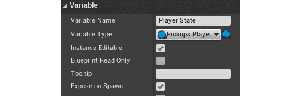

图 18.3：创建 Player State 变量

1.  返回到设计师部分，并为`tbName`创建一个绑定，执行以下操作：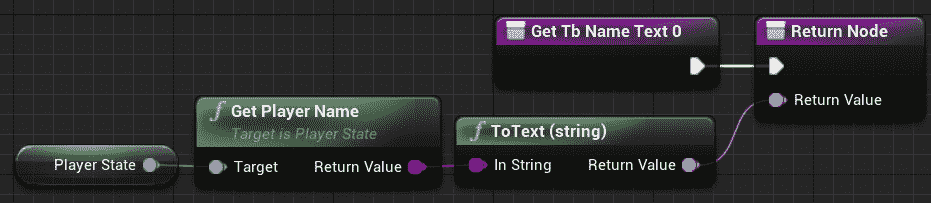

图 18.4：显示玩家名称

注意

您可以在以下链接找到完整分辨率的前一个截图，以便更好地查看：[`packt.live/3pCk9Nt`](https://packt.live/3pCk9Nt)。

1.  为`tbScore`创建一个绑定，执行以下操作：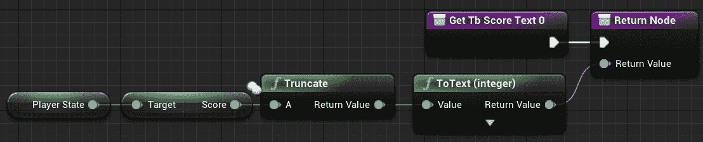

图 18.5：显示玩家得分

注意

您可以在以下链接找到完整分辨率的前一个截图，以便更好地查看：[`packt.live/3nuckYv`](https://packt.live/3nuckYv)。

1.  为`tbPickups`创建一个绑定，执行以下操作：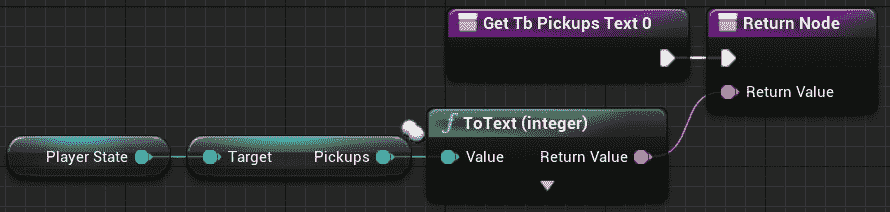

图 18.6：显示拾取物计数

注意

您可以在以下链接找到完整分辨率的前一个截图，以便更好地查看：[`packt.live/36pEGMz`](https://packt.live/36pEGMz)。

1.  创建一个名为`Get Typeface`的纯函数，执行以下操作：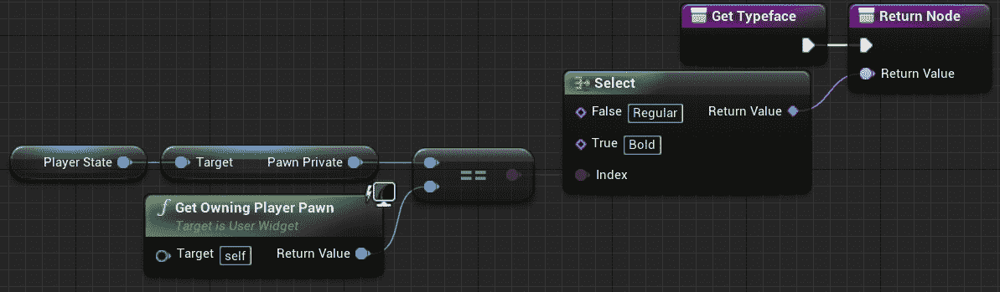

图 18.7：确定条目是否应以粗体或常规显示

注意

您可以在以下链接找到完整分辨率的前一个截图，以便更好地查看：[`packt.live/2JW9Zam`](https://packt.live/2JW9Zam)。

在上述代码中，我们使用了选择节点，可以通过从返回值拖动线并将其释放到空白处，然后在过滤器上键入“select”来创建。从那里，我们从列表中选择了选择节点。在这个特定的函数中，我们使用选择节点来选择我们将要使用的字体的名称，因此如果玩家状态的 pawn 与拥有小部件的 pawn 不同，它应该返回`Regular`，如果相同则返回`Bold`。我们这样做是为了以粗体突出显示玩家状态条目，以便玩家知道他们的条目是什么。

1.  以以下方式实现`Event Construct`：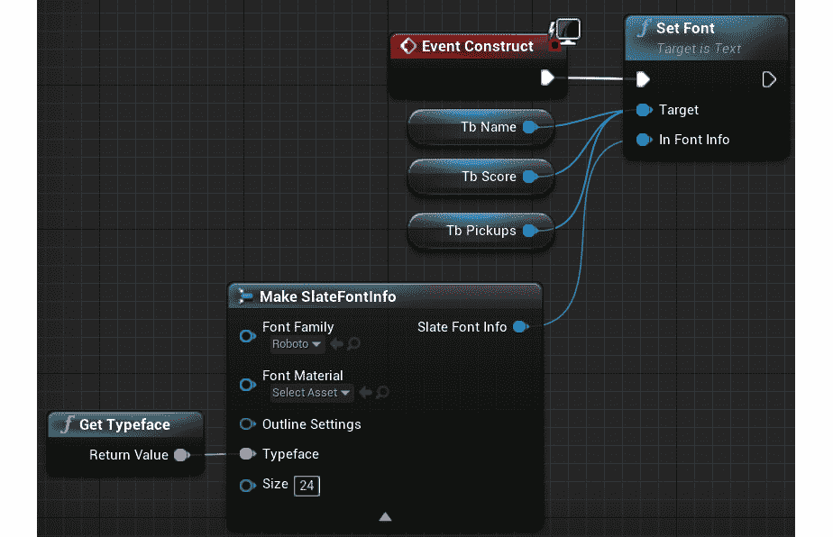

图 18.8：设置名称、得分和拾取物计数的事件图

注意

您可以在以下链接找到完整分辨率的前一个截图，以便更好地查看：[`packt.live/2JOdP58`](https://packt.live/2JOdP58)。

在上述代码中，我们将`tbName`、`tbScore`和`tbPickups`的字体设置为使用`Bold`字体，以突出显示当前客户端玩家的记分板条目。对于其余的玩家，请使用`Regular`字体。

1.  保存并关闭`UI_Scoreboard_Entry`。

1.  返回到`Content\UI`，然后创建一个名为`UI_Scoreboard`的新 UMG 小部件并打开它。

1.  将一个名为`vbScoreboard`的垂直框添加到根画布面板，并启用`Size To Content`。

1.  向`vbScoreboard`添加一个文本块，名为`tbGameInfo`，其`Text`值默认为`Game Info`。

1.  转到`Graph`部分，并创建一个名为`Game State`的`Pickups Game State`类型的新变量。

1.  以以下方式实现`Event Construct`：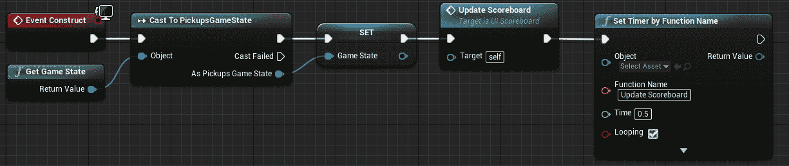

图 18.9：设置每 0.5 秒更新记分板的事件构造

注意

您可以在以下链接找到完整分辨率的前一个截图，以便更好地查看：[`packt.live/3kemyu0`](https://packt.live/3kemyu0)。

在上面的代码中，我们获取游戏状态实例，更新记分牌，并安排一个定时器，以自动每 0.5 秒更新一次记分牌。

1.  返回设计部分，并为`vbScoreboard`进行以下绑定：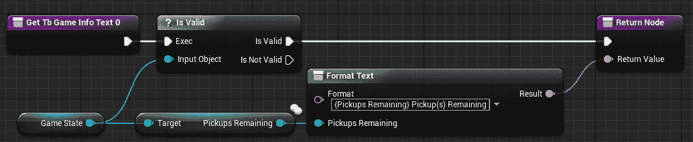

图 18.10：显示世界中剩余拾取物的数量

注意

您可以在以下链接找到前面的屏幕截图的全分辨率，以便更好地查看：[`packt.live/38xUDTE`](https://packt.live/38xUDTE)。

1.  向`vbScoreboard`添加一个垂直框，称为`vbPlayerStates`，并将`Is Variable`设置为`true`，顶部填充为`50`，因此您应该有以下内容：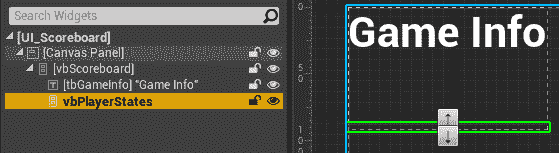

图 18.11：UI_Scoreboard 小部件层次结构

1.  返回图形部分，并以以下方式实现“更新记分牌”事件：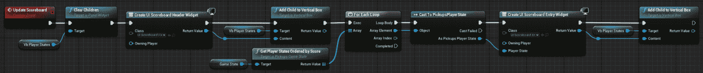

图 18.12：更新记分牌函数，清除并重新创建条目小部件

注意

您可以在以下链接找到前面的屏幕截图的全分辨率，以便更好地查看：[`packt.live/3pf8EeN`](https://packt.live/3pf8EeN)。

在上面的代码中，我们做了以下事情：

+   清除`vbPlayerStates`中的所有先前条目。

+   创建一个记分牌标题条目，并将其添加到`vbPlayerStates`中。

+   循环遍历所有按分数排序的玩家状态，并为每个创建一个条目，并将其添加到`vbPlayerStates`中。

1.  保存并关闭`UI_Scoreboard`。

现在，让我们为玩家控制器创建蓝图。

1.  转到“内容\蓝图”并创建一个名为`BP_PlayerController`的新蓝图，该蓝图派生自`PickupPlayerController`类。

1.  打开新的蓝图，并将“记分牌菜单”“类”设置为使用`UI_Scoreboard`。

1.  保存并关闭`BP_PlayerController`。

接下来，让我们为游戏模式创建蓝图。

1.  转到“内容\蓝图”并创建一个名为`BP_GameMode`的新蓝图，该蓝图派生自`PickupGameMode`类，打开它，并更改以下变量：

```cpp
Game State Class = PickupsGameState
Player Controller Class = BP_PlayerController
Player State Class = PickupsPlayerState
```

接下来，让我们配置“项目设置”以使用新的游戏模式。

1.  转到“项目设置”并从左侧面板中选择“地图和模式”，该面板位于“项目”类别中。

1.  将“默认游戏模式”设置为使用`BP_GameMode`。

1.  关闭“项目设置”。

现在，让我们修改主要级别。

1.  确保您已经打开了`ThirdPersonExampleMap`，位于`Content\ThirdPersonCPP\Maps`中。

1.  添加一些立方体演员作为平台，并确保它们之间有间隙，以迫使玩家跳上它们，并可能从级别中掉下来。

1.  向地图的不同部分添加一些玩家起始演员。

1.  至少添加 50 个`BP_Pickup`的实例，并将它们分布在整个地图上。

1.  这是一种可能的配置地图的示例：

图 18.13：地图配置示例

1.  运行代码并等待编辑器完全加载。

1.  转到“多人游戏选项”并将客户端数量设置为`2`。

1.  将窗口大小设置为`800x600`。

1.  在“新编辑器窗口（PIE）”中播放：

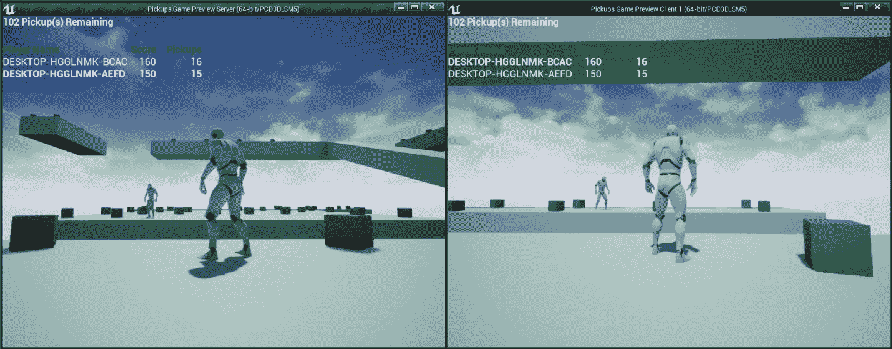

图 18.14：监听服务器和客户端 1 在世界中拾取立方体

完成此练习后，您将能够在每个客户端上进行游戏，并且您会注意到角色可以收集拾取物并获得`10`分，只需与它们重叠。如果角色从级别掉下来，它将重新生成在随机的玩家起始点，并且失去`10`分。

一旦所有拾取物品都被收集，游戏将结束，并在`5`秒后执行服务器转移以重新加载相同的级别并将所有客户端带上（*仅在打包版本中*）。您还可以看到 UI 显示了级别中剩余的拾取物品数量，以及每个玩家的名称、得分和拾取物品的记分板信息。

## 活动 18.01：向多人游戏 FPS 游戏添加死亡、重生、记分板、击杀限制和拾取物品

在这个活动中，您将为角色添加死亡、重生和使用拾取物品的概念。我们还将添加一种方法来检查记分板和游戏的击杀限制，以便它有一个结束目标。

以下步骤将帮助您完成此活动：

1.  从*活动 17.01*中打开`MultiplayerFPS`项目，*向多人游戏 FPS 游戏添加武器和弹药*。编译代码并运行编辑器。

1.  接下来，您将创建我们需要的 C++类。创建一个名为`FPSGameState`的 C++类，它派生自`GameState`类，并具有一个击杀限制变量和一个按击杀排序的玩家状态函数。

1.  创建一个名为`FPSPlayerState`的 C++类，它派生自`PlayerState`类，并存储玩家的击杀数和死亡数。

1.  创建一个名为`PlayerMenu`的 C++类，它派生自`UserWidget`类，并具有一些`BlueprintImplementableEvent`函数来切换记分板的可见性、设置记分板的可见性，并在玩家被杀时通知。

1.  创建一个名为`FPSPlayerController`的 C++类，它派生自`APlayerController`，在拥有客户端上创建`PlayerMenu` UMG 小部件实例。

1.  创建一个名为`Pickup`的 C++类，它派生自`Actor`类，并具有一个静态网格，在`Yaw`轴上每秒旋转 90 度，并且可以被玩家在重叠时拾取。一旦被拾取，它会播放拾取声音，并禁用碰撞和可见性。一定时间后，它将重新变得可见并能够再次发生碰撞。

1.  创建一个名为`AmmoPickup`的 C++类，它派生自`Pickup`类，并向玩家添加一定数量的弹药类型。

1.  创建一个名为`ArmorPickup`的 C++类，它派生自`Pickup`类，并向玩家添加一定数量的护甲。

1.  创建一个名为`HealthPickup`的 C++类，它派生自`Pickup`类，并向玩家添加一定数量的生命值。

1.  创建一个名为`WeaponPickup`的 C++类，它派生自`Pickup`类，并向玩家添加特定的武器类型。如果玩家已经拥有该武器，它将添加一定数量的弹药。

1.  编辑`FPSCharacter`类，使其执行以下操作：

+   角色受到伤害后，检查是否已死亡。如果已死亡，它会为杀手角色注册击杀和角色死亡，并重新生成玩家。如果角色尚未死亡，则在拥有客户端上播放疼痛声音。

+   当角色死亡并执行`EndPlay`函数时，它应销毁所有武器实例。

+   如果角色从世界中掉落，将注册玩家的死亡并重新生成。

+   如果玩家按下*Tab*键，它将切换记分板菜单的可见性。

1.  编辑`MultiplayerFPSGameModeBase`类，使其执行以下操作：

+   存储赢得比赛所需的击杀数。

+   使用新的玩家控制器、玩家状态和游戏状态类。

+   使其实现比赛状态函数，以便比赛立即开始，并在有玩家达到所需的击杀数时结束。

+   比赛结束时，将在 5 秒后执行服务器转移到相同的级别。

+   处理玩家死亡时通过向相应的玩家状态添加击杀（当被其他玩家杀死时）和死亡，并在随机玩家开始点重新生成玩家。

1.  从`Activity18.01\Assets`导入`AmmoPickup.wav`到`Content\Pickups\Ammo`。

1.  从`AAmmoPickup`创建`BP_PistolBullets_Pickup`，放置在`Content\Pickups\Ammo`，并配置以下值：

+   缩放：`(X=0.5, Y=0.5, Z=0.5)`

+   静态网格：`Engine\BasicShapes\Cube`

+   材质：`Content\Weapon\Pistol\M_Pistol`

+   弹药类型：`手枪子弹`，弹药数量：`25`

+   拾取声音：`Content\Pickup\Ammo\AmmoPickup`

1.  从`AAmmoPickup`创建`BP_MachineGunBullets_Pickup`，放置在`Content\Pickups\Ammo`，并配置以下值：

+   缩放：`(X=0.5, Y=0.5, Z=0.5)`

+   静态网格：`Engine\BasicShapes\Cube`

+   材质：`Content\Weapon\MachineGun\M_MachineGun`

+   弹药类型：`机枪子弹`，弹药数量：`50`

+   拾取声音：`Content\Pickup\Ammo\AmmoPickup`

1.  从`AAmmoPickup`创建`BP_Slugs_Pickup`，放置在`Content\Pickups\Ammo`，并配置以下值：

+   缩放：`(X=0.5, Y=0.5, Z=0.5)`

+   静态网格：`Engine\BasicShapes\Cube`

+   材质：`Content\Weapon\Railgun\M_Railgun`

+   弹药类型：`弹丸`，弹药数量：`5`

+   拾取声音：`Content\Pickup\Ammo\AmmoPickup`

1.  从`Activity18.01\Assets`导入`ArmorPickup.wav`到`Content\Pickups\Armor`。

1.  在`Content\Pickups\Armor`中创建材质`M_Armor`，将`Base Color`设置为`蓝色`，`金属`设置为`1`。

1.  从`AArmorPickup`创建`BP_Armor_Pickup`，放置在`Content\Pickups\Armor`，并配置以下值：

+   缩放：`(X=1.0, Y=1.5, Z=1.0)`

+   静态网格：`Engine\BasicShapes\Cube`

+   材质：`Content\Pickup\Armor\M_Armor`

+   护甲数量：`50`

+   拾取声音：`Content\Pickup\Armor\ArmorPickup`

1.  从`Activity18.01\Assets`导入`HealthPickup.wav`到`Content\Pickups\Health`。

1.  在`Content\Pickups\Health`中创建材质`M_Health`，将`Base Color`设置为`蓝色`，`金属`/`粗糙度`设置为`0.5`。

1.  从`AHealthPickup`创建`BP_Health_Pickup`，放置在`Content\Pickups\Health`，并配置以下值：

+   静态网格：`Engine\BasicShapes\Sphere`

+   材质：`Content\Pickup\Health\M_Health`

+   生命值：`50`

+   拾取声音：`Content\Pickup\Health\HealthPickup`

1.  从`Activity18.01\Assets`导入`WeaponPickup.wav`到`Content\Pickups\Weapon`。

1.  从`AWeaponPickup`创建`BP_Pistol_Pickup`，放置在`Content\Pickups\Weapon`，并配置以下值：

+   静态网格：`Content\Pickup\Weapon\SM_Weapon`

+   材质：`Content\Weapon\Pistol\M_Pistol`

+   武器类型：`手枪`，弹药数量：`25`

+   拾取声音：`Content\Pickup\Weapon\WeaponPickup`

1.  从`AWeaponPickup`创建`BP_MachineGun_Pickup`，放置在`Content\Pickups\Weapon`，并配置以下值：

+   静态网格：`Content\Pickup\Weapon\SM_Weapon`

+   材质：`Content\Weapon\MachineGun\M_MachineGun`

+   武器类型：`机枪`，弹药数量：`50`

+   拾取声音：`Content\Pickup\Weapon\WeaponPickup`

1.  从`AWeaponPickup`创建`BP_Pistol_Pickup`，放置在`Content\Pickups\Weapon`，并配置以下值：

+   静态网格：`Content\Pickup\Weapon\SM_Weapon`

+   材质：`Content\Weapon\Railgun\M_Railgun`

+   武器类型：`Railgun`，弹药数量：`5`

+   拾取声音：`Content\Pickup\Weapon\WeaponPickup`

1.  从`Activity18.01\Assets`导入`Land.wav`和`Pain.wav`到`Content\Player\Sounds`。

1.  编辑`BP_Player`，使其使用`Pain`和`Land`声音，并删除所有在`Begin Play`事件中创建和添加`UI_HUD`实例的节点。

1.  在`Content\UI`中创建名为`UI_Scoreboard_Entry`的 UMG 小部件，显示`AFPSPlayerState`的名称、击杀数、死亡数和 ping。

1.  创建名为`UI_Scoreboard_Header`的 UMG 小部件，显示名称、击杀数、死亡数和 ping 的标题。

1.  创建一个名为`UI_Scoreboard`的 UMG 小部件，显示游戏状态中的杀敌限制，一个垂直框，其中`UI_Scoreboard_Header`作为第一个条目，然后为游戏状态实例中的每个`AFPSPlayerState`添加一个`UI_Scoreboard_Entry`。垂直框将通过定时器每 0.5 秒更新一次，通过清除其子项并再次添加它们。

1.  编辑`UI_HUD`，使其添加一个名为`tbKilled`的新文本块，其`Visibility`设置为`Hidden`。当玩家杀死某人时，它将使文本块可见，显示被杀玩家的名称，并在 1 秒后隐藏。

1.  从`UPlayerMenu`创建一个名为`UI_PlayerMenu`的新蓝图，并将其放置在`Content\UI`中。使用一个小部件切换器，在索引`0`中使用`UI_HUD`的一个实例，在索引`1`中使用`UI_Scoreboard`的一个实例。在事件图中，确保覆盖在 C++中设置为`BlueprintImplementableEvent`的`Toggle Scoreboard`、`Set Scoreboard Visibility`和`Notify Kill`事件。`Toggle Scoreboard`事件在`0`和`1`之间切换小部件切换器的活动索引，`Set Scoreboard Visibility`事件将小部件切换器的活动索引设置为`0`或`1`，`Notify Kill`事件告诉`UI_HUD`实例设置文本并淡出动画。

1.  从`AFPSPlayerController`创建`BP_PlayerController`，将其放置在`Content`文件夹中，并设置`PlayerMenuClass`变量以使用`UI_PlayerMenu`。

1.  编辑`BP_GameMode`并设置`Player Controller Class`以使用`BP_PlayerController`。

1.  在`项目设置`的`输入`部分，创建一个名为`Scoreboard`的动作映射，使用`TAB`键。

1.  编辑`DM-Test`关卡，以便至少放置三个新的玩家开始点在不同的位置，将`Kill Z`设置为`-500`在`世界设置`中，并放置每个不同拾取物品的实例。

预期输出：

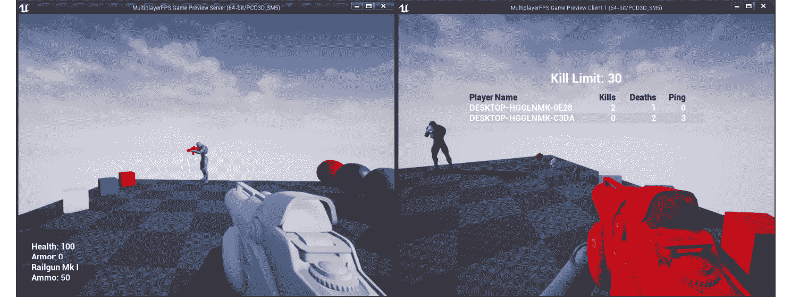

图 18.15：活动的预期输出

结果应该是一个项目，其中每个客户端的角色都可以拾取、使用和在三种不同的武器之间切换。如果一个角色杀死另一个角色，它应该注册杀死和死亡，以及在随机玩家开始处重生死亡的角色。您应该有一个计分板，显示每个玩家的名称、杀敌数、死亡数和 ping。角色可以从关卡中掉落，这应该只算作一次死亡，并在随机玩家开始处重生。角色还应该能够拾取关卡中的不同物品，以获得弹药、盔甲、健康和武器。当达到杀敌限制时，游戏应该结束，并在 5 秒后显示计分板并服务器转移到相同的关卡。

注意

此活动的解决方案可在以下网址找到：[`packt.live/338jEBx`](https://packt.live/338jEBx)。

# 摘要

在本章中，您了解到游戏框架类的实例存在于某些游戏实例中，但在其他游戏实例中不存在。了解这一点将有助于您了解在特定游戏实例中可以访问哪些实例。您还了解了游戏状态和玩家状态类的目的，以及学习了游戏模式和一些有用的内置功能的新概念。

在本章末尾，您已经制作了一个基本但功能齐全的多人射击游戏，可以作为进一步构建的基础。您可以添加新的武器、弹药类型、射击模式、拾取物品等，使其更加完整和有趣。

完成了这本书后，您现在应该更好地了解如何使用 Unreal Engine 4 让自己的游戏变得生动起来。在本书中，我们涵盖了许多主题，从简单到更高级的内容。您首先学习了如何使用不同模板创建项目，以及如何使用蓝图创建角色和组件。然后，您看到了如何从头开始创建一个完全功能的第三人称模板，通过导入和设置所需的资产，设置动画蓝图和混合空间，并创建自己的游戏模式和角色，以及定义和处理输入。

然后，您开始了您的第一个项目；一个使用游戏物理和碰撞、投射物移动组件、角色组件、接口、蓝图函数库、UMG、声音和粒子效果的简单潜行游戏。在此之后，您学会了如何使用 AI、动画蒙太奇和可破坏网格创建一个简单的横向卷轴游戏。最后，您了解了如何使用服务器-客户端架构、变量复制和网络框架提供的 RPC 来创建第一人称多人射击游戏，并学会了 Player State、Game State 和 Game Mode 类的工作原理。

通过参与使用引擎不同部分的各种项目，您现在对 Unreal Engine 4 的工作原理有了深刻的理解，尽管这本书到此结束，但这只是您进入使用 Unreal Engine 4 进行游戏开发世界的开始。
