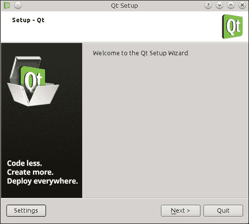
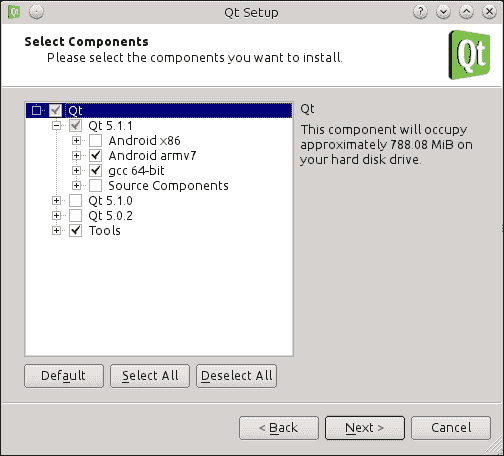
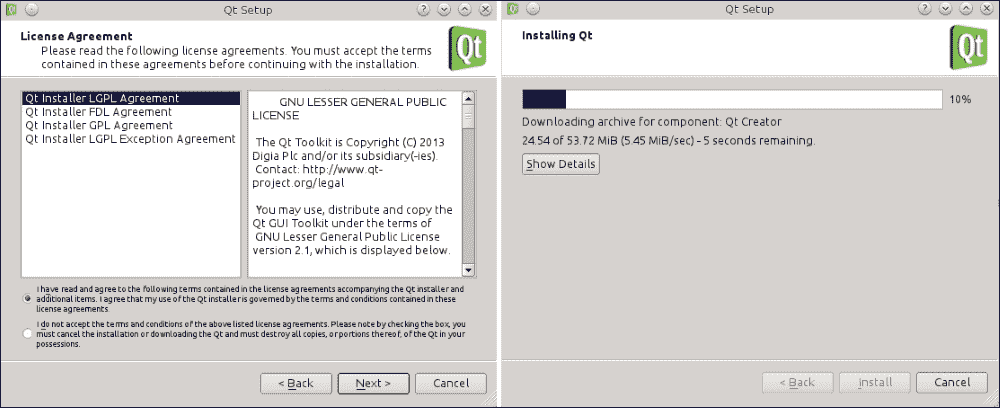
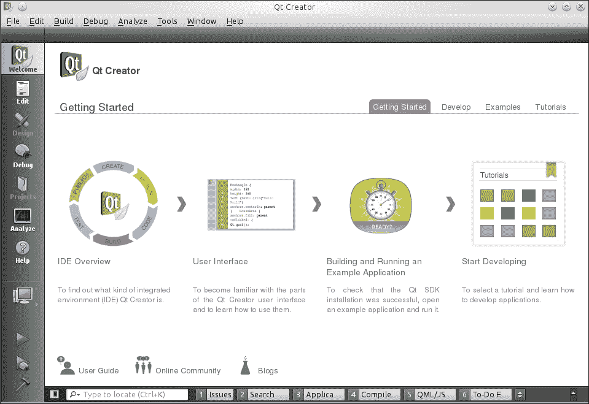
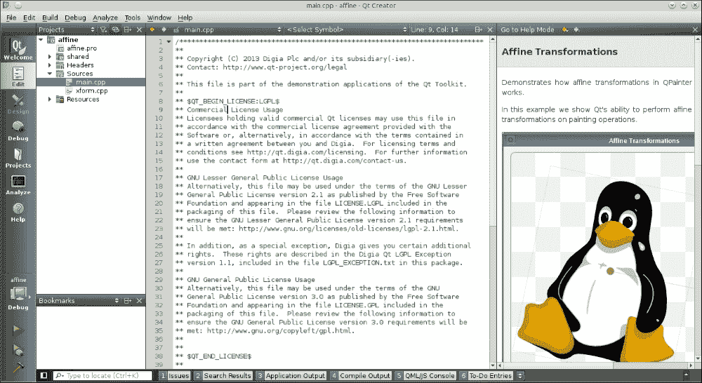
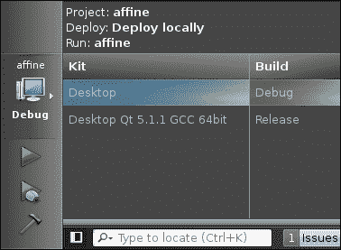
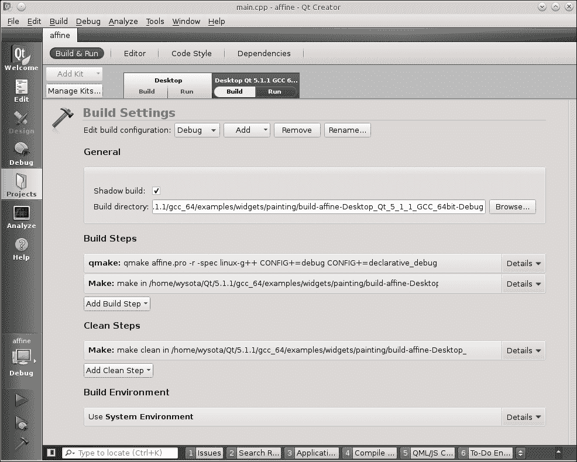
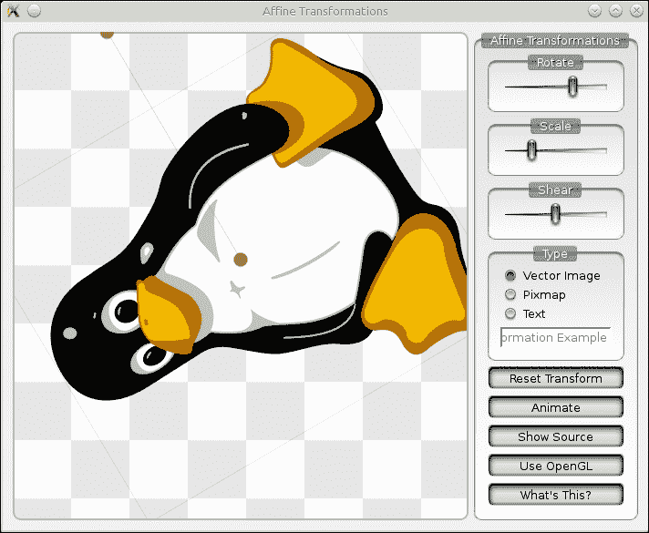

# 第二章。安装

> *在本章中，您将学习如何在您的开发机器上安装 Qt，包括专为与 Qt 一起使用而设计的 IDE——Qt Creator。您将了解如何根据您的需求配置 IDE，并学习使用该环境的基本技能。此外，本章还将描述从源代码构建 Qt 的过程，这对于自定义您的 Qt 安装以及为嵌入式平台获取一个可工作的 Qt 安装非常有用。在本章结束时，您将能够使用 Qt 发布中包含的工具为桌面和嵌入式平台准备您的开发环境。* 

# 安装 Qt SDK

在您可以在您的机器上开始使用 Qt 之前，它需要被下载和安装。Qt 可以使用两种类型的专用安装程序进行安装——在线安装程序，它会在运行时下载所有需要的组件，以及一个更大的离线安装程序，它已经包含了所有需要的组件。使用在线安装程序对于常规桌面安装来说更容易，因此我们将优先选择这种方法。

# 使用在线安装程序安装 Qt 的行动时间

首先，访问 [`qt.io`](http://qt.io) 并点击 **下载**。这将带您到一个包含不同许可方案选项的页面。要使用开源版本，请选择受 GPL 和 LGPL 许可的开源版。然后，您可以点击 **立即下载** 按钮以获取您当前运行的平台的在线安装程序，或者您可以点击任何标题部分以查看更全面的选项列表。在线安装程序的链接位于列表开头，如下面的截图所示。点击并下载适合您主机机的版本：


下载完成后，运行安装程序，如下所示：



点击 **下一步**，在下载器检查远程存储库的一段时间后，您将被要求输入安装路径。请确保选择您有写入权限的路径（最好将 Qt 放入您的个人目录中，除非您是以系统管理员用户身份运行安装程序）。再次点击 **下一步** 将会向您展示您希望安装的组件的选择，如下面的截图所示。您将根据您的平台获得不同的选择。



选择您需要的平台，例如，要在 Linux 上构建原生和 Android 应用程序，请选择基于 gcc 的安装和所需 Android 平台的安装。在 Windows 上，您需要做出额外的选择。当使用 Microsoft 编译器时，您可以选择是否使用带 `OpenGL` 后缀的本地 OpenGL 驱动程序，或者使用 DirectX 调用来模拟 OpenGL ES。如果您没有 Microsoft 编译器或者您根本不想使用它，请选择 MinGW 编译器的 Qt 版本。如果您没有 MinGW 安装，请不要担心——安装程序也会为您安装它。

在选择所需组件并再次点击**下一步**后，您需要通过标记适当的选项来接受 Qt 的许可条款，如图所示。点击**安装**后，安装程序将开始下载和安装所需的软件包。一旦完成，您的 Qt 安装就绪。在过程结束时，您将有一个选项来启动 Qt Creator。



## *发生了什么？*

我们所经历的过程会在您的磁盘上出现整个 Qt 基础设施。您可以检查指向安装程序的目录，看看它是否在这个目录中创建了许多子目录——每个子目录对应于安装程序选择的 Qt 的一个版本，还有一个名为 `Tools` 的子目录，其中包含 Qt Creator。您可以看到，如果您决定安装另一个版本的 Qt，它不会与您的现有安装冲突。此外，对于每个版本，您可以有多个平台子目录，其中包含特定平台的实际 Qt 安装。

# 设置 Qt Creator

Qt Creator 启动后，您应该会看到以下屏幕：



程序应该已经为您正确配置，以便您可以使用刚刚安装的 Qt 版本和编译器，但让我们无论如何验证一下。从**工具**菜单中选择**选项**。一旦弹出对话框，从侧边列表中选择**构建和运行**。这是我们可以配置 Qt Creator 构建项目方式的地方。一个完整的构建配置称为**套件**。它由一个 Qt 安装和一个用于执行构建的编译器组成。您可以在**选项**对话框的**构建和运行**部分看到这三个实体的标签页。

让我们从**编译器**选项卡开始。如果您的编译器没有正确检测到并且不在列表中，请点击**添加**按钮，从列表中选择您的编译器类型，并填写编译器的名称和路径。如果设置正确输入，Creator 将自动填写所有其他详细信息。然后，您可以点击**应用**来保存更改。

接下来，您可以切换到**Qt 版本**标签页。如果您的 Qt 安装没有自动检测到，您可以点击**添加**。这将打开一个文件对话框，您需要找到您的 Qt 安装目录，其中存储了所有二进制可执行文件（通常在`bin`目录中），并选择一个名为`qmake`的二进制文件。如果选择错误文件，Qt Creator 会警告您。否则，您的 Qt 安装和版本应该能够正确检测。如果您愿意，可以在相应的框中调整版本名称。

最后一个要查看的标签页是**套件**标签页。它允许您将编译器与用于编译的 Qt 版本配对。此外，对于嵌入式和移动平台，您可以指定要部署的设备以及包含构建指定嵌入式平台所需所有文件的`sysroot`目录。

# 动手时间 - 加载示例项目

Qt 自带了很多示例。让我们尝试构建一个示例来检查安装和配置是否正确完成。在 Qt Creator 中，点击窗口左上角的**欢迎**按钮进入 IDE 的初始屏幕。在出现的页面右侧（参考前面的截图），有几个标签页，其中一个是名为**示例**的标签页。点击该标签页将打开一个示例列表，并包含一个搜索框。确保在搜索框旁边的列表中选择了您刚刚安装的 Qt 版本。在框中输入`aff`以过滤示例列表，然后点击**仿射变换**以打开项目。如果您被问及是否要将项目复制到新文件夹，请同意。然后 Qt Creator 将向您展示以下窗口：



## *发生了什么？*

Qt Creator 加载了项目并设置了一个视图，该视图将帮助我们学习示例项目。视图分为四个部分。让我们从左侧开始列举。首先是 Qt Creator 的工作模式选择器，其中包含一个操作栏，允许我们在 IDE 的不同模式之间切换。然后是项目视图，其中包含项目文件列表。接下来是源代码编辑器，显示项目的主要源代码部分。最后，在右侧远处，您可以看到在线帮助窗口，显示打开示例的文档。

# 动手时间 - 运行仿射变换项目

让我们尝试构建并运行项目以检查构建环境是否配置正确。首先，点击绿色三角形图标直接上方的图标以打开构建配置弹出窗口，如图所示：



您获得的确切内容可能因您的安装而异，但通常，在左侧您将看到为项目配置的套件列表，在右侧您将看到为该套件定义的构建配置列表。为您的桌面安装选择一个套件以及为该套件定义的任何配置。您可以通过切换 Qt Creator 到项目管理模式来调整配置，方法是点击工作模式选择栏中的**项目**按钮。在那里，您可以向项目添加和删除套件，并管理每个套件的构建配置，如图中所示：



您可以调整、构建和清理步骤，并切换阴影构建（即在源代码目录树外构建您的项目）。

要构建项目，请点击操作栏底部的锤子图标。您还可以点击绿色三角形图标来构建和运行项目。如果一切正常，经过一段时间后，应用程序应该会启动，如图所示：



## *发生了什么？*

项目是如何构建的？如果您打开**项目**模式并查看分配给项目的**构建设置**（如图中所示的前一个截图），您会注意到定义了多个构建步骤。Qt 项目的第一步通常是`qmake`步骤，它运行一个特殊的工具，为项目生成一个`Makefile`，该`Makefile`在第二步被传递给经典的`make`工具。您可以通过点击相应的**详细信息**按钮来展开每个步骤，以查看每个步骤的配置选项。

虽然`make`被认为是构建软件项目的标准工具，但`qmake`是 Qt 提供的自定义工具。如果您回到**编辑**模式并查看项目内容中列出的文件，您会注意到一个扩展名为`pro`的文件。这是主要的项目文件，其中包含项目中的源文件和头文件列表，为项目定义的 Qt 模块，以及可选的外部库，项目需要链接这些库。如果您想了解此类项目文件的管理细节，可以切换到**帮助**模式，从窗口顶部的下拉列表中选择**索引**，并输入`qmake Manual`以找到该工具的说明书。否则，只需让 Qt Creator 为您管理项目即可。对于自包含的 Qt 项目，您不需要成为 qmake 专家。

# 从源代码构建 Qt

在大多数情况下，对于桌面和移动平台，您从网页上下载的 Qt 的二进制发布版足以满足您的所有需求。然而，对于嵌入式系统，尤其是基于 ARM 的系统，可能没有可用的二进制发布版，或者对于这样一个轻量级系统来说，二进制发布版资源太重。在这种情况下，需要执行自定义的 Qt 构建。有两种方式进行这样的构建。一种是将源代码作为压缩归档下载，就像二进制包一样。另一种是从 Git 仓库直接下载代码。由于第一种方法相当直观，我们将重点介绍第二种方法。

# 行动时间 - 使用 Git 设置 Qt 源代码

首先，如果您还没有安装 Git，您需要在系统上安装它。如何做取决于您的操作系统。对于 Windows，只需从[`git-for-windows.github.io`](https://git-for-windows.github.io)下载安装程序。对于 Mac，安装程序可在[`code.google.com/p/git-osx-installer`](http://code.google.com/p/git-osx-installer)找到。对于 Linux，最简单的方法是使用系统包管理器。例如，在基于 Debian 的发行版上，只需在终端中输入`sudo apt-get install git`命令，然后等待安装完成。

之后，您需要克隆 Qt 的 Git 仓库。由于 Git 是一个命令行工具，我们将从现在开始使用命令行。要将 Qt 的仓库克隆到您想要保存源代码的目录中，请输入以下命令：

```cpp
git clone git://code.qt.io/qt/qt5.git

```

如果一切顺利，Git 将从网络下载大量源代码并创建一个名为`qt5`的目录，其中包含所有下载的文件。然后，将当前工作目录更改为包含新下载代码的目录：

```cpp
cd qt5

```

然后，您需要运行一个 Perl 脚本，该脚本将为您设置所有额外的仓库。如果您还没有安装 Perl，您应该现在安装它（您可以从[`www.activestate.com/activeperl/downloads`](http://www.activestate.com/activeperl/downloads)获取 Windows 版本的 Perl）。然后，输入以下命令：

```cpp
perl init-repository

```

脚本将开始下载 Qt 所需的所有模块，并在依赖于您的网络链路速度的一段时间后成功完成。

## *发生了什么？*

在此`qt5`目录中，您将看到为不同的 Qt 模块（其中一些在第一章，*Qt 简介*中提到）创建的多个子目录，每个子目录都包含相应 Qt 模块和工具的源代码的本地 Git 仓库。如果需要，每个模块都可以单独更新。

# 行动时间 - 配置和构建 Qt

在源代码就绪的情况下，我们可以开始构建框架。为此，除了支持的编译器外，您还需要安装 Perl 和 Python（版本 2.7 或更高）。对于 Windows，您还需要 Ruby。如果您缺少任何工具，现在是安装它们的好时机。之后，打开命令行，将当前工作目录更改为包含 Qt 源代码的目录。然后，输入以下命令：

```cpp
configure -opensource -nomake tests

```

这将启动一个工具，用于检测是否满足所有要求，并将报告任何不一致之处。它还将报告构建的确切配置。您可以通过向`configure`传递额外的选项来自定义构建（例如，如果您需要启用或禁用某些功能或为嵌入式平台交叉编译 Qt），以运行`configure -help`来查看可用选项。

如果`configure`报告了问题，您将需要修复这些问题并重新启动工具。否则，通过调用`make`（或者在 MinGW 中使用`mingw32-make`，或者在 MSVC 中使用`nmake`）来启动构建过程。

### 小贴士

除了`nmake`，您还可以使用 Qt 捆绑的工具`jom`。它将在多核机器上减少编译时间，这是默认的`nmake`工具所做不到的。对于`make`和`mingw32-make`，您可以通过传递`-j N`参数来传递，其中`N`代表您机器上的核心数。

## *刚才发生了什么？*

经过一段时间（通常不到一小时），如果一切顺利，构建应该完成，您将准备好将编译好的框架添加到 Qt Creator 中可用的工具包列表中。

### 小贴士

在 Unix 系统上，构建完成后，您可以使用超级用户权限（例如，通过`sudo`获得）调用`make install`命令，将框架复制到更合适的位置。

# 摘要

到目前为止，您应该能够在您的开发机器上安装 Qt。现在，您可以使用 Qt Creator 浏览现有示例并从中学习，或者阅读 Qt 参考手册以获取更多知识。您也可以开始一个新的 C++项目，为其编写代码，构建并执行它。一旦您成为经验丰富的 Qt 开发者，您也将能够创建自己的自定义 Qt 构建。在下一章中，我们最终将开始使用框架，您将学习如何通过实现我们非常简单的第一个游戏来创建图形用户界面。
