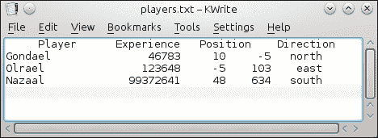

# 第四章。Qt 核心基础

> *本章将帮助你掌握 Qt 的基本数据处理和存储方式。首先，你将学习如何处理文本数据以及如何将文本与正则表达式匹配。然后，你将了解如何从文件中存储和检索数据，以及如何使用不同的存储格式来存储文本和二进制数据。到本章结束时，你将能够高效地在你的游戏中实现非平凡逻辑和数据处理。你还将了解如何在游戏中加载外部数据，以及如何将你的数据保存到永久存储中以便将来使用。*

# 文本处理

带有图形用户界面（游戏当然属于这一类）的应用程序能够通过显示文本并期望用户输入文本与用户交互。我们已经在上一章通过使用`QString`类来触及了这个话题的表面。现在，我们将深入探讨。

## 字符串操作

Qt 内部使用 Unicode 对文本进行编码，这允许表示世界上几乎所有的语言字符，并且是大多数现代操作系统中文本本地编码的事实标准。然而，你必须意识到，与`QString`类不同，C++语言默认不使用 Unicode。因此，你输入代码中的每个字符串字面量（即你用引号包裹的每个裸文本）在可以存储在 Qt 的任何字符串处理类之前，都需要先转换为 Unicode。默认情况下，这会隐式地假设字符串字面量是 UTF-8 编码的，但`QString`提供了一系列静态方法来从其他编码（如`QString::fromLatin1()`或`QString::fromUtf16()`）转换。这种转换是在运行时完成的，这会增加程序执行时间，特别是如果你在程序中倾向于进行大量的此类转换。幸运的是，有一个解决方案：

```cpp
QString str = QStringLiteral("I'm writing my games using Qt");
```

你可以将你的字符串字面量包裹在`QStringLiteral`的调用中，就像前面代码所示，如果你的编译器支持，它将在编译时执行转换。将所有字符串字面量包裹成`QStringLiteral`是一个好习惯，但这不是必需的，所以如果你忘记这样做，请不要担心。

在描述`QString`类时，我们不会深入细节，因为它在许多方面与 C++标准库中的`std::string`相似。相反，我们将关注这两个类之间的差异。

### 文本编码和解码

第一个差异已经提到——`QString`将数据编码为 Unicode。这有一个优点，即能够用几乎任何语言表达文本，但代价是需要从其他编码转换。大多数流行的编码——UTF-8、UTF-16 和 Latin1——在`QString`中都有方便的方法来转换到和从内部表示。但是，Qt 也知道如何处理许多其他编码。这是通过使用`QTextCodec`类来完成的。

### 小贴士

你可以使用 `QTextCodec::availableCodecs()` 静态方法列出你的安装上支持的 codec。在大多数安装中，Qt 可以处理近 1,000 种不同的文本 codec。

大多数处理文本的 Qt 实体都可以访问此类实例以透明地执行转换。如果你想手动执行此类转换，你可以通过名称请求 Qt 的 codec 实例并使用 `fromUnicode()` 和 `toUnicode()` 方法：

```cpp
QByteArray big5Encoded = "你好";
QTextCodec *big5Codec = QTextCodec::codecForName("Big5");
QString text = big5Codec->toUnicode(big5Encoded);
QTextCodec *utf8Codec = QTextCodec::codecForMib(106); // UTF-8
QByteArray utf8Encoded = utf8Codec->fromUnicode(text);
```

### 基本字符串操作

涉及文本字符串的最基本任务包括添加或删除字符串中的字符、连接字符串以及访问字符串内容。在这方面，`QString` 提供了一个与 `std::string` 兼容的接口，但它还超越了这一点，暴露了许多更多有用的方法。

使用 `prepend()` 和 `append()` 方法可以在字符串的开始或末尾添加数据，这些方法有几个重载，可以接受不同可以包含文本数据的对象，包括经典的 `const char*` 数组。使用 `insert()` 方法可以在字符串的中间插入数据，该方法将需要开始插入的字符位置作为其第一个参数，实际文本作为其第二个参数。`insert` 方法具有与 `prepend` 和 `append` 相同的重载，但不包括 `const char*`。从字符串中删除字符的方式类似。基本方法是使用 `remove()` 方法，该方法接受需要删除字符的位置和要删除的字符数，如下所示：

```cpp
QString str = QStringLiteral("abcdefghij");
str.remove(2, 4); // str = "abghij"
```

还有一个接受另一个字符串的重载。当调用时，它会从原始字符串中删除所有其出现。此重载有一个可选参数，指定比较是否应该以默认的大小写敏感（`Qt::CaseSensitive`）或大小写不敏感（`Qt::CaseInsensitive`）的方式进行：

```cpp
QString str = QStringLiteral("Abracadabra");
str.remove(QStringLiteral("ab"), Qt::CaseInsensitive); // str = "racadra"
```

要连接字符串，你可以简单地将两个字符串相加，或者将一个字符串追加到另一个字符串上：

```cpp
QString str1 = QStringLiteral("abc");
QString str2 = QStringLiteral("def");
QString str1_2 = str1+str2;
QString str2_1 = str2;
str2_1.append(str1);
```

访问字符串可以分为两种用例。第一种是你希望提取字符串的一部分。为此，你可以使用以下三种方法之一：`left()`、`right()` 和 `mid()`，它们从字符串的开始或末尾返回指定数量的字符，或者从字符串中指定位置开始提取指定长度的子字符串：

```cpp
QString original = QStringLiteral("abcdefghij");
QString l = original.left(3); // "abc"
QString r = original.right(2); // "ij"
QString m = original.mid(2, 5); // "cdefg"
```

第二种用例是你希望访问字符串的单个字符。索引操作符在 `QString` 中的使用方式与 `std::string` 类似，返回一个副本或非 const 引用到由 `QChar` 类表示的给定字符，如下面的代码所示：

```cpp
QString str = "foo";
QChar f = str[0]; // const
str[0] = 'g'; // non-const
```

此外，Qt 还提供了一个专门的方法——`at()`，它返回字符的副本：

```cpp
QChar f = str.at(0);
```

### 小贴士

你应该优先使用 `at()` 而不是索引操作符来执行不修改字符的操作，因为这明确设置了操作。

### 字符串搜索和查找

功能的第二组与字符串搜索相关。你可以使用 `startsWith()`、`endsWith()` 和 `contains()` 等方法在字符串的开始、结束或任意位置搜索子字符串。可以通过使用 `count()` 方法检索字符串中子字符串的出现次数。

### 小贴士

注意，还有一个不带参数的 `count()` 方法，它返回字符串中的字符数。

如果你需要知道匹配的确切位置，可以使用 `indexOf()` 或 `lastIndexOf()` 来接收字符串中匹配发生的位置。第一个调用通过向前搜索工作，而另一个调用通过向后搜索。这些调用都接受两个可选参数——第二个参数确定搜索是否区分大小写（类似于 `remove` 的工作方式）。第一个参数是字符串中搜索开始的位臵。它让你能够找到给定子字符串的所有出现：

```cpp
#include <QtDebug>
// ...
int pos = -1;
QString str = QStringLiteral("Orangutans like bananas.");
do {
  pos = str.indexOf("an", pos+1);
  qDebug() << "'an' found starts at position" << pos;
} while(pos!=-1);
```

### 字符串分解

还有另一组有用的字符串功能，这使得 `QString` 与 `std::string` 不同。那就是，将字符串切割成更小的部分，并从更小的片段构建更大的字符串。

很常见，一个字符串包含通过重复分隔符粘合在一起的子字符串。一个常见的情况是 **逗号分隔值**（**CSV**）格式，其中数据记录被编码在一个单独的字符串中，记录中的字段通过逗号分隔。虽然你可以使用你已知的函数（例如，`indexOf`）从记录中提取每个字段，但存在一种更简单的方法。`QString` 包含一个 `split()` 方法，它接受分隔符字符串作为参数，并返回一个由 Qt 中的 `QStringList` 类表示的字符串列表。然后，将记录分解成单独的字段就像调用以下代码一样简单：

```cpp
QString record = "1,4,8,15,16,24,42";
QStringList fields = record.split(",");
for(int i=0; i< fields.count(); ++i){
  qDebug() << fields.at(i);
}
```

这种方法的逆操作是 `QStringList` 类中存在的 `join()` 方法，它将列表中的所有项合并成一个字符串，并用给定的分隔符连接起来：

```cpp
QStringList fields = { "1", "4", "8", "15", "16", "24", "42" }; // C++11 syntax!
QString record = fields.join(",");
```

### 数字与字符串之间的转换

`QString` 还提供了一些方便在文本和数值之间进行转换的方法。例如 `toInt()`、`toDouble()` 或 `toLongLong()` 可以轻松地从字符串中提取数值。除了 `toDouble()` 之外，它们都接受两个可选参数——第一个是一个指向 `bool` 变量的指针，根据转换是否成功将其设置为 `true` 或 `false`。第二个参数指定值的数值基数（例如，二进制、八进制、十进制或十六进制）。`toDouble()` 方法只接受一个 `bool` 指针来标记成功或失败，如下面的代码所示：

```cpp
bool ok;
int v1 = QString("42").toInt(&ok, 10); // v1 = 42, ok = true
long long v2 = QString("0xFFFFFF").toInt(&ok, 16); // v2 = 16777215, ok = true
double v3 = QString("not really a number").toDouble(&ok); //v3 = 0.0, ok = false
```

一个名为 `number()` 的静态方法执行相反方向的转换——它接受一个数值和数值基数，并返回值的文本表示：

```cpp
QString txt = QString::number(255, 16); // txt = "0xFF"
```

如果你必须在一个程序中同时使用 `QString` 和 `std::string`，`QString` 提供了 `toStdString()` 和 `fromStdString()` 方法来执行适当的转换。

### 小贴士

一些表示值的其他类也提供了到和从 `QString` 的转换。这样的一个类是 `QDate`，它表示一个日期并提供 `fromString()` 和 `toString()` 方法。

### 在字符串中使用参数

一个常见的任务是需要一个字符串，其内容需要是动态的，这样它的内容就依赖于某些外部变量的值——例如，你可能想通知用户正在复制的文件数量，显示“正在复制文件 1/2”或“正在复制文件 2/5”，这取决于表示当前文件和文件总数的计数器的值。可能会诱使你通过使用可用的方法之一将所有片段组装在一起来完成这项任务：

```cpp
QString str = "Copying file " + QString::number(current) + " of "+QString::number(total);
```

这种方法有几个缺点；其中最大的问题是将字符串翻译成其他语言的问题（这个问题将在本章后面讨论），在这些语言中，它们的语法可能要求这两个参数的位置与英语不同。

相反，Qt 允许我们在字符串中指定位置参数，然后使用实值替换它们。字符串中的位置用 `%` 符号标记（例如，`%1`、`%2` 等），并通过调用 `arg()` 并传递用于替换字符串中下一个最低标记的值来替换它们。然后我们的文件复制消息构建代码变为：

```cpp
QString str = QStringLiteral("Copying file %1 of %2")
                                             .arg(current).arg(total);
```

`arg` 方法可以接受单个字符、字符串、整数和实数，其语法与 `QString::number()` 类似。

## 正则表达式

让我们简要地谈谈**正则表达式**——通常简称为**regex**或**regexp**。当你需要检查一个字符串或其部分是否与给定的模式匹配，或者当你想要在文本中找到特定的部分并可能提取它们时，你需要这些正则表达式。验证和查找/提取都是基于所谓的正则表达式模式，它描述了字符串必须具有的格式才能有效、可找到或可提取。由于这本书专注于 Qt，很遗憾没有时间深入探讨正则表达式。然而，这不是一个大问题，因为你可以在网上找到许多提供正则表达式介绍的优质网站。Qt 的 `QRegExp` 文档中也可以找到简短的介绍。

尽管正则表达式的语法有很多种，但 Perl 使用的语法已经成为事实上的标准。根据 `QRegularExpression`，Qt 提供了与 Perl 兼容的正则表达式。

### 注意

`QRegularExpression` 首次在 Qt 5 中引入。在之前的版本中，你会找到较老的 `QRegExp` 类。由于 `QRegularExpression` 更接近 Perl 标准，并且其执行速度比 `QRegExp` 快得多，我们建议尽可能使用 `QRegularExpression`。尽管如此，你仍然可以阅读有关正则表达式一般介绍的 `QRegExp` 文档。

# 是时候进行一个简单的问答游戏了

为了让你了解 `QRegularExpression` 的主要用法，让我们想象这个游戏：展示一个物体的照片给多个玩家看，每个玩家都必须估计物体的重量。估计值最接近实际重量的玩家获胜。估计将通过 `QLineEdit` 提交。由于你可以在行编辑中写任何东西，我们必须确保内容是有效的。

那么“有效”是什么意思呢？在这个例子中，我们定义一个介于 1 克和 999 公斤之间的值是有效的。了解这个规范后，我们可以构建一个正则表达式来验证格式。文本的第一部分是一个数字，可以是 1 到 999 之间的任何数字。因此，相应的模式看起来像 `[1-9][0-9]{0,2}`，其中 `[1-9]` 允许并且要求恰好一个数字，除了零，零可以可选地后面跟最多两个数字，包括零。这通过 `[0-9]{0,2}` 来表达。输入的最后部分是重量的单位。使用如 `(mg|g|kg)` 这样的模式，我们允许重量以 **毫克**（**mg**）、**克**（**g**）或 **公斤**（**kg**）输入。通过 `[ ]?`，我们最终允许数字和单位之间有一个可选的空格。结合模式和相关 `QRegularExpression` 对象的构建，看起来是这样的：

```cpp
QRegularExpression regex("[1-9][0-9]{0,2}[ ]? (mg|g|kg)");
regex.setPatternOptions(QRegularExpression:: CaseInsensitiveOption);
```

## *刚才发生了什么？*

在第一行，我们构建了上述 `QRegularExpression` 对象，同时将正则表达式的模式作为参数传递给构造函数。我们也可以调用 `setPattern()` 来设置模式：

```cpp
QRegularExpression regex;
regex.setPattern("[1-9][0-9]{0,2}[ ]?(mg|g|kg)");
```

这两种方法都是等效的。如果你仔细看看单位，你会看到现在单位只能以小写形式输入。然而，我们希望它也可以是大写或混合大小写。为了实现这一点，我们当然可以写 `(mg|mG|Mg|MG|g|G|kg|kG|Kg|KG)`。当你有更多单位时，这确实是一项艰巨的工作，而且很容易出错，所以我们选择了更干净、更易读的解决方案。在初始代码示例的第二行，你看到了答案：一个模式选项。我们使用了 `setPatternOptions()` 来设置 `QRegularExpression::CaseInsensitiveOption` 选项，该选项不尊重字符的大小写。当然，你还可以在 Qt 的 `QRegularExpression::PatternOption` 文档中了解一些更多选项。我们也可以将选项作为 `QRegularExpression` 构造函数的第二个参数传递，而不是调用 `setPatternOptions()`：

```cpp
QRegularExpression regex("[1-9][0-9]{0,2}[ ]?(mg|g|kg)",
           QRegularExpression::CaseInsensitiveOption);
```

现在，让我们看看如何使用这个表达式来验证字符串的有效性。为了简单起见和更好的说明，我们简单地声明了一个名为 `input` 的字符串：

```cpp
QString input = "23kg";
QRegularExpressionMatch match = regex.match(input);
bool isValid = match.hasMatch();
```

我们所需要做的就是调用 `match()`，传递我们想要检查的字符串。作为回报，我们得到一个 `QRegularExpressionMatch` 类型的对象，它包含所有进一步需要的信息——而不仅仅是检查有效性。然后，我们可以通过 `QRegularExpressionMatch::hasMatch()` 确定输入是否匹配我们的标准，因为它在找到模式时返回 `true`。当然，如果没有找到模式，则返回 `false`。

仔细的读者肯定已经注意到我们的模式还没有完全完成。`hasMatch()` 方法也会在将模式与 "foo 142g bar" 进行匹配时返回 `true`。因此，我们必须定义模式是从匹配字符串的开始到结束进行检查的。这是通过 `\A` 和 `\z` 锚点来完成的。前者标记字符串的开始，后者标记字符串的结束。在使用这样的锚点时，不要忘记转义斜杠。正确的模式如下所示：

```cpp
QRegularExpression regex("\\A[1-9][0-9]{0,2}[ ]?(mg|g|kg)\\z",
           QRegularExpression::CaseInsensitiveOption);
```

## 从字符串中提取信息

在我们检查发送的猜测是否良好形成之后，我们必须从字符串中提取实际的重量。为了能够轻松比较不同的猜测，我们还需要将所有值转换为共同的参考单位。在这种情况下，应该是毫克，这是最低的单位。那么，让我们看看 `QRegularExpressionMatch` 可以为我们提供什么来完成任务。

使用 `capturedTexts()`，我们得到一个包含模式捕获组的字符串列表。在我们的例子中，这个列表将包含 "23kg" 和 "kg"。列表的第一个元素总是被模式完全匹配的字符串，然后是所有由使用的括号捕获的子字符串。由于我们缺少实际的数字，我们必须将模式的开始更改为 `([1-9][0-9]{0,2})`。现在，列表的第二个元素是数字，第三个元素是单位。因此，我们可以写出以下内容：

```cpp
int getWeight(const QString &input) {
  QRegularExpression regex("\\A([1-9][0-9]{0,2}) [ ]?(mg|g|kg)\\z");
  regex.setPatternOptions(QRegularExpression:: CaseInsensitiveOption);
  QRegularExpressionMatch match = regex.match(input);
  if(match.hasMatch()) {
    const QString number = match.captured(1);
    int weight = number.toInt();
    const QString unit = match.captured(2).toLower();
    if (unit == "g") {
      weight *= 1000;
    } else if (unit == "kg") {
      weight *= 1000000 ;
    }
    return weight;
  } else {
    return -1;
  }
}
```

在函数的前两行中，我们设置了模式和它的选项。然后，我们将它与传递的参数进行匹配。如果 `QRegularExpressionMatch::hasMatch()` 返回 `true`，则输入有效，我们提取数字和单位。我们不是通过调用 `capturedTexts()` 获取捕获文本的整个列表，而是通过调用 `QRegularExpressionMatch::captured()` 直接查询特定元素。传递的整数参数表示列表中元素的位位置。因此，调用 `captured(1)` 返回匹配的数字作为一个 `QString`。

### 小贴士

`QRegularExpressionMatch::captured()` 也接受 `QString` 作为参数类型。如果你在模式中使用了命名组，这会很有用，例如，如果你写的是 `(?<number>[1-9][0-9]{0,2})`，那么你可以通过调用 `match.captured("number")` 来获取数字。如果模式很长或者未来有很高的概率会添加更多的括号，命名组会很有用。请注意，稍后添加一个组将会将所有后续组的索引移动 `1` 位，你将不得不调整你的代码！

为了能够使用提取出的数字进行计算，我们需要将 `QString` 转换为整数。这是通过调用 `QString::toInt()` 来完成的。转换的结果随后存储在 `weight` 变量中。接下来，我们获取单位并将其转换为小写字母。这样，例如，我们可以轻松地确定用户的猜测是否以克为单位，只需将单位与小写 "g" 进行比较。我们不需要关心大写 "G" 或 "KG"、"Kg" 和不寻常的 "kG"（千克）。

为了得到标准化的重量（毫克），我们需要将 `weight` 乘以 1,000 或 1,000,000，具体取决于这是否以 g 或 kg 表示。最后，我们返回这个标准化的重量。如果字符串格式不正确，我们返回 `-1` 来指示给定的猜测无效。然后调用者负责确定哪个玩家的猜测是最好的。

### 注意

注意你选择的整数类型是否可以处理重量的值。在我们的例子中，对于 32 位系统，1,000,000,000 是可以由有符号整数持有的最大可能值。如果你不确定你的代码是否会在 32 位系统上编译，使用 `qint32`，它在 Qt 支持的每个系统上都是保证为 32 位整数的，允许十进制表示法。

作为练习，尝试扩展示例，允许小数数字，例如 23.5g 是一个有效的猜测。为了实现这一点，你必须修改模式以输入小数数字，并且你还必须处理 `double` 而不是 `int` 作为标准化的重量。

## 查找所有模式出现

最后，让我们看看如何找到字符串中的所有数字，即使是那些以零开头的数字：

```cpp
QString input = "123 foo 09 1a 3";
QRegularExpression regex("\\b[0-9]+\\b");
QRegularExpressionMatchIterator i = regex.globalMatch(input);
while (i.hasNext()) {
  QRegularExpressionMatch match = i.next();
  qWarning() << match.capturedTexts();
}
```

`input` QString 实例包含一个示例文本，我们希望在其中找到所有数字。由于“foo”以及“1a”不是有效的数字，因此不应通过该模式找到这些变量。因此，我们设置了定义我们至少需要一个数字 `[0-9]+`，并且这个数字——或者这些数字——应该被单词边界 `\b` 包围的模式。请注意，您必须转义斜杠。使用此模式，我们初始化 `QRegularExpression` 对象，并在其上调用 `globalMatch()`。在传递的参数内部，将搜索该模式。这次，我们没有返回 `QRegularExpressionMatch`，而是返回 `QRegularExpressionMatchIterator` 类型的迭代器。由于 `QRegularExpressionMatchIterator` 的行为类似于 Java 迭代器，具有 `hasNext()` 方法，我们检查是否存在进一步的匹配，如果存在，则通过调用 `next()` 获取下一个匹配。返回的匹配类型是 `QRegularExpressionMatch`，这是您已经知道的。

### 小贴士

如果你需要在 `while` 循环内部了解下一个匹配项，你可以使用 `QRegularExpressionMatchIterator::peekNext()` 来接收它。这个函数的优点是它不会移动迭代器。

这样，你可以遍历字符串中的所有模式出现。如果你，例如，想在文本中突出显示搜索字符串，这将很有帮助。

我们的示例将给出输出：`("123"), ("09") and ("3")`。

考虑到这只是一个关于正则表达式的简要介绍，我们鼓励你阅读文档中关于 `QRegularExpression`、`QRegularExpressionMatch` 和 `QRegularExpressionMatchIterator` 的 *详细描述* 部分。正则表达式非常强大且有用，因此，在你的日常编程生活中，你可以从正则表达式的深刻知识中受益！

# 数据存储

在实现游戏时，你通常会需要处理持久数据——你需要存储保存的游戏数据、加载地图等等。为此，你必须了解让你能够使用存储在数字媒体上的数据的机制。

## 文件和设备

访问数据的最基本和底层机制是从文件中保存和加载它。虽然你可以使用 C 和 C++ 提供的经典的文件访问方法，如 `stdio` 或 `iostream`，但 Qt 提供了对文件抽象的自己的包装，它隐藏了平台相关的细节，并提供了一个在所有平台上以统一方式工作的干净 API。

当使用文件时，你将工作的两个基本类是 `QDir` 和 `QFile`。前者表示目录的内容，允许你遍历文件系统，创建和删除目录，最后，访问特定目录中的所有文件。

### 遍历目录

使用 `QDir` 遍历目录非常简单。首先要做的事情是首先有一个 `QDir` 实例。最简单的方法是将目录路径传递给 `QDir` 构造函数。

### 小贴士

Qt 以平台无关的方式处理文件路径。尽管 Windows 上的常规目录分隔符是反斜杠字符（`\`），而其他平台上是正斜杠（`/`），但 Qt 在 Windows 平台上也接受正斜杠作为目录分隔符。因此，当将路径传递给 Qt 函数时，你始终可以使用`/`来分隔目录。

你可以通过调用`QDir::separator()`静态函数来学习当前平台的本地目录分隔符。你可以使用`QDir::toNativeSeparators()`和`QDir::fromNativeSeparators()`函数在本地和非本地分隔符之间进行转换。

Qt 提供了一些静态方法来访问一些特殊目录。以下表格列出了这些特殊目录及其访问函数：

| 访问函数 | 目录 |
| --- | --- |
| `QDir::current()` | 当前工作目录 |
| `QDir::home()` | 当前用户的家目录 |
| `QDir::root()` | 根目录——通常在 Unix 中为`/`，在 Windows 中为`C:\` |
| `QDir::temp()` | 系统临时目录 |

当你已经有一个有效的`QDir`对象时，你可以开始在不同目录之间移动。为此，你可以使用`cd()`和`cdUp()`方法。前者移动到命名的子目录，而后者移动到父目录。

要列出特定目录中的文件和子目录，你可以使用`entryList()`方法，该方法返回目录中符合`entryList()`传入的标准的条目列表。此方法有两个重载版本。基本版本接受一个标志列表，这些标志对应于条目需要具有的不同属性才能包含在结果中，以及一组标志，用于确定条目在集合中包含的顺序。另一个重载版本还接受一个`QStringList`格式的文件名模式列表作为其第一个参数。最常用的筛选和排序标志如下所示：

| 筛选标志 |
| --- |
| `QDir::Dirs, QDir::Files, QDir::Drives, QDir::AllEntries` | 列出匹配筛选条件的目录、文件、驱动器（或所有） |
| `QDir::AllDirs` | 列出所有子目录，无论它们是否匹配筛选条件 |
| `QDir::Readable, QDir::Writable, QDir::Executable` | 列出可读、可写或可执行的条目 |
| `QDir::Hidden, QDir::System` | 列出隐藏文件和系统文件 |
| **排序标志** |
| `QDir::Unsorted` | 条目的顺序是未定义的 |
| `QDir::Name, QDir::Time, QDir::Size, QDir::Type` | 根据适当的条目属性进行排序 |
| `QDir::DirsFirst, QDir::DirsLast` | 确定目录是否应在文件之前或之后列出 |

这里是一个示例调用，它返回用户`home`目录中所有按大小排序的 JPEG 文件：

```cpp
QDir dir = QDir::home();
QStringList nameFilters;
nameFilters << QStringLiteral("*.jpg") << QStringLiteral("*.jpeg");
QStringList entries = dir.entryList(nameFilters,
                      QDir::Files|QDir::Readable, QDir::Size);
```

### 小贴士

`<<`运算符是一种简单快捷的方法，可以将条目追加到`QStringList`。

### 获取基本文件的访问权限

一旦知道了文件的路径（无论是通过使用 `QDir::entryList()`、来自外部源，甚至是在代码中硬编码文件路径），就可以将其传递给 `QFile` 以接收一个作为文件句柄的对象。在可以访问文件内容之前，需要使用 `open()` 方法打开文件。此方法的基本变体需要一个模式，其中我们需要打开文件。以下表格解释了可用的模式：

| 模式 | 描述 |
| --- | --- |
| `ReadOnly` | 此文件可读 |
| `WriteOnly` | 此文件可写入 |
| `ReadWrite` | 此文件可读和写 |
| `Append` | 所有数据写入都将写入文件末尾 |
| `Truncate` | 如果文件存在，则在打开之前删除其内容 |
| `Text` | 本地行结束符转换为 `\n` 并返回 |
| `Unbuffered` | 该标志防止系统对文件进行缓冲 |

`open()` 方法根据文件是否被打开返回 `true` 或 `false`。可以通过在文件对象上调用 `isOpen()` 来检查文件当前的状态。一旦文件打开，就可以根据打开文件时传递的选项来读取或写入。读取和写入是通过 `read()` 和 `write()` 方法完成的。这些方法有很多重载，但我建议您专注于使用那些接受或返回 `QByteArray` 对象的变体，它本质上是一系列字节——它可以存储文本和非文本数据。如果您正在处理纯文本，那么 `write` 方法的一个有用的重载是直接接受文本作为输入的变体。只需记住，文本必须是空或终止的。当从文件读取时，Qt 提供了其他一些可能在某些情况下很有用的方法。其中一种方法是 `readLine()`，它尝试从文件中读取，直到遇到新行字符。如果您与告诉您是否已到达文件末尾的 `atEnd()` 方法一起使用，您就可以实现逐行读取文本文件：

```cpp
QStringList lines;
while(!file.atEnd()) {
  QByteArray line = file.readLine();
  lines.append(QString::fromUtf8(line));
}
```

另一种有用的方法是 `readAll()`，它简单地返回从文件指针当前位置开始直到文件末尾的内容。

你必须记住，在使用这些辅助方法时，如果你不知道文件包含多少数据，你应该非常小心。可能会发生这种情况，当你逐行读取或尝试一次性将整个文件读入内存时，你会耗尽你的进程可用的内存量（你可以通过在`QFile`实例上调用`size()`来检查文件的大小）。相反，你应该分步骤处理文件数据，一次只读取所需的量。这使得代码更复杂，但使我们能够更好地管理可用资源。如果你需要经常访问文件的一部分，你可以使用`map()`和`unmap()`调用，这些调用将文件的一部分添加到或从内存地址映射中移除，然后你可以像使用常规字节数组一样使用它：

```cpp
QFile f("myfile");
if(!f.open(QFile::ReadWrite)) return;
uchar *addr = f.map(0, f.size());
if(!addr) return;
f.close();
doSomeComplexOperationOn(addr);
f.unmap(addr);
```

### 设备

`QFile`实际上是`QIODevice`的子类，`QIODevice`是一个 Qt 接口，用于抽象与读取和写入相关的实体。有两种类型的设备：顺序访问设备和随机访问设备。`QFile`属于后者——它具有开始、结束、大小和当前位置的概念，用户可以通过`seek()`方法更改这些概念。顺序设备，如套接字和管道，表示数据流——没有方法可以回滚流或检查其大小；你只能按顺序逐个读取数据——一次读取一部分，你可以检查你目前距离数据末尾有多远。

所有 I/O 设备都可以打开和关闭。它们都实现了`open()`、`read()`和`write()`接口。向设备写入数据会将数据排队等待写入；当数据实际写入时，会发出`bytesWritten()`信号，该信号携带写入设备的数据量。如果在顺序设备中还有更多数据可用，它会发出`readyRead()`信号，通知你如果现在调用`read`，你可以期望从设备接收一些数据。

# 实施加密数据设备的行动时间

让我们实现一个非常简单的设备，它使用一个非常简单的算法——凯撒密码来加密或解密通过它的数据。它的作用是在加密时，将明文中的每个字符按密钥定义的字符数进行移位，解密时进行相反的操作。因此，如果密钥是`2`，明文字符是`a`，密文就变成了`c`。使用密钥`4`解密`z`将得到值`v`。

我们将首先创建一个新的空项目，并添加一个从`QIODevice`派生的类。该类的基本接口将接受一个整数密钥并设置一个作为数据源或目的地的底层设备。这些都是你应该已经理解的简单编码，因此不需要任何额外的解释，如下所示：

```cpp
class CaesarCipherDevice : public QIODevice
{
    Q_OBJECT
    Q_PROPERTY(int key READ key WRITE setKey)
public:
    explicit CaesarCipherDevice(QObject *parent = 0) : QIODevice(parent) {
      m_key = 0;
      m_device = 0;
    }
    void setBaseDevice(QIODevice *dev) { m_device = dev; }
    QIODevice *baseDevice() const { return m_device; }
    void setKey(int k) { m_key = k; }
    inline int key() const { return m_key; }
private:
    int m_key;
    QIODevice *m_device;
};
```

下一步是确保如果没有设备可供操作（即当 `m_device == 0` 时），则不能使用该设备。为此，我们必须重新实现 `QIODevice::open()` 方法，并在我们想要阻止操作我们的设备时返回 `false`：

```cpp
bool open(OpenMode mode) {
  if(!baseDevice())
    return false;
  if(baseDevice()->openMode() != mode)
    return false;
  return QIODevice::open(mode);
}
```

该方法接受用户想要以何种模式打开设备。我们在调用将设备标记为打开的基类实现之前执行一个额外的检查，以验证基本设备是否以相同的模式打开。

要有一个完全功能的设备，我们仍然需要实现两个受保护的纯虚方法，这些方法执行实际的读取和写入操作。这些方法在需要时由 Qt 从类的其他方法中调用。让我们从 `writeData()` 开始，它接受一个指向包含数据的缓冲区的指针以及该缓冲区的大小：

```cpp
qint64 CaesarCipherDevice::writeData(const char *data, qint64 len) {
    QByteArray ba(data, len);
    for(int i=0;i<len;++i)
      ba.data()[i] += m_key;
    int written = m_device->write(ba);
    emit bytesWritten(written);
    return written;
}
```

首先，我们将数据复制到一个局部字节数组中。然后，我们遍历数组，将密钥的值添加到每个字节（这实际上执行了加密）。最后，我们尝试将字节数组写入底层设备。在通知调用者实际写入的数据量之前，我们发出一个携带相同信息的信号。

我们需要实现的最后一个方法是执行解密操作，通过从基本设备读取并给数据中的每个单元格添加密钥。这是通过实现 `readData()` 来完成的，它接受一个指向方法需要写入的缓冲区的指针以及缓冲区的大小。代码与 `writeData()` 非常相似，只是我们是在减去密钥值而不是添加它：

```cpp
qint64 CaesarCipherDevice::readData(char *data, qint64 maxlen) {
  QByteArray baseData = m_device->read(maxlen);
  const int s = baseData.size();
 for(int i=0;i<s;++i)
    data[i] = baseData[i]-m_key;
  return s;
}
```

首先，我们从底层设备读取尽可能多的数据，将其存储在字节数组中。然后，我们遍历数组并将数据缓冲区的后续字节设置为解密值。最后，我们返回实际读取的数据量。

一个简单的 `main()` 函数，可以测试该类，如下所示：

```cpp
int main(int argc, char **argv) {
  QByteArray ba = "plaintext";
  QBuffer buf;
  buf.open(QIODevice::WriteOnly);
  CaesarCipherDevice encrypt;
  encrypt.setKey(3);
  encrypt.setBaseDevice(&buf);
  encrypt.open(buf.openMode());
  encrypt.write(ba);
  qDebug() << buf.data();

  CaesarCipherDevice decrypt;
  decrypt.setKey(3);
  decrypt.setBaseDevice(&buf);
  buf.open(QIODevice::ReadOnly);
  decrypt.open(buf.openMode());
  qDebug() << decrypt.readAll();
  return 0;
}
```

我们使用实现 `QIODevice` API 并作为 `QByteArray` 或 `QString` 适配器的 `QBuffer` 类。

## *发生了什么？*

我们创建了一个加密对象，并将其密钥设置为 `3`。我们还告诉它使用一个 `QBuffer` 实例来存储处理后的内容。在打开它以供写入后，我们向其中发送了一些数据，这些数据被加密并写入基本设备。然后，我们创建了一个类似的设备，再次将相同的缓冲区作为基本设备传递，但现在我们打开设备以供读取。这意味着基本设备包含密文。在此之后，我们从设备中读取所有数据，这导致从缓冲区中读取数据，解密它，并将数据返回以便写入调试控制台。

## 尝试一下英雄 - 一个凯撒密码的图形用户界面

你可以通过实现一个完整的 GUI 应用程序来结合你已知的知识，该应用程序能够使用我们刚刚实现的 Caesar cipher `QIODevice`类加密或解密文件。记住，`QFile`也是`QIODevice`，所以你可以直接将其指针传递给`setBaseDevice()`。

这只是你的起点。`QIODevice` API 非常丰富，包含许多虚拟方法，因此你可以在子类中重新实现它们。

## 文本流

现今计算机产生的大部分数据都是基于文本的。你可以使用你已知的机制创建此类文件——打开`QFile`进行写入，使用`QString::arg()`将所有数据转换为字符串，可选地使用`QTextCodec`对字符串进行编码，并通过调用`write`将生成的字节写入文件。然而，Qt 提供了一个很好的机制，可以自动为你完成大部分工作，其工作方式类似于标准 C++ `iostream`类。`QTextStream`类以流式方式操作任何`QIODevice` API。你可以使用`<<`运算符向流发送标记，它们将被转换为字符串，用空格分隔，使用你选择的编解码器编码，并写入底层设备。它也可以反过来工作；使用`>>`运算符，你可以从文本文件中流式传输数据，透明地将字符串转换为适当的变量类型。如果转换失败，你可以通过检查`status()`方法的结果来发现它——如果你得到`ReadPastEnd`或`ReadCorruptData`，这意味着读取失败。

### 提示

虽然`QIODevice`是`QTextStream`操作的主要类，但它也可以操作`QString`或`QByteArray`，这使得它对我们来说很有用，可以组合或解析字符串。

使用`QTextStream`很简单——你只需传递给它你想要其操作的设备，然后就可以开始了。流接受字符串和数值：

```cpp
QFile file("output.txt");
file.open(QFile::WriteOnly|QFile::Text);
QTextStream stream(&file);
stream << "Today is " << QDate::currentDate().toString() << endl;
QTime t = QTime::currentTime();
stream << "Current time is " << t.hour() << " h and " << t.minute() << "m." << endl;
```

除了将内容直接导入流中，流还可以接受多个操作符，例如`endl`，这些操作符会直接或间接影响流的行为。例如，你可以告诉流以十进制显示一个数字，并以大写字母显示另一个十六进制数字，如下面的代码所示（代码中突出显示的都是操作符）：

```cpp
for(int i=0;i<10;++i) {
  int num = qrand() % 100000;  // random number between 0 and 99999
  stream << dec << num << showbase << hex << uppercasedigits << num << endl;
}
```

这并不是`QTextStream`功能的终点。它还允许我们通过定义列宽和对齐方式以表格形式显示数据。假设你有一组游戏玩家记录，其结构如下：

```cpp
struct Player {
  QString name;
  qint64 experience;
  QPoint position;
  char direction;
};
QList<Player> players;
```

让我们将此类信息以表格形式输出到文件中：

```cpp
QFile file("players.txt");
file.open(QFile::WriteOnly|QFile::Text);
QTextStream stream(&file);
stream << center;
stream << qSetFieldWidth(16) << "Player" << qSetFieldWidth(0) << " ";
stream << qSetFieldWidth(10) << "Experience" << qSetFieldWidth(0) << " ";
stream << qSetFieldWidth(13) << "Position" << qSetFieldWidth(0) << " ";
stream << "Direction" << endl;
for(int i=0;i<players.size();++i) {
  const Player &p = players.at(i);
  stream << left << qSetFieldWidth(16) << p.name << qSetFieldWidth(0) << " ";
  stream << right << qSetFieldWidth(10) << p.experience << qSetFieldWidth(0) << " ";
  stream << right << qSetFieldWidth(6) << p.position.x() << qSetFieldWidth(0) << " " << qSetFieldWidth(6) << p.position.y() << qSetFieldWidth(0) << " ";
  stream << center << qSetFieldWidth(10);
  switch(p.direction) {
    case 'n' : stream << "north"; break;
    case 's' : stream << "south"; break;
    case 'e' : stream << "east"; break;
    case 'w' : stream << "west"; break;
    default: stream << "unknown"; break;
  }
  stream << qSetFieldWidth(0) << endl;
}
```

运行程序后，你应该得到一个类似于以下截图所示的结果：



关于`QTextStream`的最后一件事是，它可以操作标准 C 文件结构，这使得我们可以使用`QTextStream`，例如写入`stdout`或从`stdin`读取，如下面的代码所示：

```cpp
QTextStream qout(stdout);
qout << "This text goes to process standard output." << endl;
```

## 数据序列化

更多的时候，我们必须以设备无关的方式存储对象数据，以便以后可以恢复，可能在不同的机器上，具有不同的数据布局等等。在计算机科学中，这被称为序列化。Qt 提供了几种序列化机制，现在我们将简要地看看其中的一些。

### 二进制流

如果你从远处看`QTextStream`，你会注意到它真正做的是将数据序列化和反序列化到文本格式。它的近亲是`QDataStream`类，它处理任意数据的序列化和反序列化到二进制格式。它使用自定义数据格式以平台无关的方式存储和检索`QIODevice`中的数据。它存储足够的数据，以便在一个平台上编写的流可以在不同的平台上成功读取。

`QDataStream`的使用方式与`QTextStream`类似——运算符`<<`和`>>`用于将数据重定向到或从流中。该类支持大多数内置的 Qt 类型，因此你可以直接操作`QColor`、`QPoint`或`QStringList`等类：

```cpp
QFile file("outfile.dat");
file.open(QFile::WriteOnly|QFile::Truncate);
QDataStream stream(&file);
double dbl = 3.14159265359;
QColor color = Qt::red;
QPoint point(10, -4);
QStringList stringList = QStringList() << "foo" << "bar";
stream << dbl << color << point << stringList;
```

如果你想序列化自定义数据类型，你可以通过实现适当的重定向运算符来教会`QDataStream`这样做。

# 是时候进行动作了——自定义结构的序列化

让我们通过实现使用`QDataStream`序列化包含我们用于文本流传输的玩家信息的简单结构的函数来做一个小的练习：

```cpp
struct Player {
  QString name;
  qint64 experience;
  QPoint position;
  char direction;
};
```

为了实现这一点，需要实现两个函数，这两个函数都返回一个之前作为调用参数传入的`QDataStream`引用。除了流本身之外，序列化运算符还接受一个对正在保存的类的常量引用。最简单的实现是将每个成员流式传输到流中，然后返回流：

```cpp
QDataStream& operator<<(QDataStream &stream, const Player &p) {
  stream << p.name;
  stream << p.experience;
  stream << p.position;
  stream << p.direction;
  return stream;
}
```

作为补充，反序列化是通过实现一个接受对由从流中读取的数据填充的结构的可变引用的重定向运算符来完成的：

```cpp
QDataStream& operator>>(QDataStream &stream, Player &p) {
   stream >> p.name;
   stream >> p.experience;
   stream >> p.position;
   stream >> p.direction;
   return stream;
}
```

再次强调，最后返回的是流本身。

## *刚才发生了什么？*

我们提供了两个独立的函数，用于定义`Player`类到`QDataStream`实例的重定向运算符。这使得你的类可以使用 Qt 提供的机制进行序列化和反序列化。

## XML 流

XML 已经成为存储层次化数据的最受欢迎的标准之一。尽管它冗长且难以用肉眼阅读，但它几乎在需要数据持久化的任何领域都被使用，因为它非常容易由机器读取。Qt 提供了两个模块来支持读取和写入 XML 文档。首先，`QtXml`模块通过**文档对象模型**（**DOM**）标准，使用`QDomDocument`、`QDomElement`等类提供访问。我们在这里不会讨论这种方法，因为现在推荐的方法是使用来自`QtCore`模块的流式类。`QDomDocument`的一个缺点是它要求我们在解析之前将整个 XML 树加载到内存中。在某些情况下，与流式方法相比，DOM 方法的易用性可以弥补这一点，所以如果你觉得找到了合适的任务，可以考虑使用它。

### 小贴士

如果你想在 Qt 中使用 DOM 访问 XML，请记住在项目配置文件中添加`QT += xml`行以启用`QtXml`模块。

正如之前所说，我们将关注由`QXmlStreamReader`和`QXmlStreamWriter`类实现的流式方法。

# 开始行动时间 - 实现玩家数据的 XML 解析器

在这个练习中，我们将创建一个解析器来填充表示玩家及其在 RPG 游戏中的库存数据的结构：

```cpp
struct InventoryItem {
  enum Type { Weapon, Armor, Gem, Book, Other } type;
  QString subType;
  int durability;
};

struct Player {
  QString name;
  QString password;
  int experience;
  int hitPoints;
  QList<Item> inventory;
  QString location;
  QPoint position;
};

struct PlayerInfo {
  QList<Player> players;
};
```

将以下文档保存在某个地方。我们将使用它来测试解析器是否可以读取它：

```cpp
<PlayerInfo>
    <Player hp="40" exp="23456">
        <Name>Gandalf</Name>
        <Password>mithrandir</Password>
        <Inventory>
            <InvItem type="weapon" durability="3">
                <SubType>Long sword</SubType>
            </InvItem>
            <InvItem type="armor" durability="10">
                <SubType>Chain mail</SubType>
            </InvItem>
        </Inventory>
        <Location name="room1">
            <Position x="1" y="0"/>
        </Location>
    </Player>
</PlayerInfo>
```

让我们创建一个名为`PlayerInfoReader`的类，它将包装`QXmlStreamReader`并公开一个解析器接口，用于`PlayerInfo`实例。该类将包含两个私有成员——读取器本身以及一个`PlayerInfo`实例，它作为当前正在读取的数据的容器。我们将提供一个`result()`方法，在解析完成后返回此对象，如下面的代码所示：

```cpp
class PlayerInfoReader {
public:
  PlayerInfoReader(QIODevice *);
  inline const PlayerInfo& result() const { return m_pinfo; }
private:
  QXmlStreamReader reader;
  PlayerInfo m_pinfo;
};
```

类构造函数接受一个`QIODevice`指针，读者将使用它来按需检索数据。构造函数很简单，因为它只是将设备传递给`reader`对象：

```cpp
PlayerInfoReader(QIODevice *device) {
    reader.setDevice(device);
}
```

在我们开始解析之前，让我们准备一些代码来帮助我们处理这个过程。首先，让我们向类中添加一个枚举类型，它将列出所有可能的令牌——我们希望在解析器中处理的标签名称：

```cpp
enum Token {
  T_Invalid = -1,
  T_PlayerInfo,                                 /* root tag */
  T_Player,                                     /* in PlayerInfo */
  T_Name, T_Password, T_Inventory, T_Location,  /* in Player */
  T_Position,                                   /* in Location */
  T_InvItem                                     /* in Inventory */
};
```

要使用这些标签，我们将在类中添加一个静态方法，它根据其文本表示返回令牌类型：

```cpp
static Token PlayerInfoReader::tokenByName(const QStringRef &r) {
  static QStringList tokenList = QStringList() << "PlayerInfo" << "Player"
    << "Name" << "Password"
    << "Inventory" << "Location"
    << "Position" << "InvItem";
  int idx = tokenList.indexOf(r.toString());
  return (Token)idx;
}
```

你可以注意到我们正在使用一个名为`QStringRef`的类。它代表一个字符串引用——现有字符串中的子串，并且以避免昂贵的字符串构造的方式实现；因此，它非常快。我们在这里使用这个类是因为这是`QXmlStreamReader`报告标签名的方式。在这个静态方法中，我们将字符串引用转换为真实字符串，并尝试将其与已知标签列表进行匹配。如果匹配失败，则返回`-1`，这对应于我们的`T_Invalid`令牌。

现在，让我们添加一个入口点来启动解析过程。添加一个公共的`read`方法，它初始化数据结构并对输入流进行初始检查：

```cpp
bool PlayerInfoReader::read() {
  m_pinfo = PlayerInfo();
  if(reader.readNextStartElement() && tokenByName(reader.name()) == T_PlayerInfo) {
      return readPlayerInfo();
  } else {
    return false;
  }
}
```

在清除数据结构后，我们在读取器上调用`readNextStartElement()`，使其找到第一个元素的起始标签，并且如果找到了，我们检查文档的根标签是否是我们期望的。如果是这样，我们调用`readPlayerInfo()`方法并返回其结果，表示解析是否成功。否则，我们退出，报告错误。

`QXmlStreamReader`子类通常遵循相同的模式。每个解析方法首先检查它是否操作的是它期望找到的标签。然后，它迭代所有起始元素，处理它所知道的元素，并忽略所有其他元素。这种做法使我们能够保持向前兼容性，因为较旧解析器会静默跳过文档新版本中引入的所有标签。

现在，让我们实现`readPlayerInfo`方法：

```cpp
bool readPlayerInfo() {
  if(tokenByName(reader.name()) != T_PlayerInfo)
    return false;
  while(reader.readNextStartElement()) {
    if(tokenByName(reader.name()) == T_Player) {
      Player p = readPlayer();
      m_pinfo.players.append(p);
    } else
      reader.skipCurrentElement();
  }
  return true;
}
```

在验证我们正在处理`PlayerInfo`标签后，我们迭代当前标签的所有起始子元素。对于其中的每一个，我们检查它是否是`Player`标签，并调用`readPlayer()`来进入单个玩家解析数据级别的解析。否则，我们调用`skipCurrentElement()`，这将快速前进流，直到遇到匹配的结束元素。

`readPlayer()`的结构类似；然而，它更复杂，因为我们还想要从`Player`标签本身的属性中读取数据。让我们逐部分查看这个函数：

```cpp
Player readPlayer() {
  if(tokenByName(reader.name()) != T_Player) return Player();
  Player p;
 const QXmlStreamAttributes& playerAttrs = reader.attributes();
  p.hitPoints = playerAttrs.value("hp").toString().toInt();
  p.experience = playerAttrs.value("exp").toString().toInt();
```

在检查正确的标签后，我们获取与打开标签关联的属性列表，并请求我们感兴趣的两种属性的值。之后，我们循环所有子标签，并根据标签名填充`Player`结构。通过将标签名转换为令牌，我们可以使用`switch`语句来整洁地组织代码，以便从不同的标签类型中提取信息，如下面的代码所示：

```cpp
while(reader.readNextStartElement()) {
  Token t = tokenByName(reader.name());
  switch(t) {
  case Name:      p.name = reader.readElementText(); break;
  case Password:  p.password = reader.readElementText(); break;
  case Inventory: p.inventory = readInventory(); break;
```

如果我们对标签的文本内容感兴趣，我们可以使用`readElementText()`来提取它。此方法读取直到遇到关闭标签，并返回其内的文本。对于`Inventory`标签，我们调用专门的`readInventory()`方法。

对于`Location`标签，代码比之前更复杂，因为我们再次进入读取子标签，提取所需信息并跳过所有未知标签：

```cpp
        case T_Location: {
            p.location = reader.attributes().value("name").toString();
            while(reader.readNextStartElement()) {
                if(tokenByName(reader.name()) == T_Position) {
                    const QXmlStreamAttributes& attrs = reader.attributes();
                    p.position.setX(attrs.value("x").toString().toInt());
                    p.position.setY(attrs.value("y").toString().toInt());
                    reader.skipCurrentElement();
                } else
                    reader.skipCurrentElement();
            }
        }; break;
        default:
            reader.skipCurrentElement();
        }
    }
    return p;
}
```

最后一个方法的结构与上一个类似——遍历所有标签，跳过我们不想处理的标签（即不是存货项目的所有标签），填充存货项目数据结构，并将项目添加到已解析项目列表中，如下面的代码所示：

```cpp
QList<InventoryItem> readInventory() {
  QList<InventoryItem> inventory;
  while(reader.readNextStartElement()) {
    if(tokenByName(reader.name()) != T_InvItem) {
      reader.skipCurrentElement();
      continue;
    }
    InventoryItem item;
    const QXmlStreamAttributes& attrs = reader.attributes();
      item.durability = attrs.value("durability").toString().toInt();
    QStringRef typeRef = attrs.value("type");
    if(typeRef == "weapon") {
      item.type = InventoryItem::Weapon;
    } else if(typeRef == "armor") {
      item.type = InventoryItem::Armor;
    } else if(typeRef == "gem") {
      item.type = InventoryItem::Gem;
    } else if(typeRef == "book") {
      item.type = InventoryItem::Book;
    } else item.type = InventoryItem::Other;
    while(reader.readNextStartElement()) {
      if(reader.name() == "SubType")
      item.subType = reader.readElementText();
      else
        reader.skipCurrentElement();
    }
    inventory << item;
  }
  return inventory;
}
```

在你的项目`main()`函数中，编写一些代码来检查解析器是否工作正确。你可以使用`qDebug()`语句来输出列表的大小和变量的内容。以下代码是一个示例：

```cpp
qDebug() << "Count:" << playerInfo.players.count();
qDebug() << "Size of inventory:" << playerInfo.players.first().inventory.size();
qDebug() << "Room: " << playerInfo.players.first().location << playerInfo.players.first().position;
```

## *刚才发生了什么？*

你刚才编写的代码实现了 XML 数据的完整自顶向下解析器。首先，数据通过一个分词器，它返回比字符串更容易处理的标识符。然后，每个方法都可以轻松检查它接收到的标记是否是当前解析阶段的可接受输入。根据子标记，确定下一个解析函数，并解析器下降到较低级别，直到没有下降的地方。然后，流程向上回退一级并处理下一个子项。如果在任何点上发现未知标签，它将被忽略。这种方法支持一种情况，即新版本的软件引入了新的标签到文件格式规范中，但旧版本的软件仍然可以通过跳过所有它不理解的标签来读取文件。

## 尝试一下英雄——玩家数据的 XML 序列化器

现在你已经知道了如何解析 XML 数据，你可以创建其互补部分——一个模块，它将使用`QXmlStreamWriter`将`PlayerInfo`结构序列化为 XML 文档。为此，你可以使用`writeStartDocument()`、`writeStartElement()`、`writeCharacters()`和`writeEndElement()`等方法。验证你用代码保存的文档是否可以用我们共同实现的解析器进行解析。

## JSON 文件

**JSON**代表**JavaScript 对象表示法**，这是一种流行的轻量级文本格式，用于以人类可读的形式存储面向对象的数据。它源自 JavaScript，在那里它是存储对象信息的原生格式；然而，它被广泛应用于许多编程语言，并且是网络数据交换的流行格式。一个简单的 JSON 格式定义如下：

```cpp
{
    "name": "Joe",
    "age": 14,
    "inventory: [
        { "type": "gold; "amount": "144000" },
        { "type": "short_sword"; "material": "iron" }
    ]
}
```

JSON 可以表示两种类型的实体：对象（用大括号括起来）和数组（用方括号括起来），其中对象被定义为键值对的集合，其中值可以是简单的字符串、对象或数组。在先前的例子中，我们有一个包含三个属性的对象——名称、年龄和存货。前两个属性是简单值，最后一个属性是一个包含两个对象且每个对象有两个属性的数组。

Qt 可以使用`QJsonDocument`类创建和读取 JSON 描述。可以使用`QJsonDocument::fromJson()`静态方法从 UTF-8 编码的文本中创建一个文档，稍后可以使用`toJson()`方法将其再次存储为文本形式。由于 JSON 的结构与`QVariant`（也可以使用`QVariantMap`来存储键值对，使用`QVariantList`来存储数组）非常相似，因此也存在一组`fromVariant()`和`toVariant()`调用方法来实现到这个类的转换。一旦创建了一个 JSON 文档，就可以使用`isArray`和`isObject`调用之一来检查它是否表示一个对象或数组。然后，可以使用`toArray`和`toObject`方法将文档转换为`QJsonArray`或`QJsonObject`。

`QJsonObject`是一种可迭代的类型，可以查询其键列表（使用`keys()`）或询问特定键的值（使用`value()`方法）。值使用`QJsonValue`类表示，它可以存储简单值、数组或对象。可以使用`insert()`方法向对象添加新属性，该方法接受一个字符串形式的键，可以将值作为`QJsonValue`添加，并可以使用`remove()`方法移除现有属性。

`QJsonArray`也是一种可迭代的类型，它包含一个经典的列表 API——它包含`append()`、`insert()`、`removeAt()`、`at()`和`size()`等方法来操作数组中的条目，再次以`QJsonValue`作为项目类型。

# 开始行动——玩家数据 JSON 序列化器

我们接下来的练习是创建一个与我们在 XML 练习中使用的`PlayerInfo`结构相同的序列化器，但这次目标数据格式将是 JSON。

首先，创建一个`PlayerInfoJSON`类，并给它一个类似于以下代码的接口：

```cpp
class PlayerInfoJSON {
public:
  PlayerInfoJSON(){}
  QByteArray writePlayerInfo(const PlayerInfo &pinfo) const;
};
```

真正需要实现的是`writePlayerInfo`方法。这个方法将使用`QJsonDocument::fromVariant()`来进行序列化；因此，我们真正需要做的是将我们的玩家数据转换为一种变体。让我们添加一个受保护的方法来完成这个任务：

```cpp
QVariant PlayerInfoJSON::toVariant(const PlayerInfo &pinfo) const {
  QVariantList players;
  foreach(const Player &p, pinfo.players) players << toVariant(p);
  return players;
}
```

由于结构实际上是一个玩家列表，我们可以迭代玩家列表，将每个玩家序列化为一个变体，并将结果追加到`QVariantList`中。有了这个函数，我们就可以向下深入并实现一个`toVariant()`的重载，它接受一个`Player`对象：

```cpp
QVariant PlayerInfoJSON::toVariant(const Player &player) const {
  QVariantMap map;
  map["name"]       = player.name;
  map["password"]   = player.password;
  map["experience"] = player.experience;
  map["hitpoints"]  = player.hitPoints;
  map["location"]   = player.location;
  map["position"]   = QVariantMap({ {"x", player.position.x()},
                                    {"y", player.position.y()} });
  map["inventory"]  = toVariant(player.inventory);
  return map;
}
```

### 小贴士

Qt 的`foreach`宏接受两个参数——一个变量的声明和一个要迭代的容器。在每次迭代中，宏将后续元素分配给声明的变量，并执行宏后面的语句。C++11 中`foreach`的等价物是基于 for 构造的 range：

```cpp
for(const Player &p: pinfo.players) players << toVariant(p);
```

这次，我们使用 `QVariantMap` 作为我们的基本类型，因为我们想将值与键关联起来。对于每个键，我们使用索引运算符向映射中添加条目。位置键包含一个 `QPoint` 值，这是 `QVariant` 本地支持的；然而，这样的变体不能自动编码为 JSON，因此我们使用 C++11 初始化列表将点转换为变体映射。对于库存，情况不同——我们再次必须为 `toVariant` 编写一个重载，以执行转换：

```cpp
QVariant PlayerInfoJSON::toVariant(const QList<InventoryItem> &items) const {
  QVariantList list;
  foreach(const InventoryItem &item, items) list << toVariant(item);
  return list;
}
```

代码几乎与处理 `PlayerInfo` 对象的代码相同，所以让我们关注 `toVariant` 的最后一个重载——接受 `Item` 实例的那个：

```cpp
QVariant PlayerInfoJSON::toVariant(const InventoryItem &item) const {
  QVariantMap map;
  map["type"] = (int)item.type;
  map["subtype"] = item.subType;
  map["durability"] = item.durability;
  return map;
}
```

这里没有太多可评论的——我们将所有键添加到映射中，将项目类型视为整数以简化（在一般情况下，这不是最佳方法，因为我们序列化数据并更改原始枚举中的值顺序后，反序列化后不会得到正确的项目类型）。

剩下的就是使用我们在 `writePlayerInfo` 方法中刚刚编写的代码：

```cpp
QByteArray PlayerInfoJSON::writePlayerInfo(const PlayerInfo &pinfo) const {
  QJsonDocument doc = QJsonDocument::fromVariant(toVariant(pinfo));
  return doc.toJson();
}
```

# 是时候实现 JSON 解析器了

让我们扩展 `PlayerInfoJSON` 类并为其添加反向转换：

```cpp
PlayerInfo PlayerInfoJSON::readPlayerInfo(const QByteArray &ba) const {
  QJsonDocument doc = QJsonDocument::fromJson(ba);
  if(doc.isEmpty() || !doc.isArray()) return PlayerInfo();
  return readPlayerInfo(doc.array());
}
```

首先，我们读取文档并检查它是否有效以及是否包含预期的数组。如果失败，则返回空结构；否则，调用 `readPlayerInfo` 并提供 `QJsonArray` 进行操作：

```cpp
PlayerInfo PlayerInfoJSON::readPlayerInfo(const QJsonArray &array) const {
  PlayerInfo pinfo;
  foreach(QJsonValue value, array)
    pinfo.players << readPlayer(value.toObject());
  return pinfo;
}
```

由于数组是可迭代的，我们再次可以使用 `foreach` 来迭代它，并使用另一个方法——`readPlayer`——来提取所有所需的数据：

```cpp
Player PlayerInfoJSON::readPlayer(const QJsonObject &object) const {
  Player player;
  player.name = object.value("name").toString();
  player.password = object.value("password").toString();
  player.experience = object.value("experience").toDouble();
  player.hitPoints = object.value("hitpoints").toDouble();
  player.location = object.value("location").toString();
  QVariantMap positionMap = object.value("position").toVariant().toMap();
  player.position = QPoint(positionMap["x"].toInt(), positionMap["y"].toInt());
  player.inventory = readInventory(object.value("inventory").toArray());
  return player;
}
```

在这个函数中，我们使用 `QJsonObject::value()` 从对象中提取数据，然后使用不同的函数将数据转换为所需的类型。请注意，为了转换为 `QPoint`，我们首先将其转换为 `QVariantMap`，然后提取值，在构建 `QPoint` 之前使用它们。在每种情况下，如果转换失败，我们都会得到该类型的默认值（例如，一个空字符串）。为了读取库存，我们采用自定义方法：

```cpp
QList<InventoryItem> PlayerInfoJSON::readInventory(const QJsonArray &array) const {
  QList<InventoryItem> inventory;
  foreach(QJsonValue value, array) inventory << readItem(value.toObject());
  return inventory;
}
```

剩下的就是实现 `readItem()`：

```cpp
InventoryItem PlayerInfoJSON::readItem(const QJsonObject &object) const {
  Item item;
  item.type = (InventoryItem::Type)object.value("type").toDouble();
  item.subType = object.value("subtype").toString();
  item.durability = object.value("durability").toDouble();
  return item;
}
```

## *发生了什么？*

实现的类可用于在 `Item` 实例和包含对象数据的 JSON 格式的 `QByteArray` 对象之间进行双向转换。在这里我们没有进行任何错误检查；相反，我们依赖于 `QJsonObject` 和 `QVariant` 中的自动类型转换处理。

## QSettings

虽然这严格来说不是一个序列化问题，但存储应用程序设置的方面与描述的主题密切相关。Qt 的解决方案是 `QSettings` 类。默认情况下，它在不同平台上使用不同的后端，例如 Windows 上的系统注册表或 Linux 上的 INI 文件。`QSettings` 的基本用法非常简单——你只需要创建对象并使用 `setValue()` 和 `value()` 来存储和加载数据：

```cpp
QSettings settings;
settings.setValue("windowWidth", 80);
settings.setValue("windowTitle", "MySuperbGame");
// …
int windowHeight = settings.value("windowHeight").toInt();
```

你需要记住的唯一一点是它操作的是`QVariant`，因此如果需要，返回值需要转换为正确的类型，如前述代码的最后一行所示。如果请求的键不在映射中，`value()`调用可以接受一个额外的参数，该参数包含要返回的值。这允许你在默认值的情况下进行处理，例如，当应用程序首次启动且设置尚未保存时：

```cpp
int windowHeight = settings.value("windowHeight", 800);
```

最简单的情况假设设置是“扁平”的，即所有键都在同一级别上定义。然而，这不必是这种情况——相关的设置可以放入命名的组中。要操作一个组，你可以使用`beginGroup()`和`endGroup()`调用：

```cpp
settings.beginGroup("Server");
QString srvIP = settings.value("host").toString();
int port = settings.value("port").toInt();
settings.endGroup();
```

当使用此语法时，你必须记住在完成操作后结束组。除了使用前面提到的两种方法之外，还可以直接将组名传递给`value()`调用的调用：

```cpp
QString srvIP = settings.value("Server/host").toString();
int port = settings.value("Server/port").toInt();
```

如前所述，`QSettings`可以在不同的平台上使用不同的后端；然而，我们可以通过向`settings`对象的构造函数传递适当的选项来影响选择哪个后端以及传递哪些选项给它。默认情况下，应用程序设置存储的位置由两个值决定——组织名称和应用程序名称。这两个都是文本值，都可以作为参数传递给`QSettings`构造函数，或者使用`QCoreApplication`中的适当静态方法预先定义：

```cpp
QCoreApplication::setOrganizationName("Packt");
QCoreApplication::setApplicationName("Game Programming using Qt");
QSettings settings;
```

此代码等同于：

```cpp
QSettings settings("Packt", "Game Programming using Qt");
```

所有的前述代码都使用了系统的默认后端。然而，通常希望使用不同的后端。这可以通过`Format`参数来完成，其中我们可以传递两个选项之一——`NativeFormat`或`IniFormat`。前者选择默认后端，而后者强制使用 INI 文件后端。在选择后端时，你还可以决定是否应该将设置保存在系统范围内的位置或用户的设置存储中，通过传递另一个参数——其作用域可以是`UserScope`或`SystemScope`。这可以扩展我们的最终构造调用为：

```cpp
QSettings settings(QSettings::IniFormat, QSettings::UserScope,
                "Packt", "Game Programming using Qt");
```

还有一个选项可以完全控制设置数据的位置——直接告诉构造函数数据应该位于何处：

```cpp
QSettings settings(
  QStandardPaths::writableLocation(
    QStandardPaths::ConfigLocation
  ) +"/myapp.conf", QSettings::IniFormat
);
```

### 小贴士

`QStandardPaths`类提供了根据任务确定文件标准位置的方法。

`QSettings`还允许你注册自己的格式，以便你可以控制设置存储的方式——例如，通过使用 XML 存储或添加即时加密。这是通过`QSettings::registerFormat()`完成的，你需要传递文件扩展名和两个函数指针，分别用于读取和写入设置，如下所示：

```cpp
bool readCCFile(QIODevice &device, QSettings::SettingsMap &map) {
  CeasarCipherDevice ccDevice;
  ccDevice.setBaseDevice(&device);
  // ...
  return true;
}
bool writeCCFile(QIODevice &device, const QSettings::SettingsMap &map) { ... }
const QSettings::Format CCFormat = QSettings::registerFormat("ccph", readCCFile, writeCCFile);
```

## 快速测验 - Qt 核心要点

Q1. 在 Qt 中，`std::string`最接近的等效是什么？

1.  `QString`

1.  `QByteArray`

1.  `QStringLiteral`

Q2. 哪个正则表达式可以用来验证一个 IPv4 地址，IPv4 地址是由四个用点分隔的十进制数字组成，其值范围在 0 到 255 之间？

Q3. 如果你预计数据结构将在软件的未来版本中演变（获取新信息），你认为使用哪种序列化机制是最好的？

1.  JSON

1.  XML

1.  QDataStream

# 摘要

在本章中，你学习了从文本操作到访问可以使用 XML 或 JSON 等流行技术传输或存储数据的设备的一系列核心 Qt 技术。你应该意识到，我们只是触及了 Qt 所能提供的一小部分，还有许多其他有趣的类你需要熟悉。但这个最小量的信息应该能给你一个良好的起点，并展示你未来研究的方向。

在下一章中，我们将从描述数据操作（可以使用文本或仅凭想象力进行可视化）转换到一个更吸引人的媒体。我们将开始讨论图形，以及如何将你想象中看到的内容传输到电脑屏幕上。
