# 第五章：Qt 中的图形

在图形方面，我们到目前为止只使用现成的控件来构建用户界面，这导致了使用按钮进行井字棋游戏的粗糙方法。在本章中，你将了解 Qt 在自定义图形方面提供的许多功能。这将让你不仅能够创建自己的控件，包含完全定制的内嵌内容，还能够将多媒体集成到你的程序中。你还将学习如何使用 OpenGL 技能来显示快速 3D 图形。如果你不熟悉 OpenGL，本章应该为你在这个主题上的进一步研究提供一个起点。到本章结束时，你将能够使用 Qt 提供的类创建 2D 和 3D 图形，并将它们与用户界面的其余部分集成。

在图形方面，Qt 将这个领域分为两个独立的部分。其中之一是光栅图形（例如，由控件使用）。这部分侧重于使用高级操作（如绘制线条或填充矩形）来操纵可以在不同设备上可视化的点的网格的颜色，例如图像或计算机设备的显示。另一个是矢量图形，它涉及操纵顶点、三角形和纹理。这是为了利用现代显卡提供的硬件加速，以实现处理和显示的最大速度。Qt 通过使用它所绘制的表面的概念来抽象图形。表面（由`QSurface`类表示）可以是两种类型之一——`RasterSurface`或`OpenGLSurface`。可以使用`QSurfaceFormat`类进一步自定义表面，但我们将稍后讨论这一点，因为它现在并不重要。

# 光栅绘制

当我们谈论 GUI 框架时，光栅绘制通常与在控件上绘制相关联。然而，由于 Qt 不仅仅是一个 GUI 工具包，它提供的光栅绘制的范围要广泛得多。

通常，Qt 的绘制架构由三个部分组成。最重要的部分是绘制发生的设备，由`QPaintDevice`类表示。Qt 提供了一系列的绘制设备子类，如`QWidget`、`QImage`、`QPrinter`或`QPdfWriter`。你可以看到，在控件上绘制和在打印机上打印的方法将非常相似。区别在于架构的第二部分——绘制引擎（`QPaintEngine`）。引擎负责在特定的绘制设备上执行实际的绘制操作。不同的绘制引擎用于在图像上绘制和在打印机上打印。这对于你作为开发者来说是完全隐藏的，所以你真的不需要担心这一点。

对您来说，最重要的部分是第三个组件——`QPainter`——它是对整个绘画框架的适配器。它包含一组可以在绘图设备上调用的高级操作。幕后，所有工作都委托给适当的绘图引擎。在讨论绘画时，我们将专注于画家对象，因为任何绘画代码都只能通过在另一个绘图设备上初始化的画家来在目标设备上调用。这有效地使 Qt 的绘画设备无关，如下面的示例所示：

```cpp
void doSomePainting(QPainter *painter) {
  painter->drawLine(QPoint(0,0), QPoint(100, 40));
}
```

同一段代码可以在任何可能的`QPaintDevice`类上执行，无论是小部件、图像还是 OpenGL 上下文（通过使用`QOpenGLPaintDevice`）。

## 画家属性

`QPainter`类有一个丰富的 API，基本上可以分为三组方法。第一组包含画家的属性设置器和获取器。第二组由以`draw`和`fill`开头的方法组成，这些方法在设备上执行绘图操作。最后一组有其他方法，主要是允许操作画家的坐标系。

让我们从属性开始。最重要的三个属性是字体、画笔和刷子。第一个是`QFont`类的实例。它包含大量用于控制字体参数的方法，如字体家族、样式（斜体或倾斜）、字体粗细和字体大小（以点或设备相关像素为单位）。所有参数都是不言自明的，所以我们在这里不会详细讨论它们。重要的是要注意`QFont`可以使用系统上安装的任何字体。如果需要更多对字体的控制或需要使用系统上未安装的字体，可以利用`QFontDatabase`类。它提供了有关可用字体（例如，特定字体是否可缩放或位图或它支持哪些书写系统）的信息，并允许通过直接从文件加载它们的定义来将新字体添加到注册表中。

在字体方面，一个重要的类别是`QFontMetrics`类。它允许计算使用字体绘制特定文本所需的空间，或者计算文本的省略。最常见的用例是检查为特定用户可见字符串分配多少空间，例如：

```cpp
QFontMetrics fm = painter.fontMetrics();
QRect rect = fm.boundingRect("Game Programming using Qt");
```

这在尝试确定小部件的`sizeHint`时特别有用。

笔刷和画笔是两个属性，它们定义了不同的绘图操作如何执行。笔刷定义了轮廓，而画笔则填充使用绘图器绘制的形状。前者由`QPen`类表示，后者由`QBrush`表示。每个都是一组参数。最简单的一个是颜色，它可以是预定义的全局颜色枚举值（例如`Qt::red`或`Qt::transparent`）或`QColor`类的实例。有效颜色由四个属性组成——三个颜色分量（红色、绿色和蓝色）以及一个可选的 alpha 通道值，该值决定了颜色的透明度（值越大，颜色越不透明）。默认情况下，所有分量都表示为 8 位值（0 到 255），也可以表示为表示分量最大饱和度百分比的实数值；例如，0.6 对应于 153（*0.6*255*）。为了方便，`QColor`构造函数之一接受 HTML 中使用的十六进制颜色代码（例如，`#0000FF`是一个不透明的蓝色颜色）或甚至是从静态函数`QColor::colorNames()`返回的预定义颜色列表中的裸颜色名称（例如，`blue`）。一旦使用 RGB 分量定义了颜色对象，就可以使用不同的颜色空间进行查询（例如，CMYK 或 HSV）。此外，还有一系列静态方法，它们作为不同颜色空间中表达的颜色构造函数。例如，要构造一个清澈的洋红色颜色，可以使用以下任何一种表达式：

+   `QColor("magenta")`

+   `QColor("#FF00FF")`

+   `QColor(255, 0, 255)`

+   `QColor::fromRgbF(1, 0, 1)`

+   `QColor::fromHsv(300, 255, 255)`

+   `QColor::fromCmyk(0, 255, 0, 0)`

+   `Qt::magenta`

除了颜色之外，`QBrush`还有两种表示形状填充的方式。您可以使用`QBrush::setTexture()`设置一个用作戳记的位图，或者使用`QBrush::setGradient()`使画笔使用渐变进行填充。例如，要使用一个对角线渐变，从形状的左上角开始为黄色，在形状的中间变为红色，并在形状的右下角结束为洋红色，可以使用以下代码：

```cpp
QLinearGradient gradient(0, 0, width, height);
gradient.setColorAt(0,   Qt::yellow);
gradient.setColorAt(0.5, Qt::red);
gradient.setColorAt(1.0, Qt::magenta);
QBrush brush = gradient;
```

当与绘制矩形一起使用时，此代码将产生以下输出：

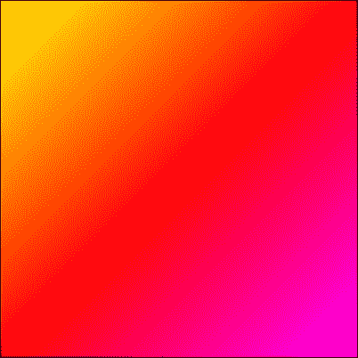

Qt 可以处理线性（`QLinearGradient`）、径向（`QRadialGradient`）和锥形（`QConicalGradient`）渐变。它附带了一个示例（如下面的屏幕截图所示），其中可以看到不同的渐变效果。此示例位于`examples/widgets/painting/gradients`。

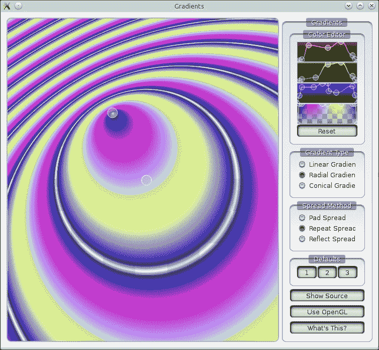

至于笔，它的主要属性是其宽度（以像素为单位），它决定了形状轮廓的厚度。一个特殊的宽度设置是`0`，这构成了所谓的装饰性笔，无论对画家应用什么变换，它总是以 1 像素宽的线条绘制（我们稍后会介绍这一点）。当然，笔可以设置颜色，但除此之外，您还可以使用任何画笔作为笔。这种操作的结果是，您可以使用渐变或纹理绘制形状的粗轮廓。

对于笔来说，还有三个更重要的属性。第一个是笔的样式，通过`QPen::setStyle()`设置。它决定了笔绘制的线条是连续的还是以某种方式分割的（虚线、点等）。您可以在以下图中看到可用的线条样式及其对应的常量：


第二个属性是帽样式，可以是平的、方的或圆的。第三个属性——连接样式——对于多段线轮廓很重要，它决定了多段线的不同部分是如何连接的。您可以使连接尖锐（使用`Qt::MiterJoin`），圆形（`Qt::RoundJoin`），或者两者的混合（`Qt::BevelJoin`）。您可以通过启动以下截图所示的路径描边示例来查看不同的笔属性配置（包括不同的连接和帽样式）：

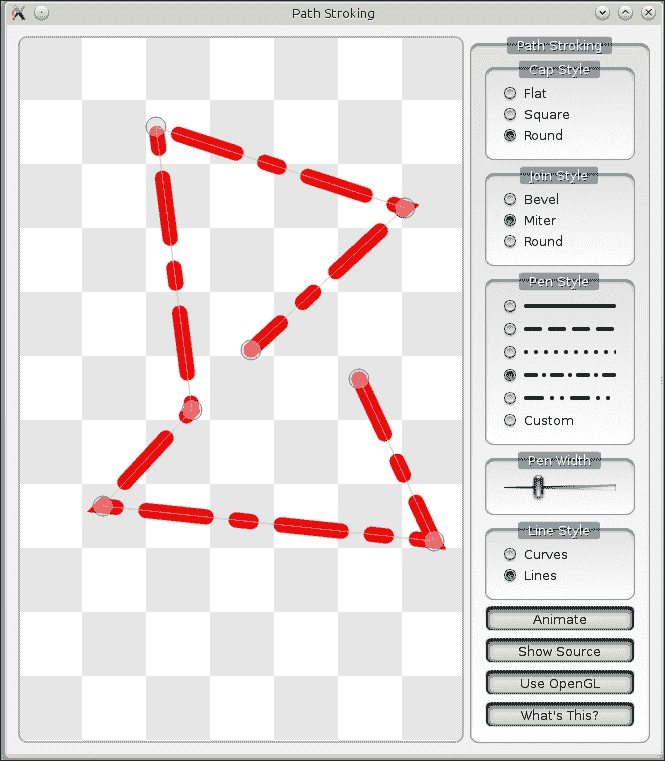

画家的下一个重要方面是其坐标系。实际上，画家有两个坐标系。一个是它自己的逻辑坐标系，它使用实数进行操作，另一个是画家操作的设备的物理坐标系。逻辑坐标系上的每个操作都会映射到设备的物理坐标，并在那里应用。让我们首先解释逻辑坐标系，然后我们将看到这与物理坐标有什么关系。

画家代表一个无限大的笛卡尔画布，默认情况下水平轴指向右，垂直轴指向下。可以通过对其应用仿射变换来修改系统——平移、旋转、缩放和剪切。这样，您可以通过执行一个循环来绘制一个模拟时钟面，每个小时用一条线标记，该循环将坐标系旋转 30 度，并在新获得的坐标系中绘制一条垂直线。另一个例子是当您希望绘制一个简单的图表，其中*x*轴向右，*y*轴向上。为了获得正确的坐标系，您需要在垂直方向上将坐标系缩放为`-1`，从而有效地反转垂直轴的方向。

我们在这里描述的修改了由`QTransform`类实例表示的绘图者的世界变换矩阵。您可以通过在绘图者上调用`transform()`来查询矩阵的当前状态，您可以通过调用`setTransform()`来设置一个新的矩阵。`QTransform`有`scale()`、`rotate()`和`translate()`等方法来修改矩阵，但`QPainter`有直接操作世界矩阵的等效方法。在大多数情况下，使用这些方法会更可取。

每个绘图操作都使用逻辑坐标表示，经过世界变换矩阵，然后达到坐标操作的第二个阶段，即视图矩阵。绘图者有`viewport()`和`window()`矩形的观念。`viewport`矩形表示任意矩形的物理坐标，而`window`矩形表示相同的矩形，但在逻辑坐标中。将一个映射到另一个给出一个需要应用于每个绘制的原型的变换，以计算要绘制的物理设备的区域。默认情况下，这两个矩形与底层设备的矩形相同（因此不执行`window`-`viewport`映射）。这种变换在您希望使用除目标设备像素以外的测量单位执行绘图操作时很有用。例如，如果您想使用目标设备宽度和高度的百分比来表示坐标，您可以将窗口宽度和高度都设置为`100`。然后，要绘制从宽度 20%和高度 10%开始，到宽度 70%和高度 30%结束的线，您会告诉绘图者绘制从(`20`, `10`)到(`70`, `30`)的线。如果您想将这些百分比应用于图像的左半部分而不是整个区域，您只需将视口矩形设置为图像的左半部分。

### 小贴士

仅设置`window`和`viewport`矩形仅定义了坐标映射；它不会阻止绘图操作在`viewport`矩形之外绘制。如果您想有这种行为，您必须在绘图者上设置一个`clipping`矩形。

一旦正确设置了绘图者，您就可以开始发出绘图操作。`QPainter`有一套丰富的操作来绘制不同类型的原型。所有这些操作在其名称中都有`draw`前缀，后面跟着要绘制的原型的名称。因此，`drawLine`、`drawRoundedRect`和`drawText`等操作都可用，具有多个重载，通常允许我们使用不同的数据类型来表示坐标。这些可能是纯值（整数或实数），Qt 的类，如`QPoint`和`QRect`，或它们的浮点等效类——`QPointF`和`QRectF`。每个操作都是使用当前的绘图者设置（字体、笔和画刷）执行的。

### 小贴士

要查看所有可用的绘图操作列表，请切换到 Qt Creator 中的 **帮助** 面板。在窗口顶部的下拉列表中选择 **索引**，然后输入 `qpainter`。确认搜索后，你应该会看到 `QPainter` 类的参考手册，其中列出了所有绘图操作。

在开始绘图之前，你必须告诉画家你希望在哪个设备上绘图。这是通过使用 `begin()` 和 `end()` 方法来完成的。前者接受一个指向 `QPaintDevice` 实例的指针并初始化绘图基础设施，后者标记绘图完成。通常，我们不需要直接使用这些方法，因为 `QPainter` 的构造函数会为我们调用 `begin()`，而析构函数会调用 `end()`。因此，典型的流程是实例化一个画家对象，传递设备，然后通过调用 `set` 和 `draw` 方法进行绘图，最后让画家在超出作用域时被销毁，如下所示：

```cpp
{
  QPainter painter(this); // paint on the current object
  QPen pen = Qt::red;
  pen.setWidth(2);
  painter.setPen(pen);
  painter.setBrush(Qt::yellow);
  painter.drawRect(0, 0, 100, 50);
}
```

我们将在本章的后续部分介绍 `draw` 家族中的更多方法。

## 小部件绘图

是时候通过在小部件上绘图来将一些内容真正显示到屏幕上了。小部件由于接收到一个名为 `QEvent::Paint` 的事件而被重新绘制，这个事件通过重写虚拟方法 `paintEvent()` 来处理。此方法接受一个类型为 `QPaintEvent` 的事件对象的指针，该对象包含有关重新绘制请求的各种信息。记住，你只能在 `paintEvent()` 调用内部对小部件进行绘图。

# 行动时间 – 自定义绘制小部件

让我们立即将我们的新技能付诸实践！

在 Qt Creator 中开始创建一个新的 **Qt Widgets 应用程序**，选择 `QWidget` 作为基类，并确保 **生成表单** 复选框未勾选。

切换到新创建类的头文件，在类中添加一个受保护的节，并为此节输入 `void paintEvent`。然后按键盘上的 *Ctrl* + 空格键，Creator 将会建议方法的参数。你应该得到以下代码：

```cpp
protected:
    void paintEvent(QPaintEvent *);
```

Creator 将光标定位在分号之前。按 *Alt* + *Enter* 将打开重构菜单，让你在实现文件中添加定义。绘制事件的常规代码是实例化小部件上的画家，如下所示：

```cpp
void Widget::paintEvent(QPaintEvent *)
{
  QPainter painter(this);
}
```

如果你运行此代码，小部件将保持空白。现在我们可以开始添加实际的绘图代码了：

```cpp
void Widget::paintEvent(QPaintEvent *)
{
  QPainter painter(this);
 QPen pen(Qt::black);
 pen.setWidth(4);
 painter.setPen(pen);
 QRect r = rect().adjusted(10, 10, -10, -10);
 painter.drawRoundedRect(r, 20, 10);
}
```

编译并运行代码，你将得到以下输出：


## *发生了什么事？*

首先，我们为画家设置了一个 2 像素宽的黑笔。然后我们调用 `rect()` 来检索小部件的几何矩形。通过调用 `adjusted()`，我们得到了一个新的矩形，其坐标（按左、上、右、下的顺序）被给定的参数修改，从而有效地给我们一个每边有 10 像素边距的矩形。

### 提示

Qt 通常提供两种方法，允许我们处理修改后的数据。调用`adjusted()`返回一个具有修改后属性的新对象，而如果我们调用`adjust()`，修改将就地完成。请特别注意你使用的方法，以避免意外结果。最好始终检查方法的返回值——它返回的是副本还是空值。

最后，我们调用`drawRoundedRect()`，该方法绘制一个矩形，其角落通过第二个和第三个参数（*x*，*y*顺序）给出的像素数进行圆滑处理。如果你仔细观察，你会注意到矩形有讨厌的锯齿状圆滑部分。这是由混叠效应引起的，其中逻辑线使用屏幕有限的分辨率进行近似；由于这个原因，一个像素要么完全绘制，要么完全不绘制。Qt 提供了一种称为抗锯齿的机制，通过在绘制圆角矩形之前在画家上设置适当的渲染提示来抵消这种效果。你可以通过在绘制圆角矩形之前在画家上设置适当的渲染提示来启用此机制，如下所示：

```cpp
void Widget::paintEvent(QPaintEvent *)
{
  QPainter painter(this);
 painter.setRenderHint(QPainter::Antialiasing, true);
  // …
}
```

现在，你会得到以下输出：

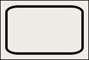

当然，这会对性能产生负面影响，因此只有在混叠效果明显的地方才使用抗锯齿。

# 行动时间 - 转换视口

让我们扩展我们的代码，以便所有未来的操作都只关注在绘制边框边界内，边框绘制完毕后。如下使用`window`和`viewport`转换：

```cpp
void Widget::paintEvent(QPaintEvent *) {
  QPainter painter(this);
  painter.setRenderHint(QPainter::Antialiasing, true);
  QPen pen(Qt::black);
  pen.setWidth(4);
  painter.setPen(pen);
  QRect r = rect().adjusted(10, 10, -10, -10);
  painter.drawRoundedRect(r, 20, 10);
 painter.save();
 r.adjust(2, 2, -2, -2);
 painter.setViewport(r);
 r.moveTo(0, -r.height()/2);
 painter.setWindow(r);
 drawChart(&painter, r);
 painter.restore();
}
```

还创建一个名为`drawChart()`的保护方法：

```cpp
void Widget::drawChart(QPainter *painter, const QRect &rect) {
  painter->setPen(Qt::red);
  painter->drawLine(0, 0, rect.width(), 0);
}
```

让我们看看我们的输出：

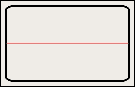

## *发生了什么？*

在新添加的代码中，我们首先调用`painter.save()`。此调用将画家的所有参数存储在一个内部堆栈中。然后我们可以修改画家状态（通过更改其属性、应用转换等），然后，如果我们想在任何时候返回到保存的状态，只需调用`painter.restore()`即可一次性撤销所有修改。

### 小贴士

`save()`和`restore()`方法可以按需调用。只需记住，始终将`save()`的调用与类似的`restore()`调用配对，否则内部画家状态将损坏。每次调用`restore()`都会将画家恢复到最后保存的状态。

状态保存后，我们再次调整矩形，以适应边框的宽度。然后，我们将新矩形设置为视口，通知画家操作坐标的物理范围。然后，我们将矩形移动到其高度的一半，并将其设置为画家窗口。这有效地将画家的原点放置在窗口高度的一半处。然后，调用`drawChart()`方法，在新的坐标系*x*轴上绘制一条红线。

# 行动时间 - 绘制示波图

让我们进一步扩展我们的小部件，使其成为一个简单的示波图渲染器。为此，我们需要让小部件记住一组值并将它们绘制成一系列线条。

让我们先添加一个`QList<quint16>`成员变量，它包含一个无符号 16 位整数值的列表。我们还将添加用于向列表添加值和清除列表的槽，如下所示：

```cpp
class Widget : public QWidget
{
  // ...
public slots:
 void addPoint(unsigned yVal) { m_points << qMax(0u, yVal); update(); }
 void clear() { m_points.clear(); update(); }
protected:
  // ...
 QList<quint16> m_points;
};
```

注意，每次修改列表都会调用一个名为`update()`的方法。这将安排一个绘图事件，以便我们的小部件可以用新值重新绘制。

绘图代码也很简单；我们只需遍历列表，并根据列表中的值绘制对称的蓝色线条。由于线条是垂直的，它们不会受到混叠的影响，因此我们可以禁用此渲染提示，如下所示：

```cpp
void Widget::drawChart(QPainter *painter, const QRect &rect) {
  painter->setPen(Qt::red);
  painter->drawLine(0, 0, rect.width(), 0);
 painter->save();
 painter->setRenderHint(QPainter::Antialiasing, false);
 painter->setPen(Qt::blue);
 for(int i=0;i < m_points.size(); ++i) {
 painter->drawLine(i, -m_points.at(i), i, m_points.at(i));
 }
 painter->restore();
}
```

要查看结果，请将以下循环添加到`main`中。这将用数据填充小部件：

```cpp
for(int i=0;i<450;++i) w.addPoint(qrand() % 120);
```

这个循环从`0`到`119`之间取一个随机数，并将其作为一个点添加到小部件中。运行此类代码的示例结果可以在下面的屏幕截图中看到：

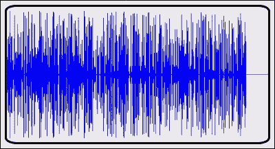

### 小贴士

如果你缩小窗口，你会注意到示波图超出了圆角矩形的边界。还记得剪裁吗？现在你可以通过在调用`drawChart()`之前添加一个简单的`painter.setClipRect(r)`调用来约束绘图。

## 输入事件

到目前为止，自定义小部件根本不具备交互性。尽管可以从源代码中操作小部件内容（例如，通过向图表添加新点），但小部件对任何用户操作（除了调整小部件大小，这会导致重绘）都充耳不闻。在 Qt 中，用户与小部件之间的任何交互都是通过向小部件传递事件来完成的。这类事件通常被称为输入事件，包括键盘事件和不同形式的指向设备事件——鼠标、平板和触摸事件。

在典型的鼠标事件流程中，小部件首先接收到鼠标按下事件，然后是一系列鼠标移动事件（当用户在鼠标按钮按下时移动鼠标时），最后是鼠标释放事件。小部件还可以接收到除了这些事件之外的额外鼠标双击事件。重要的是要记住，默认情况下，只有在鼠标移动时按下鼠标按钮时，才会传递鼠标移动事件。要接收鼠标移动事件而无需按下按钮，小部件需要激活一个称为**鼠标跟踪**的功能。

# 执行时间 – 使示波图可选择

是时候让我们的示波图小部件变得交互式了。我们将教会它添加几行代码，使用户能够选择图表的一部分。让我们从存储选择开始。我们需要两个可以通过只读属性访问的整数变量；因此，向类中添加以下两个属性（你可以将它们都初始化为`-1`）并实现它们的 getter：

```cpp
Q_PROPERTY(int selectionStart READ selectionStart NOTIFY selectionChanged)
Q_PROPERTY(int selectionEnd READ selectionEnd NOTIFY selectionChanged)
```

用户可以通过将鼠标光标拖动到图表上来更改选择。当用户在图表的某个位置按下鼠标按钮时，我们将该位置标记为选择的开始。拖动鼠标将确定选择的结束。事件命名的方案与绘图事件类似；因此，我们需要声明并实现以下两个受保护的方法：

```cpp
void Widget::mousePressEvent(QMouseEvent *mouseEvent) {
  m_selectionStart = m_selectionEnd = mouseEvent->pos().x() - 12;
  emit selectionChanged();
  update();
}
void Widget::mouseMoveEvent(QMouseEvent *mouseEvent) {
  m_selectionEnd = mouseEvent->pos().x() - 12;
  emit selectionChanged();
  update();
}
```

两个事件处理程序的结构类似。我们更新所需值，考虑到图表的左填充（12 像素），类似于我们在绘图时所做的。然后，发出一个信号并调用`update()`来安排小部件的重绘。

剩下的工作就是引入绘图代码的更改。我建议您添加一个类似于`drawChart()`的`drawSelection()`方法，但该方法在`drawChart()`之前立即从绘图事件处理程序中调用，如下所示：

```cpp
void Widget::drawSelection(QPainter *painter, const QRect &rect) {
  if(m_selectionStart < 0 ) return;
  painter->save();
  painter->setPen(Qt::NoPen);
  painter->setBrush(palette().highlight());
  QRect selectionRect = rect;
  selectionRect.setLeft(m_selectionStart);
  selectionRect.setRight(m_selectionEnd);
  painter->drawRect(selectionRect);
  painter->restore();
}
```

首先，我们检查是否需要绘制任何选择。然后，我们保存绘图器的状态并调整绘图器的笔和画刷。笔被设置为`Qt::NoPen`，这意味着绘图器不应绘制任何轮廓。为了确定画刷，我们使用`palette()`；这返回一个包含小部件基本颜色的`QPalette`对象。对象中包含的颜色之一是常用于标记选择的突出显示颜色。如果您使用调色板中的条目而不是手动指定颜色，那么当类的用户修改调色板时，这种修改会被我们的小部件代码考虑在内。

### 提示

您可以使用小部件中的调色板中的其他颜色来绘制小部件中的其他内容。您甚至可以在小部件的构造函数中定义自己的`QPalette`对象，以提供默认颜色。

最后，我们调整要绘制的矩形并发出绘图调用。

当您运行此程序时，您会注意到选择颜色与图表本身的对比度不是很好。为了克服这个问题，一个常见的方法是用不同的（通常是反转的）颜色绘制“已选择”的内容。在这种情况下，可以通过稍微修改`drawChart()`代码轻松应用：

```cpp
for(int i=0; i < m_points.size(); ++i) {
 if(m_selectionStart <= i && m_selectionEnd >=i) {
 painter->setPen(Qt::white);
 } else
 painter->setPen(Qt::blue);
  painter->drawLine(i, -m_points.at(i), i, m_points.at(i));
}
```

现在您可以看到以下输出：


## 尝试一下英雄 – 只对左鼠标按钮做出反应

作为练习，您可以修改事件处理代码，使其仅在鼠标事件由左键触发时更改选择。要查看哪个按钮触发了鼠标按下事件，您可以使用`QMouseEvent::button()`方法，该方法对于左键返回`Qt::LeftButton`，对于右键返回`Qt::RightButton`，依此类推。

处理触摸事件是不同的。对于任何此类事件，你都会收到对`touchEvent()`虚拟方法的调用。此类调用的参数是一个对象，可以检索用户当前触摸的点列表，以及有关用户交互历史（触摸是否刚刚开始或点是否之前被按下并移动）以及用户施加到点的力的附加信息。请注意，这是一个低级框架，允许你精确地跟踪触摸交互的历史。如果你对高级手势识别（平移、捏合和滑动）更感兴趣，有专门的事件系列可供使用。

处理手势是一个两步过程。首先，你需要通过调用`grabGesture()`并在其中传入你想要处理的手势类型来在你的小部件上激活手势识别。这样的代码的好地方是小部件构造函数。

然后，你的小部件将开始接收手势事件。没有专门的手势事件处理程序，但幸运的是，所有对象的事件都通过其`event()`方法流动，我们可以重新实现它。以下是一些处理平移手势的示例代码：

```cpp
bool Widget::event(QEvent *e) {
  if(e->type() == QEvent::Gesture) {
    QGestureEvent *gestureEvent = static_cast<QGestureEvent*>(e);
    QGesture *pan  = gestureEvent->gesture(Qt::PanGesture);
    if(pan) {
      handlePanGesture(static_cast<QPanGesture*>(pan));
    }
  }
  return QWidget::event(e);
}
```

首先，检查事件类型；如果它与预期值匹配，则将事件对象转换为`QGestureEvent`。然后，询问事件是否识别出`Qt::PanGesture`。最后，调用`handlePanGesture`方法。你可以实现这样的方法来处理你的平移手势。

## 处理图像

Qt 有两个用于处理图像的类。第一个是`QImage`，更侧重于直接像素操作。你可以检查图像的大小或检查和修改每个像素的颜色。你可以将图像转换为不同的内部表示（例如从 8 位调色板到带有预乘 alpha 通道的完整 32 位颜色）。然而，这种类型并不适合渲染。为此，我们有一个不同的类，称为`QPixmap`。这两个类之间的区别在于`QImage`始终保留在应用程序内存中，而`QPixmap`只能是一个指向可能位于图形卡内存或远程*X*服务器上的资源的句柄。它相对于`QImage`的主要优势是它可以非常快速地渲染，但代价是无法访问像素数据。你可以自由地在两种类型之间转换，但请记住，在某些平台上，这可能是一个昂贵的操作。始终考虑哪个类更适合你的特定情况。如果你打算裁剪图像、用某种颜色着色或在其上绘制，`QImage`是一个更好的选择。但如果你只是想渲染一些图标，最好将它们保持为`QPixmap`实例。

### 加载

加载图像非常简单。`QPixmap` 和 `QImage` 都有构造函数，它们简单地接受包含图像的文件的路径。Qt 通过实现不同图像格式读取和写入操作的插件来访问图像数据。不深入插件细节，只需说明默认的 Qt 安装支持读取以下图像类型：

| 类型 | 描述 |
| --- | --- |
| BMP | Windows 位图 |
| GIF | 图像交换格式 |
| ICO | Windows 图标 |
| JPEG | 联合摄影专家小组 |
| MNG | 多图像网络图形 |
| PNG | 可移植网络图形 |
| PPM/PBM/PGM | 可移植任意映射 |
| SVG | 可缩放矢量图形 |
| TIFF | 标签图像文件格式 |
| XBM | X 位图 |
| XPM | X 图像 |

如你所见，大多数流行的图像格式都是可用的。通过安装额外的插件，列表可以进一步扩展。

### 小贴士

你可以通过调用静态方法 `QImageReader::supportedImageFormats()` 来请求 Qt 支持的图像类型列表，该方法返回 Qt 可以读取的格式列表。对于可写格式的列表，请调用 `QImageWriter::supportedFileFormats()`。

也可以直接从现有的内存缓冲区加载图像。这可以通过两种方式完成。第一种是使用 `loadFromData()` 方法（它存在于 `QPixmap` 和 `QImage` 中），其行为与从文件加载图像时相同——你传递一个数据缓冲区和缓冲区的大小，然后根据这些信息，加载器通过检查头部数据来确定图像类型，并将图片加载到 `QImage` 或 `QPixmap` 中。第二种情况是当你没有存储在“文件类型”如 JPEG 或 PNG 中的图像，而是有原始像素数据本身。在这种情况下，`QImage` 提供了一个构造函数，它接受一个数据块的指针以及图像的大小和数据格式。格式不是如前面列出的文件格式，而是一个表示单个像素数据的内存布局。

最流行的格式是 `QImage::Format_ARGB32`，这意味着每个像素由 32 位（4 字节）的数据表示，这些数据在 alpha、红色、绿色和蓝色通道之间平均分配——每个通道 8 位。另一种流行的格式是 `QImage::Format_ARGB32_Premultiplied`，其中红色、绿色和蓝色通道的值在乘以 alpha 通道的值之后存储，这通常会导致渲染速度更快。你可以通过调用 `convertToFormat()` 方法来更改内部数据表示。例如，以下代码将真彩色图像转换为 256 种颜色，其中每个像素的颜色由颜色表中索引表示：

```cpp
QImage trueColor(image.png);
QImage indexed = trueColor.convertToFormat(QImage::Format_Indexed8);
```

颜色表本身是一个颜色定义的向量，可以使用 `colorTable()` 方法获取，并使用 `setColorTable()` 方法替换。将索引图像转换为灰度的最简单方法是调整其颜色表如下：

```cpp
QImage indexed = …;
QVector<QRgb> ct = indexed.colorTable();
for(int i=0;i<ct.size();++i) ct[i] = qGray(ct[i]);
indexed.setColorTable(ct);
```

### 修改

修改图像像素数据有两种方式。第一种仅适用于 `QImage`，涉及使用 `setPixel()` 调用直接操作像素，该调用接受像素坐标和要设置的像素颜色。第二种方式适用于 `QImage` 和 `QPixmap`，利用这两个类都是 `QPaintDevice` 的子类这一事实。因此，你可以在这类对象上打开 `QPainter` 并使用其绘图 API。以下是一个绘制带有蓝色矩形和红色圆圈的位图的示例：

```cpp
QPixmap px(256, 256);
px.fill(Qt::transparent);
QPainter painter(&px);
painter.setPen(Qt::NoPen);
painter.setBrush(Qt::blue);
QRect r = px.rect().adjusted(10, 10, -10, -10);
painter.drawRect(r);
painter.setBrush(Qt::red);
painter.drawEllipse(r);
```

首先，我们创建一个 256 x 256 的位图，并用透明颜色填充它。然后，我们在其上打开一个绘图器，并调用一系列绘制蓝色矩形和红色圆圈的调用。

`QImage` 还提供了一系列用于变换图像的方法，包括 `scaled()`、`mirrored()`、`transformed()` 和 `copy()`。它们的 API 很直观，所以我们在这里不讨论它们。

### 绘制

在其基本形式中，绘制图像就像从 `QPainter` API 调用 `drawImage()` 或 `drawPixmap()` 一样简单。这两个方法有不同的变体，但基本上它们都允许指定要绘制给定图像或位图的哪个部分以及在哪里绘制。值得注意的是，绘制位图比绘制图像更受欢迎，因为图像必须首先转换为位图，然后才能绘制。

如果你有很多位图需要绘制，一个名为 `QPixmapCache` 的类可能会很有用。它为位图提供了一个应用程序范围内的缓存。通过使用它，你可以加快位图加载速度，同时限制内存使用量。

## 绘制文本

使用 `QPainter` 绘制文本值得单独解释，不是因为其复杂，而是因为 Qt 在这方面提供了很多灵活性。一般来说，绘制文本是通过调用 `QPainter::drawText()` 或 `QPainter::drawStaticText()` 来实现的。我们先关注前者，它允许绘制通用文本。

绘制一些文本的最基本调用是这个方法的变体，它接受 *x* 和 *y* 坐标以及要绘制的文本：

```cpp
painter.drawText(10, 20, "Drawing some text at (10, 20)");
```

前面的调用在水平位置 10 处绘制了给定的文本，并将文本的基线垂直放置在位置 20。文本使用绘图器的当前字体和笔来绘制。坐标也可以作为 `QPoint` 实例传递，而不是分别给出 *x* 和 *y* 值。这个方法的问题在于它对文本的绘制控制很少。一个更灵活的变体是允许我们给出一系列标志，并将文本的位置表示为一个矩形而不是一个点。标志可以指定文本在给定矩形内的对齐方式，或者指示渲染引擎关于文本换行和裁剪的指令。你可以在以下图像中看到向调用提供不同组合的标志的结果：

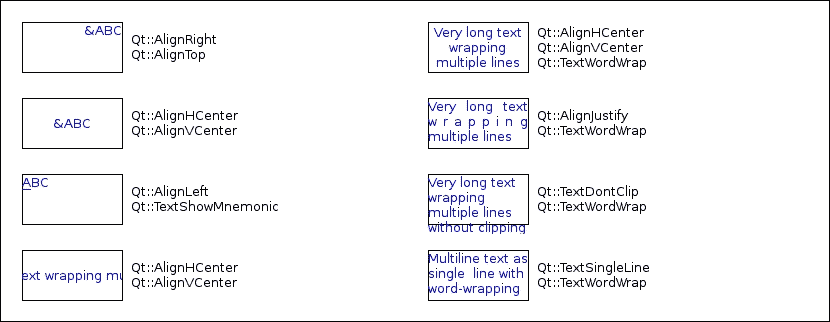

为了获得前面的每个结果，运行类似于以下代码的代码：

```cpp
painter.drawText(rect, Qt::AlignLeft|Qt::TextShowMnemonic, "&ABC");
```

你可以看到，除非你设置了 `Qt::TextDontClip` 标志，否则文本会被剪切到给定的矩形内；设置 `Qt::TextWordWrap` 允许文本换行，而 `Qt::TextSingleLine` 使得引擎忽略遇到的任何换行符。

### 静态文本

Qt 在布局文本时需要进行一系列的计算，并且每次渲染文本时都必须执行这些计算。如果自上次渲染以来文本及其属性没有发生变化，这将是一种时间的浪费。为了避免重新计算布局的需要，引入了静态文本的概念。

要使用它，实例化 `QStaticText` 并用你想要渲染的文本以及你可能希望它具有的任何选项（保持为 `QTextOption` 实例）进行初始化。然后，将对象存储在某个地方，每次你想渲染文本时，只需调用 `QPainter::drawStaticText()`，并将静态文本对象传递给它。如果自上次绘制文本以来文本的布局没有发生变化，则不会重新计算，从而提高性能。以下是一个使用静态文本方法简单地绘制文本的自定义小部件的示例：

```cpp
class TextWidget : public QWidget {
public:
  TextWidget(QWidget *parent = 0) : QWidget(parent) {}
  void setText(const QString &txt) {
    m_staticText.setText(txt);
    update();
  }
protected:
  void paintEvent(QPaintEvent *) {
    QPainter painter(this);
    paitner.drawStaticText(0, 0, m_staticText);
  }
private:
  QStaticText m_staticText;
};
```

### 富文本

到目前为止，我们已经看到了如何绘制所有符号都使用相同属性（字体、颜色和样式）渲染的文本，并且作为字符的连续流进行布局。虽然很有用，但这不处理我们想要使用不同颜色标记文本部分或以不同方式对其对齐的情况。为了使其工作，我们可能需要执行一系列带有修改后的画家属性和手动计算文本位置的 `drawText` 调用。幸运的是，有更好的解决方案。

Qt 通过其 `QTextDocument` 类支持复杂的文档格式。使用它，我们可以以类似文本处理器的风格操纵文本，对文本段落或单个字符应用格式。然后，我们可以根据我们的需求布局和渲染生成的文档。

虽然很有用且功能强大，但如果我们只想用简单的自定义应用来绘制少量文本，构建 `QTextDocument` 就太复杂了。Qt 的作者们也考虑了这一点，并实现了一种富文本模式来渲染文本。启用此模式后，你可以直接使用 HTML 标签的子集来指定格式化文本给 `drawText`，以获得如更改文本颜色、加下划线或使其成为上标等格式化效果。在给定矩形内绘制居中加下划线的标题，然后跟一个完全对齐的描述，就像发出以下调用一样简单：

```cpp
painter.drawText(rect,
  "<div align='center'><b>Disclaimer</b></div>"
  "<div align='justify'>You are using <i>this software</i> "
  "at your own risk. The authors of the software do not give "
  "any warranties that using this software will not ruin your "
  "business.</div>");
```

### 小贴士

Qt 的富文本引擎没有实现完整的 HTML 规范；它不会处理层叠样式表、超链接、表格或 JavaScript。Qt 参考手册中的“支持的 HTML 子集”页面描述了哪些 HTML 4 标准的部分被支持。如果您需要完整的 HTML 支持，您将不得不使用 Qt 的网页和小部件类，这些类包含在 `webkitwidgets`（类 `QWebPage` 和 `QWebView`）或 `webenginewidgets`（类 `QWebEnginePage` 和 `QWebEngineView`）模块中。

## 优化绘制

在游戏编程中，性能通常是瓶颈。Qt 尽力做到尽可能高效，但有时代码需要额外的调整才能运行得更快。使用静态文本而不是常规文本就是这样一种调整；尽可能使用它。

另一个重要的技巧是，除非确实需要，否则避免重新渲染整个小部件。一方面，传递给 `paintEvent()` 的 `QPaintEvent` 对象包含有关需要重绘的小部件区域的信息。如果您的部件逻辑允许，您可以通过仅渲染所需部分来优化此过程。

# 行动时间 - 优化示波器绘制

作为练习，我们将修改我们的示波器小部件，使其仅重新渲染所需的数据部分。第一步是修改绘制事件处理代码，以获取需要更新的区域信息并将其传递给绘制图表的方法。这里已经突出显示了更改的部分代码：

```cpp
void Widget::paintEvent(QPaintEvent *pe)
{
 QRect exposedRect = pe->rect();
  ...
 drawSelection(&painter, r, exposedRect);
 drawChart(&painter, r, exposedRect);
  painter.restore();
}
```

下一步是修改 `drawSelection()` 以仅绘制与暴露矩形相交的选择部分。幸运的是，`QRect` 提供了一个为我们计算交集的方法：

```cpp
void Widget::drawSelection(QPainter *painter, const QRect &rect, const QRect &exposedRect)
{
    // ...
    QRect selectionRect = rect;
    selectionRect.setLeft(m_pressX);
    selectionRect.setRight(m_releaseX);
 painter->drawRect(selectionRect.intersected(exposedRect));
    painter->restore();
}
```

最后，`drawChart` 需要调整以省略暴露矩形外的值：

```cpp
void Widget::drawChart(QPainter *painter, const QRect &rect, const QRect &exposedRect)
{
  painter->setPen(Qt::red);
 painter->drawLine(exposedRect.left(), 0, exposedRect.width(), 0);
  painter->save();
  painter->setRenderHint(QPainter::Antialiasing, false);
 const int lastPoint = qMin(m_points.size(), exposedRect.right()+1);
 for(int i=exposedRect.left(); i < lastPoint; ++i) {
    if(m_selectionStart <= i && m_selectionEnd >=i) {
      painter->setPen(Qt::white);
    } else
    painter->setPen(Qt::blue);
    painter->drawLine(i, -m_points.at(i), i, m_points.at(i));
  }
    painter->restore();
}
```

## *刚才发生了什么？*

通过实施这些更改，我们已经有效地将绘制区域减少到事件接收到的矩形。在这种情况下，我们不会节省太多时间，因为绘制图表并不那么耗时；然而，在许多情况下，您将能够通过这种方法节省大量时间。例如，如果我们需要绘制一个游戏世界的非常详细的地形图，如果只有一小部分被修改，重新绘制整个地图将非常昂贵。我们可以通过利用暴露区域的信息来轻松减少计算和绘图调用的数量。

利用暴露矩形已经是提高效率的良好步骤，但我们还可以更进一步。当前的方法要求我们在暴露矩形内重新绘制每一行图表，这仍然需要一些时间。相反，我们可以将这些线条只绘制一次到位图中，然后，每当小部件需要重新绘制时，告诉 Qt 将位图的一部分渲染到小部件上。这种方法通常被称为“双缓冲”（第二个缓冲区是作为缓存的位图）。

## 英雄，尝试实现一个双缓冲的示波器

现在应该很容易为你示例控件实现这种方法。主要区别是，对绘图内容的每次更改不应导致调用`update()`，而应调用将重新渲染位图并随后调用`update()`的调用。`paintEvent`方法因此变得非常简单：

```cpp
void Widget::paintEvent(QPaintEvent *pe)
{
  QRect exposedRect = pe->rect();
  QPainter painter(this);
  painter.drawPixmap(exposedRect, pixmap(), exposedRect);
}
```

你还需要在控件大小调整时重新渲染位图。这可以通过在`void resizeEvent(QResizeEvent*)`方法内部完成。

到目前为止，你已经准备好运用你新获得的使用 Qt 渲染图形的技能来创建一个使用自定义图形的控件游戏。今天的英雄将是象棋和其他类似象棋的游戏。

# 行动时间——开发游戏架构

创建一个新的**Qt Widgets 应用程序**项目。在项目基础设施准备就绪后，从**文件**菜单中选择**新建文件或项目**，然后选择创建一个**C++ 类**。将新类命名为`ChessBoard`，并将`QObject`设置为它的基类。重复此过程创建一个从`QObject`派生的`GameAlgorithm`类，另一个名为`ChessView`，但这次，选择`QWidget`作为基类。你应该最终得到一个名为`main.cpp`的文件和四个类——`MainWindow`、`ChessView`、`ChessBoard`和`ChessAlgorithm`。

现在，导航到`ChessAlgorithm`的头文件，并向该类添加以下方法：

```cpp
public:
  ChessBoard* board() const;
public slots:
  virtual void newGame();
signals:
  void boardChanged(ChessBoard*);
protected:
  virtual void setupBoard();
  void setBoard(ChessBoard *board);
```

还要添加一个私有的`m_board`字段，类型为`ChessBoard*`。记住要么包含`chessboard.h`，要么提前声明`ChessBoard`类。实现`board()`作为一个简单的获取`m_board`的方法。`setBoard()`方法将是一个受保护的设置器`m_board`：

```cpp
void ChessAlgorithm::setBoard(ChessBoard *board)
{
    if(board == m_board) return;
    if(m_board) delete m_board;
    m_board = board;
    emit boardChanged(m_board);
}
```

接下来，让我们提供一个`setupBoard()`的基础实现来创建一个默认的棋盘，具有八个等级和八个列：

```cpp
void ChessAlgorithm::setupBoard()
{
    setBoard(new ChessBoard(8,8, this));
}
```

准备棋盘的自然地方是在启动新游戏时执行的功能中：

```cpp
void ChessAlgorithm::newGame()
{
    setupBoard();
}
```

目前对这个类最后的添加是扩展提供的构造函数以初始化`m_board`为空指针。

在最后显示的方法中，我们实例化了一个`ChessBoard`对象，所以现在让我们专注于这个类。首先扩展构造函数以接受两个额外的整数参数，除了常规的父参数。将这些值存储在私有的`m_ranks`和`m_columns`字段中（记住在类头文件中声明这些字段本身）。

在头文件中，在`Q_OBJECT`宏下方，添加以下两行作为属性定义：

```cpp
  Q_PROPERTY(int ranks READ ranks NOTIFY ranksChanged)
  Q_PROPERTY(int columns READ columns NOTIFY columnsChanged)
```

声明信号并实现获取方法以与这些定义协同工作。还要添加两个受保护的函数：

```cpp
protected:
    void setRanks(int newRanks);
    void setColumns(int newColumns);
```

这些将是等级和列属性的设置器，但我们不希望将它们暴露给外部世界，因此我们将给予它们`protected`访问范围。

将以下代码放入`setRanks()`方法体中：

```cpp
void ChessBoard::setRanks(int newRanks)
{
    if(ranks() == newRanks) return;
    m_ranks = newRanks;
    emit ranksChanged(m_ranks);
}
```

接下来，以类似的方式，你可以实现`setColumns()`。

我们现在要处理的最后一个类是我们的自定义小部件，`ChessView`。目前，我们只为一个方法提供一个基本的实现，但我们将随着实现的扩展而扩展它。添加一个公共的`setBoard(ChessBoard *)`方法，其内容如下：

```cpp
void ChessView::setBoard(ChessBoard *board)
{
    if(m_board == board) return;

    if(m_board) {
    // disconnect all signal-slot connections between m_board and this
        m_board->disconnect(this);
    }
    m_board = board;
    // connect signals (to be done later)
    updateGeometry();
}
```

现在我们来声明`m_board`成员。因为我们不是棋盘对象的所有者（算法类负责管理它），我们将使用`QPointer`类，该类跟踪`QObject`的生命周期，并在对象被销毁后将其自身设置为 null：

```cpp
private:
  QPointer<ChessBoard> m_board;
```

`QPointer`将其值初始化为 null，因此我们不需要在构造函数中自己进行初始化。为了完整性，让我们提供一个获取棋盘的方法：

```cpp
ChessBoard *ChessView::board() const { return m_board; }
```

## *刚才发生了什么？*

在上一个练习中，我们定义了我们解决方案的基本架构。我们可以看到涉及三个类：`ChessView`作为用户界面，`ChessAlgorithm`用于驱动实际游戏，以及`ChessBoard`作为视图和引擎之间共享的数据结构。算法将负责设置棋盘（通过`setupBoard()`），进行移动，检查胜利条件等。视图将渲染棋盘的当前状态，并将用户交互信号传递给底层逻辑。


大部分代码都是自解释的。您可以在`ChessView::setBoard()`方法中看到，我们正在断开旧棋盘对象的所有信号，连接新对象（我们将在定义了它们之后回来连接信号），最后告诉小部件更新其大小并使用新棋盘重新绘制自己。

# 行动时间 – 实现游戏棋盘类

现在我们将关注我们的数据结构。向`ChessBoard`添加一个新的私有成员，它是一个字符向量，将包含关于棋盘上棋子的信息：

```cpp
QVector<char> m_boardData;
```

考虑以下表格，它显示了棋子类型及其所用的字母：

| 棋子类型 | 白色 | 黑色 |
| --- | --- | --- |
|  | 国王 | K | k |
|  | 后 | Q | q |
|  | 车 | R | r |
|  | 象 | B | b |
|  | 马兵 | N | n |
|  | 兵 | P | P |

你可以看到，白棋使用大写字母，而黑棋使用相同字母的小写变体。此外，我们还将使用空格字符（ASCII 值为 0x20）来表示一个字段为空。我们将添加一个受保护的方法来根据棋盘上的行数和列数设置一个空棋盘，并添加一个`boardReset()`信号来通知棋盘上的位置已更改：

```cpp
void ChessBoard::initBoard()
{
  m_boardData.fill(' ', ranks()*columns());
  emit boardReset();
}
```

我们可以更新我们的设置行数和列数的方法，以便使用该方法：

```cpp
void ChessBoard::setRanks(int newRanks)
{
  if(ranks() == newRanks) return;
  m_ranks = newRanks;
 initBoard();
  emit ranksChanged(m_ranks);
}

void ChessBoard::setColumns(int newColumns)
{
  if(columns() == newColumns) return;
  m_columns = newColumns;
 initBoard();
  emit columnsChanged(m_columns);
}
```

`initBoard()`方法也应该在构造函数内部调用，所以也要在那里放置调用。

接下来，我们需要一个方法来读取棋盘特定字段中放置的是哪个棋子。

```cpp
char ChessBoard::data(int column, int rank) const
{ 
  return m_boardData.at((rank-1)*columns()+(column-1)); 
}
```

行和列的索引从 1 开始，但数据结构是从 0 开始的；因此，我们必须从行和列索引中减去 1。还需要有一个方法来修改棋盘的数据。实现以下公共方法：

```cpp
void ChessBoard::setData(int column, int rank, char value)
{
  if(setDataInternal(column, rank, value))
    emit dataChanged(column, rank);
}
```

该方法利用另一个实际执行工作的方法。然而，这个方法应该声明为`protected`访问范围。我们再次调整索引差异。

```cpp
bool ChessBoard::setDataInternal(int column, int rank, char value)
{
  int index = (rank-1)*columns()+(column-1);
  if(m_boardData.at(index) == value) return false;
  m_boardData[index] = value;
  return true;
}
```

由于`setData()`使用了一个信号，我们也要声明它：

```cpp
signals:
  void ranksChanged(int);
  void columnsChanged(int);
 void dataChanged(int c, int r);
  void boardReset();
```

每当棋盘上的情况成功更改时，将发出该信号。我们将实际工作委托给受保护的方法，以便在不发出信号的情况下修改棋盘。

定义了`setData()`之后，我们可以添加另一个方便的方法：

```cpp
void ChessBoard::movePiece(int fromColumn, int fromRank, int toColumn, int toRank)
{
  setData(toColumn, toRank, data(fromColumn, fromRank));
  setData(fromColumn, fromRank, ' ');
}
```

你能猜到它做什么吗？没错！它将一个棋子从一个字段移动到另一个字段，并在后面留下一个空位。

仍然有一个值得实现的方法。标准的国际象棋游戏包含 32 个棋子，而游戏变体中棋子的起始位置可能不同。通过单独调用`setData()`来设置每个棋子的位置将非常繁琐。幸运的是，有一种整洁的国际象棋记法称为**福赛斯-爱德华斯记法**（**FEN**），它可以存储为单行文本，以表示游戏的完整状态。如果你想知道记法的完整定义，你可以自己查找。简而言之，我们可以这样说，文本字符串按行列出棋子的放置，从最后一行开始，每个位置由一个字符描述，该字符被解释为我们的内部数据结构（`K`代表白王，`q`代表黑后，等等）。每个行描述由一个`/`字符分隔。如果棋盘上有空位，它们不会存储为空格，而是存储为指定连续空位数量的数字。因此，标准游戏的起始位置可以写成如下：

```cpp
"rnbqkbnr/pppppppp/8/8/8/8/PPPPPPPP/RNBQKBNR"
```

这可以如下直观地解释：

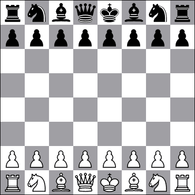

让我们编写一个名为`setFen()`的方法，根据 FEN 字符串设置棋盘：

```cpp
void ChessBoard::setFen(const QString &fen)
{
  int index = 0;
  int skip = 0;
  const int columnCount = columns();
  QChar ch;
  for(int rank = ranks(); rank >0; --rank) {
    for(int column = 1; column <= columnCount; ++column) {
      if(skip > 0) {
        ch = ' ';
        skip--;
      } else {
        ch = fen.at(index++);
        if(ch.isDigit()) {
          skip = ch.toLatin1()-'0';
          ch = ' ';
          skip--;
        }
      }
      setDataInternal(column, rank, ch.toLatin1());
    }
    QChar next = fen.at(index++);
    if(next != '/' && next != ' ') {
      initBoard();
      return; // fail on error
    }
  }
  emit boardReset();
}
```

该方法遍历棋盘上的所有方格，并确定它是否正在中间插入空方格，或者应该从字符串中读取下一个字符。如果遇到数字，它将通过减去 0 字符的 ASCII 值（即 *7-0 = 7*）将其转换为整数。设置每个等级后，我们要求从字符串中读取一个斜杠或空格。否则，我们将棋盘重置为空棋盘，并退出该方法。

## *刚才发生了什么？*

我们教会了 `ChessBoard` 类使用字符的单维数组存储关于棋子的简单信息。我们还为其配备了允许查询和修改游戏数据的方法。我们通过采用 FEN 标准来实现设置游戏当前状态的一种快速方法。游戏数据本身并不局限于经典象棋。尽管我们遵守了描述棋子的标准记法，但可以使用其他字母和字符，这些字母和字符超出了定义良好的棋子集。这为存储类似棋类游戏（如国际象棋）的信息提供了一种灵活的解决方案，可能还可以用于任何其他在任意大小、带有等级和列的二维棋盘上进行的自定义游戏。我们提出的数据结构并非愚蠢——它通过在游戏状态修改时发出信号与其环境进行通信。

# 行动时间 - 理解 ChessView 类

这是一章关于图形制作的章节，因此现在是时候专注于显示我们的棋盘游戏了。我们的小部件目前什么也不显示，我们的第一个任务将是显示带有等级和列符号以及适当着色的棋盘。

默认情况下，小部件没有定义任何合适的尺寸，我们将通过实现 `sizeHint()` 来解决这个问题。然而，为了能够计算尺寸，我们必须决定棋盘上单个方格的大小。因此，在 `ChessView` 中，你应该声明一个包含方格大小的属性，如下所示：

```cpp
Q_PROPERTY(QSize fieldSize 
           READ fieldSize WRITE setFieldSize 
           NOTIFY fieldSizeChanged)
```

为了加快编码速度，你可以将光标放在属性声明上，按 *Alt* + *Enter* 组合键，并从弹出菜单中选择 **生成缺失的 Q_PROPERTY 成员** 修复。Creator 将为你提供 getter 和 setter 的简单实现。你可以通过将光标放在每个方法上，按 *Alt* + *Enter*，并选择 **将定义移动到 chessview.cpp 文件** 修复，将生成的代码移动到实现文件中。虽然生成的 getter 方法是好的，但 setter 需要一些调整。通过添加以下突出显示的代码来修改它：

```cpp
void ChessView::setFieldSize(QSize arg)
{
    if (m_fieldSize == arg)
        return;

    m_fieldSize = arg;
    emit fieldSizeChanged(arg);
 updateGeometry();
}
```

这告诉我们的小部件，每当方格的大小被修改时，就重新计算其大小。现在我们可以实现 `sizeHint()`：

```cpp
QSize ChessView::sizeHint() const
{
    if(!m_board) return QSize(100,100);
    QSize boardSize = QSize(fieldSize().width() * m_board->columns() +1,
    m_fieldSize.height() * m_board->ranks()   +1);
    int rankSize = fontMetrics().width('M')+4;
    int columnSize = fontMetrics().height()+4;
    return boardSize+QSize(rankSize, columnSize);
}
```

首先，我们检查是否有有效的棋盘定义，如果没有，则返回一个合理的 100 x 100 像素大小。否则，该方法通过将每个字段的大小乘以列数或等级数来计算所有字段的大小。我们在每个维度上添加一个像素以容纳右侧和底部的边框。棋盘不仅由字段本身组成，还在棋盘的左侧边缘显示等级符号，在棋盘的底部边缘显示列号。由于我们使用字母来枚举等级，我们使用`QFontMetrics`类检查字母表中字母的最宽宽度。我们使用相同的类来检查使用当前字体渲染一行文本所需的空间，以便我们有足够的空间放置列号。在这两种情况下，我们将结果增加 4，以便在文本和棋盘边缘之间以及文本和部件边缘之间留出 2 像素的边距。

定义一个辅助方法来返回包含特定字段的矩形非常有用，如下所示：

```cpp
QRect ChessView::fieldRect(int column, int rank) const
{
  if(!m_board) return QRect();
  const QSize fs = fieldSize();
  QRect fRect = QRect(QPoint((column-1)*fs.width(), (m_board->ranks()-rank)*fs.height()), fs);
  // offset rect by rank symbols
  int offset = fontMetrics().width('M'); // 'M' is the widest letter
  return fRect.translated(offset+4, 0);
}
```

由于等级数字从棋盘顶部到底部递减，我们在计算`fRect`时从最大等级中减去所需的等级。然后，我们像在`sizeHint()`中做的那样计算等级符号的水平偏移量，并在返回结果之前通过该偏移量平移矩形。

最后，我们可以继续实现绘制事件的处理器。声明`paintEvent()`方法（在*Alt* + *Enter*键盘快捷键下可用的修复菜单将允许你生成方法的存根实现）并填充以下代码：

```cpp
void ChessView::paintEvent(QPaintEvent *event)
{
  if(!m_board) return;
  QPainter painter(this);
  for(int r = m_board->ranks(); r>0; --r) {
    painter.save();
    drawRank(&painter, r);
    painter.restore();
  }
  for(int c = 1; c<=m_board->columns();++c) {
    painter.save();
    drawColumn(&painter, c);
    painter.restore();
  }
  for(int r = 1; r<=m_board->ranks();++r) {
    for(int c = 1; c<=m_board->columns();++c) {
      painter.save();
      drawField(&painter, c, r);
      painter.restore();
    }
  }
}
```

处理器相当简单。首先，我们实例化一个在部件上操作的`QPainter`对象。然后我们有三个循环——第一个遍历行，第二个遍历列，第三个遍历所有字段。每个循环的体都非常相似：都有一个调用自定义绘图方法的调用，该方法接受指向绘图器的指针和行、列或两者的索引。每个调用都被执行`save()`和`restore()`操作包围在我们的`QPainter`实例周围。这些调用是做什么的？三个绘图方法——`drawRank()`、`drawColumn()`和`drawField()`——将是负责渲染行符号、列数字和字段背景的虚拟方法。将能够子类化`ChessView`并为这些渲染器提供自定义实现，以便能够提供不同的棋盘外观。由于这些方法都接受绘图器实例作为参数，因此这些方法的覆盖可以改变绘图器背后的属性值。在将绘图器传递给这样的覆盖之前调用`save()`会将它的状态存储在一个内部堆栈上，在覆盖返回后调用`restore()`会将绘图器重置为`save()`存储的状态。这实际上为我们提供了一个安全措施，以避免在覆盖没有清理自己修改的绘图器时破坏绘图器。

### 小贴士

频繁调用`save()`和`restore()`会引入性能损失，因此在时间敏感的情况下应避免过于频繁地保存和恢复绘图器状态。由于我们的绘图非常简单，所以在绘制棋盘时我们不必担心这一点。

介绍了我们的三种方法后，我们可以开始实施它们。让我们从`drawRank`和`drawColumn`开始。请记住将它们声明为虚拟的，并将它们放在受保护的访问范围内（这通常是 Qt 类放置此类方法的地点），如下所示：

```cpp
void ChessView::drawRank(QPainter *painter, int rank)
{
  QRect r = fieldRect(1, rank);
  QRect rankRect = QRect(0, r.top(), r.left(), r.height()).adjusted(2, 0, -2, 0);
  QString rankText = QString::number(rank);
  painter->drawText(rankRect, Qt::AlignVCenter|Qt ::AlignRight, rankText);
}

void ChessView::drawColumn(QPainter *painter, int column)
{
  QRect r = fieldRect(column, 1);
  QRect columnRect = QRect(r.left(), r.bottom(), 
    r.width(), height()-r.bottom()).adjusted(0, 2, 0, -2);
  painter->drawText(columnRect, Qt:: AlignHCenter|Qt::AlignTop, QChar('a'+column-1));
}
```

这两种方法非常相似。我们使用`fieldRect()`查询最左列和最底行的位置，然后根据这个位置计算行符号和列数字应该放置的位置。调用`QRect::adjusted()`是为了适应将要绘制的文本周围的 2 像素边距。最后，我们使用`drawText()`来渲染适当的文本。对于行，我们要求绘图器将文本对齐到矩形的右边缘并垂直居中。以类似的方式，在绘制列时，我们将文本对齐到顶部边缘并水平居中。

现在我们可以实现第三个绘图方法。它也应该被声明为受保护的虚拟方法。将以下代码放置在方法体中：

```cpp
void ChessView::drawField(QPainter *painter, int column, int rank)
{
  QRect rect = fieldRect(column, rank);
  QColor fillColor = (column+rank) % 2 ? palette().
    color(QPalette::Light) : palette().color(QPalette::Mid);
  painter->setPen(palette().color(QPalette::Dark));
  painter->setBrush(fillColor);
  painter->drawRect(rect);
}
```

在这个方法中，我们使用与每个部件耦合的 `QPalette` 对象来查询 `Light`（通常是白色）和 `Mid`（较暗）颜色，这取决于我们在棋盘上绘制的字段是被认为是白色还是黑色。我们这样做而不是硬编码颜色，以便可以通过调整调色板对象来修改瓷砖的颜色，而无需子类化。然后我们再次使用调色板来请求 `Dark` 颜色，并将其用作画家的笔。当我们用这样的设置绘制矩形时，笔将勾勒出矩形的边缘，使其看起来更优雅。注意我们如何在方法中修改画家的属性，并且在之后没有将它们设置回原位。我们可以这样做是因为 `save()` 和 `restore()` 调用包围了 `drawField()` 的执行。

我们现在准备好看到我们工作的结果。让我们切换到 `MainWindow` 类，并为其配备以下两个私有变量：

```cpp
ChessView *m_view;
ChessAlgorithm *m_algorithm;
```

然后通过添加以下突出显示的代码来修改构造函数，以设置视图和游戏引擎：

```cpp
MainWindow::MainWindow(QWidget *parent) :
  QMainWindow(parent),
  ui(new Ui::MainWindow)
{
  ui->setupUi(this);
 m_view = new ChessView;
 m_algorithm = new ChessAlgorithm(this);
 m_algorithm->newGame();
 m_view->setBoard(m_algorithm->board());
 setCentralWidget(m_view);
 m_view->setSizePolicy(QSizePolicy::Fixed, QSizePolicy::Fixed);
 m_view->setFieldSize(QSize(50,50));
  layout()->setSizeConstraint(QLayout::SetFixedSize);
}
```

此后，你应该能够构建项目。当你运行它时，你应该看到以下截图中的类似结果：


## *发生了什么？*

在这个练习中，我们做了两件事。首先，我们提供了一些方法来计算棋盘重要部分和部件大小的几何形状。其次，我们定义了三个用于渲染棋盘视觉原语的方法。通过使这些方法成为虚拟的，我们提供了一个基础设施，允许通过子类化和覆盖基本实现来自定义外观。此外，通过从 `QPalette` 读取颜色，我们允许自定义原语的颜色，即使不进行子类化也可以。

主窗口构造函数的最后一行告诉布局强制窗口大小等于其中部件的大小提示。

# 行动时间 - 渲染棋子

现在我们可以看到棋盘了，是时候在上面放置棋子了。我们将使用图像来完成这个任务。在我的情况下，我们找到了一些带有棋子的 SVG 文件，并决定使用它们。SVG 是一种矢量图形格式，其中所有曲线都不是定义为固定的一组点，而是定义为数学曲线。它们的主要优点是它们可以很好地缩放，而不会产生锯齿效应。

让我们为我们的视图配备一个用于“盖章”特定棋子类型的图像注册表。由于每个棋子类型都与字符相关联，我们可以使用它来生成图像映射的键。让我们将以下 API 放入 `ChessView`：

```cpp
public:
  void setPiece(char type, const QIcon &icon);
  QIcon piece(char type) const;
private:
  QMap<char,QIcon> m_pieces;
```

对于图像类型，我们不使用`QImage`或`QPixmap`，而是使用`QIcon`。这是因为`QIcon`可以存储不同尺寸的多个位图，并在我们请求绘制给定尺寸的图标时使用最合适的一个。如果我们使用矢量图像，这并不重要，但如果选择使用 PNG 或其他类型的图像，那就很重要了。在这种情况下，你可以使用`addFile()`向单个图标添加多个图像。

回到我们的注册表，实现非常简单。我们只需将图标存储在映射中，并要求小部件重新绘制自己：

```cpp
void ChessView::setPiece(char type, const QIcon &icon)
{
  m_pieces.insert(type, icon);
  update();
}

QIcon ChessView::piece(char type) const
{
  return m_pieces.value(type, QIcon());
}
```

现在我们可以在`MainWindow`构造函数内部创建视图后立即用实际图像填充注册表。请注意，我们已将所有图像存储在一个资源文件中，如下所示：

```cpp
m_view->setPiece('P', QIcon(":/pieces/Chess_plt45.svg")); // pawn
m_view->setPiece('K', QIcon(":/pieces/Chess_klt45.svg")); // king
m_view->setPiece('Q', QIcon(":/pieces/Chess_qlt45.svg")); // queen
m_view->setPiece('R', QIcon(":/pieces/Chess_rlt45.svg")); // rook
m_view->setPiece('N', QIcon(":/pieces/Chess_nlt45.svg")); // knight
m_view->setPiece('B', QIcon(":/pieces/Chess_blt45.svg")); // bishop

m_view->setPiece('p', QIcon(":/pieces/Chess_pdt45.svg")); // pawn
m_view->setPiece('k', QIcon(":/pieces/Chess_kdt45.svg")); // king
m_view->setPiece('q', QIcon(":/pieces/Chess_qdt45.svg")); // queen
m_view->setPiece('r', QIcon(":/pieces/Chess_rdt45.svg")); // rook
m_view->setPiece('n', QIcon(":/pieces/Chess_ndt45.svg")); // knight
m_view->setPiece('b', QIcon(":/pieces/Chess_bdt45.svg")); // bishop
```

下一步是扩展视图的`paintEvent()`方法以实际渲染我们的棋子。为此，我们将引入另一个受保护的虚拟方法，称为`drawPiece()`。我们将在遍历棋盘的所有等级和列时调用它，如下所示：

```cpp
void ChessView::paintEvent(QPaintEvent *event) 
{
  // ...
 for(int r = m_board->ranks(); r>0; --r) {
 for(int c = 1; c<=m_board->columns();++c) {
 drawPiece(&painter, c, r);
 }
 }
}
```

我们从最高（顶部）等级开始绘制到最低（底部）等级并不是巧合。通过这样做，我们允许产生伪 3D 效果：如果一个绘制的棋子超出了棋盘区域，它将从下一个等级（可能被另一个棋子占据）相交。通过先绘制等级较高的棋子，我们使它们被等级较低的棋子部分覆盖，从而模仿深度效果。通过提前思考，我们允许重新实现`drawPiece()`方法有更多的自由度。

最后一步是为这个方法提供一个基本实现，如下所示：

```cpp
void ChessView::drawPiece(QPainter *painter, int column, int rank)
{
  QRect rect = fieldRect(column, rank);
  char value = m_board->data(column, rank);
  if(value != ' ') {
    QIcon icon = piece(value);
    if(!icon.isNull()) {
      icon.paint(painter, rect, Qt::AlignCenter);
    }
  }
}
```

这个方法很简单，它查询给定列和行的矩形，然后询问`ChessBoard`实例关于给定场地的棋子。如果有棋子在那里，我们要求注册表提供适当的图标；如果我们得到一个有效的图标，我们就调用它的`paint()`例程来在场的矩形中居中绘制棋子。绘制的图像将被缩放到矩形的尺寸。重要的是，你只能使用具有透明背景的图像（如 PNG 或 SVG 文件，而不是 JPEG 文件），这样就可以通过棋子看到场的颜色。

## *刚才发生了什么？*

要测试实现，你可以修改算法，通过向`ChessAlgorithm`类引入以下更改来用默认的棋子设置填充棋盘：

```cpp
void ChessAlgorithm::newGame()
{
  setupBoard();
 board()->setFen(
 "rnbqkbnr/pppppppp/8/8/8/8/PPPPPPPP/RNBQKBNR w KQkq - 0 1"
 );
}
```

运行程序应该显示以下结果：

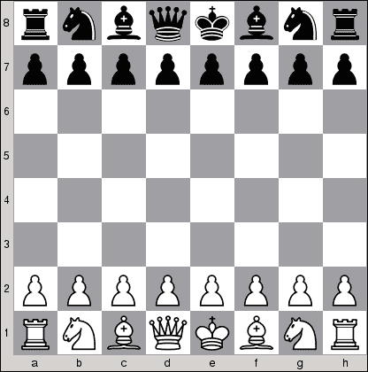

在这一步中我们做的修改非常简单。首先，我们提供了一种方法来告诉棋盘每种棋子类型的外观。这包括不仅限于标准棋子，任何适合放入字符并可以设置在`ChessBoard`类内部数据数组中的东西。其次，我们为绘制棋子提供了一个抽象，使用最简单的基类实现：从注册表中取一个图标并将其渲染到字段上。通过使用`QIcon`，我们可以添加不同大小的多个位图，用于不同大小的单个字段。或者，图标可以包含一个单矢量图像，它可以自行很好地缩放。

# 行动时间——使棋盘游戏交互式

我们已经成功显示了棋盘，但要实际玩游戏，我们必须告诉程序我们想要进行的移动。我们可以通过添加`QLineEdit`小部件来实现这一点，在那里我们将以代数形式输入移动（例如，`Nf3`将马移动到`f3`），但更自然的方式是使用鼠标光标（或用手指轻触）点击一个棋子，然后再次点击目标字段。为了获得这种功能，首先要做的是教会`ChessView`检测鼠标点击。因此，添加以下方法：

```cpp
QPoint ChessView::fieldAt(const QPoint &pt) const
{
  if(!m_board) return QPoint();
  const QSize fs = fieldSize();
    int offset = fontMetrics().width('M')+4; // 'M' is the widest letter
    if(pt.x() < offset) return QPoint();
    int c = (pt.x()-offset) / fs.width();
    int r = pt.y()/fs.height();
    if(c < 0 || c >= m_board->columns() || r<0 || r >= m_board->ranks()) 
        return QPoint();
    return QPoint(c+1, m_board->ranks() - r); // max rank - r
}
```

代码看起来与`fieldRect()`的实现非常相似。这是因为`fieldAt()`实现了其逆操作——它将小部件坐标空间中的点转换为包含该点的字段的列和秩索引。索引是通过将点坐标除以字段大小来计算的。你肯定还记得，在列的情况下，字段通过最宽字母的大小和 4 个边距进行偏移，我们在这里的计算中也要考虑这一点。我们进行两个检查：首先，我们将水平点坐标与偏移量进行比较，以检测用户是否点击了显示列符号的小部件部分，然后我们检查计算出的秩和列是否适合在板上表示的范围。最后，我们将结果作为`QPoint`值返回，因为这是在 Qt 中表示二维值的最简单方式。

现在我们需要找到一种方法让小部件通知其环境特定字段已被点击。我们可以通过信号-槽机制来实现。切换到`ChessView`的头文件（如果你目前在 Qt Creator 中打开了`chessview.cpp`，你可以简单地按*F4*键跳转到相应的头文件）并声明一个`clicked(const QPoint &)`信号：

```cpp
signals:
  void clicked(const QPoint &);
```

要检测鼠标输入，我们必须重写小部件具有的一个鼠标事件处理程序，即`mousePressEvent`或`mouseReleaseEvent`。显然，我们应该选择前者事件；这将有效，但并不是最佳选择。让我们想想鼠标点击的语义：它是由按下和释放鼠标按钮组成的复杂事件。实际的“点击”发生在鼠标释放之后。因此，让我们使用`mouseReleaseEvent`作为我们的事件处理程序：

```cpp
void ChessView::mouseReleaseEvent(QMouseEvent *event)
{
  QPoint pt = fieldAt(event->pos());
  if(pt.isNull()) return;
  emit clicked(pt);
}
```

代码很简单；我们使用刚刚实现的方法，并传递从`QMouseEvent`对象中读取的位置。如果返回的点无效，我们默默地从方法中返回。否则，将发出带有获得的列和行值的`clicked()`。

我们现在可以利用这个信号了。转到`MainWindow`的构造函数，并添加以下行以将小部件的点击信号连接到自定义槽位：

```cpp
connect(m_view, SIGNAL(clicked(QPoint)), this, SLOT(viewClicked(QPoint)));
```

声明槽位并按以下方式实现：

```cpp
void MainWindow::viewClicked(const QPoint &field)
{
  if(m_clickPoint.isNull()) {
    m_clickPoint = field;
  } else {
  if(field != m_clickPoint) {
    m_view->board()->movePiece(
      m_clickPoint.x(), m_clickPoint.y(), 
      field.x(), field.y()
    );
    }
    m_clickPoint = QPoint();
  }
}
```

函数使用类成员变量`m_clickPoint`来存储点击的字段。变量值在移动后变为无效。因此，我们可以检测我们目前正在处理的点击是否具有“选择”或“移动”语义。在前一种情况下，我们将选择存储在`m_clickPoint`中；在另一种情况下，我们要求棋盘使用我们之前实现的一些辅助方法进行移动。请记住将`m_clickPoint`声明为`MasinWindow`的私有成员变量。

现在应该一切正常。然而，如果你构建应用程序，运行它，并在棋盘上开始点击，你会发现没有任何反应。这是因为我们忘记告诉视图在棋盘上的游戏位置改变时刷新自己。我们必须将棋盘发出的信号连接到视图的`update()`槽位。打开小部件类的`setBoard()`方法，并按以下方式修复：

```cpp
void ChessView::setBoard(ChessBoard *board)
{
  // ...
  m_board = board;
 // connect signals
 if(board){
 connect(board, SIGNAL(dataChanged(int,int)), this, SLOT(update()));
 connect(board, SIGNAL(boardReset()), this, SLOT(update()));
 }
  updateGeometry();
}
```

如果你现在运行程序，你做出的移动将在小部件中反映出来，如下所示：

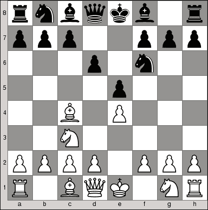

到目前为止，我们可能认为游戏的视觉部分已经完成，但在测试我们最新的添加时，你可能已经注意到了一个问题。当你点击棋盘时，没有任何视觉提示表明任何棋子实际上已被选中。现在让我们通过引入突出显示棋盘上任何字段的能力来修复这个问题。

为了做到这一点，我们将开发一个用于不同突出显示的通用系统。首先，将`Highlight`类作为`ChessView`的内部类添加：

```cpp
class ChessView : public QWidget
    // ...
public:
 class Highlight {
 public:
 Highlight() {}
 virtual ~Highlight() {}
 virtual int type() const { return 0; }
 };
// ...
};
```

这是一个简约的突出显示界面，仅通过一个返回突出显示类型的虚拟方法暴露方法。在我们的练习中，我们将专注于仅标记单个字段的基本类型，该类型使用给定的颜色。这种情况将由`FieldHighlight`类表示：

```cpp
class FieldHighlight : public Highlight {
public:
  enum { Type = 1 };
  FieldHighlight(int column, int rank, QColor color)
    : m_field(column, rank), m_color(color) {}
  inline int column() const { return m_field.x(); }
  inline int rank() const { return m_field.y(); }
  inline QColor color() const { return m_color; }
  int type() const { return Type; }
private:
  QPoint m_field;
  QColor m_color;
};
```

您可以看到我们提供了一个构造函数，它接受列索引和行索引以及一个用于高亮的颜色，并将它们存储在私有成员变量中。此外，`type()` 被重新定义以返回 `FieldHighlight::Type`，我们可以用它来轻松地识别高亮类型。下一步是扩展 `ChessView` 以添加和删除高亮功能。由于容器声明了一个私有的 `QList<Highlight*> m_highlights` 成员变量，因此添加方法声明：

```cpp
public:
  void addHighlight(Highlight *hl);
  void removeHighlight(Highlight *hl);
  inline Highlight *highlight(int index) const {return m_highlights.at(index); }
  inline int highlightCount() const { return m_highlights.size(); }
```

接下来提供非内联方法的实现：

```cpp
void ChessView::addHighlight(ChessView::Highlight *hl) 
{ m_highlights.append(hl); update(); }

void ChessView::removeHighlight(ChessView::Highlight *hl) 
{ m_highlights.removeOne(hl); update(); }
```

绘制高亮非常简单：我们将使用另一个虚拟 `draw` 方法。在 `paintEvent()` 实现中，在负责渲染棋子的循环之前放置以下调用：

```cpp
drawHighlights(&painter);
```

实现只是简单地遍历所有高亮，并渲染它所理解的高亮。

```cpp
void ChessView::drawHighlights(QPainter *painter)
{
  for(int idx=0; idx < highlightCount(); ++idx) {
    Highlight *hl = highlight(idx);
    if(hl->type() == FieldHighlight::Type) {
      FieldHighlight *fhl = static_cast<FieldHighlight*>(hl);
      QRect rect = fieldRect(fhl->column(), fhl->rank());
      painter->fillRect(rect, fhl->color());
    }
  }
}
```

通过检查高亮的类型，我们知道要将泛型指针转换成哪个类。然后我们可以查询对象以获取所需的数据。最后，我们使用 `QPainter::fillRect()` 用给定的颜色填充场地。由于 `drawHighlights()` 在棋子绘制循环之前和场地绘制循环之后被调用，因此高亮将覆盖背景但不会覆盖棋子。

这就是基本的高亮系统。让我们让 `viewClicked()` 插槽使用它：

```cpp
void MainWindow::viewClicked(const QPoint &field)
{
  if(m_clickPoint.isNull()) {
    if(m_view->board()->data(field.x(), field.y()) != ' ') {
      m_clickPoint = field;
      m_selectedField = new ChessView::FieldHighlight(
 field.x(), field.y(), QColor(255, 0, 0, 50)
 );
 m_view->addHighlight(m_selectedField);
 }
  } else {
    if(field != m_clickPoint) {
      m_view->board()->movePiece(
        m_clickPoint.x(), m_clickPoint.y(), field.x(), field.y()
      );
    };
    m_clickPoint = QPoint();
    m_view->removeHighlight(m_selectedField);
 delete m_selectedField;
 m_selectedField = 0;
  }
}
```

注意我们是如何检查一个场地只有在它不为空的情况下（也就是说，有一个现有的棋子占据该场地）才能被选中的？

您还应该添加一个 `ChessView::FieldHighlight *m_selectedField` 私有成员变量，并在构造函数中将其初始化为空指针。现在您可以构建游戏，执行它，并开始移动棋子。

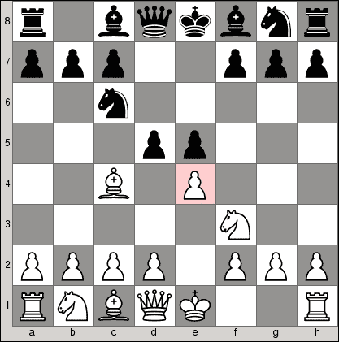

## *刚才发生了什么？*

通过添加几行代码，我们成功地使棋盘可点击。我们连接了一个自定义槽，该槽读取被点击的场地，并可以用半透明的红色颜色高亮显示它。点击另一个场地将移动高亮显示的棋子到那里。我们开发的高亮系统非常通用。我们用它用纯色高亮显示单个场地，但您可以用多种不同的颜色标记任意数量的场地，例如，在选中一个棋子后显示有效移动。该系统可以很容易地通过新的高亮类型进行扩展；例如，您可以使用 `QPainterPath` 在棋盘上绘制箭头，以拥有一个复杂提示系统（比如向玩家显示建议的移动）。


# 是时候行动起来——连接游戏算法

在这里实现完整的棋盘游戏算法会花费我们太多时间，所以我们将满足于一个名为狐狸与猎犬的简单游戏。其中一位玩家有四个兵（猎犬），它们只能移动到黑色场地，并且兵只能向前移动（向更高的排数移动）。另一位玩家只有一个兵（狐狸），它从棋盘的另一侧开始。


它只能移动到黑色棋盘上；然而，它可以向前（向更高等级）和向后（向更低等级）移动。玩家通过将他们的棋子移动到相邻的黑色棋盘上来轮流移动。狐狸的目标是到达棋盘的另一端；猎犬的目标是捕捉狐狸，使其无法移动。


是时候开始工作了！首先，我们将扩展 `ChessAlgorithm` 类以包含所需的接口：

```cpp
class ChessAlgorithm : public QObject
{
  Q_OBJECT
  Q_ENUMS(Result Player)
 Q_PROPERTY(Result result READ result)
 Q_PROPERTY(Player currentPlayer 
 READ currentPlayer 
 NOTIFY currentPlayerChanged)
public:
  enum Result { NoResult, Player1Wins, Draw, Player2Wins };
 enum Player { NoPlayer, Player1, Player2 };

  explicit ChessAlgorithm(QObject *parent = 0);
  ChessBoard* board() const;
  inline Result result() const { return m_result; }
  inline Player currentPlayer() const { return m_currentPlayer; }

signals:
  void boardChanged(ChessBoard*);
  void gameOver(Result);
 void currentPlayerChanged(Player);

public slots:
  virtual void newGame();
  virtual bool move(int colFrom, int rankFrom, int colTo, int rankTo);
 bool move(const QPoint &from, const QPoint &to);

protected:
  virtual void setupBoard();
  void setBoard(ChessBoard *board);
 void setResult(Result);
 void setCurrentPlayer(Player);
private:
  ChessBoard *m_board;
 Result m_result;
 Player m_currentPlayer;
};
```

这里有两组成员。首先，我们有一些与游戏状态相关的枚举、变量、信号和方法：哪个玩家应该移动，以及当前游戏的结果是什么。`Q_ENUMS` 宏用于在 Qt 的元类型系统中注册枚举，以便它们可以用作属性或信号中的值。属性声明及其获取器不需要任何额外说明。我们还在子类中声明了用于设置变量的受保护方法。以下是它们的建议实现：

```cpp
void ChessAlgorithm::setResult(Result value)
{
  if(result() == value) return;
  if(result() == NoResult) {
     m_result = value;
     emit gameOver(m_result);
  } else { m_result = value; }
}

void ChessAlgorithm::setCurrentPlayer(Player value)
{
  if(currentPlayer() == value) return;
  m_currentPlayer = value;
  emit currentPlayerChanged(m_currentPlayer);
}
```

记得在 `ChessAlgorithm` 类的构造函数中将 `m_currentPlayer` 和 `m_result` 初始化为 `NoPlayer` 和 `NoResult`。

第二组函数是修改游戏状态的函数——`move()` 的两个变体。虚拟变体意味着由实际算法重新实现，以检查给定移动在当前游戏状态中是否有效，如果是这样，则执行游戏棋盘的实际修改。在基类中，我们可以简单地拒绝所有可能的移动：

```cpp
bool ChessAlgorithm::move(int colFrom, int rankFrom, int colTo, int rankTo)
{
  Q_UNUSED(colFrom)
  Q_UNUSED(rankFrom)
  Q_UNUSED(colTo)
  Q_UNUSED(rankTo)
  return false;
}
```

### 提示

`Q_UNUSED` 是一个宏，用于防止编译器在编译期间发出关于包含的局部变量从未在作用域中使用过的警告。

重载是一个方便的方法，它接受两个 `QPoint` 对象而不是四个整数。

```cpp
bool ChessAlgorithm::move(const QPoint &from, const QPoint &to)
{
  return move(from.x(), from.y(), to.x(), to.y());
}
```

算法的接口现在已经准备好了，我们可以为狐狸和猎犬游戏实现它。从 `ChessAlgorithm` 派生一个 `FoxAndHounds` 类：

```cpp
class FoxAndHounds : public ChessAlgorithm
{
public:
  FoxAndHounds(QObject *parent = 0);
  void newGame();
  bool move(int colFrom, int rankFrom, int colTo, int rankTo);
};
```

`newGame()` 的实现相当简单：我们设置棋盘，放置棋子，并发出信号，表示现在是第一位玩家的移动时间。

```cpp
void FoxAndHounds::newGame()
{
  setupBoard();
  board()->setFen("3p4/8/8/8/8/8/8/P1P1P1P1 w"); // 'w' - white to move
  m_fox = QPoint(5,8);
  setResult(NoResult);
  setCurrentPlayer(Player1);
}
```

游戏的算法相当简单。按照以下方式实现 `move()`：

```cpp
bool FoxAndHounds::move(int colFrom, int rankFrom, int colTo, int rankTo)
{
  if(currentPlayer() == NoPlayer) return false;

  // is there a piece of the right color?
  char source = board()->data(colFrom, rankFrom);
  if(currentPlayer() == Player1 && source != 'P') return false;
  if(currentPlayer() == Player2 && source != 'p') return false;

  // both can only move one column right or left
  if(colTo != colFrom+1 && colTo != colFrom-1) return false;

  // do we move within the board?
  if(colTo < 1 || colTo > board()->columns()) return false;
  if(rankTo < 1 || rankTo > board()->ranks()) return false;

  // is the destination field black?
  if((colTo + rankTo) % 2) return false;

  // is the destination field empty?
  char destination = board()->data(colTo, rankTo);
  if(destination != ' ') return false;

  // is white advancing?
  if(currentPlayer() == Player1 && rankTo <= rankFrom) return false;

  board()->movePiece(colFrom, rankFrom, colTo, rankTo);  // make the move
  if(currentPlayer() == Player2) {
    m_fox = QPoint(colTo, rankTo);      // cache fox position
  }
  // check win condition
  if(currentPlayer() == Player2 && rankTo == 1){
    setResult(Player2Wins);              // fox has escaped
  } else if(currentPlayer() == Player1 && !foxCanMove()) {
    setResult(Player1Wins);        // fox can't move
  } else {
    // the other player makes the move now
    setCurrentPlayer(currentPlayer() == Player1 ? Player2 : Player1);
  }
  return true;
}
```

声明一个受保护的 `foxCanMove()` 方法，并使用以下代码实现它：

```cpp
bool FoxAndHounds::foxCanMove() const
{
  if(emptyByOffset(-1, -1) || emptyByOffset(-1, 1) 
  || emptyByOffset( 1, -1) || emptyByOffset( 1, 1)) return true;
  return false;
}
```

然后对 `emptyByOffset()` 也进行相同的操作：

```cpp
bool FoxAndHounds::emptyByOffset(int x, int y) const
{
  const int destCol = m_fox.x()+x;
  const int destRank = m_fox.y()+y;
  if(destCol < 1 || destRank < 1 
  || destCol > board()->columns() || destRank > board()->ranks()) return false;
    return (board()->data(destCol, destRank) == ' ');
}
```

最后，声明一个私有的 `QPoint m_fox` 成员变量。

测试游戏的简单方法是对代码进行两项更改。首先，在主窗口类的构造函数中，将 `m_algorithm = new ChessAlgorithm(this)` 替换为 `m_algorithm = new FoxAndHounds(this)`。其次，修改 `viewClicked()` 槽如下：

```cpp
void MainWindow::viewClicked(const QPoint &field)
{
  if(m_clickPoint.isNull()) {
    // ...
  } else {
    if(field != m_clickPoint) {
      m_algorithm->move(m_clickPoint, field);
    }
    // ...
  }
}
```

您还可以将算法类的信号连接到视图或窗口的自定义槽，以通知游戏结束，并为当前应该移动的玩家提供视觉提示。

## *发生了什么？*

我们通过在算法类中引入`newGame()`和`move()`虚拟方法来创建一个实现类似国际象棋游戏的非常简单的 API。前者方法只是简单地设置一切。后者使用简单的检查来确定特定的移动是否有效以及游戏是否结束。我们使用`m_fox`成员变量来跟踪狐狸的当前位置，以便能够快速确定它是否有任何有效的移动。当游戏结束时，会发出`gameOver()`信号，并可以从算法中获取游戏的结果。你可以使用完全相同的框架来实现所有国际象棋规则。

## 大胆尝试英雄——围绕棋盘实现 UI

在练习过程中，我们专注于开发游戏板视图和必要的类，以便使游戏能够实际运行。但我们完全忽略了游戏可能拥有的常规用户界面，例如工具栏和菜单。你可以尝试为游戏设计一套菜单和工具栏。使其能够启动新游戏，保存进行中的游戏（例如通过实现 FEN 序列化器），加载已保存的游戏（例如通过利用现有的 FEN 字符串解析器），或者选择不同的游戏类型，这将生成不同的`ChessAlgorithm`子类。你也可以提供一个设置对话框来调整游戏板的样式。如果你愿意，你可以添加棋钟或实现一个简单的教程系统，该系统将通过文本和视觉提示（通过我们实现的突出显示系统）引导玩家了解国际象棋的基础。

## 大胆尝试英雄——连接一个 UCI 兼容的棋引擎

如果你真的想测试你的技能，你可以实现一个连接到**通用国际象棋接口**（UCI）棋引擎（如 StockFish [`stockfishchess.org`](http://stockfishchess.org)）的`ChessAlgorithm`子类，并为人类玩家提供一个具有挑战性的人工智能对手。UCI 是棋引擎和棋前端之间通信的事实标准。其规范是免费提供的，因此你可以自行研究。要与 UCI 兼容的引擎通信，你可以使用`QProcess`，它将引擎作为外部进程启动，并将其附加到其标准输入和标准输出。然后你可以通过写入标准输入向引擎发送命令，通过读取标准输出从引擎读取消息。为了帮助你入门，这里有一段简短的代码片段，用于启动引擎并附加到其通信通道：

```cpp
class UciEngine : public QObject {
  Q_OBJECT
public:
  UciEngine(QObject *parent = 0) : QObject(parent) { 
    m_uciEngine = new QProcess(this);
    m_uciEngine->setReadChannel(QProcess:StandardOutput);
    connect(m_uciEngine, SIGNAL(readyRead()), SLOT(readFromEngine()));
  }
public slots:
  void startEngine(const QString &enginePath) {
    m_uciEngine->start(enginePath);
  }
  void sendCommand(const QString &command) {
    m_uciEngine->write(command.toLatin1());
  }
private slots:
  void readFromEngine() {
    while(m_uciEngine->canReadLine()) {
      QString line = QString::fromLatin1(m_uciEngine->readLine());
      emit messageReceived(line);
    }
  }
signals:
  void messageReceived(QString);
private:
  QProcess *m_uciEngine;
};
```

# OpenGL

我们不是 OpenGL 的专家，所以在本章的这一部分，我们不会教您如何使用 OpenGL 和 Qt 做任何花哨的事情，而是向您展示如何使您的 OpenGL 技能在 Qt 应用程序中使用。关于 OpenGL 有很多教程和课程，如果您对 OpenGL 的技能不是那么熟练，您仍然可以通过应用在这里获得的知识来更容易地学习花哨的事情。您可以使用外部材料和 Qt 提供的高级 API，这将加快教程中描述的许多任务的执行。

## 使用 Qt 的 OpenGL 简介

在 Qt 中使用 OpenGL 基本上有两种方式。第一种方法是使用 `QOpenGLWidget`。这通常在你应用程序严重依赖于其他小部件时很有用（例如，3D 视图只是你应用程序中的视图之一，并且通过围绕主视图的一堆其他小部件来控制）。另一种方法是使用 `QOpenGLWindow`；这在 GL 窗口是主导的甚至可能是程序唯一部分时最有用。这两个 API 非常相似；它们使用 `QOpenGLContext` 类的实例来访问 GL 上下文。它们之间的区别实际上仅在于它们将场景渲染到窗口的方式。`QOpenGLWindow` 直接渲染到指定的窗口，而 `QOpenGLWidget` 首先渲染到一个离屏缓冲区，然后该缓冲区被渲染到小部件上。后一种方法的优势在于 `QOpenGLWidget` 可以成为更复杂的小部件布局的一部分，而 `QOpenGLWindow` 通常用作唯一的、通常是全屏的窗口。在本章中，我们将使用更直接的方法（`QOpenGLWindow`）；然而，请注意，您也可以使用小部件来完成这里描述的所有操作。只需将窗口类替换为它们的小部件等效类，您就应该可以开始了。

我们提到整个 API 都围绕着 `QOpenGLContext` 类展开。它代表了 GL 管道整体状态，指导数据处理和渲染到特定设备的过程。

需要解释的另一个相关概念是 GL 上下文在某个线程中是“当前”的。OpenGL 调用的方式是，它们不使用任何包含有关在哪里以及如何执行一系列低级 GL 调用的对象的句柄。相反，它们假定是在当前机器状态的环境中执行的。状态可能规定是否将场景渲染到屏幕或帧缓冲区对象，启用了哪些机制，或者 OpenGL 正在渲染的表面的属性。使上下文“当前”意味着所有由特定线程发出的后续 OpenGL 操作都将应用于此上下文。此外，上下文在同一时间只能在一个线程中“当前”；因此，在执行任何 OpenGL 调用之前使上下文“当前”，并在完成访问 OpenGL 资源后将其标记为可用，这一点非常重要。

`QOpenGLWindow`有一个非常简单的 API，它隐藏了大多数不必要的细节，对开发者来说。除了构造函数和析构函数之外，它还提供了一小部分非常有用的方法。首先，有一些辅助方法用于管理 OpenGL 上下文：`context()`返回上下文，以及`makeCurrent()`和`doneCurrent()`用于获取和释放上下文。该类剩余的方法是一系列我们可以重写的虚拟方法，用于显示 OpenGL 图形。

第一个方法被称为`initializeGL()`，框架在实际上进行任何绘画之前会调用它一次，以便你可以准备任何资源或以任何你需要的任何方式初始化上下文。

然后有两个最重要的方法：`resizeGL()`和`paintGL()`。第一个方法是在窗口大小改变时被调用的回调函数。它接受窗口的宽度和高度作为参数。你可以通过重写该方法来利用它，以便为其他方法`paintGL()`的调用做好准备，该方法将渲染不同大小的视口。说到`paintGL()`，这是小部件类中`paintEvent()`的等价方法；每当窗口需要重绘时，它都会被执行。这是你应该放置 OpenGL 渲染代码的函数。

# 行动时间 - 使用 Qt 和 OpenGL 绘制三角形

对于第一个练习，我们将创建一个`QOpenGLWindow`的子类，使用简单的 OpenGL 调用渲染一个三角形。从**其他项目**组中选择**空 qmake 项目**作为模板，创建一个新的项目。在项目文件中，输入以下内容：

```cpp
QT = core gui
TARGET = triangle
TEMPLATE = app
```

基本项目设置就绪后，让我们定义一个`SimpleGLWindow`类作为`QOpenGLWindow`的子类，并重写`initializeGL()`方法，将白色设置为场景的清除颜色。我们通过调用名为`glClearColor`的 OpenGL 函数来实现这一点。Qt 提供了一个名为`QOpenGLFunctions`的便利类，它以平台无关的方式处理大多数常用的 OpenGL 函数。这是以平台无关的方式访问 OpenGLES 函数的推荐方法。我们的窗口将继承`QOpenGLWindow`和`QOpenGLFunctions`。然而，由于我们不希望允许外部访问这些函数，我们使用了保护继承。

```cpp
class SimpleGLWindow : public QOpenGLWindow, protected QOpenGLFunctions {
public:
  SimpleGLWindow(QWindow *parent = 0) : QOpenGLWindow(NoPartialUpdate, parent) { }
protected:
  void initializeGL() {
    initializeOpenGLFunctions();
    glClearColor(1,1,1,0);
  }
```

在`initializeGL()`中，我们首先调用`initializeOpenGLFunctions()`，这是`QOpenGLFunctions`类的一个方法，也是我们窗口类的一个基类。该方法负责根据当前 GL 上下文的参数设置所有函数（因此，首先使上下文成为当前上下文非常重要，幸运的是，在调用`initializeGL()`之前，这已经在幕后为我们完成了）。然后我们将场景的清除颜色设置为白色。

下一步是重写`paintGL()`并将实际的绘图代码放在那里：

```cpp
  void paintGL() {
    glClear(GL_COLOR_BUFFER_BIT);
    glViewport(0, 0, width(), height());
    glBegin(GL_TRIANGLES);
      glColor3f(1, 0, 0);
      glVertex3f( 0.0f, 1.0f, 0.0f);
      glColor3f(0, 1, 0);
      glVertex3f( 1.0f,-1.0f, 0.0f);
      glColor3f(0, 0, 1);
      glVertex3f(-1.0f,-1.0f, 0.0f);
    glEnd();
  }
};
```

这个函数首先清除颜色缓冲区，并将上下文的 GL 视口设置为窗口的大小。然后我们告诉 OpenGL 使用`glBegin()`调用开始绘制，传递`GL_TRIANGLES`作为绘制模式。然后我们传递三个顶点及其颜色来形成一个三角形。最后，通过调用`glEnd()`通知管道我们已完成当前模式的绘制。

剩下的只是一个简单的`main()`函数，用于设置窗口并启动事件循环。添加一个新的**C++源文件**，命名为 main.cpp，并实现`main()`如下：

```cpp
int main(int argc, char **argv) {
  QGuiApplication app(argc, argv);
  SimpleGLWindow window;
  window.resize(600,400);
  window.show();
  return app.exec();
}
```

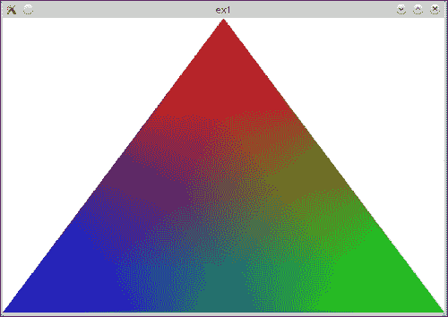

### 提示

你可以看到三角形有锯齿状的边缘。这是因为走样效应。你可以通过为窗口启用多采样来抵消它，这将使 OpenGL 多次渲染内容，然后平均结果，这起到抗锯齿的作用。为此，将以下代码添加到窗口的构造函数中：

```cpp
        QSurfaceFormat fmt = format();
        fmt.setSamples(16); // multisampling set to 16
        setFormat(fmt);
```

绘制彩色三角形很有趣，但绘制纹理立方体更有趣，所以让我们看看我们如何使用 OpenGL 纹理与 Qt 结合。

# 动手实践时间 – 基于场景的渲染

让我们把我们的渲染代码提升到一个更高的层次。直接将 OpenGL 代码放入`window`类需要子类化窗口类，并使窗口类变得越来越复杂。让我们遵循良好的编程实践，将渲染代码与窗口代码分开。

创建一个新的类，命名为`AbstractGLScene`。它将成为 OpenGL 场景定义的基类。你可以从`QOpenGLFunctions`派生这个类（具有保护作用），以便更容易访问不同的 GL 函数。让场景类接受一个指向`QOpenGLWindow`的指针，无论是在构造函数中还是在专门的设置器方法中。确保将指针存储在类中，以便更容易访问，因为我们将要依赖这个指针来访问窗口的物理属性。添加查询窗口 OpenGL 上下文的方法。最终，你的代码可能类似于以下内容：

```cpp
class AbstractGLScene : protected QOpenGLFunctions {
public:
  AbstractGLScene(QOpenGLWindow *wnd = 0) { m_window = wnd; }
  QOpenGLWindow* window() const { return m_window; }
  QOpenGLContext* context() { return window() ? window()->context() : 0;
  }
  const QOpenGLContext* context() const { 
      return window() ? window()->context() : 0; 
  }
private:
  QOpenGLWindow *m_window = nullptr; // C++11 required for assignment
};
```

现在，最重要的部分开始了。添加两个纯虚方法，分别命名为`paint()`和`initialize()`。还要记得添加一个虚析构函数。

### 提示

你不必将`initialize()`实现为纯虚函数，你可以以这种方式实现其主体，使其调用`initializeOpenGLFunctions()`来满足`QOpenGFunctions`类的要求。然后，`AbstractGLScene`的子类可以通过调用基类的`initialize()`实现来确保函数被正确初始化。

接下来，创建一个`QOpenGLWindow`的子类，命名为`SceneGLWindow`。给它配备设置器和获取器方法，以便对象能够操作`AbstractGLScene`实例。

然后重新实现`initializeGL()`和`paintGL()`方法，并使它们调用场景中的适当等效方法：

```cpp
void SceneGLWindow::initializeGL() { if(scene()) scene()->initialize(); }
void SceneGLWindow::paintGL() { if(scene()) scene()->paint(); }
```

## *发生了什么？*

我们刚刚设置了一个类链，它将窗口代码与实际的 OpenGL 场景分开。窗口将所有与场景内容相关的调用转发到场景对象，以便当窗口被请求重绘时，它将任务委托给场景对象。请注意，在这样做之前，窗口将使 GL 上下文成为当前上下文；因此，场景所做的所有 OpenGL 调用都将与该上下文相关。您可以将在此练习中创建的代码存储起来，以供后续练习和自己的项目重用。

# 行动时间 - 绘制纹理立方体

继承`AbstractGLScene`并实现构造函数以匹配`AbstractGLScene`中的构造函数。添加一个方法来存储包含立方体纹理数据的`QImage`对象。同时添加一个`QOpenGLTexture`指针成员，它将包含纹理，在构造函数中将它初始化为 0，并在析构函数中删除它。让我们称图像对象为`m_tex`，纹理为`m_texture`。现在添加一个受保护的`initializeTexture()`方法，并用以下代码填充它：

```cpp
void initializeTexture() {
  m_texture = new QOpenGLTexture(m_tex.mirrored());
  m_texture->setMinificationFilter(QOpenGLTexture::LinearMipMapLinear);
  m_texture->setMagnificationFilter(QOpenGLTexture::Linear);
}
```

函数首先垂直翻转图像。这是因为 OpenGL 期望纹理是“颠倒的”。然后我们创建一个`QOpenGLTexture`对象，传递我们的图像。然后我们设置缩小和放大过滤器，以便在缩放时纹理看起来更好。

我们现在可以开始实现`initialize()`方法，该方法将负责设置纹理和场景本身。

```cpp
void initialize() {
  AbstractGLScene::initialize();
  m_initialized = true;
  if(!m_tex.isNull()) initializeTexture();
  glClearColor(1,1,1,0);
  glShadeModel(GL_SMOOTH);
}
```

我们使用一个名为`m_initialized`的标志。这个标志是必要的，以防止纹理设置得太早（当还没有 GL 上下文可用时）。然后我们检查纹理图像是否已设置（使用`QImage::isNull()`方法）；如果是，我们初始化纹理。然后我们设置 GL 上下文的某些附加属性。

### 小贴士

在`m_tex`的设置器中，添加代码检查`m_initialized`是否设置为`true`，如果是，则调用`initializeTexture()`。这是为了确保无论设置器和`initialize()`调用的顺序如何，纹理都能正确设置。同时，记得在构造函数中将`m_initialized`设置为`false`。

下一步是准备立方体数据。我们将为立方体定义一个特殊的数据结构，该结构将顶点坐标和纹理数据组合在一个单独的对象中。为了存储坐标，我们将使用专门为此目的定制的类——`QVector3D`和`QVector2D`。

```cpp
struct TexturedPoint {
  QVector3D coord;
  QVector2D uv;
  TexturedPoint(const QVector3D& pcoord, const QVector2D& puv) { coord = pcoord; uv = puv; }
};
```

`QVector<TexturedPoint>`将保存整个立方体的信息。该向量使用以下代码初始化：

```cpp
void CubeGLScene::initializeCubeData() {
  m_data = {
    // FRONT FACE
    {{-0.5, -0.5,  0.5}, {0, 0}}, {{ 0.5, -0.5,  0.5}, {1, 0}},
    {{ 0.5,  0.5,  0.5}, {1, 1}}, {{-0.5,  0.5,  0.5}, {0, 1}},

    // TOP FACE
    {{-0.5,  0.5,  0.5}, {0, 0}}, {{ 0.5,  0.5,  0.5}, {1, 0}},
    {{ 0.5,  0.5, -0.5}, {1, 1}}, {{-0.5,  0.5, -0.5}, {0, 1}},

    // BACK FACE
    {{-0.5,  0.5, -0.5}, {0, 0}}, {{ 0.5,  0.5, -0.5}, {1, 0}},
    {{ 0.5, -0.5, -0.5}, {1, 1}}, {{-0.5, -0.5, -0.5}, {0, 1}},

    // BOTTOM FACE
    {{-0.5, -0.5, -0.5}, {0, 0}}, {{ 0.5, -0.5, -0.5}, {1, 0}},
    {{ 0.5, -0.5,  0.5}, {1, 1}}, {{-0.5, -0.5,  0.5}, {0, 1}},

    // LEFT FACE
    {{-0.5, -0.5, -0.5}, {0, 0}}, {{-0.5, -0.5,  0.5}, {1, 0}},
    {{-0.5,  0.5,  0.5}, {1, 1}}, {{-0.5,  0.5, -0.5}, {0, 1}},

    // RIGHT FACE
    {{ 0.5, -0.5,  0.5}, {0, 0}}, {{ 0.5, -0.5, -0.5}, {1, 0}},
    {{ 0.5,  0.5, -0.5}, {1, 1}}, {{ 0.5,  0.5,  0.5}, {0, 1}},
  };
}
```

代码使用 C++11 语法来操作向量。如果你有一个较旧的编译器，你将不得不使用`QVector::append()`。

```cpp
m_data.append(TexturedPoint(QVector3D(...), QVector2D(...)));
```

立方体由六个面组成，位于坐标系的原点。以下图像以图形形式展示了相同的数据。紫色图形是 UV 坐标空间中的纹理坐标。

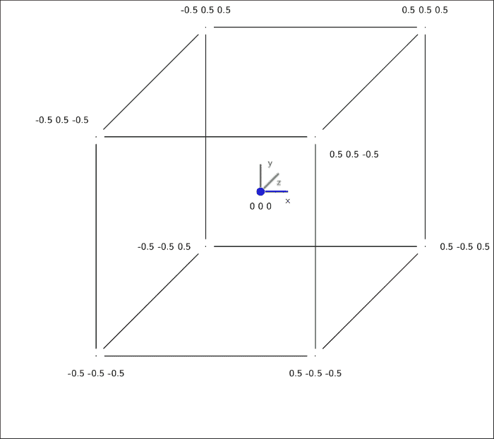

`initializeCubeData()`应该从场景构造函数或从`initialize()`方法中调用。剩下的就是绘图代码。

```cpp
  void CubeGLScene::paint() {
    glClear(GL_COLOR_BUFFER_BIT| GL_DEPTH_BUFFER_BIT);
    glViewport(0, 0, window()->width(), window()->height());
    glLoadIdentity();

    glRotatef( 45, 1.0, 0.0, 0.0 );
    glRotatef( 45, 0.0, 1.0, 0.0 );

    glEnable(GL_DEPTH_TEST);
    glEnable(GL_CULL_FACE);
    glCullFace(GL_BACK);
    paintCube();
  }
```

首先，我们设置视口，然后旋转视图。在调用`paintCube()`之前，该函数将渲染立方体本身，我们启用深度测试和面剔除，以便只绘制可见的面。`paintCube()`例程如下所示：

```cpp
void CubeGLScene::paintCube() {
  if(m_texture)
    m_texture->bind();
  glEnable(GL_TEXTURE_2D);
  glBegin(GL_QUADS);
  for(int i=0;i<m_data.size();++i) {
    const TexturedPoint &pt = m_data.at(i);
    glTexCoord2d(pt.uv.x(), pt.uv.y());
    glVertex3f(pt.coord.x(), pt.coord.y(), pt.coord.z());
  }
  glEnd();
  glDisable(GL_TEXTURE_2D);
}
```

首先绑定纹理并启用纹理映射。然后我们进入四边形绘制模式，并从我们的数据结构中流式传输数据。最后，再次禁用纹理映射。

为了完整性，这里是一个执行场景的`main()`函数：

```cpp
int main(int argc, char **argv) {
  QGuiApplication app(argc, argv);
  SceneGLWindow window;
 QSurfaceFormat fmt;
 fmt.setSamples(16);
 window.setFormat(fmt);
  CubeGLScene scene(&window);
  window.setScene(&scene);
  scene.setTexture(QImage(":/texture.jpg"));
  window.resize(600,600);
  window.show();
  return app.exec();
}
```

请注意使用`QSurfaceFormat`为场景启用多采样抗锯齿。我们还将纹理图像放入资源文件中，以避免文件相对路径的问题。

## 尝试英雄 - 动画一个立方体

尝试修改代码以使立方体动画化。为此，让场景继承`QObject`，向其中添加一个类型为`float`的角度属性（记得关于`Q_OBJECT`宏）。然后修改`glRotatef()`中的一行，使用角度值而不是常数值。在`main()`中，在调用`app.exec()`之前放入以下代码：

```cpp
QPropertyAnimation anim(&scene, "angle");
anim.setStartValue(0);
anim.setEndValue(359);
anim.setDuration(5000);
anim.setLoopCount(-1);
anim.start();
```

记得在角度属性的 setter 中调用`window()->update()`，以便重新绘制场景。

## 带 Qt 的现代 OpenGL

上一节中显示的 OpenGL 代码使用了一种非常古老的技术，即逐个将顶点流式传输到一个固定的 OpenGL 管道中。如今，现代硬件功能更加丰富，不仅允许更快地处理顶点数据，而且还提供了使用可重编程单元（着色器）调整不同处理阶段的能力。在本节中，我们将探讨 Qt 在“现代”OpenGL 使用方法领域的提供内容。

### 着色器

Qt 可以通过基于`QOpenGLShaderProgram`的一系列类来使用着色器。这个类允许编译、链接和执行用 GLSL 编写的着色器程序。你可以通过检查静态`QOpenGLShaderProgram::hasOpenGLShaderPrograms()`调用的结果来检查你的 OpenGL 实现是否支持着色器。所有现代硬件和所有不错的图形驱动程序都应该对着色器有一些支持。一个着色器由`QOpenGLShader`类的实例表示。使用它，你可以决定着色器的类型，关联和着色器源代码。后者是通过调用`QOpenGLShader::compileSourceCode()`来完成的，它有几个重载来处理不同的输入格式。

Qt 支持所有类型的着色器，其中最常见的是顶点着色器和片段着色器。这些都是经典 OpenGL 管道的一部分。你可以在以下图中看到管道的示意图：


当你定义了一组着色器后，你可以通过使用 `QOpenGLShaderProgram::addShader()` 来组装一个完整的程序。在所有着色器都添加完毕后，你可以 `link()` 程序并将其 `bind()` 到当前的 GL 上下文中。程序类提供了一系列方法来设置不同输入参数的值——包括单值和数组版本的统一变量和属性。Qt 提供了其自身类型（如 `QSize` 或 `QColor`）与 GLSL 对应类型（例如，`vec2` 和 `vec4`）之间的映射，以使程序员的开发工作更加轻松。

使用着色器进行渲染的典型代码流程如下（首先创建并编译一个顶点着色器）：

```cpp
QOpenGLShader vertexShader(QOpenGLShader::Vertex);
QByteArray code = "uniform vec4 color;\n"
    "uniform highp mat4 matrix;\n"
    "void main(void) { gl_Position = gl_Vertex*matrix; }";
vertexShader.compileSourceCode(code);
```

该过程对片段着色器重复进行：

```cpp
QOpenGLShader fragmentShader(QOpenGLShader::Fragment);
code = "uniform vec4 color;\n"
    "void main(void) { gl_FragColor = color; }";
fragmentShader.compileSourceCode(code);
```

然后将着色器链接到给定 GL 上下文中的单个程序中：

```cpp
QOpenGLShaderProgram program(context);
program.addShader(vertexShader);
program.addShader(fragmentShader);
program.link();
```

每次使用程序时，它都应绑定到当前 GL 上下文并填充所需数据：

```cpp
program.bind();
QMatrix4x4 m = …;
QColor color = Qt::red;
program.setUniformValue("matrix", m);
program.setUniformValue("color", color);
```

之后，激活渲染管道的调用将使用绑定的程序：

```cpp
glBegin(GL_TRIANGLE_STRIP);
…
glEnd();
```

# 是时候进行着色物体操作了

让我们将最后一个程序转换为使用着色器。为了使立方体更好，我们将使用 Phong 算法实现平滑光照模型。同时，我们将学习使用 Qt 为 OpenGL 提供的一些辅助类。

本小项目的目标如下：

+   使用顶点和片段着色器来渲染复杂对象

+   处理模型、视图和投影矩阵

+   使用属性数组进行快速绘制

首先，创建一个 `AbstractGLScene` 的新子类。让我们给它以下接口：

```cpp
class ShaderGLScene : public QObject, public AbstractGLScene {
  Q_OBJECT
public:
  ShaderGLScene(SceneGLWindow *wnd);
  void initialize();
  void paint();
protected:
  void initializeObjectData();
private:
  struct ScenePoint {
    QVector3D coords;
    QVector3D normal;
    ScenePoint(const QVector3D &c, const QVector3D &n);
  };
 QOpenGLShaderProgram m_shader;
 QMatrix4x4 m_modelMatrix;
 QMatrix4x4 m_viewMatrix;
 QMatrix4x4 m_projectionMatrix;
  QVector<ScenePoint> m_data;
};
```

与之前的项目相比，类接口有显著的变化。在这个项目中我们不使用纹理，因此 `TexturedPoint` 被简化为 `ScenePoint`，并移除了 UV 纹理坐标。

我们可以从 `initializeObjectData()` 函数开始实现接口。我们不会逐行解释方法体做了什么。你可以按自己的意愿实现它；重要的是确保该方法将有关顶点和它们法线的信息填充到 `m_data` 成员中。

### 小贴士

在本书附带示例代码中，你可以找到使用 Blender 3D 程序生成的 PLY 格式文件加载数据的代码。要从 Blender 导出模型，请确保它仅由三角形组成（为此，选择模型，按 *Tab* 键进入编辑模式，使用 *Ctrl* + *F* 打开 **面** 菜单，并选择 **三角化面**）。然后点击 **文件** 和 **导出**；选择 **斯坦福 (.ply)**。你将得到一个包含顶点和法线数据以及顶点面定义的文本文件。

你可以始终重用之前项目中使用的立方体对象。但请注意，它的法线没有正确计算以进行平滑着色；因此，你必须纠正它们。

在我们可以设置着色器程序之前，我们必须了解实际的着色器是什么样的。着色器代码将从外部文件加载，因此第一步是为项目添加一个新文件。在 Creator 中，点击**文件**并选择**新建文件或项目**；从底部面板中选择**GLSL**，然后从可用模板列表中选择**顶点着色器（桌面 OpenGL）**。将新文件命名为`phong.vert`并输入以下代码：

```cpp
uniform highp mat4 modelViewMatrix;
uniform highp mat3 normalMatrix;
uniform highp mat4 projectionMatrix;
uniform highp mat4 mvpMatrix;

attribute highp vec4 Vertex;
attribute mediump vec3 Normal;

varying mediump vec3 N;
varying highp vec3 v;

void main(void) {
  N = normalize(normalMatrix * Normal);
  v = vec3(modelViewMatrix * Vertex);
  gl_Position = mvpMatrix*Vertex;
}
```

代码非常简单。我们声明了四个矩阵，分别代表场景坐标映射的不同阶段。我们还定义了两个输入属性——`Vertex`和`Normal`——它们包含顶点数据。着色器将输出两份数据——一个归一化的顶点法线和从相机视角看到的变换后的顶点坐标。当然，除此之外，我们还将`gl_Position`设置为最终的顶点坐标。在每种情况下，我们都希望符合 OpenGL/ES 规范，因此在每个变量声明前加上一个精度指定符。

接下来，添加另一个文件，命名为`phong.frag`，并将其设置为片段着色器（桌面 OpenGL）。文件的内容是典型的环境、漫反射和镜面反射计算：

```cpp
struct Material {
  lowp vec3 ka;
  lowp vec3 kd;
  lowp vec3 ks;
  lowp float shininess;
};

struct Light {
  lowp vec4 position;
  lowp vec3 intensity;
};

uniform Material mat;
uniform Light light;
varying mediump vec3 N;
varying highp vec3 v;

void main(void) {
  mediump vec3 n = normalize(N);
  highp vec3 L = normalize(light.position.xyz - v);
  highp vec3 E = normalize(-v);
  mediump vec3 R = normalize(reflect(-L, n));

  lowp float LdotN = dot(L, n);
  lowp float diffuse = max(LdotN, 0.0);
  lowp vec3 spec = vec3(0,0,0);

  if(LdotN > 0.0) {
    float RdotE = max(dot(R, E), 0.0);
    spec = light.intensity*pow(RdotE, mat.shininess);
  }
  vec3 color = light.intensity * (mat.ka + mat.kd*diffuse + mat.ks*spec);
  gl_FragColor = vec4(color, 1.0);
}
```

除了使用两个变化变量来获取插值后的法线（`N`）和片段（`v`）位置外，着色器还声明了两个结构来保存光和材料信息。不深入着色器本身的工作细节，它计算三个组件——环境光、漫射光和镜面反射——将它们相加，并将结果设置为片段颜色。由于所有顶点输入数据都会为每个片段进行插值，因此最终颜色是针对每个像素单独计算的。

一旦我们知道着色器期望什么，我们就可以设置着色器程序对象。让我们看一下`initialize()`方法：

```cpp
void initialize() {
  AbstractGLScene::initialize();
  glClearColor(0,0,0,0);
```

首先，我们调用基类实现并设置场景的背景颜色为黑色，如下面的代码所示：

```cpp
  m_shader.addShaderFromSourceCode(QOpenGLShader::Vertex, fileContent("phong.vert"));
  m_shader.addShaderFromSourceCode(QOpenGLShader::Fragment, fileContent("phong.frag"));
  m_shader.link();
```

然后我们向程序中添加两个着色器，使用一个名为`fileContent()`的自定义辅助函数从外部文件中读取它们的源代码。这个函数本质上会打开一个文件并返回其内容。然后我们链接着色器程序。`link()`函数返回一个布尔值，但为了简单起见，这里我们跳过了错误检查。下一步是为着色器准备所有输入数据，如下所示：

```cpp
  m_shader.bind();
  m_shader.setAttributeArray("Vertex", GL_FLOAT, m_data.constData(), 3, sizeof(ScenePoint));
  m_shader.enableAttributeArray("Vertex");
  m_shader.setAttributeArray("Normal", GL_FLOAT, &m_data[0].normal, 3, sizeof(ScenePoint)); 
  m_shader.enableAttributeArray("Normal");
  m_shader.setUniformValue("material.ka", QVector3D(0.1, 0, 0.0));
  m_shader.setUniformValue("material.kd", QVector3D(0.7, 0.0, 0.0));
  m_shader.setUniformValue("material.ks", QVector3D(1.0, 1.0, 1.0));
  m_shader.setUniformValue("material.shininess", 128.0f);
  m_shader.setUniformValue("light.position", QVector3D(2, 1, 1));
  m_shader.setUniformValue("light.intensity", QVector3D(1,1,1));
```

首先，将着色器程序绑定到当前上下文，以便我们可以对其操作。然后我们启用设置两个属性数组——一个用于顶点坐标，另一个用于它们的法线。我们通知程序，一个名为`Vertex`的属性由三个`GL_FLOAT`类型的值组成。第一个值位于`m_data.constData()`，下一个顶点的数据位于当前点数据`sizeof(ScenePoint)`字节之后。然后我们对`Normal`属性有类似的声明，唯一的区别是第一个数据块放置在`&m_data[0].normal`。通过通知程序数据布局，我们允许它在需要时快速读取所有顶点信息。

在设置属性数组之后，我们将统一变量的值传递给着色器程序，这完成了着色器程序的设置。你会注意到我们没有为表示各种矩阵的统一变量设置值；我们将为每次重绘分别设置。`paint()`方法负责设置所有矩阵：

```cpp
void ObjectGLScene::paint() {
  m_projectionMatrix.setToIdentity();
  qreal ratio = qreal(window()->width()) / qreal(window()->height());
  m_projectionMatrix.perspective(90, ratio, 0.5, 40); // angle, ratio, near plane, far plane
  m_viewMatrix.setToIdentity();
  QVector3D eye = QVector3D(0,0,2);
  QVector3D center = QVector3D(0,0,0);
  QVector3D up = QVector3D(0, 1, 0);
  m_viewMatrix.lookAt(eye, center, up);
```

在这个方法中，我们大量使用了表示 4 x 4 矩阵的`QMatrix4x4`类，该矩阵以所谓的行主序排列，适合与 OpenGL 一起使用。一开始，我们重置投影矩阵，并使用`perspective()`方法根据当前窗口大小给它一个透视变换。之后，视图矩阵也被重置，并使用`lookAt()`方法为摄像机准备变换；中心值表示视图眼睛所看的中心。`up`向量指定了摄像机的垂直方向（相对于眼睛位置）。

接下来的几行与上一个项目中的类似：

```cpp
  glClear(GL_COLOR_BUFFER_BIT | GL_DEPTH_BUFFER_BIT);
  glViewport(0, 0, window()->width(), window()->height());
  glEnable(GL_DEPTH_TEST);
  glEnable(GL_CULL_FACE);
  glCullFace(GL_BACK);
```

之后，我们进行对象的实际绘制：

```cpp
  m_modelMatrix.setToIdentity();
  m_modelMatrix.rotate(45, 0, 1, 0);
  QMatrix4x4 modelViewMatrix = m_viewMatrix*m_modelMatrix;
  paintObject(modelViewMatrix);
}
```

我们首先设置模型矩阵，它决定了渲染对象相对于世界中心的位置（在这种情况下，我们说它是绕 *y* 轴旋转了 45 度）。然后我们组装模型视图矩阵（表示对象相对于摄像机的位置）并将其传递给`paintObject()`方法，如下所示：

```cpp
void paintCube(const QMatrix4x4& mvMatrix) {
  m_shader.bind();
  m_shader.setUniformValue("projectionMatrix", m_projectionMatrix);
  m_shader.setUniformValue("modelViewMatrix", mvMatrix);
  m_shader.setUniformValue("mvpMatrix", m_projectionMatrix*mvMatrix);
  m_shader.setUniformValue("normalMatrix", mvMatrix.normalMatrix());
  const int pointCount = m_data.size();
  glDrawArrays(GL_TRIANGLES, 0, pointCount);
}
```

这个方法非常简单，因为大部分工作都是在设置着色器程序时完成的。首先激活着色器程序。然后设置所有所需的矩阵作为着色器的统一变量。包括从模型视图矩阵计算出的法线矩阵。最后，发出调用`glDrawArrays()`，告诉它以`GL_TRIANGLES`模式使用活动数组进行渲染，从数组的开始（偏移`0`）读取`pointCount`个实体。

运行项目后，你应该得到一个类似于以下的结果，它恰好包含了 Blender 猴子，Suzanne：

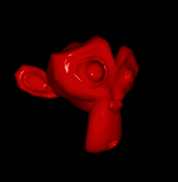

## GL 缓冲区

使用属性数组可以加快编程速度，但在渲染时，所有数据仍然需要在每次使用时复制到图形卡上。这可以通过 OpenGL 缓冲区对象来避免。Qt 通过其`QOpenGLBuffer`类提供了一个方便的接口。目前支持的缓冲区类型包括顶点缓冲区（其中缓冲区包含顶点信息）、索引缓冲区（其中缓冲区的内容是一组索引，可以与`glDrawElements()`一起使用），以及较少使用的像素打包缓冲区和像素解包缓冲区。缓冲区本质上是一块内存，可以上传到图形卡并存储在那里以实现更快的访问。有不同可用使用模式，这些模式规定了缓冲区如何在主机内存和 GPU 内存之间传输以及何时传输。最常见模式是一次性将顶点信息上传到 GPU，以后在渲染过程中可以多次引用。将使用属性数组的现有应用程序更改为使用顶点缓冲区非常简单。首先需要一个缓冲区实例：

```cpp
QOpenGLBuffer vbo(QOpenGLBuffer::VertexBuffer);
```

然后需要设置其使用模式。在一次性上传的情况下，最合适的类型是`StaticDraw`，如下所示：

```cpp
vbo.setUsagePattern(QOpenGLBuffer::StaticDraw);
```

然后需要为当前上下文创建缓冲区本身：

```cpp
context->makeCurrent(this);
vbo.create();
```

下一步是实际为缓冲区分配一些内存：

```cpp
vbo.allocate(vertexCount*sizeof(ScenePoint));
```

要将数据写入缓冲区，有两种选择。首先，您可以通过调用`map()`将缓冲区附加到应用程序的内存空间，然后使用返回的指针填充数据：

```cpp
ScenePoint *buffer = static_cast<ScenePoint*>(vbo.map(QOpenGLBuffer::WriteOnly));
assert(buffer!=0);
for(int i=0;i<vbo.size();++i) { buffer[i] = m_data[i]; }
vbo.unmap();
```

一种替代方法是直接使用`write()`将数据写入缓冲区：

```cpp
const int spSize = sizeof(ScenePoint);
for(int i=0;i<vbo.size();++i) { vbo.write (i*spSize, &m_data[i], spSize); }
```

最后，缓冲区可以以类似于属性数组的方式在着色器程序中使用：

```cpp
vbo.bind();
m_shader.setAttributeBuffer("Vertex"", GL_FLOAT, 0, 3, sizeof(ScenePoint));
m_shader.setAttributeBuffer("Normal"", GL_FLOAT, sizeof(QVector3D), 3, sizeof(ScenePoint));
```

结果是，所有数据都一次性上传到 GPU，然后根据当前着色器程序或其他支持缓冲区对象的 OpenGL 调用按需使用。

## 离屏渲染

有时，将 GL 场景渲染到屏幕之外而不是屏幕上是有用的，这样可以将图像稍后外部处理或用作渲染其他部分的纹理。为此，创建了**帧缓冲对象**（**FBO**）的概念。FBO 是一个渲染表面，其行为类似于常规设备帧缓冲区，唯一的区别是生成的像素不会出现在屏幕上。FBO 目标可以作为纹理绑定到现有场景中，或者作为图像存储在常规计算机内存中。在 Qt 中，此类实体由`QOpenGLFramebufferObject`类表示。

一旦您有一个当前的 OpenGL 上下文，您可以使用可用的构造函数之一创建`QOpenGLFramebufferObject`的实例。必须传递的强制参数是画布的大小（可以是`QSize`对象，也可以是一对整数，描述帧的宽度和高度）。不同的构造函数接受其他参数，例如 FBO 要生成的纹理类型或封装在`QOpenGLFramebufferObjectFormat`中的参数集。

当对象被创建时，你可以在其上发出一个`bind()`调用，这将切换 OpenGL 管道以渲染到 FBO 而不是默认目标。一个互补的方法是`release()`，它将恢复默认渲染目标。之后，可以通过调用`texture()`方法查询 FBO 以返回 OpenGL 纹理的 ID，或者通过调用`toImage()`将纹理转换为`QImage`。

# 摘要

在本章中，我们学习了如何使用 Qt 进行图形处理。你应该意识到，关于 Qt 在这方面我们只是触及了皮毛。本章所介绍的内容将帮助你实现自定义小部件，对图像进行一些基本的绘制，以及渲染 OpenGL 场景。还有很多其他的功能我们没有涉及，例如合成模式、路径、SVG 处理等。我们将在后续章节中回顾一些这些功能，但大部分我们将留给你自己探索。

在下一章中，我们将学习一种更面向对象的方法来进行图形处理，称为图形视图。
