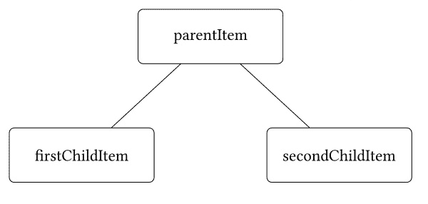
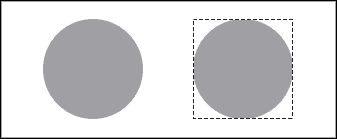
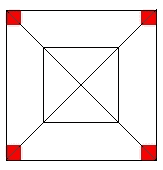
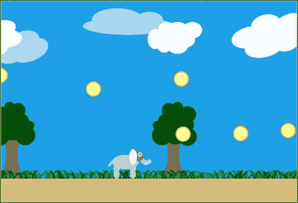
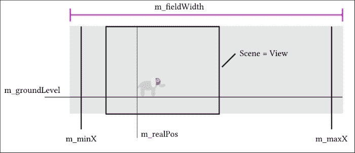
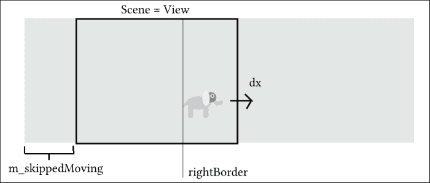
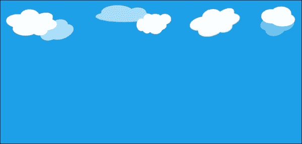
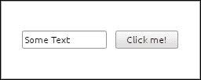

# 第六章：图形视图

> *小部件非常适合设计图形用户界面。然而，如果你希望在应用程序中同时通过不断移动它们来动画化多个小部件，你可能会遇到问题。在这些情况下，或者更一般地说，对于经常变换 2D 图形，Qt 为你提供了图形视图。在本章中，你将学习图形视图架构及其项目的基本知识。你还将学习如何将小部件与图形视图项目结合使用。一旦你掌握了基础知识，我们接下来将开发一个简单的跳跃跑酷游戏，展示如何动画化项目。最后，我们将探讨一些优化图形视图性能的可能性。*

# 图形视图架构

三个组件构成了图形视图的核心：一个`QGraphicsView`的实例，被称为**视图**；一个`QGraphicsScene`的实例，被称为**场景**；以及通常多个`QGraphicsItem`的实例，被称为**项目**。通常的工作流程是首先创建几个项目，然后将它们添加到场景中，最后将场景设置在视图上。

在下一节中，我们将依次讨论图形视图架构的三个部分，首先是项目，然后是场景，最后是视图。


图形视图组件的示例

然而，由于无法将一个组件完全独立于其他组件来处理，你需要一开始就了解整体情况。这将帮助你更好地理解三个单独部分的描述。如果你第一次出现时没有完全理解所有细节，请不要担心。要有耐心，完成这三个部分的工作，希望最终所有问题都会变得清晰。

将这些项目想象成便利贴。你可以在上面写信息，画图像，或者两者都做，或者，很可能是直接留空。这相当于创建了一个具有定义的绘制函数的项目，无论是默认的函数还是你自定义的函数。由于项目没有预定的尺寸，你需要在其中完成所有绘制操作的定义边界矩形。就像便利贴一样，它不关心自己的位置或从哪个角度被观察，项目总是以未变换的状态绘制其内容，其中长度单位对应于 1 像素。项目存在于自己的坐标系中。尽管你可以对项目应用各种变换，如旋转和缩放，但这不是项目绘制函数的工作；那是场景的工作。

那么，场景是什么呢？好吧，把它想象成一张更大的纸，你在上面贴上你的小便签，也就是笔记。在场景中，你可以自由地移动项目，并对它们应用有趣的变换。显示项目的位置和任何应用到的变换是场景的责任。场景还会通知项目任何影响它们的事件，并且它像项目一样有一个边界矩形，项目可以在这个矩形内定位。

最后但同样重要的是，让我们把注意力转向视图。把视图想象成一个检查窗口或者一个手里拿着带有笔记的纸张的人。你可以整体观察纸张，或者只看特定的部分。就像人可以用手旋转和剪切纸张一样，视图也可以旋转和剪切场景，并对它进行很多其他变换。

### 注意

你可能会看前面的图并担心所有项目都在视图之外。它们不是在浪费 GPU 渲染时间吗？你不需要通过添加所谓的“视图视锥剔除”机制（检测哪些项目不可见，因此不需要绘制/渲染）来照顾它们吗？嗯，简短的答案是“不”，因为 Qt 已经处理了这一点。

## 项目

那么，让我们来看看这些项目。在图形视图中，项目的最基本特征是它们的面向对象方法。场景中的所有项目都必须继承自`QGraphicsItem`，这是一个具有众多其他公共函数的抽象类，其中包括两个纯虚函数，分别叫做`boundingRect()`和`paint()`。正因为这个简单而明确的事实，有一些原则适用于每个项目。

### 父子关系

`QGraphicsItem`的构造函数接受另一个项目的指针，该指针被设置为项目的父项。如果指针是`0`，则项目没有父项。这给了你机会以类似于`QObject`对象的结构来组织项目，尽管`QGraphicsItem`元素并不继承自`QObject`对象。你可以通过调用`setParentItem()`函数在任何给定时间改变项目之间的关系。如果你想从父项中移除子项目，只需在子项目上调用`setParentItem(0)`函数。以下代码说明了创建项目之间关系的两种可能性。（请注意，这段代码将无法编译，因为`QGraphicsItem`是一个抽象类。这里只是为了说明，但它将适用于真实的项目类。）

```cpp
QGraphicsItem *parentItem = new QGraphicsItem();
QGraphicsItem *firstChildItem = new QGraphicsItem(parentItem);
QGraphicsItem *secondChildItem = new QGraphicsItem();
secondChildItem->setParentItem(parentItem);
delete parentItem;

```

首先，我们创建一个名为`parentItem`的项，因为我们没有使用构造函数的参数，所以这个项没有父项或子项。接下来，我们创建另一个名为`firstChildItem`的项，并将`parentItem`项的指针作为参数传递。因此，它以`parentItem`项作为其父项，而`parentItem`项现在以`firstChildItem`项作为其子项。接下来，我们创建一个名为`secondChildItem`的第三项，但由于我们没有将其传递给构造函数，所以它目前没有父项。然而，在下一行中，我们通过调用`setParentItem()`函数来改变这一点。现在它也是`parentItem`项的子项。

### 小贴士

你可以使用`parentItem()`函数始终检查一个项是否有父项，并将返回的`QGraphicsItem`指针与`0`进行比较，这意味着该项没有父项。要找出是否有任何子项，请在项上调用`childItems()`函数。它返回一个包含所有子项的`QList`方法。



父子关系

这种父子关系的优点是，在父项上执行的具体操作也会影响相关的子项。例如，当你删除父项时，所有子项也将被删除。因此，在前面代码中删除`parentItem`项就足够了。`firstChildItem`和`secondChildItem`项的析构函数将隐式调用。当你从场景中添加或删除父项时，也是如此。所有子项随后也将被添加或删除。当你隐藏父项或移动父项时，这也适用。在这两种情况下，子项的行为将与父项相同。想想之前提到的便利贴；它们会有相同的行为。如果你有一个带有其他便利贴附加的便签，当你移动父便签时，它们也会移动。

### 小贴士

如果你不确定对父项的函数调用是否传播到其子项，你总是可以查看源代码。如果你在安装时选择了安装源代码的选项，你可以在你的 Qt 安装中找到它们。你也可以在网上找到它们，网址为[`github.com/qtproject/qtbase`](https://github.com/qtproject/qtbase)。

即使没有有意义的注释，你也容易找到相关的代码。只需寻找通过 d-pointer 访问的`children`变量。在`QGraphicsItem`项的析构函数中，相关的代码片段如下：

```cpp
if (!d_ptr->children.isEmpty()) {
  while (!d_ptr->children.isEmpty())
    delete d_ptr->children.first();
  Q_ASSERT(d_ptr->children.isEmpty());
}
```

### 外观

你可能想知道一个`QGraphicsItem`项看起来是什么样子。嗯，因为它是一个抽象类（而且不幸的是，绘制函数是一个纯虚函数），所以它看起来什么都没有。你将不得不自己完成所有的绘制工作。幸运的是，由于`QGraphicsItem`项的绘制函数为你提供了一个你已知的技巧，即`QPainter`指针，所以这并不困难。

别慌！你不必自己绘制所有项目。Qt 提供了许多标准形状的项目，你可以直接使用。你将在名为 *标准项目* 的下一节中找到它们的讨论。然而，由于我们偶尔需要绘制自定义项目，我们通过这个过程进行。

# 行动时间 - 创建一个黑色矩形项目

作为第一步，让我们创建一个绘制黑色矩形的项：

```cpp
class BlackRectangle : public QGraphicsItem {
public:
  explicit BlackRectangle(QGraphicsItem *parent = 0)
    : QGraphicsItem(parent) {}
  virtual ~BlackRectangle() {}

  QRectF boundingRect() const {
    return QRectF(0, 0, 75, 25);
  }

  void paint(QPainter *painter, const QStyleOptionGraphicsItem *option, QWidget *widget) {
    Q_UNUSED(option)
    Q_UNUSED(widget)
    painter->fillRect(boundingRect(), Qt::black);
  }
};
```

## *刚才发生了什么？*

首先，我们继承 `QGraphicItem` 并将新类命名为 `BlackRectangle`。类的构造函数接受一个指向 `QGraphicItem` 项目的指针。然后，这个指针被传递给 `QGraphicItem` 项目的构造函数。我们不必担心它；`QGraphicItem` 将会处理它，并为我们项目建立父子关系，以及其他事情。接下来，虚拟析构函数确保即使在通过基类指针删除类的情况下也会被调用。这是一个关键点，你将在我们讨论场景时学到这一点。

接下来，我们定义我们项目的 `boundingRect()` 函数，其中我们返回一个宽度为 75 像素、高度为 25 像素的矩形。这个返回的矩形是 `paint` 方法的画布，同时也是对场景的承诺，即项目将只在这个区域内绘制。场景依赖于该信息的正确性，因此你应该严格遵守这个承诺。否则，场景将充满你绘制的遗迹！

最后，我们从 `QPainter` 和 `QWidget` 项目结合进行实际绘画。这里没有其他不同之处，只是画家已经通过第一个参数给出的适当值初始化。即使不需要，我也建议在函数结束时保持画家处于与开始时相同的状态。如果你遵循这个建议，并且只使用场景中的自定义项目，你可以在以后极大地优化渲染速度。这尤其适用于项目众多的场景。但让我们回到我们实际上在做什么。我们已经取出了画家并调用了 `fillRect()` 函数，这个函数不会影响画家的内部状态。作为参数，我们使用了 `boundingRect()` 函数，它定义了要填充的区域，以及 `Qt::black` 参数，它定义了填充颜色。因此，通过只填充项目的边界矩形，我们遵守了边界矩形的承诺。

在我们的例子中，我们没有使用 `paint` 函数的两个其他参数。为了抑制编译器关于未使用变量的警告，我们使用了 Qt 的 `Q_UNUSED` 宏。

# 行动时间 - 对项目选择状态的响应

如果你想改变与项目状态相关的项目的外观，分配给 `QStyleOptionGraphicsItem` 项目的指针可能会很有用。例如，假设你想在项目被选中时用红色填充矩形。为此，你只需输入以下内容：

```cpp
void paint(QPainter *painter, const QStyleOptionGraphicsItem *option, QWidget *widget) {
  Q_UNUSED(widget)
  if (option->state & QStyle::State_Selected)
    painter->fillRect(boundingRect(), Qt::red);
  else
    painter->fillRect(boundingRect(), Qt::black);
}
```

## *刚才发生了什么？*

`state` 变量是一个位掩码，包含项目的可能状态。您可以使用位运算符将其值与 `QStyle::StateFlag` 参数的值进行比较。在前面的例子中，`state` 变量被检查与 `State_Selected` 参数。如果此标志被设置，则矩形将被绘制为红色。

### 小贴士

状态的类型是 `QFlags<StateFlag>`。因此，您不需要使用位运算符来测试标志是否设置，而是可以使用方便的函数 `testFlag()`。使用前面的示例，它将是这样的：

```cpp
if (option->state.testFlag(QStyle::State_Selected))
```

您可以使用的项目最重要的状态在以下表中描述：

| 状态 | 描述 |
| --- | --- |
| `State_Enabled` | 表示项目处于启用状态。如果项目被禁用，您可能希望将其绘制为灰色。 |
| `State_HasFocus` | 表示项目具有输入焦点。要接收此状态，项目需要将 `ItemIsFocusable` 标志设置为。 |
| `State_MouseOver` | 表示光标当前悬停在项目上。要接收此状态，项目需要将 `acceptHoverEvents` 变量设置为 `true`。 |
| `State_Selected` | 表示项目被选中。要接收此状态，项目需要将 `ItemIsSelectable` 标志设置为。正常情况下，会绘制一个虚线围绕项目作为选择标记。 |

除了状态之外，`QStyleOptionGraphicsItem` 还提供了关于当前使用样式的更多信息，例如使用的调色板和字体，分别通过 `QStyleOptionGraphicsItem::palette` 和 `QStyleOptionGraphicsItem::fontMetrics` 参数访问。如果您旨在实现样式感知的项目，请在文档中更深入地了解此类。

# 行动时间 - 使项目的大小可定义

让我们把黑色矩形的例子再进一步。到目前为止，`BlackRectangle` 绘制了一个固定大小的 75 x 25 像素的矩形。如果能定义这个大小会很好，所以让我们添加定义矩形大小的功能。记住，仅仅将矩形画得更大在这里没有帮助，因为那样你会打破关于边界矩形的承诺。因此，我们还需要按照以下方式更改边界矩形：

```cpp
class BlackRectangle : public QGraphicsItem {
public:
  BlackRectangle(QGraphicsItem *parent = 0)
    : QGraphicsItem(parent), m_rect(0, 0, 75, 25) {}
//...
  QRectF boundingRect() const {
    return m_rect;
  }
//...
  QRectF rect() const {
    return m_rect;
  }
  void setRect(const QRectF& rect) {
    if (rect == m_rect)
      return;
    prepareGeometryChange();
    m_rect = rect;
}
private:
  QRectF m_rect;
};
```

## *刚才发生了什么？*

由于析构函数和 `paint` 函数没有变化，因此省略了它们。我们在这里到底做了什么？首先，我们引入了一个名为 `m_rect` 的私有成员，用于保存当前矩形的值。在初始化列表中，我们将 `m_rect` 设置为默认值 `QRectF(0, 0, 75, 25)`，就像我们在第一个示例中硬编码的那样。由于边界矩形应该与 `m_rect` 相同，我们修改了 `boundingRect()` 以返回 `m_rect`。获取器函数 `rect()` 也返回相同的值。目前，似乎有两个函数返回相同的值是多余的，但一旦您在矩形周围绘制边界，就需要返回一个不同的边界矩形。它需要增加所使用的笔的宽度。因此，我们保留这种冗余，以便于进一步改进。最后新的部分是设置函数，它相当标准。我们检查值是否已更改，如果没有，则退出函数。否则，我们设置一个新的值，但必须在 `prepareGeometryChange()` 调用之后进行。这个调用很重要，因为它会通知场景即将发生几何变化。然后，场景会要求项目重新绘制自己。我们不需要处理这部分。

## 尝试一下英雄 - 定制项目

作为练习，您可以尝试添加一个选项来更改背景颜色。您还可以创建一个新的项目，允许您设置一个图像。如果这样做，请记住，您必须根据图像的大小更改项目的边界矩形。

## 标准项目

正如您所看到的，创建自己的项目需要一些工作，但总体来说并不困难。一个很大的优势是您可以使用 `QPainter` 来绘制项目，这与您用于绘制小部件的技术相同。因此，您不需要学习任何新的东西。确实，虽然绘制填充矩形或其他任何形状很容易，但每次需要创建执行此类基本任务的项目时，都要子类化 `QGraphicsItem` 是一项大量工作。这就是为什么 Qt 提供以下标准项目，使您作为开发者的生活变得更加容易：

| 标准项目 | 描述 |
| --- | --- |
| `QGraphicsLineItem` | 绘制简单线条。您可以使用 `setLine(const QLineF&)` 定义线条。 |
| `QGraphicsRectItem` | 绘制矩形。您可以使用 `setRect(const QRectF&)` 定义矩形的几何形状。 |
| `QGraphicsEllipseItem` | 绘制椭圆。您可以使用 `setRect(const QRectF&)` 定义绘制椭圆的矩形。此外，您还可以通过调用 `setStartAngle(int)` 和 `setSpanAngle(int)` 来定义是否只绘制椭圆的某一段。这两个函数的参数是以度数的十六分之一表示的。 |
| `QGraphicsPolygonItem` | 绘制多边形。您可以使用 `setPolygon(const QPolygonF&)` 定义多边形。 |
| `QGraphicsPathItem` | 绘制路径。您可以使用 `setPath(const QPainterPath&)` 定义路径。 |
| `QGraphicsSimpleTextItem` | 绘制简单的文本路径。您可以使用 `setText(const QString&)` 定义文本，并使用 `setFont(const QFont&)` 定义字体。此项目仅用于绘制不带任何修改的 *纯文本*。 |
| `QGraphicsTextItem` | 绘制文本。与 `QGraphicsSimpleTextItem` 不同，此项目可以显示 HTML 或渲染 `QTextDocument` 元素。您可以使用 `setHtml(const QString&)` 设置 HTML，并使用 `setDocument(QTextDocument*)` 设置文档。`QGraphicsTextItem` 甚至可以与显示的文本进行交互，以便实现文本编辑或 URL 打开。 |
| `QGraphicsPixmapItem` | 绘制位图。您可以使用 `setPixmap(const QPixmap&)` 定义位图。 |

由于这些项目的绘制是通过 `QPainter` 指针完成的，因此您也可以定义应该使用哪种笔和哪种刷子。笔是通过 `setPen(const QPen&)` 设置的，刷是通过 `setBrush(const QBrush&)` 设置的。然而，这两个函数并不适用于 `QGraphicsTextItem` 和 `QGraphicsPixmapItem`。要定义 `QGraphicsTextItem` 项目的外观，您必须使用 `setDefaultTextColor()` 或 Qt 支持的 HTML 标签。请注意，位图通常没有笔或刷。

### 小贴士

在可能的情况下使用 `QGraphicsSimpleTextItem`，并尽量在绝对必要时才使用 `QGraphicsTextItem`。原因是 `QGraphicsTextItem` 带有一个 `QTextDocument` 对象，它不仅是 `QGraphicsItem` 的子类，也是 `QObject` 的子类。这无疑增加了太多的开销，并且对于显示简单文本来说性能成本过高。

关于如何设置项目的说明。而不是写两个表达式，一个用于初始化项目，另一个用于设置其关键信息，例如 `QGraphicsRextItem` 项目的矩形或 `QGraphicsPixmapItem` 项目的位图，几乎所有标准项目都提供了将关键信息作为第一个参数传递给其构造函数的选项——除了用于设置项目父级的可选最后一个参数。比如说，您可能会写出以下代码：

```cpp
QGraphicsRectItem *item = new QGraphicsRectItem();
item->setRect(QRectF(0, 0, 25, 25));
```

您现在可以简单地这样写：

```cpp
QGraphicsRectItem *item = new QGraphicsRectItem(QRectF(0, 0, 25, 25));
```

您甚至可以简单地这样写：

```cpp
QGraphicsRectItem *item = new QGraphicsRectItem(0, 0, 25, 25);
```

这非常方便，但请记住，紧凑的代码可能比通过设置器方法设置所有变量的代码更难维护。

## 项目的坐标系

最后但同样重要的一点是关于所使用的坐标系。总的来说，图形视图处理三个不同但相互关联的坐标系。这里有项目的坐标系、场景的坐标系和视图的坐标系。这三个坐标系在 *y* 轴上与笛卡尔坐标系不同：在图形视图中，就像在 `QPainter` 指针的坐标系中，*y* 轴是从原点向底部测量的，并且是定向的。这意味着位于原点下方的点具有正的 *y* 值。目前，我们只关心项目的坐标系。由于图形视图是用于二维图形的，我们有一个 *x* 坐标和一个 *y* 坐标，原点位于 (0, 0)。所有点、线、矩形等都在项目的自身坐标系中指定。这适用于处理 `QGraphicsItem` 类及其派生类中代表坐标的值的几乎所有情况。例如，如果你定义一个 `QGraphicsRectItem` 项目的矩形，你将使用项目坐标。如果一个项目接收到鼠标按下事件，`QGraphicsSceneMouseEvent::pos()` 将以项目坐标表示。但是，这个陈述有一些容易识别的例外。`scenePos()` 和 `sceneBoundingRect()` 的返回值以场景坐标表示。很明显，不是吗？有一点稍微有点难以识别的是 `pos()` 返回的 `QPointF` 指针。这个点的坐标以项目的父坐标系表示。这可以是父项目的坐标系，或者更有可能的是，当项目没有父项目时，是场景的坐标系。

为了更好地理解`pos()`和涉及的坐标系，再次想想便利贴。如果你在一块更大的纸上贴上一张便利贴，然后必须确定它的确切位置，你会怎么做？可能就像这样：“便利贴的左上角位于纸张左上角的右边 3 厘米和下面 5 厘米处”。在图形视图世界中，这对应于一个没有父项的项目，其`pos()`函数返回场景坐标中的位置，因为项目的原点直接固定到场景上。另一方面，假设你在已经贴在纸上的（更大的）便利贴 B 的上面贴上便利贴 A，你必须确定 A 的位置；这次你会怎么描述它？可能你会说便利贴 A 放在便利贴 B 的上面，或者“从便利贴 B 的左上角右边 2 厘米和下面 1 厘米处”。你很可能不会使用底下的纸张作为参考，因为它不是下一个参考点。这是因为，如果你移动便利贴 B，A 相对于纸张的位置会改变，而 A 相对于 B 的相对位置仍然保持不变。为了回到图形视图，等效的情况是一个具有父项的项目。在这种情况下，`pos()`函数返回的值是在其父项的坐标系中表达的。所以`setPos()`和`pos()`指定了项目的原点相对于下一个（更高）参考点的位置。这可能是场景或项目的父项。

然而，请记住，改变项目的位置不会影响项目的内部坐标系。

# 行动时间 - 创建具有不同来源的项目

让我们更仔细地看看以下代码片段定义的这三个项目：

```cpp
QGraphicsRectItem *itemA = QGraphicsRectItem(-10, -10, 20, 20);
QGraphicsRectItem *itemB = QGraphicsRectItem(0, 0, 20, 20);
QGraphicsRectItem *itemC = QGraphicsRectItem(10, 10, 20, 20);
```

## *发生了什么？*

这三个项目都是边长为 20 像素的矩形。它们之间的区别在于它们的坐标原点位置。`itemA`的坐标原点位于矩形的中心，`itemB`的坐标原点位于矩形的左上角，而`itemC`的坐标原点位于绘制的矩形之外。在下面的图中，你可以看到原点被标记为红色圆点。


那么，这些原点有什么作用呢？一方面，原点用于在项目的坐标系和场景坐标系之间建立关系。正如你将在后面更详细地看到的那样，如果你设置了项目在场景中的位置，场景中的位置就是项目的原点。你可以这样说：场景 *(x, y) = 项目(0, 0)*。另一方面，原点用作所有可用于项目的变换的中心点，例如缩放、旋转或添加一个可自由定义的`QTransform`类型的变换矩阵。作为一个附加功能，你始终可以选择将新的变换与已应用的变换组合，或者用新的变换替换旧的变换。

# 行动时间 - 旋转项目

例如，让我们将`itemB`和`itemC`逆时针旋转 45 度。对于`itemB`，函数调用将如下所示：

```cpp
itemB->setRotation(-45);
```

`setRotation()`函数接受`qreal`作为参数值，因此你可以设置非常精确的值。该函数将数字解释为围绕*z*坐标的顺时针旋转角度。如果你设置一个负值，则执行逆时针旋转。即使没有太多意义，你也可以将项目旋转 450 度，这将导致旋转 90 度。以下是逆时针旋转 45 度后的两个项目的外观：


## *发生了什么？*

如你所见，旋转的中心在项目的原点。现在你可能遇到的问题是，你想要围绕`itemC`的矩形中心旋转。在这种情况下，你可以使用`setTransformOriginPoint()`。对于描述的问题，相关的代码将如下所示：

```cpp
QGraphicsRectItem *itemC = QGraphicsRectItem(10, 10, 20, 20);
itemC->setTransformOriginPoint(20, 20);
itemC->rotate(-45);
```

让我们利用这个机会回顾一下项目的坐标系。项目的原点在(0, 0)。在`QGraphicsRectItem`的构造函数中，你定义矩形应将其左上角放在(10, 10)。由于你给矩形设置了 20 像素的宽度和高度，其右下角在(30, 30)。这使得(20, 20)成为矩形的中心。在将变换的原点设置为(20, 20)后，你逆时针旋转 45 度。你将在以下图像中看到结果，其中变换的原点用十字标记。


即使通过这样的变换“改变”了项目的原点，这也不会影响项目在场景中的位置。首先，场景根据其原点定位未变换的项目，然后才对所有变换应用于项目。

## 来试试吧英雄——应用多个变换

要理解变换的概念及其原点，请亲自尝试。对一个项目依次应用`rotate()`和`scale()`。同时，改变原点并观察项目如何反应。第二步，使用`QTransform`与`setTransform()`结合，为一个项目添加自定义变换。

## 场景

让我们看看我们如何即兴发挥场景。

### 向场景中添加项目

到目前为止，你应该对项目有一个基本的了解。下一个问题是你要如何处理它们。如前所述，你通过调用 `addItem(QGraphicsItem *item)` 方法将项目放置在 `QGraphicsScene` 上。这是通过调用 `addItem(QGraphicsItem *item)` 方法来完成的。你注意到参数的类型了吗？它是一个指向 `QGraphicsItem` 的指针。由于场景上的所有项目都必须继承 `QGraphicsItem`，因此你可以使用这个函数与任何项目一起使用，无论是 `QGraphicsRectItem` 项目还是任何自定义项目。如果你查看 `QGraphicsScene` 的文档，你会注意到所有返回项目或处理它们的函数都期望指向 `QGraphicsItem` 项目的指针。这种通用可用性是图形视图面向对象方法的一个巨大优势。

### 小贴士

如果你有一个指向 `QGraphicsItem` 类型的指针，它指向一个 `QGraphicsRectItem` 实例，并且你想使用 `QGraphicsRectItem` 的一个函数，请使用 `qgraphicsitem_cast<>()` 来转换指针。这是因为它比使用 `static_cast<>()` 或 `dynamic_cast<>()` 更安全、更快。

```cpp
QGraphicsItem *item = new QGraphicsRectItem(0, 0, 5, 5);
QGraphicsRectItem *rectItem = qgraphicsitem_cast<QGraphicsRectItem*>(item);
if (rectItem)
  rectItem->setRect(0, 0, 10, 15);
```

请注意，如果你想使用 `qgraphicsitem_cast<>()` 与你自己的自定义项目，你必须确保 `QGraphicsItem::type()` 被重新实现，并且它为特定项目返回一个唯一的类型。为了确保唯一类型，使用 `QGraphicsItem::UserType + x` 作为返回值，其中你为每个创建的自定义项目递增 `x`。

# 是时候行动了——向场景添加项目

让我们尝试一下，将一个项目添加到场景中：

```cpp
QGraphicsScene scene;
QGraphicsRectItem *rectItem = new QGraphicsRectItem(0,0,50,50);
scene.addItem(rectItem);
```

## *刚才发生了什么？*

这里没有复杂的东西。你创建一个场景，创建一个类型为 `QGraphicsRectItem` 的项目，定义项目的矩形几何形状，然后通过调用 `addItem()` 将项目添加到场景中。非常直接。但这里没有展示的是这给场景带来的影响。现在场景负责添加的项目！首先，项目的所有权被转移给了场景。对你来说，这意味着你不需要担心释放项目的内存，因为删除场景也会删除与场景关联的所有项目。现在记住我们之前提到的自定义项目的析构函数：它必须是虚拟的！`QGraphicsScene` 使用指向 `QGraphicsItem` 的指针。因此，当它删除分配的项目时，它会通过在基类指针上调用 `delete` 来执行。如果你没有声明派生类的析构函数为虚拟的，它将不会执行，这可能会导致内存泄漏。因此，养成声明析构函数为虚拟的习惯。

将项目的所有权转移到场景也意味着一个项目只能添加到一个场景中。如果项目之前已经被添加到另一个场景中，它会在被添加到新场景之前从那里移除。下面的代码将演示这一点：

```cpp
QGraphicsScene firstScene;
QGraphicsScene secondScene;
QGraphicsRectItem *item = new QGraphicsRectItem;
firstScene.addItem(item);
qDebug() << firstScene.items().count(); // 1
secondScene.addItem(item);
qDebug() << firstScene.items().count(); // 0
```

创建两个场景和一个项目后，我们将项目`item`添加到场景`firstScene`中。然后，通过调试信息，我们打印出与该`firstScene`场景关联的项目数量。为此，我们在场景上调用`items()`，它返回一个包含指向场景中所有项目指针的`QList`列表。在该列表上调用`count()`告诉我们列表的大小，这相当于添加的项目数量。正如你在将项目添加到`secondScene`后所看到的，`firstScene`的项目计数返回`0`。在`item`被添加到`secondScene`之前，它首先从`firstScene`中移除。

### 小贴士

如果你想从场景中移除一个项目，而不直接将其设置到另一个场景或删除它，你可以调用`removeItem()`，它需要一个指向要移除的项目指针。但是请注意，现在你有责任删除该项目以释放分配的内存！

## 与场景中的项目交互

当场景接管一个项目时，场景还必须注意很多其他事情。场景必须确保事件被传递到正确的项目。如果你点击场景（更准确地说，你点击一个将事件传播到场景的视图），场景会接收到鼠标按下事件，然后它就变成了场景的责任来确定点击的是哪个项目。为了能够做到这一点，场景始终需要知道所有项目的位置。因此，场景通过二叉空间划分树跟踪项目。

你也可以从这项知识中受益！如果你想知道在某个位置显示的是哪个项目，请使用`QPointF`作为参数调用`itemAt()`。你将收到该位置上最顶部的项目。如果你想获取所有位于该位置的项目，例如多个项目重叠的情况，请调用`items()`的重载函数（它需要一个`QPointF`指针作为参数）。它将返回一个包含所有包含该点的边界矩形的项目的列表。`items()`函数还接受`QRectF`、`QPolygonF`和`QPainterPath`作为参数，如果你需要获取一个区域的全部可见项目。使用类型为`Qt::ItemSelectionMode`的第二个参数，你可以改变区域中项目的确定模式。以下表格显示了不同的模式：

| 模式 | 含义 |
| --- | --- |
| `Qt::ContainsItemShape` | 项目形状必须完全在选择区域内。 |
| `Qt::IntersectsItemShape` | 与`Qt::ContainsItemShape`类似，但还返回形状与选择区域相交的项目。 |
| `Qt::ContainsItemBoundingRect` | 项目的边界矩形必须完全在选择区域内。 |
| `Qt::IntersectsItemBoundingRect` | 与`Qt::ContainsItemBoundingRect`类似，但还返回边界矩形与选择区域相交的项目。 |

场景负责传递事件的责任不仅适用于鼠标事件；它也适用于键盘事件和其他所有类型的事件。传递给项目的这些事件是 `QGraphicsSceneEvent` 的子类。因此，项目不会像小部件那样获得 `QMouseEvent` 事件，而是获得 `QGraphicsSceneMouseEvent` 事件。通常，这些场景事件的行为类似于正常事件，但与 `globalPos()` 函数不同，你有 `scenePos()`。

场景还处理项目的选择。要可选中，项目必须将 `QGraphicsItem::ItemIsSelectable` 标志打开。你可以通过调用 `QGraphicsItem::setFlag()` 并将标志和 `true` 作为参数来实现。除此之外，还有不同的方式来选择项目。有项目的 `QGraphicsItem::setSelected()` 函数，它接受一个 `bool` 值来切换选择状态，或者你可以在场景上调用 `QGraphicsScene::setSelectionArea()`，它接受一个 `QPainterPath` 参数作为参数，在这种情况下，所有项目都会被选中。使用鼠标，你可以点击一个项目来选中或取消选中它，或者如果视图的橡皮筋选择模式被启用，你可以使用该橡皮筋选择多个项目。

### 注意

要激活视图的橡皮筋选择，请在视图上调用 `setDragMode` `(QGraphicsView::RubberBandDrag)`。然后你可以按下鼠标左键，在按住鼠标的同时移动鼠标以定义选择区域。选择矩形由第一次鼠标点击的点和当前鼠标位置定义。

使用场景的 `QGraphicsScene::selectedItems()` 函数，你可以查询实际选中的项目。该函数返回一个包含指向选中项目的 `QGraphicsItem` 指针的 `QList` 列表。例如，在该列表上调用 `QList::count()` 会给出选中项目的数量。要清除选择，请调用 `QGraphicsScene::clearSelection()`。要查询项目的选择状态，使用 `QGraphicsItem::isSelected()`，如果项目被选中则返回 `true`，否则返回 `false`。如果你编写了一个自定义的 `paint` 函数，不要忘记更改项目的外观以表明它已被选中。否则，用户将无法知道这一点。在 `paint` 函数内部的判断是通过 `QStyle::State_Selected` 来完成的，如前所述。



标准项目在选中项目周围显示一个虚线矩形。

项目处理焦点的方式也类似。要成为可聚焦的，项目必须启用`QGraphicsItem::ItemIsFocusable`标志。然后，可以通过鼠标点击、通过项目的`QGraphicsItem::setFocus()`函数，或者通过场景的`QGraphicsScene::setFocusItem()`函数来聚焦项目，该函数期望一个指向你想要聚焦的项目指针作为参数。要确定一个项目是否有焦点，你有两种可能性。一种是你可以对一个项目调用`QGraphicsItem::hasFocus()`，如果项目有焦点则返回`true`，否则返回`false`。或者，你可以通过调用场景的`QGraphicsScene::focusItem()`方法来获取实际聚焦的项目。另一方面，如果你调用项目的`QGraphicsItem::focusItem()`函数，如果项目本身或任何子项目有焦点，则返回聚焦的项目；否则，返回`0`。要移除焦点，请在聚焦的项目上调用`clearFocus()`或在场景的背景或无法获取焦点的项目上点击。

### 小贴士

如果你希望点击场景的背景不会导致焦点项目失去焦点，请将场景的`stickyFocus`属性设置为`true`。

## 渲染

这也是场景的责任，使用所有分配的项目渲染自己。

# 执行时间 – 将场景内容渲染为图像

让我们尝试将一个场景渲染成图像。为了做到这一点，我们从第一个示例中提取以下代码片段，在第一个示例中我们尝试将项目放置在场景中：

```cpp
QGraphicsScene scene;
QGraphicsRectItem *rectItem = new QGraphicsRectItem();
rectItem->setRect(0,0,50,50);
rectItem->setBrush(Qt::green);
rectItem->setPen(QColor(255,0,0));
scene.addItem(rectItem);
```

我们在这里做的唯一改变是设置了一个画刷，它产生一个绿色填充、红色边框的矩形，这是通过`setBrush()`和`setPen()`定义的。你也可以通过传递一个带有相应参数的`QPen`对象来定义笔划的粗细。要渲染场景，你只需要调用`render()`，它接受一个指向`QPainter`指针的指针。这样，场景就可以将其内容渲染到画家指向的任何绘图设备上。对我们来说，一个简单的 PNG 文件就可以完成这项工作。

```cpp
QRect rect = scene.sceneRect().toAlignedRect();
QImage image(rect.size(), QImage::Format_ARGB32);
image.fill(Qt::transparent);
QPainter painter(&image);
scene.render(&painter);
image.save("scene.png", "PNG");
```


渲染结果

## *发生了什么？*

首先，你使用 `sceneRect()` 确定了场景的矩形。由于这个函数返回一个 `QRectF` 参数，而 `QImage` 只能处理 `QRect`，所以你通过调用 `toAlignedRect()` 在线转换它。`toRect()` 函数和 `toAlignedRect()` 之间的区别在于前者四舍五入到最接近的整数，这可能会导致矩形更小，而后者则扩展到包含原始 `QRectF` 参数的最小可能矩形。然后，你创建了一个具有对齐场景矩形大小的 `QImage` 文件。因为图像是用未初始化的数据创建的，所以你需要使用 `Qt::transparent` 调用 `fill()` 来接收一个透明图像。你可以将任何颜色作为参数分配，无论是 `Qt::GlobalColor` 枚举的值还是一个普通的 `QColor` 对象；`QColor(0, 0, 255)` 将导致蓝色背景。接下来，你创建了一个指向图像的 `QPainter` 对象。这个绘图对象现在被用于场景的 `render()` 函数来绘制场景。之后，你所要做的就是将图像保存到你选择的任何位置。文件名（也可以包含一个绝对路径，例如 `/path/to/image.png`）由第一个参数给出，而第二个参数确定图像的格式。在这里，我们将文件名设置为 `scene.png` 并选择 PNG 格式。由于我们没有指定路径，图像将被保存在应用程序的当前目录中。

## 尝试一下英雄——仅渲染场景的特定部分

这个示例绘制了整个场景。当然，你也可以通过使用 `render()` 函数的其他参数来仅渲染场景的特定部分。这里我们不会深入探讨这一点，但你可能想作为一个练习尝试一下。

## 场景的坐标系

剩下的就是查看场景的坐标系了。和项目一样，场景也存在于自己的坐标系中，原点位于 (0, 0)。现在当你通过 `addItem()` 添加一个项目时，该项目就被定位在场景的 (0, 0) 坐标上。如果你想将项目移动到场景上的另一个位置，请在项目上调用 `setPos()`。

```cpp
QGraphicsScene scene;
QGraphicsRectItem *item = QGraphicsRectItem(0, 0, 10, 10);
scene.addItem(item);
item.setPos(50,50);
```

在创建场景和项目后，您可以通过调用`addItem()`将项目添加到场景中。在这个阶段，场景的原点和项目的原点在(0, 0)处重叠。通过调用`setPos()`，您将项目向右和向下移动 50 像素。现在项目的原点在场景坐标中的位置是(50, 50)。如果您需要知道项目矩形右下角在场景坐标中的位置，您需要进行快速计算。在项目的坐标系中，右下角位于(10, 10)。在项目的坐标系中，项目的原点是(0, 0)，这对应于场景坐标系中的点(50, 50)。因此，您只需将(50, 50)和(10, 10)相加，得到(60, 60)作为项目右下角在场景坐标中的位置。这是一个简单的计算，但当您旋转、缩放和/或扭曲项目时，它会迅速变得复杂。正因为如此，您应该使用`QGraphicsItem`提供的便利函数之一：

| 函数 | 描述 |
| --- | --- |
| `mapToScene(const QPoint &point)` | 将位于项目坐标系中的点`point`映射到场景坐标系中的对应点。 |
| `mapFromScene(const QPoint &point)` | 将位于场景坐标系中的点`point`映射到项目坐标系中的对应点。此函数是`mapToScene()`的逆函数。 |
| `mapToParent(const QPoint &point)` | 将位于项目坐标系中的点`point`映射到项目父级坐标系中的对应点。如果项目没有父级，此函数的行为类似于`mapToScene()`；因此，它返回场景坐标系中的对应点。 |
| `mapFromParent(const QPoint &point)` | 将位于项目父级坐标系中的点`point`映射到项目自身坐标系中的对应点。此函数是`mapToParent()`的逆函数。 |
| `mapToItem(const QGraphicsItem *item, const QPointF &point)` | 将位于项目自身坐标系中的点`point`映射到项目`item`的坐标系中的对应点。 |
| `mapFromItem(const QGraphicsItem *item, const QPointF &point)` | 将位于项目`item`坐标系中的点`point`映射到项目自身坐标系中的对应点。此函数是`mapToItem()`的逆函数。 |

这些函数的伟大之处在于它们不仅适用于 `QPointF`。同样的函数也适用于 `QRectF`、`QPolygonF` 和 `QPainterPath`。更不用说这些当然都是便利函数：如果你用两个 `qreal` 类型的数字调用这些函数，数字会被解释为 `QPointF` 指针的 *x* 和 *y* 坐标；如果你用四个数字调用这些函数，数字会被解释为 `QRectF` 参数的 *x* 和 *y* 坐标以及宽度和高度。

由于项目的定位是由项目本身完成的，因此一个项目可能会独立移动。不要担心；场景会通知任何项目位置的变化。而且不仅仅是场景！记得项目和它们之间的父子关系，当父项目被销毁时，它们会删除它们的子项目？这与 `setPos()` 是一样的。如果你移动一个父项目，所有子项目也会被移动。如果你有一堆应该在一起的项目，这可以非常有用。你不需要移动所有项目，只需移动一个项目即可。由于应用于父项目的变换也会影响子项目，这可能不是将应该独立变换但也可以一起变换的相等项目分组在一起的最佳解决方案。这种情况的解决方案是 `QGraphicsItemGroup`。它就像父子关系中的父项目一样表现。`QGraphicsItemGroup` 是一个不可见的父项目，这样你就可以通过它们的变换函数单独改变子项目，或者通过调用 `QGraphicsItemGroup` 的变换函数一起改变所有子项目。

# 是时候行动了——变换父项目和子项目

看看下面的代码：

```cpp
QGraphicsScene scene;
QGraphicsRectItem *rectA = new QGraphicsRectItem(0,0,45,45);
QGraphicsRectItem *rectB = new QGraphicsRectItem(0,0,45,45);
QGraphicsRectItem *rectC = new QGraphicsRectItem(0,0,45,45);
QGraphicsRectItem *rectD = new QGraphicsRectItem(0,0,45,45);
rectB->moveBy(50,0);
rectC->moveBy(0,50);
rectD->moveBy(50,50);
QGraphicsItemGroup *group = new QGraphicsItemGroup;
group->addToGroup(rectA);
group->addToGroup(rectB);
group->addToGroup(rectC);
rectD->setGroup(group);
group->setRotation(70);
rectA->setRotation(-25);
rectB->setRotation(-25);
rectC->setRotation(-25);
rectD->setRotation(-25);
scene.addItem(group);
```

## *刚才发生了什么？*

在创建场景之后，我们创建了四个矩形元素，它们被排列成一个 2 x 2 的矩阵。这是通过调用`moveBy()`函数实现的，该函数将第一个参数解释为向右或向左的移动，当参数为负时，第二个参数解释为向上或向下的移动。然后我们创建了一个新的`QGraphicsItemGroup`元素，由于它继承自`QGraphicsItem`，因此它是一个常规元素，可以像这样使用。通过调用`addToGroup()`，我们将想要放置在该组内部的元素添加进去。如果你以后想从组中移除一个元素，只需调用`removeFromGroup()`并传递相应的元素即可。`rectD`参数以不同的方式添加到组中。通过在`rectD`上调用`setGroup()`，它被分配给`group`；这种行为与`setParent()`类似。如果你想检查一个元素是否分配给了组，只需调用它上的`group()`即可。它将返回指向组的指针或`0`，如果元素不在组中。在将组添加到场景中，从而也将元素添加到场景中之后，我们将整个组顺时针旋转 70 度。之后，所有元素分别绕其左上角逆时针旋转 25 度。这将导致以下外观：


这里你可以看到移动元素后的初始状态，然后是旋转组 70 度后的状态，然后是每个元素旋转-25 度后的状态

如果我们继续旋转这些元素，它们将相互重叠。但是哪个元素会覆盖哪个元素？这由元素的*z*值定义；你可以通过使用`QGraphicsItem::setZValue()`来定义这个值，否则它的值是`0`。基于这个值，元素被堆叠。具有更高*z*值的元素显示在具有较低*z*值的元素之上。如果元素具有相同的*z*值，则插入顺序决定放置：后来添加的元素会覆盖先添加的元素。此外，也可以使用负值。

## 尝试一下英雄般的操作——玩转 z 值

以示例中的元素组为起点，并对其应用各种变换，以及为元素设置不同的*z*值。你会发现你可以用这四个元素创造出多么疯狂的几何图形。编码真的很有趣！

为了完整性，有必要对场景的边界矩形说一句话（通过 `setSceneRect()` 设置）。正如项目边界矩形的偏移量会影响其在场景中的位置一样，场景边界矩形的偏移量会影响场景在视图中的位置。然而，更重要的是，边界矩形被用于各种内部计算，例如计算视图滚动条的值和位置。即使你不需要设置场景的边界矩形，也建议你这样做。这尤其适用于你的场景包含大量项目时。如果你不设置边界矩形，场景将通过遍历所有项目，检索它们的位置和边界矩形以及它们的变换来自己计算最大占用空间。这个计算是通过函数 `itemsBoundingRect()` 完成的。正如你可能想象的那样，随着场景中项目的增加，这个计算变得越来越资源密集。此外，如果你不设置场景的矩形，场景会在每个项目的更新时检查项目是否仍然在场景的矩形内。如果不是，它会扩大矩形以包含项目在边界矩形内。缺点是它永远不会通过缩小来调整；它只会扩大。因此，当你将一个项目移动到外面，然后再移动到里面时，你会搞乱滚动条。

### 小贴士

如果你不想自己计算场景的大小，你可以将所有项目添加到场景中，然后使用 `itemsBoundingRect()` 作为参数调用 `setSceneRect()`。这样，你就可以停止场景在项目更新时检查和更新最大边界矩形。

## 查看

使用 `QGraphicsView`，我们回到了小部件的世界。由于 `QGraphicsView` 继承自 `QWidget`，你可以像使用任何其他小部件一样使用视图，并将其放置到布局中，以创建整洁的图形用户界面。对于图形视图架构，`QGraphicsView` 提供了一个场景的检查窗口。通过视图，你可以显示整个场景或其一部分，并且通过使用变换矩阵，你可以操纵场景的坐标系。内部，视图使用 `QGraphicsScene::render()` 来可视化场景。默认情况下，视图使用一个 `QWidget` 元素作为绘图设备。由于 `QGraphicsView` 继承自 `QAbstractScrollArea`，该小部件被设置为它的视口。因此，当渲染的场景超出视图的几何形状时，会自动显示滚动条。

### 注意

而不是使用默认的 `QWidget` 元素作为视口小部件，你可以通过调用 `setViewport()` 并将自定义小部件作为参数来设置自己的小部件。然后视图将接管分配的小部件的所有权，这可以通过 `viewport()` 访问。这也给你提供了使用 OpenGL 进行渲染的机会。只需调用 `setViewport(new QGLWidget)` 即可。

# 行动时间 - 将所有这些放在一起！

在我们继续之前，然而，在大量讨论了项目和场景之后，让我们看看视图、场景和项目是如何一起工作的：

```cpp
#include <QApplication>
#include <QGraphicsView>
#include <QGraphicsRectItem>
int main(int argc, char *argv[]) {
  QApplication app(argc, argv);
  QGraphicsScene scene;
  scene.addEllipse(QRectF(0, 0, 100, 100), QColor(0, 0, 0));
  scene.addLine(0, 50, 100, 50, QColor(0, 0, 255));
  QGraphicsRectItem *item = scene.addRect(0, 0, 25, 25, Qt::NoPen, Qt::red);
  item->setPos(scene.sceneRect().center() - item->rect().center());
  QGraphicsView view;
  view.setScene(&scene);
  view.show();
  return app.exec();
}
```

构建并运行此示例，你将在视图中间看到以下图像：


## *发生了什么？*

我们在这里做了什么？在顶部，我们包含了所需的头文件，然后编写了一个正常的 main 函数并创建了一个`QApplication`元素。其事件循环在底部的返回语句中启动。在中间，我们创建了一个场景，并通过调用`addEllipse()`将其第一个项目添加到场景中。这个函数是 Qt 的许多便利函数之一，在我们的情况下，等同于以下代码：

```cpp
QGraphicsEllipseItem *item = new QGraphicsEllipseItem;
item->setRect(0, 0, 100, 100);
item->setPen(QColor(0, 0, 0));
scene.addItem(item);
```

因此，我们在场景中放置了一个半径为 50 像素的圆。圆的起点和场景的起点是重叠的。接下来，通过调用`addLine()`，我们添加了一条通过圆中心点、与场景底部线平行的蓝色线。前两个参数是线的起始点的*x*和*y*坐标，后两个参数是终点的*x*和*y*坐标。使用`addRect()`，我们在场景的左上角添加了一个边长为 25 像素的正方形。然而，这次我们获取了指针，然后这些函数返回这个指针。这是因为我们想要将矩形移动到场景的中心。为了做到这一点，我们使用`setPos()`并需要进行一些算术运算。为什么？因为场景和项目坐标系统之间的关系。通过简单地调用`item->setPos(scene.sceneRect().center())`，项目的起点（在项目的坐标中是(0, 0)，因此是矩形的左上角）就会位于场景的中间，而不是红色正方形本身。因此，我们需要将矩形向回移动其宽度和高度的一半。这是通过从场景的中心点减去其中心点来完成的。正如你可能已经猜到的，`QRectF::center()`返回一个矩形的中心点作为`QPointF`指针。最后，我们创建了一个视图，并通过调用`setScene()`并传入场景作为参数来声明它应该显示场景。然后我们显示了视图。这就是显示带有项目的场景所需做的全部工作。

如果你查看结果，你可能会注意到两件事：绘图看起来是像素化的，并且在调整视图大小时它保持在视图的中心。对于第一个问题的解决方案，你应该已经从上一章学到了。你必须打开抗锯齿。对于视图，你可以用以下代码行来实现：

```cpp
view.setRenderHint(QPainter::Antialiasing);
```

使用 `setRenderHint()`，你可以将你知道的所有来自 `QPainter` 的提示设置到视图中。在视图在其视口小部件上渲染场景之前，它会使用这些提示初始化内部使用的 `QPainter` 元素。当开启抗锯齿标志时，绘图会更加平滑。不幸的是，线条也被绘制成抗锯齿效果（尽管我们并不希望这样，因为现在线条看起来模糊）。为了防止线条被绘制成抗锯齿效果，你必须覆盖项目的 `paint()` 函数并显式关闭抗锯齿。然而，你可能希望在某个地方有一条带有抗锯齿的线条，因此有一个小而简单的解决方案来解决这个问题，而不需要重新实现 `paint` 函数。你所要做的就是将位置移动到笔宽的一半。为此，请编写以下代码：

```cpp
QGraphicsLineItem *line = scene.addLine(0, 50, 100, 50, QColor (0, 0, 255));
const qreal shift = line->pen().widthF() / 2.0;
line->moveBy(-shift, -shift);
```

通过调用 `pen()`，你可以获取用于绘制线条的笔。然后通过调用 `widthF()` 并将其除以 2 来确定其宽度。然后只需移动线条，其中 `moveBy()` 函数的行为就像我们调用了以下代码：

```cpp
line->setPosition(item.pos() - QPointF(shift, shift))
```

为了达到像素级的精确，你可能需要改变线条的长度。

第二个“问题”是场景总是可视化在视图的中心，这是视图的默认行为。你可以使用 `setAlignment()` 来更改此设置，它接受 `Qt::Alignment` 标志作为参数。因此，调用 `view.setAlignment(Qt::AlignBottom | Qt::AlignRight)`；会导致场景保持在视图的右下角。

## 显示场景的特定区域

当场景的边界矩形超过视口大小时，视图将显示滚动条。除了使用鼠标导航到场景中的特定项目或点之外，你还可以通过代码访问它们。由于视图继承自 `QAbstractScrollArea`，你可以使用所有其函数来访问滚动条。`horizontalScrollBar()` 和 `verticalScrollBar()` 返回一个指向 `QScrollBar` 的指针，因此你可以使用 `minimum()` 和 `maximum()` 查询它们的范围。通过调用 `value()` 和 `setValue()`，你可以获取并设置当前值，这将导致场景滚动。

但通常，你不需要从源代码中控制视图内的自由滚动。正常任务是将滚动到特定项目。为了做到这一点，你不需要自己进行任何计算；视图为你提供了一个相当简单的方法：`centerOn()`。使用 `centerOn()`，视图确保你传递作为参数的项目在视图中居中，除非它太靠近场景的边缘甚至在外面。然后，视图尝试尽可能地将它移动到中心。`centerOn()` 函数不仅接受 `QGraphicsItem` 项目作为参数；你也可以将其居中到一个 `QPointF` 指针，或者作为一个便利的 *x* 和 *y* 坐标。

如果你不关心项显示的位置，你可以直接调用 `ensureVisible()` 并将项作为参数。然后视图尽可能少地滚动场景，使得项的中心保持或变为可见。作为第二个和第三个参数，你可以定义水平和垂直边距，这两个边距都是项的边界矩形和视图边框之间的最小空间。这两个值的默认值都是 50 像素。除了 `QGraphicsItem` 项之外，你也可以确保 `QRectF` 元素（当然，也有接受四个 `qreal` 元素作为参数的便利函数）的可见性。

### 小贴士

如果你希望确保项的整个可见性（因为 `ensureVisible(item)` 只考虑项的中心），请使用 `ensureVisible(item->boundingRect())`。或者，你也可以使用 `ensureVisible(item)`，但此时你必须将边距至少设置为项的一半宽度或高度。

`centerOn()` 和 `ensureVisible()` 只会滚动场景，但不会改变其变换状态。如果你绝对想要确保超出视图大小的项或矩形的可见性，你必须变换场景。通过将 `QGraphicsItem` 或 `QRectF` 元素作为参数调用 `fitInView()`，视图将滚动并缩放场景，使其适应视口大小。作为第二个参数，你可以控制缩放的方式。你有以下选项：

| 值 | 描述 |
| --- | --- |
| `Qt::IgnoreAspectRatio` | 缩放是绝对自由进行的，不考虑项或矩形的宽高比。 |
| `Qt::KeepAspectRatio` | 在尽可能扩展的同时，考虑项或矩形的宽高比，并尊重视口的尺寸。 |
| `Qt::KeepAspectRatioByExpanding` | 考虑项或矩形的宽高比，但视图尝试用最小的重叠填充整个视口的大小。 |

`fitInView()` 函数不仅将较大的项缩小以适应视口，还将项放大以填充整个视口。以下图片展示了放大项的不同缩放选项：


左侧的圆圈是原始项。然后，从左到右依次是 `Qt::IgnoreAspectRatio`、`Qt::KeepAspectRatio` 和 `Qt::KeepAspectRatioByExpanding`。

## 变换场景

在视图中，你可以按需变换场景。除了 `rotate()`、`scale()`、`shear()` 和 `translate()` 等常规便利函数之外，你还可以通过 `setTransform()` 应用自定义的 `QTransform` 参数，在那里你也可以决定变换是否应该与现有的变换组合，或者是否应该替换它们。作为一个可能是在视图中使用最多的变换示例，让我们看看如何缩放和移动视图内的场景。

# 行动时间 - 创建一个可以轻松看到变换的项目

首先，我们设置一个游乐场。为此，我们从一个 `QGraphicsRectItem` 项目派生并自定义其绘制函数，如下所示：

```cpp
void ScaleItem::paint(QPainter *painter, const QStyleOptionGraphicsItem *option, QWidget *widget) {
  Q_UNUSED(option)
  Q_UNUSED(widget)
  const QPen oldPen = painter->pen();

  const QRectF r = rect();
  const QColor fillColor = Qt::red;
  const qreal square = r.width() / 10.0;
  painter->fillRect(QRectF(0, 0, square, square), fillColor);
  painter->fillRect(QRectF(r.width() - square, 0, square, square), fillColor);
  painter->fillRect(QRectF(0,r.height() - square, square, square), fillColor);
  painter->fillRect(QRectF(r.width() - square, r.height() - square,square, square), fillColor);

  painter->setPen(Qt::black);
  painter->drawRect(r);
  painter->drawLine(r.topLeft(), r.bottomRight());
  painter->drawLine(r.topRight(), r.bottomLeft());
  const qreal padding = r.width() / 4;
  painter->drawRect(r.adjusted(padding, padding, -padding, - padding));

  painter->setPen(oldPen);
}
```

## *发生了什么？*

通过使用 `Q_UNUSED` 宏，我们简单地抑制了编译器关于未使用变量的警告。该宏展开为 `(void)x;`，这什么也不做。然后我们缓存当前的画笔，以便在函数末尾将其放回。这样，`painter` 就保持不变了。当然，我们可以在画笔上调用 `save()` 和 `restore()`，但这些函数会保存很多我们不希望改变的属性，所以简单地保存和恢复画笔要快得多。接下来，我们通过调用 `fillRect()` 在边界矩形的四个角绘制四个红色矩形，`fillRect()` 不会改变画笔状态。然后我们设置一个 1 像素粗细的实心黑色画笔——因为这将改变画笔的状态，所以我们保存了旧的画笔——并绘制边界矩形、对角线和中心矩形，中心矩形的尺寸是边界矩形尺寸的四分之一。这将给我们以下项目，它比用黑色填充的矩形更好地显示了变换：



# 行动时间 - 实现缩放场景的能力

首先进行缩放操作。我们将项目添加到一个场景中，并将该场景放置在我们从 `QGraphicsView` 派生出的自定义视图中。在我们的自定义视图中，我们只需要重写 `wheelEvent()` 方法，因为我们想通过鼠标的滚轮来缩放视图。

```cpp
void MyView::wheelEvent(QWheelEvent *event) {
  const qreal factor = 1.1;
  if (event->angleDelta().y() > 0)
    scale(factor, factor);
  else
    scale(1/factor, 1/factor);
}
```

## *发生了什么？*

缩放的 `factor` 参数可以自由定义。你也可以为它创建一个获取器和设置器方法。对我们来说，1.1 就足够了。使用 `event->angleDelta()`，你可以得到鼠标滚轮旋转的距离，作为一个 `QPoint` 指针。由于我们只关心垂直滚动，因此对我们来说，只有 *y* 轴是相关的。在我们的例子中，我们也不关心滚轮滚动的距离，因为通常，每一步都会单独传递给 `wheelEvent()`。但是如果你需要它，它是以八分之一度为单位，并且由于鼠标通常以 15 度的步长工作，因此值应该是 120 或-120，具体取决于你是向前还是向后滚动滚轮。在向前滚动滚轮时，如果 `y()` 大于零，我们使用内置的 `scale()` 函数进行缩放。它接受 *x* 和 *y* 坐标的缩放因子。否则，如果滚轮向后移动，我们进行缩放。就是这样。当你尝试这个例子时，你会注意到，在缩放时，视图在视图的中心进行缩放和缩小，这是视图的默认行为。你可以使用 `setTransformationAnchor()` 来改变这种行为。`QGraphicsView::AnchorViewCenter` 正如描述的那样，是默认行为。使用 `QGraphicsView::NoAnchor`，缩放中心位于视图的左上角，你可能想要使用的值是 `QGraphicsView::AnchorUnderMouse`。使用该选项，鼠标下的点构成缩放的中心，因此保持在视图内的同一位置。

# 是时候行动了——实现移动场景的能力

接下来，我们最好能够在不使用滚动条的情况下移动场景。让我们添加按下并保持左鼠标按钮的功能。首先，我们在视图中添加两个私有成员：类型为 `bool` 的 `m_pressed` 参数和类型为 `QPoint` 的 `m_lastMousePos` 元素。然后，我们按照以下方式重新实现 `mousePressEvent()` 和 `mouseReleaseEvent()` 函数：

```cpp
void MyView::mousePressEvent(QMouseEvent *event) {
  if (Qt::LeftButton == event->button()) {
    m_pressed = true;
    m_lastMousePos = event->pos();
  }
  QGraphicsView::mousePressEvent(event);
}

void MyView::mouseReleaseEvent(QMouseEvent *event) {
  if (Qt::LeftButton == event->button())
    m_pressed = false;
  QGraphicsView::mouseReleaseEvent(event);
}
```

## *刚才发生了什么？*

在 `mousePressEvent()` 函数中，我们检查是否按下了左鼠标按钮。如果是 `true`，则将 `m_pressed` 设置为 `true` 并将当前鼠标位置保存到 `m_lastMousePos`。然后我们将事件传递给基类的处理程序。在 `mouseReleaseEvent()` 函数中，如果按的是左按钮，则将 `m_pressed` 设置为 `false`；然后我们将事件传递给基类的实现。在这里我们不需要修改 `m_pressPoint`。使用 `mouseMoveEvent()`，我们就可以对这两个变量的值做出反应：

```cpp
void MyView::mouseMoveEvent(QMouseEvent *event) {
  if (!m_pressed)
    return QGraphicsView::mouseMoveEvent(event);

  QPoint diff = m_lastMousePos - event->pos();
  if (QScrollBar *hbar = horizontalScrollBar())
    hbar->setValue(hbar->value() + diff.x());
  if (QScrollBar *vbar = verticalScrollBar())
    vbar->setValue(vbar->value() + diff.y());
  m_lastMousePos = event->pos();
  return QGraphicsView::mouseMoveEvent(event);
}
```

如果`m_pressed`为`false`——这意味着左键没有被按下并保持——我们将传递事件到基类实现时退出函数。顺便说一下，这对于正确传播未处理的事件到场景中是很重要的。如果按钮已被按下，我们首先计算鼠标按下点和当前位置之间的差异（`diff`）。这样我们就知道鼠标移动了多少。现在我们只需通过该值移动滚动条。对于水平滚动条，通过调用`horizontalScrollBar()`接收其指针。在`if`子句中的封装只是一个偏执的安全检查，以确保指针不是 null。通常，这种情况永远不会发生。通过该指针，我们将通过将`value()`接收到的旧值与移动距离`diff.x()`相加来设置新的值。然后我们对垂直滚动条做同样的操作。最后，我们将当前鼠标位置保存到`m_lastMousePos`。就是这样。现在您可以在按下左鼠标按钮的同时移动场景。这种方法的一个缺点是左鼠标点击不会到达场景，因此，如项目选择等功能不会工作。如果您需要在场景上实现类似的功能，请检查键盘修饰符。例如，如果必须按下*Shift*键才能移动场景，请还检查事件`modifiers()`以确定`Qt::ShiftModifier`是否被设置为激活鼠标移动功能：

```cpp
void MyView::mousePressEvent(QMouseEvent *event) {
  if (Qt::LeftButton == event->button()
    && (event->modifiers() & Qt::ShiftModifier)) {
    m_pressed = true;
      //...
```

# 考虑缩放级别进行操作

作为最后的细节，我想提到的是，您可以根据项目的缩放比例以不同的方式绘制项目。为此，可以使用细节级别。您使用传递给项目`paint`函数的`QStyleOptionGraphicsItem`指针，并使用画家的世界变换调用`levelOfDetailFromTransform()`。我们将`ScaleItem`项目的`paint`函数更改为以下内容：

```cpp
const qreal detail = option->levelOfDetailFromTransform(painter->worldTransform());
const QColor fillColor = (detail >= 5) ? Qt::yellow : Qt::red;
```

## *刚才发生了什么？*

`detail`参数现在包含单位正方形的最大宽度，该宽度通过画家的世界变换矩阵映射到画家坐标系。基于这个值，我们将边框矩形的填充颜色设置为黄色或红色。当矩形显示的尺寸至少是正常状态下的五倍时，表达式`detail >= 5`将变为`true`。当您只想在项目可见时绘制更多细节时，细节级别很有帮助。通过使用细节级别，您可以控制何时执行可能资源密集型的绘图。例如，只有在您可以看到它们时才进行困难绘图是有意义的。

当您放大场景时，对角线和矩形线也会被放大。但您可能希望无论缩放级别如何，都保持笔触不变。Qt 也提供了一个简单的方法来实现这一点。在之前用于演示缩放功能的项目的`paint`函数中，定位以下代码行：

```cpp
painter->setPen(Qt::black);
```

将其替换为以下行：

```cpp
QPen p(Qt::black);
p.setCosmetic(true);
painter->setPen(p);
```

重要的是要使画家外观美观。现在，无论放大或任何其他变换，笔的宽度都保持不变。这可以非常有助于绘制轮廓形状。

## 你应该记住的问题

每当你准备使用图形视图架构时，问问自己这些问题：哪些标准项目适合我的特定需求？我是不是一次又一次地重新发明轮子？我需要`QGraphicsTextItem`还是`QGraphicsSimpleTextItem`就足够好了？我需要项目继承`QObject`还是普通的项就足够了？（我们将在下一节中讨论这个话题。）我能为了更干净和精简的代码将项目组合在一起吗？父子关系足够还是我需要使用`QGraphicsItemGroup`元素？

现在，你真的已经了解了图形视图框架的大部分功能。有了这些知识，你现在已经可以做很多酷的事情。但对于一个游戏来说，它仍然太静态了。我们将在下一节中改变这一点！

# 跳跃的大象或如何动画场景

到目前为止，你应该对项目、场景和视图有了很好的理解。凭借你如何创建项目（标准项目和自定义项目）、如何在场景中定位它们以及如何设置视图以显示场景的知识，你可以制作出相当酷的东西。你甚至可以用鼠标缩放和移动场景。这当然很好，但对于一个游戏来说，还有一个关键点仍然缺失：你必须对项目进行动画。而不是遍历所有动画场景的可能性，让我们开发一个简单的跳跃和奔跑游戏，其中我们回顾了前几个主题，并学习如何在屏幕上对项目进行动画。那么，让我们来认识本杰明，这只大象：


## 游戏玩法

游戏的目标是让本杰明收集散布在游戏场上的硬币。除了左右走动，本杰明当然也可以跳跃。在下面的屏幕截图中，你可以看到这个简约游戏最终应该是什么样子：



## 玩家项目

现在我们来看看如何让本杰明动起来。

# 行动时间——为本杰明创建一个项目

首先，我们需要为本杰明创建一个自定义项目类。我们称这个类为`Player`，并选择`QGraphicsPixmapItem`作为基类，因为本杰明是一个 PNG 图像。在`Player`类的项目项中，我们进一步创建一个整型属性，并称其为`m_direction`。它的值表示本杰明走向哪个方向——左或右——或者如果他静止不动。当然，我们为这个属性使用获取器和设置器函数。由于头文件很简单，让我们直接看看实现（你将在本书末尾找到整个源代码）：

```cpp
Player::Player(QGraphicsItem *parent)
  : QGraphicsPixmapItem(parent), m_direction(0) {
    setPixmap(QPixmap(":/elephant"));
    setTransformOriginPoint(boundingRect().center());
}
```

在构造函数中，我们将 `m_direction` 设置为 `0`，这意味着本杰明根本不会移动。如果 `m_direction` 为 `1`，本杰明向右移动，如果值为 `-1`，则向左移动。在构造函数的主体中，我们通过调用 `setPixmap()` 来设置物品的图像。本杰明的图像存储在 Qt 资源系统中；因此，我们通过 `QPixmap(":/elephant")` 来访问它，其中 `elephant` 是实际图像的本杰明的给定别名。最后，我们设置所有将要应用于物品的变换的原点，这等于图像的中心。

```cpp
int Player::direction() const {
  return m_direction;
}
```

`direction()` 函数是 `m_direction` 的标准获取函数，返回其值。这个类中的下一个函数要重要得多：

```cpp
void Player::addDirection(int direction) {
  direction = qBound(-1, direction, 1);
  m_direction += direction;
  if (0 == m_direction)
    return;

  if (-1 == m_direction)
    setTransform(QTransform(-1, 0, 0, 1, boundingRect().width(), 0));
  else
    setTransform(QTransform());
}
```

## *刚才发生了什么？*

使用 `addDirection()`，可以“设置”本杰明的移动方向。“设置”这个词加上了引号，因为您不是将 `m_direction` 设置为传递的值；相反，您将传递的值添加到 `m_direction` 中。这是在我们确保 `m_direction` 正确性之后在第二行完成的。为此，我们使用 `qBound()`，它返回一个由第一个和最后一个参数限制的值。中间的参数是我们想要获取限制的实际值。因此，`m_direction` 的可能值被限制为 -1、0 和 1。如果 `direction` 属性为 0，玩家物品不会移动，函数将退出。

如果您之前还没有这样做，现在您可能会想知道为什么不直接设置值？为什么要这样做加法？好吧，这是因为我们将如何使用这个函数：本杰明通过左右箭头键移动。如果按下右键，则加 1；如果它被释放，则加 -1。将其视为向右（1）和向左（-1）的脉冲。第一个会加速玩家，第二个会减慢他的速度。对于左键也是如此，但方向相反。由于我们不允许多次加速，我们限制 `m_direction` 的值为 1 和 -1。现在，由于以下情况，需要添加值而不是设置它：用户按下并保持右键，因此 `m_direction` 的值因此为 1。现在，在不释放右键的情况下，他也按下并保持左键。因此，`m_direction` 的值减少了一个；现在值为 0，本杰明停止。但请记住，两个键仍然被按下。当左键释放时会发生什么？在这种情况下，您如何知道本杰明应该向哪个方向移动？为了实现这一点，您需要找到一些额外的信息：右键是否仍然被按下。这似乎太麻烦，开销太大。在我们的实现中，当左键释放时，会添加 1，使 `m_direction` 的值变为 1，使本杰明向右移动。哇！没有任何关于其他按钮状态的担忧。

最后，我们检查本杰明正在移动的方向。如果他正在向左移动，我们需要翻转他的图像，使本杰明看起来向左，即他移动的方向。因此，我们应用一个`QTransform`矩阵，该矩阵垂直翻转图像。如果他正在向右移动，我们通过分配一个空的`QTransform`对象来恢复正常状态，这是一个单位矩阵。

因此，我们现在有了游戏角色的`Player`类项，它显示了本杰明的图像。该项还存储当前的移动方向，并根据该信息，如果需要，垂直翻转图像。

## 游戏场地

为了理解以下代码，了解我们的象将在其中行走和跳跃的环境组成可能是有益的。总的来说，我们有一个固定大小的视图，其中包含一个场景，其大小正好与视图相同。我们不考虑大小变化，因为这会使示例过于复杂，并且当你为移动设备开发游戏时，你知道可用的尺寸。

游戏场地内的所有动画都是通过移动项来完成的，而不是场景。因此，我们必须区分视图的宽度，或者更确切地说，场景的宽度与象的虚拟“世界”的宽度，在这个虚拟世界中他可以移动。这个虚拟世界的宽度由`m_fieldWidth`定义，并且与场景没有（直接）关联。在`m_fieldWidth`的范围内，例如示例中的 500 像素，本杰明或图形项可以从由`m_minX`定义的最小*x*坐标移动到由`m_maxX`定义的最大*x*坐标。我们使用变量`m_realPos`跟踪他的实际*x*位置。接下来，项允许的最小*y*坐标由`m_groundLevel`定义。对于`m_maxX`和`m_groundLevel`，我们必须考虑到项的位置是由其左上角确定的。最后，剩下的是视图，它具有由场景边界矩形大小定义的固定大小，这并不像`m_fieldWidth`那么宽。因此，场景（和视图）跟随象穿过他的虚拟世界，该虚拟世界的长度为`m_fieldWidth`。请看图片以了解变量的图形表示：



## 场景

由于我们将在场景上做一些工作，我们子类化`QGraphicsScene`并将新类命名为`MyScene`。在那里我们实现游戏逻辑的一部分。这很方便，因为`QGraphicsScene`继承自`QObject`，因此我们可以使用 Qt 的信号和槽机制。此外，对于场景的下一部分代码，我们只通过函数的实现来处理。有关头文件的更多信息，请参阅本书附带源代码。

# 行动时间 – 让本杰明移动

我们首先想做的事情是使我们的象可移动。为了实现这一点，我们使用一个名为 `m_timer` 的 `QTimer` 参数，它是 `MyScene` 的私有成员。在构造函数中，我们使用以下代码设置定时器：

```cpp
m_timer.setInterval(30);
connect(&m_timer, &QTimer::timeout, this, &MyScene::movePlayer);
```

首先，我们定义定时器每 30 毫秒发出一个超时信号。然后，我们将该信号连接到场景的 `movePlayer()` 插槽，但我们还没有启动定时器。这是通过箭头键完成的，我们已经在介绍 `Player` 类的 `m_direction` 变量时讨论过了。以下是那里描述的实现：

```cpp
void MyScene::keyPressEvent(QKeyEvent *event) {
  if (event->isAutoRepeat())
    return;

  switch (event->key()) {
    case Qt::Key_Right:
      m_player->addDirection(1);
      checkTimer();
      break;
    case Qt::Key_Left:
      m_player->addDirection(-1);
      checkTimer();
      break;
    //...
    default:
      break;
  }
}
```

### 注意

作为一个小插曲，在以下代码段中，如果代码片段与实际细节无关，我将跳过代码，但会用 `//...` 指示缺失的代码，这样你知道这不是完整的代码。我们将在更合适的时候覆盖跳过的部分。

## *发生了什么？*

在按键事件处理程序中，我们首先检查按键事件是否由于自动重复而触发。如果是这种情况，我们退出函数，因为我们只想对第一次真正的按键事件做出反应。我们也没有调用该事件处理程序的基类实现，因为场景上的任何项目都不需要获得按键事件。如果你有可以并且应该接收事件的项目，请不要忘记在重新实现事件处理程序时转发它们。

### 注意

如果你按下并保持一个键，Qt 将持续传递按键事件。为了确定这是第一次真正的按键还是自动生成的事件，请使用 `QKeyEvent::isAutoRepeat()`。如果事件是自动生成的，它将返回 `true`。由于它依赖于平台，并且你必须使用平台 API 来关闭自动重复，因此没有简单的方法来关闭自动重复。

一旦我们知道事件不是由自动重复触发的，我们就对不同的按键做出反应。如果按下了左键，我们将玩家项的方向属性减少一个；如果按下了右键，我们将它增加一个。`m_player` 元素是玩家项的实例。在两种情况下，调用 `addDirection()` 后，我们都调用 `checkTimer()`：

```cpp
void MyScene::checkTimer() {
  if (0 == m_player->direction())
    m_timer.stop();
  else if (!m_timer.isActive())
    m_timer.start();
}
```

此函数首先检查玩家是否移动。如果没有移动，定时器将停止，因为当我们的象静止时，不需要更新任何内容。否则，定时器将启动，但只有当它尚未运行时。我们通过在定时器上调用 `isActive()` 来检查这一点。

当用户按下右键时，例如在游戏开始时，`checkTimer()` 将启动 `m_timer`。由于其超时信号已连接到 `movePlayer()`，插槽将每 30 毫秒被调用一次，直到键被释放。由于 `move()` 函数有点长，让我们一步一步地过一遍：

```cpp
void MyScene::movePlayer() {
  const int direction = m_player->direction();
  if (0 == direction)
    return;
```

首先，我们将玩家的当前方向缓存到一个局部变量中，以避免多次调用`direction()`。然后我们检查玩家是否在移动。如果他们没有移动，我们就退出函数，因为没有东西要动画化。

```cpp
  const int dx = direction * m_velocity;
  qreal newPos = m_realPos + dx;
  newPos = qBound(m_minX, newPos, m_maxX);
  if (newPos == m_realPos)
    return;
  m_realPos = newPos;
```

接下来，我们计算玩家物品应该获得的位移并将其存储在`dx`中。玩家每 30 毫秒应该移动的距离由成员变量`m_velocity`定义，以像素为单位。如果您喜欢，可以为该变量创建 setter 和 getter 函数。对我们来说，默认的 4 像素值就足够了。乘以方向（此时只能是 1 或-1），我们得到玩家向右或向左移动 4 像素的位移。基于这个位移，我们计算玩家的新*x*位置并将其存储在`newPos`中。接下来，我们检查这个新位置是否在`m_minX`和`m_maxX`的范围内，这两个成员变量已经在此点正确计算和设置。接下来，如果新位置不等于存储在`m_realPos`中的实际位置，我们就将新位置赋值为当前位置。否则，我们退出函数，因为没有东西要移动。

```cpp
  const int leftBorder = 150;
  const int rightBorder = 350 - m_player->boundingRect().width();
```

接下来要解决的问题是否在象移动时视图应该始终移动，这意味着象将始终保持在视图的中间。不，他不应该停留在视图内的一个特定点上。相反，当象移动时，视图应该是固定的。只有当它达到边界时，视图才应该跟随。这个“不可移动”的中心由`leftBorder`和`rightBorder`定义，它们与物品的位置相关；因此，我们必须从`rightBorder`元素中减去物品的宽度。如果我们不考虑物品的宽度，宽度超过 150 像素的玩家的右侧在滚动发生之前就会消失。请注意，`leftBorder`和`rightBorder`的值是随机选择的。您可以随意更改它们。在这里，我们决定将边界设置为 150 像素。当然，您也可以为这些参数创建 setter 和 getter：

```cpp
  if (direction > 0) {
    if (m_realPos > m_fieldWidth - (width() - rightBorder)) {
      m_player->moveBy(dx, 0);
    } else {
      if (m_realPos - m_skippedMoving < rightBorder) {
        m_player->moveBy(dx, 0);
      } else {
        m_skippedMoving += dx;
      }
    }
  } else {
    if (m_realPos < leftBorder && m_realPos >= m_minX) {
      m_player->moveBy(dx, 0);
    } else {
      if (m_realPos - m_skippedMoving > leftBorder) {
        m_player->moveBy(dx, 0);
      } else {
        m_skippedMoving = qMax(0, m_skippedMoving + dx);
      }
    }
  }
  //...
}
```

好吧，那么我们在这里做了什么？这里我们计算了是否只有象移动，或者视图也移动，这样象就不会走出屏幕。当象向右移动时，`if`子句适用。为了更好地理解，让我们从这个作用域的末尾开始。有一种情况是我们不移动象，而是简单地将位移`dx`添加到一个名为`m_skippedMoving`的变量中。这意味着什么？这意味着虚拟“世界”在移动，但视图中的象没有移动。这是象移动得太远到边界的情况。换句话说，你通过`dx`将视图向左移动，使象在虚拟世界中移动。让我们看看下面的图示：



`m_skippedMoving`元素是视图的*x*坐标和虚拟世界的*x*坐标之间的差值。所以`if`子句`m_realPos - m_skippedMoving < rightBorder`读取为：*如果大象在“视图坐标”中的位置，通过*m_realPos – m_skippedMoving*计算，小于*`rightBorder`*，那么通过调用*`moveBy()`*移动大象，因为允许它走到*`rightBorder`*。* `m_realPos - m_skippedMoving`与`m_player->pos().x() + dx`相同。

最后，让我们转向第一个子句：`m_realPos > m_fieldWidth - (width() - rightBorder)`。当实际位置在`rightBorder`元素之后，但虚构世界移动到最左边时，这个表达式返回`true`。然后我们还需要移动大象，以便它能够到达`m_maxX`。表达式`width() - rightBorder`计算了`rightBorder`和场景右侧边界的宽度。

对于向左移动，其他分支也适用相同的考虑和计算。

到目前为止，我们已经完成了两件事。首先，使用`QTimer`对象，我们触发了一个移动项目的槽，因此我们已经动画化了场景。其次，我们已经确定了大象在虚拟世界中的位置。你可能想知道我们为什么要这样做。为了能够实现视差滚动！

## 视差滚动

视差滚动是一种在游戏背景中添加深度错觉的技巧。这种错觉发生在背景有不同层，并且以不同速度移动时。最近的背景必须比远离的背景移动得更快。在我们的例子中，我们有这些四个背景，从最远到最近排序：



天空


树木


草地


地面

# 行动时间 – 移动背景

现在的问题是，如何以不同的速度移动它们。解决方案相当简单：最慢的，天空，是最小的图像。最快的背景，地面和草地，是最大的图像。现在当我们查看`movePlayer()`函数槽的末尾时，我们看到这个：

```cpp
qreal ff = qMin(1.0, m_skippedMoving/(m_fieldWidth - width()));
m_sky->setPos(-(m_sky->boundingRect().width() - width()) * ff, 0);
m_grass->setPos(-(m_grass->boundingRect().width() - width()) * ff, m_grass->y());
m_trees->setPos(-(m_trees->boundingRect().width() - width()) * ff, m_trees->y());
m_ground->setPos(-(m_ground->boundingRect().width() - width()) * ff, m_ground->y());
```

## *刚才发生了什么？*

我们在这里做什么？一开始，天空的左边界与视图的左边界相同，都在点（0，0）。到结束时，当本杰明走到最右边时，天空的右边界应该与视图的右边界相同。因此，我们需要随时间移动天空的距离是天空的宽度（`m_sky->boundingRect().width()`）减去视图的宽度（`width()`）。天空的移动取决于玩家的位置：如果玩家在左边很远，天空不移动；如果玩家在右边很远，天空最大程度地移动。因此，我们必须将天空的最大移动值乘以一个基于玩家当前位置的系数。与玩家位置的关系是为什么这个处理在`movePlayer()`函数中。我们必须计算的系数必须在 0 到 1 之间。所以我们得到最小移动（0 * 移动，等于 0）和最大移动（1 * 移动，等于移动）。我们将这个系数命名为`ff`。计算公式如下：*如果我们从虚拟字段宽度（`m_fieldWidth`）中减去视图宽度（`width()`），我们就得到了玩家没有移动的区域（`m_player->moveBy()`），因为在这个范围内只有背景应该移动。*

玩家移动被跳过的频率保存在`m_skippedMoving`中。所以通过将`m_skippedMoving`除以`m_fieldWidth – width()`，我们得到所需的系数。当玩家在左边很远时，它是 0；如果他们在右边很远，它是 1。然后我们只需将`ff`与天空的最大移动值相乘。为了避免背景移动得太远，我们通过`qMin()`确保系数始终小于或等于 1.0。

同样的计算也用于其他背景项目。这个计算也解释了为什么较小的图像移动较慢。这是因为较小图像的重叠小于较大图像的重叠。由于背景在同一时间段内移动，较大的图像必须移动得更快。

## 尝试英雄 - 添加新的背景层

按照前面的示例尝试向游戏中添加额外的背景层。作为一个想法，你可以在树后面添加一个谷仓或者让一架飞机飞过天空。

## `QObject`和项目

`QGraphicsItem`项目以及迄今为止引入的所有标准项目都不继承`QObject`，因此不能有槽或发出信号；它们也不从`QObject`属性系统中受益。但我们可以让它们使用`QObject`！

# 行动时间 - 使用属性、信号和槽与项目一起使用

因此，让我们修改`Player`类以使用`QObject`：

```cpp
class Player : public QObject, public QGraphicsPixmapItem {
  Q_OBJECT
```

你需要做的只是将`QObject`作为基类，并添加`Q_OBJECT`宏。现在你可以在项目上使用信号和槽了。请注意，`QObject`必须是一个项目的第一个基类。

### 小贴士

如果你想要一个继承自 `QObject` 和 `QGraphicsItem` 的项目，你可以直接继承 `QGraphicsObject`。此外，这个类定义并发出一些有用的信号，例如当项目的 *x* 坐标发生变化时发出 `xChanged()` 信号，或者当项目缩放时发出 `scaleChanged()` 信号。

### 注意

一个警告：只有在你确实需要其功能时才使用 `QObject` 与项目结合。`QObject` 为项目添加了很多开销，当你有很多项目时，这将对性能产生明显的影响。所以请明智地使用它，而不仅仅是因为你可以。

让我们回到我们的玩家项目。在添加 `QObject` 之后，我们定义了一个名为 `m_jumpFactor` 的属性，它具有获取器、设置器和更改信号。我们需要这个属性来让本杰明跳跃，正如我们稍后将会看到的。在头文件中，我们定义属性如下：

```cpp
Q_PROPERTY(qreal jumpFactor READ jumpFactor WRITE setjumpFactor NOTIFY jumpFactorChanged)
```

获取函数 `jumpFactor()` 简单地返回私有成员 `m_jumpFactor`，该成员用于存储实际位置。设置器的实现如下：

```cpp
void Player::setjumpFactor(const qreal pos) {
  if (pos == m_jumpFactor)
    return;
  m_jumpFactor = pos;
  emit jumpFactorChanged(m_jumpFactor);
}
```

需要检查 `pos` 是否会改变 `m_jumpFactor` 的当前值。如果不是这种情况，则退出函数，因为否则即使没有变化，也会发出一个更改信号。否则，我们将 `m_jumpFactor` 设置为 `pos` 并发出一个通知变化的信号。

## 属性动画

我们使用新的 `jumpFactor` 属性与 `QPropertyAnimation` 元素立即结合，这是对项目进行动画处理的第二种方式。

# 使用动画平滑移动项目的时间

为了使用它，我们在 `Player` 构造函数中添加了一个新的私有成员 `m_animation`，其类型为 `QPropertyAnimation` 并对其进行初始化：

```cpp
m_animation = new QPropertyAnimation(this);
m_animation->setTargetObject(this);
m_animation->setPropertyName("jumpFactor");
m_animation->setStartValue(0);
m_animation->setKeyValueAt(0.5, 1);
m_animation->setEndValue(0);
m_animation->setDuration(800);
m_animation->setEasingCurve(QEasingCurve::OutInQuad);
```

## *发生了什么？*

对于在这里创建的`QPropertyAnimation`实例，我们将物品定义为父级；因此，当场景删除物品时，动画将被删除，我们不必担心释放使用的内存。然后我们定义动画的目标——我们的`Player`类——以及应该被动画化的属性——在这种情况下是`jumpFactor`。然后我们定义该属性的起始和结束值，并且除此之外，我们还通过设置`setKeyValueAt()`定义一个中间值。`qreal`类型的第一个参数定义动画中的时间，其中 0 是开始，1 是结束，第二个参数定义动画在此时间应具有的值。所以你的`jumpFactor`元素将在 800 毫秒内从 0 动画到 1，再从 1 动画回 0。这是由`setDuration()`定义的。最后，我们定义起始值和结束值之间的插值方式，并通过将`QEasingCurve::OutInQuad`作为参数调用`setEasingCurve()`。Qt 定义了多达 41 种不同的缓动曲线，用于线性、二次、三次、四次、五次、正弦、指数、圆形、弹性、回弹和弹跳函数。这里描述太多。相反，请查看文档。只需搜索`QEasingCurve::Type`。在我们的情况下，`QEasingCurve::OutInQuad`确保本杰明的跳跃速度看起来像真正的跳跃：开始时快，顶部慢，然后再次变快。我们通过跳跃函数开始这个动画：

```cpp
void Player::jump() {
  if (QAbstractAnimation::Stopped == m_animation->state())
    m_animation->start();
}
```

我们只有在动画未运行时才通过调用`start()`来启动动画。因此，我们检查动画的状态以确定它是否已停止。其他状态可能是`Paused`或`Running`。我们希望当玩家按下键盘上的空格键时，这个跳跃动作被激活。因此，我们通过以下代码扩展了按键事件处理程序内的 switch 语句：

```cpp
case Qt::Key_Space:
  m_player->jump();
  break;
```

现在属性开始动画化了，但本杰明仍然不会跳起来。因此，我们将`jumpFactorChange()`信号连接到处理跳跃的场景槽中：

```cpp
void MyScene::jumpPlayer(qreal factor) {
  const qreal y = (m_groundLevel - m_player->boundingRect().height()) - factor * m_jumpHeight;
  m_player->setPos(m_player->pos().x(), y);
  //...
}
```

在该函数内部，我们计算玩家物品的*Y*坐标，以尊重由`m_groundLevel`定义的地平面。这是通过从地平面的值中减去物品的高度来完成的，因为物品的原始点是左上角。然后我们减去由`m_jumpHeight`定义的最大跳跃高度，该高度乘以实际的跳跃因子。由于该因子在 0 到 1 的范围内，新的*Y*坐标保持在允许的跳跃高度内。然后我们通过调用`setPos()`来改变玩家物品的*Y*位置，同时保持*X*坐标不变。就这样，本杰明跳起来了！

## 尝试一下英雄——让场景处理本杰明的跳跃

当然，我们可以在场景类内部进行属性动画，而不需要通过`QObject`扩展`Player`。但这是一个如何做的示例。所以尝试将使本杰明跳跃的逻辑放入场景类中。然而，这样做更一致，因为我们已经在那里移动本杰明了。或者，也可以反过来，将本杰明的左右移动也放到`Player`类中。

# 行动时间 - 保持多个动画同步

如果你查看硬币（其类名为`Coin`）的创建方式，你会看到类似的结构。它们从`QObject`和`QGraphicsEllipseItem`继承，并定义了两个属性：类型为`qreal`的不透明度和类型为`QRect`的`rect`。这是通过以下代码完成的：

```cpp
Q_PROPERTY(qreal opacity READ opacity WRITE setOpacity)
Q_PROPERTY(QRectF rect READ rect WRITE setRect)
```

没有添加任何函数或槽，因为我们只是使用了`QGraphicsItem`的内置函数并将它们“重新声明”为属性。然后，这两个属性通过两个`QPropertyAnimation`对象进行动画处理。一个使硬币淡出，而另一个使硬币放大。为了确保两个动画同时开始，我们使用以下方式`QParallelAnimationGroup`：

```cpp
QPropertyAnimation *fadeAnimation = /* set up */
QPropertyAnimation *scaleAnimation = /* set up */
QParallelAnimationGroup *group = new QParallelAnimationGroup(this);
group->addAnimation(fadeAnimation);
group->addAnimation(scaleAnimation);
group->start();
```

## *刚才发生了什么？*

在设置完每个属性动画后，我们通过在组上调用`addAnimation()`并将我们想要添加的动画的指针传递给组，将它们添加到组动画中。然后，当我们开始组动画时，`QParallelAnimationGroup`确保所有分配的动画同时开始。

当硬币爆炸时，动画被设置好了。你可能想看看源代码中硬币的`explode()`函数。当本杰明触摸硬币时，硬币应该爆炸。

### 提示

如果你想要一个接一个地播放动画，你可以使用`QSequentialAnimationGroup`。

## 物件碰撞检测

检查玩家物件是否与硬币发生碰撞是通过场景的`checkColliding()`函数完成的，该函数在玩家物件移动后（`movePlayer()`）或本杰明跳跃后（`jumpPlayer()`）被调用。

# 行动时间 – 使硬币爆炸

`checkColliding()`的实现如下：

```cpp
QList<QGraphicsItem*> items =  collidingItems(m_player);
for (int i = 0, total = items.count(); i < total; ++i) {
  if (Coin *c = qgraphicsitem_cast<Coin*>(items.at(i)))
    c->explode();
}
```

## *刚才发生了什么？*

首先，我们调用场景的 `QGraphicsScene::collidingItems()` 函数，该函数接受一个参数，即需要检测碰撞项的第一个参数。通过第二个可选参数，你可以定义如何检测碰撞。该参数的类型是 `Qt::ItemSelectionMode`，这在前面已经解释过。在我们的例子中，将返回与 `m_player` 碰撞的所有项的列表。因此，我们遍历这个列表，检查当前项是否是 `Coin` 对象。这是通过尝试将指针转换为 `Coin.` 来实现的。如果成功，我们将通过调用 `explode()` 来爆炸硬币。多次调用 `explode()` 函数没有问题，因为它不会允许发生多次爆炸。这很重要，因为 `checkColliding()` 将在玩家的每次移动后被调用。所以，当玩家第一次碰到硬币时，硬币会爆炸，但这需要时间。在爆炸期间，玩家很可能会再次移动，因此会再次与硬币碰撞。在这种情况下，`explode()` 可能会被第二次、第三次、第 x 次调用。

`collidingItems()` 函数总是会返回背景项，因为玩家项通常位于所有这些项之上。为了避免不断检查它们是否实际上是硬币，我们使用了一个技巧。在用于背景项的 `BackgroundItem` 类中，实现 `QGraphicsItem` 项的虚拟 `shape()` 函数如下：

```cpp
QPainterPath BackgroundItem::shape() const {
  return QPainterPath();
}
```

由于碰撞检测是通过项的形状来完成的，背景项不能与其他任何项发生碰撞，因为它们的形状始终是空的。`QPainterPath` 本身是一个包含图形形状信息的类。有关更多信息——由于我们不需要为我们的游戏做任何特殊处理——请查看文档。这个类相当直观。

如果我们在 `Player` 中实现跳跃逻辑，我们可以在项内部实现项碰撞检测。`QGraphicsItem` 还提供了一个 `collidingItems()` 函数，用于检查与自身碰撞的项。所以 `scene->collidingItems(item)` 等同于 `item->collidingItems()`。

如果你只对项是否与另一个项发生碰撞感兴趣，你可以在项上调用 `collidesWithItem()`，并将另一个项作为参数传递。

## 设置游戏场地

我们必须讨论的最后一个函数是场景的 `initPlayField()` 函数，在这里所有设置都已完成。在这里，我们初始化天空、树木、地面和玩家项。由于没有特殊之处，我们跳过这部分，直接看看硬币是如何初始化的：

```cpp
const int xrange = (m_maxX - m_minX) * 0.94;
m_coins = new QGraphicsRectItem(0,0,m_fieldWidth, m_jumpHeight);
m_coins->setPen(Qt::NoPen);
for (int i = 0; i < 25; ++i) {
  Coin *c = new Coin(m_coins);
  c->setPos(m_minX + qrand()%xrange, qrand()%m_jumpHeight);
}
addItem(m_coins);
m_coins->setPos(0, m_groundLevel - m_jumpHeight);
```

总共，我们添加了 25 枚硬币。首先，我们计算 `m_minX` 和 `m_maxX` 之间的宽度。这是本杰明可以移动的空间。为了使其稍微小一点，我们只取 94%的宽度。然后，我们设置一个大小为虚拟世界的不可见项目，称为 `m_coins`。这个项目应该是所有硬币的父项目。然后，在 `for` 循环中，我们创建一个硬币并随机设置其 *x* 和 *y* 位置，确保通过计算可用宽度和最大跳跃高度的模数，本杰明可以到达它们。添加完所有 25 枚硬币后，我们将持有所有硬币的父项目放置在场景中。由于大多数硬币都在实际视图的矩形之外，我们还需要在移动本杰明时移动硬币。因此，`m_coins` 必须像任何其他背景一样行为。为此，我们只需添加以下代码：

```cpp
m_coins->setPos(-(m_coins->boundingRect().width() - width()) * ff,m_coins->y());
```

我们将前面的代码添加到 `movePlayer()` 函数中，我们也会以相同的模式移动天空。

## 来吧，英雄——扩展游戏

就这些了。这是我们的小游戏。当然，还有很多改进和扩展的空间。例如，你可以添加一些本杰明必须跳过的障碍物。然后，你必须检查当玩家项目向前移动时，玩家项目是否与这样的障碍物项目发生碰撞，如果是，则拒绝移动。你已经学会了完成这个任务所需的所有必要技术，所以尝试实现一些额外的功能来加深你的知识。

## 动画的第三种方法

除了 `QTimer` 和 `QPropertyAnimation`，还有第三种方法来动画化场景。场景提供了一个名为 `advance()` 的槽。如果你调用这个槽，场景会将这个调用转发给它持有的所有项目，通过在每个项目上调用 `advance()` 来实现。场景会这样做两次。首先，所有项目的 `advance()` 函数都会以 `0` 作为参数被调用。这意味着项目即将前进。然后在第二轮中，所有项目都会被调用，将 `1` 传递给项目的 `advance()` 函数。在这个阶段，每个项目都应该前进，无论这意味着什么；可能是移动，可能是颜色变化，等等。场景的 `advance` 槽通常由 `QTimeLine` 元素调用；通过这个，你可以定义在特定时间段内时间线应该触发多少次。

```cpp
QTimeLine *timeLine = new QTimeLine(5000, this);
timeLine->setFrameRange(0, 10);
```

这个时间线将每 5 秒发出一次 `frameChanged()` 信号，共 10 次。你所要做的就是将这个信号连接到场景的 `advance()` 槽，这样场景将在 50 秒内前进 10 次。然而，由于每个项目都会为每次前进接收两次调用，这可能不是场景中只有少数项目应该前进的动画解决方案的最佳选择。

# 图形视图内的小部件

为了展示图形视图的一个整洁功能，请看以下代码片段，它向场景添加了一个小部件：

```cpp
QSpinBox *box = new QSpinBox;
QGraphicsProxyWidget *proxyItem = new QGraphicsProxyWidget;
proxyItem->setWidget(box);
QGraphicsScene scene;
scene.addItem(proxyItem);
proxyItem->setScale(2);
proxyItem->setRotation(45);
```

首先，我们创建一个 `QSpinBox` 和一个 `QGraphicsProxyWidget` 元素，它们作为小部件的容器并间接继承 `QGraphicsItem`。然后，我们通过调用 `addWidget()` 将旋转框添加到代理小部件中。旋转框的所有权并未转移，但当 `QGraphicsProxyWidget` 被删除时，它会调用所有分配的小部件的 `delete` 方法。因此，我们不必担心这一点。你添加的小部件应该是无父级的，并且不得在其他地方显示。在将小部件设置到代理后，你可以像对待任何其他项目一样对待代理小部件。接下来，我们将它添加到场景中，并应用一个变换以进行演示。结果如下：


场景中旋转并缩放的旋转框

由于它是一个常规项目，你甚至可以为其添加动画，例如，使用属性动画。然而，请注意，最初，Graphics View 并未设计为容纳小部件。因此，当你向场景中添加大量小部件时，你将很快注意到性能问题，但在大多数情况下，它应该足够快。

如果你想要在布局中排列一些小部件，可以使用 `QGraphicsAnchorLayout`、`QGraphicsGridLayout` 或 `QGraphicsLinearLayout`。创建所有小部件，创建你选择的布局，将小部件添加到该布局中，并将布局设置到一个 `QGraphicsWidget` 元素上，这是所有小部件的基类，并且可以通过调用 `setLayout()` 轻易地被认为是 Graphics View 的 `QWidget` 等价物：

```cpp
QGraphicsScene scene;
QGraphicsProxyWidget *edit = scene.addWidget(
  new QLineEdit("Some Text"));
QGraphicsProxyWidget *button = scene.addWidget(
  new QPushButton("Click me!"));
QGraphicsLinearLayout *layout = new QGraphicsLinearLayout;
layout->addItem(edit);
layout->addItem(button);
QGraphicsWidget *graphicsWidget = new QGraphicsWidget;
graphicsWidget->setLayout(layout);
scene.addItem(graphicsWidget);
```

场景的 `addWidget()` 函数是一个便利函数，在第一次使用 `QLineEdit` 时表现如下，如下代码片段所示：

```cpp
QGraphicsProxyWidget *proxy = new QGraphicsProxyWidget(0);
proxy->setWidget(new QLineEdit("Some Text"));
scene.addItem(proxy);
```

带有布局的项目将看起来像这样：



# 优化

让我们来看看我们可以执行的一些优化，以加快场景的运行速度。

## 二叉空间划分树

场景持续记录其内部二叉空间划分树中项目的位置。因此，每当移动一个项目时，场景都必须更新树，这个操作可能会变得非常耗时和消耗内存。这对于具有大量动画项目的场景尤其如此。另一方面，树允许你以极快的速度找到项目（例如，使用 `items()` 或 `itemAt()`），即使你有成千上万的项。

因此，当你不需要任何关于物品的位置信息时——这也包括碰撞检测——你可以通过调用 `setItemIndexMethod(QGraphicsScene::NoIndex)` 来禁用索引函数。然而，请注意，调用 `items()` 或 `itemAt()` 会导致遍历所有物品以进行碰撞检测，这可能会对具有许多物品的场景造成性能问题。如果你不能完全放弃树，你仍然可以通过 `setBspTreeDepth()` 调整树的深度，将深度作为参数。默认情况下，场景将在考虑了几个参数（如大小和物品数量）后猜测一个合理的值。

## 缓存物品的涂漆功能

如果你有一些具有耗时涂漆功能的物品，你可以更改物品的缓存模式。默认情况下，没有渲染被缓存。使用 `setCacheMode()`，你可以将模式设置为 `ItemCoordinateCache` 或 `DeviceCoordinateCache`。前者在给定 `QSize` 元素的缓存中渲染物品。该缓存的大小可以通过 `setCacheMode()` 的第二个参数来控制。因此，质量取决于你分配的空间大小。缓存随后被用于每个后续的涂漆调用。缓存甚至用于应用变换。如果质量下降太多，只需通过再次调用 `setCacheMode()` 并使用更大的 `QSize` 元素来调整分辨率即可。另一方面，`DeviceCoordinateCache` 不在物品级别上缓存物品，而是在设备级别上缓存。因此，对于不经常变换的物品来说，这是最优的，因为每次新的变换都会导致新的缓存。然而，移动物品并不会导致新的缓存。如果你使用这种缓存模式，你不需要使用第二个参数定义分辨率。缓存始终以最大质量执行。

## 优化视图

由于我们正在讨论物品的涂漆功能，让我们谈谈相关的内容。一开始，当我们讨论物品的外观并创建了一个黑色矩形物品时，我告诉你要像得到画家一样返回。如果你遵循了这个建议，你可以在视图中调用 `setOptimizationFlag(DontSavePainterState, true)`。默认情况下，视图确保在调用物品的涂漆功能之前保存画家状态，并在之后恢复状态。如果你有一个包含 50 个物品的场景，这将导致画家状态保存和恢复大约 50 次。如果你防止自动保存和恢复，请记住，现在标准物品将改变画家状态。所以如果你同时使用标准和自定义物品，要么保持默认行为，要么设置 `DontSavePainterState`，然后在每个物品的涂漆函数中使用默认值设置笔和刷。

可以与`setOptimizationFlag()`一起使用的另一个标志是`DontAdjustForAntialiasing`。默认情况下，视图会通过所有方向调整每个项目的绘制区域 2 个像素。这很有用，因为当绘制抗锯齿时，很容易画出边界矩形之外。如果你不绘制抗锯齿或者确定你的绘制将始终在边界矩形内，请启用此优化。如果你启用了此标志并在视图中发现绘画伪影，那么你没有尊重项目的边界矩形！

作为进一步的优化，你可以定义视图在场景变化时应如何更新其视口。你可以使用`setViewportUpdateMode()`设置不同的模式。默认情况下（`QGraphicsView::MinimalViewportUpdate`），视图试图确定需要更新的区域，并且只重新绘制这些区域。然而，有时找到所有需要重新绘制的区域比简单地绘制整个视口更耗时。如果你有很多小的更新，那么`QGraphicsView::FullViewportUpdate`是更好的选择，因为它简单地重新绘制整个视口。最后两种模式的组合是`QGraphicsView::BoundingRectViewportUpdate`。在此模式下，Qt 检测所有需要重新绘制的区域，然后重新绘制覆盖所有受更改影响的区域的视口矩形。如果最佳更新模式随时间变化，你可以使用`QGraphicsView::SmartViewportUpdate`来告诉 Qt 确定最佳模式。然后，视图会尝试找到最佳的更新模式。

作为最后的优化，你可以利用 OpenGL。而不是使用基于`QWidget`的默认视口，建议图形视图使用 OpenGL 小部件。这样，你可以使用 OpenGL 带来的所有功能。

```cpp
GraphicsView view;
view.setViewport(new QGLWidget(&view));
```

不幸的是，你不仅要输入这一行，还需要做更多的工作，但这超出了本章的主题和范围。然而，你可以在 Qt 的文档示例中找到更多关于 OpenGL 和图形视图的信息，在“盒子”部分以及 Rødal 的 Qt 季度文章中——第 26 期——可以在网上找到，网址为[`doc.qt.digia.com/qq/qq26-openglcanvas.html`](http://doc.qt.digia.com/qq/qq26-openglcanvas.html)。

### 注意

关于优化的通用说明：不幸的是，我无法说你必须这样做或那样做来优化图形视图，因为这高度依赖于你的系统和视图/场景。然而，我可以告诉你如何进行。一旦你完成了基于图形视图的游戏，使用分析器测量你游戏的性能。进行你认为可能带来收益的优化，或者简单地猜测，然后再次分析你的游戏。如果结果更好，保留更改；否则，拒绝它。这听起来很简单，这是进行优化的唯一方法。然而，随着时间的推移，你的预测将变得更好。

## 突击测验——掌握图形视图

在学习本章后，你应该能够回答这些问题，因为当涉及到基于图形视图设计游戏组件时，这些问题非常重要：

Q1. Qt 提供哪些标准项目？

Q2. 项目的坐标系与场景的坐标系有何关联？接下来，场景的坐标系与视图的坐标系有何关联？

Q3. 如何扩展项目以使用属性以及信号和槽？

Q4. 如何借助动画创建逼真的运动？

Q5. 如何提高图形视图的性能？

# 摘要

在本章的第一部分，你学习了图形视图架构的工作原理。首先，我们查看了一些项目。在那里，你学习了如何使用 `QPainter` 创建自己的项目，以及 Qt 提供哪些标准项目。随后，我们也讨论了如何转换这些项目，以及转换的原点与项目有何关联。接下来，我们了解了项目的坐标系、场景和视图的坐标系。我们还看到了这三个部分是如何协同工作的，例如如何将项目放置在场景中。最后，我们学习了如何在视图中缩放和移动场景。同时，你也阅读了关于高级主题的内容，例如在绘制项目时考虑缩放级别。

在第二部分，你深化了对项目、场景和视图的知识。在开发游戏的过程中，你熟悉了不同的动画项目方法，并学习了如何检测碰撞。作为一个高级主题，你被引入了视差滚动的概念。

在完成整个章节后，你现在应该几乎了解关于图形视图的所有内容。你能够创建完整的自定义项目，你可以修改或扩展标准项目，并且根据细节级别信息，你甚至有能力根据缩放级别改变项目的外观。你可以转换项目和场景，并且可以动画化项目和整个场景。

此外，正如你在开发游戏时所看到的，你的技能足够开发一个具有视差滚动的跳跃和跑酷游戏，这在高度专业的游戏中是常见的。为了保持游戏流畅和高度响应，我们最后看到了一些如何充分利用图形视图的技巧。

为了搭建通往小部件世界的桥梁，你也学习了如何将基于 `QWidget` 的项目整合到图形视图中。有了这些知识，你可以创建现代的基于小部件的用户界面。
