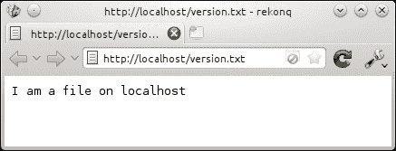
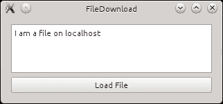
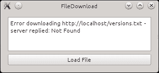
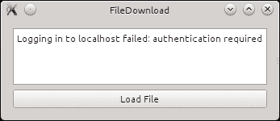
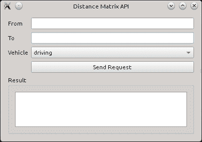
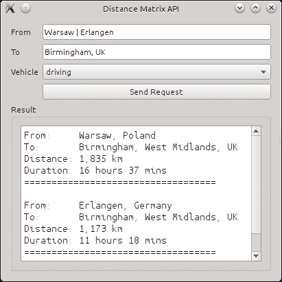
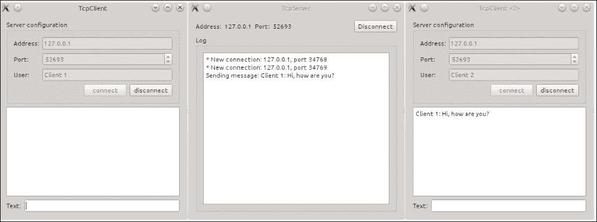

# 第七章：网络编程

> *在本章中，您将学习如何与互联网服务器以及一般套接字进行通信。首先，我们将查看`QNetworkAccessManager`，它使得发送网络请求和接收回复变得非常简单。基于这些基本知识，我们将使用谷歌的距离 API 来获取两个位置之间的距离以及从一个位置到另一个位置所需的时间。这种技术和相应的知识也可以用来通过各自的 API 将 Facebook 或 Twitter 集成到您的应用程序中。然后，我们将查看 Qt 的 Bearer API，它提供了设备连接状态的信息。在最后一节中，您将学习如何使用套接字创建自己的服务器和客户端，使用 TCP 或 UDP 作为网络协议。*

# QNetworkAccessManager

访问互联网上的文件最简单的方法是使用 Qt 的网络访问 API。此 API 以`QNetworkAccessManager`为中心，它处理您游戏与互联网之间的完整通信。

当我们现在开发和测试一个网络启用应用程序时，如果可行，建议您使用一个私有、本地的网络。这样，您可以调试连接的两端，并且错误不会暴露敏感数据。如果您不熟悉在您的机器上本地设置 Web 服务器，幸运的是，有许多免费的全能安装程序可供使用。这些程序将自动在您的系统上配置 Apache2、MySQL（或 MariaDB）、PHP 以及更多。例如，在 Windows 上，您可以使用 XAMPP ([`www.apachefriends.org`](http://www.apachefriends.org)) 或 Uniform Server ([`www.uniformserver.com`](http://www.uniformserver.com))；在苹果电脑上，有 MAMP ([`www.mamp.info`](http://www.mamp.info))；而在 Linux 上，通常您不需要做任何事情，因为已经存在 localhost。如果不是这样，请打开您首选的包管理器，搜索名为`Apache2`或类似名称的包，并安装它。或者，查看您发行版的文档。

在您在机器上安装 Apache 之前，考虑使用虚拟机，如 VirtualBox ([`www.virtualbox.org`](http://www.virtualbox.org)) 来完成这项任务。这样，您可以保持机器的整洁，并且可以轻松尝试为测试服务器设置不同的配置。使用多个虚拟机，您甚至可以测试您游戏的不同实例之间的交互。如果您使用 Unix，那么 Docker ([`www.docker.com`](http://www.docker.com)) 可能值得一看。

## 通过 HTTP 下载文件

为了做到这一点，首先尝试设置一个本地服务器并在已安装服务器的根目录下创建一个名为`version.txt`的文件。这个文件应该包含一小段文本，例如“我是一个在 localhost 上的文件”或类似的内容。为了测试服务器和文件是否正确设置，启动一个网页浏览器并打开`http://localhost/version.txt`。你应该会看到文件的内容。当然，如果你有访问域名的权限，你也可以使用它。只需相应地更改示例中使用的 URL。如果这失败了，可能是因为你的服务器不允许你显示文本文件。与其在服务器的配置中迷失方向，不如将文件重命名为`version.html`。这应该会解决问题！



在浏览器上请求 http://localhost/version.txt 的结果

如你所猜，由于文件名，实际场景可能是检查服务器上是否有你游戏或应用的更新版本。要获取文件的内容，只需要五行代码。

# 行动时间——下载文件

首先，创建一个`QNetworkAccessManager`的实例：

```cpp
QNetworkAccessManager *m_nam = new QNetworkAccessManager(this);
```

由于`QNetworkAccessManager`继承自`QObject`，它需要一个指向`QObject`的指针，该指针用作父对象。因此，你不必担心稍后删除管理器。此外，一个`QNetworkAccessManager`的单例就足够整个应用程序使用。所以，要么在你的游戏中传递网络访问管理器的指针，要么为了方便使用，创建一个单例模式并通过它访问管理器。

### 小贴士

单例模式确保一个类只被实例化一次。这种模式对于访问应用程序的全局配置或——在我们的例子中——`QNetworkAccessManager`的一个实例非常有用。在[`www.qtcentre.org`](http://www.qtcentre.org)和[`www.qt-project.org`](http://www.qt-project.org)的维基页面上，你可以找到不同单例模式的示例。一个简单的基于模板的方法可能看起来像这样（作为一个头文件）：

```cpp
template <class T>
class Singleton
{
public:
  static T& Instance()
  {
    static T _instance;
    return _instance;
  }
private:
  Singleton();
  ~Singleton();
  Singleton(const Singleton &);
  Singleton& operator=(const Singleton &);
};
```

在源代码中，你将包含那个头文件，并使用以下方式获取名为`MyClass`的类的单例：

```cpp
MyClass *singleton = &Singleton<MyClass>::Instance();
```

如果你使用 Qt Quick——它将在第九章（ch09.html，“Qt Quick 基础知识”）中解释——并且使用`QQuickView`，你可以直接使用视图的`QNetworkAccessManager`实例：

```cpp
QQuickView *view = new QQuickView;
QNetworkAccessManager *m_nam 
  = view->engine()->networkAccessManager();
```

第二，我们将管理器的`finished()`信号连接到我们选择的槽；例如，在我们的类中，我们有一个名为`downloadFinished()`的槽：

```cpp
connect(m_nam, SIGNAL(finished(QNetworkReply*)), this, 
  SLOT(downloadFinished(QNetworkReply*)));
```

第三，我们实际上是从本地主机请求`version.txt`文件：

```cpp
m_nam->get(QNetworkRequest(QUrl("http://localhost/version.txt")));
```

使用 `get()`，会发布一个获取指定 URL 文件内容的请求。该函数期望 `QNetworkRequest`，它定义了发送网络请求所需的所有信息。此类请求的主要信息自然是文件 URL。这就是为什么 `QNetworkRequest` 在其构造函数中将 `QUrl` 作为参数的原因。你也可以使用 `setUrl()` 将 URL 设置到请求中。如果你想要定义一些额外的头部，你可以使用 `setHeader()` 来设置最常见的头部，或者使用 `setRawHeader()` 来获得完全的灵活性。如果你想设置一个自定义的用户代理到请求中，调用将看起来像：

```cpp
QNetworkRequest request;
request.setUrl(QUrl("http://localhost/version.txt"));
request.setHeader(QNetworkRequest::UserAgentHeader, "MyGame");
m_nam->get(request);
```

`setHeader()` 函数接受两个参数，第一个是 `QNetworkRequest::KnownHeaders` 枚举的值，它包含最常见的——自解释的——头部，例如 `LastModifiedHeader` 或 `ContentTypeHeader`，第二个是实际值。你也可以使用 `setRawHeader()` 编写头部：

```cpp
request.setRawHeader("User-Agent", "MyGame");
```

当你使用 `setRawHeader()` 时，你必须自己编写头部字段名称。除此之外，它表现得像 `setHeader()`。所有 HTTP 协议版本 1.1 中可用的头部列表可以在 RFC 2616 的第十四部分中找到（[`www.w3.org/Protocols/rfc2616/rfc2616-sec14.html#sec14`](http://www.w3.org/Protocols/rfc2616/rfc2616-sec14.html#sec14)）。

回到我们的例子：使用 `get()` 函数，我们从本机请求了 `version.txt` 文件。从现在开始，我们只需要等待服务器回复。一旦服务器的回复完成，之前连接语句中定义的 `downloadFinished()` 插槽将被调用。作为参数，一个 `QNetworkReply` 类型的回复被传递到插槽中，我们可以读取回复的数据并将其设置到 `m_edit`，一个 `QPlainTextEdit` 的实例，使用以下方式：

```cpp
void FileDownload::downloadFinished(QNetworkReply *reply) {
 const QByteArray content = reply->readAll();
  m_edit->setPlainText(content);
 reply->deleteLater();
}
```

由于 `QNetworkReply` 继承了 `QIODevice`，因此还有其他读取回复内容的方法，包括 `QDataStream` 或 `QTextStream`，用于读取和解释二进制数据或文本数据。在这里，作为第四个命令，使用 `QIODevice::readAll()` 获取请求文件的完整内容到 `QByteArray`。转移给相应 `QNetworkReply` 的指针的责任在我们这里，因此我们需要在插槽的末尾删除它。这将是需要下载文件时 Qt 的第五行代码。然而，请注意，不要直接调用 `delete`。始终使用 `deleteLater()`，如文档中建议的那样！

完整的源代码可以在本书附带捆绑的 **FileDownload** 示例中找到。如果你启动这个小型的演示应用程序并点击 **Load File** 按钮，你应该会看到：



## 尝试一下英雄 - 扩展基本文件下载器

如果您还没有设置本地主机，只需将源代码中的 URL 更改为下载另一个文件。当然，为了下载另一个文件而不得不更改源代码远非理想的方法。因此，尝试通过添加一行编辑框来扩展对话框，以便您可以指定要下载的 URL。此外，您还可以提供一个文件对话框来选择下载文件将保存的位置。

## 错误处理

如果您看不到文件的内容，可能出了问题。就像现实生活中一样，这种情况经常发生。因此，我们需要确保在这种情况下有一个良好的错误处理机制来通知用户发生了什么。

# 动手实践 – 显示适当的错误消息

幸运的是，`QNetworkReply`提供了几种处理错误的方法。在名为`downloadFinished()`的槽中，我们首先想要检查是否发生了错误：

```cpp
if (reply->error() != QNetworkReply::NoError) {/* error occurred */}
```

`QNetworkReply::error()`函数返回处理请求时发生的错误。错误被编码为`QNetworkReply::NetworkError`类型的值。最常见的前两个错误可能是这些：

| 错误代码 | 含义 |
| --- | --- |
| `ContentNotFoundError` | 此错误表示请求的 URL 无法找到。它类似于 HTTP 错误代码 404。 |
| `ContentAccessDenied` | 此错误表示您没有权限访问请求的文件。它类似于 HTTP 错误代码 401。 |

您可以在文档中查找其他 23 个错误代码。但通常，您不需要确切知道发生了什么错误。您只需要知道一切是否顺利——在这种情况下，`QNetworkReply::NoError`将是返回值——或者是否出现了错误。

### 小贴士

由于`QNetworkReply::NoError`的值为`0`，您可以将测试语句缩短以检查是否发生了错误：

```cpp
if (reply->error()) {
  // an error occurred
}
```

为了向用户提供有意义的错误描述，您可以使用`QIODevice::errorString()`。文本已经设置了相应的错误消息，我们只需显示它：

```cpp
if (reply->error()) {
  const QString error = reply->errorString();
  m_edit->setPlainText(error);
  return;
}
```

在我们的例子中，假设我们在 URL 中犯了错误，错误地写成了`versions.txt`，应用程序将看起来像这样：



如果请求是 HTTP 请求并且您对状态码感兴趣，可以通过`QNetworkReply::attribute()`获取：

```cpp
reply->attribute(QNetworkRequest::HttpStatusCodeAttribute)
```

由于它返回`QVariant`，你可以使用`QVariant::toInt()`将代码作为整数获取，或者使用`QVariant::toString()`将数字作为`QString`获取。除了 HTTP 状态码外，你还可以通过`attribute()`查询很多其他信息。查看文档中`QNetworkRequest::Attribute`枚举的描述。在那里，你还可以找到`QNetworkRequest::HttpReasonPhraseAttribute`，它包含 HTTP 状态码的可读原因短语。例如，如果发生 HTTP 错误 404，则为“未找到”。此属性的值用于设置`QIODevice::errorString()`的错误文本。因此，你可以使用`errorString()`提供的默认错误描述，或者通过解释回复的属性来创建自己的描述。

### 小贴士

如果下载失败并且你想恢复它，或者如果你只想下载文件的一部分，你可以使用`Range`头：

```cpp
QNetworkRequest req(QUrl("..."));
req.setRawHeader("Range", "bytes=300-500");
QNetworkReply *reply = m_nam->get(req);
```

在此示例中，只会下载从`300`到`500`的字节。然而，服务器必须支持这一点。

## 通过 FTP 下载文件

通过 FTP 下载文件与通过 HTTP 下载文件一样简单。如果是一个不需要认证的匿名 FTP 服务器，只需使用我们之前使用的 URL 即可。假设在本地主机的 FTP 服务器上再次有一个名为`version.txt`的文件，输入：

```cpp
m_nam->get(QNetworkRequest(QUrl("ftp://localhost/version.txt")));
```

就这些了，其他一切保持不变。如果 FTP 服务器需要认证，你会得到一个错误，例如：



设置用户名和密码以访问 FTP 服务器同样简单：要么将其写入 URL 中，要么使用`QUrl`的`setUserName()`和`setPassword()`函数。如果服务器不使用标准端口，你可以使用`QUrl::setPort()`显式设置端口。

### 小贴士

要将文件上传到 FTP 服务器，使用`QNetworkAccessManager::put()`，它以`QNetworkRequest`作为其第一个参数，调用一个 URL 来定义服务器上新文件的名字，以及实际数据作为其第二个参数，该数据应该被上传。对于小文件上传，你可以将内容作为`QByteArray`传递。对于更大的内容，最好使用`QIODevice`的指针。确保设备在上传完成前保持打开和可用。

## 并行下载文件

关于 `QNetworkAccessManager` 的一个非常重要的注意事项：它是异步工作的。这意味着您可以在不阻塞主事件循环的情况下发布网络请求，这正是保持 GUI 响应的原因。如果您发布多个请求，它们将被放入管理器的队列中。根据使用的协议，它们将并行处理。如果您正在发送 HTTP 请求，通常一次最多处理六个请求。这不会阻塞应用程序。因此，实际上没有必要在线程中封装 `QNetworkAccessManager`；然而，遗憾的是，这种不必要的做法在互联网上被频繁推荐。`QNetworkAccessManager` 已经内部线程化。实际上，除非您确切知道自己在做什么，否则不要将 `QNetworkAccessManager` 移到线程中。

如果您发送多个请求，连接到管理器 `finished()` 信号的槽位将根据请求从服务器获得回复的速度以任意顺序被调用。这就是为什么您需要知道回复属于哪个请求的原因。这也是每个 `QNetworkReply` 都携带其相关 `QNetworkRequest` 的原因之一。它可以通过 `QNetworkReply::request()` 访问。

即使确定回复及其目的可能适用于单个槽位的小型应用，但如果发送大量请求，问题会迅速变得庞大且混乱。由于所有回复都只发送到单个槽位，这个问题变得更加严重。由于很可能存在需要不同处理的多种回复类型，因此将它们捆绑在特定槽位中会更好，这些槽位专门用于特定任务。幸运的是，这可以非常容易地实现。`QNetworkAccessManager::get()` 返回一个指向 `QNetworkReply` 的指针，该指针将获取您使用 `get()` 发送的请求的所有信息。通过使用此指针，您可以将特定槽位连接到回复的信号。

例如，如果您有多个 URL 并且想要将这些网站的所有链接图片保存到您的硬盘上，那么您可以通过 `QNetworkAccessManager::get()` 请求所有网页，并将它们的回复连接到一个专门用于解析接收到的 HTML 的槽位。如果找到图片链接，此槽位将再次使用 `get()` 请求它们。然而，这次对这些请求的回复将连接到第二个槽位，该槽位设计用于将图片保存到磁盘。因此，您可以分离这两个任务：解析 HTML 和将数据保存到本地驱动器。

接下来讨论 `QNetworkReply` 的最重要信号。

### 完成信号

`finished()` 信号是我们之前使用的 `QNetworkAccessManager::finished()` 信号的等价物。一旦回复返回（无论成功与否），就会触发此信号。在此信号发出后，回复的数据及其元数据将不再被更改。通过此信号，你现在可以将一个回复连接到特定的槽。这样，你可以实现上一节中概述的保存图像的场景。

然而，一个问题仍然存在：如果你同时发送请求，你不知道哪个请求已经完成并因此调用了连接的槽。与 `QNetworkAccessManager::finished()` 不同，`QNetworkReply::finished()` 不会传递一个指向 `QNetworkReply` 的指针；在这种情况下，这实际上是指向它自己的指针。一个快速解决这个问题的方法就是使用 `sender()`。它返回调用槽的 `QObject` 实例的指针。由于我们知道它是 `QNetworkReply`，我们可以编写：

```cpp
QNetworkReply *reply = qobject_cast<QNetworkReply*>
(sender());
if (!reply)
  return;
```

这是通过将 `sender()` 强制转换为 `QNetworkReply` 类型的指针来实现的。

### 提示

每当你将继承自 `QObject` 的类进行强制类型转换时，请使用 `qobject_cast`。与 `dynamic_cast` 不同，它不使用 RTTI，并且可以在动态库边界之间工作。

虽然我们可以相当确信强制类型转换将成功，但不要忘记检查指针是否有效。如果是空指针，则退出槽。

# 实践时间 – 使用 QSignalMapper 编写符合 OOP 代码

一种不依赖于 `sender()` 的更优雅的方法是使用 `QSignalMapper` 和一个局部哈希，其中存储了连接到该槽的所有回复。所以，每次你调用 `QNetworkAccessManager::get()` 时，将返回的指针存储在 `QHash<int, QNetworkReply*>` 类型的成员变量中，并设置映射器。假设我们有以下成员变量，并且它们已经正确设置：

```cpp
QNetworkAccessManager *m_nam;
QSignalMapper *m_mapper;
QHash<int, QNetworkReply*> m_replies;
```

然后，你这样连接一个回复的 `finished()` 信号：

```cpp
QNetworkReply *reply = m_nam->get(QNetworkRequest(QUrl(/*...*/)));
connect(reply, SIGNAL(finished()), m_mapper, SLOT(map()));
int id = /* unique id, not already used in m_replies*/;
m_replies.insert(id, reply);
m_mapper->setMapping(reply, id);
```

## *刚才发生了什么？*

首先，我们发送了请求并使用 `reply` 获取了 `QNetworkReply` 的指针。然后，我们将回复的 `finished` 信号连接到映射器的槽 `map()`。接下来，我们找到了一个唯一的 ID，这个 ID 必须不在 `m_replies` 变量中使用。你可以使用 `qrand()` 生成的随机数，只要它们是唯一的就可以。为了确定一个键是否已被使用，调用 `QHash::contains()`。它接受一个键作为参数，该参数应与之进行比较。或者甚至更简单，增加另一个私有成员变量。一旦我们有了唯一的 ID，我们就可以使用 ID 作为键将 `QNetworkReply` 的指针插入到哈希中。最后，使用 `setMapping()`，我们设置映射器的映射：ID 的值对应于实际的回复。

在一个显眼的位置，很可能是类的构造函数中，我们已将 `map()` 信号连接到自定义槽。例如：

```cpp
connect(m_mapper, SIGNAL(mapped(int)), this, SLOT(downloadFinished(int)));
```

当调用 `downloadFinished()` 插槽时，我们可以通过以下方式获取相应的回复：

```cpp
void SomeClass::downloadFinished(int id) {
  QNetworkReply *reply = m_replies.take(id);
  // do some stuff with reply here
  reply->deleteLater();
}
```

### 提示

`QSignalMapper` 还允许您使用 `QString` 作为标识符而不是使用前面代码中使用的整数。因此，您可以重写示例并使用 URL 来识别相应的 `QNetworkReply`，至少在 URL 是唯一的情况下。

## 错误信号

如果您按顺序下载文件，您可以替换错误处理。您不需要在连接到 `finished()` 信号的槽中处理错误，而是可以使用回复的 `error()` 信号，它将 `QNetworkReply::NetworkError` 类型的错误传递到槽中。在 `error()` 信号发出后，`finished()` 信号很可能会很快发出。

## readyRead 信号

到目前为止，我们一直使用连接到 `finished()` 信号的槽来获取回复的内容。如果您处理的是小文件，这工作得很好。然而，当处理大文件时，这种方法不适用，因为它们会不必要地绑定太多资源。对于大文件，最好在数据可用时立即读取并保存传输的数据。每当有新数据可供读取时，`QIODevice::readyRead()` 会通知我们。因此，对于大文件，您应该使用以下代码：

```cpp
connect(reply, SIGNAL(readyRead()), this, SLOT(readContent()));
file.open(QIODevice::WriteOnly);
```

这将帮助您将回复的 `readyRead()` 信号连接到一个槽，设置 `QFile` 并打开它。在连接的槽中，输入以下代码片段：

```cpp
const QByteArray ba = reply->readAll();
file.write(ba);
file.flush();
```

现在，您可以获取已传输的内容，并将其保存到（已打开的）文件中。这样，所需资源最小化。在 `finished()` 信号发出后，别忘了关闭文件。

在这个上下文中，如果您事先知道要下载的文件大小，这将很有帮助。因此，我们可以使用 `QNetworkAccessManager::head()`。它类似于 `get()` 函数，但不传输文件内容。只传输头部信息。如果我们幸运的话，服务器会发送 "Content-Length" 头部，其中包含字节数的文件大小。为了获取这些信息，我们输入：

```cpp
reply->head(QNetworkRequest::ContentLengthHeader).toInt();
```

基于这些信息，我们还可以提前检查磁盘上是否有足够的空间。

## 下载进度方法

尤其是在下载大文件时，用户通常想知道已经下载了多少数据以及下载完成大约需要多长时间。

# 显示下载进度的时机

为了实现这一点，我们可以使用回复的 `downloadProgress()` 信号。作为第一个参数，它传递了已接收的字节数信息，作为第二个参数，传递了总字节数。这使我们能够使用 `QProgressBar` 来指示下载进度。由于传递的参数是 `qint64` 类型，我们不能直接使用 `QProgressBar`，因为它只接受 `int`。因此，在连接的槽中，我们首先计算下载进度的百分比：

```cpp
void SomeClass::downloadProgress(qint64 bytesReceived, qint64 bytesTotal) {
  qreal progress = (bytesTotal < 1) ? 1.0 
                   : bytesReceived * 100.0 / bytesTotal;
  progressBar->setValue(progress * progressBar->maximum());
}
```

## *刚才发生了什么？*

使用百分比，我们为进度条设置新的值，其中`progressBar`是指向此进度条的指针。然而，`progressBar->maximum()`将会有什么值，我们在哪里设置进度条的取值范围？令人高兴的是，你不必为每个新的下载设置它。它只需要设置一次，例如，在包含进度条的类的构造函数中。作为取值范围，我建议：

```cpp
progressBar->setRange(0, 2048);
```

原因在于，如果你以 0 到 100 的范围为例，并且进度条宽度为 500 像素，每次值的变化都会使进度条前进 5 像素。这看起来会很丑。为了得到平滑的进度，每次进度条只扩展 1 像素，范围应该是 0 到 99.999.999，这当然可以工作，但效率会很高。这是因为进度条的当前值会变化很多，而没有任何图形表示。因此，最佳的范围值应该是 0 到实际进度条宽度的像素数。不幸的是，进度条的宽度可能会根据实际小部件的宽度而变化，每次值变化时频繁查询实际大小也不是一个好的解决方案。那么为什么是`2048`呢？这个值背后的想法是屏幕的分辨率。全高清显示器通常宽度为 1920 像素，因此使用 2¹¹（2048）确保进度条即使在完全展开的情况下也能平滑运行。所以，2048 不是一个完美的数字，但是一个相当好的折衷方案。如果你针对的是较小的设备，选择一个更小、更合适的数字。

为了能够计算下载完成剩余时间，你必须启动一个计时器。在这种情况下，使用`QElapsedTimer`。在通过`QNetworkAccessManager::get()`发送请求后，通过调用`QElapsedTimer::start()`来启动计时器。假设计时器被命名为`m_timer`，计算将是：

```cpp
qint64 total = m_timer.elapsed() / progress;
qint64 remaining = (total – m_timer.elapsed()) / 1000;
```

`QElapsedTimer::elapsed()`返回从计时器开始计数的毫秒数。这个值除以进度等于估计的总下载时间。如果你从已过的时间中减去，然后除以 1000，你将得到剩余时间的秒数。

## 使用代理

如果你喜欢使用代理，你首先必须设置`QNetworkProxy`。你必须使用`setType()`定义代理的类型。作为参数，你很可能会传递`QNetworkProxy::Socks5Proxy`或`QNetworkProxy::HttpProxy`。然后，使用`setHostName()`设置主机名，使用`setUserName()`设置用户名，使用`setPassword()`设置密码。最后两个属性当然只在代理需要认证时才需要。一旦代理设置好，你可以通过`QNetworkAccessManager::setProxy()`将其设置到访问管理器中。现在，所有新的请求都将使用此代理。

# 连接到 Google、Facebook、Twitter 等

由于我们已经讨论了 `QNetworkAccessManager`，你现在拥有了将 Facebook、Twitter 或类似网站集成到你的应用程序所需的知识。它们都使用 HTTP 协议和简单的请求来从它们那里检索数据。对于 Facebook，你必须使用所谓的 Graph API。它描述了哪些接口可用以及它们提供了哪些选项。如果你想搜索名为 "Helena" 的用户，你必须请求 [`graph.facebook.com/search?q=helena&type=user`](https://graph.facebook.com/search?q=helena&type=user)。当然，你可以使用 `QNetworkManager` 来做这件事。你可以在 [`developers.facebook.com/docs/graph-api`](http://developers.facebook.com/docs/graph-api) 找到有关 Facebook 可能请求的更多信息。

如果你希望在游戏中显示推文，你必须使用 Twitter 的 REST 或搜索 API。假设你知道你想要显示的推文的 ID，那么你可以通过 [`api.twitter.com/1.1/statuses/show.json?id=12345`](https://api.twitter.com/1.1/statuses/show.json?id=12345) 获取它，其中 `12345` 是推文的实际 ID。如果你想找到提到 `#Helena` 的推文，你可以写 [`api.twitter.com/1.1/search/tweets.json?q=%23Helena`](https://api.twitter.com/1.1/search/tweets.json?q=%23Helena)。你可以在 [`dev.twitter.com/docs/api`](https://dev.twitter.com/docs/api) 找到有关 Twitter API 参数和其他可能性的更多信息。

由于 Facebook 和 Twitter 使用它们的 API 都需要认证，我们将转向 Google。让我们使用 Google 的距离矩阵 API 来获取从一个城市到另一个城市所需时间的信息。我们将使用的 API 的技术文档可以在 [`developers.google.com/maps/documentation/distancematrix`](https://developers.google.com/maps/documentation/distancematrix) 找到。

# 行动时间 - 使用 Google 的距离矩阵 API

这个示例的 GUI 保持简单——源代码附在书中。它由两个行编辑（`ui->from` 和 `ui->to`）组成，允许你输入旅行的起点和终点。它还提供了一个组合框（`ui->vehicle`），允许你选择一种交通方式——无论是开车、骑自行车还是步行——一个按钮（`ui->search`）来启动请求，以及一个文本编辑器（`ui->result`）来显示结果。结果将看起来像这样：



`MainWindow`——`QMainWindow` 的子类——是应用程序的主要类，它包含两个私有成员：`m_nam`，它是一个指向 `QNetworkAccessManager` 的指针，以及 `m_reply`，它是一个指向 `QNetworkReply` 的指针。

# 行动时间 - 构建查询

每次按钮被按下时，都会调用 `sendRequest()` 槽：

```cpp
void MainWindow::sendRequest()
{
  if (m_reply != 0 && m_reply->isRunning())
    m_reply->abort();
  ui->result->clear();
```

在这个槽中，我们首先检查是否有一个旧请求，它存储在 `m_reply` 中，并且它仍在运行。如果是 `true`，我们将终止旧请求，因为我们即将安排一个新的请求。然后，我们通过在文本编辑器上调用 `QPlainTextEdit::clear()` 来清除上一次请求的结果。

接下来，我们将构建请求的 URL。我们可以通过手动组合字符串来完成此操作，我们将查询参数添加到基本 URL 中，类似于以下内容：

```cpp
url = baseUrl + "?origin=" + ui->from->text() + "&...";
```

除了当我们包含多个参数时这很快变得难以阅读的问题之外，它还相当容易出错。行编辑器的值必须进行编码以符合有效 URL 的标准。因此，对于每个用户值，我们都必须显式调用 `QUrl::toPercentEncoding()`。一个更好的方法，它更容易阅读且错误更少，是使用 `QUrlQuery`。它避免了由于忘记编码数据而可能产生的问题。因此，我们这样做：

```cpp
QUrlQuery query;
query.addQueryItem("sensor", "false");
query.addQueryItem("language", "en");
query.addQueryItem("units", "metric");
query.addQueryItem("origins", ui->from->text());
query.addQueryItem("destinations", ui->to->text());
query.addQueryItem("mode", ui->vehicle->currentText());
```

使用方法非常清晰：我们创建一个实例，然后使用 `addQueryItem()` 添加查询参数。第一个参数被视为键，第二个参数被视为值，结果是一个如 "key=value" 的字符串。当我们将 `QUrlQuery` 与 `QUrl` 一起使用时，值将被自动编码。使用 `QUrlQuery` 的其他好处是，我们可以使用 `hasQueryItem()` 检查是否已经设置了键，将键作为参数传递，或者通过调用 `removeQueryItem()` 删除之前设置的键。

在实际情况下，我们当然会使用 `QStringLiteral` 将所有前面的字面量包装起来，但在这里我们为了更好的可读性而省略了它。因此，让我们回顾一下我们设置了哪些参数。`sensor` 键设置为 `false`，因为我们没有使用 GPS 设备来定位我们的位置。`language` 键设置为 `English`，对于单位，我们更喜欢公制而不是英制。然后，我们设置了与搜索相关的参数。`origins` 键包含我们想要开始的地点。其值是 `ui->from` 行编辑器的文本。如果您想查询多个起始位置，只需使用 `|` 将它们组合即可。与 `origins` 相似，我们为目的地设置了值。最后，我们将组合框的值传递给 `mode`，它定义了我们想要开车、骑自行车还是步行，如下面的代码所示：

```cpp
  QUrl url
    = ("http://maps.googleapis.com/maps/api/distancematrix/json");
  url.setQuery(query);
  m_reply = m_nam->get(QNetworkRequest(url));
}
```

接下来，我们创建一个包含查询应提交的地址的 `QUrl`。通过在末尾包含 "json"，我们定义服务器应使用 JSON 格式传输其回复。Google 还为我们提供了将结果获取为 XML 的选项。要实现这一点，只需将 "json" 替换为 "xml"。然而，由于 Facebook 和 Twitter 的 API 返回 JSON，我们将使用此格式。

然后，我们通过调用 `QUrl::setQuery()` 将先前构建的 `query` 设置到 URL 中。这会自动编码值，所以我们不需要担心这一点。最后，我们通过调用 `get()` 函数发送请求，并将返回的 `QNetworkReply` 存储在 `m_reply` 中。

# 行动时间 - 解析服务器的回复

在构造函数中，我们将管理器的 `finish()` 信号连接到 `MainWindow` 类的 `finished()` 槽。因此，它将在请求发送后调用：

```cpp
void MainWindow::finished(QNetworkReply *reply)
{
  if (m_reply != reply) {
    reply->deleteLater();
    return;
  }
```

首先，我们检查传递的回复是否是我们通过 `m_nam` 请求的那个。如果不是这种情况，我们删除 `reply` 并退出函数。这可能会发生在 `sendRequest()` 槽取消回复的情况下：

```cpp
m_reply = 0;
if (reply->error()) {
  ui->result->setPlainText(reply->errorString());
  reply->deleteLater();
  return;
}
```

既然我们现在确定这是我们请求的，我们将 `m_reply` 设置为 null，因为我们已经处理了它，不再需要这个信息。接下来我们检查是否发生了错误，如果发生了，我们将回复的错误字符串放入文本编辑器中，删除回复，并退出函数：

```cpp
const QByteArray content = reply->readAll();
QJsonDocument doc = QJsonDocument::fromJson(content);
if (doc.isNull() || !doc.isObject()) {
  ui->result->setPlainText("Error while reading the JSON file.");
  reply->deleteLater();
  return;
}
```

使用 `readAll()`，我们获取服务器的回复内容。由于传输的数据量不大，我们不需要使用 `readyRead()` 进行部分读取。然后，使用 `QJsonDocument::fromJson()` 静态函数将内容转换为 `QJsonDocument`，该函数接受 `QByteArray` 作为参数并解析其数据。如果文档为空，则表示服务器的回复无效，然后我们在文本编辑器上显示错误消息，删除回复，并退出函数。如果文档不包含对象，我们也会这样做，因为 API 调用应该只响应一个对象，如下所示：

```cpp
QJsonObject obj = doc.object();
QVariantList origins = obj.value("origin_addresses")
                       .toArray().toVariantList();
QVariantList destinations = obj.value("destination_addresses")
                            .toArray().toVariantList();
```

由于我们现在已经确认存在一个对象，我们将其存储在 `obj` 中。此外，由于 API，我们还知道该对象包含 `origin_addresses` 和 `destination_addresses` 键。这两个值都是数组，包含请求的起点和终点。从这一点开始，如果值存在且有效，我们将跳过任何测试，因为我们信任 API。该对象还包含一个名为 `status` 的键，其值可以用来检查查询是否可能失败，如果是，原因是什么？源代码的最后两行将起点和终点存储在两个变体列表中。通过 `obj.value("origin_addresses")`，我们获取包含 `origin_addresses` 键指定的值对的 `QJsonValue`。`QJsonValue::toArray()` 将此值转换为 `QJsonArray`，然后使用 `QJsonArray::toVariantList()` 转换为 `QVariantList`。对于请求从华沙或埃尔兰根到伯明翰的距离的搜索，返回的 JSON 文件将如下所示：

```cpp
{
  "destination_addresses" : [ "Birmingham, West Midlands, UK" ],
  "origin_addresses" : [ "Warsaw, Poland", "Erlangen, Germany" ],
  "rows" : [ ... ],
  "status" : "OK"
}
```

`rows` 键持有实际结果作为数组。该数组中的第一个对象属于第一个起点，第二个对象属于第二个起点，依此类推。每个对象都包含一个名为 `elements` 的键，其值也是一个对象数组，属于相应的目的地：

```cpp
"rows" : [
    {
      "elements" : [{...}, {...}]
    },
    {
      "elements" : [{...}, {...}]
    }
  ],
```

每个起点-终点对（前一个示例中的 `{...}`）的 JSON 对象由两个键值对组成，分别是距离和持续时间键。这两个键的值都是数组，包含 `text` 和 `value` 键，其中 `text` 是 `value` 的人类可读短语。Warsaw-Birmingham 搜索的对象如下所示：

```cpp
{
  "distance" : {
    "text" : "1,835 km",
    "value" : 1834751
  },
  "duration" : {
    "text" : "16 hours 37 mins",
    "value" : 59848
  },
  "status" : "OK"
}
```

如您所见，距离的 `value` 是以米为单位的距离——因为我们已经在请求中使用了 `units=metric`——而 `text` 的值是将值转换为带有后缀 "km" 的千米。同样的情况也适用于持续时间。在这里，值以秒为单位表示，而 `text` 是将值转换为小时和分钟的表示。

现在我们知道了返回的 JSON 的结构，我们将在文本编辑器中显示每个起点-终点对的值。因此，我们使用 `QVariantLists` 遍历每个可能的配对：

```cpp
for (int i = 0; i < origins.count(); ++i) {
  for (int j = 0; j < destinations.count(); ++j) {
```

这个作用域将针对每种组合被访问。想象一下传递的结果就像一个表格，其中起点是行，目的地是列：

```cpp
QString output;
output += QString("From:").leftJustified(10, ' ') 
          + origins.at(i).toString() + "\n";
output += QString("To:").leftJustified(10, ' ') 
          + destinations.at(j).toString() + "\n";
```

我们将构建的文本缓存到一个名为 output 的局部变量中。首先，我们在 output 中添加字符串 "From:" 和当前源地址。为了让它看起来至少稍微美观一些，我们调用 `leftJustified()`。这会导致 "From:" 被填充空格直到整个字符串的大小为 `10`。然后输出将被对齐。当前源地址的值通常通过 `QList::at()` 访问，由于它是 `QVariantList`，我们需要将返回的 `QVariant` 转换为 `QString`。因此，我们调用 `toString()`。同样的操作也应用于目的地，结果如下所示，这是 output 的值：

```cpp
From:     Warsaw, Poland
To:       Birmingham, West Midlands, UK
```

接下来，我们将从我们调用 `data` 的相应 `QJsonObject` 中读取持续时间和距离：

```cpp
QJsonObject data = obj.value("rows").toArray().at(i).toObject()
                  .value("elements").toArray().at(j).toObject();
```

从回复的根对象开始，我们获取行值并将其转换为数组（`obj.value("rows").toArray()`）。然后，我们获取当前行的值（`.at(i)`），将其转换为 JSON 对象，并获取其元素键（`.toObject().value("elements")`）。由于这个值也是一个数组——行的列——我们将其转换为数组，获取当前列（`.toArray().at(j)`），并将其转换为对象。这就是包含起点-终点对单元格（`i;j`）中的距离和持续时间的对象。除了这两个键之外，该对象还包含一个名为 `status` 的键。它的值表示搜索是否成功（`OK`），起点或目的地是否找不到（`NOT_FOUND`），或者搜索是否无法在起点和目的地之间找到路线（`ZERO_RESULTS`）：

```cpp
QString status = data.value("status").toString();
```

我们将状态值存储在一个也命名为 status 的局部变量中：

```cpp
if (status == "OK") {
  output += QString("Distance:").leftJustified(10, ' ') + 
    data.value("distance").toObject().value("text").toString() 
    + "\n";
  output += QString("Duration:").leftJustified(10, ' ') + 
    data.value("duration").toObject().value("text").toString() 
    + "\n";
}
```

如果一切顺利，我们接着将`distance`和`duration`添加到输出中，并且像之前使用`leftJustified()`一样对标签进行对齐。对于距离，我们希望显示短语化的结果。因此，我们首先获取距离键的 JSON 值(`data.value("distance")`)，将其转换为对象，并请求文本键的值(`.toObject().value("text")`)。最后，我们使用`toString()`将`QJsonValue`转换为`QString`。对于持续时间也是如此：

```cpp
else if (status == "NOT_FOUND") {
  output += "Origin and/or destination of this pairing could not be geocoded.\n";
} else if (status == "ZERO_RESULTS") {
  output += "No route could be found.\n";
} else {
  output += "Unknown error.\n";
}
```

如果 API 返回错误，我们将设置适当的错误文本作为输出：

```cpp
      output += QString("\n").fill('=', 35) + "\n\n";
      ui->result->moveCursor(QTextCursor::End);
      ui->result->insertPlainText(output);
    }
  }
  reply->deleteLater();
}
```

最后，我们添加一行由`35`个等号(`fill('=', 35)`)组成的线，以将结果单元格与其他单元格分开。然后将输出放置在文本编辑的末尾。这是通过将光标移动到编辑的末尾，调用`moveCursor(QTextCursor::End)`，并使用`insertPlainText(output)`将输出插入到编辑中完成的。

当循环结束时，我们一定不要忘记删除回复。实际结果如下所示：



## 尝试一下英雄 – 选择 XML 作为回复的格式

为了磨练你的 XML 技能，你可以使用[`maps.googleapis.com/maps/api/distancematrix/xml`](http://maps.googleapis.com/maps/api/distancematrix/xml)作为 URL，向其发送请求。然后，你可以像处理 JSON 一样解析 XML 文件，并同样显示检索到的数据。

# 控制连接状态

实际上，只有在你有活跃的互联网连接时才能使用`QNetworkAccessManager`。由于理论上你无法知道连接状态，你必须在应用程序运行时进行检查。借助 Bearer API，你可以检查计算机、移动设备或平板电脑是否在线，甚至可以启动一个新的连接——如果操作系统支持的话。

携带者 API 主要由四个类组成。`QNetworkConfigurationManager` 是基础和起点。它包含系统上所有可用的网络配置。此外，它还提供有关网络功能的信息，例如，您是否可以启动和停止接口。它找到的网络配置存储为 `QNetworkConfiguration` 类。`QNetworkConfiguration` 包含有关接入点的一切信息，但不包括网络接口，因为一个接口可以提供多个接入点。此类还仅提供有关网络配置的信息。您不能通过 `QNetworkConfiguration` 配置接入点或网络接口。网络配置由操作系统管理，因此，`QNetworkConfiguration` 是一个只读类。然而，使用 `QNetworkConfiguration`，您可以确定连接类型是以太网、WLAN 还是 2G 连接。这可能会影响您将要下载的数据类型，更重要的是，数据的大小。使用 `QNetworkSession`，您可以启动或停止由配置定义的系统网络接口。这样，您就可以控制接入点。`QNetworkSession` 还提供会话管理，这在系统接入点被多个应用程序使用时非常有用。会话确保在最后一个会话关闭之后，底层接口才会终止。最后，`QNetworkInterface` 提供经典信息，如硬件地址或接口名称。

## QNetworkConfigurationManager

`QNetworkConfigurationManager` 管理系统上可用的所有网络配置。您可以通过调用 `allConfigurations()` 来访问这些配置。当然，您首先必须创建管理器的实例：

```cpp
QNetworkConfigurationManager manager;
QList<QNetworkConfiguration> cfgs = manager.allConfigurations();
```

配置作为列表返回。`allConfigurations()` 的默认行为是返回所有可能的配置。但是，您也可以获取一个过滤后的列表。如果您将 `QNetworkConfiguration::Active` 作为参数传递，列表中只包含至少有一个活动会话的配置。如果您基于此类配置创建新的会话，它将是活动的并已连接。通过传递 `QNetworkConfiguration::Discovered` 作为参数，您将获得一个包含可以立即启动会话的配置的列表。请注意，然而，在此阶段，您不能确定底层接口是否可以启动。最后一个重要的参数是 `QNetworkConfiguration::Defined`。使用此参数，`allConfigurations()` 返回一个列表，其中包含系统已知但当前不可用的配置。这可能是一个之前使用的已超出范围的 WLAN 热点。

当配置更改时，您将收到通知。如果出现新的配置，则管理器会发出 `configurationAdded()` 信号。例如，这可能发生在移动数据传输变得可用或用户打开其设备的 WLAN 适配器时。如果移除配置，例如关闭 WLAN 适配器，则发出 `configurationRemoved()`。最后，当配置更改时，您将通过 `configurationChanged()` 信号收到通知。所有三个信号都传递对配置的常量引用，说明添加、移除或更改的内容。通过 `configurationRemoved()` 信号传递的配置当然无效。它仍然包含已移除配置的名称和标识符。

要确定系统中的任何网络接口是否处于活动状态，请调用 `isOnline()`。如果您想被通知模式更改，请跟踪 `onlineStateChanged()` 信号。

### 提示

由于 WLAN 扫描需要一定的时间，`allConfigurations()` 可能不会返回所有可用的配置。为确保配置完全填充，请先调用 `updateConfigurations()`。由于收集系统网络配置的所有信息可能需要很长时间，此调用是异步的。等待 `updateCompleted()` 信号，然后才能调用 `allConfigurations()`。

`QNetworkConfigurationManager` 还会通知您 Bearer API 的功能。`capabilities()` 函数返回 `QNetworkConfigurationManager::Capabilities` 类型的标志，并描述了特定平台的可用可能性。您可能最感兴趣的值如下：

| 值 | 含义 |
| --- | --- |
| `CanStartAndStopInterfaces` | 这表示您可以启动和停止接入点。 |
| `ApplicationLevelRoaming` | 这表示系统会通知您是否有更合适的接入点可用，并且如果您认为有更好的接入点，您可以主动更改接入点。 |
| `DataStatistics` | 使用此功能，`QNetworkSession` 包含有关传输和接收的数据信息。 |

## QNetworkConfiguration

`QNetworkConfiguration` 如前所述，包含有关接入点的信息。使用 `name()`，您可以获取配置的用户可见名称，而使用 `identifier()`，您可以获取一个唯一的、系统特定的标识符。如果您为移动设备开发游戏，了解正在使用哪种类型的连接可能对您有利。这可能会影响您请求的数据；例如，视频的质量及其大小。使用 `bearerType()`，将返回配置使用的承载类型。返回的枚举值相当直观：`BearerEthernet`、`BearerWLAN`、`Bearer2G`、`BearerCDMA2000`、`BearerWCDMA`、`BearerHSPA`、`BearerBluetooth`、`BearerWiMAX` 等。您可以在 `QNetworkConfiguration::BearerType` 的文档中查找完整的值列表。

使用 `purpose()`，您可以获取配置的目的，例如，它是否适合访问私有网络（`QNetworkConfiguration::PrivatePurpose`）或访问公共网络（`QNetworkConfiguration::PublicPurpose`）。如果已定义、发现或激活，配置的状态，如前所述，可以通过 `state()` 访问。

## QNetworkSession

要启动网络接口或告诉系统保持接口连接以满足您的需求，您必须启动一个会话：

```cpp
QNetworkConfigurationManager manager;
QNetworkConfiguration cfg = manager.defaultConfiguration();
QNetworkSession *session = new QNetworkSession(cfg, this);
session->open();
```

会话基于配置。当存在多个会话且您不确定使用哪个时，请使用 `QNetworkConfigurationManager::defaultConfiguration()`。它返回系统的默认配置。基于此，您可以创建 `QNetworkSession` 的一个实例。第一个参数，即配置，是必需的。第二个参数是可选的，但建议使用，因为它设置了一个父对象，我们不需要处理删除。您可能想先检查配置是否有效（`QNetworkConfiguration::isValid()`）。调用 `open()` 将启动会话并在需要和受支持的情况下连接接口。由于 `open()` 可能需要一些时间，该调用是异步的。因此，您可以监听 `opened()` 信号，该信号在会话打开时立即发出，或者监听 `error()` 信号，如果发生错误。错误类型为 `QNetworkSession::SessionError`。或者，您也可以监听 `stateChanged()` 信号。会话的可能状态可以是：`Invalid`（无效）、`NotAvailable`（不可用）、`Connecting`（连接中）、`Connected`（已连接）、`Closing`（关闭中）、`Disconnected`（断开连接）和 `Roaming`（漫游）。如果您想使 `open()` 同步，请在调用 `open()` 后立即调用 `waitForOpened()`。它将阻塞事件循环，直到会话打开。此函数在成功时返回 `true`，否则返回 `false`。为了限制等待时间，您可以定义一个超时。只需将您愿意等待的毫秒数作为参数传递给 `waitForOpened()`。要检查会话是否打开，请使用 `isOpen()`。

要关闭会话，请调用 `close()`。如果界面上没有剩余的会话，它将被关闭。要强制断开接口，请调用 `stop()`。此调用将使基于该接口的所有会话无效。

您可能会收到 `preferredConfigurationChanged()` 信号，这表示首选配置，即例如首选接入点已更改。这可能是在现在有 WLAN 网络范围内，您不再需要使用 2G 的情况下。新的配置作为第一个参数传递，第二个参数指示更改新的接入点是否会同时更改 IP 地址。除了检查信号外，您还可以通过调用 `QNetworkConfiguration::isRoamingAvailable()` 来查询配置是否支持漫游。如果漫游可用，您必须决定通过调用 `ignore()` 拒绝提议，或者通过调用 `migrate()` 接受它。如果您接受漫游，当会话漫游时将发出 `newConfigurationActivated()`。在检查新的连接后，您可以选择接受新的接入点或拒绝它。后者意味着您将返回到以前的接入点。如果您接受新的接入点，以前的接入点将被终止。

## QNetworkInterface

要获取会话使用的接口，请调用 `QNetworkSession::interface()`。它将返回 `QNetworkInterface` 对象，该对象描述了接口。通过 `hardwareAddress()`，您可以得到接口的低级硬件地址，通常是 MAC 地址。接口的名称可以通过 `name()` 获取，它是一个如 "eth0" 或 "wlan0" 的字符串。`addressEntries()` 返回与接口注册的 IP 地址列表以及它们的子网掩码和广播地址。此外，您可以通过 `flags()` 查询接口是否是环回或是否支持多播。返回的位掩码是这些值的组合：`IsUp`、`IsRunning`、`CanBroadcast`、`IsLoopBack`、`IsPointToPoint` 和 `CanMulticast`。

# 游戏间的通信

在讨论了 Qt 的高级网络类，如 `QNetworkAccessManager` 和 `QNetworkConfigurationManager` 之后，我们现在将查看较低级别的网络类，并了解 Qt 在实现 TCP 或 UDP 服务器和客户端时如何支持您。当您计划通过包括多人模式来扩展游戏时，这一点变得相关。为此类任务，Qt 提供 `QTcpSocket`、`QUdpSocket` 和 `QTcpServer`。

# 实现简单聊天程序的时间

为了熟悉 `QTcpServer` 和 `QTcpSocket`，让我们开发一个简单的聊天程序。这个例子将教会您 Qt 中网络处理的基本知识，以便您以后可以使用这项技能连接两个或更多个游戏副本。在这个练习结束时，我们希望看到如下内容：



在前面图例的左侧和右侧，你可以看到一个客户端，而服务器位于中间。我们将首先仔细看看服务器。

# 服务器 – QTcpServer

作为通信协议，我们将使用 **传输控制协议**（**TCP**）。你可能从两个最流行的互联网协议 HTTP 和 FTP 中了解到这个网络协议。这两个协议都使用 TCP 进行通信，全球使用的电子邮件流量协议也是如此：SMTP、POP3 和 IMAP。然而，TCP 的主要优势是其可靠性和基于连接的架构。通过 TCP 传输的数据保证是完整、有序且无重复的。此外，该协议是面向流的，这允许我们使用 `QDataStream` 或 `QTextStream`。TCP 的缺点是速度较慢。这是因为丢失的数据必须重新传输，直到接收方完全接收为止。默认情况下，这会导致丢失部分之后传输的所有数据重新传输。因此，你应该只在速度不是首要考虑的情况下选择 TCP 作为协议，而是数据的完整性和正确性。如果你发送的是唯一非重复数据，这也适用。

# 行动时间 – 设置服务器

服务器 GUI 的外观显示，它基本上由 `QPlainTextEdit` (`ui->log`) 组成，用于显示系统消息，以及一个按钮（`ui->disconnectClients`），允许我们断开所有当前连接的客户端。在按钮旁边，显示服务器的地址和端口（`ui->address` 和 `ui->port`）。在服务器类的构造函数中设置用户界面后，我们初始化内部使用的 `QTcpServer`，它存储在 `m_server` 私有成员变量中：

```cpp
if (!m_server->listen(QHostAddress::LocalHost, 52693)) {
  ui->log->setPlainText("Failure while starting server: "
                        + m_server->errorString());
  return;
}
connect(m_server, SIGNAL(newConnection()),
        this, SLOT(newConnection()));
```

## *发生了什么？*

使用 `QTcpServer::listen()`，我们定义服务器应监听本地的 `52693` 端口以接收新的连接。这里使用的值，`QHostAddress::LocalHost` 来自 `QHostAddress::SpecialAddress` 枚举，将解析为 `127.0.0.1`。如果你传递 `QHostAddress::Any`，服务器将监听所有 IPv4 接口以及 IPv6 接口。如果你只想监听特定的地址，只需将此地址作为 `QHostAddress` 传递：

```cpp
m_server->listen(QHostAddress("127.0.0.1"), 0);
```

这将表现得像前面代码中的那个，只是现在服务器将监听一个自动选择的端口。如果成功，`listen()` 将返回 `true`。因此，如果示例中出现问题，它将在文本编辑器上显示错误消息并退出函数。为了组成错误消息，我们使用 `QTcpServer::errorString()`，它包含一个可读的错误短语。

要处理游戏中代码的错误，错误字符串并不适用。在任何需要知道确切错误的情况下，使用 `QTcpServer::serverError()`，它返回 `QAbstractSocket::SocketError` 的枚举值。基于此，你可以确切地知道出了什么问题，例如，`QAbstractSocket::HostNotFoundError`。如果 `listen()` 成功，我们将服务器的 `newConnection()` 信号连接到类的 `newConnection()` 槽。每当有新的连接可用时，该信号将被触发：

```cpp
ui->address->setText(m_server->serverAddress().toString());
ui->port->setText(QString::number(m_server->serverPort()));
```

最后，我们展示了可以通过 `serverAddress()` 和 `serverPort()` 获取的服务器地址和端口号。这些信息对于客户端来说是必要的，以便它们能够连接到服务器。

# 行动时间 - 对新挂起连接做出反应

一旦客户端尝试连接到服务器，`newConnection()` 槽将被调用：

```cpp
void TcpServer::newConnection() {
  while (m_server->hasPendingConnections()) {
    QTcpSocket *con = m_server->nextPendingConnection();
    m_clients << con;
    ui->disconnectClients->setEnabled(true);
    connect(con, SIGNAL(disconnected()), this, SLOT(removeConnection()));
    connect(con, SIGNAL(readyRead()), this, SLOT(newMessage()));
    ui->log->insertPlainText(
      QString("* New connection: %1, port %2\n")
      .arg(con->peerAddress().toString())
      .arg(QString::number(con->peerPort())));
  }
}
```

## *发生了什么？*

由于可能有多个挂起的连接，我们使用 `hasPendingConnections()` 来确定是否至少还有一个挂起的连接。然后在 `while` 循环内部处理每一个连接。要获取 `QTcpSocket` 类型的挂起连接，我们调用 `nextPendingConnection()` 并将此连接添加到名为 `m_clients` 的私有列表中，该列表包含所有活动连接。在下一行，由于现在至少有一个连接，我们启用了允许关闭所有连接的按钮。因此，连接到按钮 `click()` 信号的槽将调用每个单独连接的 `QTcpSocket::close()`。当连接关闭时，其套接字发出 `disconnected()` 信号。我们将此信号连接到我们的 `removeConnection()` 槽。对于最后一个连接，我们响应套接字的 `readyRead()` 信号，这表示有新数据可用。在这种情况下，我们的 `newMessage()` 槽将被调用。最后，我们打印一条系统消息，表明已建立新的连接。连接客户端和对方的地址和端口号可以通过套接字的 `peerAddress()` 和 `peerPort()` 函数获取。

### 小贴士

如果无法接受新的连接，将发出 `acceptError()` 信号而不是 `newConnection()`。它将 `QAbstractSocket::SocketError` 类型的失败原因作为参数传递。如果您想暂时拒绝新的连接，请在 `QTcpServer` 上调用 `pauseAccepting()`。要恢复接受新的连接，请调用 `resumeAccepting()`。

# 行动时间 - 转发新消息

当连接的客户端发送新的聊天消息时，由于它继承自 `QIODevice`，底层的套接字会发出 `readyRead()` 信号，因此我们的 `newMessage()` 槽将被调用。

在我们查看这个槽之前，有一些重要的事情需要你记住。尽管 TCP 是有序的且没有重复，但这并不意味着所有数据都作为一个大块传输。因此，在处理接收到的数据之前，我们需要确保我们得到了整个消息。不幸的是，没有简单的方法来检测是否所有数据都已传输，也没有一个通用的方法来完成这项任务。因此，这个问题取决于你的用例。然而，两种常见的解决方案是发送魔法令牌来指示消息的开始和结束，例如单个字符或 XML 标签，或者你可以提前发送消息的大小。第二种解决方案在 Qt 文档中显示，其中消息长度放在消息前面的 `quint16` 中。另一方面，我们将探讨一种使用简单魔法令牌正确处理消息的方法。作为分隔符，我们使用“传输结束块”字符——ASCII 码 23——来指示消息的结束。

由于接收数据的处理相当复杂，我们这次将逐步解释代码：

```cpp
void TcpServer::newMessage()
{
  if (QTcpSocket *con = qobject_cast<QTcpSocket*>(sender())) {
    m_receivedData[con].append(con->readAll());
```

要确定哪个套接字调用了槽，我们使用 `sender()`。如果将 `QTcpSocket` 强制转换为成功，我们进入 `if` 范围，并使用 `readAll()` 读取传输的——可能是片段化的——消息。

### 注意

请注意，`sender()` 用于简化。如果你编写实际的代码，最好使用 `QSignalMapper`。

然后，`read` 数据将与存储在名为 `m_receivedData` 的 `QHash` 私有成员中的先前接收到的数据连接起来，其中套接字用作键：

```cpp
    if (!m_receivedData[con].contains(QChar(23)))
      return;
```

在这里，我们检查接收到的数据是否包含我们的特殊令牌，“传输结束块”。否则，我们退出并等待更多数据的到来，这些数据随后被附加到字符串上。一旦我们至少有一个特殊令牌，我们就通过分割数据为单个消息来继续操作：

```cpp
    QStringList messages = m_receivedData[con].split(QChar(23));
    m_receivedData[con] = messages.takeLast();
```

接收到的数据恰好包含一条消息，其中“传输结束块”令牌是最后一个字符，因此消息列表有两个元素：第一个是实际的消息，最后一个是没有内容的。这样，`m_receivedData[con]` 就被重置了。如果 `QChar(23)` 不是接收文本的最后一个字符怎么办？那么，最后一个元素是下一个尚未完成的，消息的开始。因此，我们将该消息存储在 `m_receivedData[con]` 中。这保证了不会丢失任何数据：

```cpp
    foreach (QString message, messages) {
      ui->log->insertPlainText("Sending message: " + message + "\n");
```

由于我们不知道从套接字最后读取将得到多少消息，我们需要遍历消息列表。对于每条消息，我们在服务器的日志上显示一条简短的通知，然后将其发送给其他客户端：

```cpp
      message.append(QChar(23));
      foreach (QTcpSocket *socket, m_clients) {
        if (socket == con)
          continue;
        if (socket->state() == QAbstractSocket::ConnectedState)
          socket->write(message.toLocal8Bit());
      }
    }
  }
}
```

在发送消息之前，我们添加 `QChar(23)` 来表示消息的结束，当然，然后通过在套接字上调用 write 简单地将它发送到所有已连接的客户端，除了最初发送它的那个客户端。由于套接字继承了 `QIODevice`，你可以使用从 `QFile` 知道的多数函数。

## 尝试一下英雄——使用 QSignalMapper

如前所述，使用 `sender()` 是一种方便的方法，但不是面向对象的方法。因此，尝试使用 `QSignalMapper` 来确定哪个套接字调用了槽。为了实现这一点，你必须将套接字的 `readyRead()` 信号连接到一个映射器，并将槽直接连接。所有与信号-映射器相关的代码都将放入 `newConnection()` 槽中。

这同样适用于连接到 `removeConnection()` 槽。让我们接下来看看它。

# 行动时间——检测断开连接

当客户端终止连接时，我们必须从本地的 `m_clients` 列表中删除套接字。因此，我们必须将套接字的 `disconnected()` 信号连接到：

```cpp
void TcpServer::removeConnection()
{
  if (QTcpSocket *con = qobject_cast<QTcpSocket*>(sender())) {
    ui->log->insertPlainText(
      QString("* Connection removed: %1, port %2\n")
      .arg(con->peerAddress().toString())
      .arg(QString::number(con->peerPort())));
    m_clients.removeOne(con);
    con->deleteLater();
    ui->disconnectClients->setEnabled(!m_clients.isEmpty());
  }
}
```

## *刚才发生了什么？*

在通过 `sender()` 获取发出调用的套接字后，我们发布一个信息，表明套接字正在被移除。然后，我们将套接字从 `m_clients` 中移除，并在其上调用 `deleteLater()`。不要使用 delete。最后，如果没有客户端剩下，断开连接按钮将被禁用。

这是第一部分。现在让我们看看客户端。

# 客户端

客户端的图形用户界面 (`TcpClient`) 非常简单。它有三个输入字段来定义服务器的地址 (`ui->address`)、服务器的端口 (`ui->port`) 和一个用户名 (`ui->user`)。当然，还有一个按钮来连接到 (`ui->connect`) 和从服务器断开连接 (`ui->disconnect`)。最后，GUI 有一个文本编辑器来保存接收到的消息 (`ui->chat`) 和一个行编辑器 (`ui->text`) 来发送消息。

# 行动时间——设置客户端

当用户提供了服务器的地址和端口，并选择了一个用户名后，他/她可以连接到服务器：

```cpp
void TcpClient::on_connect_clicked()
{
  //...
  if (m_socket->state() != QAbstractSocket::ConnectedState) {
    m_socket->connectToHost(ui->address->text(), ui->port->value());
    ui->chat->insertPlainText("== Connecting...\n");
  }
  //...
}
```

## *刚才发生了什么？*

私有成员变量 `m_socket` 持有 `QTcpSocket` 的一个实例。如果此套接字已经连接，则不会发生任何事情。否则，通过调用 `connectToHost()` 将套接字连接到给定的地址和端口。除了必需的服务器地址和端口号之外，您还可以传递第三个参数来定义套接字将打开的模式。对于可能的值，您可以使用 `OpenMode`，就像我们为 `QIODevice` 所做的那样。由于此调用是异步的，我们在聊天中打印一条通知，以便用户得知应用程序目前正在尝试连接到服务器。当连接建立时，套接字发送 `connected()` 信号，在聊天中打印 "Connected to server"，以指示我们已经连接到槽。除了聊天中的消息外，我们还通过例如禁用连接按钮等方式更新了 GUI，但这都是基本操作。如果您已经查看过源代码，那么您不会对此有任何困难。因此，这些细节在这里被省略了。

当然，在尝试连接到服务器时可能会出错，但幸运的是，我们也可以通过 `error()` 信号得知失败，该信号通过 `QAbstractSocket::SocketError` 形式传递错误描述。最频繁的错误可能是 `QAbstractSocket::ConnectionRefusedError`，如果对端拒绝连接，或者 `QAbstractSocket::HostNotFoundError`，如果找不到主机地址。然而，如果连接成功建立，则稍后应该关闭它。您可以调用 `abort()` 立即关闭套接字，而 `disconnectFromHost()` 将等待所有挂起数据被写入。

# 行动时间 - 接收短信

在构造函数中，我们将套接字的 `readyRead()` 信号连接到了一个本地槽。因此，每当服务器通过 `QTcpSocket::write()` 发送消息时，我们读取数据并在聊天窗口中显示它：

```cpp
m_receivedData.append(m_socket->readAll());
if (!m_receivedData.contains(QChar(23)))
  return;

QStringList messages = m_receivedData.split(QChar(23));
m_receivedData = messages.takeLast();
foreach (const QString &message, messages) {
  ui->chat->insertPlainText(message + "\n");
}
```

如您所知，`QTcpSocket` 继承了 `QIODevice`，因此我们使用 `QIODevice::readAll()` 来获取发送的整个文本。接下来，我们存储接收到的数据并确定消息是否已完全传输。这种方法与我们之前用于服务器的方法相同。最后，在 `for` 循环中，我们将消息添加到聊天窗口中。

# 行动时间 - 发送短信

现在剩下的就是描述如何发送聊天消息。在行编辑中按回车键时，将调用一个本地槽，该槽检查是否有实际要发送的文本以及 `m_socket` 是否仍然连接：

```cpp
QString message = m_user + ": " + ui->text->text();
m_socket->write(message.toLocal8Bit());
ui->text->clear();
```

如果是这样，将组成一条包含自给用户名、冒号和行编辑文本的消息。要将此字符串发送到对等方，需要调用 `QTcpSocket::write()` 服务器。由于 `write()` 只接受 `const char*` 或 `QByteArray`，我们使用 `QString::toLocal8Bit()` 来获取可以发送到套接字的 `QByteArray`。

就这些了。这就像是从文件中写入和读取一样。对于完整的示例，请查看本书附带源代码，并运行服务器和几个客户端。

## 尝试扩展聊天功能，添加用户列表

这个例子向我们展示了如何发送简单的文本。如果你现在继续定义一个通信应该如何工作的模式，你可以将其作为更复杂通信的基础。例如，如果你想使客户端能够接收所有其他客户端（及其用户名）的列表，你需要定义服务器在接收到来自客户端的类似 `rq:allClients` 的消息时将返回这样一个列表。因此，你必须在将消息转发给所有已连接的客户端之前解析服务器接收到的所有消息。现在就尝试自己实现这样的要求。到目前为止，可能有多位用户选择了相同的用户名。通过获取用户列表的新功能，你可以防止这种情况发生。因此，你必须将用户名发送到跟踪它们的服务器。

# 改进

我们所解释的示例使用的是非阻塞、异步方法。例如，在异步调用如 `connectToHost()` 之后，我们不会阻塞线程直到我们得到结果，而是连接到套接字的信号以继续。另一方面，在互联网以及 Qt 的文档中，你会找到许多解释阻塞和同步方法的示例。你将很容易通过它们使用 `waitFor...()` 函数来识别。这些函数会阻塞当前线程，直到 `connectToHost()` 等函数有结果——即 `connected()` 或 `error()` 信号被发射。`connectToHost()` 的对应阻塞函数是 `waitForConnected()`。其他可以使用的阻塞函数包括 `waitForReadyRead()`，它等待直到套接字上有新数据可供读取；`waitForBytesWritten()`，它等待直到数据已写入套接字；以及 `waitForDisconnected()`，它等待直到连接被关闭。

注意；即使 Qt 提供了这些 `waitFor...()` 函数，也不要使用它们！同步方法并不是最聪明的选择，因为它会冻结你的游戏 GUI。冻结的 GUI 是游戏中可能发生的最糟糕的事情，并且会令每个用户感到烦恼。所以，当在 GUI 线程内工作时，你最好是对应地响应 `QIODevice::readyRead()`、`QIODevice::bytesWritten()`、`QAbstractSocket::connected()` 和 `QAbstractSocket::disconnected()` 信号。

### 注意

`QAbstractSocket` 是 `QTcpSocket` 以及 `QUdpSocket` 的基类。

按照异步方法进行，应用程序只有在同时读取和写入套接字以及确定消息是否完整时才会变得无响应。然而，最佳做法是将整个套接字处理移动到额外的线程。这样，GUI 线程只会接收信号，传递新消息，发送时只需将`QString`传递给工作线程。这样，你将得到一个超级流畅的绒毛 GUI。

# 使用 UDP

与 TCP 相比，UDP 是不可靠的，无连接的。既不能保证数据包的顺序，也不能保证它们的交付。然而，UDP 非常快。所以，如果你有频繁的数据，这些数据不一定需要被对端接收，可以使用 UDP。这些数据可以是玩家实时位置，这些位置会频繁更新，或者实时视频/音频流。由于缺少`QUdpSocket`，你必须使用`QAbstractSocket::bind()`而不是`QTcpServer::listen()`。与`listen()`类似，`bind()`接受允许发送数据报的地址和端口作为参数。每当一个新的数据包到达时，`QIODevice::readyRead()`信号就会被发射。要读取数据，请使用`readDatagram()`函数，它接受四个参数。第一个参数是`char*`类型，用于写入数据，第二个参数指定要写入的字节数，最后两个参数是`QHostAddress*`和`quint16*`类型，用于存储发送者的 IP 地址和端口号。由于缺少`QUdpServer`，你必须使用`QAbstractSocket::bind()`而不是`QTcpServer::listen()`。与`listen()`类似，`bind()`接受允许发送数据报的地址和端口作为参数。每当一个新的数据包到达时，`QIODevice::readyRead()`信号就会被发射。要读取数据，请使用`readDatagram()`函数，它接受四个参数。第一个参数是`char*`类型，用于写入数据，第二个参数指定要写入的字节数，最后两个参数是`QHostAddress*`和`quint16*`类型，用于存储发送者的 IP 地址和端口号。发送数据的工作方式类似：`writeDatagram()`将第一个参数的`char*`类型数据发送到由第三个（地址）和第四个（端口号）参数定义的主机。通过第二个参数，你可以限制要发送的数据量。

# 行动时间 - 通过 UDP 发送文本

例如，假设我们有两个`QUpSocket`类型的套接字。我们将第一个称为`socketA`，另一个称为`socketB`。它们都绑定到本地主机，`socketA`绑定到`52000`端口，而`socketB`绑定到`52001`端口。因此，如果我们想从`socketA`向`socketB`发送字符串"Hello!"，我们必须在持有`socketA`的应用程序中编写：

```cpp
socketA->writeDatagram(QByteArray("Hello!"), QHostAddress("127.0.0.1"), 52001);
```

在这里，我们使用了`writeDatagram()`函数的便利功能，它接受`QByteArray`而不是`const char*`和`qint64`。持有`socketB`的类必须将套接字的`readyRead()`信号连接到一个槽。然后，由于我们的`writeDatagram()`调用，该槽将被调用，假设数据报没有丢失！在槽中，我们使用以下方式读取数据报和发送者的地址和端口号：

```cpp
while (socketB->hasPendingDatagrams()) {
  QByteArray datagram;
  datagram.resize(socketB->pendingDatagramSize())
  QHostAddress sender;
  quint16 senderPort;
  socketB->readDatagram(datagram.data(), datagram.size(),
                       &sender, &senderPort);
  // do something with datagram, sender and port.
}
```

只要还有挂起的报文 - 这通过 `hasPendingDatagrams()` 检查，只要还有挂起的报文就返回 `true` - 我们就读取它们。这是通过创建 `QByteArray` 来完成的，它用于存储传输的报文。为了能够容纳整个传输数据，它的大小被调整到挂起的报文长度。这个信息是通过 `pendingDatagramSize()` 获取的。接下来，我们创建 `QHostAddress` 和 `quint16`，这样 `readDatagram()` 就可以将发送者的地址和端口号存储在这些变量中。现在，所有设置都已就绪，可以调用 `readDatagram()` 来获取报文。

## 尝试一下英雄 - 连接本杰明游戏的玩家

在掌握了这些基础知识之后，你可以尝试自己做一些事情。例如，你可以玩本杰明大象游戏，并将本杰明的当前位置从一个客户端发送到另一个客户端。这样，你既可以克隆一个客户端的屏幕到另一个客户端，或者两个客户端都可以玩游戏，并且还可以看到其他玩家的大象当前的位置。对于这样的任务，你会使用 UDP，因为位置需要非常快地更新，而丢失一个位置并不是灾难性的。

## 快速测验 - 测试你的知识

Q1. 你需要哪三个（主要）类来下载文件？

Q2. 你如何只下载文件的前 100 个字节？

Q3. 如果你需要通过参数扩展 URL 并包含特殊字符，你需要使用 `QUrl::toPercentEncoding()` 来转义它们。Qt 还提供了哪些其他更方便的选项？

Q4. 你如何删除从 `QNetworkAccessManager` 接收到的 `QNetworkReply`？

Q5. `QTcpSocket` 和 `QUdpSocket` 的类型层次结构是什么？这个层次结构有什么重大优势？

Q6. `readDatagram()` 函数属于 `QTcpSocket` 还是 `QUdpSocket`？

# 摘要

在本章的第一部分，你熟悉了 `QNetworkAccessManager`。每当你要在互联网上下载或上传文件时，这个类就是你的代码的核心。在了解了你可以用来获取错误、接收新数据通知或显示进度的不同信号之后，你现在应该知道你需要了解的所有关于这个主题的内容。

关于距离矩阵 API 的例子依赖于你对 `QNetworkAccessManager` 的了解，并且展示了它的实际应用案例。处理作为服务器响应格式的 JSON 是一个对第四章，*Qt 核心基础*的回顾，但这是高度必要的，因为 Facebook 或 Twitter 只使用 JSON 来格式化它们的网络响应。

在最后一节中，你学习了如何设置自己的 TCP 服务器和客户端。这使你能够连接不同实例的游戏以提供多人游戏功能。或者，你被教导如何使用 UDP。

请记住，由于这个主题的复杂性，我们只是触及了表面。全面覆盖它将超出这本入门指南的范围。对于真正使用网络的实时游戏，你应该了解 Qt 通过 SSL 或其他机制建立安全连接的可能性。

在下一章中，你将学习如何使用脚本引擎扩展你的游戏。这允许你，例如，轻松更改游戏的各种方面，而无需重新编译它。
