# 第四章：使用图形视图进行自定义 2D 图形

小部件非常适合设计图形用户界面，但如果你想要一起使用具有自定义绘制和行为的多重对象，例如在 2D 游戏中，它们就不太方便了。如果你希望同时动画化多个小部件，通过在应用程序中不断移动它们，你也会遇到问题。在这些情况下，或者一般来说，对于经常变换 2D 图形的情况，Qt 为你提供了图形视图。在本章中，你将学习图形视图架构及其项目的基础知识。你还将学习如何将小部件与图形视图项目结合使用。

本章涵盖的主要主题如下：

+   图形视图架构

+   坐标系统

+   标准图形项目

+   笔刷和画笔

+   图形视图的有用功能

+   创建自定义项目

+   事件处理

+   在视图中嵌入小部件

+   优化

# 图形视图架构

图形视图框架是 Qt 小部件模块的一部分，它提供了一个更高层次的抽象，这对于自定义 2D 图形非常有用。它默认使用软件渲染，但它非常优化，并且使用起来非常方便。如图所示，三个组件构成了图形视图的核心：

+   `QGraphicsView`的一个实例，被称为**视图**

+   `QGraphicsScene`的一个实例，被称为**场景**

+   `QGraphicsItem`的实例，被称为**项目**

常规的工作流程是首先创建几个项目，将它们添加到场景中，然后在一个视图中显示该场景：

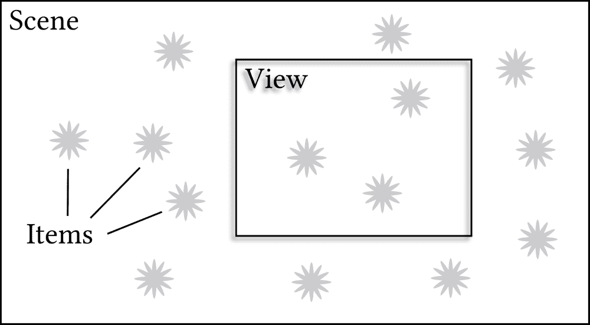

之后，你可以从代码中操作项目并添加新项目，同时用户也有能力与可见项目进行交互。

将**项目**视为便利贴。你可以拿一张便利贴并写上一条信息，画上一个图像，或者两者兼而有之，或者，很可能是直接留白。Qt 提供了大量的项目类，所有这些类都继承自`QGraphicsItem`。你也可以创建自己的项目类。每个类都必须提供一个`paint()`函数的实现，该函数负责绘制当前项目，以及一个`boundingRect()`函数的实现，该函数必须返回`paint()`函数绘制的区域的边界。

那么，**场景**是什么呢？好吧，把它想象成一张更大的纸，你可以在上面贴上你的小便利贴，也就是笔记。在场景上，你可以自由地移动项目，并对它们应用有趣的变换。正确显示项目的位置和对其应用的任何变换是场景的责任。场景还会通知项目任何影响它们的事件。

最后，但同样重要的是，让我们把注意力转向 **视图**。将视图想象成一个检查窗口或一个人，他手里拿着带有笔记的纸张。你可以看到整个纸张，或者你只能看到特定的部分。此外，正如一个人可以用手旋转和剪切纸张一样，视图也可以旋转和剪切场景的内容，并对其进行更多变换。`QGraphicsView` 是一个小部件，因此你可以像使用任何其他小部件一样使用视图，并将其放入布局中，以创建整洁的图形用户界面。

你可能已经看过前面的图表，并担心所有项目都在视图之外。它们不是在浪费 CPU 时间吗？你不需要通过添加所谓的 *视图视锥剔除* 机制（检测哪些项目不需要绘制/渲染因为它不可见）来照顾它们吗？嗯，简短的答案是“不”，因为 Qt 已经在处理这个问题了。

# 实践时间 - 使用图形视图创建项目

让我们把所有这些组件组合在一个简约的项目中。从欢迎屏幕，点击新建项目按钮，再次选择 Qt Widgets 应用程序。将项目命名为 `graphics_view_demo`，选择正确的工具包，取消选择“生成表单”复选框，完成向导。实际上我们不需要为我们生成的 `MainWindow` 类，所以让我们从项目中删除它。在项目树中定位 `mainwindow.h`，并在上下文菜单中选择“移除文件”。启用“永久删除文件”复选框，然后点击确定。这将导致从磁盘删除 `mainwindow.h` 文件，并从 `graphics_view_demo.pro` 文件中删除其名称。如果文件在 Qt Creator 中打开，它将建议你关闭它。为 `mainwindow.cpp` 重复此过程。

打开 `main.cpp` 文件，删除 `#include "mainwindow.h"`，并编写以下代码：

```cpp
int main(int argc, char *argv[])
{
    QApplication a(argc, argv);
    QGraphicsScene scene;
    QGraphicsRectItem *rectItem = 
        new QGraphicsRectItem(QRectF(0, 0, 100, 50));
    scene.addItem(rectItem);
    QGraphicsEllipseItem *circleItem =
        new QGraphicsEllipseItem(QRect(0, 50, 25, 25));
    scene.addItem(circleItem);
    QGraphicsSimpleTextItem *textItem =
        new QGraphicsSimpleTextItem(QObject::tr("Demo"));
    scene.addItem(textItem);
    QGraphicsView view(&scene);
    view.show();
    return a.exec();
}
```

当你运行项目时，你应该得到以下结果：

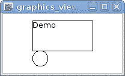

# 发生了什么？

我们的新项目非常简单，所有代码都位于 `main()` 函数中。让我们检查一下代码。首先，我们创建一个 `QApplication` 对象，就像在任何 Qt Widgets 项目中一样。接下来，我们创建一个场景对象和三个不同项目类的实例。每个项目类的构造函数接受一个参数，用于定义项目的内容：

+   `QGraphicsRectItem` 构造函数接收一个 `QRectF` 对象，其中包含矩形的坐标

+   与此类似，`QGraphicsEllipseItem` 构造函数接收一个 `QRectF` 对象，该对象定义了圆的边界矩形

+   `QGraphicsSimpleTextItem` 构造函数接收要显示的文本

`QRectF`基本上是一个包含四个字段的实用结构，允许我们指定矩形的边界坐标（左、上、宽和高）。Qt 还提供了`QPointF`，它包含点的*x*和*y*坐标，`QLineF`包含线的两个端点的*x*和*y*坐标，以及`QPolygonF`，它包含点的向量。`F`字母代表“浮点”并表明这些类包含实数。它们在图形视图中被广泛使用，因为它始终使用浮点坐标。没有`F`的对应类（如`QPoint`、`QRect`等）存储整数坐标，并且在处理小部件时更有用。

创建每个项目后，我们使用`QGraphicsScene::addItem`函数将项目添加到场景中。最后，我们创建一个`QGraphicsView`对象，并将场景的指针传递给其构造函数。`show()`方法将使视图可见，就像对任何`QWidget`一样。程序以`a.exec()`调用结束，这是必要的，以启动事件循环并保持应用程序运行。

场景会接管项目，因此它们将随着场景的删除而自动删除。这也意味着一个项目只能添加到一个场景中。如果项目之前被添加到另一个场景中，它将在添加到新场景之前从那里移除。

如果你想要从场景中移除一个项目，而不直接将其设置到另一个场景或删除它，你可以调用`scene.removeItem(rectItem)`。然而，请注意，现在你有责任删除`rectItem`以释放分配的内存！

检查生成的窗口并将其与代码中矩形的坐标进行比较（我们使用的`QRectF`构造函数接受以下顺序的四个参数：左、上、宽、高）。你应该能够看到所有三个元素都位于一个坐标系统中，其中*x*轴指向右，*y*轴指向下。我们没有为文本项目指定任何坐标，因此它显示在**原点**（即坐标为零的点）旁边，位于矩形的左上角。然而，这个（0，0）点并不对应于窗口的左上角。实际上，如果你调整窗口大小，你会注意到原点相对于窗口发生了偏移，因为视图试图将场景内容居中显示。

# 坐标系统

正确使用图形视图，你需要了解这个框架中坐标系统的工作原理。我们将遍历所有层次，看看我们如何在每个层次上改变项目位置和整个场景的位置。我们将提供你可以粘贴到我们的演示项目中的代码示例，并检查其效果。

# 项目的坐标系

每个项目都有自己的坐标系。在我们的便签示例中，每张便签的内容是相对于便签的左上角定义的。无论你如何移动或旋转项目，这些坐标都保持不变。绘制对象的坐标通常可以传递给类的构造函数，就像我们在我们的演示项目中做的那样，或者传递给一个特殊的设置函数（例如，`rectItem->setRect(0, 10, 20, 25)`）。这些是在项目坐标系中的坐标。

一些类，例如 `QGraphicsSimpleTextItem`，不提供更改内容坐标的能力，因此它们始终位于项目坐标系的起点。这根本不是问题；正如我们接下来将要看到的，有方法可以更改内容的可见位置。

如果你尝试创建自己的图形项目类（我们将在本章后面讨论这个问题），你需要实现 `paint()` 和 `boundingRect()` 函数，并且它们总是在项目的坐标系中操作。没错，当你绘制内容时，你只需假装你的项目永远不会移动或变换。当这实际上发生时，Qt 会为你处理绘制操作的变换。此外，项目接收到的任何事件中的坐标（例如，鼠标按钮点击的坐标）都是以项目的坐标系表示的。

# 场景的坐标系

任何项目都可以使用 `setPos()` 函数在场景中移动。尝试调用 `textItem->setPos(50, 50)` 并验证文本是否在场景中移动。技术上，这个操作改变了项目坐标系和场景坐标系之间的**变换**。一个名为 `moveBy()` 的便利函数允许你通过指定的量移动位置。

项目也可以使用 `setRotation()` 旋转，并使用 `setScale()` 缩放。尝试调用 `textItem->setRotation(20)` 来查看这个动作。如果你需要更高级的变换，例如剪切，或者你想要以特定的顺序执行多个平移，你可以创建一个 `QTransform` 对象，应用所需的变换，并使用项目的 `setTransform()` 函数。

`setRotation()` 函数接受 `qreal` 作为参数值，这通常是对 `double` 的 typedef。该函数将数字解释为围绕 *z* 坐标的顺时针旋转的度数。如果你设置一个负值，则执行逆时针旋转。即使这没有太多意义，你也可以通过 450 度旋转一个项目，这将导致 90 度的旋转。

# 视口坐标系统

视图由 **视口** 和两个滚动条组成。视口是一个子小部件，实际上包含场景的内容。视图根据多个参数执行从场景坐标到视口坐标的转换。

首先，视图需要知道场景中我们想要看到的每一项的边界矩形。它被称为**场景矩形**，在场景坐标系中进行测量。默认情况下，场景矩形是自创建以来添加到场景的所有项的边界矩形。这通常没问题，但如果移动或删除一个项，该边界矩形不会缩小（由于性能原因），这可能会导致显示大量不想要的空白空间。幸运的是，在这种情况下，你可以使用场景或视图的`setSceneRect`函数手动设置场景矩形。

`QGraphicsScene::setSceneRect`和`QGraphicsView::setSceneRect`之间的区别通常很小，因为你通常每个场景只有一个视图。然而，对于单个场景，可能存在多个视图。在这种情况下，`QGraphicsScene::setSceneRect`为所有视图设置场景矩形，而`QGraphicsView::setSceneRect`允许你为每个视图覆盖场景矩形。

如果对应场景矩形的区域足够小，可以适应视口，视图将根据视图的`alignment`属性对内容进行对齐。如我们之前所见，默认情况下它将内容置于中心。例如，调用`view.setAlignment(Qt::AlignTop | Qt::AlignLeft)`将导致场景保持在视图的左上角。

如果场景矩形区域太大，无法适应视口，则默认会显示水平或垂直滚动条。可以使用它们来滚动视图并查看场景矩形内的任何点（但不超过它）。滚动条的存在也可以通过视图的`horizontalScrollBarPolicy`和`verticalScrollBarPolicy`属性进行配置。

尝试调用`scene.setSceneRect(0, 20, 100, 100)`并查看在调整窗口大小时视图的行为。如果窗口太小，场景的顶部将不再可见。如果窗口足够大且视图具有默认对齐方式，场景的顶部将可见，但只有定义的场景矩形将居中，不考虑其外的项。

视图提供了转换整个场景的能力。例如，你可以调用`view.scale(5, 5)`使一切放大五倍，`view.rotate(20)`整体旋转场景，或`view.shear(1, 0)`进行剪切。与项目一样，你可以使用`setTransform()`方法应用更复杂的转换。

你可能会注意到，图形视图（以及 Qt 小部件通常）默认使用**左手坐标系**，其中*x*轴指向右，*y*轴指向下。然而，OpenGL 和科学相关应用程序通常使用**右手**或标准坐标系，其中*y*轴向上。如果你需要改变*y*轴的方向，最简单的解决方案是通过调用`view.scale(1, -1)`来变换视图。

# 变换的原点

在我们的下一个示例中，我们将在(0, 0)点创建一个十字形，并将一个矩形添加到场景中：

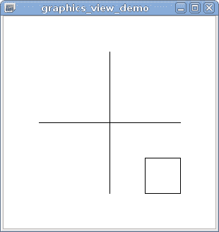

你可以用以下代码做到这一点：

```cpp
scene.addLine(-100, 0, 100, 0);
scene.addLine(0, -100, 0, 100);
QGraphicsRectItem* rectItem = scene.addRect(50, 50, 50, 50);
```

在这段代码中，我们使用了`addLine()`和`addRect()`便利函数。这相当于手动创建一个`QGraphicsLineItem`或`QGraphicsRectItem`并将其添加到场景中。

现在，假设你想要将矩形旋转 45 度以产生以下结果：

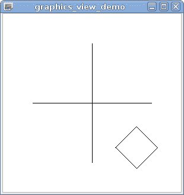

直接尝试这样做将使用`setRotation()`方法：

```cpp
QGraphicsRectItem* rectItem = scene.addRect(50, 50, 50, 50);
rectItem->setRotation(45);
```

然而，如果你尝试这样做，你将得到以下结果：

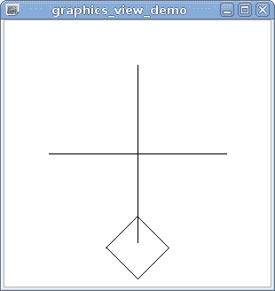

# 刚才发生了什么？

大多数变换都依赖于坐标系的**原点**。对于旋转和缩放，原点是唯一保持不变的点。在上面的例子中，我们使用了一个左上角在(50, 50)且大小为(50, 50)的矩形。这些坐标是在项目的坐标系中。由于我们最初没有移动项目，项目的坐标系与场景的坐标系相同，原点也与场景的原点相同（它是以十字标记的点）。应用的旋转使用(0, 0)作为旋转中心，因此产生了意想不到的结果。

有多种方法可以克服这个问题。第一种方法是改变变换的原点：

```cpp
QGraphicsRectItem* rectItem = scene.addRect(50, 50, 50, 50);
rectItem->setTransformOriginPoint(75, 75);
rectItem->setRotation(45);
```

这段代码产生了我们想要的旋转，因为它改变了`setRotation()`和`setScale()`函数使用的原点。注意，项目的坐标系没有被平移，并且(75, 75)点在项目的坐标系中仍然是矩形的中心。

然而，这个解决方案有其局限性。如果你使用`setTransform()`而不是`setRotation()`，你将再次得到不想要的结果：

```cpp
QGraphicsRectItem* rectItem = scene.addRect(50, 50, 50, 50);
rectItem->setTransformOriginPoint(75, 75);
QTransform transform;
transform.rotate(45);
rectItem->setTransform(transform);
```

另一种解决方案是将矩形设置得使其中心位于项目坐标系的原点：

```cpp
QGraphicsRectItem* rectItem = scene.addRect(-25, -25, 50, 50);
rectItem->setPos(75, 75);
```

这段代码使用完全不同的矩形坐标，但结果与我们的第一个例子完全相同。然而，现在，场景坐标中的(75, 75)点对应于项目坐标中的(0, 0)点，因此所有变换都将使用它作为原点：

```cpp
QGraphicsRectItem* rectItem = scene.addRect(-25, -25, 50, 50);
rectItem->setPos(75, 75);
rectItem->setRotation(45);
```

这个例子表明，通常更方便将项目设置得使其原点对应于其实际位置。

# 尝试一下英雄——应用多个变换

要理解变换及其原点的概念，尝试对一个项目应用`rotate()`和`scale()`。然后，改变原点并看看项目将如何反应。作为第二步，使用`QTransform`与`setTransform()`结合，以特定顺序对一个项目应用多个变换。

# 项目之间的父子关系

假设您需要创建一个包含多个几何原型的图形项，例如，矩形内部的圆。您可以单独创建这两个项目并将它们添加到场景中，但这种方法不方便。首先，当您需要从场景中删除该组合时，您需要手动删除这两个项目。然而，更重要的是，当您需要移动或变换该组合时，您将需要为每个图形项计算位置和复杂的变换。

幸运的是，图形项不必是直接添加到场景中的扁平项目列表。项目可以被添加到任何其他项目中，形成一个类似于我们在上一章中观察到的 `QObject` 关系的父子关系：

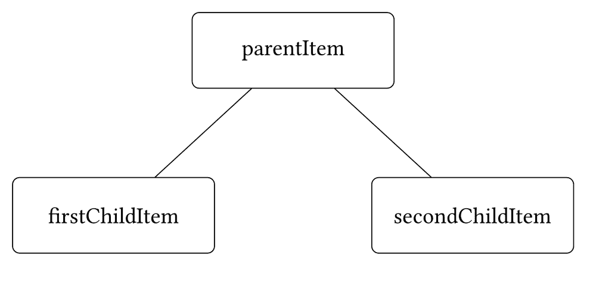

将一个项目作为另一个项目的子项具有以下后果：

+   当父项被添加到场景中时，子项自动成为该场景的一部分，因此不需要为它调用 `QGraphicsScene::addItem()`。

+   当父项被删除时，其子项也会被删除。

+   当使用 `hide()` 或 `setVisible(false)` 函数隐藏父项时，子项也会被隐藏。

+   最重要的是，子项的坐标系是从父项的坐标系派生出来的，而不是从场景的坐标系。这意味着当父项被移动或变换时，所有子项也会受到影响。子项的位置和变换相对于父项的坐标系。

您可以使用 `parentItem()` 函数始终检查一个项目是否有父项，并通过比较返回的 `QGraphicsItem` 指针与 `nullptr` 来检查，这意味着该项目没有父项。要确定是否有任何子项，请在项目上调用 `childItems()` 函数。该方法返回一个包含所有子项 `QGraphicsItem` 指针的 `QList`。

为了更好地理解`pos()`及其涉及的坐标系，再次想想便利贴。如果你在一张更大的纸上贴上一张便利贴，然后需要确定它的确切位置，你会怎么做？可能像这样：“便利贴的左上角位于纸张左上角的右边 3 厘米和下面 5 厘米处”。在图形视图世界中，这将对应该没有父项的项，其`pos()`函数返回场景坐标中的位置，因为项的原点直接固定到场景中。另一方面，假设你在已经贴在纸上的（更大的）便利贴 B 的上面贴上便利贴 A，你需要确定 A 的位置；这次你会怎么描述它？可能通过说便利贴 A 放在便利贴 B 的上面，或者“从便利贴 B 的左上角右边 2 厘米和下面 1 厘米处”。你很可能不会使用底下的纸张作为参考，因为它不是下一个参考点。这是因为如果你移动便利贴 B，A 相对于纸张的位置会改变，而 A 相对于 B 的相对位置仍然保持不变。要切换回图形视图，等效的情况是一个具有父项的项。在这种情况下，`pos()`函数返回的值是在其父项的坐标系中表达的。因此，`setPos()`和`pos()`指定了项的原点相对于下一个（更高）参考点的位置。这可以是场景或项的父项。所以，`setPos()`和`pos()`指定了项的原点相对于下一个（更高）参考点的位置。这可以是场景或项的父项。

然而，请注意，改变项的位置不会影响项的内部坐标系。

对于小部件，子项始终占据其直接父项的子区域。对于图形项，默认情况下不适用这样的规则。子项可以显示在父项的边界矩形或可见内容之外。实际上，一个常见的情况是父项本身没有视觉内容，而只作为属于一个对象的一组原语集合的容器。

# 行动时间 – 使用子项

让我们尝试创建一个包含多个子项的项。我们想要创建一个矩形，每个角落都有一个填充的圆，并且能够作为一个整体移动和旋转，如下所示：

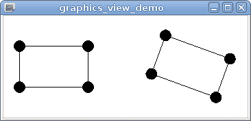

首先，你需要创建一个函数，通过以下代码创建一个单个复杂矩形：

```cpp
QGraphicsRectItem *createComplexItem(
    qreal width, qreal height, qreal radius) 
{
    QRectF rect(-width / 2, -height / 2, width, height);
    QGraphicsRectItem *parent = new QGraphicsRectItem(rect);
    QRectF circleBoundary(-radius, -radius, 2 * radius, 2 * radius);
    for(int i = 0; i < 4; i++) {
        QGraphicsEllipseItem *child =
            new QGraphicsEllipseItem(circleBoundary, parent);
        child->setBrush(Qt::black);
        QPointF pos;
        switch(i) {
        case 0:
            pos = rect.topLeft();
            break;
        case 1:
            pos = rect.bottomLeft();
            break;
        case 2:
            pos = rect.topRight();
            break;
        case 3:
            pos = rect.bottomRight();
            break;
        }
        child->setPos(pos);
    }
    return parent;
}
```

我们首先创建一个包含矩形坐标的`QRectF`变量，这些坐标位于项目的坐标系中。按照我们之前提供的提示，我们创建一个以原点为中心的矩形。接下来，我们创建一个通常称为`parent`的矩形图形项。将`circleBoundary`矩形设置为包含单个圆的边界矩形（再次强调，中心位于原点）。当我们为每个角落创建一个新的`QGraphicsEllipseItem`时，我们将`parent`传递给构造函数，因此新的圆形项自动成为矩形项的子项。

要设置子圆，我们首先使用 `setBrush()` 函数，该函数允许填充圆。此函数期望一个 `QBrush` 对象，允许你指定高级填充样式，但在我们的简单情况下，我们使用从 `Qt::GlobalColor` 枚举到 `QBrush` 的隐式转换。你将在本章的后面部分了解更多关于画笔的信息。

接下来，我们为每个圆选择矩形的不同角落，并调用 `setPos()` 将圆移动到该角落。最后，我们将父项目返回给调用者。

你可以使用此函数如下：

```cpp
QGraphicsRectItem *item1 = createComplexItem(100, 60, 8);
scene.addItem(item1);

QGraphicsRectItem *item2 = createComplexItem(100, 60, 8);
scene.addItem(item2);
item2->setPos(200, 0);
item2->setRotation(20);
```

注意，当你调用 `setPos()` 时，圆会随着父项目一起移动，但圆的 `pos()` 值不会改变。这是由于 `pos()` 表示相对于父项目（或如果没有父项目，则为场景的起点）的位置的事实。当矩形旋转时，圆会随着它一起旋转，就像它们被固定在角落一样。如果圆不是矩形的子项，在这个情况下，正确定位它们将是一个更具挑战性的任务。

# 英雄尝试一下 - 将自定义矩形作为类实现

在这个例子中，我们为了避免创建自定义矩形的类，使代码尽可能简单。遵循面向对象编程的原则，在新的类的构造函数中子类化 `QGraphicsRectItem` 并创建子项目是一个好主意。这样做不需要你不知道的任何东西。例如，当子类化 `QGraphicsRectItem` 时，你不需要实现任何虚拟函数，因为它们都在基类中得到了适当的实现。

# 坐标系之间的转换

如果一个项目仅使用 `setPos()` 移动，则从项目坐标到场景坐标的转换就像 `sceneCoord = itemCoord + item->pos()` 那样简单。然而，当你使用变换和父子关系时，这种转换很快就会变得非常复杂，因此你应该始终使用专用函数来执行此类转换。`QGraphicsItem` 提供以下函数：

| **函数** | **描述** |
| --- | --- |

|  `mapToScene(`

`  const QPointF &point)` | 将项目坐标系中的点 `point` 映射到场景坐标系中的对应点。|

| `scenePos()` | 将项目的原点映射到场景坐标系。这与 `mapToScene(0, 0)` 相同。 |
| --- | --- |
| `sceneBoundingRect()` | 返回项目在场景坐标系中的边界矩形。 |
| `mapFromScene(` `  const QPointF &point)` | 将场景坐标系中的点 `point` 映射到项目坐标系中的对应点。此函数是 `mapToScene()` 的逆函数。 |
| `mapFromParent(` `  const QPointF &point)` 将位于项目坐标系统中的点 `point` 映射到项目父级坐标系统中的对应点。如果项目没有父级，此函数的行为类似于 `mapToScene()`；因此，它返回场景坐标系统中的对应点。 |
| `mapFromParent(` `  const QPointF &point)` 将位于项目父级坐标系统中的点 `point` 映射到项目自身坐标系统中的对应点。此函数是 `mapToParent()` 的逆函数。 |

| `mapToItem(` `  const QGraphicsItem *item,`

` const QPointF &point)` 将位于项目自身坐标系统中的点 `point` 映射到项目 `item` 的坐标系统中的对应点。|

| `mapFromItem(` `  const QGraphicsItem *item,`

` const QPointF  &point)` 将位于项目 `item` 坐标系统中的点 `point` 映射到项目自身坐标系统中的对应点。此函数是 `mapToItem()` 的逆函数。

这些函数的伟大之处在于，它们不仅适用于 `QPointF`。相同的函数也适用于 `QRectF`、`QPolygonF` 和 `QPainterPath`，更不用说还有一些便利函数：

+   如果您使用两个 `qreal` 类型的数字调用这些函数，这些数字被解释为 `QPointF` 指针的 *x* 和 *y* 坐标

+   如果您使用四个数字调用这些函数，这些数字被解释为 *x* 和 *y* 坐标以及 `QRectF` 参数的宽度和高度

`QGraphicsView` 类还包含一组 `mapToScene()` 函数，这些函数将视口坐标系统的坐标映射到场景坐标，以及 `mapFromScene()` 函数，这些函数将场景坐标映射到视口坐标。

# 功能概述

您现在应该对 Graphics View 的架构和转换机制有所了解。我们将现在描述一些易于使用的功能，这些功能在创建 Graphics View 应用程序时您可能会用到。

# 标准项目

为了有效地使用框架，您需要了解它提供的图形项目类。识别您可以使用来构建所需图片的类很重要，只有在没有合适的项目或您需要更好的性能时，才应创建自定义项目类。Qt 提供以下标准项目，使您作为开发者的生活更加轻松：

| **标准项目** | **描述** |
| --- | --- |
| `QGraphicsLineItem` 绘制一条线。您可以使用 `setLine(const QLineF&)` 定义线。 |
| `QGraphicsRectItem` 绘制一个矩形。您可以使用 `setRect(const QRectF&)` 定义矩形的几何形状。 |
| `QGraphicsEllipseItem` | 绘制椭圆或椭圆段。您可以使用 `setRect(const QRectF&)` 定义绘制椭圆的矩形。此外，您还可以通过调用 `setStartAngle(int)` 和 `setSpanAngle(int)` 定义是否只绘制椭圆的某一段。这两个函数的参数是以十六分之一度为单位。 |
| `QGraphicsPolygonItem` | 绘制多边形。您可以使用 `setPolygon(const QPolygonF&)` 定义多边形。 |
| `QGraphicsPathItem` | 绘制路径，即一组各种几何原语。您可以使用 `setPath(const QPainterPath&)` 定义路径。 |
| `QGraphicsSimpleTextItem` | 绘制纯文本。您可以使用 `setText(const QString&)` 定义文本，并使用 `setFont(const QFont&)` 定义字体。此项目不支持富格式化。 |
| `QGraphicsTextItem` | 绘制格式化文本。与 `QGraphicsSimpleTextItem` 不同，此项目可以显示存储在 `QTextDocument` 对象中的 HTML。您可以使用 `setHtml(const QString&)` 设置 HTML，并使用 `setDocument(QTextDocument*)` 设置文档。`QGraphicsTextItem` 甚至可以与显示的文本交互，以便进行文本编辑或打开 URL。 |
| `QGraphicsPixmapItem` | 绘制位图（一个光栅图像）。您可以使用 `setPixmap(const QPixmap&)` 定义位图。可以从本地文件或资源加载位图，类似于图标（有关资源的信息，请参阅第三章，*Qt GUI 编程*）。 |
| `QGraphicsProxyWidget` | 绘制任意 `QWidget` 并允许您与之交互。您可以使用 `setWidget(QWidget*)` 设置小部件。 |

正如我们已经看到的，您通常可以将项目的内 容传递给构造函数，而不是调用 `setRect()` 等设置器方法。然而，请记住，紧凑的代码可能比通过设置器方法设置所有变量的代码更难维护。|

对于大多数项目，您还可以定义应使用哪种笔和哪种画刷。笔通过 `setPen()` 设置，画刷通过 `setBrush()` 设置（我们已经在之前的示例中使用了它）。然而，这两个函数在 `QGraphicsTextItem` 中不存在。要定义 `QGraphicsTextItem` 项目的外观，您必须使用 `setDefaultTextColor()` 或 Qt 支持的 HTML 标签。`QGraphicsPixmapItem` 没有类似的方法，因为笔和画刷的概念不能应用于位图。|

尽可能使用 `QGraphicsSimpleTextItem`，并尽量避免使用 `QGraphicsTextItem`，除非绝对必要。原因是 `QGraphicsTextItem` 是 `QObject` 的子类，并使用 `QTextDocument`，这基本上是一个 HTML 引擎（尽管相当有限）。这比平均图形项目要重得多，并且对于显示简单文本来说，绝对是一个过大的开销。|

通常使用标准项比从头开始实现它们更容易。每次你将使用 Graphics View 时，都要问自己这些问题：哪些标准项适合我的特定需求？我是不是一次又一次地重复造轮子？然而，有时你需要创建自定义图形项，我们将在本章的后面部分介绍这个主题。

# 抗锯齿

如果你看一下上一张截图的结果，你可能会注意到绘图看起来是像素化的。这是因为线条中的每个像素都是完全黑色的，而所有周围的像素都是完全白色的。物理显示器的分辨率有限，但称为 **抗锯齿** 的技术允许你以相同的分辨率产生更平滑的图像。当使用抗锯齿绘制线条时，一些像素会比其他像素更黑或更白，这取决于线条如何穿过像素网格。

你可以使用以下代码轻松地在 Graphics View 中启用抗锯齿：

```cpp
view.setRenderHint(QPainter::Antialiasing);
```

当开启抗锯齿标志时，绘制过程会更加平滑：

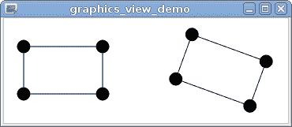

然而，左侧矩形中的线条现在看起来更粗。这是因为我们使用了具有整数坐标和 1 像素宽度的线条。这样的线条正好位于像素行之间的边界上，当进行抗锯齿处理时，相邻的像素行将部分被绘制。这可以通过将所有坐标加 0.5 来修复。

```cpp
QRectF rect(-width / 2, -height / 2, width, height);
rect.translate(0.5, 0.5);
QGraphicsRectItem *parent = new QGraphicsRectItem(rect);
```

现在线条位于像素行的正中间，因此它只占用单行：

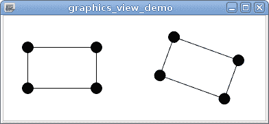

另一种解决方案是在实现自定义项类时禁用绘制水平或垂直线时的抗锯齿。

`QGraphicsView` 也支持 `QPainter::TextAntialiasing` 标志，该标志在绘制文本时启用抗锯齿，以及 `QPainter::SmoothPixmapTransform` 标志，该标志启用平滑位图变换。注意抗锯齿和平滑对应用程序性能的影响，因此仅在需要时使用它们。

# 笔刷和画笔

笔和画刷是两个属性，它们定义了不同的绘图操作如何执行。笔（由 `QPen` 类表示）定义轮廓，而画刷（由 `QBrush` 类表示）填充绘制的形状。每个都是一组参数。最简单的一个是定义的颜色，可以是预定义的全局颜色枚举值（例如 `Qt::red` 或 `Qt::transparent`），或者 `QColor` 类的实例。有效颜色由四个属性组成：三个颜色分量（红色、绿色和蓝色）以及一个可选的 alpha 通道值，它决定了颜色的透明度（值越大，颜色越不透明）。默认情况下，所有分量都表示为 8 位值（0 到 255），但也可以表示为表示分量最大饱和度百分比的实数值；例如，0.6 对应于 153（0.6⋅255）。为了方便，`QColor` 构造函数之一接受在 HTML 中使用的十六进制颜色代码（例如，`#0000FF` 是不透明的蓝色），甚至可以接受来自静态函数 `QColor::colorNames()` 返回的预定义颜色列表中的裸颜色名称（例如，`blue`）。一旦使用 RGB 分量定义了颜色对象，就可以使用不同的颜色空间（例如，CMYK 或 HSV）查询它。此外，还有一系列静态方法，它们作为在不同颜色空间中表示的颜色构造函数。

例如，要构建一个清晰的洋红色，可以使用以下任何一种表达式：

+   `QColor("magenta")`

+   `QColor("#FF00FF")`

+   `QColor(255, 0, 255)`

+   `QColor::fromRgbF(1, 0, 1)`

+   `QColor::fromHsv(300, 255, 255)`

+   `QColor::fromCmyk(0, 255, 0, 0)`

+   `Qt::magenta`

除了颜色之外，`QBrush` 还有两种表示形状填充的方法。您可以使用 `QBrush::setTexture()` 设置一个用作戳记的位图，或者使用 `QBrush::setGradient()` 使画刷使用渐变进行填充。例如，要使用一个从形状的左上角开始为黄色，在形状中间变为红色，并在形状的右下角结束为洋红色的对角渐变，可以使用以下代码：

```cpp
QLinearGradient gradient(0, 0, width, height);
gradient.setColorAt(0,   Qt::yellow);
gradient.setColorAt(0.5, Qt::red);
gradient.setColorAt(1.0, Qt::magenta);
QBrush brush = gradient; 
```

当与绘制矩形一起使用时，此代码将产生以下输出：


Qt 可以处理线性 (`QLinearGradient`)、径向 (`QRadialGradient`) 和锥形 (`QConicalGradient`) 渐变。Qt 提供了一个渐变示例（如下截图所示），您可以在其中看到不同的渐变效果：

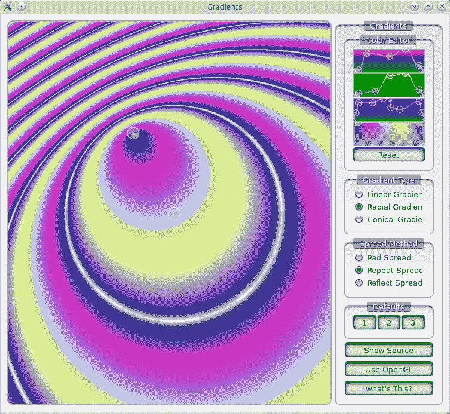

至于画笔，其主要属性是其宽度（以像素为单位），它决定了形状轮廓的厚度。画笔当然可以设置颜色，但除此之外，您还可以使用任何画刷作为画笔。这种操作的结果是，您可以使用渐变或纹理绘制形状的粗轮廓。

对于笔来说，有三个更重要的属性。第一个是笔的样式，通过`QPen::setStyle()`设置。它决定了笔绘制的线条是连续的还是以某种方式分割的（如虚线、点等）。您可以在以下位置查看可用的线条样式：

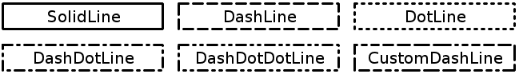

第二个属性是帽子的样式，可以是平的、方的或圆的。第三个属性——连接样式——对于多段线轮廓很重要，它决定了多段线的不同部分是如何连接的。您可以使连接尖锐（使用`Qt::MiterJoin`或`Qt::SvgMiterJoin`），圆形（`Qt::RoundJoin`），或者两者的混合（`Qt::BevelJoin`）。您可以通过启动以下截图所示的路径描边示例来查看不同的笔属性配置（包括不同的连接和帽样式）：

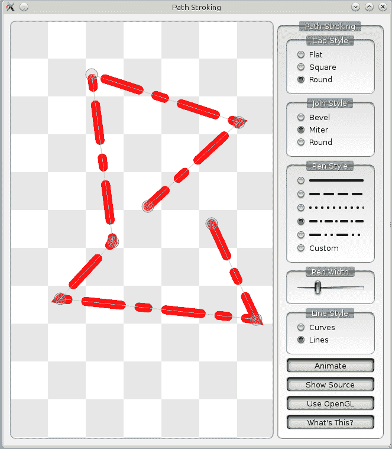

# 项目选择

场景支持选择项目的功能，类似于在文件管理器中选择文件的方式。为了可被选择，项目必须将`QGraphicsItem::ItemIsSelectable`标志打开。尝试将`parent->setFlag(QGraphicsItem::ItemIsSelectable, true)`添加到我们之前创建的`createComplexItem()`函数中。现在，如果您运行应用程序并点击一个矩形，它将被选中，这由虚线表示：


您可以使用*Ctrl*按钮一次性选择多个项目。或者，您可以调用`view.setDragMode(QGraphicsView::RubberBandDrag)`来激活视图的橡皮筋选择。

图形视图的另一个有用的拖动模式是`ScrollHandDrag`。它允许您通过用左鼠标按钮拖动场景来滚动视图，而不需要使用滚动条。

除了这些，还有不同的方式可以通过编程选择项目。有`QGraphicsItem::setSelected()`函数，它接受一个`bool`值来切换选择状态的开或关，或者您可以在场景上调用`QGraphicsScene::setSelectionArea()`，它接受一个`QPainterPath`参数作为参数，在这种情况下，区域内的所有项目都将被选中。

使用场景的`QGraphicsScene::selectedItems()`函数，您可以查询实际选中的项目。该函数返回一个包含指向选中项目的`QGraphicsItem`指针的`QList`。例如，在列表上调用`QList::count()`将给出选中项目的数量。要清除选择，请调用`QGraphicsScene::clearSelection()`。要查询项目的选择状态，请使用`QGraphicsItem::isSelected()`，如果项目被选中则返回`true`，否则返回`false`。

`GraphicsItem`的另一个有趣的标志是`ItemIsMovable`。它允许您通过用左鼠标按钮抓住项目在场景内拖动它，从而有效地改变项目的`pos()`。尝试将`parent->setFlag(QGraphicsItem::ItemIsMovable, true)`添加到我们的`createComplexItem`函数中，并拖动矩形。

# 图形场景中的键盘焦点

该场景实现了类似于小部件中键盘焦点的工作原理的焦点概念。一次只能有一个项目拥有焦点。当场景接收到键盘事件时，它会被分发到拥有焦点的项目。

要使项目可聚焦，项目必须启用`QGraphicsItem::ItemIsFocusable`标志：

```cpp
item1->setFlag(QGraphicsItem::ItemIsFocusable, true);
item2->setFlag(QGraphicsItem::ItemIsFocusable, true);
```

然后，可以通过鼠标点击来聚焦一个项目。你也可以从代码中更改聚焦的项目：

```cpp
item1->setFocus();
```

另一种设置焦点的方法是使用场景的`QGraphicsScene::setFocusItem()`函数，该函数期望一个指向你想要聚焦的项目指针作为参数。每次一个项目获得焦点时，之前聚焦的项目（如果有的话）将自动失去焦点。

要确定一个项目是否有焦点，你又有两种可能性。一种是在项目上调用`QGraphicsItem::hasFocus()`，如果项目有焦点则返回`true`，否则返回`false`。或者，你可以通过调用场景的`QGraphicsScene::focusItem()`方法来获取实际聚焦的项目。另一方面，如果你调用项目的`QGraphicsItem::focusItem()`函数，如果项目本身或任何子项目有焦点，则返回聚焦的项目；否则，返回`nullptr`。要移除焦点，请在聚焦的项目上调用`clearFocus()`或在场景的背景或无法聚焦的项目上点击。

如果你希望点击场景的背景不会导致聚焦的项目失去焦点，将场景的`stickyFocus`属性设置为`true`。

# 绘画路径

如果你想要创建一个由多个几何原语组成的图形项目，创建多个`QGraphicsItem`对象似乎很繁琐。幸运的是，Qt 提供了一个`QGraphicsPathItem`类，它允许你在`QPainterPath`对象中指定多个原语。`QPainterPath`允许你“记录”多个绘图指令（包括填充、轮廓和裁剪），然后高效地多次重用它们。

# 动手时间 - 将路径项目添加到场景中

让我们绘制一些由大量线条组成的对象：

```cpp
static const int SIZE = 100;
static const int MARGIN = 10;
static const int FIGURE_COUNT = 5;
static const int LINE_COUNT = 500;
for(int figureNum = 0; figureNum < FIGURE_COUNT; ++figureNum) {
    QPainterPath path;
    path.moveTo(0, 0);
    for(int i = 0; i < LINE_COUNT; ++i) {
        path.lineTo(qrand() % SIZE, qrand() % SIZE);
    }
    QGraphicsPathItem *item = scene.addPath(path);
    item->setPos(figureNum * (SIZE + MARGIN), 0);
}
```

对于每个项目，我们首先创建一个`QPainterPath`并设置当前位置为(0, 0)。然后，我们使用`qrand()`函数生成随机数，应用模运算符(`%`)生成一个从 0 到`SIZE`（不包括`SIZE`）的数字，并将它们输入到`lineTo()`函数，该函数从当前位置绘制一条线到指定位置，并将它设置为新的当前位置。接下来，我们使用`addPath()`便利函数创建一个`QGraphicsPathItem`对象并将其添加到场景中。最后，我们使用`setPos()`将每个项目移动到场景中的不同位置。结果看起来像这样：

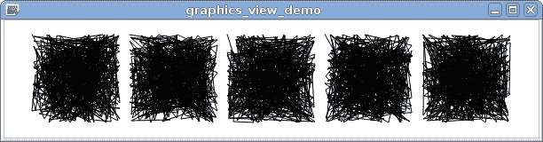`QPainterPath`允许你使用 Qt 支持的几乎所有绘图操作。例如，`QGraphicsPathItem`是唯一能够在场景中绘制贝塞尔曲线的标准项目，因为`QPainterPath`支持它们。有关更多信息，请参阅`QPainterPath`的文档。

在这个例子中使用绘图路径非常高效，因为我们避免了在堆栈上创建成千上万的单个线条对象。然而，将场景的大部分内容放在单个项目中可能会降低性能。当场景的部分是独立的图形项目时，Qt 可以有效地确定哪些项目是不可见的，并跳过它们的绘制。

# 项目的 z-顺序

你是否想过当多个项目在同一场景区域绘制时会发生什么？让我们尝试这样做：

```cpp
QGraphicsEllipseItem *item1 = scene.addEllipse(0, 0, 100, 50);
item1->setBrush(Qt::red);
QGraphicsEllipseItem *item2 = scene.addEllipse(50, 0, 100, 50);
item2->setBrush(Qt::green);
QGraphicsEllipseItem *item3 = scene.addEllipse(0, 25, 100, 50);
item3->setBrush(Qt::blue);
QGraphicsEllipseItem *item4 = scene.addEllipse(50, 25, 100, 50);
item4->setBrush(Qt::gray);
```

默认情况下，项目会按照它们被添加的顺序进行绘制，因此最后一个项目将显示在其他项目的前面：

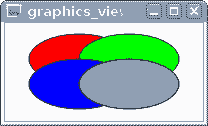

然而，你可以通过调用`setZValue()`函数来更改**z-顺序**：

```cpp
item2->setZValue(1);
```

现在第二个项目显示在其他项目的前面：

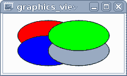

*z*值较高的项目会显示在*z*值较低的项目之上。默认*z*值为 0。负值也是可能的。如果项目具有相同的*z*值，则插入顺序决定位置，并且后来添加的项目会覆盖早期添加的项目。

在开发 2D 游戏时，能够更改项目 z-顺序的能力非常重要。任何场景通常都由多个必须按特定顺序绘制的层组成。你可以根据该项目所属的层为每个项目设置一个*z*值。

项目的父子关系也会影响 z-顺序。子项目会显示在其父项目之上。此外，如果一个项目显示在另一个项目之前，那么前者的子项目也会显示在后者的子项目之前。

# 忽略变换

如果你尝试放大我们的自定义矩形场景（例如，通过调用`view.scale(4, 4)`），你会注意到一切都会按比例缩放，正如你所期望的那样。然而，有些情况下你不想某些元素受到缩放或其他变换的影响。Qt 提供了多种处理方法。

如果你希望线条始终具有相同的宽度，而不管缩放如何，你需要使画笔外观化：

```cpp
QPen pen = parent->pen();
pen.setCosmetic(true);
parent->setPen(pen);
```

现在，矩形将始终具有一像素宽的线条，而不管视图的缩放如何（尽管抗锯齿仍然可能使它们模糊）。也可以使用任何宽度的外观化画笔，但在 Graphics View 中使用它们并不推荐。

你不希望变换应用的其他常见情况是显示文本。旋转和剪切文本通常会使文本难以阅读，所以你通常会希望将其设置为水平且未变换。让我们尝试在我们的项目中添加一些文本并看看我们如何解决这个问题。

# 动手时间 - 向自定义矩形添加文本

让我们在每个角落圆上添加一个数字：

```cpp
child->setPos(pos);
QGraphicsSimpleTextItem *text =
    new QGraphicsSimpleTextItem(QString::number(i), child);
text->setBrush(Qt::green);
text->setPos(-text->boundingRect().width() / 2,
             -text->boundingRect().height() / 2);
```

`QString::number(i)`函数返回数字`i`的字符串表示形式。文本项是圆项的子项，所以它的位置相对于圆的起点（在我们的例子中，是圆心）。正如我们之前看到的，文本显示在项的左上角，所以如果我们想在圆内居中文本，我们需要将其向上和向右移动项大小的一半。现在文本已经定位并与其父圆一起旋转：

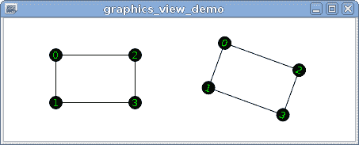

然而，我们不想文本旋转，因此我们需要为文本项启用`ItemIgnoresTransformations`标志：

```cpp
text->setFlag(QGraphicsItem::ItemIgnoresTransformations);
```

此标志使项忽略其父项或视图的任何变换。然而，其坐标系统的原点仍然由父坐标系统中`pos()`的位置定义。因此，文本项仍然会跟随圆，但它将不再缩放或旋转：

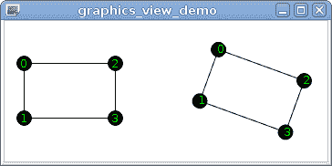

然而，现在我们遇到了另一个问题：文本在圆中不再正确居中。如果你再次缩放视图，这个问题会更加明显。为什么会这样呢？当启用`ItemIgnoresTransformations`标志时，我们的`text->setPos(...)`语句就不再正确了。实际上，`pos()`使用的是父坐标系统中的坐标，但我们使用了`boundingRect()`的结果，它使用的是项的坐标系统。这两个坐标系统之前是相同的，但启用`ItemIgnoresTransformations`标志后，它们现在不同了。

为了详细说明这个问题，让我们看看坐标发生了什么（我们只考虑*x*坐标，因为*y*的行为相同）。假设我们的文本项宽度为八个像素，所以设置的`pos()`的`x = -4`。如果没有应用任何变换，这个`pos()`会导致文本向左移动四个像素。如果禁用`ItemIgnoresTransformations`标志，并且视图缩放为 2，文本相对于圆心的位移是八个像素，但文本本身的大小现在是 16 像素，所以它仍然居中。如果启用`ItemIgnoresTransformations`标志，文本相对于圆心的位移仍然是八个像素（因为`pos()`在父项的坐标系统中操作，而圆被缩放），但项的宽度现在是 8，因为它忽略了缩放，所以不再居中。当视图旋转时，结果会更加不正确，因为`setPos()`会将项移动到取决于旋转方向的位置。由于文本项本身没有旋转，我们总是希望将其向上和向左移动。

如果项目已经围绕其原点居中，这个问题就会消失。不幸的是，`QGraphicsSimpleTextItem` 无法做到这一点。现在，如果它是 `QGraphicsRectItem`，这样做会很简单，但没有任何阻止我们添加一个忽略变换的矩形，然后在其中添加文本！让我们这样做：

```cpp
QGraphicsSimpleTextItem *text =
        new QGraphicsSimpleTextItem(QString::number(i));
QRectF textRect = text->boundingRect();
textRect.translate(-textRect.center());
QGraphicsRectItem *rectItem = new QGraphicsRectItem(textRect, child);
rectItem->setPen(QPen(Qt::green));
rectItem->setFlag(QGraphicsItem::ItemIgnoresTransformations);
text->setParentItem(rectItem);
text->setPos(textRect.topLeft());
text->setBrush(Qt::green);
```

在此代码中，我们首先创建一个文本项，但未设置其父项。然后，我们获取项目的边界矩形，这将告诉我们文本需要多少空间。然后，我们将矩形移动，使其中心位于原点（0, 0）。现在我们可以为这个矩形创建一个矩形项，将其设置为圆的父项，并禁用矩形项的变换。最后，我们将矩形项设置为文本项的父项，并更改文本项的位置，使其位于矩形内。

矩形现在正确地定位在圆的中心，并且文本项始终跟随矩形，就像子项通常做的那样：

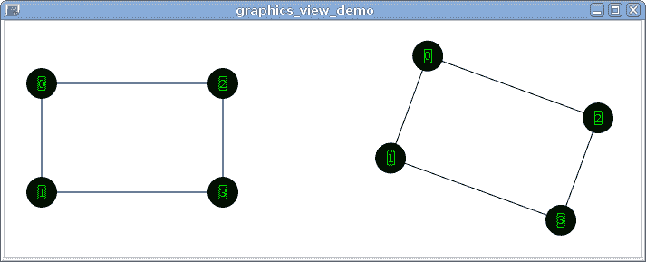

由于我们最初并不想添加矩形，我们可能想隐藏它。在这种情况下，我们不能使用 `rectItem->hide()`，因为这也会隐藏其子项（文本）。解决方案是通过调用 `rectItem->setPen(Qt::NoPen)` 来禁用矩形的绘制。

解决这个问题的另一种方法是翻译文本项的坐标系，而不是使用 `setPos()`。`QGraphicsItem` 没有专门用于平移的函数，因此我们需要使用 `setTransform`：

```cpp
QTransform transform;
transform.translate(-text->boundingRect().width() / 2,
                    -text->boundingRect().height() / 2);
text->setTransform(transform);
```

与你的预期相反，`ItemIgnoresTransformations` 并不会使项目忽略其自身的变换，并且这段代码将正确地定位文本，而无需额外的矩形项。

# 通过位置查找项目

如果你想知道在某个特定位置显示的是哪个项目，你可以使用 `QGraphicsScene::itemAt()` 函数，该函数接受场景坐标系中的位置（一个 `QPointF` 或两个 `qreal` 数字）和可以通过 `QGraphicsView::transform()` 函数获得的设备变换对象 (`QTransform`)。该函数返回指定位置的最顶层项目，如果没有找到项目则返回空指针。设备变换只有在你的场景包含忽略变换的项目时才有意义。如果你没有这样的项目，你可以使用默认构造的 `QTransform` 值：

```cpp
QGraphicsItem *foundItem = scene.itemAt(scenePos, QTransform());
```

如果你的场景包含忽略变换的项目，使用 `QGraphicsView::itemAt()` 函数可能更方便，该函数会自动考虑设备变换。请注意，此函数期望位置在视口坐标系中。

如果您想找到位于某个位置的所有物品，例如在多个物品堆叠在一起的情况下，或者如果您需要在某个区域搜索物品，请使用`QGraphicsScene::items()`函数。它将返回由指定参数定义的物品列表。此函数有几个重载，允许您指定一个点、一个矩形、一个多边形或一个绘图路径。`deviceTransform`参数的作用方式与前面讨论的`QGraphicsScene::itemAt()`函数相同。`mode`参数允许您更改确定区域中物品的方式。下表显示了不同的模式：

| **模式** | **含义** |
| --- | --- |
| `Qt::ContainsItemBoundingRect` | 物品的边界矩形必须完全位于选择区域内。 |
| `Qt::IntersectsItemBoundingRect` | 与`Qt::ContainsItemBoundingRect`类似，但还返回与选择区域相交的物品的边界矩形。 |
| `Qt::ContainsItemShape` | 物品的形状必须完全位于选择区域内。形状可能比边界矩形更精确地描述物品的边界，但此操作的计算量更大。 |
| `Qt::IntersectsItemShape` | 与`Qt::ContainsItemShape`类似，但还返回与选择区域相交的物品的形状。 |

`items()`函数根据物品的堆叠顺序对物品进行排序。`order`参数允许您选择结果返回的顺序。`Qt::DescendingOrder`（默认）将最顶部的物品放在开头，而`Qt::AscendingOrder`将导致顺序相反。

视图还提供了一个类似的`QGraphicsView::items()`函数，该函数在视口坐标中操作。

# 显示场景的特定区域

当场景的边界矩形超过视口大小时，视图将显示滚动条。除了使用鼠标导航到场景中的特定物品或点之外，您还可以通过代码访问它们。由于视图继承了`QAbstractScrollArea`，您可以使用所有其函数来访问滚动条；`horizontalScrollBar()`和`verticalScrollBar()`返回一个指向`QScrollBar`的指针，因此您可以使用`minimum()`和`maximum()`查询它们的范围。通过调用`value()`和`setValue()`，您可以获取并设置当前值，这将导致场景滚动。

然而，通常你不需要从源代码中控制视图内的自由滚动。正常任务是将滚动到特定的项目。为了做到这一点，你不需要自己进行任何计算；视图提供了一个相当简单的方法为你完成这项工作——`centerOn()`。使用`centerOn()`，视图确保你传递作为参数的项目在视图中居中，除非它太靠近场景的边框甚至在外面。然后，视图会尽量将其移动到中心。`centerOn()`函数不仅接受`QGraphicsItem`项目作为参数；你也可以以`QPointF`指针或便利方式以*x*和*y*坐标为中心。

如果你不在乎一个项目显示的位置，你可以简单地传递项目作为参数调用`ensureVisible()`。然后，视图会尽可能少地滚动场景，以便项目的中心保持或变为可见。作为第二个和第三个参数，你可以定义水平和垂直边距，这两个边距都是项目边界矩形和视图边框之间的最小空间。这两个值的默认值都是 50 像素。除了`QGraphicsItem`项目外，你也可以确保`QRectF`元素（当然，也有接受四个`qreal`元素的便利函数）的可见性。

如果你需要确保一个项目的整个可见性，请使用`ensureVisible(item->boundingRect())`（因为`ensureVisible(item)`只考虑项目的中心）。

`centerOn()`和`ensureVisible()`只会滚动场景，但不会改变其变换状态。如果你绝对想要确保一个项目或超过视图大小的矩形的可见性，你必须同时变换场景。在这个任务中，视图会再次帮助你。通过传递`QGraphicsItem`或`QRectF`元素作为参数调用`fitInView()`，视图会滚动并缩放场景，使其适合视口大小。

作为第二个参数，你可以控制缩放是如何进行的。你有以下选项：

| **值** | **描述** |
| --- | --- |
| `Qt::IgnoreAspectRatio` | 缩放是绝对自由进行的，不考虑项目或矩形的纵横比。 |
| `Qt::KeepAspectRatio` | 尝试尽可能扩展时，会考虑项目或矩形的纵横比，同时尊重视口的大小。 |
| `Qt::KeepAspectRatioByExpanding` | 考虑项目或矩形的纵横比，但视图尝试用最小的重叠填充整个视口的大小。 |

`fitInView()`函数不仅将较大的项目缩小以适应视口，还将项目放大以填充整个视口。以下图表说明了放大项目的不同缩放选项（左边的圆是原始项目，黑色矩形是视口）：

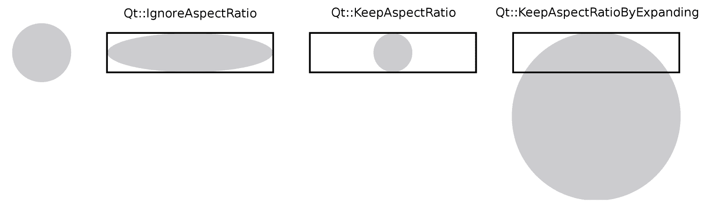

# 将场景保存到图像文件

到目前为止，我们只在视图中显示了我们的场景，但也可以将其渲染到图像、打印机或其他 Qt 可以用于绘制的对象。让我们将场景保存为 PNG 文件：

```cpp
QRect rect = scene.sceneRect().toAlignedRect();
QImage image(rect.size(), QImage::Format_ARGB32);
image.fill(Qt::transparent);
QPainter painter(&image);
scene.render(&painter);
image.save("scene.png");
```

# 刚才发生了什么？

首先，您使用 `sceneRect()` 确定了场景的矩形。由于这个函数返回一个 `QRectF` 参数，而 `QImage` 只能处理 `QRect`，您通过调用 `toAlignedRect()` 在线转换了它。`toRect()` 函数和 `toAlignedRect()` 之间的区别在于前者四舍五入到最接近的整数，这可能会导致矩形更小，而后者扩展到包含原始 `QRectF` 参数的最小可能矩形。

然后，您创建了一个与对齐场景矩形大小相同的 `QImage` 文件。由于图像是用未初始化的数据创建的，您需要使用 `Qt::transparent` 调用 `fill()` 以获取透明背景。您可以将任何颜色作为参数分配，无论是 `Qt::GlobalColor` 枚举的值还是一个普通的 `QColor` 对象；`QColor(0, 0, 255)` 将导致蓝色背景。接下来，您创建了一个指向图像的 `QPainter` 对象。然后，这个绘图对象在场景的 `render()` 函数中使用来绘制场景。之后，您只需使用 `save()` 函数将图像保存到您选择的位置。输出文件的格式由其扩展名确定。Qt 支持多种格式，Qt 插件可以添加对新格式的支持。由于我们没有指定路径，图像将被保存在应用程序的工作目录中（通常是构建目录，除非您使用 Qt Creator 的项目面板更改了它）。您也可以指定一个绝对路径，例如 `/path/to/image.png`。

当然，您需要构造一个在当前系统上有效的路径，而不是在源代码中硬编码它。例如，您可以使用 `QFileDialog::getSaveFileName()` 函数请求用户输入路径。

# 尝试一下英雄般的渲染 - 仅渲染场景的特定部分

此示例绘制了整个场景。当然，您也可以使用 `render()` 的其他参数仅渲染场景的特定部分。我们在这里不会深入探讨，但您可能想将其作为练习尝试。

# 自定义项

正如我们已经看到的，图形视图提供了很多有用的功能，涵盖了大多数典型用例。然而，Qt 的真正力量在于其可扩展性，图形视图允许我们创建 `QGraphicsItem` 的自定义子类，以实现针对您的应用程序定制的项。当您需要执行以下操作时，您可能想实现一个自定义项类：

+   绘制标准项类无法或难以完成的事情

+   实现与该项相关的逻辑，例如，添加您自己的方法

+   在单个项中处理事件

在我们的下一个小型项目中，我们将创建一个可以绘制正弦函数 `sin(x)` 图形的项，并实现一些事件处理。

# 行动时间 - 创建正弦图项目

使用 Qt Creator 创建一个新的 Qt Widgets 项目，并将其命名为 `sine_graph`。在向导的“类信息”页面，选择 `QWidget` 作为基类，并将类名输入为 `View`。取消选中“生成表单”复选框，然后完成向导。

我们希望 `View` 类成为图形视图，所以你需要将基类更改为 `QGraphicsView`（向导没有建议这样的选项）。为此，编辑类声明使其看起来像 `class View : public QGraphicsView ...`，并编辑构造函数实现使其看起来像 `View::View(QWidget *parent) : QGraphicsView(parent) ...`。

接下来，编辑 `View` 构造函数以启用抗锯齿并为我们视图设置一个新的图形场景：

```cpp
setRenderHint(QPainter::Antialiasing);
setScene(new QGraphicsScene);
```

视图在销毁时不会删除关联的场景（因为你可能对同一个场景有多个视图），所以你应该在析构函数中手动删除场景：

```cpp
delete scene();
```

你可以尝试运行应用程序并检查它是否显示了一个空视图。

# 行动时间 - 创建图形项目类

请求 Qt Creator 向项目中添加一个新的 C++ 类。输入 `SineItem` 作为类名，将下拉列表中的 <Custom> 保持不变，并在其下方的字段中输入 `QGraphicsItem`。完成向导并打开创建的 `sineitem.h` 文件。

在类声明中设置文本光标在 `QGraphicsItem` 内，然后按 *Alt* + *Enter*。一开始，Qt Creator 会建议你添加 `#include <QGraphicsItem>`。确认后，再次在 `QGraphicsItem` 上按 *Alt* + *Enter*。现在，Qt Creator 应该会建议你选择插入基类的虚拟函数。当你选择这个选项时，会出现一个特殊的对话框：

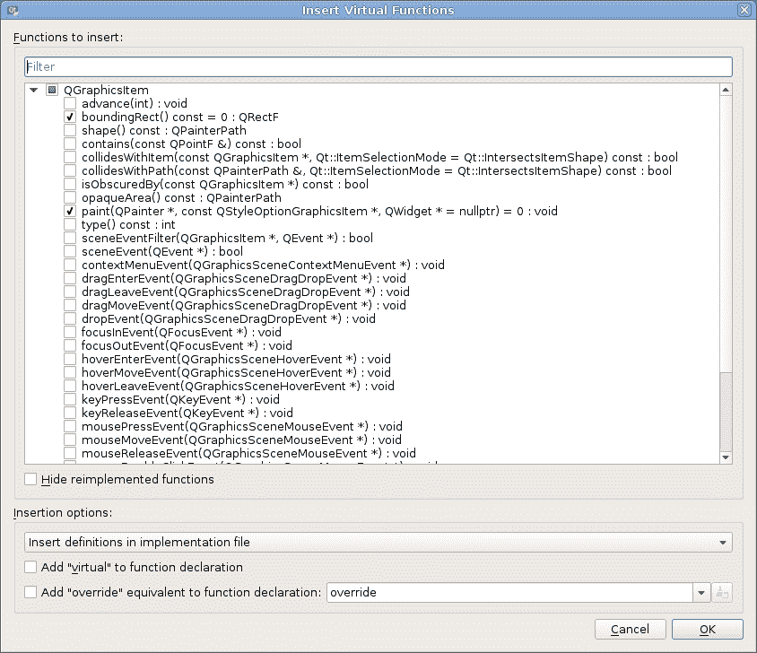

函数列表包含基类的所有虚拟函数。默认情况下，纯虚拟函数（如果你想要创建类的对象，则必须实现）是启用的。请确认一切设置如前一个截图所示，然后点击 OK。这个方便的操作会将所选虚拟函数的声明和实现添加到我们类的源文件中。如果你愿意，也可以手动编写它们。

让我们编辑 `sineitem.cpp` 来实现两个纯虚拟函数。首先，在文件顶部添加一些常量：

```cpp
static const float DX = 1;
static const float MAX_X = 50;
```

在我们的图中，*x* 将从 0 变化到 `MAX_X`，而 `DX` 将是图中两个连续点的差值。正如你可能知道的，`sin(x)` 的值可以从 -1 到 1。这些信息足以实现 `boundingRect()` 函数：

```cpp
QRectF SineItem::boundingRect() const
{
    return QRectF(0, -1, MAX_X, 2);
}
```

这个函数简单地每次都返回相同的矩形。在这个矩形中，*x* 从 0 变化到 `MAX_X`，而 *y* 从 -1 变化到 1。这个返回的矩形是对场景的一个承诺，表示项目只会在这个区域中绘制。场景依赖于这个信息的正确性，所以你应该严格遵守这个承诺。否则，场景将充满你绘制的遗迹！

现在，实现`paint()`函数，如下所示：

```cpp
void SineItem::paint(QPainter *painter, 
    const QStyleOptionGraphicsItem *option, QWidget *widget)
{
    QPen pen;
    pen.setCosmetic(true);
    painter->setPen(pen);
    const int steps = qRound(MAX_X / DX);
    QPointF previousPoint(0, sin(0));
    for(int i = 1; i < steps; ++i) {
        const float x = DX * i;
        QPointF point(x, sin(x));
        painter->drawLine(previousPoint, point);
        previousPoint = point;
    }
    Q_UNUSED(option)
    Q_UNUSED(widget)
}
```

将`#include <QtMath>`添加到文件的顶部部分，以便使数学函数可用。

# 刚才发生了什么？

当视图需要显示场景时，它会调用每个可见项目的`paint()`函数，并提供三个参数：一个用于绘制的`QPainter`指针，一个包含此项目绘制相关参数的`QStyleOptionGraphicsItem`指针，以及一个可选的`QWidget`指针，它可能指向当前绘制的窗口小部件。在函数的实现中，我们首先在`painter`中设置一个装饰性笔，以便我们的图形线条宽度始终为 1。然后，我们计算图形中的点数并将其保存到`steps`变量中。接下来，我们创建一个变量来存储图形的前一个点，并将其初始化为图形的第一个点的位置（对应于`x = 0`）。然后，我们遍历点，为每个点计算*x*和*y*，然后使用`painter`对象从前一个点到当前点绘制一条线。之后，我们更新`previousPoint`变量的值。我们使用`Q_UNUSED()`宏来抑制编译器关于未使用参数的警告，并表明我们有意没有使用它们。

编辑我们的`View`类的构造函数以创建我们新项目的实例：

```cpp
SineItem *item = new SineItem();
scene()->addItem(item);
```

应用程序现在应该显示正弦图，但它非常小：

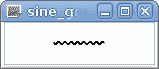

我们应该添加一种方式，让用户可以通过鼠标滚轮缩放我们的视图。然而，在我们做到这一点之前，你需要学习更多关于事件处理的知识。

# 事件

任何 GUI 应用程序都需要对输入事件做出反应。我们已经熟悉了基于`QObject`类的信号和槽机制。然而，`QObject`并不是一个轻量级的类。信号和槽对于连接应用程序的各个部分来说非常强大和方便，但为每个键盘按键或鼠标移动调用信号将会非常低效。为了处理此类事件，Qt 有一个特殊的系统，它使用`QEvent`类。

事件调度器是 **事件循环**。几乎任何 Qt 应用程序都使用由在 `main()` 函数末尾调用 `QCoreApplication::exec` 启动的主事件循环。当应用程序运行时，控制流程要么在您的代码中（即在项目的任何函数的实现中），要么在事件循环中。当操作系统或应用程序的组件要求事件循环处理一个事件时，它确定接收器并调用与事件类型相对应的虚函数。一个包含有关事件信息的 `QEvent` 对象被传递到该函数。虚函数可以选择 **接受** 或 **忽略** 事件。如果事件未被接受，事件将被 **传播** 到层次结构中的父对象（例如，从一个小部件到其父小部件，从一个图形项到其父项）。您可以通过子类化 Qt 类并重新实现虚函数来添加自定义事件处理。

以下表格显示了最有用的事件：

| **事件类型** | **描述** |
| --- | --- |
| `QEvent::KeyPress`、`QEvent::KeyRelease` | 按键被按下或释放。 |
| `QEvent::MouseButtonPress`、`QEvent::MouseButtonRelease`、`QEvent::MouseButtonDblClick` | 鼠标按钮被按下或释放。 |
| `QEvent::Wheel` | 鼠标滚轮被滚动。 |
| `QEvent::Enter` | 鼠标光标进入了对象的边界。 |
| `QEvent::MouseMove` | 鼠标光标被移动。 |
| `QEvent::Leave` | 鼠标光标离开了对象的边界。 |
| `QEvent::Resize` | 小部件的大小被调整（例如，因为用户调整了窗口大小或布局发生了变化）。 |
| `QEvent::Close` | 用户尝试关闭小部件的窗口。 |
| `QEvent::ContextMenu` | 用户请求一个上下文菜单（确切的操作取决于操作系统打开上下文菜单的方式）。 |
| `QEvent::Paint` | 小部件需要重新绘制。 |
| `QEvent::DragEnter`、`QEvent::DragLeave`、`QEvent::DragMove`、`QEvent::Drop` | 用户执行了拖放操作。 |
| `QEvent::TouchBegin`、`QEvent::TouchUpdate`、`QEvent::TouchEnd`、`QEvent::TouchCancel` | 触摸屏或触摸板报告了一个事件。 |

每种事件类型都有一个对应的类，该类继承自 `QEvent`（例如，`QMouseEvent`）。许多事件类型都有专门的虚函数，例如，`QWidget::mousePressEvent` 和 `QGraphicsItem::mousePressEvent`。更特殊的事件必须通过重新实现接收所有事件的 `QWidget::event`（或 `QGraphicsItem::sceneEvent`）函数来处理，并使用 `event->type()` 来检查事件类型。

图形场景中派发的事件有特殊类型（例如，`QEvent::GraphicsSceneMousePress`）和特殊类（例如，`QGraphicsSceneMouseEvent`），因为它们包含有关事件的扩展信息集。特别是鼠标事件包含有关项目及其场景坐标系统中的坐标信息。

# 行动时间 - 实现缩放场景的能力

让我们允许用户通过在视图中使用鼠标滚轮来缩放场景。切换到`view.h`文件，并添加一个声明和一个实现`wheelEvent()`虚拟函数的声明，使用我们在`SineItem`类中刚刚使用的方法。在`view.cpp`文件中编写以下代码：

```cpp
void View::wheelEvent(QWheelEvent *event)
{
    QGraphicsView::wheelEvent(event);
    if (event->isAccepted()) {
        return;
    }
    const qreal factor = 1.1;
    if (event->angleDelta().y() > 0) {
        scale(factor, factor);
    } else {
        scale(1 / factor, 1 / factor);
    }
    event->accept();
}
```

如果你现在运行应用程序，你可以使用鼠标滚轮来缩放正弦图。

# 刚才发生了什么？

当事件发生时，Qt 会调用事件发生的小部件中的相应虚拟函数。在我们的情况下，每当用户在我们的视图中使用鼠标滚轮时，`wheelEvent()`虚拟函数将被调用，`event`参数将包含有关事件的信息。

在我们的实现中，我们首先调用基类的实现。在重新实现虚拟函数时，无论何时都要这样做，除非你希望默认行为完全禁用。在我们的情况下，`QGraphicsView::wheelEvent()`会将事件传递给场景，如果我们忘记调用此函数，场景及其任何项目都不会收到任何滚轮事件，在某些情况下这可能会非常不受欢迎。

在默认实现完成后，我们使用`isAccepted()`函数来检查事件是否被场景或任何项目接受。默认情况下，事件将被拒绝，但如果我们后来添加一些可以处理滚轮事件的项目（例如，带有自己滚动条的文本文档），它将接收并接受该事件。在这种情况下，我们不想基于此事件执行任何其他操作，因为通常希望任何事件只在一个位置被处理（和接受）。

在某些情况下，你可能希望你的自定义实现比默认实现具有优先级。在这种情况下，将调用默认实现的代码移动到函数体的末尾。当你想要阻止特定事件被分派到场景时，使用早期的`return`来防止默认实现执行。

缩放的`factor`参数可以自由定义。你也可以为它创建一个 getter 和 setter 方法。对我们来说，1.1 就可以完成工作。使用`event->angleDelta()`，你可以得到鼠标滚轮旋转的距离作为一个`QPoint`指针。由于我们只关心垂直滚动，所以对我们来说，只有*y*轴是相关的。在我们的例子中，我们也不关心滚轮滚动的距离有多远，因为通常，每个步骤都会单独传递给`wheelEvent()`。但是，如果你需要它，它是以八分之一度为单位，而且由于大多数鼠标以 15 度的通用步骤工作，所以值应该是 120 或-120，具体取决于你是向前还是向后滚动滚轮。在向前滚动滚轮时，如果`y()`大于零，我们使用已经熟悉的`scale()`函数进行放大。否则，如果滚轮向后移动，我们进行缩小。最后，我们接受事件，表示用户的输入已被理解，不需要将事件传播到父小部件（尽管当前视图没有父小部件）。这就是全部内容。

当你尝试这个示例时，你会注意到，在缩放时，视图在视图的中心进行放大和缩小，这是视图的默认行为。你可以使用`setTransformationAnchor()`来改变这种行为。`QGraphicsView::AnchorViewCenter`，正如描述的那样，是默认行为。使用`QGraphicsView::NoAnchor`，缩放中心位于视图的左上角，你可能想要使用的值是`QGraphicsView::AnchorUnderMouse`。使用这个选项，鼠标下的点构建缩放的中心，因此保持在视图内的同一位置。

# 行动时间 – 考虑缩放级别

我们当前的图表包含具有整数*x*值的点，因为我们设置了`DX = 1`。这正是我们想要的默认缩放级别，但一旦视图被放大，就会明显看出图表的线条并不平滑。我们需要根据当前的缩放级别来改变`DX`。我们可以在`paint()`函数的开始处添加以下代码来实现这一点：

```cpp
const qreal detail = QStyleOptionGraphicsItem::levelOfDetailFromTransform(
    painter->worldTransform());
const qreal dx = 1 / detail;
```

删除`DX`常量，并在代码的其余部分将`DX`替换为`dx`。现在，当你缩放视图时，图表的线条保持平滑，因为点的数量会动态增加。`levelOfDetailFromTransform`辅助函数检查画笔变换的值（这是应用于项目的所有变换的组合）并返回**细节级别**。如果项目以 2:1 的比例放大，细节级别为 2，如果项目以 1:2 的比例缩小，细节级别为 0.5。

# 行动时间 – 响应项目的选择状态

标准项目在被选中时，会改变外观（例如，轮廓通常变为虚线）。当我们创建自定义项目时，我们需要手动实现这个功能。让我们在`View`构造函数中使我们的项目可选中：

```cpp
SineItem *item = new SineItem();
item->setFlag(QGraphicsItem::ItemIsSelectable);
```

现在，让我们在项目被选中时将图表线条设置为绿色：

```cpp
if (option->state & QStyle::State_Selected) {
    pen.setColor(Qt::green);
}
painter->setPen(pen);
```

# 刚才发生了什么？

`state` 变量是一个位掩码，包含项目的可能状态。你可以使用位运算符将其值与 `QStyle::StateFlag` 参数的值进行比较。在前面的例子中，`state` 变量被与 `State_Selected` 参数进行比较。如果此标志被设置，我们将使用绿色笔刷。

状态的类型是 `QFlags<StateFlag>`。因此，你不必使用位运算符来测试标志是否设置，而是可以使用方便的函数 `testFlag()`。

与前面的示例一起使用时，它将是以下内容：

```cpp
if (option->state.testFlag(QStyle::State_Selected)) {  
```

你可以使用项目描述的最重要的状态如下表所示：

| **状态** | **描述** |
| --- | --- |
| `State_Enabled` | 表示项目处于启用状态。如果项目被禁用，你可能想将其绘制为灰色。 |
| `State_HasFocus` | 表示项目具有输入焦点。要接收此状态，项目需要设置 `ItemIsFocusable` 标志。 |
| `State_MouseOver` | 表示光标当前悬停在项目上。要接收此状态，项目需要将 `acceptHoverEvents` 变量设置为 `true`。 |
| `State_Selected` | 表示项目被选中。要接收此状态，项目需要设置 `ItemIsSelectable` 标志。正常行为将是绘制一个虚线围绕项目作为选择标记。 |

除了状态之外，`QStyleOptionGraphicsItem` 还提供了关于当前使用的样式的大量信息，例如调色板和字体，分别通过 `QStyleOptionGraphicsItem::palette` 和 `QStyleOptionGraphicsItem::fontMetrics` 参数访问。如果你旨在创建具有样式感知的项目，请在文档中更深入地了解此类。

# 动作时间 - 在自定义项目中的事件处理

项目，就像小部件一样，可以在虚拟函数中接收事件。如果你点击场景（更准确地说，你点击一个将事件传播到场景的视图），场景将接收鼠标按下事件，然后它就变成了场景的责任来确定点击的是哪个项目。

让我们重写当用户在项目内部按下鼠标按钮时调用的 `SineItem::mousePressEvent` 函数：

```cpp
void SineItem::mousePressEvent(QGraphicsSceneMouseEvent *event)
{
    if (event->button() & Qt::LeftButton) {
        float x = event->pos().x();
        QPointF point(x, sin(x));
        static const float r = 0.3;
        QGraphicsEllipseItem *ellipse =
                new QGraphicsEllipseItem(-r, -r, 2 * r, 2 * r, this);
        ellipse->setPen(Qt::NoPen);
        ellipse->setBrush(QBrush(Qt::red));
        ellipse->setPos(point);
        event->accept();
    } else {
        event->ignore();
    }
}
```

当鼠标按下事件发生时，此函数会被调用，传递的`event`对象包含有关事件的信息。在我们的例子中，我们检查是否按下了左鼠标按钮，并使用`event->pos()`函数来获取点击点的坐标，该函数返回点击点在项目坐标系统中的坐标。在这个例子中，我们忽略了*y*坐标，并使用*x*坐标来找到我们图表上的对应点。然后，我们简单地创建了一个子圆形项目来显示该点。如果我们理解了所执行的操作，我们就`接受`事件，如果我们不知道它的含义，我们就`忽略`它，以便它可以传递给另一个项目。你可以运行应用程序并点击图表来查看这些圆圈。请注意，当你点击图表外部时，场景不会将事件分发给我们的项目，其`mousePressEvent()`函数不会被调用。

`event`对象还包含`button()`函数，该函数返回被按下的按钮，以及`scenePos()`函数，该函数返回场景坐标系统中的点击点。场景负责传递事件不仅适用于鼠标事件，还适用于键盘事件和其他所有类型的事件。

# 行动时间 - 实现使用鼠标创建和删除元素的能力

让我们允许用户在点击视图时使用左鼠标按钮创建我们正弦项的新实例，如果他们使用右鼠标按钮，则删除这些项目。重新实现`View::mousePressEvent`虚函数，如下所示：

```cpp
void View::mousePressEvent(QMouseEvent *event)
{
    QGraphicsView::mousePressEvent(event);
    if (event->isAccepted()) {
        return;
    }
    switch (event->button()) {
        case Qt::LeftButton: {
            SineItem *item = new SineItem();
            item->setPos(mapToScene(event->pos()));
            scene()->addItem(item);
            event->accept();
            break;
        }
        case Qt::RightButton: {
            QGraphicsItem *item = itemAt(event->pos());
            if (item) {
                delete item;
            }
            event->accept();
            break;
        }
        default:
            break;
    }
}
```

在这里，我们首先检查事件是否被场景或其任何项目接受。如果没有，我们确定哪个按钮被按下。对于左按钮，我们创建一个新的项目并将其放置在场景的相应点上。对于右按钮，我们在该位置搜索项目并将其删除。在这两种情况下，我们都接受事件。当你运行应用程序时，你会注意到，如果用户点击现有项目，将添加一个新的圆圈，如果用户点击任何项目外部，将添加一个新的正弦项目。这是因为我们正确地设置了事件的`accepted`属性。

你可能会注意到，当我们添加新项目时，场景在视图中跳跃。这是由于场景矩形的变化引起的。为了防止这种情况，你可以使用`setSceneRect()`设置一个常量矩形，或者在视图的构造函数中使用`setAlignment(Qt::AlignTop | Qt::AlignLeft)`来更改对齐方式。

# 行动时间 - 更改项目的大小

我们的定制图形项目始终显示*x*值在 0 到 50 之间的图表。将此设置为可配置设置会很好。在`SineItem`类中声明一个私有的`float m_maxX`字段，删除`MAX_X`常量，并在代码的其余部分使用`m_maxX`替换其使用。始终必须在构造函数中设置字段的初始值，否则可能会发生不良情况。最后，实现它的 getter 和 setter，如下所示：

```cpp
float SineItem::maxX()
{
    return m_maxX;
}

void SineItem::setMaxX(float value)
{
    if (m_maxX == value) {
        return;
    }
    prepareGeometryChange();
    m_maxX = value;
}
```

这里唯一非平凡的部分是 `prepareGeometryChange()` 调用。这个方法是从 `QGraphicsItem` 继承的，并通知场景我们的 `boundingRect()` 函数将在下一次更新时返回不同的值。场景缓存了项的边界矩形，所以如果你不调用 `prepareGeometryChange()`，边界矩形的更改可能不会生效。这个动作也会为我们的项安排一个更新。

当边界矩形没有变化，但项的实际内容发生变化时，你需要在小部件上调用 `update()` 来通知场景它应该重新绘制该小部件。

# 尝试扩展项的功能

`SineItem` 的功能仍然相当有限。作为一个练习，你可以尝试添加一个选项来更改图形的最小 *x* 值或设置不同的画笔。你甚至可以允许用户指定一个任意函数指针来替换 `sin()` 函数。然而，请记住，项的边界矩形取决于函数的值域，因此你需要准确更新项的几何形状。

# Graphics View 中的小部件

为了展示 Graphics View 的一个整洁特性，请看以下代码片段，它向场景添加了一个小部件：

```cpp
QSpinBox *box = new QSpinBox;
QGraphicsProxyWidget *proxyItem = new QGraphicsProxyWidget;
proxyItem->setWidget(box);
scene()->addItem(proxyItem);
proxyItem->setScale(2);
proxyItem->setRotation(45); 
```

首先，我们创建一个 `QSpinBox` 和一个 `QGraphicsProxyWidget` 元素，它们作为小部件的容器，并间接继承 `QGraphicsItem`。然后，我们通过调用 `addWidget()` 将旋转框添加到代理小部件中。当 `QGraphicsProxyWidget` 被删除时，它会调用所有分配的小部件的 `delete` 方法，所以我们不必自己担心这一点。你添加的小部件应该是无父级的，并且不能在其他地方显示。在将小部件设置到代理后，你可以像对待任何其他项一样处理代理小部件。接下来，我们将它添加到场景中，并应用一个变换以进行演示。结果如下：

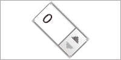

注意，最初，Graphics View 并不是为容纳小部件而设计的。所以当你向场景添加很多小部件时，你将很快注意到性能问题，但在大多数情况下，它应该足够快。

如果你想在布局中排列一些小部件，你可以使用 `QGraphicsAnchorLayout`、`QGraphicsGridLayout` 或 `QGraphicsLinearLayout`。创建所有小部件，创建一个你选择的布局，将小部件添加到该布局中，并将布局设置到 `QGraphicsWidget` 元素上，这是所有小部件的基类，简单来说，是 Graphics View 的 `QWidget` 等价物，通过调用 `setLayout()` 实现：

```cpp
QGraphicsProxyWidget *edit = scene()->addWidget(
  new QLineEdit(tr("Some Text")));
QGraphicsProxyWidget *button = scene()->addWidget(
  new QPushButton(tr("Click me!")));
QGraphicsLinearLayout *layout = new QGraphicsLinearLayout;
layout->addItem(edit);
layout->addItem(button);
QGraphicsWidget *graphicsWidget = new QGraphicsWidget;
graphicsWidget->setLayout(layout);
scene()->addItem(graphicsWidget); 
```

场景的 `addWidget()` 函数是一个便利函数，其行为类似于 `addRect`，如下面的代码片段所示：

```cpp
QGraphicsProxyWidget *proxy = new QGraphicsProxyWidget(0);
proxy->setWidget(new QLineEdit(QObject::tr("Some Text")));
scene()->addItem(proxy); 
```

带有布局的项将看起来像这样：

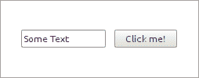

# 优化

当向场景添加许多项目或使用具有复杂`paint()`函数的项目时，您应用程序的性能可能会下降。虽然图形视图的默认优化适用于大多数情况，但您可能需要调整它们以获得更好的性能。现在让我们看看我们可以执行的一些优化，以加快场景的速度。

# 二叉空间划分树

场景持续记录项目在其内部二叉空间划分树中的位置。因此，每当项目移动时，场景都必须更新树，这个操作可能非常耗时，并且消耗内存。这对于包含大量动画项目的场景尤其如此。另一方面，树使您能够以极快的速度找到项目（例如，使用`items()`或`itemAt()`），即使您有成千上万的项目。

因此，当您不需要任何关于项目的位置信息时——这包括碰撞检测——您可以通过调用`setItemIndexMethod(QGraphicsScene::NoIndex)`来禁用索引函数。然而，请注意，调用`items()`或`itemAt()`会导致遍历所有项目以进行碰撞检测，这可能会对包含许多项目的场景造成性能问题。如果您不能完全放弃树，您仍然可以通过`setBspTreeDepth()`调整树的深度，将深度作为参数。默认情况下，场景将在考虑了几个参数（如大小和项目数量）后猜测一个合理的值。

# 缓存项目的绘制函数

如果您有耗时的绘制函数的项目，您可以更改项目的缓存模式。默认情况下，没有渲染缓存。通过`setCacheMode()`，您可以设置模式为`ItemCoordinateCache`或`DeviceCoordinateCache`。前者在给定`QSize`元素的缓存中渲染项目。该缓存的大小可以通过`setCacheMode()`的第二个参数控制，因此质量取决于您分配的空间量。缓存随后用于每个后续的绘制调用。缓存甚至用于应用变换。如果质量下降太多，只需通过再次调用`setCacheMode()`并使用更大的`QSize`元素来调整分辨率。另一方面，`DeviceCoordinateCache`不在项目级别缓存项目，而是在设备级别缓存。因此，这对于不经常变换的项目是最佳的，因为每次新的变换都会导致新的缓存。但是，移动项目不会使缓存失效。如果您使用此缓存模式，您不需要使用第二个参数定义分辨率。缓存始终以最大质量执行。

# 优化视图

既然我们在谈论项目的`paint()`函数，让我们谈谈相关的内容。默认情况下，视图确保在调用项目的`paint()`函数之前保存绘图状态，并在之后恢复状态。如果您有一个包含 50 个项目的场景，这将最终导致保存和恢复绘图状态约 50 次。然而，您可以通过在视图中调用`setOptimizationFlag(DontSavePainterState, true)`来禁用此行为。如果您这样做，现在您有责任确保任何更改绘图状态（包括笔、画刷、变换和许多其他属性）的`paint()`函数必须在结束时恢复先前的状态。如果您阻止了自动保存和恢复，请记住现在标准项目将改变绘图状态。所以如果您同时使用标准和自定义项目，要么保持默认行为，要么设置`DontSavePainterState`，然后在每个项目的`paint()`函数中使用默认值设置笔和画刷。

可以与`setOptimizationFlag()`一起使用的另一个标志是`DontAdjustForAntialiasing`。默认情况下，视图通过所有方向调整每个项目的绘制区域两个像素。这很有用，因为当您绘制抗锯齿时，很容易绘制到边界矩形之外。如果您不绘制抗锯齿或确信您的绘制将始终保持在边界矩形内，请启用此优化。如果您启用了此标志并在视图中发现绘制伪影，那么您没有尊重项目的边界矩形！

作为进一步的优化，您可以定义视图在场景变化时应该如何更新其视口。您可以使用`setViewportUpdateMode()`设置不同的模式。默认情况下（`QGraphicsView::MinimalViewportUpdate`），视图试图确定仅需要更新的那些区域，并且只重新绘制这些区域。然而，有时找到所有需要重新绘制的区域比简单地绘制整个视口更耗时。如果您有很多小的更新，那么`QGraphicsView::FullViewportUpdate`是更好的选择，因为它简单地重新绘制整个视口。最后两种模式的组合是`QGraphicsView::BoundingRectViewportUpdate`。在这种模式下，Qt 检测所有需要重新绘制的区域，然后重新绘制一个覆盖所有受更改影响的区域视口矩形。如果最佳更新模式随时间变化，您可以使用`QGraphicsView::SmartViewportUpdate`告诉 Qt 确定最佳模式。然后视图会尝试找到最佳的更新模式。

# 图形视图中的 OpenGL

作为最后的优化，您可以利用 OpenGL。而不是使用基于`QWidget`的默认视口，建议图形视图使用 OpenGL 小部件：

```cpp
QGraphicsView view;
view.setViewport(new QOpenGLWidget()); 
```

这通常可以提高渲染性能。然而，Graphics View 并不是为 GPU 设计的，无法有效地使用它们。有一些方法可以改善这种情况，但这超出了本章的主题和范围。你可以在 Qt 的示例中以及 Rødal 的文章“使用 OpenGL 加速你的小部件”中找到更多关于 OpenGL 和 Graphics View 的信息，该文章可在网上找到[`doc.qt.io/archives/qq/qq26-openglcanvas.html`](https://doc.qt.io/archives/qq/qq26-openglcanvas.html)。

如果你想使用一个旨在支持 GPU 加速的框架，你应该关注 Qt Quick（我们将在第十一章，*Qt Quick 简介*）开始使用它）。然而，与 Graphics View 相比，Qt Quick 有其自身的局限性。这个话题在 Nichols 的文章*你仍然应该使用 QGraphicsView 吗？*中有详细阐述，该文章可在[`blog.qt.io/blog/2017/01/19/should-you-be-using-qgraphicsview/`](https://blog.qt.io/blog/2017/01/19/should-you-be-using-qgraphicsview/)找到。或者，你可以直接通过其 API 和有用的 Qt 工具访问 OpenGL 的全部功能。我们将在第九章*，Qt 应用程序中的 OpenGL 和 Vulkan*中描述这种方法。

不幸的是，我们无法告诉你必须做什么或做什么来优化 Graphics View，因为它高度依赖于你的系统和视图/场景。然而，我们可以告诉你如何进行。一旦你完成了基于 Graphics View 的游戏，使用分析器测量你游戏的性能。进行你认为可能带来收益的优化，或者简单地猜测，然后再次分析你的游戏。如果结果更好，保留这个变化，否则拒绝它。这听起来很简单，这是优化可以进行的唯一方法。没有隐藏的技巧或更深入的知识。然而，随着时间的推移，你的预测将变得更好。

# 快速问答

Q1. 以下哪个类是窗口小部件类？

1.  `QGraphicsView`

1.  `QGraphicsScene`

1.  `QGraphicsItem`

Q2. 以下哪个操作不会改变图形项在屏幕上的位置？

1.  缩放视图。

1.  剪切此项目的父项目。

1.  翻译此项目。

1.  旋转此项目的子项目。

Q3. 在从 `QGraphicsItem` 派生的新类中，哪个函数不是必须实现的？

1.  `boundingRect()`

1.  `shape()`

1.  `paint()`

Q4. 在 Graphics View 中显示位图图像应该使用哪个项目类？

1.  `QGraphicsRectItem`

1.  `QGraphicsWidget`

1.  `QGraphicsPixmapItem`

# 摘要

在本章中，你学习了 Graphics View 架构是如何工作的。我们探讨了框架的构建块（项目、场景和视图）。接下来，你学习了它们的坐标系是如何相关的，以及如何使用它们来获取你想要的画面。随后，我们描述了 Graphics View 最有用且最常需要的特性。然后，我们介绍了创建自定义项目和处理输入事件的方法。为了连接到 widgets 的世界，你还学习了如何将基于 `QWidget` 的项目整合到 Graphics View 中。最后，我们讨论了优化场景的方法。

现在，你已经了解了 Graphics View 框架的大部分功能。有了这些知识，你现在已经可以做一些很酷的事情了。然而，对于一个游戏来说，它仍然太静态了。在下一章中，我们将通过创建一个完整游戏的过程，并学习如何使用 Animation 框架。
