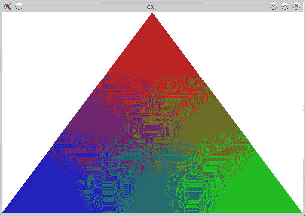
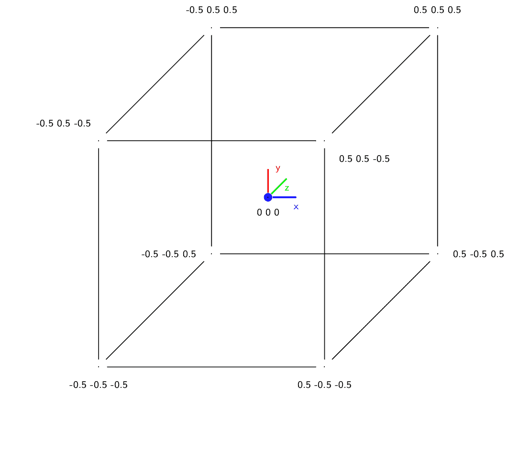
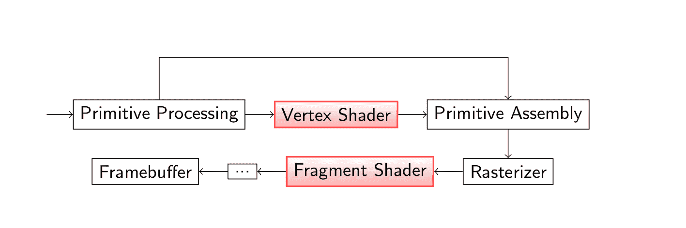
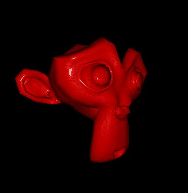
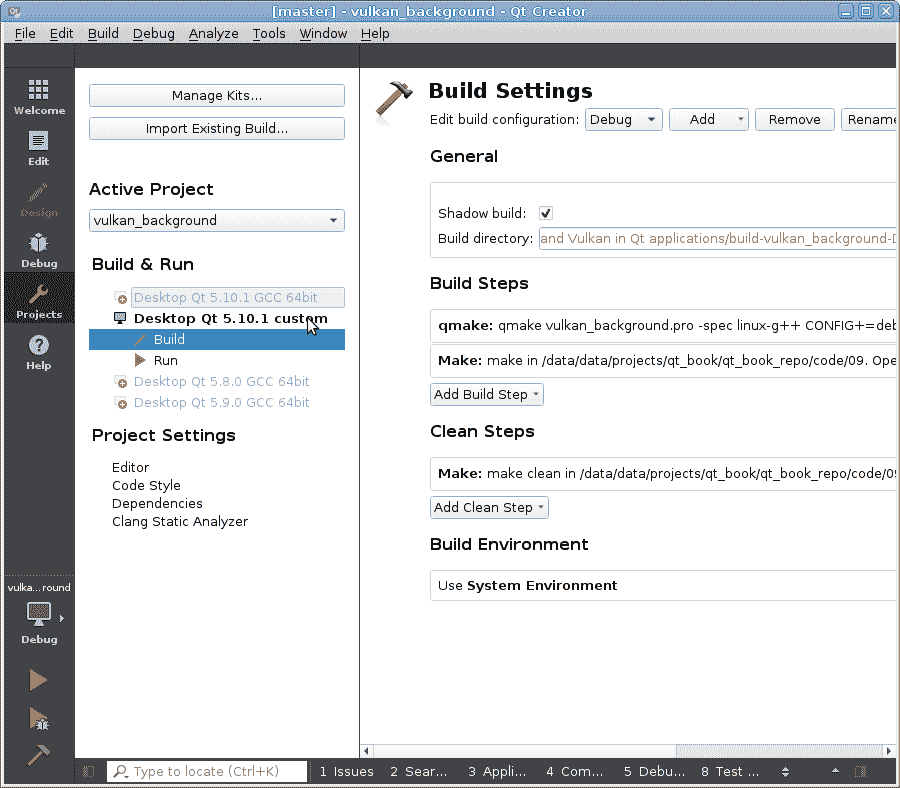
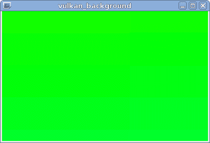
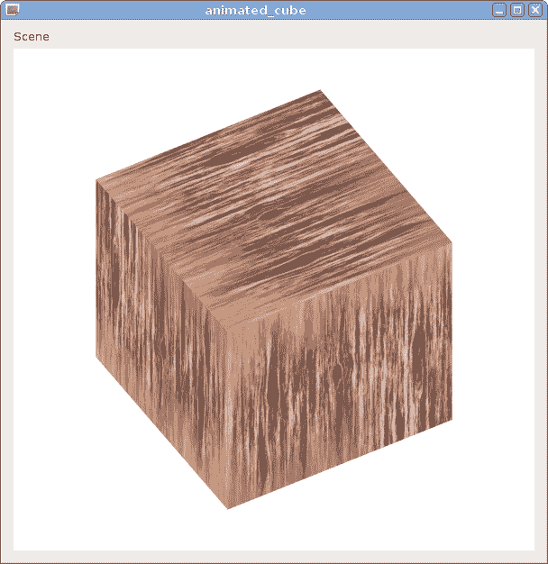

# 第九章：Qt 应用程序中的 OpenGL 和 Vulkan

对于实现具有高级图形效果的现代游戏来说，硬件加速至关重要。Qt Widgets 模块使用针对基于 CPU 渲染的传统方法进行优化的方法。尽管你可以让任何小部件使用 OpenGL，但性能通常不会最大化。然而，Qt 允许你直接使用 OpenGL 或 Vulkan 来创建高性能的图形，其性能仅受显卡处理能力的限制。在本章中，你将学习如何利用你的 OpenGL 和 Vulkan 技能来显示快速 3D 图形。如果你不熟悉这些技术，本章应该能为你在这个主题上的进一步研究提供一个起点。我们还将描述多个 Qt 辅助类，这些类简化了 OpenGL 纹理、着色器和缓冲区的使用。到本章结束时，你将能够使用 Qt 提供的 OpenGL 和 Vulkan 类创建 2D 和 3D 图形，并将它们与用户界面的其余部分集成。

本章涵盖的主要主题如下：

+   Qt 应用程序中的 OpenGL

+   立即模式

+   纹理

+   着色器

+   OpenGL 缓冲区

+   Qt 应用程序中的 Vulkan

# 使用 Qt 的 OpenGL 简介

我们不是 OpenGL 的专家，所以在本章的这一部分，我们不会教你如何使用 OpenGL 和 Qt 做任何花哨的事情，而是会向你展示如何在 Qt 应用程序中启用你的 OpenGL 技能。关于 OpenGL 有很多教程和课程，所以如果你对 OpenGL 不是很熟练，你仍然可以通过应用在这里获得的知识来更容易地学习花哨的东西。你可以使用外部材料和 Qt 提供的高级 API，这将加快教程中描述的许多任务的执行。

# OpenGL 窗口和上下文

你可以在 Qt 中执行 OpenGL 渲染的许多方法。我们将主要使用的一种最直接的方法是子类化`QOpenGLWindow`。它允许 OpenGL 直接将你的内容渲染到整个窗口，如果你使用 OpenGL 在应用程序中绘制所有内容，它是非常合适的。如果你想让它成为全屏窗口，也可以做到。然而，稍后我们还将讨论其他方法，这些方法将允许你将 OpenGL 内容集成到基于小部件的应用程序中。

OpenGL 上下文代表 OpenGL 管道整体状态，它指导数据处理和渲染到特定设备的过程。在 Qt 中，它由 `QOpenGLContext` 类表示。需要解释的另一个相关概念是 OpenGL 上下文在某个线程中“当前”的概念。OpenGL 调用的方式是它们不使用任何包含有关在哪里以及如何执行一系列低级 OpenGL 调用的对象的句柄。相反，它们假定是在当前机器状态的环境中执行的。状态可能决定了是否将场景渲染到屏幕或帧缓冲区对象，启用了哪些机制，或者 OpenGL 正在渲染的表面的属性。使上下文“当前”意味着所有由特定线程发出的进一步 OpenGL 操作都将应用于此上下文。此外，上下文在同一时间只能在一个线程中“当前”；因此，在调用任何 OpenGL 调用之前使上下文“当前”并标记它为可用是很重要的。

`QOpenGLWindow` 拥有一个非常简单的 API，它隐藏了大部分对开发者不必要的细节。除了构造函数和析构函数之外，它还提供了一些非常实用的方法。首先，有一些辅助方法用于管理 OpenGL 上下文：`context()`，它返回上下文，以及 `makeCurrent()` 和 `doneCurrent()` 用于获取和释放上下文。该类还提供了一些虚拟方法，我们可以重新实现它们来显示 OpenGL 图形。

我们将使用以下三种虚拟方法：

+   `initializeGL()` 会在实际进行任何绘制之前由框架调用一次，这样你就可以准备任何资源或以任何你需要的任何方式初始化上下文。

+   `paintGL()` 对于小部件类来说相当于 `paintEvent()`。每当窗口需要重新绘制时，它都会被执行。这是你应该放置你的 OpenGL 渲染代码的函数。

+   每次窗口大小改变时，都会调用 `resizeGL()`。它接受窗口的宽度和高度作为参数。你可以通过重新实现该方法来准备自己，以便下一次调用 `paintGL()` 时渲染到不同大小的视口。

在调用这些虚拟函数之前，`QOpenGLWindow` 确保 OpenGL 上下文是当前的，因此在这些函数中不需要手动调用 `makeCurrent()`。

# 访问 OpenGL 函数

与 OpenGL 的交互通常是通过调用 OpenGL 库提供的函数来完成的。例如，在一个常规的 C++ OpenGL 应用程序中，您可以看到对 `glClearColor()` 等 OpenGL 函数的调用。这些函数在您的二进制文件与 OpenGL 库链接时被解析。然而，当您编写跨平台应用程序时，解析所有必需的 OpenGL 函数并非易事。幸运的是，Qt 提供了一种无需担心平台特定细节即可调用 OpenGL 函数的方法。

在 Qt 应用程序中，您应通过 `QOpenGLFunctions` 类族访问 OpenGL 函数。`QOpenGLFunctions` 类本身仅提供对 OpenGL ES 2.0 API 中部分函数的访问。这个子集预计将在 Qt 支持的最多桌面和嵌入式平台上工作（在这些平台上 OpenGL 都是可用的）。然而，这是一个非常有限的函数集，有时您可能愿意以支持较少平台为代价使用更新的 OpenGL 版本。对于每个已知的 OpenGL 版本和配置文件，Qt 提供了一个包含可用函数集的单独类。例如，`QOpenGLFunctions_3_3_Core` 类将包含 OpenGL 3.3 核心配置文件提供的所有函数。

Qt 推荐的方法是选择与您想要使用的版本相对应的 OpenGL 函数类，并将其添加到您的窗口或小部件的第二个基类中。这将使该版本的 OpenGL 函数在您的类中可用。这种方法允许您使用直接使用 OpenGL 库的代码，而无需对其进行更改。当您将此类代码放入您的类中时，编译器将使用 `QOpenGLFunctions::glClearColor()` 函数而不是 OpenGL 库提供的全局 `glClearColor()` 函数。

然而，在使用这种方法时，您必须小心，只使用您基类提供的函数。如果您选择的 Qt 类不包含它，您可能会意外地使用全局函数而不是 Qt 类提供的函数。例如，如果您使用 `QOpenGLFunctions` 作为基类，您就不能使用 `glBegin()` 函数，因为这个函数不是由这个 Qt 类提供的。这样的错误代码可能在某个操作系统上工作，然后突然在另一个操作系统上无法编译，因为您没有链接到 OpenGL 库。只要您只使用 Qt 类提供的 OpenGL 函数，您就无需考虑与 OpenGL 库的链接或跨平台方式解决函数。

如果您想确保只使用 Qt OpenGL 函数包装器，您可以将 Qt 类用作私有字段而不是基类。在这种情况下，您必须通过私有字段访问每个 OpenGL 函数，例如，`m_openGLFunctions->glClearColor()`。这将使您的代码更加冗长，但至少您可以确信不会意外地使用全局函数。

在使用 Qt OpenGL 函数之前，您必须调用当前 OpenGL 上下文中函数类的 `initializeOpenGLFunctions()` 方法。这通常在窗口的 `initializeGL()` 函数中完成。期望 `QOpenGLFunctions` 类始终初始化成功，因此其 `initializeOpenGLFunctions()` 方法不返回任何内容。在其他所有函数类的所有函数中，此函数返回 `bool`。如果它返回 `false`，则表示 Qt 无法成功解析所有必需的函数，并且您的应用程序应带错误消息退出。

在我们的示例中，我们将使用包含我们将使用所有 OpenGL 函数的 `QOpenGLFunctions_1_1` 类。当您创建自己的项目时，考虑您想要针对的 OpenGL 配置文件并选择适当的函数类。

# 使用立即模式的 OpenGL

我们将从最基本的方法开始，称为 **立即模式**。在这种模式下，不需要额外的 OpenGL 缓冲区或着色器设置。您只需提供一些几何原语即可立即获得结果。立即模式现在已被弃用，因为它比更高级的技术慢得多，并且灵活性较低。然而，它比它们容易得多，因此基本上每个 OpenGL 教程都是从描述立即模式调用开始的。在本节中，我们将展示如何用很少的代码执行一些简单的 OpenGL 绘图。更现代的方法将在本章下一节中介绍。

# 行动时间 - 使用 Qt 和 OpenGL 绘制三角形

在第一个练习中，我们将创建一个 `QOpenGLWindow` 的子类，使用简单的 OpenGL 调用来渲染一个三角形。创建一个新的项目，从“其他项目”组中的“空 qmake 项目”模板开始。在项目文件中，添加以下内容：

```cpp
QT = core gui
TARGET = triangle
TEMPLATE = app 
```

注意，我们的项目不包括 Qt Widgets 模块。使用 `QOpenGLWindow` 方法允许我们删除这个不必要的依赖，并使我们的应用程序更轻量级。

注意，Qt Core 和 Qt GUI 模块默认启用，因此您不需要将它们添加到 `QT` 变量中，但我们更喜欢明确地显示我们在项目中使用它们。

在基本项目设置就绪后，让我们定义一个 `SimpleGLWindow` 类，作为 `QOpenGLWindow` 和 `QOpenGLFunctions_1_1` 的子类。由于我们不希望允许外部访问 OpenGL 函数，我们使用保护继承来作为第二个基类。接下来，我们重写 `QOpenGLWindow` 的虚拟 `initializeGL()` 方法。在这个方法中，我们初始化我们的 `QOpenGLFunctions_1_1` 基类，并使用它提供的 `glClearColor()` 函数：

```cpp
class SimpleGLWindow : public QOpenGLWindow,
                       protected QOpenGLFunctions_1_1 
{
public:
    SimpleGLWindow(QWindow *parent = 0) :
        QOpenGLWindow(NoPartialUpdate, parent) {
    }
protected:
    void initializeGL() {
        if (!initializeOpenGLFunctions()) {
            qFatal("initializeOpenGLFunctions failed");
        }
        glClearColor(1, 1, 1, 0);
    } 
};
```

在`initializeGL()`函数中，我们首先调用`initializeOpenGLFunctions()`，这是`QOpenGLFunctions_1_1`类的一个方法，它是我们窗口类的基础类之一。该方法负责根据当前 OpenGL 上下文的参数设置所有函数（因此，首先使上下文成为当前上下文是很重要的，幸运的是，在调用`initializeGL()`之前，这已经在幕后为我们完成了）。如果此函数失败，我们使用`qFatal()`宏将错误信息打印到`stderr`并终止应用程序。然后，我们使用`QOpenGLFunctions_1_1::glClearColor()`函数将场景的清除颜色设置为白色。

下一步是重新实现`paintGL()`函数，并将实际的绘图代码放在那里：

```cpp
void SimpleGLWindow::paintGL() {
    glClear(GL_COLOR_BUFFER_BIT);
    glViewport(0, 0, width(), height());
    glBegin(GL_TRIANGLES);
    {
        glColor3f(1, 0, 0);
        glVertex3f( 0.0f, 1.0f, 0.0f);
        glColor3f(0, 1, 0);
        glVertex3f( 1.0f, -1.0f, 0.0f);
        glColor3f(0, 0, 1);
        glVertex3f(-1.0f, -1.0f, 0.0f);
    }
    glEnd();
}
```

此函数首先清除颜色缓冲区，并将上下文的 OpenGL 视口设置为窗口的大小。然后，我们通过调用`glBegin()`并传递`GL_TRIANGLES`作为绘图模式来告诉 OpenGL 开始使用三角形进行绘制。然后，我们传递三个顶点及其颜色来形成一个三角形。最后，通过调用`glEnd()`通知管道，我们已完成使用当前模式的绘制。

剩下的只是一个平凡的`main()`函数，用于设置窗口并启动事件循环。添加一个新的 C++源文件，命名为`main.cpp`，并实现`main()`，如下所示：

```cpp
int main(int argc, char **argv) {
    QGuiApplication app(argc, argv);
    SimpleGLWindow window;
    window.resize(600, 400);
    window.show();
    return app.exec();
} 
```

这个函数与我们通常在`main()`函数中看到的内容非常相似，但我们使用`QGuiApplication`而不是`QApplication`，因为我们只使用 Qt GUI 模块。运行项目后，你应该看到以下内容：



# 多重采样

你可以看到三角形有锯齿状的边缘。这是因为走样效应。你可以通过为窗口启用多重采样来对抗它，这将使 OpenGL 渲染的内容看起来像屏幕有更高的分辨率，然后平均结果，这起到抗走样的作用。为此，将以下代码添加到窗口的构造函数中：

```cpp
QSurfaceFormat fmt = format();
fmt.setSamples(16); // multisampling set to 16
setFormat(fmt);
```

注意，多重采样是资源密集型的，所以设置一个很高的样本数可能会导致你的应用程序失败，如果你的硬件或驱动程序无法处理它。如果启用多重采样后应用程序不起作用，请尝试降低样本数或直接禁用它。

# 行动时间 - 基于场景的渲染

让我们把我们的渲染代码提升到一个更高的层次。直接将 OpenGL 代码放入窗口类需要子类化窗口类，并使窗口类变得越来越复杂。让我们遵循良好的编程实践，将渲染代码与窗口代码分离。

创建一个新的类，命名为`AbstractGLScene`。它将是以下类的基类：

OpenGL 场景的定义。我们还从`QOpenGLFunctions_1_1`派生类（具有保护作用域），以便更容易访问不同的 OpenGL 函数。确保场景类接受一个指向`QOpenGLWindow`的指针，无论是在构造函数中还是在专门的设置方法中。确保将指针存储在类中，以便更容易访问，因为我们将会依赖这个指针来访问窗口的物理属性。添加查询窗口 OpenGL 上下文的方法。您最终应该得到类似以下代码的代码：

```cpp
class AbstractGLScene : protected QOpenGLFunctions_1_1 {
public:
    AbstractGLScene(QOpenGLWindow *window = nullptr) {
        m_window = window;
    }
    QOpenGLWindow* window() const { return m_window; }
    QOpenGLContext* context() {
       return m_window ? m_window->context() : nullptr;
    }
    const QOpenGLContext* context() const {
        return m_window ? m_window->context() : nullptr;
    }
private:
    QOpenGLWindow *m_window = nullptr;
}; 
```

现在最重要的部分开始了。添加两个纯虚方法，分别称为`paint()`和`initialize()`。同时，记得添加一个虚析构函数。

您不必将`initialize()`实现为纯虚函数，您可以以这种方式实现其主体，使其调用`initializeOpenGLFunctions()`以满足`QOpenGFunctions`类的要求。然后，`AbstractGLScene`的子类可以通过调用基类的`initialize()`实现来确保函数被正确初始化。

接下来，创建一个`QOpenGLWindow`的子类，并将其命名为`SceneGLWindow`。添加一个`AbstractGLScene *m_scene`私有字段，并为其实现一个获取器和设置器。使用以下代码创建一个构造函数：

```cpp
SceneGLWindow::SceneGLWindow(QWindow *parent) : 
    QOpenGLWindow(NoPartialUpdate, parent)
{
}
```

此构造函数将父参数传递给基构造函数，并将`NoPartialUpdate`作为窗口的`UpdateBehavior`。此选项意味着窗口将在每次`paintGL()`调用时完全重绘，因此不需要帧缓冲区。这是第一个参数的默认值，但因为我们提供了第二个参数，所以我们有义务明确提供第一个参数。

然后，重新实现`initializeGL()`和`paintGL()`方法，并使它们调用场景中的适当等效方法：

```cpp
void SceneGLWindow::initializeGL() {
    if(m_scene) {
        m_scene->initialize();
    }
}
void SceneGLWindow::paintGL() {
    if(m_scene) {
        m_scene->paint();
    }
}
```

最后，在`main()`函数中实例化`SceneGLWindow`。

# 刚才发生了什么？

我们刚刚设置了一个类链，将窗口代码与实际的 OpenGL 场景分离。窗口将所有与场景内容相关的调用转发给场景对象，以便当窗口被要求重绘自身时，它将任务委托给场景对象。请注意，在此之前，窗口将使 OpenGL 上下文成为当前上下文；因此，场景所做的所有 OpenGL 调用都将与此上下文相关。您可以将在此练习中创建的代码存储起来，以便在后续练习和自己的项目中重复使用。

# 行动时间 - 绘制纹理立方体

创建一个名为`CubeGLScene`的新类，并从`AbstractGLScene`派生。实现构造函数以将其参数传递给基类构造函数。添加一个方法来存储场景中的`QImage`对象，该对象将包含立方体的纹理数据。同时添加一个`QOpenGLTexture`指针成员，它将包含纹理，在构造函数中将它初始化为`nullptr`，并在析构函数中删除它。我们将称这个`m_textureImage`图像对象为`m_texture`纹理。现在添加一个受保护的`initializeTexture()`方法，并用以下代码填充它：

```cpp
void CubeGLScene::initializeTexture() {
    m_texture = new QOpenGLTexture(m_textureImage.mirrored());
    m_texture->setMinificationFilter(QOpenGLTexture::LinearMipMapLinear);
    m_texture->setMagnificationFilter(QOpenGLTexture::Linear);
} 
```

函数首先垂直翻转图像。这是因为 OpenGL 中默认的*y*轴向上，所以纹理将显示为“颠倒”。然后，我们创建一个`QOpenGLTexture`对象，并将我们的图像传递给它。之后，我们设置缩小和放大过滤器，以便纹理在缩放时看起来更好。

我们现在准备实现`initialize()`方法，该方法将负责设置纹理和场景本身：

```cpp
void CubeGLScene::initialize() {
    AbstractGLScene::initialize();
    m_initialized = true;
    if(!m_textureImage.isNull()) {
        initializeTexture();
    }
    glClearColor(1, 1, 1, 0);
    glShadeModel(GL_SMOOTH);
} 
```

我们使用一个名为`m_initialized`的标志。这个标志是必要的，以防止纹理设置得太早（当还没有 OpenGL 上下文时）。然后，我们检查纹理图像是否已设置（使用`QImage::isNull()`方法）；如果是，则初始化纹理。然后，我们设置 OpenGL 上下文的某些附加属性。

在`m_textureImage`的设置器中添加代码，检查`m_initialized`是否设置为`true`，如果是，则调用`initializeTexture()`。这是为了确保无论设置器和`initialize()`调用的顺序如何，纹理都得到正确设置。同时，请记住在构造函数中将`m_initialized`设置为`false`。

下一步是准备立方体数据。我们将为立方体定义一个特殊的数据结构，该结构将顶点坐标和纹理数据组合在一个对象中。为了存储坐标，我们将使用专门为此目的定制的类——`QVector3D`和`QVector2D`：

```cpp
struct TexturedPoint {
    QVector3D coord;
    QVector2D uv;
    TexturedPoint(const QVector3D& pcoord = QVector3D(),
                  const QVector2D& puv = QVector2D()) :
        coord(pcoord), uv(puv) {
    }
}; 
```

`QVector2D`、`QVector3D`和`QVector4D`是表示空间中单个点的辅助类，并提供了一些方便的方法。例如，`QVector2D`存储两个`float`变量（`x`和`y`），就像`QPointF`类一样。这些类不应与`QVector<T>`容器模板类混淆，后者存储元素集合。

`QVector<TexturedPoint>`将保存整个立方体的信息。该向量使用以下代码初始化：

```cpp
void CubeGLScene::initializeCubeData() {
    m_data = {
        // FRONT FACE
        {{-0.5, -0.5,  0.5}, {0, 0}}, {{ 0.5, -0.5,  0.5}, {1, 0}},
        {{ 0.5,  0.5,  0.5}, {1, 1}}, {{-0.5,  0.5,  0.5}, {0, 1}},

        // TOP FACE
        {{-0.5,  0.5,  0.5}, {0, 0}}, {{ 0.5,  0.5,  0.5}, {1, 0}},
        {{ 0.5,  0.5, -0.5}, {1, 1}}, {{-0.5,  0.5, -0.5}, {0, 1}},
        //...
    };
} 
```

代码使用 C++11 初始化列表语法设置向量的数据。立方体由六个面组成，且以坐标系的原点为中心。以下图表以图形形式展示了相同的数据：



`initializeCubeData()`应从场景构造函数或从`initialize()`方法中调用。剩下的就是绘图代码：

```cpp
  void CubeGLScene::paint() {
    glClear(GL_COLOR_BUFFER_BIT | GL_DEPTH_BUFFER_BIT);
    glViewport(0, 0, window()->width(), window()->height());
    glLoadIdentity();

    glRotatef(45, 1.0, 0.0, 0.0);
    glRotatef(45, 0.0, 1.0, 0.0);

    glEnable(GL_DEPTH_TEST);
    glEnable(GL_CULL_FACE);
    glCullFace(GL_BACK);
    paintCube();
} 
```

首先，我们设置视口，然后旋转视图。在调用 `paintCube()`（它将渲染立方体本身）之前，我们启用深度测试和面剔除，以便只绘制可见的面。`paintCube()` 程序如下所示：

```cpp
void CubeGLScene::paintCube() {
    if(m_texture) {
        m_texture->bind();
    }
    glEnable(GL_TEXTURE_2D);
    glBegin(GL_QUADS);
    for(const TexturedPoint &point: m_data) {
        glTexCoord2d(point.uv.x(), point.uv.y());
        glVertex3f(point.coord.x(), point.coord.y(), point.coord.z());
    }
    glEnd();
    glDisable(GL_TEXTURE_2D);
} 
```

首先，绑定纹理并启用纹理映射。然后，我们进入四边形绘制模式，并从我们的数据结构中流式传输数据。最后，再次禁用纹理映射。

为了完整性，这里有一个执行场景的 `main()` 函数：

```cpp
int main(int argc, char **argv) {
    QGuiApplication app(argc, argv);
    SceneGLWindow window;
    QSurfaceFormat fmt;
    fmt.setSamples(16);
    window.setFormat(fmt);
    CubeGLScene scene(&window);
    window.setScene(&scene);
    scene.setTexture(QImage(":/texture.jpg"));
    window.resize(600, 600);
    window.show();
    return app.exec();
} 
```

注意使用 `QSurfaceFormat` 启用场景的多样本抗锯齿。我们还也将纹理图像放入资源文件中，以避免文件相对路径的问题。

# 尝试英雄 - 动画一个立方体

尝试修改代码以使立方体动画化。为此，让场景继承 `QObject`，向其中添加一个 `float` 类型的角度属性（记得关于 `Q_OBJECT` 宏）。然后，修改 `glRotatef()` 中的某一行，使用角度值而不是常数值。在 `main()` 中，在调用 `app.exec()` 之前放入以下代码：

```cpp
QPropertyAnimation animation(&scene, "angle");
animation.setStartValue(0);
animation.setEndValue(359);
animation.setDuration(5000);
animation.setLoopCount(-1);
animation.start();
```

请记住，在角度属性的设置器中调用 `window()->update()`，以便重新绘制场景。

# 带有 Qt 的现代 OpenGL

上一节中显示的 OpenGL 代码使用了一种非常古老的逐个将顶点流式传输到固定 OpenGL 管道的技巧。如今，现代硬件功能更加丰富，不仅允许更快地处理顶点数据，而且还提供了使用可重编程单元（称为着色器）调整不同处理阶段的能力。在本节中，我们将探讨 Qt 在使用 OpenGL 的“现代”方法领域所能提供的内容。

# 着色器

Qt 可以通过围绕 `QOpenGLShaderProgram` 类的一系列类来使用着色器。这个类允许编译、链接和执行用 GLSL 编写的着色器程序。您可以通过检查静态 `QOpenGLShaderProgram::hasOpenGLShaderPrograms()` 调用的结果来检查您的 OpenGL 实现是否支持着色器，该调用接受一个 OpenGL 上下文的指针。所有现代硬件和所有不错的图形驱动程序都应该有一些对着色器的支持。

Qt 支持所有类型的着色器，其中最常见的是顶点着色器和片段着色器。这些都是经典 OpenGL 管道的一部分。您可以在以下图中看到管道的示意图：



单个着色器由 `QOpenGLShader` 类的实例表示。您需要在类的构造函数中指定着色器的类型。然后，您可以通过调用 `QOpenGLShader::compileSourceCode()` 编译着色器的源代码，该函数有多个重载用于处理不同的输入格式，或者调用 `QOpenGLShader::compileSourceFile()`。`QOpenGLShader` 对象存储了编译后着色器的 ID，以供将来使用。

当你定义了一组着色器后，你可以使用 `QOpenGLShaderProgram::addShader()` 组装一个完整的程序。在所有着色器都添加完毕后，你可以调用 `link()` 将程序链接，并使用 `bind()` 将其绑定到当前的 OpenGL 上下文。程序类提供了一系列方法来设置不同输入参数的值——包括单值和数组版本的 uniforms 和 attributes。Qt 提供了它自己的类型（如`QSize`或`QColor`）与 GLSL 对应类型（例如`vec2`和`vec4`）之间的映射，以使程序员的开发工作更加轻松。

使用着色器进行渲染的典型代码流程如下（首先创建并编译一个顶点着色器）：

```cpp
QOpenGLShader vertexShader(QOpenGLShader::Vertex);
vertexShader.compileSourceCode(
    "uniform vec4 color;\n"
    "uniform highp mat4 matrix;\n"
    "void main(void) { gl_Position = gl_Vertex * matrix; }"
);
```

对于片段着色器，过程是重复的：

```cpp
QOpenGLShader fragmentShader(QOpenGLShader::Fragment);
fragmentShader.compileSourceCode(
    "uniform vec4 color;\n"
    "void main(void) { gl_FragColor = color; }"
);
```

然后，着色器在给定的 OpenGL 上下文中被链接成一个单独的程序：

```cpp
QOpenGLShaderProgram program(context);
program.addShader(&vertexShader);
program.addShader(&fragmentShader);
program.link(); 
```

当着色器被链接在一起时，OpenGL 会在它们中搜索公共变量（如 uniforms 或 buffers）并将它们映射在一起。这使得你可以，例如，从顶点着色器传递一个值到片段着色器。在幕后，`link()`函数使用了`glLinkProgram()` OpenGL 调用。

每次使用程序时，都应该将其绑定到当前的 OpenGL 上下文，并填充所需的数据：

```cpp
program.bind();
QMatrix4x4 matrix = /* ... */;
QColor color = Qt::red;
program.setUniformValue("matrix", matrix);
program.setUniformValue("color", color); 
```

之后，激活渲染管道的调用将使用绑定的程序：

```cpp
glBegin(GL_TRIANGLE_STRIP);
//...
glEnd(); 
```

# 行动时间 - 着色物体

让我们将最后一个程序转换为使用着色器。为了使立方体更好，我们将实现一个使用 Phong 算法的平滑光照模型。同时，我们将学习如何使用 Qt 为 OpenGL 提供的辅助类。

这个迷你项目的目标如下：

+   使用顶点和片段着色器渲染复杂物体

+   处理模型、视图和投影矩阵

+   使用属性数组进行更快的绘制

首先创建一个新的`AbstractGLScene`子类。让我们给它以下接口：

```cpp
class ShaderGLScene : public QObject, public AbstractGLScene {
    Q_OBJECT
public:
    ShaderGLScene(SceneGLWindow *window);
    void initialize();
    void paint();
protected:
    void initializeObjectData();
private:
    struct ScenePoint {
        QVector3D coords;
        QVector3D normal;
        ScenePoint(const QVector3D &c = QVector3D(),
                   const QVector3D &n = QVector3D()) :
            coords(c), normal(n)
        {
        }
    };
    QOpenGLShaderProgram m_shader;
    QMatrix4x4 m_modelMatrix;
    QMatrix4x4 m_viewMatrix;
    QMatrix4x4 m_projectionMatrix;
    QVector<ScenePoint> m_data;
}; 
```

在本项目我们未使用纹理，因此`TexturedPoint`被简化为`ScenePoint`，并移除了 UV 纹理坐标。更新`main()`函数以使用`ShaderGLScene`类。

我们可以从`initializeObjectData()`函数开始实现接口，该函数将在构造函数中被调用。这个函数必须用关于顶点和它们法线的信息填充`m_data`成员。实现将取决于你的数据来源。

在本书附带示例代码中，你可以找到使用 Blender 3D 程序生成的 PLY 格式文件加载数据的代码。要从 Blender 导出模型，确保它只由三角形组成（为此，选择模型，按*Tab*进入编辑模式，使用*Ctrl* + *F*打开面菜单，并选择三角化面）。然后，点击文件并导出；选择斯坦福（.ply）。你将得到一个包含顶点和法线数据以及顶点面定义的文本文件。我们将 PLY 文件添加到项目的资源中，以便它始终可供我们的程序使用。然后，我们使用实现解析的`PlyReader`C++类。

你可以始终重用前一个项目中使用的立方体对象。只需注意，它的法线没有正确计算以进行平滑着色；因此，你必须纠正它们。

在我们可以设置着色器程序之前，我们必须了解实际的着色器看起来是什么样子。着色器代码将从外部文件加载，因此第一步是向项目中添加一个新文件。在 Creator 中，在项目树中右键单击项目，然后选择“添加新...”；在左侧面板中，选择 GLSL，然后从可用模板列表中选择顶点着色器（桌面 OpenGL）。将新文件命名为`phong.vert`并输入以下代码：

```cpp
uniform highp mat4 modelViewMatrix;
uniform highp mat3 normalMatrix;
uniform highp mat4 projectionMatrix;
uniform highp mat4 mvpMatrix;

attribute highp vec4 Vertex;
attribute mediump vec3 Normal;

varying mediump vec3 N;
varying highp vec3 v;

void main(void) {
    N = normalize(normalMatrix * Normal);
    v = vec3(modelViewMatrix * Vertex);
    gl_Position = mvpMatrix * Vertex;
} 
```

代码非常简单。我们声明了四个矩阵，代表场景坐标映射的不同阶段。我们还定义了两个输入属性—`Vertex`和`Normal`—它们包含顶点数据。着色器将输出两份数据—一个归一化的顶点法线和从摄像机看到的变换后的顶点坐标。当然，除此之外，我们还将`gl_Position`设置为最终的顶点坐标。在每种情况下，我们都要符合 OpenGL/ES 规范，因此在每个变量声明前加上一个精度指定符。

接下来，添加另一个文件，命名为`phong.frag`，并使其成为片段着色器（桌面 OpenGL）。文件的内容是典型的环境、漫反射和镜面反射计算：

```cpp
struct Material {
    lowp vec3 ka;
    lowp vec3 kd;
    lowp vec3 ks;
    lowp float shininess;
};

struct Light {
    lowp vec4 position;
    lowp vec3 intensity;
};

uniform Material mat;

uniform Light light;

varying mediump vec3 N;
varying highp vec3 v;

void main(void) {
    vec3 n = normalize(N);
    vec3 L = normalize(light.position.xyz - v);
    vec3 E = normalize(-v);
    vec3 R = normalize(reflect(-L, n));

    float LdotN = dot(L, n);
    float diffuse = max(LdotN, 0.0);
    vec3 spec = vec3(0, 0, 0);

    if(LdotN > 0.0) {
        float RdotE = max(dot(R, E), 0.0);
        spec = light.intensity * pow(RdotE, mat.shininess);
    }
    vec3 color = light.intensity * (mat.ka + mat.kd * diffuse + mat.ks * spec);
    gl_FragColor = vec4(color, 1.0);
}
```

除了使用两个变化变量来获取插值法线（`N`）和片段位置（`v`）之外，着色器还声明了两个结构来保存光和材料信息。不深入着色器本身的工作细节，它计算三个组件—环境光、漫射光和镜面反射—将它们相加，并将结果设置为片段颜色。由于每个顶点的输入数据都为每个片段进行插值，因此最终颜色是针对每个像素单独计算的。

一旦我们知道着色器期望什么，我们就可以设置着色器程序对象。让我们来回顾一下`initialize()`方法。首先，我们调用基类实现并设置场景的背景颜色为黑色，如下面的代码所示：

```cpp
void initialize() {
    AbstractGLScene::initialize();
    glClearColor(0, 0, 0, 0);
    //...
}
```

将这两个着色器文件添加到项目的资源中。然后，使用以下代码从这些文件中读取着色器并链接着色器程序：

```cpp
m_shader.addShaderFromSourceFile(QOpenGLShader::Vertex, ":/phong.vert");
m_shader.addShaderFromSourceFile(QOpenGLShader::Fragment, ":/phong.frag");
m_shader.link();
```

`link()` 函数返回一个布尔值，但为了简单起见，我们这里跳过了错误检查。下一步是准备所有着色器的输入数据，如下所示：

```cpp
m_shader.bind();
m_shader.setAttributeArray("Vertex", GL_FLOAT,
                           &m_data[0].coords, 3, sizeof(ScenePoint));
m_shader.enableAttributeArray("Vertex");

m_shader.setAttributeArray("Normal", GL_FLOAT,
                           &m_data[0].normal, 3, sizeof(ScenePoint));
m_shader.enableAttributeArray("Normal");

m_shader.setUniformValue("mat.ka", QVector3D(0.1, 0, 0.0));
m_shader.setUniformValue("mat.kd", QVector3D(0.7, 0.0, 0.0));
m_shader.setUniformValue("mat.ks", QVector3D(1.0, 1.0, 1.0));
m_shader.setUniformValue("mat.shininess", 128.0f);

m_shader.setUniformValue("light.position", QVector3D(2, 1, 1));
m_shader.setUniformValue("light.intensity", QVector3D(1, 1, 1));
```

首先，我们将着色器程序绑定到当前上下文，这样我们就可以对其操作。然后，我们启用两个属性数组的设置——一个用于顶点坐标，另一个用于它们的法线。在我们的程序中，数据存储在 `QVector<ScenePoint>` 中，其中每个 `ScenePoint` 有 `coords` 和法线 `fields` 字段，因此没有单独的 C++ 数组用于坐标和法线。幸运的是，OpenGL 足够智能，可以直接使用我们的内存布局。我们只需要将我们的向量映射到两个属性数组。

我们通知程序一个名为 `Vertex` 的属性是一个数组。该数组的每个元素由三个 `GL_FLOAT` 类型的值组成。第一个数组元素位于 `&m_data[0].coords`，下一个顶点的数据位于当前点数据之后 `sizeof(ScenePoint)` 字节的位置。然后我们对 `Normal` 属性有类似的声明，唯一的区别是第一条数据存储在 `&m_data[0].normal`。通过通知程序数据布局，我们允许它在需要时快速读取所有顶点信息。

在设置属性数组之后，我们将均匀变量的值传递给着色器程序，这标志着着色器程序设置的完成。您会注意到我们没有设置表示各种矩阵的均匀变量的值；我们将为每次重绘分别设置这些值。`paint()` 方法负责这一点：

```cpp
void ShaderGLScene::paint() {
    m_projectionMatrix.setToIdentity();
    float aspectRatio = qreal(window()->width()) / window()->height();
    m_projectionMatrix.perspective(90, aspectRatio, 0.5, 40);

    m_viewMatrix.setToIdentity();
    QVector3D eye(0, 0, 2);
    QVector3D center(0, 0, 0);
    QVector3D up(0, 1, 0);
    m_viewMatrix.lookAt(eye, center, up);
    //...
}
```

在这个方法中，我们大量使用了表示 4×4 矩阵的 `QMatrix4x4` 类，该类以所谓的行主序方式表示矩阵，适合与 OpenGL 一起使用。一开始，我们重置投影矩阵，并使用 `perspective()` 方法根据当前窗口大小给它一个透视变换。之后，视图矩阵也被重置，并使用 `lookAt()` 方法为摄像机准备变换；中心值表示眼睛所看的视图中心。`up` 向量指定了摄像机的垂直方向（相对于眼睛位置）。

接下来的几行与上一个项目中的类似：

```cpp
glClear(GL_COLOR_BUFFER_BIT | GL_DEPTH_BUFFER_BIT);
glViewport(0, 0, window()->width(), window()->height());
glEnable(GL_DEPTH_TEST);
glEnable(GL_CULL_FACE);
glCullFace(GL_BACK); 
```

之后，我们进行对象的实际绘制：

```cpp
m_modelMatrix.setToIdentity();
m_modelMatrix.rotate(45, 0, 1, 0);
QMatrix4x4 modelViewMatrix = m_viewMatrix * m_modelMatrix;
paintObject(modelViewMatrix);
```

我们首先设置模型矩阵，它决定了渲染对象相对于世界中心的位置（在这种情况下，我们说它是绕 *y* 轴旋转了 45 度）。然后我们组装模型视图矩阵（表示对象相对于摄像机的位置）并将其传递给 `paintObject()` 方法：

```cpp
void ShaderGLScene::paintObject(const QMatrix4x4& mvMatrix) {
    m_shader.bind();
    m_shader.setUniformValue("projectionMatrix", m_projectionMatrix);
    m_shader.setUniformValue("modelViewMatrix", mvMatrix);
    m_shader.setUniformValue("mvpMatrix", m_projectionMatrix*mvMatrix);
    m_shader.setUniformValue("normalMatrix", mvMatrix.normalMatrix());
    glDrawArrays(GL_TRIANGLES, 0, m_data.size());
} 
```

这种方法非常简单，因为大部分工作都是在设置着色器程序时完成的。首先，激活着色器程序，然后将所有所需的矩阵设置为着色器的统一变量。其中包括从模型视图矩阵计算出的法线矩阵。最后，发出对`glDrawArrays()`的调用，告诉它使用`GL_TRIANGLES`模式通过活动数组进行渲染，从数组的开始（偏移`0`）读取`m_data.size()`个实体。

运行项目后，你应该得到一个类似于以下的结果，它恰好包含了 Blender 猴子，Suzanne：



# GL 缓冲区

使用属性数组可以加快编程速度，但为了渲染，每次使用时仍然需要将所有数据复制到图形卡上。这可以通过 OpenGL 缓冲区对象避免。Qt 通过其`QOpenGLBuffer`类提供了一个方便的接口。目前支持的缓冲区类型包括顶点缓冲区（其中缓冲区包含顶点信息）、索引缓冲区（其中缓冲区的内容是一组索引，可以与`glDrawElements()`一起使用），以及较少使用的像素打包缓冲区和像素解包缓冲区。缓冲区本质上是一块内存，可以上传到图形卡并存储在那里以实现更快的访问。有不同使用模式可供选择，这些模式决定了缓冲区如何在主机内存和 GPU 内存之间传输以及何时传输。最常见模式是一次性将顶点信息上传到 GPU，之后在渲染过程中可以多次引用。将使用属性数组的现有应用程序更改为使用顶点缓冲区非常简单。首先，需要实例化一个缓冲区：

```cpp
ShaderGLScene::ShaderGLScene(SceneGLWindow *window) :
    AbstractGLScene(window), m_vertexBuffer(QOpenGLBuffer::VertexBuffer)
{ /* ... */ }
```

然后，需要设置其使用模式。在一次性上传的情况下，最合适的类型是`StaticDraw`：

```cpp
m_vertexBuffer.setUsagePattern(QOpenGLBuffer::StaticDraw);
```

然后，必须创建并绑定缓冲区到当前上下文（例如，在`initializeGL()`函数中）：

```cpp
m_vertexBuffer.create();
m_vertexBuffer.bind();
```

下一步是实际为缓冲区分配一些内存并初始化它：

```cpp
m_vertexBuffer.allocate(m_data.constData(),
                        m_data.count() * sizeof(ScenePoint));
```

要更改缓冲区中的数据，有两种选择。首先，你可以通过调用`map()`将缓冲区附加到应用程序的内存空间，然后使用返回的指针填充数据：

```cpp
ScenePoint *buffer = static_cast<ScenePoint*>(
    vbo.map(QOpenGLBuffer::WriteOnly));
assert(buffer != nullptr);
for(int i = 0; i < vbo.size(); ++i) {
    buffer[i] = ...;
}
vbo.unmap(); 
```

另一种方法是直接使用`write()`写入缓冲区：

```cpp
vbo.write(0, m_data.constData(), m_data.size() * sizeof(ScenePoint));
```

最后，缓冲区可以以类似于属性数组的方式在着色器程序中使用：

```cpp
vbo.bind();
m_shader.setAttributeBuffer("Vertex", GL_FLOAT,
                            0, 3, sizeof(ScenePoint));
m_shader.enableAttributeArray("Vertex");
m_shader.setAttributeBuffer("Normal", GL_FLOAT,
                            sizeof(QVector3D), 3, sizeof(ScenePoint));
m_shader.enableAttributeArray("Normal");
```

结果是所有数据一次性上传到 GPU，然后根据当前着色器程序或其他 OpenGL 调用支持的缓冲区对象的需求使用。

# 使用多个 OpenGL 版本

在本章的早期部分，我们讨论了一组 `QOpenGLFunctions` 类，这些类提供了访问特定 OpenGL 配置中包含的 OpenGL 函数的方法。如果你的整个应用程序可以使用一个配置，你只需选择合适的 Qt 类并使用它即可。然而，有时你不想在当前系统不支持请求的配置时完全关闭应用程序。相反，你可以放宽要求，使用较旧的 OpenGL 版本，并为不支持新配置的系统提供简化但仍可工作的渲染。在 Qt 中，你可以使用 `QOpenGLContext::versionFunctions()` 来实现这种方法：

```cpp
class MyWindow : public QOpenGLWindow {
protected:
    QOpenGLFunctions_4_5_Core *glFunctions45;
    QOpenGLFunctions_3_3_Core *glFunctions33;
    void initializeGL()
    {
        glFunctions33 = context()->versionFunctions<QOpenGLFunctions_3_3_Core>();
        glFunctions45 = context()->versionFunctions<QOpenGLFunctions_4_5_Core>();
    }
    void paintGL() {
        if (glFunctions45) {
            // OpenGL 4.5 rendering
            // glFunctions45->...
        } else if (glFunctions33) {
            // OpenGL 3.3 rendering
            // glFunctions33->...
        } else {
            qFatal("unsupported OpenGL version");
        }
    }
};
```

在 `initializeGL()` 函数中，我们尝试请求多个 OpenGL 版本的包装对象。如果请求的版本当前不可用，`versionFunctions()` 将返回 `nullptr`。在 `paintGL()` 函数中，我们使用最佳可用版本进行实际渲染。

接下来，你可以使用 `QSurfaceFormat` 类来指定你想要使用的 OpenGL 版本和配置：

```cpp
MyWindow window;
QSurfaceFormat format = window.format();
format.setVersion(4, 0);
format.setProfile(QSurfaceFormat::CoreProfile);
window.setFormat(format);
window.show();
```

通过请求核心配置，你可以确保旧的和已弃用的功能不会在我们的应用程序中可用。

# 离屏渲染

有时，将 OpenGL 场景渲染到屏幕上而不是某些图像是有用的，这些图像可以稍后在外部处理或用作渲染其他部分的纹理。为此，创建了 **帧缓冲对象**（**FBO**）的概念。FBO 是一个渲染表面，其行为类似于常规设备帧缓冲区，唯一的区别是生成的像素不会出现在屏幕上。FBO 目标可以作为纹理绑定到现有场景中，或作为图像输出到常规计算机内存中。在 Qt 中，这样的实体由 `QOpenGLFramebufferObject` 类表示。

一旦你有一个当前的 OpenGL 上下文，你可以使用其中一个可用的构造函数创建 `QOpenGLFramebufferObject` 的实例。必须传递的强制参数是画布的大小（可以是 `QSize` 对象，也可以是一对整数，描述帧的宽度和高度）。不同的构造函数接受其他参数，例如 FBO 将生成的纹理类型或封装在 `QOpenGLFramebufferObjectFormat` 中的参数集。

当对象被创建时，你可以在它上面发出一个 `bind()` 调用，这将切换 OpenGL 管道以渲染到 FBO 而不是默认目标。一个互补的方法是 `release()`，它将恢复默认渲染目标。之后，可以查询 FBO 以返回 OpenGL 纹理的 ID（使用 `texture()` 方法）或将纹理转换为 `QImage`（通过调用 `toImage()`）。

# 在 Qt 应用程序中使用 Vulkan

随着图形卡硬件的发展，OpenGL 已经经历了重大变化。OpenGL API 的许多旧部分现在已被弃用，即使是更新的 API 也不太适合利用现代硬件的能力。Vulkan 的设计初衷是尝试创建一个更适合此目的的 API。

Vulkan 是一种新的 API，可以用作 OpenGL 的替代品，以执行硬件加速的渲染和计算。虽然 Vulkan 比 OpenGL 更冗长和复杂，但它更接近 CPU 和 GPU 之间的实际交互。这使得 Vulkan 用户能够更好地控制 GPU 资源的利用，从而可能带来更好的性能。Vulkan API 的第一个稳定版本于 2016 年发布。

虽然 Vulkan 是一个跨平台解决方案，但 Vulkan 应用程序仍然需要包含一些平台特定的代码，主要与窗口创建和事件处理相关。自 5.10 版本以来，Qt 提供了一种方法，可以在保留对原始 Vulkan API 渲染的完全访问权限的同时，使用 Qt 的现有窗口和事件基础设施来使用 Vulkan。您仍然可以完全访问原始 Vulkan API 进行渲染，同时，您还可以使用已经熟悉的 Qt API 来处理其他所有事情。

与 OpenGL 类似，这里我们不会深入讲解 Vulkan。我们只会提供一些简单示例，并涵盖 Qt 和 Vulkan 之间的交互。如果您需要更多关于 Vulkan 的信息，可以参考其官方页面 [`www.khronos.org/vulkan/`](https://www.khronos.org/vulkan/)。

# 准备开发环境

在您开始使用 Vulkan 和 Qt 开发游戏之前，您需要做一些准备工作。首先，您需要安装 Vulkan SDK。为此，请访问 [`www.lunarg.com/vulkan-sdk/`](https://www.lunarg.com/vulkan-sdk/)，下载适用于您操作系统的文件，并执行或解压它。检查安装文件夹中的 `doc` 子目录下的 `index.html` 文件，以查看是否需要执行任何额外操作。

接下来，您需要一个支持 Vulkan 的 Qt 构建；它必须是 Qt 5.10 或更高版本。如果您通过安装程序安装了最新版本，它可能已经适合使用。

要检查您的 Qt 版本是否支持 Vulkan，创建一个新的 Qt 控制台应用程序，确保您选择了对应于最新安装的 Qt 版本的工具包。Vulkan SDK 还要求您设置一些环境变量，例如 `VULKAN_SDK`、`PATH`、`LD_LIBRARY_PATH` 和 `VK_LAYER_PATH`（确切名称和值可能取决于操作系统，因此请参阅 SDK 文档）。您可以通过切换到 Qt Creator 的“项目”面板并展开“构建环境”部分来编辑项目环境变量。

将以下代码放入 `main.cpp` 文件中：

```cpp
#include <QGuiApplication>
#include <vulkan/vulkan.h>
#include <QVulkanInstance>
int main(int argc, char *argv[]) {
    QGuiApplication app(argc, argv);
    QVulkanInstance vulkan;
    return app.exec();
}
```

此外，调整项目文件，以便我们实际上有一个 Qt GUI 应用程序而不是控制台应用程序：

```cpp
QT += gui
CONFIG += c++11
DEFINES += QT_DEPRECATED_WARNINGS
SOURCES += main.cpp
```

如果项目构建成功，则您的设置已完成。

如果编译器找不到 `vulkan`/`vulkan.h` 头文件，那么 Vulkan SDK 没有正确安装，或者其头文件不在默认的包含路径中。请检查 Vulkan SDK 文档，看是否遗漏了某些内容。您还可以切换到 Qt Creator 的“项目”面板，并编辑项目的构建环境，使已安装的头文件可见。根据编译器的不同，您可能需要设置 `INCLUDEPATH` 或 `CPATH` 环境变量。

如果您遇到了与 `QVulkanInstance` 头文件对应的编译错误，您正在使用 5.10 版本之前的 Qt 版本。请确保安装一个较新版本，并在 Qt Creator 的“项目”面板上选择正确的工具包。

然而，如果 `QVulkanInstance` 包含指令工作，但 `QVulkanInstance` 类仍然未定义，这意味着您的 Qt 构建缺少 Vulkan 支持。在这种情况下，首先尝试使用官方安装程序安装最新版本，如果您还没有这样做的话：

1.  关闭 Qt Creator

1.  从 Qt 安装目录启动 **维护工具** 可执行文件

1.  选择“添加或删除组件”

1.  选择最新的桌面 Qt 版本

1.  确认更改

安装完成后，重新打开 Qt Creator，切换到“项目”面板，并选择项目的新工具包。

不幸的是，在撰写本文时，通过官方安装程序提供的 Qt 构建版本没有 Vulkan 支持。未来版本可能（并且很可能）会启用。

如果 `QVulkanInstance` 类仍然未被识别，您必须从源代码构建 Qt。这个过程取决于操作系统和 Qt 版本，因此我们不会在书中详细说明。请访问 [`doc.qt.io/qt-5/build-sources.html`](http://doc.qt.io/qt-5/build-sources.html) 页面，并遵循您操作系统的说明。如果 Vulkan SDK 已正确安装，`configure` 命令的输出应包含 Vulkan ... yes，表示已启用 Vulkan 支持。在构建 Qt 后，打开 Qt Creator 的选项对话框，并设置 Qt 版本和工具包，如 第二章 中所述的“安装”部分。

最后，在“项目”面板上选择项目的新工具包：



如果您已经正确完成所有操作，项目现在应该能够成功构建和执行。

# Vulkan 实例、窗口和渲染器

在我们开始创建第一个最小 Vulkan 应用程序之前，让我们熟悉我们将需要的 Qt 类。

与 OpenGL 不同，Vulkan 没有全局状态。与 Vulkan 的交互从由`VkInstance`类型表示的实例对象开始。应用程序通常创建一个包含应用程序范围状态的单个`VkInstance`对象。所有其他 Vulkan 对象都只能从实例对象创建。在 Qt 中，相应的类是`QVulkanInstance`。这个类提供了一种方便的方式来配置 Vulkan，然后使用给定的配置初始化它。你还可以使用它的`supportedExtensions()`和`supportedLayers()`函数在使用之前查询支持的功能。配置完成后，你应该调用`create()`函数，该函数实际上触发加载 Vulkan 库并创建一个`VkInstance`对象。如果这个函数返回`true`，则 Vulkan 实例对象已准备好使用。

下一步是创建一个能够进行 Vulkan 渲染的窗口。这是通过派生`QVulkanWindow`类来完成的。类似于`QOpenGLWindow`，`QVulkanWindow`扩展了`QWindow`，并提供了利用 Vulkan 功能以及一些便利函数的功能。你还可以使用从`QWindow`继承的虚函数来处理 Qt 事件系统分发的任何事件。然而，`QVulkanWindow`的子类不应执行任何实际的渲染。这项任务委托给了`QVulkanWindowRenderer`类。`QVulkanWindow::createRenderer()`虚函数将在窗口首次显示后立即被调用，你应该重写这个函数以返回你的渲染器对象。

现在，关于渲染器本身：`QVulkanWindowRenderer`是一个简单的类，除了包含一组虚函数之外，没有其他内容。你可以通过派生`QVulkanWindowRenderer`并重写唯一的纯虚函数`startNextFrame()`来创建自己的渲染器。这个函数将在请求绘制下一帧时被调用。你可以在该函数中执行所有必要的绘图操作，并在调用`QVulkanWindow::frameReady()`以指示绘图完成时结束。你还可以重写渲染器的其他虚函数。其中最有用的是`initResources()`和`releaseResources()`，它们允许你创建所需资源，将它们存储在渲染器类的私有成员中，并在必要时销毁它们。

这三个类定义了你的 Vulkan 应用程序的基本结构。让我们看看它们是如何工作的。

# 行动时间 - 创建最小化的 Vulkan 项目

在测试开发环境时，我们已经创建了一个项目。现在让我们向项目中添加两个新的类。一个名为`MyWindow`的类应该从`QVulkanWindow`派生，另一个名为`MyRenderer`的类应该从`QVulkanWindowRenderer`派生。实现窗口的`createRenderer()`虚函数：

```cpp
QVulkanWindowRenderer *MyWindow::createRenderer() {
    return new MyRenderer(this);
}
```

将`QVulkanWindow *m_window`私有字段添加到渲染器类中。实现构造函数以初始化此字段，并重写`startNextFrame()`虚函数，如下所示：

```cpp
MyRenderer::MyRenderer(QVulkanWindow *window)
{
    m_window = window;
}
void MyRenderer::startNextFrame() {
    m_window->frameReady();
}
```

最后，编辑`main()`函数：

```cpp
int main(int argc, char *argv[]) {
    QGuiApplication app(argc, argv);
    QVulkanInstance vulkan;
    if (!vulkan.create()) {
        qFatal("Failed to create Vulkan instance: %d", vulkan.errorCode()); 
    }
    MyWindow window;
    window.resize(1024, 768);
    window.setVulkanInstance(&vulkan);
    window.show();
    return app.exec();
}
```

当你编译并运行项目时，应该出现一个带有黑色背景的空白窗口。

# 刚才发生了什么？

我们已创建一个将使用 Vulkan 进行渲染的窗口。`main()`函数初始化 Vulkan，创建一个窗口，将实例对象传递给窗口，并在屏幕上显示它。像往常一样，对`exec()`的最终调用启动 Qt 的事件循环。当窗口显示时，Qt 将在窗口上调用`createRenderer()`函数，并在你的函数实现中创建一个新的渲染器对象。渲染器附加到窗口，并将自动与其一起删除，因此无需手动删除。每次窗口需要绘制时，Qt 都会调用渲染器的`startNextFrame()`函数。我们还没有进行任何绘制，因此窗口保持空白。

每一帧的绘制都以调用`frameReady()`结束是很重要的。在此函数被调用之前，帧的处理不能完成。然而，并不需要直接从`startNextFrame()`函数中调用此函数。如果你需要，可以延迟调用，例如，等待在单独的线程中完成计算。

与`paintEvent()`的工作方式类似，`startNextFrame()`默认情况下不会连续调用。它只会在显示窗口后调用一次。它还会在窗口的任何部分暴露时调用（例如，由于移动窗口或恢复最小化窗口的结果）。如果你需要连续渲染动态场景，请在调用`m_window->frameReady()`后调用`m_window->requestUpdate()`。

# 使用 Vulkan 类型和函数

我们可以让 Qt 处理加载 Vulkan 库和为我们解析函数。它的工作方式类似于`QOpenGLFunctions`类集。Qt 为 Vulkan 提供了两个函数类：

+   `QVulkanFunctions`类提供了访问非设备特定 Vulkan 函数的接口。

+   `QVulkanDeviceFunctions`类提供了在特定`VkDevice`上工作的函数。

你可以通过调用`QVulkanInstance`类的`functions()`和`deviceFunctions(VkDevice device)`方法来获取这些对象。你通常会在渲染器中大量使用设备函数，因此一个常见的模式是在你的渲染器类中添加`QVulkanDeviceFunctions *m_devFuncs`私有字段，并在`initResources()`虚函数中初始化它：

```cpp
void MyRenderer::initResources()
{
    VkDevice device = m_window->device();
    m_devFuncs = m_window->vulkanInstance()->deviceFunctions(device);
    //...
}
```

现在，你可以使用`m_devFuncs`来访问 Vulkan API 函数。我们不会直接使用它们，因此不需要为每个平台确定如何链接到 Vulkan 库。Qt 为我们完成这项工作。

对于结构体、联合体和类型定义，我们可以直接使用它们，无需担心平台细节。只要系统中存在 Vulkan SDK 的头文件就足够了。

# 动态背景颜色绘制的时间到了

让我们看看如何在我们的 Qt 项目中使用 Vulkan API 来改变窗口的背景颜色。我们将循环遍历所有可能的色调，同时保持饱和度和亮度不变。当你想到在 RGB 空间中的颜色时，这听起来可能很复杂，但如果你使用 HSL（色调、饱和度、亮度）颜色模型工作，实际上非常简单。幸运的是，`QColor`支持多种颜色模型，包括 HSL。

首先，添加并初始化`m_devFuncs`私有字段，就像刚刚展示的那样。接下来，添加一个`float m_hue`私有字段，它将保存背景颜色的当前色调。将其初始值设置为零。现在我们可以开始编写我们的`startNextFrame()`函数，它将完成所有的魔法。让我们一步一步来看。首先，我们增加我们的`m_hue`变量，并确保我们不会超出范围；然后，我们使用`QColor::fromHslF()`函数根据给定的色调、饱和度和亮度（它们的范围都是 0 到 1）来构建一个`QColor`值：

```cpp
void MyRenderer::startNextFrame()
{
    m_hue += 0.005f;
    if (m_hue > 1.0f) {
        m_hue = 0.0f;
    }
    QColor color = QColor::fromHslF(m_hue, 1, 0.5);
    //...
}
```

接下来，我们使用这个`color`变量来构建一个`VkClearValue`数组，我们将用它来设置背景颜色：

```cpp
  VkClearValue clearValues[2];
  memset(clearValues, 0, sizeof(clearValues));
  clearValues[0].color = {
      static_cast<float>(color.redF()),
      static_cast<float>(color.greenF()),
      static_cast<float>(color.blueF()),
      1.0f
  };
  clearValues[1].depthStencil = { 1.0f, 0 };
```

要在 Vulkan 中开始一个新的渲染过程，我们需要初始化一个`VkRenderPassBeginInfo`结构。它需要很多数据，但幸运的是，`QVulkanWindow`为我们提供了大部分数据。我们只需要将其放入结构中，并使用我们之前设置的`clearValues`数组：

```cpp
VkRenderPassBeginInfo info;
memset(&info, 0, sizeof(info));
info.sType = VK_STRUCTURE_TYPE_RENDER_PASS_BEGIN_INFO;
info.renderPass = m_window->defaultRenderPass();
info.framebuffer = m_window->currentFramebuffer();
const QSize imageSize = m_window->swapChainImageSize();
info.renderArea.extent.width = imageSize.width();
info.renderArea.extent.height = imageSize.height();
info.clearValueCount = 2;
info.pClearValues = clearValues;
```

最后，是时候进行渲染了：

```cpp
VkCommandBuffer commandBuffer = m_window->currentCommandBuffer();
m_devFuncs->vkCmdBeginRenderPass(commandBuffer, &info,
                                 VK_SUBPASS_CONTENTS_INLINE);
m_devFuncs->vkCmdEndRenderPass(commandBuffer);
m_window->frameReady();
m_window->requestUpdate();
```

`vkCmdBeginRenderPass()` Vulkan API 函数将开始渲染过程，这将导致清除我们设置的颜色的窗口。由于我们没有其他东西要绘制，我们立即使用`vkCmdEndRenderPass()`函数完成渲染过程。然后，我们通过调用`frameReady()`函数来表明我们已经完成了这个帧的所有操作。这允许 Qt 推进渲染循环。作为最后一步，我们请求更新窗口，以确保新帧将很快被请求，颜色动画将继续。

如果你现在运行项目，你应该会看到一个不断改变其背景颜色的窗口：



我们很乐意展示一个更高级的例子。然而，即使在 Vulkan 中绘制一个简单的三角形通常也需要几百行代码，因为 Vulkan 要求你明确设置很多东西。虽然 Qt 为 OpenGL 渲染提供了许多辅助类，但它并没有包含任何类似的类来帮助进行 Vulkan 渲染或计算（截至 Qt 5.10），因此在这些任务中并没有针对 Qt 的具体内容。

如果你想深化你对 Vulkan 的了解，你可以研究其官方网站和 Vulkan SDK 网站上的文档和教程。Qt 还包含一些基于 Vulkan 的良好示例，例如 Hello Vulkan Triangle、Hello Vulkan Texture 和 Hello Vulkan Cubes。

# 日志和验证

Qt 自动接收来自 Vulkan 库的消息并将它们放入 Qt 的日志系统中。关键错误将通过 `qWarning()` 传递，因此它们默认会出现在应用程序输出中。然而，Qt 还记录了在调试时可能有用的附加信息。默认情况下，这些信息是隐藏的，但你可以通过在 `main()` 函数中添加以下行来使其可见，就在 `QGuiApplication` 构造之后：

```cpp
QLoggingCategory::setFilterRules(QStringLiteral("qt.vulkan=true"));
```

Vulkan API 默认不执行任何健全性检查。如果你向 Vulkan API 函数传递一个无效的参数，应用程序可能会静默崩溃，或者工作不一致。然而，你可以为你的 Vulkan 实例启用 **验证层**。它们不会改变 API 调用的功能，但它们在可能的情况下启用额外的检查。在调试构建中启用验证层是一个好主意。你可以在调用 `create()` 之前通过在实例对象上调用 `setLayers()` 来实现这一点：

```cpp
vulkan.setLayers({ "VK_LAYER_LUNARG_standard_validation" });
```

请记住，尝试请求当前不受支持的层或扩展将被 Qt 忽略。

让我们通过在我们的代码中插入一个无效参数来测试验证层：

```cpp
info.renderArea.extent.width = -5; // invalid
```

当你运行应用程序时，Qt 应该将警告打印到应用程序输出：

```cpp
vkDebug: CORE: 4: Cannot execute a render pass with renderArea not within the bound of the framebuffer. RenderArea: x 0, y 0, width -5, height 768\. Framebuffer: width 1024, height 768.
```

如果没有出现警告，这意味着验证层不可用或加载失败。检查应用程序输出中验证层的存在（它们将在“支持的 Vulkan 实例层”行之后打印出来）以及任何库加载错误。确保你已经根据文档设置了 Vulkan SDK 和项目的环境变量。

然而，请注意，验证层会对你的应用程序性能产生影响。你可能在最终构建中禁用它们。你还可以使用以下代码禁用将 Vulkan 的调试输出重定向到 Qt 日志系统：

```cpp
QVulkanInstance vulkan;
vulkan.setFlags(QVulkanInstance::NoDebugOutputRedirect);
```

# 将 OpenGL 或 Vulkan 与 Qt Widgets 结合使用

有时你可能想结合加速图形和 Qt Widgets 的功能。虽然 OpenGL 和 Vulkan 在渲染高性能 2D 和 3D 场景方面非常出色，但 Qt Widgets 模块在创建用户界面方面要容易得多。Qt 提供了几种方法将它们结合成一个单一强大的界面。这在你应用程序严重依赖小部件时非常有用（例如，3D 视图只是你应用程序中的视图之一，并且通过围绕主视图的一堆其他小部件来控制）。

第一种方法是`QWidget::createWindowContainer()`函数。它接受一个任意的`QWindow`并创建一个`QWidget`，该窗口保持在其边界内。这个小部件可以被放入另一个小部件中，并且可以通过布局进行管理。虽然窗口看起来是嵌入到另一个窗口中的，但从操作系统的角度来看，它仍然是一个本地窗口，任何加速渲染都将直接在窗口上执行，而不会对性能产生重大影响。尽管这种方法有一些限制。例如，嵌入的窗口将始终堆叠在其他小部件之上。然而，它在大多数情况下都是合适的。

让我们回到我们的 OpenGL 立方体项目，并给它添加一个额外的标签：

```cpp
QWidget widget;
QVBoxLayout* layout = new QVBoxLayout(&widget);
layout->addWidget(new QLabel("Scene"), 0);
QWidget* container = QWidget::createWindowContainer(&window, &widget);
layout->addWidget(container, 1);
widget.resize(600, 600);
widget.show();
```

我们没有显示 OpenGL 窗口，而是创建了一个小部件，并将窗口放入该小部件的布局中：



你可以将这种方法应用于任何`QWindow`，包括基于 Vulkan 的窗口和 Qt Quick 窗口，我们将在随后的章节中处理这些窗口。

有另一种解决相同任务的方法，但它仅适用于 OpenGL。你可以简单地用`QOpenGLWidget`替换`QOpenGLWindow`，将窗口转换成一个功能齐全的小部件。`QOpenGLWidget`的 API（包括虚拟函数）与`QOpenGLWindow`兼容，因此它可以作为即插即用的替代品。`QOpenGLWidget`的堆叠顺序、焦点或透明度没有任何限制。你甚至可以将 OpenGL 渲染与`QPainter`操作混合。然而，这种解决方案会有性能成本。`QOpenGLWindow`直接渲染到指定的窗口，而`QOpenGLWidget`首先渲染到一个离屏缓冲区，然后该缓冲区被渲染到小部件上，所以它会慢一些。

# 突击测验

Q1. 以下哪种编程语言被`QOpenGLShader::compileSourceCode()`函数接受？

1.  C

1.  C++

1.  GLSL

Q2. 你应该实现`QOpenGLWindow`类的哪个虚拟函数来执行 OpenGL 绘图？

1.  `paintGL()`

1.  `paintEvent()`

1.  `makeCurrent()`

Q3. 你应该在何时删除你的`QVulkanWindowRenderer`子类的对象？

1.  在`QVulkanWindow`子类的析构函数中

1.  在删除`QVulkanInstance`对象之后

1.  从不

# 摘要

在本章中，我们学习了如何使用 Qt 结合 OpenGL 和 Vulkan 图形。有了这些知识，你可以创建硬件加速的 2D 和 3D 图形。我们还探讨了 Qt 类，这些类简化了在 Qt 应用程序中使用这些技术的过程。如果你想要提高你的 OpenGL 和 Vulkan 技能，你可以研究许多专注于这些主题的书籍和文章。Qt 提供了非常透明的硬件加速图形访问，因此将任何纯 OpenGL 或 Vulkan 方法适配到 Qt 应该很容易。如果你更喜欢使用高级 API 进行加速图形，你应该关注 Qt Quick 和 Qt 3D。我们将在本书的最后一部分介绍它。

在下一章中，你将学习如何在你的游戏中实现脚本编写。这将使游戏更加可扩展，并且更容易修改。脚本还可以用来在你的游戏中启用模组，允许玩家按照他们想要的定制游戏玩法。
