# 第十三章：Qt Quick 游戏中的动画

在前两章中，我们向您介绍了 Qt Quick 和 QML 的基础知识。到现在，您应该已经足够熟练地掌握了语法，并理解了 Qt Quick 的工作基本概念。在本章中，我们将向您展示如何通过引入不同类型的动画，使您的游戏与众不同，使您的应用程序感觉更像现实世界。您还将学习如何将 Qt Quick 对象视为可使用状态机编程的独立实体。由于书籍无法包含动态图像，所以您将不得不通过运行提供的 Qt Quick 代码来自行测试我们描述的大多数内容。

本章涵盖的主要主题如下：

+   Qt Quick 中的动画框架

+   深入理解状态和转换

+   在 Qt Quick 中实现游戏

+   精灵动画

+   使用状态机进行动画

+   垂直滚动

+   碰撞检测

# Qt Quick 中的动画框架

在 第十一章 “Qt Quick 简介”中，我们使用 Qt Quick 状态和转换实现了简单的动画。现在，我们将深化对这个主题的了解，并学习如何在我们创建的用户界面中添加一些动态效果。到目前为止，书籍无法包含动态图像，所以您将不得不通过运行提供的 Qt Quick 代码来自行测试我们描述的大多数内容。

Qt Quick 提供了一个非常广泛的框架来创建动画。我们这里所说的不仅仅是指移动项目。我们定义动画为“随时间改变任意值”。那么，我们可以动画化什么？当然，我们可以动画化项目几何形状。然而，我们还可以动画化旋转、缩放、其他数值，甚至是颜色，但让我们不要止步于此。Qt Quick 还允许您动画化项目的父子层次结构或锚点分配。几乎任何可以用项目属性表示的东西都可以进行动画化。

此外，变化很少是线性的——如果你把球踢到空中，它首先会迅速上升，因为它的初始速度很大。然而，球是一个受到地球重力拉扯的物理对象，这会减缓上升速度，直到球停止并开始下落，加速直到它触地。根据地面和球体的属性，物体可以弹起再次进入空中，动量减少，重复弹簧般的运动，直到最终它逐渐消失，球落在地上。Qt Quick 允许您使用可以分配给动画的缓动曲线来模拟所有这些。

# 通用动画

Qt Quick 提供了多种从通用 `Animation` 元素派生出的动画类型，您永远不会直接使用。这种类型的存在只是为了提供不同动画类型共有的 API。

通过查看从最常见的动画类型`PropertyAnimation`派生的一系列动画类型，让我们更深入地了解动画框架。正如其名所示，它们提供了动画化对象属性值的方法。尽管您可以直接使用`PropertyAnimation`元素，但通常使用其子类会更方便，这些子类专门处理不同数据类型的特殊性。

最基本的属性动画类型是`NumberAnimation`，它允许您对整数和实数的所有数值进行动画处理。使用它的最简单方法是声明一个动画，告诉它在一个特定对象中动画化一个特定的属性，然后设置动画的长度以及属性的起始和结束值：

```cpp
import QtQuick 2.9

Item {
    id: root
    width: 600; height: width
    Rectangle {
        id: rect
        color: "red"
        width: 50; height: width
    }
    NumberAnimation {
        target: rect
        property: "x"
        from: 0; to: 550
        duration: 3000
        running: true
    }
} 
```

# 行动场景 – 行动游戏场景

让我们在我们的新项目中尝试一些新东西。从 Qt Creator 的文件菜单中选择新建文件或项目，切换到其他项目类别，并选择 Qt Quick UI 原型模板。Qt Creator 将创建一个主 QML 文件和一个具有`.qmlproject`扩展名的项目文件。这种项目文件与具有`.pro`扩展名的常规项目文件不同。这是一个纯 QML 项目，不包含任何 C++代码，因此不需要编译。但是，您需要一个 QML 运行时环境来运行此项目。您的 Qt 安装提供了这样的环境，因此您可以使用`qmlscene main.qml`命令从终端运行项目，或者让 Qt Creator 处理。请注意，这些项目不使用 Qt 资源系统，QML 文件直接从文件系统中加载。

如果您需要向项目中添加 C++代码或您打算分发项目的编译二进制文件，请使用 Qt Quick 应用程序模板。正如其名所示，Qt Quick UI 原型模板仅适用于原型。

在项目目录中，创建一个名为`images`的子目录，并从使用 Graphics View 创建的游戏项目中复制`grass.png`、`sky.png`和`trees.png`。然后，将以下代码放入 QML 文档中：

```cpp
import QtQuick 2.9

Image {
    id: root
    property int dayLength: 60000 // 1 minute
    source: "images/sky.png"

    Item {
        id: sun
        x: 140
        y: root.height - 170
        Rectangle {
            id: sunVisual
            width: 40
            height: width
            radius: width / 2
            color: "yellow"
            anchors.centerIn: parent
        }
    }
    Image {
        source: "images/trees.png"
        x: -200
        anchors.bottom: parent.bottom
    }
    Image {
        source: "images/grass.png"
        anchors.bottom: parent.bottom
    }
} 
```

如果您没有声明顶层`Window`对象，`qmlscene`将自动在一个窗口中显示顶层 Qt Quick 项。请注意，当编写由`QQmlApplicationEngine`类驱动的 Qt Quick 应用程序时，您需要显式声明`Window`对象。

当您现在运行项目时，您将看到一个类似于这个的屏幕：

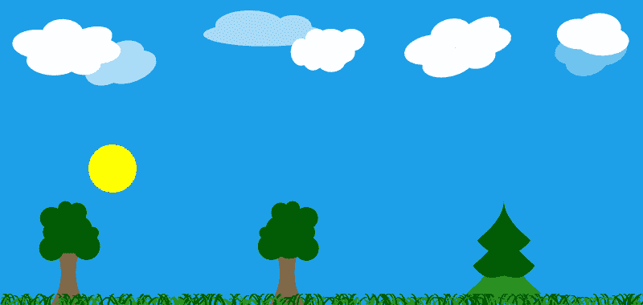

# 刚才发生了什么？

我们设置了一个非常简单的场景，由三张图片堆叠形成景观。在背景层（天空）和前景（树木）之间，我们放置了一个代表太阳的黄色圆圈。由于我们很快就会移动太阳，我们将对象的中心锚定到一个没有物理尺寸的空项上，这样我们就可以设置太阳相对于其中心的位置。我们还为场景配备了一个`dayLength`属性，它将保存有关游戏时间一天长度的信息。默认情况下，我们将其设置为 60 秒，这样事情就会发生得非常快，我们可以看到动画的进度而无需等待。在所有事情都设置正确之后，我们可以调整一天的长度以适应我们的需求。

图形设计使我们能够轻松地操作太阳，同时保持它在树线之后。注意堆叠顺序是隐式地由文档中元素的顺序决定的。

# 行动时间 – 动画化太阳的水平移动

太阳在天空中的日常巡航从东方开始，继续向西，直到在傍晚时分隐藏在地平线之下。让我们通过向我们的`sun`对象添加动画来尝试复制这种水平移动。

打开我们上一个项目的 QML 文档。在`root`项内部，添加以下声明：

```cpp
NumberAnimation {
    target: sun
    property: "x"
    from: 0
    to: root.width
    duration: dayLength
    running: true
} 
```

对程序进行这样的修改后，将产生一个太阳水平移动的运行效果。以下图像是运行过程中多个帧的组合：

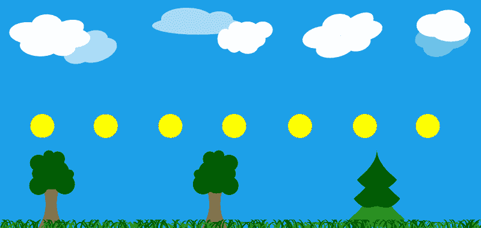

# 刚才发生了什么？

我们引入了一个`NumberAnimation`元素，该元素被设置为动画化`sun`对象的`x`属性。动画从`0`开始，直到`x`达到`root`项的宽度（这是场景的右边缘）。移动持续`dayLength`毫秒。动画的`running`属性被设置为`true`以启用动画。由于我们没有指定其他方式，所以运动是线性的。

你可能认为动画运行的方向是错误的——“西”在左边，“东”在右边，对吗？是的，然而，这只在观察者面向北方时才是这样。如果我们的场景是这样的，我们就根本看不到太阳——在正午时分，它会穿越南方方向。

# 动画组合

我们在上一个部分制作的动画看起来不错，但并不非常逼真。太阳应该在早上升起，在中午之前达到顶峰，然后，在稍后，开始向傍晚方向落下，此时它应该越过地平线并隐藏在地形之下。

要实现这种效果，我们可以为太阳的 `y` 属性添加两个额外的动画。第一个动画将从开始时立即开始，并降低太阳的垂直位置（记住，垂直几何轴指向下方，因此降低垂直位置意味着对象向上移动）。动画将在一天长度的三分之一时完成。然后我们需要一种方法来等待一段时间，然后启动第二个动画，将对象向下拉向地面。启动和停止动画很容易——我们可以在动画项上调用 `start()` 和 `stop()` 函数，或者直接更改 `running` 属性的值。每个 `Animation` 对象都会发出 `started()` 和 `stopped()` 信号。延迟可以通过定时器实现。我们可以为第一个动画的停止信号提供一个信号处理程序，以触发定时器来启动另一个，如下所示：

```cpp
NumberAnimation {
    id: sunGoesUpAnim
    // ...
    onStopped: sunGoesDownAnimTimer.start()
}
Timer {
    id: sunGoesDownAnimTimer
    interval: dayLength / 3
    onTriggered: sunGoesDownAnim.start()
} 
```

即使忽略任何可能带来的副作用（例如，如何在不启动第二个动画的情况下停止动画），这种方法也不能被称为“声明式”，对吧？

幸运的是，与 C++ 中的情况类似，Qt Quick 允许我们形成动画

运行要么相互并行或按顺序运行的组。有 `SequentialAnimation` 和 `ParallelAnimation` 类型，您可以在其中声明任何数量的子动画元素形成组。要并行运行两个动画，我们可以声明以下元素层次结构：

```cpp
ParallelAnimation {
    id: parallelAnimationGroup
    running: true

    NumberAnimation {
        target: obj1; property: "prop1"
        from: 0; to: 100
        duration: 1500
    }
    NumberAnimation {
        target: obj2; property: "prop2"
        from: 150; to: 0
        duration: 1500
    }
} 
```

同样的技术可以用来同步更大的动画组，即使每个组件的持续时间不同：

```cpp
SequentialAnimation {
    id: sequentialAnimationGroup
    running: true

    ParallelAnimation {
        id: parallelAnimationGroup

        NumberAnimation {
            id: animation1
            target: obj2; property: "prop2"
            from: 150; to: 0
            duration: 1000
        }
        NumberAnimation {
            id: animation2
            target: obj1; property: "prop1"
            from: 0; to: 100
            duration: 2000
        }
    }
    PropertyAnimation {
        id: animation3
        target: obj1; property: "prop1"
        from: 100; to: 300
        duration: 1500
    }
} 
```

段落中展示的组由三个动画组成。前两个动画作为一个并行子组一起执行。组中的一个成员的运行时间是另一个的两倍。只有当整个子组完成时，第三个动画才开始。这可以通过一个 **统一建模语言** （**UML**） 活动图来可视化，其中每个活动的尺寸与该活动的持续时间成比例：

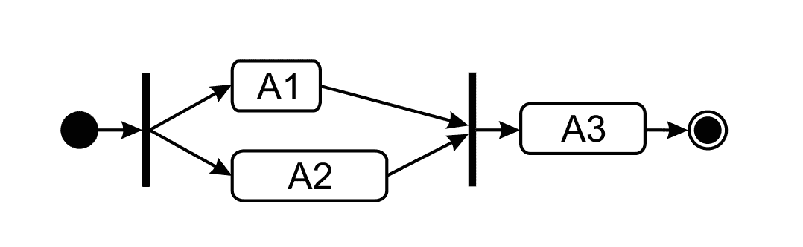

# 动作时间 - 制作日出日落

让我们通过向 QML 文档中添加一系列动画来给我们的太阳添加垂直运动（`y` 属性的动画）。由于我们的新动画将与水平动画并行运行，我们可以将两个方向的动画都包含在一个单独的 `ParallelAnimation` 组中。这会起作用，但据我们看来，这会不必要地使文档变得杂乱。指定并行动画的另一种方法是声明它们为独立的元素层次结构，使每个动画独立于其他动画，这正是我们将在这里做的。

打开上一练习中的文档，并在上一个动画下方放置以下代码：

```cpp
SequentialAnimation {
    running: true
    NumberAnimation {
        target: sun
        property: "y"
        from: root.height + sunVisual.height
        to: root.height - 270
        duration: dayLength / 3
    }
    PauseAnimation { duration: dayLength / 3 }
    NumberAnimation {
        target: sun
        property: "y"
        from: root.height - 270
        to: root.height + sunVisual.height
        duration: dayLength / 3
    }
} 
```

运行程序将在早晨使光源升起，在傍晚落下。然而，移动的轨迹似乎有些笨拙：

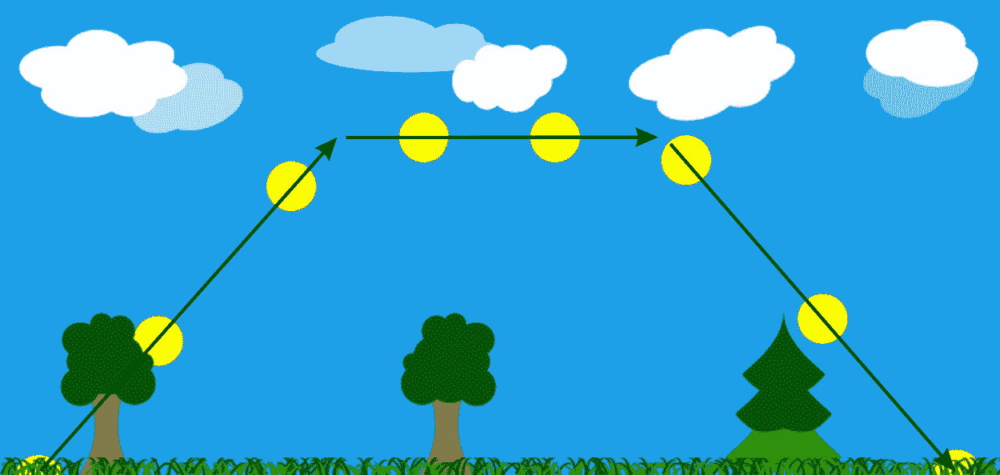

# 刚才发生了什么？

我们声明了一个包含三个动画的顺序动画组，每个动画占用一天长度的三分之一。组中的第一个成员使太阳升起。第二个成员是一个新元素类型——`PauseAnimation`——实例，它引入了一个等于其持续时间的延迟。这反过来又使得第三个组件在下午开始工作，将太阳拉向地平线。

这种声明的问题在于太阳移动的方式非常角度化，如图像所示。

# 非线性动画

描述的问题的原因是我们的动画是线性的。正如我们在本章开头所指出的，线性动画在自然界中很少发生，这通常使得它们的使用产生非常不现实的结果。

我们之前也提到过，Qt Quick 允许我们使用缓动曲线在非线性路径上执行动画。这里提供了大量的曲线。下面是一个列出可用非线性缓动曲线的图表：

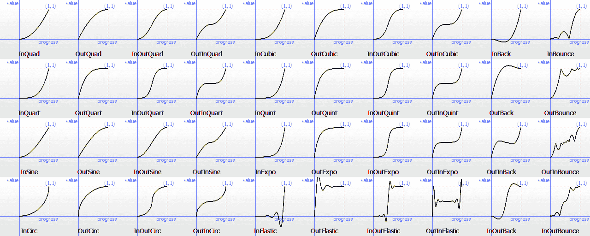

你可以使用 `PropertyAnimation` 类型或其派生类型（例如，`NumberAnimation`）的任何曲线。这是通过使用 `easing` 属性组来完成的，其中你可以设置曲线的 `type`。可以通过在 `easing` 属性组中设置多个属性进一步调整不同的曲线类型，例如 `amplitude`（用于弹跳和弹性曲线）、`overshoot`（用于回弹曲线）或 `period`（用于弹性曲线）。

声明一个沿 `InOutBounce` 路径的动画非常简单：

```cpp
NumberAnimation {
    target: obj
    property: prop
    from: startValue
    to: endValue
    easing.type: Easing.InOutBounce
    running: true
} 
```

# 行动时间 – 改善太阳的路径

当前任务将是改善太阳的动画，使其表现得更加逼真。我们将通过调整动画，使对象沿着曲线路径移动。

在我们的 QML 文档中，将之前的垂直动画替换为以下动画：

```cpp
SequentialAnimation {
    running: true
    NumberAnimation {
        target: sun
        property: "y"
        from: root.height + sunVisual.height
        to: root.height - 270
        duration: dayLength / 2
        easing.type: Easing.OutCubic
    }
    NumberAnimation {
        target: sun
        property: "y"
        to: root.height + sunVisual.height
        duration: dayLength / 2
        easing.type: Easing.InCubic
    } 
}
```

以下图片显示了太阳现在将如何移动：

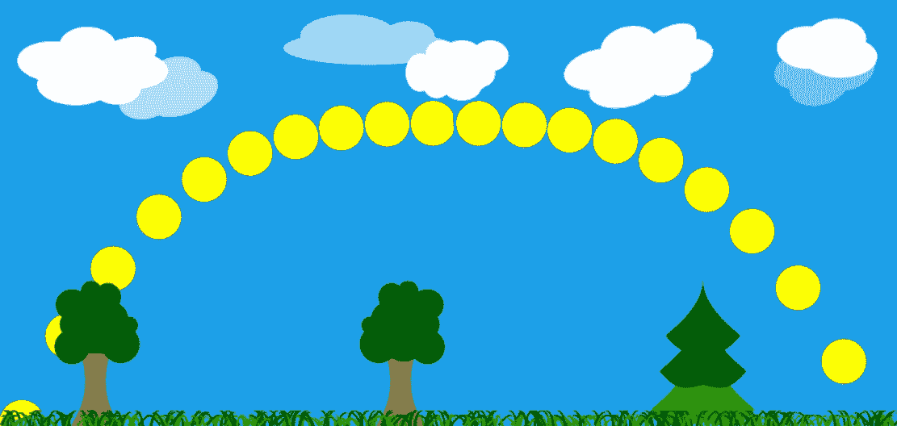

# 刚才发生了什么？

三个动画的序列（两个线性动画和一个暂停）被另一个由三次函数确定的路径的动画序列所取代。这使得我们的太阳升起很快，然后减速到几乎在太阳接近中午时几乎察觉不到的程度。当第一个动画完成后，第二个动画反转运动，使太阳缓慢下降，然后在黄昏临近时增加速度。结果，太阳离地面越远，它看起来移动得越慢。同时，水平动画保持线性，因为地球在其围绕太阳的运动中速度实际上是恒定的。当我们结合水平和垂直动画时，我们得到一条看起来非常类似于我们在现实世界中可以观察到的路径。

# 属性值来源

从 QML 的角度来看，`Animation`及其派生类型被称为**属性值源**。这意味着它们可以附加到属性并为其生成值。重要的是，它允许我们使用更简单的语法使用动画。而不是显式声明动画的目标和属性，你可以将动画附加到父对象的命名属性。

要这样做，对于`Animation`的`target`和`property`，使用`on`关键字，后跟动画要作为值源的属性名。例如，要使用`NumberAnimation`对象动画化一个对象的`rotation`属性，可以使用以下代码：

```cpp
NumberAnimation on rotation {
    from: 0
    to: 360
    duration: 500
} 
```

对于一个对象的同一属性，可以指定多个属性值源。

# 行动时间 - 调整太阳的颜色

如果你黄昏或黎明时分看太阳，你会发现它并不是黄色的，而是越靠近地平线就越变成红色。让我们通过为太阳的表示对象提供一个属性值源来让它做同样的事情。

打开 QML 文档，找到`sunVisual`对象的声明，并用下面的高亮部分扩展它：

```cpp
Rectangle {
    id: sunVisual
    // ...
    SequentialAnimation on color {
        ColorAnimation {
            from: "red"
            to: "yellow"
            duration: 0.2 * dayLength / 2
        }
        PauseAnimation { 
            duration: 2 * 0.8 * dayLength / 2 
        }
        ColorAnimation {
            to: "red"
            duration: 0.2 * dayLength / 2
        }
        running: true
    }
} 
```

# 刚才发生了什么？

我们为模拟太阳视觉特征的矩形对象的`color`属性附加了一个动画。这个动画由三个部分组成。首先，我们使用`ColorAnimation`对象从红色过渡到黄色。这是一个专门用于修改颜色的`Animation`子类型。由于矩形的颜色不是数字，使用`NumberAnimation`对象将不起作用，因为类型无法插值颜色值。因此，我们只能使用`PropertyAnimation`或`ColorAnimation`对象。动画的持续时间设置为半日长度的 20%，这样黄色就能很快获得。第二个组件是一个`PauseAnimation`对象，在执行第三个组件之前提供延迟，这个组件逐渐将颜色变回红色。对于最后一个组件，我们没有为`from`属性提供值。这导致动画以动画执行时的属性当前值启动（在这种情况下，太阳应该是黄色的）。

注意，我们只需要指定顶级动画的属性名。这个特定的元素充当属性值源，所有下级动画对象“继承”目标属性来自该属性值源。

# 行动时间 - 装饰太阳动画

目前太阳的动画看起来几乎是完美的。尽管如此，我们仍然可以改进它。如果你在清晨和中午时分观察天空，你会注意到太阳在日出或日落时比它在顶点时看起来要大得多。我们可以通过缩放对象来模拟这种效果。

在我们的场景文档中，为太阳的`scale`属性添加另一个顺序动画：

```cpp
SequentialAnimation on scale {
    NumberAnimation {
      from: 1.6; to: 0.8
      duration: dayLength / 2
      easing.type: Easing.OutCubic
    }
    NumberAnimation {
      from: 0.8; to: 1.6
      duration: dayLength / 2
      easing.type: Easing.InCubic
    }
}
```

让我们再次检查结果：

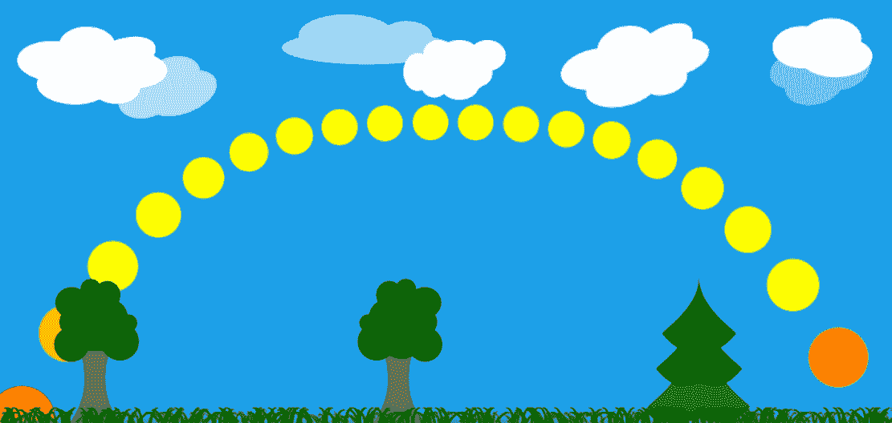

# 刚才发生了什么？

在本节中，我们只是遵循了之前声明的路径——恒星体的垂直运动影响其感知大小；因此，将两个动画绑定在一起似乎是一个明智的决定。请注意，我们可能没有为缩放指定新的属性值源，而是修改了原始动画，使缩放动画与操作`y`属性的动画并行：

```cpp
SequentialAnimation {
    ParallelAnimation {
        NumberAnimation {
            target: sun
            property: "y"
            from: root.height + sunVisual.height
            to: root.height - 270
            duration: dayLength / 2
            easing.type: Easing.OutCubic
        }
        NumberAnimation {
            target: sun
            property: "scale"
            from: 1.6; to: 0.8
            duration: dayLength / 2
            easing.type: Easing.OutCubic
        } 
        // ... 
    }
}
```

# 英雄尝试——动画太阳光线

到现在为止，你应该已经成为一个动画专家了。如果你想尝试你的技能，这里有一个任务给你。以下代码可以应用于`sun`对象，并将显示从太阳发出的非常简单的红色光线：

```cpp
Item { 
    id: sunRays 
    property int count: 10 
    width: sunVisual.width 
    height: width 
    anchors.centerIn: parent 
    z: -1 
    Repeater { 
        model: sunRays.count 
        Rectangle { 
            color: "red" 
            rotation: index * 360 / sunRays.count 
            anchors.fill: parent 
        }
    }
} 
```

结果如下图所示：

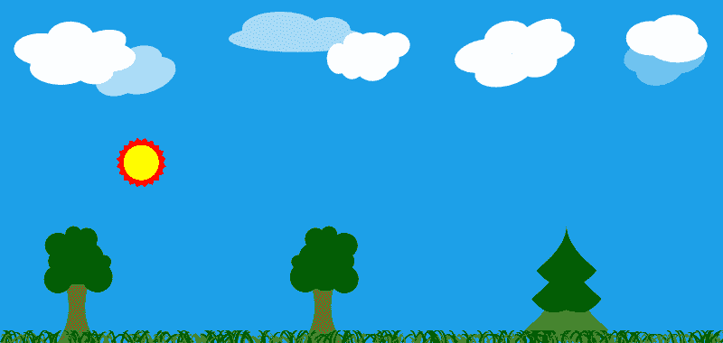

目标是使光线动画看起来整体效果良好，并与场景的调子风格相匹配。尝试不同的动画——旋转、大小变化和颜色。将它们应用于不同的元素——所有光线一次（例如，使用`sunRays`标识符）或仅应用于由重复器生成的特定矩形。

# 行为

在上一章中，我们实现了一个赛车游戏的仪表盘，其中包含多个带有指针的时钟。我们可以为每个时钟设置值（例如，汽车速度），相应的指针会立即调整到给定的值。然而，这种方法是不现实的——在现实世界中，值的改变是随着时间的推移发生的。在我们的例子中，汽车通过 11 英里/小时、12 英里/小时等逐步加速，直到一段时间后达到期望的值。我们称这为值的**行为**——它本质上是一个模型，告诉参数如何达到其目标值。定义这样的模型是声明性编程的完美用例。幸运的是，QML 公开了一个`Behavior`元素，允许我们模拟 Qt Quick 中属性变化的动态行为。

`Behavior`元素允许我们将动画与给定的属性关联起来，以便每次属性值需要更改时，它都会通过运行给定的动画而不是直接更改属性值来完成。

考虑以下代码定义的简单场景：

```cpp
import QtQuick 2.9

Item {
    width: 600; height: width
    Item {
        id: empty
        x: parent.width / 2; y: parent.height / 2
        Rectangle {
            id: rect
            width: 100; height: width
            color: "red"
            anchors.centerIn: parent
        }
    }
    MouseArea {
        anchors.fill: parent
        onClicked: { 
            empty.x = mouse.x;
            empty.y = mouse.y;
        }
    }
} 
```

这个场景包含一个锚定到空项上的红色矩形。每当用户在场景内点击某处时，空项就会移动到那里，并拖动矩形。让我们看看如何使用`Behavior`元素来平滑地改变空项的位置。类似于`Animation`和其他属性值源，`Behavior`元素可以使用 on 属性语法：

```cpp
Item {
    id: empty
    x: parent.width / 2; y: parent.height / 2
    Rectangle {
        id: rect
        width: 100; height: width
        color: "red"
        anchors.centerIn: parent
    }
 Behavior on x { 
 NumberAnimation { } 
 }
 Behavior on y { 
 NumberAnimation { } 
 }
} 
```

通过添加两个标记的声明，我们为`NumberAnimation`定义的行为定义了`x`和`y`属性的行为。我们不包含动画的起始或结束值，因为这些将取决于属性的初始和最终值。我们也没有在动画中设置属性名称，因为默认情况下，定义行为所用的属性将被使用。因此，我们得到一个从原始值到目标值的线性动画，持续时间为默认值。

对于现实世界中的对象，使用线性动画通常看起来不太好。通常，如果你为动画设置一个缓动曲线，那么它将开始缓慢，然后加速，并在完成前减速，你会得到更好的结果。

设置在行为上的动画可以像你想要的那样复杂：

```cpp
Behavior on x {
    SequentialAnimation {
        PropertyAction {
            target: rect
            property: "color"
            value: "yellow"
        }
        ParallelAnimation {
            NumberAnimation { 
                easing.type: Easing.InOutQuad
                duration: 1000
            } 
            SequentialAnimation {
                NumberAnimation {
                    target: rect
                    property: "scale"
                    from: 1.0; to: 1.5
                    duration: 500
                }
                NumberAnimation {
                    target: rect
                    property: "scale"
                    from: 1.5; to: 1.0
                    duration: 500
                }
            }
        }
        PropertyAction { 
            target: rect
            property: "color"
            value: "red" 
        }
    }
} 
```

在最后一行代码中声明的行为模型执行一个顺序动画。它首先使用`PropertyAction`元素将矩形的颜色更改为黄色，该元素执行属性值的即时更新（我们稍后会详细讨论这一点）。在模型的最后一步之后，颜色将恢复为红色。同时，执行一个并行动画。其一个组件是一个`NumberAnimation`类，它执行`empty`的`x`属性的动画（因为动画的目标和属性没有明确设置）。第二个组件是矩形的`scale`属性的顺序动画，它在动画的前半部分将项目放大 50%，然后在动画的后半部分将其缩小回原始大小。

# 行动时间 - 动画汽车仪表板

让我们运用刚刚学到的知识来改进我们在上一章中创建的汽车仪表板。我们将使用动画来展示时钟更新值时的逼真效果。

打开仪表板项目并导航到`main.qml`文件。找到负责可视化车辆速度的`Needle`对象的声明。向该对象添加以下声明：

```cpp
Behavior on rotation {
    SmoothedAnimation { 
        velocity: 50 
    }
} 
```

对左侧时钟重复此过程。将动画速度设置为`100`。构建并运行项目。观察当你修改旋转框中的参数值时，指针的行为。调整每个动画的`velocity`，直到得到逼真的效果。

# 刚才发生了什么？

我们在需要请求属性新值的针旋转上设置了属性值源。而不是立即接受新值，`Behavior`元素拦截请求并启动`SmoothedAnimation`类来逐渐达到请求的值。`SmoothedAnimation`类是一种动画类型，它动画化数值属性。动画的速度不是由其持续时间决定的；相反，设置了一个`velocity`属性。该属性决定了值改变的速度。然而，动画使用的是非线性路径——它开始缓慢，然后加速到给定的速度，在动画接近结束时以平滑的方式减速。这产生了一种既吸引人又逼真的动画，同时，根据起始值和结束值之间的距离，动画的持续时间可以是较短或较长的。

你可以通过继承`QQmlPropertyValueSource`并注册该类到 QML 引擎中来实现自定义属性值源。

# 状态

当你观察现实世界中的对象时，通常很容易通过提取对象可能采取的几个状态并分别描述每个状态来定义其行为。灯可以打开或关闭。当它是“打开”状态时，它会发出特定颜色的光，但在“关闭”状态下则不会这样做。可以通过描述对象离开一个状态并进入另一个状态时发生的情况来定义对象的行为。以我们的灯为例，如果你打开灯，它不会瞬间以全功率开始发光，而是亮度逐渐增加，在很短的时间内达到最终功率。

Qt Quick 通过允许我们为项目声明状态及其之间的转换来支持*状态驱动*开发。该模型非常适合 Qt Quick 的声明性特性。

默认情况下，每个项目都有一个匿名状态，你定义的所有属性都接受你绑定或基于不同条件强制分配给它们的表达式的值。相反，可以为对象及其每个状态属性定义一组状态；此外，在其中定义的对象可以用不同的值或表达式进行编程。我们的示例灯定义可能与此类似：

```cpp
Item {
    id: lamp
    property bool lampOn: false
    width: 200
    height: 200
    Rectangle {
        id: lightsource
        anchors.fill: parent
        color: "transparent"
    }
} 
```

我们当然可以将`lightsource`的`color`属性绑定到`lamp.lampOn ? "yellow" : "transparent"`；相反，我们可以为灯定义一个“打开”状态，并使用`PropertyChanges`元素来修改矩形颜色：

```cpp
Item {
    id: lamp
    property bool lampOn: false
    // ...
    states: State {
 name: "on"
 PropertyChanges {
 target: lightsource
 color: "yellow"
 }
 }
} 
```

每个项目都有一个`state`属性，你可以读取它来获取当前状态，但你也可以写入它以触发转换到给定的状态。默认情况下，`state`属性被设置为空字符串，表示匿名状态。请注意，根据前面的定义，项目有两个状态——“开启”状态和匿名状态（在这种情况下，当灯关闭时使用）。记住，状态名称必须是唯一的，因为`name`参数是 Qt Quick 中识别状态的方式。

要进入一个状态，我们当然可以使用在`lampOn`参数值修改时触发的事件处理器：

```cpp
onLampOnChanged: state = lampOn ? "on" : "" 
```

这样的命令式代码可以工作，但可以用状态本身的声明式定义来替换：

```cpp
State {
    name: "on"
    when: lamp.lampOn
    PropertyChanges {
        target: lightsource
        color: "yellow"
    }
} 
```

当绑定到`when`属性的表达式评估为`true`时，状态变为活动状态。如果表达式变为`false`，对象将返回默认状态或进入其`when`属性评估为`true`的状态。

要定义多个自定义状态，只需将状态定义列表分配给`states`属性即可：

```cpp
states: [
    State {
        name: "on"
        when: lamp.lampOn
        PropertyChanges { /*...*/ }

    },
    State {
        name: "off"
        when: !lamp.lampOn
    }
] 
```

在状态定义中，`PropertyChanges`元素是最常用的更改，但它并非唯一。正如`ParentChange`元素可以为项目分配不同的父元素，以及`AnchorChange`元素可以更新锚定义一样，当进入状态时也可以使用`StateChangeScript`运行脚本。

元素。所有这些元素类型都是通过在`State`对象中声明它们的实例作为子元素来使用的。

# 转换

状态机框架的第二部分是定义对象如何从一个状态转换到另一个状态。类似于`states`属性，所有项目都有一个`transitions`属性，它接受一个由`Transition`对象表示的定义列表，并提供有关在特定转换发生时应播放的动画的信息。

转换由三个属性标识——源状态、目标状态和一组动画。源状态名称（设置为`from`属性）和目标状态名称（设置为`to`属性）都可以为空，在这种情况下，它们应解释为“任何”。如果存在一个与当前状态更改匹配的`Transition`，则其动画将被执行。更具体的转换定义（其中`from`和/或`to`被显式设置）比更通用的定义具有优先级。

假设我们想在灯打开时将灯矩形的透明度从`0`动画到`1`。我们可以作为操作颜色的替代方案来做这件事。让我们更新灯的定义：

```cpp
Item {
    id: lamp
    property bool lampOn: false
    Rectangle {
        id: lightsource
        anchors.fill: parent
        color: "yellow"
        opacity: 0
    }
    MouseArea {
        anchors.fill: parent
        onPressed: {
            lamp.lampOn = !lamp.lampOn;
        }
    }
    states: State {
        name: "on"
        when: lamp.lampOn
        PropertyChanges {
            target: lightsource
            opacity: 1
        }
    }
    transitions: Transition {
        NumberAnimation {
            duration: 500
            property: "opacity"
        }
    }
} 
```

转换会触发任何源状态和任何目标状态——当灯从匿名状态变为“开启”状态以及相反方向时，它将是活动的。它定义了一个单个的`NumberAnimation`元素，该元素作用于`opacity`属性，持续 500 毫秒。动画没有定义目标对象；因此，它将为需要作为转换一部分更新的任何对象执行——在灯的情况下，它将仅是`lightsource`对象。

如果在转换中定义了多个动画，所有动画将并行运行。如果您需要顺序动画，您需要显式使用`SequentialAnimation`元素：

```cpp
Transition {
    SequentialAnimation {
        NumberAnimation { 
            target: lightsource
            property: "opacity"            
            duration: 500 
        }
        ScriptAction { 
            script: {
                console.log("Transition has ended");
            }
        }
    }
} 
```

状态是所有`Item`类型及其派生类型的一个特性。然而，使用`StateGroup`元素，可以与未从`Item`对象派生的元素一起使用状态，`StateGroup`是一个包含状态和转换的自包含功能，具有与这里描述的`Item`对象完全相同的接口。

# 更多动画类型

我们之前讨论的动画类型用于修改可以使用物理度量描述的类型（位置、大小、颜色、角度）的值。然而，还有更多类型可用。

第一组特殊动画包括`AnchorAnimation`和`ParentAnimation`元素。

`AnchorAnimation`元素在需要状态改变导致项目定义的锚点发生变化时非常有用。没有它，项目会立即跳到其位置。通过使用`AnchorAnimation`元素，我们可以触发所有锚点变化逐渐动画化。

另一方面，`ParentAnimation`元素使得在项目获得新的父元素时定义动画成为可能。这通常会导致项目在场景中移动到不同的位置。通过在状态转换中使用`ParentAnimation`元素，我们可以定义项目如何进入其目标位置。该元素可以包含任何数量的子动画元素，这些元素将在`ParentChange`元素期间并行运行。

第二组特殊动画是动作动画——`PropertyAction`和`ScriptAction`。这些动画类型不是在时间上拉伸，而是执行给定的一次性动作。

`PropertyAction`元素是一种特殊的动画，它将属性立即更新到给定的值。它通常作为更复杂动画的一部分使用，以修改未动画化的属性。如果属性需要在动画期间具有某个特定值，则使用它是有意义的。

`ScriptAction`是一个元素，允许在动画期间执行一个命令式的代码片段（通常在其开始或结束时）。

# 快速游戏编程

在这里，我们将通过使用 Qt Quick 创建平台游戏的过程。这将是一款类似于第六章中提到的本杰明大象的游戏。第六章，*Qt 核心基础*。玩家将控制一个角色，该角色将在景观中行走并收集金币。金币将在世界中随机出现。角色可以通过跳跃来获取高处的金币。

在本章以及上一章中，我们准备了一些零件，我们将为这个游戏重新使用它们。当你学习动画时安排的分层场景将作为我们的游戏场景。动画太阳将代表时间的流逝。

我们将引导你实现游戏的主要功能。在本章结束时，你将有机会通过添加更多游戏机制来测试你的技能。

# 游戏循环

大多数游戏都围绕某种游戏循环展开。这通常是一种被反复调用的函数，其任务是推进游戏——处理输入事件、移动对象、计算并执行动作、检查胜利条件等等。这种做法非常命令式，通常会导致一个非常复杂的函数，需要了解每个人的所有信息（这种反模式有时被称为**神对象**模式）。在 QML（为 Qt Quick 框架提供动力）中，我们旨在分离责任并为特定对象声明定义良好的行为。因此，尽管可以设置一个定时器，定期调用游戏循环函数，但这在声明性世界中并不是最佳方法。

相反，我们建议使用 Qt Quick 中已经存在的自然时间流动机制——它控制动画的一致性。还记得我们在本章开头定义太阳在天空中移动的方式吗？我们不是设置一个定时器并通过计算像素数来移动对象，而是创建了一个动画，为它定义了总运行时间，并让 Qt 负责更新对象。这有一个巨大的好处，就是忽略了函数执行中的延迟。如果你使用定时器，而某些外部事件在超时函数运行之前引入了显著的延迟，动画就会开始落后。当使用 Qt Quick 动画时，框架会补偿这些延迟，跳过一些帧更新，以确保尊重请求的动画持续时间。因此，你将不必自己处理所有这些。

为了克服游戏循环的第二个难点——上帝对象反模式，我们建议使用我们之前介绍的状态和转换框架，将每个项目的逻辑直接封装在项目本身中。如果你定义一个对象，使用自然的时间流动描述其在生命周期中可以进入的所有状态以及导致状态转换的动作，你就可以将包含行为的对象随意放置在任何需要的地方，从而在不同游戏中轻松重用此类定义，减少使对象适应游戏所需的工作量。

# 输入处理

游戏中的一种常见方法是读取输入事件并调用与特定事件相关的动作的函数：

```cpp
void Scene::keyEvent(QKeyEvent *event) {
    switch(event->key()) {
    case Qt::Key_Right: 
        player->goRight(); break;
    case Qt::Key_Left:  
        player->goLeft();  break;
    case Qt::Key_Space: 
        player->jump();    break;
    // ...
    }
} 
```

然而，这种方法有其缺点，其中之一是需要检查事件在等时间段内。这可能很困难，而且肯定不是一种声明式方法。

我们已经知道 Qt Quick 通过 `Keys` 附加属性处理键盘输入。可以编写类似于刚才展示的 QML 代码，但这种方法的缺点是，玩家在键盘上按得越快，角色移动、跳跃或射击的频率就越高。然而，我们可以克服这个问题，正如我们将看到的。

# 行动时间 – 角色导航

创建一个新的 QML 文档，并将其命名为 `Player.qml`。在文档中，放置以下声明：

```cpp
Item {
    id: player
    y: parent.height
    focus: true

    Keys.onRightPressed: x = Math.min(x + 20, parent.width)
    Keys.onLeftPressed: x = Math.max(0, x - 20)
    Keys.onUpPressed: jump()

    function jump() { 
        jumpAnim.start();
    }

    Image {
        source: "images/elephant.png"
        anchors.bottom: parent.bottom
        anchors.horizontalCenter: parent.horizontalCenter
    }
    Behavior on x { 
        NumberAnimation { duration: 100 } 
    }
    SequentialAnimation on y {
        id: jumpAnim
        running: false
        NumberAnimation { 
            to: player.parent.height - 50
            easing.type: Easing.OutQuad 
        } 
        NumberAnimation { 
            to: player.parent.height
            easing.type: Easing.InQuad 
        } 
    }
} 
```

接下来，打开包含主场景定义的文档，并在所有背景层声明之后，在文档的末尾声明玩家角色：

```cpp
Player {
    id: player
    x: 40
} 
```

# 刚才发生了什么？

玩家本身是一个空的项目，具有键盘焦点，可以处理右箭头键、左箭头键和上箭头键的按下，使它们能够操纵玩家的 `x` 和 `y` 坐标。`x` 属性设置了一个 `Behavior` 元素，以便玩家在场景中平滑移动。最后，锚定在玩家项目上的是玩家的实际可视化——我们的象朋友。

当按下右箭头键或左箭头键时，将计算并应用角色的新位置。多亏了 `Behavior` 元素，项目将逐渐（在一秒内）移动到新位置。保持按键将触发自动重复，处理程序将被再次调用。以类似的方式，当按下上箭头键时，它将激活一个准备好的顺序动画，将角色向上提升 50 像素，然后再次将其移回初始位置。

这种方法可行，但我们能做得更好。让我们尝试一些不同的方法。

# 行动时间 – 另一种角色导航方法

用以下代码替换之前的键处理程序：

```cpp
Item {
    id: player
    //...
    QtObject {
        id: flags
        readonly property int speed: 100
        property int horizontal: 0
    }
    Keys.onRightPressed: { 
        recalculateDurations(); 
        flags.horizontal = 1; 
    }
    Keys.onLeftPressed: {
        if(flags.horizontal != 0) {
            return;
        }
        recalculateDurations();
        flags.horizontal = -1;
    }
    Keys.onUpPressed: jump()
    Keys.onReleased: {
        if(event.isAutoRepeat) return;
        if(event.key === Qt.Key_Right) {
            flags.horizontal = 0;
        }
        if(event.key === Qt.Key_Left && flags.horizontal < 0) {
            flags.horizontal = 0;
        }
    }

    function recalculateDurations() {
        xAnimRight.duration = (xAnimRight.to - x) * 1000 / flags.speed;
        xAnimLeft.duration = (x - xAnimLeft.to) * 1000 / flags.speed;
    }
    NumberAnimation on x {
        id: xAnimRight
        running: flags.horizontal > 0
        to: parent.width
    }
    NumberAnimation on x {
        id: xAnimLeft
        running: flags.horizontal < 0
        to: 0
    } 
}
```

# 刚才发生了什么？

我们现在不是立即执行动作，而是在按下键时设置（在私有对象中）角色应该移动的方向的标志。在我们的情况下，右方向比左方向有优先权。设置标志会触发一个尝试将角色移动到场景边缘的动画。释放按钮将清除标志并停止动画。在动画开始之前，我们调用`recalculateDurations()`函数，该函数检查动画应该持续多长时间，以便角色以期望的速度移动。

如果你想要用其他东西替换基于键盘的输入，例如加速度计或自定义按钮，同样的原则也可以应用。当使用加速度计时，你可以通过测量设备倾斜的程度来控制玩家的速度。你还可以将倾斜存储在`flags.horizontal`参数中，并在`recalculateDurations()`函数中使用该变量。

# 尝试一下英雄 – 精炼动画

我们所做的工作对于许多应用来说是足够的。然而，你可以尝试进一步控制运动。作为一个挑战，尝试以这种方式修改系统，即在跳跃过程中，惯性保持角色的当前水平方向和移动速度直到跳跃结束。如果玩家在跳跃过程中释放了右键或左键，角色只有在跳跃完成后才会停止。

尽管我们试图以声明性方式完成所有事情，但某些操作仍然需要命令式代码。如果某些操作需要定期执行，你可以使用`Timer`项目按需执行一个函数。让我们一起来通过实现这种模式的过程。

# 行动时间 – 生成硬币

我们试图实现的游戏的目的是收集硬币。我们现在将在场景的随机位置生成硬币。

创建一个新的 QML 文档，并将其命名为`Coin.qml`。在编辑器中，输入以下代码：

```cpp
Item {
    id: coin

    Rectangle {
        id: coinVisual
        color: "yellow"
        border.color: Qt.darker(color)
        border.width: 2
        width: 30; height: width
        radius: width / 2
        anchors.centerIn: parent

        transform: Rotation {
            origin.x: coinVisual.width / 2
            origin.y: coinVisual.height / 2
            axis { x: 0; y: 1; z: 0 }            
            NumberAnimation on angle {
                from: 0; to: 360
                loops: Animation.Infinite
                running: true
                duration: 1000
            }
        }
        Text {
            color: coinVisual.border.color
            anchors.centerIn: parent
            text: "1"
        }
    }
} 
```

接下来，打开定义场景的文档，并在场景定义中某处输入以下代码：

```cpp
Component {
    id: coinGenerator
    Coin {}
}

Timer {
    id: coinTimer
    interval: 1000
    repeat: true
    running: true

    onTriggered: {
        var cx = Math.floor(Math.random() * root.width);
        var cy = Math.floor(Math.random() * root.height / 3)
               + root.height / 2;
        coinGenerator.createObject(root, { x: cx, y: cy });
    }
} 
```

# 刚才发生了什么？

首先，我们定义了一个新的元素类型，`Coin`，它由一个黄色圆圈组成，圆圈中心有一个数字覆盖在空的项目上。矩形应用了一个动画，使项目围绕垂直轴旋转，从而产生一个伪三维效果。

接下来，在场景中放置一个能够创建`Coin`元素实例的组件。然后，声明一个每秒触发一次的`Timer`元素，在场景的随机位置生成一个新的硬币。

# 精灵动画

玩家角色以及游戏中的任何其他组件都应该具有动画效果。如果组件使用简单的 Qt Quick 形状实现，则通过流畅地更改项目属性并使用属性动画（就像我们对`Coin`对象所做的那样）来实现动画相当容易。如果组件足够复杂，以至于在图形程序中绘制它并使用游戏中的图像比尝试使用 Qt Quick 项目重新创建对象更容易，那么事情就会变得复杂。在这种情况下，你需要一系列图像——每帧动画一个。图像需要不断替换，以制作出令人信服的动画。

# 实施简单角色动画的时间

让我们尝试以简单的方式使玩家角色具有动画效果。在这本书附带的材料中，你会找到一些不同行走阶段的 Benjamin 大象的图像。你可以使用它们，或者你可以绘制或下载一些其他图像来替换我们提供的图像。

将所有图像放在一个目录中（例如，`images`），并将它们重命名，以便它们遵循包含基本动画名称后跟帧编号的模式，例如，`walking_01`、`walking_02`、`walking_03`，依此类推。

接下来，打开`Player.qml`文档，并将显示`elephant.png`的图像元素替换为以下代码：

```cpp
Image {
    id: elephantImage
    property int currentFrame: 1
    property int frameCount: 7
    source: "images/walking_" + currentFrame + ".png"
    mirror: player.facingLeft

    anchors.bottom: parent.bottom
    anchors.horizontalCenter: parent.horizontalCenter
    NumberAnimation on currentFrame {
        from: 1
        to: frameCount
        loops: Animation.Infinite
        duration: elephantImage.frameCount * 40
        running: player.walking
    }
} 
```

在`Player.qml`的根元素中添加以下属性：

```cpp
property bool walking: flags.horizontal !== 0
property bool facingLeft: flags.horizontal < 0 
```

启动程序并使用箭头键查看 Benjamin 移动。

# 刚才发生了什么？

准备了一系列图像，遵循包含数字的常见命名模式。所有图像都具有相同的大小。这使得我们只需通过更改`source`属性的值来指向不同的图像，就可以替换一个图像。为了简化操作，我们引入了一个名为`currentFrame`的属性，它包含要显示的图像的索引。我们在字符串中使用了`currentFrame`元素，形成一个绑定到图像`source`元素的表达式。为了使帧替换更容易，我们声明了一个`NumberAnimation`元素，以循环方式修改`currentFrame`元素的值，从`1`到可用的动画帧数（由`frameCount`属性表示），以便每帧显示 40 毫秒。

如果`walking`属性评估为`true`（基于玩家对象中`flags.horizontal`元素的值），则动画正在播放。最后，我们使用`Image`参数的`mirror`属性，如果角色向左行走，则翻转图像。

前面的方法有效，但并不完美。当我们想要使移动动画更复杂时（例如，如果我们想要引入跳跃），遵循此模式的声明复杂性增长速度比所需的要快得多。但这并不是唯一的问题。加载图像并不立即发生。第一次使用某个特定图像时，动画可能会因为图形加载而暂停片刻，这可能会破坏用户体验。最后，对于每个图像动画，这里那里有一堆图片确实是杂乱无章的。

解决这个问题的方法是使用一个**精灵图**——将一组小图像组合成单个较大的图像，以提高性能。Qt Quick 通过其精灵引擎支持精灵图，该引擎负责从单个图像中加载精灵序列，对它们进行动画处理，并在不同的精灵之间进行转换。

在 Qt Quick 中，精灵图可以是由 Qt 支持的任何类型的图像，其中包含动画的所有帧的图像条。后续帧应形成一个从左到右、从上到下流动的连续线条。然而，它们不必从包含图像的左上角开始，也不必在右下角结束——一个文件可以包含多个精灵。精灵是通过提供单个帧的大小（以像素为单位）和帧数来定义的。可选地，你可以指定一个偏移量，从该偏移量读取精灵的第一个帧。以下图表可以帮助可视化方案：

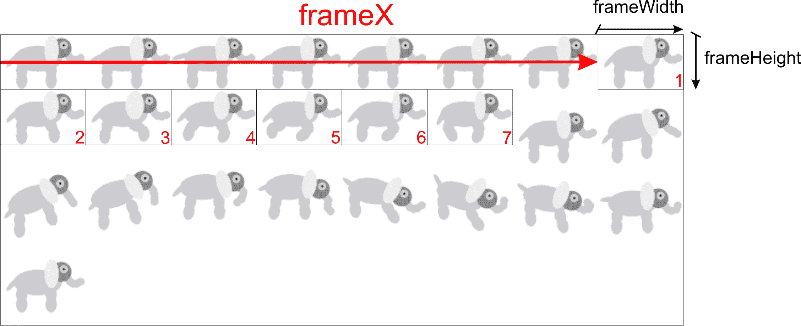

QML 提供了一个名为 `Sprite` 的元素类型，它有一个 `source` 属性，指向容器图像的 URL，`frameWidth` 和 `frameHeight` 属性确定每个帧的大小，以及一个 `frameCount` 属性定义精灵中的帧数。可以通过设置 `frameX` 和 `frameY` 属性的值来实现图像的偏移。除此之外，还有一些额外的属性；最重要的三个是 `frameRate`、`frameDuration` 和 `duration`。所有这些都有助于确定动画的节奏。如果定义了 `frameRate` 元素，它被解释为每秒循环的帧数。如果没有定义此属性，则 `frameDuration` 元素生效，并被视为显示单个帧的时间段（因此，它是 `frameRate` 元素的直接倒数）。如果没有定义此属性，则使用 `duration` 元素，它表示整个动画的持续时间。你可以设置这三个属性中的任何一个，但不需要设置超过一个。

# 行动时间 - 使用精灵进行角色动画

让我们不再等待。当前的任务是将之前练习中的手动动画替换为精灵图动画。

打开`Player.qml`文档，删除负责显示玩家角色的整个图像元素，并添加以下代码：

```cpp
AnimatedSprite {
    id: sprite
    source: "images/sprite.png"
    frameX: 560
    frameY: 0
    frameWidth: 80
    frameHeight: 52
    frameCount: 7
    frameRate: 10
    interpolate: true
    width: frameWidth
    height: frameHeight

    running: player.walking
    anchors.bottom: parent.bottom
    anchors.horizontalCenter: parent.horizontalCenter

    transform: Scale {
        origin.x: sprite.width / 2
        xScale: player.facingLeft ? -1 : 1
    }
} 
```

# 刚才发生了什么？

我们用不断变化的不同项替换了之前的静态图像。由于`Sprite`参数不是一个`Item`元素，而是一个精灵的数据定义，我们无法用它替换`Image`元素。相反，我们将使用`AnimatedSprite`元素，这是一个可以显示单帧动画精灵的项，它甚至具有与`Sprite`参数相同的属性集。我们在`images/sprite.png`中定义了一个精灵，宽度为`80`像素，高度为`52`像素。该精灵由七个帧组成，应以每秒 10 帧的速度显示。`running`

属性的设置与原始的`Animation`元素类似。作为`AnimatedSprite`，

元素没有`mirror`属性，我们通过应用一个翻转项水平方向的缩放变换来模拟它，如果`player.facingLeft`表达式评估为`true`。此外，我们设置`interpolate`属性为`true`，这使得精灵引擎在帧之间计算更平滑的过渡。

我们留下的结果与早期的尝试相似，所以如果这两个相似，为什么还要使用精灵呢？在许多情况下，你想要的动画比单帧序列更复杂。如果我们想除了走路外还要动画化本杰明的跳跃方式怎么办？嵌入更多的手动动画虽然可能，但会爆炸增加保持对象状态所需的内部变量数量。幸运的是，Qt Quick 精灵引擎可以处理这种情况。我们使用的`AnimatedSprite`元素提供了整个框架的一部分功能。通过用`SpriteSequence`元素替换项目，我们获得了精灵的全部功能。当我们谈论`Sprite`时，我们需要告诉你该对象的一个附加属性，即名为`to`的属性，它包含从当前精灵到另一个精灵的转换概率映射。通过声明当前精灵迁移到的精灵，我们创建了一个具有加权转换到其他精灵以及循环回当前状态的有限状态机。

切换到另一个精灵是通过在`SpriteSequence`对象上设置`goalSprite`属性来触发的。这将导致精灵引擎遍历图直到达到请求的状态。通过经过多个中间状态，这是一种流畅地从一种动画切换到另一种动画的绝佳方式。

你可以不要求精灵机优雅地过渡到给定状态，而是可以通过调用`SpriteSequence`类的`jumpTo()`方法并传入应开始播放的精灵名称来强制立即更改。

需要澄清的最后一件事是如何将精灵状态机实际附加到`SpriteSequence`类。这非常简单——只需将一个`Sprite`对象的数组分配给`sprites`属性。

# 行动时间——添加带有精灵过渡的跳跃

让我们在本杰明大象动画中将`AnimatedSprite`类替换为`SpriteSequence`类，为跳跃阶段添加一个要播放的精灵。

打开`Player.qml`文件，将`AnimatedSprite`对象替换为以下代码：

```cpp
SpriteSequence {
    id: sprite
    width: 80
    height: 52
    interpolate: false
    anchors.bottom: parent.bottom
    anchors.horizontalCenter: parent.horizontalCenter
    running: true

    Sprite {
        name: "still"
        source: "images/sprite.png"
        frameCount: 1
        frameWidth: 80; frameHeight: 52
        frameDuration: 100
        to: { "still": 1, "walking": 0, "jumping": 0 }
    }
    Sprite {
        name: "walking"
        source: "images/sprite.png"
        frameX: 560; frameY: 0
        frameCount: 7
        frameWidth: 80; frameHeight: 52
        frameRate: 20
        to: { "walking": 1, "still": 0, "jumping": 0 }
    }
    Sprite {
        name: "jumping"
        source: "images/sprite.png"
        frameX: 480; frameY: 52
        frameCount: 11
        frameWidth: 80; frameHeight: 70
        frameDuration: 50
        to: { "still" : 0, "walking": 0, "jumping": 1 }
    }

    transform: Scale {
        origin.x: sprite.width / 2
        xScale: player.facingLeft ? -1 : 1
    }
}
```

接下来，通过添加高亮显示的更改来扩展`jumpAnim`对象：

```cpp
SequentialAnimation {
    id: jumpAnim
    running: false
 ScriptAction { 
 script: {
 sprite.goalSprite = "jumping";
 }
 }
    NumberAnimation {
        target: player; property: "y"
        to: player.parent.height - 50
        easing.type: Easing.OutQuad
    }
    NumberAnimation {
        target: player; property: "y"
        to: player.parent.height
        easing.type: Easing.InQuad
    }
 ScriptAction {
 script: { 
 sprite.goalSprite = "";
 sprite.jumpTo("still"); 
 }
 }
} 
```

# 刚才发生了什么？

我们引入的`SpriteSequence`元素具有与`AnimatedSprite`元素相同的`Item`元素相关属性设置。除此之外，一个名为“静止”的精灵被明确设置为当前精灵。我们定义了多个`Sprite`对象作为`SpriteSequence`元素的子元素。这相当于将这些精灵分配给对象的`sprites`属性。以下图表展示了声明的完整状态机：

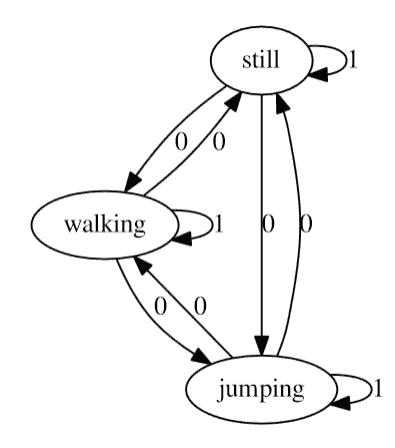

一个名为“静止”的精灵只有一个表示本杰明不动的帧。由于加权转换回“静止”状态，精灵保持在该状态下旋转。从该状态剩余的两个转换具有其权重设置为`0`，这意味着它们永远不会自发触发，但可以通过将`goalSprite`属性设置为可以通过激活这些转换之一到达的精灵来调用。

连续动画被扩展，当大象升空时触发精灵变化。

# 尝试一下英雄——让本杰明在期待中摇尾巴

为了练习精灵过渡，你的目标是扩展本杰明的`SpriteSequence`元素的州机，使他当大象站立时摇尾巴。你可以在本书附带的材料中找到合适的精灵。精灵字段称为`wiggling.png`。通过使其从“静止”状态到“摇尾巴”状态的概率性转换来实现此功能。注意确保动物在玩家激活左右箭头键时停止摇尾巴并开始行走。

# 行动时间——回顾视差滚动

我们已经在第六章中讨论了有用的视差滚动技术，*Qt 核心基础*。它通过根据层与观察者的假设距离以不同速度移动多个背景层，为 2D 游戏提供了深度感。让我们看看在 Qt Quick 中应用相同技术有多容易。

我们将使用一组移动方向与玩家移动方向相反的层来实现视差滚动。因此，我们需要定义场景和移动层。

创建一个新的 QML 文件（Qt Quick 2）。将其命名为`ParallaxScene.qml`。场景将包括整个游戏“关卡”，并将玩家的位置暴露给移动层。在文件中放入以下代码：

```cpp
import QtQuick 2.9

Item {
    id: root
    property int currentPos
    x: -currentPos * (root.width - root.parent.width) / width
} 
```

然后，创建另一个 QML 文件，并将其命名为`ParallaxLayer.qml`。让它包含以下定义：

```cpp
import QtQuick 2.9

Item {
    property real factor: 0
    x: factor > 0 ? -parent.currentPos / factor - parent.x : 0
} 
```

现在，让我们在主 QML 文档中使用这两种新的元素类型。我们将从早期的场景定义中提取元素，并将它们制作成不同的视差层——天空、树木和草地：

```cpp
Rectangle {
    id: view

    width: 600
    height: 380

    ParallaxScene {
        id: scene
        width: 1500; height: 380
        anchors.bottom: parent.bottom
        currentPos: player.x

        ParallaxLayer {
            factor: 7.5
            width: sky.width; height: sky.height
            anchors.bottom: parent.bottom
            Image { id: sky; source: "images/sky.png" }
            Item {
                 id: sun
                 //...
            }
        }
        ParallaxLayer {
            factor: 2.5
            width: trees.width; height: trees.height
            anchors.bottom: parent.bottom
            Image { id: trees; source: "images/trees.png" }
        }
        ParallaxLayer {
            factor: 0
            width: grass.width; height: grass.height
            anchors.bottom: parent.bottom
            Image { id: grass; source: "images/grass.png" }
        }

        Item {
            id: player
            // ...
        }
        Component {
            id: coinGenerator
            Coin {}
        }
        Timer {
            id: coinTimer
            //...
            onTriggered: {
                var cx = Math.floor(Math.random() * scene.width);
                var cy = Math.floor(Math.random() * scene.height / 3) +
                    scene.height / 2;
                coinGenerator.createObject(scene, { x: cx, y: cy});
            }
        }
    }
}
```

你现在可以运行游戏，并观察当玩家移动时背景层的运动：

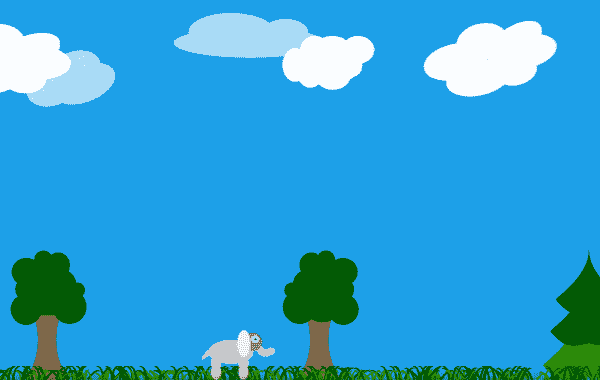

# 刚才发生了什么？

我们实现的`ParallaxScene`元素是一个移动的平面。其水平偏移量取决于角色的当前位置和视图的大小。场景滚动的范围由场景大小和视图大小的差值决定——它说明了当角色从场景的左侧移动到右侧边缘时，我们需要滚动多少，以便它始终在视图中。如果我们用场景宽度作为分数表示的角色与场景左侧边缘的距离乘以这个值，我们就会得到视图中所需要的场景偏移量（或者换句话说，场景的投影偏移量）。

第二种类型——`ParallaxLayer`——也是一个移动的平面。它定义了一个距离因子，表示背景层相对于前景（场景）的相对距离（深度），这影响了平面相对于前景（场景）滚动的速度。`0`的值意味着层应该以与前景层完全相同的速度移动。值越大，层相对于角色的移动速度越慢。偏移值是通过将场景中角色的位置除以因子来计算的。由于前景层也在移动，我们必须在计算每个视差层的偏移量时考虑它。因此，我们从场景的水平位置中减去以获得实际的层偏移量。

在逻辑上定义了层之后，我们可以将它们添加到场景中。在我们的例子中，每个层都有一个物理表示，包含天空、树木和草地纹理的静态图像。每个层都是单独定义的，可以独立存在，包含静态和动画元素，这些元素对其他层没有影响。例如，我们将太阳对象放入天空层，这样它除了播放自己的动画外，还会随着天空层移动。

最后，由于我们不再有`root`元素，我们修改了`coinTimer`处理程序，以使用`scene`元素代替。

# 尝试一下英雄垂直视差滑动

作为额外的练习，你可能还想实现垂直视差滑动，除了水平滑动。只需让场景更大，并使其除了报告`currentPos`元素的水平滚动位置外，还暴露垂直滚动位置。然后，只需重复对每一层的`y`属性的所有计算，你很快就能完成。记住，`x`和`y`的距离因子可能不同。

# 碰撞检测

Qt Quick 中没有内置的碰撞检测支持，但有三种提供此类支持的方法。首先，你可以使用 Box2D 等许多 2D 物理引擎中可用的现成碰撞系统。其次，你可以自己用 C++实现一个简单的碰撞系统。最后，你可以通过比较对象坐标和边界框直接在 JavaScript 中进行碰撞检测。

我们的游戏非常简单；因此，我们将使用最后一种方法。如果我们游戏中涉及更多的移动对象，我们可能会选择第二种方法。如果你有一个可以旋转并从其他对象反弹的非矩形对象，第一种方法是最好的。在这种情况下，有一个物理引擎在手变得非常有用。

# 行动时间 - 收集硬币

从 Qt Creator 的菜单中，访问文件 - 新文件或项目。从 Qt 类别中选择 JS 文件模板。将文件命名为`collisions.js`。将以下内容放入文档中：

```cpp
.pragma library

function boundingBox(object1) {
    var cR = object1.childrenRect;
    var mapped = object1.mapToItem(
         object1.parent, cR.x, cR.y, cR.width, cR.height);
    return Qt.rect(mapped.x, mapped.y, mapped.width, mapped.height);
}

function intersect(object1, object2) {
    var r1 = boundingBox(object1);
    var r2 = boundingBox(object2);
    return (r1.x <= r2.x+r2.width && // r1.left <= r2.right
            r2.x <= r1.x+r1.width && // r2.left <= r1.right
            r1.y <= r2.y+r2.height && // r1.top <= r2.bottom
            r2.y <= r1.y+r1.height); // r2.top <= r1.bottom
} 
```

创建另一个 JS 文件，并将其命名为`coins.js`。输入以下内容：

```cpp
.import "collisions.js" as Collisions

var coins = []

coins.collisionsWith = function(player) {
    var collisions = [];
    for(var index = 0; index < coins.length; ++index) {
        var obj = this[index];
        if(Collisions.intersect(player, obj)) {
            collisions.push(obj);
        }
    }
    return collisions;
};
coins.remove = function(obj) {
    var arr = Array.isArray(obj) ? obj : [ obj ];
    var L = arr.length;
    var idx, needle;
    while(L && this.length) {
        needle = arr[--L];
        idx = this.indexOf(needle);
        if(idx !== -1) { 
             this.splice(idx, 1);
        }
    }
    return this;
};
```

最后，打开`main.qml`文件，并添加以下`import`语句：

```cpp
import "coins.js" as Coins
```

在玩家对象中，定义`checkCollisions()`函数：

```cpp
function checkCollisions() {
    var result = Coins.coins.collisionsWith(player);
    if(result.length === 0) return;
    result.forEach(function(coin) { coin.hit() });
    Coins.coins.remove(result) // prevent the coin from being hit again
}
```

接下来，修改`coinTimer`处理程序，将新的硬币推送到列表中：

```cpp
Timer {
    id: coinTimer
    //...
    onTriggered: {
        var cx = Math.floor(Math.random() * scene.width);
        var cy = scene.height - 60 - Math.floor(Math.random() * 60);
        var coin = coinGenerator.createObject(scene, { x: cx, y: cy});
        Coins.coins.push(coin);
    }
}
```

最后，在同一个玩家对象中，通过处理玩家位置的变化来触发碰撞检测：

```cpp
onXChanged: { 
    checkCollisions();
}
onYChanged: { 
    checkCollisions();
} 
```

在`Coin.qml`文件中，定义一个动画和一个`hit()`函数：

```cpp
SequentialAnimation {
    id: hitAnim
    running: false
    NumberAnimation {
        target: coin
        property: "opacity"
        from: 1; to: 0
        duration: 250
    }
    ScriptAction {
        script: coin.destroy()
    }
}

function hit() {
    hitAnim.start();
} 
```

# 刚才发生了什么？

`collisions.js`文件包含用于进行碰撞检测的函数。文件的第一行是一个`.pragma library`语句，指出该文档只包含函数，不包含任何可变对象。此语句将文档标记为库，可以在导入它的文档之间共享。这有助于减少内存消耗并提高速度，因为引擎不需要在每次导入时重新解析和执行文档。

库中定义的函数非常简单。第一个函数根据对象的坐标和子项的大小返回对象的边界矩形。它假设顶级项为空，并包含代表对象视觉方面的子项。子项坐标使用`mapToItem`函数进行映射，以便返回的矩形以父项坐标表示。第二个函数对两个边界矩形进行简单的交集检查，如果它们相交则返回`true`，否则返回`false`。

第二个文档保存了一个硬币数组的定义。它向数组对象添加了两个方法。第一个方法——`collisionsWith`——使用在`collisions.js`中定义的函数在数组中的任何项目与给定对象之间执行碰撞检查。这就是为什么我们在文档开头导入库的原因。该方法返回另一个包含与`player`参数相交的对象的数组。另一个方法，称为`remove`，接受一个对象或对象数组，并将它们从`coins`中移除。

该文档不是一个库；因此，每个导入`coins.js`的文档都会得到该对象的独立副本。因此，我们需要确保在游戏中只导入一次`coins.js`，以便该文档中定义的对象的所有引用都与程序内存中对象的同一实例相关。

我们的主要文档导入`coins.js`，它创建用于存储硬币对象的数组，并使其辅助函数可用。这使得定义的`checkCollisions()`函数能够检索与玩家碰撞的硬币列表。对于每个与玩家碰撞的硬币，我们执行一个`hit()`方法；作为最后一步，所有碰撞的硬币都被从数组中移除。由于硬币是静止的；碰撞只能在玩家角色进入硬币占据的区域时发生。因此，当玩家角色的位置改变时触发碰撞检测就足够了——我们使用`onXChanged`和`onYChanged`

处理程序。

由于击中硬币会导致从数组中移除它，我们失去了对该对象的引用。`hit()`方法必须启动从场景中移除对象的过程。这个函数的最小化实现可能只是调用对象的`destroy()`函数，但我们做得更多——通过在硬币上运行淡出动画可以使移除过程更加平滑。作为最后一步，动画可以销毁对象。

我们在场景中跟踪的对象数量非常小，我们将每个对象的形状简化为矩形。这使得我们可以通过 JavaScript 进行检查碰撞。对于大量移动对象、自定义形状和旋转处理，基于 C++的碰撞系统会更好。这种系统的复杂程度取决于您的需求。

# 尝试一下英雄 - 扩展游戏

您可以通过在我们的跳跃大象游戏中实现新的游戏机制来磨练您的游戏开发技能。例如，您可以引入疲劳的概念。角色跳得越多，就越累，它们开始移动的速度就越慢，并且需要休息以恢复速度。为了使游戏更具挑战性，有时可以生成移动障碍。当角色撞到任何一个障碍时，它们就会变得越来越累。当疲劳超过一定水平时，角色就会死亡，游戏结束。我们之前创建的心率图可以用来表示角色的疲劳程度——角色越累，心率就越快。

这些变化可以通过许多方式实现，我们希望给您一定的自由度，因此我们不会提供如何实现完整游戏的逐步指南。您已经对 Qt Quick 了解很多，这是一个测试您技能的好机会！

# 快速问答

Q1. 以下哪种类型不能与特殊的属性语法一起使用？

1.  `Animation`

1.  `Transition`

1.  `Behavior`

Q2. 哪种 QML 类型允许您配置具有多个状态之间转换的精灵动画？

1.  `SpriteSequence`

1.  `Image`

1.  `AnimatedSprite`

Q3. 哪种 QML 类型能够防止属性值的即时更改，并执行值的逐渐更改？

1.  `Timer`

1.  `Behavior`

1.  `PropertyAction`

# 摘要

在本章中，我们向您展示了如何扩展您的 Qt Quick 技能，使您的应用程序动态且吸引人。我们回顾了将之前用 C++ 创建的游戏重新创建和改进的过程，以便您熟悉碰撞检测、状态驱动对象和时间驱动的游戏循环等概念。您现在已经熟悉了使用 Qt Quick 制作游戏所需的所有最重要的概念。

在下一章中，我们将关注使您的游戏更具视觉吸引力的技术。我们将探索 Qt Quick 提供的内置图形效果。您还将学习如何通过在 C++ 中实现的自定义绘制项来扩展 Qt Quick。这将使您能够创建任何您想象中的视觉效果。
