# 第二章：创建低多边形模型

Blender 是一个经过多次迭代才达到现在水平的复杂程序。越来越多的不同行业的专业人士正在将其作为其他知名 3D 应用程序（如 Maya、3ds Max、ZBrush 和 Modo）的替代品进行调研。此外，Blender 对于业余爱好者和负担不起上述软件许可费用的人来说是一个很好的起点。此外，Blender 拥有一个有帮助且庞大的社区，该社区创建课程和教程。**Blender Conference**（**BCON**）是一个年度活动，您可以在这里见到专业人士。

在您开始使用任何类型的软件创建 3D 内容之前，您必须做出的一个重要决定是您打算在哪里使用您的资产——这直接影响到您完成任务时将遵循的风格和工作流程。一种工作流程被称为低多边形建模，通过这种建模方式，您可以创建具有最少细节的 3D 资产。

在本章中，我们将讨论为什么与其它工作流程相比，低多边形建模可能是有益的。在了解优势之后，您将学习如何使用不同的技术创建低多边形资产。我们将通过介绍一些可能证明不可或缺的修改器来结束本章。

在本章中，我们将涵盖以下主要主题：

+   理解低多边形模型

+   低多边形模型的优势

+   创建低多边形桶

+   使用修改器自动化

# 技术要求

要遵循涉及 Blender 的章节中的说明，您必须在您的计算机上安装必要的软件。Blender 网站——更具体地说，他们的下载页面[`www.blender.org/download/`](https://www.blender.org/download/)——包含了针对您平台的说明和链接。在这本书中，我们使用的是 Blender 2.93。尽管版本 3.0 将为新用户和现有用户提供有趣和令人兴奋的选项，但当前版本完全能够为您的项目创建游戏资产，并涵盖本书中的主题。

本书使用 GitHub 存储将在 Godot 章节中使用的代码。然而，相同的仓库（[`github.com/PacktPublishing/Game-Development-with-Blender-and-Godot`](https://github.com/PacktPublishing/Game-Development-with-Blender-and-Godot)）也托管了相关章节中使用的 Blender 文件。在合理的地方，仓库将包含每个特定章节内的`Start`和`Finish`文件夹，以便您从头开始或比较您的工作进度。

# 理解低多边形模型

简而言之，一个 3D 模型被认为是低多边形的，当它使用最少的面数来制作其最显著的特征，主要是其外观和感觉。然而，让我们更详细地看看它们。

在实时应用，如游戏引擎中，你的计算机的**中央处理器**（**CPU**）和**图形处理器**（**GPU**）负责处理你在屏幕上看到的视觉信息。在过去二十年里，趋势明显倾向于 GPU 一侧，因为 GPU 专门用于一项主要任务：处理图形。

在这方面，GPU 比 CPU 有优势，并且它们不会区分 2D 和 3D 图形。然而，虽然 2D 图像包含像素信息，3D 对象是由包含定义对象所需坐标信息的数据表示的。

尽管立方体在你屏幕上渲染后仍然是一堆像素，但定义立方体的数据本质上是由八个点组成的，这些点被称为**顶点**。为了演示目的，在以下截图中，Blender 的顶点大小设置已被更改，以便你可以更容易地看到这些顶点所在的位置：

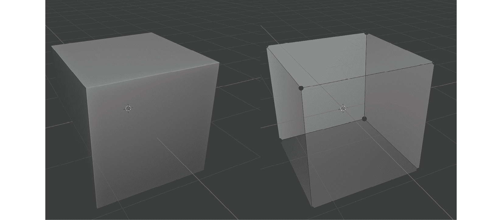

图 1.1 – 立方体的八个顶点

这两个立方体是同一个对象，但可以以两种不同的方式渲染相同的八个顶点及其相互关系：一种看起来像一个实体对象（在左侧），另一种看起来是透明的（在右侧）。所以，请记住，顶点是定义对象形状的数据点，而不是它的外观。在本章的后面部分，你将学习如何使对象看起来不同，类似于前面截图所示。

在我们讨论是什么使模型成为低多边形之前，我们必须了解一些其他基本部分。你已经看到顶点是至关重要的组成部分，但还有两个概念你必须了解：

+   边

+   面部

让我们看看这些如何与顶点相关联。通过这样做，我们将朝着理解是什么使模型成为低多边形迈进。

## 3D 模型的组成部分

**边**是连接两个顶点的部分。就是这样简单。如果你再次查看*图 1.1*，你会看到并不是所有的顶点都是连接的。然而，当它们连接时，就称为边，并且 Blender 通过从一顶点到另一顶点的直线来表示它。

**面**，正如你可能已经推断出的，当你以某种模式排列顶点或边时，是一个逻辑结果。例如，一个立方体或六面骰子有六个面。尽管*图 1.1*让你看起来需要四个边来形成一个面，但有一个更简单的方法——那就是三个边就足够形成一个面。所以，三角形是最简单的面，也称为**多边形**。

## 低或高，有什么区别？

当你设计一个模型时，你正在创建多边形。模型中多边形的密度决定了模型是否可以被认为是低多边形。以下图显示了由 Sketchfab 用户*MohammadRezae*和*DJS_05*提供的低多边形和高多边形作品样本：

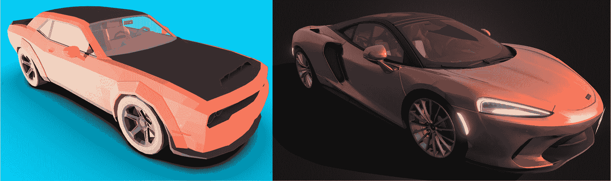

图 1.2 – 低面片与高面片模型的示例

你可以在 Sketchfab 等网站上找到许多不同面片数量的示例。

在行业中，如果你要求为你设计一个模型，你可能想要提到你希望以低面片形式完成。通常认为，如果你不提这一点，人们会假设它将尽可能多地使用面片，因为你希望你的模型尽可能详细，拥有足够的面片。所以，当你剪掉那些面片时，而不是当你保留它们时，这种区别才会被明确。

让我们再次关注我们的默认立方体。它是低面片还是高面片？它可能两者都是。虽然我们知道只需要八个顶点来创建一个立方体，但我们可以在连接原始角顶点的边缘上有更多的顶点。然而，这并不会对渲染结果产生任何影响。也就是说，电脑将需要更长的时间来渲染相同的视觉效果。

因此，如前所述，当你的模型只有足够多的面片来理解你想要设计的对象时，你将拥有一个低面片模型。

虽然 GPU 现在运行得很快，并且能够出色地渲染数百万个面片，但降低面片数可能感觉像是在走捷径，但有一些很好的理由说明为什么你可能不希望在项目中使用那么多面片。

# 低面片模型的优点

这里是一个遵循低面片建模实践的益处的快速列表：

+   面片更少

+   文件尺寸小

+   一种特定的艺术风格

+   容易原型化

+   无纹理或纹理最少

使用更少的面片当然意味着需要改变和担心的事情更少。简而言之，你将学习如何创建一个桶形模型，并在完成该练习后，你的模型将接近一千个面片。这个数字一开始可能看起来很高，但想象一下使用一个具有超过 10,000 个面片的 hi-poly 桶形模型。因此，如果你是 3D 建模的新手，低面片建模是一个很好的起点。

如果你决定修改你的模型，使用更多的面片数量将迫使你更加小心。所以，本质上，拥有更少的面片是令人安慰的，因为你将感觉你对你的创作有更多的控制。自然地，更少的面片也会导致文件尺寸更小。

艺术风格优势是优势列表中的一个非技术性项目。尽管如此，它可能是一个重要的决定。让我们专注于*图 1.3*，例如。你会看到为什么缺乏细节并不总是意味着缺乏想象力：

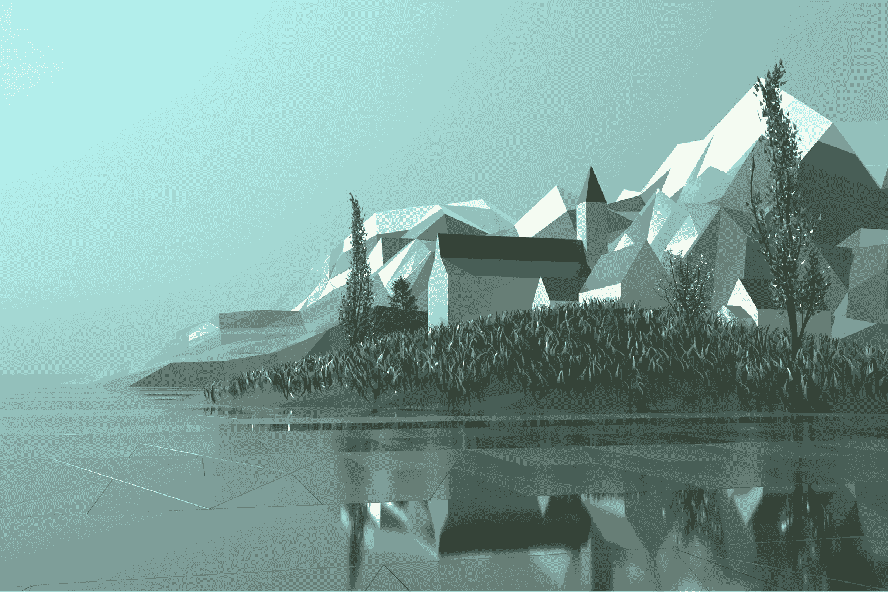

图 1.3 – 低面片模型景观

在这里，你可以看到足够的细节，可以判断出这里有一座教堂。也许这座教堂正对着一个城镇广场。山顶有一些雪。这是一个对冬季运动有吸引力的和平小镇吗？也许镇民们目前正在教堂里躲避一个恶棍？我们的想象力填补了细节。无论情况如何，无论游戏类型如何，3D 模型的低多边形方面并不会对创造力产生惩罚。事实上，在过去的几年里，我们看到越来越多的使用低多边形资产的游戏成为头条新闻。

如果你在一个小型游戏开发团队工作，或者你是唯一的开发者，你有时会想先专注于游戏机制，看看这个想法是否有趣。在这些情况下，你将希望快速原型化对象，以便将它们嵌入到你的代码中。当你正在工作的模型具有你想要设计的对象的通用形状并且有足够的细节时，你可能就完成了。这就是为什么它成为独立开发者中高度追捧的选择，因为你可以快速进入下一个模型，然后是编写你的游戏。本质上，低多边形建模就像原型设计，但它比放置一个圆锥体作为树、一个圆柱体作为桶或一个立方体作为箱子要精细几步。

列表中最后一个是**纹理**。这是一个过程，你给你的模型赋予一定的外观和感觉。沙质海滩通常看起来是黄色的。如果是岩石海滩，那么岩石可能会有不同的灰色调。因此，这主要是将颜色信息应用到你的模型表面。有时，这种颜色信息将由额外的数据补充，例如反射率、金属质感和粗糙度。我们将在下一章中了解所有这些内容。

人们常说，计算机世界中的大多数事物都是一种权衡。速度、质量和价格之间的权衡是一个常见的例子，你很可能只能得到其中的两个，而不是全部三个。尽管低多边形工作流程提供了许多好处，但也有一些局限性，但认识到这些局限性将帮助你找到解决方案或提前规划。

## 低多边形模型的局限性

如果你的模型需要显示损坏，如边缘缺失的部分或从表面吹出的某些块，那么你需要在这些区域引入更多的多边形。这仍然不会使其成为高多边形模型，但如果你喜欢一些动态细节，你必须考虑额外的多边形。

此外，如果你决定为你的低多边形模型动画，你需要在弯曲和扭曲（取决于你正在动画化的模型）的区域添加更多的多边形。

此外，由于多边形较少，你可能需要在场景的照明上发挥创意，以产生细节的错觉。尽管 *图 1.3* 中水的颜色在整个构图中都是相同的，但设计师使用了一些巧妙的方法来使场景看起来更有趣。首先，水的表面看起来是断裂的。这给人一种这种水体内有轻微运动的感觉。也许有一阵轻风。其次，一些断裂处应用了反射材料。这使得表面反射出地平线上更远处的物体。

我们将在接下来的章节中探讨如何克服这些限制，但就目前而言，让我们学习如何创建一些我们自己的低多边形模型。

# 创建低多边形桶

每个学科都有一套适合初学者的惯例。如果你正在学习一门新的编程语言，将“Hello World”输出到屏幕上是一个经典的例子。学习如何使用 3D 建模软件也没有什么不同。例如，一个桶、一个药水瓶或一个甜甜圈都可以从你熟悉的基本形状开始，比如圆柱体、圆锥体或环面。

在本节中，你将学习如何设计一个桶形，但首先，这里有一些有用的快捷键，它们将帮助你在这个章节中导航并完成我们将要介绍的任务：

+   **旋转**：中鼠标按钮 + 拖动鼠标

+   **缩放**：向前/向后滚动鼠标滚轮

+   **移动**：*Shift* + *拖动鼠标*

Blender 中有很多快捷键，一旦你积累了更多经验，就可以根据自己的喜好更改它们。说到快捷键，这本书只列出了 Windows 快捷键。然而，当你看到 *Ctrl* 键时，它指的是 macOS 中的 *Command* 键。

当你第一次启动 Blender 时，你会看到一些选项。一个重要的选项是决定使用哪个鼠标按钮来选择对象。从历史上看，默认使用的是右鼠标按钮，但你可能会觉得这不太常见。如果你已经关闭了那个初始屏幕，并且对选择操作的鼠标按钮分配不满意，你仍然可以通过转到 **编辑** 菜单并选择 **Blender 首选项** 来更改它。在 **快捷键** 部分，展开 **首选项** 部分，如图下所示；你将能够更改包括 **使用鼠标按钮选择** 在内的许多设置：

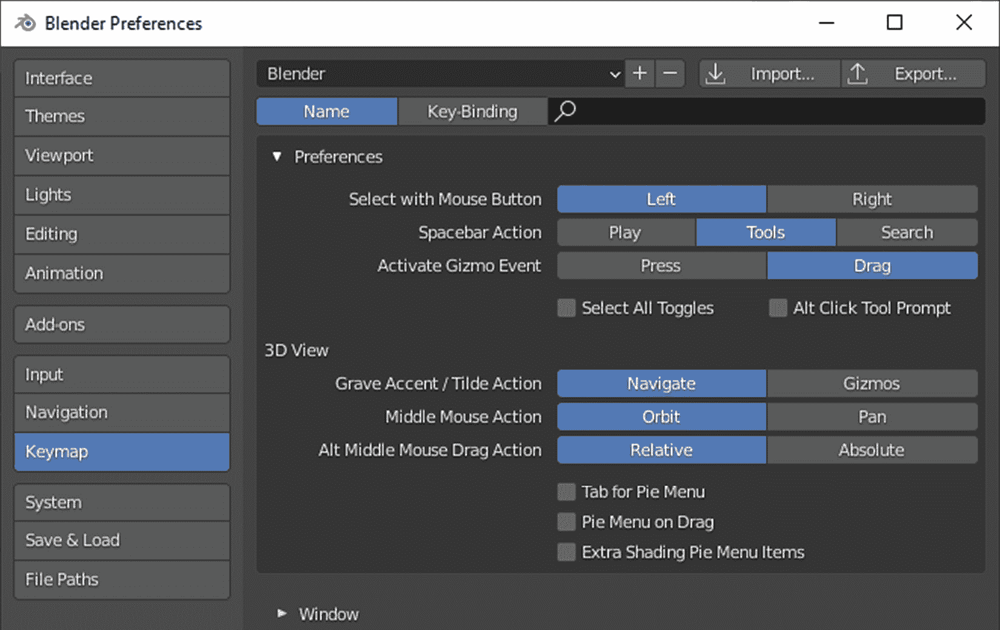

图 1.4 – Blender 的首选项窗口

说到选择按钮，无论你选择哪一侧，另一侧将保留用于将**3D 游标**移动到新位置。3D 游标是在世界中放置的一个视觉标记。当你需要在特定位置添加新元素，或者需要将某些东西对齐到某个点时，3D 游标就是那个点。我们可能会在大多数练习中保持 3D 游标的位置不变，但请记住，如果左键用于选择，那么右键用于 3D 游标，反之亦然。

官方手册

由于这本书是关于游戏开发的，我们将专注于 Blender 的一个小而相关的部分。然而，有时候查看官方手册可能是个好主意，特别是对于快捷键。Blender 网站有一个不错的用户手册：[`docs.blender.org/manual/en/2.93/`](https://docs.blender.org/manual/en/2.93/)。

建模是一个多步骤的过程。它涉及从基础开始，并在过程中添加更多细节。以下是我们将如何设计一个桶：

+   从原始形状开始

+   编辑模型

+   塑形身体

+   分离盖子

+   完成身体

+   放置金属环

+   完成盖子

这个列表仅仅是一个示例工作流程，突出了 Blender 中的一些有用部分。当你获得更多经验并找到完成你心中想法的不同顺序时，你可以以任何对你有效的方式工作。然而，你很可能会从基本形状开始。

## 从原始形状开始

Blender 中的新场景包含一个立方体、一个相机和一个光源。由于我们将要创建一个更像圆柱体的桶，我们应该去掉那个立方体：

1.  选择立方体，然后在键盘上按*X*键删除它。

1.  触发位于**对象**菜单左侧的**添加**菜单。

1.  在**网格**组下选择**圆柱体**。

添加新对象的快捷键是*Shift* + *A*，这将显示相同的选项列表。如果你想要删除其他默认对象，请随意操作，因为你总是可以使用**添加**菜单稍后添加它们。以下截图显示了你可以找到它的位置：

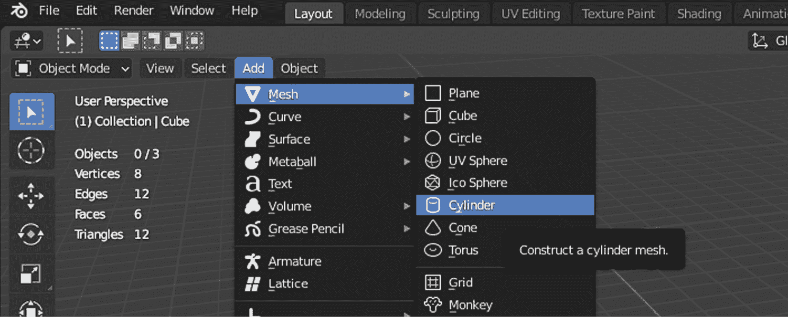

图 1.5 – 你可以向场景添加许多类型的原始形状

一旦你将圆柱体添加到场景中，你会看到圆柱体带有许多侧面；确切地说有 32 个。对于一个低多边形桶，这有很多面可以被减半，而你仍然会得到一个看起来不错的桶。

当你添加一个新对象时，屏幕左下角会出现一个面板。这个面板的标题将反映你当前尝试完成的事情。在这种情况下，它应该显示**添加圆柱体**。如果它看起来是关闭的，点击标题，它将展开以显示你可以更改的圆柱体属性。

默认选项都很好，除了顶点数量。然而，这也是一个尝试不同值并立即看到变化的好机会。当你做所有这些时，如果你点击离开你的圆柱体，该面板可能会消失。要将其恢复，请点击**编辑**菜单下的**调整最后操作**。当你觉得你已经掌握了编辑新对象属性的方法时，你可以设置相关值，如下面的截图所示：

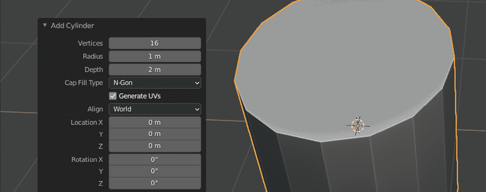

图 1.6 – 16 个面就足够创建我们的桶

添加一个如圆柱体这样的原始形状会将一个新对象引入你的场景。你已经更改了它的基本属性，如顶点数量。这个数字定义了构成顶部和底部圆的点的数量，如前面的截图所示。所有这些都是在对象级别完成的；因此，你一直在**对象模式**下工作。现在，是时候深入挖掘并编辑这个圆柱体的更细微的细节了。

## 编辑模型

每次你更改某个值时，可能感觉就像是在编辑模型。然而，从 Blender 的角度来看，并非所有编辑都是相同的。当你从原始形状开始时，你可以执行更高级的操作，例如更改定义原始形状顶点数量的数量。这正是你所看到并做到的——你一直在编辑对象。

当你想对构成对象的顶点、面和边有更多控制时，你应该切换到另一个模式，这样你就可以使用这些属性，从而可以对模型的形状有更精细的控制。

Mac 快捷键

你可以使用菜单、按钮和其他界面元素来完成工作，但最终你将依赖于快捷键。如果之前提到的快捷键对你不起作用，那么你可能需要查看 Blender 的手册，以找到适合你平台的正确组合：[`docs.blender.org/manual/en/2.93/interface/keymap/introduction.xhtml`](https://docs.blender.org/manual/en/2.93/interface/keymap/introduction.xhtml)。

选择桶并按*Tab*键。这将打开**编辑模式**。如果你继续按*Tab*键，你将在**对象模式**和**编辑模式**之间来回切换。你还会看到，Blender 的 UI 会根据当前激活的模式隐藏一些按钮和菜单或显示一些新的按钮，这意味着某些选项仅在特定模式下可用。这意味着一些选项仅在特定模式下可用。如果你想知道你刚才看到的那东西去哪了，请确保你处于正确的模式。

然后，在**编辑模式**下，按*Ctrl* + *R*触发**循环切割和滑动**。这是一个上下文相关的操作，所以如果你没有看到任何动作，那是因为鼠标没有位于该工具可以操作的面。将鼠标悬停在圆柱的不同部分上。你会看到一个黄色的线贯穿整个圆柱；线的方向取决于你的光标在那个面上的位置。当鼠标仍然悬停在侧面面上时，通过将鼠标滚轮向上滚动两次来增加切割数量到 3。这是循环切割的预览，但它们还不是圆柱的一部分。

一个循环切割需要两次鼠标点击，无论你想要多少个循环。通过**第一次点击**，你告诉 Blender 你想要引入一些切割；在这种情况下，3。**第二次点击**将最终确定这些切割的位置，但你可以通过在桶的侧面上下移动鼠标来更改它。因此，在第一次和第二次点击之间，你有一些自由度来定位切割。下面的截图显示了我们要达到的效果：

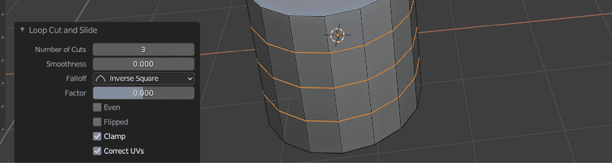

图 1.7 – 使用精确值添加更多边

如果你意外地在两次点击之间移动了光标，这可能会移动切割的基线，请不要担心。一旦添加了边缘，操作细节将会显示出来，这样你就可以微调切割在模型中的位置。重要的是将**因子**设置为**0**，以便在中间获得完美的切割。如果你在切割之前最后一刻做了更改，你也可以调整切割的数量。

你切换到**编辑模式**的主要原因是为了更好地控制你对象的形状。在仍然处于**编辑模式**的情况下，你现在将学习如何使用这些循环切割给你的对象一个桶的形状。

## 成形桶身

桶是一个如此通用的概念。然而，我们还没有讨论我们将要工作的桶的类型。从技术上讲，我们离油桶并不太远，因为它们通常看起来是圆柱形的，并且有两个圆滑的棱。然后，还有你在花园里看到的用于收集雨水的塑料桶。这些桶通常有一个平面的侧面，顶部和底部略微收缩，或者中间部分略微膨胀，具体取决于你从哪个角度看它。

我们将选择一个更经典的桶：木桶。因为我们已经有了基本形状，现在我们可以开始给我们的桶添加更多细节了。两个想法很容易浮现在脑海中。大多数桶都有几个金属环——在中间、靠近底部和顶部——以承受它们所承受的压力。此外，盖子很少与侧面齐平，更可能是内凹的，所以也许我们应该单独处理这部分。让我们一次解决这些问题。

你的 3D 对象看起来扁平吗？

如果所有这些灰色看起来没有生机！如果你觉得 3D 对象的默认外观太平，而你更愿意看到边缘像图片中那样被强调，这里有一个技巧。在**3D 视图**的右上角有一个向下看的图标按钮。如果你点击该按钮并展开**视图着色**面板，你可以将**照明**切换到**材质球**，并在面板中打开**阴影**和**凹槽**选项。将**凹槽**类型选择为**两者**也可能是一个好选项。根据你的需要调查不同的值，这样你就可以更容易地处理你的模型。

我们的桶需要一个腹部。我们需要将我们刚刚引入的这些环变宽，以创建桶的经典形状。在仍然选择这三个边缘的情况下，按*S*，输入`1.1`，然后按*Enter*以将其放大 10%。像往常一样，如果你在完成操作后想调整值，最后操作的高级调整设置将会显示。现在，我们只需要使中间环稍微大一点。

虽然我们到目前为止一直在**编辑模式**中，但我们还没有研究你可以编辑的内容。在**3D 视图**的左上角，**编辑模式**下拉菜单旁边，从左到右你会看到*顶点*、*边缘*和*面*图标。这些按钮分别有*1*、*2*和*3*作为快捷键。

通过按下中间图标或*2*切换到**边缘编辑模式**。为了创建桶的腹部，你需要选择并放大组成中间环的所有边缘，但你可能不想逐个对每个边缘进行操作。因此，我们需要看看如何选择**边缘环**。

选择边缘环有两种方法。第一种方法使用键盘快捷键：

1.  按住*Alt*键。

1.  点击一个边缘。

这应该会选择与您刚刚点击的边缘相连的所有边缘，如下面的截图所示：

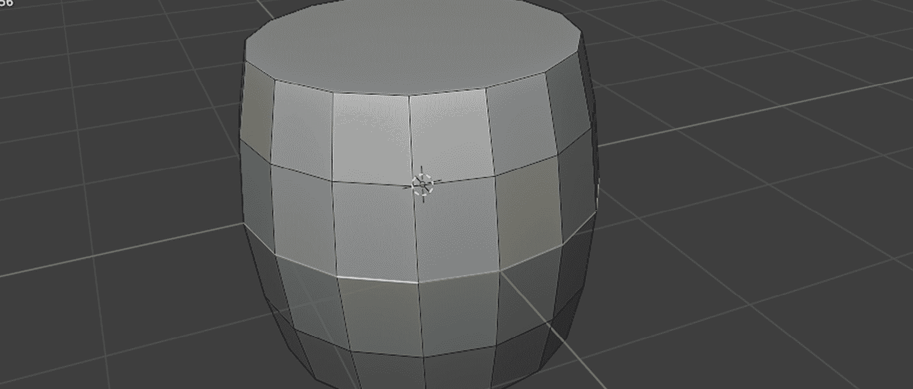

图 1.8 – 选择构成环的所有边缘很容易

第二种方法如下：

1.  选择一个边缘。

1.  前往**选择**菜单。

1.  展开**选择环**并选择**边缘环**。

无论你选择哪种方式，在选择了中间边缘环之后，你必须执行以下操作：

1.  通过按*S*来缩放它。

1.  输入`1.05`。

1.  按下*Enter*。

这应该会得到一个经典的桶形状。

然而，顶部面仍然属于圆柱体。虽然从概念上讲，盖子可能被认为是桶的一个基本部分，但从编辑的角度来看，它必须被视为一个单独的对象。让我们学习如何分离部分以单独编辑它们。

## 分离盖子

要创建盖子，首先，确保你仍然处于**编辑模式**。通过点击**编辑模式**下拉菜单旁边的第三个图标或按*3*切换到面选择模式。然后，执行以下操作：

1.  选择顶部面。

1.  按下*P*。

1.  选择**选择**。

这将分离顶部面并使其成为一个单独的对象。

或者，你可以在**网格**菜单下的**分离**组中展开。以下截图显示了如果你使用菜单进行分离，你可以找到此选项的位置：

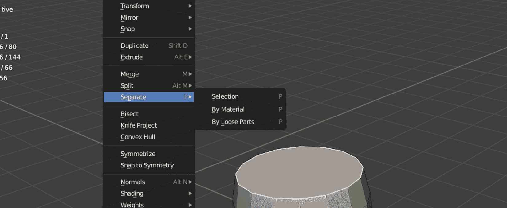

图 1.9 – 分隔事物有时是必要的，实际上也是有益的

快捷键

到目前为止，你可能已经注意到 Blender 使用了很多快捷键。一开始可能很难学习和记住所有这些快捷键。如果你对想要对网格、顶点、边等操作有一个大致的想法，你应该查看顶部附近的相关菜单，看看有哪些操作可用。按下一个快捷键将只显示那些菜单的相关部分，但调查这些菜单并查看快捷键可能是一个很好的练习。

例如，*P* 键用于分隔事物，但存在三种分隔类型，所以你仍然需要最终决定类型。然而，使用快捷键仍然比展开菜单要快。

现在可能是介绍你认识**大纲**（位于右上角）的好时机。以下截图显示了你现在场景中存在的所有对象：

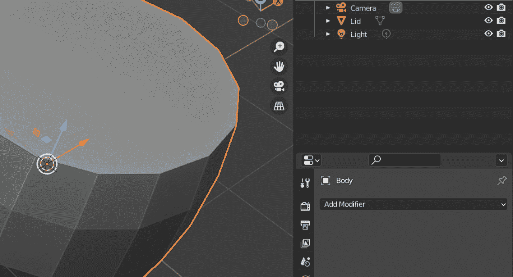

图 1.10 – 盖子和主体应该是两个独立的对象

如果你保留了场景中的**相机**和**光源**对象，你可以忽略它们，因为我们将在本书的后面部分发现这两个对象的作用。随着时间的推移，当你创建更多对象时，你将想要给你的对象命名，这样你就可以在**大纲**中轻松找到它们。

现在我们来试试。双击`主体`的标签。对**Cylinder.001**也做同样的事情，将其标记为**盖子**。你还会注意到，在**大纲**中单击标签将选择**3D 视口**中的对象，反之亦然。最后，点击那个眼睛图标暂时隐藏盖子。一旦我们处理完主体，我们将最终确定盖子。

## 完成主体

你认为桶体有什么问题或缺失的地方？它看起来很薄，不是吗？如果有一种方法可以拉伸每个面，并填充间隙，使其看起来更坚固，那会怎么样！到目前为止，你一直在选择边和面。你可以遵循类似的流程选择一些面，复制它们，并将它们移动到周围以给主体增加厚度。这很有吸引力，但让我们找到一种简单的方法来使主体变得坚固。

对于这个，你需要启用**修改器**面板。修改器是一种提供非破坏性更改对象的方法。你将在*使用修改器自动化*部分了解到其中的一些。 

在**3D 视口**右侧有一个扳手图标，它将允许你添加修改器。以下是你必须采取的步骤，以赋予桶体实质内容：

1.  切换到**对象模式**。

1.  选择**主体**对象。

1.  打开**修改器**面板。

1.  从**添加修饰符**下拉菜单中选择**实体化**。

修饰符会改变对象，所以即使你在**编辑模式**下工作，使用修饰符时也会看起来像你正在**对象模式**下编辑该对象。你将在本章后面部分发现一些修饰符。现在，下面的截图显示了**实体化**修饰符正在做什么。Blender 中的大多数东西都附带了很多可以调整的值，但你现在只需要更改**实体化**选项中的**厚度**值：

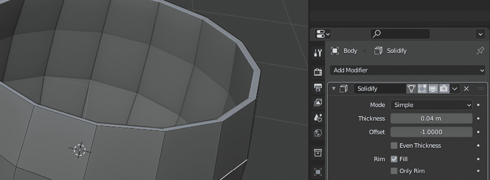

图 1.11 – 我们的大炮开始看起来更坚固

`0.03 m`或`0.04 m`的值可能多大才合适。你可以选择行业标准厚度，或者选择一个看起来视觉上吸引人的值。根据你正在制作的游戏类型，或者你是否在为客户创建资产，你可以选择最适合资产的方法。

关于单位的讨论

如今，世界上大多数地方都在使用公制系统。然而，如果你是因为默认选项或者个人偏好，你可能在你的 Blender 副本中设置了**英制**单位。在这本书中，我们将使用**公制**系统。你可以在右侧第五个标签页内找到**单位**面板。这个标签页包含一个圆锥形、一个球体以及看起来像点的图标。

修饰符非常有帮助，但有时你需要亲自动手。这意味着修饰符能为你做的事情有限。例如，我们现在需要在身体周围放置金属环。没有修饰符能为你做这件事。不过，我们仍然可以利用修饰符。但首先，让我们创建一些金属环。

## 放置金属环

现在的大炮有一些实体感，但缺少金属环。创建另一个圆柱体并调整其大小以看起来像环需要太多工作，并且需要精确度。有一个更简单的方法可以利用大炮的几何形状。你将使用你已经看到的一些熟悉的方法：环切、环选择和分离。

在**编辑模式**下，在身体底部和第一个边缘环之间创建一个环切。对于另一个环切，你将在顶部边缘和下面的环之间创建切割。最终，你将创建两个环切，如下面的截图所示

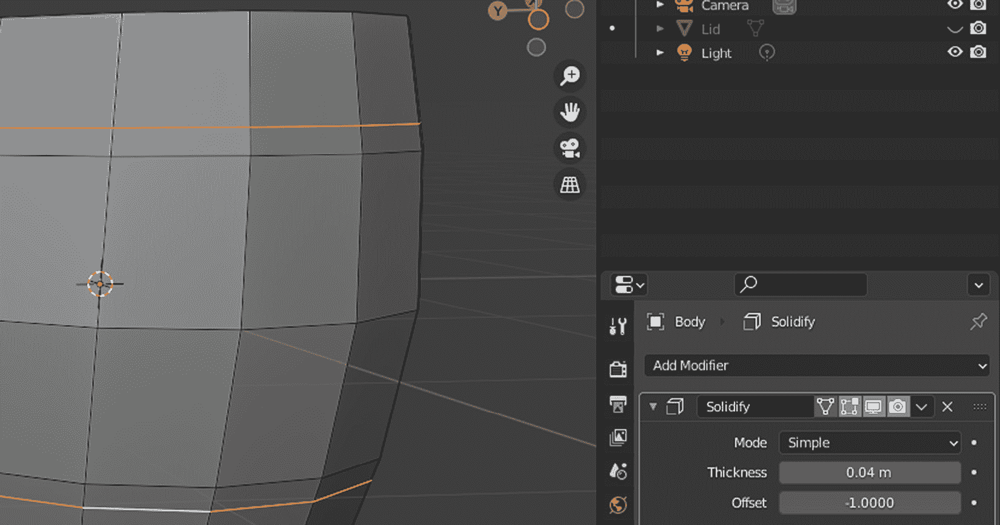

图 1.12 – 从两端分别切下的两个部分，接近中间部分

你已经看到了如何选择边缘环：这涉及到按住*Alt*键并点击一个边缘。你将做类似的事情，但这次是为了选择面环。为此，确保在**编辑模式**下点击了面图标。或者，在**编辑模式**下，你可以按*3*。

当您按住 *Alt* 键并点击一个边缘时，您将选择与您刚才点击的边缘相邻的面。它还会选择其他方向相似的面以完成一个循环。尝试用水平和垂直边缘进行几次操作，看看循环的方向如何相应地改变。

您必须做的是选择组成靠近桶体顶部和底部的两个环的所有面。以下截图显示了应该选择哪些面，以便您可以将其分离形成金属环：

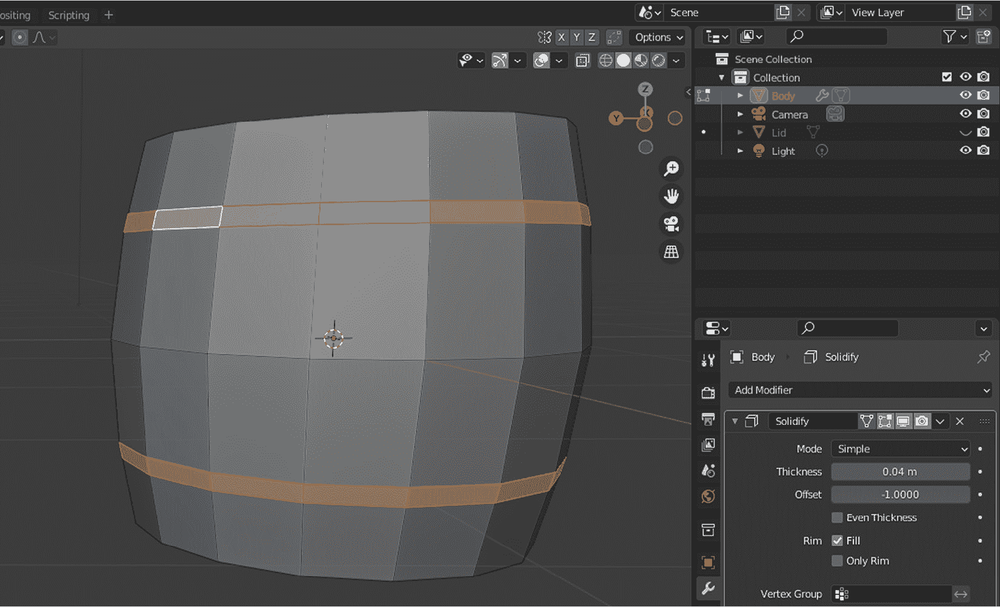

图 1.13 – 您必须选择某些内容，以便您可以将其分离

一旦您选择了第一个环，您可以按住 *Shift* 并重复之前的操作，以继续向您的选择中添加更多环。

现在，您已经准备好分离那些面了。按 *P* 键调出 **Separate** 选项并选择 **Selection**。现在，您可以重命名新创建的 **Ring** 对象。如果您回到 **Object Mode**，您会看到您可以单独选择每个对象。选择环；您会看到这个新对象也存在 **Solidify** 修改器。这不是很方便吗？

修改器中的厚度值是相同的，但如果我们改变该值的符号会发生什么？如果您点击 `-0.04 m`。如您所见，它仍然是相同的厚度，但在相反的方向上——看起来我们终于在我们的桶体周围有了那些金属环！

现在，让我们学习如何为中间部分添加另一个环。您可以遵循类似的步骤创建两个额外的环，一个在中心环上方，一个在下方。然而，您可以做得更好。

通过执行边缘环操作并触发 **Edge** 菜单下的 **Offset Edge Slide** 选项或按 *Shift* + *Ctrl* + *R* 来选择中间边缘。这与 **Loop Cut and Slide** 非常相似，但它有两个主要区别。首先，此操作将考虑一个边缘为其基线，并将新边缘向相反方向移动。其次，当您对新的边缘位置满意时，您只需点击一次。如果您在使用鼠标时遇到灵敏度问题，将操作属性中的 **Factor** 值设置为 **0.1** 可能是一个不错的选择。

我们将遵循类似的程序：选择和分离。在面编辑模式下，您将通过点击位于您新环之间的一侧垂直边缘，使用 *Alt* + *Shift* 的组合。在您分离中间面之后，您将面临一个重要的决定：您是否应该重命名您的新对象，并在其修改器中反转厚度的方向，就像您为上环和下环所做的那样？本质上，您希望您的新对象与它的同伴结合。这正是您接下来将要做的，但会使用一个巧妙的技巧，而不会重复自己。

哪种模式？

在建模过程中，有时你需要编辑模型的一部分。在这种情况下，处于 **Edit Mode** 将是必要的。然而，当你从模型中分离出块时，你很可能想回到 **Object Mode** 来处理这个新对象。所以，在这些模式之间来回切换将是必要的，并且一段时间后感觉会很自然。

在 **Object Mode** 中，首先，你必须选择你刚刚创建的中间环形。你不需要重命名它；你很快就会明白原因。你必须通过按住 *Shift* 并在 **3D Viewport** 中点击环形来添加一个额外的对象到你的选择中。确保你的最后一次点击是在你之前创建的环形对象上。在这个时候，点击的顺序很重要。你最后与之交互的对象将被 Blender 视为活动对象。它将用黄色轮廓标记，与橙色轮廓的对象相比，这些对象是选择的一部分，但不是活动对象。

一旦你以正确的顺序选择了环形，你必须通过按下 *Ctrl* + *J* 来将它们连接起来。你注意到刚才发生了什么吗？让我们来分析一下：

+   你在 **Outliner** 中再也看不到 **Body.001** 了

+   **Ring** 对象已将 **Body.001** 接纳为同伴

+   **Ring** 对象的 **Solidify** 修改器已应用于 **Body.001**

由于所有这些单独的部分现在被视为一个整体，因此不再有单独的部件，如下面的截图所示：

图 1.14 – 一枚戒指将它们全部连接在一起

随着你对 Blender 的信心增强，你会发现你可以遵循不同的方法来实现相同的结果。没有正确或错误的方法，而是节省时间的习惯，你将发展出自己的习惯，因为每个设计师都有他们做事的偏好方式。有时，其他技术或艺术上的考虑会限制你的工作流程。然而，作为一个初学者，你应该观察其他艺术家是如何创建类似对象的。幸运的是，有很多例子可以参考，所以学习、实验，并在过程中进行创新。

之前，你需要分开盖子。之后，你对主体进行了修改，甚至添加了环形。现在，是时候给你的桶盖上盖子了。

## 完成盖子的制作

如果你分开盖子后将其隐藏，你可以点击 **Outliner** 中的眼睛图标来打开它。你需要进行基本的缩放操作来将盖子放置到正确的位置。为了实现这一点，首先，选择盖子，然后执行以下操作：

1.  按下 *S* 键。

1.  输入 `0.96`。

1.  按下 *Enter*。

为什么是这样一个精确的值？因为我们一直在使用 **Solidify** 修改器中的 `0.04 m`。所以，我们应该将盖子的比例减少 4%。这将使我们免于对齐盖子的所有边缘，使它们与桶的内侧齐平。如果你在你的修改器中使用了不同的值，你必须在这个步骤中补偿你的比例值，以便最终两者相加等于 1。

你做到了！当盖子放在正确的位置，看起来正好在边缘水平以下时，桶就完成了。查看以下截图，并将其与你的作品进行比较：

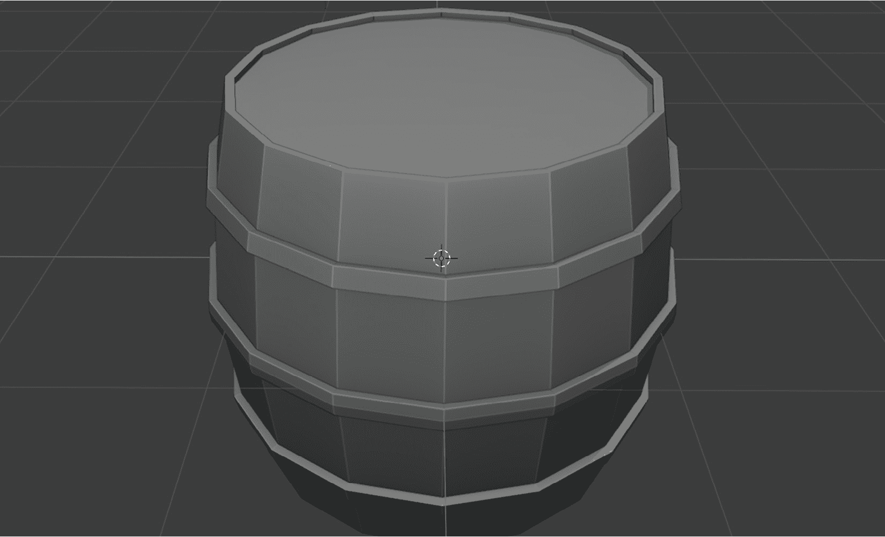

图 1.15 – 一只木制的——相当灰的——桶，光彩照人

如果你决定再次从头开始创建这个桶，也许你可以将上环放在盖子附近，下环放在底部。放置五个环也是可能的，但你可能需要调整每个环的高度，以防组合看起来过于杂乱。

到目前为止，你已经使用了一个修饰符，并且它已经很好地为你服务了。让我们深入了解更多的修饰符，看看它们可以有多么强大。

# 使用修饰符自动化

修饰符是一种非破坏性的方法，可以将操作应用于对象以改变其几何形状。当你不想重复执行步骤或操作足够复杂以至于不想直接改变对象的几何形状时，这通常是一个更好的选择。

当你应用了**实体化**修饰符时，你可能已经看到还有很多其他的修饰符。你能想象每个修饰符能做什么吗？你打算连续使用几个修饰符吗？是的，你没有看错。你可以堆叠很多修饰符，并且几乎不费吹灰之力地创建出复杂的形状。

然而，有一个重要的细节你必须注意——它们的顺序很重要！新的修饰符总是添加到堆栈的底部，并且它们与堆栈中之前的修饰符一起工作。因此，效果是累积的。如果你逻辑地堆叠你的修饰符，你可以在很短的时间内仅使用几个原始对象就创建出像以下截图中显示的如此复杂的形状：

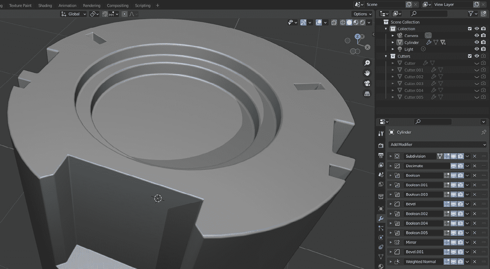

图 1.16 – 修饰符帮助你轻松创建出如此复杂的形状

这个对象使用了诸如圆柱体和立方体这样的原始形状，但结果看起来很有趣。这要归功于一个长长的修饰符列表以及它们的使用顺序。一些修饰符已经以不同的值应用了多次，但这里有一个列表：

+   **细分**

+   **减少**

+   **布尔运算**

+   **斜面**

+   **镜像**

+   **加权法线**

在撰写本文时，Blender 有超过 50 个修饰符。描述每一个可能会填满一本书。你很可能会坚持使用**生成**类别中的修饰符。以下是一组你将经常使用的修饰符：

+   **布尔运算**：这是那些经常使用且包含三种子模式的修饰符之一：

    +   **差异**：从一个对象的值中减去另一个对象的值

    +   **并集**：将两个对象合并

    +   **交集**：只保留两个网格共有的部分

+   **斜面**: 有时候，你可能想要更多的细节，尤其是在尖锐的边缘，这样它们看起来不会太生硬——光源可以反射的表面越多，眼睛看起来就越真实。如果你想要软化那些尖锐的角落，这个修改器也可以应用于顶点。

+   **阵列**: 这会在不同的轴上复制分配给它的对象，如果你愿意，可以带有一些偏移。你可以有固定数量的副本，或者用尽可能多的副本填充特定的长度。

+   **镜像**: 这就像**阵列**修改器一样，但它沿着你选择的轴创建一个副本。你可以选择多个轴。因此，你可以从一个对象的四分之一开始，并在 X 轴和 Y 轴上镜像它，这样你就有了一个完整的对象。这允许你将更改保持在原始四分之一的最小范围内，以便你可以将更改镜像到网格的其余部分。

当你添加修改器时，有时并不明显应该按什么顺序堆叠它们。幸运的是，你可以通过使用修改器标题部分中的按钮来改变它们的顺序或暂时禁用它们。

在创建桶的环时，你可以使用不同的技术来达到相同的结果：**挤出**。这需要你选择需要挤出的内容——在这种情况下，构成环的所有面——并沿着每个面的外向方向挤出。本质上，挤出是一个术语，用于移动顶点、面或边。

与经典方法（如推拉顶点和面）相比，修改器有一个很大的优势。如果你稍后回来进一步微调你的更改，这不是很方便吗？如果你现在选择了盖子，然后回到**主体**对象，修改器仍然会在那里。你不会在永久网格修改技术（如挤出）中有这种灵活性。

# 摘要

在本章中，你了解了低多边形建模的好处。然后，你从一个原始圆柱体创建了一个木桶，并加入了修改器。尽管纹理可以使你的模型看起来更真实，但你也知道你可以不使用它们。

作为练习，你可以自由地创建一个药水瓶。你可以从一个圆柱体开始，就像你为桶做的那样。通过切割环和调整缩放值，你可以给它一个锥形形状。这是你练习修改器的机会。如果你想看看完成的例子并比较你的作品，这本书的 GitHub 仓库中有一个完成的药水瓶等你查看。

在建模过程中，许多专业人士经常使用一些快捷键。以下是你已经使用过的列表：

+   *Shift* + *A*: 添加一个对象

+   *Tab*: 在**编辑模式**和**对象模式**之间切换

+   *Ctrl* + *R*: 引入环切

+   *Ctrl* + *J*: 连接

+   *S*: 缩放

+   *P*: 分离

在下一章中，你将学习如何将材质应用到你的模型上，这样你的模型的部分仍然可以有不同的外观和感觉，即使没有纹理。

# 进一步阅读

该章节的标题建议阅读资料，但有时亲眼所见甚至更佳。正如一张图片胜过千言万语，一段视频可能胜过千张图片。因此，这里有一份可能对所有级别 Blender 实践者有用的视频内容 URL 列表：

+   [JoshGambrell 的 YouTube 频道](https://www.youtube.com/c/JoshGambrell)

+   [CurtisHolt 的 YouTube 频道](https://www.youtube.com/c/CurtisHolt)

+   [GrantAbbitt 的 YouTube 频道](https://www.youtube.com/c/GrantAbbitt)

+   [SouthernShotty 的 YouTube 频道](https://www.youtube.com/c/SouthernShotty)
