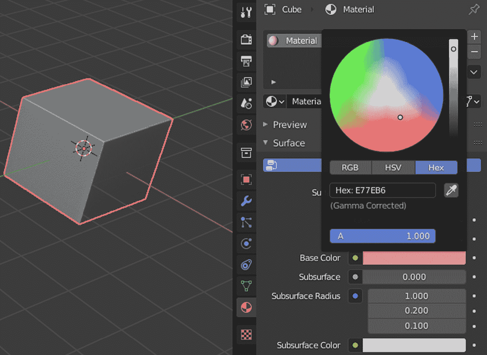
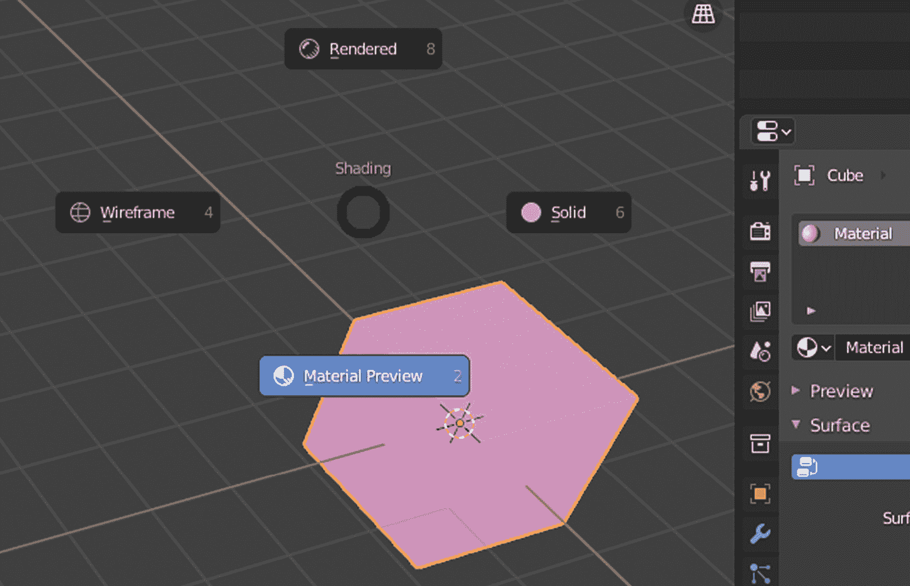
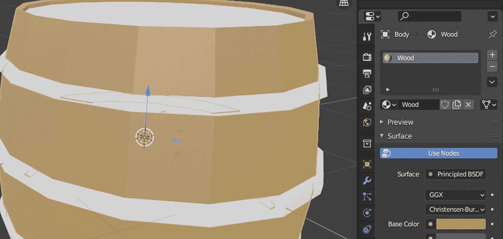
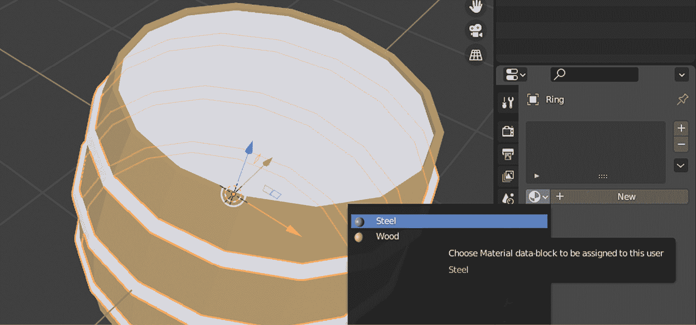
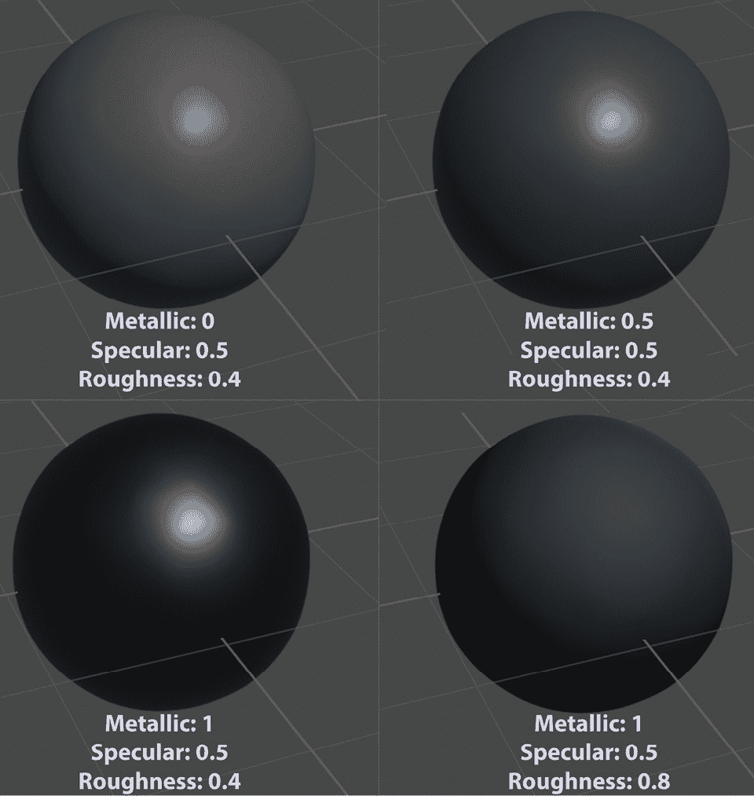
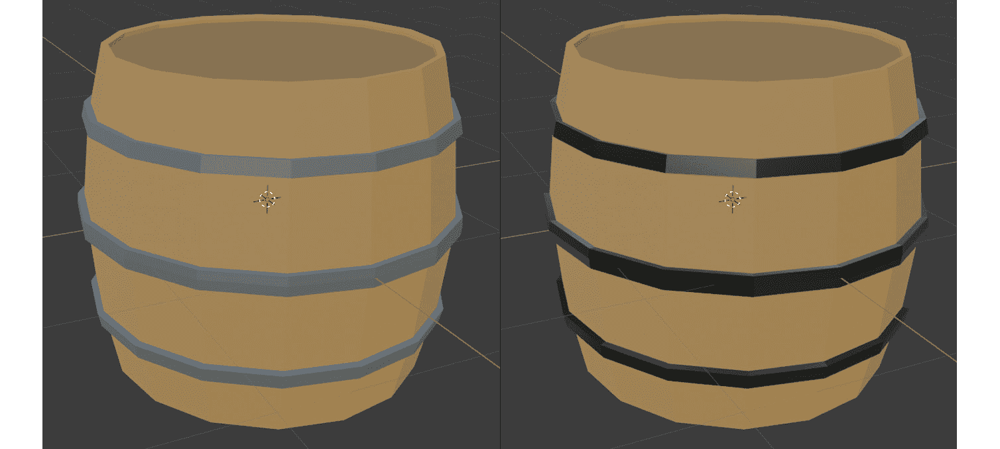

# 第三章：构建材质和着色器

根据维基百科，材质是由物质或物质的混合物构成的，这些物质构成了一个对象。这个定义对于现实生活中的对象也是正确的，对于你使用一些额外技术细节创建的电子模型也是如此。让我们看看我们这个环境中材质的定义。

在 Blender 中，**材质**基本上是包含大量数字、颜色和纹理以及其他有用内容的容器，最重要的是**着色器**本身。着色器是一段代码，它告诉渲染引擎（无论是 Blender 的还是 Godot 引擎的）如何处理材质的属性。

从本质上讲，材质就像是一个装满小物品的盒子，它附带一份用户手册（着色器），以便你使用的软件知道如何处理这些小物品。

你现在已经知道了材质和着色器的原始定义，但它们是用来做什么的呢？你在上一章创建的桶形物体上有*金属环*和*木条*，这些赋予了它形状。然而，模型中的所有东西看起来相当灰暗。向你的模型添加材质将通过显示你从现实生活中熟悉的颜色和其他属性来增强其形状。

在本章中，你将学习如何通过应用材质让你的模型看起来更真实。为此，我们将涵盖以下主题：

+   介绍材质

+   创建材质

+   分配材质

+   发现着色器

到本章结束时，你将了解如何创建和分配不同的材质，并理解着色器在这个过程中是如何发挥作用的。

# 技术要求

虽然本章是关于材质的，但你至少需要一个 3D 模型。这可以是你的完成作品，来自*第一章*，*创建低多边形模型*。或者，你可以使用本书 GitHub 仓库中`Chapter 2`文件夹的`Start`文件夹中的桶形模型：[`github.com/PacktPublishing/Game-Development-with-Blender-and-Godot`](https://github.com/PacktPublishing/Game-Development-with-Blender-and-Godot)。

# 介绍材质

如我们在引言中提到的，材质被分配给对象。然而，你无法将材质分配给所有对象。当你启动一个新的 Blender 文件时，它包含一个立方体、一个摄像机和一个光源对象。从 Blender 的角度来看，这些对象中只有一个具有实质内容，那就是立方体。让我们更深入地分析一下，了解为什么这很重要。尽管摄像机和光源在现实生活中具有物理属性并且占据空间，但在 Blender 中并非如此。它们是概念性的对象。

相机是一个让你看到世界的工具。所以，你无法看到相机本身的视觉属性。无论相机是涂成红色还是蓝色，都没有关系。同样，光源发出明亮或昏暗的光，有时带有某种颜色，但它不会占据 Blender 场景中的空间。因此，如果没有物质，我们就不能将这些两个物体应用材质。

只要有一种更简单的方法知道哪些物体可以接收材质就好了...

如果你依次选择每个默认对象，你会看到一些图标在屏幕右侧的视图中时隐时现。由图标表示的不同选项集堆叠在**属性**面板中。此面板将显示所选对象的相应属性。

当你选择立方体时，你会注意到**属性**面板引入了许多图标，这些图标与相机或光源的图标不同。要么将鼠标悬停在图标上以查看其标题，要么简单地点击图标以快速查看你拥有的选项。在这个过程中，你最终会发现倒数第二个图标，它应该会打开**材质**面板（如果你需要以后记住它，它看起来像是一个带有棋盘图案的球体图标）。

你还没有创建材质。然而，Blender 从一个默认的立方体开始，它带有默认的材质。让我们学习如何更改其颜色。在选择了立方体之后，按照以下步骤操作：

1.  在**属性**面板中打开**材质**选项卡。

1.  点击**基础颜色**右侧的彩色矩形。

1.  从色轮中选择不同的颜色。

以下屏幕截图将帮助你找到所有这些。一旦你选择了颜色，最初这个变化不会应用到立方体上；你很快就会知道原因：



图 2.1 – 颜色是你可以为材质更改的许多事物之一

在选择颜色时，色轮会帮助你。然而，如果你想更精确地选择颜色，色轮下方的三个按钮（**RGB**、**HSV**和**Hex**）可以提供帮助。在先前的屏幕截图中，使用了**Hex**模式下的**E77EB6**值。所有这些颜色模式都像单位一样，但当你在不同模式之间切换时，结果总是相同的颜色。

面板和设置

在 Blender 中工作并不意味着你总是必须直接修改模型的几何形状（顶点、边和面）；你经常会发现自己正在寻找设置并在许多面板中更改它们。在这本书的后面部分，当你与相机和光源等对象一起工作时，你会使用适当的面板，以便可以调整这些对象的设置。

让我们来弄清楚你最后做的更改为什么没有在屏幕上反映出来。默认情况下，Blender 将模型显示为实体对象。有时，就像 X 光可以帮助医生了解情况一样，你可能需要以不同的方式查看你的模型。以下是你可以看到物体的四种不同方式：

+   **实心**：默认选项；你一直都在使用这个选项。它简单地显示你的模型作为一个实体对象。

+   **材质预览**：你将主要看到你应用到对象上的颜色，但你也会看到你应用的一些其他属性。

+   **线框**：对象将看起来像金属线被弯曲并焊接成一个定义模型的框架。由于这种模式只渲染边缘和顶点，当你想要可视化多边形和检测超载区域以便轻松优化模型时，它很有用。

+   **渲染**：这比**材质预览**更准确，因为它使用 Blender 的渲染引擎创建最准确的表现。它是通过考虑场景中的灯光和阴影来做到这一点的。自然地，它使用更多的 GPU，所以你很可能大多数时候都会使用其他视图选项。

上述列表显示了所有可用于**视口着色**的选项。默认视图**实心**在处理材质时速度快但不够准确。现在你已经更改了材质的属性，你必须处于**材质预览**模式才能看到效果。要切换到它，按*Z*然后*2*。或者，在按*Z*之后，你可以用鼠标选择适当的选项，如下面的截图所示：



图 2.2 – 在径向菜单中展示的不同视口着色选项

现在你对材质有了基本的了解，我们将回到第一章中的桶，*创建低多边形模型*，并为它创建材质。

# 创建材质

到目前为止，你一直在编辑默认的 Blender 材质，但创建新的材质足够简单。我们需要至少一个有一定实质性的对象。你可以继续使用你设计的桶，或者打开本书 GitHub 仓库中“第二章”文件夹下的`Start`文件夹中的文件。如果你使用自己的文件，你很可能仍然有标记为*材质*的默认材质仍然在**材质**面板中。使用减号（**-**）按钮，你可以移除它并从头开始。本书 GitHub 仓库中提到的文件已经为你移除了这个默认材质。

可能会诱使你点击那个位于你刚刚点击的减号（**-**）按钮正上方的加号（**+**）按钮。尽管如此，还是点击它吧。你会在材料列表中看到一个空行出现。这两个按钮只是向对象添加或从对象中移除材料槽位，而不是材料本身。一旦你准备好一个槽位，你就可以为该槽位指定一个材料。随着我们继续前进，我们将调查槽位和不同的材料，但让我们按照以下步骤创建我们的第一个材料：

1.  选择**桶体**。

1.  在**材质**面板中点击**新建**按钮。

1.  将**基础颜色**改为棕色。

1.  双击标题后，将你的新材料重命名为`Wood`。

以下截图可以帮助你比较你的结果与预期发生的情况。在选择颜色时，你可以点击`AD8654`，这样你的桶体颜色就与这里显示的颜色相同：



图 2.3 – 桶体的外观更像是木头

现在，让我们创建另一种材料——这次是一个金属材质。但那个**新建**按钮去哪了？在这种情况下，当**新建**按钮缺失时，你可以执行以下操作：

1.  点击带有加号（**+**）标志的按钮。

1.  点击**新建**按钮。

1.  将你的新材料重命名为`Steel`。

1.  为它选择一个合适的颜色，例如**555E64**。

因此，这次，你引入了一个新的槽位并填充了新的材料。看起来**桶体**对象现在有两个材料，但只有一个在起作用。此外，我们实际上不需要模型桶体部分的钢材质。因此，我们应该将其删除。当**钢**材质被选中时，按下带有减号（**-**）标志的按钮，将其从桶体中移除。

尽管你创建了一个新的材料并将其删除，但这并不意味着这一切都是徒劳的。该材料仍然是你的 Blender 文件的一部分，但尚未分配。我们很快就会利用它。这意味着你已经像使用工作台一样使用了**材质**面板。现在，让我们学习如何将现有材质分配给对象。

# 分配材料

如果你已经准备好了你的材料，那么你可以轻松地将它们分配给不同的对象。这样可以避免你重复创建相同的材料。在本节中，我们将看到如何这样做。

**环**对象尚未分配任何材料，但你可以将其分配给**钢**材质。首先选择**环**对象，然后展开**新建**按钮旁边的下拉菜单，如图所示。从列表中选择**钢**材质。这将把选定的材质分配给对象：



图 2.4 – 现有材料列在这个下拉菜单中

根据其功能命名材料是个好主意，例如**木材**和**钢铁**，这样在以后查找时会更方便。你还会看到，材料的颜色以小图标的形式显示在材料名称旁边；这在一定程度上是有帮助的，但如果有很多颜色相似的材料，这就会有限制。

盖子可能使用相同的木材材料，但也许我们可以稍微改变一下。在选择了**盖子**对象后，执行以下操作：

1.  分配**木材**材料。

1.  点击**新建材料**按钮（看起来像两张纸）。

1.  将`Dark Wood`重命名。

1.  选择一个较深的颜色，例如**7E623D**。

你刚刚为**盖子**对象创建了一个原始**木材**材料的副本。如果你展开材料列表，你会看到所有可用的材料。请随意添加、删除、复制以及/或分配你想要的任何材料以进行练习。

此外，你不仅可以为整个对象分配材料，还可以为该对象的部分分配材料。如果你在**编辑**模式下选择了一些面，那么你也可以只将这些选定的面应用材料。本质上，**材料**面板列出了与你的模型关联的材料，无论它是应用于整个模型还是模型的部分。

到目前为止，事物必须看起来更有色彩一些。然而，尽管你付出了所有努力，仅仅通过改变颜色，你只能做到这一步。金属环仍然不够金属感。它们应该看起来更有光泽，所以我们在这里缺少一些东西。我们需要发现新的方法来给基础颜色添加额外的特性。这就是着色器的作用，也是我们接下来要解决的问题。

# 发现着色器

在本章的开头，着色器被定义为两件事：一段代码和一份用户手册。到目前为止，你是否感觉自己在编写代码？很可能是没有。

然而，在**材料**用户界面背后，有一个代码层，那就是着色器。例如，你到目前为止一直在使用的默认着色器有数百行代码。以下只是构成该着色器代码的一部分：

```cpp
metallic = saturate(metallic);
transmission = saturate(transmission);
float diffuse_weight = (1.0 - transmission) * (1.0 - 
  metallic);
transmission *= (1.0 - metallic);
float specular_weight = (1.0 - transmission);
clearcoat = max(clearcoat, 0.0);
transmission_roughness = 1.0 - (1.0 - roughness) * (1.0 -
  transmission_roughness);
specular = max(0.0, specular);
```

幸运的是，你不需要编写一行代码。更重要的是，Blender 会解释着色器代码，以便它可以提供 UI 元素，如颜色选择器来选择颜色，滑块来定义值范围，以及带有更多高级选项的下拉菜单，这样你可以轻松地使用着色器。

着色器的“用户手册”方面涉及哪些材质属性将暴露给用户。例如，颜色是一个明显的设置，我们应该能够更改。着色器代码将暴露材质的一些属性给外界，这样您就可以轻松地使用材质。这与您使用任何设备的方式非常相似。您通常通过界面通过点击按钮和旋转一些旋钮与设备交互。这些动作的组合会在内部触发某些事件，这些事件不会向您透露，但您会体验到这些操作的结果。

回到原始定义，您通过着色器与材料进行工作。这两者是相辅相成的。此外，正如 Blender 引入了默认材质一样，它也附带了一个默认的着色器分配给这个材质。它被称为**Principled BSDF**。您可以在材质详细信息的**表面**部分看到这个名称。如果您在界面中点击**Principled BSDF**（从现在起，为了简便起见，简称**Principled**），您将看到一个其他着色器的列表。从该列表中选择不同的着色器将使您的材质与不同的着色器关联。该列表中的其他一些着色器如下：

+   **漫反射 BSDF**：一个基本的着色器，负责在表面上显示颜色。当对象应该具有简单的颜色时——换句话说，扩散某种颜色——这就是您应该使用的着色器。

+   **发射**：如果您正在设计一个对象，并希望它像一个光源一样工作，例如荧光灯，您可以使用这个着色器，使其看起来像是在发光。

+   **玻璃 BSDF**：一个可以模拟玻璃表面的着色器。它包含一个**折射率**（**IOR**）设置，这样您就可以决定玻璃的透光性，因为市面上有不同类型的玻璃。

+   **光泽 BSDF**：这用于添加反射，非常适合模拟金属或镜子。

+   **卡通 BSDF**：当您需要表面和边缘具有卡通效果时使用。

当您希望您的对象显示不同的特性时，您将希望一些简单的着色器协同工作。例如，在许多科幻电影中，展示了先进的机器等，通常可以看到发光的力场也是透明的。如果您只使用**玻璃 BSDF**，您将可以看到，但没有发光效果。如果您使用**发射**，将没有透视可见性。

因此，**Principled**着色器是常用着色器的最佳组合。它就像一个超级着色器，在同一个屋檐下运用了不同着色器的属性。因此，在这个阶段，最好坚持使用默认着色器。

BSDF

你会注意到一些着色器带有这个缩写。BSDF 是一个技术术语，代表**双向散射分布函数**。它由 BRDF 和 BTDF 组成，分别负责反射和传输光线。总的来说，这个系统负责光线与你的物体交互的真实性。用通俗易懂的话来说，它计算了材料吸收了多少光线，以及根据强度、角度等因素反射了多少光线。

现在，让我们学习如何修改我们的桶的**钢**材质。不幸的是，并没有一个你可以打开的设置来给表面一个金属的外观。结果是，并不是所有的金属都是相同的。一些金属表面看起来更反光或更亮，而有些则看起来更粗糙，等等。我们将使用以下属性的混合值来得到我们想要的结果：

+   **金属**

+   **镜面**

+   **粗糙度**

这些词的字典定义可能已经足够好了。但话虽如此，在 Blender 的上下文中，这三个属性协同工作以创建不同的金属表面。因此，你需要平衡每个的强度，有时就像处理食谱一样。当你更改这些值时，为了看到效果，你需要处于**渲染**模式。你可以通过按*Z*然后*8*来切换到它。

着色器值

你为着色器更改的数值没有单位，但更像是一个百分比或强度。0 表示你想要完全没有。1 表示全量。所以，0.5 表示 50%。

让我们分析以下屏幕截图所示的结果。默认的 Blender 材质为**金属**、**镜面**和**粗糙度**分别提供了**0**、**0.5**和**0.5**的值。所以，左上角的球体的值非常接近默认的 Blender 材质。这意味着默认情况下，你的模型将有一些光泽和粗糙度：



图 2.5 – 同样颜色但具有不同金属、镜面和粗糙度值的球体

在右上角，你可以看到只有金属值被增加了。尽管镜面值相同，但我们看到更多的光线被反射。这很合理，因为金属表面反射更多的光线。所以，具有更多金属特性的表面应该反射更多的光线。这正是左下角模型的情况。

最后，右下角的球体展示了当我们有一个完全金属表面并且粗糙度值被放大时的效果。注意球体表面上的光泽是如何分布得更均匀的，因为它是粗糙的。当光线击中一个粗糙的表面时，表面的所有凹凸部分都会以许多不同的方向反射大部分光线。当表面不那么粗糙或更光滑时，光线会直接弹回到你的眼睛——在这个案例中，Blender 的相机。因此，它看起来很闪亮。

顺便说一句，在这些所有情况下，基色仍然是相同的，但最终的外观确实感觉不同。**Principled** 着色器的用户手册页面包含一些图表，描述了这些着色器设置如何相互作用。它与前面的截图类似，但它包含了更多的情况：[`docs.blender.org/manual/en/latest/render/shader_nodes/shader/principled.xhtml`](https://docs.blender.org/manual/en/latest/render/shader_nodes/shader/principled.xhtml)。

以下截图显示了两种使用相同基色的材料的区别：



图 2.6 —— 如预期的那样，金属环反射了一些光线

左边的桶使用了 Blender 提供的默认金属、镜面和粗糙度值。右边的桶有一个材料，其**金属**、**镜面**和**粗糙度**值分别设置为 **1.0**、**0.5** 和 **0.2**。总的来说，你很可能会需要调整这三个属性才能得到你想要的金属外观。

非金属物体

在非金属情况下，如砖块、液体、草地等，玩转这三个属性也是适用的。让我们比较一下砖块和液体的例子。两者都可以有相同的基色——也就是说，血红色或其他色调。砖块不是一个反射物体，因此它应该有非常低——可能为 0——的金属和镜面值。很可能，它的粗糙度值会很高。另一方面，液体需要更少粗糙，并且具有更高的镜面值。

玩转着色器的属性可能会很有趣，但有时也可能感觉你不知道自己在做什么。为了达到你想要的外观进行实验是没有错的。如果你想对自己的操作更有信心，你可以开始观察你周围的对象。这可能会让你更好地了解选择哪些属性才能得到你想象中的结果。属性名称在这方面很有帮助，但它们很少单独工作，因此即使是专业人士也需要混合搭配。

我们将在介绍 Godot 引擎时再次探讨材料和着色器，但在这里，你已经看到了它们在 Blender 中的工作方式。让我们总结一下到目前为止我们已经学到的内容。

# 总结

在本章中，你学习了如何使用材质来为对象赋予不同的外观。为了创建材质，你使用了 **材质** 面板作为工作台，一次性准备了许多材质，然后将这些材质分配给不同的对象。

着色器几乎与材质密不可分，你已瞥见它们附带了多少选项。你也看到了可以为你的材质选择不同的着色器。然而，大多数时候，Blender 的默认着色器 **Principled BSDF** 就足够了。

使用默认着色器，你创建了一些具有不同品质的材质，例如木材和钢铁。此外，你还发现了通过利用不同强度的金属、光泽和粗糙度属性来创建不同外观的金属表面的方法。

通常与材质和着色器一起讨论的另一个主题是纹理。它被有意省略了，但将在下一章中解释原因。现在，重要的是要知道纹理是可能增强材质视觉影响的图形文件。当你准备好时，翻到下一章，以便更好地了解它们。

# 进一步阅读

Blender 的官方文档提供了足够详细的解释，说明了不同着色器和它们的属性是如何工作的。以下 URL 列出了许多你可以调查的着色器：[Blender 着色器节点文档](https://docs.blender.org/manual/en/latest/render/shader_nodes/shader/)。

有时候，看到更多示例可能会帮助你更好地进行创作。BlenderKit 是一个有用的 Blender 插件，你可以使用它来访问大量的材质以及更多内容，如模型和场景。请访问 [BlenderKit 网站](https://www.blenderkit.com/) 以阅读安装说明。

由于这本书是关于游戏开发的，所以我们只介绍了 Blender 在帮助我们使用低多边形模型构建游戏时的基础知识。这意味着我们在为游戏创建材质时也限制了细节级别。然而，许多专业人士出于不同的原因使用 Blender，例如创建营销材料、产品可视化、动画等。因此，如果你想深入了解不同工作流程中的材质创建，这里有一些许多优秀的在线课程：

+   [Blender 材质与着色基础](https://cgcookie.com/course/fundamentals-of-blender-materials-and-shading)

+   [成为 Blender Cycles 材质大师](https://www.udemy.com/course/become-a-material-guru-in-blender-cycles/)

+   [Blender 程序化着色教程](https://studio.blender.org/training/procedural-shading/)
