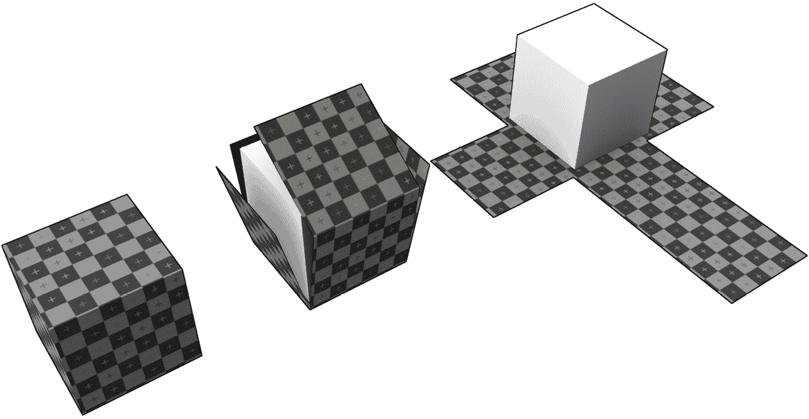
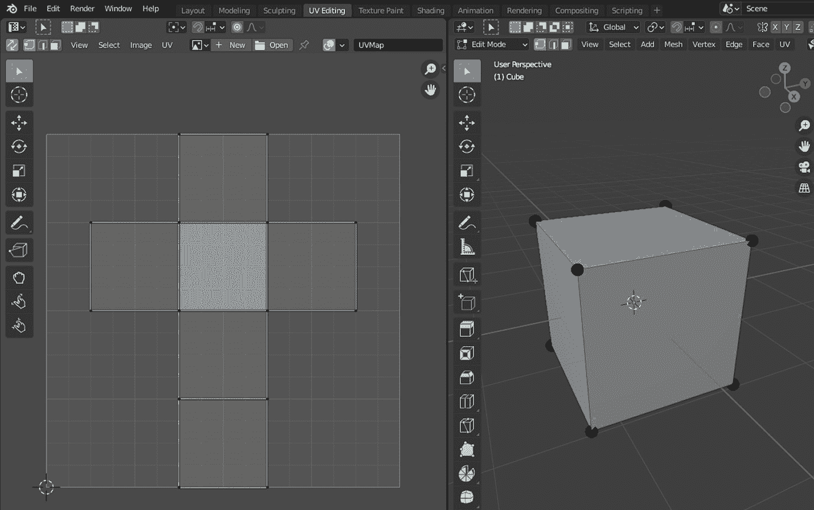
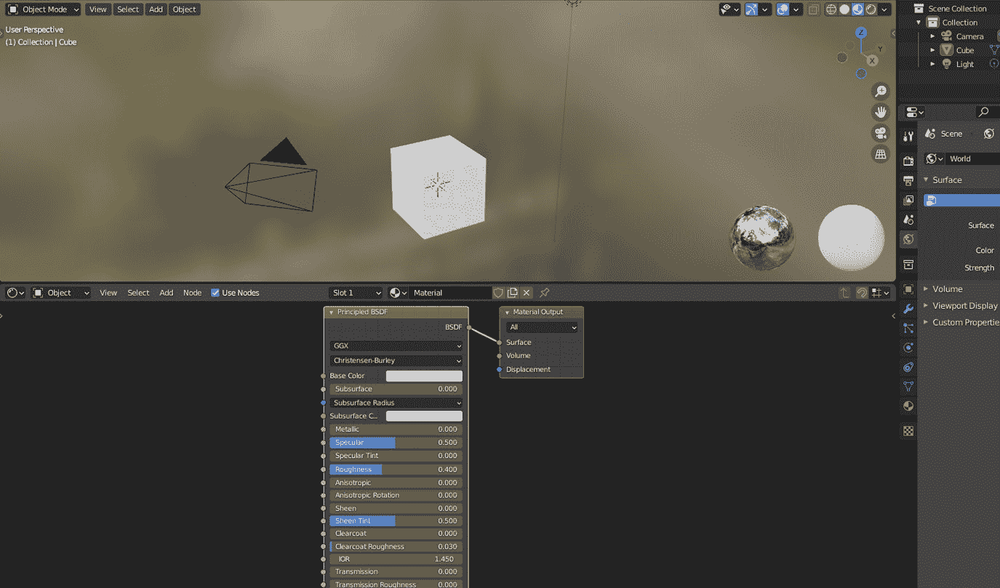
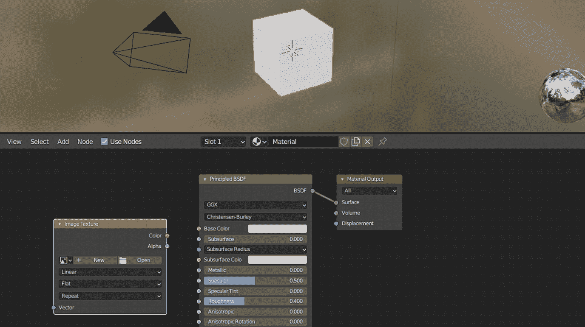
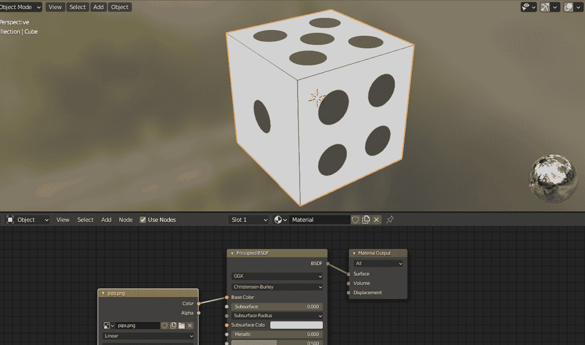
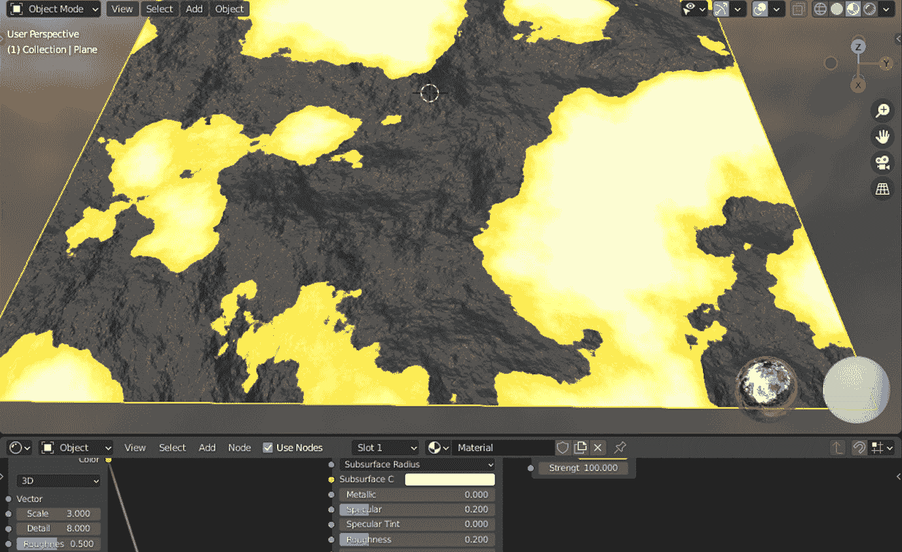
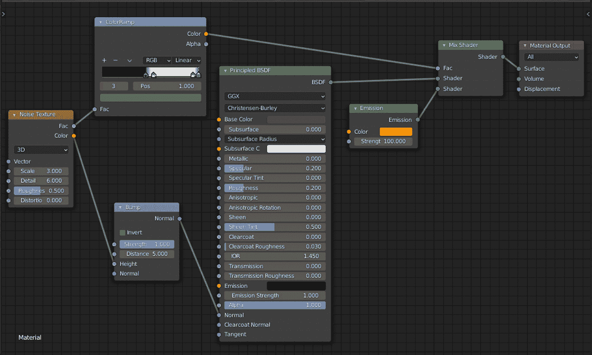
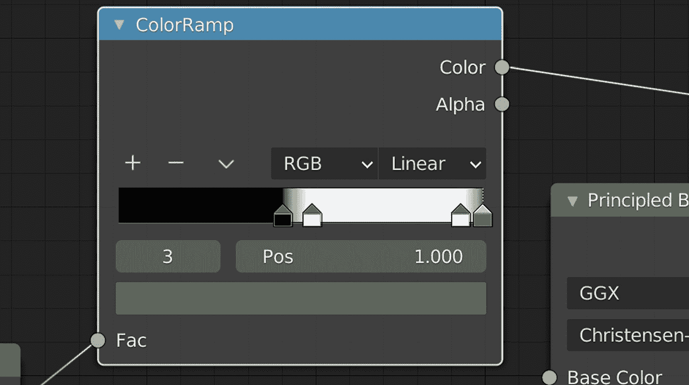

# 第四章：添加和创建纹理

在典型的 3D 工作流程中，你可能会添加到材质中最常见的属性之一就是纹理。**纹理**是一个图像文件，它负责模型的纹理外观，使得表面不会只显示单色。尽管你在现实生活中遇到的物体有感知到的颜色，但它们也有由 3D 应用程序中此属性定义的特征外观。例如，一朵花和沙质表面可能都有黄色，但你都知道花朵的花瓣看起来会更光滑，而沙粒则会显得粗糙。

大多数日常物品都有磨损和损坏。看看四周，你会发现大多数表面要么有剥落的油漆，轻微的变形，或者一些划痕。想象一下你在前两章中设计的桶已经使用了一段时间。它自然会在金属环上有一些划痕。你只能通过为你的材质应用颜色和改变粗糙度值来做到这一点。如果你想达到更逼真的效果，你必须为你的模型应用纹理。

一些 3D 专业人士只专注于某些领域并在此领域获得专业知识。纹理化就是这些领域之一，除了建模、照明和动画之外。通常，纹理化专家会使用经典图像编辑应用程序，如 *Adobe Photoshop*、*GIMP* 等，来创建纹理。然后，艺术家会将这些纹理带入 Blender，以便它们可以应用于表面。如果你不擅长从头开始创建纹理，你将在本章中学习如何仍然依赖其他艺术家创建的现有纹理。

使用上述工作流程准备和使用纹理通常听起来很静态，因为你需要访问这些纹理的源文件。幸运的是，在 Blender 中有一个动态的方式来创建你自己的纹理，这样你就不必在 Blender 和其他软件之间来回切换。

这不是“一个比另一个更好”的情况，因为每种方法都有其自己的位置和优点。你将了解 Blender 的新部分，以促进这两种方法，这样你可以就使用哪种纹理方法做出明智的决定。为此，我们将涵盖以下主题列表：

+   理解 UV 和纹理坐标

+   使用 UV 编辑器

+   导入和应用纹理

+   以程序方式创建纹理

+   导出你的纹理

到本章结束时，你将学会如何为纹理准备你的模型，应用可用的纹理，并动态地创建自己的纹理。你在本章中获得的经验将帮助你了解为你的项目选择正确的纹理方法。

# 技术要求

本书 GitHub 仓库([`github.com/PacktPublishing/Game-Development-with-Blender-and-Godot`](https://github.com/PacktPublishing/Game-Development-with-Blender-and-Godot))将有一个包含`Start`和`Finish`文件夹的`Chapter 3`文件夹，你可以用来在过程中比较你的工作。这些文件夹还包含其他依赖项，例如必要的纹理文件，以便跟随和完成练习。

虽然你在前面的章节中工作过桶，但我们将只使用标准的 Blender 对象，如立方体和平面，以保持事情简单，这样你可以专注于纹理流程。

# 理解 UV 和纹理坐标

当你在建模时，你正在改变模型顶点的坐标。因此，你正在使用空间坐标。要给你的模型应用纹理，你需要在一个不同的坐标系中工作，这个坐标系被称为**纹理坐标**或**UVs**。让我们看看这两个术语是如何相互关联的。

空间坐标系通常用**XYZ**这个缩写来描述，因为我们经常使用 X、Y 和 Z 轴来定义 3D 对象的位置。同样，**UV**也是一个缩写，但它用于纹理流程中；字母 U 和 V 被选中来描述纹理坐标系。所以，UV 并不真正代表紫外线。

将 UV 坐标映射到 XYZ 坐标的过程被称为**UV 展开**。通过这种方法，你告诉 Blender 如何将图形文件映射到 XYZ 坐标。如果你觉得展开过程不太直观，你可以在心里尝试逆转这个过程。你需要什么样的纹理，如果把它包裹在你的 3D 模型周围，它能够完美地贴合？让我们分析以下图例，其中有一个用棋盘纹理画出的图形文件被应用到标准立方体上：

图 3.1 – 一个 2D 棋盘纹理包裹 3D 对象

在*图 3.1*中，你看到左边的立方体有一个棋盘纹理。在中间部分，你看到立方体就像礼物包装被剥去一样。最后，立方体在右侧完全展开；其纹理被平铺。纹理文件实际上是所有的棋盘部分，它作为一个 2D 图形文件存在。

我们使用诸如展开和 2D 图形文件之类的词语，是因为我们在一个平面上模拟现实生活中的 3D 对象。实际上，那个立方体会占据空间，有体积，并且会充满它所制成的材料。例如，一个可能是由木头制成的儿童玩具立方体。或者，它可能是一个六面骰子，很可能是用亚克力制成的。如果你切开它，你会看到材料。

要将问题从三维体积问题转换为二维图形问题，你需要一个新的工具。你一直在使用 Blender 的默认界面，该界面方便地设置为编辑 XYZ 坐标。对于编辑 UV，你需要**UV 编辑器**，你将在下一节中找到它。

# 使用 UV 编辑器

Blender 自带预设的工作区，这样你可以专注于特定的工作流程。到目前为止，你一直处于**布局**工作区。你可以将其视为位于应用程序标题下方、紧邻**帮助**菜单的激活标签。你应该创建一个新文件，并通过点击相应的标签切换到**UV 编辑**工作区。*图 3.2*是你处于**UV 编辑**工作区时看到的。

图 3.2 – UV 编辑是 Blender 中许多默认工作区之一

在**UV 编辑**工作区中，应用程序将主要分为两个部分：左侧被称为**UV 编辑器**，显示在平坦表面上排列的一组正方形，右侧显示默认的立方体。你在**UV 编辑器**中看到的黑色点实际上是**3D 视图**中立方体的顶点。你可能注意到，如果你在**UV 编辑器**中计数点，它们并不等于立方体的顶点数。在**UV 编辑器**中有更多的点，因为其中一些点最终会在**UV 编辑器**中的正方形折叠到边缘并围绕你的 3D 对象包裹时合并。

到目前为止，Blender 应该已经为你选择了立方体的所有顶点。然而，如果你不小心选中了立方体的一个顶点，你会看到**UV 编辑器**中的正方形会消失。这是因为我们还没有打开**同步**模式。在**UV 编辑器**的左上角，你会看到一个图标看起来像两个对角箭头朝相反方向移动的按钮。如果你按下了这个按钮，你会注意到在任一视图中选择顶点都会同步。

当你添加一个新的立方体时，Blender 默认会展开该立方体。在**UV 编辑器**中顶点的一般布局类似于一个 T 形，就像你在*图 3.1*中看到的那样。类似于**3D 视图**，**UV 编辑器**中的顶点将形成边和面，但在**UV 编辑器**中都是二维的。如前所述，我们已经将模型的 3D 特性转换为二维表示，这样我们就可以处理图形文件。

**UV 编辑器**是你可以看到编辑器中的点如何映射或关联到纹理文件的地方。为了做到这一点，我们需要按照以下方式引入一个纹理文件：

1.  打开`第三章`文件夹。

1.  打开`开始`文件夹。

1.  将`pips.png`拖放到**UV 编辑器**区域。

如果您在计算机的默认图像查看应用程序中打开那个 PNG 文件，您会注意到它有透明部分。它的 1024x1024 的尺寸并没有完全上色。恰好文件的非透明区域正好位于**UV 编辑器**中的面上，因此**3D 视图**中的面。

2 的幂次方

不论是早是晚，您都会注意到大多数纹理文件都采用某些标准尺寸，如 512、1024、2048 等。尽管这些文件不必是正方形，这意味着您实际上可以有 256x512 的尺寸，但仍然值得将任一维度保持在 2 的幂次方。这是由于 GPU 使用的算法，以便它们运行得更有效率。

到目前为止，我们已经利用了 Blender 为立方体提供的默认 UV 布局，并看到了 UV 面如何与我们在**UV 编辑器**中预览的纹理文件重叠。然而，如果您在**3D 视图**中启用**材质预览**，您将看不到应用于立方体的骰子纹理。这是因为我们还没有告诉 Blender 在分配给立方体的材质中使用骰子纹理。让我们在下一节中这样做。

# 导入和应用纹理

当您将纹理文件拖动到**UV 编辑器**中时，您实际上已经导入了它，但事实上，立方体的材质还不知道如何使用那个纹理。也就是说，由于**UV 编辑器**，材质已经拥有了将 3D 顶点映射到 2D 纹理坐标所需的所有信息。它只需要被告知要将哪个纹理应用于立方体。

为了完成这个任务，我们将切换到一个新的工作空间，这样我们就可以将纹理与材质连接起来。此外，我们还将使用不同的方法导入另一个纹理，并将其分配给立方体的材质，以展示您如何使用相同的 UV 信息与不同的纹理文件。

就像您切换到**UV 编辑**工作空间一样，现在是时候切换到不同的工作空间以方便操作了。第六个工作空间，标记为**着色器**，就是您要找的。我们将在新工作空间的下半部分进行工作，它看起来像是一个网格；它被称为**着色器编辑器**。上半部分仍然是那个熟悉的**3D 视图**，但**材质预览**已自动开启，这样您可以看到您的更改立即反映出来。因此，**着色器**工作空间应该看起来与您在*图 3.3*中看到的大致相同。

图 3.3 – 着色器是为您设置的多个工作空间之一

如您在*第二章*“建筑材料和着色器”中发现的，Blender 文件自带一个默认材质。我们将修改这个默认材质来了解纹理工作流程。**着色器编辑器**区域已经包含了两个实体，它们组成了以下材质：

+   **原理 BSDF**（简称**Principled**）

+   **材质输出**

这些被称为节点。左侧的**Principled**节点包含你在上一章中已经看到的属性。许多这些属性在左侧都有小圆圈。这些被称为插座的圆圈可以连接到其他节点的插座。我们目前没有足够的节点来创建有意义的连接，但很快就会做到。

说到连接性，**Principled**有一个连接到**材质输出**节点的输出。如果你按住鼠标在**材质输出**的**表面**输入上并拖动连接，你最终会断开这两个节点之间的连接。然后，立方体将看起来是黑色的，因为没有表面信息。尝试通过将**BSDF**输出拖动到**表面**输入来重新连接这些节点。默认的灰色颜色将被重新建立。

节点与代码

在上一章中，你被告知着色器是指导 GPU 显示什么的代码行。当你使用**Shader 编辑器**中的节点时，你实际上是在编写代码，但你是以可视化的方式编码。由于在传统编程中行顺序很重要，因此节点以及进出节点的连接也很重要。然而，可视化编程更容易理解。

当我们在*第一章*中建模桶时，*创建低多边形模型*，我们需要在场景中添加 3D 对象。我们通过按*Shift + A*来实现这一点。我们将做类似的事情。在这种情况下，我们将向**Shader 编辑器**添加新的节点。Blender 是上下文相关的，这意味着如果鼠标在不同的工作区、区域和界面上方，相同的快捷键会产生类似的结果。如果你在**Shader 编辑器**上按*Shift + A*，你会看到一个列表出现并显示与**Shader 编辑器**相关的实体。

当这个弹出菜单打开时，它正好位于鼠标光标正上方**搜索**按钮的位置。要添加纹理节点，请执行以下步骤：

1.  在**添加**菜单中点击**搜索**。

1.  使用键盘输入`Image`。

1.  在过滤结果中选择**图像纹理**。

1.  在其他节点附近点击任意位置。

这将在**Shader 编辑器**中引入一个**图像纹理**节点，就像你在以下图中看到的那样：

图 3.4 – Shader 编辑器中的图像纹理节点

当你在**UV 编辑器**中工作时，已经导入了`pips.png`文件，因此无需再次导入该文件。我们只需将其调出。通常，**图像纹理**节点左侧的**新建**按钮旁边的按钮会弹出一个列表；从该列表中选择**pips.png**。然后，将**图像纹理**的**颜色**输出连接到**Principled**的**基础颜色**输入。这将纹理应用到立方体的面上。哇，默认的立方体现在看起来像*图 3.5*中看到的六面骰子：

图 3.5 – 纹理文件通过材质应用于模型

六面骰子有点数，通常在每面用不同数量的圆圈标记。如果你想要一个看起来不同的六面骰子，用罗马数字表示数字，会怎样？要导入并应用新的纹理，请执行以下步骤：

1.  使用*Shift+A*的帮助创建一个新的**图像纹理**节点。

1.  点击**打开**按钮。

1.  在本章的`Start`文件夹中选择`roman.png`。

1.  将此**图像纹理**节点的**颜色**连接到**原理**节点的**基础颜色**。

由于纹理坐标已经映射在**UV 编辑器**中，你可以轻松地交换形状相似但设计不同的纹理。

当你处理更复杂的模型时，你需要调整 UVs 的工作量就更多了；只要 UV 坐标与纹理的正确部分对齐，你就没问题。然而，想象一个不同的场景。你会如何建模看起来像是有轻微偏差的重复图案的表面？在下一节中，我们将探讨不同的纹理工作流程。

# 以程序方式创建纹理

近年来，“**程序化**”一词被广泛使用，尤其是在视频游戏行业中，用来描述不同的事物。尽管有人可能会说我们迄今为止所做的一切都是遵循某种程序，但在我们的语境中，这个词意味着其他含义。当我们在前一节中导入纹理文件时，它已经为我们设计好了。换句话说，它是一个静态文件。另一方面，“程序化”这个词是一个华丽的词，意味着动态。

在动态或程序化纹理工作流程中，目标是暴露纹理的某些参数，以便可以即时更改纹理，而不是返回图形编辑应用程序。由于一切都是动态的，你不需要导入图形文件，并且可以更改最终纹理的各个方面。例如，如果六面骰子使用的是程序化纹理，那么就像改变点数颜色和/或大小一样。

程序化纹理除了其动态性之外还有另一个好处。静态纹理文件需要你做之前的 UV 工作，以便顶点与纹理的部分对齐。在程序化工作流程中，纹理中的图案可能是无缝的，因此你不必担心 UVs。在我们的语境中，“无缝”意味着图案以完美的方式重复，以包裹模型。

我们将在 Blender 中创建一个程序化熔岩纹理，就像你在*图 3.6*中看到的那样，这样你可以更改其参数以获得不同的纹理外观。

图 3.6 – 热熔岩流过凝固的地壳

在一个新的 Blender 场景中，删除默认的立方体后，执行以下步骤：

1.  添加一个**平面**。

1.  切换到**着色**工作区。

1.  调出默认的**材质**或创建一个新的。

1.  如果需要，重命名材质。

目前没有什么新奇的，但我们很快就会利用以下五个新节点：

+   **噪声纹理**：Perlin 噪声是黑白值的混合，这些值以渐进的方式混合在一起，因此结果看起来像灰度值的汤。Blender 的噪声纹理与 Perlin 类似，但值不是灰度值；它们带有随机颜色。

+   **Bump**：它用于模拟高度波动，使表面看起来凹凸不平。

+   **颜色渐变**：这个节点的另一个名字可能是颜色映射器，但由于它使用渐变，所以“渐变”这个词意味着过渡是平滑的。

+   **发射**：在正常光照下，热物体有发光效果。这个着色器可以帮助你模拟从烤箱中出来的热钢块或明亮的灯泡。

+   **混合着色器**：这是一个混合两个着色器以创建组合着色器的着色器。

在我们继续介绍如何混合和匹配前面列出的节点，这些节点看起来像食谱的成分之前，这里有一些解释说明为什么选择了它们。当你想创建自己的程序纹理时，一个类似的过程可能有助于你选择有用的节点，而不是对选择哪些节点进行盲目的猜测。此外，在解释之后，试着想象哪个会连接到哪个。所以，我们开始吧。

**噪声纹理**字面上是一种带有噪声的纹理；这种噪声纹理中的颜色变化在**Bump**节点中用于模拟不同的高度。因此，**噪声纹理**就像是数据，而**Bump**节点则是其视觉表示，从某种意义上说。接下来是**颜色渐变**，显示为**ColorRamp**，它将颜色信息分配给不同的高度值。如果你曾经见过微型景观，它就像是画白色的山顶因为雪，以及根据海拔的不同，低地区域有不同的绿色阴影。

因此，前三个节点负责模拟高度的大部分工作。假设这个熔岩纹理描绘的是最近的形成，所以我们不仅仅是为了显示冷却后的熔岩。我们希望看到蒸汽腾腾、发光的熔岩在变黑和干燥的熔岩之间。因此，我们需要一个**发射**着色器。最后，由于高度是其自身的事情，我们正在添加发射部分，所以我们需要**混合着色器**来结合两者。

在处理节点时，你可以拖放节点来为自己安排一个更整洁的布局，以便理解正在发生的事情。无需多言，让我们继续。

1.  添加上述五个节点。

1.  按以下方式连接：

    +   **噪声纹理**的**颜色**到**Bump**的**高度**

    +   **噪声纹理**的**Fac**到**颜色渐变**的**Fac**

    +   **Bump**节点的**Normal**到**Principled BSDF**的**Normal**

    +   **颜色渐变**的**颜色**到**混合着色器**的**Fac**

    +   **Principled BSDF**的**BSDF**到**混合着色器**的第一个输入**着色器**

    +   **发射着色器**的**发射**到**混合着色器**的第二输入**着色器**

    +   **混合着色器**的**着色器**输出到**材质输出**的**表面**

在连接节点时，没有左右方向。有些人将一组节点视为一个单元，并将它们彼此靠近排列。因此，有时，该组最后一个输出节点几乎垂直地连接到另一组节点。话虽如此，从左到右的一般流向符合前面的说明。无论你如何排列你的节点，布局可能类似于你在*图 3.7*中看到的。

图 3.7 – 火山纹理的节点排列

让我们按照节点列表的原有顺序尽可能多地查看这些节点的值。

## 噪声纹理

对于**噪声纹理**，使用了以下值：

+   **类型**定义了在噪声创建中使用的维度，这涉及到复杂的操作。它在更高级的案例中使用，所以我们保留默认的**3D**值。

+   **缩放**属性更像是缩放因子。太低，你更接近于噪声表面。太高，你看到的是更大的噪声景观，就像你在飞机上爬升一样。在这种情况下，我们将**缩放**设置为**3.0**。

+   **细节**属性是显而易见的。尽管较低的值肯定会造成模糊的外观，但超过一定值的高数值并不会对质量有很大提升。它只会增加计算时间。在我们的案例中，选择了**8.0**的值。

+   **粗糙度**与你在*第二章*，“建筑材料和着色器”中看到的概念不同。那一个影响的是表面的反射特性。这个概念是关于边缘的粗糙程度，从某种意义上说。换句话说，噪声值是如何相互混合的，而**0.5**的值就足够了。

+   **扭曲**属性创建漩涡和波浪图案。可能对于流动的火山外观，一点是必要的。你可以尝试一下，但超过一定值时，过多的扭曲会使事物看起来过于破碎。所以，**0.2**就足够了。

## 凸起

此节点将使用**噪声纹理**提供的数据，因此它可以以不同的高度值表示不同的颜色值。这就是为什么将**高度**输入连接到**颜色**输出，因为整个表面不可能只有一个高度值，所以我们不得不提供一组颜色。

在不勾选**反转**设置的情况下，使用了以下其他值：

+   **强度**值决定了颜色值与最终凸起之间的映射效果。它像百分比一样工作，因为值可以在*0.0*到*1.0*之间。我们将它保留在**1.0**。

+   **Distance**属性是一种乘数。它与**Strength**属性一起工作。将其中任何一个设置为*0*将导致表面完全平坦。也许描述这个属性最好的方式是它保留了**Noise Texture**中设置的所有细节。任何接近*1.0*的值将显示一个褪色的表面，而更高的值将填充更多细节。因此，**3.0**的值将产生足够详细的成果。

## Emission

这是一个非常简单的节点，它负责使表面看起来发光。我们将在*第四章*中了解到灯光，*调整相机和灯光*，但如果你想让你的物体看起来像是在发射或辐射光线，那么你可以使用这个节点。例如，一块热的铁或荧光灯泡；在我们的案例中，熔岩。

由于这是一个非常简单的节点，我们只有以下两个属性：

+   自解释的**Color**属性用于选择表面将发出哪种颜色。对于热熔岩，你可以在界面上切换到**Hex**值并选择**FF8400**。

+   **Strength**值，在我们的案例中为**100.0**，定义了发射的强度。这是一个以瓦特为单位的单位，你可以科学地对待它，但选择任意值以获得视觉真实感通常也行得通。

## ColorRamp

**ColorRamp**节点用于通过类似于阈值的梯度将输入值映射到颜色。描述看似简单，但实际上内部有很多内容。所以，让我们来分解它。

大多数时候，你将连接节点的输入和输出插孔到其他节点。然而，有时只使用一种类型的插孔是完全可接受的。例如，在**Emission**着色器中，你不必使用输入插孔来定义**Color**和**Strength**值。相反，你可以手动选择它们的值。因此，节点就像是一个信息源。

然后，有一些节点，将输入插孔连接到另一个节点的输出插孔会更有意义。**ColorRamp**就是这样的节点之一，它通过考虑传入的值来充当修饰符。**Noise Texture**的数据将是创建熔岩表面的一个因素（简称 Fac），因此我们连接了两个**Fac**插孔。

一旦数据被考虑在内，我们需要一个系统来处理它。这是通过**ColorRamp**节点中的梯度来完成的。梯度这个概念一开始可能听起来有些奇怪。如果你直接将**Noise Texture**的**Color**连接到**Material Output**，你会看到颜色有大小不同的区域。如果你这样做，记得撤销操作，以确保节点再次正确连接。我们需要一种方法将这些平坦但着色的区域转换为高度。

渐变将帮助我们定义哪些区域较高或较低，这样我们可以在稍后为不同的海拔分配适当的颜色。本质上，渐变是一个工具，通过颜色停止点来定义和混合这些区域。默认情况下，有两个颜色停止点，但你可以在渐变上方的加号和减号按钮中添加和删除更多的颜色停止点。这些停止点具有方形，上面有一个小三角形。你可以拖动这些停止点，这将改变我们之前提到的区域过渡。

当你有许多停止点时，有时很难点击和拖动它们，所以使用**活动颜色停止点**在它们之间进行切换。当你添加一个新的**ColorRamp**节点时，活动停止点被标记为**0**，并且它位于标有**Pos**的标签的左侧，这表示活动停止点的位置。活动停止点和位置字段都显示了必要的 UI 元素，以便你在悬停时更改值；你也可以点击并输入一个值。因此，通过使用活动颜色停止点和**Pos**，你可以精确标记颜色停止点将要放置的位置，如果你不想拖动它们的话。

最后但同样重要的是，有一个颜色选择器位于**Fac**插孔上方。你可以使用它来设置活动停止点的颜色。

由于这不是一个简单的节点，我们可以从一些视觉辅助中受益。*图 3.8*是对**ColorRamp**节点的放大查看。

图 3.8 – ColorRamp 节点的近距离观察

前面的图应该帮助你看到我们到目前为止所讨论的内容。同样，就像你在 3D 视图中使用鼠标的滚动功能可以放大和缩小一样，你可以在**Shader Editor**中这样做。这将帮助你更清楚地看到一些属性名称和值。

现在，是时候使用所有这些信息并标记我们的过渡；你将交互所有刚刚展示的元素。为此，执行以下步骤：

1.  使用加减按钮来拥有四个颜色停止点。

1.  设置`0`，然后按照以下步骤操作：

    1.  设置`0.45`。

    1.  在`000000`中设置颜色。

1.  设置`1`，然后按照以下步骤操作：

    1.  设置`0.53`。

    1.  在`FFFFFF`中设置颜色。

1.  设置`2`，然后按照以下步骤操作：

    1.  设置`0.94`。

    1.  在`FFFFFF`中设置颜色。

1.  设置`3`，然后按照以下步骤操作：

    1.  设置`1.00`。

    1.  在`636363`中设置颜色。

注意，我们只选择灰度值。在真实景观中，较高的区域将是较冷的熔岩，而较低的区域将是炽热的熔岩池。因此，为了表示这个想法，我们选择深色和浅色。通常，某物越白，它就越热。停止点之间的接近程度决定了过渡是平滑还是尖锐。

虽然我们一直在使用**ColorRamp**节点，但我们的熔岩纹理的颜色将在**Principled BSDF**和**Emission**着色器中定义，并在**Mix Shader**中组合。目前，我们已经利用了**Noise Texture**的数据，并在梯度及其精心选择的值的帮助下转换了这些数据。我们将在**Mix Shader**部分再次回顾因子概念，但在那之前，让我们访问我们忠实的朋友**Principled BSDF**。

## Principled BSDF

我们实际上在*第二章*中看到了这个节点，*建筑材料和着色器*，但它作为**Material Properties**界面的一部分显示。当您创建一个新的材质时，它默认使用这个着色器。它在体内结合了许多其他着色器。例如，它有一个发射插座，但由于我们无法一次完成熔岩形成的冷热部分，我们正在使用一个单独的**Emission**着色器。

我们将保留大多数选项不变，但以下是非默认值，为这次练习所选：

+   在颜色界面的**Hex**部分中，值为`4A4A4A`。

+   `0.2`。

+   本练习中的`0.2`。

您可以参考*第二章*中的*图 2.5*，*建筑材料和着色器*，并在*发现着色器*部分阅读解释，以刷新理解多个属性如何协同工作并影响最终外观。

## Mix Shader

它根据**Factor**中的值将一个着色器混合到另一个着色器中。对于**Factor**插座的值，如果您选择**0.0**，则将完全使用第一个着色器。如果您选择**1.0**，则表示将使用第二个着色器。

十进制值的范围在 0 到 1 之间，但由于我们无法随意确定使用多少个着色器，因此很难知道选择什么。这就是为什么我们将**ColorRamp**的**Color**输出连接为因子，以便**Noise Texture**的波动会逐渐影响此节点。效果是级联的。换句话说，每个将要被涂上（对于干涸的熔岩）或橙色（对于热熔岩）的像素，都应该基于**ColorRamp**认为它在**Noise Texture**中的位置来决定。因此，颜色停止点充当阈值，所有这些都在**Mix Shader**中考虑在内。

一旦所有节点都已设置并连接，您可以随意调整它们的所有值，特别是**ColorRamp**。您会注意到，热熔岩部分在岸边似乎更凉爽，而在中间更密集、更明亮。尝试将颜色停止点靠近彼此，看看这些熔岩池中的热点区域如何变化。

使用传统的图像编辑应用程序，如*Adobe Photoshop*创建这种纹理可能是可能的，但这些应用程序基于图层，并且保持非破坏性并不总是容易。基于节点的处理方式带来的优势是快速迭代。有一点可以肯定的是，你不需要重新导入纹理来查看更改。所有这些都在你的眼前实时发生。

然而，最终，由于你正在开发游戏，你必须导出你的纹理，以便你选择的游戏引擎可以使用它。在以下和最终的章节中，我们将看到如何将我们的熔岩纹理导出到文件系统。

# 导出你的纹理

在后面的章节中，当我们接近与 Godot 引擎一起工作时，我们将更详细地探讨资产和项目管理。然而，在我们对熔岩材质所做的所有艰苦工作之后，现在是时候学习如何导出纹理了。

在本节中，我们将进行一些有趣但必要的操作来导出我们的纹理。首先，我们将更改 Blender 的渲染引擎。然后，我们将在材质的中间添加一个**图像纹理**节点，而不将其连接到任何东西。奇怪吧？Blender 有时工作得很神秘。

## 更改渲染引擎

到目前为止，我们一直在使用默认的**Eevee**渲染引擎。**Eevee**是一个实时渲染引擎，可以提供非常快速的结果。大多数游戏引擎都有自己的内部实时渲染引擎，负责计算光线和阴影。因此，**Eevee**是模拟 Blender 中你将最有可能在导出资产到游戏引擎时体验到的效果的好方法。然而，速度和便利性也带来了一些代价。

Blender 还有一个名为**Cycles**的引擎。与**Eevee**相比，**Cycles**是一个非常精确但速度较慢的渲染引擎。**Cycles**的精确性归因于它处理高级光照计算，这导致了高质量的结果，例如更好地显示反射和透明表面，显示更精确的阴影，甚至创建体积效果，如雾霾。以下是一个链接，展示了这两个引擎的功能和差异，以及使用案例：[`cgcookie.com/articles/blender-cycles-vs-eevee-15-limitations-of-real-time-rendering`](https://cgcookie.com/articles/blender-cycles-vs-eevee-15-limitations-of-real-time-rendering)。

在这本书中，我们不会涵盖足够高级的主题，这些主题需要我们在**Eevee**和**Cycles**之间做出艰难的决定。因此，**Eevee**对我们来说已经足够好了。然而，当你与程序纹理一起工作时，至少在我们使用的 Blender 版本中，**Eevee**无法导出熔岩纹理。我们将不得不切换到**Cycles**引擎。幸运的是，这只需点击一下按钮即可完成。

在右侧的**属性**面板中，从顶部开始的第二个标签，看起来像数码单反相机的预览显示，将会打开**渲染属性**。顶部的下拉列表将显示**Eevee**；让我们将其更改为**Cycles**。此外，如果你有一块不错的显卡，你可能还想将第三个下拉列表的**设备**值更改为**GPU 计算**，这样你的显卡就可以代替你那老式的 CPU 来处理繁重的工作。

在那长长的属性列表中向下看，你会看到一个标题为**烘焙**的面板。如果你展开标题，你会看到一个**烘焙**按钮。我们很快就会点击那个按钮，但我们需要先准备好我们将要烘焙的内容。

## 烘焙纹理文件

当我们与立方体和骰子纹理一起工作时，我们使用了一个**图像纹理**节点来绑定文件系统中的一个现有图像。当纹理是程序性的时，我们的情况就不同了，因为这一切都是在内存中实时发生的。我们需要找出一种方法将此信息烘焙到一个文件中。由于没有这样的文件，我们需要假装我们有一个，如下所示：

1.  添加一个**图像纹理**节点。

1.  点击**新建**按钮。

1.  在名称部分输入`lava`。

1.  点击**确定**按钮。

我们不会将`lava`连接到材质中。Blender 会做出一个合理的猜测，并将程序化纹理部分烘焙到这张图像中。

现在是时候在**渲染属性**中点击那个**烘焙**按钮了。底部的进度条将指示 Blender 正在执行其操作。一旦过程完成，**着色**工作区的左下角将充满熔岩纹理。那个显示烘焙纹理的小部分被称为**图像编辑器**。

如果你查看烘焙后的图像，你会注意到一些细节丢失了。在 1.0 中，热熔岩池有温暖和凉爽的区域。

在你的文件系统中的`lava.png`。现在这个文件可以被导入到一个新的 Blender 文件中，并用于一个`pips.png`到立方体的纹理。

任务完成。如果你选择了本章中写下的相同值，你应该已经有了*图 3.6*中看到的程序化熔岩纹理。此外，你还创建了一个静态版本。让我们总结一下本章还完成了什么。

# 概述

本章一开始简要讨论了纹理是什么以及为什么可能需要它们。为了回顾，如果你对模型表面只有颜色信息就满意，那么一旦建模和材质应用过程完成，你就可以结束了。如果你认为你需要在你模型的表面上展示独特的特性，你需要利用纹理。

为了达到这个目的，你发现了如何创建一个新的坐标系——通过一种称为 UV 展开的方法将空间坐标映射到纹理坐标——可能是必要的。一旦完成 UV 展开，你就可以将不同的纹理应用到你的 3D 模型上，因为 2D 到 3D 的映射已经建立。

虽然使用图像编辑应用程序创建纹理是完全可能的，但你同样知道如何在 Blender 中通过程序创建纹理。这是一个强大的方法，尤其是在处理难以进行 UV 展开的表面时，例如景观。

最后但同样重要的是，你学会了如何更改渲染引擎，以便将你的程序纹理导出到文件系统中。尽管这个文件是静态的，并且无法自动更新（当然，除非你用新的导出覆盖它），但你有一个好处，那就是可以轻松地分享文件。

你已经使用 Blender 的界面和鼠标在场景中移动，旋转视图以更好地查看你的模型、材质等。在下一章中，你将学习如何与相机和灯光对象一起工作，以创建一个可以在最佳光照条件下排列场景中物体的构图。

# 进一步阅读

要了解每个着色器节点的作用，你可以参考以下链接中的官方文档：[`docs.blender.org/manual/en/2.93/render/shader_nodes/`](https://docs.blender.org/manual/en/2.93/render/shader_nodes/)。

为了进一步练习，想象一下火山纹理的方法还可以用在哪些地方。也许，通过精心策划的值和更多的颜色变化，炽热的岩浆可能是铁锈，而冷却的岩浆可能是油漆？

如果你好奇并想调查其他能够生成程序纹理的软件，你可以尝试使用*Adobe Substance Designer*。这是一个仅专注于创建纹理的强大程序。并非所有节点都标有相同的标签，但有很多与 Blender 相似的节点。实际上，如果你在那里练习技能并查看他人的创作，你可能会对在 Blender 中创建此类纹理有所启发。
