# 第十二章：创建用户界面

让我们从这个章节的开始，先提出一个简单的问题：你第一次玩的多玩家游戏是什么？

如果你正在考虑玩个人电脑或控制台游戏，试着换一种思维方式。想象一群孩子伸出双臂，假装射击并击倒入侵他们社区的坏人。或许前一天晚上电视上播放了一部引人入胜的动作电影。现在，这些孩子正在将他们认为在物理领域内可能的事情变成现实，混合了一点幻想和他们对电影的记忆。有些孩子甚至会假装自己在过程中受伤。最终，阵亡的战友将得到报复，善良将再次战胜邪恶。这里谁在记分——也就是说，谁有多少生命值？

那么服务器、互联网速度以及类似的事情呢？孩子们甚至需要**用户界面**（**UI**）来玩游戏吗？不，因为对他们来说，跟踪发生的事情仍然很容易。但是当人们需要关注的事情数量超过某个点时，就会变得难以应对。换句话说，当使用没有 UI 的系统变得不切实际时，就需要一个 UI。

这不仅仅局限于视频游戏。在现实世界中，你使用 ATM 来访问你的银行账户。所需的信息和功能将以清晰、简洁的方式呈现；检查账户、发送电子转账和查看当前利率都很容易，多亏了精心设计的 UI。

在我们的游戏中，尽管克拉拉有所期待，但她叔叔并没有在那里，而是在码头留下了一张便条。我们需要一种方式让玩家获取这些信息。因此，在本章中，我们将介绍 Godot 在它的工具箱中的一些 UI 组件来传达这个信息。我们将从一个简单的**按钮**节点开始，然后是**面板**组件。在这个面板中，我们将通过**标签**组件显示一些文本。

当你在游戏中添加越来越多的用户界面元素时，你也会学习如何将这些元素应用样式，使它们看起来更像是游戏世界的一部分。毕竟，默认的样式看起来都是那种默认的灰色，可能更适合原型设计。

在多次对 Godot 节点进行样式化操作后，可能会感到疲倦，尤其是如果你正在为具有不同文本的相同类型的按钮进行样式化。作为一个解决方案，我们将演示如何利用主题，这是一个强大的工具，将帮助你进行样式化工作。

如同往常，我们将讨论一些与创建 UI 相关的相关话题。考虑到这一点，在本章中，我们将涵盖以下主题：

+   创建一个简单的按钮

+   包裹在面板中

+   在面板中填充更多控件节点

+   利用主题

到本章结束时，你将学会如何利用 UI 节点帮助玩家阅读克拉拉叔叔为她留下的便条。

# 技术要求

如果您认为您没有足够的艺术天赋来创建 UI，那么请放心，有两个原因。首先，我们将主要关注在 Godot 中利用 UI 组件。因此，图形设计方面不会是我们的关注点。其次，我们在本书 GitHub 仓库的第十一章的“资源”文件夹中为您提供必要的资源。在里面，您会找到两个文件夹：`Fonts`和`UI`。只需将这些两个文件夹合并到您的 Godot 项目文件夹中。

这本书的 GitHub 仓库，[`github.com/PacktPublishing/Game-Development-with-Blender-and-Godot`](https://github.com/PacktPublishing/Game-Development-with-Blender-and-Godot)，包含了您需要的所有资源。最后，您可以从上一章继续您的作品，或者使用第十章的“完成”文件夹。

# 创建一个简单的按钮

UI 是围绕您游戏核心视觉元素以连贯方式排列的组件集合。最基础的 UI 组件可能是**Label**节点，如果我们想让它类似于在学习一门新编程语言时打印“Hello, world!”。然而，我们将从**Button**节点开始，因为前者非常简单，我们也可以在这个过程中学习如何样式化**Button**。

在我们随意抛出一堆 UI 节点之前，我们应该首先提到正确的结构来容纳我们的 UI 节点。我们可以使用**CanvasLayer**，类似于使用**Spatial**节点来嵌套其他节点，例如**MeshInstance**、**AnimationPlayer**等。

我们已经一直在创建场景主要是为了显示 3D 模型。让我们遵循类似的步骤来创建 UI：

1.  创建一个空白场景，并将其保存为`UI.tscn`，位于`Scenes`文件夹中。

1.  选择`UI`。

1.  添加一个`Close`。

1.  在**Inspector**面板中为其**Text**值输入`Close`。

目前还没有什么特别之处，但我们现在有一个按钮默认对齐到视口的左上角。当您输入显示的文本时，这个按钮的宽度也扩展了。

控制与 CanvasLayer

我们提到**Spatial**节点将是 3D 节点的根节点。所以，为了保持熟悉，我们可以使用**Control**节点来容纳**Button**节点。请放心，您仍然可以在**CanvasLayer**内部注入**Control**节点。我们使用**CanvasLayer**作为根节点的真正原因是其在**Inspector**面板中的**Layer**属性。通过更改此值，您可以更改绘制顺序，这意味着您可以决定哪个**CanvasLayer**将首先渲染。当您有多个需要以精确顺序堆叠在彼此之上的 UI 结构时，这是一个有用的机制。

我们刚刚添加的按钮看起来很无聊。它并不完全适合我们正在创建的世界。现在，让我们使用自定义图形资源来样式化我们的按钮：

1.  在**Inspector**面板的**Theme Overrides**部分的**Styles**子部分中展开。

1.  使用**正常**属性的下拉菜单，选择**新样式盒纹理**选项。

1.  点击**样式盒纹理**标题，这将填充**检查器**面板并显示其属性。

1.  将`button_normal.png`从`UI`拖到**文件系统**面板，并将其放入**纹理**属性中。

1.  将所有边距值中的`8`展开。

1.  按*F6*启动`UI.tscn`场景并尝试与按钮交互。

你已经为简单的按钮进行了很多样式设置，所以让我们分析一下发生了什么。

在*步骤 1*中，你告诉 Godot 你想覆盖默认主题，该主题为按钮提供了灰色外观。在没有用户交互的情况下，按钮将处于其正常状态；所以，这就是你在*步骤 2*中打算改变的内容。我们很快就会发现如何更改其他状态。

*步骤 3*是关于定义这个`Lorem ipsum dolor sit amet`的属性。注意按钮是如何在不显得拉伸的情况下变宽，同时保持圆角完整。这需要适当的解释。

设置边距不仅涉及容纳文本。精心选择的值将确保纹理可以根据需要放大或缩小，而不会失去其某些特性，如圆角。当资产具有圆角时，如果纹理被拉伸，你最终会得到一个扭曲的外观。保留纹理的核心特性并允许其正确缩放而不失真的做法称为 9 切片缩放。你可以在这里了解更多信息：[`en.wikipedia.org/wiki/9-slice_scaling`](https://en.wikipedia.org/wiki/9-slice_scaling)。

在*步骤 6*中启动`UI.tscn`场景时，按钮必须显示其正常状态，即棕色纹理。如果你将鼠标移到它上面，你会看到按钮将再次显示默认的外观，因为你还没有设置悬停状态。这可以在下面的屏幕截图中看到：

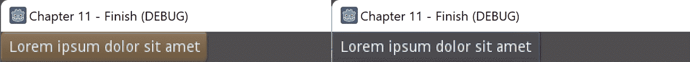

图 11.1 – 按钮仅对其正常状态进行了样式设置

与你为按钮的正常状态分配纹理的方式类似，你也可以为其他状态这样做。让我们为悬停状态做这个操作：

1.  在**场景**树中选择**关闭**按钮。

1.  在**主题覆盖**下的**样式**子部分中，将**新样式盒纹理**分配给**悬停**状态，并点击这个**样式盒纹理**来设置其属性。

1.  将`button_hover.png`从`UI`文件夹拖出，并将边距设置为`8`。

1.  按*F6*并将鼠标移到按钮上。

我们也将重复这一过程来设置按下和禁用状态。在我们的游戏中，我们不会使用禁用按钮，但为什么不做彻底呢？此外，在大多数情况下，你可以将按下状态用于焦点状态。不同的结果在下面的屏幕截图中显示：

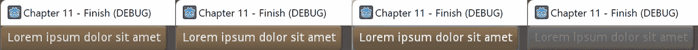

图 11.2 – 带有自定义纹理的按钮的正常、悬停、按下和禁用状态

在我们介绍更多 UI 节点之前，我们建议你将那个按钮的文本改回`关闭`，因为我们将使用这个按钮来关闭一个模拟克拉拉叔叔笔记的面板。说到这个，是时候学习笔记中写了什么了。

# 在面板中包裹

到目前为止，我们已经创建了一个按钮并为其设置了样式。然而，如果它能够发挥作用，那就更好了，尤其是考虑到我们给它赋予了有意义的标签。我们将编写一些代码，以便这个按钮可以在“在面板中添加更多控制节点”部分的末尾关闭一个面板。不过，在我们到达那个点之前，我们需要面板。

随着我们介绍更多的 UI 节点，让我们记住我们为什么在游戏上下文中做这件事。克拉拉的叔叔留下了一封笔记。我们将使用 Godot 中的 UI 节点组合来模拟这封笔记，使其看起来如下：

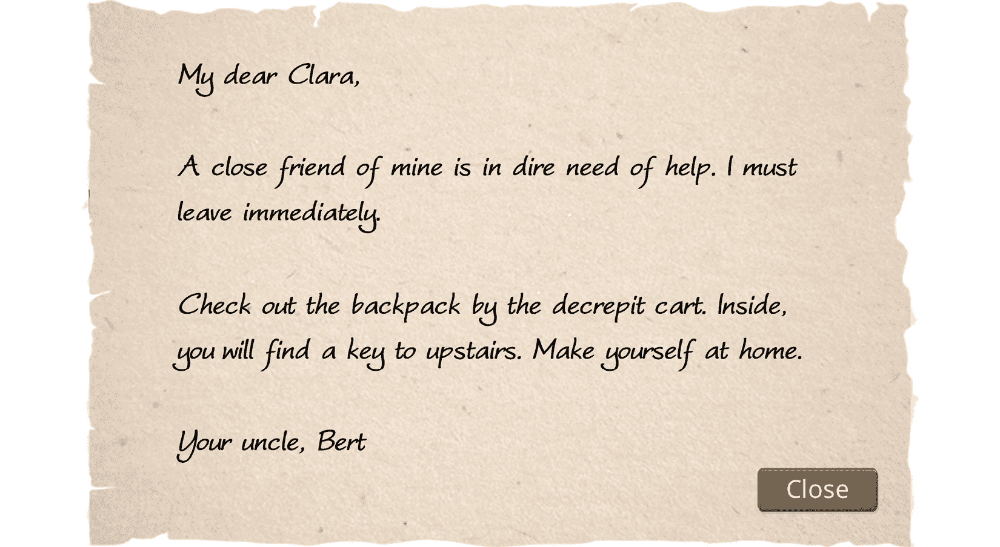

图 11.3 – 克拉拉的笔记

我们已经处理了按钮，但它目前正坐在一个无处可去的地方。在给出简短声明后，我们将在这个部分用**面板**节点包裹它。

**面板**节点是 Godot 中的另一个**控制**节点，通常用于包含其他组件。还有一个同名节点，**面板容器**，可能会让初学者感到困惑。**面板**节点从**控制**类派生，而**面板容器**节点从**容器**类继承。此外，**容器**类从**控制**类继承。这类技术细节在执行更高级的工作时可能很重要。我们不会这么做，所以在这个书中，为了我们的目的，两者都可以正常工作。因此，我们将坚持使用**面板**节点。

到目前为止，我们准备好添加一个**面板**节点并为其设置样式：

1.  在**场景**树中，在根**UI**节点下添加一个**面板**节点。

1.  在**检查器**面板中展开**矩形**部分。

1.  为**X**输入`600`。

1.  为**Y**输入`400`。

+   在“主题覆盖”下的“样式”子部分中，将**新样式框纹理**分配给**面板**属性。*   将**关闭**按钮拖动到**场景**面板中的**面板**节点上，以便**关闭**按钮嵌套。

到目前为止，你应该有以下的输出：

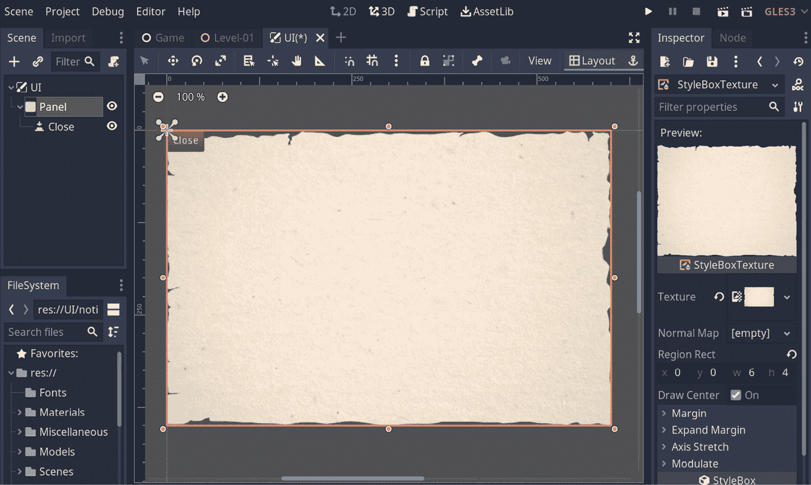

图 11.4 – 使用面板节点模拟的纸张纹理

我们越来越接近我们想象中的笔记设计。面板中的按钮仍然对齐到左上角。你可以将它拖动到一个有意义的位子，但如果面板内有文本，可能会更容易决定。这就是我们接下来要处理的。

# 在面板中添加更多控制节点

叔叔的笔记正在慢慢成形。在本节中，我们将介绍一个**标签**节点用于文本部分。此外，我们还需要想出如何定位所有这些元素，以便笔记看起来像我们想要的布局。最后，我们将讨论一些可能在某些场景下想要使用的辅助**控制**节点。

最终，我们仍然会使用最基本的 UI 节点：**标签**。如果我们一开始就使用它，它将因其默认样式和颜色而显得不起眼。由于我们现在有一个合适的纹理，这个**标签**节点可以放在上面，所以事情会看起来更有趣。按照以下步骤进行操作：

1.  在**场景**面板中选择**面板**节点。

1.  在**检查器**面板中添加一个**标签**节点并将其**自动换行**属性打开。

1.  将其**文本**设置为以下内容：

`我亲爱的克拉拉，`

`我的一个好朋友急需帮助。我必须立即离开。`

`检查破旧的购物车旁的背包。里面，你会找到通往楼上的钥匙。请随意。`

`你的叔叔，伯特`

我们最后的努力将导致一个不协调的高文本块。为了解决这个问题，我们可以手动给刚刚插入的**标签**节点设置一些宽度和高度。当我们这样做的时候，我们也可以改变它的位置，使其看起来居中，并在每个边缘有一些边距。然而，我们可以做得更聪明：我们可以将这个**标签**包裹在一个会设置边距并自动调整文本大小的**边距容器**内。

## 添加边距容器

到目前为止，向**场景**面板添加新节点对你来说可能是一个常见的任务。然而，有时，例如现在，决定在哪里添加新节点以及将其嵌套在何处可能并不明显。问题是，我们可以在哪里添加**边距容器**？在**面板**节点外部还是内部？

**边距容器**是一个专门的容器，负责引入边距，使其子元素看起来像有填充。如果我们将**面板**节点包裹在一个**边距容器**中，由于**面板**节点包含文本，整个结构，包括按钮，都将有填充。这并不好，因为我们希望文本的边缘和构成**面板**节点的纹理的边缘之间有一些空间。因此，你需要这样做，只为文本添加填充：

1.  在**面板**节点内添加一个**边距容器**节点，并将**标签**嵌套在这个**边距容器**节点内。

1.  在`0`和`1`处设置以下值。

1.  在`0`处。

1.  在`60`处。

在前面的操作中，我们提到了很多术语。前两组操作，即我们改变锚点和边距的值，并不特定于**边距容器**。它们适用于每种类型的**控制**节点。你还可以将这一事实视为这些属性在**检查器**面板下的**控制**标题下列出。

我们选择的锚点和边距值是如此特殊的值，以至于我们可以使用快捷方式达到相同的结果。这需要在 3D 视口标题部分的**布局**按钮点击后，在展开菜单中选择**全矩形**选项。这个**布局**按钮在以下截图中的可见，位于纸张纹理的右上角。

当我们稍后调整**关闭**按钮的位置时，我们将在该菜单下使用另一个选项。现在，将你的工作与以下截图中的内容进行比较：

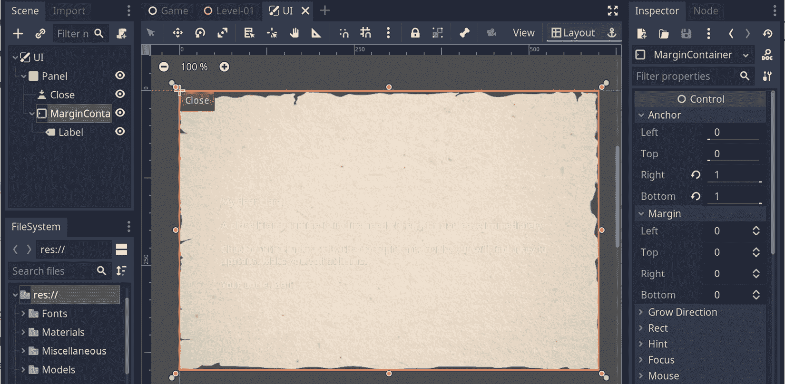

图 11.5 – 文本现在有填充，尽管很难阅读

在那个**边距容器**的属性中，最重要的是调整其在**常量**子部分中的内容边距值。这给了文本一些空间，并正确地将其定位在纸张纹理上。

虽然文本有点难以阅读。那么，让我们看看我们如何使其可读，甚至更好地使其看起来像**图 11.3**。

## 标签节点的样式化

尽管现在**边距容器**占据的空间与**面板**节点一样多，并且它为其所持有的文本提供边距，但文本本身几乎难以辨认，因为它很小且为白色，覆盖在浅色表面上。此外，字体选择是错误的，因为它使用了 Godot 引擎提供的默认字体。在本节中，我们将学习如何解决所有这些问题。

首先，我们在**场景**面板中选择**标签**节点，以便我们可以在**主题覆盖**下进行一些更改：

1.  在**颜色**子部分中打开**字体颜色**选项。颜色可以保持黑色。

1.  在**字体**子部分中，从**文件系统**中选择`Kefario.otf`到**字体数据**属性。

1.  在**设置**子部分中将`28`进行更改。

我们将在稍后讨论发生了什么，但到目前为止我们已经做了以下操作：

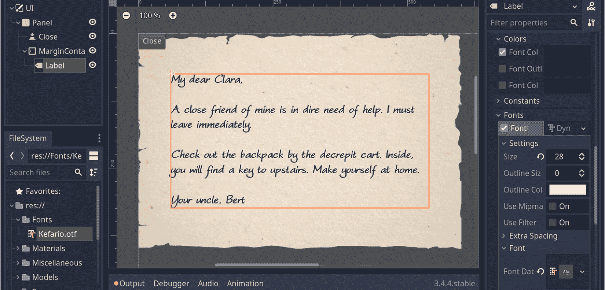

图 11.6 – 标签节点现在看起来更像手写文本

文本的默认黑色颜色看起来似乎不错，但如果你愿意，可以选择不同的颜色。当我们引入字体类型时，发生了一个更加剧烈的变化。我们分两步进行。首先，我们选择了一个**动态字体**类型，它比另一个选项**位图字体**慢，但它允许你在运行时更改字体的属性。然而，由于它像一个包装器，这不足以渲染字体。因此，你需要分配你想要渲染的字体。这就是我们为什么将字体文件分配给**FontData**属性的原因。

我们认为你需要注意的一个重要注意事项是字体，因为它们由称为符号的独立元素组成。你可以把它们想象成字母表中的字母。并不是每个字体都支持字母表的完整范围。例如，在我们设计的笔记 UI 中，如果你将文本 `you will` 替换为其缩写形式 `you’ll`，撇号将无法渲染，因为它在该字体中不是一个符号。通常，付费字体包含一个更大的符号集。否则，继续寻找具有更完整集合的免费选项。

像素与点

当我们选择 28 作为字体大小时，这个数字是以像素为单位的。在一些图形或文本编辑器中，你经常会发现字体是以点来衡量的。这一点你必须小心，因为如果你直接将这些数字转移到 Godot 中，你的字体渲染效果将会完全不同。所以，注意你的单位。

在现实世界中，克拉拉的叔叔的便条只会包含文本部分。因此，期望在一张实际的纸张上有一个关闭按钮是荒谬的。然而，这是一个游戏，我们已经讨论了 UI 如何将现实与功能混合。为了完成笔记的 UI，是时候定位那个按钮了。

## 定位关闭按钮

我们使用了一个巧妙的技巧来定位文本，关于它所在的纸张。我们能复制这个技巧用于 **关闭** 按钮吗？由于按钮不能被视为一个宽结构，我们不能将它放在 **MarginContainer** 内。然而，我们仍然可以将其相对于 **Panel** 节点进行定位。

在 *添加 MarginContainer* 部分，我们使用了一种更长的方法来调整该组件的尺寸。我们还提到我们会使用一个快捷键。这是在 **场景** 面板中选择 **关闭** 按钮后如何使用它的方法：

1.  展开布局菜单并选择 **右下角** 选项。

1.  按住 *Shift* 键，然后按键盘上的左箭头键和上箭头键各四次。

这将使 **关闭** 按钮位于右下角，然后向上拉并向左移动，使其保持在原地。当我们说它将保持在原地时，我们是认真的。例如，选择 **Panel** 节点，然后尝试使用视口中的手柄来调整其大小。按钮是否仍然很好地藏在那个右下角？很好！至于 **Label** 节点呢？文本是否流动以填充额外的空间？整洁！

我们开发你在 *图 11.3* 中看到的内容的努力正在取得成果，如下所示：

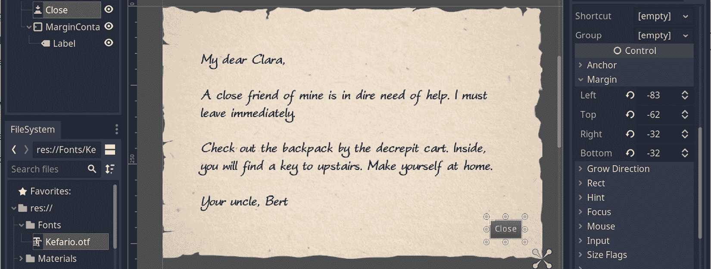

图 11.7 – UI 中的所有元素都经过精心定位

如果你想测试你的场景，请按*F6*。根据您的设置，您可能会注意到**关闭**按钮可能无法正常工作，因为它在**边距容器**后面。所以，尝试通过在**场景**面板中上下拖动节点来调整节点的顺序。当**关闭**按钮在**边距容器**之后时，一切应该都能正常工作。

说到功能，我们还没有为**关闭**按钮设置任何连接。理想情况下，该按钮应该关闭**面板**的可见性，这样注释看起来就像已经关闭了。让我们接下来这么做。

## 添加关闭功能

我们有多种方法可以解决这个问题。为了简洁起见，我们将向您展示一种方法，以便您可以看到涉及的内容。您可能需要在未来的项目中以不同的方式应用类似的原则。

例如，到目前为止我们处理`UI.tscn`场景的方式是将其作为直接子节点的一个大**面板**节点。你的游戏可能需要更多带有永久可见元素的 UI，更多可打开和关闭的注释，带有展开部分以显示更多细节的库存屏幕，等等。有许多可能性，这就是为什么你可以构建不同类型的架构。在这些不同选项之间总会有权衡，所以我们建议如果你有空闲时间，可以尝试实验不同 UI 结构的优点。

不再拖延，我们建议实现关闭功能的方法是在**关闭**按钮中添加一个小脚本。选择它并执行以下操作：

1.  将脚本附加到`Scripts`文件夹中的`ButtonClose.gd`。

1.  让这个脚本文件看起来如下：

    ```cpp
    extends Button
    func _ready():
        connect("pressed", self, "on_pressed")

    func on_pressed():
        get_parent().visible = false
    ```

这种架构假设按钮始终是节点的直接子节点，所以一旦按下，它将使父节点不可见。哎呀！

这种简单结构的优点是方便，按钮不需要知道它所在的节点结构。还有另一种更传统的方法，通过使用**节点**面板和绑定信号来附加**按下**行为。两种方法都行。

构建和改进 UI 元素可能很容易变成一个独立的项目。您可能会被诱惑为所有可能的情况创建一个完美的设置，但请记住，过度优化是存在的。稍后，您可能会意识到您一开始根本不需要所有这些准备。我们将在下一个类似的情况中讨论，其中注释可能更长。

## 总结

现在我们有一个完全功能的 UI 来显示克拉拉的叔叔伯特的注释。如果伯特有更多话要说呢？例如，假设信息在他的名字后面有一行额外的文本，如下所示：

`你的叔叔，伯特`

`P.S. 我想我可能把我的宠物蛇忘在一边了。它可能正在四处游荡，所以小心！`

如果你将这段额外文本添加到**标签**节点的末尾，文本就会不舒服地靠近纸张纹理的顶部和底部。同样，想象一下，如果这个文本块需要更长，这在一些类型游戏中很重要，比如在展示角色扮演游戏中的任务或物品详情时。例如，在显示角色扮演游戏中的任务或物品详情时，这种情况非常常见。

目前，我们可以通过调整文本的字体大小或使边距更窄来适应更多的新文本。然而，在更极端的情况下，使用**滚动容器**节点可能更好。就像你将**标签**节点包裹在**边距容器**中一样，你可以在**标签**节点周围包裹一个**滚动容器**，并对一些东西进行调整，以获得可滚动的文本块。

确定合适的*嵌套层级*和决定 UI 组件的类型及顺序有时需要反复尝试和错误。因此，并没有任何固定的公式。因此，你可能会发现自己正在实践中，看看在你的用例中什么最有效。

话虽如此，将你的努力推广到保持许多 UI 节点的一致外观和感觉可能是有帮助的。我们将接下来处理主题以实现这一点。

# 利用主题的优势

在你的项目中使用或更具体地说，创建主题在很多方面都是明智的。首先，我们将讨论它们的有用性，展示一些视觉示例，然后创建一个用于练习的示例。让我们从为什么你应该使用主题的原因开始。

首先，使用主题将帮助你避免像迄今为止那样手动应用覆盖。当然，你仍然可以在这里和那里添加一些手动修饰，但如果你想完全改变按钮的艺术方向会怎样？这将触发一系列反应来改变其他组件的外观。所以，你将不得不重新开始手动编辑。此外，最糟糕的情况可能是撤销你的更改，因为你知道，我们都是人类，我们往往更倾向于坚持我们的第一个选择。

其次，你可以在游戏中准备多个主题。尽管按钮仍然只是一个按钮，但你可以给它分配多个主题中的一个。这将使该按钮看起来像属于一组组件。因此，你的 UI 元素将具有一致的风格。

最后，运行时更改主题也是可能的。这意味着，如果您在游戏或您用 Godot 构建的应用程序中想要在特殊场合（如圣诞节）交换主题，这是完全可能的。此外，越来越多的桌面应用程序正在使用 Godot 构建。这些也可以通过主题交换来为用户提供最佳选择。Godot 引擎本身允许您更改主题。您可以通过打开**编辑器设置**并尝试一些主题来访问现有主题。例如，尝试**Solarized (Light)**主题。您是否感受到了 Unity 的感觉？

更改主题并不总是关于更改按钮的颜色或字体大小。例如，[`365psd.com/psd/ui-kit-54589`](https://365psd.com/psd/ui-kit-54589) 和 [`365psd.com/day/3-180`](https://365psd.com/day/3-180) 是我们挑选的两个 UI 套件，以展示您的 Godot UI 节点可能看起来有多么不同。*图 11.8*展示了这两个 UI 套件并排：

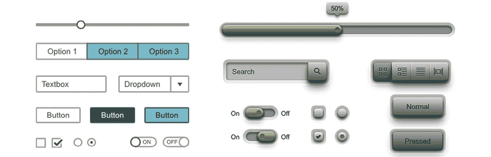

图 11.8 – 两个适合作为主题的独立 UI 套件

由于我们已经看到了如何更改三种类型节点的外观和感觉，即**按钮**、**面板**和**标签**，我们将专注于其他类型的**控件**节点。我们将在创建新主题的上下文中完成此操作。

## 创建新的主题

由于游戏开发是一个迭代的过程，提前规划每一件事可能并不总是可能的，甚至可能是徒劳的。这就是为什么您首先手动更改 UI 节点是典型的。然而，从一个新主题开始并更改此主题的属性也可能是一个好主意。为什么？因为如果您的单独修改组件的实验取得了成功的结果，您就不必在主题中重复您所做的工作。通过在开始时创建主题，您在前进的过程中构建起来。

此外，创建主题就像在 Godot 中创建任何其他类型的资源一样。我们可以通过遵循几个简单的步骤来完成此操作：

1.  在“主题”中的`UI`文件夹上右键单击，并更改其名称。

1.  在**FileSystem**中右键单击`Themes`并选择**新建资源**选项。

1.  选择`Dark.tres`。

这将在您的项目中创建一个**主题**资源。它还应该在下侧区域启用一个新面板，该面板将显示此新主题的预览。当您对主题进行更改时，可以在该区域预览更新，因为这种方式可能比在场景中添加和删除测试组件更快地监控您的进度。

如果预览区域看起来很小，可以通过点击 Godot 版本号旁边的图标来将其放大。这个图标看起来像两个向上的箭头，上面有一条水平线。按下它，主题预览将占据视口。最后，您的编辑器将看起来如下：

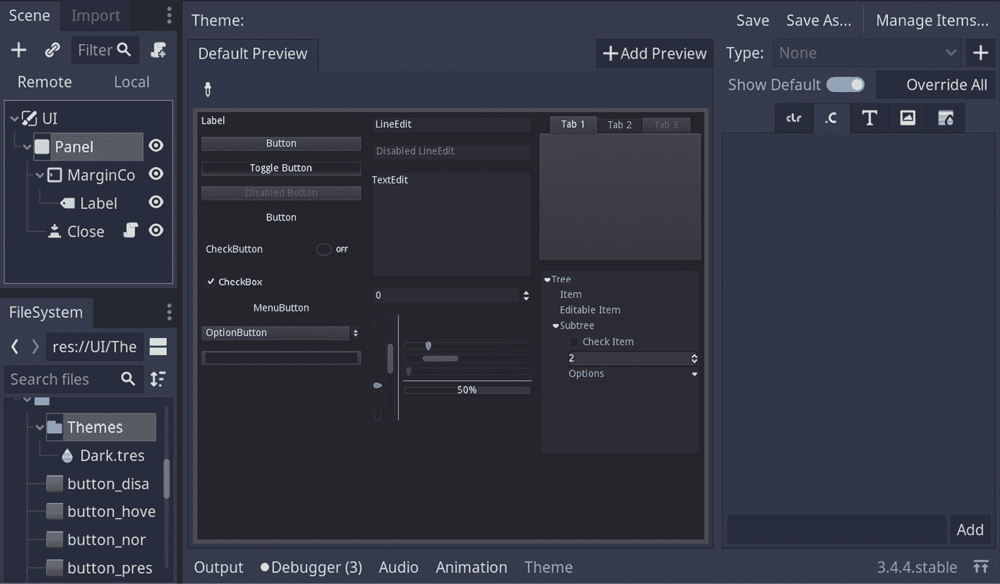

图 11.9 – 主题预览已扩展

顺便说一下，预览区域不是静态的。您可以与这些 UI 组件进行交互。就像一个在 Godot 中运行的 Godot 场景。现在，我们将修改 **CheckButton**、**CheckBox** 和 **VSlider** 组件的主题。我们还将展示 **CheckBox** 节点的特殊状态，在网页开发中也称为单选按钮。然而，我们的首选候选者是 **CheckButton**。

## 设计 CheckButton 的样式

我们将使用来构建新主题的图形资源是 *Dark UI Kit*，您可以在 [`365psd.com/psd/dark-ui-kit-psd-54778`](https://365psd.com/psd/dark-ui-kit-psd-54778) 找到。我们已经将必要的部分导出到 `UI` 文件夹中供您使用。

我们创建的主题仍然是默认主题，因此它仍然显示默认组件。我们将选择我们想要更改的一个。这是如何操作的：

1.  按下带有 **+** 图标的按钮。这个按钮位于 **主题** 预览区域右上角的 **管理项目** 和 **覆盖所有** 按钮之间。

1.  在即将出现的弹出菜单中选择 **CheckButton**。通过这样做，您将在主题预览的右侧看到通过选项卡分隔的此组件的相关属性列表。

1.  切换到第四个标签页，它看起来像带有山形的宝丽来图标。按下 **+** 图标为 **关闭** 和 **开启** 属性。

1.  从 `dark-ui-checkbutton-off.png` 到 **关闭** 插槽，以及类似地，将 `dark-ui-checkbutton-on.png` 拖动到 **开启** 插槽。

1.  在主题预览中与 **CheckButton** 进行交互。

这将有效地改变 **CheckButton** 的外观。您的 **主题** 面板将如下所示：

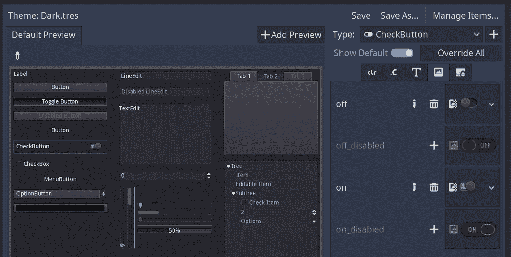

图 11.10 – 我们已使用自定义资源更改了 CheckButton 组件的外观

**CheckButton** 是一个具有两个主要状态的简单组件：开启和关闭。我们对其两种状态的禁用版本不感兴趣，仅仅是因为 UI 套件没有为这种排列提供资源。如果您认为您永远不会在这个组件处于禁用状态，那么您也不必创建和分配艺术作品。

这次让我们攻击一个不同的组件。尽管它的名字相似，并且它具有与 **CheckButton** 相似的状态，但这个节点的一个隐蔽属性使其作为两个不同的组件工作。进入 **CheckBox**。

## 更改 CheckBox 并发现单选按钮

这将是一个类似的工作，但我们将利用更多的资源并填写更多的属性。让我们保持势头，并为主题添加一个新项目：

1.  再次使用带有 **+** 图标按钮，从即将出现的项目列表中选择 **CheckBox**。

1.  第四个标签页可能仍然处于活动状态。如果不是，切换到它并执行以下操作：

    1.  将 `dark-ui-checkbox-off.png` 分配给 **未选中** 属性。

    1.  将 `dark-ui-checkbox-on.png` 分配给 **选中** 属性。

    1.  将 `dark-ui-radio-off.png` 分配给 **radio_unchecked** 属性。

    1.  将 `dark-ui-radio-on.png` 分配给 **radio_checked** 属性。

当你准备你的资产时，选择与资产将被分配到的状态足够接近的文件名。因此，在 **文件系统** 和 **主题** 面板之间关联这些文件会感觉很容易。在做出这些更改后，这就是我们得到的结果：

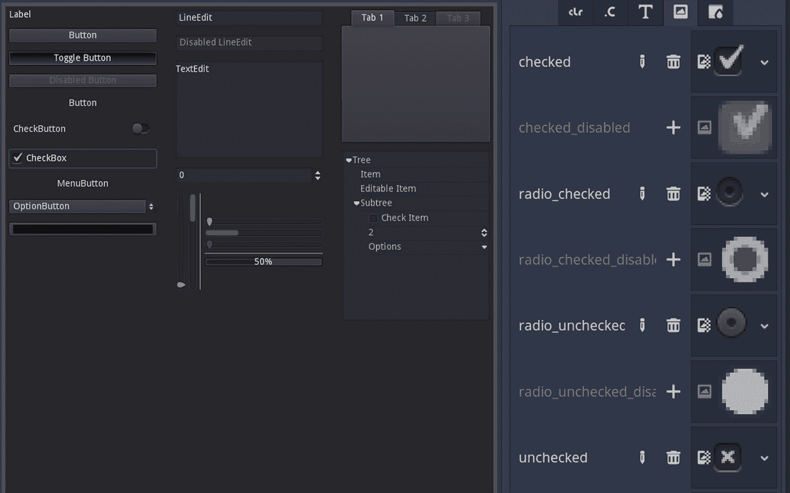

图 11.11 – CheckBox 是我们为暗色主题定制的最新项目

预览区域有 **CheckBox** 组件供你测试，但没有单选按钮。Godot 中没有 **RadioButton** 组件。尽管我们添加了它的资产，但我们还不能模拟它。尽管如此，我们可以调整一个 **CheckBox** 组件，使其表现得像单选按钮。

由于我们需要物理放置一个 `UI.tscn` 场景：

1.  通过在 **场景** 面板中点击其眼睛图标来关闭 **面板** 节点的可见性。

1.  选择根节点，然后添加一个 **HBoxContainer** 节点。立即选择这个新节点，以便你可以执行以下操作：

    1.  向它添加一个 **VBoxContainer**、**VSeparator** 和另一个 **VBoxContainer**。

    1.  在这两个 **VBoxContainer** 节点内部添加两个 **CheckBox** 节点。

    1.  对于第一个两个 `Multiple Choice 1` 和 `Multiple Choice 2`。

    1.  对于最后的两个 `Single Choice 1` 和 `Single Choice 2`。

我们还没有完成，但下面的截图显示了到目前为止发生的情况：

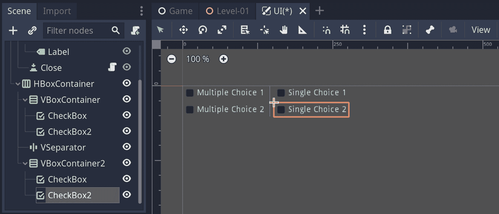

图 11.12 – 以问卷形式组织的四个复选框

我们离将两个复选框转换为单选按钮又近了一步 - 特别是最后两个，因为我们给了它们一些提到单选的文本。因此，当你在 **VboxContainer2** 节点中选择 **CheckBox2** 时，请执行以下操作：

1.  在 **检查器** 面板中将一个新的 **ButtonGroup** 分配给其 **Group** 属性。

1.  点击那个 **Group** 槽中的向下箭头以展开下拉菜单并选择 **复制**。

1.  在 **VBoxContainer2** 中选择 **Checkbox** 节点，并通过展开其 **Group** 选项选择 **粘贴** 选项。这将链接两个复选框，因为它们将共享相同的按钮组。

你应该会注意到两组复选框之间的巨大变化。前两个仍然看起来像复选框，而最后两个旁边有圆形图标，如下面的截图所示：

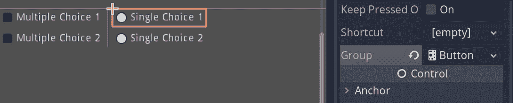

图 11.13 – 两个复选框已被转换为单选按钮

通过共享相同的按钮组，复选框变成了单选按钮。在这个练习中，创建并分配一个通用的**ButtonGroup**对象就足够了。然而，如果你想在应用程序的一个区域创建一组单选按钮，而在另一个区域创建另一个控制不同单选按钮集合的集合，你可能需要创建命名的**ButtonGroup**对象并相应分配它们。

我们不会介绍这种场景，因为我们似乎遗漏了一些我们一直想要的重要东西。我们辛苦工作的复选框和单选按钮都没有反映出我们在主题中定义的艺术方向。让我们看看我们如何利用我们的主题。

## 附加主题

我们之前提到，使用主题可以帮助你更快地设计组件。这是真的，但我们还没有测试这个说法。因为我们已经为复选框和单选按钮准备了样式，所以剩下的只是将这些主题分配给这些组件：

1.  在**Scene**面板中选择**HBoxContainer**节点，并在**Inspector**面板中展开**Theme**部分。

1.  将`Dark.tres`从**FileSystem**拖动到空的**Theme**槽中。

就这样！我们甚至不需要逐个选择每个组件并逐个分配主题。一个更高层次的结构，如**HBoxContainer**，就足够分配主题，以便其子组件可以使用相关部分。

你看到这里的真正潜力了吗？将主题分配给根元素在大多数情况下就足够了。话虽如此，由于每个组件都可以分配自己的主题，但不必这样做，你可以有各种各样的排列组合。在最简单的情况下，将主题分配给根节点在大多数场景中就足够了。

到目前为止，我们一直在设计相对简单的 UI 节点，例如**CheckButton**和**CheckBox**。也许我们可以处理具有一些移动部分的另一个节点，例如**VSlider**。

## 修改垂直滑动组件

当你想要为玩家提供一个简单的方式来调整比率或数量时，例如游戏会话中的可交易物品、音乐音量或游戏设置中的亮度级别时，垂直滑动组件**VSlider**非常有用。同样，你也可以使用水平版本的**HSlider**节点，但两者都完成类似的任务。

由于我们只有**VSlider**的图形资产，所以我们只介绍这种样式的使用。如果你需要，可以将与**HSlider**兼容的现有资产转换过来。你需要将每个部分旋转 90 度并相应保存。为此，你必须遵循以下步骤：

1.  在**Scene**面板中将**VSeparator**和**VSlider**节点添加到**HBoxContainer**中。

1.  为**VSlider**的**Value**属性使用`75`。

1.  在**FileSystem**中双击`Dark.tres`以显示其详细信息。使用带有加号（**+**）图标的老式按钮将**VSlider**添加为新类型。

1.  在这种新类型的自定义属性中激活第四个标签，并将 `dark-ui-vslider-grabber.png` 分配给 **grabber** 和 **grabber_highlight**。

1.  切换到第五个标签，它看起来像一条彩虹方块。

1.  将 `dark-ui-vslider-grabber-area.png` 添加到 **Texture** 属性。

1.  将 **Bottom** 属性的 `6` 展开。

+   通过双击 `Dark.tres` 或切换到底部的 **Theme** 面板来再次打开主题预览。*   为了避免对 **grabber_area_highlight** 属性重复同样的努力，点击其槽附近的加号（**+**），然后抓取并放下 **grabber_area** 属性的样式到 **grabber_area_highlight** 槽。或者，你可以使用下拉菜单从 **grabber_area** 复制槽并将其粘贴到 **grabber_area_highlight**。*   将 `dark-ui-vslider-slider.png` 添加到 **Texture** 属性。*   将 **Bottom** 和 **Top** 属性的 `6` 展开。*   将所有属性的 `1` 设置为 `1`。*   按 *F6* 并欣赏你的辛勤工作。

在这里我们走了很多步，但只有一两个新事物。首先，我们通过拖放将一种样式重新用于不同的属性。这是一个快捷方法，而不是在槽之间复制和粘贴。当两个槽都靠近时很有用。如果你正在复制槽在不同面板上的元素，那么你仍然必须求助于下拉菜单中的复制和粘贴方法。

其次，我们调整了不同类型的边距，**Expand Margin**。滑块有两个独立的组成部分构成了其轨道，滚动就发生在这里，因此我们必须调整这个特殊的边距，使其适合外部的蓝色部分。看看下面的截图，你将看到在 **VSlider** 的轨道内有一个蓝色填充物：

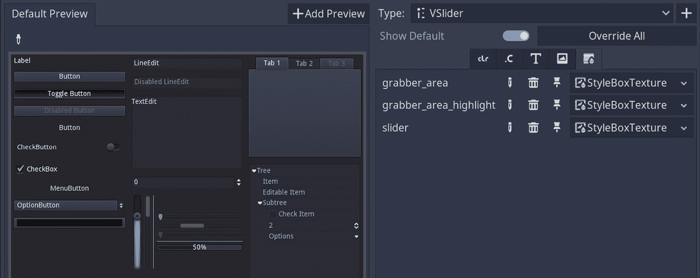

图 11.14 – 经过几步之后，VSlider 组件已经主题化

活动地看到效果比阅读它更容易。所以，当你启动 `UI.tscn` 场景时，尝试与抓取器交互，看看组件如何根据抓取器的位置用蓝色填充其轨道。

## 总结

这就完成了我们设置主题的工作。尽管我们只对少数节点进行了样式化，但你可以自由地使用相同的 UI 套件的其他部分，或者从网站上选择另一个来尝试其他 **Control** 节点。

总的来说，使用主题或单独设计组件涉及两个方面。首先，你可以直接将纹理分配给某些属性，或者通过创建**StyleBoxTexture**间接分配到适当的槽位。其次，还有一些数值属性你可以调整。我们还没有涵盖这个后者。例如，你可以调整处理文本渲染的组件的行高。这些情况容易理解并测试。因此，我们选择展示更多令人头疼的情况。

希望通过实践我们迄今为止所展示的内容，并自己发现更多，你将能够将美丽的图形设计应用到你的游戏中。

# 摘要

我们以辩论 UI 是什么开始本章。我们通过简短的哲学和理论解释来完成这项工作。

假设你的游戏需要 UI，我们研究了构建 Clara 叔叔留下的笔记这样的实际用例。这项工作需要我们与多个**Control**节点一起工作——即**按钮**、**面板**和**标签**节点。

在这个过程中，我们不仅使用了所需的组件，还根据特定的艺术风格对它们进行了设计。

为了避免重复并提升设计的层次，我们展示了如何使用主题可能是一个节省时间的方法。为此，我们展示了如何通过将这些工具包单独导出的图形资产分配给**Control**节点的属性来利用你可以在网上找到的 UI 工具包。

UI 在某种程度上是玩家与游戏互动的工具。话虽如此，在下一章中，我们将发现一种无需 UI 帮助即可更直接地与游戏世界互动的方法。

# 进一步阅读

在介绍中，我们讨论了何时需要 UI。然而，有些情况下，最好的界面根本不是界面。有一个应用——抱歉，是一本书——由*Golden Krishna*所著：*《最佳界面无界面：通往卓越技术的简单路径*》。他谈论了引入更多步骤和元素作为 UI 伪装的干扰。

我们已经讨论了没有 UI 的游戏的可能性，但现在我们将暂停这个论点。在这个阶段，让你尽可能多地接触信息和示例可能更好。因此，以下是一些技术和实际资源：

+   [游戏 UI 设计资源](https://www.toptal.com/designers/gui/game-ui)

+   [Figma UI 工具包设计者指南](https://webdesign.tutsplus.com/articles/figma-ui-kits-for-designers--cms-35706)

+   [界面设计灵感](https://ilikeinterfaces.com/)

+   [游戏 UI 数据库](https://www.gameuidatabase.com/)

本章还向您展示了如何为组件分配字体。市面上有很多免费字体可供选择，但请注意仔细阅读它们的许可协议。虽然它们可能可以下载，但其中一些不能用于商业作品。对于其他任何东西也是如此，尤其是图形资产。
