# 第十三章：通过相机和角色控制器与世界交互

你一直在为游戏世界准备一些零散的东西，尤其是在前两章中。在*第十章* *使用光影使事物看起来更好*中，你向烛台和蜡烛添加了**灯光**对象。你甚至放置了一个脚本以调整这些对象的点亮状态。然后，在*第十一章* *创建用户界面*中，你通过引入**控制**节点创建了一个新的场景。这项工作是为了模拟克拉拉叔叔伯特的一张便条。

尽管我们一直在努力使事物更加复杂，但几乎一切感觉都是静态的。在本章中，我们将向您展示一系列实践，这些实践将建立游戏对象和玩家之间的连接。这将使项目看起来更加生动，感觉更像是一款游戏。

我们首先将探讨的是**相机**节点及其设置。Godot 的视口一直允许你通过一个临时的结构来查看不同的场景，以便你可以使用该软件。这样的临时概念是不够的，因此我们将使用我们的相机系统。

接下来，我们将专注于在世界上的一些游戏对象和玩家之间建立连接。这涉及到在 2D 表面上检测鼠标事件并将这些事件投影到 3D 空间中。可能会有不同的交互，如悬停、点击、按下等，因此我们将探讨检测我们想要执行的动作的方法。例如，我们将点击留在码头上的羊皮纸，以调出我们在上一章中工作的便条。

同样，如果点击发生在我们希望移动克拉拉的区域之一，我们需要一个能够为我们进行路径查找的系统。为此，我们将研究新的 Godot 节点，**导航**和**导航网格实例**。

最后，为什么不添加一点动画呢？在我们发现如何在世界中的两个点之间移动游戏对象之后，我们可以指示该对象触发适当的动画循环。在我们的例子中，克拉拉将在她的空闲状态和行走状态之间切换。因此，我们将回顾在*第七章* *将 Blender 资产导入 Godot*的*导入动画*部分中了解的一些概念。

正如你所见，我们将利用我们已经探讨过的许多主题，但仍有许多新内容等待我们去发现和学习。如果我们能将其列举出来，它将看起来像这样：

+   理解相机系统

+   检测用户输入

+   移动玩家

+   触发动画

在本章结束时，你将对相机设置有更深入的理解，你将能够检测玩家的意图并将它们与游戏中的动作联系起来。多亏了路径查找的简便方法，你将能够将克拉拉移动到你想去的地点，并最终触发适当的动作来模拟她行走。

# 技术要求

我们将继续在上一章结束的地方继续。这意味着你可以继续工作在你现有的副本上。或者，你也可以从本书 GitHub 仓库中的`Chapter 12`的`Finish`文件夹开始：[`github.com/PacktPublishing/Game-Development-with-Blender-and-Godot`](https://github.com/PacktPublishing/Game-Development-with-Blender-and-Godot)。

我们有几个在本章工作中必需的新资产。这些资产位于`Finish`文件夹旁边的`Resources`文件夹中。像往常一样，将它们与你的项目文件合并。

# 理解相机系统

在*第四章*，*调整相机和灯光*中，我们简要介绍了 Blender 中相机的概念。我们了解到没有相机就无法渲染场景。尽管我们最终通过引入相机进行了渲染，但我们从未谈论过相机可以拥有的不同设置。这是故意为之，因为我们将在 Blender 中获得的知识不会直接转移到 Godot 上。幸运的是，现在是深入研究相机如何增强游戏体验的最佳时机。

我们不仅将了解如何设置适合我们游戏的相机，还将发现 Godot 库存中不同类型的相机。像往常一样，或者就像你可能在互联网论坛和梗图上听到的笑话一样，Godot 中肯定有一个节点用于此类事物。

是的，有。事实上，正如这里概述的那样，有四个相机节点：

+   **相机**: 这是作为所有其他相机类型基础的核心类。尽管你可以在场景中拥有多个**相机**节点，但只能有一个活动相机。而且，类似于 Blender，没有相机在这里就什么也看不到。

+   **插值相机**: 这是**相机**节点的增强版本。它增加了三个额外属性，将一个普通的**相机**节点转变为一个跟踪和跟随目标的机制。如果你正在开发一个肩上视角的游戏，这会非常方便。如果游戏角色是目标，当目标移动时，相机会跟上。

不幸的是，这个节点将在 Godot 4 中删除。幸运的是，通过将一个简短的脚本附加到一个**相机**节点上，可以轻松地重新创建其功能。换句话说，如果你移除了**插值相机**节点的花哨部分，你得到的就是**相机**节点，这就是为什么决定在未来版本中删除它的原因。

+   **ClippedCamera**：这是另一种特殊的**Camera**节点，幸运的是，它将被保留在 Godot 4 中，因为它是一个高级相机系统。我们的游戏目前没有使用负责确定哪些对象可以相互穿过或在运动体与碰撞表面接触时弹跳回的**PhysicsBody**节点。因此，我们不会调查这种类型的相机，但如果你不希望你的相机穿过墙壁，你可能想检查一下这个。它将像遵守物理规则的对象一样表现。

+   **ARVRCamera**：你可能已经猜到了：这是用于**虚拟现实**（**VR**）项目的。由于它依赖于很多以**增强现实/虚拟现实**（**ARVR**）开头的其他节点，所以它不是一个作为独立节点使用的工具。构建 VR 项目是一个高级话题，可能需要一本专门介绍这个主题的书。因此，我们也会跳过这个节点。

除了用于 3D 工作流程的相机节点外，还有用于 2D 项目的**Camera2D**节点。因此，总共有五种类型的相机。

在我们展示的所有这些类型中，最有希望的候选者是**InterpolatedCamera**节点。为什么？因为**InterpolatedCamera**节点本质上是一个带有额外功能，如目标和跟踪功能的**Camera**节点。所以，在你的 Godot 3 项目中，你可以从**InterpolatedCamera**开始，将其视为一个**Camera**节点，直到你需要那些额外功能。

由于我们正在继续上一章的工作，整理一些松散的尾巴是有意义的。让我们先从这一点开始，然后我们可以继续介绍相机设置。

## 整理交互性相关的事宜

在`UI.tscn`场景中我们最后做的是对 UI 组件进行皮肤化。在这个过程中，我们已经关闭了负责显示克拉拉的叔叔笔记的**Panel**节点的可见性。然后，我们引入了一系列 UI 节点，所有这些节点都归在一个**HBoxContainer**节点下。我们也会关闭这个容器，但首先让我们通过按*F5*来运行项目。你可能会看到类似这样的内容：

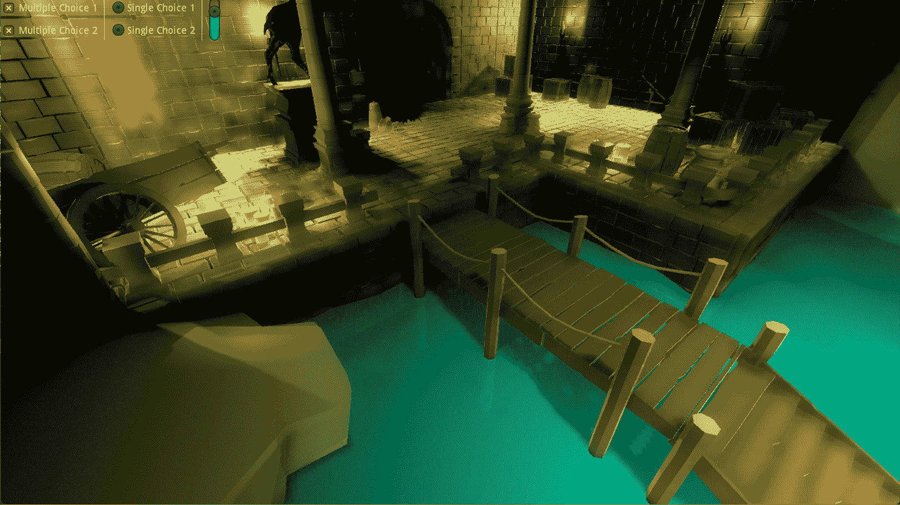

图 12.1 – 我们游戏的第一运行

我们做出的 UI 决策在游戏的右上角是可见的。目前我们不需要这些。所以，如果你已经关闭了`UI.tscn`，请打开它，关闭**HBoxContainer**节点，再次运行游戏。我们将在*检测用户输入*部分很快探讨一些 UI 问题。

也许你已经从我们在前几章中使用的截图或者简单地通过查看项目文件中注意到，已经有一个`Game.tscn`场景被配置为项目的默认场景。这就是为什么当你按下*F5*时，Godot 没有要求你选择主场景，因为我们已经为你分配了一个。

打开 `Game.tscn`，让我们看看这个场景是如何构建的。一切可能看起来都很明显，但有一个标记为 `Game.tscn` 的根节点。另一个节点，**Camera**，将是本章的主要研究区域。

我们将把剩余的努力主要分为两个不同的领域来理解相机的工作原理。最重要的主题是投影类型，这从根本上改变了整个体验。我们建议你在自己的项目中尽早决定这一点，因为在此选择之后，任何其他调整都可以进行。因此，在我们处理单个相机设置之前，让我们看看有哪些类型的投影。

## 决定投影类型

如果你上过学习如何绘制建筑的美术课程，这可能是一个你已经熟悉的主题。我们使用的 Godot 版本提供了三种类型的投影。尽管我们将主要关注前两种，但我们会简要定义所有投影类型，如下所示：

+   **透视**：这是默认的相机投影，其中距离相机越远的物体看起来越小。因此，两个尺寸完全相同的物体，当其中一个物体放置在远离相机的地方时，看起来就像它们的大小不同。这也是人类感知世界的方式，所以如果你不这样，可能需要检查一下。

+   **正交**：也称为 **正交投影**，这种投影方式在不改变物体大小的情况下渲染相同尺寸的物体，无论其距离相机有多远。这种投影类型可以为你的游戏带来所需的戏剧性外观。此外，还有一些类型的游戏——角色扮演（*Fallout* 系列）和 **探索、扩张、开发、灭绝**（**4X**）（*文明*）——更倾向于使用这种投影。

+   **视锥体**：这是一种相对较新的投影类型，在某些类型的游戏中有其用途——例如，为了获得一些老式游戏曾经使用的 2.5D 外观，其中视觉效果看起来被拉伸。如果你想了解更多信息，[`zdoom.org/wiki/Y-shearing`](https://zdoom.org/wiki/Y-shearing) 有一些关于这个主题的信息。

在大多数情况下，我们列出的前两种投影就足够了。也许通过实验来调查它们之间的差异会更好。因为我们已经看到了 **透视** 投影类型，所以尝试 **正交** 投影类型是有意义的，所以请按照以下步骤进行：

1.  选择 `Game.tscn` 场景。

1.  将其 `6` 改变。

1.  按下 *F5* 运行游戏，并注意其不同的艺术风格。

在我们做出这些更改后，这就是我们得到的结果：

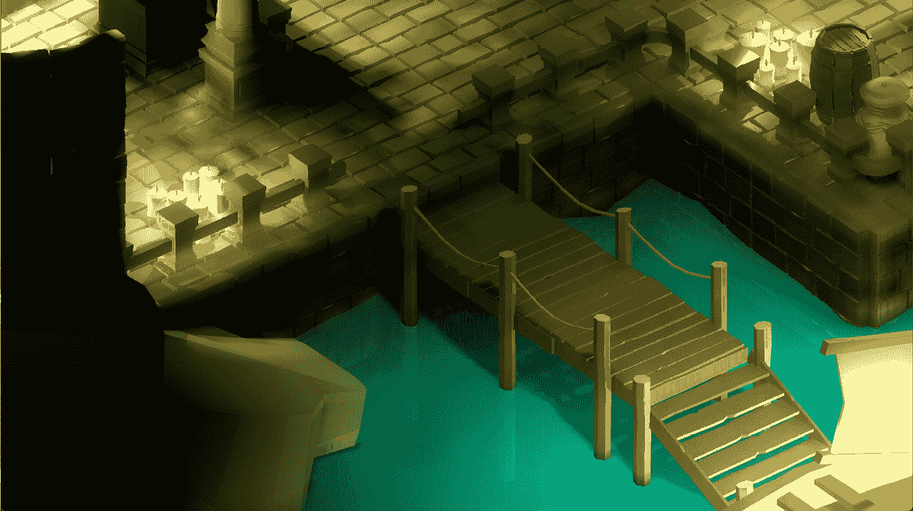

图 12.2 – 从同一位置的正交相机视图

我们选择了`12`。然而，大多数 PC 显示器都遵循横向布局。这就是为什么**保持高度**是默认选项，但如果你正在制作移动游戏，你可能想将正确的**大小**值与选中的**保持宽度**选项混合使用。

相机特定环境

当我们在**检查器**面板中查看**相机**节点的不同属性时，现在可能是复习**环境**主题的好时机。在*第十章*的*创建后处理效果*部分，*用光和阴影使事物看起来更好*，我们发现了如何创建一个改变关卡外观的环境。如果你想覆盖一些环境设置，你可以通过为相机分配一个单独的**环境**对象来实现。全局和相机特定环境的效应将会结合。

无论你为哪个平台选择什么值，有一点是明显的。尽管我们没有在世界上移动相机的位置和旋转，但我们得到的效果却完全不同。而我们在*图 12.1*中看到的后面的洞穴门在**透视**投影中，**正交**视图不允许我们看得那么远，如*图 12.2*所示。当你比较这两个截图时，近处的元素几乎相同，但**正交**视图模拟了一个比向前看更顶部的视角。

在**检查器**面板中更改内容并按*F5*键查看你的更改效果可能会很快感到疲倦。当**相机**节点仍然被选中时，如果你打开**预览**复选框，如以下截图所示，你可以在编辑相机属性时加快你的工作流程：

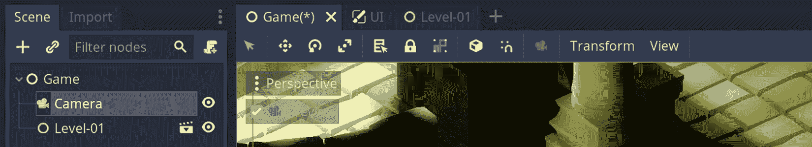

图 12.3 – 预览相机所看到的内容很方便，只需一个复选框即可

这将让你在调整相机设置的同时预览相机所看到的内容。请注意，在预览期间，你无法自由地在场景中移动。实际上，你甚至无法选择对象。所以，当你想回到编辑场景时，记得将其关闭。

根据我们迄今为止所展示的内容，我们应该选择哪种投影类型？我们将选择**透视**模式。因此，现在，将你的**相机**节点的**投影**设置恢复到默认值。由于 Godot 用相关属性装饰了**检查器**面板，**大小**属性将被**Fov**属性取代。

让我们专注于这个新属性以及我们想要应用到**相机**节点上的其他一些更改，在下一节中。

## 调整游戏中的相机设置

在本节中，我们将讨论你刚刚接触到的这个新术语**Fov**，并展示我们应该应用到相机上的其他设置。如果你从开始就在制作自己的关卡设计，那么我们提到的相机位置和旋转将毫无意义。这就是为什么我们会给你一些一般性的指导，以传达练习的精神。同时，希望你看到的截图能帮助你更好地将我们的关卡条件与你的条件对齐。

首先，我们快速定义一下这个新术语。**视场角**（**fov**）是以度为单位测量的设备感知世界的角度。实际上，如果你把你的眼睛当作设备，你的眼睛也有一个 fov 值。这是一个高度技术性的领域，所以我们将在**进一步阅读**部分提供一些链接，让你自己探索。

目前，我们对这个主题的实用应用更感兴趣，因为它与你游戏的横竖屏模式或游戏是为 PC 还是游戏机而设计的相关。Godot 使用的默认值**70**是一个相当合理的平均值，适用于大多数情况。然而，这个默认值也假设你将以横屏模式运行你的游戏，因为它由**保持宽高比**属性决定，该属性设置为**保持高度**。

由于玩家可能拥有不同尺寸和分辨率的显示器，应用程序必须选择高度或宽度作为**真实来源**（**SOT**）并相应地应用其他必要的转换，以避免视觉扭曲。有时，这种做法会导致在视觉上方和下方出现黑色条带。这种方法被称为**信箱模式**，在电影行业中也被用来将具有方形宽高比的电影转换为现代更宽的屏幕（从 4:3 到 16:9 或 16:10 的比率）。

如果你将鼠标悬停在**检查器**面板中的**Fov**属性上并阅读工具提示，你会看到你可以根据游戏将使用的宽高比设置多个值。因此，我们将让你选择最适合你条件的最优值。不过，我们提供了以下截图来展示不同**保持宽高比**和**Fov**值的排列组合：

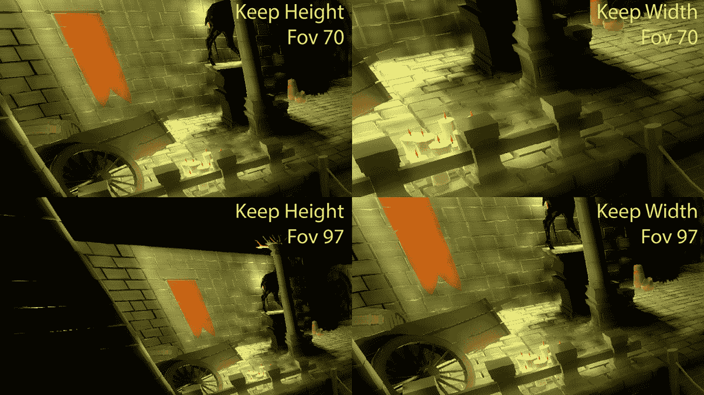

图 12.4 – 相机位置相同，不同宽高比约束和 fov 值

差异真是太大了！在不改变相机设置的情况下，不同的排列组合会产生大量不同的结果。让我们通过讨论**Fov**（视场角）的更高和更低值来结束**Fov**这个话题，以便你在自己的项目中做出更好的决策。

最后，你应该选择的**Fov**值将取决于玩家的观看距离，这并不是你事先就能真正了解的事情。然而，你可以遵循一些惯例。例如，控制台游戏使用较低的**Fov**值，因为它提供了一个类似缩放的视图，以补偿屏幕和玩家之间的距离。通常，控制台游戏玩家会坐在距离屏幕几米远的沙发上，而屏幕通常很大。

另一方面，PC 玩家通常距离显示器不到一米，因此可能最好使用更高的**Fov**值。这增加了沉浸感，因为玩家会感觉到通过这种稍微缩小的视角，他们能够看到更多的世界。然而，众所周知，过高的**Fov**值也会造成晕动症。当你的大脑被迫处理过多的世界信息时，你会感到胃部不适，尤其是在**第一人称射击**（**FPS**）游戏中。

Fov 计算器

有一个方便的计算器可以帮助找到理想的**Fov**值：[`themetalmuncher.github.io/fov-calc/`](https://themetalmuncher.github.io/fov-calc/)。选择你的屏幕的宽高比和方向，计算器将消除一些猜测。显然，如果你允许玩家在游戏设置中更改屏幕分辨率，你必须通过编程更新游戏使用的**Fov**值。

为了完成本节内容，我们将保持**Fov**的值为`97`，并选择**Keep Width**作为画面的宽高比，因为这从艺术角度来看效果更好。此外，由于这个级别非常小，因此不需要让摄像机跟随游戏角色。不过，我们仍然可以尝试选择**Camera**节点的最佳角度和位置，以便看到大部分场景。正如之前提到的，我们的值并不会意味着太多。然而，尝试更改**Camera**节点的**Translation**和**Rotation Degrees**值，以匹配这里所看到的：

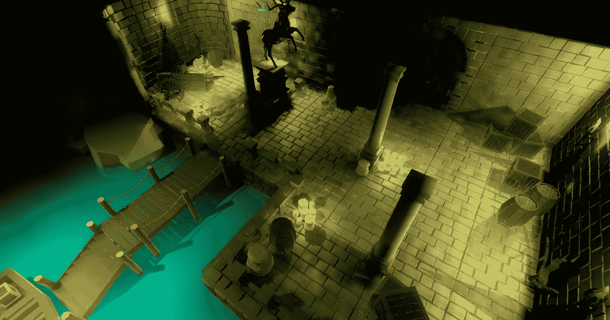

图 12.5 – 摄像机的最终位置

这种视角将给我们带来一些东西。首先，它覆盖了最关键的角度。克拉拉只能在这个级别上走到某些地方。此外，并非每个可通行的地方都是重要的。尽管如此，从这个角度看，似乎没有遗漏任何重要的东西。

其次，根据她叔叔的笔记，破碎的手推车后面有一个背包。从这里看很难看到它，因为那个角落的壁灯光线不足以使背包非常明显。所有这些都是故意的，因为我们希望克拉拉手里拿着火把，这样额外的光线就足以让她或玩家注意到一个重要的物品。

最终，我们希望玩家能够看到并交互世界中的对象，特别是背包，因为它持有通往楼上的钥匙。游戏设计师常用的玩家与世界交互的常见工具是鼠标事件，这是我们接下来将要发现的。

# 检测用户输入

鼠标事件是你在视频游戏中可以检测到的许多用户输入类型之一。其他最常见类型是键盘或游戏控制器事件，这些内容本书不会涉及。然而，检测鼠标动作的原则与其他类型事件的处理方式相似。我们之所以更关注鼠标事件，是因为你还需要处理一个额外的复杂层，这正是本节将要讨论的内容。让我们直接深入探讨。

在传统的桌面应用程序，如文本或视频编辑软件中，界面通常充满了许多按钮、菜单等。你期望此类软件的用户点击这些指定的位置，这是应用程序的制作者预期并为你准备的。那么在 3D 游戏中，你该如何处理这个问题呢？

看看，当你点击屏幕上的任何位置时，你实际上是在点击一个 2D 表面。因此，基于*x*和*y*轴定义点击的坐标原本是有意义的。让我们使情况更简单。我们不是点击任何复杂的东西，只是屏幕的中间。通过知道显示器的分辨率，我们可以进行计算，并得出两个轴上都是分辨率一半的坐标。

让我们想象一下，在这个特殊情况下，我们一直在屏幕中央点击，我们看到的是*图 12.5*中的游戏世界。这个点击在我们的关卡中对应的位置在哪里？更有趣的是，如果你实现了一个可以移动到其他位置的摄像机，甚至因为游戏原因而旋转，你如何将相同的*x*和*y*坐标映射到 3D 空间中的不同位置？

这是一个具有挑战性的主题，并不总是容易解决，但让我们看看我们可以使用哪些技术来识别鼠标事件。

## 知道玩家在哪里交互

行业中有一个常见的检测玩家在 3D 世界中指向位置的技巧。这被称为**光线投射**，YouTube 上充斥着针对这一特定主题的教程，不仅限于 Godot 引擎，还包括其他游戏引擎。它假设你从屏幕上点击的位置向 3D 世界中的某个位置投射一条光线。由于游戏引擎已经能够通过考虑游戏对象相对于摄像机的位置来渲染游戏，而摄像机恰好是你的屏幕，因此计算已经为你完成，在一定程度上。

尽管这种技术把你引向了正确的方向，但你仍然不知道路径上的哪个对象是你想要选择的。也许射线的一个不幸的类比可能是一个足够强大的子弹，它穿越了它所连接的所有对象。所以，如果射线投射产生了许多结果，你必须消除你不需要的。幸运的是，有一个更直接的方法。

只为我们要的对象分配检测逻辑会方便得多。例如，我们可以在我们的场景中引入一个新的模型——具体来说，是一张羊皮纸——直接放在码头上的木条上。一旦玩家点击这个对象，我们就会触发隐藏在`UI.tscn`场景中的笔记。通过这项工作，你也将练习一些你在早期章节中使用过的方法。以下是需要采取的步骤：

1.  从`Parchment.glb`创建一个新的场景，并将其保存为与同一文件夹中的`Parchment.tscn`。

1.  由于有一个默认的环境正在生效，场景将会很暗，很难跟随接下来的步骤。要禁用它，打开`Parchment.tscn`。

1.  在根节点下添加一个**StaticBody**节点。

1.  在你刚刚引入的最后一个节点下添加一个**CollisionShape**节点，并在**Inspector**面板中将一个**New BoxShape**分配给其**Shape**字段。

1.  通过单击此新形状来扩展它。在**Extents**部分的**X**、**Y**和**Z**字段中分别输入`0.15`、`0.14`和`0.06`。这个形状应该包含模型。

1.  仍然在它的**Translation**部分的**Z**字段下的`0.05`。

我们还没有完成羊皮纸场景，但让我们休息一下，解释一下发生了什么。

我们在我们的工作流程中添加了第一个**PhysicsBody**类型的节点，使用了一个**StaticBody**节点。还有其他类型，例如**KinematicBody**、**RigidBody**，等等，如果你想要提供基于物理的游戏玩法。由于我们将放置在世界的羊皮纸对象不会移动，我们选择了**StaticBody**。

然后，我们将一个碰撞形状分配给了**StaticBody**节点。如果你想让引擎检测到你的对象相互碰撞，那么在游戏对象中添加碰撞是必要的。通过这样做，游戏引擎可以确定这些对象的未来轨迹和速度。

游戏引擎可以检测的一种碰撞类型是当玩家使用输入设备与对象交互时。例如，玩家可能将鼠标移到对象上，点击此对象，甚至想要将其拖动到其他地方。在所有这些可能性中，我们只对检测玩家何时点击羊皮纸模型感兴趣。我们将在下一节中学习如何区分我们想要的精确事件。

## 区分有用的鼠标事件

我们已经构建了所有必要的机制来开始检测碰撞。我们包裹 parchment 模型的基本形状将充当传感器，以了解是否发生碰撞。在众多不同类型的碰撞中，我们主要对监听鼠标事件感兴趣，并且——更具体地说——检测鼠标点击。

我们将把这个对 parchment 的点击视为打开当前隐藏的 `UI.tscn` 场景的先兆。最终，我们将在 parchment 和 `UI.tscn` 场景之间建立一个通信线路。首先，让我们看看我们如何捕获碰撞并过滤出正确的类型，以便我们可以在以后触发我们想要的连锁事件。以下是操作步骤：

1.  将脚本附加到 `Parchment.tscn` 的根节点，并将其保存为 `Parchment.gd`。

1.  选择 **StaticBody** 节点并打开 **Node** 面板。

1.  双击 **CollisionObject** 头下的 **input_event** 项。

1.  按下 `Parchment.gd` 脚本，如下所示：

    ```cpp
    extends Spatial
    signal show_note
    func _on_StaticBody_input_event(camera, event, position, normal, shape_idx):
        if event is InputEventMouseButton and 
          event.pressed:
            emit_signal("show_note")
    ```

理论上，我们现在正在跟踪 **StaticBody** 节点上的输入事件。然而，在实践中，由于生成此事件的碰撞形状正好位于 parchment 上，我们的设置将表现得好像你正在检测 parchment 本身的点击。以下截图显示了我们在编辑器中的进度：

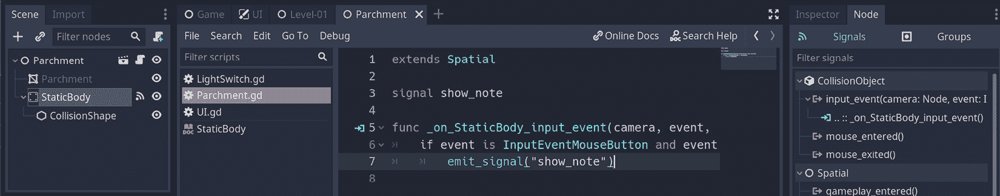

图 12.6 – 我们正在将输入事件附加到 parchment 对象

我们捕获的输入事件足够通用，但我们正在过滤它，以便它仅在鼠标点击条件下有效。然后，我们通过发射 `show_note` 信号来转换这个点击的意义，但谁在监听这个调用？某个构造体可能能够理解这个信号——更具体地说，是 `UI.tscn` 场景。让我们接下来按照以下方式连接它们：

1.  打开 `UI.tscn` 并将脚本附加到根节点。将其保存为 `UI.gd` 并添加以下代码行：

    ```cpp
    export(NodePath) onready var note_trigger = get_node(note_trigger) as Node
    ```

1.  打开 `Level-01.tscn` 并在 **Props** 组中创建 `Parchment.tscn` 的实例。将这个新节点放置在码头木条上，使其相对靠近船只。

1.  在 **Scene** 面板中选择 **UI** 节点。在 **Inspector** 面板中，这个节点将有一个 **Note Trigger** 字段。按 **Assign…** 并在弹出菜单中选择 **Parchment**。

1.  返回到 `UI.gd` 脚本，并添加以下代码行：

    ```cpp
    func _ready():
        note_trigger.connect("show_note", self, 
                             "on_show_note")
    func on_show_note():
        $Panel.visible = true
    ```

这里发生了很多事情，只有几行基本代码。首先，我们为 `show_note` 信号准备了一个字段——以便它可以触发 `on_show_note` 函数。当这个函数作为玩家点击 parchment 的结果运行时，本质上代表伯特笔记的 **Panel** 节点将变得可见。

当你在*第十一章*“创建用户界面”中构建 UI 时，如果你没有完美地居中**面板**，你现在可以通过使用 3D 视图中标题栏的**布局**按钮来实现。如果你愿意，你可以将**面板**放置在任何你想要的位置。最终，当你按下*F5*并运行游戏，在你点击码头上的羊皮纸后，你会看到如下内容：

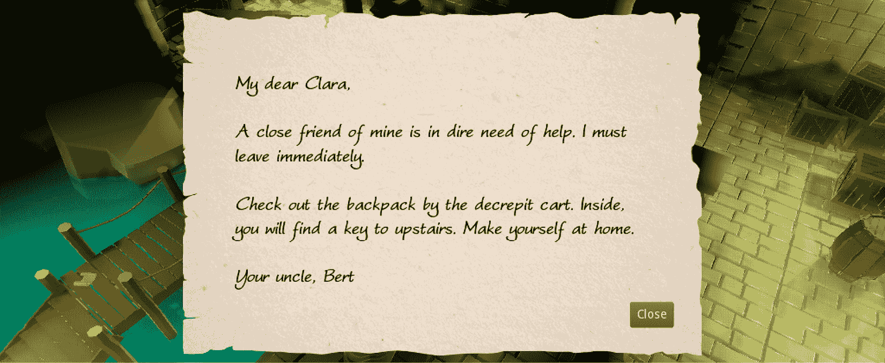

图 12.7 – 伯特给克拉拉的笔记在玩家点击羊皮纸时打开

请记住，**关闭**按钮已经连接好了，所以当你按下它时，会关闭笔记。如果你这样做，你可以通过点击羊皮纸再次打开笔记。谁知道一个简单的鼠标点击可以意味着不同的东西呢？在一个上下文中，按下平面表面相当于点击一个 3D 对象，然后触发其他游戏系统。在另一个上下文中，它是按下 UI 元素，如按钮。

灯台和蜡烛

如果玩家能够点击羊皮纸，他们不能点击周围级别的灯台和蜡烛吗？他们可以，但他们现在不会得到任何反应，因为你必须构建一个碰撞结构，就像我们对羊皮纸所做的那样。这是一项你可以作为练习来完成的任务。

我们不打算在我们的游戏中实现库存系统。然而，在那些采用此类功能的游戏中，常常会看到羊皮纸从世界中消失，并在玩家的库存中找到自己的位置。然后，玩家可以稍后点击代表他们库存中笔记的图标，再次调出笔记用户界面。在这种情况下，你的用户界面结构也必须监听来自不同结构的`show_note`信号，但原理是相似的。

目前没有库存系统并不会真正损害我们的工作流程，因为我们有更紧迫的问题，比如帮助玩家移动。尽管我们有一个有坚实地板的级别，但我们没有能够在上面站立的玩家角色。我们将在下一节中探讨如何引入一个角色并移动它。

# 移动玩家

你可能听说过，在现实生活中上下文很重要，因为上下文可以使一个普通的词或陈述显得特别糟糕或有趣。这在大多数技术领域都是一致的——更具体地说，当我们试图描述视觉或艺术方面时。有时，使用同义词是可以的，但区分可能至关重要——甚至有时是必要的。例如，在上一个部分的结尾，我们声称我们将移动一个角色。这可能是一种通过书本页面进行心灵感应的荒谬尝试，但如果你想象一个像克拉拉这样的两足生物用腿走路，挥动双臂，我们会错吗？

很可能你已经这样想过，但在这个时候你必须等待，因为我们甚至还没有在关卡上的两个位置之间移动一个对象。从上下文类比的角度来看，并不是每一次移动都必须涉及完整的动画。克拉拉的模型，或者更不用说一个普通的立方体，也可以通过遵循路径来移动。因此，将运动和动画视为两个不同的主题可能更为合适。这就是为什么我们将在本节首先处理运动之后，在*触发动画*部分稍后介绍动画。

现在你已经知道对象穿越场景和带有动画穿越之间的区别，那么一个重要的问题就是：*如何检测移动对象的位置？*让我们在关卡设计方面更加具体。我们有一个码头，我们最近在上面放置了一张羊皮纸。基本预期是玩家角色将站在这张羊皮纸旁边。一旦玩家读完笔记，我们希望他们能够到达背包，获取一把钥匙来解锁通往楼上的门。因此，我们需要一个机制来完成以下任务：

+   检测点击

+   寻找一个可能的路径

+   将玩家移动到他们想要的位置

在我们开始处理这些项目之前，我们首先需要两个关键成分：**导航**和**导航网格实例**。这两个节点携手合作，指定关卡中的一些区域为可通行区域。毕竟，我们不想让玩家到处走动或穿过物体，这就是我们在关卡周围放置的一些道具的重要性。

为了简洁起见，可以互换使用

尽管我们已经指出了运动和动画之间的主要区别，并声称我们不能互换使用这两个概念，但在我们即将在本节中探讨的两个节点方面，我们却很幸运。你很快就会看到，一个**导航**节点实际上无法在没有依赖**导航网格实例**的情况下完成其工作。我们将使用**导航**作为一个通用概念（除非另有说明）来讨论导航，而在技术上，我们可能正在描述**导航网格实例**节点的属性。

话虽如此，让我们创建玩家可以通行的区域。

## 使用导航节点创建可通行区域

我们在*第九章* *设计关卡*中开始设计的关卡有一些不错但也很令人烦恼的特点。从视觉角度来看，道具及其在世界的放置看起来很自然。即使是像破损的手推车和鹿雕像这样体积较大的物体，当人们走在码头和门之间时，也都在视线范围内。有用性和杂乱无章的元素混合在一起。

说到杂乱无章，当我们引入`Level-01.tscn`并按照以下步骤进行时：

1.  在根节点中添加一个**Navigation**节点。然后，在刚刚引入的最后一个节点下面添加一个**NavigationMeshInstance**节点。

1.  将**Floor**、**Columns**、**Rails**、**Props**和**Dock**组拖放到**NavigationMeshInstance**节点下。

1.  选择**NavigationMeshInstance**节点，并在**Inspector**面板中将一个新的**NavigationMesh**分配给其**Navmesh**字段。

1.  点击并展开这个新属性，以便你可以执行以下操作：

    1.  在其**Cell**部分的**Height**字段中输入`0.18`。

    1.  在其**Agent**部分的**Max Climb**字段中的`0.2`处输入`0.4`。

    1.  在其**Filter**部分下打开**Ledge Spans**选项。

1.  按下你的数字键盘上的*7*键以切换到**Top Orthogonal**视图。

1.  在 3D 视口的顶部按下**Bake NavMesh**按钮。

如果你的关卡设计与我们不同，请尽量按照我们提供的步骤进行，特别是在你直接将我们的值转移到你的系统上时，这可能不适合。最终，你会看到类似这样的东西：

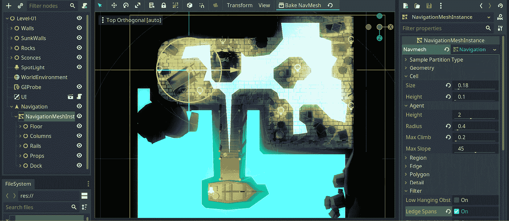

图 12.8 – 我们已经引入了一个 NavigationMeshInstance 节点并对其进行了配置

注意由**Navigation**节点引入的浅蓝色叠加。从引擎的角度来看，所有这些都可以通行。不过，有些地方有些尴尬。当你将**Dock**组拖入**Navigation**节点时，**Water**节点也随之而来。因此，它也被考虑为一个候选者。

如果这是一个**Dungeons & Dragons**游戏，你的玩家可能知道**Water Walk**咒语，并且能够在水网格上行走。在 Clara 的世界中没有这样的咒语，但如果你允许游戏有这样的机制和风味，这可能是一个需要考虑的因素。因此，我们最好通过以下方式改变其在层次结构中的位置，而不是完全移除水：

1.  将**Water**节点移动到**NavigationMeshInstance**节点以外的其他地方——例如，在**SpotLight**节点上方。

1.  同样，将**Parchment**从**Props**组中拖出。

1.  选择**NavigationMeshInstance**节点并再次按下**Bake NavMesh**按钮。

在不同的层次结构中，新烘焙的可通行区域应该看起来像这样：

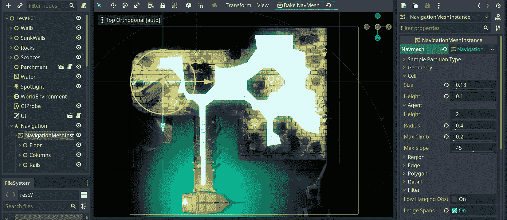

图 12.9 – 由于处于不同的层次结构，水不再可通行

通过确定哪些区域应包含在**NavigationMeshInstance**节点中，并在**Inspector**面板中调整值，你可以得到一个更精确的布局。最终，如果你能在玩家到达重要地点之前在他们面前放置一些障碍物，而不是让他们沿着一条完美的直线前进，你将创造更多引人入胜的游戏玩法。

如果你的关卡布局在某些关键区域（如购物车附近的背包）看起来不可穿越，那么就移动一些这些道具并烘焙一个新的地图。当我们介绍移动逻辑时，这将非常重要。

如果你想要更好地感觉哪些区域是可到达的，你可能想要将视图旋转到 **Perspective**。说到这一点，谁将走过这些区域？在我们深入研究更高级的角色模型（如 Clara）之前，我们应该先介绍最基本的玩家角色。

## 介绍基本玩家角色

在本章早期，在 *了解玩家交互的位置* 部分，当我们询问玩家如何与羊皮纸交互时，我们引入了一个 **StaticBody** 节点，因为该物体不会移动。我们还提到，**StaticBody** 是除了两个其他常用节点之外，你可以使用的许多 **PhysicsBody** 选项之一，如以下所述：

+   **RigidBody**：没有对自己有控制的物体属于这一类别。一开始，“rigid”这个词可能有些令人困惑，因为它传达了物体强度或灵活性的感觉。相反，你可以使用 **RigidBody** 节点来模拟足球或炮弹的运动。你通常会对具有此节点的物体施加力，这将指导物理引擎如何计算它们的轨迹、碰撞等。

+   **KinematicBody**：实际上可以控制自己在世界中如何行为的物体属于这一类别。通常，玩家角色使用此节点，但任何创建自己运动的系统（如真正的引擎或火箭）都需要使用此节点。

因此，我们最好的选择是使用 **KinematicBody** 节点来模拟玩家角色。我们现在将遵循以下步骤来创建一个非常简单的角色：

1.  创建一个新的场景，并将其保存为 `Player.tscn`，位于 `Scenes` 文件夹下。

1.  以 **KinematicBody** 节点作为其根节点。然后，在根节点下添加一个 **CollisionShape** 节点和一个 **MeshInstance** 节点。

1.  为其 **Radius** 属性选择 `0.4`。

1.  在 **Transform** 部分的 **Rotation Degrees** 下的 **X** 字段中输入 `90`。

+   为其 **Radius** 属性选择 `0.4`。在 **Transform** 部分的 **Rotation Degrees** 下的 **X** 字段中输入 `90`。在 `Player` 中选择 `0.9`。

这将创建一个胶囊形状，这是一种模拟玩家角色的快速方法。我们还选择了一个与我们所创建的网格很好地配合的碰撞形状。由于在 `Player.tscn` 场景中没有什么可看的，所以我们最好向您展示它在世界中的放置位置。在 `Level-01.tscn` 中创建其实例，并按照以下截图所示进行定位：

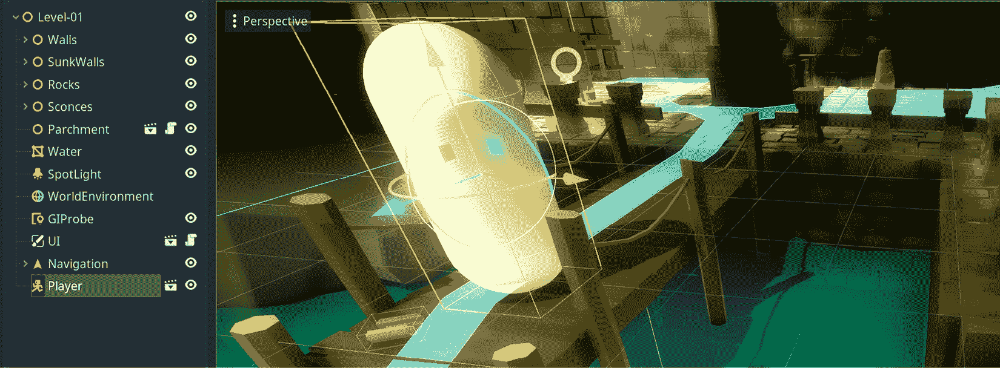

图 12.10 – 一个直立的长条形玩家角色

玩家角色，尽管现在看起来像是一个站立的小药丸，但现在它是世界的一部分，可以移动。它只需要被告知去哪里。在我们甚至不知道它应该去哪里之前，我们如何给它指令？为了解决这个谜团，我们不得不准备一个结构来捕捉点击。所有这些最终都会让我们重新审视在**检测用户输入**部分之前忽略的一个主题：射线投射。毕竟，它将帮助我们了解玩家在世界中的点击位置。

## 准备射线投射的点击区域

当您确切知道哪些对象应该是交互式的并接收鼠标事件时，我们在**区分有用的鼠标事件**部分应用的方法仍然有效。它涉及到游戏设计师的预期，因此基本绑定可以在早期完成，就像我们看到的。然而，如果这种情况并不总是可以预见，或者这种方法在更大规模上有多可行？

例如，如果我们给到目前为止使用的每个楼层模型都添加一个**静态体**节点，我们当然可以检测鼠标点击。然而，有时这已经有点太晚了。现在，我们的关卡中所有的地板块都是模型实例而不是场景实例，因为当时放下模型并完成关卡设计很方便。我们仍然可以尝试从地板模型中创建一个场景，但您仍然需要交换关卡中的所有地板资产。这是一项大量工作。

由于我们已经知道需要一个**静态体**节点来启动输入响应，我们还可以利用它。我们不必将其附加到每一块地板上，而可以指定一个与所有地板块占据的面积一样大的区域，并检测这个大块上的点击。以下是这样做的方法：

1.  在关卡中添加一个**静态体**节点，并在其中放置一个**碰撞形状**节点。

1.  在**检查器**面板的**形状**字段中分配一个**新盒子形状**。

1.  展开这个新属性并调整其`9`、`1`和`8`，但您可能希望在完成下一步后再调整这些值。

1.  将`-1.05`的位置调整到其顶部几乎与地板对齐，但略低于羊皮纸。我们将在移动玩家后讨论这个问题。

1.  其**X**和**Z**值位于其子节点**碰撞形状**包围地板块和码头上的可通行区域的位置。

如果您切换到**俯视图**，可能更容易决定测量。以下截图中的蓝色正方形代表我们想要用作点击检测器的区域：

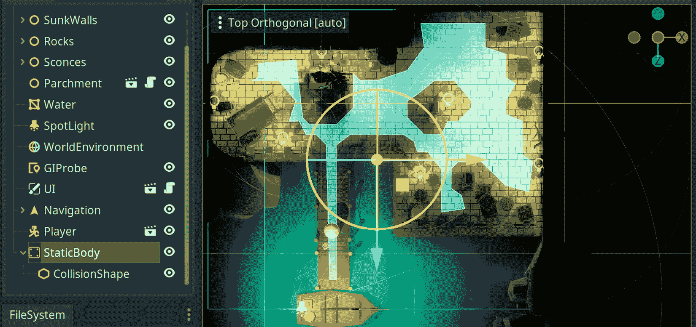

图 12.11 – 静态体节点覆盖所有可通行区域

你可能会想知道我们是否过度了检测区域，因为*图 12.11*清楚地显示它比可通行区域大得多。简短的解释是，当你点击在可通行区域外的区域时，路径查找算法会将玩家带到附近的地点，但永远不会到达玩家点击的确切位置。例如，如果你在水里点击，那么玩家角色将移动到点击位置尽可能接近，但仍然保持在限制范围内。

当你看到代码时，从技术角度来看可能会更清晰。话虽如此，让我们将一些代码附加到玩家角色上，以便它可以四处移动，如下所示：

1.  打开`Player.tscn`并选择根节点。

1.  将`Scripts`文件夹中的`Player.gd`文件附加到**Inspector**面板中的**Script**字段。

让我们解释一下我们刚刚应用代码的最重要部分。你可以参考这个代码块：[`github.com/PacktPublishing/Game-Development-with-Blender-and-Godot/blob/main/Chapter%2012/Resources/Scripts/Player.gd`](https://github.com/PacktPublishing/Game-Development-with-Blender-and-Godot/blob/main/Chapter%2012/Resources/Scripts/Player.gd)。前 10 行用于存储我们将要使用的一些启动值和结构。其中三个变量值得详细解释，因为其余的都是不言自明的。让我们更详细地看看它们：

+   `camera`：玩家场景没有**Camera**节点，但它需要访问一个相机来进行光线投射。因此，我们作为权宜之计使用了当前使用的相机。

+   `space_state`：这是我们进入 Godot 的**PhysicsServer**节点的入口，该节点监控哪些对象相互碰撞或相交。我们将使用这个变量来知道点击是否与地面连接。

+   `nav`：由于`Level-01.tscn`场景也包含**Navigation**节点，我们使用这种机制将**Navigation**节点注入到**Player**节点中。这样，**Player**节点就可以查询**Navigation**节点以找到可能的路径。

该脚本的其余部分由四个函数组成。尽管如此，其中两个函数承担了主要工作，因为`_input`和`_physics_process`方法本质上是将任务卸载到两个其他函数：`find_path`和`move_along`。我们本可以忽略这些后置函数，但当你能够将不同的功能分离到它们自己的函数中时，你应该这样做以保持代码整洁。

所有这些都是为了在`find_path`函数中实现光线投射，这是我们接下来要研究的。

## 使用导航节点进行路径查找

我们添加到场景中的大型**StaticBody**节点仍然不足以知道点击发生在地板上的哪个点。仅仅这样只能让我们知道玩家在那个区域点击了某个地方。所以，最终，我们仍然会使用射线投射来找到精确的位置，这样我们就可以开始构建通向该位置的路径。

为了这个目的，`Player.gd`脚本中的`find_path`函数将使用以下两种技术：

+   第一是射线投射，以确切知道玩家点击的位置

+   第二个问题是是否存在通向该位置的可能路径

如此，`find_path`函数中的前三行代码，如所示，就是关于射线投射的内容：

```cpp
var from = camera.project_ray_origin(event.position)
var to = from + camera.project_ray_normal(event.position) * 100
var result = space_state.intersect_ray(from, to)
```

首先，我们要求相机系统告诉我们射线将从哪里发出。因此，我们将其存储在`from`变量中。这恰好是鼠标事件发生的地方。记住，尽管这个事件仍然在我们的监视器的 2D 表面上，但我们仍然没有关于我们在 3D 世界中点击位置的概念。

其次，我们要求相机系统告诉我们，如果我们从世界中的`100`单位处投射射线，它会去哪里。现在，我们知道要将射线拉伸到哪个位置。然而，这并不能保证这个射线会击中任何东西。因此，我们检查是否有任何东西与射线相交，并将其存储在`result`变量中。

因此，仅仅三行代码，我们就确定了我们点击屏幕上的位置和世界中的某个位置之间的直线。这次射线投射的结果可能是空的，所以明智的做法是检查是否有物体与我们的射线发生碰撞。只有在这种情况下，我们才能继续寻找路径。

这就是`nav`变量发挥作用的地方。因为它是对`path`数组的引用。

分离问题

在像在`find_path`函数中进行的寻路操作需要射线投射的情况——换句话说，当两个系统彼此紧密相关时——可能不需要将射线投射逻辑分离成单独的函数。我们将在*触发动画*部分处理更高级的游戏角色时再次回顾这个概念。

总有一天，你会得到一条可通行的路径，尽管这并不自动使玩家角色遵循路径。我们需要更多的代码来实现这一点。

## 将玩家移动到他们想要的位置

我们已经使用射线投射来检测玩家想要去的位置，并查询了**导航**节点以找到到达该位置的最近路径。我们现在准备指示**玩家**节点沿着路径的不同点移动。

`Player.gd` 脚本中的 `move_along` 函数接收一个路径并逐个步骤处理它。由于起点和终点之间不太可能有直接的路径，路径将由一系列中点组成，直到玩家到达他们的最后一个停靠点。这就像现实生活中走路，在到达目的地之前你需要进行路线修正。自然地，如果路径为空或所有步骤都已处理，我们提前终止函数。

否则，我们通过检查到下一步的距离是否在某个特定阈值内来在两个停靠点之间移动玩家。说到这个阈值，这可能是一个讨论注意事项的好时机。在编写和测试此代码的过程中，我们有时阈值值应该是 `3`，有时则是 `1`。如果你注意到玩家角色行为古怪，你可能想尝试不同的值。这将在 Godot 的后续版本中得到修复，正如官方文档中所述：

当前导航系统存在许多已知问题，并且不会总是返回预期的最优路径。这些问题将在 Godot 4.0 中得到解决。

经过所有这些艰苦的工作，我们现在离玩家角色移动只剩一步之遥，所以让我们继续，如下所示：

1.  切换到 `Level-01.tscn` 并选择 **Player** 节点。

1.  使用 **检查器** 面板，在其 **Nav** 字段中点击 **分配…** 按钮，在即将出现的弹出窗口中选择 **Navigation** 节点。

1.  按 *F5* 并在关卡中的不同位置点击。

当我们测试场景并将角色从码头移开时，看起来是这样的：

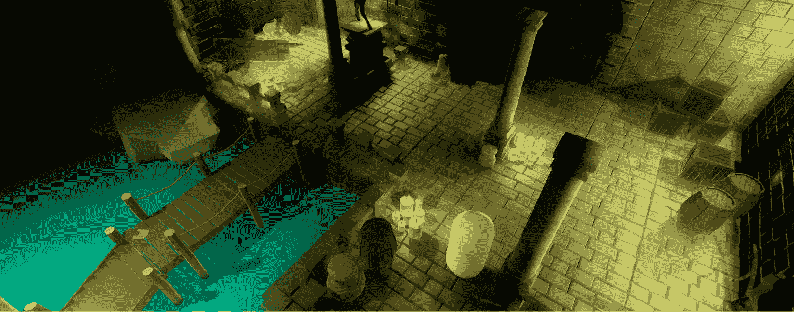

图 12.12 – 玩家角色现在可以在世界中移动

你现在必须能够通过在地板上或甚至在水中按下按钮来移动玩家角色。最近的点将被选为目标。此外，当你四处移动时，尝试点击码头上的羊皮纸。如果它放置得恰到好处，位于 **StaticBody** 节点的下方，那么你将无法触发音符。如果是这种情况，请调整在 *为射线投射准备可点击区域* 部分为 **StaticBody** 节点设置的 **Y** 位置，或者将 **Parchment** 节点在 **Y** 方向上向上移动。

只要点击不相互竞争，羊皮纸就会触发音符。如果玩家角色不在附近，音符打开后它将立即移动到羊皮纸附近。如果你此时点击 **关闭** 按钮，你可能会注意到奇怪的行为。音符将按预期关闭，但玩家角色会突然移动到 **关闭** 按钮下方。这就像笔记 UI 允许我们的某些点击通过，而路径查找逻辑则捕捉到那个调用。

幸运的是，对于这种行为有一个快速的解决方案。如果你将`_input`函数替换为`_unhandled_input`，那么一切都会好起来。如果这两个看起来相似且不清楚，你可能想在手册中找到它们的细微差别：[`docs.godotengine.org/en/3.4/classes/class_node.xhtml`](https://docs.godotengine.org/en/3.4/classes/class_node.xhtml)。记住它的用途，以便快速解决许多 UI 问题可能是有价值的。

## 总结

如果你已经开发了一段时间的视频游戏，你可能已经熟悉了迭代和增量工作流程的概念。例如，到目前为止，拥有不可摧毁的箱子是可以接受的。让我们考察一个你现在想要这些箱子可摧毁的场景。

你不仅必须考虑某些条件发生，例如玩家是否有正确的物品来摧毁这些箱子，而且你还需要准备在摧毁时刻触发的动画。这些既是程序性的也是艺术性的变化，并且在某种程度上可以轻松完成。当你*烘焙*可通行区域时，**Navigation**节点认为箱子是固体障碍物。然而，在这种新的动态情况下，你还需要更新**NavigationMeshInstance**节点以适应新的条件。

如果玩家刚刚摧毁的箱子不再是世界的一部分，而那个特定区域确实应该是可通行的，你必须通过烘焙一个新的地图来更新可通行区域。幸运的是，可以创建多个**NavigationMeshInstance**资源并将它们保存到磁盘上，以便根据需要交换它们以适应动态情况。

有时候，先进行原型设计更有意义。例如，我们的玩家角色看起来像一个胶囊来测试移动逻辑已经足够好了。让我们的头像看起来更像一个人而不是一个白色药丸会更好。让我们看看我们如何能够实现这一点。

# 触发动画

在*第五章* *设置动画和绑定*中，我们探讨了在 Blender 中创建动画。然后，在*第七章* *将 Blender 资源导入 Godot*中，我们看到了如何将模型导入 Godot 引擎，并使用**AnimationPlayer**节点测试模型的不同动作。本节中我们将展示的步骤应该足以将克拉拉引入游戏，但如果你需要提醒如何创建和导入动画，你可能需要查阅这两章。

既然我们已经完成了玩家的移动，那么缺少的就是将克拉拉引入我们的工作流程，并播放适当的动作，比如当她站立时闲置，当她移动时行走。

当我们构建`Player.tscn`并给这个场景附加脚本时，我们已经创建了一个基本的玩家角色。它很简单，但场景结构是一个很好的起点。按照以下步骤进行：

1.  在**FileSystem**中点击`Clara.glb`，然后打开**Import**面板。

1.  在**Animation**标题下的**Storage**下拉菜单中选择**Files (.anim)**。参考*第七章*的*分离动作*部分，*将 Blender 资产导入 Godot*，以记住这一步骤的需要。

1.  按**Reimport**设置克拉拉的依赖项。切换到**Scene**面板。

1.  打开`Player.tscn`并删除**MeshInstance**节点。

1.  将`Clara.glb`从**FileSystem**拖到**Player**节点上。这样，旧的**MeshInstance**节点将被**Clara**节点替换。

1.  点击根节点并将**Translation**值归零，因为应用于基本胶囊形状玩家的值现在不再有效。

1.  调整`1.2`。

这里的主要目标是用克拉拉替换旧的**MeshInstance**节点，并调整**CollisionShape**节点，以便正确进行碰撞检测。编辑器现在应该看起来像这样：

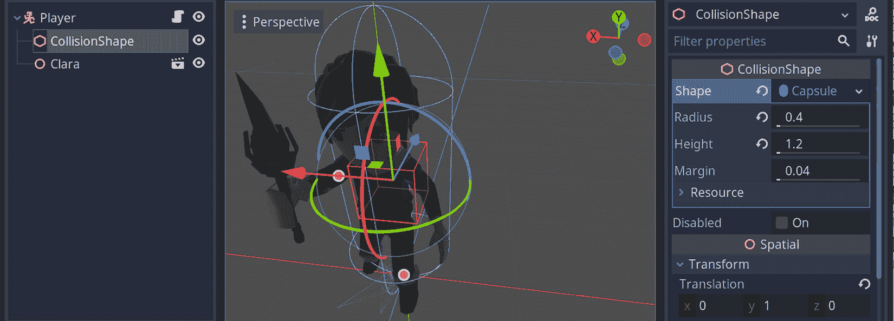

图 12.13 – 克拉拉替换了无聊的 MeshInstance 节点

使用这种方法，你可以轻松测试玩家的代码，然后稍后用实际模型替换测试模型。如果你是主要开发者，并且还在等待同事的艺术作品，这可能很有用。

改善角色的外观是一个很好的进步。它看起来更加吸引人。我们将对其运动做同样的处理，因为如果你现在运行游戏，你可能会注意到一些奇怪的行为。克拉拉将会像旧胶囊网格一样移动，因为它缺少两个主要特性，如下所示：

+   面向它当前移动的方向

+   显示出走路的迹象，而不是看起来像一根在表面上滑动的棍子

还有一个问题，但这个问题很小，你可以在不需要太多讨论和解释的情况下修复它。曾经持有简单**MeshInstance**节点的**Player**节点，不得不在世界上稍微提高一点。你可以将这个新的**Player**节点降低到码头的高度，这样克拉拉的脚就能与之连接。如果你不做任何更改，克拉拉看起来就像是在悬浮，然后一旦她的运动逻辑启动，就会以对角线移动。

对于其他两个主要问题，我们不得不比仅仅改变对象位置更深入地挖掘。不过，我们首先需要更新用于**Player**节点的脚本，所以我们需要做以下事情：

1.  在`Player.tscn`中选择根节点。

1.  将其脚本与`Scripts`文件夹中的`Clara.gd`交换。

1.  按*F5*键，享受看到克拉拉像普通人一样四处走动的场景。

欢呼——她开始走路了！

它怎么会这么快就发生了？我们将在本节的剩余部分致力于发现`Player.gd`脚本接收了哪些更改以适应我们正在经历并无疑享受的新行为。

## 理解克拉拉如何四处张望

递增和迭代的工作流程是理解克拉拉如何环顾四周的简短且非技术性的答案，这是我们建议你在任务最初看起来巨大无比时牢记在心的事情。例如，我们最初关注的是基本移动，这在`Player.gd`脚本中实现。在某个时候，当你知道基本测试系统正在工作时，就是将事情提升到下一个层次的时候了。这就是`Clara.gd`脚本发生的事情。

现在我们将解释我们将基本滑动动作转变为更复杂的行走动画所采取的步骤。就引入新变量而言，我们使用了一个简单的标志：`is_moving`。我们跟踪这个标志，以便了解克拉拉是否在移动。这个新变量的使用将在我们做出的其他一些更改的背景下进行讨论。

新术语 - 标志

在编程世界中，标志是一个表示特定条件已满足的变量。它通常用于确定系统的行为，就像一个具有假/真或开/关状态的电开关，因此它们通常被称为**布尔**标志。然而，标志可能具有不同种类的预定值。

克拉拉的自然行为是朝向鼠标光标的方向看。让我们再次提醒你，尽管光标正在我们的显示器 2D 表面上移动，但我们需要将基本投影到 3D 空间中，以找到正确的方向。我们在`Player.gd`脚本中的`find_path`函数中已经做了这件事。既然我们现在想要为确定克拉拉应该朝向哪里进行类似的射线投射，我们就从`find_path`中提取了那些常见的行，将其放入自己的函数`get_destination`中。

因此，你在代码中能找到的更常见用途和重复，将它们分离成它们自己的函数会更好。在`Player.gd`案例中，为了简化，我们故意忽略了这一点。然而，我们现在既有`find_path`函数，也有`turn_to`函数依赖于`get_destination`。

正如`find_path`依赖于`_unhandled_input`函数一样，`turn_to`函数也在使用相同的鼠标`event`。说到`turn_to`函数，让我们在这里更仔细地看看它：

```cpp
func turn_to(event):
    if is_moving:
        return

    var direction:Vector3 = get_destination(event) * 
    Vector3(1,0,1) + Vector3(0, global_transform.origin.y, 
    0)
    look_at(direction, Vector3.UP)
```

首先，尽管我们还没有看到`moving`标志被设置在哪里，如果克拉拉在移动，我们不想让她继续四处张望。因此，我们有一个早期的`return`语句来终止转向行为。然后，一旦我们通过`get_destination`函数确定了一个合适的方向，我们就触发 Godot 的内置`look_at`方法。

逻辑很简单，但确定`turn_to`中的`direction`向量的数学可能需要更多的解释。通常，`get_destination`的值就足够了，但看起来我们似乎是将返回值与另一个向量相乘，然后将其添加到另一个向量中。这是因为`get_destination`给出的目的地也包含了 3D 空间中的*y*轴。我们希望克拉拉保持她的姿势不变；换句话说，我们不想让她向上或向下看。这两个向量操作是必要的，这样她就不会以一种尴尬的方式旋转。

你可以通过移除向量操作并仅保留`get_destination`函数来亲自看到这种奇怪的行为。当你将鼠标光标移到克拉拉的身体附近时，她可能会突然围绕自己的脚旋转，有时甚至翻转过来或侧身。由于 2D 和 3D 之间的投影而产生的复杂性，你将来必须考虑到这一点，这在控制游戏角色时是一个常见的问题。

很好，克拉拉正面对着鼠标光标所在的位置。这还是一个独立的机制，因为她可以在不移动的情况下做到这一点，正如你可能已经通过前面的代码块测试过了。如果她在行走时也能保持看向目的地，那就更好了。这将在`move_along`函数的增强版本中实现。让我们看看在这个新版本中我们是如何改进的。

## 向移动功能添加观察行为

当克拉拉静止站立时，看到她四处张望是件好事，但我们还希望她面对她要走的目的地。例如，如果你在墙边的板条箱附近（更像是屏幕的右侧）点击，她应该一直走到她清除了码头，然后转向向右看，然后继续前进。同样，当她在这个新位置时，如果你在远处点击某个地方，比如鹿雕像附近或码头再次，她应该转身并以自然的方式走回来。

这种行为可以很容易地添加到`move_along`函数中。按照现在的样子，该函数已经决定了克拉拉应该沿着路径走的剩余步数。当她朝着路径上的点走去时，她不妨看看她要去哪里。这就是为什么我们在`move_along`函数中的`move_and_slide`之后有一个简单的`look_at`函数调用。

其他有用的 KinematicBody 函数

我们一直在使用`KinematicBody`类的内置`move_and_slide`函数。在同一个类中有一个有用的函数，可能在玩家想要通过跟随斜坡到达更高位置的场景中很有帮助：`move_and_slide_with_snap`。同样，你可能想要检查玩家是否应该执行下一步。如果是这样，`test_move`方法可能很有用。

此外，`is_moving`的状态在以下代码行中确定：

```cpp
if !path or path_index == path.size():
    is_moving = false
    $Clara/AnimationPlayer.play("Idle")
    return
is_moving = true
```

注意，与我们在`Player.gd`中做的那样，`if`块检查路径上是否还有剩余的步数。正是在这一点上，我们可以设置`is_moving`标志的状态。因此，与原始版本不同，新的`move_along`函数的`if`块确保当克拉拉没有剩余路径可走时，移动逻辑被关闭。

如果玩家点击不同的位置并且确定了一条新路径，那么我们将打开移动标志。只要克拉拉有中间点可以跟随，她就会遵循我们描述的相同步骤——面向正确的方向，走必要的距离，面向下一个方向，走，清洗，重复——直到她不再有任何步骤可走。

除了决定`is_moving`标志的状态外，在`if`块中还有关于动画的其他一些事情在进行。让我们在下一部分中关注这一点。

## 为克拉拉播放正确的动作

我们已经在*第七章*的*分离动作*部分中看到动作与动画之间的关系，*将 Blender 资产导入 Godot*。它们就像原子对分子一样。因此，当我们想要触发一个模型的动画时，我们实际上意味着要触发一个特定的动作。我们将最终利用这个概念，让克拉拉行动起来。

我们已经看到，我们对`Player.gd`脚本所做的改进如何为克拉拉的行为增添了额外的风味。话虽如此，她也可以从动画部门的微调中受益。这正是`move_along`函数内部正在发生的事情。

我们已经知道如何确定克拉拉是否应该移动，并且我们通过`is_moving`标志来跟踪这一点。因此，这是触发她所需动作的正确时机。因此，当她不再应该移动时，我们触发她的`is_moving`设置为`true`。

当我们将`Clara.glb`作为`Player.tscn`场景的一部分，并变成一个**克拉拉**节点时，一个**AnimationPlayer**节点已经包含在内，并且已经设置了克拉拉的所有动作。我们迄今为止编写的代码已经知道这个**AnimationPlayer**节点在内部结构中的确切位置。如果您导入了一个具有不同**Scene**树的模型，那么您可能需要修改您的代码以找到到达**AnimationPlayer**节点的正确路径。

通过书籍的静态页面传达动画是困难的，但当我们把克拉拉移到靠近相机的柱子附近时，这就是它的样子：

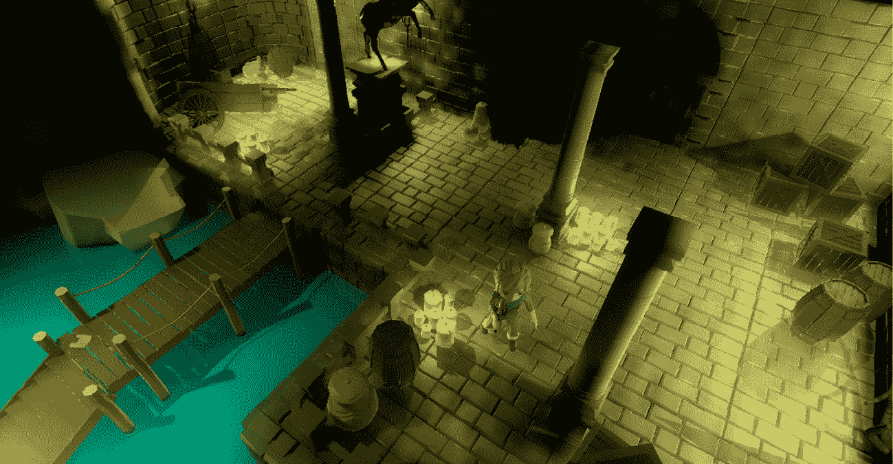

图 12.14 – 克拉拉现在可以在关卡中移动

此外，请注意场景中的光线条件是如何影响她在暗淡和明亮的地方行走时的模型的。在下一章中，我们将关闭一些光源。因此，当她或玩家在周围行走时，我们可以使用她持有的火炬来照亮场景。

我们在动画主题中不能不提到一个高级主题：混合动画。我们不会详细讨论它，但对于您想在项目中使用的更高级的动画案例来说，它值得提及。

## 混合动画或动作

过了一段时间，大多数与计算机相关的事物中使用的名称可能开始看起来像它们之间有某种联系。在前几章中，我们使用了 Blender 来构建资产、纹理、动画等等。我们现在将要讨论的混合与 Blender 本身无关。

我们的点按式冒险游戏目前非常简单。Clara 运行`Clara.gd`脚本并整合这些其他动作。

在某个时候，当您拥有一个更复杂的系统，其中您触发的动作结束时为另一个动作腾出空间时，您可能会注意到这些动作会突然开始和结束。然后，想象一下音频播放器中的交叉淡入功能如何使歌曲曲目切换时整个体验更加愉快。如果您有一种方法可以平滑地将一个动作的结束过渡到下一个动作的开始，那会怎么样？您可以使用**AnimationTree**节点轻松实现这一点。

不幸的是，我们的页面数量有限，无法涵盖如此高级的主题。尽管如此，官方文档有一个关于这个主题的非常棒且内容丰富的教程页面。它还附带了许多动画 GIF，这些动画在书籍的静态页面上是无法体验到的。因此，最终，您可能更倾向于通过遵循[`docs.godotengine.org/en/3.4/tutorials/animation/animation_tree.xhtml`](https://docs.godotengine.org/en/3.4/tutorials/animation/animation_tree.xhtml)上的说明来探索如何混合动画。

在高速动作游戏中，混合动画被广泛用于在不同攻击和奔跑状态之间过渡时，应该看起来更加流畅。在我们当前的情况下，我们没有这种功能并不会损失太多。

我们在点按式冒险游戏中取得了很大的进展。让我们总结一下，数一数我们的胜利。

# 摘要

本章终于涵盖了我们期待已久的相机主题，即从*第四章*的*调整相机和灯光*开始。现在您有多种选择，从简单的**相机**类型到跟随目标的**插值相机**类型。如果您想尝试一些高级功能并涉足 VR，您还可以使用**ARVRCamera**。

由于你现在有了合适的相机，可以展示游戏世界，而不是在编辑器内看到事物，现在是调查如何与世界本身互动的合适时机。为此，我们提出了**光线投射**作为可能的解决方案，但很快又放弃了它，转而使用碰撞检测，这提供了更大的灵活性和精度。我们使用这种技术来检测特定游戏对象（羊皮纸）上的点击。在这个过程中，你使用**信号**作为解释玩家点击作为触发器来打开音符的方式。

接下来，你研究了创建一个简单的游戏角色并在关卡中移动它。有时，游戏设计可能缺少关键元素，而有时关卡可能需要更多帮助。一旦你作为一个独立开发者或作为团队对游戏的方向感到满意，你就可以通过引入更复杂的系统来提高难度。

这正是测试`Player.gd`并在更高级的`Clara.gd`脚本中改进它之间发生的事情。最终，你能够找到适合 Clara 在世界中移动的位置，并通过使用适当的动画周期来实现这一点。既然你已经掌握了基础知识，现在如果你想使用更多动作和特殊条件来与玩家进行世界交互，那么就需要你自己来增强脚本。

在下一章中，我们将介绍一些额外的工具，这些工具将增加我们一直在构建的交互性，例如播放声音、有条件地触发某些事件以及切换到另一个关卡。

# 进一步阅读

尽管我们教了你如何从技术上设置相机，但在选择最佳相机设置方面还有一个完整的艺术层面。你可能想查看涵盖诸如构图和叙事等主题的在线课程和书籍。这里提供了一些例子：

+   [`www.udemy.com/course/composition-and-perspective-for-stunning-visual-art/`](https://www.udemy.com/course/composition-and-perspective-for-stunning-visual-art/)

+   [`www.learnsquared.com/courses/visual-storytelling`](https://www.learnsquared.com/courses/visual-storytelling)

+   [`www.learnsquared.com/courses/production-concept-art`](https://www.learnsquared.com/courses/production-concept-art)

+   [`www.cgmasteracademy.com/courses/93-composition-for-concept-art-and-illustration/`](https://www.cgmasteracademy.com/courses/93-composition-for-concept-art-and-illustration/)

如果`Player.gd`和`Clara.gd`文件中的代码看起来非常相似，并且很难逐行比较，那么你可以使用一个在线工具来帮助你查看和突出显示差异：http://www.tareeinternet.com/scripts/comparison-tool/。

我们的游戏不涉及跟随玩家的敌人角色，但它将采用类似的方法。例如，一旦敌人检测到玩家，它也必须进行路径查找以找到玩家的位置并向其移动。许多视频游戏 AI 书籍都涵盖了玩家检测和寻找等主题，例如我们给出的例子。因此，由于大多数 AI 主题通常是通用的，所以不要害怕阅读各种材料。你总是可以在你的 Godot 项目中稍后应用你在其他地方获得的见解。
