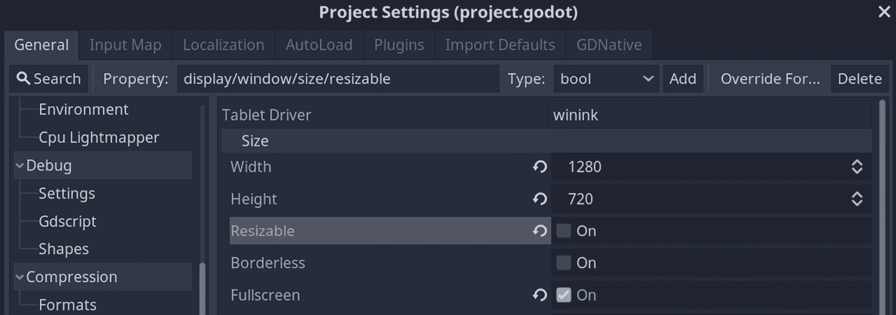
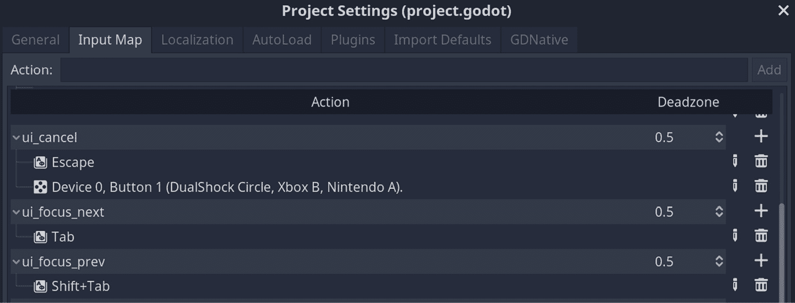
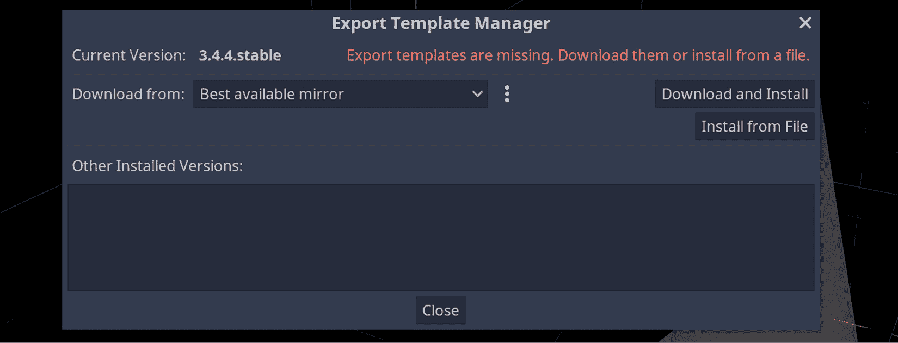
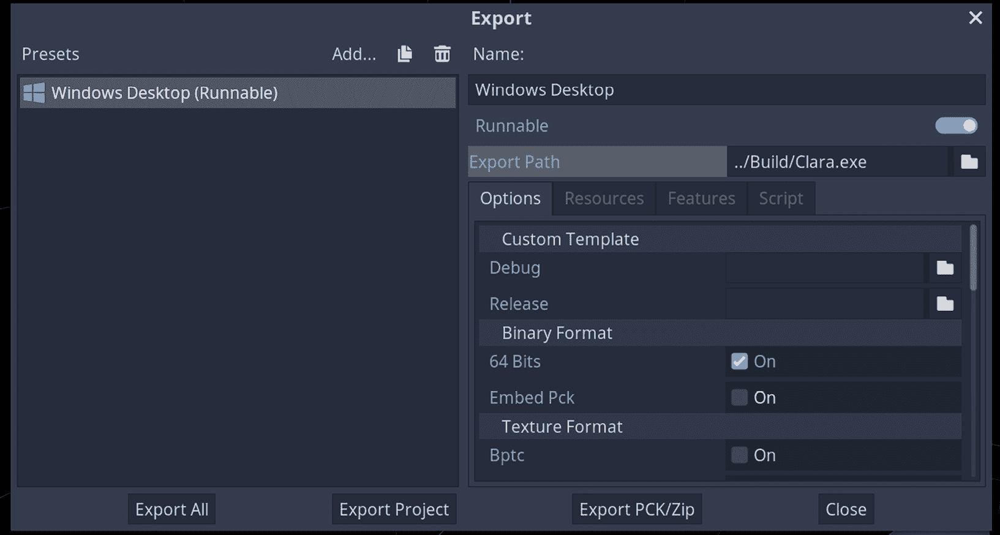

# 第十五章：结论

恭喜！

你已经创建了一个使用 3D 资产、集成对玩家输入做出反应的摄像头和角色控制器、触发视觉和声音效果以提供反馈、跟踪玩家进度并加载新关卡的点对点冒险游戏。

本章将涵盖一个通常在你到达终点时才会涉及的话题。我们将向您展示如何导出您的游戏，以便您可以将它与世界分享。话虽如此，我们还将讨论为什么你可能需要比仅仅等待结束更频繁地导出的原因。

之后，我们将完成引擎的技术部分。因此，我们将提出一些建议，更像是你在开发周期中可以遵循的指南，以便在开始项目之前或项目进行中提高效率。

最后，你将了解一些你可以使用 Godot 引擎的游戏类型。每个游戏引擎通常都是围绕至少一个强大和一些核心需求构建的。话虽如此，大多数值得信赖的引擎也支持最预期的功能。你将看到你在本书中学到的某些知识如何在新领域得到扩展。

这将是一个相对简短且肯定不那么技术性的章节。尽管如此，我们仍有一些以下主题需要处理：

+   导出你的游戏

+   提供不同的游戏体验

+   探索不同的游戏类型

到本章结束时，你将学会如何导出你的作品，评估你可以提供给玩家的不同选项，最终找到你可以考虑使用 Godot 引擎的游戏类型列表。

# 技术要求

本章将不会有任何新的资源。如果您愿意，您可以继续上一章的工作，或者浏览我们在这个书的存储库中保留的内容：[`github.com/PacktPublishing/Game-Development-with-Blender-and-Godot`](https://github.com/PacktPublishing/Game-Development-with-Blender-and-Godot)。

# 导出你的游戏

那么，你有一个游戏。接下来怎么办？你可以像之前一直做的那样在编辑器中继续运行游戏。然而，在某个时候，你很可能会想向你的朋友和家人展示它，甚至将其部署到公共场合供所有人查看。本节将教你如何导出你的游戏，以便你可以与世界分享你的创作。

尽管我们只涵盖如何在 Windows 上操作，但 Godot 引擎也能够将你的游戏导出到以下平台：

+   Android

+   iOS

+   HTML

+   Linux

+   macOS

+   **通用 Windows 平台**（**UWP**）

虽然导出通常是一个简单的过程，但检查文档总是明智的，因为平台收到的更新有时会改变你必须采取的步骤。您可以在以下位置找到最全面的指令列表：[`docs.godotengine.org/en/3.4/tutorials/export/`](https://docs.godotengine.org/en/3.4/tutorials/export/).

那么，关于游戏机呢？

由于版权问题，控制台不在上述列表中，因为它们处于一个相对模糊的领域。作为开发者，你需要与控制台制作人保持联系并签署协议，以获得访问他们的工具和套件。本质上，尽管这仍然有一些技术方面，但在法律部门也有一些变动。

在我们开始处理 Windows 特定的导出设置之前，我们需要在我们的项目中添加或更改一些内容。

## 准备项目以进行导出

默认情况下，Godot 不会以**全屏**模式启动你的游戏，尽管这是大多数游戏所使用的。虽然最终我们的游戏将覆盖整个屏幕，但讨论一下当你打开**项目设置**时将看到的几个其他选项是值得的。更具体地说，当你访问**显示**组下的**窗口**部分时，你会看到两个功能，如下所示：

+   **可调整大小**：此选项使你的游戏屏幕可调整大小，就像你能够调整任何非**全屏**模式的应用程序一样。这个选项默认是开启的，所以请将其关闭。

+   **无边框**：当你的游戏不以**全屏**模式运行时，它将需要由你的操作系统定义的边框。开启此选项将移除这些边框和窗口的标题栏。顺便说一句，如今大多数现代桌面应用程序（如 Slack、Discord 等）都使用这个功能。

我们建议你开启**全屏**选项以及我们刚才提到的其他两个选项关闭。之后，这就是我们的**项目设置**屏幕看起来像的：



图 14.1 – 在导出游戏之前我们使用的项目设置

到目前为止，我们只专注于构建游戏本身，而没有担心开场、游戏设置或字幕屏幕。这些可以像任何其他 Godot 场景一样构建。然后，一旦你弄清楚这些场景之间的流程，你就可以使用`change_scene`函数切换到玩家请求的场景。或者，你也可以将这些屏幕作为隐藏场景放在`Game.tscn`文件中，并在需要时打开它们的可见性。

由于我们的游戏现在将以**全屏**模式运行，你将无法通过使用操作系统的按钮来终止它。在 Windows 中，按下*Alt* + *F4*键组合将退出窗口。我们需要提供一个更好的方式让玩家退出游戏。

## 创建关闭游戏机制

电影在电影院屏幕上以制作公司的标志和演员名单结束。除非你真的想看这些字幕，否则你会认为这是你起身离开电影院的提示。无论哪种方式，或者如果你在任何时候想要提前结束电影体验，你都有权离开场地。

如果你在电脑上的视频播放器中观看电影，点击一下按钮就会发生类似的情况。当我们以**全屏**模式运行我们的小游戏时，由于周围没有可以点击的按钮，这就需要你以不同的形式向玩家展示这一点。

这通常是通过在键盘上按下*Esc*来揭示一个屏幕——有时会遮挡游戏屏幕，有时作为叠加层——以便玩家可以选择进入游戏设置或加载不同的游戏会话，显然是退出游戏。

在本节中，我们将仅实现*Esc*按键部分，并将其视为玩家想要退出的意愿。为此，我们建议你打开`Game.gd`脚本，并向其中添加以下代码行：

```cpp
func _input(event):
    if event.is_action_pressed("ui_cancel"):
        get_tree().quit()
```

你可能期望在那个`if`块中看到*Esc*。它在那里，但作为一个**标识符**。如果你转到**项目设置**并打开**输入映射**标签，你会看到一个映射到易于理解名称的快捷键列表。以下截图显示了**输入映射**的一部分：



图 14.2 – 输入映射标签是项目设置的一部分

如果你正在构建允许玩家使用多个输入设备的游戏，那么配置**输入映射**将非常有帮助。例如，你可以设置，如果玩家希望使用键盘执行相同的行为，那么游戏控制器或操纵杆的按钮按下具有相同的意义。这是一种将不同的输入统一在易于在代码中跟踪的单一名称下进行整合的好方法。

我们已经处理了屏幕尺寸和允许玩家退出游戏的问题，因此我们应该为导出我们的游戏做好准备。

## 配置 Windows 导出设置

与其他游戏引擎相比，Godot 的下载大小非常小。其中一个原因是它没有预装导出包。平台要求有时会变化，Godot 的具体功能必须符合它们的指南，因此，在导出过程中下载和更新导出包是有意义的。

由于我们从未导出过游戏，我们的设置中没有导出包。要获取一个，请点击顶部菜单中的**编辑器**按钮以访问**管理导出模板**设置。当你打开它时，你会看到一个界面，你可以下载并安装适用于你使用的版本的正确包。以下截图显示了当前导出模板的状态：



图 14.3 – 这个屏幕将帮助我们下载导出模板

你应该点击**下载和安装**按钮并等待。一旦完成，你就可以在那个界面中点击**关闭**按钮。接下来在我们的导出工作中，我们需要处理的是**导出**设置，所以请按照以下步骤操作：

1.  点击顶部菜单中的**项目**按钮，并在选项中选择**导出**。

1.  按下**添加**按钮，并在选项中选择**Windows 桌面**。

1.  在项目文件外部填写`Build`文件夹，因此我们将其定义为`../Build/Clara.exe`。

1.  在**导出**界面的底部部分按下**导出项目**按钮。

1.  关闭底部附近的**导出带调试**选项。确认您的文件路径并按**保存**。

在我们继续解释之前，这里有一些步骤的视觉表示，这些步骤是您在导出时必须执行的：



图 14.4 – Windows 的一些导出设置

假设您的 Windows 运行在 64 位机器上，这些步骤会将您的游戏导出到您定义的文件夹。当您运行可执行文件时，您应该会像在 Godot 中开发时一样玩游戏。按下*Esc*将终止程序并带您回到操作系统。

您可能已经注意到除了`Clara.exe`之外还有一个带有 PCK 扩展名的额外文件。如果您想将这两个文件放在一起，您可以在**导出**设置中打开**嵌入 PCK**选项，但保持它们分开可能也是一个好主意。Godot 将您的游戏资源保存在一个单独的包文件中，并在您运行可执行文件时使用它。

为什么或何时这会有用？如果您想通过更多内容来增强您的游戏，您可以创建内容包，并指示游戏可执行文件将其拉入。您的下一个 DLC 可能就在转角处，这是实现这一目标的实用机制。

不仅您有一个完成的游戏，您还可以将其发布！确实令人兴奋。虽然我们主要提供了技术说明，但我们认为分享一些关于您可以提供给玩家的不同游戏体验的词也很宝贵。

# 提供不同的游戏体验

有时候，使用原型资产或另一位艺术家的创作是完全可以接受的，这样您可以专注于乐趣。我们这样说是因为我们始终建议您确保您使用的资产的许可。话虽如此，我们想要讨论的主题是您一旦获得这些资产后如何处理它们。

`Models`文件夹包含我们在整本书中没有使用的一些额外资产。当您在*第九章*中构建第一个关卡时，*设计关卡*，我们提到您可以使用一些其他资产。也许您确实使用了，并根据您自己的条件遵循了后续章节中的说明，特别是输入检测、路径查找等。

在某个时候，就像现在这本书的最后几页一样，您可能会发现自己不知道还能为游戏添加什么。

## 具有迭代创作过程

有些人发现，将视觉资产直接放在他们面前会更有力量。当他们观察不同物体的大小和形状关系时，创造力开始涌现。然后，还有其他人觉得这很麻烦，阻碍了他们制定合适的计划。如果他们弄清楚需要做什么，他们就可以开始修改资产或寻找新的资产。最后，这两种方法的结合可能更有效。

最后——特别是，如果你想将你的作品商业化——你必须将玩家放在你的工作流程的中心。快速迭代，随后是早期和频繁的测试，可能正是你所需要的。你的某些选择与玩家对游戏的期望相结合可能会产生很多压力，所以要有这个意识。我们将通过使用第二级的资产和布局来给你一个例子。

目前在该级别上有两个书架：一个直立的书架和一个倒下的书架。这是一个相对便宜且有效的叙事方法。为什么有一个书架在地板上？也许曾经发生过一场灾难，但我们不知道。它会被移开吗？如果你作为开发者想要它，或者测试表明这是一个强烈的要求，那么你需要在 Blender 或 Godot 中花更多时间来制定书架的动画计划。Clara 很可能需要另一个动作来展示她抬起并移动书架。如果她不应该这么做，因为她不太可能举起如此重的物体，那么你可能需要一个工具或一个同伴来帮助她。

一点简单的更改或请求，你就会被一系列任务淹没。不幸的是，这些更改并不全是视觉上的。你还得考虑编程部分，比如你需要保持书架的状态仍然在地板上，或者将其移开。

最终，作为创作者，你必须问自己这个努力可能将引领你走向何方。如果你可以将这个想法与 Clara 访问另一个级别或游戏中使用的秘密相结合——换句话说，将其与已经作为机制存在的东西混合在一起——你可以用最少的步骤来复制它；这可能值得。

因此，这始终是一个权衡。尽管你应该尊重乐趣和玩家的请求，但你应该谨慎处理，并考虑什么最适合你。

当我们即将完成我们的书籍时，让我们讨论一下你还可以用 Godot 做些什么。

# 探索不同的流派

尽管 Godot 引擎因其创建高质量的 2D 游戏而闻名，而其他知名引擎更受青睐用于构建 3D 游戏，但你已经看到 Godot 实际上在构建 3D 游戏方面相当有实力。当 Godot 4 发布时，这将变得更好。

到那时，你还能用 Godot 做什么？坦白说，你可以用它构建任何类型的游戏。最近也有一种趋势是使用 Godot 引擎构建桌面应用程序。然而，我们将考虑这些情况为特殊情况，并专注于一些更常见的、使用 3D 功能的游戏类型，如下所示：

+   模拟和策略游戏：当你使用射线投射来检测用户输入时，这是为了让 Clara 能够通过路径查找移动到特定的位置。在模拟或策略游戏中，无论是在网格上还是在自由移动的结构中，你的选定单位或单位可以以类似的方式移动到指定的目的地。你甚至可以在上面结合回合制功能，以跟踪哪一方的单位已经移动。

+   赛车游戏：Godot 已经有一个**VehicleBody**节点来模拟汽车的行为。这不是很好吗！通过在**MeshInstance**节点内部适当地放置一个**Camera**节点，并结合**VehicleBody**节点的机制，你就可以构建下一个令人惊叹的赛车游戏。启动你的引擎，Godot 引擎，轰鸣吧！

+   第一人称射击游戏：这是一个可以用 Godot 引擎构建的经典例子。在这种类型的游戏中，你会大量使用射线投射来检测子弹是否与对象连接。如果它们连接了，可能在你面前的是一个很好的技术和创意问题的混合。子弹是否应该以相同的方式穿透或摧毁每个对象？

+   角色扮演游戏：这与第一人称射击游戏类似，因此可以制作。在这个类型中，你通常有一个较长的叙事要向玩家展示。此外，你还需要跟踪玩家在故事中的位置以及他们是否满足了一些条件以揭示故事的下一部分或谜题的结果。我们在这本书中没有发现这一点，但检查`Resource`作为一个有用的 Godot 机制来促进内容丰富的游戏可能是个明智的选择。

+   多玩家/合作模式：这本身不是一个独立的类型，因为任何类型都可以制作成多玩家或合作模式。然而，有些游戏如果没有网络连接，体验将不会相同，所以我们不得不单独提及这一点。Godot 有可以用来连接第三方服务或使同一网络中的两台计算机相互连接的网络组件。

这些是一些肯定可以用 Godot 制作的游戏类型。你还可以包括一些其他类型，如益智游戏或体育游戏，或者任何使用 3D 资源的子类型。

# 摘要

随着我们在本章结束本书，你的游戏项目也即将完成。因此，我们首先向您展示了导出游戏所需的必要步骤。尽管在游戏构建完成后处理这一阶段似乎顺理成章，正如在*迭代创作过程*部分提到的，经常导出游戏并与他人分享以获得频繁的反馈可能是个明智的选择。

本章的其余部分致力于讨论你在游戏开发努力中可以采取的不同方法，最佳实践，一般指南，最后是了解你可以针对的不同流派。

你在游戏开发之旅中已经走了很长的路。它始于前五章的 Blender，然后通过几个过渡章节继续，直到你完全转向使用 Godot 引擎来构建游戏。希望你现在对这两个应用程序的工作原理有了更好的看法。此外，如果你有一些先前的经验，我们希望这本书在某些方面提高了你的信心水平。

在我们离开你的时候，我们祝愿你在未来的努力中一切顺利，愿你的代码第一次就能编译成功！

# 进一步阅读

你可能已经注意到导出的游戏使用了 Godot 的图标。拥有自己的自定义图标会更好。这涉及到几个部分，但这是可能的。说明列在[`docs.godotengine.org/en/3.4/tutorials/export/changing_application_icon_for_windows.xhtml`](https://docs.godotengine.org/en/3.4/tutorials/export/changing_application_icon_for_windows.xhtml)。

如果你想要为了反馈目的部署你的游戏，而不是通过电子邮件或聊天应用程序发送文件，你可以使用以下平台：

+   [`itch.io`](https://itch.io)

+   [`gotm.io`](https://gotm.io)

后者 URL 在我们的情况下特别有用，因为该平台还托管 Godot 游戏马拉松。对于 PC 游戏，Steam 是一个大型的市场，但上述地方可能比在 Steam 上注册并通过申请流程更快。
