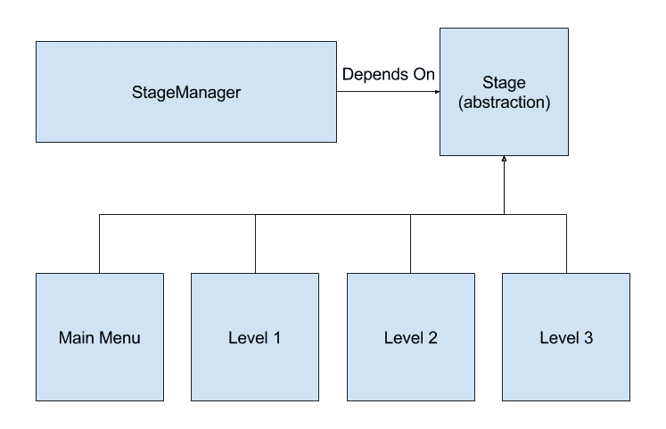
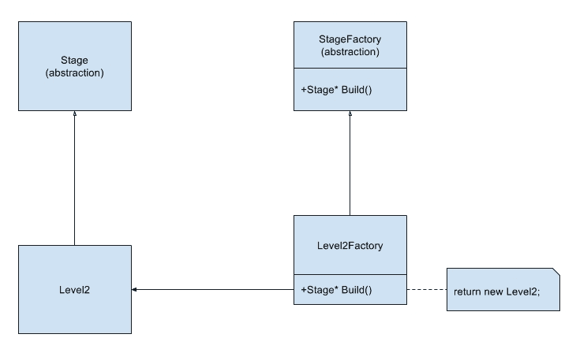
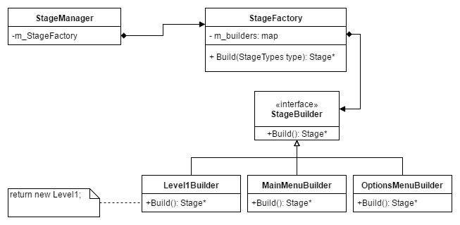

# 第五章：通过工厂方法模式解耦代码

每个项目和每个游戏设计都会发生变化。面向对象编程的一个目标就是考虑到这种变化来编程。这意味着编写灵活且可重用的代码，以便当发生变化时，项目不会崩溃。不幸的是，需求永远不会完全清楚，设计师的愿景也永远不会 100%完整。好消息是，新添加的功能可能会以意想不到的有趣方式与旧功能交互，从而产生未计划的功能，这可以使游戏完全不同，并且更加有趣。

在最坏的情况下，游戏设计可能根本不好玩，这可能导致游戏对象类型、对象行为甚至整个游戏设计的巨大变化。在这种情况下，我们希望能够以最小的代码更改重新设计我们的游戏，以尝试新的可能性。更改代码需要时间来编写、测试和调试，并且每次添加新代码时，都有可能造成旧代码中的错误。

由于我们知道我们的设计将会改变，我们必须通过遵循良好的设计原则和利用设计模式来解决常见问题来为这种变化做出规划。这包括使用灵活的设计，如组件对象模型，以避免继承层次结构。这还包括使用状态模式和有限状态机来避免复杂的`if`语句和导致每次变化时出现错误的级联`if else`链。这还包括诸如努力降低耦合度并避免*硬编码*任何事情。

我们都知道，作为程序员，我们应该避免*魔法数字*。我们不希望在我们的代码中看到看似随机或奇怪的数字。硬编码的数字描述性不足，这使得代码难以阅读、维护和调试。如果我们需要更改魔法数字，我们必须花费时间在我们的代码中搜索它每次出现的地方。不幸的是，这些硬编码的值在开发过程中往往会频繁更改。在现实世界中，重力可能是 9.8 m/s²，但在游戏世界中，我们可能需要调整它，以便游戏更有趣，或者可能在运行时更改它，以便玩家可以在天花板上行走。

当我们考虑硬编码时，我们通常会想到魔法数字。然而，使用具体类类型（如新的`ChaseAIComponent`）调用`new`运算符可能是可读的，但它与重力值或数组大小一样可能发生变化。

# 章节概述

在本章中，你将专注于一个常见的接口来创建新对象，而无需直接调用构造函数。首先，我们将探讨为什么`switch`语句可能是有害的。接下来，我们将探讨一个设计原则，它引导我们到达最终的解决方案，即工厂。然后，我们将探讨几种不同的设计工厂的方法，使它们灵活且可重用。

# 你的目标

在本章的整个过程中，我们将探讨一些更多的重要概念和原则，这些可以使我们的程序变得更好。以下是本章我们将涵盖的内容和你的任务概述：

+   学习为什么使用`switch`语句可能不好

+   学习依赖倒置原则

+   学习工厂方法模式

+   构建组件、阶段和对象工厂

+   通过使用模板改进你的工厂

# `switch`语句的问题

当刚开始学习编程时，仅仅理解语言的语法是非常困难的。通常，新手程序员会专注于函数调用或`for`循环的语法，甚至不会考虑编写可重用、可维护的代码。这主要是因为他们在没有规划的情况下直接开始编码。这一点在游戏开发中也是如此。新手程序员往往想直接编写游戏，而忘记了诸如用户界面和暂停菜单等问题。诸如窗口分辨率、阶段中敌人的放置，甚至点击按钮时鼠标应该在哪里，都会被硬编码。以下是作者第一个游戏中的一段代码。这是`MainMenu`函数中的一个部分，当按钮被点击时会将游戏切换到加载状态。变量`p`是鼠标的位置：

```cpp
if ((p.x > .15 * GetSystemMetrics(SM_CXSCREEN)) && 
    (p.x < .42 * GetSystemMetrics(SM_CXSCREEN)) && 
    (p.y > .58 * GetSystemMetrics(SM_CYSCREEN)) && 
    (p.y < .70 * GetSystemMetrics(SM_CYSCREEN))) 
  { 
    if (mousedown) 
    { 
      mGameState = TCodeRex::LOAD; 
      mGameLevel = L0; 
    } 
  } 

```

与此类似的代码重复了四次（没有使用循环），因为`MainMenu`中有四个按钮。当然，有更好的（要好得多）编写这段代码的方法。首先，重要的是将游戏阶段与`Graphics`类分开，其次，如果编写得当，按钮可以自我管理。然而，这个旧代码库最糟糕的部分是游戏阶段的变化方式。

在那个游戏中，`Engine`类中有一个名为`Update`的函数，包含了一个 507 行的`switch`语句。这包括了一个嵌套的`switch`语句，用于需要菜单阶段但可以选择多个菜单的情况。以下是当需要加载关卡时的部分代码示例：

```cpp
case TCodeRex::LOAD: 
{ 
StopGameMusic(); 
StopMenuMusic(); 
switch (mGameLevel) 
{ 
case TCodeRex::L0: 
{ 
  grafx.LoadScreen(mLoading); 
  mLoading = true; 
  if (ObjectMgr->LoadLevel(".\\Levels\\Level_00.txt")) 
  { 
    mPlayer1->SetPhysics().setPosition( 
    (Physics::real)ObjectMgr->PlayerX, 
    (Physics::real)ObjectMgr->PlayerY, 0.0f); 

    grafx.GetCamera().Move( 
      ObjectMgr->PlayerX - 500, 
      ObjectMgr->PlayerY - 500); 

    ObjectMgr->AddToList(mPlayer1); 
    mPlayer1->SetHealth(100); 
    mBGTexture = grafx.GetTextureMgr().GetTile(49); 
    mplaying = true; 
    mGameState = TCodeRex::PLAY; 
  } 
    else 
      mGameState = TCodeRex::MENU; 
    break; 
}//end case TCODEREX::LOAD 

```

如果你觉得这很难看，你是对的。由于某种原因，阶段切换代码负责设置玩家的健康和位置，移动摄像头，设置背景纹理，如果加载失败则返回菜单。

我们展示这个例子是为了让你看到真正糟糕的代码。这个`Engine`类与`graphics`类、`physics`类、`object manager`类和`player`类紧密耦合。如果这些类中的任何一个发生变化或被删除，`Engine`类中的代码也需要更改。另一个问题是这里有许多依赖关系，这意味着上述任何类的更改都会导致代码重新编译。

几年后，其中一位作者在担任 iPhone 游戏合同程序员时遇到了类似的情况。最初的设计只要求两个阶段，即主菜单和游戏玩法。由于计划非常简单，因此使用了类似于我们上面看到的代码。这很快变成了一个问题，因为即使项目只有三个月，所有的游戏设计都会发生变化。

一个月后，游戏按照规格完成，包括一个关卡编辑器，以便设计师可以创建所需的所有关卡。目标是花剩下的时间添加效果和润色游戏。然而，每周，制作人都会来要求添加新的菜单或过渡屏幕。

最后，游戏设计要求有一个选项菜单、一个关卡选择菜单、一个致谢屏幕、每 10 个关卡一个庆祝屏幕，以及完成游戏后的祝贺屏幕。最初编写的简单两个阶段的代码最终因为快速的开发时间表和不断添加的新功能而变得一团糟。有一行糟糕的代码类似于以下内容：

```cpp
if(levelCounter == 81) 
  ShowCongratsScreen(); 

```

这之所以有效，是因为游戏中共有 80 个关卡，`levelCounter`在完成一个关卡后会递增。在看到这样的游戏代码后，我们希望您能理解为什么规划变化发生的重要性。

在第三章，“使用组件对象模型创建灵活性”中，我们看到了如何为我们的游戏对象创建组件，以便我们能够轻松处理对象设计的更改。这是创建灵活代码的重要步骤；然而，当我们在我们阶段创建对象时，我们仍然必须使用`new`来硬编码构成我们的对象的具体类型：

```cpp
M5Object* pObj                = new M5Object(AT_Player); 
GfxComponent* pGfxComp        = new GfxComponent; 
PlayerInputComponent* pInput  = new PlayerInputComponent; 
ClampComponent* pClamp        = new ClampComponent; 
pObj->AddComponent(pGfxComp); 
pObj->AddComponent(pInput); 
pObj->AddComponent(pClamp ); 
//Set position, rotation, scale here 
//... 
M5ObjectManager::AddObject(pObj); 

```

这意味着我们的派生`M5Stage`类与该对象类型的组件紧密耦合，实际上是与需要在此级别创建的所有对象类型紧密耦合。如果对象需要不同的组件，或者任何组件被更改或删除，那么我们的`Stage`类必须进行更改。

解决这个问题的一种方法（正如我们在第三章，“使用组件对象模型创建灵活性”中看到的）是将此代码放入我们的`M5ObjectManager`类中。这样，我们的阶段就不需要随着类型的修改而不断更新：

```cpp
M5Object* M5ObjectManager::CreateObject(M5ArcheTypes type) 
{ 
  switch(type) 
  { 
  case AT_Player:  
    // Create player object 
    M5Object* pPlayer             = new M5Object(AT_Player); 

// Create the components we'd like to use 
GfxComponent* pGfx            = new GfxComponent; 
PlayerInputComponent* pInput  = new PlayerInputComponent; 
ClampComponent* pClamp        = new ClampComponent; 

// Attach them to our player 
pObj->AddComponent(pGfx); 
pObj->AddComponent(pInput); 
pObj->AddComponent(pClamp); 

   //Add this object to the M5ObjectManager 
   AddObject(pPlayer); 
   return pPlayer; 
  break; 
case AT_Bullet: 
  //...More Code here 

```

这解决了在对象更改时需要更改我们的阶段的问题。然而，如果我们的对象或组件发生变化，我们仍然需要更改我们的`switch`语句和对象管理器。实际上，除了这个函数外，对象管理器并不真正关心任何派生组件类型。它只需要依赖于`M5Component`抽象类。如果我们能修复这个函数，我们就可以完全将派生组件类型与这个类解耦。

解决我们问题的方案与解决我多年前面临的阶段管理问题的方案相同，即*依赖倒置原则*。

# 依赖倒置原则

避免具体类的概念并不新鲜。Robert C. Martin 在 1996 年 5 月的《C++ Report》杂志上发表了一篇题为《依赖倒置原则》的文章，定义了这个想法。这是他 SOLID 设计原则中的 D。这个原则有两个部分：

+   高级模块不应依赖于低级模块。两者都应依赖于抽象。

+   抽象不应依赖于细节。细节应依赖于抽象。

虽然这听起来可能很多，但这个概念实际上非常简单。想象一下，我们有一个`StageManager`类，它负责初始化、更新和关闭我们游戏中所有的阶段。在这种情况下，我们的`StageManager`是高级模块，而阶段是低级模块。`StageManager`将控制低级模块，即阶段的创建和行为。这个原则说，我们的`StageManager`代码不应该依赖于派生阶段类，而应该依赖于一个抽象阶段类。为了了解为什么，让我们看看不遵循此原则的一个例子。

在这里，我们的`StageManager`有一个名为`Update`的函数，其代码如下：

```cpp
void StageManager::Update() 
{ 
  Level1 level1; 
  level1.StartGame(); 
  while(nothingChanged) 
    level1.PlayGame() 
  level1.EndGame(); 
} 

```

当然，这只是我们游戏的第一级，因此我们需要包含代码来更新主菜单和游戏的第二级。由于这些类是无关的，我们需要一个`switch`语句来在阶段之间做出选择：

```cpp
void StageManager::Update() 
{ 
  switch(currentStage) 
  { 
  case LEVEL1: 
  { 
    SpaceShooterLevel1 level1; 
    level1.StartLevel(); 
    while(currentStage == nextStage) 
      level1.PlayLevel() 
    level1.EndLevel(); 
    break; 
  } 
  case LEVEL2: 
  { 
    SpaceShooterLevel2 level2; 
    level2.StartGame(); 
    while(currentStage == nextStage) 
      level2.PlayLevel() 
    level2.EndLevel(); 
    break; 
  } 
  case MAIN_MENU: 
  { 
    SpaceShooterMainMenu mainMenu; 
    mainMenu.OpenMenu(); 
    while(currentStage == nextStage) 
      mainMenu.Show() 
    mainMenu.CloseMenu(); 
    break; 
  } 
}//end switch 
}//end Update 

```

你可以看到，随着我们继续添加越来越多的关卡，这段代码会迅速变得很大，很快就会变得难以维护。这是因为每次游戏中添加新的阶段时，我们都需要进入这个函数并记得更新`switch`语句。

本节的第一部分告诉我们，我们的`StageManager`类不应该依赖于关卡或菜单，而应该依赖于一个公共抽象。这意味着我们应该为所有阶段创建一个抽象基类。第二部分表示，抽象不应该关心阶段是关卡还是菜单。实际上，它甚至不应该关心我们正在为太空射击游戏、平台游戏或赛车游戏制作阶段。使用此原则的主要好处之一，除了代码更加灵活外，就是我们的`StageManager`类将不再依赖于这个特定游戏中的任何内容，因此我们可以将其用于我们的下一个项目：


StageManager 依赖于特定的类

```cpp
//Stage.h 
class Stage 
{ 
public: 
  virtual ~Stage(void) {}//Empty virtual destructor 
  virtual void Init(void)     = 0; 
  virtual void Update(void)   = 0; 
  virtual void Shutdown(void) = 0;  
}; 

//StageManager.cpp 
void StageManager::Update() 
{ 
  //We will talk about how to get the current stage soon 
  Stage* pStage = GetCurrentStage(); 

  //Once we have the correct Stage we can run our code 
  pStage->Init(); 

  while(currentStage == nextStage) 
    pStage->Update(); 

  pStage->Shutdown(); 
} 

//Example of a derived class 
//MainMenu.h 
class MainMenu : public Stage 
{ 
public: 
  virtual ~MainMenu(void); 
  virtual void Init(void); 
  virtual void Update(void); 
  virtual void Shutdown(void); 
private: 
  //Specific MainMenu data and functions here... 
}; 

```



StageManager 只依赖于抽象

现在，`StageManager` 的 `Update` 函数变得更加简单。由于我们只依赖于抽象类，我们的代码不再需要根据派生实现进行更改。我们还简化了所有阶段的接口。每个阶段的函数不再根据类的细节（菜单、等级等）进行更改；相反，它们都共享一个公共接口。正如你所看到的，了解依赖倒置原则不仅会在聚会上让你成为焦点，它还将允许你解耦代码库并重用高级模块。

我们仍然面临选择正确派生类的问题。我们不想在 `StageManager` 的 `Update` 函数中放置 `switch` 语句。如果我们这样做，我们将会遇到之前的问题。相反，我们需要一种方法来选择正确的派生类，同时只依赖于基类。

# 工厂方法模式

工厂方法模式正是我们解决问题的关键设计模式。该模式的目的在于提供一种创建我们想要的派生类的方法，而无需在我们的高级模块中指定具体的 `concreate` 类。这是通过定义一个创建对象的接口来实现的，但让子类决定实例化哪个类。

在我们的案例中，我们将创建一个名为 `StageFactory` 的接口，其中包含一个名为 `Build` 的方法，该方法将返回一个 `Stage*`。然后我们可以创建如 `Level2Factory` 这样的子类来实例化我们的派生类。现在我们的 `StageManager` 类只需要了解 `Stage` 和 `StageFactory` 抽象：



创建一个阶段工厂

```cpp
//StageManager.cpp 
void StageManager::Update() 
{ 
Stage* pStage = m_stageFactory->Build(); 

pStage->Init(); 

  while(currentStage == nextStage) 
    pStage->Update(); 

pStage->Shutdown(); 
m_StageFactory->Destroy(pStage);//stage must be destroyed 
} 

```

注意，我们已经将 `new` 的调用从 `StageManager::Update` 函数移动到了派生的 `StageFactory` 方法中。我们已经成功地将 `StageManager` 与派生的 `Stage` 类解耦。然而，对 `Build` 的调用仅代表创建了一个派生的 `Stage` 类。我们仍然需要一个方法来选择我们想要使用的派生 `Stage` 以及需要实例化的派生 `StageFactory`。我们需要一种方法来选择不同类型的工厂。在我们查看 Mach5 引擎中使用的解决方案之前，让我们看看另一种工厂方法，即静态工厂。

# 静态工厂

以我们想要的方式实现工厂方法的最简单方法是使用全局函数或静态类函数。我们可以在 `StateMananger` 之外定义一个名为 `MakeStage` 的函数，该函数负责根据参数实例化正确的派生类型。在这种情况下，我们将使用一个名为 `StageType` 的 `enum` 来帮助我们选择正确的类型：

```cpp
//MakeStage.cpp 
Stage* MakeStage(StageType type) 
{ 
  switch(type) 
  { 
    case ST_Level1: 
      return new Level1; 
    case ST_LEVEL2: 
      return new Level2; 
    case ST_MainMenu: 
      return new MainMenu; 
    default: 
      //Throw exception or assert 
  } 
} 

```

如果我们使用这种风格的工厂，我们的 `StageManager::Update` 函数将看起来像这样：

```cpp
void StageManager::Update() 
{ 
  Stage* pStage = MakeStage(currentStage); 

  pStage->Init(); 

  while(currentStage == nextStage) 
    pStage->Update(); 

pStage->Shutdown(); 
DestroyStage(pStage);//Clean up the stage when done 
} 

```

这个版本的工厂方法正好符合我们的需求。我们现在可以选择实例化哪个派生的 `Stage` 类。我们仍然有一个必须维护的 switch 语句，但至少我们的高级模块不再依赖于派生类。在默认情况下，当我们的 `switch` 语句无法匹配正确的类型时，我们只剩下使用 assert 使程序崩溃、抛出异常并让客户端解决问题，或者返回 null，这仍然将责任留给了客户端。

静态工厂成功地将我们的 `StageManager` 类与特定的派生 `Stage` 类解耦，同时允许我们在运行时选择要实例化的阶段。这很好，但正如我所说的，Mach5 引擎并不是这样实现 `Stage` 或组件工厂的。相反，Mach5 使用了一个更动态的解决方案，因此我们将它称为动态工厂。

# 动态工厂

虽然静态工厂对于我们的目的来说足够简单，但 Mach5 引擎采用了不同的方法。这种方法结合了经典工厂方法的泛型解决方案和静态工厂的选择能力。这种新的方法使用了一个可搜索的派生 `StageFactory` 类集合。

记住，经典工厂方法的问题在于该方法只代表一个要实例化的类。这使我们的代码更加灵活，因为我们不依赖于派生的 `Stage` 类或 `new` 操作符的调用。然而，我们仍然需要一个方法来获取特定的派生 `StageFactory` 实例。

在 Mach5 引擎中，名称有所改变。只有一个 `StageFactory` 类，它包含一个 `M5StageBuilder` 指针集合（这些是经典的工厂），这些指针实现了 `Build` 方法。设计看起来是这样的：



动态工厂的设计

我们首先想看到的是基类 `M5Stage`：

```cpp
class M5Stage 
{ 
public: 
  virtual ~M5Stage(void) {} //Empty virtual destructor 
  virtual void Load(void)       = 0; 
  virtual void Init(void)       = 0; 
  virtual void Update(float dt) = 0; 
  virtual void Shutdown(void)   = 0; 
  virtual void Unload(void)     = 0; 
}; 

```

基类 `M5Stage` 是一个相当简单的抽象基类，具有虚拟析构函数。`M5Stage` 中的特定虚拟函数对于工厂的细节并不重要。我们在这里展示这个类，因为 `M5StageManager` 和 `M5StageFactory` 将会使用这个抽象。

用于多态使用的 C++ 类，包括抽象基类，应始终实现虚拟析构函数，否则无法调用正确的派生类析构函数。

# 创建我们的舞台构建器

接下来让我们看看我们的基构建器类。注意，这和经典工厂方法中会使用的接口类型相同。这种抽象声明了一个返回另一个抽象的方法，在这种情况下是 `M5Stage`。

就像之前一样，我们需要有一个空的虚拟析构函数，这样当我们以多态方式使用这个类时，就会调用正确的析构函数。同样，其他方法也被标记为纯虚拟的，这禁止了直接实例化这个类。这意味着我们不能直接创建一个`M5StageBuilder`。我们必须从它派生出来，并实现纯虚拟方法：

```cpp
class M5StageBuilder 
{ 
public: 
  virtual ~M5StageBuilder() {} //Empty virtual destructor 
  virtual M5Stage* Build(void) = 0; 
}; 

```

即使名称不同，这也是经典工厂方法实现的途径。Mach5 引擎将其称为*Builder*而不是*Factory*，但这只是名称上的变化，并没有改变功能。`Build`方法的名字并不重要。有些程序会把这个方法称为`Create`或`Make`。Mach5 称其为`Build`，但任何这些名称都是可以的。

无论名称如何，使用 Mach5 引擎创建游戏的用户都希望为游戏中的各个阶段创建自己的特定阶段构建器。对于这本书，我们有名为`AstroShot`的空间射击游戏阶段。为了为这些阶段创建构建器，我们需要从`M5StageBuilder`派生并实现`Build`方法。例如，如果我们有名为`SplashStage`和`MainMenuStage`的`M5Stage`派生类，我们会创建如下所示的构建器：

```cpp
//SplashStageBuilder.h 
class SplashStageBuilder: public M5StageBuilder 
{ 
public: 
  virtual M5Stage* Build(void); 
}; 

//SplashStageBuilder.cpp 
M5Stage* SplashStageBuilder::Build(void) 
{ 
return new SplashStage; 
} 

//MainMenuStageBuilder.h 
class MainMenuStageBuilder: public M5StageBuilder 
{ 
public: 
  virtual M5Stage* Build(void); 
}; 

// MainMenuStageBuilder.cpp 
M5Stage* MainMenuStageBuilder::Build(void) 
{ 
return new MainMenuStage; 
} 

```

注意，这里使用关键字`virtual`在派生类中是完全可选的。在 C++ 11 之前的日子里，程序员会将函数标记为`virtual`作为一种对其他程序员的文档说明。如今，你可以在虚拟函数上添加`override`指定符，这样编译器就会在函数不是真正的重写时发出错误。

对一些人来说，这可能会显得有些繁琐。实际上，我听到的关于面向对象编程初学者的最大抱怨是他们感觉像是在创建很多包含小类的文件上浪费了大量的时间。对他们来说，这感觉像是做了很多工作，但回报甚微。

我同意以这种方式编程可能需要很多文件和很多小的类。然而，我不同意这是浪费时间。我认为这些论点是由于短视的思考而产生的。他们只考虑编写原始代码所需的时间，但没有考虑到在设计变更时节省的时间，以及测试和调试所需的时间。

创建新文件并不需要花费太多时间。使用像 Visual Studio 这样的集成开发环境，创建源文件和头文件只需要不到 10 秒钟。编写像上面那样的小型类也不需要花费太多时间。总共，编写这两个类不到五分钟。当然，这比直接在一个高级模块中写入新内容要花更多时间，但记住，我们的目标是编写能够适应我们游戏设计变化的代码。

这些短视的论点与新程序员学习编写函数时的抱怨相似。我们已经讨论了编写函数的好处，同样的好处也适用于这里。我们不应该只考虑编写初始代码所需的时间。我们需要考虑测试和调试代码所需的时间，引入新错误到旧代码中的可能性，如果我们的设计在一个月或一年后发生变化，修改所需的时间，以及如果设计发生变化，修改我们的代码引入错误的可能性有多大。

重要的是要理解，通过使用设计模式，我们在一开始就需要编写更多的代码，这样我们才能减少未来测试、调试、集成、维护和更改我们代码所需的时间。重要的是要理解，编写原始代码是容易且成本低的，而稍后更改它则要困难得多，成本也更高。在这种情况下，“便宜”和“昂贵”可能是指工作小时数或支付程序员的费用。

# 模板构建器

担心编写大量小类的人有运气。大多数，如果不是所有，我们的构建器除了它们实例化的具体派生类之外都是相同的。这意味着我们可以使用 C++ 模板的力量为我们创建构建器。我们的模板构建器将看起来像这样：

```cpp
//M5StageBuilder.h 
template <typename T> 
class M5StageTBuilder : public M5StageBuilder 
{ 
public: 
  virtual M5Stage* Build(void); 
}; 

template <typename T> 
M5Stage* M5StageTBuilder<T>::Build(void) 
{ 
  return new T(); 
} 

```

这段代码对我们大多数阶段都工作得很好。唯一不工作的时候是我们需要做更具体的事情，比如调用非默认构造函数，或者调用特定于派生阶段的函数。

注意到 `Build` 函数的实现也包含在 `.h` 文件中。这是因为模板函数与常规函数不同。它们作为配方工作，以便编译器知道如何为特定类型生成函数。每次我们需要使用这个函数时，编译器都需要知道这个配方。这使得编译器能够实例化函数，而不是要求用户在使用之前明确实例化所需的 `Builder` 类。因此，当我们想要使用这个类时，它看起来可能像这样：

```cpp
//SomeFile.cpp 
#include "M5StageBuilder.h" 
#include "MainMenuStage.h" 

void SomeFunction(void) 
{ 
  //Creating the class needs the type 
  M5Builder* pBuilder = new M5StageTBuilder< SplashStage >(); 

  //But using the Build function doesn't need the type 
  M5Stage* pStage = pBuilder->Build(); 
} 

```

# 创建动态工厂类

到目前为止，我们只创建了我们的构建器，它们相当于经典的工厂方法模式。然而，我们还没有看到动态工厂的工厂部分。让我们看看 Mach5 引擎是如何实现 `StageFactory` 类的：

```cpp
class M5StageFactory 
{ 
public: 
~M5StageFactory(void); 
void     AddBuilder(M5StageTypes name, M5StageBuilder* builder); 
void     RemoveBuilder(M5StageTypes type); 
void     ClearBuilders(void); 
M5Stage* Build(M5StageTypes name); 
private: 
  typedef std::unordered_map<M5StageTypes,
     M5StageBuilder*> BuilderMap; 
  typedef BuilderMap::iterator MapItor; 

  BuilderMap m_builderMap; 
}; 

```

如您所见，`M5StageFactory` 并不是一个非常复杂的类。一旦您理解了模式背后的设计，实现它们通常并不困难。至于这个类，它只有五个方法和一个成员。私有部分看起来有点复杂，因为 Mach5 倾向于使用 `typedef` 为模板容器。由于容器在所有私有函数中都被使用，让我们在探索五个方法之前先看看这个成员。

让我们首先看看 `typedefs`：

```cpp
typedef std::unordered_map<M5StageTypes, M5StageBuilder*> BuilderMap; 

```

由于我们想要一个 `M5StageBuilders` 的容器，我们有几种选择。我们可以使用 STL 向量或列表，但那些容器由于潜在的低效性并不适合搜索，如果我们有很多构建器的话。然而，这正是 STL 映射和无序映射的完美之处。它们允许我们保存键/值对，并稍后使用键来高效地找到值，即使我们有成千上万的构建器。我们将使用 `M5StageTypes` 枚举作为我们的键，并使用派生的 `M5StageBuilder*` 作为我们的值。

STL 映射实现为一个树，而 `unordered_map` 实现为一个哈希表。一般来说，这意味着映射将使用更少的内存，但搜索会稍微慢一些。`unordered_map` 将使用更多的内存，但搜索速度会快得多。在我们的游戏中，我们不太可能创建成千上万阶段，所以速度上的差异不会很大，尤其是我们不太经常进行搜索。我们选择哈希表是因为，在 PC 上，我更关心速度而不是内存。如果你有兴趣了解更多，请查看 [`www.cplusplus.com/reference/`](http://www.cplusplus.com/reference/) 以获取有关标准库的大量信息。

我们也应该尽可能编写可读性强的代码。使用 `typedef` 将有助于他人理解我们的代码，因为我们只需要将长的 `std::unordered_map< M5StageTypes, M5StageBuilder*>` 代码写一次。之后，我们可以使用简短的名字，在这个例子中是 `BuilderMap`。这也给了我们将来如果决定使用映射而不是容器时轻松更改容器的能力：

```cpp
typedef BuilderMap::iterator MapItor; 

```

下一个 `typedef` 给我们提供了一个简短的名字来表示我们的 `BuilderMap` 迭代器。

在 C++ 11 的 `auto` 关键字下，这并不是必需的，但这并不使我们的代码可读性降低，所以我们选择了使用 `typedef`。

最后，实际的成员：

```cpp
BuilderMap m_builderMap; 

```

这将是我们将 `M5StageTypes` 映射到 `M5StageBuilder*` 的容器。我们应该将其设为私有，因为我们希望所有构建器都通过类方法添加和移除，以便验证数据。

现在是类方法。让我们从工厂最重要的方法开始：

```cpp
M5Stage* M5StageFactory::Build(M5StageTypes type) 
{ 
  ArcheTypeItor itor = m_builderMap.find(type); 
if (itor == m_builderMap.end()) 
  return nullptr; 
else 
  return itor->second->Build(); 
} 

```

`Build` 方法是发生“魔法”的地方，至少对于用户来说是这样。他们传递一个阶段类型，我们为他们构建正确的阶段。当然，我们首先使用 `find` 方法来确保类型已经被添加。如果找不到，我们使用调试断言来通知用户这种类型没有被添加。一般来说，`find` 方法比存在于映射和无序映射中的 `operator[]` 更安全。使用 `operator[]` 如果键不存在，将会创建并返回一个空值。如果在构建过程中发生这种情况，我们将会得到一个空指针异常，这会导致程序崩溃，而不会给用户解释原因。

我们可以选择在映射中添加一些默认阶段，并在找不到正确类型时构建它。然而，程序员可能不会注意到已经犯了一个错误。相反，我们选择返回一个空指针。这要求用户在使用构建器之前检查其是否有效，但也意味着如果他们不修复问题，代码将崩溃：

```cpp
bool M5StageFactory::AddBuilder(M5StageTypes name, 
   M5StageBuilder* pBuilder) 
{ 
std::pair<MapItor, bool> itor = m_builderMap.insert(
   std::make_pair(name, pBuilder)); 

return itor.second; 
} 

```

`AddBuilder` 方法允许我们的用户将一个 `M5StageTypes` 值与一个派生的 `M5StageBuilder` 关联。在这种情况下，我们的代码不知道或关心 `pBuilder` 是否指向一个模板类。重要的是它是否从 `M5StageBuilder` 派生。

正如之前一样，我们应该编写代码来帮助用户在出现错误时找到并修复它们。我们通过测试插入方法的返回值来实现这一点。`insert` 方法返回一个对，其中第二个元素将告诉我们插入是否成功。由于 `map` 和 `unordered_map` 不允许重复项，我们可以测试以确保用户不会将 `M5StageTypes` 值与两个不同的构建器关联。如果用户尝试两次使用 `enum` 值，第二个构建器将不会被插入，并返回 `false`。

STL 版本的 `map` 和 `unordered_map` 不允许重复项。如果您希望有重复项，可以将容器替换为 `multimap` 或 `unordered_multimap`，后者允许重复项。在这个类中使用多版本可能没有用，但它们是很好的工具，值得了解。

```cpp
void M5StageFactory::RemoveBuilder(M5StageTypes name) 
{ 
  BuilderMap::iterator itor = m_builderMap.find(name); 

if (itor == m_builderMap.end()) 
  return; 

  //First delete the builder 
  delete itor->second; 
  itor->second = 0;//See the note below 

  //then erase the element 
  m_builderMap.erase(itor); 
} 

```

到现在为止，这种模式应该感觉已经很常规了。首先我们编写代码以确保没有错误，然后我们编写实际的函数代码。在这个函数中，我们首先检查用户是否正在删除之前添加的构建器。在确保用户没有犯错误之后，我们然后删除构建器并从容器中删除迭代器。

由于我们在删除构建器后立即删除迭代器，因此设置指针为 `0` 是不必要的。然而，我总是将指针设置为 `0`。这有助于查找错误。例如，如果我忘记删除迭代器并再次尝试使用此构建器，程序将崩溃，这是由于使用了空指针。如果我没有将指针设置为 `0` 但仍然尝试使用它，我将会得到未定义的行为。

```cpp
void M5StageFactory::ClearBuilders(void) 
{ 
  MapItor itor = m_builderMap.begin(); 
  MapItor end  = m_builderMap.end(); 

  //Make sure to delete all builder pointers first 
  while (itor != end) 
  { 
    delete itor->second; 
    itor->second = 0; 
    ++itor; 
  } 

  //Then clear the hash table 
  m_builderMap.clear(); 
} 

```

正如 `M5Object` 中的 `RemoveAllComponents` 一样，`ClearBuilders` 的目的是帮助类的析构器。由于这段代码无论如何都需要编写（它将放在析构器中），我们认为将其分解为用户可以调用的单独函数会更好：

```cpp
M5StageFactory::~M5StageFactory(void) 
{ 
  ClearBuilders(); 
} 

```

最后，我们有我们的工厂析构器。这仅仅确保通过调用 `ClearBuilders` 函数，我们没有内存泄漏。

# 使用动态工厂

现在我们已经完成了`Factory`类的创建，让我们看看如何使用它。由于这个类的目标是解耦我们的`M5StageManager`和特定的派生`M5Stage`类，因此它在`M5StageManager`类中使用是有意义的：

```cpp
class M5StageManager 
{ 
public: 
  //Lots of other stuff here... 
  static void AddStage(M5StageTypes type, M5StageBuilder* 
     builder); 
static void RemoveStage(M5StageTypes type); 
static void ClearStages(void); 

private: 
  //Lots of other stuff here 
  static M5StageFactory s_stageFactory; 
}; 

```

由于工厂将在`M5StageManager`中是私有的，我们将添加接口函数，以便用户可以在不知道实现的情况下控制工厂。这允许我们更改细节，而不会影响用户。

在`M5StageManager::Update`函数内部，我们将使用工厂来获取当前阶段。请注意，这个类与任何特定的`M5Stage`派生类完全解耦。这给了用户改变游戏设计的自由，包括阶段类型、阶段数量和阶段名称，而无需修改`M5StageManager`类。

实际上，这就是我们创建 Mach5 引擎的方式的目的。它可以被用于许多游戏项目，而无需更改引擎代码。以下是一个简化的`M5StageManager::Update`版本（省略了暂停/重新启动代码），显示了与阶段和工厂相关的代码：

```cpp
void M5StageManager::Update(void) 
{ 
  float frameTime = 0.0f; 
  /*Get the Current stage*/ 
 M5Stage* pCurrentStage = s_stageFactory.Build(s_currStage); 

  /*Call the initialize function*/ 
  pStage->Init(); 

  /*Keep going until the stage has changed or we are quitting. */ 
  while ((s_currStage == s_nextStage) && 
       !s_isQuitting                && 
       !s_isRestarting) 
  { 
    /*Our main game loop*/ 
    s_timer.StartFrame();/*Save the start time of the frame*/ 
    M5Input::Reset(frameTime); 
    M5App::ProcessMessages(); 

    pStage->Update(frameTime); 

    M5ObjectManager::Update(frameTime); 
    M5Gfx::Update(); 
    frameTime = s_timer.EndFrame();/*Get the total frame time*/ 
  } 

  /*Make sure to Shut down the stage*/ 
  pStage->Shutdown(); 

  ChangeStage(); 
} 

```

如你所见，`M5StageManager`与任何派生的`M5Stage`类完全解耦。这允许用户在开发过程中更改、添加或删除任何阶段，而无需修改`M5StageManager`类。这也允许`M5StageManager`和`M5StageFactory`类在另一个游戏中重用，缩短该项目的开发时间。

现在我们已经了解了动态工厂及其使用方法，一个重要的问题应该出现在你的脑海中：动态工厂有哪些好处？静态和动态工厂都能让我们解耦代码。既然它们都提供了这个好处，而静态工厂又更容易实现，我们为什么还要费心去研究动态工厂呢？提出这样的问题是始终一个好的主意。在这种情况下，我认为使用动态工厂而不是静态工厂有两个好处。

动态工厂的第一个好处是它是动态的，这意味着我们可以在运行时从文件中加载构建器，或者如果我们永远不会再次使用它（例如`SplashStage`），我们可以移除一个阶段。动态性允许我们在运行时替换构建器。例如，根据玩家选择的难度，我们可以替换敌人的难度组件。这些难度组件构建器的代码可以放入菜单中，而我们的游戏的其他部分就不再需要关心难度，各个级别只是以相同的方式创建敌人，无论是什么。

创建动态工厂的第二个且更为重要的好处将在下一步出现。由于我们已经成功创建了`StageFactory`，我们也应该为组件和游戏对象做同样的事情。在下一节中，我们将探讨如何创建这些工厂。

# 创建组件和对象工厂

现在我们已经构建了一个阶段工厂，构建一个组件工厂应该很容易。让我们看看组件和对象工厂会是什么样子：

```cpp
//Component Factory 
class M5ComponentFactory 
{ 
public: 
  ~M5ComponentFactory(void); 
  void AddBuilder(M5ComponentTypes type, 
                   M5ComponentBuilder* builder); 
  void RemoveBuilder(M5ComponentTypes type); 
  M5Component* Build(M5ComponentTypes type); 
  void ClearBuilders(void); 
private: 
  typedef std::unordered_map<M5ComponentTypes, 
                              M5ComponentBuilder*> BuilderMap; 
  typedef BuilderMap::iterator MapItor; 
  BuilderMap m_builderMap; 
}; 

//Object Factory 
class M5ObjectFactory 
{ 
public: 
  ~ M5ObjectFactory (void); 
  void AddBuilder(M5ArcheTypes type, 
     M5ObjectBuilder* builder); 
  void RemoveBuilder(M5ArcheTypes type); 
  M5Object* Build(M5ArcheTypes type); 
  void ClearBuilders(void); 
private: 
  typedef std::unordered_map< M5ArcheTypes, 
     M5ObjectBuilder *> BuilderMap; 
  typedef BuilderMap::iterator MapItor; 
  BuilderMap m_builderMap; 
}; 

```

看那些类，你会注意到它们几乎与`M5StageFactory`类相同。唯一不同的是涉及的类型。我们使用`M5ComponentTypes`或`M5ArcheTypes`而不是`M5StageTypes`。我们使用`M5ComponentBuilder`或`M5ObjectBuilder`而不是`M5StageBuilder`。最后，我们返回`M5Stage*`而不是`M5Component*`或`M5Object*`的`Build`方法。

如果我们要实现这些类，代码也将完全相同。你可能会认为`M5ObjectFactory`会有所不同，因为`M5Object`不是继承层次结构的一部分，但实际上这并不重要。尽管派生类构建器都在做不同的工作，但它们总是只返回一个指针类型。构建器可能不同，但返回类型并不相同。

# 模板工厂

由于我们需要使用不同的类型创建相同算法的不同版本，我们应该再次利用 C++模板。这将允许我们一次性编写代码，并为我们需要的任何工厂类型重用代码。

首先，我们需要提取出不同的类型。如果你查看这三个类，你会看到三种类型是不同的。枚举类型、构建器类型和`Build`方法的返回类型在这三个类中都是不同的。如果我们将这些模板参数化，我们可以重用相同的代码，而不是重新创建相同的类三次。以下是我们应该如何重构我们的代码：

```cpp
//M5Factory.h 
template<typename EnumType, 
         typename BuilderType, 
         typename ReturnType> 
class M5Factory 
{ 
public: 
  ~M5Factory(void); 
  void AddBuilder(EnumType type, BuilderType* pBuilder); 
  void RemoveBuilder(EnumType type); 
  ReturnType* Build(EnumType type); 
  void ClearBuilders(void); 
private: 
  typedef std::unordered_map<EnumType, BuilderType*> BuilderMap; 
  typedef typename BuilderMap::iterator MapItor; 
  BuilderMap m_builderMap; 
}; 

```

注意，我们的类现在是一个具有三个模板参数的模板类，分别是`EnumType`、`BuilderType`和`ReturnType`。我们使用模板参数而不是任何特定的类型，如`M5StageTypes`。一个让许多人感到困惑的变化是这一行：

```cpp
typedef typename BuilderMap::iterator MapItor; 

```

在原始的非模板`M5StageFactory`类中，编译器能够查看代码`BuilderMap::iterator`并确定迭代器是`BuilderMap`内部的一个类型。现在我们有了模板类，编译器无法确定`BuilderMap::iterator`是一个变量还是一个类型，因此我们需要通过使用`typename`关键字来帮助编译器，表明这是一个类型。

由于我们的工厂现在是一个模板类，因此我们应该再次将所有函数实现放入头文件中。此外，每个实现都必须标记为模板函数。以下是一个`Build`方法的示例：

```cpp
//M5Factory.h 
template<typename EnumType, 
         typename BuilderType, 
         typename ReturnType> 
ReturnType* M5Factory<EnumType, 
                      BuilderType, 
                      ReturnType>::Build(EnumType type) 
{ 
MapItor itor = m_builderMap.find(type); 
M5DEBUG_ASSERT(itor != m_builderMap.end(), 
  "Trying to use a Builder that doesn't exist"); 
  return itor->second->Build(); 
} 

```

除了函数签名的变化外，`Build`函数完全相同。这也适用于`AddBuilder`、`RemoveBuilder`以及类中的所有其他函数。正如我所说的，通过将动态工厂做成模板类，我们可以为我们的阶段工厂、组件工厂和对象工厂重用相同的代码。既然如此，我们就不需要在制作模板工厂上浪费时间了。然而，我们仍然需要了解如何使用这个新类。让我们看看我们的`M5StageFactory`类：

```cpp
class M5StageManager 
{ 
public: 
  //Same as before 
private: 
//static M5StageFactory s_stageFactory; //Our Old Code 
static M5Factory<M5StageTypes, 
                 M5StageBuilder, 
                 M5Stage> s_stageFactory;//Our new code 

}; 

```

这是我们对`M5StageFactory`需要做的唯一更改。其他所有内容都将按原样工作。好事是，一旦我们完成了模板工厂，使用组件工厂就变得简单了。以下是如何在我们的`M5ObjectManager`类中使用我们的组件工厂和对象工厂：

```cpp
class M5ObjectManager 
{ 
public: 
  //See M5ObjectManager.h for details 
private: 
  static M5Factory<M5ComponentTypes, 
                    M5ComponentBuilder, 
                    M5Component> s_componentFactory; 
static M5Factory<M5ArcheTypes, 
                    M5ObjectBuilder, 
                    M5Object> s_ObjectFactory; 
}; 

```

一旦我们创建了模板版本，重用代码就变得简单了。我们应该首先创建它，但大多数程序员在编写初始代码之后才难以考虑如何重用类。我认为先创建阶段工厂，然后重构代码成模板类更容易、更自然。

在使用我们的工厂时，还有一件更重要的事情需要考虑：如何添加我们的构建器。目前，让我们只考虑`M5StageManager`内部的`M5Factory`，因为我们已经看到了那段代码。在我们的代码中，我们必须实例化我们的派生构建器，以便我们可以将它们添加到`M5StageManager`中。例如，我们可能需要一个像这样的函数：

```cpp
#include "M5StageManager.h" 
#include "M5StageTypes.h" 
#include "M5StageBuilder.h" 
#include "GamePlayStage.h" //Example Stage 
#include "SplashStage.h"   //Example Stage 

void RegisterStages(void) 
{ 
M5StageManager::AddStage(ST_GamePlayStage, 
   new M5StageTBuilder< GamePlayStage >() ); 
M5StageManager::AddStage(ST_SplashStage, 
   new M5StageTBuilder< SplashStage >() ); 
} 

```

如你所见，这个函数依赖于我们游戏中的所有阶段，并且随着我们设计的变化可能会发生变化。不幸的是，这是我们能够解耦代码的极限。在某个时候，我们需要实例化派生类。尽管这是必要的，但稍后我们将探讨如何最小化维护此代码所需的工作。在 Mach5 引擎的情况下，这段代码在编译代码之前使用 Windows 批处理文件自动生成。通过自动生成我们的文件，我们减少了忘记添加阶段的可能性，并在代码更改时最小化了工作量。

# 架构与过度架构

过度架构是指花费时间规划以及编写包含完全不需要且最终未使用的功能的代码。由于每个项目都有截止日期，过度架构意味着浪费了本可以用来编写将被使用的代码的时间。

在我们学习设计模式的过程中，我们不仅想知道如何使用它们，还要了解何时不应使用它们。当你正在处理一个项目时，你必须始终在编写灵活的代码和按时完成项目之间找到平衡。编写灵活、可重用的代码通常需要更多时间，因此你必须考虑是否值得花费额外的时间来编写那段代码。

花时间创建终极图形引擎或创建可以与 Unreal 或 Unity 相媲美的内容创建工具是非常好的。然而，如果你努力编写完美、灵活、100%可重用的代码，你可能永远无法完成你的游戏。你可能会编写一个很棒的粒子系统，而你的设计师可能只使用了 10%的功能。这就是为什么许多公司最初选择使用预制的引擎。那些公司不想在创建工具上花费时间和金钱。他们想花时间制作一个有趣的游戏。

这种情况的反面同样糟糕。我们不希望编写在引入变更时就会崩溃的代码，或者再次使用变得不可能的代码。我们都可以想象，如果整个游戏都是用标准的`main`函数编写的，代码会多么丑陋。我们可能会嘲笑有人这样做，同时又会因为用大量 if/else 链而不是使用有限状态机来硬编码行为而感到好笑。

在这两种极端之间找到平衡是困难的。我已经提到，除了编写初始代码之外，还有其他因素需要考虑。这包括测试和调试代码所需的时间，以及如果发生变更时修改代码所需的时间。

确定编写灵活的代码是否值得花费时间，还包括确定该代码可能发生变化的概率。这就是为什么我们使用单例类作为我们的核心引擎。这些在项目期间不太可能发生变化。当然，如果我们需要支持多个图形 API、多个平台，甚至多线程环境，我们可能会做出不同的决定。这也是为什么使用组件对象模型和有限状态机非常有用，因为我们的游戏对象及其行为可能会不断变化。

在这种情况下，我们需要在静态工厂和动态工厂之间做出选择。静态工厂编写和使用的非常简单。由于它非常简单，测试和调试应该很容易。它可能会发生变化，但这些变化也应该很容易。然而，在使用静态工厂时，我们必须为我们的游戏中的至少三种不同类型编写、测试、调试和维护代码：阶段、组件和对象。这些在开发周期中会经常变化。每次发生变化时，你都需要回去修改这些函数。

模板化动态工厂的实现稍微困难一些，尤其是如果你不太熟悉使用模板。然而，使用模板化动态工厂的主要好处是我们只需编写一次代码，就可以用于阶段、组件和对象。此外，我们还有在运行时添加、删除或更改工厂中项目的能力。正如我提到的，这可能意味着根据难度更改原型构建器，以创建相同原型的更难版本，而无需新的枚举值。最后，我们还有在另一个项目中再次使用此代码的选项，如果我们坚持使用静态工厂，这不太可能。

最后，包含模板化动态工厂的`M5Factory.h`文件大约有 125 行代码，其中可能有 30%是注释和空白。这可能有点困难，但我认为这并不困难到有人会偏好静态工厂。

# 摘要

在本章中，我们大量关注了代码解耦。由于我们的游戏设计很可能发生变化，我们希望确保我们的高级模块不依赖于派生阶段或组件。这就是为什么我们应该遵循依赖倒置原则，它指出以下内容：

+   高级模块不应依赖于低级模块。两者都应依赖于抽象。

+   抽象不应依赖于细节。细节应依赖于抽象。

简而言之，这意味着我们所有的代码都应该围绕接口构建。我们以我们的`M5StageManager`为例，它不依赖于派生的`M5Stage`类。由于我们想要避免这种类依赖，我们了解到我们也应该避免*硬编码*，包括使用对`new`操作符的调用。为了避免直接调用`new`操作符，我们学习了三种创建工厂的方法。

第一种方法是经典的四人帮工厂方法，它说我们应该创建一个类层次结构，每个类都能实例化一个单一的类。这种方法帮助我们达到了最终解决方案，但还不够好，因为我们想要能够通过字符串或枚举来选择要实例化的派生类。

我们学习的第二种方法是静态工厂方法，它使用简单的全局或静态函数和 switch 语句来允许我们选择我们想要的派生类。这对于我们的需求来说非常好，但我们决定更进一步，创建一个更灵活、可重用的工厂。

最后，我们学习了动态工厂，特别是动态工厂的模板化版本，它结合了经典的工厂方法和静态工厂。最好的部分是，由于我们正在使用 C++模板的强大功能，我们可以重用代码以用于阶段、组件以及对象。

在本章中，尤其是在最后一节，我们讨论了在编写灵活的代码和过度设计之间取得平衡的问题。当然，学习设计模式的一个强有力的理由是学习如何编写优秀的可重用代码，但我们始终想要确保它符合项目需求，并且能够在项目截止日期内完成。

这本书的目标是帮助你理解在游戏中何时何地应用这些模式。我们已经知道如何使用组件和有限状态机创建灵活的游戏对象。现在我们了解了动态工厂，我们已经将我们的舞台和组件创建与核心引擎解耦，使一切更加可重用。

然而，最终的目标是使事物足够灵活，以至于可以通过文本文件或工具进行更改，而无需重新编译任何内容。这就是我们接下来将要学习如何做到的。
