# 第三章：UE5 模式实战 – 双缓冲、享元和空间分区

希望到现在你已经意识到，虚幻引擎 5 确实是一个非常大的引擎。在幕后，它已经采用了我们将在后续章节中介绍的大量模式。本章将解析**双缓冲**、**享元**和**空间分区**模式。你不需要自己构建这三个模式，因为虚幻引擎已经有了很好的实现。但是，了解它们的存续及其创建方式将有助于你在其基础上进行构建。本章将探讨虚幻引擎如何将每个模式实现为一个系统，以及它们在过程中为你解决的问题。这应该为你提供一条路线图，不仅可以帮助你更深入地了解引擎，还可以提供一些良好的实践示例供你参考。

在本章中，我们将涵盖以下主要主题：

+   双缓冲

+   享元

+   空间分区

# 技术要求

在本章中，我们将深入研究三个对任何商业引擎性能都非常重要的模式。我们将使用一些**大 O 符号**，它只是衡量算法时间效率的一种低分辨率方式。当用大数（如 1,000）替换*n*时，结果数字越低，时间效率越好。例如，一个将数组的每个元素与数组中其他每个元素进行比较的算法可以描述为 O(*n*2)。这源于算法是由几个嵌套的 for 循环组成的，这些循环的运行长度等于输入数据长度。也许我们可以提高效率，这意味着我们不需要在遍历过程中重新检查元素，这样我们可以通过每次迭代缩短循环的秒数。这将导致 O(*n* log2*n*)。查看这些值，你可以知道对于大数来说，O(*n*2)要差得多，对于一个大小为 1,000 的数组，其估计成本为 1,000,000 次执行，而将相同的数组放入 O(*n* log2*n*)中，成本仅为 9,965 次执行。

在本章的后面部分，我们还将再次使用一些示例文件。你可以从 GitHub 上的*第三章*分支获取这些文件，网址为[`github.com/PacktPublishing/Game-Development-Patterns-with-Unreal-Engine-5/tree/main/Chapter03`](https://github.com/PacktPublishing/Game-Development-Patterns-with-Unreal-Engine-5/tree/main/Chapter03)。

# 双缓冲

对于这种模式，我们需要想象一个由艺术家操作的复印机。艺术家被委托至少提供他们所画每张图片的两份副本，所以他们想得很聪明，使用复印机来复制他们的作品。为了节省从画架移动艺术品到复印机的时间，他们直接将画布放在扫描仪上。然后他们尽可能地快地画画，并同时在按下“复制”。接下来是一场赛跑，艺术家需要快速地画出每一笔，以保持在扫描头之前。如果他们成功了，艺术品和副本将看起来一样，而且不会花费额外的时间。更有可能的是，扫描头会超过艺术家，这会导致艺术家落后于某个点之前的图片，之后则是空白副本。这被称为**帧撕裂**，是我们试图解决的问题。帧撕裂发生在帧缓冲区，也就是我们例子中的艺术家画布，在读取指针经过它绘制到显示之前，尚未完全更新。这在图形的早期是一个大问题，当时你只有 76 个时钟周期来将下一行像素加载到帧缓冲区，然后将其发送到显示。与 GPU 的这种持续赛跑，一旦完成就立即重新开始，给图形程序员带来了问题。*图 3.1* 展示了由于帧撕裂产生的伪影如何对观看屏幕的人造成问题：

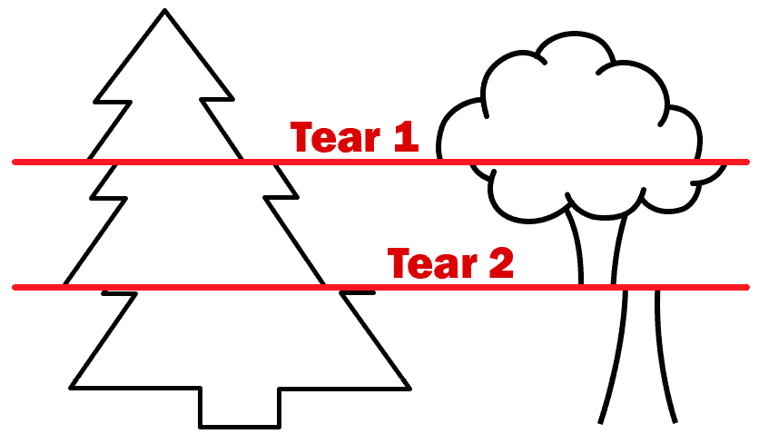

图 3.1 – 展示屏幕撕裂在两个位置产生的视觉伪影的图像

如果这个问题在每秒 60 帧的标准游戏中频繁发生，它可能会导致从对游戏的不满到恶心等各种问题。

*图 3.2* 展示了当读取指针（红色）开始落后于写入指针（绿色）时视觉上发生的情况：在中间列，写入指针被读取指针超过，这意味着从这一点开始，写入指针所做的所有工作都不会显示在屏幕上，因为读取指针已经读取了那些像素数据。这将导致屏幕看起来像右侧列，尽管所有数据都已渲染到缓冲区：

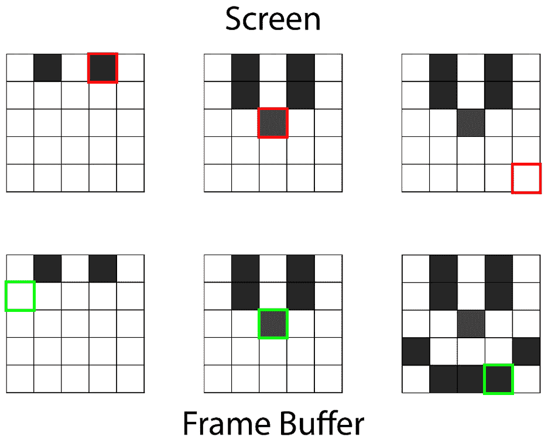

图 3.2 – 展示读取（红色）和写入（绿色）指针之间竞态条件导致帧撕裂的图

这引发了一个问题：我们如何在严格的时间限制内计算出绘制每个可见对象所需的全部着色器？

答案是不尝试。与其优化以打败当前情况，我们可以改变情况。目前，显示器在计算中途捕捉到写入指针；相反，我们可以在不同的缓冲区，即后台缓冲区中绘制我们的图像。这允许 GPU 在没有担心半成品图像会被推到不知情观众面前的恐惧中平静地计算。一旦新帧被计算到后台缓冲区，一个指针就会改变，使这张新图片成为新的活动帧缓冲区。下次 GPU 需要向屏幕发送数据时，我们知道图像已经完成。在*图 3.3*中，我们可以看到，尽管读取指针在中列超过了写入指针，因为它是从一个完整的缓冲区中拉取的，所以屏幕上没有渲染撕裂：

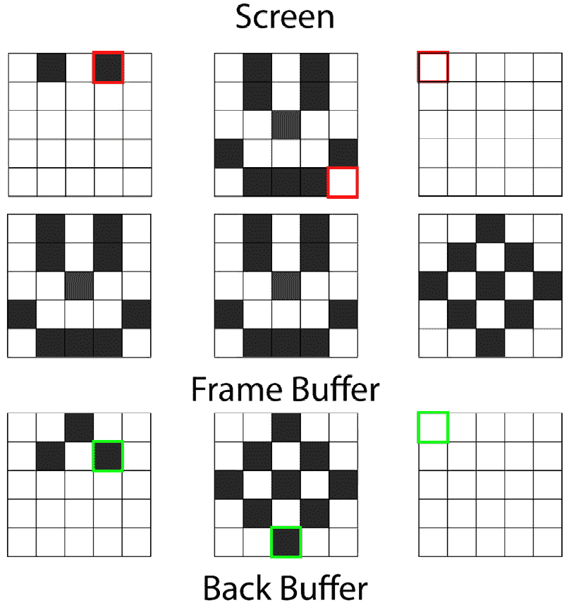

图 3.3 – 图表显示屏幕（顶部）从帧缓冲区（中间）渲染，同时写入指针在后台缓冲区（底部）工作

在缓慢的计算中，这意味着旧图像可能会在屏幕上显示多次，因为新图像不能及时完成，但与屏幕中间的撕裂相比，这种卡顿更好。

如果情况相反，并且我们远远超过了连接显示器的显示频率，那么 GPU 将会有很多浪费的时间，简单地等待。备用艺术品已经准备好发货，而主要的一个还没有被取走。大多数游戏玩家都知道这被称为**垂直同步**（**VSync**）的设置。关闭 VSync 后，一旦后台缓冲区充满，后台和帧缓冲区就会交换，这可能导致一种情况，即一个帧的性能突然下降，而没有后台缓冲区作为备用来填补视觉差距。这确实导致了更多的响应性，因为显示的图像在技术上更近，但开启和关闭设置之间的延迟差异与屏幕撕裂的视觉问题相比可以忽略不计。

在大型 VSync 等待时间期间提高我们生产力的一个方法就是使用更多的缓冲区。这种双缓冲的概念可以扩展到无限。如果有可能使用低端刷新率显示器与高端显卡配合，那么三缓冲将是一个高效的实现方式。这样，一旦第一个后缓冲区充满数据，GPU 就可以转向另一个后缓冲区，以免保持空闲状态。当显示调用通过时，最新完成的缓冲区成为帧缓冲区，而所有其他缓冲区（除了当前正在填充的那个）都被清除并发送到队列的末尾。然而，这种策略在现代硬件中很大程度上是不必要的，这就是为什么虚幻引擎只使用双缓冲系统。

在虚幻引擎源代码中找到这个模式的确切位置并不容易，因为它为每个渲染管道有不同的实现。默认情况下，虚幻引擎使用**DirectX**。DirectX 是微软为 Windows 平台设计的图形管道，内置了创建和管理帧缓冲区的方法。DirectX 将双重缓冲过程称为**交换链**。这个特定的实现可以通过导航到您的虚幻引擎 5 安装文件夹并前往以下路径找到：

`<``UE_5.0 文件夹>\Engine\Source\Runtime\Windows\D3D11RHI\`

此文件夹包含公共和私有文件夹中所有与 DirectX 相关的文件。这包括如`D3D11Viewport.cpp`这样的文件，它包含了缓冲区交换链的编辑器实现。这些文件是高度密集的 DirectX 代码，因此在此不会详细说明，但这是一个探索虚幻如何处理其图形管道的好起点。请注意，虚幻引擎还支持**Vulkan**，这有不同的实现。

在这一点上，您可能正在考虑双重缓冲作为一项低级工具。主要来说，它确实是，但您也可以在其他高级游戏玩法场景中使用它。任何数据收集和处理已经并行化以在多个线程上运行时，双重缓冲可以用来确保处理是在一致的数据上进行的。这可能包括热图分析，跟踪玩家在关卡中的死亡位置，或者 AI 收集其周围环境数据以做出决策。

让我们从一直运行在您代码下的系统转变为在引擎内部自动运行的进程，这个进程默默地提高您的游戏效率：轻量级模式。

# 轻量级

轻量级模式专注于减少大量对象占用的内存以及减少加载它们所需的时间。对于轻量级模式，我们首先需要考虑以下三个因素：

+   **内部数据** – 不可变的数据值，被认为是对象上始终为真的

+   **外部数据** – 可变的数据值，被认为是每个实例可变的

+   **内存成本** – 所有数据都必须存储在某处，对于已加载的对象，这意味着在我们的 RAM 上

考虑到这一点，让我们看看森林中的树木。采用简单的方法，我们可以为每棵树加载并存储一次模型、纹理和变换数据。这将使我们的数据存储看起来像*图 3**.4*，其中每棵树连接到自己的内存块，持有其渲染所需数据的副本： 

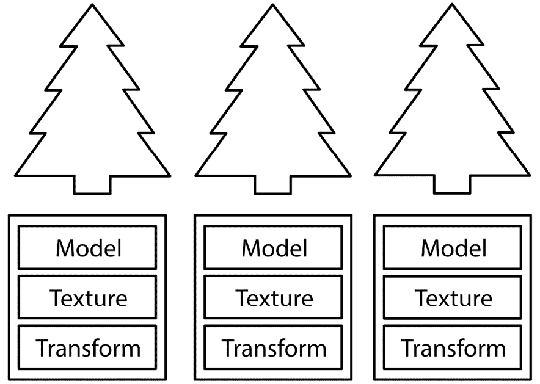

图 3.4 – 显示与每个树关联的数据的图表

如果我们将模型和纹理的内存成本合计为大约 5 MB，并将变换组件视为每棵树 12 字节的数据，那么我们三棵树的内存占用略超过 15 MB。这看起来可能不多，但扩展性不好。考虑到一个由 100 棵树组成的森林，我们需要略超过 500 MB 的 RAM 来存储本质上只是装饰性的内容。必须做些什么，因此让我们考虑在树的概念中哪些数据可以被认为是内在的，哪些需要保留为每棵树的外在。由于我们的树看起来都相同，所有用于视觉的数据（模型和纹理数据）可能都可以安全地被认为是内在的。很好，我们有一个明确的数据集，每个类型都有数据；那么呢？嗯，享元模式将我们认为是内在的所有数据放置在共享内存中。在实践中，这看起来像 *图 3**.5*，其中所有将在所有树之间共享的内在视觉数据都被收集到一个共享块中，你可以从空间上可视化内存成本的差异。像对象变换这样的东西仍然保持外在，因为每棵树至少会有一个不同的位置向量：

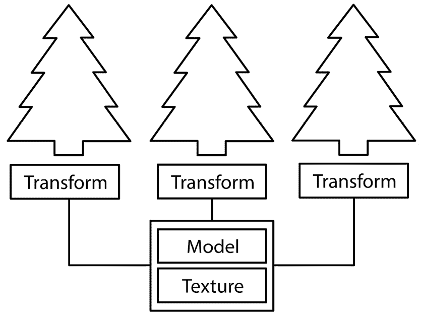

图 3.5 – 展示如何通过空间重复对象分离内在数据来节省内存的图

在内存分配方面，实现的享元模式对于共享模型和纹理数据有固定的 5 MB 成本，每棵树有 12 字节的可变成本。这意味着我们现在的 100 棵树只需要 5.1 MB，这与之前需要的 500 MB 相去甚远。

基础知识掌握之后，让我们来探讨我们的系统可能会出现的问题。显然，我们通过共享数据获得了好处，但如果我们想在森林中拥有两种不同模型和纹理数据的树呢？根据之前的解释，你可能认为这将使这些数据成为外在的，因此不符合享元模式。然而，你可以调用类型对象模式，我们将在后面的章节中更详细地讨论。类型对象模式收集有关 *类型* 的内在数据并应用相同的概念。内存成本的这种计算将类似于类型的数量乘以 5 MB，再加上世界中每个对象 12 字节。当然，类型对象模式还有一些其他的好处，我们将在 *第九章* 中探讨，但这是它与享元模式结合以提供一个可扩展、高效系统的方式。

Unreal Engine 默认将享元模式应用于项目中加载的每个资产。当需要时，资产从单一位置引用，并且它们的数据在所有引用之间共享。如果你需要更改特定加载版本的资产，你需要主动打破享元模式才能做到这一点。这种可能需要的情况之一是在动态材质实例中。可能需要一些值来改变场景中单个对象的外观，因此必须制作材质的内在数据的副本。

本章的最后一个模式比前两个模式更不自动、更不默默无闻。这是一个围绕实现广阔世界并使其可玩性得到保证而设计的子系统。在 Unreal Engine 中，我们称之为**世界分区**（基于编辑器中可用的工具集来管理如何分割大规模世界），但更普遍地，它被称为空间分区模式。

# 空间分区

假设矩阵是一个真实的概念，而我们正生活在一个巨大的物理模拟中。任何涉足物理模拟的人都知道，你不需要很多相互作用的物体来使模拟变得缓慢。简单的解决方案是检查每个对象与每个其他对象，导致一个 *O(n²-n)* 的解决方案，如图 *3.6* 中所示，4 个对象有 12 次碰撞检查：

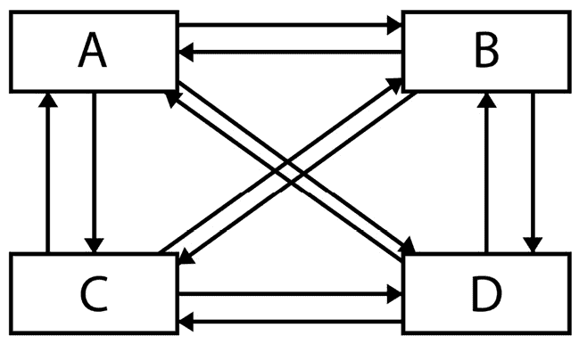

图 3.6 – 显示在低效碰撞检测解决方案中执行每个碰撞检查的图

显然，我们可以通过避免重复已经完成的计算来提高效率，将我们降低到 *O(nLog2(n))*，其中这四个点仅使用六个碰撞检查。这更好，但我们只能通过检查每个对象与每个其他对象来走这么远。我们本可以不计算其中的一些，但这就像在我们的矩阵模拟中给一些人提供墙壁黑客，允许他们可能穿过墙壁，或者更糟，穿过彼此。

我们可以在检查对象的碰撞之前检查它们之间的距离。这意味着距离较远的对象甚至不会尝试碰撞。这可能适用于更复杂的碰撞几何形状，但现实情况下，如果我们是只使用原始碰撞的智能开发者，我们只是在增加所有计算。在最坏的情况下，这会将效率降低到 *O(nLog2(n) + n)*。尽管如此，这个理论是合理的，所以我们不应该检查每个对象，而应该根据地理位置将它们分组。世界需要被分成单元格；我们将它们称为块。每个单元格都知道它完全包含的对象及其在单元格网格中的位置。我们只需要检查相邻单元格中对象的碰撞。这是空间分区的基础。

如果一个对象比它中心所在的细胞大怎么办？我们可以将细胞组合成更大的块，并包括任何跨越新细胞组边界的对象。这个过程会一直重复，直到细胞包含整个世界。这创建了一个细胞的树状结构。要检查一个对象的碰撞，只需要检查树中直接连接在上面的和下面的对象。这有可能减少我们本应进行的多数检查。

一个问题是我们在树中确定每个对象位置的方式。这确实有一些开销成本，意味着对于小规模模拟来说，这可能是过度杀鸡用牛刀。话虽如此，如果你打算在整个世界中使用它，并且只更新移动对象的树位置，你最终会获得巨大的效率提升。二维实现可能遵循一个称为**四叉树**的结构（如图 3.7 所示）：

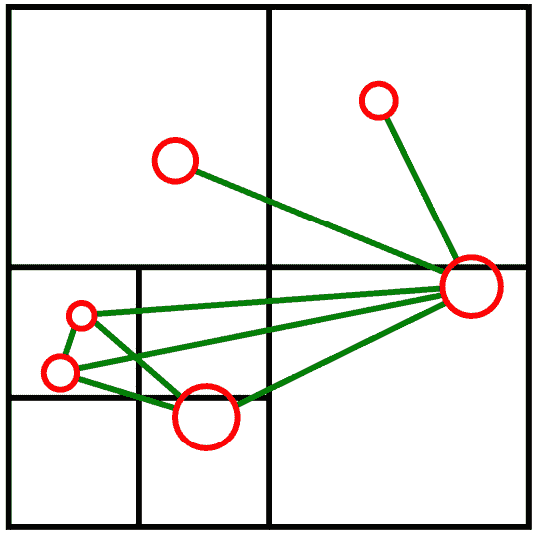

图 3.7 – 图表展示了四叉树如何将这些六个对象（红色）在当前位置时所需的碰撞检查（绿色）数量减少到八个

在这里，你可以清楚地看到不同细胞（或四叉形）中的对象之间不会检查碰撞。当一个对象跨越边界时，它开始存在于上一层细胞中，并且必须检查与子细胞中所有对象的碰撞。通常情况下并非如此，因此，在大量对象的情况下，总会带来性能提升。

Unreal Engine 5 使用三维四叉树的概念，称为`Fscene`类，并由渲染线程用于快速确定对象是否存在于光的作用区域内。这样，光照计算的次数会大幅减少：

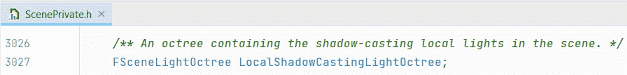

图 3.8 – ScenePrivate.h 文件中八叉树位置的截图

额外说明

如果你从图 3.8 中所示的那一行开始深入到结构体和类定义中，你最终会找到一个名为`Toctree2`的类名（第一个已经被弃用）。在这个类中，你可以探索 Epic 对八叉树的实现。

这还不算完。随着虚幻引擎 5 的推出，引入了一个名为世界分区的系统。这是空间分区的一种实现，这次是在二维中，用于不同的目的。作为开发者，你必须定义虚幻应该使用多大的单元格大小，而且与树变体不同，这限制在单层深度。话虽如此，它确实提供了一种快速连接大型世界与**细节级别**（**LOD**）系统的方法，从而影响从视觉效果到碰撞网格的各个方面。LOD 系统用于在渲染的对象在屏幕上显得更小的时候减少渲染的细节（无论是 3D 网格还是纹理）。当屏幕上的对象距离较远时，将具有一个具有更低三角形计数的 LOD 网格，如果相同的对象直接在玩家面前绘制，则三角形计数会更高。

让我们通过查看我们提供的示例地图来探索世界分区，该地图使用开放式世界级别。我们将首先查看示例是如何工作的，然后更改一些变量以获得不同的结果，以便更好地理解该系统的工作原理。本节使用的示例级别可在 GitHub 上的`PatternsInAction`项目中找到，该链接位于章节开头。与*第二章*不同，这次我们提供了一个完整的虚幻项目，这次，你可以提取`.zip`内容，然后双击`PatternsInAction.uproject`文件。

## 介绍世界分区

首先，从`Content\Maps`文件夹中打开`WorldPartitionExample`地图文件。当你启动项目时，此地图应该默认打开，但如果它没有打开，请导航到**文件** | **打开级别**并从目录中选择它。然后你应该看到一个包含一系列蓝图演员的世界，所有这些演员都显示为原始形状：

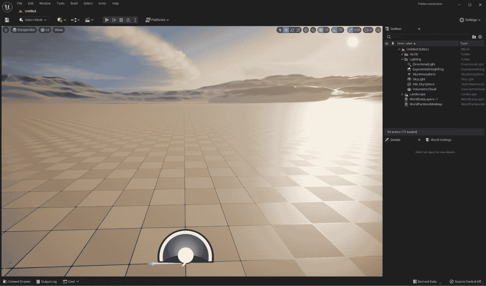

图 3.9 – PatternsinAction 项目中的世界分区示例地图

此级别已经启用了世界分区并设置了地形。这对于开放式世界级别模板来说是标准的。

让我们先打开世界分区设置工具，以便我们可以看到它是如何工作的。如果它没有默认打开，请转到**窗口** | **世界分区** | **世界分区编辑器**：

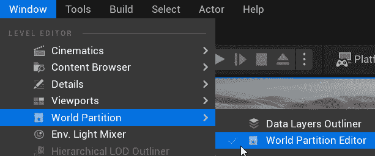

图 3.10 – 从菜单访问世界分区编辑器

这应该在用户界面与**详细**标签页相同的部分打开**世界分区编辑器**；你可以使用滚轮放大，之后你将最终能够看到地图的网格参考系统（前提是你已在**世界分区**编辑器的顶部菜单中开启**显示单元格坐标**）。值得注意的是，这个网格并不直接与世界分区系统产生的单元格网格相关。相反，它提供了一个基于编辑器单元格大小的网格，默认设置为 12,800（128 平方米），是默认世界分区单元格大小的一半，即 25,600（256 平方米）：

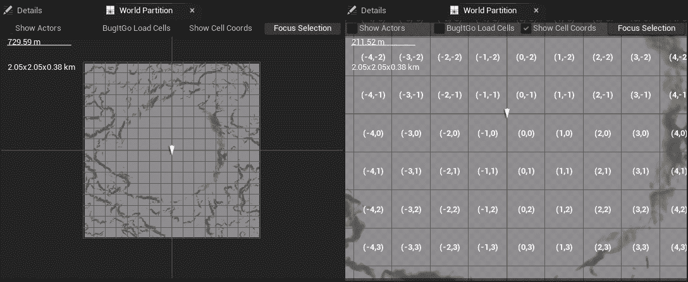

图 3.11 – 世界分区编辑器标签页，水平调整大小以便左侧的文本可见（左侧），然后开启显示网格坐标以放大显示网格参考系统（右侧）

世界分区根据单元格网格分割（分区）世界，每个单元格对应于级别的物理部分。如果一个角色的边界框在那个单元格内，它将根据单元格是否在**流源**（控制何时加载世界分区单元格的实体）的设定距离内而被绘制（或隐藏），例如玩家角色或具有世界分区流源组件的演员。这允许虚幻引擎分割地图，并且只绘制所需的单元格，使得开发者能够构建极其庞大的地图。

为了确定一个单元格必须位于流源多近才能被绘制，引擎使用**加载范围**变量，该变量可在**世界设置** | **世界分区** | **运行时设置** | **网格** | **索引[0]**中找到。**加载范围**的值设置单元格需要位于角色半径内才能加载和渲染。**加载范围**的默认值是 76,800，以**虚幻单位**（uu）表示。1 uu = 1 cm，因此默认半径是游戏中的 768 米：

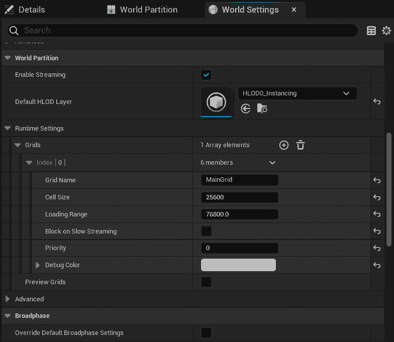

图 3.12 – 世界设置标签页的世界分区展开，显示网格设置

**世界设置**的**索引[0]**部分还包含确定网格中每个单元格大小的变量。在建筑物高度导致可见距离缩短的城市环境中，你可以设置比开阔景观（如沙漠）更小的**单元格大小**值和**加载范围**值。

虽然显著减小单元格大小和加载范围看起来似乎是合理的，但如果设置得太低，由于一次尝试加载（和卸载）过多单元格而造成的瓶颈，将会导致帧率问题。

现在我们已经了解了单元格网格的构成，我们可以开始了解单元格网格是如何根据流源的位置来控制对象的加载和卸载的。

## 理解对象何时加载

为了更好地理解世界分区的工作原理，我们可以在**索引 [0]**中更改一些**运行时设置**值。我们将更改**加载范围**和**单元格大小**，以控制我们的示例地图中世界分区的工作方式。我们做出的更改将调整地图中蓝图加载和卸载的时间。观察这些差异将帮助你体验世界分区（以及空间分区）的实际应用。

在我们进行任何更改之前，按下**播放**按钮以在编辑器视图中播放关卡。你应该注意到屏幕左侧有一串打印字符串。这是因为每个蓝图行为者都已被设置为打印一条简短的消息和它们的显示名称。

使用典型的第一人称*W*、*A*、*S*和*D*键在地图上移动，以控制角色。你应该注意到，如果你移动到地图的一侧，打印的内容会减少，因为较少的对象正在打印它们的消息。

一旦你看到了这个效果，尝试将`76800`更改为`768`，使对象需要位于其中的半径比默认设置小 100 倍。这将导致显著不同的结果。现在，再次测试关卡。你应该注意到只有两个对象可见：一个高矩形箱和一个圆锥体，它们都位于从起始位置的角色前方。这些对象是可见的，因为每个网格的一小部分位于玩家角色 7.68 米半径内的一个分区单元格内。

向任一对象走去，最终会导致其他对象突然出现（你需要非常靠近），因为当你进入相邻分区单元格的范围内时。

为了进一步理解我们为什么会有这种行为，让我们更改**世界分区编辑器单元格****大小**变量：

1.  在我们之前使用的**运行时设置**部分下方，通过点击标题或旁边的箭头来展开**高级**部分。

1.  将`25600`设置为与**索引 [0]**设置中的**单元格大小**值匹配，确保我们的编辑器显示与我们在玩关卡时体验到的行为一致。

1.  一旦你进行了更改，通过导航到顶部菜单中的**构建** | **构建迷你地图**来重建迷你地图。你将被要求保存关卡和任何修改过的资源，然后在构建过程中会显示一系列进度条。

1.  切换回**世界分区**编辑器标签；你现在应该看到网格中的单元格少得多，如图*图 3.13*所示。13*：

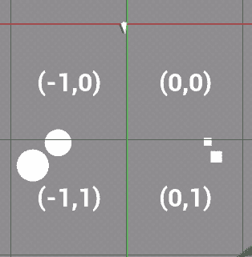

图 3.13 – 更新后的编辑器单元格显示，显示可见对象部分位于最初加载的单元格(-1,0)和(0,0)内

现在网格应显示每个演员的位置，在每个对象类型（圆锥体和立方体）至少有一个位于角色开始位置（或非常接近）的网格单元中。每一对中的第二个对象位于相邻的网格单元中，因此只有在玩家角色位于 7.68 米内时才会出现。当你考虑到每个单元是 256 米 x 256 米，而我们更改的默认加载范围最初是一个半径为 768 米的圆时，这是一个非常短的距离。根据默认值，当角色站在网格原点的起始位置时，有 36 个单元正在加载，而使用缩短范围为 7.68 米的 4 个单元，这在游戏中使用是不合适的，但可以作为系统如何工作的极端示例：

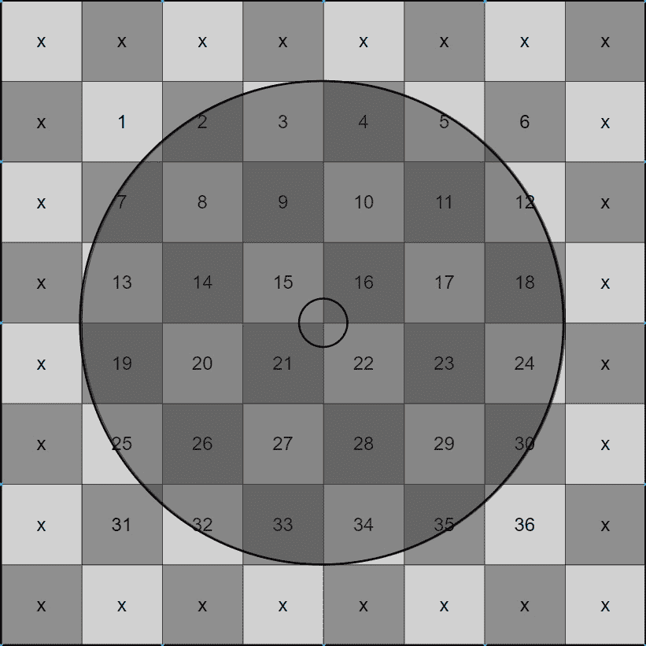

图 3.14 – 768 米半径的圆在 256 米 x 256 米网格单元上的重叠区域视觉表示，与 7.68 米半径（内圈）仅重叠 4 个单元相比，有 36 个单元被加载

现在我们已经设置了一个极端值，尝试一些不同的值，例如设置`38400`，这将导致在任何一点加载更多的对象。站在地图的中心将加载与默认设置相似数量的可见对象，但当你远离它们时，你会看到对象消失得更快。记住，你总是可以返回默认值`76800`。

这显示了如何，通过不同的加载范围，我们可以控制我们 3D 世界的哪些部分何时出现。为你的游戏获取正确的值可能需要一些测试，在某些情况下，可能需要包含可伸缩性设置以确保游戏在不同的硬件上运行。目前，关键是要了解如何根据流源控制加载和卸载，这样一旦你有一个可以控制的 3D 世界，你就可以充分利用世界分区。

## 确保演员在需要时加载

确保演员加载并准备好播放有两种方法。一种选项是通过防止演员被世界分区加载和卸载来强制演员始终处于加载状态。这可能在你需要控制整个级别的各个方面时很有用，或者如果你有一个需要始终可见的纪念碑。为此，请执行以下操作：

1.  在级别中选择选定的演员。

1.  在**详细信息**面板中，向下滚动到**世界** **分区**部分：

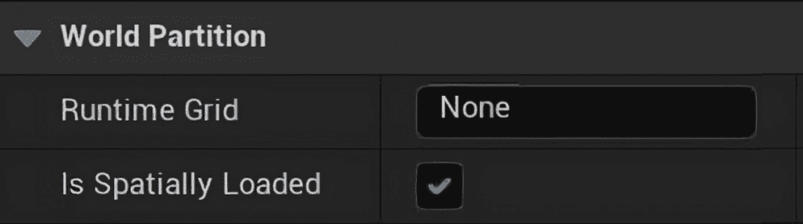

图 3.15 – 在详细信息面板中选中演员时的世界分区设置

1.  设置为**关闭**。

第二种方法是在世界中包含具有世界分区流源组件的演员。

我们包括了一个`BP_StreamingSourceActor`蓝图，该蓝图已设置好带有目标网格的世界分区流源组件。要看到它的实际效果，请执行以下操作：

1.  将`BP_StreamingSourceActor`蓝图从`内容浏览器/蓝图`文件夹拖放到两个圆锥形演员之间的世界中。

1.  为了测试目的，将`768`设置为测试。

当测试级别时，您现在应该看到，与最初将加载范围设置为`768`时不同，两个圆锥形对象都是可见的。

然而，您会注意到，在五秒钟的游戏后，其中一个圆锥（离玩家最远的圆锥）将消失。这是因为`BP_StreamingSourceActor`蓝图包含一些粗略的代码来切换流源的开和关。这为如何使用流源演员来控制为玩家准备好的加载单元提供了很好的见解，例如，当角色将被传送到一个需要完全加载的新位置，而玩家被重新定位之前。

在*图 3*.16 中，您可以看到`BP_StreamingSourceActor`事件图中的逻辑。

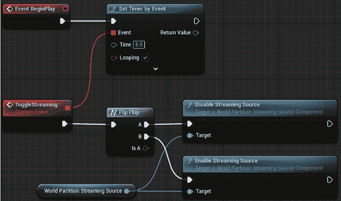

图 3.16 – 使用计时器每五秒禁用和启用流源的粗略蓝图设置

现在我们已经探讨了世界分区，我们将看看如何在没有它的级别中使用它。

## 在现有级别上启用世界分区

要将现有级别（未使用开放世界启动地图创建的级别）转换为使用世界分区，您只需使用内置工具：

1.  确保您想要转换为世界分区启用级别的级别已保存。

1.  从顶部菜单导航到**工具** | **转换级别**。

1.  从弹出菜单中选择您想要转换的地图。

1.  点击**确定**。

如果您在最终设置对话框中选择**就地**，则工具将创建一个带有名称后缀`_WP`的新地图版本；否则，它将简单地覆盖您现有的级别。

# 摘要

在本章中，我们讨论了在虚幻引擎中存在的一些现有模式，重点关注双缓冲、享元和空间分区。

我们已经查看了一些这些系统，包括使用世界分区系统探索空间分区编辑器示例，实验不同的变量以控制何时加载和卸载对象，以及测试具有世界分区流源组件的演员。

在下一章中，我们将探索 Unreal 中的一些预定义模式。我们将探讨如何使用 `update` 方法创建组件，以及如何使用 Unreal 的 AI **行为树**创建一个简单的由 AI 控制的**实时策略**（**RTS**）游戏单位。
