# 第四章：UE5 中的预制图案 – 组件、更新方法和行为树

本章将重点介绍在游戏开发中广泛使用且虚幻引擎 5 提供强大支持和工具的三个主要模式，包括预构建实现和编辑器——即**组件**、**更新方法**和**行为树**模式。我们将讨论它们存在的原因，并探讨如何在我们自定义框架中通过指导练习来实现它们。

了解你手头的工具将提高你的开发速度，让你免于重新发明轮子。即使这些工具你在蓝图（Blueprint）中已经很熟悉，对 C++工作原理的一些了解也许能提高你在任何地方使用它们的效率。

在本章中，我们将涵盖以下主题：

+   理解和创建组件

+   应用更新方法进行游戏原型设计

+   使用行为树

# 技术要求

对于本章，你需要从 GitHub 仓库的*第四章*分支下载起始 RTS 框架，该框架可以从[`github.com/PacktPublishing/Game-Development-Patterns-with-Unreal-Engine-5/tree/main/Chapter04`](https://github.com/PacktPublishing/Game-Development-Patterns-with-Unreal-Engine-5/tree/main/Chapter04)下载。

在接下来的章节中，我们将构建此框架的元素，在探索它们的同时，使用模式构建一系列游戏功能。

# 理解和创建组件

当你编程时，你首先学到的事情之一是尽量避免重复。实际上，你学到的每一种技术，从循环到函数到类封装，都专注于以更少的输入重复使用代码。建立这个类比，一个循环在某个区域重复使用代码行，这样你就不需要重复它们。一个函数重复使用代码块，这样你就不需要在你的类中重复它们。然后一个类让你可以在实例中重复使用函数和数据集，这样你就不需要在你的程序中重复逻辑。

这如何帮助？在游戏中，任何可见的对象可能都有一些渲染元素，允许它被绘制到屏幕上。你在所选图形管线中渲染对象的代码遵循标准化的结构，并且可能在每个需要渲染的对象中都是相同的。甚至仅仅考虑这种可能的重复都应该让你警钟长鸣。最初，在多个地方多次写出相同的行是浪费时间。然后，如果你稍后需要做出结构性的更改，你突然会发现自己在寻找所有需要更改的地方，这就像一场寻宝游戏。

有更好的方法。

进入，组件模式。本质上，我们利用之前描述的类的可重用性来封装围绕可重复行为的所有逻辑。这形成了一种构建块模板，我们可以在许多地方实例化和引用。当需要更新逻辑时，它只存在于一个地方，并将影响所有引用它的区域。

实际上，这也使得围绕此功能周围的代码更简洁。组件通常设计为完全自包含的，这意味着我们的碰撞代码将为我们处理上下文，渲染组件将处理将模型和纹理资产与材质一起链接。这导致在调用这些组件上的函数之前需要的检查更少，并减少了意外行为。

例如，当处理两个对象之间的碰撞检查时，您不需要在检查它们是否可以碰撞之前找出对象 A 和 B 的形状碰撞器；解析这个的代码包含在碰撞组件本身中。您也只从碰撞组件获得碰撞信号；它不会在模型与某物碰撞时使您的模型闪烁。有效地使用组件可以导致模块化代码架构，这对于充分利用像 Unreal 这样的大型引擎以及开发者团队至关重要。

重要提示

注意这个链接是如何回到我们 SOLID 原则中的单一职责原则的*第二章*。好的模式几乎总是反映这些原则。在这种情况下，我们的组件各自完成一项任务，使我们的代码模块化，因此更有用。

Unreal Engine 5 基于所谓的`BP_TopDownCharacter3`，具有以下组件：

+   **胶囊** – 设置为根组件；它描述了物体在物理引擎中的形状

+   **网格** – 存储了将对象渲染到屏幕上的所有数据

+   **弹簧臂** – 用于在距离处保持物体的动态组件

+   **相机** – 附着到弹簧臂上，描述了相机的位置和设置以渲染屏幕

组件在重要性和大小上有所不同。前面的列表显示了如何使用弹簧臂组件，这是一个相对较小且不重要的组件，可以与较大的、更重要的组件（如同一演员中的相机）一起使用。大小并不决定重要性，所以让我们看看您可能创建的第一个组件，以使您的开发变得更容易——一个`健康`组件。我们的目标是创建一个简单易用的工具，让设计师可以将其放置在任何演员上，使他们能够跟踪一个健康值，该值附加到内置的损伤系统。该组件还应提供挂钩，用于在受到伤害和健康值达到零时通知。

在打开示例框架后，点击**工具** | **新建** **C++类…**。

您将看到一个窗口，显示您可以扩展的所有父类：

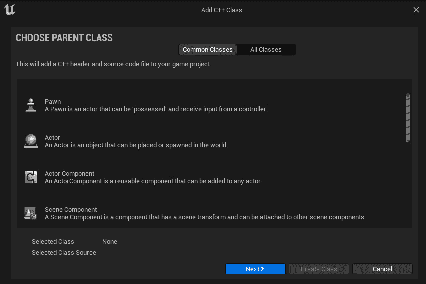

图 4.1 – 选择要继承的类的窗口

我们对 **Actor, Component** 感兴趣，所以选择它并点击 **下一步**。

在以下窗口中，我们将组件命名为有意义的名称，例如 `HealthComponent`：

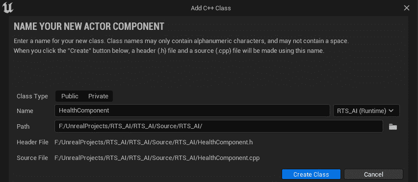

图 4.2 – 命名和作用域新 C++ 类的窗口

在此示例中，其余的设置并不重要，但它们确实会影响组件的作用域。这仅在你构建包含多个子系统的项目时需要关注，这些子系统可能需要交叉引用类。现在，让设置保持原样，并点击 **创建类**。这将启动 Unreal 链接的 IDE，默认情况下是 Microsoft Visual Studio。

重要提示

虽然 Visual Studio 等工具是优秀的 IDE，但在撰写本文时，对于 Unreal 开发来说，没有比 JetBrains Rider 更好的选择。截至 2022 年版本，Unreal 特定的结构已经内置到它们的代码自动完成和错误检查器中。然而，这款软件并非免费，所以如果你正在使用 Visual Studio，请注意，你的部分代码可能会显示错误，但它仍然可以构建和运行。

当类文件打开时，你应该有一个头文件（`.h`）和一个主体文件（`.cpp`）。我们将首先讨论从我们的任务目标中提取的要求，并构建我们的头文件。我们的组件需要执行以下操作：

+   包含健康值

+   能够接收伤害信号

+   在受到伤害和死亡时发出通知

解决我们的健康值问题很简单：我们只需要定义一个浮点变量来跟踪当前值，另一个变量允许从编辑器设置最大值。考虑到这一点，设置 `UPROPERTY` 块中的属性指定符是最重要的部分。受到伤害也很简单，因为 Unreal Engine 5 已经有一个在所有 `AActor` 中广泛使用的伤害接口系统。要连接到这个系统，你需要一个与 `OnTakeAnyDamage` 事件具有相同签名的函数，如下面的 `HealthComponent.h` 代码片段所示。最后，为了通知拥有 `AActor` 的组件已经受到伤害或健康耗尽，我们将使用一些动态多播委托。这些将在我们探讨清洁通信的*第六章*中进一步介绍，但就目前而言，可以将它们视为从组件发出的烟雾信号，拥有 `AActor` 的组件可以监视这些信号。

因此，让我们在头文件中编写代码：

HealthComponent.h

```cpp
#pragma once
#include "CoreMinimal.h"
#include "Components/ActorComponent.h"
#include "HealthComponent.generated.h"
DECLARE_DYNAMIC_MULTICAST_DELEGATE_OneParam(
    FComponentDeadSignature, AController*, causer);
DECLARE_DYNAMIC_MULTICAST_DELEGATE_ThreeParams(
    FComponentDamagedSignature, AController*, causer,
    float, damage, float, newHealth);
UCLASS( ClassGroup=(Custom), meta=(BlueprintSpawnableComponent) )
class RTS_AI_API UHealthComponent : public UActorComponent
{
    GENERATED_BODY()
public:
    UHealthComponent();
    UPROPERTY(BlueprintAssignable)
    FComponentDeadSignature onComponentDead;
    UPROPERTY(BlueprintAssignable)
    FComponentDamagedSignature onComponentDamaged;
protected:
    UPROPERTY(BlueprintReadOnly, VisibleAnywhere)
    float _currentHealth;
    UPROPERTY(BlueprintReadWrite, EditAnywhere)
    float _maxHealth;
    virtual void BeginPlay() override;
    UFUNCTION()
    void DamageTaken(AActor* damagedActor, float damage,
        const UDamageType* damageType, AController*
        instigator, AActor* causer);
};
```

接下来，我们需要填写构造函数、`BeginPlay`和`DamageTaken`的函数定义。构造函数很简单，因为它只是为设计师设置建议值。在这里，我们只设置了最大生命值。"BeginPlay"稍微有趣一些。在下面的代码块中显示的"BeginPlay"是我们将伤害函数链接到拥有`AActor`的事件的地方。"DamageTaken"在这个组件中做所有的工作，但它同样简单，只用了两行代码来“广播”代表。

重要提示

我们将在第六章中更深入地探讨事件的功能以及一些术语的含义。目前，重要的是这个组件确实以我们需要的功能运行。

让我们把这些添加到主体文件中：

HealthComponent.cpp

```cpp
UHealthComponent::UHealthComponent()
{
    _maxHealth = 100.f;
}
void UHealthComponent::BeginPlay()
{
Super::BeginPlay();
    GetOwner()->OnTakeAnyDamage.AddDynamic(this,
        &UHealthComponent::DamageTaken);
    _currentHealth = _maxHealth;
}
void UHealthComponent::DamageTaken(AActor* damagedActor,
    float damage, const UDamageType* damageType,
    AController* instigator, AActor* causer)
{
    _currentHealth=FMath::Max(_currentHealth–damage, 0.f);
    onComponentDamaged.Broadcast(instigator,damage, _currentHealth);
    if(_currentHealth <= 0.f)
    {
        onComponentDead.Broadcast(instigator);
    }
}
```

要使用这个组件，进入蓝图类，点击`Component`应该能找到它。然后，在添加它之后，你可以通过点击旁边的事件的绿色加号按钮将逻辑链接到它：

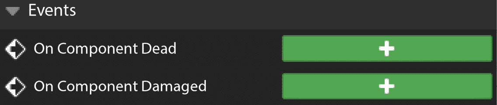

图 4.3 – 在 C++中创建的委托在蓝图编辑器窗口中显示

关于这个模式的最后一点，你可能也听说过 ECS 这个术语，尤其是在像《Doom Eternal》和《Overwatch》这样的游戏中，但它在 Unreal 的实现中略有不同。那里所说的 ECS 就是我们所说的*面向数据*的 ECS。这意味着组件只存储数据。系统是函数，并且单独存储。然后系统在被称为实体的组件的原型上运行。实体在内存中连续存储，这使得处理大量实体的系统变得更快，甚至可以轻松地多线程处理。

与此相对应的是，虽然从原则上听起来很简单，但在实践中，它是在编程方法上的一个范式转变，就像从线性*hello world*风格程序（所有内容都在一个文件中）到具有许多类和复杂内部结构的面向对象项目一样。这一点加上这个方法的初级阶段意味着，开发大型游戏并期望整个编程团队能够立即使用这个系统是不切实际的。如果你想了解更多关于完整数据导向 ECS 的信息，那么关于这个主题的资源很多。进行适当研究的关键词应该是数据导向、原型和 ECS，顺序可以有所不同，但由于这种技术的采用率较低，资源通常要么简短，要么只是表面上的。这个概念最好通过实际操作，拆解 ENTT C++库来学习它是如何实现这个模式的。这对于实际学习者来说是最好的，因为它是一个原始实现，没有任何其他干扰。

在现代游戏设计中，组件无处不在，现在你应该对如何使用它们来结构化你的代码有一些了解。你开发者工具包中的另一个通用工具是更新方法。

# 应用更新方法进行游戏原型设计

更新方法完全是关于抽象。让我们通过一个例子来学习。想象一下，仅用基本的 C++知识构建一个 *Pong* 克隆。它可能看起来像这样：

天真的 Pong 代码

```cpp
Entity aiPaddle;
Entity ball;
Vector2D direction;
// Main game loop
while (looping)
{
    Vector2D ballPos = ball.GetPosition();
    ballPos += direction;
    ball.SetPosition(ballPos);
    if (ballPos.y > aiPaddle.GetPosition().y)
    {
        aiPaddle.MoveUp();
    }
    else
    {
        aiPaddle.MoveDown();
    }
    // Input, collisions, and rendering...
}
```

这段代码可能适用于 *Pong*，但问题很清楚。随着你向游戏中添加更多类型的对象，处理每一帧的方法数量也在增加，这使得代码变得不可持续。

解决方案可以在每个有过度微观管理老板的人的头脑中找到：“*只让我做我的工作.*”在这种情况下，主循环是经理，实体们坐在一旁。它们存在，但主要是逻辑在它们身上运行，而不是它们自己运行。为什么不信任这些专家，让每个实体对其名称下的逻辑负责呢？我们在主循环中保留一个引用列表，但我们忘记了它们是谁，并退而求其次，用数字或数组中的索引来引用它们。

这种新的非个人化方法让主循环能够遍历所有实体，并对它们调用共享的 `Update()` 方法。现在，每个实体都可以在其自己的 `Update` 函数重写中处理其自己的世界。以下代码片段是展示如何管理这种新方法的示例：

更好的 Pong 代码

```cpp
Entity entities[];
//Main game loop
while(looping)
{
    for(Entity e : entities)
    {
        e.Update();
    }
//Collision and rendering…
}
```

Unreal Engine 对 `Update` 的实现被称为 “`Tick`”。它会在每一帧渲染时触发一次，允许开发者为每个创建的 actor 提供不同的行为。然而，更新方法模式存在一个重大问题，这就是为什么我们将更深入地探讨它，见*第五章*。

现在我们已经涵盖了更新方法模式，我们将继续探讨在 Unreal Engine 5 中实现行为树模式，通过探索 Unreal Engine 编辑器中的行为树系统。

# 与行为树一起工作

本章的最后一种模式可能有点具体，但并不比其他模式少用。行为树为 AI 大脑运行定义决策树。这些树定义了关于 AI 认为它所处的情境存储的信息将如何影响它采取的行动。与其他 AI 大脑解决方案将代码分割成离散块不同，行为树倾向于碎片化，目的是为了重用。这回到了本章开头关于代码重用以提高效率的想法。一棵树可能看起来很复杂，有很多分支和叶子（是的，这就是我们称呼组成行为树的复合体和任务），但仔细观察后，你会发现只有几个构建块，它们的排列创造了复杂决策的错觉。

简单树中的流程从根节点开始，按顺序从 0（顺序在这里很重要）评估下一层的每个节点，直到得到成功响应。此时，树知道它已经找到了适合其情况的正确任务，并可以重置。如前所述，存在两种简单的节点类型：复合节点和任务。复合节点通过自己的规则集指导逻辑流程，而任务则是动作，可以根据它们包含的逻辑（无论是蓝图还是 C++代码）成功或失败，并且它们下面永远不会有层。行为树按顺序执行每个节点，直到它们到达列表的末尾或某个节点失败。当所有子节点都成功时，它们才会成功。

我们将使用选择器和序列节点，它们都是复合节点类型。选择器节点从左到右执行其所有子节点；它在其中一个子节点成功时停止执行。序列节点也按从左到右的顺序执行其所有子节点；然而，与选择器节点不同，它在其中一个子节点失败时停止执行。还有其他更专业的节点，但这两个复合节点是任何你希望设计的系统的基石。

另一种复合节点类型，我们不会使用，是**简单并行**节点类型。简单并行节点允许你同时运行两个子节点：一个必须是任务，另一个可以包含行为树的一个完整子树或分支。

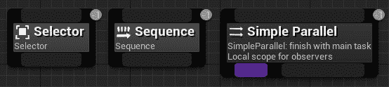

图 4.4 – 三种复合节点类型：选择器、序列和简单并行

行为树在游戏中的一个显著用途是《光环 2》。如上所述，树中节点的顺序很重要，可以彻底改变 AI 的行为，因为它倾向于优先考虑顺序较高的分支。为了区分不同的敌人类型，微软为每个敌人设计了不同的行为树。*咆哮者*有一个高阶分支用于逃跑，因此它们看起来更害怕，而*精英*可以根据玩家的行为重新排序自己的树，以使其看起来更具适应性。值得注意的是，如果你进入了一个车辆敌人，*精英*将提高进入车辆的优先级，因为车辆对车辆的战斗比其他战斗更有趣，反之亦然。游戏中还有许多其他技巧，但这里不是继续讨论的地方，所以回到 UE5。

让我们看看在 RTS 框架中为简单的**实时策略**（**RTS**）AI 构建行为树。我们将介绍行为树的各个构建块，包括选择器、序列、装饰器、服务和任务。

对于这个实现，我们将使用蓝图来创建服务（由行为树节点调用的函数集合）和任务，而不是使用 C++，因为主要关注的是在虚幻引擎 5 中实现行为树模式。

框架包含了一系列已经为您设置好的资产。我们创建的任何蓝图逻辑都已注释，如果您想进一步探索它们。在 `Content/RTS/Blueprints` 文件夹中，您将找到一系列用于创建我们 RTS 示例游戏基本元素的 Unreal 资产：

+   **GM_RTS**: 这是游戏模式。它包含框架工作所需的各种类的引用。

+   **PC_RTS**: 这是玩家控制器。它包含左键点击可选单位并在世界中右键点击以告诉单位去哪里的功能。

+   **BP_CameraPawn**: 这是我们的小兵。它是一个简单的带有摄像头的兵蓝图，摄像头被设置为直接放置在地图的中心。

+   **BPI_Units:** 这是我们的大纲界面。它包含三个功能：**SetMoveLocation**、**Stop** 和 **AttackTarget**：

    +   **SetMoveLocation** 有一个矢量输入，**目标位置**

    +   **AttackTarget** 有一个对象输入，**TargetToAttack**

    +   **Stop** 只是一个函数名，没有输入或输出

+   `BPI_Units` 蓝图界面。

    骨骼网格组件已设置为一个放置在默认网格上的绿色色调材料实例，该默认网格是从基础角色类继承的。我们在这里使用的是标准的人形角色网格。

    此蓝图目前没有任何功能。

+   **BP_EnemyUnit**: 这是一个第二个角色蓝图。这是一个没有功能的简单角色蓝图。

    骨骼网格组件已设置为一个带有红色色调的材料实例，以便清晰识别。

因此，我们将构建一个玩家可以控制的 AI 单位。玩家只能告诉单位去哪里移动。他们将通过首先使用左键选择单位，然后通过在地板上右键点击选择单位要移动到的位置来完成此操作。

然后，单位将移动到该位置。当不移动时，单位将搜索查看是否有敌对单位在其当前位置的半径内。如果它发现敌对单位，单位将转向面对敌对单位并对其射击（目前使用简单的线迹）。

要实现这一点，我们需要创建一系列资产。我们将创建一个 AI 控制器资产，为此我们将创建一个包含行为树内部使用的变量的黑板资产。

## 创建 AI 控制器

我们需要首先创建的是 AI 控制器蓝图资产。此资产允许我们使用行为树用 AI 解决方案替换兵的人类控制器。为此，我们需要执行以下操作：

1.  在 Unreal Engine 编辑器内部，打开 `Content/RTS/Blueprints` 文件夹。

1.  在 **内容浏览器** 中的文件夹内右键单击并创建一个新的 **蓝图类**。

1.  展开 `AIController`。

1.  从列表中选择 **AIController** 项并点击 **Select**。

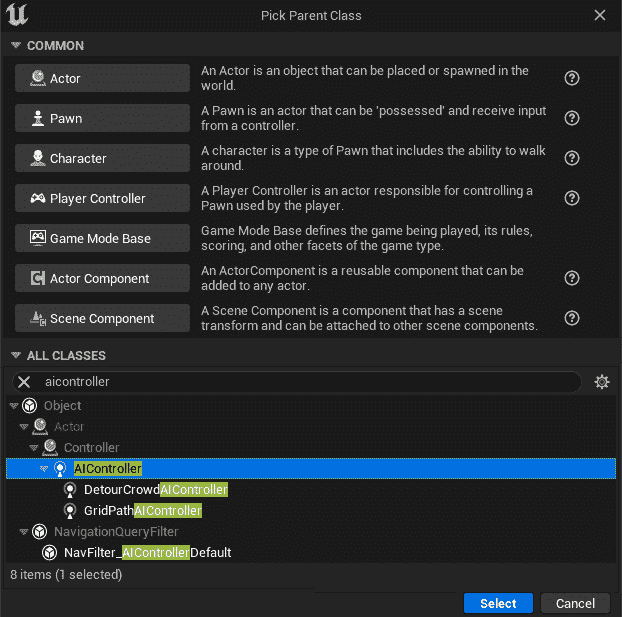

图 4.5 – 选择父类对话框，已选择 AIController 作为新蓝图的选择父类

1.  将新的蓝图命名为`AIC_EliteUnit`。

现在我们有了新的 AI 控制器，我们需要将其设置为*精英*单位的默认 AI 控制器。这将确保每当精英单位被生成或放置在游戏中时，它都将有一个控制器。要分配默认 AI 控制器，我们需要执行以下操作：

1.  从`Blueprints`文件夹中，打开**BP_EliteUnit**蓝图资产。

1.  在顶部菜单中点击**类默认值**按钮。

1.  在`AIC_EliteUnit`中。

现在我们有了 AI 控制器，我们可以开始构建我们的 AI 系统。在我们可以创建行为树之前，我们首先需要设置一个**黑板**资产。

## 创建黑板资产

黑板用于定义变量（称为键）并存储它们的值，这将允许我们的行为树做出决策。

要创建黑板资产，我们需要执行以下操作：

1.  在**内容浏览器**窗口中，右键单击并选择**人工智能** | **黑板**。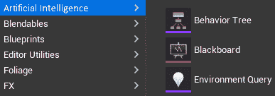

图 4.6 – 创建新资产时的人工智能选项

1.  将新的`BB_EliteUnit`命名。

1.  打开`BB_EliteUnit`黑板资产。

1.  添加两个新键并设置`MoveToLocation`: `Vector`

1.  `TargetEntity`: `Object`

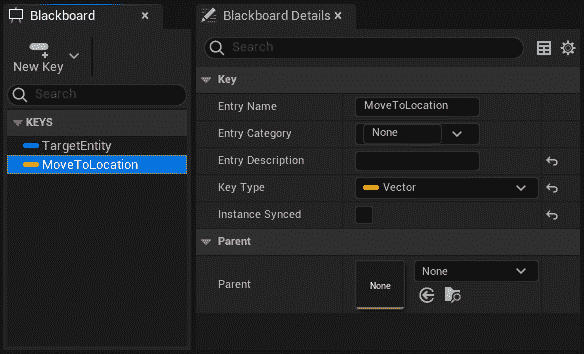

图 4.7 – 带有两个键的黑板资产

现在我们已经设置了我们的黑板，并添加了变量（键），我们可以继续创建行为树资产并开始构建我们的 AI 系统。

## 构建行为树

现在我们有了黑板，我们可以创建我们的行为树资产并将主要资产链接在一起：

1.  在**内容浏览器**窗口中，右键单击并选择**人工智能** | **行为树**。

1.  将新的`BT_EliteUnit`命名。

1.  打开`BT_EliteUnit`资产。

1.  在**详情**面板中将**黑板资产**设置设置为**BB_EliteUnit**。

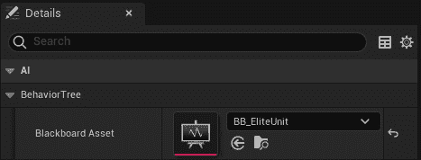

图 4.8 – 行为树详情面板中的黑板资产设置

1.  打开`AIC_EliteUnit`蓝图资产（AI 控制器），当单位被控制时激活行为树，使用**事件** **On Possess**：

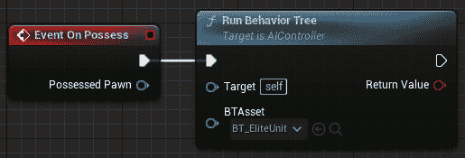

图 4.9 – 当单位被控制时运行行为树的蓝图节点

完成这些后，我们现在已经创建了行为树资产；我们可以开始构建 AI 系统。

### 基本移动分支

要开始构建我们系统的“大脑”，我们将设置以下内容：

+   一个选择节点，用于分支到树的其它部分

+   一个序列节点，它允许我们按顺序从左到右移动多个任务

+   我们的第一个任务，将使用现有的**移动到**任务

这将使我们的角色能够在世界中移动。这个系统部分不需要额外的逻辑，只需在行为树内部进行设置。

那么，让我们开始构建：

1.  打开`BT_EliteUnit`行为树。

1.  从根节点底部的深灰色部分拖动，创建一个`RootSelector`。

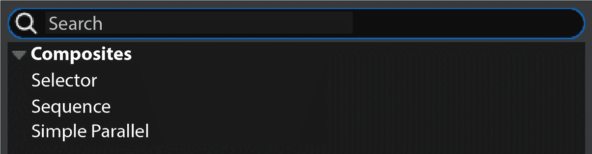

图 4.10 – 从行为树的根节点拖动时可选的选项

1.  从新的“移动到目标位置”底部。

1.  最后一次，从新的**序列**节点底部拖动，并从选择弹出窗口的**任务**部分添加**移动到**。

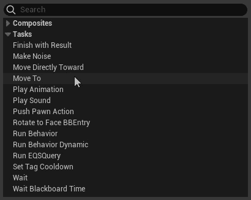

图 4.11 – 高亮显示“移动到”的行为树创建弹出窗口

1.  将黑板键设置为`MoveToLocation` – 这是黑板资产中的向量键。

目前，此行为树将运行；然而，任务（*移动到*）将尝试将角色移动到`0`,`0`,`0`，因为我们还没有在黑板上设置**移动到位置**键的值。

如果你能提供黑板的拥有者引用，黑板的键可以从多个地方设置。

我们已经提供了玩家控制器蓝图和`BP_EliteUnit`角色之间的连接。现在我们可以设置角色使用这些值来做一些事情：

1.  打开`BP_EliteUnit`角色蓝图。

1.  创建一个新的“事件拥有”逻辑链，将`AIC_EliteUnit`进行转换，并将引用存储为名为`AIController`的变量。通过创建蓝图节点来完成此操作（以创建`AIController`）：

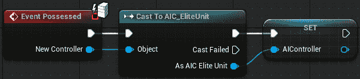

图 4.12 – BP_EliteUnit 角色蓝图上的事件拥有逻辑

1.  在“**接口**”部分的双击“**设置移动位置**”标签，位于“**我的蓝图**”选项卡中。这将创建一个**事件设置移动位置**节点。

1.  从“移动到位置”。

1.  拖动“获取黑板”节点，然后从该节点添加一个“设置值作为”**向量**节点。

1.  从“制作文字名称”节点。设置`MoveToLocation` – 这是黑板上的键名。

1.  使用**移动到位置**向量变量作为**向量值**输入。

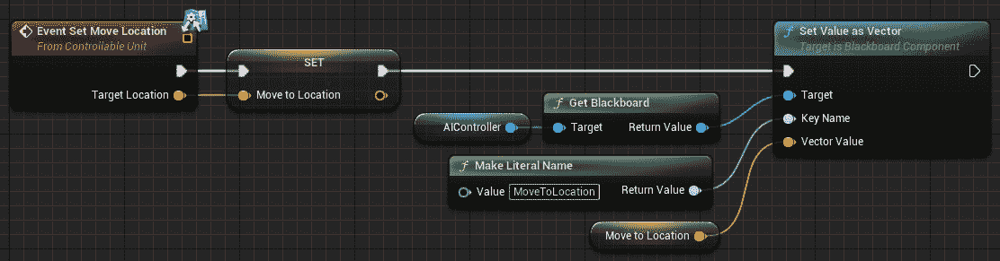

图 4.13 – BP_EliteUnit 角色蓝图上的事件设置移动位置逻辑

当事件被调用时，此逻辑将传递“移动到位置”键值。

1.  重复此过程，对于**停止**接口功能，从**我的蓝图**选项卡的**接口**部分，除了使用事件上的引脚设置**MoveToLocation**向量外，使用**获取演员****位置**节点。

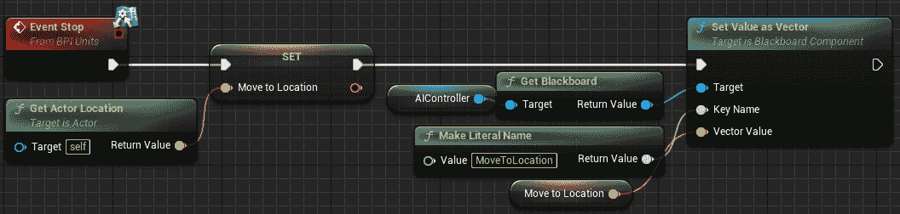

图 4.14 – BP_EliteUnit 角色蓝图上的事件停止逻辑

剩下的最后一件事是告诉黑板上的`MoveToLocation`键：

1.  在行为树上选择**移动到**节点。

1.  在**详细信息**面板中，勾选**观察黑板****值**框。

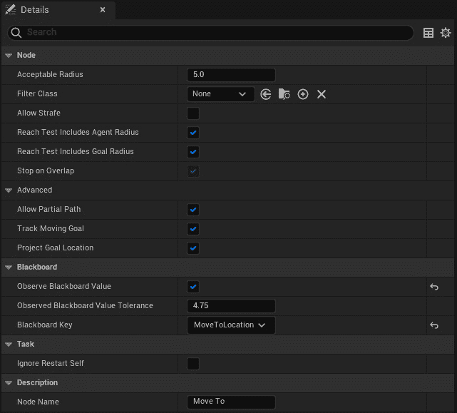

图 4.15 – 在移动到任务节点上勾选观察黑板值

现在基本移动已经设置好了，我们可以指示角色在世界中移动。接下来，我们将在我们的树中添加一个分支，专注于我们系统的射击部分。

### 射击分支和任务

我们将要构建的系统中的下一个元素是使角色能够射击敌人的方法。为此，我们需要创建一个新的任务并将其构建到树中：

1.  首先，点击**行为树**编辑器顶部的**新建任务**按钮，从列表中选择**BTTask_BlueprintBase**。

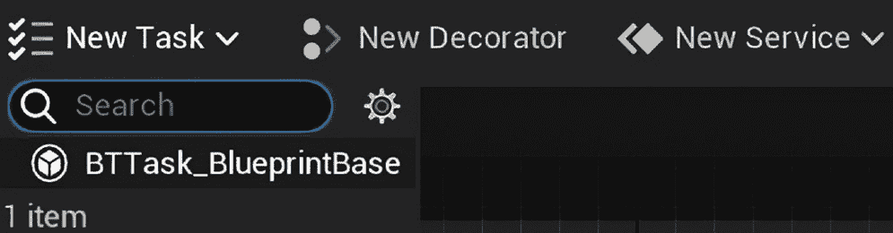

图 4.16 – 选择 BTTask_BlueprintBase 的新任务下拉菜单

1.  从`蓝图`文件夹中选择，并将名称设置为`BTT_ShootTarget`。

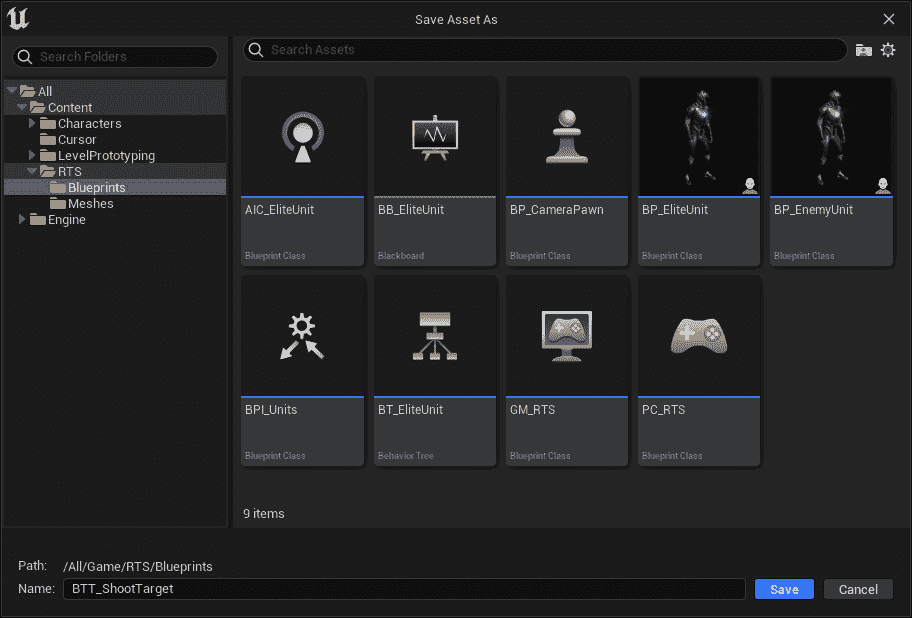

图 4.17 – 为行为树任务保存资产为窗口

这将创建一个行为树任务资产，它应该会自动打开。如果它没有打开，你可以在**内容浏览器**中找到它作为蓝图资产。

任务创建后，我们现在需要添加一些逻辑来定义任务将执行的操作。

一个任务通过利用`AttackTarget`来工作，我们将设置它现在只打印一个`Shoot`消息。

行为树任务需要任何逻辑链以`成功`结束。如果逻辑完成了任务，则应将其设置为**True**，如果没有，则应将其设置为**False**。对于这个例子，我们将只有一个**True**结果，因为我们只是在角色蓝图上调用一个事件。

1.  在`BTT_ShootTarget`蓝图中，通过在视图中右键单击并搜索它，或者通过在悬停时点击**函数**展开标题上出现的**覆盖**下拉菜单，添加一个**事件接收执行 AI**节点。

1.  从`AttackTarget`接口事件拖动。

1.  从`获取黑板值作为对象`节点。这将允许我们获取对象键的值。

1.  右键单击`TargetEntity` – 确保这个名字与黑板上的键名匹配至关重要。

1.  通过点击**变量**列表中变量类型右侧的眼睛将`TargetEntity`变量设置为**实例可编辑**。


图 4.18 – 将 TargetEntity 变量的 Instance Editable 设置为 True

1.  在**攻击目标**之后添加一个`Finish Execute`节点，并将**成功**设置为**True**。

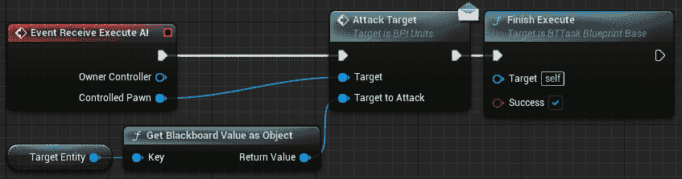

图 4.19 – 完整的 BTT_ShootTarget 蓝图逻辑

任务现在已经创建。在我们将其添加到树之前，我们需要在角色的界面调用上添加一个响应。目前，我们只是添加一个`Shoot`：

1.  打开`BP_EliteUnit`角色蓝图。

1.  在**我的蓝图**的**接口**展开中双击**AttackTarget**。

1.  在新的`Hello`中添加一个`Print String`节点，并带有`Shoot`。

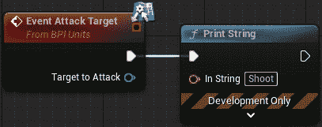

图 4.20 – 临时攻击目标逻辑

我们将在稍后用合适的解决方案替换它。目前，这将用于确认事件是否由行为树中的任务调用。

现在我们已经设置了任务和界面事件，我们可以将任务添加到行为树中：

1.  打开`BT_EliteUnit`行为树。

1.  从`ShootNearbyTargets`的底部拖动。

1.  将这个新节点放置在**MoveToTargetLocation**节点的左侧。这确保了这个节点首先被考虑（即，它有更高的优先级）。

1.  从`Rotate to face BB`任务条目的底部拖动，这将使角色面向其目标。

1.  设置`TargetEntity`。

1.  从`BTT_ShootTarget`任务的底部拖动。

1.  如果没有自动设置，则设置`TargetEntity`。

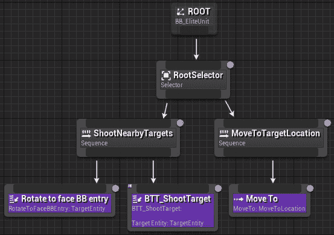

图 4.21 – 添加了新序列和任务后的行为树

分支的主要结构现在已经完成；然而，我们还没有任何方法来识别和设置目标身份。我们将使用一个服务来找到最近的目标，并使用一个装饰器来识别当`TargetEntity`键发生变化时，以便选择何时完成`ShootNearbyTargets`序列中的任务。

### 使用服务识别敌人目标

为了识别角色周围的敌人，我们将在**RootSelector**选择节点上的服务中放置一个球体追踪。这将向下面的决策过程提供所需的信息，以确定树的哪个部分将运行，减少执行不返回成功的任务的需求。

因此，让我们先创建一个服务：

1.  点击**行为树**编辑器顶部的**新服务**按钮。

1.  确保资产被保存在`Blueprint`文件夹中，并设置`BTS_FindNearestTarget`。

1.  打开新的资产（如果它没有自动打开）。

1.  创建一个新的浮点变量名为`SearchRadius`，将其默认值设置为`500`，并使其**Instance Editable**。

1.  创建一个新的黑板键选择器变量名为`TargetEntity`，并使其**Instance Editable**。就像创建*射击目标*任务时一样，确保拼写正确，与黑板键名称匹配。

1.  通过右键点击图表并搜索节点或使用覆盖下拉菜单来覆盖**Receive Tick AI**函数。

1.  添加一个`Sphere Trace For Objects`节点，并按照以下设置进行配置：

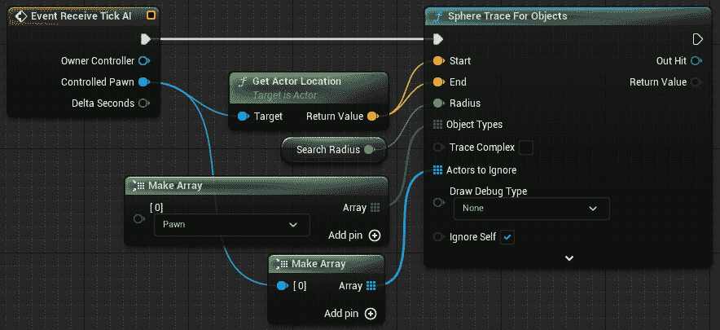

图 4.22 – 除了搜索单位以外的其他单位的球面追踪

1.  检查`Break Hit Result`节点，如图所示：

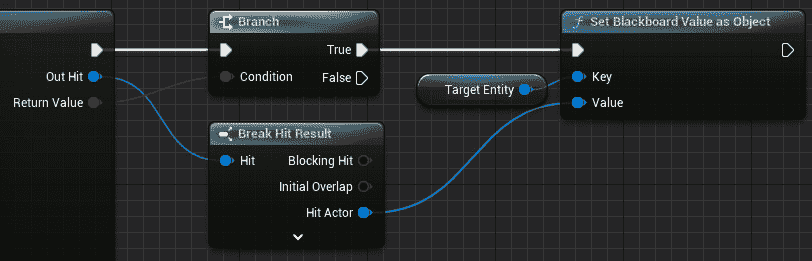

图 4.23 – 为要击中的目标实体设置黑板键

1.  如果使用**Clear Blackboard Value**节点来清除`TargetEntity`键。这可以通过从**TargetEntity**变量节点拖动来创建。

服务蓝图现在已完成，如下截图所示。如果您想可视化球面追踪以确定**搜索半径**变量是否合适，请将**Sphere Trace For Objects**节点中的**Draw Debug Type**下拉菜单设置为**For** **One Frame**。

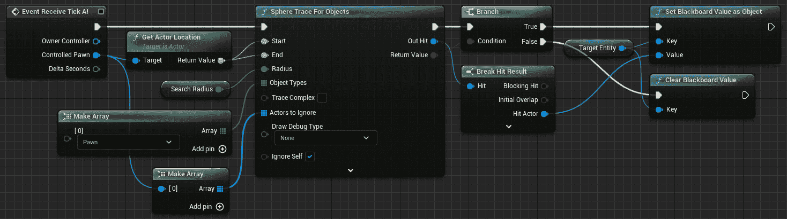

图 4.24 – 完成的服务逻辑

创建服务后，我们现在可以将其添加到`Root`选择器：

1.  在`BT_EliteUnit`行为树中，右键点击**RootSelector**节点，导航到**Add Service…**并选择**BTS Find** **Nearest Target**。

1.  确保显示`TargetEntity`和搜索半径为`500`。搜索变量可以根据添加到行为树的需求进行更改。

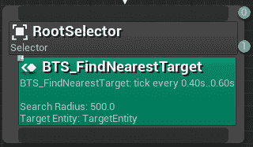

图 4.25 – 添加服务后的 RootSelector

添加服务后，**RootSelector**现在应该看起来与前面的截图所示相同。您可能需要重新排列您的节点以适应其增加的大小。

现在我们已经设置了选择器以查找最近的目标，我们可以使用该服务的输出结果来定义我们的行为树中的射击部分是否可以执行。

### 添加装饰器以激活射击序列

为了确保角色只尝试旋转并射击存在的目标，我们需要确保只有在`TargetEntity`具有有效值时才运行这些任务（这就是为什么当球体追踪没有命中结果时我们会清除值）。我们将向`ShootNearbyTargets`添加一个装饰器。装饰器（在其他行为树系统中称为条件）定义了分支或节点是否可以执行。我们将使用装饰器来监控`TargetEntity`黑板键值，看看我们是否有射击的对象；当我们有对象时，可以执行`ShootNearbyTargets`序列：

1.  右键单击“ShootNearbyTargets”序列节点，导航到**添加装饰器…**，并选择**黑板**。

1.  选择装饰器（现在出现的蓝色框）并重命名节点为`TargetFound`。

1.  确保黑板键**Blackboard Key**等于**TargetEntity**，并且**Key Query**等于**Is Set**。

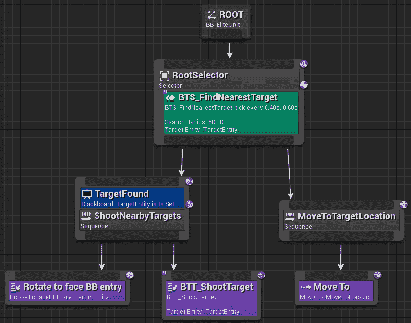

图 4.26 – 最终的行为树

如果你现在通过视口播放系统进行测试，你应该能够选择并移动绿色角色靠近红色角色中的任何一个。当绿色角色停止时，它会找到最近的目标，转向，并应该创建一个打印字符串“射击”。它将继续这样做，直到目标不再有效，此时，由于我们不对单位造成伤害，这将是永恒的。你也不会在找到目标后移动角色，因为目前没有方法让 AI 从`BTT_ShootTarget`任务中移动开。 

要伤害敌方单位，利用我们之前创建的“健康”组件，我们需要将`BP_EliteUnit`的**攻击目标**事件替换为一些逻辑来确认视线，然后应用伤害：

1.  打开`BP_EliteUnit`角色蓝图。

1.  从“事件攻击目标”逻辑链中删除**打印字符串**节点。

1.  将**TargetToAttack**对象投射到**Actor**上，以获取演员的位置，并将其作为**通道追踪**的一部分使用，如图下所示。通道追踪已被设置为在屏幕上绘制 5 秒钟，以便我们可以确认追踪是否正确发生。

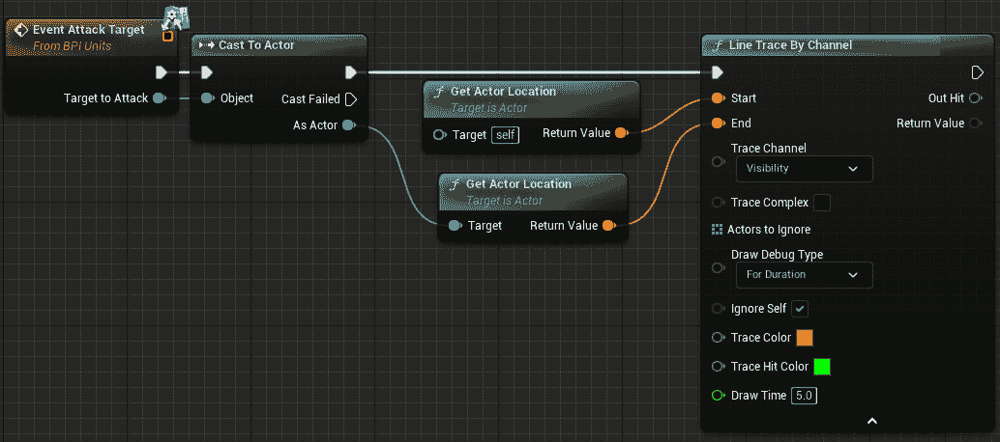

图 4.27 – 从射击演员到目标演员的通道追踪设置

1.  从“应用伤害”节点创建一个“断点命中结果”节点，并使用`100`个“打印字符串”节点来表示“无视线”。

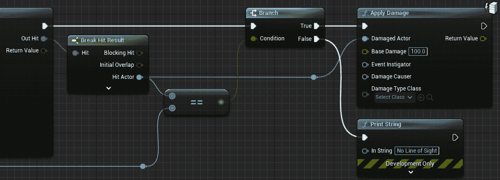

图 4.28 – 如果确认，则对目标演员应用伤害。底部左边的重定向节点来自“Cast to Actor”节点的“作为演员”引脚

1.  最后，为了使敌人单位可以被销毁，我们需要通过将其链接到 **销毁** **演员** 节点来利用 **Health** 组件的 **OnComponentDead** 事件：

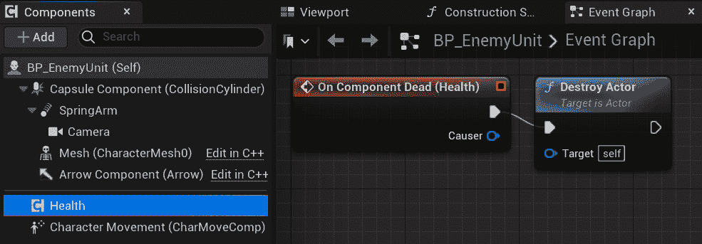

图 4.29 – 健康组件死亡事件链接到销毁演员节点

接下来，我们将探讨最后的想法。

### 测试和最后想法

现在测试游戏应该会移除敌人而不是持续打印 `Shoot`。这将导致目标实体被清除，从而允许你再次移动角色。

虽然我们现在有一个成功的 AI 控制单位可以移动和射击，但还有另一件事值得探索，那就是 `TargetFound` 装饰器。我们最初将其设置为 `None`，这意味着单位一旦检测到敌人，就会立即完成 `shoot`，只需简单改变这个值：

1.  选择 `TargetFound` 装饰器。

1.  在 **详细信息** 面板中，将 **通知观察者** 设置为 **结果更改**。

1.  将 **观察者中止** 更改为 **低优先级**。

再次测试游戏。你现在应该能看到，如果你告诉单位移动到敌人之后，它将在前往目标的途中停止，以与目标交战。这是因为装饰器已经识别出 `TargetEntity` 的值从 `BTS_FindNearestTarget` 服务中的变化，现在可以中断任何行为树中的低优先级分支，因此任何位于选择器右侧的节点，在这个例子中包括 `MoveToTargetLocation` 序列，它包含 **Move** **To** 任务。

# 摘要

在本章中，我们讨论了在虚幻引擎内部作为预制工具和系统存在的游戏开发模式。具体来说，是组件、更新和行为树模式。

我们创建了一个 `Health` 组件，希望它在你的未来项目中会很有用，以及一个简单的行为树，展示了系统的每个主要部分。有了这些知识，你应该能够为你的未来虚幻项目制作一个功能性的 AI 系统。

下一章将解释我们关于更新方法所学的内容，并说明我们如何做得更好。使用引擎中的 `Tick` 的影响是什么？你如何衡量这种影响？

# 第二部分：匿名模块化设计

在这部分，我们将开始创建更高效的代码来构建模块化解决方案，这些解决方案可以高效且干净地相互通信，而不使用直接引用和转换。

我们将首先通过用更干净的通信方法替换代码中的门控轮询来减少对门控轮询的需求，并探索接口和事件委托以允许我们的代码解耦。这将最终形成一个我们称之为匿名模块化设计的编码设计范式，这将使我们的面向对象代码尽可能易于维护和扩展。

这部分包含以下章节：

+   *第五章*，*遗忘 Tick*

+   *第六章*, *清洁沟通 – 接口和事件观察者模式*

+   *第七章*, *一个完美解耦的系统*
