# 第七章：完美解耦的系统

在上一章中，我们学习了接口和事件委托以及它们如何作为工具来消除程序结构中不必要的对象引用的需求。这就是解耦的概念。

在本章中，我们将探讨解耦的概念，并将其扩展到我们的系统设计中。我们将研究一种应该为任何系统提供强大框架的结构和规划它的标准方法。

在本章中，我们将涵盖以下主要内容：

+   使用 UML 规划示例层次结构

+   解耦参考列车

到本章结束时，你将能够以完全解耦和模块化的方式构建复杂的游戏通信层次结构。这将使你能够构建更易于维护和扩展的系统，从而促进开发团队的协作。

# 技术要求

本章将专注于在同一项目中实现 *第六章* 中的工具，该工具在 GitHub 上有链接。

如果你想直接进入这一部分，你可以从 GitHub 下载 *chapter7* 分支，网址为 [`github.com/PacktPublishing/Game-Development-Patterns-with-Unreal-Engine-5/tree/main/Chapter07`](https://github.com/PacktPublishing/Game-Development-Patterns-with-Unreal-Engine-5/tree/main/Chapter07)。

否则，规划部分只需一支笔和一张纸或一个免费的绘图工具。一旦掌握了 UML 图表的目的和词汇，就有助于加快生成图表的在线工具。最易使用的是 Mermaid ([`mermaid.live`](https://mermaid.live))，它提供了一个文本编辑界面用于图表编辑。如果你希望保存多个图表，它将作为一个付费服务提供。但鉴于你的图表或图表的每个元素都作为文本序列化在 URL 中，显示在浏览器的地址栏中，只需简单地将 URL 复制粘贴到笔记应用中即可保存图表。其他工具包括 Photoshop 和 Paint 或专门的绘图工具，如 drawio.com ([`www.drawio.com/`](https://www.drawio.com/)) 和 whimsical.com ([`whimsical.com/`](https://whimsical.com/))。

# 使用 UML 规划示例层次结构

**统一建模语言** (**UML**) 是程序员在设计阶段和创建技术文档时用于视觉传达大型系统结构的工具。类以框的形式表示，通过不同类型的箭头连接框来显示关系。

## 类关系有哪些类型？

让我们看看不同类型的类关系以及它们如何通过 UML 类图来表示。

### 继承

标准箭头，如图 7**.1** 所示，用箭头尾端表示父类，显示继承关系。

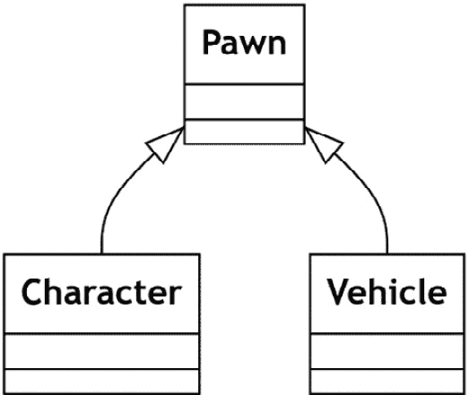

图 7.1 – 一个显示继承语法的 UML 类图示例

在图 7.1 中，**Character** 和 **Vehicle** 类从 **Pawn** 类继承。

### 组合

**组合** 是一种类关系类型，组合类给父类提供功能。这个工具在多功能类被分解成它们各自的功能然后组合成一个包装器时经常被看到。你可以通过在一条线的末端放置一个实心菱形来表示组合。

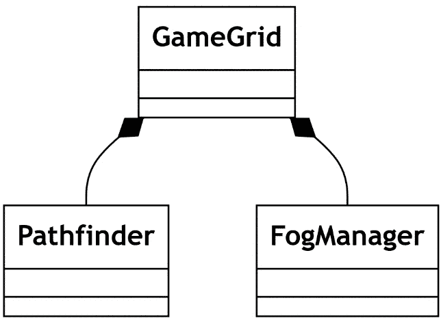

图 7.2 – 一个示例 UML 类图，展示组合语法

在图 7.2 中，**GameGrid** 组合了对 **Pathfinder** 和 **FogManager** 的引用。

### 聚合

**聚合** 是设计解耦系统的一个关键概念，因为它确实代表了存在的耦合。在通信链中的某个时刻，为了对象能够通信，至少需要建立一个单向连接。聚合就是这种连接在两个非依赖类之间时的情况。与组合类似，聚合也通过一个头部带有菱形的线来表示，但聚合的菱形只是一个轮廓。

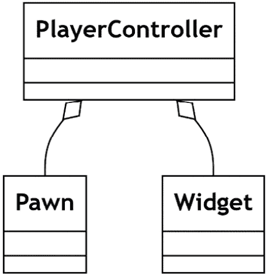

图 7.3 – 一个示例 UML 类图，展示聚合语法

图 7.3* 展示了 **Pawn** 和 **Widget** 聚合到 **PlayerController** 中。两者都可以在没有这种连接的情况下存在和运行，因此这是一个聚合。

## 什么是序列图？

除了我们之前探索的 UML 类图之外，UML 还有更多形式。图 7.4* 中所示的 **序列图** 显示了对象之间随时间执行函数。这是展示信号如何在类结构中传递的关键方式。在出现问题后使用序列图可以帮助确定在不同执行行上调用栈应该是什么样子，以定位错误。

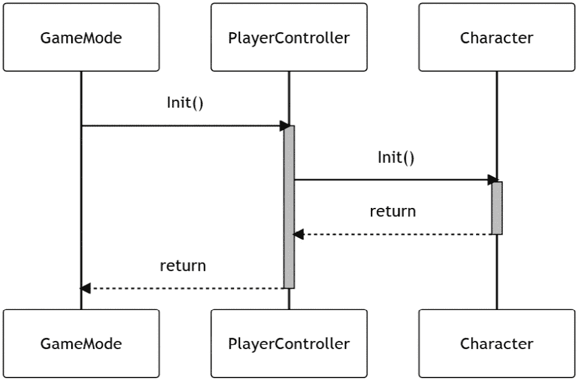

图 7.4 – 一个示例 UML 序列图

在图 7.4 中，我们正在传达从 **GameMode** 通过 **PlayerController** 到 **Character** 的初始化链。序列图帮助我们看到当 **Character Init** 函数正在执行时，我们的调用栈应该是三层的，以及每个类在链中的顺序。这些图对于阐明关键通信是必要的，但就像所有的 UML 一样，如果试图一次性包含太多内容，可能会产生相反的效果。

拥有这些工具，我们可以更好地向其他开发者描述本章中出现的结构。使用 UML 而不是代码段的好处在于其标准化和通用性，这意味着向我们展示这个的程序员不需要说同样的语言就能理解我们的意思。

解耦引用是所有面向对象语言开发人员都需要理解的关键技能。通过像 UML 这样的通用通信方法，我们可以建立先例并在所有开发级别强制执行。现在让我们使用大量的序列图和聚合来修复一些混乱、高度耦合的代码。

# 解耦参考列车

现在，让我们了解这三种连接类型，并看看我们如何可以使用一些规则将以下示例 UML 类图中的每个类关联起来。一旦一切都被关联起来，我们将在一个示例中实现解耦，并看看这带来的好处。

## 模块化和解耦

我们将从一些散乱的类开始，这些类以某种方式组织起来可以工作，但使用起来很混乱，如*图 7.5*所示。为了使这里的一切都能清楚地工作，开发者已经根据需要为任何类添加了引用。

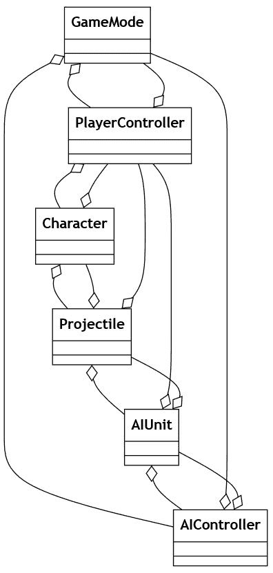

图 7.5 – 示例 UML 展示一个混乱的系统

让我们通过查看*图 7.6*中的序列图来分析**角色**到**投射物**的交互是如何发生的。当角色*发射*时，它会生成一个投射物，但随后并不保持对参考的持有。相反，投射物获取对角色的引用，当它击中一个 AI 单位时，这个引用被用来通过函数调用反馈是否击中了任何东西。这为什么是坏事？这并不一定会影响最终构建的游戏，但它确实使得涉及此交互的代码成为单次使用。如果一个敌方单位想要发射，由于它是一个不同的设置，我们只剩下两个糟糕的选择：

+   通过继承和函数重载来破坏我们的 SOLID 原则

+   在一个新的演员中重复自己，正如我们所知，这应该会响起警钟

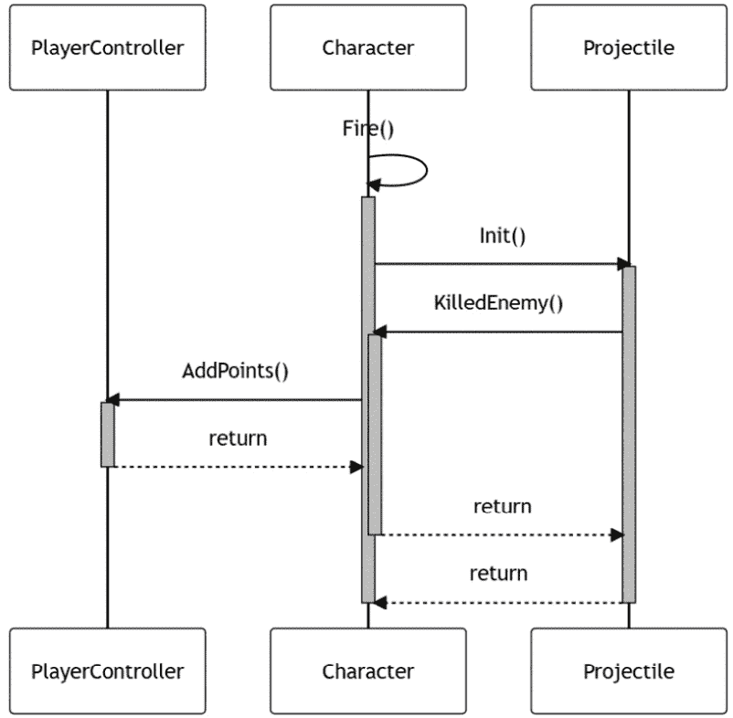

图 7.6 – 示例 UML 序列图展示混乱交互的复杂性

解决这个问题的方法是模块化和解耦。我们需要建立一个层次结构，其中每个类都连接到一个单一的树，其中连接表示所有权。第一步是分析类的职责。当前的**角色**类负责太多领域。它处理世界中的玩家表示，但也处理武器逻辑。由于这种逻辑可能在 AI 敌方类中重复，因此将其拆分出来成为一个可以共享的类是有意义的。将这个类链接到一个聚合链中，从顶部的**游戏模式**开始，通过**角色**和**武器**流向**投射物**，我们就得到了一开始就想要的树，如图*图 7.7*所示：

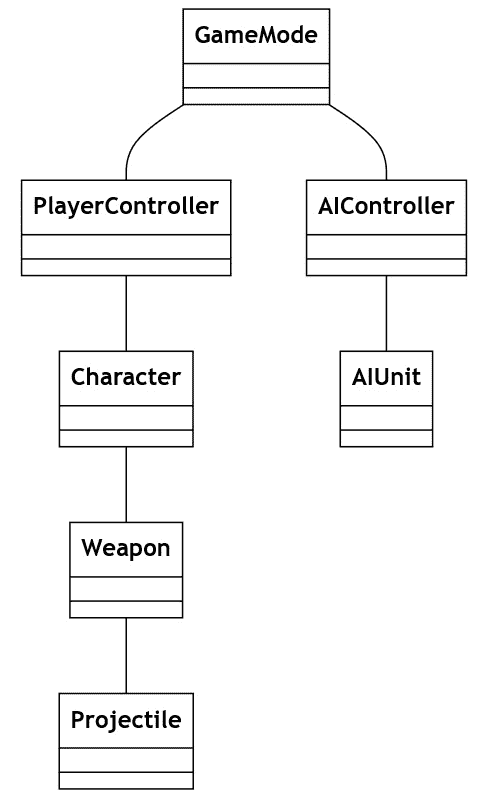

图 7.7 – 一个显示树结构的 UML 类图

从一般意义上讲，我们在*图 7.7*中建立的树是概念性的。为了实用性，父母类中可能会有指向所拥有类的指针，但它主要存在于设计文档中。在虚幻引擎中，PlayerController 之下的所有内容都可以在运行时生成，这有助于使结构更加具体。所有生成的对象都可以作为`TObjectPtr<T>`变量缓存，其中`T`是我们需要的确切类型。为了将树与`AGameModeBase`的`PostLogin`和`Logout`函数链接起来，可以将 PlayerControllers 缓存到`TArray<TObjectPtr<APlayerController>>`中以便后续使用。如果你想在结构中区分 AIController 和 PlayerController，那么你需要将它们分别存储。PlayerControllers 可以通过`PostLogin`函数进行缓存，并根据需要将其转换为相应的基类型，但 AIControllers 必须在 AI 控制的单位生成和通过施动者引用访问时进行缓存。

重要提示

请注意，`PostLogin`只为 PlayerControllers 触发，而`Logout`处理所有控制器类型，包括 AI。这使得在`Logout`中进行防御性编码变得重要。

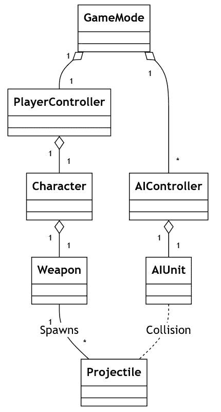

图 7.8 – 图 7.7 的重复，但提供了更多细节，展示了类之间的连接

*图 7.8*展示了本节中描述的不同方法如何用于在内存中连接类。

## 建立基础设施

下一步是开始建立基础设施，例如公共函数、事件委托和接口，为信号提供入口和出口点。每个都履行一个非常具体的目的：

+   **公共函数**用于在存在正确类型的缓存变量引用时进行通信。遵循表示此连接的聚合线，如图*图 7.8*所示，所有函数调用都将通过所有权链向下传递到树的顶端。

+   **事件委托**允许在监听者有事件类的缓存变量引用时进行匿名通信。这最终与公共函数调用相反，允许通信沿着参考链向上传递。

+   可以在运行时获得的`AActor*`引用，通常通过某种类型的碰撞事件，该接口可用于调用某种函数，而无需知道接收者的确切类型。

这归结为一个简单的通信规则：*函数向下，事件向上，接口横向*。结果是解耦系统，其中每个类只对其下一层有引用，但信号可以轻松地发送到各个地方。

## 在示例中实现解耦设计

将解耦设计嵌入到您的过程中的最佳方式是练习它。作为一个开始，我们将关注如何在我们的示例项目中使用玩家角色接收 UI 上显示的消除敌人单位所获得的分数。我们将从*图 7.9*中显示的 UML 类图开始：

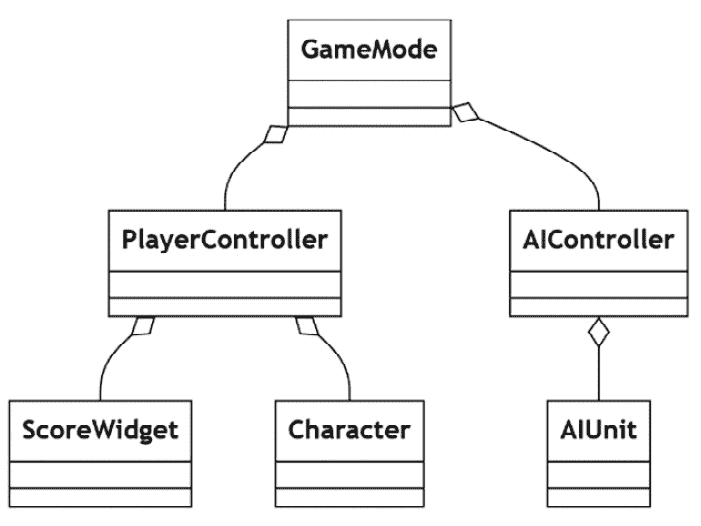

图 7.9 – 链接项目的计划 UML 类图

接下来，我们将像*图 7.10*中所示的那样，将信号路径叠加到 UML 上：

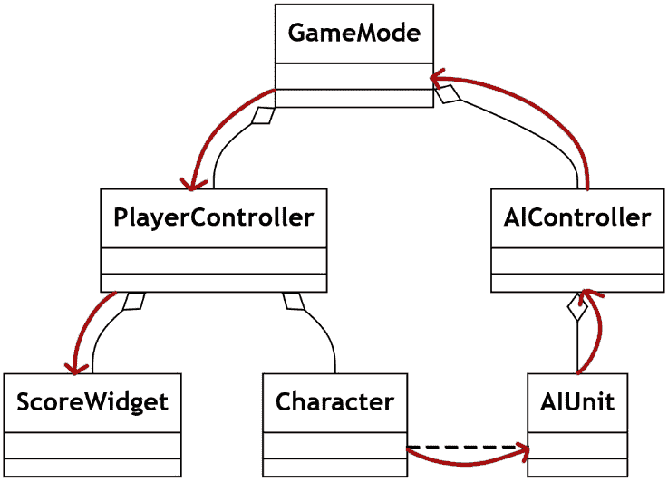

图 7.10 – UML 类图上叠加的信号路径

将信号路径叠加到 UML 上，将使我们能够有效地规划基础设施，生成如图*图 7.11*所示的 UML 序列图：

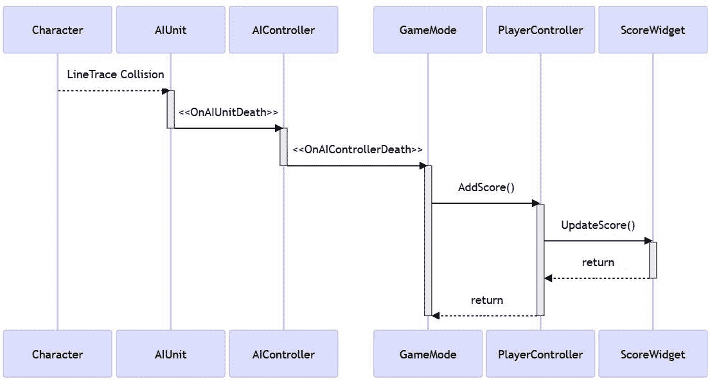

图 7.11 – 显示杀死敌人信号路径的 UML 序列图

要将这个解耦计划付诸实践，请前往示例项目中标记为*第七章*的文件夹。打开该文件夹中的层级，并按照以下步骤操作。每当提到一个类时，请使用类和文件名中标记为`_CH7`的*第七章*版本。所有以下代码都是供您根据需要添加和修饰的。所有需要的类都已经创建好了。这个练习仅要求您将新代码添加到由保护级标签指定的区域。任何新的变量都需要在编辑器中蓝图子项的检查器中链接起来，但这一点在本节末尾已经讲得很清楚。

在实现步骤中，让我们从游戏模式的最顶部开始。`GameMode_CH7`将链接到`PlayerController_CH7`以及在该层级中生成的任何 AI。对于大型游戏，这可能需要一个 AI 管理器来工作得更好，但我们没有使过程过于复杂的必要。这些引用被转换为正确的类型并缓存起来。转换后，可以将`listener`函数附加到控制器上的事件委托，从而建立第一个链接，但我们还没有创建任何控制器，所以一旦初始化链完成，我们就会返回这里。

`GameMode`头文件是一个简单的变量持有集和`BeginPlay`重写中的初始化链的开始。

让我们从头文件开始。

GameMode_CH7.h 摘录

```cpp
class AGameMode_CH7 : public AGameModeBase
{
public:
    virtual void PostLogin(APlayerController* NewPlayer) override;
    virtual void Logout(AController* Exiting) override;
protected:
    UPROPERTY(VisibleAnywhere, BlueprintReadOnly)
    TObjectPtr<APlayerController_CH7> _PlayerController;
    UPROPERTY(VisibleAnywhere, BlueprintReadOnly)
    TArray<TObjectPtr<AAIController_CH7>> _AIControllers;
    virtual void BeginPlay() override;
};
```

`GameMode`的主体处理`PlayerController`的初始化和引用注册，在`PostLogin`和`Logout`函数中，因为这是当`PlayerControllers`进入和退出游戏时 Unreal 会自动调用的。这可能有些令人困惑，因为这是网络术语，但 Unreal 仍然在单玩家游戏中使用它。另一方面，AIControllers 在`BeginPlay`中被收集和初始化，因为它们被认为已经在层级中了。

现在，我们可以在主体文件中设置这些。

GameMode_CH7.cpp 简节

```cpp
void AGameMode_CH7::PostLogin(APlayerController* NewPlayer)
{
    if (APlayerController_CH7* castedPC = Cast<APlayerController_CH7>        (NewPlayer))
    {
        _PlayerController = castedPC;
        _PlayerController->Init();
    }
    Super::PostLogin(NewPlayer);
}
void AGameMode_CH7::Logout(AController* Exiting)
{
    if (Exiting == _PlayerController)
    {
        _PlayerController = nullptr;
    }
    Super::Logout(Exiting);
}
void AGameMode_CH7::BeginPlay()
{
    Super::BeginPlay();
    TArray<AActor*> outActors;
    UGameplayStatics::GetAllActorsOfClass         (GetWorld(), AAIController::StaticClass(), outActors);

    for (AActor* actor : outActors)
    {
        _AIControllers.Add(Cast<AAIController_CH7>(actor));
    }

    for (AAIController_CH7* ai : _AIControllers)
    {
        ai->Init();
    }
}
```

接下来，控制器需要获取它们所控制的角色的引用并初始化它们。这个过程比之前简单，因为所有控制器都是通过初始化链创建它们的角色。这意味着不需要进行类型转换；角色已经是正确的类型。这也适用于我们将用于显示玩家得分的 `ScoreWidget` 类，它已经被作为 `Chapter` `Resources` 文件夹的一部分提供。

PlayerController 头文件包含一个用于初始化的自定义公共函数，一个指向它想要创建的 pawn 类型的类引用，以及一个指向它实际已创建的 pawn 的对象引用。

按照以下代码写出 PlayerController 头文件：

PlayerController_CH7.h 简节

```cpp
class APlayerController_CH7 : public APlayerController
{
public:
    void Init();
protected:
    UPROPERTY(EditAnywhere)
    TSubclassOf<APawn> _PlayerPawn;
    UPROPERTY(VisibleAnywhere, BlueprintReadOnly)
    TObjectPtr<ACharacter_CH7> _Character;
};
```

在 PlayerController 主体中，我们使用 Unreal 在 GameMode 类中提供的函数在玩家起始点之一创建一个指定类型的新的 pawn。然后 PlayerController 拥有它并调用该 pawn 的初始化函数。

让我们设置一下。

PlayerController_CH7.cpp 简节

```cpp
void APlayerController_CH7::Init()
{
    if (GetPawn() != nullptr)
    {
        GetPawn()->Destroy();
    }
    UWorld* const world = GetWorld();
    AActor* tempStart = UGameplayStatics::GetGameMode         (world)->FindPlayerStart(this);
    FVector spawnLoc = tempStart != nullptr ?         tempStart->GetActorLocation() : FVector::ZeroVector;
    FRotator spawnRot = tempStart != nullptr ?         tempStart->GetActorRotation() : FRotator::ZeroRotator;
    FActorSpawnParameters spawnParams;
    spawnParams.SpawnCollisionHandlingOverride =         ESpawnCollisionHandlingMethod::AdjustIfPossibleButAlwaysSpawn;
    APawn* tempPawn = world->SpawnActor<APawn>        (_PlayerPawn, spawnLoc, spawnRot, spawnParams);
    Possess(tempPawn);
    if (ACharacter_CH7* _Character = Cast<ACharacter_CH7>(tempPawn))
    {
        _Character->Init();
    }
}
```

从 GameMode 的另一分支下来，我们的 AIController 头文件与 PlayerController 类似，只是没有指向它想要创建的类的引用，因为在标准的 Unreal AI 设置中，pawn 已经在世界上。

因此，AIController 的头文件需要设置如下：

AIController_CH7.h 简节

```cpp
class AAIController_CH7 : public AController
{
public:
    void Init();
protected:
    UPROPERTY(VisibleAnywhere, BlueprintReadOnly)
    TObjectPtr<AAIUnit_CH7> _Unit;
};
```

AIController 作为一个通常更简单的实现，这一点也扩展到了初始化函数。因为没有必要创建任何新的 pawn，我们可以简单地获取当前拥有的 pawn 的引用，并调用它的初始化函数，传递通信。

按照以下代码写出初始化函数：

AIController_CH7.cpp 简节

```cpp
void AAIController_CH7::Init()
{
    if (APawn* pawn = GetPawn())
    {
        if (_Unit = Cast<AAIUnit_CH7>(pawn))
        {
            _Unit->Init();
        }
    }
}
```

最后的初始化是 `AIUnit` 类。在头文件中，我们有一个变量来保存一个 `HealthComponent`，就像我们在 *第六章* 结尾处创建的那样，还有一个 `listener` 函数来绑定到组件的死亡事件。

那么，让我们设置 AIUnit 的头文件。

AIUnit _CH7.h 简节

```cpp
class AAIUnit_CH7 : public APawn
{
public:
    AAIUnit_CH7();
    void Init();
protected:
    UPROPERTY(VisibleAnywhere, BlueprintReadOnly)
    TObjectPtr<UHealthComponent> _HealthComp;
    UFUNCTION()
    void Handle_HealthDeath(AController* causer);
};
```

主体在构造函数中创建一个新的 `HealthComponent` 实例，并在初始化中绑定 `listener` 函数。

我们现在应该将 `HealthComponent` 和初始化函数添加到 AIUnit 主体文件中。

AIUnit _CH7.cpp 简节

```cpp
AAIUnit_CH7::AAIUnit_CH7()
{
    _HealthComp = CreateDefaultSubobject<UHealthComponent>
    (TEXT("Health"));
}
void AAIUnit_CH7::Init()
{
    _HealthComp->OnDead.AddDynamic         (this, &AAIUnit_CH7::Handle_HealthDeath);
}
```

现在所有类都已初始化，我们可以沿着链条向上移动，添加事件代理及其 `listener` 函数，从 `AIUnit` 如何响应健康组件的死亡事件开始。这需要在玩家和 AI 侧的树形结构的两个分支上完成，但我们只展示 AI 侧，因为分数来自那里。目前，监听器应该广播 `AIUnit` 的死亡事件，包括这个 `AIUnit` 值得多少分数。这个链接是播放动画和音效以向玩家提供反馈的地方。

扩展任务

`HealthComponent` 中的另一个伤害事件在此处被忽略，以解释过程。作为本章完成后的扩展任务，尝试将其连接起来，以便当 AI 角色受到伤害时，它可以通过链条传递到控制器，并从那里更新生命条。

通过 `AIUnit` 头文件添加以下代码，我们声明了一个新的委托类型 `FAIUnitDeathSignature`，它有两个参数。然后，在类头文件中使用此类型来创建 `OnUnitDeath` 公共委托。我们还添加了一个整数，这样我们就可以平衡摧毁单位对玩家的价值。

因此，让我们将这些添加到头文件中。

AIUnit _CH7.h 摘录

```cpp
DECLARE_DYNAMIC_MULTICAST_DELEGATE_TwoParams     (FAIUnitDeathSignature, AController*, causer, int, points);
class AAIUnit_CH7 : public APawn
{
public:
    UPROPERTY(BlueprintAssignable)
    FAIUnitDeathSignature OnUnitDeath;
protected:
    UPROPERTY(EditAnywhere, BlueprintReadWrite)
    int _PointValue;
};
```

`AIUnit` 实体结构要简单得多，因为我们只是用它作为链条中的一个链接，所以一旦 `HealthComponent` 的死亡监听器函数被触发，它就可以广播新的 `OnUnitDeath` 代理并销毁 pawn。

将以下代码添加到主体文件中。

AIUnit _CH7.cpp 摘录

```cpp
void AAIUnit_CH7::Handle_HealthDeath(AController* causer)
{
    OnUnitDeath.Broadcast(causer, _PointValue);
    Destroy();
}
```

沿着链条继续，AIController 可以开始监听 AIUnit 的透传死亡事件。这个级别现在是一个透传，但可能是控制器自我回收并找到另一个 `AIUnit` 来生成的地方，这取决于游戏循环。

AIController 头文件得到了与 `AIUnit` 相似的一组项目，包括一个新的委托类型定义，它接受两个参数。我们不重用这个定义，以便在扩展游戏时，这两个类不会相互绑定，可以根据需要替换。还有一个与 `AIUnit` `OnUnitDeath` 代理签名匹配的 `private` 函数，以便它可以作为监听器添加。

请将以下代码添加到头文件中。

AIController_CH7.h 摘录

```cpp
DECLARE_DYNAMIC_MULTICAST_DELEGATE_TwoParams     (FControllerDeathSignature, AController*, causer, int, points);
class AAIController_CH7 : public AController
{
public:
    UPROPERTY(BlueprintAssignable)
    FControllerDeathSignature OnControllerDeath;
protected:
    UFUNCTION()
    void Handle_UnitDeath(AController* causer, int points);
};
```

AIController 主体在调用 `Init` 函数后立即将 `listener` 函数绑定到 `AIUnit OnUnitDeath` 代理。这样，我们知道在开始监听游戏信号之前，`AIUnit` 内部的所有变量都已正确设置。监听器函数本身只是一个透传，广播 `OnControllerDeath` 代理。

让我们将其添加到主体文件的代码中。

AIController_CH7.cpp 摘录

```cpp
void AAIController_CH7::Init()
{
    if(APawn* pawn = GetPawn())
{
if(_Unit = Cast<AAIUnit_CH7>(pawn))
        {
            _Unit->Init();
            _Unit->OnUnitDeath.AddDynamic(this,
                &AAIController::Handle_UnitDeath);
        }
    }
}
void AAIController_CH7::Handle_UnitDeath(
    AController* casuer, int points)
{
    OnControllerDeath.Broadcast(causer, points);
}
```

GameMode 现在可以将监听函数链接到所有 AIController。这个函数目前只是调用 PlayerController 的一个 `public` 函数来增加其分数，但它可以用作检查胜利条件的起点，在多人游戏中，通过 `GameState` 确保所有玩家都有一个更新的分数板。

下面的简节显示了在 GameMode 头文件中添加监听函数声明的地方。

GameMode_CH7.h 简节

```cpp
class AgameMode_CH7 : public AgameModeBase
{
protected:
    void Handle_ControllerDeath(AController* causer, int points);
}
```

在 GameMode 主体中，我们在对每个 AIController 调用 `Init` 函数之后立即将监听函数绑定到每个 AIController。这次，监听函数并不简单地广播另一个事件，因为这是通信反转并开始沿着我们在本章早期设计的通信层次结构中的另一个分支的地方。相反，我们调用 PlayerController 上的一个函数，告诉它增加分数。这并不是严格上最好的做法，但它确实清晰地展示了结构。理想情况下，你会根据通过委托链传递的 `causer` 参数检查哪个控制器需要分数。

因此，将以下代码添加到主体文件中：

GameMode_CH7.cpp 简节

```cpp
void AGameMode_CH7::BeginPlay()
{
    … other code from before …
for(AAIController_CH7* ai : _AIControllers)
{
    ai->Init();
    ai->OnControllerDeath.AddDynamic(this,
        &AgameMode_CH7::Handle_ControllerDeath);
}
}
void AGameMode_CH7::Handle_ControllerDeath(
    AController* causer, int points)
{
    _PlayerController->AddPoints(points);
}
```

Player 控制器需要实现这个 `public` 函数，以便当游戏模式告诉它增加分数时，它也会更新 UI。UI 引用已经包含在类中为你准备好了——这就是为什么在以下代码的头部中它们缺失的原因。

PlayerController 头文件只需要 `AddPoints` 公共访问器函数和一个存储当前分数的变量。这是任意的，但它们必须存储在某处，而且这似乎是存储它们的好地方。

因此，让我们添加以下内容：

PlayerController_CH7.h 简节

```cpp
class APlayerController_CH7 : public APlayerController
{
public:
    void AddPoints(int points);
protected:
    int _Points;
}
```

`AddPoints` 做如其名，但也作为 UI 的信号透传，我们告诉它用新的分数值更新屏幕上显示的值。

将以下简节添加到主体文件中：

PlayerController_CH7.cpp 简节

```cpp
void APlayerController_CH7::AddPoints(int points)
{
    _Points += points;
    _PointsWidget.UpdatePoints(_Points);
}
```

完成所有这些后，你应该能够从这个新关卡以之前的方式玩游戏，但是当你摧毁敌人 AI 单位时，视口左上角的数字会每次增加。这是以解耦方式构建的游戏循环的核心。当然，我们的 AI 需要反击，并且需要一些平衡来使这个游戏体验变得更好，但从功能上讲，一切都在那里。

## 解耦的好处

以解耦方式设置事物的优势现在应该很明显。如果我们需要为不同的基于目标的游戏模式进行交换，那么我们可以这样做，因为没有类需要直接引用游戏模式。只要调用所有相同的函数并监听事件，一切都会正常工作。你还可以使用*第一章*中所示的方法来检查每个类的依赖关系大小，以查看现在每个类在内存中有多小，因为它只引用了自己下面的一层，可能还有一两个接口。

# 摘要

完成本章后，你应该能够设计以匿名模块化设计为重点的游戏通信层次结构，并在虚幻引擎中实现。我们已经介绍了 UML 的基本知识以及为什么它作为规划和沟通工具是有用的。使用这个 UML，我们接下来着手将一个简单的通信匿名化，使用来自*第六章*的事件委托工具，尽可能解耦引用链。这个匿名模块化应该适用于你从现在开始设计的绝大多数通信，例外情况极为罕见。

在下一章中，我们将探讨你可以设置为库的模式，在项目之间移动。我们将探讨为什么你不应该过度使用单例模式，因为大多数人都是这样做的，以及为什么你应该几乎在每一个项目中都利用命令和状态模式。

# 第三部分：在虚幻引擎之上构建

在这部分，我们将从查看已经搭建好的模式跃迁到创建我们自己的模式。

每一章都处理不同类别的模式，从允许类以更干净的方式服务的**行为模式**开始，通过**结构模式**帮助你在为大型团队构建系统时，到旨在加快你代码的**优化模式**。到本节结束时，你应该有一系列以模块化方式构建的模式，可以方便地在项目之间转移。

本部分包含以下章节：

+   *第八章**，构建设计模式 – 单例、命令和状态*

+   *第九章**，使用行为模式结构化代码 – 模板、子类沙盒和类型对象*

+   *第十章**，通过模式进行优化*
