# 第八章：构建设计模式——单例、命令和状态

而上一章探讨了代码架构设计的方法，本章将探讨三种你可以自己构建的设计模式，这些模式在许多游戏类型中都有应用。

覆盖的图案如下：

+   单例模式——理解为什么它是一个经常被过度使用的潘多拉的盒子

+   命令模式——它如何有超出明显用途的许多用途

+   状态机的多层次探索，看看我们可以将其概念推进多远

本章节的目标是创建一些基础类，这些类可以被导入到任何未来的项目中以加速开发。到本章结束时，你应该理解为什么许多在线资源过度使用单例模式，命令模式是一个隐藏的宝藏，以及如何通过谦逊的状态机进行深度定制。

# 技术要求

本章将在 GitHub 的 `chapter8` 分支上构建，可以从 [`github.com/PacktPublishing/Game-Development-Patterns-with-Unreal-Engine-5/tree/main/Chapter08`](https://github.com/PacktPublishing/Game-Development-Patterns-with-Unreal-Engine-5/tree/main/Chapter08) 下载。

# 实现单例模式——理解为什么它是一个潘多拉的盒子

单例模式官方的目的是确保在任何时候只有一个类的实例存在，因此得名“单例”。不幸的是，这通常与指向这个唯一存在的对象的公共静态变量打包在一起，并造成混淆。只有一个对象实例的类的实际想法是有意义的。你可能有一个在每个级别都需要存在的管理者，但如果你不知道玩家到达这个级别的路径，那么你就不知道是否已经生成了一个实例。解决方案是将管理者做成单例类，并在每个级别都有一个副本。我们可以通过以下代码实现这一点，使用一个静态变量指向那个存在的实例：

示例 Singleton.h 摘录

```cpp
UCLASS()
public Singleton : public AActor
{
    static TObjectPtr<Singleton> _instance;
public:
    void Init();
}
```

然后，我们有一个选择，即是否删除新的一个，如果它是第二个，或者它应该假定实例的位置，删除之前存在的。因此，主体文件将是：

示例 Singleton.cpp 摘录

```cpp
void Singleton::Init()
{
    if (_instance == nullptr)
    {
        _instance = this;
    }
    else
    {
        this->Destroy();
    }
}
```

从这个角度来看，一个内在的问题随之而来。我们的独白可能听起来像：“如果这个类的唯一实例将永远存在，那么为什么还需要实例化它呢？显然，将整个类做成静态的会产生相同的效果，并且会占用更少的内存，因为函数和变量只存在于栈上，从而消除了对单例模式的需求。”你可以用一个情况来回答这个问题。也许需要用每个新级别替换实例槽中的对象。这是单例模式的一个论点，但使用是有限的，通常可以通过我们详细讨论的图案来设计，如*第七章*。

另一个问题是最多实现的单例模式使用公共静态变量来跟踪实例。这导致许多人认为这个模式的目的是为了在顶层系统和任何需要它的对象之间建立一个简单的通信链接。这样做可能会将每个类与单例模式耦合在一起，我们在前面的章节中已经确定这是要避免的事情。这种影响在*图 8*.1*中可以清楚地看到，其中每个类都将**单例**类聚合到其内存足迹中，因为它在其中有一个或多个引用：

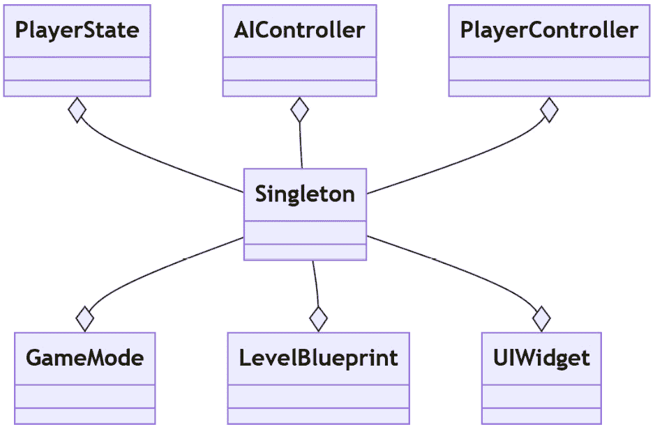

图 8.1 – 单例模式被聚合到许多类中的 UML 图

正确的使用方式是使用私有静态变量来跟踪实例，如本节开头所示。然后，通过由管理器创建的实例，它适合到*第七章*中显示的层次类树。然后，这个管理器可以通过初始化链将直接引用分配给其下的任何类。这就是我们所知道的**依赖注入**。这仍然会创建耦合，但分布要更加可控。一个基于网格的游戏中一个单位的自定义初始化函数的例子可以注入网格的依赖，而不是使网格成为任何人都可访问的单例模式。接下来，你可以看到如何构建这个例子以及这种方法对代码流程的影响有多小：

依赖注入示例

```cpp
void AUnit::Init(AGrid* grid)
{
    _GridRef = grid;
}
void AUnit::Move(FVector2 targetCoords)
{
    Path p = GridRef->GetPath(_CurrentCoords,
        targetCoords))
    if(p != nullptr)
{
        //Move the Unit
    }
}
```

总体来说，单例模式的实际概念和代码相对简单；问题在于它的使用方式。即使有更干净的实现，大多数——如果不是所有——使用单例模式的场景都可以用不同的模式来替换，从而使代码更容易扩展。聚合可能意味着这个功能可以成为一个组件，或者可能需要将结构转变为更类似于子类沙盒模式（将在后面的*第九章*中讨论），其中功能在父类中静态定义。依赖注入承担了大部分替换任务，因为单例模式最常见的用途将是全局实用工具类，例如在瓦片网格上的**战争迷雾**管理器。这最好通过初始化链作为依赖注入来发送，这样其他类就不会也有访问权限，从而允许其他开发者错误地使用该功能。

现在我们已经从脑海中清除了单例模式的诱惑，我们可以继续讨论在多种场景中都很有用的模式，例如命令模式。

# 实现命令模式以适应不同的用例

命令模式在请求动作和执行动作之间添加了一层分离。实现看起来如图 *图 8**.2* 所示，其中 `Command` 类的父类是抽象的，并且只包含一个构造函数、`execute()` 和 `undo()` 函数，这些函数都不接受任何参数。想法是子类更具体，并包含执行所需的所有对象引用：

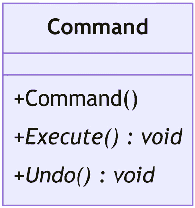

图 8.2 – 显示命令模式基类结构的 UML 图

命令的目的在于将动作的抽象概念具体化，以便我们可以将其存储在列表中。这个列表可以有多种用途，但最显著的是微软将其与键盘快捷键 *Ctrl* + *Z* 结合使用的撤销队列。当执行一个动作时，会创建一个相关类型的 Command 对象并将其添加到列表中。命令被执行并保留在这个列表中，直到它从末尾掉落；这保持了列表的时间顺序。如果用户按下撤销键，则列表中的最后一个命令会调用其撤销功能，并且最近命令的指针向后移动一位。这如图 *图 8**.3* 所示。3，其中可以看到在撤销一些命令之后创建新的命令会切断撤销的命令并将新命令插入列表的头部：

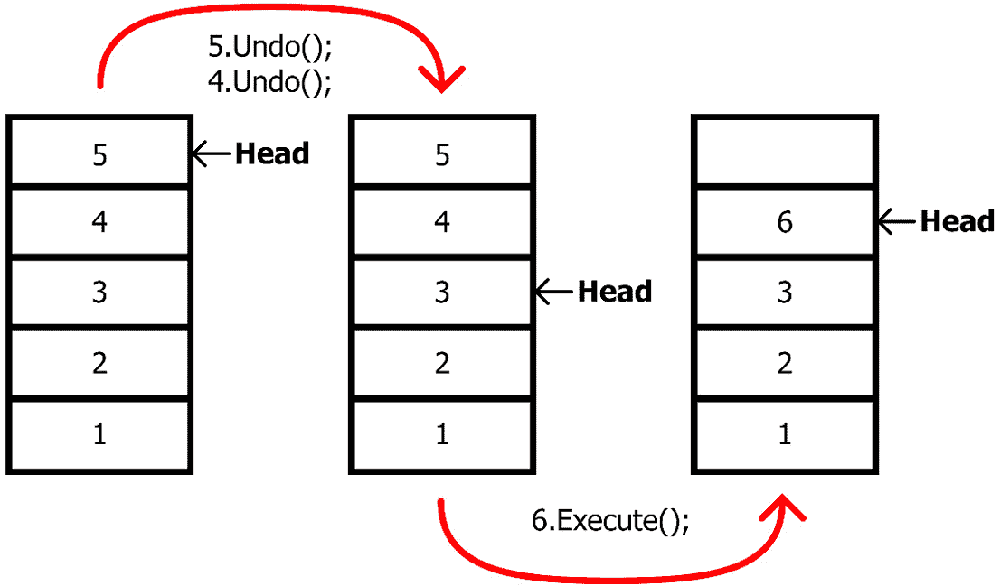

图 8.3 – 显示添加、撤销和分支命令的过程的图

在游戏中，我们可以使用这种功能来应对各种不同的场景。最常见的是策略游戏，玩家可以为他们的单位排队执行动作，以特定的顺序执行，每个动作只在最后一个完成后执行。令人惊讶的是，很少有策略游戏使用命令模式的撤销功能，但这可能是因为它可能会减少动作的成本。撤销功能在现代游戏中以回放机制的形式出现得越来越多；在经典游戏如 *Braid* 中被利用，并被整合到如 *Forza Horizon* 系列等 AAA 游戏中。这种实时应用有各种执行方法；很可能是 *Braid* 通过计时器记录所有移动对象的位姿，因为场景中发生的事情很少。显然，这种方法不适用于具有复杂物理的赛车游戏；相反，你可以记录玩家输入变化的时间作为不同的命令。然后撤销队列必须运行游戏反向并理解何时将命令添加到列表以保持势头。

将每个玩家的输入动作保存到列表中也可以作为一种类似回放保存的机制。这对于像*Trials*系列游戏和像*超级 Smash Bros.*这样的格斗游戏有效，因为这些游戏在机制中没有随机元素。如果你在同一时间输入相同的动作，每次都会有相同的结果。这可能导致大型回放文件，每个输入轴可能每帧保存一个值。有绕过这种方法的潜在方法，例如，仅在执行依赖于驱动元素状态的动作时保存这些输入的结果。这意味着，在*坦克世界*中，不是保存每次鼠标移动，而是每次发射炮弹并击中炮管时保存炮管的旋转和时间。这样，所有加起来为零的小动作都会被忽略在回放文件中。

## 蓝图工具中的撤销功能的命令模式

在虚幻引擎中，我们可以创建用于编辑器的工具，称为**蓝图工具**（在早期开发期间曾被称为 Blutilities）。蓝图工具可以创建为右键菜单操作，或者作为在浮动窗口中操作或可以停靠到 UI 中的实用工具小部件，可以操作资产（内容浏览器中的文件）或演员（世界中的元素）以完成重复操作，以减少工作流程步骤的影响，或者简单地减少用户输入以减少出错的机会。

编辑器工具可以包含任意数量的工具，每个工具作为一个单独的功能创建，拥有自己的图表或标准蓝图事件图中的自定义事件。演员和资产工具小部件要求我们定义工具将与之交互的演员或资产类别，称为**支持类**，这样它们就可以根据上下文添加到右键菜单中。

我们将探索在蓝图中使用事务节点实现命令模式，以添加撤销工具执行过程的能力。为此，我们将创建一个简单的工具，该工具将级别中选定的对象旋转 45 度。

首先，让我们创建一个实用工具蓝图，并定义其**支持类**为`Actor`（这样我们就可以在世界上使用这个工具）。为此，请按照以下步骤操作：

1.  在内容浏览器中右键点击并导航到**编辑器工具** | **编辑器实用工具蓝图**。

1.  从弹出菜单中，展开**所有类**展开项，选择**ActorActionUtility**，并在它可用时点击**选择**按钮。

1.  给新的蓝图起一个合适的名字，例如`EU_ActorTransformTools`。

1.  打开蓝图，然后在左侧，将鼠标悬停在**我的蓝图**选项卡的**函数**部分上。这应该会显示**覆盖**下拉菜单；从该菜单中，选择**获取** **支持类**。

1.  这应该会自动打开**Get Supported Class**函数图。从这里，删除**Parent: Get Supported Class**节点，并使用**Return Node**节点的下拉菜单，将**Actor**设置为在此蓝图构建的任何工具的支持类：

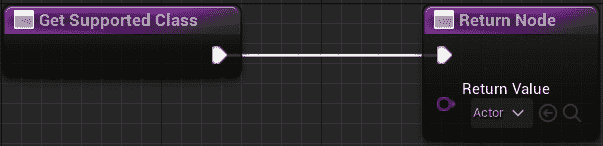

图 8.4 – 覆盖以设置 Actor 为支持类的“Get Supported Class”函数

蓝图设置完成后，我们现在可以将其添加到工具中。我们可以像之前本节中提到的那样，将工具添加为函数或自定义事件。对于这个例子，我们将创建一个新的函数来保持 Utility 蓝图内工具的结构整洁：

1.  在 Utility 蓝图打开的情况下，点击`RotateSelected45`。

1.  在**Details**面板中打开**RotateSelected45**图（这应该会自动发生），将**在编辑器中调用**复选框设置为**开启**。

函数设置完成后，让我们测试一下我们是否启用了正确的东西，并在我们在视口中右键单击某个东西时，函数出现在菜单中，如下所示：

1.  使用**快速添加到项目**按钮在级别中添加一些立方体，导航到**形状** | **立方体**，并将一个拖入视口。

1.  通过按住*Alt*并使用**移动**工具拖动立方体，重复几次复制立方体。

1.  选择所有立方体，并在其中一个上右键单击。现在你应该可以导航到**脚本角色动作** | **旋转** **选择 45**。

到目前为止，什么也不会发生，因为我们还没有在蓝图函数中创建任何逻辑。

接下来，我们将设置旋转角色的功能（目前还不必担心实现命令模式）。这里的步骤是首先识别用户选择了哪些角色，然后使用一个**For Each Loop**节点在世界中旋转角色。要在蓝图（Blueprint）中实现这一点，请按照以下步骤操作：

1.  从**Get Selected** **Actors**节点的引脚拖动。

1.  从**For Each** **Loop**节点拖动。

1.  将**Get Selected Actors**节点的输出引脚连接到**For Each** **Loop**节点的**Exec**引脚。

1.  从`Add Actor World` `Rotation`节点拖动。

1.  设置`0`，`0`，和`45`。

您的函数现在应该看起来像这样：

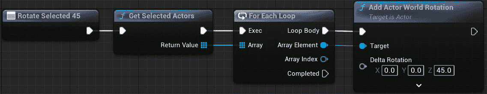

图 8.5 – 没有撤销功能的“旋转选择 45”函数

功能设置完成后，使用与之前测试函数是否出现在菜单中相同的过程再次测试该函数。现在你应该看到盒子旋转了。

注意

如果您在视图中关闭了**实时**，您将不会看到盒子旋转，直到您移动视口以更新它。

现在功能已经正常工作，我们想要通过使用 **Transaction** 系统实现命令模式来添加撤销动作的能力。为此，我们需要添加三个节点：一个 **Begin Transaction** 节点，用于开始记录动作的过程；一个 **Transact Object** 节点，用于标识即将更改属性的物体；以及一个 **End Transaction** 节点，用于停止记录动作的过程。按照以下步骤操作：

1.  在函数的开始处添加一个 `Begin Transaction` 节点，位于 **Rotate Selected 45** 节点和 **Get Selected Actors** 节点之间。

1.  在 **循环体** 链中的 **For Each Loop** 节点和 **Add Actor World Rotation** 节点之间，将一个 `Transact Object` 节点作为循环的起始部分添加。

1.  从 `End Transaction` 节点拖动出来，完成函数。

你的函数现在应该看起来像这样；我们在 **For Each Loop** 节点的 **Array Element** 插针和 **Add Actor World Rotation** 节点的 **Target** 插针之间的链接中添加了一些重定向节点：

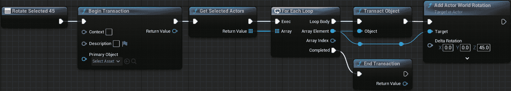

图 8.6 – 使用事务节点完成的 Rotate Selected 45 函数

函数现在已完成，是时候再次测试它了。重复之前的步骤，盒子应该仍然旋转。

现在的区别是，你应该能够点击顶部工具栏中的 **编辑**，并看到在 **历史** 部分出现了一个 **撤销 Blutility 动作** 的选项。如果你选择它，你应该能够看到任何被工具旋转的演员都回到了它们之前的状态：

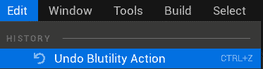

图 8.7 – 在编辑菜单的历史部分撤销 Blutility 动作

当你从 **编辑** 菜单中选择 **撤销历史** 时，你还可以在 **事务** 列表中看到 **Blutility 动作**：

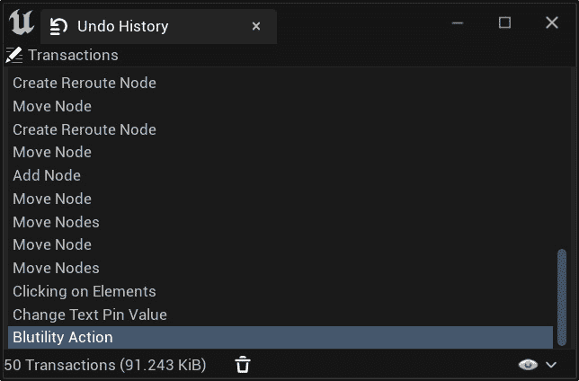

图 8.8 – 在撤销历史窗口中的事务列表

当 **Blutility 动作** 出现在撤销历史中并且工作正常时，工具现在就完成了。

当使用 Blueprint Utilities 创建工具时，被认为是一种最佳实践，始终包括用户能够撤销工具效果的能力，因此实现命令模式对于创建用户友好的解决方案至关重要。

## C++ 中游戏玩法的命令模式

为了通用目的，让我们创建自己的命令模式版本，并为我们的基础命令创建一个类。首先，在您的 IDE 中创建`UObject`的子类。我们使用`UObject`是为了让我们的类对引擎可见，但它不需要像`AActor`那样的额外装饰，例如变换。我们在`UCLASS()`宏中将它标记为`Abstract`，以确保永远不会创建此对象的实例。这个类只需要一个虚拟执行函数，因为我们不会支持撤销队列，并且由于 Unreal 处理对象创建的方式，初始化将与标准 C++实现不同，让我们设置一下。

Command.h

```cpp
#pragma once
#include "CoreMinimal.h"
#include "Command.generated.h"
UCLASS(Abstract)
class RTS_AI_API UCommand : public UObject
{
    GENERATED_BODY()
public:
    virtual void Execute();
};
```

在主体文件中，我们只需要生成空函数定义；不需要向函数中添加任何代码，因为无论写入什么内容都不会运行。在创建基础命令类后，将所有内容编译到编辑器层以确保没有错误。编译完成后，在项目抽屉中的`Command`对象上右键单击，创建一个名为`Command_UnitMove`之类的子 C++类。这将是我们框架的第一个命令。下面的定义和主体都很简单。`Init`函数被设计成可以设置命令执行所需的局部变量，而`Execute`函数被重写，通过调用引用对象的接口函数来实际使用这些值。按照以下方式设置头文件：

Command_UnitMove.h

```cpp
UCLASS()
class RTS_AI_API UCommand_UnitMove : public UCommand
{
    GENERATED_BODY()
public:
    void Init(AActor* unit, FVector moveLocation);
    virtual void Execute() override;
private:
    TObjectPtr<AActor> _unit;
    FVector _moveLocation;
};
```

如您接下来所见，`Init`函数实际上没有任何内容。相反，我们使用 C++标准构造函数重载语法将参数传递到内部对象的构造函数中。这并不是必需的，因为主体中的代码仍然可以工作，但这被认为是一种更好的实践，因为它使用略少的内存，但只是微不足道的。所以，让我们添加`Init`函数：

Command_UnitMove.cpp

```cpp
void UCommand_UnitMove::Init(AActor* unit,
    FVector moveLocation) : _unit(unit)_moveLocation
        (moveLocation) 
{}
void UCommand_UnitMove::Execute()
{
    Super::Execute();
    IControllableUnit::Execute_SetMoveLocation(_unit,_moveLocation);
}
```

下一步是对系统进行增强，以便在消费输入时区分我们是在队列中添加命令还是简单地覆盖现有内容。这将在许多不同的类中占用几行代码，但我们已经为你提供了基础。要检查已经创建的内容，你可以前往`PC_RTS`头文件和主体部分，查看输入是如何通过接口调用路由到实体的。我们接下来要处理的部分是受控的角色。在`AEliteUnit`类中有一个名为`QueueMoveLocation_Implementation`的函数，目前它是空的。目前来看，我们的玩家可以在按住左*shift*键的同时右击任何地方来触发这个函数。我们希望这个函数能够创建一个新的移动`Command`对象，初始化它，并将其存储在队列中。为此，我们需要一个队列，所以在头文件中添加一个受保护的或私有的`TQueue<TObjectPtr<UCommand>>`变量，并在必要时自动完成`#include`实例，并给它起一个有意义的名字；我们选择了`_commandQueue`。现在`QueueMoveLocation_Implementation`函数可以检查角色是否正在移动，如果是，就执行之前详细说明的操作。创建一个新的命令来具体化请求，用值初始化它，并将其添加到队列中：

`QueueMoveLocation_Implementation`函数

```cpp
void AEliteUnit::QueueMoveLocation_Implementation(FVector targetLocation)
{
    if(!_isMoving)
    {
        _AIController->GetBlackboardComponent()->
            SetValueAsVector("MoveToLocation", targetLocation);
        _isMoving = true;
        return;
    }
    TobjectPtr<Ucommand_UnitMove> moveCommand =
        NewObject<Ucommand_UnitMove>(this);
    moveCommand->Init(this, targetLocation);
    _CommandQueue.Enqueue(moveCommand);
}
```

存储移动请求固然很好，但需要在命令完成后有一个系统来清除队列，利用`Dequeue`函数。这就是`MoveLocationReached_Implementation`回调函数发挥作用的地方。它需要检查是否有任何命令，如果有，则从队列中移除它们并调用它们的`Execute`函数。这就是我们确保在创建命令时注入所有资源的原因：这样`Execute`函数就可以保持无参数，因此有用，如以下代码所示。

`MoveLocationReached_Implementation`函数

```cpp
void AEliteUnit::MoveLocationReached_Implementation()
{
    _isMoving = false;
    if(!_CommandQueue.IsEmpty())
    {
        TObjectPtr<UCommand> command;
        _CommandQueue.Dequeue(command);
        command->Execute();
    }
}
```

这样，系统在功能上就完成了。当然，用户当然无法获得队列中当前存在的内容的反馈；这需要更多的函数来查看命令的值，但如果你想要扩展这个系统以包括不同类型的移动命令或动作，那么你只需要从`UCommand`基类创建它们，在某个地方创建它们，并将它们添加到队列中。

我们的系统使用命令队列来堆叠玩家命令，但如果你想让 AI 控制，你可以预先加载一组它可以执行的操作，并让它通过某种形式的**目标导向动作规划**（**GOAP**）来释放。GOAP 是一种 AI 设计方法，它将世界中的个体交互从它们所实现的目的中抽象出来。将这些动作串联成链可以创建一个实现目标的策略。命令模式是实现这一点的绝佳方式，因为你可以预先生成一系列组成 AI 可以采取的所有动作的命令。然后，AI 将它们串联成一个队列，就像我们之前在可控制单元的动作队列中所做的那样，来规划其策略。逐个执行这些命令，然后希望 AI 能够实现其目标。

通过制作游戏的本性，命令模式总是有它的用途，这使得它成为一个很好的模式，可以作为一个模板插件来练习设置，就像我们的下一个模式——状态机一样，其中命令模式用于延迟和记录逻辑，而状态机则根据用途将其分离。

# 创建状态机的多个层级

状态机允许我们根据*状态*的概念来分离行为——这是一个简单的概念，但它有广泛的应用，从动画状态机到 AI 逻辑和上下文玩家动作。

最简单的状态机有两个元素：状态和转换。在任何时刻，状态机要么处于单个状态，要么在两个不同的状态之间转换，这就是为什么它们是动画系统的重要组成部分，在动画系统中，混合可以提高角色在接收到玩家输入时的视觉质量和感觉。让我们更详细地看看这一点：

+   状态定义了特定的输出和/或变量的值。在动画状态机中，状态定义了应该播放哪个动画资源。

+   一个转换包含定义状态机何时可以在两个状态之间转换的逻辑。转换可以调整以控制持续时间，以及利用曲线在整个转换过程中进一步细化两个状态之间的混合权重。

*图 8.9* 展示了一个具有三个状态和四个转换的简单状态机。每个转换都有一个起始状态和一个结束状态。转换可以双向存在，如示例所示，存在两个从**状态 1**到**状态 3**的转换，一个从**状态 3**到**状态 1**，另一个从**状态 1**到**状态 3**：

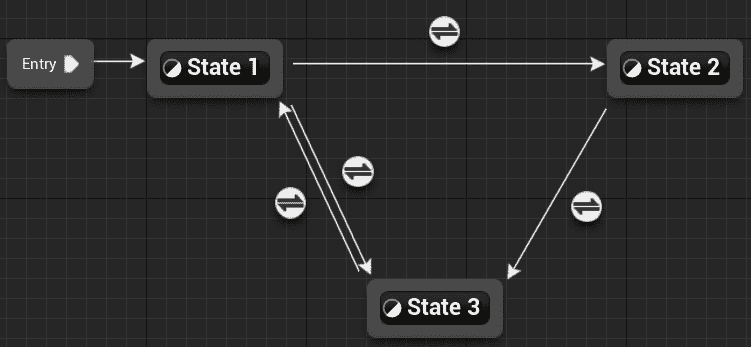

图 8.9 – 具有三个状态和四个转换的状态机

## 探索动画状态机

一个简单的角色动画状态机可能看起来像*图 8.10*中提供的示例。这显示了一个角色动画状态机，它可以静止（空闲），移动（用跑步状态表示），并且可以跳跃（使用三个状态）。

理解过渡使用的一个好例子是设置一个三部分跳跃动画系统：

+   从**空闲**或**跑步**状态进入**JumpStart**的过渡由玩家输入（当按下**跳跃**按钮）或更常见的物理方式（当角色在空中时）控制

+   当**JumpStart**动画接近完成时，第二次过渡到**JumpLoop**发生，这可以通过过渡中的逻辑控制或使用自动选项来实现，该选项纯粹基于过渡的持续时间来启动过渡

+   第三次过渡到**JumpEnd**（通常是一个着陆动画）发生在角色演员返回与地面接触时——也就是说，当角色**不在**空中时

+   最后的过渡，回到**空闲**或回到**跑步**，与第二次过渡相似，基于**JumpEnd**状态中着陆动画剩余的时间：

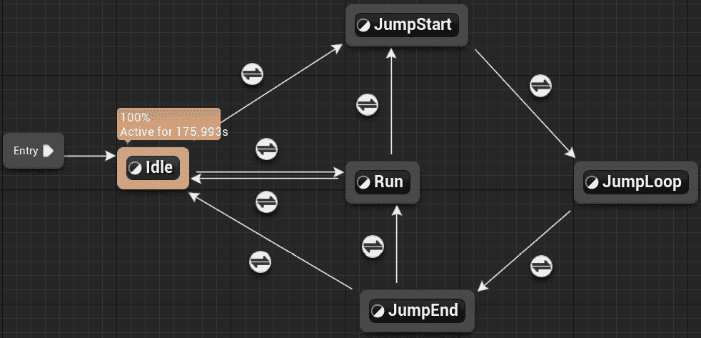

图 8.10 – 一个角色的动画状态机

一个状态可以通过使用大量的一对多关系中的过渡连接到任何数量的其他状态；然而，可以通过使用允许单个节点内一对一、一对多或多对多关系的管道节点来细化状态机。管道不包含状态信息（如动画）；它们简单地作为其名称所暗示的，在状态之间起一个管道的作用，简化了在状态之间需要大量过渡线以实现相同的多对多关系的需求，如图所示：

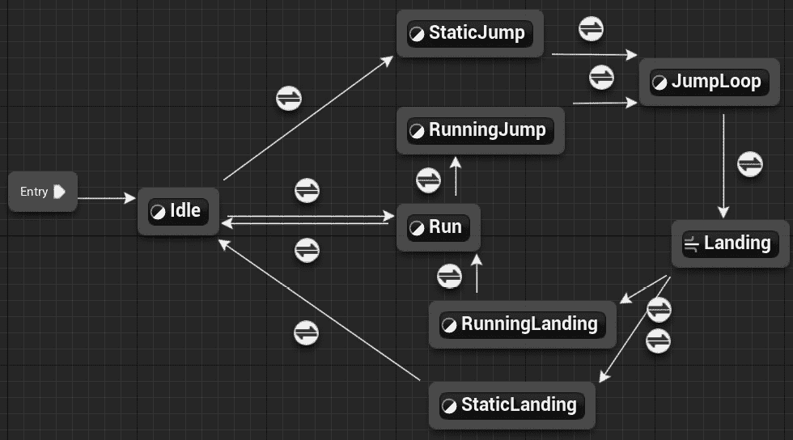

图 8.11 – 包含管道节点的更复杂的状态机

*图 8.11*中所示的系统包括一个系统，用于在角色站立（空闲）或移动时选择不同的跳跃和着陆动画。使用管道来决定应该选择两个着陆动画中的哪一个：

+   从**JumpLoop**到着陆管道的过渡与之前的系统相同，基于当角色不再在空中时

+   从管道到`0`，`0`，**RunningLanding**状态的过渡将被选择

虽然到目前为止，这并没有为过渡的数量提供更多的效率，但它确实允许分离检查并简化了用于识别使用哪个过渡的逻辑。这使得系统更容易扩展，例如，如果角色下落距离更大或角色正在向后移动，可以添加不同的着陆。

动画状态机可以变得非常复杂，甚至包括状态机中的状态机，其中某个状态利用其自己的状态机来确定其输出。系统的复杂性取决于所需的解决方案以及需要考虑多少不同的动画。

我们可以创建许多不同风格的有限状态机，使其适用于不同的目的。我们将从最简单的形式开始：一个枚举/开关实现，其中状态由一个简单的变量确定。

## 枚举/开关实现

如果你只需要分离互斥的逻辑，那么一个枚举风格的有限状态机就足够了。创建一个包含每个状态的值的枚举是起点。虚幻引擎要求枚举定义具有特定的标签才能在蓝图（Blueprint）中使用，你可能希望可视化这些内容以使调试更容易。重要的是`UENUM()`块。在下面的代码片段中，我们可以看到它包括`BlueprintableType`属性。这允许编辑器层将此类 C++变量序列化到详细面板中，并创建此类蓝图级别的变量。枚举也被定义为继承自无符号整数的类。这与标准 C++中的枚举是它自己的类型不同。虚幻引擎的命名约定要求你在枚举类型名称前加上`E`前缀，但这不是必须的。你必须决定从哪个无符号整数继承。在这里，我们展示了`uint8`类型，这将提供 8 位大小，这意味着你可以有 256 个标准值，或者如果使用枚举作为标志打包布尔值，则有 8 个值。在大多数情况下，`uint8`将提供所需的空间。每个值还有一个`UMETA()`块，它提供了在编辑器中显示不同名称的灵活性：

UENUM 示例定义

```cpp
UENUM(BlueprintType)
enum class EState : uint8
{
    State1    UMETA(DisplayName = "First State"),
    State2    UMETA(DisplayName = "Second State"),
    State3    UMETA(DisplayName = "Third State"),
};
```

创建一个枚举变量来跟踪我们的当前状态，使我们能够将逻辑分离到`switch`语句的不同案例块中。虽然整数变量也可以用于这项工作，但枚举只有微小的额外成本，并使我们的代码更易于阅读。在任何需要根据状态执行不同逻辑的地方，我们都可以使用`switch`案例，如下面的示例所示。这是替代许多布尔变量组合在复杂数量的`if`语句中的做法，而是这样设置：

示例状态机开关语句

```cpp
Estate _State;
void SomeFunction()
// some code…
switch(_State)
{
case Estate::State1:
    //State1 code
    break;
case Estate::State2:
    //State2 code
    break;
case Estate::State3:
    //State3 code
    break;
default:
    //unhandled state code
    break;
}
```

有用提示

通过利用你的 IDE 的代码自动完成功能，通过几次键盘操作创建模板`switch`语句，然后跟随所有`case`语句，可以节省你的时间。在 Visual Studio 中，这需要自动完成语句。在添加变量到表达式括号后，不点击离开，按两次*Enter*；这应该会激活自动完成并粘贴模板结构。Rider 使用*Alt* + *Enter*自动完成工具来完成此操作。

当你需要隔离逻辑时，`enum`/`switch`方法有效。一旦只有某些状态中使用的变量被涉及，我们就可以强制使用`enum/switch`方法，其中状态是纯逻辑且无状态的。

## 静态状态与实例化状态

当使用有状态的状态时，需要做出一个决定。我们可以将状态定义为静态或实例化。静态状态仅在栈内存中存在一次，有助于整体内存大小，如果多个机器引用逻辑，这特别有用。实例化状态必须创建，并且可能存在于堆内存中。当状态的状态——即它所持有的变量的当前值——对运行状态机的演员很重要时，实例化状态是必要的；例如，一个重攻击充能等级会关心它运行在哪个状态机上，因此必须处于实例化状态；否则，所有运行该状态的状态机将共享一个充能等级。

要将状态实现为单独的类，必须有一个具有状态基本功能的父状态类。以下代码显示了实例化状态，但静态状态将使用`static`关键字，大体上相同。在这个例子中，我们使用`Update()`函数来返回一个`EState`值，这将通知运行此状态的状态机何时以及切换到哪个状态。它还有使用单独类进行状态、进入和退出逻辑的其他好处。这种使用的范围可能非常广泛，但它为游戏程序员提供了一个钩子，在状态开始和结束时运行额外的逻辑。最后，将所有函数标记为纯虚函数将使类在本质上成为抽象的，并确保所有子状态以某种形式实现了这些函数：

示例状态基类头文件

```cpp
class State
{
public:
    virtual EState Update() = 0;
    virtual void Enter() = 0;
    virtual void Exit() = 0;
}
```

实际的机器非常简单；它由一个`State`变量来保存当前正在运行的状态，以及某种类型的集合来创建和保存其余的状态。这就是静态实现可能有所不同之处；状态仍然作为引用保存，但不需要实例化。以下是如何设置实例化状态机的头文件：

实例化状态机实现头文件

```cpp
class SomeClass
{
public:
    SomeClass();
    void Update();
private:
    State* _State;
    EState _CurrentState;
    Map<Estate, State*> _StateLibrary;
    void ChangeState(EState nextState);
};
```

此代码使用了`Map<>`集合。这严格来说在基 C++中并不存在，但它类似于 Unreal 的`TMap<>`集合，该集合存储键值对并通过键进行索引。因此，其主体可以设置如下：

实例化状态机实现主体

```cpp
SomeClass::SomeClass()
{
    State* tempState = new ExampleState();
    _StateLibrary.Add(EState::example, tempState);
    tempState = new OtherState();
    _StateLibrary.Add(EState::other, tempState);
    // Do this for each state the state machine requires
    _CurrentState = EState::example;
    _State = _StateLibrary[_CurrentState];
    _State->Enter();
}
void SomeClass::Update()
{
    EState next = _State.Update();
    if (next != _CurrentState)
    {
        ChangeState(next);
    }
}
void SomeClass::ChangeState(EState nextState)
{
    _State->Exit();
    _CurrentState = nextState;
    _State = _StateLibrary[_CurrentState];
    _State->Enter();
}
```

在 Unreal 中，创建基 C++类的对象可以使你的代码运行更快，因为你忽略了 Unreal 编辑层所有的开销，但如果你想创建一个可以被设计师平衡的实例化状态机，将你的状态作为 Actor 组件创建是一个好主意。这样，你可以通过自定义 slate 工具在编辑器中构建整个系统。

当多个未连接的因素影响行为的不同部分时，系统中的下一个瓶颈就会出现。这可能意味着状态机正在控制移动和世界交互。在当前系统中，需要为每种可能的组合创建一个新的状态，例如，跑步重攻击和蹲下重攻击。这些状态之间可能存在重复的重攻击逻辑，这应该会触发警报。在并发状态机中有一个解决方案。

## 并发状态机

“并发”这个术语简单地意味着与某物同时运行。在网络领域，这是一个经常被提及的术语，但在这里，它意味着更简单的东西。当有两个或更多控制区域永远不会交叉时，我们可以为每个区域创建一个状态机，并同时运行它们。扩展前一小节中的实现，以下代码显示每个状态机都是独立存在并更新的。其余的设置也需要加倍。只需对 `ChangeState()` 函数进行少量修改，以适应升级，使其成为机器无关的。这里的 `State*&` 参数用于通过引用传递指针，而不是传递指针指向的值，因为我们需要重新定位这个指针。这可以在下面看到。

并发状态机实现

```cpp
void SomeClass::Update()
{
    EMoveState nextMove = _StateMove.Update();
    EAttackState nextAttack = _StateAttack.Update();
    if (nextMove != _MoveStateTracker)
    {
        ChangeState(nextMove, _MoveStateTracker, _MoveState);
    }
    if (nextAttack != _AttackStateTracker)
    {
        ChangeState(nextAttack, _AttackStateTracker, _AttackState);
    }
}
void SomeClass::ChangeState(EState nextState,     EState& stateTracker, State*& stateMachine)
{
    stateMachine->Exit();
    stateTracker = nextState;
    stateMachine = _StateLibrary[stateTracker];
    stateMachine->Enter();
}
```

下一个改进领域将在控制多种行为的状态机中最为明显，其中多个状态可能共享一些基本功能，但略有不同。这种情况的一个例子可能是蹲下状态与跑步状态具有不同的状态转换，但执行移动的逻辑是相同的。在这种情况下，我们可以利用所有状态都从父状态继承的事实，并使用分层状态机添加更多层次。

## 分层状态机

如其名所示，将状态继承树拉入一个更大的继承层次结构，并为状态组提供基本行为，从而创建了一个分层状态机。实际上，这个结构中的所有内容都完全像基本状态机一样运行；你只需确保每个函数的实现都调用基本版本。这更多的是一种代码架构原则，旨在减少内存占用并加快开发速度。*图 8.12* 展示了一个示例状态继承树，用于角色移动，以及我们如何使用基于中级的地面状态来创建其他几个实现地面移动逻辑的状态，而无需多次编写。这也提高了可维护性，因为我们正在集中行为：

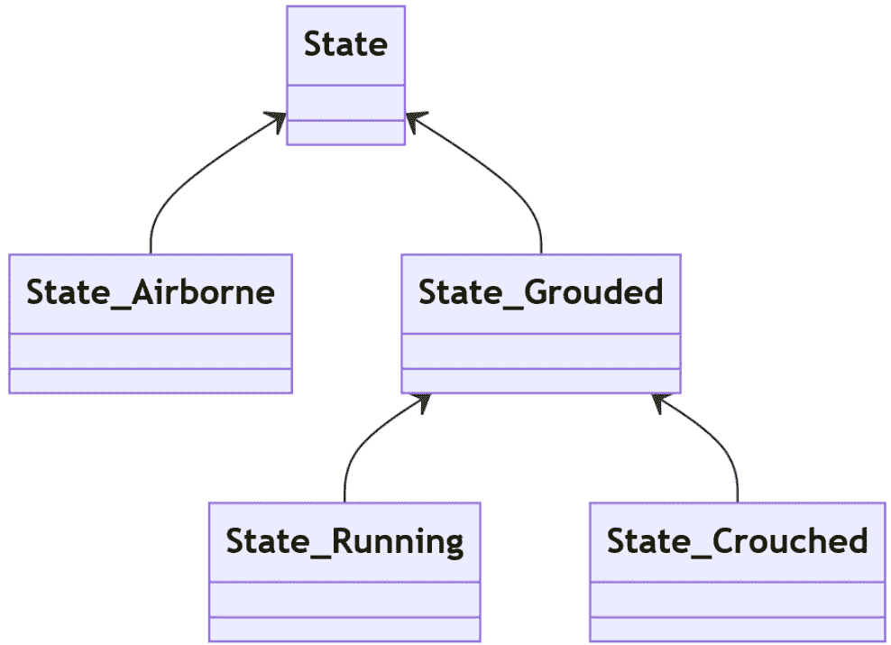

图 8.12 – 展示一组分层状态示例继承结构的 UML 图

最后一步与执行逻辑无关，而是关于转换。就目前情况来看，每个状态转换都必须知道它将前往哪个状态。这对于简单的状态机来说是可以工作的，但一旦你有一个可以从任何地方访问的中断动作，并且在完成时必须返回到它原来的位置，我们就遇到了问题。存储状态进入位置的信息并不能真正解决问题，因为如果我们所在的状态有一个必须保留的状态怎么办？答案是状态机的非常花哨的下压自动机级别。

## 下压自动机

正如刚才提到的，下压自动机的目的是提供一个方法，以便在需要时可以通过面包屑路径返回状态。我们通过在栈中存储当前状态路径来实现这一点。这里唯一的代码更改是将跟踪器和状态指针变量合并到一个结构体中，并存储在单个状态栈中。执行简单地以任何状态在栈顶的方式运行。

这允许我们从机器的任何地方推送中断状态，然后弹出该状态并从我们之前的位置继续 – 另一个简单但非常有用的想法。主要用例是一个控制可以移动和攻击的角色动画的状态机。攻击会接管动画求解器，直到完成。然后角色应该返回到它们之前的状态，无论是蹲下还是站立空闲。*图 8.13*显示了随着交互的进行栈如何变化：

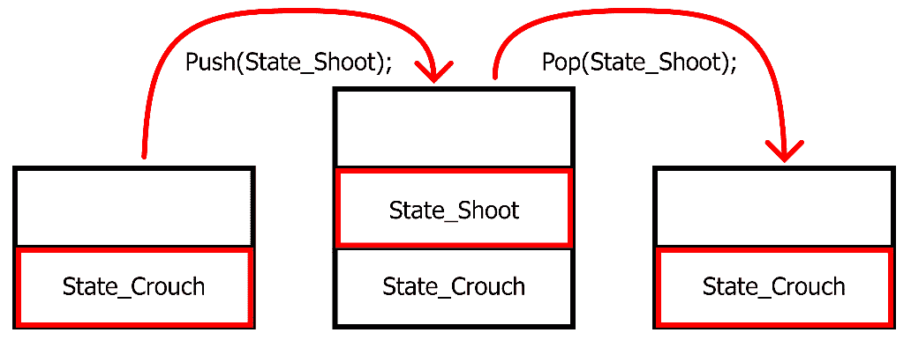

图 8.13 – 攻击输入过程中下压自动机状态栈的故事板

正如我们所讨论的，状态机有许多形式。这个模式的真正银弹在于意识到这些形式之间并不相互排斥。你可以创建一个可以与另一个并发运行的分层下压自动机状态机。另一方面，如果你认真使用一个功能齐全的分层下压自动机状态机，可能有一个更简单的模式可以以更优雅的方式解决相同的问题。

# 摘要

总的来说，我们已经介绍了三种你可以构建到任何未来项目中的模式：单例模式，确保只有一个对象实例存在，命令模式，它提供了请求动作与动作发生的分离的实用功能，最后是状态模式，它分离了我们的互斥逻辑。

到目前为止，你应该明白单例模式在某些情况下是有效的，但它也有其缺点。命令模式可以用于许多不同的事情，因此你可能需要将其版本作为一个模板库，用于所有未来的项目，而状态模式有如此多的层级，它可能会因为深度而损害其自身的实用性。

下一章将探讨一些行为模式，这些模式以不同的方式巩固了类的行为，从而提高我们系统的可扩展性——即类型对象模式，我们将其定位为游戏开发中对于内容创作最有用的模式。
