# 第九章：使用行为模式结构代码 – 模板、子类沙盒和类型对象

本章重点介绍三种最常见的结构模式。结构模式使我们能够考虑到最终用途来规划我们的代码。例如，如果我们知道我们系统的最终用户很可能是没有编程经验的设计师，我们就可以计划使用类型对象模式来提供一个易于动态扩展的系统。在我们讨论使用接口和事件来实现匿名模块化设计时，我们已经介绍了一些关于代码结构的概念，见*第七章*。本章中的三种模式（模板、子类沙盒和类型对象）在范围上比我们之前看到的要具体一些。前两种模式根据您的偏好可以互换，两者都作为 C++编程语言标准继承属性的扩展。最后一种是游戏设计中最有用的模式，它使设计师能够轻松定义类的变体，而不会妨碍程序员在添加新功能时的工作。

本章我们将讨论以下主题：

+   探索**模板**模式

+   理解**子类沙盒**

+   **类型对象**模式

# 技术要求

与之前的章节不同，我们将从 GitHub 上的`chapter9`分支的项目文件开始，该分支可以从[`github.com/PacktPublishing/Game-Development-Patterns-with-Unreal-Engine-5/tree/main/Chapter09`](https://github.com/PacktPublishing/Game-Development-Patterns-with-Unreal-Engine-5/tree/main/Chapter09)下载。

我们对项目做了一些小的改动，以方便以下模式示例。这些改动在本章中过于繁琐，无法一一介绍，但如果您想查看发生了什么变化，请下载这两个章节的分支，并通过 DiffMerge 之类的比较程序运行它们。

让我们开始吧。

# 探索模板模式

模板模式作为标准继承的扩展存在，我们在抽象父类中定义一个结构，子类有机会覆盖该结构的各个部分。它们可以改变各个部分的功能，但不能改变执行顺序。在虚幻引擎中最简单的例子是`AActor`基类。AActor 的任何子类都可以访问 Begin Play、Tick 和 End Play 事件，仅举几个例子。子类可以将功能钩子附加到这些事件上，并且它们将在预期时触发。我们将继承施加的约束使这成为模板模式是，子类没有改变这些事件顺序或时间的方式。没有方法使 End Play 在 Begin Play 之前触发，因为这个顺序已经在父类中定义了。

在以下代码中，我们可以看到一个实现模板模式的类的示例。`ProcessGame()` 函数是唯一一个有主体的函数，它定义了私有抽象函数的顺序：

模板模式父类伪代码

```cpp
public class AActor
{
public:
void ProcessGame() {
BeginPlay();
while(gameRunning)
    Tick();
    EndPlay();
    }
protected:
    abstract void BeginPlay();
    abstract void Tick();
    abstract void EndPlay();
}
```

我们可以看到 `AActor` 类有四个函数，其中只有一个没有被标记为抽象或虚拟。这个函数是我们的脊柱，定义了执行顺序。从那里，其他每个函数可能在基类中都有某种形式的实现，但它们被设计成最终被覆盖。最佳情况是每个额外的实用函数都是抽象的，基类中没有实现，以保持模式的轻量级特性，但如果这意味着很多实现将会重复，那么使用包含公共代码的虚拟基类会更好。目标是尽可能保持这个类轻量，同时减少尽可能多的重复。

重要注意事项

严格来说，`AActor` 的实际结构并没有实现模板模式，如伪代码所示；我们稍微折叠了树形结构以说明这一点。实际上，那个循环是由世界对象处理的，并过滤到其中的所有演员和子系统。

为了演示这一点，我们将给我们的精英部队一些武器。在 GitHub 分支的这部分内容中，`EliteUnit` C++ 类已经被增强，可以从类默认中定义的基类中生成武器。这个生成的武器是一个我们附加到 `SceneComponent` 上的演员，位于角色前方。代码也被修改为调用这个武器的射击函数，而不是在角色内部运行射线跟踪。按照目前的状态，这段代码将无法运行，因为没有标记为非抽象的类可供角色生成。我们的第一步是构建模板父类，作为这个通用武器在 C++中的子类。然后我们可以将功能性子武器的创建留给蓝图，这为我们提供了一个理解两个系统如何协同工作的绝佳方式，并允许程序员在技术设计师和设计师在蓝图中探索变化之前在 C++中完成基础工作。这允许快速原型设计和迭代武器设计，以实现预期的游戏感觉，同时不破坏任何底层系统。

## 构建模板（父类）

如前所述，我们的第一步是创建一个名为 `AWeapon_Base` 的新 C++ 子类。创建完成后，我们可以着手放置模板主函数，正如我们可以在下面的代码中看到的，它被调用为 `Fire()`。父类有很多数据和核心系统，用于处理射击之间的短暂冷却延迟。这些变量被添加到顶级，因为它们将适用于所有武器类型，所以将它们在通用父类中合并是有意义的。这也意味着这里的 `Fire()` 函数是一个重写，而在模板模式的直接实现中，这将在顶级。我们在这里做不同的事情是为了创建一个与下一节中将要看到的沙盒模式共享的层次结构，以突出差异。

模板武器基类中的其他函数包括一个用于重新装填的公共函数，尽管我们无论如何都会默认触发它，但你可能仍然希望主动调用该函数。随后是一系列标记为 `BlueprintNativeEvent` 的实用函数，如果它们在基类中有默认实现，或者标记为 `BlueprintImplementableEvent`，如果它们没有。每个这些受保护函数都存在，以便子类可以重写以改变武器的行为：

TemplateWeapon_Base.h 摘录

```cpp
UCLASS(Abstract)
class RTS_AI_API ATemplateWeapon_Base : public AWeapon_Base
{
    GENERATED_BODY()
public:
    virtual void Fire() override;
    UFUNCTION(BlueprintCallable, BlueprintNativeEvent)
    void Reload();
protected:
    UFUNCTION(BlueprintNativeEvent)
    bool CheckAmmo();
    UFUNCTION(BlueprintImplementableEvent)
    void ProcessFiring();
    UFUNCTION(BlueprintImplementableEvent)
    void PlayEffects();
    UFUNCTION(BlueprintNativeEvent)
    void UpdateAmmo();
};
```

这个类实现中只有一个函数，就是我们称之为 `Fire()` 的模板脊。在这个函数中，我们以具体的方式定义了所有其他函数的执行顺序。在下面的实现中，我们检查是否可以射击；如果不能，我们使用早期返回退出函数。然后我们检查是否有足够的弹药来射击；如果没有，那么我们将重新装填。如果武器能够射击，那么这个函数概述的过程从效果开始，然后运行实际射击的游戏逻辑，之后计算弹药减少。最后，它调用父类，在那里我们已经设置了处理射击延迟的代码（这用于防止通过自动点击器或宏滥用射击按钮）：

TemplateWeapon_Base.cpp 主模板函数

```cpp
void ATemplateWeapon_Base::Fire()
{
    if(!_CanFire) return;
    if(CheckAmmo())
    {
        PlayEffects();
        ProcessFiring();
        UpdateAmmo();
        Super::Fire();
        return;
    }
    Reload();
}
```

接下来的几个函数只是合理的默认实现，如果没有在这里定义，很可能会是重复的代码。重新装填函数重置弹药计数器并调用射击延迟重置函数。`CheckAmmo` 是一行布尔检查，可以作为此扩展的纯函数。最后，`UpdateAmmo` 只从我们的弹药计数器中获取预定义的 `_AmmoPerFire`：

TemplateWeapon_Base.cpp 工具函数

```cpp
void ATemplateWeapon_Base::Reload_Implementation()
{
    _CurrentAmmo = _MaxAmmo;
    Handle_FireDelay();
}
bool ATemplateWeapon_Base::CheckAmmo_Implementation()
{
    return _AmmoPerFire <= _CurrentAmmo;
}
void ATemplateWeapon_Base::UpdateAmmo_Implementation()
{
    _CurrentAmmo -= _AmmoPerFire;
}
```

这形成了我们的模板模式的 C++ 基础。剩下要做的就是通过编辑器中的蓝图子类实现一个或两个实现。

## 创建子类

我们现在将在蓝图内创建两个子类。这项任务为我们提供了一个很好的机会来探索 C++和蓝图如何协同工作以创建高效的解决方案。为此，我们需要创建新的子蓝图，一个用于手枪，另一个用于霰弹枪。这两种武器都使用线迹方法，并在扩散中具有多个弹丸的变化。这使我们能够专注于创建两个不同的解决方案，通过微小但重要的变化来构建一个坚实的模板模式的示例。为此，我们将使用之前的相同菜单，但我们需要在对话框中从**Actor**选择中深入挖掘以找到 C++父类：

1.  首先在内容浏览器中右键单击，然后单击**蓝图类**。

1.  如果它还没有显示，通过单击标题来展开**所有类**展开栏。

1.  在搜索框中输入`template`以减少结果框中显示的选项数量，如图*图 9.1*所示。

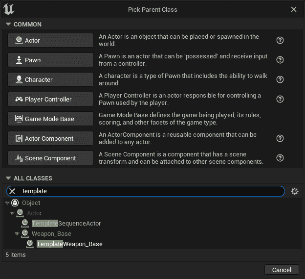

图 9.1：模板武器的蓝图创建窗口

1.  从列表中选择**TemplateWeapon_Base**，然后单击**选择**，这将只在你做出选择后出现。

1.  将这个新蓝图命名为`BP_TemplatePistol`。

在创建了手枪子蓝图之后，我们接下来需要为霰弹枪创建一个子蓝图。为此，重复前面的步骤，但将第二个蓝图命名为`BP_TemplateShotgun`。

现在我们已经创建了子类，我们可以继续在它们内部创建行为，利用模板模式仅修改类中必要的部分以实现每个子类的期望功能。

## 模板手枪

现在我们已经设置了手枪的蓝图，我们可以继续到覆盖模板中独特于这个类别的部分。`CheckAmmo`和`UpdateAmmo`函数对于我们手枪类来说将与父模板中的相同。我们将覆盖`PlayEffects`、`ProcessFiring`和`Reload`。

我们之前已经覆盖过函数，即在*第八章*中查看实用蓝图时。这里的流程完全相同。

关于覆盖 C++函数的说明

当我们在包含在 C++父类中的蓝图内覆盖函数时，我们不会在创建函数或事件之间做出选择。选择覆盖 C++函数的结果将取决于该函数是否有返回值。如果一个函数不包含返回值，蓝图中的覆盖将自动在主蓝图事件图中创建一个事件节点。如果一个函数确实有返回值（如`CheckAmmo`），覆盖将提供一个蓝图函数。

首先，我们将重写`PlayEffects`函数。通常，我们会在这里添加一个枪口闪光粒子效果，播放动画和声音。为了保持这个练习的存储库小，以及步骤数量短，以便我们能够专注于学习，我们只会添加一个声音效果。再次，为了保持所需的下载量小，我们将使用来自引擎内容的声音，而不是为枪找到专门选择的声音。让我们这样做：

1.  打开蓝图，在左侧，将鼠标悬停在**我的蓝图**选项卡中的**函数**部分。这应该会显示**重写**下拉菜单。从该菜单中选择**播放效果**。

1.  这应该在事件图中添加了一个**事件播放效果**节点。

1.  从`Play Sound at` `Location`节点上的销钉拖动。

1.  展开`VR_Teleport`。如果没有出现任何内容，您需要从**设置**下拉菜单中启用**显示引擎内容**，这可以通过单击下拉菜单右上角的齿轮图标访问。

1.  从`Get Actor` `Location`节点拖动。

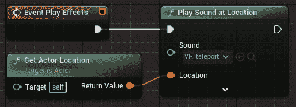

图 9.2：蓝图中的重写事件播放效果函数

接下来，我们将重写**ProcessFiring**。这是我们放置所有射击逻辑的地方。这个函数的确切内容将根据武器的类型而有所不同。对于手枪，我们可以使用一个简单的线迹，类似于我们在创建精英单位的**行为树**时为攻击敌人所采取的方法。首先，让我们设置追踪：

1.  从“按通道线迹”节点上的销钉拖动到图中。

1.  从`Get World Location`节点拖动，然后重复此操作以添加一个`Get Forward` `Vector`节点。

1.  将**Get World Location**节点的**返回值**销钉连接到**线迹通过** **通道**节点的**开始**销钉。

1.  在搜索框中键入`*`从`Multiply` (`x`)节点拖动。

1.  右键单击**乘**节点下方的销钉，并选择**转换销钉 | 浮点（单精度）**。这将使黄色销钉变为绿色，表示预期的变量不再是向量，而现在是浮点数。

1.  从绿色销钉拖动并添加一个`Get Range`节点。这将添加在父类中定义的`Range`变量。

1.  再次从**Get World Location**节点拖动并创建一个**加**节点（通过键入**+**访问）。

1.  将**加**节点的下输入向量销钉连接到**乘**节点的输出向量销钉。

1.  将**加**节点的输出连接到**线迹通过** **通道**节点的**结束**销钉。

接下来，我们需要告诉线迹在射击时忽略角色，否则枪唯一能伤害的角色将是开枪的人：

1.  在事件图中右键单击并创建一个`Get` `Owner`节点。

1.  从**Get Owner**节点的**Return Value**输出拖动，并添加一个**Make Array**节点。

1.  将**Make Array**节点的**Array**输出引脚连接到**Line Trace By Channel**节点的**Actors to Ignore**引脚。

线迹现在已设置好，应该看起来像*图 9.3*中所示的图表。

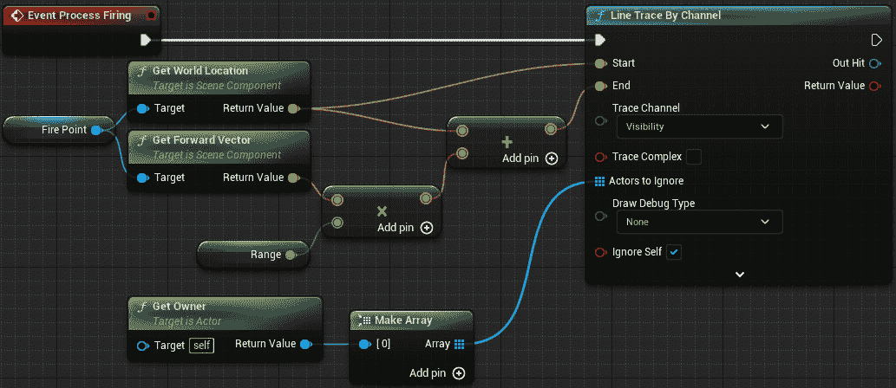

图 9.3：设置输入的 Line Trace 节点

将在父类中定义的变量拖放到图中

如果你希望能够将我们在父类中定义的变量以与在蓝图创建的变量相同的方式拖放到图中，请点击**My Blueprint**标签右上角的齿轮并启用**Show Inherited Variables**。

接下来，我们需要对追踪结果进行处理。在这种情况下，我们将使用应用伤害的方法，就像我们在*第四章*中所做的那样：

1.  从`Break Hit Result`节点拖动。

1.  从`Apply Damage`节点拖动。

1.  为了使图表更容易阅读，点击**Break Hit Result**节点底部的折叠箭头（**^**）。这将折叠节点，只显示顶部两个 bool 引脚和任何已使用的引脚，隐藏任何未使用的引脚。在这种情况下，仅**Hit Actor**引脚和顶部两个 bool 引脚（**Blocking Hit**和**Initial Overlap**）将保持可见。

1.  再次从`Get Damage Per Hit`节点拖动，这次再次获取父类中定义的变量。

1.  最后，从`Branch`节点（`If`）拖动，并将三个节点连接起来，如图*图 9.4*所示。

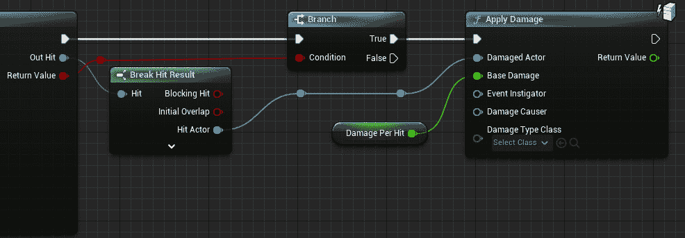

图 9.4：用于对敌方单位造成伤害的追踪结果

最后一件要做的事情是检查每个继承变量的值。你可以通过点击变量节点来完成，或者如果你选择显示继承变量，你可以从**My Blueprint**标签中的变量列表中选择它们。

确保使用`1000.0`和`20.0`。

在解决武器发射问题后，我们可以将注意力转向重新装填功能。与前面的两个覆盖不同，重新装填函数不是一个抽象函数。父模板类已经处理了重新装填的功能方面，将弹药重新添加到武器中，因此我们需要确保在子类中保留这一点。然后我们可以添加所有额外的元素，如声音、动画、粒子效果等。再次，让我们保持简单，只添加一个声音。首先，让我们覆盖重新装填函数并确保我们正在维护父类中的功能：

1.  以与前面两个函数相同的方式覆盖**Reload**函数。这将向**Event Graph**添加**Event Reload**节点。

1.  右键单击**Event Reload**节点并选择**添加对父函数的调用**。这将为您添加一个**Parent: Reload**节点。

1.  将**Parent: Reload**节点移到**Event Reload**节点旁边并将它们连接起来。

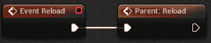

图 9.5：Event Reload 和 Parent: Reload 节点

**Parent: Reload**节点告诉虚幻引擎在逻辑链中的这个点上执行该函数的父版本的所有步骤。

现在我们已经将父类的行为包含到子类中，我们可以添加声音。我们就像为**PlayEffects**事件所做的那样来做这件事，然而这次，我们将选择**Gizmo_Handle_Clicked**声音。

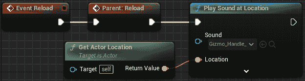

图 9.6：我们蓝图中的完成后的 Event Reload 函数

在整理好重新加载函数后，我们的手枪就完成了。让我们在角色上测试它以确保它工作。**EliteUnit**修改包括了一个基于下拉框自动生成和附加武器到角色的系统。按照以下设置武器：

1.  选择级别中的**BP_EliteUnit**。

1.  在详细信息面板中搜索`Weapon` `to Spawn`。

1.  将下拉框中的值更改为**BP_TemplatePistol**。

如果您看到`UCLASS`块包含`Abstract`属性，这样就没有人可以实例化基类。

现在手枪已经设置好、测试并通过，让我们看看霰弹枪。

## 模板霰弹枪

为了简化并避免使这一章变得非常长，对于霰弹枪，我们将唯一应用的独特方法是**Process Firing**函数。因为父类中的 Play Effects 和 Reload 函数是抽象的，我们必须覆盖它们，所以在我们开始为霰弹枪编写 Process Firing 之前，需要在**BP_TemplateShotgun**事件图中复制手枪中的其他两个函数。您可以通过手动再次创建它们或通过在图表之间复制粘贴它们来完成此操作。

完成这些后，让我们继续对射击进行排序。与其一步一步地通过这个版本，不如看看差异，这样您就可以做出必要的更改来创建霰弹枪而不是手枪。首先，复制手枪的射击逻辑，然后再修改它以复制以下每个更改。

与手枪不同，我们需要考虑当霰弹枪发射时，它不会发射单个弹丸。相反，霰弹枪弹壳通常包含九到十八颗小弹丸，这些弹丸以一群的形式从枪管中发射出来。

为了复制这个，我们只需增加我们执行的跟踪数量，并添加方向的变化，保持相同的起点（枪管末端）但调整每个跟踪的终点以模仿从枪管中射出的弹丸的散布。

让我们开始使用多个跟踪来复制霰弹枪弹壳的行为。

### 添加循环以发射多个弹丸

要执行多次线迹追踪，我们需要在**事件处理发射**逻辑链中的第一个节点添加一个“循环”，将**按通道线迹追踪**、**分支**和**应用伤害**节点连接到**循环体**。

**循环**节点将完成*循环体*中的每个步骤，其索引从**第一个索引**值递增到**最后一个**索引值。

对于霰弹枪，设置为`1`。通常我们会使用`0`，但是我们将为`5`创建一个名为`NumberOfPellets`的整型变量。如果我们保持**第一个索引**为零，霰弹枪将发射六个弹丸，所以我们不需要设计师记住将变量减 1 以获得他们想要的追踪数量，我们只需从 1 开始，使系统更易于用户使用。

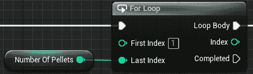

图 9.7：循环节点和 NumberOfPellets 变量

在发射多个轨迹后，我们现在需要使每个轨迹略有不同，这样我们就不只是进行多次相同的轨迹。让我们接下来做那个。

### 为弹丸轨迹添加扩散

要为**按通道线迹追踪**节点的**结束向量输入**添加变化，我们需要在将其乘以范围之前，稍微旋转**获取前向向量**节点的结果。

要做到这一点，我们需要添加一个“圆锥内随机单位向量（以度为单位）”节点。这个节点使用一个**圆锥方向**输入（圆锥初始面对的方向）和一个**圆锥半角（以度为单位）**输入（从圆锥中心线应用旋转的量）。

对于**圆锥方向**，我们将它连接到**获取前向向量**节点的**返回值**。

对于`HalfSpreadDegrees.`。

设置`15`。

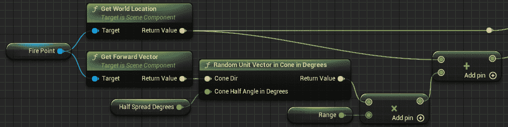

图 9.8：调整后的发射轨迹

一旦添加了“圆锥内随机单位向量（以度为单位）”节点，计算应该像*图 9.8*中所示那样连接在一起，向量连接进入**按通道线迹追踪**节点。

现在所有这些都设置好了，你就可以测试霰弹枪了。在关卡中的精英单位上再次更改变量，然后尝试一下。

一切都完成并正常工作后，让我们继续到另一个父-子结构模式，其中一切都是完全相反的。

# 理解子类沙盒

子类沙盒模式借鉴了模板通过子类（为了提供安全性）进行有限扩展的想法，并将其完全相反地应用。在这里，子类通过一个抽象的脊函数定义了一组预定义代码块的执行顺序。这些块的形式是定义在父类中的函数，并且永远不能被覆盖。每个函数都以标准化的方式处理与外部系统相关的一件事。以下伪代码更好地说明了这实际上是之前我们探索的模板模式的相反，其中之前标记为抽象的每一件事都获得了功能，而我们之前有代码的函数现在变成了抽象的：

子类沙盒模式父类伪代码

```cpp
public class Sandbox_Parent
{
public:
    abstract void DoAThing();
protected:
    void PlaySound() { //Plays sound correctly }
    void FireParticle() { //Fires particle correctly }
    void AddForce() { //Adds force correctly }
    void DealDamage() { //Deals damage correctly }
}
```

这种模式的流程从程序员为技术设计师构建黑盒工具开始，技术设计师可以将这些工具以有趣的方式连接起来。这可能导致有趣的创新，因为程序员并不是根据规格制作工具，而是仅仅为了拥有工具，这留下了它们的应用由技术设计师解释的空间。另一方面，可能会有很多浪费，因为工具要么没有被使用，要么是以它们本可以设计得更好的方式被使用的。因此，这个过程作为双方的迭代工作会更好，以确保工具集是有用且高效的，并且实际上被使用。

足够在抽象层面讨论了：让我们看看我们武器与模板模式一起的实现。

## 构建沙盒（父类）

第一步是复制模板部分中我们所做的操作，并为我们的 `Weapon_Base` 类创建另一个 C++ 子类，但这次将其命名为 `SandboxWeapon_Base`。这种模式的整个目的在于，蓝图子类将以他们认为合适的方式实现 `Fire` 函数，但为了做到这一点，我们至少需要在其中添加 `UFUNCTION(BlueprintNativeEvent)`。然而，因为我们已经通过这个共同的父类将我们的模式组合在一起，这意味着函数必须被标记为虚拟的，因此不能有标准函数指定符。这种情况在任何生产代码中都不会发生。这仅仅是因为我们展示了通过共同父类链接的两个模式。我们为此提出的解决方案是第二个 `Fire` 函数，称为 `SandboxFire`。我们将在 `Fire` 函数内部将执行权传递给这个函数，以便一切行为都保持正常。任何合理的项目架构都不会像这样并排实现两种模式，所以这不应该成为你未来项目中的问题。

我们必须定义的另一件事是构建块函数，我们选择将其与之前的示例保持相似，但你可以根据需要创建尽可能多的函数。关键是保持每个函数简短且直接，因为它们的目的在于标准化与外部系统交互的方法，以便未来的更改易于维护。以下代码中函数最重要的方面是它们被保护并标记为`BlueprintCallable`。这意味着它们仅供此类子类使用，不能被覆盖，同时也确保它们没有外部访问权限。

让我们从沙盒武器的基类开始：

SandboxWeapon_Base.h 摘录

```cpp
UCLASS(Abstract)
class RTS_AI_API ASandboxWeapon_Base : public AWeapon_Base
{
    GENERATED_BODY()
public:
    virtual void Fire() override;
    UFUNCTION(BlueprintImplementableEvent)
    void SandboxFire();
    UFUNCTION(BlueprintCallable)
    void Reload();
protected:
    UFUNCTION(BlueprintCallable)
    bool CheckAmmo();
    UFUNCTION(BlueprintCallable)
    void LinetraceOneShot(FVector direction);
    UFUNCTION(BlueprintCallable)
    void PlaySound(USoundBase* sound);
    UFUNCTION(BlueprintCallable)
    void UpdateAmmo();
};
```

声明了头文件后，我们可以转向以下实现中的定义。我们的`Fire`函数覆盖只是调用`SandboxFire()`将信号传递到具有正确属性的函数。由于`SandboxFire`被标记为`BlueprintImplementableEvent`，它在此类中没有定义，而是完全由蓝图子类来定义。我们的`Reload`、`CheckAmmo`和`UpdateAmmo`函数基本上与之前相同，但这取决于被连接的系统以及在哪里构建大量的小特定函数。`PlaySound`是之前`PlayEffects`的一个更具体版本，当时我们可以将实现留给设计师，但现在我们必须在函数名称和使用上具体指定：

SandboxWeapon_Base.cpp 简单函数定义

```cpp
void ASandboxWeapon_Base::Fire()
{
    SandboxFire();
}
void ASandboxWeapon_Base::Reload()
{
    _CurrentAmmo = _MaxAmmo; Handle_FireDelay();
}
bool ASandboxWeapon_Base::CheckAmmo()
{
    return _AmmoPerFire <= _CurrentAmmo;
}
void ASandboxWeapon_Base::PlaySound(USoundBase* sound)
{
    UGameplayStatics::PlaySoundAtLocation(this, sound,
        GetActorLocation());
}
void ASandboxWeapon_Base::UpdateAmmo()
{
    _CurrentAmmo -= _AmmoPerFire;
}
```

在具体性的话题上，我们现在有一个`LinetraceOneShot`函数替代了之前的`ProcessFiring`函数。虽然这种实用性的，指定它是一次性射击，将在以后变得明显，但这个函数是处理枪支射击游戏逻辑的多种方式之一。它作为一个包装器，使用用户必须传入的方向向量调用线迹函数。然后通过标准的 Unreal 方法对它击中的任何东西施加伤害：

现在我们可以将此添加到沙盒武器中：

SandboxWeapon_Base.cpp LinetraceOneShot 函数定义

```cpp
void ASandboxWeapon_Base::LinetraceOneShot(FVector direction)
{
    FHitResult hit(ForceInit);
    FVector start = _FirePoint->GetComponentLocation();
    FVector end = start + (direction * _Range);
    if(!UKismetSystemLibrary::LineTraceSingle(GetWorld(),
        start, end,
        UEngineTypes::ConvertToTraceType(ECC_Visibility),
        false,
        {this, GetOwner()},
        EDrawDebugTrace::ForDuration,
        hit,
        true,
        FLinearColor::Red, FLinearColor::Green, 5))
            return;
    UGameplayStatics::ApplyDamage(hit.GetActor(),
        _DamagePerHit, GetInstigatorController(),
            GetOwner(), UDamageType::StaticClass());
}
```

现在我们已经为沙盒基类配备了基本工具套件；我们可以通过使用 Sandbox_Fire 函数使蓝图子武器与模板模式等效。比较每个模式的蓝图实现应该会显示出很多方法上的差异以及它们如何以不同的方法用于同一系统。

## 创建子类

就像与模板模式一样，我们将在蓝图中创建沙盒武器基类的两个子类。为此，我们遵循相同的步骤，只是在搜索`sandbox`时选择`BP_SandboxPistol`和`BP_SandboxShotgun`。

创建完成后，我们可以继续设置它们。与模板模式不同，我们不需要创建功能行为。相反，我们确定父类中函数的顺序（和重用）。

## Sandbox 手枪

再次，我们从手枪开始，因为这可能是最简单的武器类型来实现。首先，我们进行所有检查以确保武器可以射击，如下所示：

1.  使用**覆盖**列表覆盖**Sandbox 射击函数**。

1.  根据布尔值`CanFire`添加一个**分支**。

1.  从“检查弹药”中添加一个基于**返回值**的第二个**分支**。

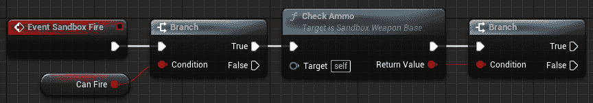

图 9.9：Sandbox 射击事件的开始

接下来，我们将向**分支**节点的**False**输出添加逻辑，调用**重新装填**并播放声音（声音尚未在父类中实现，因为这通常是针对每种武器都不同的）：

1.  调用`Reload`函数。

1.  添加一个“播放声音”节点，从下拉菜单中选择**Gizmo_Handle_Clicked**声音。

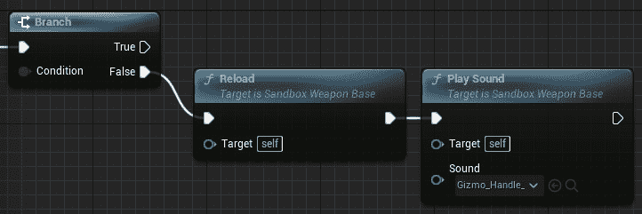

图 9.10：Sandbox 射击事件的 False 逻辑

最后，我们可以添加 True 逻辑，这实际上会发射武器。由于功能行为已经在父类中存在，我们只需调用函数并提供所需的输入。我们将分两步进行。第一步将在执行线迹和更新弹药之前播放声音。第二步将使用计时器来调用管理射速的函数：

1.  添加一个“播放声音”节点，再次选择`VR_Teleport`声音。

1.  调用`Linetrace One Shot`函数，向其提供**射击点**组件的**前进向量**。

1.  调用`Update Ammo`。

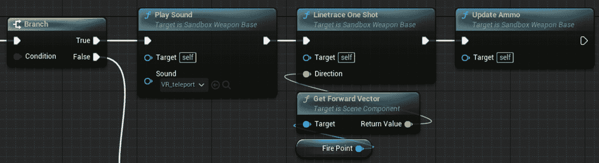

图 9.11：Sandbox 手枪射击逻辑的开始

1.  添加一个名为“通过函数设置计时器”的节点。

1.  在**函数名称**中输入`Handle_FireDelay`。

1.  将`1`除以**RoF**浮点变量，并将其连接到**设置计时器通过函数名称**节点的**时间**引脚。

1.  提升`TimerFireDelay`。

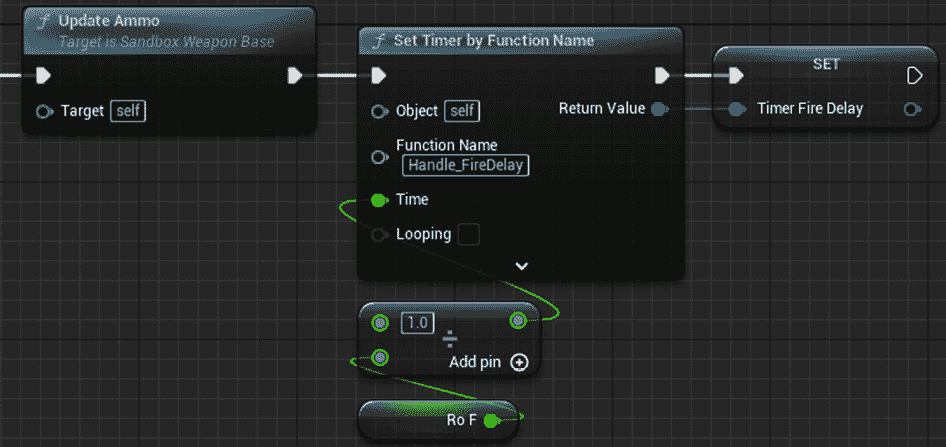

图 9.12：将 Hand_FireDelay 计时器添加到链的末尾

完成手枪后，像我们处理两个模板武器一样测试它，然后我们可以继续使用 Sandbox 模式实现霰弹枪。

## Sandbox 霰弹枪

霰弹枪的设置与手枪类似，除了我们再次需要完成多个线迹的地方。父类有一个需要前进向量输入的单个线迹。所以，就像在模板示例中一样，我们将使用**循环**，并再次在向**Linetrace One Shot**函数提供前进向量输入时使用**在圆锥内随机单位向量（以度为单位**）节点：

1.  首先，从手枪复制逻辑。这可以为我们节省一点时间。

1.  通过按住*Alt*并点击引脚来断开**Linetrace One Shot**节点的两侧。

1.  添加一个`For Each`循环，就像我们在模板霰弹枪中做的那样，连接在`True`逻辑之后，并再次使用`Number of Pellets`整数变量。

1.  对于**Linetrace One Shot**节点上的**方向**向量输入，以与模板霰弹枪相同的方式设置**锥形内的随机单位向量（以度为单位**），如图*图 9.13*所示。

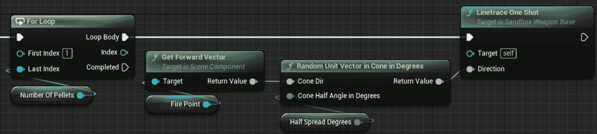

图 9.13：BP_SandboxShotgun 的 For 循环循环体逻辑

现在我们有了多行跟踪发生，我们需要添加回剩余的射击链，即更新弹药函数和射击延迟计时器。由于这些步骤需要在射击后完成，因此它们需要连接到**For 循环**节点上的**完成**引脚，而不是**循环体**的一部分。

将前一步骤中的节点移动，为从**完成**引脚的连接创建一个清晰的路径，并将其他节点重新连接，如图*图 9.14*所示。

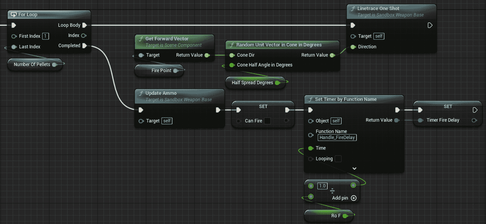

图 9.14：更新弹药和计时器连接到完成引脚

与以前一样，通过在关卡中选择精英单位的武器来测试这一点。

如果一切按预期工作，我们就可以继续探索类型对象模式，它允许我们轻松扩展游戏中的内容。

# 类型对象模式

如果你需要一种快速创建游戏中的许多变体以扩展玩家可用的内容的方式，那么类型对象模式就是为你准备的。类型对象模式将我们在第三章中作为享元模式的一部分所讨论的隐式和显式数据的思想带回到游戏世界中。原则是相同的：我们将所有类型的实例中通用的所有数据分离出来，但不是仅仅从每个地方链接到它，而是混合它并产生大量这种数据的变体。结果是，一个相互连接的对象网络，所有对象都具有相同的功能，但在它们使用的隐式数据集方面有所不同。

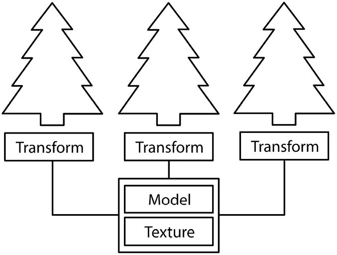

图 9.15：第三章中讨论的享元模式的图，第三章

*图 9.15*显示了享元模式通过在内存中的一个地方存储关于树的概念的隐式数据来节省空间。

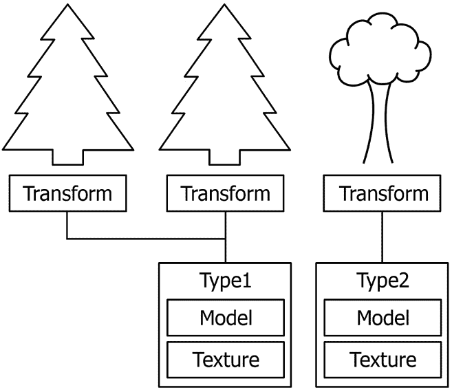

图 9.16：显示类型对象模式提供的享元模式扩展的图

在图 9.16 中，从 Flyweight 模式扩展到类型对象，我们定义了更多类型作为隐式数据的不同集合。这个图表清楚地表明，这种增加的可扩展性将带来内存成本。现在只有共享相同类型的对象才能一起批量处理，因此批量调用次数增加，但我们仍然远远超出了显式定义每个树的需求。

虽然这不是实现这一结果的唯一方法。我们本可以保持我们的 Flyweight 模式，并为每种类型创建一个新的类。这也可以工作，那么我们为什么不这样做呢？因为代码占用空间。在下一章中，我们将介绍数据局部性的概念，它建立在代码中的指令（如我们操作的价值）在内存中占用的知识之上。复制一个类也会复制需要存储以运行代码，更不用说定义和存储新类所带来的开销。我们的目标是提供一个优雅的解决方案，简化内容创作过程并提高效率。

要在虚幻引擎中实现类型对象模式，我们需要将数据集合存储为一个资产，以便在运行时将其加载到 RAM 中进行引用。这可以通过编写文本文件或一些其他结构化文件格式如 JSON 或 XML 来实现。问题在于设计师需要在一个单独的文本编辑器中打开数据文件来做出更改，当进行多次迭代的小改动时，保存和重新加载编辑器预览的过程可能会变得繁琐。幸运的是，虚幻引擎为我们提供了一些内置结构的选择。我们将探讨变体和变体管理器、数据资产和数据表。毫无疑问，还有更多实现这一功能的方法，但这三个应该涵盖了类型对象模式的大多数通用实现。

## 变体

**变体管理器**是虚幻引擎中的一个工具，允许我们在级别中创建多个可交换的变体。变体存储了演员属性值，并且在选择变体时还可以从演员内部调用函数。

变体由**级别变体集演员**在级别中持有，该演员链接到一个**级别变体集**资产，其中存储了各种演员、它们要更改的属性以及它们内部要调用的函数。

变体可以通过在编辑器中通过**变体管理器面板**（如图 9.17 所示）或在运行时通过蓝图函数激活。

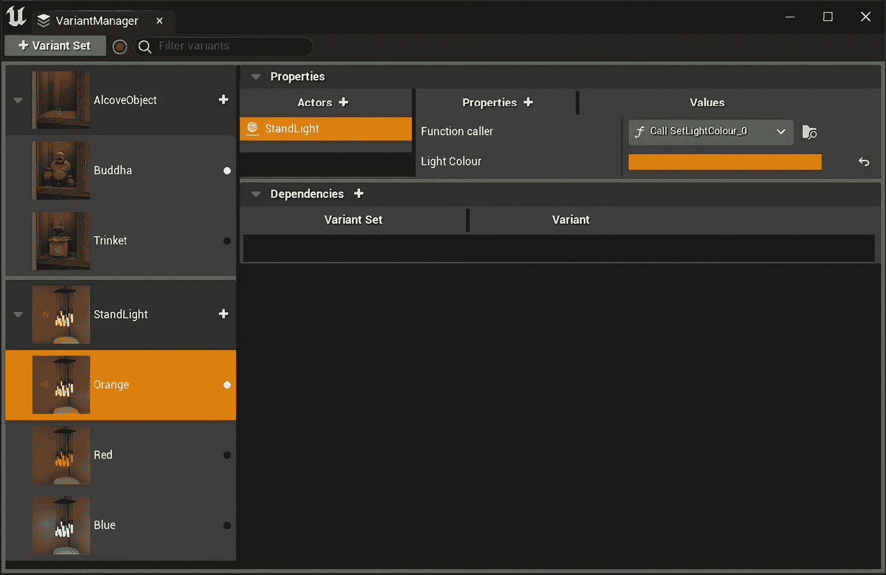

图 9.17 变体管理器面板

变体和变体管理器在交互式体验中更为常用，例如建筑可视化项目或基于产品的应用程序，如汽车配置器。

变体管理器方法可以用于角色创建屏幕，就像在《魔兽世界》或《赛博朋克 2077》这样的 RPG 游戏中看到的，或者像《堡垒之夜》、《疯狂原始人》或《火箭联盟》这样的游戏中的模块化角色/车辆设置系统，玩家可以选择添加到角色中的不同部件。

对于像《堡垒之夜》或《疯狂原始人》这样不断扩展的游戏，使用变体管理器方法的一个缺点是需要花费大量时间来创建变体并完全设置它们。一个游戏内的角色定制系统更适合使用数据表方法，其中可以通过表格编辑器快速添加额外数据，或者从电子表格中导入。让我们看看下一个例子。

## 数据表

数据表是为了存储没有功能性的值而创建的资产类型。我们在项目中使用结构体定义它们，每个成员成为表中的一列。表中的每一行代表一组我们称为类型的值，以适应我们的模式。数据表旨在在一个地方存储大量数据，以便在需要时查询。它们可以存储指向其他资产的值，但以这种形式工作起来很麻烦，通常避免使用，而是将所有内容存储为原始类型。这种原始数据的软限制意味着，尽管可能，建议不要使用嵌套信息。这可能会影响一个定制影响下一级可用的系统。

此资产的主要优点是能够直接从 CSV 或 JSON 文件导入，这使得它成为具有外部工具的设计师首选的平衡方法。另一方面，由于所有内容都存储在一起，即使你不在给定场景中使用所有类型，所有数据仍然会被加载到内存中，这使得它对于高级类型不太可行，更适用于通用型模式，如需要始终加载的寻宝系统等。还有人认为，使用数据表进行语言本地化也是有道理的，因为所有类型都在一个地方，搜索特定记录变得更容易、更快。

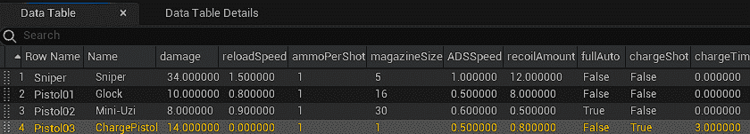

图 9.18：示例数据表截图，包含武器平衡数据

*图 9.18* 展示了一个数据表的使用情况，用于平衡游戏中不同敌人的类型，唯一的变化是随着敌人等级的提升，统计数据值的变化。这些值可能已从外部平衡工具导入，因为所有值都是原始类型。

## 数据资产

数据资产将数据表的概念分解成单独的行。然后，每一行都成为它自己的资产，可以通过编辑器创建和管理。当我们定义数据资产时，它看起来非常像结构定义，但在实例化时，我们不会在世界上获得一个新的项目。相反，我们在项目中获得一个新的数据资产实例，这与材料和材料实例的工作方式类似。一旦数据资产实例在活动代码中被引用，该实例就会被加载到内存中，就像纹理或静态机械资产一样。由于编辑器负责数据资产的创作和管理，它们有易于使用其他资产引用的工具。这使得它们对于定义高级类特殊化的类型数据非常有用。它们还很好地处理嵌套信息，如果它们被正确序列化，编辑器就有空间显示下拉菜单，以便可以操作子值。

解释如何使用数据资产为类型对象模式的最佳方式是利用它们制作一些东西。所以，让我们把注意力转回到我们通过本章一直在工作的项目上，以实现一些数据资产：

1.  首先，通过在 C++文件夹中右键单击来定义一个新的数据资产类型。确保从编辑器中这样做，因为在 Rider 中没有模板可用，这意味着你将不得不进行很多不必要的更改。

1.  当选择要继承的基类时，从**所有****类**菜单中选择**UDataAsset**。

1.  然后给它起个名字。我们把它叫做`EnemyType`。

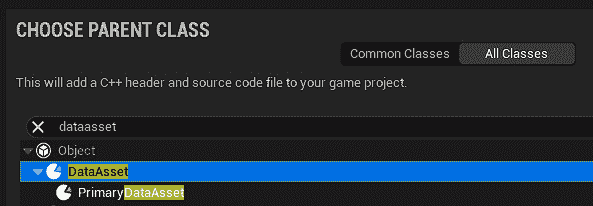

图 9.19：创建新数据资产的类创建菜单设置

接下来，我们考虑需要在资产内部存储哪些数据。我们可能想要在不同敌人类型之间变化的东西有很多。关键是确保你只在这里存储关于敌人的特定数据，而不是敌人类中可能不同的其他类，例如武器射速。武器将需要另一个并行实现类型对象模式，这甚至可以嵌套在这个模式中，武器类型在敌人类型中定义：

1.  在`UCLASS`块中给这个类添加`BlueprintType`属性。

1.  我们只更改敌人的类型和材料，所以添加一个用于健康的浮点数和几个指向`UmaterialInstance`变量的对象指针。

1.  确保每个变量都有`EditAnywhere`和`BlueprintReadWrite`属性指定符，这样我们就完成了 C++方面的所有工作：

EnemyType.h 摘录

```cpp
UCLASS(BlueprintType)
class RTS_AI_API UEnemyType : public UDataAsset
{
    GENERATED_BODY()
public:
    UPROPERTY(EditAnywhere, BlueprintReadWrite)
    float _Health;
    UPROPERTY(EditAnywhere, BlueprintReadWrite)
    TObjectPtr<UMaterialInstance> _Material1;
    UPROPERTY(EditAnywhere, BlueprintReadWrite)
    TObjectPtr<UMaterialInstance> _Material2;
};
```

下一步是从我们刚刚创建的模板中定义一些数据资产：

1.  将构建回编辑器，并在**RTS/Data**文件夹上右键单击。

1.  选择**杂项**>**数据资产**。

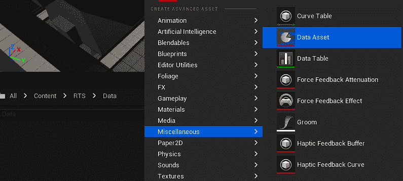

图 9.20：数据资产选项在右键菜单中

1.  从待选类列表中选择 **EnemyType** 作为父类。

1.  给新资产起一个代表我们正在制作的类型的名字（我们选择了 `Enemy_Basic`），然后打开它。

1.  将健康值设置为 `100` 并选择用于材质槽的 **MI_EnemyUnit_01** 和 **MI_EnemyUnit_02**。

最后一步是在单位生成时应用这些值：

1.  打开位于 **RTS/Blueprints** 文件夹中的 **BP_EnemyUnit**。

1.  添加一个新的 **EnemyType** 类型的变量，并通过点击眼睛图标使其可编辑，如图 *图 9.21* 所示。然后将其默认值设置为 **Enemy_Basic**。

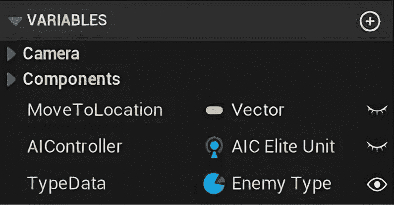

图 9.21：BP_EnemyUnit 变量

1.  在事件图中添加一个 **BeginPlay** 事件节点。

1.  检查新的 **TypeData** 变量是否有值。

1.  然后将 **TypeData** 变量中的每个值放入如图 *图 9.22* 所示的相关位置。

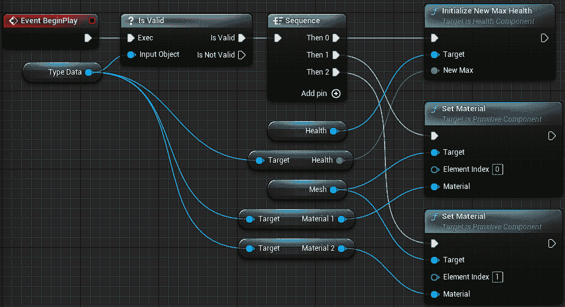

图 9.22 展示 BP_EnemyUnit 事件图应用类型数据截图

做所有这些应该不会让任何东西出现或表现不同，但它现在让我们能够定义具有不同材质的新类型敌人，在内容浏览器中定义。然后我们可以使用可编辑的变量设置生成的敌人类型。作为这个的扩展，尝试定义一个新的敌人类型，其健康值为 200，并使用我们为基本类型使用的材质实例的 B 版本。这些可以在与之前使用的材质相同的文件夹中找到，但被染成蓝色。另一个你可以尝试的扩展是设置类型变量在生成时暴露，并在级别中动态生成几个敌人。这将允许你在代码中设置类型，希望这能展示这个系统的强大功能。

我们已经探讨了在 Unreal Engine 中利用类型对象在游戏玩法中的不同方法，以使用三种不同的方法来方便地实现大量变体：变体、数据表和数据资产。随着我们类型对象示例的完成，我们结束了对构建结构化解决方案可用模式的探索。

# 摘要

本章中我们讨论的三个模式是最广泛使用的结构模式。前两种模式的使用是个人偏好，正如我们所见，它们都可以以不同的方式实现相同的目标。模板和子类沙盒也被现代代码中的其他技术所取代，例如接口和模块化设计，但了解它们的起源和它们所鼓励的工作流程是有用的。模板和子类沙盒都强调了限制设计师访问权限以确保代码库的可维护性的必要性。另一方面，类型对象模式是游戏开发中最有用的模式之一，它在游戏设计的各个方面都有广泛的应用。它允许艺术家、设计师和程序员共同工作，其价值无可估量。

在下一章中，我们将深入探讨一些模式，一旦我们有一个可工作的游戏，就可以通过对象池、数据局部性和脏标志等概念来提高我们的性能。
