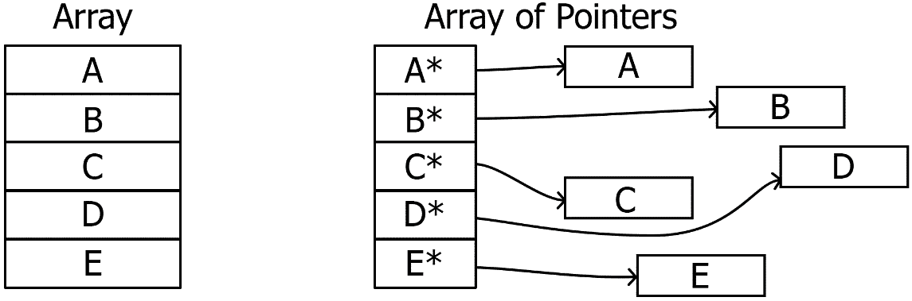
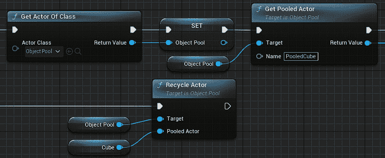

# 第十章：通过模式进行优化

在最后一章中，我们将讨论在发布游戏之前我们应该考虑的最后一件事：优化。优化模式旨在让我们的代码在功能上保持不变，但以更快、更优雅的方式运行，对硬件的影响更小。本章内容相当多，但指导这些模式的底层原理需要我们对可用的硬件资源工作方式有一定的理解。到结束时，我们将涵盖从如何帮助 CPU 更好地工作到创建一个可以插入任何游戏以使其在运行时可能更快运行的系统的所有内容。

使这成为可能的是以下模式：

+   **脏标志**，它专注于减少我们需要更新计算值次数。

+   **数据局部性**，这涉及到优化代码布局以适应 CPU 内存工作方式。作为一个描述，这听起来比应用的现实情况要复杂得多。

+   **对象池化**，我们将尽可能多的内存分配处理工作推迟到游戏开始时，这样可以在加载屏幕下进行，以免影响运行时效率。

因此，在本章中，我们将涵盖以下主题：

+   使用脏标志来减少不必要的处理

+   数据局部性如何影响代码效率

+   对象池化我们的资源以节省后续时间

# 技术要求

本章的起点可以从任何项目开始，但我们有一个 GitHub 仓库的分支，它从*第九章*结束的地方继续。这提供了一套我们可以与将要构建的对象池器集成的系统。您可以在以下*第十章*分支中找到这个起点：

[`github.com/PacktPublishing/Game-Development-Patterns-with-Unreal-Engine-5/tree/main/Chapter10`](https://github.com/PacktPublishing/Game-Development-Patterns-with-Unreal-Engine-5/tree/main/Chapter10)

# 使用脏标志来减少不必要的处理

脏标志涉及仅在需要时更新值。关于其工作原理的最好解释出现在基础级引擎开发和变换层次结构中。当你在一个变换上设置局部位置时，你是在表明你想要距离父位置 *x*、*y* 和 *z* 单位。这很容易更新，但在这样做的同时，我们也在改变变换的世界空间位置。计算处理这种局部到世界空间转换的矩阵很容易，然后我们将我们的向量乘以它；这个过程甚至不耗费很多资源。然后，我们必须记住这是一个层次结构。如果我们移动一个深度达数百个变换的树的根，那将是一个不太好的位置，有多个原因，但如果一个变换的父变换移动，那么子变换也会随之移动，以此类推，递归地。这会带来很多需要更新的世界空间值变换。

为了使脏标志的效用更容易量化，我们可以考虑一个假设的情况，即我们有一个深度为 100 个父-子连接的变换层次结构。我们想要像链条一样移动它们，每个都带有扭矩波动。从层次结构的顶部开始向下移动，在每一步，我们将该级别的变换位置更新为新定义的局部位置，该位置由某个周期函数确定。随着每个局部更新的进行，我们也会更新层次结构中每个较低变换的局部到世界矩阵，因为它们将在世界空间中移动，如图 *图 10*.1 所示。这将需要每一步进行 (101-n) 个矩阵更新，这意味着要移动整个 100 个变换的层次结构，我们将得到第 100 个三角数，即 5,050。我认为我们可以安全地说这是荒谬的，肯定有更好的方法。考虑所做工作的效用。我们为什么要更新这些变换？为了让其他东西能够读取其世界空间位置并获得准确、最新的值。我们在算法的任何点上读取过世界空间位置吗？没有。设置局部位置的函数不需要世界空间位置。那么，我们需要更新这些对象的局部到世界矩阵吗？不是直到其他东西需要我们这样做，或者帧结束时。在最佳情况下，这意味着我们可以在最后只进行 100 次矩阵更新。这就是脏标志模式的目的。


图 10.1 – 展示局部位置变化影响其子变换世界空间位置的图

现在，让我们看看脏标志的应用。

## 脏标志的应用

实际上，整个模式只是一个布尔值；当对象被认为是“脏”时，布尔值是一个值，当它是“干净”时，它是另一个值。哪种方式是反的并不重要，只要它与命名保持一致。一个对象是脏的，如果它有尚未完成的更改，这些更改需要应用到它所表示的值上。在我们的例子中，我们推迟局部到世界矩阵的更新，直到有人请求矩阵或帧末到达。在局部位置更改和矩阵更新之间的这段时间里，变换被认为是脏的。

处理这种问题的机制超出了布尔值。在设置一个脏标志时，该对象会被添加到一个相关的静态脏对象列表中。对于我们的变换，这意味着它以及它在层次结构中下面的所有变换都会递归地添加到另一个静态的脏变换列表中。然后我们有一个清理函数，它描述了如何从脏状态转换到干净状态。对于变换来说，这将是计算更新后的局部到世界矩阵的函数。

那个例子只有在设计自己的引擎时才需要担心，但脏标志模式可以应用于任何可能需要更新多次的值。你可以在`destroy`命令中找到这个模式，该命令在帧末标记演员进行销毁，这是由于移除它们时的级联效应。将会有一些情况，你需要存储需要显示给 UI 的数据，而脏标志模式可以减少每帧告诉 UI 更新的次数；它最多每帧只应该发生一次。

接下来，我们将更深入地探讨，从单变量模式到一个我们可以应用于任何地方的优化指导原则。

# 数据局部性如何影响代码效率

这是一个简单的概念，实现起来所需很少。我们都会积极思考变量如何占用内存。我们往往忘记指令也会占用内存。它们必须从存储中加载到更快的内存中，然后进入 CPU 执行。CPU 通过利用它们内部非常快、非常小的存储（称为缓存）来尝试使事物运行得更快。缓存允许 CPU 预先加载即将执行的指令，并在临时上下文切换的情况下存储其状态。这种预先加载行为对于 CPU 以最高效的方式运行是必要的，因为虽然 CPU 速度的技术竞赛一直在进行，但在 RAM 的世界中并没有得到相应的反映。你可能能够将庞大的程序完全存储在 RAM 中，但主板的总线速度限制了每秒可以发送到 CPU 的指令数量。当我们达到瓶颈时，CPU 核心的计算速度有多快并不重要，因为它们会花费大部分时间空闲，等待指令。预先加载提供了一种机制，有可能通过将大量指令发送到 CPU 缓存进行处理来解决这个问题。我们说“有可能解决”是因为在从 RAM 中提取指令时，无法知道下一个指令是什么。这些信息在指令菊花链中，只有当工作完成时才能访问。这意味着 CPU 缓存的全部内容完全由我们系统架构的地域性决定。

这有很多技术术语，所以让我们用一个类比来解释它。想象一下在一个工厂工作，你的工作是组装平板家具。当你有材料并且可以快速组装每个部件时，你工作得非常快。但是，你一次只能看到一条指令，当你需要部件时，你必须向搬运工请求。这些资源，如面板和螺丝，存储在几英里外的仓库中。当你请求某物时，搬运工需要一天的时间来回旅行，这意味着无论你工作得多快，你每天只能完成一条指令。你大部分的时间都在盯着墙看。在这个例子中，你是 CPU，正在执行指令，而搬运工是数据总线，负责将指令从 RAM 运送到执行。

有一天，一位新经理被引入并决定改革流程。他们改变了物料请求流程，现在当搬运工拿到所需物品时，他们也会得到所有触手可及的其他物品。这堆螺丝和面板随后被扔在你的工作站地上。在实际情况中，我们称之为 CPU 缓存，这是 CPU 内部的一小块极快内存。这种做法的好处是，当你获取下一个指令时，你有可能已经拥有了所需的材料。如果没有，那么所有材料都需要被取回，并收集新的材料。因此，如果仓库被组织得使得经常一起请求的材料放置在一起，搬运工更有可能为下一个指令取到正确的材料。搬运工对情况的了解或技能不需要有任何改变，只需在开始时进行适当的规划，以实现高效的结果。

作为程序员，我们可以在那个例子中扮演仓库经理的角色，确保函数所需的数据在物理上靠近该函数，以便当 CPU 请求资源时，缓存更有可能填充有用数据。当 CPU 可以从缓存中执行时，这被称为缓存命中。同样，当需要请求数据时，这被称为缓存未命中。我们希望尽可能多地实现缓存命中，以减少缓存需要重新填充的次数。实现高缓存命中的收益是惊人的；有时，由于有效地组织数据，它们可以快上 50 倍。

我们将探讨两种实现数据局部性原则的方法，但毫无疑问，一旦你理解了这个问题，还会有其他方法在实现上更加合理。让我们来看看这两种方法。

## 热冷分割

第一种技术非常类似于在*第九章*中提到的类型对象模式需要考虑隐式和显式数据，但不是思考这些值定义了什么，而是观察它们被访问的频率。这个例子中最好的例子可能是一个游戏中带有掉落物品的非玩家角色（NPC）。NPC 的健康值在其生命周期中会定期被访问，因为它们会治疗和受到伤害，而描述它们掉落物品的物品表只在对象生命周期的末尾被访问一次。我们可以将频繁访问的数据分类为“热”数据；这些数据可以作为成员变量保留在对象中。而像物品表这样的单次使用数据，则标记为“冷”数据，并分离到一个结构体中，作为指针存储在对象内部。

为什么做所有这些？这与对象被拉入缓存时的大小有关。当对象被拉入缓存时，它直接包含的所有数据构成了它在缓存中占据的空间量。这意味着所有指针实际上只占据`uint64_t`的空间。它们指向的数据不一定在直接访问之前被加载，因为它们在物理上声明在其他地方，这就是指针的原因。如果没有像我们之前描述的那样分离我们的热数据和冷数据，我们的类将占用比必要的更多缓存内存，这增加了缓存未命中的可能性。

## 连续数组

第二种技术是使用连续的数据数组。我们知道有两种内存类型：栈和堆。数据局部性是栈内存被认为更快的主要原因。栈中的所有内容在程序运行之前都已定义，因此组织得井井有条。数据数组存储在栈中，并在一条连续的行中定义。这使得在循环遍历这些元素时，CPU 缓存更加高效，因为它们在物理上存储得更近。这是数据导向的 ECS 更快的一部分原因，正如在*第四章*中讨论的那样。然而，动态集合和指针在运行时声明在堆内存中。我们为了在稍后定义数据的灵活性而牺牲了效率。堆上的数据使用可用的任何空闲空间，因此可能最终定义多个彼此距离较远的大型对象。*图 10.2*展示了将值数组而不是指针数组存储在内存中可以如何影响加载到缓存中的内容。这是我们在本章稍后实现对象池时需要记住的概念。当我们生成对象时，它们被作为`TObjectPtrs`存储在`TArray`中。这个数组能否被转换成标准的 C++数组？我们为了这样做需要牺牲哪些动态属性？这很可能是动态大小，但你的上下文中需要这个吗？



图 10.2 – 内存中指针数组与值数组的可能布局

那么，解决方案是不是总是使用数据数组呢？嗯，不是的。在面向对象编程中，有许多情况下仍然需要指针和动态集合。这更多的是一个考虑它们的使用的问题，如果你可以用静态数组替换动态集合，那么就替换。这一点在我们接下来要讨论的本书的最后一个模式中尤为重要：对象池。

# 将资源池化以节省后续时间

本书讨论的最后一种模式是对象池。这种模式旨在解决 CPU 的一个核心问题：分配和释放内存是一个缓慢的过程。每次生成一个新的 actor 时，它所需的内存空间必须在每个变量的正确子分区中预留，并返回给游戏进程以接收数据。每次删除一个 actor 时，必须从所有引用中释放该内存，并将其返回到堆中。对于像每分钟发射 3,000 发子弹的迷你炮这样的东西，这意味着大量的内存块分配，这些块都是相同的大小。对象池的做法是预测这种巨大的成本，并将其转移到导致延迟不那么明显的位置。对我们来说，这意味着在游戏开始时生成我们可能需要的所有子弹，并将它们隐藏起来。当需要时，它从已停用的子弹架上取下，传送到正确的位置，并激活。然后，为了保持池的完整性，当它本应被销毁时，它只是被停用并返回到与其他池化项目一起的架子上。尽管这种模式确实会使关卡刚刚加载时的那一帧变得更糟，因为我们一次性生成了所有子弹，但我们可以在加载屏幕下掩盖这一点。这种偏移可以在紧张的游戏玩法序列中显著提高处理速度，在这些序列中会有大量的生成和销毁发生。然后，我们的池保持活跃，直到关卡结束，所有对象一起被销毁，再次在加载屏幕下。

理论讲解完毕后，让我们来创建一些对象池。

## 实现对象池

我们可以以几种方式来看待实现这一点，并且从现实的角度来看，如果它能在你可以访问它们的地方生成所需的对象，那么这就是对你来说最好的方法。实现选项包括作为世界子系统、关卡 actor 组件、游戏模式组件或在关卡中的浮动 actor。

### 世界子系统

子系统是虚幻引擎实现我们已在*第八章*中介绍的单例模式标准化形式的一种尝试，其作用范围有限。这种形式意味着我们可以创建一个几乎静态的类，我们知道它将存在于它所附加的任何事物的生命周期内。然而，子系统在访问方面并没有得到很好的保护，因为任何与它们附加的对象相关的都可以调用它们上的函数。这就是为什么它们倾向于用于无论交互与否都会运行的隐藏逻辑行为系统。这导致它们上的大多数公共函数都是获取器，用于获取它们正在处理的事物的状态。存在五种子系统级别。让我们按生命周期递减的顺序来描述它们：

+   **引擎**：存在于编辑器和游戏运行期间。

+   **编辑器**：作为编辑器工具运行，不会与游戏一起构建。

+   `UGameInstance` 存在于可执行文件运行期间的游戏会话中。同一时间只能存在一个实例。

+   `ULocalPlayer` 是与之关联并在不同级别之间移动的对象。每个本地玩家都有一个实例。

+   `UWorld` 是与之关联的。每个当前加载的`UWorld`都有一个实例。

考虑正在创建的系统的范围并将其与最佳描述其生命周期的父类匹配是很重要的。对于一个对象池器，这将是世界子系统，因为任何在池中生成的对象都将存在于世界中，所以当世界卸载时，它们也会被卸载。如果系统被制作为一个本地玩家子系统，那么在更改地图时可能会破坏引用，并在菜单世界中生成不必要的物品。

### LevelScriptActor 子类

`ALevelScriptActor` 是在蓝图侧人们所熟知的级别蓝图。它为特定级别的代码执行提供了一个位置。这在教程中很有用，因为可以通过这种方式逐步介绍机制，或者用于基于地图的机制，例如《战地 4》中的“Levolutions”，其中每个地图都有能力在满足不同条件时完全改变。在虚幻引擎的文档中并没有很好地宣传的是，我们可以在 C++层更改级别蓝图。只需创建一个`ALevelScriptActor`的新的 C++子类，并将代码添加到这里。这个新的子类可以用来设置对象池系统，因为`ALevelScriptActor`存在于一个隐藏状态，只要我们的世界存在，并且可以轻松访问特定地图的世界大纲中的任何其他内容。这种方法的缺点是，在编辑器中创建的每个新地图都附带一个已经从基础`ALevelScriptActor`类继承的级别蓝图。这意味着每个新地图都必须手动将级别蓝图重新关联到自定义的 C++类型，这可能导致大量的管理任务，并且容易遗漏步骤。

### 游戏模式组件

游戏模式是一个在每个级别中都保证存在的类，因此可以选择将对象池器制作为一个附加到它的演员组件，或者将行为整合到游戏模式继承层次结构中，使用自定义的池化游戏模式，这种模式内建了运行对象池的逻辑。这种方法要求设计师要细心，因为创建新的级别或原型设计新的游戏模式时，需要添加组件或选择正确的父类；但鉴于它集中在一个易于访问的系统内，并且是自包含的，实现起来会变得简单。

### 浮动演员

获取对象池器工作的最后一种方法是简单但不太优雅的解决方案：将其制作成一个 actor，并将其实例化到关卡中。这种方法的优点是你可以轻松地为不同的事物拥有多个对象池，或者如果你在使用世界分区（我们在*第三章*中讨论过的系统）处理时，可以根据区域隔离你的对象池。设置也很简单，因为所有用于设置的 GUI 都收集在那个对象池的详细信息面板中。我们之所以称这种方法为不优雅，是因为它必须如何管理。由于没有中央方法来引用它或确保已调用所需的函数，这给最终用户留下了很多工作，因此容易出错。

## 创建对象池

在我们开始之前，对象池模式可能是我们在插件中拥有的最有用的模式之一，我们可以将其应用于不同的项目。因此，我们在这里创建的任何内容都应该作为新插件的一部分来完成，我们可以在 Rider 中使用游戏项目的右键菜单创建这个新插件。只需简单地选择`ObjectPooler`。然后，确保在创建的**源**目录下的新文件夹中添加用于对象池的新类。


图 10.3 – Rider 中插件创建过程的截图

我们的第一步是创建一个结构体，它将定义单个类型池的属性。下面的代码展示了这一点，但让我们解释一些关键点。首先，`USTRUCT`块中的`BlueprintType`属性，结合`EditAnywhere`属性指定符，将允许最终用户在编辑器中更改池的行为。还有一个构造函数，它必须为每个属性提供一个值，因为结构体在内存中不能是`nullptr`。将`_ActorName`变量保存为`FString`是为了使调试更容易，但如果你更喜欢将其保存为`FName`，这也是可以的，并且当池预热时可以节省一些处理时间：

PooledObjectData.h 结构体

```cpp
USTRUCT(BlueprintType)
struct FPooledObjectData
{
    GENERATED_BODY()
    UPROPERTY(EditAnywhere)
    TSubclassOf<AActor> _ActorTemplate;
    UPROPERTY(EditAnywhere)
    int _PoolSize;
    UPROPERTY(EditAnywhere)
    bool _CanGrow;
    UPROPERTY(EditAnywhere)
    FString _ActorName;
    FPooledObjectData()
    {
        _ActorTemplate = nullptr;
        _PoolSize = 1;
        _CanGrow = false;
        _ActorName = "default";
    }
};
```

接下来，我们将关注每个来自池的对象上都会有的组件。我们使用 actor 组件而不是创建`AActor`的新子类，因为这样必须从它继承，因为它在对象存在和执行所需操作以及将其附加回来源池的钩子之间提供了清晰的分离。在这种设置下，我们可以在运行时动态地实例化组件并将其附加到对象上，同时只保留对组件的引用。这应该使池完全不受类限制，提高其通用性。

在以下类定义中需要注意的元素包括允许我们正确设置组件的自定义初始化函数（当我们到达对象池方面时会有更多关于这个的讨论）以及用于回收 actor 的`BlueprintCallable`函数。回收函数应该用于替代 actor 上的标准`Destroy`操作，因为它会将拥有 actor 返回到它原来的池中。你可能想要添加的一个有用扩展是保存它应该返回到的池的索引。这将节省一些后续的字符串比较：

PooledObject.h

```cpp
class AObjectPool;
UCLASS(ClassGroup=(Utility), meta=(BlueprintSpawnableComponent))
class RTS_AI_API UPooledObject : public UActorComponent
{
    GENERATED_BODY()
public:
    UPROPERTY(VisibleInstanceOnly, BlueprintReadOnly)
    bool _IsActive;
    void Init(AObjectPool* owner);
    UFUNCTION(BlueprintCallable)
    void RecycleSelf();
private:
    TObjectPtr<AObjectPool> _ObjectPool;
    virtual void OnComponentDestroyed(bool bDestroyingHierarchy)
    override;
};
```

这些函数的实现非常简单，因为大部分逻辑将在池本身中运行。这里值得注意的唯一有趣点是`OnComponentDestroyed`重写。这个函数移除了`RecycleSelf`函数作为池管理器的委托监听者，作为一个安全措施，以防池管理器功能被忽略，对象被错误删除：

PooledObject.cpp

```cpp
void UPooledObject::Init(AObjectPool* owner)
{
    _IsActive = false;
    _ObjectPool = owner;
}
void UPooledObject::RecycleSelf()
{
    _ObjectPool->RecyclePooledObject(this);
}
void UPooledObject::OnComponentDestroyed(
    bool bDestroyingHierarchy)
{
    _ObjectPool->OnPoolerCleanup.RemoveDynamic(this,
        &UPooledObject::RecycleSelf);
    Super::OnComponentDestroyed(bDestroyingHierarchy);
}
```

现在是主要事件，对象池本身。分解定义，我们从一个没有参数的新委托类型开始。这个委托作为从池中取出的每个对象的连接。如果我们需要因为关卡变化而召回它们，我们可以广播这个委托来回收所有活动对象。然后我们有新结构体类型的定义。这个结构体只存在作为解决 Unreal 内部模板集合不适用于多维数组的事实。我们希望存储一个池的数组，而这些池本身也是数组。因此，为了克服这个限制，我们定义了一个新的结构体类型，它将包含我们认为是单个池一部分的所有对象：

ObjectPool.h 摘录部分 1

```cpp
DECLARE_DYNAMIC_MULTICAST_DELEGATE(FPoolerCleanupSignature);
class UPooledObject;
USTRUCT(BlueprintType)
struct FSingleObjectPool
{
    GENERATED_BODY()
    UPROPERTY(VisibleInstanceOnly, BlueprintReadOnly)
    TArray<TObjectPtr<UPooledObject>> _PooledObjects;
};
```

接下来是对象池器类。这是规则的例外，我们并没有将其标记为抽象类。原因在于这个 actor 只需要存在。没有必要任何视觉元素，因此它完全可以在 C++端存在，回调到我们为在*第一章*中建立模糊层而设定的分离规则。API 包括广播清理委托、从池中获取对象以及两种将对象返回池的方法，一种是通过`UPooledObject`组件引用，另一种是直接通过`AActor`引用。我们将在定义中稍后解释为什么有两种方法。在受保护部分，我们需要一个`BeginPlay`重写，一个标记为`EditAnywhere`的池数据数组，以便设计师使用工具，以及一个存储这个池产生的每个对象引用的我们之前创建的结构体数组。你可以通过为每种对象类型创建不同的对象池来简化这一点，但这会在场景中创建不必要的 actor。最后，还有一个用于再生已被删除并留下空缺的对象的私有函数：

ObjectPool.h 摘录部分 2

```cpp
UCLASS()
class RTS_AI_API AObjectPool : public AActor
{
    GENERATED_BODY()
public:
    UPROPERTY()
    FPoolerCleanupSignature OnPoolerCleanup;
    UFUNCTION(BlueprintCallable)
    void Broadcast_PoolerCleanup();
    UFUNCTION(BlueprintCallable)
    AActor* GetPooledActor(FString name);
    UFUNCTION(BlueprintCallable)
    void RecyclePooledObject(UPooledObject* poolCompRef);
    UFUNCTION(BlueprintCallable)
    void RecycleActor(AActor* pooledActor);
protected:
    virtual void BeginPlay() override;
    UPROPERTY(EditAnywhere, BlueprintReadWrite)
    TArray<FPooledObjectData> _PooledObjectData;
    UPROPERTY(VisibleInstanceOnly, BlueprintReadWrite)
    TArray<FSingleObjectPool> _Pools;
private:
    void RegenItem(int poolIndex, int positionIndex);
};
```

一切声明完毕后，我们可以继续到函数的定义。首先，我们有`broadcast`函数，正如其名所示，以及用于通过生成所有请求的对象来预热池的`BeginPlay`重写。每个池都会遍历预定义的次数，在世界上生成新的演员。这里的代码给它们命名，并关键地给它们添加一个`UPooledObject`组件的实例。让池动态添加此组件意味着开发被池化的演员的人不需要知道这将作为一个池化类被添加。这种实现使用`NewObject<>`、`RegisterComponent`和`AddInstanceComponent`在运行时创建并添加组件到新演员，我们希望为了调试目的在演员详细信息面板中看到该组件。新组件需要在我们将它从视图中隐藏、禁用其碰撞并停止其执行之前运行其初始化函数：

ObjectPool.cpp 摘录部分 1

```cpp
void AObjectPool::Broadcast_PoolerCleanup() {
    OnPoolerCleanup.Broadcast();
}
void AObjectPool::BeginPlay() {
    Super::BeginPlay();
    FActorSpawnParameters spawnParams;
    for(int poolIndex = 0; poolIndex <
        _PooledObjectData.Num(); poolIndex++)
    {
        FSingleObjectPool currentPool;
        spawnParams.Name =
            FName(_PooledObjectData[poolIndex]._ActorName);
        spawnParams.NameMode =
            FActorSpawnParameters::ESpawnActorNameMode:: Requested;
        spawnParams.SpawnCollisionHandlingOverride =
           ESpawnActorCollisionHandlingMethod::AlwaysSpawn;
        for(int objectIndex = 0; objectIndex <
            _PooledObjectData[poolIndex]._PoolSize;
                objectIndex++)
        {
            AActor* spawnedActor = GetWorld()->
                SpawnActor(_PooledObjectData[poolIndex].
                    _ActorTemplate, &FVector::ZeroVector,
                        &FRotator::ZeroRotator,
                            spawnParams);
            UPooledObject* poolComp =
                NewObject<UPooledObject>(spawnedActor);
            poolComp->RegisterComponent();
            spawnedActor->AddInstanceComponent(poolComp);
            poolComp->Init(this);
            currentPool._PooledObjects.Add(poolComp);
            spawnedActor->SetActorHiddenInGame(true);
            spawnedActor->SetActorEnableCollision(false);
            spawnedActor->SetActorTickEnabled(false);
            spawnedActor->AttachToActor(this,
                FAttachmentTransformRules::
                    SnapToTargetNotIncludingScale);
        }
        _Pools.Add(currentPool);
    }
}
```

获取池中对象的方法定义了一个 FString 参数，使其尽可能无懈可击，但建议您建立一个枚举类型，可以用来引用池作为索引。在其当前形式中，它经过几个步骤：

1.  查找与输入字符串匹配的池的索引，如果没有找到，则返回`out`。

1.  在找到的池中循环遍历对象以找到下一个对象，该对象被标记为非活动状态：

    1.  如果发现`nullptr`，则在那个位置重新生成一个对象，并将其返回，因为它将可用。

    1.  如果达到列表的末尾，则检查池是否允许增长。如果可以，则创建并返回新项；否则，输出警告是有意义的，这样设计者就会知道池可能需要扩展。

在以下代码中，由于新对象必须添加和初始化组件，但随后不需要将其停用，因此返回对象（无论是新对象还是现有对象）的部分因情况略有不同而重复：

ObjectPool.cpp 摘录部分 2

```cpp
AActor* AObjectPool::GetPooledActor(FString name)
{
    int poolCount = _Pools.Num();
    int currentPool = -1;
    for(int i = 0; i < poolCount; i++)
    {
        if(_PooledObjectData[i]._ActorName == name)
        {
            currentPool = i;
            break;
        }
    }
    if(currentPool == -1) { return nullptr; }
    int pooledObjectCount =
        _Pools[currentPool]._PooledObjects.Num();
    int firstAvailable = -1;
    for(int i = 0; i < pooledObjectCount; i++)
    {
        if(_Pools[currentPool]._PooledObjects[i] !=
            nullptr)
        {
            if(!_Pools[currentPool]._PooledObjects[i]->
                _IsActive)
            {
                firstAvailable = i;
                break;
            }
        }
        else
        {
            RegenItem(currentPool, i);
            firstAvailable = i;
            break;
        }
    }
    if(firstAvailable >= 0)
    {
        UPooledObject* toReturn =
            _Pools[currentPool]._PooledObjects[firstAvailable];
        toReturn->_IsActive = true;
        OnPoolerCleanup.AddUniqueDynamic(toReturn,
            &UPooledObject::RecycleSelf);
        AActor* toReturnActor = toReturn->GetOwner();
        toReturnActor->SetActorHiddenInGame(false);
        toReturnActor->SetActorEnableCollision(true);
        toReturnActor->SetActorTickEnabled(true);
        toReturnActor->AttachToActor(nullptr,
            FAttachmentTransformRules::
                SnapToTargetNotIncludingScale);
        return toReturnActor;
    }
    if(!_PooledObjectData[currentPool]._CanGrow) { return
        nullptr; }
    FActorSpawnParameters spawnParams;
    spawnParams.Name =
        FName(_PooledObjectData[currentPool]._ActorName);
    spawnParams.NameMode =
        FActorSpawnParameters::ESpawnActorNameMode::
            Requested;
    spawnParams.SpawnCollisionHandlingOverride =
        ESpawnActorCollisionHandlingMethod::AlwaysSpawn;
    AActor* spawnedActor = GetWorld()->
        SpawnActor(_PooledObjectData[currentPool].
            _ActorTemplate, &FVector::ZeroVector,
                &FRotator::ZeroRotator, spawnParams);
    UPooledObject* poolComp =
        NewObject<UPooledObject>(spawnedActor);
    poolComp->RegisterComponent();
    spawnedActor->AddInstanceComponent(poolComp);
    poolComp->Init(this);
    _Pools[currentPool]._PooledObjects.Add(poolComp);
    poolComp->_IsActive = true;
    OnPoolerCleanup.AddUniqueDynamic(poolComp,
        &UPooledObject::RecycleSelf);
    return spawnedActor;
}
```

这两个回收函数作为使用`UFUNCTION`s 进行重载的一种方式。虚幻引擎不支持这种标准的 C++实践，因此我们必须为每个定义新的函数作为解决方案。在这种情况下，`RecycleActor`函数试图从输入演员中获取`UPooledObject`组件引用。在此函数上方添加一个带有三个斜杠的总结注释可能是有益的，让用户知道它可能会失败，更好的方法可能是使用`UPooledObject`版本。如果成功，它将调用带有新信息的`RecyclePooledObject`函数。否则，目前它什么也不做，但这可能是一个记录情况作为警告的好地方，也许可以让函数在成功回收时返回一个布尔值作为对操作的反馈。主要的回收函数只是将对象返回到池中的初始禁用和隐藏状态，重置池组件中的`_IsActive`标志：

ObjectPool.cpp 摘录第三部分

```cpp
void AObjectPool::RecyclePooledObject(UPooledObject* poolCompRef)
{
    OnPoolerCleanup.RemoveDynamic(poolCompRef,
        &UPooledObject::RecycleSelf);
    poolCompRef->_IsActive = false;
    AActor* returningActor = poolCompRef->GetOwner();
    returningActor->SetActorHiddenInGame(true);
    returningActor->SetActorEnableCollision(false);
    returningActor->SetActorTickEnabled(false);
    returningActor->AttachToActor(this,
        FAttachmentTransformRules::SnapToTargetNotIncludingScale);
}
void AObjectPool::RecycleActor(AActor* pooledActor)
{
    if(UPooledObject* poolCompRef =
        Cast<UPooledObject>(pooledActor->
            GetComponentByClass(UPooledObject::StaticClass())))
    {
        RecyclePooledObject(poolCompRef);
    }
}
```

最后一个完善我们的对象池器的函数是一个用于重新生成项目的函数。这可能可以更好地分离以使其更有用，在`GetPooledActor`函数中，但按照目前的状况，它遵循标准对象生成，就像`BeginPlay`方法一样，只是略有不同。它使用索引将对象添加到池数组中的特定位置。这个函数有很多改进的空间，使其更加灵活，但这取决于你的实现需求：

ObjectPool.cpp 摘录第四部分

```cpp
void AObjectPool::RegenItem(int poolIndex, int positionIndex)
{
    FActorSpawnParameters spawnParams;
    spawnParams.Name =
        FName(_PooledObjectData[poolIndex]._ActorName);
    spawnParams.NameMode =
        FActorSpawnParameters::ESpawnActorNameMode::Requested;
    spawnParams.SpawnCollisionHandlingOverride =
        ESpawnActorCollisionHandlingMethod::AlwaysSpawn;
    AActor* spawnedActor = GetWorld()->
        SpawnActor(_PooledObjectData[poolIndex].
            _ActorTemplate, &FVector::ZeroVector,
                &FRotator::ZeroRotator, spawnParams);
    UPooledObject* poolComp =
        NewObject<UPooledObject>(spawnedActor);
    poolComp->RegisterComponent();
    spawnedActor->AddInstanceComponent(poolComp);
    poolComp->Init(this);
    _Pools[poolIndex]._PooledObjects.Insert(poolComp,
        positionIndex);
    spawnedActor->SetActorHiddenInGame(true);
    spawnedActor->SetActorEnableCollision(false);
    spawnedActor->SetActorTickEnabled(false);
    spawnedActor->AttachToActor(this,FAttachmentTransformRules::
    SnapToTargetNotIncludingScale);
}
```

如前所述几次，这个对象池器会完成工作，但它在实用性方面非常基础。你可以考虑，也许应该考虑许多扩展，例如拥有池组，以便根据从级别请求的组来池化对象，或者将其制作成一个通用于该世界的世界子系统，通过“项目设置”面板轻松设置。然而，它的主要用途保持不变：将生成成本偏移到级别的开始，在那里它可以在加载屏幕下隐藏。

使用我们目前的形式所创建的内容相当简单。只需从项目面板中将对象池器的实例拖到你的世界中，并在详细信息面板中设置其数据变量。一旦游戏开始，它将生成所有必需的对象并将它们隐藏起来。要获取一个对象，你只需要以某种方式获取池器的引用并调用`GetPooledObject`函数，如图*图 10.4*所示。



图 10.4 – 对象池器蓝图使用的截图

有了这些，我们就结束了关于对象池的旅程。如果你一直跟随着，你不仅将拥有一个可以在项目之间迁移的对象池器，而且还将了解如何根据需要对其进行重构和改进以适应特定需求。不仅如此，本节的结尾也标志着章节和本书的结束。尽管这本书并不是专门设计成按顺序从头到尾阅读的，但如果从开始你就一直跟随这个旅程，那么你将拥有一套实用的技能和模板，可以以多种方式改进你的代码。在此之后，还会有一些更多的智慧之词，但让我们通过说，比起一开始就精确构建，更重要的是让某个功能能正常工作，这就是为什么存在重构这个术语的原因。

# 摘要

在本章的最后，我们讨论了三种可以提高游戏效率的模式，如果正确实施的话。在游戏开发中，优化不应该是在它成为问题后才考虑的事情。首先确保某个功能能正常工作要重要得多。数据局部性可能应该首先考虑，因为它需要最少的代码重构。同样，对象池是我们始终推荐你在项目中通过插件保留的，以备在开始大量生成相同对象时使用。然而，脏标志模式则更加具体，只有在对象每秒有大量编辑操作而读取操作很少的情况下才适用。有了这些工具，你应该能够对帧率产生影响，破坏在发布前所有项目都会变成的意大利面式的混乱。除此之外，还有更多优化代码的方法——一些并不那么明显——但关键是要记住，所有数据和所有指令都存储在某个地方，使用它们的行为需要将它们移动，这需要时间。

你可以在 GitHub 上找到完成的项目，其中包含了本书的所有元素，在同一位置，与其他章节一样，都在`Complete`分支中。你可以从这里创建一个分支，并对这些模式中的每一个进行自己的改进：

[`github.com/PacktPublishing/Game-Development-Patterns-with-Unreal-Engine-5/tree/main/Complete`](https://github.com/PacktPublishing/Game-Development-Patterns-with-Unreal-Engine-5/tree/main/Complete)

一个最后的规则：好的代码不能使游戏变得好，但它确实能让你团队变得更好。
