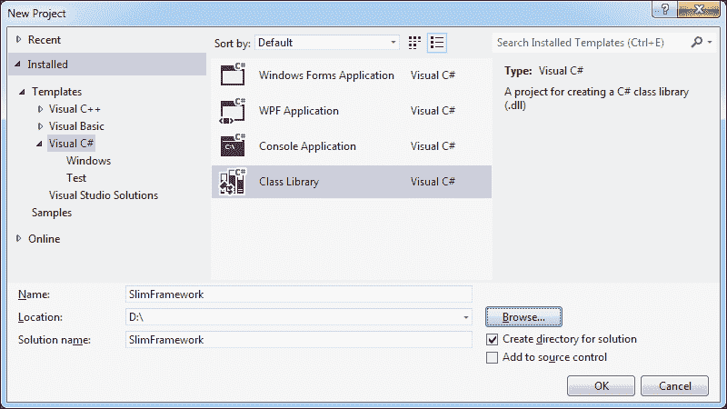
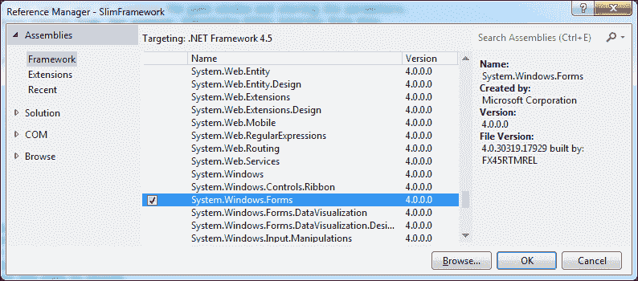
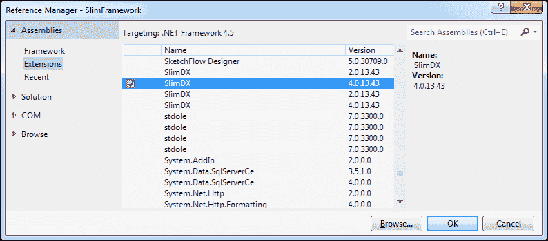
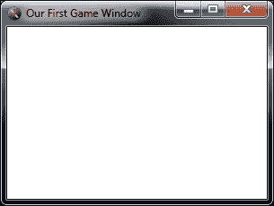

# 第一章。入门

所以也许您已经玩过 XNA Game Studio，并且已经知道它可以帮助您相对快速地开始一个小游戏。随着您对其越来越熟悉，您开始发现它的局限性。您更希望拥有 DirectX 的全部功能，在 C# 中使用，因为 C# 比使用 C++ 更容易工作。有没有一种替代 XNA 的方法可以提供这种功能？答案是肯定的。**SlimDX** 将在 C# 中为您提供这种功能。它还为您提供了使用不同版本的 DirectX 的能力。这意味着您可以使您的游戏支持多个 DirectX 版本，以便它们可以在更多计算机上运行，扩大您的潜在用户群。

在本章中，我们将涵盖以下主题：

+   设置 Visual Studio 2013 Express 和 SlimDX

+   创建我们的初始框架

+   GameWindow 类和 GameLoop 方法

+   测试我们的游戏窗口

# 设置 Visual Studio 2013 Express

我们将使用 Visual Studio 2013 Express，因为它可以从微软免费获得。

这里是设置 Visual Studio 2013 Express 的步骤：

1.  要下载 Visual Studio 2013 Express，您可以访问微软网站：[`www.visualstudio.com/downloads/download-visual-studio-vs`](http://www.visualstudio.com/downloads/download-visual-studio-vs)。

    该网站将显示所有可用的 Visual Studio Express 版本。

1.  您将必须选择 **Visual Studio Express 2013 for Windows Desktop**，因为我们专注于 PC 开发。点击它以展开页面上的部分，然后点击 **立即安装** 链接以开始下载安装程序（`wdexpress_full.exe`）。

1.  现在您已经下载了 Visual Studio 2013 Express 的安装程序，是时候安装它了。只需双击安装文件即可开始安装过程。

1.  当您启动 Visual Studio 2013 Express 时，您将得到一个窗口，要求您使用您的微软账户登录。这是您将用于登录您的 Hotmail 账户或您的 Xbox 360（如果您有的话）的账户。

1.  登录后，Visual Studio 2013 Express 将注册到您的微软账户。这是一个比以前更顺畅的过程。

# 设置 SlimDX

接下来，我们需要下载并安装 SlimDX。您可以从其官方网站获取 SlimDX：[`www.slimdx.org.`](http://www.slimdx.org.)

按照以下步骤设置 SlimDX：

1.  一旦您进入 SlimDX 网站，点击页面顶部的 **下载** 选项卡。这将带您进入下载页面。

1.  在撰写本文时，2012 年 1 月发布的 SlimDX 是最新版本。为了创建基于 SlimDX 的软件，我们需要获取 **SlimDX 开发者 SDK**。

1.  因此，转到页面标题为**开发者 SDK**的部分。这里有一段简短的段落和一个写着**安装开发者 SDK**的橙色按钮。如短段落所示，此 SDK 包含所有 SlimDX 二进制文件（编译后的 SlimDX 软件）、文档和示例。SDK 还支持 32 位和 64 位系统。单击**安装开发者 SDK**按钮。

1.  这将打开一个包含顶部链接到名为`SlimDX SDK (January 2012).msi`的文件的第二个网页。单击此链接开始下载 SlimDX 开发者 SDK。

1.  下载完成后，只需双击安装文件即可开始安装过程。安装程序完成后，点击**完成**按钮关闭它。我们现在可以开始编写我们的第一段代码了！

# 创建框架

为了让事情变得简单，我们将创建一个框架项目，该项目将包含我们在众多演示项目中将使用的代码。它将是一个类库，将包含我们的**引擎代码**。这是一种不特定于某个游戏的代码，而是设计成可以在多个游戏开发项目中重复使用的。如果这听起来很复杂，请不要担心。实际上，这非常容易做到。我们将使用**游戏代码**这个术语来指代特定于某个游戏的代码。

### 小贴士

您应该**始终**尽可能将您的引擎代码与您的游戏代码分开。这增加了引擎代码的可重用性，使您能够更容易地在多个游戏开发项目中使用它。这还可以在未来的项目中节省您大量时间，因为您不必每次都从头开始。

现在我们准备创建一个 Visual Studio 项目，用于存储我们的框架代码和资源：

1.  如果您还没有打开，请打开 Visual Studio Express。

1.  在**开始页面**的左侧单击**新建项目...**链接，或从**文件**菜单中选择**新建** **项目...**；无论哪种方式，您都会进入**新建项目**窗口。

1.  我们需要选择我们希望创建的项目类型。在这种情况下，我们首先需要在左侧列中的**Visual C#**类别上单击。屏幕将改变以显示窗口中心部分的 C#项目类型。

1.  现在选择窗口中间显示的**类库**。类库正是如此，一个类的库。尽管如此，它本身不能执行。

1.  在窗口底部的**名称**文本框中输入项目的名称。我们将把这个项目命名为`SlimFramework`。

1.  如果您还没有准备好，您需要在您的计算机上某个位置创建一个文件夹来存储您的作品。然后，在以下截图所示的窗口底部的**位置**文本框中指定该文件夹：

    新建项目窗口

1.  您可以单击**浏览**按钮打开文件夹浏览器窗口，您可以使用它来指定您想要保存到的文件夹。

1.  保持**为解决方案创建目录**复选框选中，这样 Visual Studio 将创建一个子文件夹来放置此项目。你的**新建项目**窗口应该看起来像之前的截图。

1.  点击**确定**按钮以创建`SlimFramework`项目。Visual Studio 将创建项目并显示`Class1.cs`文件。目前它只是一个空类。

要制作一个游戏，我们首先需要一个窗口来显示我们的游戏。因此，我们将通过创建一个简单的游戏窗口类来开始我们的框架。

按照以下简单步骤操作：

1.  在**解决方案资源管理器**窗格中选择`Class1.cs`文件。**解决方案资源管理器**窗格位于 Visual Studio 窗口的右上角，允许我们查看项目中的文件。

1.  如果它不在那里，你可以通过打开**视图**菜单并选择**解决方案资源管理器**来打开它。

1.  右键点击`Class1.cs`文件，将其重命名为`GameWindow.cs`。

1.  你可能会收到一个消息框询问你是否想要也将代码元素`Class1`的所有引用重命名。如果你点击**是**，它将替换代码中所有`Class1`的出现，以新的名称，这样你的代码就不会因为重命名了类而损坏。通常你需要点击**是**来完成这个操作。

1.  在我们开始创建这个类之前，我们需要向项目中添加一些引用。要完成这个操作，在**解决方案资源管理器**窗格中右键点击**引用**标题，并选择**添加引用...**

1.  **引用管理器**窗口将出现。当前选中的是**框架**类别，这是可以的，因为我们需要的两个引用都在这个类别中。

1.  滚动列表，直到找到**System.Windows.Forms**。会出现一个复选框用于高亮显示的扩展名。勾选此复选框，因为我们想添加对这个扩展名的引用。这在上面的截图中有展示：

    添加 System.Windows.Forms 引用

1.  现在，向上滚动以找到**System.Drawing**，并在其复选框中勾选。

1.  现在我们需要在左侧列中选择**扩展**类别。这将导致窗口中央的列表显示扩展。

1.  滚动直到你找到列表中的**SlimDX**。你会发现有两个版本。你必须选择版本 4，如以下截图所示：

    添加 SlimDX 引用

1.  点击**确定**按钮，Visual Studio 将为我们添加所有指定的项目引用。

如果你现在展开**解决方案资源管理器**窗格中的**引用**标题，你将看到**SlimDX**现在出现在我们项目使用的引用列表中，同样还有**System.Windows.Forms**和**System.Drawing**。现在我们已经添加了引用，我们将在项目中使用 SlimDX。

# GameWindow 类

`GameWindow` 类将提供基本的游戏窗口功能。它将提供我们希望在游戏窗口中拥有的所有基本属性，并且它将被用作基类。在这本书中，我们不会创建很多游戏窗口子类，但这里的想法是，你可以为不同类型的游戏窗口创建不同的子类。例如，你可以有一个用于 DirectX 10 的游戏窗口类，以及一个用于 DirectX 11 的游戏窗口类。

我们需要为 `GameWindow` 类实现的主要事情是一个构造函数来初始化它，**游戏循环**，`UpdateScene()` 和 `RenderScene()` 方法，以及当窗口关闭时的清理代码。游戏循环是一个本质上游戏引擎核心的方法。只要游戏在运行，它就会被反复调用。它每帧调用一次，以运行使我们的游戏世界中的一切发生代码。它调用 `UpdateScene()` 方法，该方法更新我们游戏世界中的对象。例如，此方法将调用物理系统来模拟我们游戏世界中移动对象的物理。

一旦 `UpdateScene()` 完成更新我们游戏世界中所有对象的州，游戏循环就会调用 `RenderScene()` 方法来绘制当前帧。所以最终，游戏循环是逐帧模拟和绘制游戏世界的。每次调用时，它都会模拟另一个帧。

电子游戏由帧组成，就像电影一样，只不过在电子游戏中，每个帧都是由计算机实时生成的。理想情况下，我们希望游戏至少以 30 FPS（每秒帧数）运行，以便视频流畅。如果帧率太低，游戏的视频会变得不连贯，或者更糟糕的是，游戏可能无法玩。让我们开始实现我们的 `GameWindow` 类。首先，我们需要在 `GameWindow.cs` 文件的开头添加一些 `using` 语句，以便我们可以使用由 SlimDX 和 .NET 框架定义的一些类：

```cpp
using System;
using System.Windows.Forms;
using System.Diagnostics;
using SlimDX;
using SlimDX.Windows;
```

### 提示

你可以从你购买的所有 Packt 书籍的账户中下载所有示例代码文件。[`www.packtpub.com`](http://www.packtpub.com)。如果你在其他地方购买了这本书，你可以访问 [`www.packtpub.com/support`](http://www.packtpub.com/support) 并注册以直接将文件通过电子邮件发送给你。

由于空间限制，本书中的一些地方没有显示所有代码。在这种情况下，我会做笔记，所以你需要下载这本书的代码来查看某些演示的完整代码。

接下来，我们将在 `GameWindow` 类的开始处创建一个成员变量部分。在其中，我们将定义所有用于存储有关游戏窗口信息的成员变量。以下是 `GameWindow` 类中完成的成员变量部分：

```cpp
private bool m_Isisposed = false;private bool m_IsInitialized = false;
private bool m_IsFullScreen = false;private bool m_IsPaused = false;
private RenderForm m_Form;private Color4 m_ClearColor;
private long m_CurrFrameTime;private long m_LastFrameTime;
private int m_FrameCount;private int m_FPS;
```

大多数内容都是相当直观的，但我还是想逐一过一遍，以防万一。

### 提示

本书提供的可下载代码已全部注释。我在这里移除了注释以节省空间并使页面看起来更整洁。

这里是我们成员变量及其用途的列表：

| 成员变量 | 目的 |
| --- | --- |
| `m_IsDisposed` | 简单地表示我们的游戏窗口是否已被销毁。 |
| `m_IsInitialized` | 表示我们的游戏窗口是否已经初始化。 |
| `m_IsFullScreen` | 表示游戏窗口是否以全屏模式运行。 |
| `m_IsPaused` | 当然，这表示游戏窗口是否已暂停。 |
| `m_Form` | 这保存了代表游戏窗口本身的 SlimDX `RenderForm`对象。 |
| `m_ClearColor` | 这简单地指定了在清除屏幕时使用的颜色。这基本上是我们绘制场景时开始时的背景颜色。 |
| `m_CurrFrameTime` | 保存我们开始处理当前帧时的刻度时间。 |
| `m_LastFrameTime` | 保存我们开始处理上一帧时的刻度时间。 |
| `m_FrameCount` | 仅在`GameLoop()`方法中的调试代码中使用。 |
| `m_FPS` | 保存游戏循环当前运行的 FPS（每秒帧数）。 |

现在我们已经创建了成员变量，我们需要创建一些**属性**来提供对那些需要从类外部访问的成员变量的访问。属性只是代表成员变量值的一对获取和设置方法。这些方法通常被称为**访问器方法**或**访问器**。我们刚刚创建的大多数变量都将有访问器，但这里没有足够的空间展示它们，所以我们只看第一个。

### 提示

查看可下载代码以查看其余的访问器方法。

这是`ClearColor`属性的代码：

```cpp
public Color4 ClearColor
{
  get
  {
    return m_ClearColor;
  }
  protected set
  {
    m_ClearColor = value;
  }
}
```

如您所见，`ClearColor`属性定义了`get`和`set`方法。`set`方法被声明为`protected`，这样这个属性就只能由这个类或其子类设置。

## 构造函数

现在我们需要为我们的`GameWindow`类设置一个构造函数。以下是代码：

```cpp
public GameWindow(string title, int width, int height, bool fullscreen)
{
  // Store parameters in member variables.
  m_IsFullScreen = fullscreen;
  m_ClearColor = new Color4(1.0f, 0.0f, 0.0f, 0.0f);
  // Create the game window that will display the game.
  m_Form = new RenderForm(title);
  m_Form.ClientSize = new System.Drawing.Size(width, height);
  // Hook up event handlers so we can receive events from the form
  m_Form.FormClosed += FormClosed;
}
```

代码的前两行只是将窗口的基本属性设置为构造函数中传入的值。下一行设置了默认颜色，即黑色。这意味着每次我们绘制新帧时，我们都从一个空白的黑色屏幕开始。颜色是一个**ARGB**（**Alpha，红色，绿色，蓝色**）值。如您所见，这一行将所有颜色通道的值设置为`0.0f`（除了 alpha），这给我们了黑色。alpha 的值为`1.0f`意味着颜色是不透明的，而值为`0.0f`将使其完全透明。值为`0.5f`将使颜色 50%透明。

接下来的两行创建了`RenderForm`对象，设置了其标题文本，并将其初始化为构造函数中传入的大小。`RenderForm`是 SlimDX 类，代表我们可以绘制其上的窗口。最后，最后一行简单地将`GameWindow`类订阅到`RenderForm`对象的`Closed`事件。这会导致当窗口关闭时，`GameWindow`类被通知。

现在我们已经有了构造函数，我们需要为刚刚订阅了`GameWindow`类的那个事件定义一个事件处理器。正如你可能猜到的，这个事件是在游戏窗口关闭时触发的（无论是用户关闭还是程序关闭）。以下是代码，如你所见，相当简短：

```cpp
public virtual void FormClosed(object o, FormClosedEventArgs e)
{
  if (!m_IsDisposed)
    Dispose();
}
```

`if`语句检查游戏窗口是否已经被释放。如果没有，它将调用`Dispose()`方法来释放它。

## `IDisposable`接口

目前，我们`GameWindow`类的声明表明它没有从任何其他类继承，也没有实现任何接口。我们将要改变这一点，因为我们将要实现`IDisposable`接口。这个接口非常小，实现它将很快。首先，我们需要编辑我们类的声明，使其表明它将实现这个接口。为此，只需将`GameWindow`类的开头从`public class GameWindow`更改为`public class GameWindow : IDisposable`。

这告诉编译器这个类实现了`IDisposable`接口。现在我们必须遵守这个接口。它有一个我们需要实现的方法。这个方法将在游戏窗口关闭时执行清理操作。目前这个函数里没有太多内容，但这里它是：

```cpp
protected virtual void Dispose(bool disposing)
{
  if (!this.m_IsDisposed)
  {
    if (disposing)
    {
      // Unregister eventsm_Form.FormClosed -= this.FormClosed;
      // get rid of managed resources here
    }
  // get rid of unmanaged resources here
  }
  m_IsDisposed = true;
}
```

`Dispose(bool)`方法被声明为受保护的，因为我们不希望它从`GameWindow`类外部被调用。相反，我们将创建第二个`Dispose()`方法，它是`public`的，没有参数。这样我们就可以通过调用这个公共方法来告诉对象我们已经完成了它，它将负责清理。`Dispose(bool)`方法首先检查游戏窗口是否已经被释放。如果没有，它将检查`disposing`参数是否设置为`true`。这个参数简单地指示游戏窗口是正在自行释放还是被**垃圾回收器**释放。

垃圾回收器是 C#等托管语言的一部分。当你的程序不再使用一个对象时，垃圾回收器将回收该对象占用的内存，以便它可以用于其他目的。这只会发生在程序不再有任何对该对象的引用时。然而，垃圾回收器并不保证立即回收该内存。

### 小贴士

你应该避免创建大量仅用于短时间内的对象。这可能会让垃圾回收器更加忙碌，你将付出以降低 FPS 或延迟波动的代价。

如果`disposing`参数设置为`true`，则`if`语句内的代码将注销事件并调用它所使用的任何托管对象的`Dispose()`方法。目前，它只注销了我们之前订阅的`Closed`事件。然后，`if`语句之后的代码清理它可能正在使用的任何非托管对象。由于我们只使用**托管**代码，所以我们将没有非托管对象。托管意味着大部分情况下内存管理是由我们自动处理的。

最后，在这个方法的末尾，将`m_IsDisposed`成员变量设置为`true`。这表示窗口已经被销毁，因此`RenderScene()`方法将知道它不应该再尝试渲染任何内容，因为这样做可能会导致程序崩溃。我们稍后会讨论`RenderScene()`方法，但首先我们需要完成`IDisposable`的处理。

现在我们必须实现公共的`Dispose()`方法，正如你可以在下面的代码片段中看到的那样，这是一个非常简短的方法：

```cpp
public void Dispose()
{
  Dispose(true);

  // Since this Dispose() method already cleaned up the resources 
    used
  // by this object, there's no need for the Garbage Collector to
    call
  // this class's Finalizer, so we tell it not to
  GC.SuppressFinalize(this);
}
```

这个方法调用`Dispose(bool)`方法来销毁游戏窗口。传递的值是`true`，因为此方法是`GameWindow`类的一部分，因此在这种情况下`GameWindow`类正在销毁自己。然后我们调用`GC.SuppressFinalize(this)`来告诉垃圾回收器此对象已经被销毁。你可能已经注意到我们没有在这个类中实现`Finalizer`。这是因为`Finalize()`方法用于清理对象中的非托管资源。它在垃圾回收器销毁对象之前自动调用。这允许它在被销毁之前清理其非托管资源。因此，我们不需要实现此方法，因为我们只使用托管代码。

# 游戏循环方法

现在我们需要创建我们的游戏循环。如前所述，游戏循环是代码的主要块，它会无限重复，直到我们关闭游戏。它调用处理和绘制每个帧的代码，因此它是游戏的核心。我们将创建一个新的`GameLoop()`方法，它将成为我们的游戏循环。以下是代码：

```cpp
public virtual void GameLoop()
{
  m_LastFrameTime = m_CurrFrameTime;
  m_CurrFrameTime = Stopwatch.GetTimestamp();

  UpdateScene((double) (m_CurrFrameTime - m_LastFrameTime) / Stopwatch.Frequency);

  RenderScene();

  // This code tracks our frame rate.
  m_nFPS = (int)(Stopwatch.Frequency / ( (float) (m_CurrFrameTime – m_LastFrameTime)));
}
```

在这个函数中，我们首先将`m_CurrFrameTime`的值复制到`m_LastFrameTime`。每次调用这个函数时，我们都在处理一个新的帧。这意味着`m_CurrFrameTime`中的值现在是上一个帧的时间。因此，我们将它复制到那个变量中。接下来，我们从高性能计时器获取当前时间，并通过`StopWatch`类将其存储在`m_CurrFrameTime`中。这个类使用高性能硬件计时器，如果可用。现在大多数 PC 都有这些计时器，所以这应该不会成问题。接下来，我们继续调用`UpdateScene()`和`RenderFrame()`方法。`UpdateScene()`方法目前只是一个空方法，如下面的代码片段所示：

```cpp
public virtual void UpdateScene(double frameTime)
{
}
```

最后，我们根据上一帧的持续时间计算我们的 FPS。我们只需将`StopWatch.Frequency`除以上一帧的持续时间。

`UpdateScene()`方法的参数是自上次调用`UpdateScene()`以来经过的时间量。我们通过从当前帧的时间减去上一帧的时间来计算这个值。然后我们除以`StopWatch.Frequency`将结果转换为秒。这是必要的，因为`StopWatch.GetTimeStamp()`函数返回当前时间的时间戳。本质上，它是在 Windows 上次启动以来系统计时器上经过的时间戳的总数。`StopWatch.Frequency`属性告诉我们系统计时器在一秒钟内进行多少次时间戳。这很重要，因为一台计算机的计时器可能比另一台计算机的计时器快或慢。现在`RenderScene()`方法也大多是空的，但它确实在其中有一个简单的`if`语句。以下是它的代码：

```cpp
public virtual void RenderScene()
{
  if ((!this.IsInitialized) || this.IsDisposed)
  {
    return;
  }
}
```

在`RenderScene()`方法中的`if`语句检查游戏窗口是否已准备好进行渲染。如果游戏窗口尚未初始化，或者如果游戏窗口已被销毁，那么我们只需从这个函数中返回。这很重要，因为它可以防止游戏窗口首次启动和关闭时可能发生的崩溃。

注意，`IsInitialized`和`IsDisposed`是我们之前讨论的成员变量属性中的两个。

现在我们几乎有了功能齐全的`GameWindow`类。但我们需要添加一个`StartGameLoop()`方法。这个方法被调用以启动游戏循环。它只包含以下几行代码：

```cpp
public void StartGameLoop()
{
  // If initialization is already finished, then simply return.
  if (m_IsInitialized)
    return;

  m_IsInitialized = true;

  // Start the message pump.
  MessagePump.Run(m_Form, GameLoop);
}
```

首先，这个函数检查游戏窗口是否已经初始化。如果是这样，那么我们只需从这个函数中返回。否则，我们将`m_IsInitialized`成员变量设置为`true`以表示它已经被初始化。这个函数本质上是我们游戏循环的初始化函数。最后，它调用`MessagePump.Run`，传入我们的`RenderForm`对象（即游戏窗口本身）和我们的`GameLoop()`函数。这将导致`GameLoop()`函数被反复调用，直到我们关闭游戏窗口。（`RenderForm`和`MessagePump`是 SlimDX 类。）

那么为什么我们需要`MessagePump`呢？在 Windows 中，应用程序接收消息，这些消息只是通知某个事件已经发生。例如，按键会产生按键消息。这些消息被发送到当前活动的任何窗口。然后该程序可以处理并响应这些消息。

在游戏中，我们希望有一个持续运行的循环来模拟和绘制每一帧，紧接着上一帧之后立即进行。尽管如此，我们仍然需要处理来自 Windows 的消息，否则我们的游戏窗口将无法正确工作。例如，如果我们只是让程序陷入循环，从不检查 Windows 消息，那么当你尝试关闭窗口时，由于程序永远不会处理关闭消息，所以将不会发生任何操作。因此，我们使用这个`MessagePump`类来在我们运行游戏循环的同时为我们处理 Windows 消息。

# 测试我们的游戏窗口

现在是我们测试游戏窗口的时候了！我们将向我们的解决方案中添加第二个项目。在`SlimFramework`解决方案仍然打开的情况下，打开**文件**菜单，并选择**新建项目...**。为新项目命名，例如，`Ch01`。确保将选定的项目类型更改为**Windows 窗体应用程序**。同样，确保窗口底部的**解决方案**下拉列表设置为**添加到解决方案**，否则 Visual Studio 将创建一个新的解决方案而不是将此项目添加到我们的现有解决方案中。如果此选项不存在，则它将把新项目添加到这个解决方案中。

单击**确定**，新项目将被创建并添加到我们的解决方案中。在**解决方案资源管理器**窗格中右键单击它，并选择**设置为启动项目**。通过这样做，我们已经告诉 Visual Studio，这是我们想要在告诉它运行我们的代码时启动的项目。

`SlimFramework`项目不能作为启动项目，因为它只是一个类库，因此不能独立执行。这是因为`类库`项目类型没有`Main`方法，就像`控制台应用程序`或`Windows 窗体应用程序`那样。`Main`方法是在程序启动时首先被调用的方法。因此，它是程序的起点。你还应该从这个新项目中删除`Form1.cs`文件，因为我们不需要它。

现在我们需要将我们的项目添加引用。在**解决方案资源管理器**窗格中，右键单击`Ch01`项目的**引用**标题。然后单击**添加引用...**。在**引用管理器**窗口中，选择**项目**类别。现在勾选`SlimFramework`项目旁边的复选框。单击**确定**，Visual Studio 将把`SlimFramework`项目的引用添加到`Ch01`项目中。我们现在可以在`Ch01`中使用`SlimFramework`项目中定义的类。

接下来，我们需要在我们的新`Ch01`项目中的`Main`方法中添加几行代码。以下是代码：

```cpp
static void Main(string[] args)
{
  Application.EnableVisualStyles();
  Application.SetCompatibleTextRenderingDefault(false);

  SlimFramework.GameWindow gameWindow = new SlimFramework.GameWindow("Our First Game Window", 640, 480, false);

  gameWindow.StartGameLoop();
}
```

这段代码相当简单。前两行是 Visual Studio 创建的。我移除了 Visual Studio 添加的第三行——它调用`Application.Run()`——因为我们不需要它。下一行简单地创建了一个新的`GameWindow`对象，并传入参数来指定窗口的标题、窗口的宽度和高度，最后是否要以全屏模式运行。在这种情况下，我们将窗口标题设置为`Our First Game Window`，窗口大小设置为`640x480`。最后，我们将最后一个参数的值设置为`false`，因为我们不想以全屏模式运行，因为我们还没有实现它。此方法中的最后一行代码调用`GameWindow`类的`StartGameLoop()`方法来启动游戏循环。`Main()`方法的参数只是一个`String`数组，它包含在应用程序启动时传入的任何命令行参数。如果你想要处理传入的命令行参数，你只需在某个地方添加代码即可。这就是你如何向你的游戏添加一些命令行开关的方法。

现在我们已经准备好编译和运行我们的代码了。为此，点击 Visual Studio 工具栏上的**启动**按钮。这个按钮旁边有一个绿色的三角形图标。以下截图显示了运行程序时我们的游戏窗口的样子。你可能还记得，我们将黑色设置为默认背景颜色，但这个窗口的背景并不是非常黑。这并不是一个错误，只是因为我们还没有绘制代码。

### 注意

当你尝试运行程序时，如果出现错误信息表明**无法直接启动具有类库输出类型的项目**，这意味着你忘记按照前面提到的将`Ch01`设置为启动项目了。

以下截图显示了我们的游戏窗口的实际运行情况：



游戏窗口的实际运行情况

现在看起来并不那么令人印象深刻，但不久我们就可以开始在屏幕上渲染一些图形了，这将使事情变得更加有趣。

# 摘要

在本章中，我们设置了 Visual Studio 和 SlimDX，使其准备就绪。我们创建了一个项目来工作，并构建了我们小型框架的起点。目前它只包含我们的`GameWindow`类，它为我们创建了一个游戏窗口，以便我们在上面绘制游戏。我们为`GameWindow`类提供了一个构造函数，并介绍了`GameLoop`函数。我们为它提供了`UpdateScene()`和`RenderScene()`方法，用于在每一帧更新和绘制我们的游戏世界。我们还介绍了接口，特别是`IDisposable`接口，并为游戏窗口提供了一个`ToggleFullscreen()`方法。最后，我们测试了我们的游戏窗口，并第一次看到了它的实际运行情况。在下一章中，我们将深入探讨用户输入以及如何响应用户的动作。
