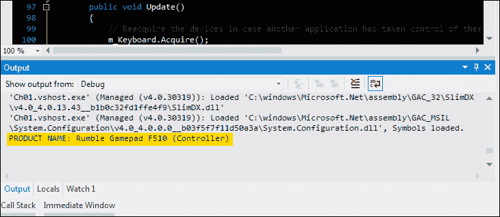
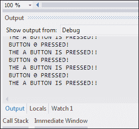

# 第二章. 响应玩家输入

游戏的本质是交互式的。它们可以响应用户输入，而电影每次播放都是完全相同的。因此，你需要一种方法来检测和响应用户通过鼠标、键盘或游戏手柄的输入。我们如何在游戏中实现这一点？我们可以使用两种选项来完成这项任务：**DirectInput**和**XInput**。

在本章中，我们将涵盖以下主题：

+   DirectInput 与 XInput 的比较

+   鼠标和键盘输入

+   使用 DirectInput 控制摇杆

+   使用 XInput 控制摇杆

# DirectInput 与 XInput 的比较

那么，我们应该选择这两个选项中的哪一个呢？答案是可能两者都要用。你可能会问，为什么两者都要用？原因是我们需要使用 DirectInput 来支持不支持 XInput 新特性的旧输入设备。**输入设备**是指用户用来向游戏提供输入的任何设备，例如鼠标、键盘、游戏手柄和方向盘。

我们本可以使用 DirectInput，但这种方法有一些局限性。DirectInput 可以处理 XInput 设备，但游戏手柄上的左右扳机按钮将被视为单个按钮。一个扳机被视为正方向，另一个被视为负方向。因此，这两个扳机被一起视为一个单轴。DirectInput 也不支持 XInput 振动效果，并且无法查询耳机设备。另一方面，我们也可以只使用 XInput，但这样，拥有较老 DirectInput 设备的玩家将无法使用它们来玩游戏。

为了支持这些新输入设备的特性，我们需要使用 XInput 和 DirectInput。这允许拥有 XInput 设备的玩家利用它们的新特性，同时允许使用较老 DirectInput 设备的用户仍然能够使用它们来玩游戏。玩家无疑会为此感到高兴。那么，DirectInput 和 XInput 之间真正的区别是什么？XInput 专门针对 Xbox 360 控制器和专门的 Xbox 360 控制器，如吉他。XInput 最多支持四个控制器，每个控制器最多有四个轴，10 个按钮，两个扳机和一个八方向数字垫。

XInput 仅真正支持**下一代**控制器，并且不支持键盘或鼠标类型设备。另一方面，DirectInput 适用于所有控制器，并支持最多八个轴和 128 个按钮的控制器。

因此，关于是否使用 DirectInput、XInput 或两者都使用的真正答案，实际上取决于你正在开发的游戏。只需注意，正如之前讨论的那样，如果我们要在 PC 游戏中支持 Xbox 360 及其类似控制器的某些功能，微软实际上强迫我们使用 XInput。

# 鼠标和键盘输入

尽管玩家可以使用游戏手柄和其他类型的控制器玩游戏，但在 PC 游戏开发中，鼠标和键盘输入仍然非常重要。例如，有些游戏有太多的命令，无法将它们全部映射到游戏手柄上。当我们将游戏中的动作分配给键盘、鼠标或游戏手柄上的特定按钮时，我们说我们已经将该动作映射到该特定按钮上。这也被称为绑定，因为我们实际上是将某个键或按钮绑定到特定的游戏动作上。

让我们先实现我们的鼠标和键盘输入。启动 Visual Studio 并打开上一章中我们工作的解决方案。我们将添加一个新类来处理我们的用户输入。在**解决方案资源管理器**窗格中右键单击`SlimFramework`项目，并添加一个名为`UserInput.cs`的新类。我们将使这个类实现`IDisposable`接口，就像我们在第一章中的`GameWindow.cs`类所做的那样。因此，我们需要将类声明从`public class UserInput`更改为`public class UserInput : IDisposable`。

我们还需要在类文件顶部添加两个`using`语句。一个用于 DirectInput，一个用于 XInput：

```cpp
using SlimDX.DirectInput;
using SlimDX.XInput;
```

现在，我们准备为我们的新用户输入类设置成员变量。我们将创建一个成员变量部分，就像我们在第一章中做的那样，*入门*。以下是代码：

```cpp
bool m_IsDisposed = false;
DirectInput m_DirectInput;

Keyboard m_Keyboard;
KeyboardState m_KeyboardStateCurrent;
KeyboardState m_KeyboardStateLast;

Mouse m_Mouse;
MouseState m_MouseStateCurrent;
MouseState m_MouseStateLast;
```

在这里，我们有几个成员变量。第一个是`m_IsDisposed`，它具有与我们创建在`GameWindow`类中的`m_IsDisposed`成员变量相同的目的。第二个变量`m_DirectInput`将存储我们的 DirectInput 对象。

接下来，我们有一组三个变量。第一个，`m_Keyboard`，存储键盘对象。接下来的两个变量跟踪键盘的当前和上一个状态。因此，`m_KeyboardStateCurrent`存储当前帧的键盘状态，而`m_KeyboardStateLast`存储上一个帧的键盘状态。为什么我们需要两者？例如，如果你想检测用户是否按下了某个键，而不仅仅是简单地按下它。

接下来，我们有一组三个非常相似的变量用于我们的鼠标对象和当前和上一个鼠标状态（`m_Mouse`、`m_MouseStateCurrent`和`m_MouseStateLast`）。

## 构造函数

现在，我们需要创建我们的构造函数来初始化我们的用户输入对象。以下是初始化的代码：

```cpp
public UserInput()
{
  InitDirectInput();

  m_KeyboardStateCurrent = new KeyboardState();
  m_KeyboardStateLast = new KeyboardState();

  m_MouseStateCurrent = new MouseState();
  m_MouseStateLast = new MouseState();

}
```

第一行调用 `InitDirectInput()` 方法为我们初始化 DirectInput。我们将在下一秒创建这个方法，但首先我们需要完成对 `UserInput()` 方法的查看。接下来的两行使用空的 `KeyboardState` 对象初始化我们的键盘状态变量。这是必要的，以防止程序在第一帧（当它们未初始化且因此为 null 时）尝试访问这些变量时发生崩溃。这种异常发生在程序尝试访问一个 null 变量时。毕竟，在使用对象之前，您必须先初始化它！

最后两行执行完全相同的事情，但这次是为了我们的鼠标状态变量。

## 初始化 DirectInput

现在构造函数已经完成，我们需要创建我们的 `InitDirectInput()` 方法。这是一个相当简短的方法，以下是代码：

```cpp
private void InitDirectInput()
{
  m_DirectInput = new DirectInput();

  // Create our keyboard and mouse devices.
  m_Keyboard = new Keyboard(m_DirectInput);
  m_Mouse = new Mouse(m_DirectInput);

}
```

目前，这个方法只有三行代码。第一行创建并初始化我们的 DirectInput 对象，并将其存储在我们的 `m_DirectInput` 成员变量中。第二行创建并初始化我们的键盘对象，并将其存储在我们的 `m_Keyboard` 成员变量中。第三行做同样的事情，但针对我们的鼠标对象，将其存储在我们的 `m_Mouse` 成员变量中。

这个方法之所以如此简短，归功于 SlimDX 的帮助。如果您用 C++ 编写相同的代码而不使用 SlimDX，它将会更长，也可能更晦涩。这是 SlimDX 成为一个优秀框架的原因之一。它在幕后为我们处理一些事情，同时仍然允许我们利用 DirectX 的全部功能。

## Update() 方法

现在，我们将向我们的用户输入类添加一个 `Update()` 方法。这个方法将在每一帧被调用一次，以获取最新的用户输入数据。我们将从 `GameWindow` 类的 `UpdateScene()` 方法中调用这个方法。以下是代码：

```cpp
public void Update()
{
  // Reacquire the devices in case another application has
  // taken control of them.
  m_Keyboard.Acquire();
  m_Mouse.Acquire();

  // Update our keyboard state variables.
  m_KeyboardStateLast = m_KeyboardStateCurrent;
  m_KeyboardStateCurrent = m_Keyboard.GetCurrentState();

  // Update our mouse state variables.
  m_MouseStateLast = m_MouseStateCurrent;
  m_MouseStateCurrent = m_Mouse.GetCurrentState();
}
```

前两行代码重新获取键盘和鼠标设备，以防自上一帧以来另一个应用程序已经控制了它们。我们必须获取鼠标和键盘设备，以便我们的程序可以访问它们。只要设备被获取，DirectInput 就会将其数据提供给我们的程序。然而，获取设备并不是永久的，这就是为什么我们在 `UpdateScene()` 方法的开头做这件事。这确保了在我们尝试在下一行代码中使用键盘和鼠标设备之前，我们已经可以访问这些设备。

那么，为什么需要这种获取机制呢？首先，DirectInput 需要一种方式来告诉我们的应用程序，如果系统中断了从设备的数据流，DirectInput 需要一种方式来告诉我们的应用程序，如果系统中断了从设备的数据流。例如，如果用户使用 *Alt* + *Tab* 切换到另一个应用程序窗口并使用该应用程序中的相同输入设备，就会发生这种情况。

第二个需要这个获取机制的原因是因为我们的程序可以改变设备的属性。DirectInput 要求我们在改变属性之前释放设备。这是通过调用它的 `Unacquire()` 方法来完成的。然后，在你完成属性更改后，你会重新获取它。这确保了在改变属性时设备没有被使用，因为这可能会引起严重问题。请注意，这里有一个例外，那就是你可以在获取设备时改变力反馈设备的增益。

回到我们的代码。接下来的两行更新了我们的键盘状态变量。首先，将上一帧的当前键盘状态从 `m_KeyboardStateCurrent` 成员变量复制到 `m_KeyboardStateLast` 成员变量中。然后，我们获取当前的键盘状态并将其存储在我们的 `m_KeyboardStateCurrent` 成员变量中。

最后两行与之前做的是同一件事，但这次是针对我们的鼠标状态成员变量。

## `IDisposable` 接口

如您从本章前面的内容中回忆起来，我们更改了 `UserInput` 类的声明，使其实现 `IDisposable` 接口。我们在 第一章 中介绍了这个接口，*入门*。

如您所记得，我们必须实现两个方法。`public void Dispose()` 方法与我们之前在 `GameWindow` 类中创建的方法相同。所以，这里不会展示它。另一方面，`protected void Dispose(bool)` 方法是不同的。以下是它的代码：

```cpp
protected virtual void Dispose(bool disposing)
{
  if (!this.m_IsDisposed)
  {
    if (disposing)
    {
      // Unregister events

      // get rid of managed resources here
      if (m_DirectInput != null)
      m_DirectInput.Dispose();

      if (m_Keyboard != null)
      m_Keyboard.Dispose();

      if (m_Mouse != null)
      m_Mouse.Dispose();
    }

    // get rid of unmanaged resources here

  }

  m_bDisposed = true;
}
```

如您所见，这个方法的内部结构与我们创建在 `GameWindow` 类中的结构相同。它里面也有相同的 `if` 语句。不同的是，这次我们没有要取消绑定的事件，并且在方法的托管资源部分添加了销毁我们的 DirectInput、键盘和鼠标对象的代码。

那么，为什么这些对象都在它们自己的小 `if` 语句内部被销毁呢？这样做的原因是为了防止如果这些对象中的任何一个由于某种原因而为空时可能发生的潜在崩溃。因此，我们检查对象是否为空。如果不是，那么我们就销毁它。对一个空对象调用 dispose 将会导致空引用异常。

现在，我们只需要向我们的用户输入类添加几个属性。它们都非常简单，只是提供了对我们成员变量的访问。以下是其中两个属性。查看本章的下载代码以查看所有属性。

```cpp
public bool IsDisposed
{
  get
  {
    return m_bDisposed;
  }
}

public Keyboard Keyboard
{
  get
  {
    return m_Keyboard;
  }
}
```

现在这个类已经完成，我们只需要修改我们的 `GameWindow` 类，使其现在可以使用它。

## 更新 `GameWindow` 类

现在我们需要做的第一件事是在 `GameWindow.cs` 文件的顶部添加一个 `using` 语句：

```cpp
using SlimDX.DirectInput;
```

这将允许我们使用 `Key` 枚举来指定我们想要检查的键。接下来，我们需要向我们的 `GameWindow` 类添加一个新的成员变量。这个变量将被命名为 `m_UserInput`，它将包含我们刚刚创建的新 `UserInput` 对象。这个成员变量的声明如下代码所示：

```cpp
private UserInput m_UserInput;
```

接下来，我们需要修改我们的构造函数以创建和初始化我们的用户输入对象。为了完成这个任务，我们只需在构造函数的末尾添加以下代码行，就在关闭的 `}` 之上：

```cpp
m_UserInput = new UserInput();
```

在我们的 `UserInput` 类中添加一些成员方法来简化我们对用户输入的处理是个好主意。所以，让我们创建一个新的方法，命名为 `IsKeyPressed()`，其代码如下：

```cpp
public bool IsKeyPressed(Key key)
{
  return m_KeyboardStateCurrent.IsPressed(key);
}
```

此方法检查指定的键是否被按下，如果按下则返回 `true`，如果没有按下则返回 `false`。从该方法中的代码可以看出，`KeyboardState` 对象具有 `IsPressed()` 方法，我们使用它来检查指定的键是否被按下。它还包含一个 `IsReleased()` 方法，用于测试键是否没有被按下。除此之外，它还有 `PressedKeys` 和 `ReleasedKeys` 属性，分别返回当前按下的键和当前未按下的键的列表。最后，它还有一个 `AllKeys` 属性，可以提供键盘上所有键的状态。

### 注意

本章提供的可下载代码包含一些额外的键盘处理方法，如这个方法。它们是 `IsKeyReleased()` 和 `IsKeyHeldDown()`。

在我们能够看到我们的键盘输入代码起作用之前，我们还需要做最后一步。我们需要在我们的 `UpdateScene()` 方法中添加一些代码来检查一些按键。这是 `UpdateScene()` 方法中的新代码：

```cpp
public virtual void UpdateScene(double frameTime)
{
  // Get the latest user input.
  m_UserInput.Update();

  if (m_UserInput.IsKeyPressed(Key.Return) &&
    (m_UserInput.IsKeyPressed(Key.LeftAlt) ||
    m_UserInput.IsKeyPressed(Key.RightAlt)))
  {
    // Toggle fullscreen mode.
    ToggleFullscreen();
  }
  else if (m_UserInput.IsKeyPressed(Key.Escape))
  {
    // Close the program.
    m_Form.Close();
  }
}
```

这段代码向我们的窗口添加了一些基本的键盘命令。第一个 `if` 语句检查用户是否同时按下 *Return* 键和左 *Alt* 键或右 *Alt* 键。如果是这种情况，那么 `if` 语句将调用 `ToggleFullscreen()` 方法。

`else if` 子句检查用户是否正在按下 *Esc* 键。如果是这样，那么我们将关闭游戏窗口，程序终止。

在我们可以测试运行程序之前，我们需要在 `GameWindow` 类的 `protected void Dispose(bool)` 方法中添加一行代码。我们需要在函数的资源管理部分添加以下代码行：

```cpp
m_UserInput.Dispose();
```

完成这些后，我们现在可以测试运行程序了。游戏窗口看起来与图 *The game window in action* 中的方式相同，该图位于 第一章，*入门*。然而，你现在可以通过按下 *Esc* 键来关闭它。

如果您同时按下*Enter* + *Alt*，目前不会有任何反应。正如前一章所述，我们无法切换全屏模式，因为我们还没有使用 DirectX 的图形 API。**应用程序编程接口**（**API**）简单地指代 API 提供的所有公共方法和类型。例如，SlimDX 是一个 API，DirectX 也是如此。

API 的较小部分有时也可以被视为独立的 API。例如，DirectX 的 DirectInput 本身就是 API。DirectX 更像是一个集合，包含针对不同目的的多个不同 API，SlimDX 也是如此。

如您所见，使用 SlimDX 实现键盘输入相当简单。虽然我们还没有真正使用过，但鼠标输入也同样简单。响应鼠标输入几乎与键盘输入相同。只需检查`MouseState`对象的`X`和`Y`属性，以找出鼠标光标的当前位置。`Z`属性允许您检测鼠标滚轮（如果有的话）的移动。如果您的鼠标没有滚轮，则此属性将简单地返回`0`。请注意，`Z`属性的值是一个增量，换句话说，它是自上次更新以来滚轮移动的量。最后，您可以使用`IsPressed()`和`IsReleased()`方法来检测指定的鼠标按钮是否被按下或释放。

注意，本章提供的可下载代码还包括添加到我们的`UserInput`类中的鼠标处理方法。这些方法包括`IsMouseButtonPressed()`、`IsMouseButtonReleased()`、`IsMouseButtonHeldDown()`、`MouseHasMoved()`和`MousePosition()`等。`IsMouseButtonHeld()`方法可以用来实现点击并拖拽的行为，而`HasMouseMoved()`方法在鼠标自上一帧以来有移动时返回`true`，否则返回`false`。

# 使用 DirectInput 的摇杆

现在，让我们换挡，看看如何使用**摇杆**。在这本书中，我们将使用摇杆一词来指代任何游戏控制器。首先，我们将探讨如何使用 DirectInput 与摇杆配合。

## 枚举设备

您可能见过一些游戏，如果您在 PC 上连接了多个游戏控制器，它们允许您选择想要使用的控制器。在本节中，我们将探讨如何获取可用设备的列表。使用 SlimDX，这实际上相当简单。

`DirectInput`对象（记住我们将其存储在`m_DirectInput`成员变量中）有一个名为`GetDevices()`的方法。要获取可用控制器的列表，我们可以像这样调用该方法：

```cpp
m_DirectInput.GetDevices(DeviceClass.GameController, DeviceEnumerationFlags.AttachedOnly);
```

为了尝试这个功能，让我们向我们的`UserInput.cs`类中添加一个新的方法。此方法将简单地输出有关可用设备的一些调试信息。以下是代码：

```cpp
public void GetJoysticks()
{
  IList<DeviceInstance> deviceList = m_DirectInput.GetDevices(DeviceClass.GameController, DeviceEnumerationFlags.AttachedOnly);
  if (deviceList.Count < 1)
  {
    System.Diagnostics.Debug.WriteLine("NO GAME CONTROLLERS WERE FOUND!");
  }
  else
  {
    foreach (DeviceInstance device in deviceList)
    {
      System.Diagnostics.Debug.WriteLine("PRODUCT NAME: " + device.ProductName);
    }
  }
}
```

首先，我们创建一个名为`deviceList`的变量，获取游戏控制器的列表，并将其存储在这个新变量中。对于`GetDevices()`方法的第一个参数，我们传入值`DeviceClass.GameController`来告诉它我们只对游戏控制器感兴趣。对于第二个参数，我们给它传入值`DeviceEnumerationFlags.AttachedOnly`，因为我们只想获取实际安装并连接到 PC 的设备。

接下来，我们有一个`if`语句，用于检查游戏控制器的列表是否为空。如果是这样，它将打印一条调试消息来通知你没有游戏控制器连接到你的计算机。在`if`语句的`else`子句中，我们有一个`foreach`循环，它遍历我们刚刚检索并存储在`deviceList`变量中的游戏控制器列表。在`foreach`循环内部，我们只有一行代码。这一行代码只是将一行调试输出写入 Visual Studio 的**输出**面板，针对列表中的每个游戏控制器。**输出**面板通常位于 Visual Studio 窗口的底部。如果你启用了自动隐藏，你可能需要点击窗口左下角的**输出**选项卡来显示它。你还可以通过转到**视图**菜单并选择**输出**来访问它。

默认情况下，Visual Studio 在运行你的程序时会自动显示**输出**面板，以便你可以看到你的程序的调试输出，如下面的截图所示。如果它没有显示**输出**面板，请参阅前面的段落了解如何访问它。

接下来，转到`InitDirectInput()`方法，并在函数末尾添加以下代码行：

```cpp
GetJoysticks();
```

这在构造函数的末尾调用我们的新`GetJoysticks()`方法。如果你现在运行此代码，你将在 Visual Studio 的**输出**面板中看到游戏控制器的列表。以下截图显示了在我的系统上看起来是什么样子，其中我有一个游戏控制器连接到计算机：



显示我们的调试输出的输出面板

### 注意

你从这个代码输出的结果很可能与我不同。所以，你可能会看到与我不同的控制器列表，因此你的输出可能会与前面截图中的输出不同。

# 从摇杆获取输入

这一切都很不错，但我们仍然无法从摇杆获取输入。所以，让我们现在看看这个问题。首先，我们需要为我们的摇杆添加三个成员变量，就像我们为鼠标和键盘所做的那样。以下是我们需要添加到`UserInput.cs`类中的三个新成员变量：

```cpp
Joystick m_Joystick1;
JoystickState m_Joy1StateCurrent;
JoystickState m_Joy1StateLast;
```

如前所述，我们有一个变量来保存我们的设备对象（在这种情况下，是一个`Joystick`对象），以及另外两个变量来保存当前帧和前一帧的摇杆状态。

现在，我们需要在构造函数的底部添加两行代码来初始化摇杆状态变量。正如本章前面所讨论的，这可以防止潜在的崩溃。在构造函数的末尾添加这两行代码：

```cpp
m_Joy1StateCurrent = new JoystickState();
m_Joy1StateLast = new JoystickState();
```

现在，让我们修改我们的`GetJoysticks()`方法。我们将简单地让它使用返回的控制器列表中的第一个摇杆。以下是`GetJoysticks()`方法的新代码：

```cpp
public void GetJoysticks()
{
  IList<DeviceInstance> deviceList = m_DirectInput.GetDevices(DeviceClass.GameController, DeviceEnumerationFlags.AttachedOnly);

  for (int i = 0; i < deviceList.Count; i++)
  {
    if (i == 0)
    {
      m_Joystick1 = new Joystick(m_DirectInput, deviceList[0].InstanceGuid);
      // Set the range to use for all of the axis on our game controller.
      m_Joystick1.Properties.SetRange(-1000, 1000);

    }
  }
}
```

如你所见，我们在`if`语句内部也添加了第二行代码。这设置了游戏控制器上每个轴的最小和最大可能值。在这种情况下，我们将其设置为`-1,000`和`1,000`。这意味着当摇杆完全向左时，其水平位置是`-1,000`。当它完全向右时，其水平位置是`1,000`。垂直轴也是如此。当摇杆居中时，其位置将是`(0,0)`。了解可能值的范围对于使我们的控制正确工作非常重要。你可以从`Joystick.Properties.LowerRange`和`Joystick.Properties.UpperRange`属性中获取范围。请注意，这些属性在某些情况下可能会抛出异常，这取决于你的游戏控制器驱动程序和 DirectX 版本。

现在，我们需要在我们的`Update()`方法中添加几行代码来获取最新的摇杆数据。为此，我们首先需要在方法的开头添加一行代码来获取摇杆。在没有获取摇杆之前，你不能使用设备（参见本章的*鼠标和键盘输入*部分，了解获取信息以及为什么我们需要这样做）。因此，我们将添加以下代码行来为我们获取摇杆：

```cpp
m_Joystick1.Acquire();
```

我们基本上是在通知系统我们现在希望使用摇杆并获取对它的访问权限。现在我们已经获取了对摇杆的访问权限，我们需要在`Update()`方法的末尾添加这两行代码：

```cpp
m_Joy1StateLast = m_Joy1StateCurrent;
m_Joy1StateCurrent = m_Joystick1.GetCurrentState();
```

正如我们对鼠标和键盘所做的那样，我们对`Joystick`对象也这样做。我们将`m_Joy1StateCurrent`成员变量的值复制到`m_Joy1StateLast`变量中，因为现在的状态数据已经是一帧之前的了。然后我们获取当前的摇杆状态并将其存储在`m_Joy1StateCurrent`成员变量中。

我们的用户输入类现在支持使用一个摇杆。你可以通过添加与第一个摇杆相同的变量和代码来支持更多摇杆。现在，让我们在`Update()`方法的末尾添加一些测试代码，以查看其效果：

```cpp
if (m_Joy1StateCurrent.IsPressed(0))
  System.Diagnostics.Debug.WriteLine("DIRECTINPUT: BUTTON 0 IS PRESSED!");
if (m_Joy1StateCurrent.IsPressed(1))
  System.Diagnostics.Debug.WriteLine("DIRECTINPUT: BUTTON 1 IS PRESSED!");
if (m_Joy1StateCurrent.IsPressed(2))
  System.Diagnostics.Debug.WriteLine("DIRECTINPUT: BUTTON 2 IS PRESSED!");
if (m_Joy1StateCurrent.IsPressed(3))
  System.Diagnostics.Debug.WriteLine("DIRECTINPUT: BUTTON 3 IS PRESSED!");
```

### 小贴士

如果你没有游戏控制器，那么你将看不到前面代码的任何输出。程序仍然会工作，但由于没有游戏控制器来获取它，所以不会有调试输出。

这段测试代码是一组简单的`if`语句。第一个`if`语句检查按钮`0`是否被按下。如果是，它将写入一行调试输出以显示它已经检测到按钮按下。第二个`if`语句检查按钮`1`是否被按下，如果是，则写入一条调试消息。最后两个`if`语句对按钮`2`和`3`做同样的处理。

那么，为什么我们在这里使用数字呢？原因是因为每个摇杆按钮都有一个索引，我们用它来引用它。例如，在我的游戏手柄上，按钮`0`是*A*按钮。

现在，我们需要在我们的`Dispose(bool)`方法中添加两行代码。它们将放在方法的管理资源部分。下面是它们：

```cpp
if (m_Joystick1 != null)
  m_Joystick1.Dispose();
```

这只是简单地检查`Joystick`对象是否为 null。如果不是，那么我们就销毁它。

运行程序并按下你的游戏控制器上的按钮。如果你按下按钮`0`、`1`、`2`或`3`，你将在 Visual Studio 的**输出**面板上看到一些新的调试输出行。当我们编写的这些按钮之一被按下时，其消息会多次出现。这是由于游戏循环运行的速率。现在它运行得超级快，因为它甚至不需要渲染任何图形或模拟任何东西！本章节的可下载代码添加了更多的`if`语句来覆盖比这里更多的按钮。它还有一些注释掉的行，用于显示左右摇杆的当前位置以及用于表示扳机的轴的位置（这些是可以稍微按下、完全按下或不按下的按钮，通常位于游戏手柄式控制器的手肩上）。

### 注意

你可以用检测用户按下拇指按钮的方式检测用户按下摇杆按钮，你只需要找出哪个索引代表每个拇指按钮。这通常不是一个问题，因为大多数游戏允许用户将游戏动作绑定到他们想要的任何按钮或轴。换句话说，你通常不应该在游戏中硬编码控制，因为它们可能对某些玩家不正确或不理想。

我们实际上只是刚刚触及了使用 DirectInput 摇杆的表面。花些时间探索我们存储在`m_Joystick1`成员变量中的`Joystick`对象的各种属性。你会发现还有很多我们没有在这里使用的其他属性。例如，`X`和`Y`属性通常会告诉你左摇杆正在做什么。`RotationX`和`RotationY`属性通常会告诉你右模拟摇杆的位置。摇杆有两个轴，正如你所见。如果摇杆完全没有移动，它就是居中的，因此它的位置读数将在两个轴的范围中心。如果你将摇杆推到最右边，它将在其水平轴上达到最大值。如果你将它完全向上推，它将在其垂直轴上达到最小值。

### 注意

如果你将摇杆推到最上方和最左侧，你可能会预期摇杆的位置是（0,0），但实际上并非如此。这是因为大多数摇杆都有一个圆形的运动范围，因此摇杆永远不会位于由其一对轴定义的运动范围的绝对左上角。

在大多数情况下，`Z`属性会给出代表游戏手柄式设备上的扳机按钮的轴的值。如果两个扳机都没有被按下，则该值位于范围中间。如果左扳机完全按下，`Z`属性将具有该轴的最大值，当然，如果右扳机完全按下，那么`Z`将具有该轴范围的最低值。这个范围可能不同，你也可以通过修改`Joystick`对象的`Properties`属性来修改类似的内容（记住，在改变其属性之前，你必须释放设备）。这个范围可能因控制器而异。

那么关于方向垫（通常简称为 D-Pad）呢？你如何处理它取决于控制器如何报告它。有些可能将 D-Pad 报告为普通按钮，在这种情况下，它将以与普通按钮相同的方式处理。其他控制器将 D-Pad 报告为 POV（视角）控制器。在这种情况下，你可以使用`JoystickState`对象的`GetPointOfViewControllers()`方法来访问它。它返回一个`int`数组。数组的第一个索引代表你的游戏控制器上的第一个 POV 控制器。数组第一个元素的值将根据你按的方向而变化。对于我来说，当我按下向上时，第一个元素的值是`0`，当我按下向右时是`9,000`，当我按下向下时是`18,000`，当我按下向左时是`27,000`在 D-Pad 上。

### 注意

这其中很多都可能因你所使用的游戏控制器类型以及 DirectInput 如何识别它而有所不同。因此，你可能需要在不同属性的`JoystickState`对象（记住我们将其存储在`m_Joy1StateCurrent`成员变量中）上尝试不同的设置，以找到你需要的内容。

随意尝试我们在`Update()`方法中刚刚添加的调试代码。实验是学习新事物的好方法。有时候，这比阅读大量枯燥的文档要快得多！在这里，我们不会全面介绍 DirectInput，因为那可能需要一本书的篇幅来涵盖。

本章提供的可下载代码为我们的`UserInput`类添加了一些实用的摇杆处理方法。包括`DI_LeftStickPosition()`、`DI_RightStickPosition`和`DI_TriggersAxis()`等。当然，**DI**是 DirectInput 的缩写。`TriggersAxis()`方法获取表示扳机的轴的当前值（前面已讨论）。摇杆方法获取摇杆的当前位置。对于我的摇杆，每个轴的范围是`0`到`65535`，每个摇杆当然有两个轴（水平和垂直）。当摇杆没有被按下时，它的位置将在水平和垂直轴的中心。

### 注意

这些方法可能不会与某些设备完全正常工作，因为不同的游戏控制器设置方式不同。但对于大多数游戏手柄式控制器，它应该可以正常工作。

### 提示

记住，你绝对不应该在游戏中硬编码控制。如果控制不正常或在他们特定的游戏控制器上不起作用，玩家会非常烦恼，并且发现他们无法更改它们，因为你在游戏中硬编码了控制。

# 使用 XInput 摇杆

再次强调，我们首先需要为我们的 XInput 设备添加一些成员变量。这次它们看起来有些不同，但它们就在这里：

```cpp
Controller m_Controller1;
Gamepad m_Controller1StateCurrent;
Gamepad m_Controller1StateLast;
```

在 XInput 中，我们使用`Controller`类来表示控制器。`Gamepad`结构存储控制器的状态。和之前一样，我们有一个变量来保存我们的设备，还有两个额外的变量来保存其当前和之前的状态。

现在，我们将添加一个非常简短的新方法，名为`InitXInput()`。以下是它的代码：

```cpp
private void InitXInput()
{
  m_Controller1 = new Controller(UserIndex.One);
}
```

这段代码为我们设置了一个 XInput 控制器以供使用。我们将其构造函数的值传递为`UserIndex.One`，以指示这个控制器将由玩家 1 使用。

我们需要修改我们用户输入类的构造函数，现在来调用这个新方法。我们还需要添加一些代码来初始化我们的 XInput 摇杆状态变量。如前所述，这是防止程序崩溃所必需的。以下是现在带有新代码高亮的构造函数看起来像什么：

```cpp
public UserInput()
{
  InitDirectInput();
 InitXInput();

  m_KeyboardStateCurrent = new KeyboardState();
  m_KeyboardStateLast = new KeyboardState();

  m_MouseStateCurrent = new MouseState();
  m_MouseStateLast = new MouseState();

  m_Joy1StateCurrent = new JoystickState();
  m_Joy1StateLast = new JoystickState();

 m_Controller1StateCurrent = new Gamepad();
 m_Controller1StateLast = new Gamepad();
}
```

现在，我们必须将以下代码添加到我们用户输入类的`Update()`方法末尾：

```cpp
m_Controller1StateLast = m_Controller1StateCurrent;
m_Controller1StateCurrent = m_Controller1.GetState().Gamepad;"
if (XI_IsButtonPressed(GamepadButtonFlags.A))
  System.Diagnostics.Debug.WriteLine("XINPUT: THE A BUTTON IS PRESSED!!");
if (XI_IsButtonPressed(GamepadButtonFlags.B))
  System.Diagnostics.Debug.WriteLine("XINPUT: THE B BUTTON IS PRESSED!!");
if (XI_IsButtonPressed(GamepadButtonFlags.X))
  System.Diagnostics.Debug.WriteLine("XINPUT: THE X BUTTON IS PRESSED!!");
if (XI_IsButtonPressed(GamepadButtonFlags.Y))
  System.Diagnostics.Debug.WriteLine("XINPUT: THE Y BUTTON IS PRESSED!!");
```

这段代码与我们之前的 DirectInput 摇杆测试代码非常相似。它将前一帧的状态数据复制到`m_Controller1StateLast`成员变量中，然后获取当前控制器状态并将其存储在`m_Controller1StateCurrent`变量中。

`if`语句就像我们用来测试 DirectInput 摇杆代码的那些一样。第一个检查*A*按钮是否被按下。如果是，它将在 Visual Studio 的**输出**面板中打印一条调试信息。第二个`if`语句对*B*按钮做同样的事情，最后两个`if`语句对*X*和*Y*按钮做相同处理。

你可能已经注意到，我们不需要在`Update()`方法的开头像处理 DirectInput 下的鼠标、键盘和摇杆那样*获取*XInput 控制器。相反，我们只是在我们的`InitXInput()`方法中设置了 XInput 控制器。你也可能注意到，我们不需要在我们的`Dispose(bool)`方法中添加代码来释放 XInput 控制器对象。它甚至没有`Dispose()`方法。

我们现在准备好测试我们的新代码了。你需要一个 XInput 兼容的控制器来测试它。如果你没有，这段代码仍然可以运行，但它不会做任何事情，因为没有 XInput 控制器可以从中获取输入。

如果你有一个支持 XInput 的控制器，你可能会看到这段代码的双重输出，因为 DirectInput 和 XInput 测试代码将同时向 Visual Studio 的**输出**窗格输出调试信息（如果它们都从同一个控制器读取输入），如下面的截图所示：



DirectInput 和 XInput 同时从同一设备读取输入

我们在这里只是触及了表面。XInput 还有更多我们尚未探讨的内容。例如，你可以通过访问左摇杆的`LeftThumbX`和`LeftThumbY`属性以及右摇杆的`RightThumbX`和`RightThumbY`属性来获取左右摇杆的状态。请注意，XInput 中摇杆轴值的范围始终是`-32,768`到`32,767`。

你也可能注意到，我们没有向用户输入类添加属性来提供对我们的摇杆对象的访问。它们将与我们在本章中添加的属性一样简单，所以它们已经被从章节中省略以节省空间。然而，它们确实包含在本章的可下载代码中。还包括了一组用于 XInput 设备的摇杆处理方法，包括`XI_LeftStickPosition()`、`XI_RightStickPosition()`、`XI_LeftTrigger()`和`XI_RightTrigger()`等。**XI**当然是指 XInput。请注意，对于左右扳机，它们的值在`0`到`255`之间，具体取决于你按下扳机的程度。此外，在 XInput 中，D-Pad 被视为常规按钮，因此你将在`GamepadButtonFlags`枚举中找到所有方向的按钮标志。这也适用于摇杆按钮。

探索 XInput `Controller`对象的各个属性，以了解更多你可以做什么。记住，我们将我们的`Controller`对象存储在`m_Controller1`成员变量中。尝试这段代码，看看你能发现什么。

注意，本章的可下载代码还包括一些额外的测试代码，用于在`UserInput`类的`Update()`方法中测试键盘和鼠标输入。这段代码与本章中显示的 DirectInput 和 XInput 的摇杆测试代码非常相似。

# 摘要

在本章中，我们快速学习了如何响应用户输入。首先，我们探讨了 DirectInput 和 XInput 之间的区别。然后，我们了解了如何检测和响应用户的鼠标和键盘输入。接下来，我们转向使用 DirectInput 与游戏手柄配合，首先我们学习了如何获取连接到计算机的可用游戏控制器的列表。为了简化，我们添加了代码来从列表中获取第一个游戏控制器并从中获取一些输入。我们编写了测试代码，当按下`0`、`1`、`2`或`3`按钮时，会输出一些调试文本。最后，我们探讨了 XInput 控制器。我们从 XInput 控制器获取输入所实现的代码与 DirectInput 代码非常相似，但略有不同。最后，我们添加了一些代码，每当你在 XInput 控制器上按下*A*、*B*、*X*或*Y*按钮时，都会将一些调试文本写入 Visual Studio 的**输出**面板。在下一章中，我们将学习如何在屏幕上绘制 2D 图形并创建一个基于 2D 瓦片的游戏世界。
