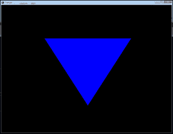
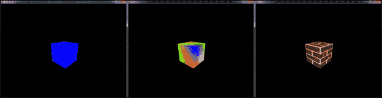

# 第五章. 渲染简单的 3D 图形

现在我们已经涵盖了用户输入、2D 图形和声音，让我们来看看 3D 图形。如今的大多数游戏都是 3D 的，可能是因为 3D 图形比 2D 图形更酷！这并不是说 2D 图形不好或过时。仍然有许多使用 2D 图形制作的游戏，但在 3D 中创建游戏实际上为游戏增加了另一个维度，使世界更具深度，使其更具探索性。

在本章中，我们将涵盖以下主题：

+   Direct3D 图形渲染管线

+   着色器

+   渲染三角形

+   带纹理的立方体渲染

# Direct3D 图形渲染管线

Direct3D 图形渲染管线将我们的几何数据转换为屏幕上的图形。它旨在为实时应用程序（如视频游戏）生成图形。该管线由多个阶段组成，我们的数据通过这些阶段生成当前帧的最终图像。其中一些阶段是可编程的，这为我们提供了更多的功能。让我们看看主要的管线阶段，它们是：

+   输入汇编器

+   顶点着色器

+   光栅化器

+   像素着色器

+   输出合并

## 输入汇编器

**输入汇编器**的主要目的是将我们的原始顶点数据（点、线或三角形）组装成原语，例如`PrimitiveType.TriangleList`，这些原语可以被图形渲染管线使用。这种原语类型告诉 Direct3D 我们的顶点数据是按照列表中的每个三个顶点构成一个三角形的顺序排列的。Direct3D 支持的所有原语类型都在`PrimitiveType`枚举中定义。

## 顶点着色器

**顶点着色器**阶段对从输入汇编器阶段输出的顶点数据进行逐顶点操作。这些操作包括变换、逐顶点光照、变形和蒙皮。

## 光栅化器

**光栅化器**阶段将之前阶段处理过的原语转换为像素，以生成渲染图像。它还执行顶点裁剪，这意味着如果三角形的一部分在屏幕外，它将裁剪掉这部分三角形，换句话说，因为它不需要被绘制。

## 像素着色器

图形管线中的**像素着色器**阶段执行着色技术，例如逐像素光照或后期处理内容。光栅化器为它正在处理的当前原语中的每个像素调用像素着色器阶段。

## 输出合并

**输出合并器**通过结合众多因素生成最终的像素颜色，包括图形管线的当前状态、像素着色器阶段生成的数据以及渲染目标的内容，以及稍后在本章中将要讨论的深度/模板缓冲区。

这只是一个对 Direct3D 图形管道的简要概述。除了这些阶段之外，管道中还有其他阶段，但我们不会使用它们。要深入了解图形管道，请查看微软的文档：[`msdn.microsoft.com/en-us/library/windows/desktop/ff476882(v=vs.85).aspx`](http://msdn.microsoft.com/en-us/library/windows/desktop/ff476882(v=vs.85).aspx)。

# 着色器

如上图所示，**着色器**是 3D 图形编程的一个相当重要的部分。那么，着色器究竟是什么呢？着色器是我们为 Direct3D 图形管道的可编程阶段编写的小程序。我们之前查看的两个阶段是可编程的：顶点着色器阶段和像素着色器阶段。然而，图形管道中并不仅限于这些可编程阶段。

着色器有一个被称为**着色器签名**的东西。着色器的签名只是该着色器的输入和/或输出参数的列表。

在本章中，我们将创建两个演示。每个演示都将有自己的着色器文件，命名为`Effects.fx`。这是一个包含我们着色器代码的文本文件。着色器是用**HLSL**（**高级着色器语言**）编写的。本章的可下载代码包括两个演示项目的`Effects.fx`文件（它们**不相同**）。

要了解更多关于着色器和 HLSL 的信息，请查看微软网站上的 HLSL 编程指南：[`msdn.microsoft.com/en-us/library/windows/desktop/bb509635(v=vs.85).aspx`](http://msdn.microsoft.com/en-us/library/windows/desktop/bb509635(v=vs.85).aspx)。

# 渲染三角形

在本节中，我们将设置一个基本的 Direct3D 应用程序，并在屏幕上渲染一个简单的三角形。我们首先将创建一个名为`Triangle`的新项目。在这个项目中，我们首先将创建一个名为`TriangleGameWindow.cs`的新类。我们需要让它继承我们的`GameWindow`基类并实现`IDisposable`，当然。

### 注意

您需要获取本书的可下载代码来完成本章，特别是我们将在本章中创建的第二个演示。

现在我们有了一个新的游戏窗口类，下一步要做的就是将 Direct3D 设置好并准备好。我们首先需要在文件顶部添加一些`using`语句。这些语句允许我们在代码中使用 Direct3D。以下是我们需要的新语句：

```cpp
using SlimDX.D3DCompiler;
using SlimDX.Direct3D11;
using SlimDX.DirectInput;
using SlimDX.DXGI
using SlimDX;
```

接下来，我们需要创建我们的成员变量。它们如下：

```cpp
SlimDX.Direct3D11.Device m_Device;
SlimDX.Direct3D11.DeviceContext m_DeviceContext;
RenderTargetView m_RenderTargetView;
SwapChain m_SwapChain;
Viewport m_Viewport;

InputLayout m_InputLayout;

VertexShader m_VertexShader;
ShaderSignature m_VShaderSignature;
PixelShader m_PixelShader;

SlimDX.Direct3D11.Buffer m_VertexBuffer;
```

`m_Device`变量将保存我们的 Direct3D 设备对象。`m_DeviceContext`变量只是一个方便的变量，它为我们保存设备上下文。这缩短了一些代码行，因为我们不需要通过`m_Device`来访问它。

`m_RenderTargetView`变量将保存我们的`RenderTargetView`对象，这与我们在第三章中使用的`RenderTarget`对象类似，*渲染 2D 图形*。这基本上是我们的 Direct3D 渲染目标。

`m_SwapChain`变量将保存我们的**交换链**。交换链只是一系列缓冲区。记住，缓冲区只是内存中用于存储数据的一个区域。最简单的交换链将有两个缓冲区，它们保存着程序绘制的图形。每次我们绘制一个新帧时，缓冲区就会交换，因此包含我们新帧的缓冲区就会在屏幕上可见。我们绘制到的缓冲区被称为**后缓冲区**，因为它在幕后，所以当我们在绘制下一个帧时，玩家看不到它。当前显示在屏幕上的缓冲区被称为**前缓冲区**。当缓冲区交换时，后缓冲区成为新的前缓冲区，反之亦然。

起初，这可能会感觉像是一种内存浪费。为什么不直接绘制到当前显示在屏幕上的缓冲区，这样我们就可以有一个缓冲区而不是两个？这样做的原因是，这样可能会引起一些闪烁。这是因为玩家可能会看到东西在屏幕上被绘制出来。所以，我们而是在离屏缓冲区中绘制，直到帧完全绘制完成。然后，我们交换缓冲区，使新帧一次性出现在屏幕上。这使得动画更加平滑。这种渲染技术被称为**双缓冲**。你还可以在后台缓冲区和前台缓冲区之间添加更多的缓冲区。如果你在它们之间添加一个额外的缓冲区，你将进行**三缓冲**，这实际上比双缓冲提供了速度提升。

回到我们的成员变量；下一个是`m_Viewport`。视口简单地指定了我们想要绘制在渲染目标上的区域。它还指定了最小和最大深度值。这些通常设置为`0.0f`和`1.0f`。

下一个成员变量是`m_InputLayout`。`InputLayout`对象告诉 Direct3D 我们正在使用的顶点格式和着色器模型。记住，着色器基本上只是一个由显卡运行的小程序。

`m_VertexShader`变量将保存我们的顶点着色器。`m_VShaderSignature`变量保存顶点着色器的签名。着色器签名只是一个参数列表，这些参数被输入到或从着色器输出。最后，`m_PixelShader`将保存我们的像素着色器。我们将在本章稍后讨论着色器。

如果你没有完全理解所有这些成员变量，那没关系。一旦我们开始使用它们，它们应该会变得稍微清晰一些。我们现在需要初始化 Direct3D，所以让我们开始吧。

## 初始化 Direct3D

我们现在准备初始化 Direct3D。为此任务，我们将创建一个新的方法，命名为`InitD3D()`。以下是这个方法的代码：

```cpp
public void InitD3D()
{
    // Setup the configuration for the SwapChain.
    var swapChainDesc = new SwapChainDescription()
    {
        BufferCount = 2, // 2 back buffers (Triple Buffering)
        Usage = Usage.RenderTargetOutput,
        OutputHandle = FormObject.Handle,

        IsWindowed = true,
        ModeDescription = new ModeDescription(FormObject.Width,
          FormObject.Height,new Rational(60, 1),Format.R8G8B8A8_UNorm),
        SampleDescription = new SampleDescription(1, 0),
        Flags = SwapChainFlags.AllowModeSwitch,
        SwapEffect = SwapEffect.Discard
    };

    // Create the SwapChain

    SlimDX.Direct3D11.Device.CreateWithSwapChain(
      DriverType.Hardware,
      DeviceCreationFlags.Debug,
      new FeatureLevel[] { FeatureLevel.Level_11_0 },
      swapChainDesc,
      out m_Device,

out m_SwapChain);

    // create a view of our render target, which is the backbuffer of the swap chain we just created
    using (var resource =SlimDX.Direct3D11.Resource.FromSwapChain<Texture2D>(m_SwapChain, 0))
    {
        m_RenderTargetView = new RenderTargetView(m_Device,resource);
    }

    // Get the device context and store it in our m_DeviceContext member variable.
    m_DeviceContext = m_Device.ImmediateContext;

    // Setting a viewport is required if you want to actually see anything
    m_Viewport = new Viewport(0.0f,0.0f,m_Form.Width,m_Form.Height,0.0f,1.0f);

    m_DeviceContext.Rasterizer.SetViewports(m_Viewport);
    m_DeviceContext.OutputMerger.SetTargets(m_RenderTargetView);

    // Prevent DXGI handling of Alt+Enter since it does not work properly with Winforms
    using (var factory = m_SwapChain.GetParent<Factory>())
    {
        factory.SetWindowAssociation(m_Form.Handle,
             WindowAssociationFlags.IgnoreAltEnter);
    }
}
```

正如你所见，在这个方法中我们首先做的事情是创建 `SwapChainDescription` 来配置我们即将创建的交换链。我们在这里使用初始化器语法，这是一种方便的方式，让我们在创建结构体时设置其属性的值。你可以通过在创建新对象的行之后打开花括号块，并在花括号块内设置其属性的值来使用结构体、数组和列表的初始化器语法。

`BufferCount` 属性指定了我们希望在交换链中拥有的缓冲区数量，除了前缓冲区。你不应该使用超过四个缓冲区，因为过多的缓冲区会导致性能下降。在窗口模式下，桌面被用作前缓冲区，但在全屏模式下，交换链中需要一个专用的前缓冲区。`Usage` 属性指定了我们打算如何使用我们的交换链表面。术语 **surface** 指的是我们将要绘制的缓冲区，因此交换链的表面只是其中的缓冲区。对于 `OutputHandle` 属性，我们将它设置为游戏窗口的句柄，以告诉它我们将要在哪个窗口中显示我们的图形。`IsWindowed` 属性确定我们是否希望以窗口模式启动程序。请记住，我们还没有实现全屏模式。

接下来，我们有 `ModeDescription` 属性，它指定了我们想要使用的视频模式。`ModeDescription` 对象的前两个参数是高度和宽度。换句话说，它们是我们想要使用的屏幕分辨率。第三个参数是一个分数，表示刷新率，这里我们将其设置为 *60/1*，这意味着每秒刷新 60 次。最后，我们有格式参数。这告诉它像素格式，正如你所见，我们将其设置为 `Format.R8G8B8A8_UNorm`。这意味着我们为每个四个颜色通道（红色、绿色、蓝色和 alpha）分配了 8 位。格式名称中的 `UNorm` 部分表示颜色通道的值是无符号、归一化的整数（归一化意味着它们在 `0.0`-`1.0` 范围内）。一个 **无符号整数** 类似于一个正常的 `integer` 变量，但它不支持负数。这使得无符号整数可以存储比相同大小的正常整数变量更大的值。无符号整数的对立面是 **有符号整数** 变量，它必须使用其可能值的一半来表示负数。

我们在`SwapChainDescription`对象上设置的下一个属性是`SampleDescription`属性。为此，我们创建一个新的采样描述对象，并给它两个参数：第一个参数是每像素的多采样次数，第二个参数是质量级别。质量级别的有效范围是`0`到 Direct3D 设备对象的`CheckMultisampleQualityLevel()`方法返回的级别减一（记住设备存储在我们的`m_Device`成员变量中）。当然，质量级别越高，执行成本越高。在这里，我们将计数设置为`1`，质量设置为`0`。这是没有抗锯齿的默认采样器状态。请注意，我们还可以使用一些标准值来设置我们的多采样级别，这些值定义在`Direct3D11.StandardMultisamplQualityLevel`枚举中。

### 注意

如果你的 PC 无法使用 Direct3D 11，你可以将本章中的代码更改为使用 Direct3D 10。代码应该几乎相同，因为 Direct3D 11 实际上是 Direct3D 10 的扩展，我们没有使用 Direct3D 11 带来的任何高级功能或新特性。只需确保将所有 Direct3D 11 命名空间的对象更改为 Direct3D 10 命名空间中的对应对象。

你可能会注意到，也存在 Direct3D 11.1。我们不使用它，因为它只是 Windows 8 版本的 Direct3D 11，并且你只能在 Windows 8 上使用它。

那么，什么是**多采样**和**抗锯齿**呢？抗锯齿实际上是多采样的一种效果，它通过平滑物体的锯齿边缘，使得它们在屏幕上不再显得锯齿状。这种锯齿状是由屏幕上的像素不是无限小的事实造成的，因此你有时会在屏幕上物体的边缘看到类似阶梯的图案。多采样涉及查看相邻像素的颜色并将它们以某种方式混合在一起，以在屏幕上软化边缘并消除由走样引起的其他图形伪影，例如摩尔纹。你可以在维基百科上查找摩尔纹：[`en.wikipedia.org/wiki/Moir%C3%A9_pattern`](http://en.wikipedia.org/wiki/Moir%C3%A9_pattern)。

我们在`SwapChainDescription`对象上设置的下一个属性是`Flags`属性。此属性允许我们设置影响我们的交换链行为的各种标志。在这种情况下，我们将它设置为`SwapChainFlags.AllowModeSwitch`标志，这允许我们通过调用其`ResizeTarget()`方法来切换交换链的屏幕模式。

我们在`SwapChainDescription`对象上设置的最后一个属性是`SwapEffect`属性。这设置了处理屏幕上已显示的后缓冲区内容的方式的选项。我们将此设置为`SwapEffect.Discard`。就这样，我们完成了`SwapChainDescription`对象的设置。

现在，我们已经准备好创建我们的交换链和 Direct3D 设备。这两者都通过下一行代码完成，该代码调用 `SlimDX.Direct3D11.Device` 类的静态成员方法；该方法就是 `CreateWithSwapChain()` 方法。正如你所见，有六个参数。第一个参数指定了驱动类型。在这种情况下，我们将其设置为 `DriverType.Hardware`，因为我们想要如果可用的话硬件加速。第二个参数是设备创建标志。在这种情况下，我们使用了 `DeviceCreationFlags.Debug`，这会创建一个支持调试层的 Direct3D 设备。当然，在你发布游戏之前，你会将其更改为其他设置，因为调试代码会减慢游戏速度并损害性能。

第三个参数指定了功能级别。在这种情况下，我们只使用了 `FeatureLevel.Level_11_0`，这意味着我们想要 Direct3D 11 的功能。由于这个参数是一个数组，当然，如果你的程序需要支持更多级别，你可以提供多个功能级别。

第四个参数是我们的 `SwapChainDescription` 对象，最后两个参数以 `out` 关键字开头。这意味着它们实际上是函数的输出，换句话说，我们传递的变量被函数修改以返回数据。在这种情况下，第五个参数是我们的 `m_Device` 成员变量，第六个参数是我们的 `m_SwapChain` 变量。所以这个函数创建了 Direct3D 设备并将其存储在我们传递到第五个参数的变量中。它还创建了交换链，并将其存储在我们传递到第六个参数的变量中。

接下来，我们需要创建我们的渲染目标。正如你所见，下一行代码是一个 `using` 块，它使用 `Resource` 类的静态方法 `FromSwapChain()` 创建了一个 `SlimDX.Direct3D11.Resource` 对象。这一行中的 `<Texture2D>` 部分表示这个函数是 **泛型** 的。一个泛型方法是在调用它时允许你指定数据类型的方法。换句话说，它是一个能够作用于多种数据类型的函数，而普通函数则不能。在这种情况下，我们指定了 `Direct3D11.Texture2D` 的数据类型。一个 `Texture2D` 对象代表一个图像。`FromSwapChain()` 方法接受两个参数。第一个参数是我们想要从中创建资源的交换链，第二个参数是那个交换链中一个缓冲区的索引。

然后，在这个 `using` 语句内部，我们有一行代码创建我们的 `RenderTargetView` 对象。这个对象本质上就是我们的渲染目标。正如你所见，当我们创建 `RenderTargetView` 对象时，我们传递了两个参数。第一个参数是我们的 Direct3D 设备，第二个参数是我们刚刚创建的资源。

下一行代码将 Direct3D 设备上下文存储到我们的 `m_DeviceContext` 成员变量中。请记住，这个变量只是为了方便。使用它允许我们缩短一些代码行。设备上下文是通过 Direct3D 设备对象的 `ImmediateContext` 属性访问的。

接下来，我们创建我们的视口。`ViewPort` 对象指定了我们想要绘制到交换链缓冲区的区域，以及最小和最大的深度值。当我们创建 `Viewport` 对象时，我们传递的前两个参数是我们想要绘制的矩形区域的 x 和 y 位置。第三个和第四个参数是该区域的宽度和高度。正如你所见，我们指定了想要使用整个窗口进行绘制。最后两个参数是最小和最大的深度值，通常分别设置为 `0.0f` 和 `1.0f`。这些指定了绘制深度范围的大小。将它们设置为 `0.0f` 和 `1.0f` 告诉它绘制场景的整个深度范围。你可以将它们都设置为 `0.0f` 来绘制所有对象到前景，或者将它们都设置为 `1.0f` 来绘制所有对象到背景。

如你所见，接下来是两行代码。第一行将我们刚刚创建的 `Viewport` 设置到 **光栅化器** 上。请记住，光栅化器是 Direct3D 图形处理管道中的一个阶段。它裁剪原语，为像素着色器（管道中的另一个阶段）做准备，并确定如何调用这些像素着色器。

这里第二行代码将我们的 `RenderTargetView` 设置到输出合并器（请记住，输出合并器是图形管道的一个阶段）。

我们终于到达了 `InitD3D()` 方法中的最后一部分代码。这是一个 `using` 块，这次获取一个 `Factory` 对象。然后它调用这个对象的 `SetWindowAssociation()` 方法。这个方法接受两个参数：第一个是我们游戏窗口的句柄，第二个是我们想要使用的窗口关联标志。在这种情况下，我们使用的是 `WindowAssociationFlags.IgnoreAltEnter` 标志。我们为什么要这样做呢？答案是防止 **DXGI** 处理 *Alt* + *Enter*，因为它与 WinForms 不兼容。请记住，DXGI 是我们在开始这个项目时通过 `using` 语句包含的命名空间之一。DXGI 是 DirectX Graphics Infrastructure 的缩写。我们稍后会自己处理 *Alt* + *Enter* 键盘快捷键。它将切换我们程序的全屏模式。

完成这些后，我们需要创建另外两个初始化函数：一个用于初始化我们的着色器，另一个用于初始化我们的几何形状（即我们要绘制的三角形）。

## 初始化着色器

我们将创建一个名为 `InitShaders()` 的新方法来初始化我们的着色器。在这个演示中，我们将设置一个顶点着色器和像素着色器。以下是这个方法的代码：

```cpp
public void InitShaders()
{
    // Load and compile the vertex shader
    string vsCompileError = "Vertex Shader Compile Error!!!";
    using (var bytecode =ShaderBytecode.CompileFromFile("Effects.fx","Vertex_Shader","vs_4_0",ShaderFlags.Debug,SlimDX.D3DCompiler.EffectFlags.None,null,null,out vsCompileError))

    {
        m_VShaderSignature = ShaderSignature.GetInputSignature(bytecode);
        m_VertexShader = new VertexShader(m_Device, bytecode);
    }

    // Load and compile the pixel shader
    string psCompileError = "Pixel Shader Compile Error!!!";
    using (var bytecode =ShaderBytecode.CompileFromFile("Effects.fx","Pixel_Shader","ps_4_0",ShaderFlags.Debug,SlimDX.D3DCompiler.EffectFlags.None,null,null,out psCompileError))
    {
        m_PixelShader = new PixelShader(m_Device, bytecode);
    }
}
```

你可以看到这个函数包含了两块相当相似的代码块。第一个初始化我们的顶点着色器。可下载的代码中包含一个名为 `Effects.fx` 的文件，它只是一个包含我们基本着色器代码的文本文件。

第一行创建了一个名为 `vsCompileError` 的字符串变量。这个变量将接收下一行代码引发的任何错误。正如你所见，它是一个 `using` 块，调用 `ShaderBytecode.CompileFromFile()` 方法来编译我们的顶点着色器。返回的字节码是我们顶点着色器的编译形式。`CreateFromFile()` 方法接受一些参数，并且有几个重载版本。重载方法是与相同功能具有不同参数列表的另一个版本。

`CompileFromFile()` 方法的第一个参数是要编译的着色器代码的文件。第二个参数是包含此着色器代码的着色器文件中的方法名称。第三个参数是着色器模型。在这种情况下，我们使用了 `"vs_4_0"`，这告诉它我们想要使用着色器模型 4。第四个参数是我们使用的着色器标志。在这里我们使用了 `ShaderFlags.Debug`。同样，当你完成游戏时，你可能想要移除这个标志，因为调试代码会降低性能。接下来的两个参数是定义在着色器编译期间的着色器宏列表和处理 `include` 文件的接口。这两个参数设置为 `null`，因为它们超出了本章的范围。最后一个参数是我们上面 `using` 块中创建的 `psCompileError` 变量。如果有任何错误，它们将被放入这个变量中。

在这个 `using` 块内部，我们有两行代码。第一行获取这个着色器的签名。记住，着色器的签名只是该着色器输入和/或输出参数的列表。第二行代码创建一个 `VertexShader` 对象来保存我们的顶点着色器，并将其存储在我们的 `m_VertexShader` 变量中。

我们 `InitShaders()` 方法中的第二个代码块与第一个非常相似。它执行与顶点着色器相同的功能，但针对的是像素着色器。它编译我们的像素着色器并将其存储在我们的 `m_PixelShader` 成员变量中。你可能已经注意到，它使用了与该方法顶部顶点着色器代码相同的着色器文件。你可以在单个文件中定义多个着色器，我们在这里这样做是为了简化。

### 注意

记住，顶点着色器是 Direct3D 图形管线中的阶段之一，像素着色器也是如此。

此方法中的最后两行代码告诉图形处理管线使用我们的顶点着色器和像素着色器。那么为什么我们还需要着色器呢？原因是 Direct3D 图形管线中的某些阶段是可编程的。着色器是我们为这些阶段编写的程序，因此着色器本质上是一个小程序，它告诉 Direct3D 在管线中的该阶段要做什么。除了顶点和像素着色器之外，还有更多类型的着色器，但它们超出了本书的范围。着色器是一个强大的工具，它允许我们自定义图形处理管线，因此我们可以做一些我们可能无法做到的事情。您可以有多个给定类型的着色器，并且可以随意在它们之间切换（我们将在本章制作的第二个演示中实际这样做），因此您不会卡在您设置的第一个着色器上。到目前为止，我们已经准备好初始化我们的场景。

## 初始化场景

在 3D 图形中，术语**场景**的使用方式与电影中的使用方式大致相同。然而，在这种情况下，术语场景指的是我们正在渲染的世界或 3D 场景。为了初始化我们的场景，我们将创建一个名为`InitScene()`的初始化方法。此方法的代码如下：

```cpp
public void InitScene()
{
    // Create the vertices of our triangle.
    Vector3[] vertexData =
    {
        new Vector3(-0.5f,  0.5f,  0.5f),
        new Vector3( 0.5f,  0.5f,  0.5f),
        new Vector3( 0.0f, -0.5f,  0.5f),
    };

    // Create a DataStream object that we will use to put the vertices into the vertex buffer.
    using (DataStream DataStream =new DataStream(Vector3.SizeInBytes * 3, true, true))
    {
        DataStream.Position = 0;
        DataStream.Write(vertexData[0]);
        DataStream.Write(vertexData[1]);
        DataStream.Write(vertexData[2]);
        DataStream.Position = 0;

        // Create a description for the vertex buffer.
        BufferDescription bd = new BufferDescription();
        bd.Usage = ResourceUsage.Default;
        bd.SizeInBytes = Vector3.SizeInBytes * 3;
        bd.BindFlags = BindFlags.VertexBuffer;
        bd.CpuAccessFlags = CpuAccessFlags.None;
        bd.OptionFlags = ResourceOptionFlags.None;

        // Create the vertex buffer.
        m_VertexBuffer = new SlimDX.Direct3D11.Buffer(m_Device,DataStream,bd);
    }

    // Define the vertex format.
    // This tells Direct3D what information we are storing for each vertex, and how it is stored.InputElement[] InputElements = new InputElement[]
    {
        new InputElement("POSITION", 0, Format.R32G32B32_Float,InputElement.AppendAligned, 0,SlimDX.Direct3D11.InputClassification.PerVertexData, 0),};

    // Create the InputLayout using the vertex format we just created.
    m_InputLayout = new InputLayout(m_Device,m_VShaderSignature,InputElements);

    // Setup the InputAssembler stage of the Direct3D 11 graphics pipeline.
    m_DeviceContext.InputAssembler.InputLayout = m_InputLayout;
    m_DeviceContext.InputAssembler.SetVertexBuffers(0,new VertexBufferBinding(m_VertexBuffer,Vector3.SizeInBytes,0));

    // Set the Primitive Topology.
    m_DeviceContext.InputAssembler.PrimitiveTopology =PrimitiveTopology.TriangleList;
}
```

在此方法中，我们首先创建一个`Vector3`对象的数组。这些是我们组成倒置三角形的顶点。因此，每个`Vector3`对象包含它所代表的顶点的 x、y 和 z 坐标。

下一段代码是一个`using`块，用于创建一个`DataStream`对象。我们在创建此对象时传递了三个参数。第一个参数是我们顶点数据的总字节数。最后两个参数是`canRead`和`canWrite`。它们指定是否允许读取和写入缓冲区。

下一行将数据流的定位设置为起始位置。接下来的三行将我们的顶点逐个写入数据流。最后一行将数据流的定位再次设置回开始位置。

现在我们已经准备好了几何数据，我们需要创建一个`VertexBuffer`对象来存放它。下一块代码创建了一个用于此目的的`BufferDescription`对象。我们将`ResourceUsage`属性设置为`ResourceUsage.Default`。接下来，我们将`SizeInBytes`属性设置为我们的顶点数据的大小，这样顶点缓冲区就足够大，可以容纳所有数据。然后，我们将`BindFlags`属性设置为`BindFlags.VertexBuffer`，因为此缓冲区将用作顶点缓冲区。在接下来的两行中，我们将`CpuAccessFlags`和`OptionFlags`属性都设置为`None`，因为它们超出了本次讨论的范围。

下一行代码创建了一个`VertexBuffer`对象。我们在创建它时传递了三个参数。第一个参数是我们的 Direct3D 设备。第二个参数是我们写入顶点数据到其中的`DataStream`对象，最后一个参数是我们刚刚创建的`BufferDescription`对象。

在这一点上，`using` 块结束了。当程序执行到达这一点时，我们的 `DataStream` 对象被销毁，因为我们不再需要它。

接下来的一小段代码创建了一个 `InputElement` 对象的数组。这告诉 Direct3D 我们在每个顶点中存储了哪些数据，以及它们的格式。正如你所见，我们这里只添加了一个输入元素。它是顶点在 3D 空间中的位置。

在创建这个 `InputElement` 对象时，我们传递了一些参数。第一个参数是一个字符串，表示这个元素的类型。我们将其设置为 `"POSITION"`，因为这个输入元素持有我们在 3D 空间中顶点的位置。第二个参数是一个索引，当有多个具有相同名称的元素时使用。所以如果我们有两个名为 `"POSITION"` 的元素，我们会将索引参数设置为 `1` 对第二个元素。第三个参数是此输入元素使用的数据格式。在这种情况下，我们需要存储三个数字，因为 3D 空间中的一个坐标由三个整数组成。因此，我们使用了格式 `Format.R32G32B32_Float`。这个格式包含三个浮点值，每个值的大小为 32 位。下一个参数是到下一个输入元素的偏移量。

为了方便，我们将其设置为 `InputElement.AppendAligned`，这意味着这个输入元素将直接在之前的元素之后开始。下一个参数是要使用的输入槽位。这个属性的合法值是 `0` 到 `15`。然后，我们有槽位类参数，我们将其设置为 `InputClassification.PerVertexData`。这是因为这个元素是按顶点基础使用的，因为我们需要为每个顶点存储位置。最后一个参数是步进速率。在我们的代码中，我们将其设置为 `0`，因为我们没有使用这个功能，而且它超出了本章的范围。

这样，我们几乎就完成了。下一行代码创建了一个 `InputLayout` 对象，它将保存我们刚刚设置的信息。我们创建它时传递了三个参数。第一个参数是我们的 Direct3D 设备对象。第二个参数是我们顶点着色器的签名，最后一个参数是我们刚刚创建的输入元素数组。

下一行代码告诉输入装配器使用我们新的 `InputLayout` 对象。记得在本章前面提到，输入装配器是 Direct3D 图形管道中的一个阶段。

接下来，我们在 `InputAssembler` 上调用 `SetVertexBuffers()` 方法。这告诉它我们想要使用哪个顶点缓冲区。如果你有多个对象要绘制，你可以在 `RenderScene()` 方法中多次重置顶点缓冲区。此方法有三个参数。第一个参数是我们想要使用的槽位。根据我们使用的功能级别，可用的最大槽位数量可能会有所不同。第二个参数是一个 `VertexBufferBinding` 对象。我们创建它时给它提供了三个参数。第一个参数是我们刚刚创建的顶点缓冲区。第二个参数是我们顶点缓冲区的总大小，最后一个参数是缓冲区中第一个顶点的偏移量。我们将其设置为 `0`，因为我们的第一个顶点位于缓冲区的开头。

最后，我们还有一行代码来设置**原语拓扑**。这个设置基本上告诉图形管线如何解释我们的顶点数据。在这种情况下，我们将此设置为 `PrimitiveTopology.TriangleList`。这告诉 Direct3D，我们的顶点数据是一个三角形的列表，换句话说，列表中的每个三个顶点形成一个三角形。对于这个设置，你可以使用许多其他选项，它们都在 `PrimitiveTopology` 枚举中定义。

输入汇编器还提供了一个 `SetIndexBuffer()` 方法用于设置**索引缓冲区**。索引缓冲区简单地保存了一个指向顶点缓冲区中偏移量的列表，以便更有效地渲染。例如，假设我们想要渲染一个正方形。它有四个顶点，但如果我们仅使用顶点缓冲区来渲染它，则需要创建六个顶点（每个三角形三个，而一个正方形由两个三角形组成）。如果我们使用索引缓冲区，则只需四个顶点就能完成。我们的索引缓冲区将包含两个值。

第一个值将是 `0`，因为第一个三角形从第一个顶点开始。第二个值将是第二个三角形在顶点缓冲区中第一个顶点的索引。这允许三角形共享顶点，因为在三维空间中，两个三角形共享相同点的顶点是常见的。显然，如果我们为包含该顶点的每个三角形重新定义相同的顶点，则会浪费内存。索引缓冲区允许我们解决这个问题。然而，为了简单起见，我们将在本演示中不使用索引缓冲区。

## 渲染场景

要绘制我们的场景，我们只需在 `RenderScene()` 方法中添加三行代码，使其看起来如下：

```cpp
public override void RenderScene()
{
    if ((!this.IsInitialized) || this.IsDisposed)
    {
         return;
    }

    // Clear the screen before we draw the next frame.
    m_DeviceContext.ClearRenderTargetView(m_RenderTargetView,
                                          ClearColor);

    // Draw the triangle that we created in our vertex buffer.
    m_DeviceContext.Draw(3, 0);

    // Present the frame we just rendered to the user.
    m_SwapChain.Present(0, PresentFlags.None);
}
```

如您所见，此代码相当简单。在方法顶部，我们有之前在演示中使用的相同 `if` 语句。请记住，这个 `if` 语句防止在程序尚未初始化或已被销毁时执行此方法，从而防止程序启动或关闭时可能发生的崩溃。

下一行代码使用存储在由`GameWindow`基类定义的`ClearColor`属性中的颜色清除屏幕。然后，我们调用 Direct3D 设备上下文的`Draw()`方法来绘制我们的几何形状。此方法接受两个参数。第一个参数是我们想要绘制的顶点总数。第二个参数是在顶点缓冲区中开始的位置的索引。我们想要绘制所有顶点，所以我们将这个设置为`0`以从第一个顶点开始。

最后，我们在交换链上调用`Present()`方法。它接受两个参数。第一个参数是同步间隔，第二个参数是呈现标志。这两个参数都不在本章的讨论范围内，所以我们使用`0`作为第一个参数，并使用`PresentFlags.None`作为第二个参数。

在测试代码之前，我们还会做一件小事。我们将编辑`TriangleGameWindow`类的`ToggleFullscreen()`方法，使其看起来像下面的代码片段。记住，这个函数是`GameWindow`基类中定义的方法的覆盖：

```cpp
public override void ToggleFullscreen()
{
    base.ToggleFullscreen();

    m_SwapChain.IsFullScreen = this.IsFullScreen;
}
```

第一行切换由`GameWindow`基类定义的`IsFullScreen`属性的值。第二行将交换链的全屏状态设置为`IsFullScreen`属性中的新值。通过这段代码，我们可以在程序运行时切换全屏模式。如果您按下*Alt* + *Enter*，程序将切换其全屏模式。记住，我们在第一章的“入门”部分创建`GameWindow`基类时添加了检测*Alt* + *Enter*键位的代码。

注意，当您这样做时，渲染的分辨率不会改变。当我们调整窗口大小时，我们绘制的图像会简单地拉伸以适应新窗口的大小。您可以通过添加事件处理程序并订阅表单的`Resize`事件来调整交换链和视口的尺寸（记住，我们的`RenderForm`对象存储在我们的由`GameWindow`基类定义的`FormObject`属性中）。在这个事件处理程序中，您将使用其`Dispose()`方法处理`RenderTargetView`对象，并使用新的窗口大小重新创建它。然后，您还需要重置视口。

在运行程序之前，请记住编辑`Dispose(bool)`方法，并确保它处理掉我们所有的对象。查看本章的可下载代码，以查看此方法的新代码。完成这些后，我们就可以运行程序了。以下是在运行中的程序截图，显示了我们的倒置三角形：



游戏窗口中渲染的倒置三角形

您可能想知道为什么三角形是蓝色的。我们从未为它设置颜色，那么这是怎么发生的呢？好吧，如果您查看我们的 `Effects.fx` 文件中的着色器代码，您将看到像素着色器被硬编码为绘制每个像素为蓝色。像素着色器只有一行代码，返回 RGBA 格式的蓝色。像素着色器返回的颜色是图形管道正在处理的当前像素的颜色。`Effects.fx` 文件包含在本章的可下载代码中。

# 渲染一个立方体

在本节中，我们将渲染一个立方体，因为它实际上是三维的，与之前演示中的三角形不同。我们将修改之前的演示项目以创建立方体演示。在本章的可下载代码中，您将找到立方体演示的代码，它位于一个单独的项目中，这样您就可以查看两个演示的代码。默认情况下，`Triangle` 项目被设置为启动项目。当您想要运行 `Cube` 演示时，请记住您必须将 `Cube` 项目设置为启动项目才能运行它。

要开始，我们将添加一个名为 `GraphicsMode` 的枚举。我们将使用它来指定我们将如何渲染我们的立方体。这个枚举看起来如下所示：

```cpp
enum GraphicsMode
{
    SolidBlue = 0,
    PerVertexColoring,
    Textured
}
```

第一个选项将使程序渲染立方体的所有像素为蓝色。第二个选项使用每个顶点指定的颜色渲染立方体，并将它们混合到立方体的每个**面**（或侧面）上。第三个选项将渲染带有纹理的立方体，这个纹理恰好来自我们第三章的 2D 演示中的红砖瓦片，第三章，*渲染 2D 图形*。接下来，我们需要创建一个新的结构来表示顶点，因为我们现在需要为每个顶点存储更多信息。我们将它命名为 `Vertex`。它看起来如下所示：

```cpp
struct Vertex
{
    public Vector4 Position;
    public Color4 Color;
    public Vector2 TexCoord;
}
```

第一个变量存储顶点在 3D 空间中的位置。第二个变量存储该顶点的颜色，第三个变量存储该顶点的纹理坐标。纹理坐标简单地定义了纹理如何应用于多边形。例如，要纹理化一个正方形，您会给左上角的顶点 `(0,0)` 分配纹理坐标。右上角的顶点将是 `(1,0)`，左下角的顶点将是 `(0,1)`，而右下角的顶点将具有 `(1,1)` 的纹理坐标。在纹理坐标中，`(0,0)` 是纹理图像的左上角，`(1,1)` 代表纹理图像的右下角。因此，我们刚才看到的纹理坐标将使纹理填充整个正方形的面。它们基本上是将纹理的左上角附着到正方形的左上角，纹理的右下角附着到正方形的右下角，依此类推。

现在，我们需要添加几组新的成员变量。第一个是为我们的**常量缓冲区**。常量缓冲区只是一个我们用来向显卡传达某些信息的缓冲区，例如投影和视图矩阵。我们有四个变量用于我们的常量缓冲区：

```cpp
SlimDX.Direct3D11.Buffer m_CbChangesOnResize;
SlimDX.Direct3D11.Buffer m_CbChangesPerFrame;
SlimDX.Direct3D11.Buffer m_CbChangesPerObject;

// We use this to send data into the constant buffers.
DataStream m_DataStream;
```

前三个变量将存储我们的三个常量缓冲区。但为什么是三个呢？原因是这样比只用一个更有效率。`m_CbChangesOnResize` 缓冲区将存储仅需要在窗口大小调整时改变的投影矩阵。在这个演示中，这个矩阵永远不会改变，因为我们只是让它保持以相同的分辨率渲染，并将其拉伸以适应窗口。通过将其放在单独的缓冲区中，我们只有在窗口大小改变时才需要更改它，这样可以节省时间。`m_CbChangesPerFrame` 缓冲区将存储我们的视图矩阵，该矩阵可以在你按下任意一个移动键时每帧改变。最后，`m_CbChangesPerObject` 缓冲区将存储特定于对象的信息。这个缓冲区将在你绘制场景中的下一个对象之前更新，通过填充该对象的信息来实现。

接下来，我们需要添加几个矩阵变量：

```cpp
Matrix m_ViewMatrix;  // This is our view matrix.
Matrix m_ProjectionMatrix;  // The projection matrix.

Matrix m_CubeWorldMatrix;
Matrix m_CubeRotationMatrix;
```

前两个变量将存储我们的视图和投影矩阵。我们将在稍后更详细地查看这些矩阵。其他两个变量存储了立方体对象的两个矩阵。**世界矩阵**用于将**模型**的坐标转换为**世界空间**，这是我们的 3D 世界的坐标系。

模型是对象的 3D 几何表示。换句话说，它存储了它所代表对象的全部几何信息。模型通常有自己的坐标系，称为**模型空间**，这就是为什么我们需要将其转换的原因。

最后，你看到的用于控制立方体的旋转矩阵控制着立方体的俯仰、偏航和翻滚。它被称为**变换矩阵**，因为它以某种方式变换了我们使用的对象，例如移动它、缩放它或旋转它。投影和视图矩阵当然也是变换矩阵。变换矩阵是 3D 图形中的一个非常核心的概念。

现在，我们还需要添加几个深度模板和采样器成员变量：

```cpp
// Depth stencil vars
Texture2D m_DepthStencilTexture = null;
DepthStencilView m_DepthStencilView = null;

// Sampler vars.
ShaderResourceView m_CubeTexture;
SamplerState m_CubeTexSamplerState;
```

第一个变量存储深度模板的纹理。**深度模板**基本上是一个纹理。它中的每个像素都存储一个深度值，代表在渲染当前帧时已经绘制在该像素上的最近对象。这就是 Direct3D 知道一个对象是否在另一个对象之前或之后的原因。当像素着色器准备绘制一个像素时，它会检查深度模板纹理中该像素的深度值。如果该像素的深度值比它试图绘制的像素的深度值更近，那么该像素将被丢弃，因为它属于一个比我们已经在该像素上绘制的更近的对象。

第二个变量存储我们的`DepthStencilView`对象，当 Direct3D 在像素上进行深度测试时，它会访问深度模板纹理。接下来的两个变量与采样有关。第一个将存储我们将放在立方体上的纹理。第二个变量存储我们将与纹理一起使用的采样器状态。

**采样**是从我们的纹理中读取图像数据的行为，以便我们可以在像素着色器中使用它来渲染像素。基本上，像素着色器根据构成它所绘制面的顶点的纹理坐标从纹理中获取像素颜色。

最后，我们还有一组更小的成员变量要查看：

```cpp
Vector3 m_CameraPosition = new Vector3(0, 2, -5);

float m_CubeRotation = 0.005f;

float m_MoveSpeed = 0.01f;

GraphicsMode m_GraphicsMode = GraphicsMode.PerVertexColoring;
```

这里的第一个变量当然跟踪我们摄像机的位置。第二个变量跟踪我们立方体的当前旋转量（在 y 轴上）。`m_MoveSpeed`变量指定当你按下移动键时，摄像机移动的速度。最后一个变量指定我们想要如何渲染我们的立方体。

我想制作一个我们可以真正实验的演示，所以我添加了这个功能。那么它是如何工作的？如果你查看这个演示的可下载代码中的`InitShaders()`方法中的代码，你可以看到我们已经更改了加载像素着色器的代码。现在，它上面有`if`语句，检查`m_GraphicsMode`成员变量的值。所以基本上，根据你设置的图形模式，它将加载并使用适当的像素着色器。如果你查看这个演示的可下载代码中的`Effects.fx`文件，你可以看到里面有三个像素着色器，每个对应我们的三种图形模式。

## 初始化深度模板

无论如何，现在我们已经涵盖了新的成员变量和`InitShaders()`方法的更改，我们需要添加几个全新的方法。第一个是`InitDepthStencil()`方法，它将为我们初始化深度模板：

```cpp
public void InitDepthStencil()
{
    // Create the depth stencil texture description
    Texture2DDescription DepthStencilTextureDesc =new Texture2DDescription();DepthStencilTextureDesc.Width = m_Form.ClientSize.Width;
    DepthStencilTextureDesc.Height = m_Form.ClientSize.Height;
    DepthStencilTextureDesc.MipLevels = 1;
    DepthStencilTextureDesc.ArraySize = 1;
    DepthStencilTextureDesc.Format = Format.D24_UNorm_S8_UInt;
    DepthStencilTextureDesc.SampleDescription =new SampleDescription(1, 0);
    DepthStencilTextureDesc.Usage = ResourceUsage.Default;
    DepthStencilTextureDesc.BindFlags = BindFlags.DepthStencil;
    DepthStencilTextureDesc.CpuAccessFlags = CpuAccessFlags.None;
    DepthStencilTextureDesc.OptionFlags =ResourceOptionFlags.None;

    // Create the Depth Stencil View description
    DepthStencilViewDescription DepthStencilViewDesc =new DepthStencilViewDescription();
    DepthStencilViewDesc.Format = DepthStencilTextureDesc.Format;
    DepthStencilViewDesc.Dimension =DepthStencilViewDimension.Texture2D;
    DepthStencilViewDesc.MipSlice = 0;

    // Create the depth stencil texture.
    m_DepthStencilTexture = new Texture2D(m_Device,DepthStencilTextureDesc);

    // Create the DepthStencilView object.
    m_DepthStencilView = new DepthStencilView(m_Device,m_DepthStencilTexture,DepthStencilViewDesc);

    // Make the DepthStencilView active.
    m_DeviceContext.OutputMerger.SetTargets(m_DepthStencilView,
        m_RenderTargetView);
}
```

如您所见，我们首先创建一个`Texture2DDescription`来配置深度模板纹理。当然，`width`和`height`属性是将它的大小设置为与我们的渲染区域相同。`MipLevels`和`ArraySize`参数超出了本文的范围，所以我们将忽略它们。`Format`属性当然是我们的纹理格式。`D24_UNorm_S8_UInt`格式意味着深度有 24 位，模板组件有 8 位，但这涉及到深度模板实际工作细节，这超出了本文的范围。`SampleDescription`属性设置了这个纹理的多采样参数。`Usage`属性指定了在渲染过程中如何使用这个资源。我们将`BindFlags`属性设置为`BindFlags.DepthStencil`来告诉 Direct3D 这将用于深度模板化。最后，我们将`CpuAccessFlags`和`OptionsFlags`设置为`None`，就像我们之前做的那样。

接下来，我们创建一个`DepthStencilViewDescription`来配置深度模板视图对象。`Format`属性指定了格式，我们只需传入我们刚刚设置的深度模板纹理描述中的`Format`属性的值。我们将`Dimension`属性设置为`DepthStencilViewDimension.Texture2D`，因为我们正在使用`Texture2D`对象作为深度模板纹理。而`MipSlice`属性超出了本文的范围，所以我们将其设置为`0`。

下一条代码创建深度模板纹理对象。之后，下一行创建`DepthStencilView`对象。最后一行指示输出合并器使用我们新的深度模板和渲染目标。

### 注意

在这个演示中我们只有一个对象，所以我们实际上看不到深度模板的作用。如果我们有两个立方体，其中一个部分被另一个遮挡，那么我们就会看到深度模板的作用，使得前面的立方体实际上按照我们的意愿被绘制在前面。

完成这些后，我们现在需要初始化我们的常量缓冲区，以便我们可以将各种信息传达给显卡，例如我们的投影和视图矩阵。

## 初始化常量缓冲区

接下来，我们将创建`InitConstantBuffers()`方法来初始化我们的常量缓冲区：

```cpp
public void InitConstantBuffers()
{
    // Create a buffer description.
    BufferDescription bd = new BufferDescription();
    bd.Usage = ResourceUsage.Default;
    bd.BindFlags = BindFlags.ConstantBuffer;
    bd.CpuAccessFlags = CpuAccessFlags.None;
    bd.SizeInBytes = 64;

    // Create the changes on resize buffer.
    m_CbChangesOnResize = new SlimDX.Direct3D11.Buffer(m_Device,bd);// Create the changes per frame buffer.
    m_CbChangesPerFrame = new SlimDX.Direct3D11.Buffer(m_Device,bd);
    // Create the changes per object buffer.
    m_CbChangesPerObject = new SlimDX.Direct3D11.Buffer(m_Device,bd);

    // Send the Projection matrix into the changes on resize constant buffer.
    m_DataStream = new DataStream(64, true, true);
    m_DataStream.Position = 0;
    m_DataStream.Write(Matrix.Transpose(m_ProjectionMatrix));
    m_DataStream.Position = 0;
    m_Device.ImmediateContext.UpdateSubresource(new DataBox(0, 0, m_DataStream),m_CbChangesOnResize,0);

    // Send the View matrix into the changes per frame buffer.
    m_DataStream.Position = 0;
    m_DataStream.Write(Matrix.Transpose(m_ViewMatrix));
    m_DataStream.Position = 0;
    m_Device.ImmediateContext.UpdateSubresource(new DataBox(0, 0, m_DataStream),m_CbChangesPerFrame,0);

    // Tell the VertexShader to use our constant buffers.
    m_DeviceContext.VertexShader.SetConstantBuffer(m_CbChangesOnResize, 0);
    m_DeviceContext.VertexShader.SetConstantBuffer(m_CbChangesPerFrame, 1);
    m_DeviceContext.VertexShader.SetConstantBuffer(m_CbChangesPerObject, 2);
}
```

在这个方法中，我们首先创建一个`BufferDescription`。在这种情况下，我们所有的三个常量缓冲区都将具有相同的大小（64 字节），这意味着我们可以只使用这个`BufferDescription`来创建所有三个缓冲区。我们将它的`ResourceUsage`属性设置为`default`，将`BindFlags`属性设置为`BindFlags.ConstantBuffer`，因为我们想将这些缓冲区用作常量缓冲区。我们再次将`CpuAccessFlags`属性设置为`None`，并将`SizeInBytes`属性设置为`64`，因为这是我们需要的常量缓冲区的大小。原因是，在这个演示中，这些缓冲区中的每一个将简单地存储一个 4 x 4 的矩阵，这需要 64 字节的内存。

接下来的三行代码创建了我们的三个常量缓冲区中的每一个。然后，下一块代码创建了一个`DataStream`对象，并将其存储在我们的`m_DataStream`成员变量中，以便我们可以重用它。然后我们将数据流的定位设置为`0`，以便我们从它的开始处写入。接下来，我们将投影矩阵的转置写入数据流，并将其位置重置回`0`。最后一行稍微复杂一些，但它只是将数据流中的数据发送到`m_CbChangesOnResize`常量缓冲区，使其对图形管道可用。这一行实际工作细节超出了本章的范围。

### 注意

你可能已经注意到这次我们没有在`using`块中创建我们的`DataStream`对象。原因是我们在整个程序的生命周期中继续使用它，所以我们不能在这里销毁它，否则演示会崩溃！

下面的代码执行同样的操作，但针对视图矩阵，将其发送到`m_CbChangesPerFrame`常量缓冲区。最后，这个方法中的最后三行告诉顶点着色器使用我们新的三个常量缓冲区。正如你所见，我们将每个常量缓冲区放入它自己的槽中；因此，每一行的第二个参数递增。这个参数指定了将常量缓冲区设置到哪个槽中。

我们现在准备初始化场景并创建我们的立方体！

## 初始化场景

这个方法的很多代码与之前相同，所以我们不会在这里展示所有代码。在这个方法的顶部，我们添加了一些新的代码来初始化投影和视图矩阵：

```cpp
// Create our projection matrix.
m_ProjectionMatrix = Matrix.PerspectiveFovLH(1.570796f, // 90 degrees in radians(float) m_Form.Width / (float) m_Form.Height,0.5f,1000.0f);

// Create our view matrix.
    m_ViewMatrix = Matrix.LookAtLH(m_CameraPosition,new Vector3(0, 0, 0),new Vector3(0, 1, 0));
```

第一行创建了投影矩阵。投影矩阵类似于为相机选择一种镜头类型。我们传递给`Matrix.PerspectiveFovLH()`方法的四个参数设置了垂直视野、宽高比以及**近裁剪面**和**远裁剪面**的距离。《Fov》部分在方法名称中当然是视野的缩写。《LH》部分表示如果你在一个左手坐标系中工作，这是你应该使用的方法。在这个演示中，我们使用左手坐标系，因为视频游戏通常使用左手坐标系。当然，还有另一个以`RH`结尾的方法，用于右手坐标系。要深入了解这两种类型的坐标系，请查看微软 MSDN 网站上的这篇文章 [`msdn.microsoft.com/en-us/library/windows/desktop/bb324490(v=vs.85).aspx`](http://msdn.microsoft.com/en-us/library/windows/desktop/bb324490(v=vs.85).aspx)。

裁剪是从渲染列表中移除不需要在当前帧中绘制的物体——通常是因为它们无论如何都是不可见的。这提供了性能上的好处，并且是必要的，因为试图渲染你 3D 世界中的所有内容并不实际，除非它碰巧是一个非常小的世界。这样做可能会导致非常低的帧率。

近裁剪面是指物体必须与相机保持的最小距离，才能被渲染。如果一个物体比这个距离更靠近相机，它将不会被渲染。这可以防止玩家离物体太近时物体被部分渲染。同样，远裁剪面是指物体可以离相机多远仍然可以被绘制。超过这个距离的物体将不会被绘制。请注意，Direct3D 会为我们处理基本的裁剪。

下一段代码使用`Matrix.LookAtLH()`方法创建视图矩阵。我们传递的三个参数都是`Vector3`对象。第一个是相机（换句话说，玩家的视点）在 3D 空间中的位置。第二个参数是相机要看的坐标。最后一个参数是一个向量，指定了在 3D 世界中向上是哪个方向。在这里，我们使用正 y 轴作为垂直轴，这是你大多数时候会使用的。

在此代码下方，我们有新的顶点数据，但它太大，无法在这里显示，所以请查看可下载的代码以查看它。它指定了每个顶点的位置、颜色和纹理坐标，这与我们之前的演示有很大的不同，之前的演示只为每个顶点提供了位置。这意味着这次输入元素数组也会非常不同。同样，请查看可下载的代码以查看这一点。

最后，我们需要将以下代码添加到这个方法的底部：

```cpp
// Load the cube texture.
m_CubeTexture = ShaderResourceView.FromFile(m_Device,Application.StartupPath + "\\Brick.png");
// Create a SamplerDescription
SamplerDescription sd = new SamplerDescription();
sd.Filter = Filter.MinMagMipLinear;
sd.AddressU = TextureAddressMode.Wrap;
sd.AddressV = TextureAddressMode.Wrap;
sd.AddressW = TextureAddressMode.Wrap;
sd.ComparisonFunction = Comparison.Never;
sd.MinimumLod = 0;
sd.MaximumLod = float.MaxValue;

// Create our SamplerState
m_CubeTexSamplerState = SamplerState.FromDescription(m_Device,sd);
```

如您所见，第一行加载了我们的立方体纹理。如前所述，这只是我们 2D 演示中的红色砖块瓦片，来自第三章，*渲染 2D 图形*。接下来，我们创建一个采样器描述，我们将使用它来创建用于我们的立方体纹理的采样器状态。`SamplerDescription`的大多数属性超出了本文的范围。最后，最后一行为我们立方体纹理创建了一个`SamplerState`。现在，我们的立方体纹理已经设置好，我们就可以在`UpdateScene()`方法中更新场景了。

## 更新场景

接下来，我们需要修改我们的`UpdateScene()`方法。首先，我们需要在方法顶部的`if`语句之后添加以下代码：

```cpp
// Keep the cube rotating by increasing its rotation amount
m_CubeRotation += 0.00025f;
if (m_CubeRotation > 6.28f) // 2 times PI
    m_CubeRotation = 0.0f;
```

在这里，我们增加`m_CubeRotation`变量的值，以略微增加这个帧中立方体的旋转。请注意，这个旋转值是以弧度为单位的，而不是以度为单位。当这个变量太大时，`if`语句将其重置为`0`。在许多帧中，这会导致立方体旋转。

在下面，我们将添加以下`if`语句：

```cpp
// If the player pressed forward.
if (UserInput.IsKeyPressed(Key.UpArrow) ||UserInput.IsKeyPressed(Key.W))
{
    m_CameraPosition.Z = m_CameraPosition.Z + m_MoveSpeed;
}
```

这个`if`语句检查玩家是否按下了上箭头键或*W*键。如果是这样，我们将增加相机在 z 轴上的位置。然后，在这个下面，我们会添加另一个`if`语句，如果你按下下箭头键或*D*键，它将执行相同的向后移动。如果你按下了这些键之一，它将减少相机在 z 轴上的位置。请查看本章的可下载代码以查看此代码。

### 注意

记住`UserInput`是我们`GameWindow`基类定义的变量，它提供了对其`UserInput`对象的访问，我们在第二章，*响应玩家输入*中创建了它。

您可能会注意到，如果您向前移动直到超过立方体，相机会表现得有点奇怪。这仅仅是因为相机实际上被锁定在立方体上。如果您尝试添加左右或上下移动的控制，您会注意到当您向这些方向移动时，相机会因为相同的原因表现得有点奇怪。相机会自动旋转，使其始终朝向立方体，无论您将其移动到何处。下一块代码重新创建视图矩阵，然后将这些数据发送到`m_CbChangesPerFrame`常量缓冲区。我们需要在每次相机移动时更新视图矩阵。以下就是那段代码：

```cpp
// Update the view matrix.
m_ViewMatrix = Matrix.LookAtLH(m_CameraPosition,new Vector3(0, 0, 0),new Vector3(0, 1, 0));

// Send the updated view matrix into its constant buffer.
m_DataStream.Position = 0;
m_DataStream.Write(Matrix.Transpose(m_ViewMatrix));
m_DataStream.Position = 0;

m_Device.ImmediateContext.UpdateSubresource(new DataBox(0, 0, m_DataStream),m_CbChangesPerFrame,0);
```

最后，我们将立方体的旋转矩阵更新为新值，这个值位于我们在此方法顶部更新的`m_CubeRotation`变量中：

```cpp
// Update the cube's rotation matrix.
Vector3 rotationAxis = new Vector3(0.0f, 1.0f, 0.0f);
m_CubeRotationMatrix =Matrix.RotationAxis(rotationAxis, m_CubeRotation);

// Update the cube's world matrix with the new translation and rotation matrices.
m_CubeWorldMatrix = m_CubeRotationMatrix;
```

`Matrix.RotationAxis()`方法的第一个参数是`Vector3`，指定了立方体要围绕其旋转的轴。第二个参数是我们以弧度表示的旋转量，它位于我们的`m_CubeRotation`成员变量中。最后，我们使用我们刚刚创建的新旋转矩阵更新立方体的世界矩阵。

## 渲染场景

我们还有最后一件事要更改，然后我们就可以运行程序了。我们需要更改`RenderScene()`方法中的代码来绘制立方体。在清除屏幕的行之后，我们添加以下行：

```cpp
m_DeviceContext.ClearDepthStencilView(m_DepthStencilView,DepthStencilClearFlags.Depth,1.0f,0);
```

这行清除深度模板纹理，因此在开始渲染这一帧之前它是空的。然后在此之下，我们需要添加以下代码块：

```cpp
m_DeviceContext.PixelShader.SetShaderResource(m_CubeTexture, 0);
m_DeviceContext.PixelShader.SetSampler(m_CubeTexSamplerState, 0);

// Send the cube's world matrix to the changes per object constant buffer.
m_DataStream.Position = 0;
m_DataStream.Write(Matrix.Transpose(m_CubeWorldMatrix));
m_DataStream.Position = 0;

m_Device.ImmediateContext.UpdateSubresource(new DataBox(0, 0, m_DataStream),m_CbChangesPerObject,0);
```

前两行将我们的立方体纹理设置为像素着色器上的资源，以便它可以使用它。第二行设置用于它的采样状态。然后下一块代码使用我们的`DataStream`将立方体的更新信息发送到`m_CbChangesPerObject`常量缓冲区。

现在我们需要更改调用`DeviceContext`上的`Draw()`方法的行：

```cpp
m_DeviceContext.Draw(36, 0);
```

如您所见，我们现在改为绘制 36 个顶点。这是因为我们的立方体有 36 个顶点。但一个立方体只有八个角，对吧？嗯，每个角顶点都会被它所共享的每一面重复。您可以通过使用我们这里使用的`TriangleList`而不是`TriangleStrip`原语拓扑，以及使用本章前面讨论过的索引缓冲区来避免这种情况。

像往常一样，不要忘记编辑`Dispose(bool)`方法，并确保它释放了所有可释放的对象。以下是一些程序在所有三种图形模式下的运行示例：



在所有三种图形模式下的立方体演示

上一图的第一部分显示了当将`m_GraphicsMode`设置为`GraphicsMode.SolidBlue`时的程序。第二张图显示了`GraphicsMode.PerVertexColoring`，最后一张图显示了`GraphicsMode.Textured`。

# 摘要

在本章中，我们深入探索了 3D 图形的世界。这是一个非常复杂的话题，但在我们的第一个演示中，我们在屏幕上绘制了一个蓝色三角形，那时我们学习了设置 Direct3D 应用程序的基础。然后，我们开始制作我们的立方体演示，其中我们介绍了深度模板和常量缓冲区等概念。我们为这个演示提供了三种图形模式，您可以通过更改`CubeGameWindow`类中的`m_GraphicsMode`成员变量的值来运行它。在下一章中，我们将简要地探讨几个其他主题，并讨论在游戏编程艺术的学习中下一步该走向何方。
