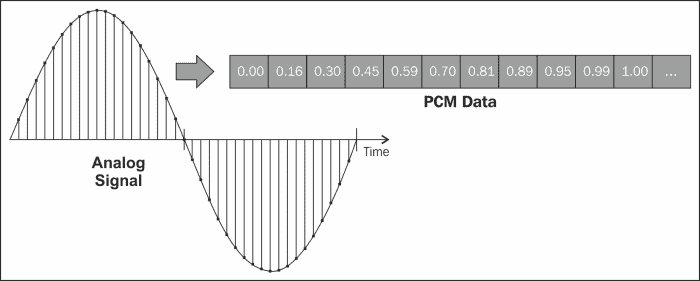
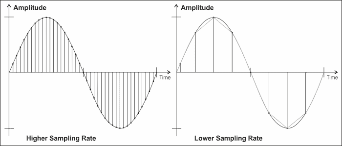
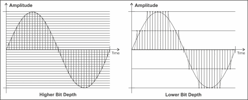
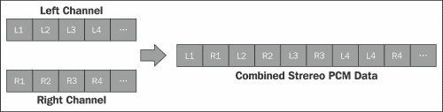

# 第一章：音频概念

如今，由于有许多强大的音频库可用，编写游戏的音频组件变得更加容易。这些库通过处理大部分底层实现细节来减轻开发人员的负担。虽然这是一件好事，但也使得更容易忽视理解声音理论的必要性。例如，我们可以轻松地播放一个声音文件，而不知道它在内存中的表示。

然而，即使在使用音频库时，仍然会有一些需要一些理论知识的情况。例如，我们经常会发现与理论相关的参数和函数名称，比如声音的频率或音频缓冲区的位深度。了解这些概念的含义对于确保我们正确使用它们是很重要的。

本章的目标是作为对我们在本书过程中最需要的概念的轻量级介绍。

# 声波

声音是由物体的振动产生的。这些振动产生大气压力的变化，以声波的形式传播离开物体。我们的耳朵能够检测到传入的声波，并将它们转换成我们的大脑解释为声音的神经信号。

可视化声音的一种方式是绘制每个时刻大气压力的变化图。然而，理解这些图与我们听到的声音之间的关系可能非常复杂。因此，我们通常从研究最简单的波形——**正弦波**开始。

正弦波对教育目的来说很有趣，因为我们可以从中轻松识别声音的两个主要属性：音量和音调。大多数音频库允许我们控制这些属性，以便我们播放任何声音。

+   **音量**：这个属性对应声音的响亮或安静程度。它直接取决于声波的振幅（或高度），如在垂直轴上测量的那样。音量的主要单位是分贝（dB），但大多数音频库使用从零（静音）到一（最大音量）的刻度。

+   **音调**：这个属性决定声音的高低。它取决于声波的频率，即它每秒重复的次数。频率的单位是赫兹（Hz）。关于频率，你应该知道的两件事是，人耳只能听到 20 赫兹到 20,000 赫兹范围内的频率，以及大多数你听到的声音实际上是几种不同频率的组合。

# 模拟和数字音频

现在我们知道了声音是什么，让我们把思绪转向录制声音并将其存储在计算机上。这个过程的第一步是将声波转换成电信号。当我们使用一个连续信号来表示另一种不同数量的信号时，我们称之为**模拟信号**，或者在声波的情况下，称之为**模拟音频信号**。你可能已经熟悉执行这种转换的设备：

+   **麦克风**：这些是将声波转换成电信号的设备

+   **扬声器**：这些是将电信号转换成声波的设备。

模拟信号有许多用途，但大多数计算机不能直接处理它们。计算机只能处理离散二进制数字序列，也称为**数字信号**。在计算机能够理解之前，我们需要将麦克风记录的模拟信号转换成数字信号，也就是数字音频。

用于数字表示模拟信号的最常用方法是**脉冲编码调制**（**PCM**）。 PCM 的一般思想是在固定时间间隔内对模拟信号的幅度进行采样（或测量），并将结果存储为一组数字（称为样本）。由于原始数据是连续的，而计算机上的数字是离散的，因此需要将样本四舍五入到最接近的可用数字，这个过程称为**量化**。样本通常存储为整数，但也可以使用浮点数，如以下示例所示：

有两种方法可以控制采样音频的质量：

+   ** 采样率 **：也称为采样频率，它是每秒音频采取的样本数量。根据奈奎斯特采样定理，采样率应至少是模拟信号的最高频率的两倍，以便进行适当的重建。通常会使用 44,100 Hz 或 48,000 Hz 的值。以下图比较了不同速率的采样：

+   ** 位深度 **：也称为分辨率，它是用于表示单个样本的位数。这控制了每个样本可以取的可能离散值的数量，并且需要足够高以避免量化误差。通常会使用 16 位或 24 位的位深度，存储为整数，或者 32 位存储为浮点数。以下图比较了不同分辨率的采样：

# 多通道音频

我们应该谈论的另一个方面是许多音频系统具有多个输出。通过将不同的音频信号发送到单独的输出（称为通道），可以产生方向性和空间的错觉。这些系统上的通道数量可以从一个（**单声道**）或两个（**立体声**）到环绕声系统上的更多通道不等。

早些时候描述的 PCM 格式可以一次存储多个通道的音频，通过以正确顺序交错每个通道的一个样本。以下图显示了立体声系统的一个示例：

除了我们之前讨论过的音量和音调之外，还有另一个属性通常会在每个音频库中找到，称为**声像**。声像适用于立体声系统，并允许您模拟声音的位置，将其放置在左右声道之间的任何位置。对于具有两个以上通道的配置中的定位，通常会使用其他高级功能，例如 3D 声音。

# 音频文件格式

计算机上存储音频的文件格式有很多种，一开始可能会感到不知所措。幸运的是，大部分时间你只会在游戏中使用其中的一些。音频文件格式通常属于以下类别之一：

+   ** 未压缩音频文件 **：这些是音频文件，其中数据以其原始状态存储（通常为 PCM）。这意味着它们的数据已经准备好进行播放，无需进一步处理。缺点是它们在磁盘上占用大量空间（大约每分钟音频占用 10 MB）。例如，WAV 和 AIFF。

+   ** 无损压缩 **：这些是使用仅执行可逆更改的压缩算法对数据进行编码的音频文件，因此不会永久丢失任何信息。这些文件可以达到未压缩格式的一半大小，但需要计算机在播放之前对其进行解码。例如，FLAC 和 APE。

+   **有损压缩**：这些是音频文件，其中数据使用压缩算法进行编码，其中一些信息的丢失是可以接受的。这些算法使用启发式方法来确定数据的哪些部分不太可能被听到，以便丢弃它们。文件大小可以缩小到原始大小的 10％，尽管如果压缩过于强烈，声音质量可能会受到相当大的影响。例如，MP3，WMA 和 OGG。

+   **序列音乐**：有一些格式不适合前面提到的任何类别。例如，MIDI 文件只存储有关音乐应如何播放的信息，但不包含任何声音数据，将其留给计算机决定如何解释它们。因此，它们非常小，但声音质量有限，并且因系统而异。还有混合格式，如 MOD 文件（也称为模块或跟踪器文件），在许多方面类似于 MIDI 文件，但也包含播放它们所需的任何声音数据（称为乐器）。

请注意，尽管 MP3 很受欢迎，但它是一种受专利保护的格式，您不能在未支付版税的情况下进行商业使用（有关更多信息，请参阅[`mp3licensing.com/`](http://mp3licensing.com/)）。对于本书，我们将使用 OGG 文件进行长音效，使用 WAV 文件进行小音效。

# 总结

在本章中，我们看到声音是大气压力变化的一系列，以声波的形式传播。我们还看到声波具有振幅和频率等属性，控制着声音的响度和高度，并且您可以使用电信号（模拟音频）和一系列数字（数字音频）来表示声波。我们了解到，将模拟信号转换为数字信号时，需要控制采样率和位深度。最后，我们看到许多音频系统具有多个输出，并且有许多不同类型的音频文件格式。
