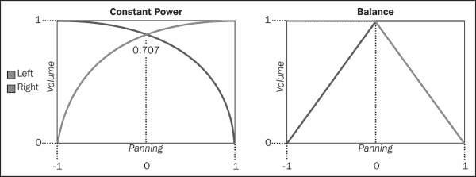

# 第三章：音频控制

在上一章中，我们看到了如何在 FMOD 中加载和播放音频文件。这一次，我们将探讨一些控制这些文件播放的方式。我们将从控制播放流程开始，通过按需停止声音或寻找音频文件中的不同点。然后，我们将介绍如何修改声音的主要属性，这些属性在第一章“音频概念”中已经描述，例如音量和音调。我们还将看到 FMOD 如何让我们将声音分组到类别中，以便一次控制多个声音。

在本章末尾，我们将扩展上一章的音频管理器，并使其更加灵活和适合在游戏中使用。这个扩展的音频管理器将区分歌曲和音效，并分别处理它们。我们将看到如何使用简单的音量调节来实现淡入/淡出效果，以及如何通过一点随机性为音效添加变化。音频管理器还将为每个类别公开单独的音量控制，使其易于从游戏的选项屏幕进行控制。

# 通道句柄

让我们从上一章快速回顾一下。当我们使用`playSound()`方法并将`FMOD::Channel`指针的地址传递给第四个参数时，我们会得到一个通道句柄作为返回：

```cpp
FMOD::Channel* channel;
system->playSound(FMOD_CHANNEL_FREE, sound, false, &channel);
```

通过这个句柄，我们可以以许多方式控制声音。只要声音尚未播放完毕，或者直到我们明确停止声音为止，该句柄仍然有效。如果我们尝试在声音停止后对通道执行操作，什么也不会发生。相反，我们调用的方法会返回一个错误，说明通道句柄无效，或者已经被另一个声音使用，如果是这种情况的话。

可能令人困惑的是，这个 FMOD 通道与我们在第一章“音频概念”中讨论的多通道音频不是同一类型。这只是 FMOD 为同时播放声音使用的每个插槽的名称。

# 控制播放

我们已经知道如何播放音频文件，但重要的是要知道如何停止它们的播放。这对于循环声音尤为重要，否则它们将永远重复。通常，我们只需要在通道句柄上调用`stop()`方法：

```cpp
channel->stop();
```

当声音停止播放时——因为它已经到达结尾并且没有设置循环，或者因为我们自己停止了它——它的通道就变得空闲，供其他声音使用。这意味着一旦我们停止了声音，就没有办法恢复它。如果我们需要暂时停止声音，并在以后恢复它，我们需要使用`setPaused()`方法：

```cpp
// Pause the sound
channel->setPaused(true);
// Resume the sound
channel->setPaused(false);
```

大多数以`set`开头的方法都有相应的`get`方法，例如`getPaused()`，我们可以使用它来检查该属性的当前值。以下是一个使用这两种方法结合在一起的函数，用于切换通道的暂停状态：

```cpp
void TogglePaused(FMOD::Channel* channel) {
  bool paused;
  channel->getPaused(&paused);
  channel->setPaused(!paused);
}
```

另一个常见的操作是将声音定位到文件中的不同位置。这是通过`setPosition()`方法完成的，该方法接受一个数字，表示我们要寻找的位置，以及我们指定该位置的单位（在以下示例中为毫秒）。如果我们想要使声音在暂停后从头开始播放，这将非常有用：

```cpp
channel->setPosition(0, FMOD_TIMEUNIT_MS);
```

最后，如果我们有一个循环声音，我们可以使用`setLoopCount()`方法来控制声音循环的次数。以下示例显示了一些可能的参数（默认值为`-1`表示无限循环）：

```cpp
// Repeat endlessly
channel->setLoopCount(-1);
// Play once then, stop
channel->setLoopCount(0);
// Play three times, then stop
channel->setLoopCount(2);
```

# 控制音量

接下来，我们将看到如何控制声音的一些主要属性，首先是音量。这是通过简单调用`setVolume()`方法完成的，该方法接受一个值，范围从`0`（静音）到`1`（最大音量）：

```cpp
channel->setVolume(1.0f);
```

与我们之前暂停声音的方式类似，我们也可以使用`setMute()`方法暂时将其静音。一旦我们取消静音，声音就会以先前的音量继续播放：

```cpp
channel->setMute(true);
```

前面提到的两种方法都同时修改声音的所有通道。对于具有多个通道的声音，我们可以使用`setInputChannelMix()`方法分别修改每个通道的音量。通过将音量级别的数组作为第一个参数，通道数作为第二个参数，可以对任意数量的通道进行操作。以下是一个静音左声道的立体声声音的示例：

```cpp
float levels[2] = {0.0f, 1.0f};
channel->setInputChannelMix(levels, 2);
```

# 声像的控制

控制音调并不像控制音量那样直接。我们已经知道修改声音的频率会改变它的音调，通道句柄实际上有一个专门用于此目的的`setFrequency()`方法。

```cpp
channel->setFrequency(261.626f);
```

然而，它的工作方式并不是我们一些人可能期望的。例如，钢琴上的中央 C 音符的频率大约为 261.626 赫兹，因此我们可能期望将频率设置为该值会使声音产生接近中央 C 音符的音调，但事实并非如此。

为了理解这个问题，让我们首先关注`getFrequency()`方法。如果我们在具有其原始频率的通道上调用此方法，我们实际上得到的是声音的采样率。这意味着我们设置的任何频率值必须相对于这个值，换句话说，任何高于声音的原始采样率的值都会增加其音调，反之亦然。

我们可以任意选择频率值来获得所需的效果，但处理音调的更简单方法是用音乐术语。在音乐理论中，两个音高之间的差异称为音程，其中最基本的两种音程是八度，对应于具有相同名称的两个连续音符之间的距离，以及半音，对应于任何两个相邻音符之间的距离。以下是一些简单的规则；我们可以通过任何这些音程来修改现有的频率：

+   每当我们将频率乘以/除以两，我们得到一个听起来音调更高/更低的新频率

+   每当我们将频率乘以/除以两个半，我们得到一个听起来音调更高/更低的新频率

为了简化问题，这里有两个辅助方法，可以在给定频率和要更改的八度或半音数的情况下执行先前的计算。请注意使用`pow()`函数来应用先前的乘法和除法所需的次数：

```cpp
#include <math.h>

float ChangeOctave(float frequency, float variation) {
  static float octave_ratio = 2.0f;
  return frequency * pow(octave_ratio, variation);
}
float ChangeSemitone(float frequency, float variation) {
  static float semitone_ratio = pow(2.0f, 1.0f / 12.0f);
  return frequency * pow(semitone_ratio, variation);
}
```

使用这些辅助方法，可以简单地在 FMOD 中有意义地修改声音的音调。例如，要将声音的音调降低 3 个半音，我们可以这样做：

```cpp
float frequency;
channel->getFrequency(&frequency);
float newFrequency = ChangeSemitone(frequency, -3.0f);
channel->setFrequency(newFrequency);
```

请注意，改变声音的频率也会导致加快或减慢速度的副作用。有一种方法可以在 FMOD 中改变声音的音调而不影响其速度，但这需要使用 DSP 效果，这超出了本章的范围。我们将在下一章简要介绍 DSP 效果。

# 声像的控制

最后，只要声音是单声道或立体声，并且是 2D 的（因为 FMOD 引擎会自动定位 3D 声音），我们还可以控制一些声音的声像。当满足这些条件时，可以使用`setPan()`方法来改变声音的声像，该方法接受从`-1`（完全在左边）到`1`（完全在右边）的任何值。

```cpp
channel->setPan(-1.0f);
```

声像通过修改每个输出的音量来产生位置的错觉。然而，FMOD 计算这些值的方式在单声道和立体声声音之间是不同的。

对于单声道声音，每个扬声器的音量遵循一个恒定的功率曲线，从一侧的 0％开始，到另一侧的 100％，中心位置在大约 71％左右。这种技术使得从一侧到另一侧的过渡比使用中间 50％的常规线性插值更加平滑（因为我们感知声音强度的方式）。

另一方面，立体声声音使用一个更简单的公式，称为设置声音的平衡。使用这种方法，两个输出在中心位置已经达到 100％，向一侧平移只会以线性方式减小相反通道的音量。以下图示了这两种方法：



# 将通道组分组在一起

FMOD 的另一个很棒的功能是它让我们将不同的通道添加到一个组中并同时控制它们。这对于视频游戏非常有用，因为声音往往属于不同的类别（如背景音乐、音效或语音）。要创建一个通道组，我们使用系统对象的`createChannelGroup()`方法：

```cpp
FMOD::ChannelGroup* musicGroup;
system->createChannelGroup("music", &musicGroup);
```

然后，我们可以使用通道对象的`setChannelGroup()`方法轻松地将通道添加到组中：

```cpp
channel->setChannelGroup(musicGroup);
```

还可以将一个组作为另一个组的子级添加，从而创建一个层次结构。这是使用父通道组对象的`addGroup()`方法完成的：

```cpp
channelGroup->addGroup(anotherGroup);
```

还有一个名为主通道组的全局通道组，在播放声音时每次都会将每个通道放置在其中。您可以通过调用系统对象的`getMasterChannelGroup()`方法来获取主通道组的引用：

```cpp
FMOD::ChannelGroup* masterGroup;
system->getMasterChannelGroup(&masterGroup);
```

在游戏中组织声音的一个好方法是为每个声音类别创建一个通道组，并将所有通道组添加到主通道组中。这样我们既可以控制各个类别，又可以一次性控制所有声音。

# 控制通道组

通道组支持的大多数操作与我们已经看到的个别通道相同。特别是，我们可以停止、暂停或静音组中的所有通道，并控制它们的音量和音调。这些操作的语法与以前相同，除了音调，它是通过`setPitch()`方法完成的，该方法不是频率，而是取`0`到`10`之间的任何值，并将其乘以当前频率。

```cpp
// Calls stop on all channels in the group
channelGroup->stop();
// Mute or pause all channels
channelGroup->setMute(true);
channelGroup->setPaused(true);
// Halve the volume of all sounds in the group
channelGroup->setVolume(0.5f);
// Double the frequency of all sounds in the group
channelGroup->setPitch(2.0f);
```

所有这些更改会自动传播到通道组层次结构中，而不会覆盖通道中存储的值。这些值的应用方式取决于操作的类型。

对于暂停和静音等操作，通道组中的值会覆盖子通道中的值。这意味着如果通道组被暂停，每个通道都将保持暂停，而不考虑它们的实际值。另一方面，如果通道组没有暂停，通道中的个别值将被考虑。

对于音量和音调，通道组中的值会乘以子通道中的值。例如，在 50％音量的通道组中的 80％音量的通道将以 40％的音量播放。

# 项目 2-改进音频管理器

在这个项目中，我们将在上一章中开发的简单音频管理器的基础上进行改进，使其更加灵活和游戏导向。这一次，除了加载和播放声音，我们还将能够停止它们并控制它们的音量，这在几乎每个游戏中都是必要的。此外，我们将所有声音分为两类，每类都有自己的特性和行为：

+   **音效（SFXs）**：加载到内存中并且不循环的声音。可以同时播放多个实例。它们的音量和音调可以直接控制，或者在用户定义的范围内进行随机化，以增加声音的变化。

+   **歌曲**：流式传输的声音，设置为循环。一次只能播放一首歌曲。音频管理器通过音量淡入淡出平稳处理歌曲之间的过渡。

每个游戏都有自己的需求，因此您可能希望创建更多类别，比如针对语音或环境音轨的类别。

## 类定义

让我们再次从类定义的列表开始：

```cpp
#include <string>
#include <map>
#include <fmod.hpp>

class AudioManager {
 public:
  AudioManager();
  ~AudioManager();
  void Update(float elapsed);

  void LoadSFX(const std::string& path);
  void LoadSong(const std::string& path);

  void PlaySFX(const std::string& path, 
               float minVolume, float maxVolume,
               float minPitch, float maxPitch);
  void PlaySong(const std::string& path);

  void StopSFXs();
  void StopSongs();

  void SetMasterVolume(float volume);
  void SetSFXsVolume(float volume);
  void SetSongsVolume(float volume);

 private:
  typedef std::map<std::string, FMOD::Sound*> SoundMap;
  enum Category { CATEGORY_SFX, CATEGORY_SONG, CATEGORY_COUNT };

  void Load(Category type, const std::string& path);

  FMOD::System* system;
  FMOD::ChannelGroup* master;
  FMOD::ChannelGroup* groups[CATEGORY_COUNT];
  SoundMap sounds[CATEGORY_COUNT];
  FMOD_MODE modes[CATEGORY_COUNT];

  FMOD::Channel* currentSong;
  std::string currentSongPath;
  std::string nextSongPath;

  enum FadeState { FADE_NONE,  FADE_IN, FADE_OUT };
  FadeState fade;
};
```

该类包含的成员比`SimpleAudioManager`类多得多，但基础是相同的。总结一下不同之处，现在我们有了用于分别加载、播放、停止和控制音效和歌曲音量的公共方法。然后，在类的私有部分，我们有一个包含类别类型的枚举，以及通道组、声音映射和模式的数组，每个类别都有足够的条目。最后，还有一些变量用于处理歌曲之间的过渡。

## 初始化和销毁

在构造函数中，除了初始化声音系统外，我们为每个声音类别创建了一个组通道，并将它们添加到主通道组中。我们还初始化了一个描述每个类别中的声音应如何加载的模式数组。最后，我们初始化了用于播放音效的随机数生成器。

```cpp
AudioManager::AudioManager() : currentSong(0), fade(FADE_NONE) {
  // Initialize system
  FMOD::System_Create(&system);
  system->init(100, FMOD_INIT_NORMAL, 0);

 // Create channels groups for each category
 system->getMasterChannelGroup(&master);
 for(int i = 0; i < CATEGORY_COUNT; ++i) {
 system->createChannelGroup(0, &groups[i]);
 master->addGroup(groups[i]);
 }

 // Set up modes for each category
 modes[CATEGORY_SFX] = FMOD_DEFAULT;
 modes[CATEGORY_SONG] = FMOD_DEFAULT | FMOD_CREATESTREAM |
 FMOD_LOOP_NORMAL;

 // Seed random number generator for SFXs
 srand(time(0));
}
```

在析构函数中，我们做了与简单音频管理器中相同的事情，但这次有多个声音映射需要清除。

```cpp
AudioManager::~AudioManager() {
  // Release sounds in each category
  SoundMap::iterator iter;
 for(int i = 0; i < CATEGORY_COUNT; ++i) {
    for (iter = sounds[i].begin(); iter != sounds[i].end(); ++iter)
      iter->second->release();
    sounds[i].clear();
  }
  // Release system
  system->release();
}
```

## 加载歌曲和音效

管理器的加载部分与上一章所做的非常相似。公共方法“LoadSFX（）”和“LoadSong（）”将它们的工作委托给私有的“Load（）”方法，该方法执行实际的加载过程。唯一的区别是，“Load（）”方法需要根据第一个参数的值使用正确的声音映射和模式数组：

```cpp
void AudioManager::LoadSFX(const std::string& path) {
  Load(CATEGORY_SFX, path);
}
void AudioManager::LoadSong(const std::string& path) {
  Load(CATEGORY_SONG, path);
}
void AudioManager::Load(Category type, const std::string& path) {
  if (sounds[type].find(path) != sounds[type].end()) return;
  FMOD::Sound* sound;
  system->createSound(path.c_str(), modes[type], 0, &sound);
  sounds[type].insert(std::make_pair(path, sound));
}
```

## 播放和停止音效

音效是两种类别中较容易播放的。 “PlaySFX（）”方法接受声音的路径和一对最小和最大音量和音调值。然后它在正确的映射中搜索声音，并像以前一样播放它，只是它使用在选定范围内生成的随机值来设置声音的音量和音调：

```cpp
void AudioManager::PlaySFX(const std::string& path,
                           float minVolume, float maxVolume,
                           float minPitch, float maxPitch) {
  // Try to find sound effect and return if not found
  SoundMap::iterator sound = sounds[CATEGORY_SFX].find(path);
  if (sound == sounds[CATEGORY_SFX].end()) return;

  // Calculate random volume and pitch in selected range
  float volume = RandomBetween(minVolume, maxVolume);
  float pitch = RandomBetween(minPitch, maxPitch);

  // Play the sound effect with these initial values
  FMOD::Channel* channel;
  system->playSound(FMOD_CHANNEL_FREE, sound->second,
                    true, &channel);
  channel->setChannelGroup(groups[CATEGORY_SFX]);
  channel->setVolume(volume);
  float frequency;
  channel->getFrequency(&frequency);
  channel->setFrequency(ChangeSemitone(frequency, pitch));
  channel->setPaused(false);
}
```

上述代码使用了两个辅助方法，“ChangeSemitone（）”在本章前面已经展示过，而“RandomBetween（）”可以在以下代码片段中看到：

```cpp
#include <stdlib.h>
#include <time.h>

float RandomBetween(float min, float max) {
  if(min == max) return min;
  float n = (float)rand()/(float)RAND_MAX;
  return min + n * (max - min);
}
```

停止播放所有音效非常容易实现，这要归功于通道组。通常在切换场景或打开菜单时调用此方法：

```cpp
void AudioManager::StopSFXs() {
  groups[CATEGORY_SFX]->stop();
}
```

## 播放和停止歌曲

由于我们只希望一次只播放一首歌曲，并且希望它们之间的过渡能够平稳进行，所以歌曲的处理会有些困难。FMOD 没有提供自动在声音之间淡入淡出的方法，因此我们必须在“Update（）”方法中手动实现这一点，使用“setVolume（）”调用。首先，我们需要创建一些成员变量来存储一些状态：

```cpp
FMOD::Channel* currentSong;
std::string currentSongPath;
std::string nextSongPath;
enum FadeState { FADE_NONE,  FADE_IN, FADE_OUT };
FadeState fade;
```

从顶部开始，我们需要通道句柄来更新歌曲的音量，当前歌曲的路径以确保我们不再次播放相同的歌曲，以及下一首歌曲的路径，以便在前一首歌曲淡出后开始播放。我们还需要一个变量来存储我们当前是在淡入还是淡出。 “PlaySong（）”方法遵循这些规则：

+   如果我们试图播放已经在播放的歌曲，则不应该发生任何事情。

+   如果我们试图播放一首歌曲，但已经有另一首歌曲在播放，我们不能立即开始。相反，我们指示管理器开始停止当前的歌曲，并存储要在之后播放的歌曲的路径。

+   如果没有歌曲正在播放，我们可以立即开始新的歌曲，其初始音量设置为零，并将管理器设置为淡入状态。歌曲还必须添加到正确的通道组中：

```cpp
void AudioManager::PlaySong(const std::string& path) {
  // Ignore if this song is already playing
  if(currentSongPath == path) return;

  // If a song is playing stop them and set this as the next song
  if(currentSong != 0) {
    StopSongs();
    nextSongPath = path;
    return;
  }
  // Find the song in the corresponding sound map
  SoundMap::iterator sound = sounds[CATEGORY_SONG].find(path);
  if (sound == sounds[CATEGORY_SONG].end()) return;

  // Start playing song with volume set to 0 and fade in
  currentSongPath = path;
  system->playSound(FMOD_CHANNEL_FREE, 
                    sound->second, true, &currentSong);
  currentSong->setChannelGroup(groups[CATEGORY_SONG]);
  currentSong->setVolume(0.0f);
  currentSong->setPaused(false);
  fade = FADE_IN;
}
```

+   `StopSongs()` 方法实现起来要简单得多，因为它只需要在歌曲正在播放时触发淡出，并清除先前设置的任何待定歌曲请求：

```cpp
void AudioManager::StopSongs() {
  if(currentSong != 0) 
    fade = FADE_OUT;
  nextSongPath.clear();
}
```

在 `Update()` 方法中，所有的淡入淡出都是在这里进行的。这个过程遵循以下规则：

+   如果有歌曲正在播放并且我们正在淡入，就稍微增加当前歌曲的音量。一旦音量达到一，就停止淡入。

+   如果有歌曲正在播放并且我们正在淡出，就稍微降低当前歌曲的音量。一旦音量达到零，就停止歌曲播放，并停止淡出。

+   如果没有歌曲正在播放，并且设置了下一首歌曲要播放，就开始播放它：

```cpp
void AudioManager::Update(float elapsed) {
  const float fadeTime = 1.0f; // in seconds
  if(currentSong != 0 && fade == FADE_IN) {
    float volume;
    currentSong->getVolume(&volume);
    float nextVolume = volume + elapsed / fadeTime;
    if(nextVolume >= 1.0f) {
      currentSong->setVolume(1.0f);
      fade = FADE_NONE;
    } else {
      currentSong->setVolume(nextVolume);
    }
  } else if(currentSong != 0 && fade == FADE_OUT) {
    float volume;
    currentSong->getVolume(&volume);
    float nextVolume = volume - elapsed / fadeTime;
    if(nextVolume <= 0.0f) {
      currentSong->stop();
      currentSong = 0;
      currentSongPath.clear();
      fade = FADE_NONE;
    } else {
      currentSong->setVolume(nextVolume);
    }
  } else if(currentSong == 0 && !nextSongPath.empty()) {
    PlaySong(nextSongPath);
    nextSongPath.clear();
  }
  system->update();
}
```

## 控制每个类别的主音量

控制每个类别的主音量只是调用相应的通道组方法的问题：

```cpp
void AudioManager::SetMasterVolume(float volume) {
  master->setVolume(volume);
}
void AudioManager::SetSFXsVolume(float volume) {
  groups[CATEGORY_SFX]->setVolume(volume);
}
void AudioManager::SetSongsVolume(float volume) {
  groups[CATEGORY_SONG]->setVolume(volume);
}
```

# 总结

在本章中，我们已经看到了如何控制声音的播放，如何控制声音的音量、音调和声像，如何使用通道组同时控制多个声音，最后如何将这些特性应用到实际情况中，比如在歌曲之间淡入淡出，或者对声音效果应用随机变化。
