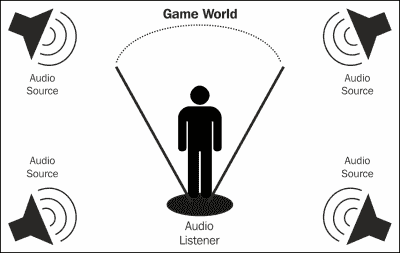
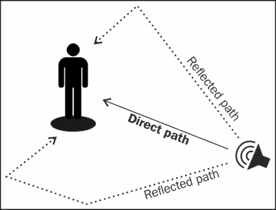
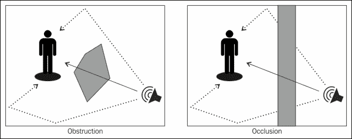

# 第四章：3D 音频

我们对声音的感知取决于我们相对于其来源的位置以及环境的几个特征。我们已经讨论过声音是一种机械波，它有一个起源，并且需要在我们听到它之前一直传播到我们的耳朵。在传播过程中，这些声波与环境（如墙壁、物体或空气本身）相互作用，并开始改变。许多这些变化为我们的大脑提供了有价值的线索，以确定声音的位置或环境的性质。以下是一些对声音产生重要影响的因素的列表：

+   **距离**：声音源和我们的耳朵之间的距离对其强度有显著影响，因为空气和其他介质会在声音经过时减弱声音。

+   **方向**：由于每只耳朵捕捉到的声音之间的微小时间和强度变化，我们的耳朵可以确定声音来自的方向。

+   **运动**：声源和我们的耳朵之间的相对速度可能会使其听起来具有不同的音调，这是由于一种称为多普勒效应的现象。

+   **房间**：我们所处的房间的大小和形状可能会导致多重回声积累，产生混响效果，声音似乎在原始声音停止后仍然暂时存在。

+   **障碍物**：声源和我们的耳朵之间的障碍物倾向于减弱和消音声音。这在大型障碍物（如墙壁）的情况下尤为明显。

在本章中，我们将探讨 3D 音频的基础知识，这是音频编程领域试图考虑这些因素中的一些（或全部）以产生逼真音频模拟的领域。这是使用 FMOD 等音频引擎的领域之一，因为要自己实现这些功能将会非常困难。

# 定位音频

我们要处理的 3D 音频的第一个方面（也许是最重要的）是定位音频。**定位音频**主要涉及产生声音的每个对象（我们将其称为**音频源**）相对于我们的耳朵（我们将其称为**音频听者**）的位置。

创建 3D 音频模拟所需的第一步是描述环境中的每个音频源和听者。请注意，场景中通常只有一个音频听者，除非我们正在创建多人分屏类型的游戏。以下图显示了一个场景的示例，其中有多个音频源和一个音频听者在中间：



对于场景中的每个音频源和听者，我们存储位置、方向和速度等信息。使用这些信息，音频引擎通过多种方式实时修改所有声音来产生 3D 音频模拟：

+   **位置**：声源的音量会随着到听者的距离增加而减小并变得沉闷（通过过滤声音以减弱一些较高频率）。用于计算给定距离下声音音量的公式通常可通过选择最小和最大距离以及衰减模型来控制。

+   **方向**：根据听者相对于每个声源的方向，音频引擎使用扬声器布置（例如 5.1 环绕声系统）或声像定位（立体声系统）来模拟声音方向和位置。音频源也可以被定向，通常通过定义声音投影锥，包括方向和角度信息。然后，对于站在锥体范围之外的听者，声音会被衰减。

+   **速度**：如果音频源相对于听者移动，声音的音调会发生变化（随着实体靠近而增加，随着实体远离而减少），这是多普勒效应的结果。你可以在现实世界中听到这种效果，例如，当救护车经过你身边时，它的警报器打开，当救护车经过你的位置时，警报器的音调会突然下降。

# FMOD 中的定位音频

在 FMOD 中使用定位音频与我们迄今为止所做的并没有太大不同。事实上，我们已经在前几章中使用了所有需要定位音频的类；`FMOD::Channel`类已经作为音频源工作，而`FMOD::System`类控制场景中的所有音频听者。让我们将整个过程分解为步骤。

## 创建音频源

我们必须记住的第一点是要使用`FMOD_3D`标志来创建我们的声音；否则，3D 音频引擎将不会处理它们：

```cpp
system->createSound("explosion.wav", FMOD_3D, 0, &sound);
```

然后我们只需要像往常一样播放声音，存储通道句柄的引用，以便我们可以修改声音的 3D 属性。

## 设置音频源的位置和速度

播放声音并获得通道句柄后，我们可以使用`set3DAttributes`方法设置音频源的位置和速度：

```cpp
FMOD_VECTOR position = { 3.0f, 4.0f, 2.0f };
FMOD_VECTOR velocity = { 1.0f, 0.0f, 0.0f };
channel->set3DAttributes(&position, &velocity);
```

通常在创建音频源时设置这些值，并在每帧或每次与音频源相关的游戏对象改变其位置或速度时更新它们。

默认情况下，位置以米为单位，速度以每秒米为单位（通常在物理引擎中看到）。我们可以通过在`System::set3DSettings`方法中设置不同的`distancefactor`参数来改变这个比例。

请注意，简单地将对象的位置减去其在上一帧的位置并不会产生以米每秒为单位的速度，这是必需的。如果我们需要使用这种方法，例如因为我们不知道对象的实际速度，我们必须首先将这个增量乘以自上一帧以来经过的时间（以秒为单位）：

```cpp
FMOD_VECTOR velocity;
velocity.x = (position.x - lastPosition.x) * elapsed;
velocity.y = (position.y - lastPosition.y) * elapsed;
velocity.z = (position.z - lastPosition.z) * elapsed;
```

## 设置音频源的方向

默认情况下，每个声音源都是全向的，这意味着声音在每个方向上都是均匀发射的。我们可以通过定义一个投影锥来给声音源一个方向，使用`set3DConeOrientation`和`set3DConeSettings`方法：

```cpp
FMOD_VECTOR direction = { 1.0f, 2.0f, 3.0f };
channel->set3DConeOrientation(&direction);
channel->set3DConeSettings(30.0f, 60.0f, 0.5f);
```

`set3DConeOrientation`方法接受一个定义声音锥主方向的向量。`set3DConeSettings`方法接受三个参数，包含声音锥的内角、外角和外音量。当听者在内角范围内时，声音源以全音量播放，并且随着听者移出该角度而朝向外音量衰减。

## 设置音频源的范围

我们可以使用`set3DMinMaxDistance`方法控制声音仍然可听到的整体距离：

```cpp
channel->set3DMinMaxDistance(1.0f, 10000.0f);
```

我们将声音的范围指定为一对值：最小距离和最大距离。最小距离是声音开始衰减的点。如果听者比最小距离更靠近源，声音将以全音量播放。最大距离是声音停止衰减并保持恒定音量的点（不一定是零音量）。

在最小和最大距离之间音量变化的方式被称为**衰减模型**。默认情况下，FMOD 使用**对数衰减**，随着最小距离的比例而衰减音量：

```cpp
volume = min / distance;
```

通过改变最小距离，我们可以控制声音的整体大小（例如，我们可以为苍蝇的声音设置 0.1 的值，或者为爆炸的声音设置 500 的值）。在使用这个模型时，最大距离应该有一个较大的值，以便让声音有足够的距离衰减到静音。我们可以通过改变`rolloffscale`参数在`System::set3DSettings`方法中使声音衰减得更慢或更快。

对数模型是现实的，但缺点是使得计算声音的完整范围（即静音的距离）更加困难。因此，还有其他可用的模型，比如`linear`衰减模型，它将最小距离映射到全音量，最大距离映射到静音，并在两者之间进行线性插值。我们可以在创建声音时选择`linear`衰减模型，通过添加`FMOD_3D_LINEARROLLOFF`标志。在这个模型中，系统衰减比例不起作用：

```cpp
if (distance <= min) volume = 1.0
else if (distance >= max) volume = 0.0
else volume = (distance - min) / (max - min);
```

## 设置音频监听器的属性

最后，我们必须使用`system`对象的`set3DListenerAttributes`方法设置音频监听器的位置、速度和方向：

```cpp
FMOD_VECTOR pos = { 3.0f, 4.0f, 2.0f };
FMOD_VECTOR vel = { 1.0f, 0.0f, 0.0f };
FMOD_VECTOR forward = { 1.0f, 0.0f, 0.0f };
FMOD_VECTOR up = { 0.0f, 1.0f, 0.0f };
system->set3DListenerAttributes(0, &pos, &vel, &forward, &up);
```

这与设置音频源的属性非常相似，除了增加了方向。方向被指定为一对归一化的垂直向量，指向监听器的上方和前方（通常可以从摄像机对象或视图变换矩阵中获取）。

第一个参数是一个索引，用于标识音频监听器。默认情况下，场景中只有一个音频监听器，所以我们使用值`0`。如果我们需要多个音频监听器，可以使用`system`对象的`set3DNumListeners`方法来增加该数量。

## 与游戏的整合

解决这个问题有几种方法，取决于游戏引擎使用的架构，但通常的过程是为每个可以发出声音的游戏对象分配一个音频源，并为摄像机对象分配一个音频监听器。然后，在游戏循环的更新阶段，每当我们改变游戏对象或摄像机的位置、速度或方向时，我们必须跟随相应的音频结构进行更新。最后，在更新阶段结束时，我们更新音频系统，处理对源和监听器所做的所有更改，并相应地更新模拟。

# 混响

定位音频（包括衰减、扬声器放置和多普勒效应）构成了 3D 音频的最基本层次。现在我们将介绍一些高级技术，可以在定位音频的基础上提供更完整的模拟声音与环境互动的方法之一就是**混响**。

混响是声音在原始声音停止后在特定空间内持续存在一段时间的能力。我们可以将混响看作是一系列回声，它们之间的时间非常短。

混响发生是因为大多数音频源同时在多个方向投射声音。其中一些声波直接到达我们的耳朵，走最短的路径。然而，其他声波朝着不同的方向传播，并在到达我们的耳朵之前反射在各种表面上，比如墙壁。这些反射的声波需要更长的时间才能到达我们的耳朵，而且每次反射都会变得更加安静。所有反射声波的组合产生了混响的效果。



在游戏中模拟混响可以增强场景的真实感，因为它提供了关于环境的大小和性质的强烈线索。例如，一个空荡荡的大教堂，有着大面积的反射墙，通常会产生大量的混响。另一方面，一个没有墙壁的室外位置几乎没有混响。我们还可以通过混响的持续时间推断房间的大小，因为声波在大房间中需要比在小房间中更长的时间传播。

# FMOD 中的混响

如果我们已经在场景中使用了定位音频，那么在 FMOD 中添加混响只需要几行额外的代码。

## 创建混响对象

首先，我们需要使用`createReverb`方法创建一个`FMOD::Reverb`对象：

```cpp
FMOD::Reverb* reverb;
system->createReverb(&reverb);
```

这将创建一个混响区域，自动对站在该区域内的听者可以听到的每个声音应用混响。可以同时安全地创建多个混响区域，因为 FMOD 会自动合并它们的效果。

要禁用混响区域，可以使用`setActive`方法。或者，如果不再需要该区域，可以使用`release`方法永久销毁它：

```cpp
reverb->setActive(false);       // Disable temporarily
reverb->release();              // Destroy reverb
```

## 设置混响属性

混响有许多属性可以自定义其行为。这些属性定义在`FMOD_REVERB_PROPERTIES`结构中，并可以使用`setProperties`方法应用于混响对象。幸运的是，FMOD 还提供了一组预设，例如`FMOD_PRESET_CONCERTHALL`，可以直接使用：

```cpp
FMOD_REVERB_PROPERTIES properties = FMOD_PRESET_CONCERTHALL;
reverb->setProperties(&properties);
```

## 设置混响位置和半径

我们可以使用`set3DAttributes`方法指定混响的位置和范围。混响的范围由最小半径（在该半径内混响以全音量播放）和最大半径（在该半径外混响被禁用）来指定。

```cpp
FMOD_VECTOR position = { 10.0f, 0.0f, 0.0f };
reverb->set3DAttributes(&position, 10.0f, 20.0f);
```

## 设置默认环境混响

我们还可以使用`system`对象的`setReverbAmbientProperties`方法设置当听者不在任何混响区域内时使用哪些混响属性。

```cpp
FMOD_REVERB_PROPERTIES properties = FMOD_PRESET_OFF;
system->setReverbAmbientProperties(&properties);
```

# 遮挡和遮蔽

环境中的障碍物，如大型物体或墙壁，也会改变我们对声音的感知方式。我们经常可以听到在相邻房间说话的人，但声音不如站在我们旁边时清晰。原因是尽管声音可以穿过几种材料，但在这个过程中会失去能量和一些更高的频率。这导致声音变得更安静、沉闷。用于模拟 3D 音频中障碍物的两种技术是**遮挡**和**遮蔽**。

当源和听者在同一环境中，并且有障碍物挡住了去路，但障碍物周围仍有足够的空间让声波流动时，就会发生遮挡。在这种情况下，直接穿过障碍物的声波会被衰减和过滤，但反射的声波不受影响。

当源和听者处于不同的环境，并且所有声音需要通过障碍物（如墙壁）才能到达听者时，就会发生遮挡。在这种情况下，直接和反射的声波都会被衰减和过滤。

应用于遮挡或遮蔽声波的滤波器通常是低通滤波器，它会衰减更高的频率，导致声音变得沉闷。



## FMOD 中的遮挡和遮蔽

我们可以使用内置的几何引擎在 FMOD 中模拟遮挡和遮蔽。这仅在我们已经设置好音频源和听者时才有效。之后，我们需要创建几何对象来表示环境中的障碍物。

创建这些对象的最简单方法是从障碍物的 3D 三角网格表示开始。然后，使用`createGeometry`方法创建一个`FMOD::Geometry`实例，足够大以存储所有的三角形和顶点：

```cpp
FMOD::Geometry* geometry;
system->createGeometry(numTriangles, numVertices, &geometry);
```

接下来，对于我们网格中的每个三角形，我们使用`addPolygon`方法向几何对象添加一个新的多边形。前两个参数控制执行的遮挡和遮挡量。第三个参数决定多边形是否应为双面的。第四个参数是多边形中的顶点数，第五个参数是多边形数据本身。第六个参数返回一个索引，可以用来对多边形执行进一步的操作。

```cpp
FMOD_VECTOR vertices[3]; // Fill with triangle vertices
int polygonIndex; // Gets an index for the new polygon
geometry->addPolygon(0.5f, 0.5f, false, 3, vertices, &polygonIndex);
```

我们应该使用对象空间中的顶点创建多边形，而不是世界空间中的顶点。然后，为了将几何体定位到世界中，我们可以使用`setPosition`，`setRotation`和`setScale`方法的组合。

# 效果

除了之前描述的所有 3D 音频模拟，还有另一个主题我们应该涵盖：DSP 效果。**DSP**效果（代表**数字信号处理**）是一种算法，它以声音数据作为输入，以某种方式修改它，并返回一组新的数据作为输出。大多数效果要么操纵声音数据的振幅或频率，要么将多个声音叠加在一起（通常是其自身的延迟和衰减版本）。以下是一些常见类型的 DSP 效果的列表：

+   **归一化**：此效果缩放声音的音量，使峰值幅度达到最大音量水平。

+   **压缩器**：此效果使声音的响亮部分变得更安静，然后将整个音量提高以补偿，减少声音的动态范围

+   **失真**：此效果扭曲声音，使其听起来更刺耳

+   **低通滤波器**：此效果削弱了声音中所有超过一定范围的频率，使声音变得沉闷

+   **高通滤波器**：此效果削弱了声音中所有低于一定范围的频率，使声音变得更薄。

+   **参数均衡器**：此效果在声音的所有不同频率范围上提供复杂的音量控制

+   **延迟**：在此效果中，声音播放一次，并在一定时间后重复播放，直到能量耗尽

+   **回声**：在此效果中，延迟的持续时间足够长，我们可以将其感知为单独的声音

+   **镶边**：此效果在每个实例之间增加了非常小的延迟的声音，并随时间变化这个延迟

+   **合唱**：此效果将声音的多个实例一起播放，它们之间有小的音高和时间变化

+   **音调转换**：此效果改变声音的音调，而不改变其播放速度

+   **去噪**：此效果将低于一定音量阈值的每个值静音

## FMOD 中的效果

再次，我们只会在这里涵盖最基本的内容。在 FMOD 中创建 DSP 效果的最简单方法是使用`createDSPByType`方法，其中一个可用的 DSP 类型作为参数（检查 FMOD 文档以获取完整的类型列表）。

```cpp
FMOD::DSP* dsp;
system->createDSPByType(FMOD_DSP_TYPE_ECHO, &dsp);
```

这将返回一个`FMOD::DSP`对象，您可以使用相应对象的`addDSP`方法将其应用于任何通道、通道组或`system`对象本身。您还可以将多个 DSP 效果添加到同一对象中，这将自动将它们链接在一起：

```cpp
channel->addDSP(dsp, 0);
```

第二个参数允许更多地控制 DSP 连接，但我们将在我们的简单示例中忽略它。

最后，大多数 DSP 效果都有一组参数，您可以使用`setParameter`方法来控制（再次，检查文档以获取所有可用参数的列表）：

```cpp
dsp->setParameter(FMOD_DSP_ECHO_DECAYRATIO, 0.75f);
```

## 示例 1 - 时间拉伸

作为 DSP 效果的第一个应用，这里有一个示例，显示了如何改变声音的播放速度而不影响其音调。为此，我们需要将常规频率变化与音调转换 DSP 效果相结合，以将音调恢复正常。

```cpp
// Play at half speed
float amount = 0.5f;

// Modify frequency which changes both speed and pitch
float frequency;
channel->getFrequency(&frequency);
channel->setFrequency(frequency * amount);

// Create a pitch shift DSP to get pitch back to normal
// by applying the inverse amount
FMOD::DSP* dsp;
system->createDSPByType(FMOD_DSP_TYPE_PITCHSHIFT, &dsp);
dsp->setParameter(FMOD_DSP_PITCHSHIFT_PITCH, 1.0f / amount);
dsp->setParameter(FMOD_DSP_PITCHSHIFT_FFTSIZE, 4096);

// Now only the speed will change
channel->addDSP(dsp, 0);
```

## 示例 2 - 简单的无线电效果

您还可以结合多种效果来实现更复杂的行为。例如，这里有一个简单的收音机效果模拟，它通过对声音应用失真和高通滤波器来实现。

```cpp
FMOD::DSP* distortion;
system->createDSPByType(FMOD_DSP_TYPE_DISTORTION, &distortion);
distortion->setParameter(FMOD_DSP_DISTORTION_LEVEL, 0.85f);

FMOD::DSP* highpass;
system->createDSPByType(FMOD_DSP_TYPE_HIGHPASS, &highpass);
highpass->setParameter(FMOD_DSP_HIGHPASS_CUTOFF, 2000.0f);

channel->addDSP(distortion, 0);
channel->addDSP(highpass, 0);
```

失真模拟了模拟模拟信号传输时经常发生的信息丢失，而高通滤波器通过去除较低频率使声音变得更薄。

# 总结

在本章中，我们已经看到了如何模拟声音来自环境中特定位置，如何模拟反射声波产生的混响，如何模拟障碍物的阻挡和遮挡，最后如何对声音应用数字信号处理效果。
