# 第五章：智能音频

到目前为止，我们以非常线性的方式播放声音；我们从磁盘加载音频文件，并在需要时播放它，可以在播放过程中控制一些参数。即使我们使用了高级功能，比如 3D 音频，声音和音频文件之间仍然是一对一的关系。

然而，一个声音不一定对应一个单独的音频文件。在许多情况下，我们可以受益于为单个声音使用多个音频文件。例如，我们通常可以通过提供几种不同的声音变体作为单独的音频文件来减少重复，或者我们可以通过组合几个较小的声音片段来构建复杂的音景。

对于其他声音，我们在运行时应用到它们的参数的修改和构成它们的音频文件一样重要。例如，我们无法真实地模拟汽车引擎的声音，而不是根据发动机的转速和负载值不断更新其音调和音量。另一个常见的例子是，让配乐动态地对游戏中的事件做出反应，以向玩家传达更多或更少的紧张感。

作为程序员，我们当然可以通过为每种情况编写专门的代码来实现这些功能，根据需要编排每个音频文件和声音参数。然而，这种方法需要大量的工作量，而且很难管理和调整，因为大部分行为都是硬编码到游戏中的。更大的问题是，通常是声音设计师而不是程序员为游戏创建声音，使用这种方法需要双方之间大量的沟通和同步。

幸运的是，我们可以通过使用高级音频引擎来解决这个问题。这些引擎通常提供一个外部工具，声音设计师可以使用它来创建复杂的声音，独立于程序员，并将它们存储为声音事件。然后，无论声音的复杂性如何，程序员都可以轻松地从游戏中触发它，通常是通过编写事件的名称。

涵盖这个主题的主要困难在于有几个高级音频引擎可用，每个引擎都有自己的一套功能和理念。使用这些工具，我们可以执行诸如生成音频（根据一组声音样本和规则在运行时生成音频）或自适应音乐（根据游戏事件变化的音乐）等操作。为了简化术语，我们将使用智能音频这个术语来涵盖所有声音可以附加复杂行为的情况。

在本章中，我们将使用 FMOD Designer 工具，并了解一些有趣的东西。由于本书的范围有限，详细介绍这个工具是不可能的，但这应该足够给你一些想法，并让你开始。有关更多信息，FMOD Designer 工具附带了一个超过 400 页的用户手册和一个包含许多示例的示例项目。

# 音频文件与声音事件

在安装 FMOD Designer 工具之前，让我们真正理解将每个音频文件视为声音与以更高的抽象级别处理声音事件（或一些引擎中的声音提示）之间的区别。以下图表展示了迄今为止我们在游戏中处理音频的方式：

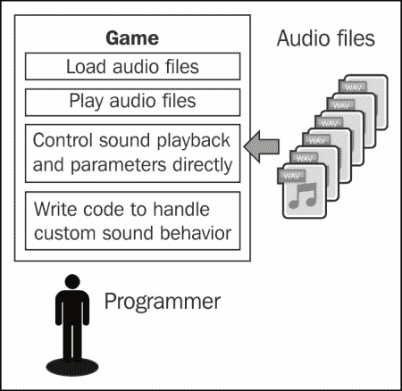

在这个模型中，我们可以看到游戏直接与音频文件交互，代码负责以适合游戏的方式使用这些音频文件，通常需要创建专门的代码。当我们转向使用 FMOD Designer 等高级音频引擎时，这个过程是完全不同的，如下图所示：

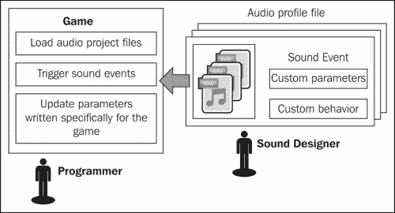

这种模型的第一个区别是游戏不直接与音频文件交互。相反，它与称为声音事件的实体交互，这些实体可能包含多个音频文件，并封装了以前在游戏中的所有自定义行为和参数的声音。这种分离使游戏代码变得简单得多，并为声音设计师提供了更好的工作环境。

还要注意，有一个将所有声音事件组合在一起的音频项目文件。这意味着游戏只需要加载这一个文件就可以访问所有声音事件，这比加载每个单独的音频文件要容易得多。

# 介绍 FMOD Designer

FMOD Designer 是高级的、数据驱动的 API，它补充了我们迄今为止使用的 FMOD Ex 低级引擎。它包含两个部分：

+   **FMOD Designer**：这是一个声音设计师工具，允许我们为我们的游戏创建复杂的声音事件和交互式音乐（来自[`www.fmod.org`](http://www.fmod.org)）

+   **FMOD 事件系统**：这是一个应用层，让我们可以在游戏中使用设计师创建的内容（与 FMOD Ex 捆绑在一起，位于`fmoddesignerapi`文件夹内）

FMOD Designer 项目的文件扩展名为`.fdp`，但要在游戏中使用它们，必须首先从**项目**菜单中构建它们。构建过程会生成一个`.fev`文件，其中包含项目中每个声音事件的所有信息，以及项目中每个波形库的一个`.fsb`文件，其中存储着音频文件。以下是 FMOD Designer 用户界面的截图：

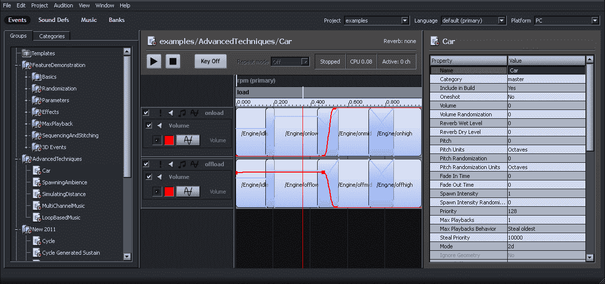

FMOD Designer 最重要的任务是创建声音事件。在 FMOD 中有两种类型的声音事件，以及一个交互式音乐系统：

+   **简单事件**：通过简单事件，我们可以创建由多个音频文件组成的声音，并以随机或顺序方式播放它们，一次或多次，以不同的速率，并具有随机的音量或音调变化

+   **多轨事件**：通过多轨事件，我们可以组合我们需要的简单事件（在这种情况下称为**声音定义**），将它们组织成层，对它们应用效果，控制任何给定时间应该播放哪些声音定义，创建自定义参数，并将这些参数链接到声音或效果的任何属性

+   **交互式音乐**：通过交互式音乐系统，我们可以创建由多个片段组成的歌曲（称为**提示**），并使游戏在响应特定事件时在它们之间过渡。除了过渡，我们还可以向音乐中添加装饰，这些装饰与主歌同时播放并与之同步。

在接下来的几节中，我们将简要介绍这两个系统的主要特点和用户界面，以及一些如何在游戏环境中使用它们的想法和示例。由于交互式音乐的范围超出了本书的范围，因此对交互式音乐的讨论将更加肤浅。

# 简单事件

简单事件是最容易使用，也是最不占资源的。因此，我们应该尽量在满足我们要求的情况下使用简单事件。通过简单事件，我们可以：

+   创建由多个音频文件组成的声音

+   按顺序或随机顺序播放音频文件

+   随机化声音属性，如音量或音调

+   控制声音的循环行为

+   同时播放多个音频文件，或在特定间隔播放

要创建一个简单事件，转到**事件**部分，在任何**事件组**上右键单击，然后选择**添加简单事件**选项。如果没有创建**事件组**，我们可以从同一上下文菜单中创建一个。事件组的行为类似于文件夹，用于组织我们所有的事件：

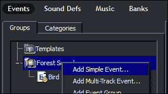

选择事件后，下一步是将组成它的音频文件添加到**播放列表**窗格中，可以通过右键单击上下文菜单，或将一些音频文件拖放到其中。如果我们打算以随机顺序播放音频文件，可以通过右键单击上下文菜单或使用窗格左下角的旋钮控制指定每个文件播放的概率：

（简单事件）（img/9099OT_05_05.jpg）

在**播放列表选项**窗格中，我们可以控制音频引擎应该如何从播放列表中选择文件。有三种不同的**播放列表行为**：

+   **随机**：此选项每次随机选择一个音频文件，遵循播放列表中为每个文件分配的权重。我们还可以选择是否允许同一个音频文件连续播放两次。

+   **随机**：此选项随机播放播放列表一次，然后按照该顺序播放音频文件。

+   **顺序**：此选项按照音频文件在播放列表中出现的顺序进行播放。

在**播放列表选项**窗格中，我们还可以找到**声音随机化**部分，它让我们可以对每个文件的起始音量和音调应用一些变化（类似于我们在第三章中实现的内容，*音频控制*）：

（简单事件）（img/9099OT_05_06.jpg）

在控制应该播放多少音频文件以及多频率的**播放选项**窗格中，有四种不同的**播放模式**：

+   **一次性**：此模式选择一个单一的音频文件，并仅播放一次

+   **重复循环**：此模式选择一个单一的音频文件，并多次播放（由**播放计数**参数控制次数）

+   **连续循环**：此模式连续播放多个音频文件，每次选择一个新的（由**循环计数**参数控制要播放的文件数量）

+   颗粒状：这种模式类似于上一个模式，但允许我们控制每个播放的文件之间等待的时间（Grain Interval 参数），可以同时播放多少个文件（Polyphony 参数），以及在声音结束之前要播放的文件总数（Total Grains 参数）！（简单事件）（img/9099OT_05_07.jpg）

最后，界面右侧有一个**属性**窗格，它允许我们控制声音事件的其他几个属性，例如前一章讨论的大多数 3D 音频属性。

## 简单事件示例

以下是一些我们可以使用简单事件丰富游戏中音频的想法。这些想法大多可以在 FMOD Designer 附带的示例项目中找到，所以一定要在那里查找。

### 避免重复的音效

大多数游戏都有一些声音效果会一直播放，比如角色的脚步声或枪声。如果每次都使用完全相同的音频文件，玩家通常会在一段时间后注意到重复，这在大多数情况下是不希望的。使用简单事件，我们可以通过提供一些声音的变化并让音频引擎随机选择一个来轻松地使这些声音效果更有趣和动态。

对声音进行微小的音量和音调变化也可以奇迹般地产生效果，只要变化不足以改变声音的整体特性。音量方面的值通常在-3 dB 左右，音调方面的值通常在+/- 2 个半音左右。

### 创建脚步声循环

我们可以以几种方式在游戏中使用脚步声效。例如，我们可以有一个包含单个脚步声音的音频文件，并在游戏世界中角色每走一步时触发它一次，或者我们可以有一个循环播放的行走声音的音频文件，并在角色行走时不断播放。

第一种方法需要在游戏内进行更多的工作，而第二种方法需要更多的内存，因为音频文件需要更长。使用简单事件，我们可以结合两种方法，通过使用单个脚步的音频文件，并设置事件以执行循环，使用适合特定行走速度的时间间隔。稍后，在处理多轨事件时，我们还将看到一种动态变化行走速度的方法。

我们首先创建一个简单的事件，使用脚步声音文件（遵循之前给出的建议以避免重复），并将播放模式设置为颗粒化。然后我们调整颗粒间隔，使每个脚步之间的时间与角色行走的速度相对应，并增加多音，以便每个脚步都可以发出声音，而不必等待前一个结束。我们还可以设置略有不同的最大和最小颗粒间隔值，以进一步增强声音的变化。

### 创建玻璃破碎声音效果

我们可以使用另一种方法来减少声音效果中的重复，即在运行时将它们生成为几个较小的声音片段的组合。例如，为了模拟玻璃物体掉落并破碎的声音，我们可以有一个不同的玻璃破碎声音池，并且总是快速连续地播放其中的两三个声音。结合通常的音量和音调变化，结果是一个大部分时间听起来不同的声音效果。

为了实现这种类型的声音效果，我们需要使用颗粒化播放模式，并将多音和颗粒计数参数设置为我们想要同时使用的声音片段数量。对于玻璃破碎声音效果，我们可以将多音和颗粒计数设置为 2 或 3，并设置一个非常小的颗粒间隔（例如 200 毫秒），以便声音几乎同时播放。

### 创建鸟鸣环境音轨

用于生成玻璃破碎声音的相同技术也可以生成长时间、循环且不断变化的环境音轨。一个常见的例子是取几个小的鸟鸣音频文件，通过在不同时间随机触发它们，并以不同的音量和音调，我们可以轻松地给人一种在森林中的印象，那里有几只不同的鸟在歌唱。该过程与之前的效果非常相似，只是这次我们应该设置一个大的多音（例如 15），大约 1 秒的颗粒间隔值，以及一个无限的颗粒计数，以便声音不会停止播放。修改 3D 位置随机化属性也可以用来创建体积感的声音，并给人一种每只鸟都位于空间中的不同点的印象，而不是每个声音都来自同一个位置。

# 多轨事件

多轨事件比简单事件更强大。事实上，在向多轨事件添加任何声音之前，我们必须将其转换为声音定义，它几乎具有与简单事件相同的功能。使用多轨事件，我们可以：

+   执行我们可以用简单事件完成的一切

+   创建多层声音，同时播放

+   为每个层应用一个或多个 DSP 效果

+   创建自定义参数以实时修改声音

+   根据参数值播放不同的声音

+   通过参数修改任何声音或效果属性

在创建多轨事件之前，我们必须为我们打算使用的每个声音准备一个声音定义。该过程类似于创建简单事件，尽管界面有些不同。转到**声音定义**部分，在任何文件夹上右键单击，并选择**添加声音定义**选项之一：

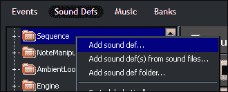

用于创建声音定义的界面有点像简单事件界面的简化版本，左侧是播放列表，右侧是其他所有属性。由于大多数属性控制的是我们已经在简单事件中看到的内容，因此在这里不需要重复这些信息：

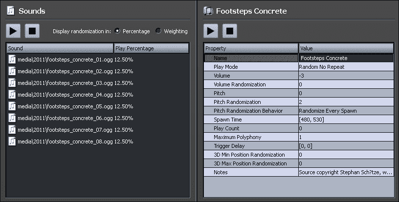

要创建多轨事件，请按照创建简单事件的相同步骤，但选择**添加多轨事件**选项。

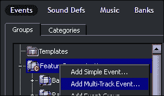

多轨事件分为层或轨道，每个层可以包含多个声音定义。通过右键单击以下界面并从上下文菜单中选择**添加层**或**添加声音**选项来添加新层或向层添加声音：

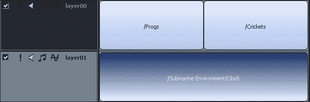

默认情况下，前面的示例将同时播放所有三个声音定义。只要我们在声音上添加参数，这种行为就会改变，可以通过右键单击声音区域顶部的黑暗区域，并从列表中选择**添加参数**选项来完成：

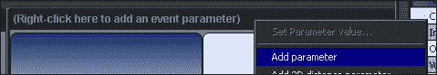

参数本质上是一个具有一定范围允许值的变量，游戏代码可以修改。FMOD Designer 表示参数的方式可能看起来像时间轴，但重要的是要理解参数是一个通用值，并不一定代表时间。

我们创建的第一个参数标记为**主要**参数，并确定要播放哪些声音。在下面的示例中，只有与红线（代表**主要**参数的当前值）接触的两个声音将会播放。将参数的值更改为大于 0.5 的任何值将用**蛙鸣**声替换**蟋蟀**声。我们可以在同一个事件中创建多个参数，尽管其中只有一个会被标记为主要：

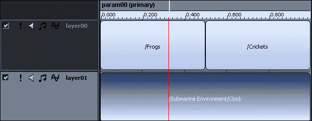

参数的另一个用途是控制每个层的声音属性。为了做到这一点，我们必须首先通过右键单击层并选择**添加效果**选项来向要控制的层添加效果。效果可以从简单的音量或音高控制到更复杂的 DSP 效果，如失真或延迟：

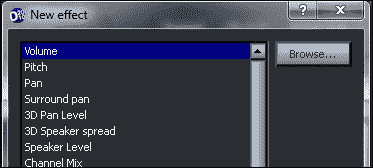

在层上添加效果并选择参数后，我们可以在层上绘制曲线，表示效果的属性应该随参数值的变化而变化。在下面的示例中，我们向事件添加了第二个参数，它修改了第一层的音高和第二层的音量：

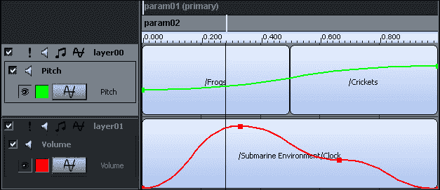

最后，通过右键单击多轨事件中的任何声音，我们可以访问一些其他地方无法使用的声音实例属性。在这些属性中，有一个自动音高特性，它的行为类似于向该声音添加音高效果，并根据参数进行控制，但使用起来更简单。当尝试模拟汽车引擎的声音时，这个特性非常有用：

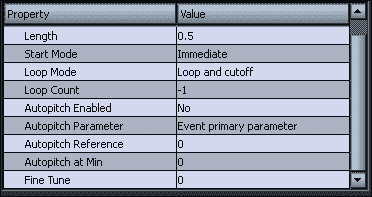

## 多轨事件的示例

以下是一些关于如何在游戏中提供更具交互性和动态性的游戏音频体验的多轨事件的想法。其中许多想法是基于之前讨论的简单事件的想法。

### 创建交互式的脚步声音循环

在前一节的简单事件示例中，描述了如何生成循环的脚步声音。然而，该声音仅适用于特定的行走速度和特定的地面。使用多轨事件，我们可以创建一个单一的声音事件，其中包含所有不同类型地面的脚步声音，比如草地、混凝土或沙地，并允许游戏通过参数来控制行走速度。

为了实现这一点，我们首先必须为角色可以行走的每种地面类型创建一个声音定义。每个声音定义应该以平均行走速度播放脚步声音循环，我们可以通过生成速率参数来控制这个速度（这个速度应该在每个声音定义之间保持一致）。

然后，我们必须创建一个多轨事件，其中包含一个图层和两个参数来控制地面类型（主要）和行走速度。通过将所有声音添加到这个图层中，均匀分布它们（通过右键单击并选择**均匀布局声音**选项），并将`surface type`参数的最大范围设置为图层中声音的总数，我们可以使用该参数作为简单的索引来选择角色所行走的地面类型。

对于`walking speed`参数，我们需要向图层添加一个`Spawn Intensity`类型的效果，并绘制一条曲线来控制生成强度与`walking speed`参数的关系。例如，数值为 0.5 意味着脚步声将以平均速度的一半发生，而数值为 2.0 意味着脚步声将以平均速度的两倍发生。

### 模拟汽车引擎的声音

我们还可以使用多轨事件来生成复杂的交互声音，比如汽车引擎的声音。FMOD Designer 示例项目中有一个很棒的汽车引擎模拟，我们可以学习。该声音事件有两个图层和两个参数，一个用于引擎的转速，另一个用于引擎的负载。

每个图层包含四种不同的声音，这些声音是从汽车引擎在不同转速范围内录制的。顶层的声音对应汽车加速（负载），而底层的声音对应汽车减速（卸载）。

`load`参数用于在运行时混合两个图层，并产生音量效果。当`load`参数处于中间时，我们听到两个图层的混合声音，但随着`load`参数的变化，音量迅速变化，以至于我们只听到其中一个图层的声音。

`rpm`参数有两个作用。作为主要参数，它确定当前数值应该播放哪四种声音中的哪一种。实际上，这些声音在边缘处重叠，因此在某些转速数值下，我们可以同时听到两种声音的混合。`rpm`参数的另一个作用是修改声音的音调，因此转速数值越高，声音的音调就越高。这是通过在每个声音上启用**自动音调**功能来自动处理的：

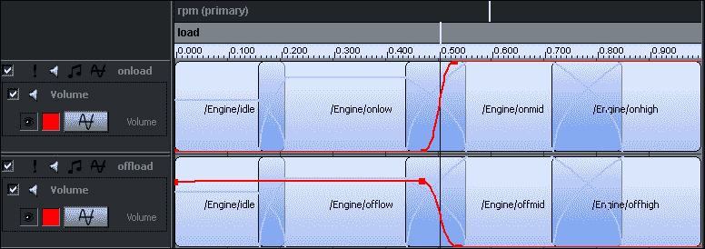

### 创建一个复杂的森林环境音轨

使用一个简单的事件，我们能够创建一个循环的环境音轨，其中有大量的鸟鸣声。使用多轨事件，我们可以轻松地扩展环境音轨，以包含其他声音图层。例如，我们可以添加一个包含背景中风声循环的声音图层，以及其他类型动物的叫声图层，这些叫声可能以不同的速率发生，与鸟鸣声不同。

如果我们想要在森林中模拟一个洞穴，我们可以创建一个参数来控制角色的位置，并为每个图层添加一个遮蔽效果，该效果仅在一定数值范围内有效。

此外，我们可以创建一个参数来指定一天中的时间，并根据其数值播放不同的声音，比如在夜晚消除鸟鸣声，并加入一些蟋蟀的声音。

# 交互音乐

就像我们可以创建根据游戏事件而改变的复杂音效一样，也可以对游戏的背景音乐做同样的事情。这使得音乐可以适应环境，例如，在危险临近时传达正确的情感，或者提供紧张感。

以这种非线性方式播放的音乐被称为交互式音乐（如果玩家直接控制变化）或自适应音乐（如果音乐对游戏环境做出反应，但不一定对玩家做出反应）。创建交互式音乐有两种主要方法。

## 垂直方法（重新编排）

在这种方法中，音频系统根据游戏中发生的事件实时修改歌曲的混音。例如，可以向歌曲添加新乐器，或者使音乐播放速度更快或更慢以匹配游戏玩法。

在 FMOD Designer 中实现这种类型的交互式音乐最简单的方法是使用多轨事件结合特别准备的多声道音频文件（可以使用 Audacity 等音频编辑软件创建）。这通常需要将音乐分成层，并将每个层添加到文件中的不同音频通道中。然后，使用多轨事件上的通道混音效果，我们可以根据参数的值轻松控制每个音频通道的音量。

这种技术最常见的应用是创建“紧张”或“兴奋”参数，使得随着数值的增加，歌曲变得更加紧张（通过添加更多层）。著名的日本作曲家近藤浩治非常喜欢使用这种方法创建交互式音乐。一些最近的例子包括：

+   在《超级马里奥银河》的关卡中，马里奥站在星球上移动的速度完全决定了歌曲的音调、播放速度，甚至演奏的乐器数量。

+   在《塞尔达传说：天空之剑》的市场区域，每个商人都有自己的市场主题变化。当林克接近其中一个商人时，音乐会非常平稳地转换为相应的变化（同时保持正确的主题内相对定位）。

## 水平方法（重新排列）

在这种方法中，音乐根据游戏事件移动或跳转到不同的部分。这通常需要将音乐分成段，以便游戏可以在它们之间进行过渡。当系统不在段之间过渡时，它会保持当前段的循环，音乐会持续播放。

通常需要音乐的速度和拍子信息，以便音频系统可以将过渡与歌曲的节拍或小节同步，以提供更加音乐化的体验。FMOD Designer 中的交互式音乐系统能够以这种方式创建交互式音乐序列。

使用水平方法创建交互式音乐的经典例子是《猴岛传奇 3》中的歌曲《我是个海盗》，玩家实际上可以实时选择角色接下来要唱的歌词。歌曲在玩家做出选择时等待循环，并在之后平稳过渡。

# 从游戏代码中调用声音事件

为了在游戏中测试我们的 FMOD Designer 项目，我们必须首先构建项目，通过选择“从项目构建”菜单或按下 Ctrl + B。这个过程将生成我们必须复制到游戏资产文件夹中的 fev 和 fsb 文件。

接下来，我们必须向我们的 C++项目添加一些额外的依赖项，以便与 FMOD Designer API 进行交互。这些依赖项与 FMOD Ex 程序员 API 一起提供，但我们必须自己添加引用，如下所示：

1.  导航到**C/C++** | **常规**，并将`C:\FMOD\ fmoddesignerapi\api\inc`添加到**附加包含目录**列表中（条目用分号分隔）。

1.  导航到**链接器** | **常规**，并将`C:\FMOD\ fmoddesignerapi\api\lib`添加到**附加库目录**列表中。

1.  导航到**链接器** | **输入**，并将`fmod_event.lib`添加到**附加依赖项**列表中。

1.  导航到**构建事件** | **后期构建事件**，并将`xcopy /y "C:\FMOD\fmoddesignerapi\api\fmod_event.dll” "$(OutDir)”`添加到**命令行**列表中。

1.  从您的代码中包含`<fmod_event.hpp>`头文件。

最后，加载 FMOD Designer 项目，播放声音事件，并修改一些参数的过程，在很多方面与我们在第二章中看到的*音频播放*类似。让我们看看最基本的做法。

首先，我们必须创建和初始化一个`FMOD::EventSystem`对象，并加载项目文件。我们还应该在每一帧调用`update()`方法，并在游戏结束时调用`release()`方法：

```cpp
// Create an event system object
FMOD::EventSystem* eventSystem;
FMOD::EventSystem_Create(&eventSystem);

// Initialize the event system and load the project
eventSystem->init(100, FMOD_INIT_NORMAL, 0, FMOD_EVENT_INIT_NORMAL);
eventSystem->load("project.fev”, 0, 0);

// Update event system every frame
eventSystem->update();

// Release event system when we are done
eventSystem->release();
```

为了播放一个事件，我们必须通过事件的完全限定名称来获取对它的引用，其中包含项目名称、包含事件的事件组的名称和事件本身的名称。然后，我们可以简单地使用`start()`方法来播放事件：

```cpp
// Get a reference to the event
FMOD::Event* event;
eventSystem->getEvent("ProjectName/EventGroupName/EventName”,
                      FMOD_EVENT_DEFAULT, &event);
// Begin playing the event
event->start();
```

最后，如果有一个我们想要修改的参数，我们可以使用事件对象的`getParameter()`方法获取对它的引用，并使用参数对象的`setValue()`方法更改值：

```cpp
// Get a reference to the parameter
FMOD::EventParameter* parameter;
event->getParameter("ParameterName”, &parameter);

// Change the value of the parameter
parameter->setValue(2.0f);
```

# 总结

在本章中，我们看到了声音可以不仅仅是一个音频文件，FMOD 有一个名为 FMOD Designer 的高级工具，我们可以在 FMOD Designer 中创建简单和多轨声音事件，我们还可以将一些概念应用到音乐中，并从我们的应用程序中播放在 FMOD Designer 中创建的声音事件。
