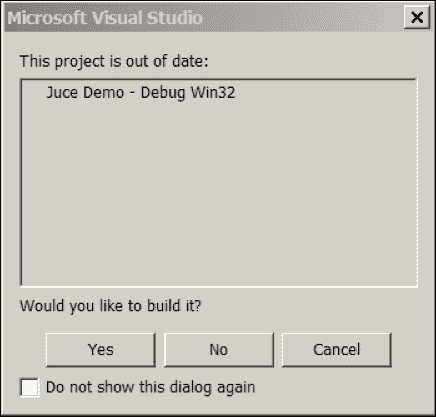
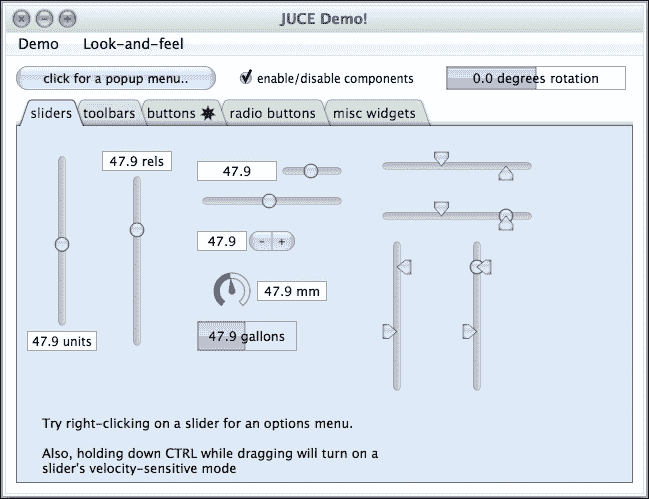
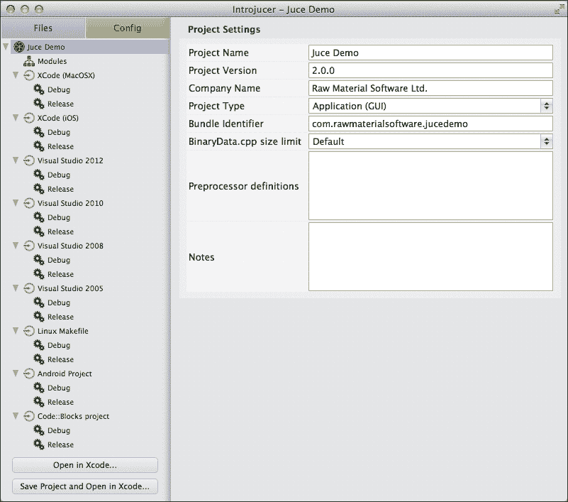
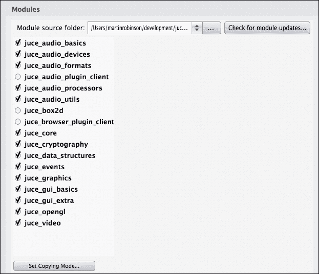
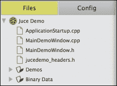
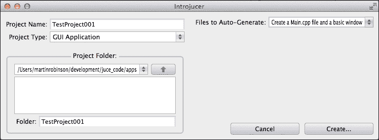
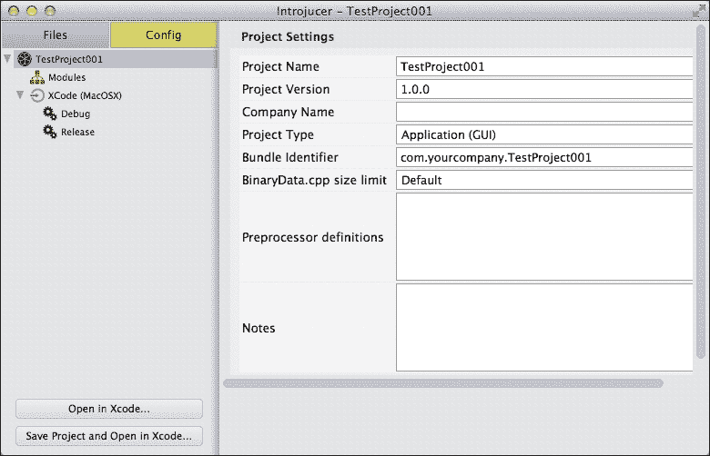
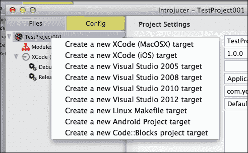
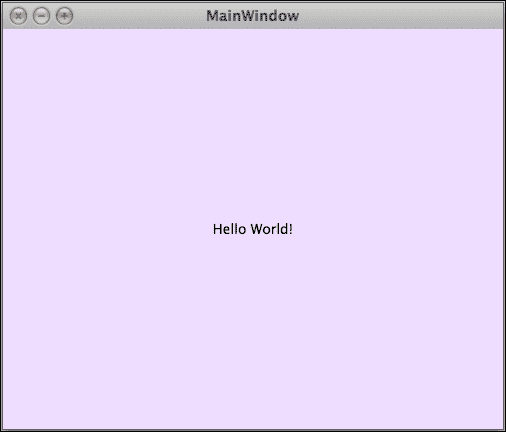
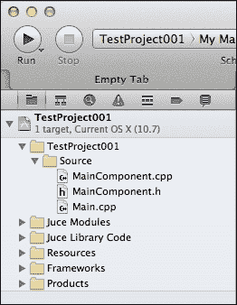

# 第一章：安装 JUCE 和 Introjucer 应用程序

本章将指导您安装 JUCE 库，并涵盖其源代码树的结构，包括一些可用于创建基于 JUCE 的项目的有用工具。在本章中，我们将涵盖以下主题：

+   为 Mac OS X 和 Windows 安装 JUCE

+   构建 和 运行 JUCE 示例项目

+   构建 和 运行 Introjucer 应用程序

+   使用 Introjucer 应用程序创建 JUCE 项目

在本章结束时，您将安装 JUCE 并使用 Introjucer 应用程序创建一个基本项目。

# 为 Mac OS X 和 Windows 安装 JUCE

**JUCE** 支持为多种目标平台开发 C++ 应用程序。这些平台包括 Microsoft Windows、Mac OS X、iOS、Linux 和 Android。一般来说，本书涵盖了使用 JUCE 在 Windows 和 Mac OS X 上开发 C++ 应用程序，但将此知识应用于构建其他支持的目标平台的应用程序相对简单。

为了为这些平台编译基于 JUCE 的代码，通常需要一个 **集成开发环境**（**IDE**）。要为 Windows 编译代码，建议使用 Microsoft Visual Studio IDE（支持的变体包括 Microsoft Visual Studio 2008、2010 和 2012）。Microsoft Visual Studio 可从 [`www.microsoft.com/visualstudio`](http://www.microsoft.com/visualstudio) 下载（免费 Express 版本足以用于非商业开发）。要为 Mac OS X 或 iOS 编译代码，需要 Xcode IDE。通常，建议使用最新的公共版本。这可以从 Mac App Store 内免费下载。

JUCE 以源代码形式提供（而不是预构建库），分为离散但相互关联的 **模块**。`juce_core` 模块根据 **Internet Systems Consortium** (**ISC**) 许可证授权，允许在商业和开源项目中免费使用。所有其他 JUCE 模块都采用双重许可。对于开源开发，JUCE 可以根据 **GNU 通用公共许可证**（版本 2 或更高版本）或 **Affero 通用公共许可证**（版本 3）的条款进行许可。JUCE 还可用于闭源、商业项目，并使用单独的商业许可证付费。有关 JUCE 许可的更多信息，请参阅 [`www.juce.com/documentation/commercial-licensing`](http://www.juce.com/documentation/commercial-licensing)。

除非有非常具体的原因需要使用 JUCE 的特定版本，否则建议使用项目 GIT 仓库中可用的当前开发版本。这个版本几乎总是保持稳定，并且经常包括有用的新功能和错误修复。源代码可以通过任何 GIT 客户端软件下载，网址为 [git://github.com/julianstorer/JUCE.git](http://git://github.com/julianstorer/JUCE.git) 或 [git://git.code.sf.net/p/juce/code](http://git://git.code.sf.net/p/juce/code)。或者，当前开发版本的代码可以从 [`github.com/julianstorer/JUCE/archive/master.zip`](https://github.com/julianstorer/JUCE/archive/master.zip) 下载为 ZIP 文件。

应该将 JUCE 源代码保留在其顶级 `juce` 目录中，但应将其移动到系统上的一个合理位置，以适应您的工作流程。`juce` 目录具有以下结构（目录使用尾随 `/` 表示）：

```cpp
amalgamation/
docs/
extras/
juce_amalgamated.cpp
juce_amalgamated.h
juce_amalgamated.mm
juce.h
modules/
README.txt

```

虽然所有这些文件都很重要，JUCE 库本身的实际代码位于 `juce/modules` 目录中，但每个模块都包含在其自己的子目录中。例如，之前提到的 `juce_core` 模块位于 `juce/modules/juce_core` 目录中。本章的剩余部分将检查 `juce/extras` 目录中的一些重要项目。这个目录包含了一系列有用的项目，特别是 JUCE 演示项目和 Introjucer 项目。

# 构建 和 运行 JUCE 演示应用程序

为了概述 JUCE 提供的功能，分发中包含了一个演示项目。这不仅是一个良好的起点，而且是一个有用的资源，其中包含了许多关于整个库中类实现细节的示例。这个 JUCE 演示项目可以在 `juce/extras/JuceDemo` 中找到。这个目录的结构是 **Introjucer** 应用程序（将在本章后面介绍）生成的 JUCE 项目的典型结构。

| 项目目录内容 | 目的 |
| --- | --- |
| `Binary Data` | 包含任何二进制文件的目录，例如图像和音频文件，这些文件将作为代码嵌入到项目中 |
| `Builds` | 包含原生平台 IDE 项目文件的目录 |
| `Juce Demo.jucer` | Introjucer 项目文件 |
| `JuceLibraryCode` | 通用 JUCE 库代码、配置文件以及转换为源代码的二进制文件，以便包含在项目中 |
| `Source` | 项目特定的源代码 |

要构建和运行 JUCE 演示应用程序，请从 `juce/extras/Builds` 目录中打开相应的 IDE 项目文件。

## 在 Windows 上运行 JUCE 演示应用程序

在 Windows 上，打开相应的 Microsoft Visual Studio 解决方案文件。例如，使用 Microsoft Visual Studio 2010，这将是指向 `juce/extras/JuceDemo/Builds/VisualStudio2010/Juce Demo.sln` 的链接（其他项目和解方案文件版本也适用于 Microsoft Visual Studio 2008 和 2012）。

现在，通过导航到菜单项 **调试** | **开始调试** 来构建和运行项目。你可能会被询问是否要首先构建项目，如下面的截图所示：



点击 **是**，如果成功，JUCE 示例应用程序应该会出现。

## 在 Mac OS X 上运行 JUCE 示例应用程序

在 Mac OS X 上，打开 Xcode 项目文件：`juce/extras/JuceDemo/Builds/MacOSX/Juce Demo.xcodeproj`。要构建和运行 JUCE 示例应用程序，导航到菜单项 **产品** | **运行**。如果成功，JUCE 示例应用程序应该会出现。

## JUCE 示例应用程序概述

JUCE 示例应用程序分为一系列演示页面，每个页面都展示了 JUCE 库的一个有用方面。以下截图显示了 *Widgets* 演示（它在 Mac OS X 上的外观）。这可以通过导航到菜单项 **演示** | **Widgets** 来访问。



Widgets 演示展示了 JUCE 为应用程序开发提供的许多常用 **图形用户界面**（**GUI**）控件。在 JUCE 中，这些图形元素被称为 **组件**，这是 第二章 *构建用户界面* 的重点。有一系列滑块、旋钮、按钮、文本显示、单选按钮和其他组件，这些都是可定制的。**演示**菜单中默认提供其他演示，涵盖功能如 **图形渲染**、**字体和文本**、**多线程**、**树视图**、**表格组件**、**音频**、**拖放**、**进程间通信**、**网络浏览器** 和 **代码编辑器**。在某些平台和某些硬件和软件可用时，还有其他演示可用。这些是 **QuickTime**、**DirectShow**、**OpenGL** 和 **摄像头捕获** 演示。

## 自定义外观和感觉

默认情况下，JUCE 示例应用程序使用 JUCE 自带的窗口标题栏、自己的菜单栏外观以及默认的 **外观和感觉**。标题栏可以配置为使用原生操作系统外观。以下截图显示了 JUCE 示例应用程序在 Windows 平台上的标题栏。请注意，尽管按钮的外观与 Mac OS X 上相同，但它们的位置应该对 Windows 用户来说更为熟悉。


通过导航到菜单项 **外观和感觉** | **使用原生窗口标题栏**，标题栏可以使用操作系统上可用的标准外观。以下截图显示了 Mac OS X 上原生标题栏的外观：


默认菜单栏外观，其中菜单项出现在标题栏下方的应用程序窗口内，应该对 Windows 用户来说很熟悉。当然，这并不是 Mac OS X 平台上应用程序菜单的默认位置。同样，这可以通过在 JUCE 示例应用程序中导航到菜单项 **外观和感觉** | **使用原生 OSX 菜单栏** 来指定。这将菜单栏移动到屏幕顶部，这将更符合 Mac OS X 用户的习惯。所有这些选项都可以在基于 JUCE 的代码中进行自定义。

JUCE 还提供了一个机制，可以通过其 `LookAndFeel` 类来定制许多内置组件的外观和感觉。这种外观和感觉可以应用于特定类型的某些组件或全局应用于整个应用程序。JUCE 本身以及 JUCE 示例应用程序提供了两种外观和感觉选项：*默认*外观和感觉以及*旧版，原始的*（即“老式”）外观和感觉。在 JUCE 示例应用程序中，可以通过 **外观和感觉** 菜单访问这些选项。

在进入下一节之前，你应该探索 JUCE 示例应用程序，下一节将介绍如何构建简化多平台项目管理的 Introjucer 应用程序。

# 构建 和 运行 Introjucer 应用程序

Introjucer 应用程序是一个基于 JUCE 的应用程序，用于创建和管理多平台 JUCE 项目。Introjucer 应用程序能够生成适用于 Mac OS X 和 iOS 的 Xcode 项目，适用于 Windows 项目的 Microsoft Visual Studio 项目（和解决方案），以及所有其他支持平台的项目文件（以及其他 IDE，如跨平台 IDE CodeBlocks）。Introjucer 应用程序执行多项任务，使得管理此类项目变得更加容易，例如：

+   将项目的源代码文件填充到所有原生 IDE 项目文件中

+   配置 IDE 项目设置以链接到目标平台上的必要库

+   将任何预处理器宏添加到某些或所有目标 IDE 项目中

+   将库和头文件搜索路径添加到 IDE 项目中

+   为产品命名并添加任何图标文件

+   自定义调试和发布配置（例如，代码优化设置）

这些都是在首次设置项目时非常有用的功能，但在项目后期需要做出更改时，它们的价值更大。如果需要在几个不同的项目中更改产品名称，这相对比较繁琐。使用 Introjucer 应用程序，大多数项目设置都可以在 Introjucer 项目文件中设置。保存后，这将修改任何新设置的本地 IDE 项目。您应该知道，这也会覆盖对本地 IDE 项目所做的任何更改。因此，在 Introjucer 应用程序中做出所有必要的更改是明智的。

此外，Introjucer 应用程序还包括一个 GUI 编辑器，用于排列任何 GUI 组件。这减少了某些类型 GUI 开发所需的编码量。Introjucer 应用程序的这部分在您的应用程序运行时生成重建 GUI 所需的 C++ 代码。

Introjucer 应用程序以源代码形式提供；在使用之前，您需要构建它。源代码位于 `juce/extras/Introjucer`。与构建 JUCE Demo 应用程序类似，`juce/extras/Introjucer/Builds` 中提供了各种 IDE 项目（当然，iOS 或 Android 没有 Introjucer 构建版本）。建议使用发布配置构建 Introjucer 应用程序，以利用任何代码优化。

## 在 Windows 上构建 Introjucer 应用程序

在 Microsoft Visual Studio 中打开 `juce/extras/Introjucer/Builds` 中的相应解决方案文件。将解决方案配置从 **调试** 更改为 **发布**，如图所示：


现在，您应该通过导航到菜单项 **构建** | **构建解决方案** 来构建 Introjucer 项目。成功完成后，Introjucer 应用程序将在 `juce/extras/Introjucer/Builds/VisualStudio2010/Release/Introjucer.exe`（或类似，如果您使用的是 Microsoft Visual Studio 的不同版本）中可用。此时，您应该在 `Desktop` 或 **开始菜单** 中添加快捷方式，或者使用适合您典型工作流程的方式。

## 在 Mac OS X 上构建 Introjucer 应用程序

打开位于 `juce/extras/Introjucer/Builds/MacOSX/The Introjucer.xcodeproj` 的 Xcode 项目。要在发布配置中构建 Introjucer 应用程序，导航到菜单项 **产品** | **构建** | **存档**。成功完成后，Introjucer 应用程序将在 `juce/extras/Introjucer/Builds/MacOSX/build/Release/Introjucer.app` 中可用。此时，您应该在 `~/Desktop` 中添加别名，或者使用适合您典型工作流程的方式。

## 检查 JUCE Demo Introjucer 项目

为了说明 Introjucer 项目的结构和功能，让我们检查 JUCE Demo 应用程序的 Introjucer 项目。打开您在系统上刚刚构建的 Introjucer 应用程序。在 Introjucer 应用程序中，导航到菜单项 **文件** | **打开…** 并导航到打开 JUCE Demo Introjucer 项目文件（即 `juce/extras/JuceDemo/Juce Demo.jucer`)。

Introjucer 项目使用典型的 **主从** 界面，如下面的截图所示。在左侧，或主部分，有 **文件** 或 **配置** 面板，可以使用屏幕标签或通过 **视图** 菜单进行选择。在右侧，或详细部分，有与主部分中选定的特定项目关联的设置。在主部分的 **配置** 面板中选择项目名称时，整个 JUCE Demo 项目的全局设置将在详细部分中显示。**配置** 面板显示了项目针对不同本地 IDE 的可用目标构建的层次结构。



除了 **配置** 面板中与本地 IDE 目标相关的这些部分之外，还有一个名为 **模块** 的项目。如前所述，JUCE 代码库被划分为松散耦合的模块。每个模块通常封装了一组特定的功能（例如，图形、数据结构、GUI、视频）。下面的截图显示了可用的模块以及为 JUCE Demo 项目启用的或禁用的模块。



可以根据特定项目所需的功能来启用或禁用模块。例如，一个简单的文本编辑应用程序可能不需要任何视频或音频功能，与该功能相关的模块可以被禁用。

每个模块都有自己的设置和选项。在许多情况下，这些设置可能包括使用本地库以实现某些功能（在这些平台上性能可能是一个高优先级）或是否应该使用跨平台的 JUCE 代码来实现该功能（在这些平台上跨平台的致性是一个更高的优先级）。每个模块可能依赖于一个或多个其他模块，在这种情况下，如果它有缺失的依赖项，它将被突出显示（并且选择该模块将解释需要启用哪些模块来解决这个问题）。为了说明这一点，尝试关闭 `juce_core` 模块的复选框。所有其他模块都依赖于这个 `juce_core` 模块，正如其名称所暗示的，它提供了 JUCE 库的核心功能。

每个模块都有一个复制模式（或**创建本地副本**）选项。当此选项开启（或设置为**将模块复制到项目文件夹中**）时，Introjucer 应用程序将源代码从 JUCE 源树复制到项目的本地项目层次结构中。当此选项关闭时，原生 IDE 将被指示直接在 JUCE 源树中引用 JUCE 源文件。您在这里的偏好是个人口味和具体情况的问题。

左侧的**文件**面板显示了所有将在原生 IDE 中可用的源代码的层次结构，以及将转换为跨平台源代码（并由 Introjucer 应用程序包含在原生 IDE 项目中的）的二进制文件（例如，图像、音频、XML、ZIP）。JUCE 演示项目的顶级文件结构如下截图所示：



在**文件**面板中选择文件可以使您直接在 Introjucer 应用程序中编辑文件。目前，在具有代码补全、错误检查等功能的原生 IDE 中进行大多数代码编辑更为方便。

现在我们已经熟悉了 Introjucer 应用程序，让我们用它从头开始创建一个项目。

# 使用 Introjucer 应用程序创建 JUCE 项目

本节将指导您创建一个新的 Introjucer 项目，从该项目创建原生 IDE 项目，并运行您的第一个 JUCE 应用程序。首先，通过导航到菜单项**文件**|**关闭项目**来关闭任何打开的 Introjucer 项目。接下来，选择菜单项**文件**|**新建项目…**，Introjucer 应用程序将呈现其新项目窗口。使用窗口的**项目文件夹**部分，导航到您想要保存项目的地方（请记住，项目实际上是一个包含代码层次结构和可能包含二进制文件（例如，图像、音频、XML、ZIP）的文件夹）。如图所示，在**项目名称**字段中命名项目为`TestProject001`，并从**要自动生成的文件**菜单中选择**创建 Main.cpp 文件**和**基本窗口选项**：



最后，单击**创建…**按钮，应会呈现一个熟悉的 Introjucer 项目，类似于以下截图所示：



初始时，Introjucer 应用程序只为用户的当前平台创建一个目标 IDE 平台。在**配置**面板中右键单击（在 Mac OS X 上，按*control*键并单击）项目名称。这会显示一系列选项，用于将目标平台添加到项目中，如下面的截图所示：



选择**文件**面板并注意，Introjucer 应用程序为这个基本项目创建了三个文件：

+   `Main.cpp`: 这管理应用程序的生命周期并包含应用程序的主入口点。它还包括将主应用程序窗口呈现给用户的代码。此窗口反过来在这个窗口中呈现一个`MainContentComponent`对象，该对象在剩余的两个文件中指定。

+   `MainComponent.cpp`: 这包括了将内容绘制到主应用程序窗口中的代码。在这种情况下，这只是一个“Hello world!”消息，但可能包含复杂和层次化的用户界面。

+   `MainComponent.h`: `MainComponent.cpp`文件的头文件。

建议您使用此 Introjucer 项目页面添加任何新文件。如前所述，这确保了任何新文件都会添加到所有目标平台的所有项目中，而不是您必须单独管理。在这个例子中，您不会添加任何文件。即使在所有其他平台（即这些文件不是为每个平台单独复制）上编译时使用的是完全相同的文件，在本地 IDE 中编辑源文件也不是问题。您可能需要了解一些编译器之间的差异，但尽可能依赖 JUCE 类（其中已经考虑了这一点）将有助于这方面。

要在您的本地 IDE 中打开项目，首先通过导航到菜单项**文件** | **保存项目**来保存项目。然后，从**文件**菜单中选择适当的选项以在 IDE 中打开本地项目。在 Mac OS X 上，此菜单项为**在 Xcode 中打开…**，而在 Windows 上为**在 Visual Studio 中打开…**。还有一个**菜单**选项结合这两个操作，并在**配置**面板底部有一个相应的快捷按钮。

一旦项目被加载到您的 IDE 中，您应该像之前使用 JUCE 演示项目一样构建和运行项目。如果成功，您应该会看到一个如下所示的窗口：



Introjucer 应用程序添加到项目中的三个源文件可以在您的本地 IDE 中看到。以下截图显示了 Mac OS X 上 Xcode 中的项目结构。在 Microsoft Visual Studio 中类似。



编辑`MainComponent.cpp`文件（在 Xcode 中单击或 Microsoft Visual Studio 中双击）。检查`MainContentComponent::paint()`函数。这个函数包含四个调用以绘制到`Component`对象的`Graphics`上下文中：

+   `Graphics::fillAll()`: 使用特定颜色填充背景

+   `Graphics::setFont()`: 将字体设置为给定的字体和大小

+   `Graphics::setColour()`: 将前景绘图颜色设置为特定颜色

+   `Graphics::drawText()`: 这将在指定位置绘制一些文本

尝试更改这些值中的某些值，并重新构建应用程序。

# 文档和其他示例

JUCE 在以下 URL 上有完整的文档：

[`www.juce.com/juce/api/`](http://www.juce.com/juce/api/)

所有 JUCE 类都使用 **Doxygen** 应用程序进行文档化 ([`www.doxygen.org`](http://www.doxygen.org))，它将特殊格式化的代码注释转换为可读的文档页面。因此，如果您愿意，您也可以从 JUCE 源代码头文件中阅读注释。这有时更方便，取决于您的 IDE，因为您可以从代码文本编辑器中轻松导航到文档。在本书的剩余部分，您将被指导到正在讨论的关键类的文档。

JUCE 被许多商业开发者用于应用程序和音频插件，特别是。一些例子包括：

+   **Tracktion** 音乐制作软件有效地启动了 JUCE 库的开发

+   **Cycling 74** 的旗舰产品 **Max** 从版本 5 开始使用 JUCE 开发

+   **Codex Digital** 生产的产品被广泛用于好莱坞电影的制作

+   其他重要的开发者包括 **Korg**、**M-Audio** 和 **TC Group**

还有许多其他软件，其中一些出于商业原因将它们对 JUCE 的使用保密。

# 摘要

本章已指导您安装适用于您平台的 JUCE，到这一点，您应该已经很好地掌握了源代码树的结构。您应该通过探索 JUCE 示例项目来熟悉 JUCE 的功能。您将安装并使用的 Introjucer 应用程序为使用 JUCE 创建和管理项目提供了基础。您还将知道如何通过 JUCE 网站，或源代码中找到 JUCE 文档。在下一章中，您将更详细地探索 `Component` 类，以创建各种用户界面并执行绘图操作。
