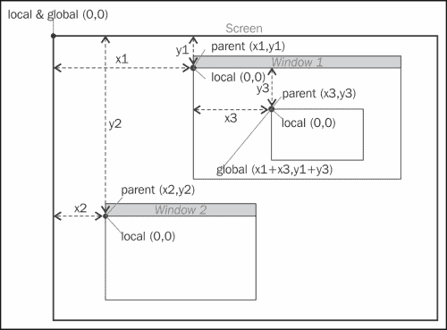
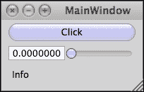
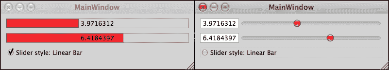
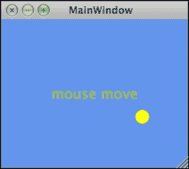
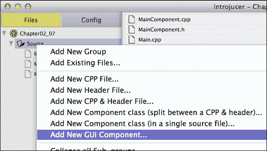
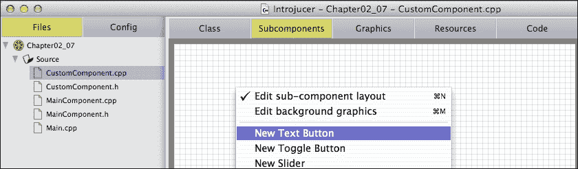
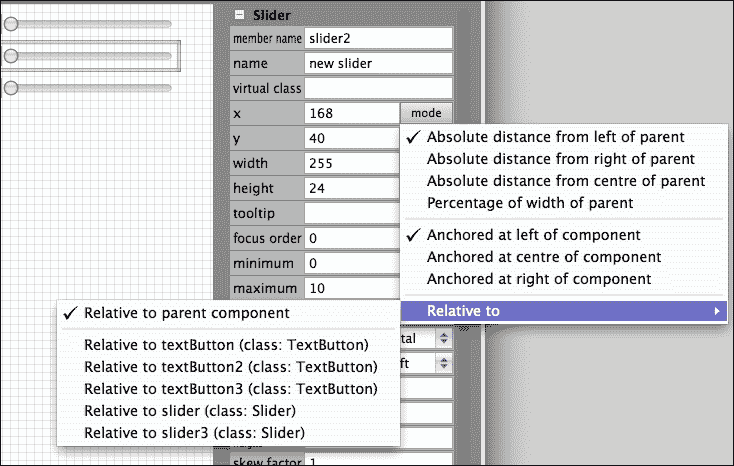

# 第二章 构建用户界面

本章涵盖了 JUCE 的 `Component` 类，这是在 JUCE 中创建 **图形用户界面**（**GUI**）的主要构建块。在本章中，我们将涵盖以下主题：

+   创建按钮、滑块和其他组件

+   响应用户交互和变化：广播器和监听器

+   使用其他组件类型

+   指定颜色和使用绘图操作

到本章结束时，您将能够创建一个基本的 GUI 并在组件内执行基本的绘图操作。您还将具备设计和构建更复杂界面的技能。

# 创建按钮、滑块和其他组件

JUCE 的 `Component` 类是提供在屏幕上绘制和拦截来自指针设备、触摸屏交互和键盘输入的用户交互的基础类。JUCE 发行版包括广泛的 `Component` 子类，其中许多您可能在探索 第一章 中的 JUCE 示例应用程序时已经遇到，*安装 JUCE 和 Introjucer 应用程序*。JUCE 坐标系统是分层的，从计算机屏幕（或屏幕）级别开始。以下图示展示了这一点：



每个屏幕上的窗口包含一个 **父** 组件，其中放置了其他 **子** 组件（或 **子组件**）（每个可能包含进一步的子组件）。计算机屏幕的左上角坐标为（0，0），JUCE 窗口内容的左上角都从这个坐标偏移。每个组件都有自己的局部坐标，其左上角也始于（0，0）。

在大多数情况下，您将处理组件相对于其父组件的坐标，但 JUCE 提供了简单的机制将这些值转换为相对于其他组件或主屏幕（即全局坐标）。注意在前面的图中，窗口的左上角位置不包括标题栏区域。

现在您将创建一个简单的 JUCE 应用程序，其中包含一些基本组件类型。由于这个项目的代码将会非常简单，我们将所有代码都写入头文件（`.h`）。这虽然在现实世界的项目中并不推荐，除非是相当小的类（或者有其他很好的理由），但这样可以将所有代码放在一个地方，便于我们进行操作。此外，我们将在本章的后面将代码拆分为 `.h` 和 `.cpp` 文件。

使用 Introjucer 应用程序创建一个新的 JUCE 项目：

1.  选择菜单项 **文件** | **新建项目…**

1.  从 **自动生成文件** 菜单中选择 **创建 Main.cpp 文件和一个基本窗口**。

1.  选择保存项目的地方，并将其命名为 `Chapter02_01`。

1.  点击 **创建…** 按钮

1.  导航到 **文件** 面板。

1.  右键单击文件`MainComponent.cpp`，从上下文菜单中选择**删除**，并确认。

1.  选择菜单项**文件** | **保存项目**。

1.  在你的**集成开发环境**（**IDE**）中打开项目，无论是 Xcode 还是 Visual Studio。

在你的 IDE 中导航到`MainComponent.h`文件。此文件最重要的部分应该看起来类似于以下内容：

```cpp
#include "../JuceLibraryCode/JuceHeader.h"

class MainContentComponent  : public Component
{
public:
  //==============================================================
  MainContentComponent();
  ~MainContentComponent();

  void paint (Graphics&);
  void resized();

  private:
  //==============================================================
  JUCE_DECLARE_NON_COPYABLE_WITH_LEAK_DETECTOR
    (MainContentComponent)
};
```

当然，我们已经通过删除`.cpp`文件从自动生成项目中移除了实际代码。

首先，让我们创建一个空窗口。我们将删除一些元素以简化代码，并为构造函数添加一个函数体。将`MainContentComponent`类的声明更改如下：

```cpp
class MainContentComponent : public Component
{
public:
  MainContentComponent()
  {
    setSize (200, 100);
  }
};
```

构建并运行应用程序，屏幕中央应该有一个名为**MainWindow**的空窗口。我们的 JUCE 应用程序将创建一个窗口，并将我们的`MainContentComponent`类的实例作为其内容（即不包括标题栏）。注意我们的`MainContentComponent`类继承自`Component`类，因此可以访问`Component`类实现的一系列函数。其中第一个是`setSize()`函数，它设置我们组件的宽度和高度。

## 添加子组件

使用组件构建用户界面通常涉及组合其他组件以生成复合用户界面。这样做最简单的方法是在父组件类中包含成员变量，用于存储**子**组件。对于我们要添加的每个子组件，有五个基本步骤：

1.  创建一个成员变量以存储新组件。

1.  分配一个新的组件（无论是使用静态还是动态内存分配）。

1.  将组件添加为父组件的子组件。

1.  使子组件可见。

1.  设置子组件在父组件中的大小和位置。

首先，我们将创建一个按钮；将代码更改为如下。前面的编号步骤在代码注释中说明：

```cpp
class MainContentComponent : public Component
{
public:
  MainContentComponent()
  : button1 ("Click") // Step [2]
  {
    addAndMakeVisible (&button); // Step [3] and [4]
    setSize (200, 100);
  }

  void resized()
  {
    // Step [5]
    button1.setBounds (10, 10, getWidth()-20, getHeight()-20);
  }

private:
  TextButton button1; // Step [1]
};
```

上述代码的重要部分是：

+   我们在类的`private`部分添加了一个 JUCE `TextButton`类的实例。此按钮将被静态分配。

+   按钮在构造函数的初始化列表中使用一个字符串初始化，该字符串设置将在按钮上显示的文本。

+   将对组件函数`addAndMakeVisible()`的调用作为按钮实例的指针传递。这会将子组件添加到父组件层次结构中，并在屏幕上使组件可见。

+   组件函数 `resized()` 被重写以在父组件内部定位我们的按钮，距离边缘 10 像素（这是通过使用组件函数 `getWidth()` 和 `getHeight()` 来发现父组件的大小实现的）。当父组件被调整大小时，会触发对 `resized()` 函数的调用，在这种情况下，当我们在构造函数中调用 `setSize()` 函数时发生。`setSize()` 函数的参数顺序是：宽度然后是高度。`setBounds()` 函数的参数顺序是：左、上、宽度和高度。

构建并运行应用程序。注意按钮在鼠标指针悬停时响应，并且在按钮被点击时，尽管按钮还没有做任何事情。

通常，这是定位和调整子组件大小最方便的方法，尽管在这个例子中我们可以在构造函数中轻松设置所有大小。这项技术的真正威力在于父组件变得可调整大小时。在这里，最简单的方法是启用窗口本身的调整大小。为此，导航到 `Main.cpp` 文件（其中包含设置基本应用程序的样板代码）并将以下突出显示的行添加到 `MainWindow` 构造函数中：

```cpp
...
{
  setContentOwned (new MainContentComponent(), true);

  centreWithSize (getWidth(), getHeight());
  setVisible (true);
  setResizable (true, true);
}
...
```

构建并运行应用程序，注意窗口现在在右下角有一个角落调整大小控件。这里重要的是按钮会随着窗口大小的变化而自动调整大小，这是由于我们上面实现的方式。在调用 `setResizable()` 函数时，第一个参数设置窗口是否可调整大小，第二个参数设置这是否通过角落调整大小控件（`true`）或允许拖动窗口边框来调整窗口大小（`false`）。

子组件可以按比例定位，而不是使用绝对值或偏移值。实现这一点的其中一种方法是通过 `setBoundsRelative()` 函数。在以下示例中，你将在组件中添加一个滑动控件和一个标签。

```cpp
class MainContentComponent : public Component
{
public:
  MainContentComponent()
  : button1 ("Click"),
 label1 ("label1", "Info")
  {
 slider1.setRange (0.0, 100.0);
    addAndMakeVisible (&button1);
 addAndMakeVisible (&slider1);
 addAndMakeVisible (&label1);
    setSize (200, 100);
  }

  void resized()
  {
 button1.setBoundsRelative (0.05, 0.05, 0.90, 0.25);
 slider1.setBoundsRelative (0.05, 0.35, 0.90, 0.25);
 label1.setBoundsRelative (0.05, 0.65, 0.90, 0.25);
  }

private:
  TextButton button1;
 Slider slider1;
 Label label1;
};
```

在这种情况下，每个子组件的宽度是父组件宽度的 90%，并且从左边开始定位在父组件宽度的 5%。每个子组件的高度是父组件高度的 25%，三个组件从上到下分布，按钮从顶部开始距离父组件高度的 5%。构建并运行应用程序，注意窗口自动且平滑地调整大小，更新子组件的大小和位置。窗口应类似于以下截图。在下一节中，你将拦截并响应用户交互：



### 小贴士

**下载示例代码**

您可以从您在 [`www.packtpub.com`](http://www.packtpub.com) 的账户下载您购买的所有 Packt 书籍的示例代码文件。如果您在其他地方购买了这本书，您可以访问 [`www.packtpub.com/support`](http://www.packtpub.com/support) 并注册以直接将文件通过电子邮件发送给您。

# 响应用户交互和变化

创建一个名为 `Chapter02_02` 的新 Introjucer 项目，包含一个基本窗口；这次保留所有自动生成的文件。现在，我们将上一节中的代码拆分为 `MainComponent.h` 和 `MainComponent.cpp` 文件。`MainComponent.h` 文件应如下所示：

```cpp
#ifndef __MAINCOMPONENT_H__
#define __MAINCOMPONENT_H__

#include "../JuceLibraryCode/JuceHeader.h"

class MainContentComponent : public Component
{
public:
  MainContentComponent();
  void resized();

private:
  TextButton button1;
  Slider slider1;
  Label label1;
};
#endif 
```

`MainComponent.cpp` 文件应如下所示：

```cpp
#include "MainComponent.h"

MainContentComponent::MainContentComponent()
: button1 ("Click")
{
  slider1.setRange (0.0, 100.0);
  addAndMakeVisible (&button1);
  addAndMakeVisible (&slider1);
  addAndMakeVisible (&label1);
  setSize (200, 100);
}

void MainContentComponent::resized()
{
  button1.setBoundsRelative (0.05, 0.05, 0.90, 0.25);
  slider1.setBoundsRelative (0.05, 0.35, 0.90, 0.25);
  label1.setBoundsRelative (0.05, 0.65, 0.90, 0.25);
}
```

## 广播器和监听器

虽然滑块类已经包含一个显示滑块值的文本框，但检查这种通信如何在 JUCE 中工作将是有用的。在下一个示例中，我们将：

+   从滑块中移除文本框

+   使滑块的值出现在标签中

+   通过点击按钮使滑块能够归零

为了实现这一点，JUCE 在整个库中广泛使用 **观察者** 模式，以使对象能够进行通信。特别是，`Component` 类及其子类使用它来通知您的代码当用户界面项被点击、内容发生变化等情况。在 JUCE 中，这些通常被称为 **监听器**（观察者）和 **广播器**（观察者的主题）。JUCE 还大量使用多重继承。在 JUCE 中，多重继承特别有用的一处是通过使用广播器和监听器系统。通常，支持广播其状态变化的 JUCE 类有一个嵌套类称为 `Listener`。因此，`Slider` 类有 `Slider::Listener` 类，而 `Label` 类有 `Label::Listener` 类。（这些通常通过具有类似名称的类来表示，以帮助支持旧 IDE，例如，`SliderListener` 和 `LabelListener` 是等效的。）`TextButton` 类实际上是更通用的 `Button` 类的子类；因此，其监听器类是 `Button::Listener`。每个这些监听器类都将包含至少一个 **纯虚函数** 的声明。这将要求我们的派生类实现这些函数。监听器类可能包含其他常规虚函数，这意味着它们可以可选实现。要实现这些函数，首先在 `MainComponent.h` 文件中将按钮和滑块的监听器类作为 `MainContentComponent` 类的公共基类添加，如下所示：

```cpp
class MainContentComponent :  public Component,
 public Button::Listener,
 public Slider::Listener
{
...
```

我们这里的每个用户界面监听器都需要我们实现一个函数来响应其变化。这些是 `buttonClicked()` 和 `sliderValueChanged()` 函数。将这些函数添加到我们的类声明中的 `public` 部分：

```cpp
  ...
 void buttonClicked (Button* button);
 void sliderValueChanged (Slider* slider);
  ...

```

用于 `MainComponent.cpp` 文件的完整列表如下所示：

```cpp
#include "MainComponent.h"

MainContentComponent::MainContentComponent()
: button1 ("Zero Slider"),
 slider1 (Slider::LinearHorizontal, Slider::NoTextBox)
{
  slider1.setRange (0.0, 100.0);

 slider1.addListener (this);
 button1.addListener (this);
 slider1.setValue (100.0, sendNotification);

  addAndMakeVisible (&button1);
  addAndMakeVisible (&slider1);
  addAndMakeVisible (&label1);

  setSize (200, 100);
}

void MainContentComponent::resized()
{
  button1.setBoundsRelative (0.05, 0.05, 0.90, 0.25);
  slider1.setBoundsRelative (0.05, 0.35, 0.90, 0.25);
  label1.setBoundsRelative (0.05, 0.65, 0.90, 0.25);
}

void MainContentComponent::buttonClicked (Button* button)
{
 if (&button1 == button)
 slider1.setValue (0.0, sendNotification);
}
void MainContentComponent::sliderValueChanged(Slider* slider)
{
 if (&slider1 == slider) {
 label1.setText (String (slider1.getValue()), 
 sendNotification);
 }
}

```

使用`addListener()`函数添加监听器的两次调用，传递`this`指针（指向我们的`MainContentComponent`实例的指针）。这会将我们的`MainContentComponent`实例分别作为监听器添加到滑块和按钮。

尽管每种类型的组件只有一个实例，但前面的示例展示了在可能存在许多类似组件（如按钮组或滑块）的情况下，检查哪个组件广播了更改的推荐方法。这种技术是检查监听函数收到的指针值，并判断它是否与某个成员变量的地址匹配。在此处编码风格上有一点需要注意。你可能更喜欢将`if()`语句的参数交换过来，如下所示：

```cpp
if 
(button == &button1)
...
```

然而，本书中使用的样式是为了在错误地将"`==`"运算符误写为单个"`=`"字符时产生故意的编译器错误。这应该有助于避免由这种错误引入的 bug。

存储某种类型值（如滑块和标签）的组件当然可以以编程方式设置其状态。在这种情况下，你可以控制其监听器是否通知更改（你也可以自定义这是**同步**还是**异步**传输）。这是`sendNotification`值（一个枚举常量）在调用`Slider::setValue()`和`Label::setText()`函数（如前面的代码片段所示）中的目的。此外，你应该注意到在构造函数中对`Slider::setValue()`函数的调用是在类注册为监听器之后进行的。这确保了所有组件从开始就配置正确，同时最大限度地减少了代码的重复。此代码使用`String`类将文本传递给标签，将文本转换为数值，反之亦然。`String`类将在下一章中更详细地探讨，但到目前为止，我们将限制`String`类的使用仅限于这些基本操作。通过在初始化列表中使用滑块样式和文本框样式初始化滑块，从滑块中移除文本框。在这种情况下，初始化器`slider1 (Slider::LinearHorizontal, Slider::NoTextBox)`指定了一个水平滑块，并且不应附加文本框。

最后，如果我们想将滑块的值设置为特定值，我们可以使标签可编辑，并将输入到标签中的任何更改传输到滑块。创建一个新的 Introjucer 项目，并将其命名为`Chapter02_03`。在头文件中将`Label::Listener`类添加到我们的`MainContentComponent`类的基类中：

```cpp
class MainContentComponent :  public Component,
                              public Button::Listener,
                              public Slider::Listener,
 public Label::Listener
{
...
```

在头文件中添加响应标签变化的`Label::Listener`函数：

```cpp
... 
 void labelTextChanged (Label* label);
...
```

更新`MainComponent.cpp`文件中的构造函数以进一步配置标签：

```cpp
MainContentComponent::MainContentComponent()
: button1 ("Zero Slider"),
  slider1 (Slider::LinearHorizontal, Slider::NoTextBox)
{
  slider1.setRange (0.0, 100.0);
 label1.setEditable (true);

  slider1.addListener (this);
  button1.addListener (this);
 label1.addListener (this);

  slider1.setValue (100.0, sendNotification);

  addAndMakeVisible (&button1);
  addAndMakeVisible (&slider1);
  addAndMakeVisible (&label1);

  setSize (200, 100);
}
```

在这里，标签被设置为单次点击可编辑，并且我们的类将自己注册为标签的监听器。最后，将 `labelTextChanged()` 函数的实现添加到 `MainComponent.cpp` 文件中：

```cpp
void MainContentComponent::labelTextChanged (Label* label)
{
 if (&label1 == label) {
 slider1.setValue (label1.getText().getDoubleValue(), 
 sendNotification);
 }
}

```

构建并运行应用程序以测试此功能。存在一些问题：

+   滑块正确地剪辑了输入到标签中的超出滑块范围的值，但如果这些值超出范围，标签中的文本仍然保留

+   标签允许输入非数值字符（尽管这些字符被有用地解析为零）

## 过滤数据输入

上述提到的问题之一是直接的，那就是将滑块的值转换回文本，并使用这个文本来设置标签内容。这次我们使用 `dontSendNotification` 值，因为我们想避免无限循环，其中每个组件都会广播一个消息，导致变化，进而导致消息被广播，如此循环：

```cpp
  if (&label1 == label)
  {
    slider1.setValue (label1.getText().getDoubleValue(),
                      sendNotification);
    label1.setText (String (slider1.getValue()), 
 dontSendNotification);
  }
```

第二个问题需要一个过滤器来只允许某些字符。在这里，你需要访问标签的内部 `TextEditor` 对象。为此，你可以通过从 `Label` 类继承并实现 `editorShown()` 虚拟函数来创建一个自定义的标签类。将这个小的类添加到 `MainComponent.h` 文件中，在 `MainContentComponent` 类声明之上（虽然为了在应用程序中的多个组件中重用这个类，可能将此代码放在一个单独的文件中会更好）：

```cpp
class NumericalLabel : public Label
{
public:
  void editorShown (TextEditor* editor)
  {
    editor->setInputRestrictions (0, "-0123456789.");
  }
};
```

因为文本编辑器即将显示，这个功能是通过标签调用的，在那个时刻你可以使用文本编辑器的 `setInputRestrictions()` 函数来设置文本编辑器的输入限制。这两个参数是：长度和允许的字符。零长度表示没有长度限制，在这种情况下允许的字符包括所有数字、负号和点号。（实际上，你可以省略负号以禁止负数，如果你想只允许整数，可以省略点号。）要使用这个类代替内置的 `Label` 类，只需在我们的 `MainContentComponent` 类的成员变量列表中替换这个类名，如下所示，高亮显示：

```cpp
...
private:
  TextButton button1;
  Slider slider1;
 NumericalLabel label1;
...
```

希望到这一点，你能够看出 JUCE 类提供了一系列有用的核心功能，同时允许相对容易地进行自定义。

# 使用其他组件类型

除了已经看到的滑块和按钮之外，还有很多其他的内置组件类型和变体。在前一节中，我们使用了默认的水平滑块，但`Slider`类非常灵活，正如 JUCE 演示应用程序的 Widget 演示页面所示。滑块可以采用旋转式控制，具有最小和最大范围，并且可以扭曲数值轨迹以采用非线性行为。同样，按钮可以采用不同的样式，例如切换按钮、使用图像的按钮等。以下示例说明了更改两个滑块样式的切换类型按钮。创建一个新的 Introjucer 项目，命名为`Chapter02_04`，并使用以下代码：

+   **MainComponent.h**:

    ```cpp
    #ifndef __MAINCOMPONENT_H__
    #define __MAINCOMPONENT_H__

    #include "../JuceLibraryCode/JuceHeader.h"

    class MainContentComponent :  public Component,
                                  public Button::Listener
    {
    public:
      MainContentComponent();
      void resized();

      void buttonClicked (Button* button);

    private:
      Slider slider1;
      Slider slider2;
      ToggleButton toggle1;
    };
    #endif
    ```

+   **MainComponent.cpp**:

    ```cpp
    #include "MainComponent.h"

    MainContentComponent::MainContentComponent()
    : slider1 (Slider::LinearHorizontal, Slider::TextBoxLeft),
      slider2 (Slider::LinearHorizontal, Slider::TextBoxLeft),
      toggle1 ("Slider style: Linear Bar")
    {
      slider1.setColour (Slider::thumbColourId, Colours::red);
      toggle1.addListener (this);

      addAndMakeVisible (&slider1);
      addAndMakeVisible (&slider2);
      addAndMakeVisible (&toggle1);

      setSize (400, 200);
    }

    void MainContentComponent::resized()
    {
      slider1.setBounds (10, 10, getWidth() - 20, 20);
      slider2.setBounds (10, 40, getWidth() - 20, 20);
      toggle1.setBounds (10, 70, getWidth() - 20, 20);
    }

    void MainContentComponent::buttonClicked (Button* button)
    {
      if (&toggle1 == button)
      {
        if (toggle1.getToggleState()) {
          slider1.setSliderStyle (Slider::LinearBar);
          slider2.setSliderStyle (Slider::LinearBar);
        } else {
          slider1.setSliderStyle (Slider::LinearHorizontal);
          slider2.setSliderStyle (Slider::LinearHorizontal);
        }
      }
    }
    ```

此示例使用`ToggleButton`对象，并在`buttonClicked()`函数中使用`getToggleState()`函数检查其切换状态。尚未讨论的一个明显的自定义选项是更改内置组件内部各种元素的颜色。这将在下一节中介绍。

# 指定颜色

JUCE 中的颜色由`Colour`和`Colours`类处理（*注意这两个类名的英国拼写*）：

+   `Colour`类存储一个 32 位颜色，具有 8 位 alpha、红色、绿色和蓝色值（**ARGB**）。一个`Colour`对象可以从其他格式初始化（例如，使用浮点值或**HSV**格式的值）。

+   `Colour`类包括从现有颜色创建新颜色的许多实用工具，例如，通过修改 alpha 通道、仅更改亮度或找到合适的对比颜色。

+   `Colours`类是一组静态`Colour`实例的集合（例如，`Colour::red`，`Colour::cyan`）。这些基于**超文本标记语言**（**HTML**）标准中的颜色命名方案。

例如，以下代码片段说明了创建相同“红色”颜色的几种不同方法：

```cpp
Colour red1 = Colours::red;        // using Colours
Colour red2 = Colour (0xffff0000); // using hexadecimal ARGB
Colour red3 = Colour (255, 0, 0);  // using 8-bit RGB values
Colour red4 = Colour::fromFloatRGBA (1.f, 0.f, 0.f, 1.f); // float
Colour red5 = Colour::fromHSV (0.f, 1.f, 1.f, 1.f);       // HSV
```

组件类使用 ID 系统来引用它们用于不同目的的各种颜色（背景、边框、文本等）。要使用这些颜色来更改组件的外观，请使用`Component::setColour()`函数：

```cpp
void setColour (int colourId, Colour newColour);
```

例如，要更改滑块的拇指颜色（即可拖动的部分），ID 是`Slider::thumbColourId`常量（这也改变了当滑块样式设置为`Slider::LinearBar`常量时表示滑块值的填充颜色）。您可以在`Chapter02_04`项目中通过在构造函数中添加以下突出显示的行来测试此功能：

```cpp
MainContentComponent::MainContentComponent()
: slider1 (Slider::LinearHorizontal, Slider::TextBoxLeft),
  slider2 (Slider::LinearHorizontal, Slider::TextBoxLeft),
  toggle1 ("Slider style: Linear Bar")
{
  slider1.setColour (Slider::thumbColourId, Colours::red);
  slider2.setColour (Slider::thumbColourId, Colours::red);
  toggle1.addListener (this);

  addAndMakeVisible (&slider1);
  addAndMakeVisible (&slider2);
  addAndMakeVisible (&toggle1);

  setSize (400, 200);
}
```

以下截图显示了此应用程序的最终外观，显示了两种类型的滑块：



## 组件颜色 ID

许多内置组件定义了自己的颜色 ID 常量；最有用的是：

+   `Slider::backgroundColourId`

+   `Slider::thumbColourId`

+   `Slider::trackColourId`

+   `Slider::rotarySliderFillColourId`

+   `Slider::rotarySliderOutlineColourId`

+   `Slider::textBoxTextColourId`

+   `Slider::textBoxBackgroundColourId`

+   `Slider::textBoxHighlightColourId`

+   `Slider::textBoxOutlineColourId`

+   `Label::backgroundColourId`

+   `Label::textColourId`

+   `Label::outlineColourId`

+   `ToggleButton::textColourId`

+   `TextButton::buttonColourId`

+   `TextButton::buttonOnColourId`

+   `TextButton::textColourOffId`

+   `TextButton::textColourOnId`

这些枚举常量在每个它们被使用的类中定义。对于每种组件类型，还有很多其他的。

## 使用 LookAndFeel 类设置颜色

如果你有很多控件并且想要为它们设置统一的颜色，那么在组件层次结构中的其他某个点设置颜色可能更方便。这是 JUCE `LookAndFeel`类的一个目的。这在第一章中简要提到，*安装 JUCE 和 Introjucer 应用程序*，其中可以通过使用不同的外观和感觉来选择各种小部件的不同样式。如果这要在整个应用程序中进行全局更改，那么最佳位置可能是在初始化代码中放置此更改。为了尝试这样做，从你的项目中删除以下两行代码，这些代码是在上一步中添加的：

```cpp
  slider1.setColour (Slider::thumbColourId, Colours::red);
  slider2.setColour (Slider::thumbColourId, Colours::red);
```

导航到`Main.cpp`文件。现在将以下行添加到`initialise()`函数中（*再次注意英国拼写*）。

```cpp
void initialise (const String& commandLine)
{
  LookAndFeel& lnf = LookAndFeel::getDefaultLookAndFeel();
lnf.setColour (Slider::thumbColourId, Colours::red);
  mainWindow = new MainWindow();
}
```

应该很明显，此时可以配置一个扩展的颜色列表来定制应用程序的外观。另一种技术，同样使用`LookAndFeel`类，是从默认的`LookAndFeel`类继承并更新这个派生类中的颜色。为组件设置特定的外观和感觉会影响其层次结构中的所有子组件。因此，这种方法将允许你在应用程序的不同部分有选择地设置颜色。以下是一个使用此方法的解决方案示例，其中重要的部分被突出显示：

**主组件头文件**：

```cpp
#ifndef __MAINCOMPONENT_H__
#define __MAINCOMPONENT_H__

#include "../JuceLibraryCode/JuceHeader.h"

class MainContentComponent :  public Component,
                              public Button::Listener
{
public:
  MainContentComponent();
  void resized();

  void buttonClicked (Button* button);

 class AltLookAndFeel : public LookAndFeel
 {
 public:
 AltLookAndFeel()
 {
 setColour (Slider::thumbColourId, Colours::red);
 }
 };
private:
  Slider slider1;
  Slider slider2;
  ToggleButton toggle1;
  AltLookAndFeel altLookAndFeel;
};
#endif
```

在`MainComponent.cpp`文件中，只需更新构造函数：

```cpp
MainContentComponent::MainContentComponent()
: slider1 (Slider::LinearHorizontal, Slider::TextBoxLeft),
  slider2 (Slider::LinearHorizontal, Slider::TextBoxLeft),
  toggle1 ("Slider style: Linear Bar")
{
  setLookAndFeel (&altLookAndFeel);
  toggle1.addListener (this);

  addAndMakeVisible (&slider1);
  addAndMakeVisible (&slider2);
  addAndMakeVisible (&toggle1);

  setSize (400, 200);
}
```

在这里，我们创建了一个基于默认`LookAndFeel`类的嵌套类`AltLookAndFeel`。这是因为我们只需要从`MainContentComponent`实例内部引用它。如果`AltLookAndFeel`成为一个更广泛的类或者需要被我们编写的其他组件类重用，那么在`MainContentComponent`类外部定义这个类可能更合适。

在`AltLookAndFeel`构造函数中，我们设置了滑块的拇指颜色。最后，我们在其构造函数中为`MainContentComponent`类设置了外观和感觉。显然，使用这少量工具还有许多其他可能的技巧，而且具体的方法很大程度上取决于正在开发的具体应用程序功能。需要注意的是，`LookAndFeel`类不仅处理颜色，而且更广泛地允许你配置某些用户界面元素绘制的确切方式。你不仅可以更改滑块的拇指颜色，还可以通过重写`LookAndFeel::getSliderThumbRadius()`函数来更改其半径，或者甚至完全更改其形状（通过重写`LookAndFeel::drawLinearSliderThumb()`函数）。

# 使用绘图操作

虽然在可能的情况下使用内置组件是明智的，但有时你可能需要或希望创建一个全新的自定义组件。这可能是为了执行某些特定的绘图任务或独特的用户界面项目。JUCE 也优雅地处理了这一点。

首先，创建一个新的 Introjucer 项目，并将其命名为`Chapter02_05`。要在组件中执行绘图任务，你应该重写`Component::paint()`函数。将`MainComponent.h`文件的内容更改为：

```cpp
#ifndef __MAINCOMPONENT_H__
#define __MAINCOMPONENT_H__

#include "../JuceLibraryCode/JuceHeader.h"

class MainContentComponent :  public Component
{
public:
  MainContentComponent();
  void paint (Graphics& g);
};
#endif
```

将`MainComponent.cpp`文件的内容更改为：

```cpp
#include "MainComponent.h"

MainContentComponent::MainContentComponent()
{
  setSize (200, 200);
}

void MainContentComponent::paint (Graphics& g)
{
  g.fillAll (Colours::cornflowerblue);
}
```

构建并运行应用程序，以查看结果为蓝色的空窗口。

当组件需要重新绘制自身时，会调用`paint()`函数。这可能是因为组件已被调整大小（当然，你可以通过角调整器尝试），或者对无效化显示的特定调用（例如，组件显示值的视觉表示，而这个值不再是当前存储的值）。`paint()`函数传递一个对`Graphics`对象的引用。正是这个`Graphics`对象，你指示它执行你的绘图任务。上述代码中使用的`Graphics::fillAll()`函数应该是自解释的：它使用指定的颜色填充整个组件。`Graphics`对象可以绘制矩形、椭圆、圆角矩形、线条（以各种样式）、曲线、文本（具有在特定区域内适应或截断文本的多个快捷方式）和图像。

下一个示例说明了使用随机颜色绘制一组随机矩形的操作。将`MainComponent.cpp`文件中的`paint()`函数更改为：

```cpp
void MainContentComponent::paint (Graphics& g)
{
  Random& r (Random::getSystemRandom());
  g.fillAll (Colours::cornflowerblue);

  for (int i = 0; i < 20; ++i) {
    g.setColour (Colour (r.nextFloat(),
                         r.nextFloat(),
                         r.nextFloat(),
                         r.nextFloat()));

    const int width = r.nextInt (getWidth() / 4);
    const int height = r.nextInt (getHeight() / 4);
    const int left = r.nextInt (getWidth() - width);
    const int top = r.nextInt (getHeight() - height);

    g.fillRect (left, top, width, height);
  }
}
```

这利用了 JUCE 随机数生成器类的多次调用`Random`。这是一个方便的类，允许生成伪随机整数和浮点数。你可以创建自己的`Random`对象实例（如果你的应用程序在多个线程中使用随机数，则建议这样做），但在这里我们只是复制一个全局“系统”`Random`对象的引用（使用`Random::getSystemRandom()`函数）并多次使用它。在这里，我们用蓝色背景填充组件并生成 20 个矩形。颜色是从随机生成的浮点 ARGB 值生成的。调用`Graphics::setColour()`函数设置后续绘图命令将使用的当前绘图颜色。通过首先选择宽度和高度（每个都是父组件宽度和高度的 1/4 的最大值）来创建一个随机生成的矩形。然后随机选择矩形的位置；再次使用父组件的宽度和高度，但这次减去随机矩形的宽度和高度，以确保其右下角不在屏幕外。如前所述，每当组件需要重绘时都会调用`paint()`函数。这意味着当组件大小调整时，我们将得到一组全新的随机矩形。

将绘图命令更改为`fillEllipse()`而不是`fillRect()`将绘制一系列椭圆。线条可以以各种方式绘制。如下更改`paint()`函数：

```cpp
void MainContentComponent::paint (Graphics& g)
{
  Random& r (Random::getSystemRandom());
  g.fillAll (Colours::cornflowerblue);

 const float lineThickness = r.nextFloat() * 5.f + 1.f;
  for (int i = 0; i < 20; ++i) {
    g.setColour (Colour (r.nextFloat(),
                         r.nextFloat(),
                         r.nextFloat(),
                         r.nextFloat()));

 const float startX = r.nextFloat() * getWidth();
 const float startY = r.nextFloat() * getHeight();
 const float endX = r.nextFloat() * getWidth();
 const float endY = r.nextFloat() * getHeight();
 **g.drawLine (startX, startY,**
 **endX, endY,**
 **lineThickness);**
  }
}
```

**在这里，我们在`for()`循环之前选择一个随机的线宽（介于 1 到 6 像素之间），并用于每条线。线的起始和结束位置也是随机生成的。要绘制连续的线，有几种选择，你可以：**

+   **存储线的最后一个端点并将其用作下一条线的起点；或者**

+   **使用 JUCE `Path`对象构建一系列线条绘制命令，并在一次遍历中绘制路径。**

**第一种解决方案可能如下所示：**

```cpp
void MainContentComponent::paint (Graphics& g)
{
  Random& r (Random::getSystemRandom());
  g.fillAll (Colours::cornflowerblue);

  const float lineThickness = r.nextFloat() * 5.f + 1.f;

 **float x1 = r.nextFloat() * getWidth();**
 **float y1 = r.nextFloat() * getHeight();**
  for (int i = 0; i < 20; ++i) {
    g.setColour (Colour (r.nextFloat(),
                         r.nextFloat(),
                         r.nextFloat(),
                         r.nextFloat()));

 **const float x2 = r.nextFloat() * getWidth();**
 **const float y2 = r.nextFloat() * getHeight();**
 **g.drawLine (x1, y1, x2, y2, lineThickness);**
 **x1 = x2;**
 **y1 = y2;**
  }
}
```

**第二种选项略有不同；特别是，构成路径的每条线都必须是相同的颜色：**

```cpp
void MainContentComponent::paint (Graphics& g)
{
  Random& r (Random::getSystemRandom());
  g.fillAll (Colours::cornflowerblue);

 **Path path;**
 **path.startNewSubPath (r.nextFloat() * getWidth(),**
 **r.nextFloat() * getHeight());**
  for (int i = 0; i < 20; ++i) {
 **path.lineTo (r.nextFloat() * getWidth(),**
 **r.nextFloat() * getHeight());**
  }

  **g.setColour (Colour (r.nextFloat(),**
 **r.nextFloat(),**
 **r.nextFloat(),**
 **r.nextFloat()));**
 ****const float lineThickness = r.nextFloat() * 5.f + 1.f;**
 **g.strokePath (path, PathStrokeType (lineThickness));**
}**
```

****在这里，路径是在`for()`循环之前创建的，循环的每次迭代都会向路径添加一个线段。这两种线条绘制方法显然适用于不同的应用。路径绘制技术高度可定制，特别是：****

+   ****线段的角点可以使用`PathStrokeType`类进行自定义（例如，使角略微圆润）。****

+   ****线条不一定是直的：它们可以是贝塞尔曲线。****

+   ****路径可能包括其他基本形状，如矩形、椭圆、星星、箭头等。****

****除了这些线绘制命令之外，还有专门用于绘制水平和垂直线（即非对角线）的加速函数。这些是`Graphics::drawVerticalLine()`和`Graphics::drawHorizontalLine()`函数。****

## ****拦截鼠标活动****

****为了帮助您的组件响应用户的鼠标交互，`Component`类有六个重要的回调函数，您可以重写它们：****

+   ****`mouseEnter()`: 当鼠标指针进入此组件的边界且鼠标按钮处于*抬起*状态时调用。****

+   ****`mouseMove()`: 当鼠标指针在此组件的边界内移动且鼠标按钮处于*抬起*状态时调用。`mouseEnter()`回调总是先被接收到。****

+   ****`mouseDown()`: 当鼠标指针在此组件上方按下一个或多个鼠标按钮时调用。在调用`mouseEnter()`回调之前，总会先接收到一个回调，并且很可能还会接收到一个或多个`mouseMove()`回调。****

+   ****`mouseDrag()`: 当鼠标指针在`mouseDown()`回调后在此组件上移动时调用。鼠标指针的位置可能位于组件的边界之外。****

+   ****`mouseUp()`: 当在`mouseDown()`回调后释放鼠标按钮时调用（此时鼠标指针不一定在组件上）。****

+   ****`mouseExit()`: 当鼠标指针在鼠标按钮*抬起*状态下离开此组件的边界，并且在用户点击此组件后（即使鼠标指针在一段时间前已经离开了此组件的边界）接收到`mouseUp()`回调时调用。****

****在这些情况下，回调函数会传递一个指向`MouseEvent`对象的引用，该对象可以提供有关鼠标当前状态的信息（事件发生时鼠标的位置、事件发生的时间、键盘上的哪些修改键被按下、哪些鼠标按钮被按下等等）。实际上，尽管这些类和函数名称指的是“鼠标”，但此系统可以处理多点触控事件，并且`MouseEvent`对象可以询问在这种情况下涉及的是哪个“手指”（例如，在 iOS 平台上）。****

****为了实验这些回调函数，创建一个新的 Introjucer 项目，并将其命名为`Chapter02_06`。为此项目使用以下代码。****

****`MainComponent.h`文件声明了具有其各种成员函数和数据的类：****

```cpp
**#ifndef __MAINCOMPONENT_H__
#define __MAINCOMPONENT_H__

#include "../JuceLibraryCode/JuceHeader.h"

class MainContentComponent : public Component
{
public:
  MainContentComponent();
  void paint (Graphics& g);

  void mouseEnter (const MouseEvent& event);
  void mouseMove (const MouseEvent& event);
  void mouseDown (const MouseEvent& event);
  void mouseDrag (const MouseEvent& event);
  void mouseUp (const MouseEvent& event);
  void mouseExit (const MouseEvent& event);

  void handleMouse (const MouseEvent& event);

private:
  String text;
  int x, y;
};
#endif**
```

****`MainComponent.cpp`文件应包含以下代码。首先，添加构造函数和`paint()`函数。`paint()`函数在鼠标位置绘制一个黄色圆圈，并显示当前鼠标交互阶段的文本：****

```cpp
**#include "MainComponent.h"

MainContentComponent::MainContentComponent()
: x (0), y (0)
{
  setSize (200, 200);
}

void MainContentComponent::paint (Graphics& g)
{  
  g.fillAll (Colours::cornflowerblue);
  g.setColour (Colours::yellowgreen);
  g.setFont (Font (24));
  g.drawText (text, 0, 0, getWidth(), getHeight(),
              Justification::centred, false);
  g.setColour (Colours::yellow);
  const float radius = 10.f;
  g.fillEllipse (x - radius, y - radius,
                 radius * 2.f, radius * 2.f);
}**
```

****然后添加鼠标事件回调和以下描述的我们的 `handleMouse()` 函数。我们根据我们的组件存储鼠标回调的坐标，并根据回调类型（鼠标按下、释放、移动等）存储一个 `String` 对象。由于每种情况下坐标的存储都是相同的，我们使用 `handleMouse()` 函数，该函数将 `MouseEvent` 对象的坐标存储在我们的类成员变量 `x` 和 `y` 中，并将此 `MouseEvent` 对象从回调中传递。为了确保组件重新绘制，我们必须调用 `Component::repaint()` 函数。****

```cpp
**void MainContentComponent::mouseEnter (const MouseEvent& event)
{
  text = "mouse enter";
  handleMouse (event);
}

void MainContentComponent::mouseMove (const MouseEvent& event)
{
  text = "mouse move";
  handleMouse (event);
}

void MainContentComponent::mouseDown (const MouseEvent& event)
{
  text = "mouse down";
  handleMouse (event);
}

void MainContentComponent::mouseDrag (const MouseEvent& event)
{
  text = "mouse drag";
  handleMouse (event);
}

void MainContentComponent::mouseUp (const MouseEvent& event)
{
  text = "mouse up";
  handleMouse (event);
}

void MainContentComponent::mouseExit (const MouseEvent& event)
{
  text = "mouse exit";
  handleMouse (event);
}

void MainContentComponent::handleMouse (const MouseEvent& event)
{
  x = event.x;
  y = event.y;
  repaint();
}**
```

****如图所示，结果是位于我们的鼠标指针下的黄色圆圈和窗口中心的一个文本消息，该消息提供有关最近接收到的鼠标事件类型的反馈：****

******** ****# 配置复杂的组件布局

JUCE 使创建自定义组件变得简单，无论是通过组合几个内置组件，还是通过提供一种与指针设备交互的有效方法，并结合一系列基本绘图命令。除此之外，Introjucer 应用程序还提供了一个图形编辑器，用于布局自定义组件。然后它会自动生成重建此界面所需的应用程序代码。像之前一样创建一个新的 Introjucer 项目，包含一个基本窗口，并将其命名为 `Chapter02_07`。

切换到 **文件** 面板，在层次结构中的 **源** 文件夹上右键单击（在 Mac 上，按 *control* 并单击），然后从上下文菜单中选择 **添加新 GUI 组件…**，如图所示：



您将被要求命名头文件，该文件也命名了相应的 `.cpp` 文件。将头文件命名为 `CustomComponent.h`。当您选择以这种方式创建的 `.cpp` 文件时，您将获得几种编辑文件的方式。特别是您可以添加子组件，添加绘图命令，或者您可以直接编辑代码。选择如图所示的 `CustomComponent.cpp` 文件：



在 **子组件** 面板中，您可以在网格上右键单击以添加几种内置组件类型之一。添加几个按钮和滑块。选择任何一个组件时，都可以使用窗口右侧的属性进行编辑。这里特别有用的是能够设置关于组件相对于彼此和父组件位置复杂规则的能力。以下截图显示了此选项的一些示例：



由于 Introjucer 应用程序生成 C++ 代码，应该很清楚这些选项可以通过编程方式明确获得。对于某些任务，尤其是复杂的 GUI，使用 GUI 编辑器可能更方便。这也是发现各种组件类中可用的功能和启用/控制这些功能的相应代码的有用方式。

在在你的 IDE 中打开项目之前，选择 **类** 面板（使用位于 **子组件** 选项卡左侧的选项卡），并将 **类名** 从 `NewComponent` 更改为 `CustomComponent`（以匹配代码的文件名）。保存 Introjucer 项目并打开其 IDE 项目。你需要对 `MainContentComponent` 类进行仅少数几个小的修改，才能将此自动生成的代码加载进去。按照以下方式更改 `MainComponent.h` 文件：

```cpp
#ifndef __MAINCOMPONENT_H__
#define __MAINCOMPONENT_H__

#include "../JuceLibraryCode/JuceHeader.h"
#include "CustomComponent.h"

class MainContentComponent   : public Component
{
public:
  MainContentComponent();

private:
  CustomComponent custom;
};
#endif
```

然后，将 `MainComponent.cpp` 文件更改为：

```cpp
#include "MainComponent.h"

MainContentComponent::MainContentComponent()
{
  addAndMakeVisible (&custom);
  setSize (custom.getWidth(), custom.getHeight());
}
```

这将分配一个 `CustomComponent` 对象，并使其填充 `MainContentComponent` 对象的边界。构建并运行应用程序，你应该在 Introjucer 应用程序的 GUI 编辑器中看到你设计的任何用户界面。Introjucer 应用程序对这些自动生成的 GUI 控件的源文件进行特殊控制。查看 `CustomComponent.h` 和 `CustomComponent.cpp` 文件。你将看到一些在本章早期部分出现过的代码（一个主要区别是，Introjucer 应用程序生成代码以动态分配子组件类，而不是像我们在这里所做的那样使用静态分配）。在编辑这些自动生成的 GUI 文件中的代码时，你必须非常小心，因为将项目重新加载到 Introjucer 应用程序可能会覆盖一些你的更改（这不会在常规代码文件中发生）。Introjucer 应用程序使用特殊标记的开头和结尾注释来识别你可以进行修改的区域。例如，这是一个典型的自动生成组件构造函数的结尾：

```cpp
... 
    //[UserPreSize]
    //[/UserPreSize]

    setSize (600, 400);

    //[Constructor] You can add your own custom stuff here..
    //[/Constructor]
}
```

你可以在 `[UserPreSize]` 开头标签和 `[UserPreSize]` 结束标签之间，以及 `[Constructor]` 开头标签和 `[Constructor]` 结束标签之间进行修改和添加代码。实际上，你可以在这些开头和结束标签之间进行编辑，但**不能在其他任何地方**。这样做可能会在下次将 Introjucer 项目保存到磁盘时删除你的更改。这适用于你添加另一个构建目标、添加另一个 GUI 组件、将其他文件添加到 Introjucer 项目中，以及你在 Introjucer 应用程序中明确保存项目的情况。

## 其他组件类型

JUCE 包含用于特定任务的广泛其他组件类型。其中许多将很熟悉，因为许多操作系统和其他 GUI 框架中都提供了类似的控件。特别是：

+   **按钮**: 有几种按钮类型，包括可以使用图像文件和其他形状创建的按钮（例如，`ImageButton`和`ShapeButton`类）；还有一个`ToolbarButton`类，可以用来创建工具栏。

+   **菜单**: 有一个`PopupMenu`类（用于发布命令）和一个`ComboBox`类（用于选择项目）。

+   **布局**: 有各种类用于组织其他组件，包括一个`TabbedComponent`类（用于创建标签页），一个`ViewPort`类（用于创建可滚动内容），一个`TableListBox`类（用于创建表格），以及一个`TreeView`类（用于将内容组织成层次结构）。

+   **文件浏览器**: 有多种方式显示和访问文件目录结构，包括`FileChooser`、`FileNameComponent`和`FileTreeComponent`类。

+   **文本编辑器**: 有一个通用的`TextEditor`类，以及一个`CodeEditorComponent`用于显示和编辑代码。

这些组件的大部分源代码可以在`juce/modules/juce_gui_basics`中找到，一些额外的类可以在`juce/modules/juce_gui_extra`中找到。所有类都在在线文档中有文档说明。所有类的字母顺序列表可以在这里找到：

[`www.juce.com/api/annotated.html`](http://www.juce.com/api/annotated.html)

# 概述

到本章结束时，你应该熟悉在 JUCE 中通过编程和通过 Introjucer 应用程序构建用户界面的原则。本章向您展示了如何创建和使用 JUCE 的内置组件，如何构建自定义组件，以及如何在屏幕上执行基本的绘图操作。你应该阅读本章介绍的所有类的在线文档。你还应该检查本书的代码包，其中包含本章开发的每个示例。此代码包还包括每个示例的更多内联注释。下一章将涵盖一系列非 GUI 类，尽管其中许多对于管理用户界面功能的一些元素将很有用。****
