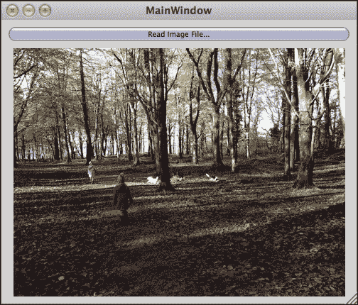
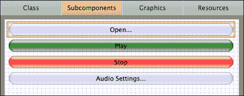

# 第四章. 使用媒体文件

JUCE 提供了自己的文件读写类以及许多针对特定媒体格式的辅助类。本章介绍了这些类的主要示例。在本章中，我们将涵盖以下主题：

+   使用简单的输入输出流

+   读写图像文件

+   播放音频文件

+   使用二进制构建工具将二进制文件转换为源代码

到本章结束时，你将能够使用 JUCE 操作一系列媒体文件。

# 使用简单的输入输出流

在第三章中，我们介绍了 JUCE 的`File`类，该类用于以跨平台的方式指定文件路径。此外，`File`类还包含一些方便的函数，用于以数据块或文本字符串的形式读写文件。在许多情况下，这些函数是足够的，但在其他情况下，对输入输出流的原始访问可能更有用。

## 读写文本文件

首先，在 Introjucer 应用程序中创建一个控制台应用程序项目，并将其命名为`Chapter04_01`。在这个简单的例子中，我们将声明两个函数，一个用于将文本写入文件——`writeFile()`，另一个用于读取文件内容——`readFile()`。这些函数都传递了以我们第三章中介绍的方式创建的相同文件路径引用。将`Main.cpp`文件的内容替换为以下内容，其中我们声明了文件读写函数，并定义了一个`main()`函数：

```cpp
#include "../JuceLibraryCode/JuceHeader.h"

void writeFile (File const& file);
void readFile (File const& file);

int main (int argc, char* argv[])
{
  File file (File::getSpecialLocation(File::currentExecutableFile)
             .getParentDirectory()
             .getChildFile ("chapter04_01_test.txt"));

  writeFile (file);
  readFile (file);

  return 0;
}
```

然后，添加`writeFile()`函数的定义：

```cpp
void writeFile (File const& file)
{
  Logger *log = Logger::getCurrentLogger();
  FileOutputStream stream (file);

  if (!stream.openedOk()) {
    log->writeToLog ("failed to open stream");
    return;
  }

  stream.setPosition (0);
  stream.truncate();

  String text ("The quick brown fox jumps over the lazy dog.");

  bool asUTF16 = false;
  bool byteOrderMark = false;
  stream.writeText (text, asUTF16, byteOrderMark);
}
```

在这里，我们创建了一个`FileOutputStream`对象，将其传递给指向文件路径的`File`对象。`FileOutputStream`类继承自表示将数据写入流的一般概念的基类`OutputStream`。还可以有其他类型的输出流，例如用于以流式方式将数据写入计算机内存区域的`MemoryOutputStream`类。`FileOutputStream`类在构造时的默认行为是将流的写入位置定位在文件的末尾（如果文件已存在），或者（如果不存在）创建一个空文件。对`FileOutputStream::setPosition()`和`FileOutputStream::truncate()`函数的调用在每次写入之前实际上清空了文件。当然，在实际应用中，你可能不希望每次都这样做。对`FileOutputStream::writeText()`函数的调用几乎等同于`File::appendText()`函数，尽管`File::appendText()`函数的输出控制标志在 Unicode UTF16 格式下是隐式的，但需要显式指定`FileOutputStream::writeText()`函数的标志。在这里，我们通过将两个标志都设置为`false`以 UTF8 格式写入数据。

### 小贴士

UFT8 格式可能最方便，因为我们正在写入的是纯 ASCII 文本，它与 UTF8 编码兼容。

最后，添加`readFile()`函数的定义：

```cpp
void readFile (File const& file)
{
  Logger *log = Logger::getCurrentLogger();
  FileInputStream stream (file);

  if (!stream.openedOk()) {
    log->writeToLog ("failed to open stream");
    return;
  }

  log->writeToLog ("fileText: " +stream.readEntireStreamAsString());
}
```

在这里，我们尝试将整个流读取到一个`String`中，并将其记录到日志中。我们使用一个继承自更通用的`InputStream`类的`FileInputStream`对象。在`writeFile()`和`readFile()`函数中，我们在继续之前检查是否成功打开了流。此外，当流超出作用域时，流对象会优雅地关闭流。

## 读取和写入二进制文件

输出和输入流也可以用于二进制数据，并且比`File`类便利函数提供更强大的功能。在这里，您可以写入原始数值数据，并选择多字节数据类型的字节序。

在 Introjucer 应用程序中创建一个新的控制台应用程序，并将其命名为`Chapter04_02`。以下示例将`int`、`float`和`double`数据类型写入文件，然后读取这些数据，并将结果记录到日志中。将`Main.cpp`文件的内容替换为以下代码：

```cpp
#include "../JuceLibraryCode/JuceHeader.h"

void writeFile (File const& file);
void readFile (File const& file);

int main (int argc, char* argv[])
{
  File file (File::getSpecialLocation(File::currentExecutableFile)
             .getParentDirectory()
             .getChildFile ("chapter04_02_test.bin"));

  writeFile (file);
  readFile (file);

  return 0;
}

void writeFile (File const& file)
{
  Logger *log = Logger::getCurrentLogger();
  FileOutputStream stream (file);

  if (!stream.openedOk()) {
    log->writeToLog ("failed to open stream");
    return;
  }

  stream.setPosition (0);
  stream.truncate();
  stream.writeInt (1234);
  stream.writeFloat (3.142);
  stream.writeDouble (0.000000001);
}

void readFile (File const& file)
{
  Logger *log = Logger::getCurrentLogger();
  FileInputStream stream (file);

  if (!stream.openedOk()) {
    log->writeToLog ("failed to open stream");
    return;
  }

  log->writeToLog("readInt: " + String (stream.readInt()));
  log->writeToLog("readFloat: " + String (stream.readFloat()));
  log->writeToLog("readDouble: " + String (stream.readDouble()));
}
```

`OutputStream`和`InputStream`类及其相应的子类支持使用`writeInt()`、`writeFloat()`、`readInt()`、`readFloat()`等函数写入和读取各种内置类型。这些函数的版本使用小端字节序写入这些多字节类型。对于需要大端存储的文件格式，有等效的函数`writeIntBigEndian()`、`writeFloatBigEndian()`、`readIntBigEndian()`、`readFloatBigEndian()`等。

JUCE 流类很有用，但相当底层。对于许多用途，JUCE 已经包括用于读取和写入特定文件类型的高级类。当然，这些类建立在流类之上，但除非您处理自定义数据格式，否则使用内置功能处理图像、音频和其他格式（如**可扩展标记语言**（**XML**）和**JavaScript 对象表示法**（**JSON**））可能更合理。

# 读取和写入图像文件

JUCE 包括内置支持读取和写入 GIF、PNG 和 JPEG 图像文件。JUCE 还包括自己的`Image`类来存储位图图像。以下示例说明如何显示一个本地文件浏览器以选择图像文件，加载图像文件，并在`ImageComponent`对象中显示它。在 Introjucer 应用程序中创建一个新的 GUI 项目，并命名为`Chapter04_03`。在`Main.cpp`文件中，将其设置为可调整大小的，就像我们在前面的章节中所做的那样。然后，您应该将`MainComponent.h`文件修改为包含以下内容：

```cpp
#ifndef __MAINCOMPONENT_H__
#define __MAINCOMPONENT_H__

#include "../JuceLibraryCode/JuceHeader.h"

class MainContentComponent : public Component,
                             public Button::Listener
{
public:
  MainContentComponent();
  void resized();
  void buttonClicked (Button* button);

private:
  TextButton readFileButton;
  ImageComponent imageComponent;
  Image image;
};
#endif
```

将`MainComponent.cpp`修改为包含以下内容：

```cpp
#include "MainComponent.h"

MainContentComponent::MainContentComponent()
: readFileButton ("Read Image File...")
{
  addAndMakeVisible (&readFileButton);
  addAndMakeVisible (&imageComponent);

  readFileButton.addListener (this);

  setSize (500, 400);
}

void MainContentComponent::resized()
{
  int buttonHeight = 20;
  int margin = 10;
  readFileButton.setBounds(margin, margin,
                           getWidth() – margin * 2, buttonHeight);
  imageComponent.setBounds(margin, margin + buttonHeight + margin,
                           getWidth() – margin * 2,
                           getHeight() – buttonHeight – margin * 3);
}

void MainContentComponent::buttonClicked (Button* button)
{
  if (&readFileButton == button)
  {
    FileChooser chooser ("Choose an image file to display...");

    if (chooser.browseForFileToOpen()) {
      image = ImageFileFormat::loadFrom (chooser.getResult());

      if (image.isValid())
        imageComponent.setImage (image);
    }
  }
}
```

在这里，我们创建一个 `FileChooser` 对象以响应用户点击 **读取图像文件…** 按钮。这会弹出一个原生对话框，允许用户选择文件。我们使用 `ImageFileFormat::loadFrom()` 函数尝试将文件作为图像加载。因为我们没有限制文件选择器中显示或启用的文件类型，用户可能没有选择有效的图像文件。我们检查图像的有效性，如果有效，我们将加载的图像传递给 `ImageComponent` 对象以进行显示。`ImageComponent` 类有各种选项来控制图像的位置和缩放方式，这取决于原始图像大小和组件矩形的比较。这些可以通过使用 `ImageComponent::setImagePlacement()` 函数来控制。以下截图显示了读取图像文件的程序：



`Image` 类类似于 `String` 类，因为它在内部使用引用计数的对象，这样几个 `Image` 对象可以共享相同的数据。

## 操作图像数据

在下一个示例中，我们将添加一个滑块来控制显示图像的亮度，并添加一个按钮将此处理后的图像作为 PNG 文件写入。更改 `MainComponent.h` 文件的内容，以下代码列表中突出显示了更改：

```cpp
#ifndef __MAINCOMPONENT_H__
#define __MAINCOMPONENT_H__

#include "../JuceLibraryCode/JuceHeader.h"

class MainContentComponent : public Component,
                             public Button::Listener,
 public Slider::Listener
{
  public:
    MainContentComponent();
    void resized();
    void buttonClicked (Button* button);
 void sliderValueChanged (Slider* slider);
  private:
    TextButton readFileButton;
    ImageComponent imageComponent;
 Slider brightnessSlider;
 TextButton writeFileButton;
 Image origImage, procImage;
};
#endif
```

现在用包含指令和构造函数替换 `MainComponent.cpp` 文件：

```cpp
#include "MainComponent.h"

MainContentComponent::MainContentComponent()
: readFileButton ("Read Image File..."),
  writeFileButton ("Write Image File...")
{
  brightnessSlider.setRange (0.0, 10.0);
  addAndMakeVisible (&readFileButton);
  addAndMakeVisible (&imageComponent);
  addAndMakeVisible (&brightnessSlider);
  addAndMakeVisible (&writeFileButton);

  readFileButton.addListener (this);
  writeFileButton.addListener (this);
  brightnessSlider.addListener (this);

  setSize (500, 400);
}
```

添加 `resized()` 函数以定位组件：

```cpp
void MainContentComponent::resized()
{
  int controlHeight = 20;
  int margin = 10;
  int width = getWidth() - margin * 2;

  readFileButton.setBounds
    (margin, margin, width, controlHeight);
  imageComponent.setBounds
    (margin, readFileButton.getBottom() + margin, width,
     getHeight() - (controlHeight + margin) * 3 - margin * 2);
  brightnessSlider.setBounds
    (margin, imageComponent.getBottom() + margin, 
     width, controlHeight);
  writeFileButton.setBounds
    (margin, brightnessSlider.getBottom() + margin,
     width, controlHeight);
}
```

添加响应按钮交互的 `buttonClicked()` 函数：

```cpp
void MainContentComponent::buttonClicked (Button* button)
{
  if (&readFileButton == button) {
    FileChooser chooser ("Choose an image file to display...");

    if (chooser.browseForFileToOpen()) {
      origImage = ImageFileFormat::loadFrom (chooser.getResult());

      if (origImage.isValid()) {
        procImage = origImage.createCopy();
        imageComponent.setImage (procImage);
      }
    }
  } else if (&writeFileButton == button) {
    if (procImage.isValid()) {
      FileChooser chooser ("Write processed image to file...");

      if (chooser.browseForFileToSave (true)) {
        FileOutputStream stream (chooser.getResult());
        PNGImageFormat pngImageFormat;
        pngImageFormat.writeImageToStream (procImage, stream);
      }
    }
  }
}
```

最后，添加响应滑块交互的 `sliderValueChanged()` 函数：

```cpp
void MainContentComponent::sliderValueChanged (Slider* slider)
{
  if (&brightnessSlider == slider) {
    if (origImage.isValid() &&
        procImage.isValid()) {
      const float amount = (float)brightnessSlider.getValue();

      if (amount == 0.f) {
        procImage = origImage.createCopy();
      } else {
        for (int v = 0; v < origImage.getHeight(); ++v) {
          for (int h = 0; h < origImage.getWidth(); ++h) {
            Colour col = origImage.getPixelAt (h, v);

            if (amount > 0.f)
              procImage.setPixelAt (h, v, col.brighter (amount));
            else if (amount < 0.f)
              procImage.setPixelAt (h, v, col.darker (-amount));
          }
        }
      }

      imageComponent.repaint();
    }
  }
}
```

在这里，我们保留原始图像和经过处理的副本。每次滑块改变时，通过遍历每个像素，图像都会用新的亮度更新。当点击 **写入图像文件…** 按钮时，我们创建一个 `FileChooser` 对象，并使用 `FileChooser::browseForFileToSave()` 函数将其呈现给用户，而不是像读取文件时那样使用 `FileChooser::browseForFileToOpen()` 函数。然后使用 `PNGImageFormat` 类将处理后的图像作为文件流写入所选文件。这里的图像处理可以显著优化，但这超出了本书的范围。

# 播放音频文件

JUCE 提供了一套复杂的类来处理音频。这包括：声音文件读写工具、与原生音频硬件接口、音频数据转换函数，以及为一系列知名宿主应用程序创建音频插件的跨平台框架。涵盖所有这些方面超出了本书的范围，但本节中的示例将概述播放声音文件和与音频硬件通信的原则。除了展示 JUCE 的音频功能外，本节我们还将使用 Introjucer 应用程序创建 GUI 并自动生成代码的其他一些方面。

## 创建用于控制音频文件播放的 GUI

创建一个名为`Chapter04_04`的新 GUI 应用程序 Introjucer 项目，选择创建基本窗口的选项。在 Introjucer 应用程序中，选择**配置**面板，并在层次结构中选择**模块**。

对于这个项目，我们需要`juce_audio_utils`模块（其中包含用于配置音频设备硬件的特殊`Component`类）；因此，打开此模块。尽管我们创建了一个基本窗口和一个基本组件，但我们将以与第二章末尾的相同方式使用 Introjucer 应用程序创建 GUI，即*构建用户界面*。

导航到**文件**面板，在层次结构中右键单击（在 Mac 上，按*control*键并单击）**源**文件夹，然后从上下文菜单中选择**添加新 GUI 组件…**。

当被要求时，将头文件命名为`MediaPlayer.h`并点击**保存**。在**文件**层次结构中，选择`MediaPlayer.cpp`文件。首先选择**类**面板，并将**类名**从`NewComponent`更改为`MediaPlayer`。我们在这个基本项目中需要四个按钮：一个用于打开音频文件的按钮、一个**播放**按钮、一个**停止**按钮和一个音频设备设置按钮。选择**子组件**面板，并通过右键单击以访问上下文菜单，向编辑器添加四个`TextButton`组件。将按钮均匀地分布在编辑器顶部附近，并按照以下表格中的说明配置每个按钮：

| 目的 | 成员名称 | 名称 | 文本 | 背景（正常） |
| --- | --- | --- | --- | --- |
| 打开文件 | `openButton` | `open` | `打开…` | 默认 |
| 播放/暂停文件 | `playButton` | `play` | `播放` | 绿色 |
| 停止播放 | `stopButton` | `stop` | `停止` | 红色 |
| 配置音频 | `settingsButton` | `settings` | `音频设置…` | 默认 |

按照以下截图所示排列按钮：



对于每个按钮，访问**模式**弹出菜单以设置**宽度**，并选择**从父宽度减去**。如果调整窗口大小，这将保持按钮的右侧与窗口右侧的距离相同。在 Introjucer 项目中还有更多自定义设置要做，但在此阶段，请确保在打开本机 IDE 项目之前已保存`MediaPlayer.h`文件、`MediaPlayer.cpp`文件和 Introjucer 项目。

### 小贴士

确保在 Introjucer 应用程序中已保存所有这些文件；否则，当项目在 IDE 中打开时，文件可能无法在文件系统中正确更新。

在集成开发环境（IDE）中，我们需要替换`MainContentComponent`类的代码，以便在其中放置一个`MediaPlayer`对象。按照以下方式修改`MainComponent.h`文件：

```cpp
#ifndef __MAINCOMPONENT_H__
#define __MAINCOMPONENT_H__

#include "../JuceLibraryCode/JuceHeader.h"
#include "MediaPlayer.h"

class MainContentComponent   : public Component
{
public:
  MainContentComponent();
  void resized();

private:
 MediaPlayer player;
};
#endif
```

然后，修改`MainComponent.cpp`文件：

```cpp
#include "MainComponent.h"

MainContentComponent::MainContentComponent()
{
  addAndMakeVisible (&player);
  setSize (player.getWidth(),player.getHeight());
}

void MainContentComponent::resized()
{
  player.setBounds (0, 0, getWidth(), getHeight());
}
```

最后，在`Main.cpp`文件中使窗口可调整大小（正如我们在第二章的*添加子组件*部分所做的那样），构建并运行项目以检查窗口是否按预期显示。

## 添加音频文件播放支持

退出应用程序并返回到`Introjucer`项目。在**文件**面板层次结构中选择`MediaPlayer.cpp`文件，并选择其**类**面板。**父类**设置已经包含`public Component`。我们将监听来自两个成员对象的状态变化，这两个成员对象是`ChangeBroadcaster`对象。为此，我们需要我们的`MediaPlayer`类继承自`ChangeListener`类。修改**父类**设置，使其读取如下：

```cpp
public Component, public ChangeListener
```

再次保存`MediaPlayer.h`文件、`MediaPlayer.cpp`文件和 Introjucer 项目，并将其打开到您的 IDE 中。注意在`MediaPlayer.h`文件中，父类已经被更新以反映这一变化。为了方便起见，我们将添加一些枚举常量来反映我们的`MediaPlayer`对象的当前播放状态，以及一个函数来集中更改此状态（这将反过来更新各种对象的状态，例如按钮上显示的文本）。`ChangeListener`类还有一个纯虚函数，我们需要添加。将以下代码添加到`MediaPlayer.h`文件的`[UserMethods]`部分：

```cpp
//[UserMethods]-- You can add your own custom methods...
enum TransportState {
  Stopped,
  Starting,
  Playing,
  Pausing,
  Paused,
  Stopping
};
void changeState (TransportState newState);
void changeListenerCallback (ChangeBroadcaster* source); 
//[/UserMethods]
```

我们还需要一些额外的成员变量来支持我们的音频播放。将这些添加到`[UserVariables]`部分：

```cpp
//[UserVariables]   -- You can add your own custom variables...
AudioDeviceManager deviceManager;
AudioFormatManager formatManager;
ScopedPointer<AudioFormatReaderSource> readerSource;
AudioTransportSource transportSource;
AudioSourcePlayer sourcePlayer;
TransportState state;
 //[/UserVariables]
```

`AudioDeviceManager` 对象将管理应用程序与音频硬件之间的接口。`AudioFormatManager` 对象将协助创建一个对象，该对象将读取和解码音频文件中的音频数据。此对象将存储在 `ScopedPointer<AudioFormatReaderSource>` 对象中。`AudioTransportSource` 对象将控制音频文件的播放并执行可能需要的任何采样率转换（如果音频文件的采样率与音频硬件采样率不同）。`AudioSourcePlayer` 对象将从 `AudioTransportSource` 对象流式传输音频到 `AudioDeviceManager` 对象。`state` 变量将存储我们的枚举常量之一，以反映 `MediaPlayer` 对象当前的播放状态。

现在向 `MediaPlayer.cpp` 文件添加一些代码。在构造函数的 `[Constructor]` 部分中，添加以下两行：

```cpp
playButton->setEnabled (false);
stopButton->setEnabled (false);
```

这将使 **播放** 和 **停止** 按钮最初处于禁用状态（并变为灰色）。稍后，一旦加载了有效的文件，我们将启用 **播放** 按钮，并根据文件是否正在播放更改每个按钮的状态和按钮上显示的文本。在此 `[Constructor]` 部分中，您还应按照以下方式初始化 `AudioFormatManager`：

```cpp
formatManager.registerBasicFormats();
```

这允许 `AudioFormatManager` 对象检测不同的音频文件格式并创建适当的文件读取器对象。我们还需要将 `AudioSourcePlayer`、`AudioTransportSource` 和 `AudioDeviceManager` 对象连接在一起，并初始化 `AudioDeviceManager` 对象。为此，将以下行添加到 `[Constructor]` 部分中：

```cpp
sourcePlayer.setSource (&transportSource);
deviceManager.addAudioCallback (&sourcePlayer);
deviceManager.initialise (0, 2, nullptr, true);
```

第一行将 `AudioTransportSource` 对象连接到 `AudioSourcePlayer` 对象。第二行将 `AudioSourcePlayer` 对象连接到 `AudioDeviceManager` 对象。最后一行使用以下内容初始化 `AudioDeviceManager` 对象：

+   所需的音频输入通道数（在本例中为 `0`）。

+   所需的音频输出通道数（在本例中为 `2`，用于立体声输出）。

+   `AudioDeviceManager` 对象的可选 "保存状态"（`nullptr` 从头开始初始化）。

+   如果保存状态失败是否打开默认设备。由于我们未使用保存状态，此参数无关紧要，但无论如何将其设置为 `true` 是有用的。

在 `[Constructor]` 部分添加最后三行以配置我们的 `MediaPlayer` 对象作为 `AudioDeviceManager` 和 `AudioTransportSource` 对象的监听器，并将当前状态设置为 `Stopped`：

```cpp
deviceManager.addChangeListener (this);
transportSource.addChangeListener (this); 
state = Stopped;
```

在 `buttonClicked()` 函数中，我们需要在各个部分添加一些代码。在 `[UserButtonCode_openButton]` 部分中，添加：

```cpp
//[UserButtonCode_openButton] -- add your button handler...
FileChooser chooser ("Select a Wave file to play...",
                     File::nonexistent,
                     "*.wav");

if (chooser.browseForFileToOpen()) {
  File file (chooser.getResult());
  readerSource = new AudioFormatReaderSource(formatManager.createReaderFor (file), true);
  transportSource.setSource (readerSource);
  playButton->setEnabled (true);
} 
//[/UserButtonCode_openButton]
```

当点击 `openButton` 按钮时，这将创建一个 `FileChooser` 对象，允许用户使用平台的本地界面选择文件。允许选择的文件类型通过通配符 `*.wav` 限制，以允许仅选择具有 `.wav` 文件扩展名的文件。

如果用户实际选择了文件（而不是取消操作），代码可以调用 `FileChooser::getResult()` 函数来检索所选文件的引用。然后，该文件传递给 `AudioFormatManager` 对象以创建文件读取器对象，该对象随后传递以创建一个 `AudioFormatReaderSource` 对象，该对象将管理和拥有此文件读取器对象。最后，`AudioFormatReaderSource` 对象连接到 `AudioTransportSource` 对象，并启用 **Play** 按钮。

`playButton` 和 `stopButton` 对象的处理程序将根据当前传输状态调用我们的 `changeState()` 函数。我们将在稍后定义 `changeState()` 函数，届时其目的将变得清晰。

在 `[UserButtonCode_playButton]` 部分，添加以下代码：

```cpp
//[UserButtonCode_playButton] -- add your button handler...
if ((Stopped == state) || (Paused == state))
  changeState (Starting);
else if (Playing == state)
  changeState (Pausing); 
//[/UserButtonCode_playButton]
```

如果当前状态是 `Stopped` 或 `Paused`，则将状态更改为 `Starting`，如果当前状态是 `Playing`，则将状态更改为 `Pausing`。这是为了有一个具有播放和暂停功能的按钮。

在 `[UserButtonCode_stopButton]` 部分，添加以下代码：

```cpp
//[UserButtonCode_stopButton] -- add your button handler...
if (Paused == state)
  changeState (Stopped);
else
  changeState (Stopping); 
//[/UserButtonCode_stopButton]
```

如果当前状态是 `Paused`，则将状态设置为 `Stopped`，在其他情况下设置为 `Stopping`。我们将在稍后添加 `changeState()` 函数，其中这些状态变化将更新各种对象。

在 `[UserButtonCode_settingsButton]` 部分，添加以下代码：

```cpp
//[UserButtonCode_settingsButton] -- add your button handler...
bool showMidiInputOptions = false;
bool showMidiOutputSelector = false;
bool showChannelsAsStereoPairs = true;
bool hideAdvancedOptions = false;

AudioDeviceSelectorComponent settings (deviceManager,
                                       0, 0, 1, 2,
                                       showMidiInputOptions,
                                       showMidiOutputSelector,
                                       showChannelsAsStereoPairs,
                                       hideAdvancedOptions);
settings.setSize (500, 400);

DialogWindow::showModalDialog(String ("Audio Settings"),
                            &settings,
                            TopLevelWindow::getTopLevelWindow (0),
                            Colours::white,
                            true); //[/UserButtonCode_settingsButton]
```

这提供了一个有用的界面来配置音频设备设置。

我们需要添加 `changeListenerCallback()` 函数以响应 `AudioDeviceManager` 和 `AudioTransportSource` 对象的变化。将以下内容添加到 `MediaPlayer.cpp` 文件的 `[MiscUserCode]` 部分：

```cpp
//[MiscUserCode] You can add your own definitions...
void MediaPlayer::changeListenerCallback (ChangeBroadcaster* src)
{
  if (&deviceManager == src) {
    AudioDeviceManager::AudioDeviceSetup setup;
    deviceManager.getAudioDeviceSetup (setup);

    if (setup.outputChannels.isZero())
      sourcePlayer.setSource (nullptr);
    else
      sourcePlayer.setSource (&transportSource);
  } else if (&transportSource == src) {
    if (transportSource.isPlaying()) {
      changeState (Playing);
    } else {
      if ((Stopping == state) || (Playing == state))
        changeState (Stopped);
      else if (Pausing == state)
        changeState (Paused);
    }
  }
} 
//[/MiscUserCode]
```

如果我们的 `MediaPlayer` 对象收到 `AudioDeviceManager` 对象发生某种变化的消息，我们需要检查这种变化不是禁用所有音频输出通道，通过从设备管理器获取设置信息来做到这一点。如果输出通道的数量为零，我们将通过将源设置为 `nullptr` 来断开我们的 `AudioSourcePlayer` 对象与 `AudioTransportSource` 对象的连接（否则我们的应用程序可能会崩溃）。如果输出通道的数量再次变为非零，我们将重新连接这些对象。

如果我们的`AudioTransportSource`对象已更改，这可能是其播放状态的变化。重要的是要注意请求传输开始或停止与这种变化实际发生之间的区别。这就是为什么我们为所有其他状态（包括过渡状态）创建了枚举常量。根据我们的`state`变量的当前值和`AudioTransportSource`对象的状态，我们再次调用`changeState()`函数。

最后，将重要的`changeState()`函数添加到`MediaPlayer.cpp`文件的`[MiscUserCode]`部分，该函数处理所有这些状态变化：

```cpp
void MediaPlayer::changeState (TransportState newState)
{
  if (state != newState) {
    state = newState;
    switch (state) {
      case Stopped:
        playButton->setButtonText ("Play");
        stopButton->setButtonText ("Stop");
        stopButton->setEnabled (false);
        transportSource.setPosition (0.0);
        break;
      case Starting:
        transportSource.start();
        break;
      case Playing:
        playButton->setButtonText ("Pause");
        stopButton->setButtonText ("Stop");
        stopButton->setEnabled (true);
        break;
      case Pausing:
        transportSource.stop();
        break;
      case Paused:
        playButton->setButtonText ("Resume");
        stopButton->setButtonText ("Return to Zero");
        break;
      case Stopping:
        transportSource.stop();
        break;
    }
  }
}
```

在检查`newState`值与`state`变量的当前值不同之后，我们将`state`变量更新为新值。然后，我们执行循环中这个特定点的适当操作。这些总结如下：

+   在`停止`状态中，按钮配置为**播放**和**停止**标签，**停止**按钮被禁用，并且传输定位到音频文件的开头。

+   在`启动`状态中，`AudioTransportSource`对象被告知开始。一旦`AudioTransportSource`对象实际上开始播放，系统将处于`播放`状态。在这里，我们更新`playButton`按钮以显示文本**暂停**，确保`stopButton`按钮显示文本**停止**，并启用**停止**按钮。

+   如果点击了**暂停**按钮，状态变为`暂停中`，并告知传输停止。一旦传输实际上停止，状态变为`暂停`，`playButton`按钮更新以显示文本**继续**，`stopButton`按钮更新以显示**返回零**。

+   如果点击了**停止**按钮，状态变为`停止中`，并告知传输停止。一旦传输实际上停止，状态变为`停止`（如第一点所述）。

+   如果点击了**返回零**按钮，状态将直接变为`停止`（再次，如前所述）。

+   当音频文件到达文件末尾时，状态也会变为`停止`。

构建并运行应用程序。点击**打开...**按钮后，你应该能够选择一个`.wav`音频文件，使用相应的按钮播放、暂停、继续和停止音频文件，并使用**音频设置…**按钮配置音频设备。音频设置窗口允许你选择输入和输出设备、采样率和硬件缓冲区大小。它还提供了一个**测试**按钮，可以通过选定的输出设备播放一个音调。

# 使用二进制构建工具

在编写跨平台应用程序时，一个问题是需要在应用程序内部使用二进制文件的打包。JUCE 包含一个名为 **Binary Builder** 的工具，该工具可以将二进制文件转换为源代码，然后编译到应用程序的代码中。这确保了文件在所有平台上表现一致，而不是依赖于运行时机器的特定性。尽管 Binary Builder 作为独立项目（在 `juce/extras/binarybuilder` 中）提供，但其功能在 Introjucer 应用程序的 GUI 组件编辑器中可用。

## 使用 Introjucer 应用程序嵌入图像文件

创建一个名为 `Chapter04_05` 的新 Introjucer 项目，包含一个基本窗口。像之前一样添加一个新的 GUI 组件；这次将其命名为 `EmbeddedImage`（记得也要更改其 **类** 面板中的名称）。在其 **子组件** 面板中，在画布上右键单击并选择 **新建通用组件**，并将其调整大小以填充画布并边缘留有少量边框。将 **成员名称** 和 **名称** 更改为 `image`，并将 **类** 更改为 `ImageComponent`。在 **资源** 面板中，选择 **添加新资源…** 并选择一个图像文件以添加。这将创建一个资源，它是转换为代码的二进制文件。它将在该组件内部根据原始文件名获得一个变量名，并作为静态变量存储。例如，名为 `sample.png` 的文件将被命名为 `sample_png`。此外，还会创建一个存储该资源大小的静态变量，并将其名称附加 `Size`，例如，`sample_pngSize`。保存项目并将其打开到您的 IDE 中。像之前一样更新 `MainComponent` 文件的內容。按照以下方式更改 `MainComponent.h` 文件：

```cpp
#ifndef __MAINCOMPONENT_H__
#define __MAINCOMPONENT_H__

#include "../JuceLibraryCode/JuceHeader.h"
#include "EmbeddedImage.h"

class MainContentComponent   : public Component
{
public:
  MainContentComponent();
  void resized();

private:
 EmbeddedImage embeddedImage;
};
#endif
```

然后将 `MainComponent.cpp` 文件更改为：

```cpp
#include "MainComponent.h"

MainContentComponent::MainContentComponent()
{
  addAndMakeVisible (&embeddedImage);
  setSize (embeddedImage.getWidth(),embeddedImage.getHeight());
}

void MainContentComponent::resized()
{
  embeddedImage.setBounds (0, 0, getWidth(), getHeight());
}
```

最后，在 `EmbeddedImage.cpp` 文件中注意文件末尾的大数组，这是转换为代码的图像文件。在 `[构造函数]` 部分中，添加以下两行（尽管您可能需要使用与 `sample_png`、`sample_pngSize` 不同的名称，具体取决于您之前添加的文件资源）：

```cpp
//[Constructor] You can add your own custom stuff here...
MemoryInputStream stream (sample_png, sample_pngSize, false);
image->setImage (ImageFileFormat::loadFrom (stream));
//[/Constructor]
```

这创建了一个从我们的资源创建的内存流，提供了数据指针和数据大小（最后的 `false` 参数告诉内存流不要复制数据）。然后我们像之前一样使用 `ImageFileFormat` 类加载图像。构建并运行应用程序，图像应该显示在应用程序的窗口中。

# 摘要

本章介绍了处理 JUCE 中文件的各种技术，特别是针对图像和音频文件。鼓励您探索在线 JUCE 文档，它提供了关于这里介绍的大多数可能性的更多细节。我们还介绍了 Binary Builder 工具，该工具提供了一种将媒体文件转换为适用于跨平台使用的源代码的方法。鼓励您阅读本章中介绍的所有类的在线 JUCE 文档。本章仅提供了一个入门介绍；还有许多其他选项和替代方法，可能适合不同的环境。JUCE 文档将带您了解这些方法，并指向相关的类和函数。下一章将介绍 JUCE 中可用于创建跨平台应用程序的一些有用工具。
