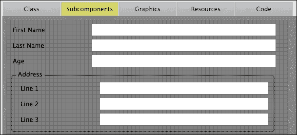
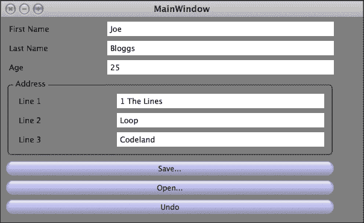

# 第五章。有用的实用工具

除了前几章中介绍的基本类之外，JUCE 还包括一系列用于解决应用程序开发中常见问题的类。在本章中，我们将涵盖以下主题：

+   使用 `Value`、`var` 和 `ValueTree` 类

+   实现撤销管理

+   添加 XML 支持

+   理解 JUCE 如何处理多线程

+   存储应用程序属性

+   添加菜单栏控件

到本章结束时，你将了解 JUCE 提供的一些额外有用实用工具。

# 使用动态类型对象

JUCE 的 `Value`、`var` 和 `ValueTree` 类是应用程序数据存储和处理的有价值工具。`var` 类（简称 variant）旨在存储一系列原始数据类型，包括整数、浮点数和字符串（JUCE `String` 对象）。它还可以递归，即一个 `var` 实例可以包含一个 `var` 实例的数组（一个 JUCE `Array<var>` 对象）。这样，`var` 类类似于许多脚本语言（如 JavaScript）支持的动态类型。`var` 对象还可以持有任何类型的 `ReferenceCounterObject` 对象或二进制数据的块。以下都是有效的初始化方式：

```cpp
var anInt = 1;
var aDouble = 1.2345;
var aString = "Hello world!";
```

## 使用 `Value` 类

`Value` 类旨在持有 `var` 对象的共享实例（通过将 `var` 存储在引用计数包装器中）。`Value` 对象可以使用 `Value::Listener` 函数和 第二章 中关于 GUI 类使用的监听器和广播系统所涵盖的相同技术附加监听器。实际上，`Value` 对象被各种 `Component` 子类用于存储任何值，例如 `Label` 对象中的文本、`Slider` 对象的位置等。例如，以下代码片段说明了使用 `Value` 对象设置 `Label` 对象的值和 `Slider` 对象的值的方法：

```cpp
// Slider
Slider slider;
slider.getValueObject().setValue (10.0); 
// instead of:
//  slider.setValue (10);

// Label
Label label;
label.getTextValue().setValue ("Hello");
// instead of: 
//  label.setText ("Hello", sendNotification);

```

`Value` 对象也是共享值的一种方式，因为它们可以指向相同的基本数据。这在同一值以不同方式在 GUI 中显示时非常有用，尤其是在复杂和详细的 GUI 显示中。创建一个名为 `Chapter05_01` 的新 Introjucer 项目，包含一个基本窗口，并将 `MainComponent.h` 文件替换为以下内容：

```cpp
#ifndef __MAINCOMPONENT_H__
#define __MAINCOMPONENT_H__

#include "../JuceLibraryCode/JuceHeader.h"

class MainContentComponent : public Component
{
public:
  MainContentComponent();
  void resized();

private:
  Value value;
  Slider slider;
  Label label;
};

#endif  // __MAINCOMPONENT_H__
```

在这里，我们将 `Value`、`Slider` 和 `Label` 对象存储在我们的类中。将 `MainComponent.cpp` 文件替换为以下内容：

```cpp
#include "MainComponent.h"

MainContentComponent::MainContentComponent()
: value (1.0),
  slider (Slider::LinearHorizontal, Slider::NoTextBox)
{
  label.setEditable (true);
  slider.getValueObject().referTo (value);
  label.getTextValue().referTo (value);

  addAndMakeVisible (&slider);
  addAndMakeVisible (&label);

  setSize (500, 400);
}

void MainContentComponent::resized()
{
  slider.setBounds (10, 10, getWidth() - 20, 20);
  label.setBounds (10, 40, getWidth() - 20, 20);
}
```

在这里，我们将我们的 `Value` 对象初始化为 1 的值，然后使用 `Value::referTo()` 函数配置 `Slider` 和 `Label` 对象的值，使它们都引用这个相同的底层 `Value` 对象。构建并运行应用程序，注意无论更改哪一个，滑块和标签都会保持相同的值更新。这一切都无需我们配置自己的监听器，因为 JUCE 内部处理所有这些。

## 结构化分层数据

显然，在大多数应用程序中，数据模型要复杂得多，通常是分层的。`ValueTree` 类旨在通过相对轻量级且强大的实现来反映这一点。一个 `ValueTree` 对象持有名为 `var` 的命名对象作为属性构成的树结构，这意味着树中的节点可以是几乎任何数据类型。以下示例说明了如何将数据存储在 `ValueTree` 对象中，以及一些使 `ValueTree` 类对 JUCE 应用程序开发极具价值的特性。

创建一个名为 `Chapter05_02` 的新 Introjucer 项目，并包含一个基本窗口。以前类似的方式添加一个名为 `EntryForm` 的 GUI 组件。首先，导航到 `EntryForm.cpp` 文件的 **Graphics** 面板，并将背景颜色更改为灰色。现在我们将添加一个表单样式的页面，我们可以在此页面中输入一个人的姓名、年龄和地址。在 **Subcomponents** 面板中添加六个 `Label` 对象，作为以下内容的标签：**First name**、**Last name**、**Age**、**Line 1**、**Line 2** 和 **Line 3**。

现在添加六个无内容（即空文本）的 `Label` 对象，并将它们放置在之前步骤中添加的每个标签旁边。将这些标签的背景设置为白色，而不是透明，并将它们的 **编辑** 属性设置为 **单击编辑**。给这些标签以下 **成员名称** 和 **名称** 值：`firstNameField`、`lastNameField`、`ageField`、`line1Field`、`line2Field` 和 `line3Field`。

最后，通过在 **Subcomponents** 编辑器中右键单击（在 Mac 上，按 *control* 并单击）访问上下文菜单，添加一个 **Group Box**。将此位置设置为围绕与 **Line 1**、**Line 2**、**Line 3** 及其输入字段相关的标签。现在它应该看起来类似于以下截图：



现在保存项目并在您的 IDE 中打开它。像之前一样，将 `EntryForm` 对象放入 `MainContentComponent` 对象中，通过修改 `MainComponent.h` 文件以包含以下内容：

```cpp
#ifndef __MAINCOMPONENT_H__
#define __MAINCOMPONENT_H__

#include "../JuceLibraryCode/JuceHeader.h"
#include "EntryForm.h"

class MainContentComponent : public Component
{
public:
  MainContentComponent();
  void resized();

private:
  EntryForm form;
};
#endif
```

将 `MainComponent.cpp` 文件修改为包含以下内容：

```cpp
#include "MainComponent.h"

MainContentComponent::MainContentComponent()
{
  addAndMakeVisible (&form);
  setSize (form.getWidth(), form.getHeight());
}

void MainContentComponent::resized()
{
  form.setBounds (0, 0, getWidth(), getHeight());
}
```

现在我们需要向 `EntryForm` 类添加一些自定义代码，以便使其将数据存储在 `ValueTree` 对象中。首先，在 `EntryForm.h` 文件中的 `[UserVariables]` 部分添加一些变量，如下所示：

```cpp
//[UserVariables]   -- You can add your own custom variables..
ValueTree personData;

static const Identifier personId;
static const Identifier firstNameId;
static const Identifier lastNameId;
static const Identifier ageId;
static const Identifier addressId;
static const Identifier line1Id;
static const Identifier line2Id;
static const Identifier line3Id;
//[/UserVariables]
```

在这里，我们有一个 `ValueTree` 对象将存储数据，以及几个静态的 `Identifier` 对象（我们将在稍后的 `EntryForm` 类中初始化它们），它们作为 `ValueTree` 对象结构和其属性的名称。`Identifier` 对象实际上是一种特殊的 `String` 对象类型，它只包含有限字符集，因此它将在其他上下文中有效（例如，变量名、XML）。

### 提示

在应用程序启动时创建这些 `Identifier` 对象比每次需要时创建它们更有效率。

在 `EntryForm.cpp` 文件中，将以下代码添加到 `[杂项用户代码]` 部分以初始化 `Identifier` 对象：

```cpp
//[MiscUserCode] You can add your own definitions ...
const Identifier EntryForm::personId = "person";
const Identifier EntryForm::firstNameId = "firstName";
const Identifier EntryForm::lastNameId = "lastName";
const Identifier EntryForm::ageId = "age";
const Identifier EntryForm::addressId = "address";
const Identifier EntryForm::line1Id = "line1";
const Identifier EntryForm::line2Id = "line2";
const Identifier EntryForm::line3Id = "line3";
//[/MiscUserCode]
```

在构造函数中，我们需要初始化 `ValueTree` 对象，因此将以下代码添加到 `[构造函数]` 部分：

```cpp
//[Constructor] You can add your own custom stuff here..
personData = ValueTree (personId);
personData.setProperty (firstNameId, String::empty, nullptr);
personData.setProperty (lastNameId, String::empty, nullptr);
personData.setProperty (ageId, String::empty, nullptr);

ValueTree addressData = ValueTree (addressId);
addressData.setProperty (line1Id, String::empty, nullptr);
addressData.setProperty (line2Id, String::empty, nullptr);
addressData.setProperty (line3Id, String::empty, nullptr);
personData.addChild (addressData, -1, nullptr);
//[/Constructor]
```

在这里，我们创建了一个名为 `person` 的类型的主 `ValueTree` 对象，并为第一个名字、姓氏和年龄添加了三个属性。（我们的 `EntryForm` 组件的图形布局显示了此顶级 `personData` 对象中值的层次关系。）每个情况下的 `nullptr` 参数表示我们不希望进行撤销管理；我们将在本章后面讨论这一点。然后，我们创建另一个名为 `address` 的类型的 `ValueTree` 对象。然后，我们将地址的三个行作为属性添加，并将其作为 **子节点** 添加到主 `ValueTree` 对象中。正是通过这种方式，我们使用多个 `ValueTree` 对象创建了树结构。调用 `ValueTree::addChild()` 函数的第二个参数表示我们想要添加子节点的索引。在这种情况下传入的 `-1` 参数表示我们只想将其添加到节点列表的末尾（但无论如何我们只有一个；因此，这个值并不重要）。

最后，我们需要在标签更改时更新 `ValueTree` 对象。在适当的部分添加以下代码：

```cpp
//[UserLabelCode_firstNameField] -- add your label text handling..
personData.setProperty (firstNameId, 
                        labelThatHasChanged->getText(), nullptr);
//[/UserLabelCode_firstNameField]
...
//[UserLabelCode_lastNameField] -- add your label text handling..
personData.setProperty (lastNameId, 
                        labelThatHasChanged->getText(), nullptr);
//[/UserLabelCode_lastNameField]
...
//[UserLabelCode_ageField] -- add your label text handling..
personData.setProperty (ageId, 
                        labelThatHasChanged->getText(), nullptr);
//[/UserLabelCode_ageField]
...
//[UserLabelCode_line1Field] -- add your label text handling..
ValueTree addressData (personData.getChildWithName (addressId));
addressData.setProperty (line1Id, 
                        labelThatHasChanged->getText(), nullptr);
//[/UserLabelCode_line1Field]
...
//[UserLabelCode_line2Field] -- add your label text handling..
ValueTree addressData (personData.getChildWithName (addressId));
addressData.setProperty (line2Id, 
                        labelThatHasChanged->getText(), nullptr);
//[/UserLabelCode_line2Field]
...
//[UserLabelCode_line3Field] -- add your label text handling..
ValueTree addressData (personData.getChildWithName (addressId));
addressData.setProperty (line3Id, 
                         labelThatHasChanged->getText(), nullptr);
//[/UserLabelCode_line3Field]
```

构建、运行应用程序并确认您可以编辑表单字段的内 容。您可能还会注意到，JUCE 自动实现了 **焦点顺序**，这样您可以使用 *Tab* 键在字段之间移动。然而，这目前并不太有用，因为我们没有对数据进行任何操作。在下一节中，我们将添加撤销管理，这将开始展示 `ValueTree` 类的强大功能。

# 使用撤销管理

JUCE 包含一个 `UndoManager` 类来帮助管理撤销和重做操作。这可以独立使用，但如果应用程序的数据存储在 `ValueTree` 对象中，则几乎可以自动工作。为了说明这一点，我们需要对迄今为止开发的项目进行一些修改。首先，在 Introjucer 项目中进行一些更改。添加一个标签为 **撤销** 的 `TextButton` 子组件，并将其 **名称** 和 **成员名称** 更改为 `undoButton`。在 **类** 面板中，将 `ValueTree::Listener` 类添加到 **父类** 属性中，使其读取：

```cpp
public Component, public ValueTree::Listener
```

保存所有文件和项目，然后在你的集成开发环境（IDE）中打开它。将以下代码添加到`MainComponent.h`文件的`[UserMethods]`部分中，针对`ValueTree::Listener`类：

```cpp
//[UserMethods]     -- You can add your own custom methods ...
void valueTreePropertyChanged (ValueTree& tree,
                               const Identifier& property);
void valueTreeChildAdded (ValueTree& parentTree,
                          ValueTree& child)       { }
void valueTreeChildRemoved (ValueTree& parentTree,
                            ValueTree& child)     { }
void valueTreeChildOrderChanged (ValueTree& tree) { }
void valueTreeParentChanged (ValueTree& tree)     { }
void valueTreeRedirected (ValueTree& tree)        { }
//[/UserMethods]
```

按照以下方式将`UndoManager`对象添加到`[UserVariables]`部分：

```cpp
//[UserVariables]   -- You can add your own custom variables...
UndoManager undoManager;
...
```

在`EntryForm.cpp`文件中，将以下代码添加到`[MiscUserCode]`部分，用于`ValueTree::Listener`函数（注意，我们只需要这些函数中的一个，因为我们已经在先前的头文件中添加了空函数）：

```cpp
void EntryForm::valueTreePropertyChanged 
  (ValueTree& tree, const Identifier& property)
{
  if (property == firstNameId) {
    firstNameField->setText (tree.getProperty (property),
                             dontSendNotification);
  } else if (property == lastNameId) {
      lastNameField->setText (tree.getProperty (property),
                              dontSendNotification);
  } else if (property == ageId) {
      ageField->setText (tree.getProperty (property),
                         dontSendNotification);
  } else if (property == line1Id) {
      line1Field->setText (tree.getProperty (property),
                           dontSendNotification);
  } else if (property == line2Id) {
      line2Field->setText (tree.getProperty (property),
                           dontSendNotification);
  } else if (property == line3Id) {
      line3Field->setText (tree.getProperty (property),
                           dontSendNotification);
  }
}
```

通过将以下代码添加到`[Constructor]`部分的末尾，将我们的`EntryForm`对象作为监听器添加到主值树中：

```cpp
...
personData.addListener (this);
//[/Constructor]
```

每次我们调用`ValueTree::setProperty()`函数时，都需要传递我们的`UndoManager`对象的指针。找到使用`ValueTree::setProperty()`的每一行代码，并将`nullptr`参数更改为`&undoManager`，例如：

```cpp
//[UserLabelCode_firstNameField] -- add your label text handling..
personData.setProperty (firstNameId,
                        labelThatHasChanged->getText(), 
                        &undoManager);
//[/UserLabelCode_firstNameField]
```

不要使用简单的查找和替换，因为代码中还有其他与`ValueTree`对象和`UndoManager`对象代码无关的`nullptr`使用。在我们的应用程序中，当我们想要撤销更改时，我们需要告诉`UndoManager`对象一个**事务**包含什么。在某些情况下，将每个小更改视为一个事务可能是合适的。在其他情况下，将小更改组合成一个单一的事务可能对用户更有用（例如，在特定时间限制内发生的变化，或对同一对象的多次更改）。我们将把`EntryForm::labelTextChanged()`函数中的每个更改都作为一个事务，因此将以下代码添加到`[UserlabelTextChanged_Pre]`部分：

```cpp
//[UserlabelTextChanged_Pre]
undoManager.beginNewTransaction();
//[/UserlabelTextChanged_Pre]
```

最后，在`[UserButtonCode_undoButton]`部分执行撤销操作，添加以下代码：

```cpp
//[UserButtonCode_undoButton] -- add your button handler..
undoManager.undo();
//[/UserButtonCode_undoButton]
```

这行代码告诉`UndoManager`对象撤销最后一个事务。添加重做支持同样简单。构建并运行应用程序，注意你现在可以使用**撤销**按钮撤销数据输入表单的更改。`ValueTree`类还支持通过二进制或 XML 格式进行序列化和反序列化；这将在下一节中概述。

# 添加 XML 支持

JUCE 包含了一系列对 XML 解析和存储的支持。你可能已经注意到，Introjucer 应用程序使用 XML 格式在自动生成的某些文件末尾存储元数据（例如，在我们的 `EntryForm.cpp` 文件中）。特别是，一个 `ValueTree` 对象可以被序列化为 XML，并且相同的 XML 可以反序列化回一个 `ValueTree` 对象（尽管在没有进行一些自己的解析的情况下，你不能将任何任意的 XML 转换为一个 `ValueTree` 对象）。为了给我们的项目添加打开和保存功能，首先我们需要在 Introjucer 项目中添加一个 **Open…** 和一个 **Save…** 按钮。分别将这些按钮命名为 **name** 和 **member name** `openButton` 和 `saveButton`。然后，在代码中我们需要执行到和从 XML 的转换。在 `[UserButtonCode_saveButton]` 部分添加以下代码，向用户展示文件选择器并将 `ValueTree` 对象的数据保存到 XML 文件中：

```cpp
//[UserButtonCode_saveButton] -- add your button handler...
FileChooser chooser ("Save person data",
                     File::nonexistent,
                     "*.xml");

if (chooser.browseForFileToSave (true)) {
  File file (chooser.getResult());

  if (file.existsAsFile())
      file.moveToTrash();

  FileOutputStream stream (file);

  ScopedPointer<XmlElement> xml = personData.createXml();
  xml->writeToStream (stream, String::empty);
}
//[/UserButtonCode_saveButton]
```

在 `[UserButtonCode_openButton]` 部分添加以下代码，将 XML 文件读回到 `ValueTree` 对象中：

```cpp
//[UserButtonCode_openButton] -- add your button handler...
FileChooser chooser ("Open person data",
                     File::nonexistent,
                     "*.xml");

if (chooser.browseForFileToOpen()) {
  Logger* log = Logger::getCurrentLogger();
  File file (chooser.getResult());

  XmlDocument xmlDoc (file);
  ScopedPointer<XmlElement> xml = xmlDoc.getDocumentElement();

  if (xml == nullptr) {
    log->writeToLog ("XML error");
    return;
  }

  ValueTree newPerson (ValueTree::fromXml (*xml));

  if (newPerson.getType() != personId) {
    log->writeToLog ("Invalid person XML");
    return;
  }

  undoManager.beginNewTransaction();
  personData.copyPropertiesFrom (newPerson, &undoManager);

  ValueTree newAddress (newPerson.getChildWithName (addressId));
  ValueTree addressData (personData.getChildWithName (addressId));
  addressData.copyPropertiesFrom (newAddress, &undoManager);
}
//[/UserButtonCode_openButton]
```

在这里，我们将选定的文件作为 XML 文档加载，并访问其文档元素。我们对 XML 执行两次检查，并在必要时向日志报告错误：

+   我们检查 XML 元素是否成功访问（即，没有返回 `nullptr`）。如果失败，文件可能不是一个有效的 XML 文件。

+   我们将 XML 加载到一个 `ValueTree` 对象中，然后检查这个 `ValueTree` 对象的类型，以确保它是我们预期的 `person` 数据。

一旦加载的 `ValueTree` 对象成功检查，我们就将其属性复制到存储的 `ValueTree` 对象中，作为一个单独的 `UndoManager` 对象事务。

构建并运行应用程序，检查保存、打开以及所有撤销行为是否按预期工作。以下截图显示了应用程序窗口应该如何显示：



代码为截图中的数据生成的 XML 文件将类似于以下这样：

```cpp
<?xml version="1.0" encoding="UTF-8"?>

<person firstName="Joe" lastName="Bloggs" age="25">
  <address line1="1 The Lines" line2="Loop" line3="Codeland"/>
</person>
```

当然，在实际应用中，我们还会在菜单栏中添加**打开**、**保存**和**撤销**等命令（或者用它们来代替），但在这里我们为了简单起见使用了按钮。（关于添加菜单栏控制的内容将在本章末尾介绍。）

这里展示的 `XmlDocument` 和 `XmlElement` 类提供了独立于 `ValueTree` 对象的广泛功能，用于解析和创建 XML 文档。

# 理解 JUCE 如何处理多线程

JUCE 通过其`Thread`类提供了一个跨平台的操作系统线程接口。还有一些类可以帮助同步线程间的通信，特别是`CriticalSection`类、`WaitableEvent`类和`Atomic`模板类（例如，`Atomic<int>`）。编写多线程应用程序本质上具有挑战性，本书的范围超出了作为介绍的范围。然而，JUCE 确实使编写多线程应用程序的过程变得容易一些。实现这一点的其中一种方式是提供所有平台上一致的接口。如果执行某些可能导致一些常见问题（例如死锁和竞态条件）的操作，JUCE 也会引发断言。以下是一个基本演示；我们将创建一个简单的线程，该线程增加一个计数器并在 GUI 中显示这个计数器。创建一个新的名为`Chapter05_03`的 Introjucer 项目，包含一个基本窗口。在你的 IDE 中打开项目，并将`MainComponent.h`文件更改为包含以下内容：

```cpp
#ifndef __MAINCOMPONENT_H__
#define __MAINCOMPONENT_H__

#include "../JuceLibraryCode/JuceHeader.h"

class MainContentComponent : public Component,
                             public Button::Listener,
                             public Thread
{
public:
  MainContentComponent();
  ~MainContentComponent();

  void resized();
  void buttonClicked (Button* button);
  void run();

private:
  TextButton startThreadButton;
  TextButton stopThreadButton;
  Label counterLabel;
  int counter;
};
#endif  // __MAINCOMPONENT_H__
```

注意，我们的类继承自`Thread`类，这要求我们实现`Thread::run()`纯虚函数（它作为我们线程的入口点）。现在将`MainComponent.cpp`文件中的代码替换为以下内容：

```cpp
#include "MainComponent.h"

MainContentComponent::MainContentComponent()
: Thread ("Counter Thread"),
  startThreadButton ("Start Thread"),
  stopThreadButton ("Stop Thread"),
  counter (0)
{
  addAndMakeVisible (&startThreadButton);
  addAndMakeVisible (&stopThreadButton);
  addAndMakeVisible (&counterLabel);

  startThreadButton.addListener (this);
  stopThreadButton.addListener (this);

  setSize (500, 400);
}

MainContentComponent::~MainContentComponent()
{
  stopThread (3000);
}

void MainContentComponent::resized()
{
  startThreadButton.setBounds (10, 10, getWidth() - 20, 20);
  stopThreadButton.setBounds (10, 40, getWidth() - 20, 20);
  counterLabel.setBounds (10, 70, getWidth() - 20, 20);
}

void MainContentComponent::buttonClicked (Button* button)
{
  if (&startThreadButton == button) 
    startThread();
  else if (&stopThreadButton == button) 
    stopThread (3000);
}
```

在这里需要注意的主要事项是，我们必须通过将一个`String`对象传递给`Thread`类的构造函数来为我们的线程提供一个名称。在`buttonClicked()`函数中，我们分别使用**Start Thread**和**Stop Thread**按钮启动和停止我们的线程。传递给`Thread::stopThread()`函数的`3000`值是一个超时时间（以毫秒为单位），在此之后，线程将被强制终止（除非出现错误，否则这种情况很少发生）。我们还需要实现`Thread::run()`函数，这是线程执行其工作的地方。这正是许多问题发生的地方。特别是，你不能从除了 JUCE 消息线程之外的任何地方直接更新 GUI 对象。这个消息线程是主线程，你的应用程序的`initialise()`和`shutdown()`函数（以及你应用程序的大部分构建和销毁）都是在这个线程上被调用的，你的 GUI 监听器回调函数、鼠标事件等都是在该线程上报告的。实际上，它是“主”线程（在许多情况下，它可能是可执行文件的主线程）。这就是为什么在响应用户与其他 GUI 对象的交互时更新 GUI 对象是安全的。将以下代码添加到`MainComponent.cpp`文件的末尾。当你点击**Start Thread**按钮时，它应该立即失败：

```cpp
void MainContentComponent::run()
{
  while (!threadShouldExit()) {
 counterLabel.setText (String (counter++), 
 dontSendNotification);
  }
}
```

在 *调试* 构建中，你的代码应该在断言处停止。查看引发断言的 JUCE 代码，你会看到一个注释，告诉你除非使用 `MessageManagerLock` 对象，否则无法执行此操作。（在 *发布* 构建中，它可能简单地崩溃或导致应用程序行为异常。）要正确使用 `MessageManagerLock` 对象，请按以下方式更改 `run()` 函数：

```cpp
void MainContentComponent::run()
{
  while (!threadShouldExit()) {
    const MessageManagerLock lock (Thread::getCurrentThread());

    if (lock.lockWasGained()) {
      counterLabel.setText (String (counter++),
                            dontSendNotification);
    }
  }
}
```

在这里，我们创建一个 `MessageManagerLock` 对象，传递给它当前线程的指针（即这个线程）。如果 `MessageManagerLock::lockWasGained()` 函数返回 `true`，则可以安全地操作 GUI 对象。当 `MessageManagerLock` 对象超出作用域（当我们再次绕过 `while()` 循环时）时，线程会释放锁。此代码还显示了 `Thread::run()` 函数的典型结构；即一个 `while()` 循环，该循环检查调用 `Thread::threadShouldExit()` 函数的结果，并且除非线程被告知退出，否则会继续循环。

# 存储应用程序属性

在这个最后的例子中，我们将实现一个简单的应用程序，该应用程序将其状态存储在运行时平台的标准位置上的属性文件（即设置或首选项）中。首先创建一个名为 `Chapter05_04` 的新 Introjucer 项目，包含一个基本窗口。将 `MainComponent.h` 文件更改为包含以下代码：

```cpp
#ifndef __MAINCOMPONENT_H__
#define __MAINCOMPONENT_H__

#include "../JuceLibraryCode/JuceHeader.h"

class MainContentComponent   : public Component
{
public:
  MainContentComponent();
  ~MainContentComponent();

  void resized();

private:
  Label label;
  Slider slider;
  ApplicationProperties appProperties;
};

#endif  // __MAINCOMPONENT_H__
```

在这里，我们有一个标签和一个滑块；这些将代表我们的简单应用程序属性。显然，在一个完全开发的应用程序中，属性将在一个单独的窗口或面板中展示，但原理是相同的。

### 提示

`ApplicationProperties` 类是一个辅助类，用于管理应用程序属性，将它们保存到用户系统上的适当位置。

将 `MainComponent.cpp` 文件的内容更改为：

```cpp
#include "MainComponent.h"

MainContentComponent::MainContentComponent()
{
  label.setEditable(true);
  addAndMakeVisible(&label);
  addAndMakeVisible(&slider);

  setSize (500, 400);

  PropertiesFile::Options options;
  options.applicationName = ProjectInfo::projectName;
  options.folderName = ProjectInfo::projectName;
  options.filenameSuffix = "settings";
  options.osxLibrarySubFolder = "Application Support";
  appProperties.setStorageParameters (options);

  PropertiesFile* props = appProperties.getUserSettings();

  label.setText (props->getValue ("label", "<empty>"),
                 dontSendNotification);
  slider.setValue (props->getDoubleValue ("slider", 0.0));
}

MainContentComponent::~MainContentComponent()
{
  PropertiesFile* props = appProperties.getUserSettings();
  props->setValue ("label", label.getText());
  props->setValue ("slider", slider.getValue());
}

void MainContentComponent::resized()
{
  label.setBounds (10, 10, getWidth() - 20, 20);
  slider.setBounds (10, 40, getWidth() - 20, 20);
}
```

在这里，我们通过传递我们希望的应用程序名称和文件夹名称（使用 Introjucer 应用程序将在 `ProjectInfo::projectName` 常量中生成的名称）来配置 `ApplicationProperties` 对象。我们提供一个文件后缀（例如，`settings`，`xml`）。为了支持 Mac OS X，建议您设置 `PropertiesFile::Options::osxLibrarySubFolder` 选项，因为苹果更改了他们关于存储应用程序首选项的建议。这之前在 `Library/Preferences` 中，但现在苹果建议开发者使用 `Library/Application Support`。这是为了向后兼容；所有新的应用程序都应该将其设置为 `Application Support`。对于其他平台，此设置无害。在通过 `ApplicationProperties::setStorageParameters()` 函数传递选项之前配置这些选项是很重要的。实际上，`ApplicatonProperties` 类维护两组属性，一组用于所有用户，一组用于当前用户。在这个例子中，我们只为当前用户创建属性。

当应用程序启动时，它会尝试访问属性的值并适当地设置标签和滑块。首先，我们使用 `ApplicationProperties::getUserSettings()` 函数访问用户设置的 `PropertiesFile` 对象。我们将返回的 `PropertiesFile` 对象的指针存储在一个普通指针中，因为它由 `ApplicationProperties` 对象拥有，我们只需要临时使用它。（在这种情况下将其存储在 `ScopedPointer` 对象中可能会导致崩溃，因为 `ScopedPointer` 对象最终会尝试删除它实际上不应该拥有的对象，因为它已经有了一个所有者。）然后我们使用 `PropertiesFile::getValue()` 函数获取文本值，以及 `PropertiesFile::getDoubleValue()` 函数获取双精度值（如果需要，还有 `PropertiesFile::getIntValue()` 和 `PropertiesFile::getBoolValue()` 函数）。当然，应用程序第一次启动时，这些属性将是空的。每个属性访问器都允许你提供一个默认值，如果指定的属性不存在。在这里，我们将 `<empty>` 作为标签内容的默认值，将 `0.0` 作为滑块的默认值。当应用程序关闭时（在这种情况下我们知道这是在调用 `MainContentComponent` 析构函数时发生的）我们将属性的值设置为标签和滑块的当前状态。这意味着当我们关闭应用程序并重新打开它时，滑块和标签应该看起来在启动之间保持了它们的状态。构建并运行应用程序并测试这一点。由 `ApplicationProperties` 对象生成的文件应该看起来如下：

```cpp
<?xml version="1.0" encoding="UTF-8"?>

<PROPERTIES>
  <VALUE name="label" val="hello"/>
  <VALUE name="slider" val="1.62303665"/>
</PROPERTIES>
```

在 Mac OS X 上，这应该在以下位置：

```cpp
 **~/Library/Application Support/Chapter05_04** 
```

**在 Windows 上，这应该在以下位置：**

```cpp
**C:\\Documents and Settings\USERNAME\Application Data\Chapter05_04** 
```

**其中 `USERNAME` 是当前登录用户的名称。**

**# 添加菜单栏控件**

如你所见，JUCE 提供了使用 Introjucer 应用程序和 JUCE 示例应用程序在 第一章 中安装 JUCE 和 Introjucer 应用程序的方法。这些菜单栏可以在所有平台上使用 JUCE 的 `MenuBarComponent` 类在窗口内，或者在 Mac OS X 顶部作为原生菜单栏。为了演示这一点，我们将向 `Chapter05_04` 项目添加一些特殊命令来以各种方式重置标签和滑块。

在 JUCE 中构建菜单栏的第一个要求是创建一个 **菜单栏模型**，通过创建 `MenuBarModel` 类的子类来实现。首先，在 `MainComponent.h` 文件中将 `MenuBarModel` 类作为 `MainContentComponent` 类的基类添加，如下所示：

```cpp
...
class MainContentComponent   : public Component,
 public MenuBarModel
{
...
```

`MenuBarModel` 类有三个纯虚函数，将用于填充菜单栏。要添加这些函数，请将以下三行添加到 `MainComponent.h` 文件的 `public` 部分：

```cpp
StringArray getMenuBarNames();
PopupMenu getMenuForIndex (int index, const String& name);
void menuItemSelected (int menuID, int index);
```

`getMenuBarNames()`函数应返回一个菜单名称数组，这些名称将出现在菜单栏上。`getMenuForIndex()`函数用于在用户点击菜单栏名称时创建实际菜单。这应该返回一个针对给定菜单的`PopupMenu`对象（可以使用菜单索引或其名称来确定）。每个菜单项都应该有一个唯一的 ID 值，用于在选中时识别菜单项。这将在稍后描述。当用户从菜单中选择特定的菜单项时，将调用`menuItemSelected()`函数。这里提供了所选菜单项的 ID 值（以及如果真的需要，该菜单项所在的菜单索引）。为了方便，我们应该将这些 ID 作为枚举常量添加。将以下代码添加到`MainComponent.h`文件`public`部分的末尾：

```cpp
...
  enum MenuIDs {
    LabelClear = 1000,
    SliderMin,
    SliderMax
  };
...
```

注意，第一个项目被赋予值为`1000`；这是因为 ID 值为`0`（否则是默认值）不是一个有效的 ID。我们还需要存储`MenuBarComponent`对象。按照以下突出显示的代码添加代码：

```cpp
...
private:
  Label label;
  Slider slider;
 MenuBarComponent menuBar;
  ApplicationProperties appProperties;
};
```

在`MainComponent.cpp`文件中，更新`MainContentComponent`类的构造函数，如下所示：

```cpp
...
MainContentComponent::MainContentComponent()
: menuBar (this)
{
 addAndMakeVisible (&menuBar);
  label.setEditable (true);
...

```

在初始化列表中，我们将`this`指针传递给`MenuBarComponent`对象。这是为了告诉`MenuBarComponent`对象使用哪个`MenuBarModel`。更新`MainComponent.cpp`文件中的`resized()`函数，以如下方式定位组件：

```cpp
void MainContentComponent::resized()
{
 menuBar.setBounds (0, 0, getWidth(), 20);
  label.setBounds (10, 30, getWidth() - 20, 20);
  slider.setBounds (10, 60, getWidth() - 20, 20);
}
```

这将菜单栏放置在窗口顶部，填充整个窗口宽度。现在我们将通过实现`MenuBarModel`类的虚拟函数来添加菜单栏功能。将以下代码添加到`MainComponent.cpp`文件中：

```cpp
StringArray MainContentComponent::getMenuBarNames()
{
  const char* menuNames[] = { "Label", "Slider", 0 };
  return StringArray (menuNames);
}
```

这通过返回一个包含名称的`StringArray`对象来创建顶级菜单名称。这里我们将有两个菜单，一个用于控制标签，另一个用于控制滑块。接下来，将以下代码添加到`MainComponent.cpp`文件中：

```cpp
PopupMenu MainContentComponent::getMenuForIndex 
  (int index, const String& name)
{
  PopupMenu menu;

  if (name == "Label")
  {
    menu.addItem (LabelClear, "Clear");
  } else if (name == "Slider") {
    menu.addItem (SliderMin, "Set to minimum");
    menu.addItem (SliderMax, "Set to maximum");
  }

  return menu;
}
```

这通过检查菜单名称来确定应该填充哪个菜单。**标签**菜单将被填充一个单独的项目，用于清除标签内容。**滑块**菜单将被填充两个项目：一个用于将滑块设置为最小值，另一个用于将滑块设置为最大值。请注意，这是使用之前创建的枚举常量之一的地方。最后，将以下代码添加到`MainComponent.cpp`文件中：

```cpp
void MainContentComponent::menuItemSelected (int menuID, 
                                             int index)
{
  switch (menuID) {
    case LabelClear:
      label.setText (String::empty, dontSendNotification);
      break;
    case SliderMin:
      slider.setValue (slider.getMinimum());
      break;
    case SliderMax:
      slider.setValue (slider.getMaximum());
      break;
  }
}
```

在这里，我们检查用户选择了哪个菜单 ID，并相应地采取行动。构建并运行应用程序以检查此功能。代码包中提供了一个额外的示例项目`Chapter05_04b`，说明了如何修改此示例以在 Mac OS X 平台上使用原生菜单栏。实现菜单栏的更复杂技术是使用 JUCE 的`ApplicationCommandManager`类，该类被 JUCE 演示应用程序和 Introjucer 应用程序代码用于显示其菜单、从按钮发出命令等。有关此类的完整指南，请参阅 JUCE 文档。

# 摘要

本章介绍了 JUCE 应用开发中一系列额外的有用工具。这包括使用`ValueTree`类和相关类来结构化和存储应用程序数据和属性，以及添加撤销管理。本章还探讨了 JUCE 中的多线程支持，并介绍了一个用于向 JUCE 应用程序添加菜单栏控制的最终用户界面组件。这些只是冰山一角。很难找到一个难以集成到您自己的代码中的 JUCE 类。鼓励您探索 JUCE 文档，以找到更多支持您开发的类。本书中介绍的 JUCE 代码和类应该让您对 JUCE 代码的惯用法有了深入了解。这应该会使发现和使用新的 JUCE 类相对简单。**
