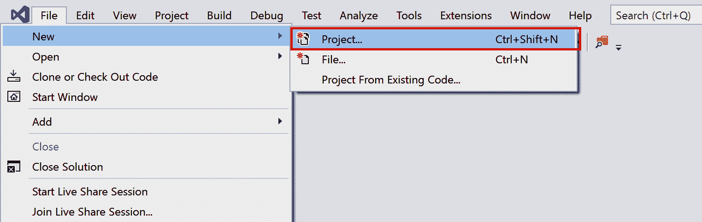
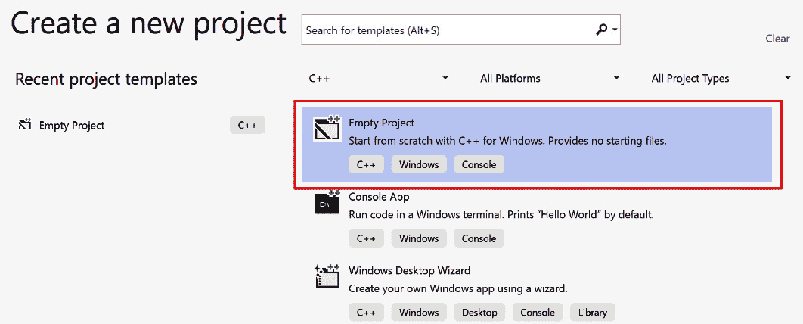
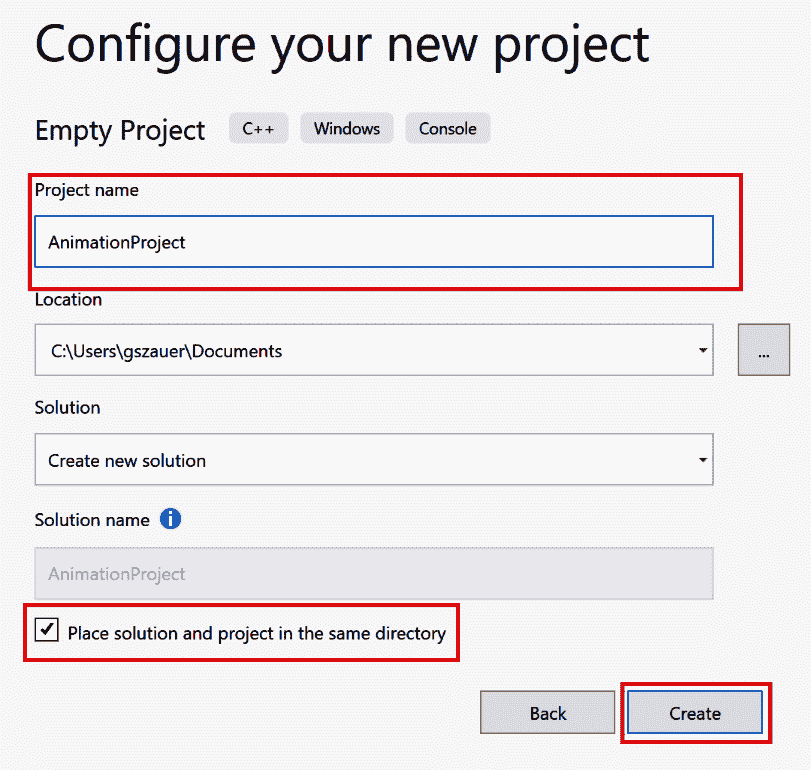
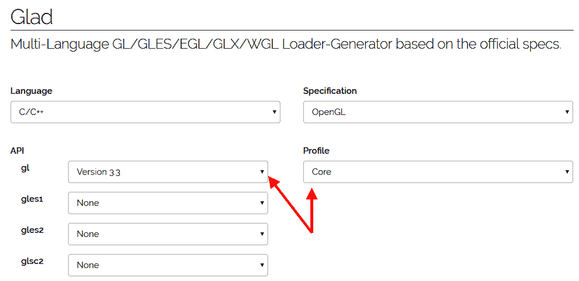
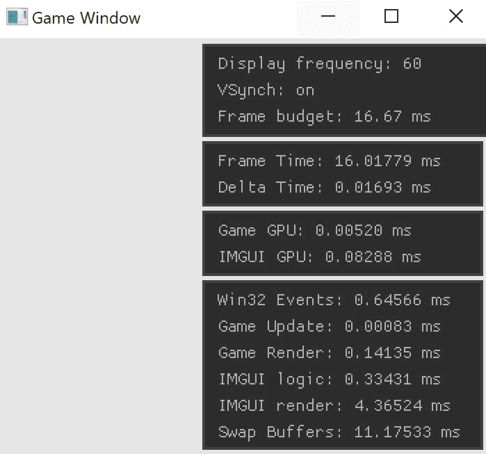

# *第一章*：创建游戏窗口

在本章中，你将设置一个简单的 Win32 窗口，并将一个 OpenGL 上下文绑定到它上。本书中将始终使用 OpenGL 3.3 核心。实际的 OpenGL 代码将非常少。

大部分特定于 OpenGL 的代码将被抽象成辅助对象和函数，这将使你能够专注于动画而不是任何特定的图形 API。你将在*第六章**，构建一个抽象渲染器*中编写抽象层，但现在，重要的是创建一个可以绘制的窗口。

在本章结束时，你应该能够做到以下几点：

+   打开一个 Win32 窗口

+   创建并绑定一个 OpenGL 3.3 核心上下文

+   使用 glad 加载 OpenGL 3.3 核心函数

+   为创建的窗口启用垂直同步

+   了解本书的可下载示例

# 技术要求

要跟随本书中的代码，你需要一台安装了最新版本的 Windows 10 的计算机，并安装了 Visual Studio。所有可下载的代码示例都是使用 Visual Studio 2019 构建的。你可以从[`visualstudio.microsoft.com/`](https://visualstudio.microsoft.com/)下载 Visual Studio。

你可以在 GitHub 上找到本书的所有示例代码[`github.com/PacktPublishing/Game-Animation-Programming`](https://github.com/PacktPublishing/Game-Animation-Programming)。

# 创建一个空项目

在本书中，你将尽可能地从头开始创建代码。因此，外部依赖将会很少。要开始，请按照以下步骤在 Visual Studio 中创建一个新的空白 C++项目：

1.  打开 Visual Studio，通过**文件**|**新建**|**项目**创建一个新项目：

图 1.1：创建一个新的 Visual Studio 项目

1.  你将在弹出窗口的左侧看到项目模板。导航到**已安装**|**Visual C++**|**其他**。然后，选择**空项目**：

图 1.2：创建一个空的 C++项目

1.  输入项目名称并选择项目位置。最后，点击**创建**。



图 1.3：指定新项目名称

如果你按照前面的步骤操作，你应该有一个新的空白项目。在本章的其余部分，你将添加一个应用程序框架和一个启用了 OpenGL 的窗口。

# 创建应用程序类

维护杂乱的窗口入口函数将会很困难。相反，你需要创建一个抽象的`Application`类。这个类将包含一些基本函数，比如`Initialize`、`Update`、`Render`和`Shutdown`。本书提供的所有代码示例都将构建在`Application`基类之上。

创建一个新文件，`Application.h`。`Application`类的声明在以下代码示例中提供。将这个声明添加到新创建的`Application.h`文件中：

```cpp
#ifndef _H_APPLICATION_
#define _H_APPLICATION_
class Application {
private:
    Application(const Application&);
    Application& operator=(const Application&);
public:
    inline Application() { }
    inline virtual ~Application() { }
    inline virtual void Initialize() { }
    inline virtual void Update(float inDeltaTime) { }
    inline virtual void Render(float inAspectRatio) { }
    inline virtual void Shutdown() { }
};
#endif
```

`Initialize`、`Update`、`Render`和`Shutdown`函数是应用程序的生命周期。所有这些函数将直接从 Win32 窗口代码中调用。`Update`和`Render`需要参数。要更新一个帧，需要知道当前帧和上一帧之间的时间差。要渲染一个帧，需要知道窗口的宽高比。

生命周期函数是虚拟的。本书可下载材料中的每一章都有一个示例，它是`Application`类的子类，演示了该章节的概念。

接下来，你将向项目添加一个 OpenGL 加载器。

# 添加一个 OpenGL 加载器

本章依赖于一些外部代码，称为`glad`。在 Windows 上创建一个新的 OpenGL 上下文时，它将使用一个传统的 OpenGL 上下文。OpenGL 的扩展机制将允许你使用这个传统上下文来创建一个新的现代上下文。

一旦现代上下文被创建，您将需要获取所有 OpenGL 函数的函数指针。这些函数需要使用 `wglGetProcAdress` 加载，它返回一个函数指针。

以这种方式加载每个 OpenGL 函数将非常耗时。这就是使用 OpenGL 加载器的地方；`glad` 将为您完成所有这些工作。OpenGL 加载器是一个库或一些代码，调用 `wglGetProcAdress` 来定义 OpenGL API 的函数。

在 Windows 上有几个 OpenGL 加载器可用；本书将使用 `glad`。`glad` 是一个只包含几个文件的小型库。它有一个简单的 API；您调用一个函数就可以访问所有的 OpenGL 函数。`glad` 有一个基于 web 的界面；您可以在 [`glad.dav1d.de/`](https://glad.dav1d.de/) 找到它。

重要提示

在使用 X 窗口系统（例如许多流行的 Linux 发行版）时，加载 OpenGL 函数的函数是 `glXGetProcAddress`。与 Windows 一样，Linux 也有可用的 OpenGL 加载器。并非所有操作系统都需要 OpenGL 加载器；例如，macOS、iOS 和 Android 不需要加载器。iOS 和 Android 都运行在 OpenGL ES 上。

# 获取 glad

您可以从 [`glad.dav1d.de/`](https://glad.dav1d.de/) 获取 `glad`，这是一个基于 web 的生成器：

1.  转到该网站，从 **gl** 下拉菜单中选择 **Version 3.3**，从 **Profile** 下拉菜单中选择 **Core**：

图 1.4：配置 glad

1.  滚动到底部，点击 **Generate** 按钮。这应该开始下载一个包含所有所需代码的 ZIP 文件。

本书中提供的代码与 OpenGL 版本 3.3 或更高版本向前兼容。如果要使用更新的 OpenGL 版本，例如 4.6，将 API 下拉菜单下的 gl 更改为所需的版本。在下一节中，您将向主项目添加此 ZIP 文件的内容。

## 将 glad 添加到项目

一旦下载了 `glad.zip`，解压其内容。将 ZIP 文件中的以下文件添加到您的项目中。不需要维护目录结构；所有这些文件都可以放在一起：

+   `src/glad.c`

+   `include/glad/glad.h`

+   `include/KHR/khrplatform.h`

这些文件将被包含为普通项目文件——您不需要设置 `include` 路径——但这意味着文件的内容需要被编辑：

1.  打开 `glad.c`，并找到以下 #include：

`#include <glad/glad.h>`

1.  用 `glad.h` 的相对路径替换 `include` 路径：

`#include "glad.h"`

1.  同样，打开 `glad.h`，并找到以下 #include：

`#include <KHR/khrplatform.h>`

1.  用 `khrplatform.h` 的相对路径替换 `include` 路径：

`#include "khrplatform.h"`

`glad` 现在应该已经添加到项目中，不应该有编译错误。在下一节中，您将开始实现 Win32 窗口。

# 创建窗口

在本节中，您将创建一个窗口。这意味着您将直接使用 Win32 API 调用来打开窗口并从代码中控制其生命周期。您还将设置一个调试控制台，可以与窗口一起运行，这对于查看日志非常有用。

重要提示

深入讨论 Win32 API 超出了本书的范围。有关任何 Win32 API 的其他信息，请参阅微软开发者网络（MSDN）[`docs.microsoft.com/en-us/windows/win32/api/`](https://docs.microsoft.com/en-us/windows/win32/api/)。

为了使日志记录变得更容易，在调试模式下将同时打开两个窗口。一个是标准的 Win32 窗口，另一个是用于查看日志的控制台窗口。这可以通过条件设置链接器来实现。在调试模式下，应用程序应链接到控制台子系统。在发布模式下，应链接到窗口子系统。

可以通过项目的属性或使用`#pragma`注释在代码中设置链接器子系统。一旦子系统设置为控制台，`WinMain`函数就可以从`main`中调用，这将启动一个附加到控制台的窗口。

还可以通过代码执行其他链接器操作，例如链接到外部库。您将使用`#pragma`命令与 OpenGL 进行链接。

通过创建一个新文件`WinMain.cpp`来开始窗口实现。该文件将包含所有窗口逻辑。然后，执行以下操作：

1.  将以下代码添加到文件开头。它创建了`#define`常量，减少了通过包含`<windows.h>`引入的代码量：

```cpp
#define _CRT_SECURE_NO_WARNINGS
#define WIN32_LEAN_AND_MEAN
#define WIN32_EXTRA_LEAN
#include "glad.h"
#include <windows.h>
#include <iostream>
#include "Application.h"
```

1.  需要提前声明窗口入口函数和窗口事件处理函数。这是我们需要打开一个新窗口的两个 Win32 函数：

```cpp
int WINAPI WinMain(HINSTANCE, HINSTANCE, PSTR, int);
LRESULT CALLBACK WndProc(HWND, UINT, WPARAM, LPARAM);
```

1.  使用`#pragma`注释在代码中链接到`OpenGL32.lib`，而不是通过项目的属性窗口。将以下代码添加到`WinMain.cpp`中：

```cpp
#if _DEBUG
    #pragma comment( linker, "/subsystem:console" )
    int main(int argc, const char** argv) {
        return WinMain(GetModuleHandle(NULL), NULL,
                GetCommandLineA(), SW_SHOWDEFAULT);
    }
#else
    #pragma comment( linker, "/subsystem:windows" )
#endif
#pragma comment(lib, "opengl32.lib")
```

现在需要声明一些 OpenGL 函数。通过`wglCreateContextAttribsARB`创建现代 OpenGL 上下文，但是没有引用此函数。这是需要通过`wglGetProcAddress`加载的函数之一，因为它是一个扩展函数。

`wglCreateContextAttribsARB`的函数签名可以在`wglext.h`中找到。`wglext.h`头文件由 Khronos 托管，并且可以在 OpenGL 注册表的[`www.khronos.org/registry/OpenGL/index_gl.php`](https://www.khronos.org/registry/OpenGL/index_gl.php)上找到。

无需包含整个`wglext.h`头文件；您只需要与创建现代上下文相关的函数。以下代码直接从文件中复制。它包含了相关`#define`常量和函数指针类型的声明：

```cpp
#define WGL_CONTEXT_MAJOR_VERSION_ARB     0x2091
#define WGL_CONTEXT_MINOR_VERSION_ARB     0x2092
#define WGL_CONTEXT_FLAGS_ARB             0x2094
#define WGL_CONTEXT_CORE_PROFILE_BIT_ARB  0x00000001
#define WGL_CONTEXT_PROFILE_MASK_ARB      0x9126
typedef HGLRC(WINAPI* PFNWGLCREATECONTEXTATTRIBSARBPROC) 
             (HDC, HGLRC, const int*);
```

前面的代码定义了一个`wglCreatecontextAttribsARB`的函数指针类型。除此之外，还有一些`#define`常量，用于创建 OpenGL 3.3 核心上下文。本书的示例将启用`vsynch`，可以通过`wglSwapIntervalEXT`来实现。

正如您猜到的那样，这个函数也需要使用 OpenGL 的扩展机制加载。它还需要两个额外的支持函数：`wglGetExtensionStringEXT`和`wglGetSwapIntervalEXT`。这三个函数都可以在`wgl.h`中找到，该文件由 Khronos 在先前链接的 OpenGL 注册表中托管。

不要包含`wgl.h`，而是将以下代码添加到`WinMain.cpp`中。该代码定义了`wglGetExtensionStringEXT`、`wglSwapIntervalEXT`和`wglGetSwapIntervalEXT`的函数指针签名，从`wgl.h`中复制出来：

```cpp
typedef const char* 
        (WINAPI* PFNWGLGETEXTENSIONSSTRINGEXTPROC) (void);
typedef BOOL(WINAPI* PFNWGLSWAPINTERVALEXTPROC) (int);
typedef int (WINAPI* PFNWGLGETSWAPINTERVALEXTPROC) (void);
```

前面的代码是必须的，用于与 OpenGL 一起工作。通常会复制代码，而不是直接包含这些头文件。在下一节中，您将开始处理实际的窗口。

## 全局变量

需要两个全局变量以便轻松清理窗口：指向当前运行应用程序的指针和全局 OpenGL **顶点数组对象**（**VAO**）的句柄。不是每个绘制调用都有自己的 VAO，整个示例的持续时间将绑定一个 VAO。

为此，请创建以下全局变量：

```cpp
Application* gApplication = 0;
GLuint gVertexArrayObject = 0;
```

在本书的其余部分，将不会有其他全局变量。全局变量可能会使程序状态更难以跟踪。这两个存在的原因是稍后在应用程序关闭时轻松引用它们。接下来，您将开始实现`WinMain`函数以打开一个新窗口。

## 打开一个窗口

接下来，您需要实现窗口入口函数`WinMain`。此函数将负责创建窗口类，注册窗口类并打开一个新窗口：

1.  通过创建`Application`类的新实例并将其存储在全局指针中来开始定义`WinMain`的定义：

```cpp
int WINAPI WinMain(HINSTANCE hInstance, HINSTANCE 
                   hPrevInstance, PSTR szCmdLine, 
                   int iCmdShow) {
gApplication = new Application();
```

1.  接下来，需要填写`WNDCLASSEX`的一个实例。这里没有什么特别的，它只是一个标准的窗口定义。唯一需要注意的是`WndProc`函数是否设置正确：

```cpp
    WNDCLASSEX wndclass;
    wndclass.cbSize = sizeof(WNDCLASSEX);
    wndclass.style = CS_HREDRAW | CS_VREDRAW;
    wndclass.lpfnWndProc = WndProc;
    wndclass.cbClsExtra = 0;
    wndclass.cbWndExtra = 0;
    wndclass.hInstance = hInstance;
    wndclass.hIcon = LoadIcon(NULL, IDI_APPLICATION);
    wndclass.hIconSm = LoadIcon(NULL, IDI_APPLICATION);
    wndclass.hCursor = LoadCursor(NULL, IDC_ARROW);
    wndclass.hbrBackground = (HBRUSH)(COLOR_BTNFACE + 1);
    wndclass.lpszMenuName = 0;
    wndclass.lpszClassName = "Win32 Game Window";
    RegisterClassEx(&wndclass);
```

1.  一个新的应用程序窗口应该在监视器的中心启动。为此，使用`GetSystemMetrics`来找到屏幕的宽度和高度。然后，调整`windowRect`到屏幕中心的所需大小：

```cpp
    int screenWidth = GetSystemMetrics(SM_CXSCREEN);
    int screenHeight = GetSystemMetrics(SM_CYSCREEN);
    int clientWidth = 800;
    int clientHeight = 600;
    RECT windowRect;
    SetRect(&windowRect, 
            (screenWidth / 2) - (clientWidth / 2), 
            (screenHeight / 2) - (clientHeight / 2), 
            (screenWidth / 2) + (clientWidth / 2), 
            (screenHeight / 2) + (clientHeight / 2));
```

1.  要确定窗口的大小，不仅仅是客户区域，需要知道窗口的样式。以下代码示例创建了一个可以最小化或最大化但不能调整大小的窗口。要调整窗口的大小，使用位或(`|`)运算符与`WS_THICKFRAME`定义：

```cpp
    DWORD style = (WS_OVERLAPPED | WS_CAPTION | 
        WS_SYSMENU | WS_MINIMIZEBOX | WS_MAXIMIZEBOX); 
    // | WS_THICKFRAME to resize
```

1.  一旦定义了所需的窗口样式，调用`AdjustWindowRectEx`函数来调整客户区矩形的大小，以包括所有窗口装饰在其大小中。当最终大小已知时，可以使用`CreateWindowEx`来创建实际的窗口。窗口创建完成后，存储对其设备上下文的引用：

```cpp
    AdjustWindowRectEx(&windowRect, style, FALSE, 0);
    HWND hwnd = CreateWindowEx(0, wndclass.lpszClassName, 
                "Game Window", style, windowRect.left, 
                windowRect.top, windowRect.right - 
                windowRect.left, windowRect.bottom - 
                windowRect.top, NULL, NULL, 
                hInstance, szCmdLine);
    HDC hdc = GetDC(hwnd);
```

1.  现在窗口已经创建，接下来你将创建一个 OpenGL 上下文。为此，你首先需要找到正确的像素格式，然后将其应用到窗口的设备上下文中。以下代码向你展示了如何做到这一点：

```cpp
    PIXELFORMATDESCRIPTOR pfd;
    memset(&pfd, 0, sizeof(PIXELFORMATDESCRIPTOR));
    pfd.nSize = sizeof(PIXELFORMATDESCRIPTOR);
    pfd.nVersion = 1;
    pfd.dwFlags = PFD_SUPPORT_OPENGL | PFD_DRAW_TO_WINDOW 
                  | PFD_DOUBLEBUFFER;
    pfd.iPixelType = PFD_TYPE_RGBA;
    pfd.cColorBits = 24;
    pfd.cDepthBits = 32;
    pfd.cStencilBits = 8;
    pfd.iLayerType = PFD_MAIN_PLANE;
    int pixelFormat = ChoosePixelFormat(hdc, &pfd);
    SetPixelFormat(hdc, pixelFormat, &pfd);
```

1.  设置了像素格式后，使用`wglCreateContext`创建一个临时的 OpenGL 上下文。这个临时上下文只是用来获取指向`wglCreateContextAttribsARB`的指针，它将用于创建一个现代上下文：

```cpp
    HGLRC tempRC = wglCreateContext(hdc);
    wglMakeCurrent(hdc, tempRC);
    PFNWGLCREATECONTEXTATTRIBSARBPROC
       wglCreateContextAttribsARB = NULL;
    wglCreateContextAttribsARB =
       (PFNWGLCREATECONTEXTATTRIBSARBPROC)
       wglGetProcAddress("wglCreateContextAttribsARB");
```

1.  存在并绑定了一个临时的 OpenGL 上下文，所以下一步是调用`wglCreateContextAttribsARB`函数。这个函数将返回一个 OpenGL 3.3 Core 上下文配置文件，绑定它，并删除旧的上下文：

```cpp
    const int attribList[] = {
        WGL_CONTEXT_MAJOR_VERSION_ARB, 3,
        WGL_CONTEXT_MINOR_VERSION_ARB, 3,
        WGL_CONTEXT_FLAGS_ARB, 0,
        WGL_CONTEXT_PROFILE_MASK_ARB,
        WGL_CONTEXT_CORE_PROFILE_BIT_ARB,
        0, };
    HGLRC hglrc = wglCreateContextAttribsARB(
                       hdc, 0, attribList);
    wglMakeCurrent(NULL, NULL);
    wglDeleteContext(tempRC);
    wglMakeCurrent(hdc, hglrc);
```

1.  在激活 OpenGL 3.3 Core 上下文后，可以使用`glad`来加载所有 OpenGL 3.3 Core 函数。调用`gladLoadGL`来实现这一点：

```cpp
    if (!gladLoadGL()) {
        std::cout << "Could not initialize GLAD\n";
    }
    else {
        std::cout << "OpenGL Version " << 
        GLVersion.major << "." << GLVersion.minor <<
          "\n";
    }
```

1.  现在应该已经初始化了一个 OpenGL 3.3 Core 上下文，并加载了所有核心 OpenGL 函数。接下来，你将在窗口上启用`vsynch`。`vsynch`不是一个内置函数；它是一个扩展，因此需要使用`wglGetExtensionStringEXT`来查询对它的支持。`vsynch`的扩展字符串是`WGL_EXT_swap_control`。检查它是否在扩展字符串列表中：

```cpp
    PFNWGLGETEXTENSIONSSTRINGEXTPROC
       _wglGetExtensionsStringEXT =
       (PFNWGLGETEXTENSIONSSTRINGEXTPROC)
       wglGetProcAddress("wglGetExtensionsStringEXT");
    bool swapControlSupported = strstr(
         _wglGetExtensionsStringEXT(), 
         "WGL_EXT_swap_control") != 0;
```

1.  如果`WGL_EXT_swap_control`扩展可用，需要加载它。实际的函数是`wglSwapIntervalEXT`，可以在`wgl.h`中找到。向`wglSwapIntervalEXT`传递参数可以打开`vsynch`：

```cpp
    int vsynch = 0;
    if (swapControlSupported) {
        PFNWGLSWAPINTERVALEXTPROC wglSwapIntervalEXT = 
            (PFNWGLSWAPINTERVALEXTPROC)
            wglGetProcAddress("wglSwapIntervalEXT");
        PFNWGLGETSWAPINTERVALEXTPROC 
            wglGetSwapIntervalEXT =
            (PFNWGLGETSWAPINTERVALEXTPROC)
            wglGetProcAddress("wglGetSwapIntervalEXT");
        if (wglSwapIntervalEXT(1)) {
            std::cout << "Enabled vsynch\n";
            vsynch = wglGetSwapIntervalEXT();
        }
        else {
            std::cout << "Could not enable vsynch\n";
        }
    }
    else { // !swapControlSupported
        cout << "WGL_EXT_swap_control not supported\n";
    }
```

1.  还有一点小事情要做，以完成 OpenGL 启用窗口的设置。OpenGL 3.3 Core 要求在所有绘制调用中绑定一个 VAO。你将创建一个全局 VAO，在`WinMain`中绑定它，并在窗口被销毁之前永远不解绑。以下代码创建了这个 VAO 并绑定它：

```cpp
    glGenVertexArrays(1, &gVertexArrayObject);
    glBindVertexArray(gVertexArrayObject);
```

1.  调用`ShowWindow`和`UpdateWindow`函数来显示当前窗口；这也是初始化全局应用程序的好地方。根据应用程序的`Initialize`函数所做的工作量，窗口可能会在一小段时间内出现冻结：

```cpp
    ShowWindow(hwnd, SW_SHOW);
    UpdateWindow(hwnd);
    gApplication->Initialize();
```

1.  现在你已经准备好实现实际的游戏循环了。你需要跟踪上一帧的时间，以计算帧之间的时间差。除了游戏逻辑，循环还需要处理窗口事件，通过查看当前消息堆栈并相应地分派消息：

```cpp
    DWORD lastTick = GetTickCount();
    MSG msg;
    while (true) {
        if (PeekMessage(&msg, NULL, 0, 0, PM_REMOVE)) {
            if (msg.message == WM_QUIT) {
                break;
            }
            TranslateMessage(&msg);
            DispatchMessage(&msg);
        }
```

1.  处理完窗口事件后，`Application`实例需要更新和渲染。首先，找到上一帧和当前帧之间的时间差，将其转换为秒。例如，以 60 FPS 运行的游戏应该有 16.6 毫秒或 0.0166 秒的时间差：

```cpp
        DWORD thisTick = GetTickCount();
        float dt = float(thisTick - lastTick) * 0.001f;
        lastTick = thisTick;
        if (gApplication != 0) {
            gApplication->Update(dt);
        }
```

1.  渲染当前运行的应用程序只需要更多的维护工作。每帧都要用`glViewport`设置 OpenGL 视口，并清除颜色、深度和模板缓冲区。除此之外，确保在渲染之前所有的 OpenGL 状态都是正确的。这意味着正确的 VAO 被绑定，深度测试和面剔除被启用，并且设置了适当的点大小：

```cpp
        if (gApplication != 0) {
            RECT clientRect;
            GetClientRect(hwnd, &clientRect);
            clientWidth = clientRect.right - 
                          clientRect.left;
            clientHeight = clientRect.bottom - 
                           clientRect.top;
            glViewport(0, 0, clientWidth, clientHeight);
            glEnable(GL_DEPTH_TEST);
            glEnable(GL_CULL_FACE);
            glPointSize(5.0f);
            glBindVertexArray(gVertexArrayObject);
            glClearColor(0.5f, 0.6f, 0.7f, 1.0f);
            glClear(GL_COLOR_BUFFER_BIT | 
            GL_DEPTH_BUFFER_BIT | GL_STENCIL_BUFFER_BIT);
            float aspect = (float)clientWidth / 
                           (float)clientHeight;
            gApplication->Render(aspect);
        }
```

1.  当前`Application`实例更新和渲染后，需要呈现后备缓冲区。这是通过调用`SwapBuffers`来完成的。如果启用了`vsynch`，则需要在`SwapBuffers`之后立即调用`glFinish`：

```cpp
        if (gApplication != 0) {
            SwapBuffers(hdc);
            if (vsynch != 0) {
                glFinish();
            }
        }
```

1.  窗口循环到此结束。窗口循环退出后，可以安全地从`WinMain`函数返回：

```cpp
    } // End of game loop
    if (gApplication != 0) {
        std::cout << "Expected application to 
                      be null on exit\n";
        delete gApplication;
    }
    return (int)msg.wParam;
}
```

如果要使用 OpenGL 的其他版本而不是 3.3，调整 Step 8 中`attribList`变量中的主要和次要值。即使`WinMain`函数已经编写，你仍然无法编译这个文件；因为`WndProc`从未被定义过。`WndProc`函数处理诸如鼠标移动或窗口调整大小等事件。在下一节中，你将实现`WndProc`函数。

## 创建事件处理程序

为了拥有一个正常运行的窗口，甚至编译应用程序，在这一点上，事件处理函数`WndProc`必须被定义。这里的实现将非常简单，主要关注如何销毁窗口：

1.  在`WinMain.cpp`中开始实现`WndProc`函数：

```cpp
LRESULT CALLBACK WndProc(HWND hwnd, UINT iMsg, 
                    WPARAM wParam, LPARAM lParam) {
    switch (iMsg) {
```

1.  当接收到`WM_CLOSE`消息时，需要关闭`Application`类并发出销毁窗口消息。应用程序关闭后，不要忘记删除它：

```cpp
    case WM_CLOSE:
        if (gApplication != 0) {
            gApplication->Shutdown();
            delete gApplication;
            gApplication = 0;
            DestroyWindow(hwnd);
        }
        else {
            std::cout << "Already shut down!\n";
        }
        break;
```

1.  当接收到销毁消息时，窗口的 OpenGL 资源需要被释放。这意味着删除全局顶点数组对象，然后删除 OpenGL 上下文：

```cpp
    case WM_DESTROY:
        if (gVertexArrayObject != 0) {
            HDC hdc = GetDC(hwnd);
            HGLRC hglrc = wglGetCurrentContext();
            glBindVertexArray(0);
            glDeleteVertexArrays(1, &gVertexArrayObject);
            gVertexArrayObject = 0;
            wglMakeCurrent(NULL, NULL);
            wglDeleteContext(hglrc);
            ReleaseDC(hwnd, hdc);
            PostQuitMessage(0);
        }
        else {
            std::cout << "Multiple destroy messages\n";
        }
        break;
```

1.  绘制和擦除背景消息是安全忽略的，因为 OpenGL 正在管理对窗口的渲染。如果收到的消息不是已经处理的消息之一，将其转发到默认的窗口消息函数：

```cpp
    case WM_PAINT:
    case WM_ERASEBKGND:
        return 0;
    }
    return DefWindowProc(hwnd, iMsg, wParam, lParam);
}
```

现在你已经编写了窗口事件循环，应该能够编译和运行一个空白窗口。在接下来的部分，你将探索本书的可下载示例。

# 探索样本

本书中提供的所有代码都可以在书的可下载内容中找到。有一个名为`AllChapters`的大型示例，其中包含单个应用程序中的每个示例。有一个`Bin` ZIP 文件，其中包含`AllChapters`示例的预编译可执行文件。

每个章节还包含多个子文件夹的单独文件夹。每个章节都包含`Sample00`，这是书中编写的代码，没有额外的内容。随后编号的示例添加了内容。

`AllChapters`示例看起来与各个章节文件夹中的示例有些不同。该应用程序使用 Nuklear ([`github.com/vurtun/nuklear`](https://github.com/vurtun/nuklear)) 来显示其用户界面。显示的用户界面部分是屏幕右上角的统计计数器。它看起来像这样：



图 1.5：AllChapters 示例的统计计数器

顶部框包含有关应用程序打开的显示器的一些常规信息。这些信息包括显示频率、是否启用`vsynch`以及以毫秒为单位的帧预算。

下面的第二个框包含高级帧定时。如果在最近的 60 帧中有一帧过时，显示的时间将变成红色。一些过时的帧是不可避免的；如果帧速率降至 59.9，文本将在一秒钟内显示为红色。偶尔在这里看到红色是可以接受的；只有当数字完全变成红色时才会引起关注。

第三个框中包含两个 GPU 定时器；这些定时器测量样本在 GPU 上的运行速度。这对于调试任何繁重的绘制调用非常有用。最后一个框包含 CPU 定时器，有助于找出问题的哪个阶段存在瓶颈。

重要说明

在整本书中，您将使用 C++ `stl`容器。标准库在调试模式下有点慢，主要是由于错误检查。建议仅在发布模式下对任何示例进行性能分析。

这些示例应该很好地演示了您将在接下来的每一章中学到的内容。它们还为您提供了一个可以与您的代码进行比较的示例。

# 摘要

在本章中，您探讨了设置新的 Win32 窗口的过程。建立了一个 OpenGL 3.3 核心上下文来渲染窗口，并启用了`vsynch`。您了解了 OpenGL 加载器以及`glad`如何加载所有相关的 OpenGL 函数。

这个窗口将作为您构建的基础；所有未来的示例都是基于您在本章中创建的框架。在下一章中，您将开始探索渲染和动画所需的一些数学知识。
