# 第二章：*第二章*：实现向量

在本章中，您将学习向量数学的基础知识。本书的其余部分大部分编码都依赖于对向量有很好的理解。向量将用于表示位移和方向。

在本章结束时，您将实现一个强大的向量库，并能够执行各种向量操作，包括分量和非分量操作。

本章将涵盖以下主题：

+   引入向量

+   创建一个向量

+   理解分量操作

+   理解非分量操作

+   插值向量

+   比较向量

+   探索更多向量

重要信息：

在本章中，您将学习如何以直观、可视的方式实现向量，这依赖于代码而不是数学公式。如果您对数学公式感兴趣，或者想尝试一些交互式示例，请访问[`gabormakesgames.com/vectors.html`](https://gabormakesgames.com/vectors.html)。

# 引入向量

什么是向量？向量是一个 n 元组的数字。它表示作为大小和方向测量的位移。向量的每个元素通常表示为下标，例如*(V*0*，V*1*，V*2*，… V*N*)*。在游戏的背景下，向量通常有两个、三个或四个分量。

例如，三维向量测量三个独特轴上的位移：*x*、*y*和*z*。向量的元素通常用表示它们代表的轴的下标，而不是索引。*(V*X*，V*Y*，V*Z*)*和*(V*0*，V*1*，V*2*)*可以互换使用。

在可视化向量时，它们通常被绘制为箭头。箭头的基部位置并不重要，因为向量测量的是位移，而不是位置。箭头的末端遵循每个轴上的位移。

例如，以下图中的所有箭头代表相同的向量：

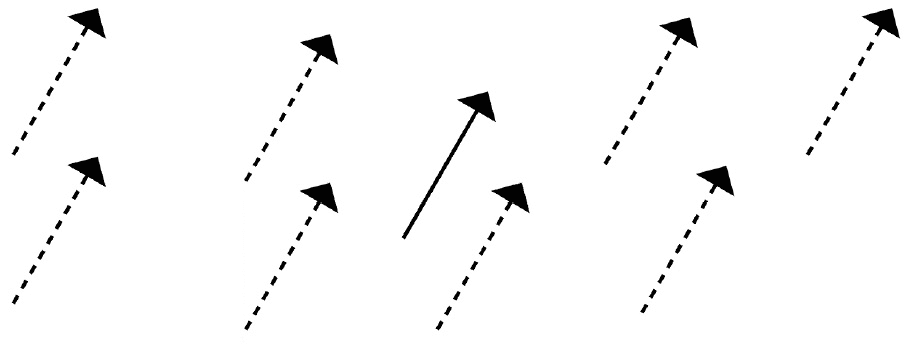

图 2.1：在多个位置绘制的向量(2, 5)

每个箭头的长度相同，指向相同的方向，无论它们的位置如何。在下一节中，您将开始实现将在本书的其余部分中使用的向量结构。

# 创建一个向量

向量将被实现为结构，而不是类。向量结构将包含一个匿名联合，允许以数组或单独元素的形式访问向量的分量。

要声明`vec3`结构和函数头，请创建一个新文件`vec3.h`。在此文件中声明新的`vec3`结构。`vec3`结构需要三个构造函数——一个默认构造函数，一个以每个分量作为元素的构造函数，以及一个以浮点数组指针作为参数的构造函数：

```cpp
#ifndef _H_VEC3_
#define _H_VEC3_
struct vec3 {
    union {
        struct  {
            float x;
            float y;
            float z;
        };
        float v[3];
    };
    inline vec3() : x(0.0f), y(0.0f), z(0.0f) { }
    inline vec3(float _x, float _y, float _z) :
        x(_x), y(_y), z(_z) { }
    inline vec3(float *fv) :
        x(fv[0]), y(fv[1]), z(fv[2]) { }
};
#endif 
```

`vec3`结构中的匿名联合允许使用`.x`、`.y`和`.z`表示法访问数据，或者使用`.v`表示法作为连续数组访问。在继续实现在`vec3`结构上工作的函数之前，您需要考虑比较浮点数以及是否使用 epsilon 值。

## Epsilon

比较浮点数是困难的。您需要使用一个 epsilon 来比较两个浮点数，而不是直接比较它们。epsilon 是一个任意小的正数，是两个数字需要具有的最小差异，才能被视为不同的数字。在`vec3.h`中声明一个 epsilon 常量：

```cpp
#define VEC3_EPSILON 0.000001f
```

重要提示：

您可以在[`bitbashing.io/comparing-floats.html`](https://bitbashing.io/comparing-floats.html)了解更多关于浮点数比较的信息

通过创建`vec3`结构和定义`vec3` epsilon，您已经准备好开始实现一些常见的向量操作。在下一节中，您将开始学习和实现几种分量操作。

# 理解分量操作

几个向量操作只是分量操作。分量操作是指对向量的每个分量或两个向量的相似分量进行的操作。相似的分量是具有相同下标的分量。您将要实现的分量操作如下：

+   向量相加

+   向量减法

+   向量缩放

+   向量相乘

+   点积

让我们更详细地看看这些。

## 向量相加

将两个向量相加会产生一个第三个向量，它具有两个输入向量的合并位移。向量相加是一种分量操作；要执行它，您需要添加相似的分量。

要可视化两个向量的相加，将第二个向量的基部放在第一个向量的尖端。接下来，从第一个向量的基部到第二个向量的尖端画一个箭头。这个箭头代表了相加的结果向量：

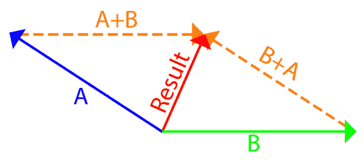

图 2.2：向量相加

要在代码中实现向量相加，添加输入向量的相似分量。创建一个新文件`vec3.cpp`。这是您将定义与`vec3`结构相关的函数的地方。不要忘记包含`vec3.h`。重载`+运算符`以执行向量相加。不要忘记将函数签名添加到`vec3.h`中：

```cpp
vec3 operator+(const vec3 &l, const vec3 &r) {
    return vec3(l.x + r.x, l.y + r.y, l.z + r.z);
}
```

在考虑向量相加时，请记住向量表示位移。当添加两个向量时，结果是两个输入向量的合并位移。

## 向量减法

与添加向量一样，减去向量也是一种分量操作。您可以将减去向量视为将第二个向量的负值添加到第一个向量。当可视化为箭头时，减法指向从第二个向量的尖端到第一个向量的尖端。

为了直观地减去向量，将两个向量放置在同一个起点。从第二个箭头的尖端到第一个箭头的尖端画一个向量。得到的箭头就是减法结果向量：

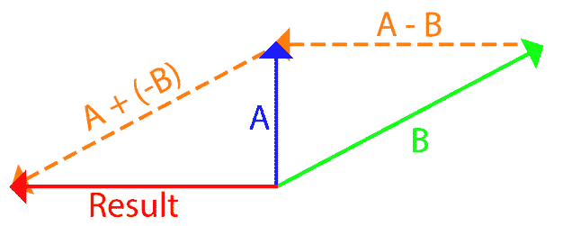

图 2.3：向量减法

要实现向量减法，减去相似的分量。通过在`vec3.cpp`中重载`-`运算符来实现减法函数。不要忘记将函数声明添加到`vec3.h`中：

```cpp
vec3 operator-(const vec3 &l, const vec3 &r) {
    return vec3(l.x - r.x, l.y - r.y, l.z - r.z);
}
```

步骤和逻辑与向量相加非常相似。将向量减法视为添加一个负向量可能会有所帮助。

## 缩放向量

当向量被缩放时，它只在大小上改变，而不改变方向。与加法和减法一样，缩放是一种分量操作。与加法和减法不同，向量是由标量而不是另一个向量进行缩放的。

在视觉上，一个缩放的向量指向与原始向量相同的方向，但长度不同。下图显示了两个向量：*(2, 1)*和*(2, 4)*。两个向量具有相同的方向，但第二个向量的大小更长：

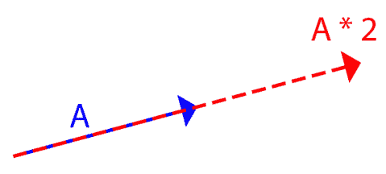

图 2.4：向量缩放

要实现向量缩放，将向量的每个分量乘以给定的标量值。

通过在`vec3.cpp`中重载`*`运算符来实现缩放函数。不要忘记将函数声明添加到`vec3.h`中：

```cpp
vec3 operator*(const vec3 &v, float f) {
    return vec3(v.x * f, v.y * f, v.z * f);
}
```

通过将向量缩放*-1*来对向量取反。当对向量取反时，向量保持其大小，但改变其方向。

## 向量相乘

向量乘法可以被认为是一种非均匀缩放。与将向量的每个分量乘以标量不同，要将两个向量相乘，需要将向量的每个分量乘以另一个向量的相似分量。

您可以通过在`vec3.cpp`中重载`*`运算符来实现向量乘法。不要忘记将函数声明添加到`vec3.h`中：

```cpp
vec3 operator*(const vec3 &l, const vec3 &r) {
    return vec3(l.x * r.x, l.y * r.y, l.z * r.z);
}
```

通过将两个向量相乘生成的结果将具有不同的方向和大小。

## 点积

点积用于衡量两个向量的相似程度。给定两个向量，点积返回一个标量值。点积的结果具有以下属性：

+   如果向量指向相同的方向，则为正。

+   如果向量指向相反的方向，则为负。

+   如果向量垂直，则为*0*。

如果两个输入向量都具有单位长度（您将在本章的*法向量*部分了解单位长度向量），点积将具有*-1*到*1*的范围。

两个向量*A*和*B*之间的点积等于*A*的长度乘以*B*的长度乘以两个向量之间的角的余弦：


计算点积的最简单方法是对输入向量中相似的分量进行求和：

*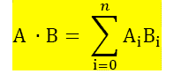*

在`vec3.cpp`中实现`dot`函数。不要忘记将函数定义添加到`vec3.h`中：

```cpp
float dot(const vec3 &l, const vec3 &r) {
    return l.x * r.x + l.y * r.y + l.z * r.z;
}
```

点积是视频游戏中最常用的操作之一。它经常用于检查角度和光照计算。

通过点积，您已经实现了向量的常见分量操作。接下来，您将了解一些可以在向量上执行的非分量操作。

# 理解非分量操作

并非所有向量操作都是分量式的；一些操作需要更多的数学。在本节中，您将学习如何实现不基于分量的常见向量操作。这些操作如下：

+   如何找到向量的长度

+   法向量是什么

+   如何对向量进行归一化

+   如何找到两个向量之间的角度

+   如何投影向量以及拒绝是什么

+   如何反射向量

+   叉积是什么以及如何实现它

让我们更详细地看看每一个。

## 向量长度

向量表示方向和大小；向量的大小是它的长度。找到向量长度的公式来自三角学。在下图中，一个二维向量被分解为平行和垂直分量。注意这如何形成一个直角三角形，向量是斜边：

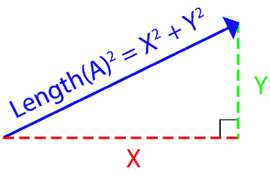

图 2.5：一个向量分解为平行和垂直分量

直角三角形的斜边长度可以用毕达哥拉斯定理找到，*A*2 *+ B*2 *= C*2。通过简单地添加一个*Z*分量，这个函数可以扩展到三维—*X*2 *+ Y*2 *+ Z*2 *= length*2\。

您可能已经注意到了一个模式；一个向量的平方长度等于其分量的和。这可以表示为一个点积—*Length*2*(A) = dot(A, A)*：

重要说明：

找到向量的长度涉及平方根运算，应尽量避免。在检查向量的长度时，可以在平方空间中进行检查以避免平方根。例如，如果您想要检查向量*A*的长度是否小于*5*，可以表示为*(dot(A, A) < 5 * 5)*。

1.  要实现平方长度函数，求出向量的每个分量的平方的和。在`vec3.cpp`中实现`lenSq`函数。不要忘记将函数声明添加到`vec3.h`中：

```cpp
float lenSq(const vec3& v) {
    return v.x * v.x + v.y * v.y + v.z * v.z;
}
```

1.  要实现长度函数，取平方长度函数的结果的平方根。注意不要用`sqrtf`调用`0`。在`vec3.cpp`中实现`lenSq`函数。不要忘记将函数声明添加到`vec3.h`中：

```cpp
float len(const vec3 &v) {
    float lenSq = v.x * v.x + v.y * v.y + v.z * v.z;
    if (lenSq < VEC3_EPSILON) {
        return 0.0f;
    }
    return sqrtf(lenSq);
}
```

重要说明：

您可以通过取它们之间的差的长度来找到两个向量之间的距离。例如，*float distance = len(vec1 - vec2)*。

## 归一化向量

长度为*1*的向量称为法向量（或单位向量）。通常，单位向量用于表示没有大小的方向。两个单位向量的点积总是在*-1*到*1*的范围内。

除了*0*向量外，任何向量都可以通过将向量按其长度的倒数进行缩放来归一化：

1.  在`vec3.cpp`中实现`normalize`函数。不要忘记将函数声明添加到`vec3.h`中：

```cpp
void normalize(vec3 &v) {
    float lenSq = v.x * v.x + v.y * v.y + v.z * v.z;
    if (lenSq < VEC3_EPSILON) { return; }
    float invLen = 1.0f / sqrtf(lenSq);    
    v.x *= invLen;
    v.y *= invLen;
    v.z *= invLen;
}
```

1.  在`vec3.cpp`中实现`normalized`函数。不要忘记将函数声明添加到`vec3.h`中：

```cpp
vec3 normalized(const vec3 &v) {
    float lenSq = v.x * v.x + v.y * v.y + v.z * v.z;
    if (lenSq < VEC3_EPSILON) { return v; }
    float invLen = 1.0f / sqrtf(lenSq);
    return vec3(
        v.x * invLen,
        v.y * invLen,
        v.z * invLen
    );
}
```

`normalize`函数接受一个向量的引用并就地对其进行归一化。另一方面，`normalized`函数接受一个常量引用并不修改输入向量。相反，它返回一个新的向量。

## 向量之间的角度

如果两个向量是单位长度，它们之间的角度是它们的点积的余弦：


如果两个向量未被归一化，则点积需要除以两个向量长度的乘积：

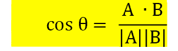

要找到实际角度，而不仅仅是其余弦，我们需要在两侧取余弦的反函数，即反余弦函数：

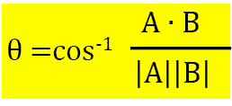

在`vec3.cpp`中实现`angle`函数。不要忘记将函数声明添加到`vec3.h`中：

```cpp
float angle(const vec3 &l, const vec3 &r) {
    float sqMagL = l.x * l.x + l.y * l.y + l.z * l.z;
    float sqMagR = r.x * r.x + r.y * r.y + r.z * r.z;
    if (sqMagL<VEC3_EPSILON || sqMagR<VEC3_EPSILON) {
        return 0.0f;
    }
    float dot = l.x * r.x + l.y * r.y + l.z * r.z;
    float len = sqrtf(sqMagL) * sqrtf(sqMagR);
    return acosf(dot / len);
}
```

重要说明：

`acosf`函数以弧度返回角度。要将弧度转换为度数，乘以`57.2958f`。要将度数转换为弧度，乘以`0.0174533f`。

## 向量投影和拒绝

将向量*A*投影到向量*B*上会产生一个新的向量，该向量在*B*的方向上具有*A*的长度。直观地理解向量投影的好方法是想象向量*A*投射到向量*B*上的阴影，如图所示：

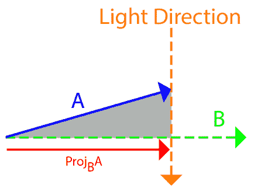

图 2.6：向量 A 投射到向量 B 上的阴影

要计算*A*在*B*上的投影(*proj*B *A*)，必须将向量*A*分解为相对于向量*B*的平行和垂直分量。平行分量是*A*在*B*方向上的长度，这就是投影。垂直分量是从*A*中减去平行分量，这就是拒绝：

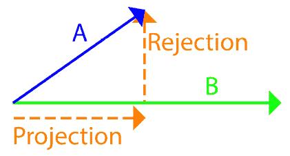

图 2.7：向量投影和拒绝显示平行和垂直向量

如果被投影的向量（在这个例子中是向量*B*）是一个法向量，那么在*B*方向上的*A*的长度可以通过*A*和*B*的点积来简单计算。然而，如果两个输入向量都没有被归一化，点积需要除以向量*B*的长度（被投影的向量）。

现在，相对于*B*的平行分量已知，向量*B*可以被这个分量缩放。同样，如果*B*不是单位长度，结果将需要除以向量*B*的长度。

拒绝是投影的反面。要找到*A*在*B*上的拒绝，从向量*A*中减去*A*在*B*上的投影：

1.  在`vec3.cpp`中实现`project`函数。不要忘记将函数声明添加到`vec3.h`中：

```cpp
vec3 project(const vec3 &a, const vec3 &b) {
    float magBSq = len(b);
    if (magBSq < VEC3_EPSILON) {
        return vec3();
    }
    float scale = dot(a, b) / magBSq;
    return b * scale;
}
```

1.  在`vec3.cpp`中实现`reject`函数。不要忘记在`vec3.h`中声明这个函数：

```cpp
vec3 reject(const vec3 &a, const vec3 &b) {
    vec3 projection = project(a, b);
    return a - projection;
}
```

向量投影和拒绝通常用于游戏编程。重要的是它们在一个健壮的向量库中得到实现。

## 向量反射

向量反射可以有两种意思：镜像反射或弹跳反射。以下图显示了不同类型的反射：

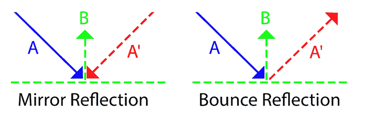

图 2.8：镜像和弹跳反射的比较

反弹反射比镜面反射更有用和直观。要使反弹投影起作用，将向量*A*投影到向量*B*上。这将产生一个指向反射相反方向的向量。对这个投影取反，并从向量 A 中减去两次。以下图演示了这一点：

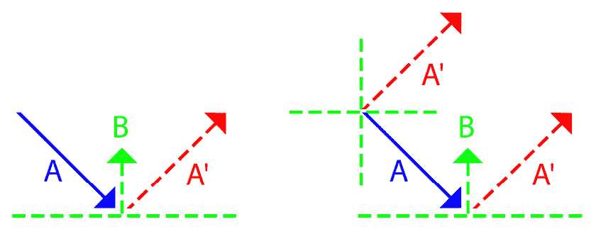

图 2.9：可视化反弹反射

在`vec3.cpp`中实现`reflect`函数。不要忘记将函数声明添加到`vec3.h`中：

```cpp
vec3 reflect(const vec3 &a, const vec3 &b) {
    float magBSq = len(b);
    if (magBSq < VEC3_EPSILON) {
        return vec3();
    }
    float scale = dot(a, b) / magBSq;
    vec3 proj2 = b * (scale * 2);
    return a - proj2;
}
```

矢量反射对物理学和人工智能很有用。我们不需要用反射来进行动画，但是最好实现这个功能以防需要时使用。

## 叉积

给定两个输入向量，叉积返回一个垂直于两个输入向量的第三个向量。叉积的长度等于两个向量形成的平行四边形的面积。

以下图展示了叉积在视觉上的样子。输入向量不一定要相隔 90 度，但以这种方式可更容易地将它们可视化：

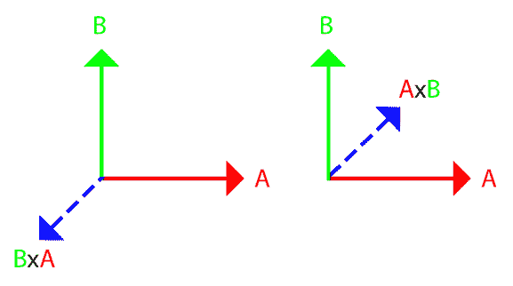

图 2.10：可视化叉积

找到叉积涉及一些矩阵运算，这将在下一章中更深入地介绍。现在，您需要创建一个 3x3 矩阵，其中顶行是结果向量。第二行和第三行应该填入输入向量。结果向量的每个分量的值是矩阵中该元素的次要。

3x3 矩阵中元素的次要是什么？它是较小的 2x2 子矩阵的行列式。假设你想要找到第一个分量的值，忽略第一行和第一列，得到一个较小的 2x2 子矩阵。以下图显示了每个分量的较小子矩阵：

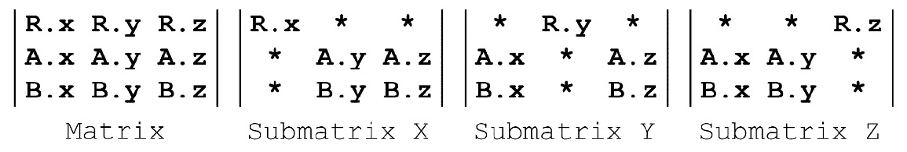

图 2.11：每个分量的子矩阵

要找到 2x2 矩阵的行列式，需要进行叉乘。将左上角和右下角的元素相乘，然后减去右上角和左下角元素的乘积。以下图显示了结果向量的每个元素的情况：

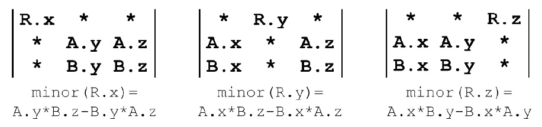

图 2.12：结果向量中每个分量的行列式

在`vec3.cpp`中实现`cross`乘积。不要忘记将函数声明添加到`vec3.h`中：

```cpp
vec3 cross(const vec3 &l, const vec3 &r) {
    return vec3(
        l.y * r.z - l.z * r.y,
        l.z * r.x - l.x * r.z,
        l.x * r.y - l.y * r.x
    );
}
```

点积与两个向量之间的夹角的余弦有关，而叉积与两个向量之间的正弦有关。两个向量之间的叉积的长度是两个向量的长度乘积，乘以它们之间的正弦值：


在下一节中，您将学习如何使用三种不同的技术在向量之间进行插值。

# 插值向量

两个向量可以通过缩放两个向量之间的差异并将结果添加回原始向量来进行线性插值。这种线性插值通常缩写为`lerp`。`lerp`的量是介于*0*和*1*之间的归一化值；这个归一化值通常用字母*t*表示。以下图显示了两个向量之间的`lerp`，以及* t *的几个值：

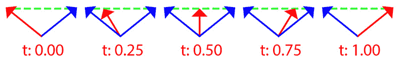

图 2.13：线性插值

当*t = 0*时，插值向量与起始向量相同。当*t = 1*时，插值向量与结束向量相同。

在`vec3.cpp`中实现`lerp`函数。不要忘记将函数声明添加到`vec3.h`中：

```cpp
vec3 lerp(const vec3 &s, const vec3 &e, float t) {
    return vec3(
        s.x + (e.x - s.x) * t,
        s.y + (e.y - s.y) * t,
        s.z + (e.z - s.z) * t
    );
}
```

在两个向量之间进行线性插值将始终采用从一个向量到另一个向量的最短路径。有时，最短路径并不是最佳路径；您可能需要在最短弧线上插值两个向量。在最短弧线上插值被称为球面线性插值（`slerp`）。下图显示了几个*t*值的`slerp`和`lerp`过程之间的差异：

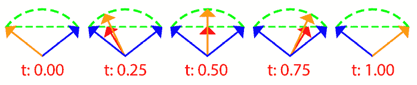

图 2.14：比较 slerp 和 lerp

要实现`slerp`，找到两个输入向量之间的角度。假设角度已知，则`slerp`的公式如下

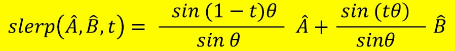

在`vec3.cpp`中实现`slerp`函数。不要忘记将函数声明添加到`vec3.h`中。要注意当*t*的值接近*0*时，`slerp`会产生意外的结果。当*t*的值接近*0*时，可以退回到`lerp`或归一化的 lerp（下一节将介绍）：

```cpp
vec3 slerp(const vec3 &s, const vec3 &e, float t) {
    if (t < 0.01f) {
        return lerp(s, e, t);
    }
    vec3 from = normalized(s);
    vec3 to = normalized(e);
    float theta = angle(from, to);
    float sin_theta = sinf(theta);
    float a = sinf((1.0f - t) * theta) / sin_theta;
    float b = sinf(t * theta) / sin_theta;
    return from * a + to * b;
}
```

最后一个要介绍的插值方法是`nlerp`。`nlerp`是对`slerp`的近似。与`slerp`不同，`nlerp`在速度上不是恒定的。`nlerp`比`slerp`快得多，实现起来更容易；只需对`lerp`的结果进行归一化。下图比较了`lerp`、`slerp`和`nlerp`，其中*t = 0.25*：

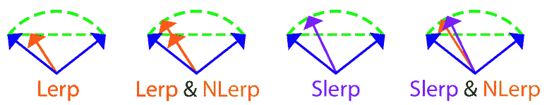

图 2.15：比较 lerp、slerp 和 nlerp

在`vec3.cpp`中实现`nlerp`函数。不要忘记将函数声明添加到`vec3.h`中：

```cpp
vec3 nlerp(const vec3 &s, const vec3 &e, float t) {
    vec3 linear(
        s.x + (e.x - s.x) * t,
        s.y + (e.y - s.y) * t,
        s.z + (e.z - s.z) * t
    );
    return normalized(linear);
}
```

一般来说，`nlerp`比`slerp`更好。它是一个非常接近的近似，计算成本更低。唯一需要使用`slerp`的情况是如果需要恒定的插值速度。在本书中，您将使用`lerp`和`nlerp`来在向量之间进行插值。

在下一节中，您将学习如何使用 epsilon 值来比较向量的相等和不相等。

# 比较向量

需要实现的最后一个操作是向量比较。比较是一个逐分量的操作；每个元素都必须使用一个 epsilon 进行比较。另一种衡量两个向量是否相同的方法是将它们相减。如果它们相等，相减将产生一个长度为零的向量。

在`vec3.cpp`中重载`==`和`!=`运算符。不要忘记将函数声明添加到`vec3.h`中：

```cpp
bool operator==(const vec3 &l, const vec3 &r) {
    vec3 diff(l - r);
    return lenSq(diff) < VEC3_EPSILON;
}
bool operator!=(const vec3 &l, const vec3 &r) {
    return !(l == r);
}
```

重要提示：

找到用于比较操作的正确 epsilon 值是困难的。在本章中，您将`0.000001f`声明为 epsilon。这个值是一些试验的结果。要了解更多关于比较浮点值的信息，请访问[`bitbashing.io/comparing-floats.html`](https://bitbashing.io/comparing-floats.html)。

在下一节中，您将实现具有两个和四个分量的向量。这些向量将仅用作存储数据的便捷方式；它们实际上不需要在其上实现任何数学操作。

# 探索更多向量

在本书的后面某个时候，您还需要使用两个和四个分量的向量。两个和四个分量的向量不需要定义任何数学函数，因为它们将被专门用作传递数据到 GPU 的容器。

与您实现的三分量向量不同，两个和四个分量的向量需要同时存在为整数和浮点向量。为了避免重复代码，将使用模板来实现这两种结构：

1.  创建一个新文件`vec2.h`，并添加`vec2`结构的定义。所有`vec2`构造函数都是内联的；不需要`cpp`文件。`TVec2`结构是模板化的，使用`typedef`声明`vec2`和`ivec2`：

```cpp
template<typename T>
struct TVec2 {
    union {
        struct {
            T x;
            T y;
        };
        T v[2];
    };
    inline TVec2() : x(T(0)), y(T(0)) { }
    inline TVec2(T _x, T _y) :
        x(_x), y(_y) { }
    inline TVec2(T* fv) :
        x(fv[0]), y(fv[1]) { }
};
typedef TVec2<float> vec2;
typedef TVec2<int> ivec2;
```

1.  同样地，创建一个`vec4.h`文件，其中将保存`vec4`结构：

```cpp
template<typename T>
struct TVec4 {
    union {
        struct {
            T x;
            T y;
            T z;
            T w;
        };
        T v[4];
    };
    inline TVec4<T>(): x((T)0),y((T)0),z((T)0),w((T)0){}
    inline TVec4<T>(T _x, T _y, T _z, T _w) :
        x(_x), y(_y), z(_z), w(_w) { }
    inline TVec4<T>(T* fv) :
        x(fv[0]), y(fv[ ]), z(fv[2]), w(fv[3]) { }
};
typedef TVec4<float> vec4;
typedef TVec4<int> ivec4;
typedef TVec4<unsigned int> uivec4;
```

`vec2`，`ivec2`，`vec4`和`ivec4`结构的声明与`vec3`结构的声明非常相似。所有这些结构都可以使用组件下标或作为线性内存数组的指针来访问。它们的构造函数也非常相似。

# 摘要

在本章中，您已经学会了创建强大动画系统所需的向量数学知识。动画是一个数学密集型的主题；本章中学到的技能是完成本书其余部分所必需的。您已经为三维向量实现了所有常见的向量运算。`vec2`和`vec4`结构没有像`vec3`那样的完整实现，但它们只用于将数据发送到 GPU。

在下一章中，您将继续学习关于游戏相关数学的知识，学习关于矩阵的知识。
