# 第四章：实现四元数

在本章中，您将学习有关四元数的知识。四元数用于编码旋转。四元数是以*x*i *+ y*j *+ z*k *+ w*形式的复数。想象一下*i，*j，

和*k*作为每个代表三维轴的占位符。*w*是一个实数。虽然四元数不直接编码角轴对，但很容易将它们想象为

就像那样——围绕任意轴旋转。

在本章结束时，您应该对四元数是什么以及如何使用它们有很强的理解，并且您将在代码中实现了一个强大的四元数类。本章将涵盖以下主题：

+   创建四元数的不同方法

+   检索四元数的角度和轴

+   基本的分量操作

+   两个四元数的长度和点积

+   反转四元数

+   组合四元数

+   通过四元数变换向量

+   在四元数之间插值

+   将四元数和矩阵转换

为什么四元数很重要？大多数人形动画只使用旋转——不需要平移或缩放。例如，想象一下肘关节。肘部的自然运动只是旋转。如果您想要将肘部平移到空间中，您需要旋转肩膀。四元数编码旋转，并且它们插值得很好。

重要信息：

在本章中，您将以直观的代码优先方法实现四元数。如果您对四元数背后更正式的数学感兴趣，请查看[`gabormakesgames.com/quaternions.html`](https://gabormakesgames.com/quaternions.html)。

# 创建四元数

四元数用于编码旋转数据。在代码中，四元数将有四个分量。它们类似于`vec4`，因为它们有`x`、`y`、`z`和`w`分量。

与`vec4`一样，`w`分量最后出现。

`quat`结构应该有两个构造函数。默认构造函数创建一个单位四元数，`(0, 0, 0, 1)`。`(0, 0, 0, 1)`单位四元数就像`1`。任何数乘以`1`仍然保持不变。同样，任何四元数乘以单位四元数仍然保持不变：

创建一个新文件`quat.h`，声明四元数结构。`quat`结构将在本书的其余部分中用于表示旋转：

```cpp
#ifndef _H_QUAT_
#define _H_QUAT_
#include "vec3.h"
#include "mat4.h"
struct quat {
   union {
       struct {
           float x;
           float y;
           float z;
           float w;
       };
       struct {
           vec3 vector;
           float scalar;
       };
       float v[4];
   };
   inline quat() :
       x(0), y(0), z(0), w(1) { }
   inline quat(float _x, float _y, float _z, float _w)
               : x(_x), y(_y), z(_z), w(_w) {}
};
#endif
```

`quat`结构内的匿名联合将允许您通过`X`、`Y`、`Z`和`W`下标符号访问四元数内的数据，作为矢量和标量对，或作为浮点值数组。

接下来，您将学习如何开始创建四元数。

## 角轴

四元数通常使用旋转轴和角度创建。关于轴的旋转*θ*可以在球面上表示为任何有向弧，其长度为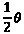，位于垂直于旋转轴的平面上。正角度产生绕轴的逆时针旋转。

创建一个新文件`quat.cpp`。在`quat.cpp`中实现`angleAxis`函数。不要忘记将函数声明添加到`quat.h`中：

```cpp
#include "quat.h"
#include <cmath>
quat angleAxis(float angle, const vec3& axis) {
    vec3 norm = normalized(axis);
    float s = sinf(angle * 0.5f);
    return quat(norm.x * s,
                norm.y * s,
                norm.z * s,
                cosf(angle * 0.5f)
    );
}
```

为什么！[](img/Formula_04_002.png)？四元数可以跟踪两个完整的旋转，即*720*度。这使得四元数的周期为*720*度。sin/cos 的周期是*360*度。将*θ*除以*2*将四元数的范围映射到 sin/cos 的范围。

在本节中，您学习了如何编码旋转的角度和轴

四元数。在下一节中，您将学习如何构建一个角度和一个轴

用于两个向量之间的旋转，并将其编码为四元数。

## 从一个向量到另一个向量创建旋转

任何两个单位向量都可以表示球面上的点。这些点之间的最短弧位于包含这两个点和球心的平面上。这个平面

垂直于这两个向量之间的旋转轴。

要找到旋转轴，需要对输入向量进行归一化。找到输入向量的叉积。这就是旋转轴。找到输入向量之间的角度。从*第二章*，*实现向量*中，两个向量之间角度的公式为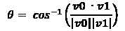。由于两个输入向量都被归一化了，这简化为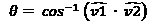，这意味着*θ*的余弦是输入向量的点积：


你会记得从*第二章*，*实现向量*中，点积与两个向量之间夹角的余弦有关，而叉积与两个向量之间夹角的正弦有关。在创建四元数时，点积和叉积具有以下属性：


叉积可以扩展为*x*、*y*和*z*分量，前面的方程开始看起来像是从角度和旋转轴创建四元数的代码。找到两个向量之间的角度会很昂贵，但可以计算出半角而不知道角度是多少。

要找到半角，找到*v1*和*v2*输入向量之间的中间向量。使用*v1*和这个中间向量构造一个四元数。这将创建一个导致所需旋转的四元数。

有一个特殊情况——当*v1*和*v2*平行时会发生什么？或者如果*v1== -v2*？用于找到旋转轴的叉积会产生一个*0*向量。如果发生这种特殊情况，找到两个向量之间最垂直的向量来创建一个纯四元数。

执行以下步骤来实现`fromTo`函数：

1.  开始在`quat.cpp`中实现`fromTo`函数，并在`quat.h`中添加函数声明。首先对`from`和`to`向量进行归一化，确保它们不是相同的向量：

```cpp
quat fromTo(const vec3& from, const vec3& to) {
   vec3 f = normalized(from);
   vec3 t = normalized(to);
   if (f == t) {
      return quat();
   }
```

1.  接下来，检查两个向量是否互为相反。如果是的话，`from`向量的最正交轴可以用来创建一个纯四元数：

```cpp
   else if (f == t * -1.0f) {
      vec3 ortho = vec3(1, 0, 0);
      if (fabsf(f.y) <fabsf(f.x)) {
         ortho = vec3(0, 1, 0);
      }
      if (fabsf(f.z)<fabs(f.y) && fabs(f.z)<fabsf(f.x)){
         ortho = vec3(0, 0, 1);
      }
      vec3 axis = normalized(cross(f, ortho));
      return quat(axis.x, axis.y, axis.z, 0);
   }
```

1.  最后，创建一个`from`和`to`向量之间的半向量。使用半向量和起始向量的叉积来计算旋转轴，使用两者的点积来找到旋转角度：

```cpp
   vec3 half = normalized(f + t); 
   vec3 axis = cross(f, half);
   return quat(axis.x, axis.y, axis.z, dot(f, half));
}
```

`fromTo`函数是创建四元数的最直观方式之一。接下来，你将学习如何检索定义四元数的角度和轴。

# 检索四元数数据

由于可以从角度和轴创建四元数，因此可以合理地期望能够从四元数中检索相同的角度和轴。要检索旋转轴，需要对四元数的向量部分进行归一化。旋转角度是实部的反余弦的两倍。

在`quat.cpp`中实现`getAngle`和`getAxis`函数，并在`quat.h`中为两个函数添加函数声明：

```cpp
vec3 getAxis(const quat& quat) {
    return normalized(vec3(quat.x, quat.y, quat.z));
}
float getAngle(const quat& quat) {
    return 2.0f * acosf(quat.w);
}
```

能够检索定义四元数的角度和轴将在以后一些四元数操作中需要。

接下来，你将学习常用的四元数分量操作。

# 常见的四元数操作

与向量一样，四元数也有分量操作。常见的

分量操作包括加法、减法、乘法或否定

四元数。分量乘法将四元数相乘

通过单个标量值。

由于这些函数是分量操作，它们只是对输入四元数的相似分量执行适当的操作。在`quat.cpp`中实现这些函数，并在`quat.h`中为每个函数添加声明：

```cpp
quat operator+(const quat& a, const quat& b) {
    return quat(a.x+b.x, a.y+b.y, a.z+b.z, a.w+b.w);
}
quat operator-(const quat& a, const quat& b) {
    return quat(a.x-b.x, a.y-b.y, a.z-b.z, a.w-b.w);
}
quat operator*(const quat& a, float b) {
    return quat(a.x * b, a.y * b, a.z * b, a.w * b);
}
quat operator-(const quat& q) {
    return quat(-q.x, -q.y, -q.z, -q.w);
}
```

这些分量级的操作本身并没有太多实际用途。它们是构建四元数功能的基本组件。接下来，您将学习有关比较四元数的不同方法。

# 比较操作

比较两个四元数可以逐分量进行。即使两个四元数在分量级别上不相同，它们仍然可以表示相同的旋转。这是因为一个四元数及其逆旋转到相同的位置，但它们采取不同的路径。

1.  在`quat.cpp`中重载`==`和`!=`运算符。将这些函数的声明添加到`quat.h`中：

```cpp
bool operator==(const quat& left, const quat& right) {
    return (fabsf(left.x - right.x) <= QUAT_EPSILON &&
            fabsf(left.y - right.y) <= QUAT_EPSILON &&
            fabsf(left.z - right.z) <= QUAT_EPSILON &&
            fabsf(left.w - right.w) <= QUAT_EPSILON);
}
bool operator!=(const quat& a, const quat& b) {
    return !(a == b);
}
```

1.  要测试两个四元数是否代表相同的旋转，需要测试两者之间的绝对差异。在`quat.cpp`中实现`sameOrientation`函数。将函数声明添加到`quat.h`中：

```cpp
bool sameOrientation(const quat&l, const quat&r) {
    return (fabsf(l.x - r.x) <= QUAT_EPSILON  &&
            fabsf(l.y - r.y) <= QUAT_EPSILON  &&
            fabsf(l.z - r.z) <= QUAT_EPSILON  &&
            fabsf(l.w - r.w) <= QUAT_EPSILON) ||
           (fabsf(l.x + r.x) <= QUAT_EPSILON  &&
            fabsf(l.y + r.y) <= QUAT_EPSILON  &&
            fabsf(l.z + r.z) <= QUAT_EPSILON  &&
            fabsf(l.w + r.w) <= QUAT_EPSILON);
}
```

大多数情况下，您将希望使用相等运算符来比较四元数。`sameOrientation`函数不太有用，因为四元数的旋转可以在四元数被反转时发生变化。

在下一节中，您将学习如何实现四元数点积。

# 点积

与向量一样，点积测量两个四元数的相似程度。实现与向量实现相同。相乘相同的分量并求和结果。

在`quat.cpp`中实现四元数点积函数，并将其声明添加到`quat.h`中：

```cpp
float dot(const quat& a, const quat& b) {
    return a.x * b.x + a.y * b.y + a.z * b.z + a.w * b.w;
}
```

与向量一样，四元数的长度是四元数与自身的点积。在下一节中，您将学习如何找到四元数的平方长度和长度。

# 长度和平方长度

与向量一样，四元数的平方长度与四元数与自身的点积相同。四元数的长度是平方长度的平方根：

1.  在`quat.cpp`中实现`lenSq`函数，并在`quat.h`中声明该函数：

```cpp
float lenSq(const quat& q) {
  return q.x * q.x + q.y * q.y + q.z * q.z + q.w * q.w;
}
```

1.  在`quat.cpp`中实现`len`函数。不要忘记将函数声明添加到`quat.h`中：

```cpp
float len(const quat& q) {
  float lenSq = q.x*q.x + q.y*q.y + q.z*q.z + q.w*q.w;
  if (lenSq< QUAT_EPSILON) {
     return 0.0f;
  }
  return sqrtf(lenSq);
}
```

代表旋转的四元数应始终具有*1*的长度。在下一节中，您将了解始终具有*1*长度的单位四元数。

# 四元数

四元数可以像向量一样被归一化。归一化的四元数只代表旋转，而非归一化的四元数会引入扭曲。在游戏动画的背景下，应该对四元数进行归一化，以避免给变换添加扭曲。

要归一化一个四元数，将四元数的每个分量除以其长度。结果四元数的长度将为*1*。可以实现如下：

1.  在`quat.cpp`中实现`normalize`函数，并在`quat.h`中声明它：

```cpp
void normalize(quat& q) {
   float lenSq = q.x*q.x + q.y*q.y + q.z*q.z + q.w*q.w;
   if (lenSq < QUAT_EPSILON) { 
      return; 
   }
   float i_len = 1.0f / sqrtf(lenSq);
   q.x *= i_len;
   q.y *= i_len;
   q.z *= i_len;
   q.w *= i_len;
}
```

1.  在`quat.cpp`中实现`normalized`函数，并在`quat.h`中声明它：

```cpp
quat normalized(const quat& q) {
   float lenSq = q.x*q.x + q.y*q.y + q.z*q.z + q.w*q.w;
   if (lenSq < QUAT_EPSILON) {
      return quat();
   }
   float il = 1.0f / sqrtf(lenSq); // il: inverse length
   return quat(q.x * il, q.y * il, q.z * il,q.w * il);
}
```

有一种快速的方法可以求任意单位四元数的倒数。在下一节中，您将学习如何找到四元数的共轭和倒数，以及它们在单位四元数方面的关系。

# 共轭和逆

游戏大多使用归一化的四元数，在反转四元数时非常方便。归一化四元数的逆是它的共轭。共轭

四元数的翻转其旋转轴：

1.  在`quat.cpp`中实现`conjugate`函数，并记得在`quat.h`中声明该函数：

```cpp
quat conjugate(const quat& q) {
    return quat(
        -q.x,
        -q.y,
        -q.z,
         q.w
    );
}
```

1.  四元数的逆是四元数的共轭除以四元数的平方长度。在`quat.cpp`中实现四元数`inverse`函数。将函数声明添加到`quat.h`中：

```cpp
quat inverse(const quat& q) {
   float lenSq = q.x*q.x + q.y*q.y + q.z*q.z + q.w*q.w;
   if (lenSq < QUAT_EPSILON) { 
      return quat(); 
   }
   float recip = 1.0f / lenSq;
   return quat(-q.x * recip,
               -q.y * recip,
               -q.z * recip,
                q.w * recip
   );
}
```

如果您需要找出一个四元数是否已经归一化，可以检查平方长度。归一化四元数的平方长度始终为*1*。如果四元数已经归一化，其共轭和逆将是相同的。这意味着您可以使用更快的`conjugate`函数，而不是`inverse`函数。在下一节中，您将学习如何将两个四元数相乘。

# 乘法四元数

两个四元数可以通过将它们相乘来连接。与矩阵类似，操作是从右到左进行的；首先应用右四元数的旋转，然后是左四元数的。

假设有两个四元数*q*和*p*。它们带有`0`、`1`、`2`和`3`下标，分别对应`X`、`Y`、`Z`和`W`分量。这些四元数可以用*ijk*符号表示，如下所示：


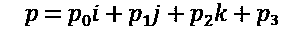

要将这两个四元数相乘，将*p*的各个分量分配给*q*的各个分量。分配实部很简单。将*p*3 分配给*q*会是这样的：

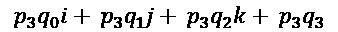

分配虚部看起来非常相似。实部和虚部分别组合；虚部的顺序很重要。例如，将*p*o*i*分配给*q*会是这样的：

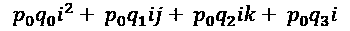

完全分配*p*给*q*看起来是这样的：

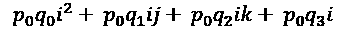

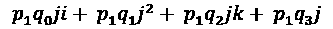

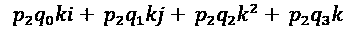

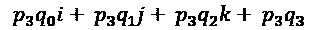

开始简化虚数平方的情况。虚数的平方根是*-1*。如果将*-1*提高到*-1*的幂，结果也是*-1*。这意味着任何* i*2*、*j*2*或*k*2*的实例都可以被替换为*-1*，如下所示：


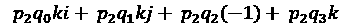

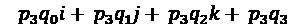

其他虚数呢？在谈论四元数时，

*ijk= -1*，每个分量的平方值也是*-1*，这意味着

*i*2*= j*2*= k*2*=ijk*。四元数的这个性质可以用来简化方程的其余部分。

以*jk*为例。从*ijk= -1*开始，尝试将*jk*隔离到方程的一边。

为此，将两边都乘以*i*，得到*i(ijk)= -i*。分配*i*，得到*i*2 *jk= -i*。你已经知道*i*2 的值是*-1*。将其代入得到

*-jk= -i*。两边都乘以*-1*，就找到了*jk*的值—*jk=i*。

可以以类似的方式找到*ki*和*ij*的值；它们分别是*ki=j*和*k=ij*。现在可以用*j*替换任何*ki*的实例，用*k*替换*ij*的实例，用*i*替换*jk*的实例。代入这些值后得到：


剩下的虚数是*ik*、*ji*和*kj*。就像叉乘一样，顺序很重要：*ik= -ki*。由此可推断*ik= -j*，*ji= -k*，*kj= -1*。代入这些值后得到：


具有不同虚部的数字不能相加。重新排列前面的公式，使相似的虚部相邻。这导致四元数乘法的最终方程式：

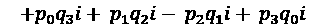

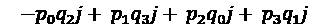

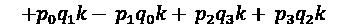

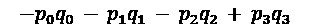

要在代码中实现这个公式，需要从下标化的*ijk*符号改回带有`X`、`Y`、`Z`和`W`下标的向量表示。在`quat.cpp`中实现四元数乘法函数，并不要忘记将函数声明添加到`quat.h`中：

```cpp
quat operator*(const quat& Q1, const quat& Q2) {
   return quat( 
       Q2.x*Q1.w + Q2.y*Q1.z - Q2.z*Q1.y + Q2.w*Q1.x,
      -Q2.x*Q1.z + Q2.y*Q1.w + Q2.z*Q1.x + Q2.w*Q1.y,
       Q2.x*Q1.y - Q2.y*Q1.x + Q2.z*Q1.w + Q2.w*Q1.z,
      -Q2.x*Q1.x - Q2.y*Q1.y - Q2.z*Q1.z + Q2.w*Q1.w
   );
}
```

观察前面的代码时，请注意四元数的实部有一个正分量，但向量部分有一个负分量。重新排列四元数，使负数始终在最后。使用向量表示写下来：

*qp*x*= p*x *q*w*+ p*w *q*x*+ p*y *q*z*- p*z *q*y

*qp*y= *p*y *q*w+ *p*w *q*y+ *p*z *q*x- *p*x *q*z

*qp*z= *p*z *q*w+ *p*w *q*z+ *p*x *q*y- *p*y *q*x

*qp*w= *p*w *q*w- *p*x *q*x- *p*y *q*y- *p*z *q*z

在前述等式中有两个有趣的部分。如果你仔细观察前三行的最后两列，减法的列是叉乘。前两列只是通过其他四元数的标量部分来缩放每个四元数的向量部分。

如果你看最后一行，点积和点积的负数都在其中。最后一行基本上是将两个四元数的实部相乘，然后减去它们的向量部分的点积。这意味着另一种乘法实现可能是这样的：

```cpp
quat operator*(const quat& Q1, const quat& Q2) {
  quat result;
  result.scalar = Q2.scalar * Q1.scalar -
  dot(Q2.vector, Q1.vector);
  result.vector = (Q1.vector * Q2.scalar) +
  (Q2.vector * Q1.scalar)+cross(Q2.vector, Q1.vector);
  return result;
}
```

原始实现稍微更高效，因为它不需要调用其他函数。本书的示例代码将使用第一种实现。

接下来，你将学习如何通过四元数来转换向量。

# 转换向量

要将向量和四元数相乘，首先必须将向量转换为纯四元数。什么是纯四元数？它是一个其`W`分量为`0`且向量部分被归一化的四元数。假设你有一个四元数*q*和一个向量*v*。首先，将*v*转换为纯四元数，表示为*v*'：

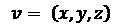

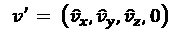

接下来，将*q*乘以*v*'，然后将结果乘以*q*的逆。这个乘法的结果是一个纯四元数，其向量部分包含了旋转后的向量。四元数变成了以下形式：

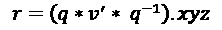

为什么*v*'要先乘以*q*，然后再乘以*q*^-1？乘以*q*会使向量旋转的角度是*q*的两倍。乘以*q*^-1 会将向量带回到预期的范围内。这个公式可以进一步简化。

推导这个公式超出了本书的范围。给定一个四元数*q*和

对于向量*v*，简化的向量四元数乘法公式如下所示。

*q*v 指的是四元数的向量部分，*q*s 指的是实数（或标量）部分：

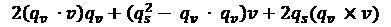

在`quat.cpp`中实现前述四元数向量乘法公式。不要忘记将函数声明添加到`quat.h`中：

```cpp
vec3 operator*(const quat& q, const vec3& v) {
    return q.vector * 2.0f * dot(q.vector, v) +
        v * (q.scalar * q.scalar - dot(q.vector, q.vector)) +
        cross(q.vector, v) * 2.0f * q.scalar;
}
```

将向量乘以四元数总是会得到一个被四元数旋转的向量。在下一节中，你将学习如何在四元数之间进行插值。

# 插值四元数

四元数可以以类似的方式进行插值，用于在两个关键帧之间旋转。由于大多数骨骼动画是通过随时间旋转关节来实现的，因此在四元数之间进行插值将是一个非常常见的操作。

一个非常常见的操作。

## 邻域

四元数代表的是旋转，而不是方向。从球的一部分旋转到另一部分可以通过两种旋转中的一种来实现。旋转可以采取最短或最长的弧。通常，使四元数沿着最短的弧旋转是可取的。在两个四元数之间进行插值时，将采取哪种路径——最短的弧还是最长的弧？

这个问题被称为邻域问题。要解决它，检查被插值的四元数的点积。如果点积是正的，将采取较短的弧。如果点积是负的，将采取较长的弧。

如果点积是负的，如何纠正插值以采取最短的弧？答案是对其中一个四元数取反。以下是四元数邻域化的一个示例代码：

```cpp
quat SampleFunction(const quat& a, const quat& b) {
    if (dot(a, b) < 0.0f) {
        b = -b;
    }
    return slerp(a, b, 0.5f);
}
```

只有在插值两个四元数时才需要邻域。接下来，你将学习如何混合线性插值（lerp）、归一化线性插值（nlerp）和球形线性插值（slerp）四元数。请记住，这些函数期望四元数已经处于所需的邻域内。

## 理解 mix 函数

当混合两个或多个四元数时，每个四元数都会被某个权重值缩放，然后将结果缩放的四元数相加。所有输入四元数的权重值必须加起来等于*1*。

如果所有输入四元数的长度都为单位长度，那么结果四元数也将是单位长度。这个函数实现了与`lerp`相同的结果，但它并不是真正的`lerp`函数，因为四元数仍然沿着弧线移动。为避免混淆，这个函数将被称为`mix`，而不是`lerp`。

`mix`函数假设输入四元数在所需的邻域内。在`quat.cpp`中实现`mix`函数，并不要忘记将函数声明添加到`quat.h`中：

```cpp
quat mix(const quat& from, const quat& to, float t) {
    return from * (1.0f - t) + to * t;
}
```

## 理解 nlerp 函数

四元数之间的`nlerp`是球面插值的一种快速且良好的近似。它的实现几乎与`vec3`类的`nlerp`实现相同。

像`mix`一样，`nlerp`也假设输入向量在所需的邻域内。在`quat.cpp`中实现`nlerp`函数，并不要忘记将函数声明添加到`quat.h`中：

```cpp
quat nlerp(const quat& from, const quat& to, float t) {
    return normalized(from + (to - from) * t);
}
```

## slerp 简介

只有在需要一致速度时才应该使用`slerp`。在大多数情况下，`nlerp`将是更好的插值方法。根据插值步长的不同，`slerp`最终可能会回退到`nlerp`。

为了在两个四元数之间进行球面插值，创建两者之间的增量四元数。调整增量四元数的角度，然后使用四元数乘法将其与起始四元数连接起来。

如何调整四元数的角度？要调整四元数的角度，将其提升到所需的幂。例如，要将四元数调整为只旋转一半，可以将其提升到*0.5*的幂。

## 幂

要将四元数提升到某个幂，需要将其分解为一个角度和一个轴。然后，可以通过幂和调整的角度构建一个新的四元数。如果一个四元数围绕*v*轴旋转*θ*角度，将其提升到某个幂*t*，可以按照以下方式进行：

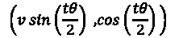

在`quat.cpp`中实现`power operator`。不要忘记将函数声明添加到`quat.h`中：

```cpp
quat operator^(const quat& q, float f) {
    float angle = 2.0f * acosf(q.scalar);
    vec3 axis = normalized(q.vector);
    float halfCos = cosf(f * angle * 0.5f);
    float halfSin = sinf(f * angle * 0.5f);
    return quat(axis.x * halfSin,
                axis.y * halfSin,
                axis.z * halfSin,
                halfCos
    );
}
```

## 实现 slerp

现在您知道如何将四元数提升到幂，实现`slerp`就变得简单了。如果起始和结束四元数非常接近，`slerp`往往会产生意外的结果。如果起始和结束四元数接近，就回退到`nlerp`。

要在两个四元数之间进行插值，找到从起始旋转到结束旋转的增量四元数。这个增量四元数就是插值路径。将角度提升到两个四元数之间插值的幂（通常表示为*t*），然后将起始四元数相乘。

在`quat.cpp`中实现`slerp`函数。不要忘记将函数声明添加到`quat.h`中。与其他插值函数一样，`slerp`假设被插值的四元数在所需的邻域内：

```cpp
quat slerp(const quat& start, const quat& end, float t) {
    if (fabsf(dot(start, end)) > 1.0f - QUAT_EPSILON) {
        return nlerp(start, end, t);
    }
    quat delta = inverse(start) * end;
    return normalized((delta ^ t) * start);
}
```

`slerp`的输入向量应该是归一化的，这意味着在`slerp`函数中可以使用`conjugate`而不是`inverse`。大多数情况下，`nlerp`将会被用于`slerp`。在下一节中，您将学习如何创建一个指向特定方向的四元数。

# 观察旋转

给定一个方向和一个指示向上方向的参考，可以创建一个朝向该方向并具有正确方向的四元数。这个函数将被称为`lookRotation`，而不是`lookAt`，以避免与矩阵`lookAt`函数混淆。

要实现`lookRotation`函数，找到一个将旋转到所需方向的四元数。为此，创建一个世界`forward`向量*(0, 0, 1)*和`desired direction`之间的四元数。这个四元数将旋转到`right`目标，但不考虑`up`可能的方向。

要纠正这个四元数的`up`方向，首先必须找到一个垂直于当前前向方向和期望的`up`方向的向量。这可以通过这两个向量的叉积来实现。

这个叉积的结果将用于构造三个正交向量——前向向量、这个新向量和一个指向上的向量。你刚刚找到的将指向右边。

接下来，您需要找到一个既垂直于`forward`又垂直于`right`方向的向量；这将是正交的`up`向量。要找到这个向量，可以取方向和这个`right`向量的叉积，结果就是物体空间的`up`向量。

找到一个从期望的`up`向量旋转到物体`up`向量的四元数。将旋转到目标方向的四元数和从`desired up`到`object up`的四元数相乘。

在`quat.cpp`中实现`lookRotation`函数。不要忘记将函数声明添加到`quat.h`中：

```cpp
quat lookRotation(const vec3& direction, const vec3& up) {
    // Find orthonormal basis vectors
    vec3 f = normalized(direction); // Object Forward
    vec3 u = normalized(up); // Desired Up
    vec3 r = cross(u, f); // Object Right
    u = cross(f, r); // Object Up
    // From world forward to object forward
    quat worldToObject = fromTo(vec3(0, 0, 1), f); 
    // what direction is the new object up?
    vec3 objectUp = worldToObject * vec3(0, 1, 0);
    // From object up to desired up
    quat u2u = fromTo(objectUp, u);
    // Rotate to forward direction first
    // then twist to correct up
    quat result = worldToObject * u2u; 
    // Don't forget to normalize the result
    return normalized(result);
}
```

矩阵`lookAt`函数创建一个视图矩阵，这是相机变换的逆。这意味着`lookAt`的旋转和`lookRotation`的结果将互为逆运算。在下一节中，您将学习如何将矩阵转换为四元数，以及四元数转换为矩阵。

# 在矩阵和四元数之间进行转换

由于矩阵和四元数都可以用于编码旋转数据，因此能够在它们之间进行转换将非常有用。为了使在两者之间进行转换更容易，您必须开始考虑基向量的旋转，这些向量代表了*x*、*y*和*z*轴。

4x4 矩阵的上 3x3 子矩阵包含三个基向量。第一列是`right`向量，第二列是`up`向量，第三列是`forward`向量。只使用`forward`和`up`向量，`lookRotation`函数可以将矩阵转换为四元数。

要将四元数转换为矩阵，只需将世界基向量（世界的*x*、*y*和*z*轴）乘以四元数。将结果向量存储在矩阵的相应分量中：

1.  在`quat.cpp`中实现`quatToMat4`函数。不要忘记将函数声明添加到`quat.h`中：

```cpp
mat4 quatToMat4(const quat& q) {
    vec3 r = q * vec3(1, 0, 0);
    vec3 u = q * vec3(0, 1, 0);
    vec3 f = q * vec3(0, 0, 1);
    return mat4(r.x, r.y, r.z, 0,
                u.x, u.y, u.z, 0,
                f.x, f.y, f.z, 0,
                0  , 0  , 0  , 1
    );
}
```

1.  矩阵使用相同的组件存储旋转和缩放数据。为了解决这个问题，基向量需要被归一化，并且需要使用叉积来确保结果向量是正交的。在`quat.cpp`中实现`mat4ToQuat`函数，不要忘记将函数声明添加到`quat.h`中：

```cpp
quat mat4ToQuat(const mat4& m) {
    vec3 up = normalized(vec3(m.up.x, m.up.y, m.up.z));
    vec3 forward = normalized(
         vec3(m.forward.x, m.forward.y, m.forward.z));
    vec3 right = cross(up, forward);
    up = cross(forward, right);
    return lookRotation(forward, up);
}
```

能够将四元数转换为矩阵将在以后需要将旋转数据传递给着色器时非常有用。着色器不知道四元数是什么，但它们内置了处理矩阵的功能。将矩阵转换为四元数对于调试和在外部数据源只提供矩阵旋转的情况下也将非常有用。

# 总结

在本章中，您实现了一个强大的四元数库。四元数对本书的其余部分非常重要，因为所有动画旋转数据都记录为四元数。您学会了如何创建四元数和常见的四元数操作，通过乘法组合四元数，通过四元数转换向量，插值四元数和实用函数来创建四元数，给定前向和上方向，并在矩阵和四元数之间进行转换。

在下一章中，您将使用向量、矩阵和四元数的综合知识来定义一个变换对象。
