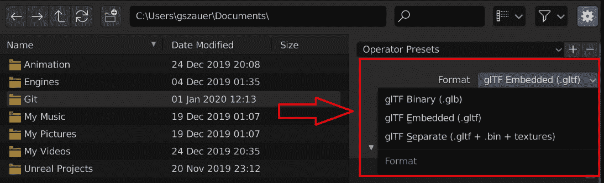
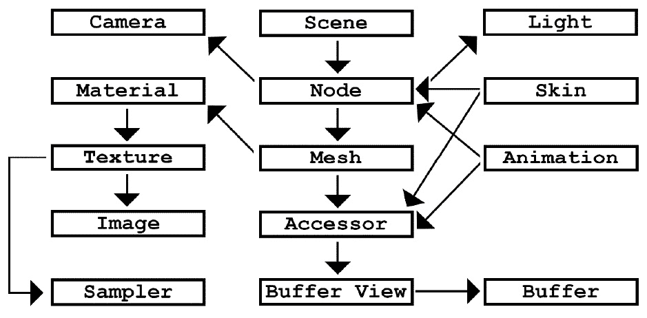
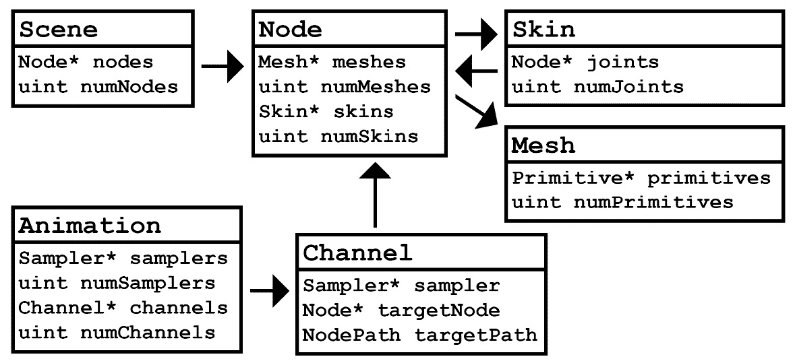
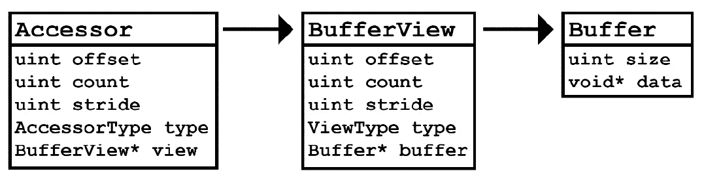
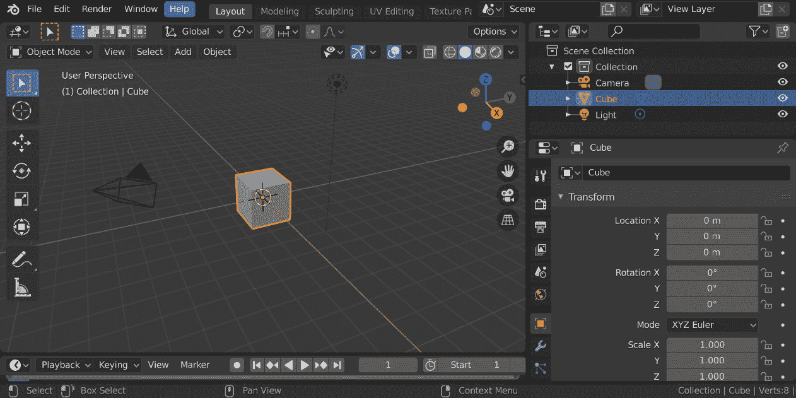

# *第七章*：探索 glTF 文件格式

在本章中，我们将探索 glTF，这是一个包含显示动画模型所需的一切的文件格式。这是大多数三维内容创建应用程序可以导出的标准格式，并允许您加载任意模型。

本章重点介绍文件格式本身。后续章节将重点介绍实现加载 glTF 文件部分，以使其变得相关。通过本章结束时，您应该对 glTF 文件格式有扎实的理解。

本章将专注于构建以下技能：

+   了解 glTF 文件中的数据

+   使用 cgltf 实现 glTF 加载

+   学习如何从 Blender 导出 glTF 文件

# 技术要求

本章将涵盖您需要加载和显示动画模型的 glTF 文件的每个概念。然而，本章不是文件格式的完整指南。在阅读本章之前，请花几分钟时间通过阅读[`www.khronos.org/files/gltf20-reference-guide.pdf`](https://www.khronos.org/files/gltf20-reference-guide.pdf)上的参考指南来熟悉 glTF 格式。

您将使用 cgltf ([`github.com/jkuhlmann/cgltf`](https://github.com/jkuhlmann/cgltf))来解析 glTF 文件。如果 glTF 文件显示不正常，可能是一个坏文件。如果您怀疑文件可能有问题，请在[`gltf-viewer.donmccurdy.com/`](https://gltf-viewer.donmccurdy.com/)上检查 glTF 参考查看器。

# 探索 glTF 文件的存储方式

glTF 文件存储为纯文本 JSON 文件或更紧凑的二进制表示。纯文本变体通常具有`.gltf`扩展名，而二进制变体通常具有`.glb`扩展名。

可能会有多个文件。glTF 文件可以选择嵌入大块的二进制数据，甚至纹理，或者可以选择将它们存储在外部文件中。这在下面的 Blender3D 的 glTF 导出选项的截图中反映出来：



图 7.1：Blender3D 的 glTF 导出选项

本书提供的可下载内容的示例文件存储为 glTF 嵌入文件（`.gltf`）。这是可以用任何文本编辑器检查的纯文本变体。更重要的是，它是一个要跟踪的单个文件。尽管本书提供的文件是以 glTF 嵌入格式提供的，但最终的代码将支持加载二进制格式和单独的文件（`.bin`）。

现在您已经探索了 glTF 文件存储的不同方式，让我们准备好学习 glTF 文件内部存储的内容。glTF 文件旨在存储整个场景，而不仅仅是单个模型。在下一节中，您将探索 glTF 文件的预期用途。

## glTF 文件存储场景，而不是模型

重要的是要知道，glTF 文件旨在表示整个三维场景，而不仅仅是单个动画模型。因此，glTF 支持您不需要用于动画的功能，例如相机和 PBR 材质。对于动画，我们只关心使用受支持功能的一个小子集。让我们概述一下它们是什么。

glTF 文件可以包含不同类型的网格。它包含静态网格，例如道具。这些网格只能通过它们附加到的节点的动画来移动；它可以包含变形目标。变形动画可以用于诸如面部表情之类的事物。

glTF 文件也可以包含蒙皮网格。这些是您将用来为角色设置动画的网格。蒙皮网格描述了模型的顶点如何受到模型的变换层次结构（或骨骼）的影响。使用蒙皮网格，网格的每个顶点可以绑定到层次结构中的一个关节。随着层次结构的动画，网格会被变形。

glTF 旨在描述一个场景，而不是单个模型，这将使一些加载代码变得有些棘手。在下一节中，您将开始从高层次的角度探索 glTF 文件的实际内容。

# 探索 glTF 格式

glTF 文件的根是场景。一个 glTF 文件可以包含一个或多个场景。一个场景包含一个或多个节点。一个节点可以附加皮肤、网格、动画、相机、光线或混合权重。网格、皮肤和动画在缓冲区中存储大量信息。要访问缓冲区，它们包含一个包含缓冲区的缓冲区视图，缓冲区视图又包含缓冲区。

通过文本提供的描述可能很难理解。以下图表说明了所描述的文件布局。由于 glTF 是一种场景描述格式，有许多数据类型我们不必关心。下一节将探讨这些内容：



图 7.2：glTF 文件的内容

现在您已经了解了 glTF 文件中存储的内容，接下来的部分将探讨蒙皮动画所需的文件格式部分。

## 需要用于动画的部分

使用 glTF 文件加载动画模型时，文件的必需组件是场景、节点、网格和皮肤。这是一个要处理的小子集；以下图表突出显示了这些部分及其关系。这些数据类型之间的关系可以描述如下：



图 7.3：用于蒙皮动画的 glTF 文件的部分

前面的图省略了每个数据结构中的大部分数据，而是只关注您需要实现蒙皮动画的内容。在下一节中，我们将探讨 glTF 文件中不需要用于蒙皮动画的部分。

## 不需要用于动画的部分

要实现蒙皮动画，您不需要灯光、相机、材质、纹理、图像和采样器。在下一节中，您将探索如何从 glTF 文件中实际读取数据。

## 访问数据

访问数据有点棘手，但并不太困难。网格、皮肤和动画对象都包含一个 glTF 访问器。这个**访问器**引用一个**缓冲区视图**，而缓冲区视图引用一个**缓冲区**。以下图表展示了这种关系：



图 7.4：访问 glTF 文件中的数据

在这三个单独的步骤中，如何访问缓冲区数据？在下一节中，您将学习如何使用缓冲区视图和最终访问器从缓冲区中解释数据。

### 缓冲区

将缓冲区视为 OpenGL 缓冲区。它只是一个大的、线性的值数组。这类似于您在第六章《构建抽象渲染器》中构建的`Attributes`类。`Attributes`类的`Set`函数调用`glBufferData`，其签名如下：

```cpp
void glBufferData(GLenum target, GLsizeiptr size, 
                  void * data, GLenum usage);
```

glTF 中的缓冲区包含调用`glBufferData`函数所需的所有信息。它包含大小、void 指针和可选的偏移量，这些偏移量只修改源指针和大小。将 glTF 缓冲区视为填充 OpenGL 缓冲区所需的所有内容。

在下一节中，您将学习如何将缓冲区视图与缓冲区一起使用。

### 缓冲区视图

缓冲区只是一些大块的数据。没有上下文来描述缓冲区内存储的内容。这就是缓冲区视图的作用。缓冲区视图描述了缓冲区中的内容。如果缓冲区包含`glBufferData`的信息，那么缓冲区视图包含调用`glVertexAttribPointer`的一些参数。`glVertexAttribPointer`函数的签名如下：

```cpp
void glVertexAttribPointer(GLuint index, GLint size, 
                           GLenum type, GLboolean normalized,
                           GLsizei stride, void * pointer);
```

缓冲区视图包含`type`，它确定视图是顶点缓冲区还是索引缓冲区。这很重要，因为顶点缓冲区绑定到`GL_ARRAY_BUFFER`，而索引缓冲区绑定到`GL_ELEMENT_ARRAY_BUFFER`。在*第六章*，*构建抽象渲染器*中，我们为这些不同的缓冲区类型构建了两个不同的类。

与缓冲区一样，缓冲区视图还包含一些可选的偏移量，进一步修改源指针的位置和大小。在接下来的部分中，您将探讨如何使用描述缓冲区视图内容的 accessor。

### accessor

accessor 存储更高级别的信息。最重要的是，accessor 描述了您正在处理的数据类型，比如`scalar`、`vec2`、`vec3`或`vec4`。使用这些数据来确定`glVertexAttribPointer`的`size`参数。

accessor 回答了诸如数据是否规范化以及数据的存储模式是什么等问题。accessor 还包含了关于缓冲区和缓冲区视图已经包含的附加偏移量、大小和步幅信息。

下一节将演示如何从 glTF 文件中将数据加载到线性标量数组中。

### 例子

即使 accessor、buffer view 和 buffer 的关系已经确定，解析数据可能仍然有点混乱。为了尝试澄清一下，让我们探讨一下如何将 accessor 转换为浮点值的平面列表。以下代码旨在作为示例；它将不会在本书的其余部分中使用：

```cpp
vector<float> GetPositions(const GLTFAccessor& accessor) {
    // Accessors and sanity checks
    assert(!accessor.isSparse);
    const GLTFBufferView& bufferView = accessor.bufferView;
    const GLTFBuffer& buffer = bufferView.buffer;
    // Resize result
    // GetNumComponents Would return 3 for a vec3, etc.
    uint numComponents = GetNumComponents(accessor); 
    vector<float> result;
    result.resize(accessor.count * numComponents);
    // Loop trough every element in the accessor
    for (uint i = 0; i < accessor.count; ++i) {
        // Find where in the buffer the data actually starts
        uint offset = accessor.offset + bufferView.offset;
        uint8* data = buffer.data;
        data += offset + accessor.stride * i;
        // Loop trough every component of current element
        float* target = result[i] * componentCount;
        for (uint j = 0; j < numComponents; ++j) {
            // Omitting normalization 
            // Omitting different storage types
            target[j] = data + componentCount * j;
        } // End loop of every component of current element
    } // End loop of every accessor element
    return result;
}
```

解析 glTF 文件的代码可能会变得冗长；在前面的代码示例中，glTF 文件已经被解析。加载 glTF 文件的大部分工作实际上是解析二进制或 JSON 数据。在下一节中，我们将探讨如何使用 cgltf 库来解析 glTF 文件。

# 探索 cgltf

在上一节中，我们探讨了将 glTF accessor 转换为浮点数的线性数组需要做些什么。代码省略了一些更复杂的任务，比如规范化数据或处理不同的存储类型。

提供的示例代码还假定数据已经从 JSON（或二进制）格式中解析出来。编写 JSON 解析器不在本书的范围内，但处理 glTF 文件是在范围内的。

为了帮助管理加载 glTF 文件的一些复杂性，以及避免从头开始编写 JSON 解析器，下一节将教您如何使用 cgltf 加载 JSON 文件。Cgltf 是一个单头文件的 glTF 加载库；您可以在 GitHub 上找到它[`github.com/jkuhlmann/cgltf`](https://github.com/jkuhlmann/cgltf)。在下一节中，我们将开始将 cgltf 集成到我们的项目中。

## 集成 cgltf

要将 cgltf 集成到项目中，从 GitHub 上下载头文件[`github.com/jkuhlmann/cgltf/blob/master/cgltf.h`](https://github.com/jkuhlmann/cgltf/blob/master/cgltf.h)。然后，将此头文件添加到项目中。接下来，向项目添加一个新的`.c`文件，并将其命名为`cgltf.c`。该文件应包含以下代码：

```cpp
#pragma warning(disable : 26451)
#define _CRT_SECURE_NO_WARNINGS
#define CGLTF_IMPLEMENTATION
#include "cgltf.h"
```

CGLTF 现在已经集成到项目中。在本章中，您将实现解析 glTF 文件的代码。如何将 glTF 文件的内容加载到运行时数据将在以后的章节中进行覆盖，因为那时的运行时数据的代码已经编写好了。在接下来的部分，我们将学习如何实现 glTF 解析代码。

### 创建一个 glTF 加载器

在本节中，我们将探讨如何使用 cgltf 加载 glTF 文件。将文件加载到运行时数据结构`cgltf_data`中的代码很简单。在以后的章节中，您将学习如何解析这个`cgltf_data`结构的内容。

要加载一个文件，你需要创建一个`cgltf_options`的实例。你不需要设置任何选项标志；只需用`0`实例化`cgltf_options`结构的所有成员值。接下来，声明一个`cgltf_data`指针。这个指针的地址将被传递给`cgltf_parse_file`。在`cgltf_parse_file`填充了`cgltf_data`结构之后，你就可以解析文件的内容了。要稍后释放`cgltf_data`结构，调用`cgltf_free`：

1.  创建一个新文件`GLTFLoader.h`，其中包括`cgltf.h`。为`LoadGLTFFile`和`FreeGLTFFile`函数添加函数声明：

```cpp
    #ifndef _H_GLTFLOADER_
    #define _H_GLTFLOADER_
    #include "cgltf.h"
    cgltf_data* LoadGLTFFile(const char* path);
    void FreeGLTFFile(cgltf_data* handle);
    #endif
    ```

1.  创建一个新文件`GLTFLoader.cpp`。这个函数接受一个路径并返回一个`cgltf_data`指针。在内部，该函数调用`cgltf_parse_file`从文件中加载 glTF 数据。`cgltf_load_buffers`用于加载任何外部缓冲区数据。最后，`cgltf_validate`确保刚刚加载的 glTF 文件是有效的：

```cpp
    cgltf_data* LoadGLTFFile(const char* path) {
        cgltf_options options;
        memset(&options, 0, sizeof(cgltf_options));
        cgltf_data* data = NULL;
        cgltf_result result = cgltf_parse_file(&options, 
                                            path, &data);
        if (result != cgltf_result_success) {
            cout << "Could not load: " << path << "\n";
            return 0;
        }
        result = cgltf_load_buffers(&options, data, path);
        if (result != cgltf_result_success) {
            cgltf_free(data);
            cout << "Could not load: " << path << "\n";
            return 0;
        }
        result = cgltf_validate(data);
        if (result != cgltf_result_success) {
            cgltf_free(data);
            cout << "Invalid file: " << path << "\n";
            return 0;
        }
        return data;
    }
    ```

1.  在`GLTFLoader.cpp`中实现`FreeGLTFFile`函数。这个函数很简单；如果输入指针不是`null`，它需要调用`cgltf_free`：

```cpp
    void FreeGLTFFile(cgltf_data* data) {
        if (data == 0) {
            cout << "WARNING: Can't free null data\n";
        }
        else {
            cgltf_free(data);
        }
    }
    ```

在后面的章节中，你将通过引入加载网格、姿势和动画的函数来扩展 glTF `Loader`函数。在下一节中，你将探索如何从 Blender3D 导出 glTF 文件。

# 探索示例资产

你将在本书中使用的示例文件是来自 Quaternius 的 CC0、公共领域许可的资产。你可以在[`quaternius.com/assets.html`](http://quaternius.com/assets.html)找到类似风格的其他资产。

此外，后面的章节还包括了 GDQuest 的开放式三维 Mannequin 的屏幕截图，这些屏幕截图在[`github.com/GDQuest/godot-3d-mannequin`](https://github.com/GDQuest/godot-3d-mannequin)以 MIT 许可证的形式提供。

一些资产已经以 glTF 格式提供，但有些可能是`.blend`、`.fbx`或其他格式。当发生这种情况时，很容易将模型导入 Blender 并导出 glTF 文件。下一节将指导你如何从 Blender 导出 glTF 文件。

## 从 Blender 导出

Blender 是一个免费的三维内容创作工具。你可以从[`www.blender.org/`](https://www.blender.org/)下载 Blender。以下说明是针对 Blender 2.8 编写的，但在更新的版本中也应该可以使用。

如果你要导入的模型已经是`.blend`文件，只需双击它，它就会在 Blender 中加载。

如果模型是以不同的格式，比如`.DAE`或`.FBX`，你需要导入它。要这样做，打开 Blender，你应该看到默认场景加载。这个默认场景有一个立方体、一个灯光和一个摄像头：



图 7.5：默认的 Blender3D 场景

通过左键单击选择立方体，然后悬停在三维视口上，按下*删除*键删除立方体。左键单击选择摄像头，然后按下*删除*键删除摄像头。对于灯光也是一样。

现在你应该有一个空场景。从**文件**菜单中，选择**文件**|**导入**，然后选择适当的模型格式进行导入。找到你的文件，双击导入它。一旦模型被导入，选择**文件**|**导出 glTF 2.0**。将导出格式设置为 glTF（文本文件）或 glb（二进制文件）。

# 总结

在本章中，你了解了什么是 glTF 文件，glTF 格式的哪些部分对于蒙皮动画是有用的，以及如何使用 cglTF 来加载 glTF 文件。如果这个格式还有点令人困惑，不要担心；当你开始解析 cgltf 文件中的各种数据时，它会变得更加清晰。使用 cgltf 将让你专注于将 glTF 数据转换为有用的运行时结构，而不必担心手动解析 JSON 文件。在下一章中，你将开始实现动画的构建块，包括曲线、帧和轨道。
