# *第八章*：创建曲线、帧和轨道

在 21 世纪初，游戏通常会采用在 3D 内容创建工具（如 Blender 或 Maya）中制作的动画，播放动画，并在设置的间隔内对动画中每个关节的变换进行采样。一旦对动画进行了采样，游戏的运行时会在采样帧之间进行线性插值。

虽然这种方法可行（并且可以在 glTF 文件中实现），但这并不是播放动画的最准确方式。它通过包含实际上不需要存在的帧来浪费内存。在 3D 内容创建工具中，动画是使用曲线创建的，例如以下截图中显示的曲线：

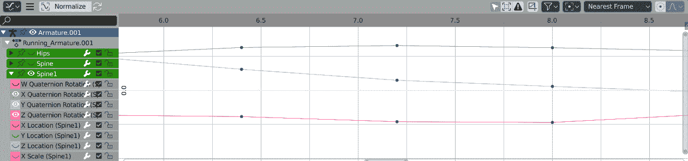

图 8.1：Blender 3D 曲线编辑器

现代游戏和动画系统直接评估这些曲线。直接评估动画曲线可以节省内存，但在处理能力方面曲线会更昂贵一些。在本章结束时，您应该能够做到以下几点：

+   了解立方 Bézier 样条以及如何评估它们

+   了解立方 Hermite 样条以及如何评估它们

+   了解常见的插值方法

+   能够创建立方、线性和恒定关键帧

+   了解关键帧如何组成立方、线性或恒定轨道

+   能够评估立方、线性和恒定轨道

+   能够将三个独立轨道合并为一个变换轨道

# 了解立方 Bézier 样条

要实现游戏动画，您需要对曲线有一定的了解。让我们从基础知识开始——立方 Bézier 样条。Bézier 样条有两个要插值的点和两个控制点，帮助生成曲线。这就是立方 Bézier 样条的样子：

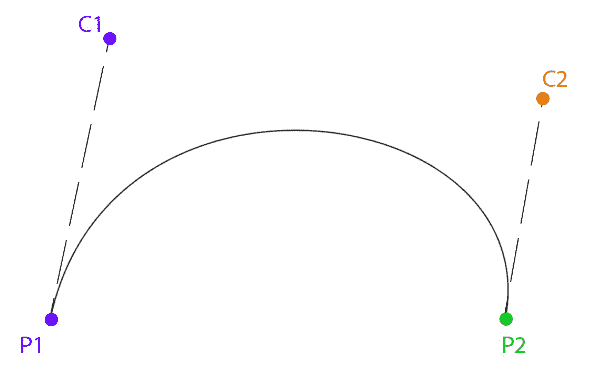

图 8.2：立方 Bézier 样条

给定两个点和两个控制点，如何生成曲线？让我们探索为给定时间**t**插值曲线。首先从**P1**到**C1**画一条线，从**C1**到**C2**，从**C2**到**P2**。然后，沿着这些线线性插值值**t**：

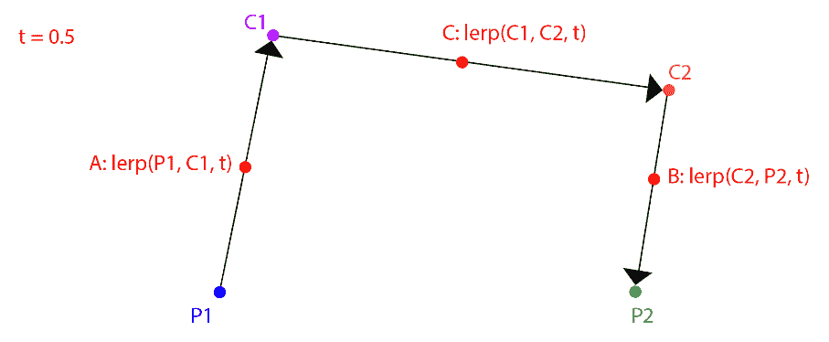

图 8.3：在点和控制点之间进行线性插值

从**P1**到**C1**的插值点是**A**，从**C2**到**P2**是**B**，从**C1**到**C2**是**C**。接下来，您需要重复这个过程，画线并从**A**到**C**和从**C**到**B**进行插值。让我们称这些新插值点为 E 和 F：

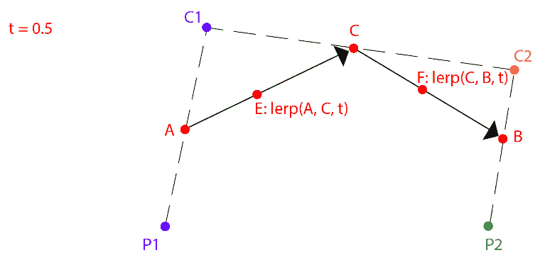

图 8.4：线性插值图 8.3 的结果

重复一次，从**E**到**F**画一条线，并且也按照**t**在该线上进行插值。让我们称得到的点为**R**。这个点**R**在 Bézier 样条上的某个位置。如果您计算从*t=0*到*t=1*的所有点，您可以绘制出曲线：

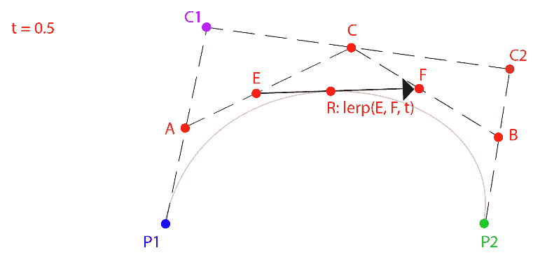

图 8.5：线性插值图 8.4 的结果

让我们探索绘制 Bézier 样条所需的代码。本书中不会在其他地方使用 Bézier 样条，因此不需要实现以下代码来跟随本书的其余部分：

1.  首先，您需要定义什么是 Bézier 样条。创建一个包含两个点和两个控制点的新模板类：

```cpp
template<typename T>
class Bezier {
public:
    T P1; // Point 1
    T C1; // Control 1
    T P2; // Point 2
    T C2; // Control 2
};
```

1.  接下来，实现`Interpolate`函数。该函数接受一个 Bézier 样条引用和一个值`t`，用于插值样条。假设`t`大于或等于`0`且小于或等于`1`：

```cpp
template<typename T>
inline T Interpolate(Bezier<T>& curve, float t) {
    T A = lerp(curve.P1, curve.C1, t);
    T B = lerp(curve.C2, curve.P2, t);
    T C = lerp(curve.C1, curve.C2, t);
    T D = lerp(A, C, t);
    T E = lerp(C, B, t);
    T R = lerp(D, E, t);
    return R;
}
```

以下代码示例演示了如何使用 Bezier 类和`Interpolate`函数来绘制 Bézier 样条：

1.  首先，您需要创建将要绘制的数据：

```cpp
Bezier<vec3> curve;
curve.P1 = vec3(-5, 0, 0);
curve.P2 = vec3(5, 0, 0);
curve.C1 = vec3(-2, 1, 0);
curve.C2 = vec3(2, 1, 0);

vec3 red = vec3(1, 0, 0);
vec3 green = vec3(0, 1, 0);
vec3 blue = vec3(0, 0, 1);
vec3 magenta = vec3(1, 0, 1);
```

1.  接下来，绘制点和控制点：

```cpp
// Draw all relevant points
DrawPoint(curve.P1, red);
DrawPoint(curve.C1, green);
DrawPoint(curve.P2, red);
DrawPoint(curve.C2, green);
// Draw handles
DrawLine(curve.P1, curve.C1, blue);
DrawLine(curve.P2, curve.C2, blue);
```

1.  最后，绘制样条线：

```cpp
// Draw the actual curve
// Resolution is 200 steps since last point is i + 1
for (int i = 0; i < 199; ++i) {
    float t0 = (float)i / 199.0f;
    float t1 = (float)(i + 1) / 199.0f;
    vec3 thisPoint = Interpolate(curve, t0);
    vec3 nextPoint = Interpolate(curve, t1);
    DrawLine(thisPoint, nextPoint, magenta);
}
```

在前面的示例代码中，您可以看到可以通过使用六次线性插值来实现 Bézier`Interpolate`函数。要理解 Bézier 样条的工作原理，您需要将`lerp`函数扩展到实际情况。线性插值，`lerp(a, b, t)`，扩展为`(1-t) * a + t * b`：

1.  重写`Interpolate`函数，以便展开所有的`lerp`调用：

```cpp
template<typename T>
inline T Interpolate(const Bezier<T>& curve, float t) {
    T A = curve.P1 * (1.0f - t) + curve.C1 * t;
    T B = curve.C2 * (1.0f - t) + curve.P2 * t;
    T C = curve.C1 * (1.0f - t) + curve.C2 * t;
    T D = A * (1.0f - t) + C * t;
    T E = C * (1.0f - t) + B * t;
    T R = D * (1.0f - t) + E * t;
    return R;
}
```

1.  没有改变，但您不再需要调用`lerp`函数。只要定义了`T operator*(const T& t, float f)`，这对于任何数据类型`T`都适用。让我们试着在数学上简化这个。不要使用`A`、`B`、`C`、`D`、`E`和`R`变量，将这些方程展开为以下形式：

```cpp
((P1 * (1 - t) + C1 * t) * (1 - t) + (C1 * (1 - t) 
+ C2 * t) * t) * (1 - t) + ((C1 * (1 - t) + C2 * t) 
* (1 - t) + (C2 * (1 - t) + P2 * t) * t) * t
```

1.  这相当于手动内联所有的`lerp`函数。结果代码有点难以阅读：

```cpp
template<typename T>
inline T Interpolate(const Bezier<T>& c, float t) {
   return 
     ((c.P1 * (1.0f - t) + c.C1 * t) * (1.0f - t) + 
     (c.C1 * (1.0f - t) + c.C2 * t) * t) * (1.0f - t) 
     + ((c.C1 * (1.0f - t) + c.C2 * t) * (1.0f - t) + 
     (c.C2 * (1.0f - t) + c.P2 * t) * t) * t;
}
```

1.  为什么要费这么大劲？为了开始简化数学，让我们从合并类似项开始：

```cpp
-P1t3 + 3P1t2 - 3P1t + P1 + 3C1t3 - 6C1t2 + 3C1t - 3C2t3 + 3C2t2 + P2t3
```

1.  现在这开始看起来像一个方程了！这个简化的方程也可以用代码表示：

```cpp
template<typename T>
inline T Interpolate(const Bezier<T>& curve, float t) {
    return
        curve.P1 * (t * t * t) * -1.0f +
        curve.P1 * 3.0f * (t * t) -
        curve.P1 * 3.0f * t +
        curve.P1 +
        curve.C1 * 3.0f * (t * t * t) -
        curve.C1 * 6.0f * (t * t) +
        curve.C1 * 3.0f * t -
        curve.C2 * 3.0f * (t * t * t) +
        curve.C2 * 3.0f * (t * t) +
        curve.P2 * (t * t * t);
}
```

1.  通过隔离一些项来进一步简化这个简化：

```cpp
P1( -t3 + 3t2 - 3t + 1) +
C1( 3t3 - 6t2 + 3t)+
C2(-3t3 + 3t2)+
P2(  t3)
```

1.  在代码中，这表示为：

```cpp
template<typename T>
inline T Interpolate(const Bezier<T>& c, float t) {
    float ttt = t * t * t;
    float tt = t * t;
    return 
    c.P1 * (-1.0f * ttt + 3.0f * tt - 3.0f * t + 1.0f) +
    c.C1 * (3.0f * ttt - 6.0f * tt + 3.0f * t) +
    c.C2 * (-3.0f * ttt + 3.0f * tt) +
    c.P2 * ttt;
}
```

1.  再次简化函数：

```cpp
P1((1-t)3) +
C1(3(1-t)2t) +
C2(3(1-t)t2) +
P2(t3)
```

1.  最终简化的代码如下所示：

```cpp
template<typename T>
inline T Interpolate(const Bezier<T>& curve, float t) {
    return curve.P1 * ((1 - t) * (1 - t) * (1 - t)) +
            curve.C1 * (3.0f * ((1 - t) * (1 - t)) * t) +
            curve.C2 * (3.0f * (1 - t) * (t * t)) +
            curve.P2 *(t * t * t);
}
```

如果将这些最终方程用*t*从`0`到`1`绘制出来，您将得到以下图形：

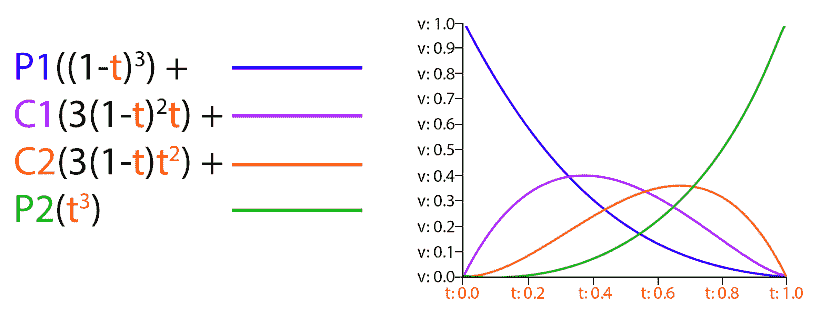

图 8.6：Bézier 样条的基础函数

这些是三次 Bézier 样条的点基础函数。它们表达了样条值随时间的变化。例如，P1 的影响随时间减小；在*t=0*时，影响是完整的—它的值为 1。然而，到了*t=1*，P1 的影响消失了—它的值为 0。

在本节中，您经历了简化 Bézier 样条评估函数的练习，以得到样条的基础函数。对于 Bézier 样条，很容易遵循这种逻辑，因为您可以从一个易于理解的实现开始，该实现只使用六个 lerp 函数。对于其他曲线，没有一个容易的起点。

在下一节中，我们将探讨另一种三次样条——三次 Hermite 样条。使用本节学到的知识，您将能够仅使用基础函数图实现 Hermite 评估函数。

# 理解三次 Hermite 样条

在游戏动画中最常用的样条类型是**三次 Hermite 样条**。与 Bézier 不同，Hermite 样条不使用空间中的点作为控制点；相反，它使用样条上的点的切线。您仍然有四个值，就像 Bézier 样条一样，但它们的解释方式不同。

对于 Hermite 样条，您不是有两个点和两个控制点；相反，您有两个点和两个斜率。这些斜率也被称为切线—在本章的其余部分，斜率和切线术语将互换使用。Hermite 样条的点基础函数如下所示：

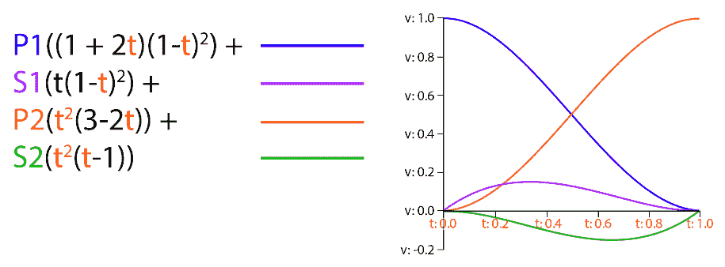

图 8.7：Hermite 样条的点基础函数

当给定点基础函数时，您可以实现类似于实现 Bézier 插值函数的样条评估函数：

```cpp
template<typename T>
T Hermite(float t, T& p1, T& s1, T& p2, T& s2) {
   return 
      p1 * ((1.0f + 2.0f * t) * ((1.0f - t) * (1.0f - t))) +
      s1 * (t * ((1.0f - t) * (1.0f - t))) +
      p2 * ((t * t) * (3.0f - 2.0f * t)) +
      s2 * ((t * t) * (t - 1.0f));
}
```

可以在 Bézier 和 Hermite 样条之间切换，但这超出了您需要了解的动画范围。一些 3D 内容创建应用程序，如 Maya，允许动画师使用 Hermite 样条创建动画，而其他应用程序，如 Blender 3D，使用 Bézier 曲线。

了解这些函数的工作原理是有用的，无论哪种函数驱动您的动画系统。当然，还有更多的曲线类型，但 Bézier 和 Hermite 是最常见的。

glTF 文件格式支持常数、线性和三次插值类型。您刚刚学会了如何进行三次插值，但仍需要实现常数和线性插值。

# 插值类型

通常，在定义动画曲线时，遵循三种插值方法之一——常数、线性或三次。三次曲线可以使用任何三次方程来表示，例如 Bézier 曲线（Blender 使用的方法）或 Hermite 样条线（Maya 使用的方法）。本书使用 Hermite 样条线来表示三次曲线。

**常数曲线**保持其值不变，直到下一个关键帧。有时，这种类型的曲线被称为阶跃曲线。在视觉上，常数曲线如下所示：

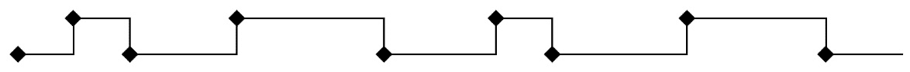

图 8.8：常数曲线

**线性曲线**以线性方式在两个帧之间进行插值（即直线）。正如您之前在采样曲线近似示例中看到的那样，如果线性轨迹的样本足够接近，它也可以开始近似其他类型的曲线。线性曲线如下所示：

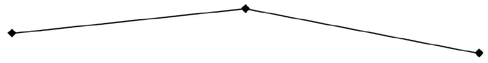

图 8.9：线性曲线

**三次曲线**允许您根据值和切线定义曲线。三次曲线的好处是您可以用很少的数据表示复杂的曲线。缺点是插值变得有点昂贵。三次曲线如下所示（切线是从关键帧出来的线）：

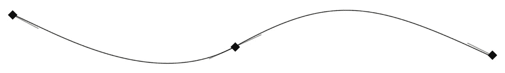

图 8.10：三次曲线

插值类型可以表示为简单的`enum`类。创建一个新文件—`Interpolation.h`。添加头文件保护并添加以下`enum`类声明：

```cpp
enum class Interpolation { 
    Constant, 
    Linear, 
    Cubic 
};
```

这也是 glTF 支持的三种插值类型。在下一节中，您将开始通过创建`Frame`结构来存储关键帧数据来实现动画轨迹。

# 创建 Frame 结构

数据帧是什么？这取决于插值类型。如果插值是常数（阶跃）或线性的，则帧只是时间和值。当插值为三次时，您还需要存储切线。

Hermite 曲线是通过连接 Hermite 样条线制成的。每个控制点由时间、值、入射切线和出射切线组成。如果使用控制点与其前面的点进行评估，则使用入射切线。如果使用控制点与其后面的点进行评估，则使用出射切线。

帧中存储的时间值是标量的，但数据和切线呢？这些值应该是标量、矢量还是四元数？要做出这个决定，您必须考虑如何将一组帧组织成曲线。

有两种选择策略。您可以创建一个标量曲线对象，其中数据和切线是标量值。然后，当您需要一个矢量曲线时，可以将几个标量曲线对象组合成一个矢量曲线对象。

具有标量轨道并从中合成高阶轨道的优势在于矢量或四元数曲线的每个分量可以以不同的方式进行插值。它还可以节省内存，因为曲线的每个分量可以具有不同数量的帧。缺点是额外的实现工作。

另一种策略是使用专门的帧和曲线类型，例如标量帧、矢量帧和四元数帧。同样，您可以创建单独的类来表示标量曲线、矢量曲线和四元数曲线。

使用专门的帧和曲线的优势在于其易于实现。您可以利用使用模板来避免编写重复的代码。glTF 文件也以这种方式存储动画轨迹。缺点是内存；曲线的每个分量都需要具有相同数量的关键帧。

在本书中，你将实现显式帧和曲线（轨迹）。`Frame`类将包含时间、值和入射和出射切线。如果插值类型不需要切线，你可以简单地忽略它们。帧可以是任意大小（如标量、二维向量、三维向量、四元数等）。它包含的时间始终是标量，但值和切线长度可以是任何值：

1.  创建一个新文件`Frame.h`。将`Frame`类的声明添加到这个新文件中。`Frame`类需要值和入射和出射切线的数组，以及一个时间标量。使用模板来指定每个帧的大小：

```cpp
template<unsigned int N>
class Frame {
public:
    float mValue[N];
    float mIn[N];
    float mOut[N];
    float mTime;
};
```

1.  为常见的帧类型创建`typedef`数据类型：

```cpp
typedef Frame<1> ScalarFrame;
typedef Frame<3> VectorFrame;
typedef Frame<4> QuaternionFrame;
```

你刚刚实现的`Frame`类用于存储动画轨迹中的关键帧。动画轨迹是关键帧的集合。在下一节中，你将学习如何实现`Track`类。

# 创建 Track 类

`Track`类是一组帧。对轨迹进行插值返回轨迹的数据类型；结果是轨迹在特定时间点上定义的曲线上的值。轨迹必须至少有两个帧进行插值。

如*创建 Frame 结构*部分所述，通过遵循本书中的示例，你将实现显式的帧和轨迹类型。将为标量、向量和四元数轨迹创建单独的类。这些类是模板的，以避免编写重复的代码。例如，`vec3`轨迹包含`Frame<3>`类型的帧。

因为轨迹有一个明确的类型，所以你不能在`vec3`轨迹的*X*分量中创建关键帧，而不同时为*Y*和*Z*分量添加关键帧。

这可能会占用更多的内存，如果你有一个不变的组件。例如，注意在下图中，*Z*组件有许多帧，即使它是一条直线，两个应该足够了。这并不是一个很大的折衷；所占用的额外内存是微不足道的：

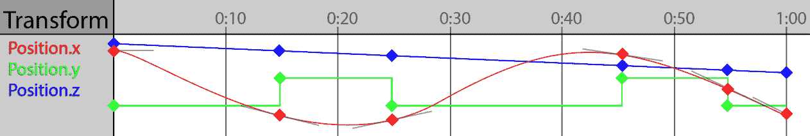

图 8.11：vec3 轨迹的组件

对于蒙皮网格渲染，动画轨迹总是对关节变换进行动画。然而，动画轨迹也可以用于在游戏中动画其他值，比如光的强度或在二维精灵之间切换以产生翻书效果。在下一节中，你将创建一个新的头文件并开始声明实际的`Track`类。

## 声明 Track 类

轨迹是一组帧。`Frame`类是模板的，所以`Track`类也需要是模板的。`Track`类需要两个模板参数——第一个是类型（预期是`float`、`vec3`、`quat`等），另一个是类型包含的组件数：

1.  `Track`类只需要两个成员——帧的向量和插值类型。创建一个新文件`Track.h`，并将`Track`类的声明添加到这个文件中：

```cpp
template<typename T, int N>
class Track {
protected:
    std::vector<Frame<N>> mFrames;
    Interpolation mInterpolation;
```

1.  `Track`类只需要一个默认构造函数来初始化`mInterpolation`变量。生成的复制构造函数、赋值运算符和析构函数都很好：

```cpp
public:
    Track();
```

1.  为轨迹的帧数、插值类型以及起始和结束时间创建获取器和设置器函数：

```cpp
    void Resize(unsigned int size);
    unsigned int Size();
    Interpolation GetInterpolation();
    void SetInterpolation(Interpolation interp);
    float GetStartTime();
    float GetEndTime();
```

1.  `Track`类需要一种在给定时间采样轨迹的方法。这个`Sample`方法应该接受一个时间值和轨迹是否循环的参数。重载`[]运算符`以检索帧的引用：

```cpp
    T Sample(float time, bool looping);
    Frame<N>& operator[](unsigned int index);
```

1.  接下来，你需要声明一些辅助函数。轨迹可以是常量、线性或立方体。只需要一个`Sample`函数来处理这三种情况。不要创建一个庞大、难以阅读的函数，为每种插值类型创建一个辅助函数：

```cpp
protected:
    T SampleConstant(float time, bool looping);
    T SampleLinear(float time, bool looping);
    T SampleCubic(float time, bool looping);
```

1.  添加一个辅助函数来评估 Hermite 样条：

```cpp
    T Hermite(float time, const T& p1, const T& s1, 
              const T& p2, const T& s2);
```

1.  添加一个函数来检索给定时间的帧索引。这是请求的时间之前的最后一帧。另外，添加一个辅助函数，该函数接受轨道范围之外的输入时间，并将其调整为轨道上的有效时间：

```cpp
    int FrameIndex(float time, bool looping);
    float AdjustTimeToFitTrack(float t, bool loop);
```

1.  您需要一种将浮点数组（帧内的数据）转换为轨道模板类型的方法。该函数针对每种类型的轨道进行了专门化：

```cpp
    T Cast(float* value); // Will be specialized
};
```

1.  与`Frame`类一样，为常见的`Track`类型添加`typedef`数据类型：

```cpp
typedef Track<float, 1> ScalarTrack;
typedef Track<vec3, 3> VectorTrack;
typedef Track<quat, 4> QuaternionTrack;
```

`Track`类的 API 很小，这使得该类易于使用。但是，`Track`类存在许多隐藏的复杂性；毕竟，这个类是您正在构建的动画系统的核心。在下一节中，您将开始实现实际的`Track`类。

## 实现 Track 类

`Track`类是模板化的，但不打算在动画系统之外使用。在`Track.cpp`中为`float`、`vec3`和`quat`轨道添加模板定义。这样做可以使编译器在 CPP 文件中生成这些模板的代码：

```cpp
template Track<float, 1>;
template Track<vec3, 3>;
template Track<quat, 4>;
```

对于角色动画，`vec3`和`quat`轨道类型就足够了。如果需要添加新类型的轨道，请不要忘记将模板类型添加到`Track.cpp`文件中。在接下来的部分中，您将开始实现加载轨道数据的辅助函数。

### 实现辅助函数

`Track`类是模板化的，以避免为所有轨道类型编写重复的代码。但是，某些功能需要特定于`Track`类的类型。除了`Cast`函数之外，所有特定于类型的函数都驻留在一个新的命名空间`TrackHelpers`中。

这些辅助函数不是`Track`类的一部分；它们依赖于函数重载，以确保调用正确版本的辅助函数。这些辅助类的关键职责之一是确保四元数被归一化并处于正确的邻域。因为这段代码插值四元数，所以邻域是一个关注点：

1.  要使轨道进行线性插值，您需要为每种轨道类型创建插值函数。在`Track.cpp`中添加以下辅助函数，为轨道可能包含的每种数据类型提供正确的插值方法。这些函数属于`TrackHelpers`命名空间。

```cpp
namespace TrackHelpers {
   inline float Interpolate(float a, float b, float t) {
       return a + (b - a) * t;
   }
   inline vec3 Interpolate(const vec3& a, const vec3& b,
                           float t) {
       return lerp(a, b, t);
   }
   inline quat Interpolate(const quat& a, const quat& b,
                           float t) {
       quat result = mix(a, b, t);
       if (dot(a, b) < 0) { // Neighborhood
           result = mix(a, -b, t);
       }
       return normalized(result); //NLerp, not slerp
   }
```

1.  当插值 Hermite 样条时，如果输入类型是四元数，则结果需要被归一化。您可以创建仅归一化四元数的辅助函数，而不是提供 Hermite 函数的四元数规范：

```cpp
   inline float AdjustHermiteResult(float f) {
      return f;
   }
   inline vec3 AdjustHermiteResult(const vec3& v) {
      return v;
   }
   inline quat AdjustHermiteResult(const quat& q) {
      return normalized(q);
   }
```

1.  还需要一个常见的`Neighborhood`操作，以确保两个四元数处于正确的邻域。该函数对其他数据类型应该不做任何操作：

```cpp
   inline void Neighborhood(const float& a, float& b){}
   inline void Neighborhood(const vec3& a, vec3& b){}
   inline void Neighborhood(const quat& a, quat& b) {
      if (dot(a, b) < 0) {
         b = -b;
      }
   }
}; // End Track Helpers namespace
```

这些辅助函数存在的原因是为了避免制作插值函数的专门版本。相反，通用插值函数调用这些辅助方法，并且函数重载确保调用正确的函数。这意味着如果添加新类型的轨道，则需要添加新的辅助函数。在下一节中，您将开始实现一些`Track`函数。

### 实现 Track 函数

在本节中，您将开始实现`Track`类的成员函数。`Track`类有几个不重要的函数，要么需要调用辅助函数，要么只是获取器和设置器函数。首先使用这些函数开始实现`Track`类：

1.  `Track`构造函数需要设置轨道的插值类型。轨道的开始和结束时间的获取器和设置器函数很简单：

```cpp
template<typename T, int N>
Track<T, N>::Track() {
    mInterpolation = Interpolation::Linear;
}
template<typename T, int N>
float Track<T, N>::GetStartTime() {
    return mFrames[0].mTime;
}
template<typename T, int N>
float Track<T, N>::GetEndTime() {
    return mFrames[mFrames.size() - 1].mTime;
}
```

1.  `Sample`函数需要调用`SampleConstant`、`SampleLinear`或`SampleCubic`，具体取决于轨道类型。`[]` `operator`返回对指定帧的引用：

```cpp
template<typename T, int N>
T Track<T, N>::Sample(float time, bool looping) {
    if (mInterpolation == Interpolation::Constant) {
        return SampleConstant(time, looping);
    }
    else if (mInterpolation == Interpolation::Linear) {
        return SampleLinear(time, looping);
    }
    return SampleCubic(time, looping);
}
template<typename T, int N>
Frame<N>& Track<T, N>::operator[](unsigned int index) {
    return mFrames[index];
}
```

1.  `Resize`和`Size`函数是围绕帧向量的大小的简单获取器和设置器：

```cpp
template<typename T, int N>
void Track<T, N>::Resize(unsigned int size) {
    mFrames.resize(size);
}
template<typename T, int N>
unsigned int Track<T, N>::Size() {
    return mFrames.size();
}
```

1.  轨道的插值类型也有简单的获取器和设置器函数：

```cpp
template<typename T, int N>
Interpolation Track<T, N>::GetInterpolation() {
    return mInterpolation;
}
template<typename T, int N>
void Track<T, N>::SetInterpolation(Interpolation interpolation) {
    mInterpolation = interpolation;
}
```

1.  `Hermite`函数实现了本章*理解三次 Hermite 样条*部分涵盖的基本函数。第二点可能需要通过`Neighborhood`辅助函数取反。四元数也需要被归一化。邻域化和归一化都是由辅助函数执行的：

```cpp
template<typename T, int N>
T Track<T, N>::Hermite(float t, const T& p1, const T& s1,
                       const T& _p2, const T& s2) {
    float tt = t * t;
    float ttt = tt * t;
    T p2 = _p2;
    TrackHelpers::Neighborhood(p1, p2);
    float h1 = 2.0f * ttt - 3.0f * tt + 1.0f;
    float h2 = -2.0f * ttt + 3.0f * tt;
    float h3 = ttt - 2.0f * tt + t;
    float h4 = ttt - tt;
    T result = p1 * h1 + p2 * h2 + s1 * h3 + s2 * h4;
    return TrackHelpers::AdjustHermiteResult(result);
}
```

在接下来的几节中，您将实现`Track`类的一些更难的函数，从`FrameIndex`函数开始。

### 实现`FrameIndex`函数

`FrameIndex`函数以时间作为参数；它应该返回该时间之前的帧（在左侧）。这种行为取决于轨道是否打算循环采样。按照以下步骤实现`FrameIndex`函数：

1.  如果轨道只有一帧或更少，那么它是无效的。如果遇到无效的轨道，返回`-1`：

```cpp
template<typename T, int N>
int Track<T, N>::FrameIndex(float time, bool looping) {
    unsigned int size = (unsigned int)mFrames.size();
    if (size <= 1) {
        return -1;
    }
```

1.  如果轨道被循环采样，输入时间需要调整，使其落在起始和结束帧之间。这意味着您需要知道轨道第一帧的时间、轨道帧的时间和轨道的持续时间：

```cpp
    if (looping) {
        float startTime = mFrames[0].mTime;
        float endTime = mFrames[size - 1].mTime;
        float duration = endTime - startTime;
```

1.  由于轨道循环，`time`需要调整，使其在有效范围内。为此，通过从起始时间中减去`time`并将结果与持续时间取模来使`time`相对于持续时间。如果`time`为负数，则加上持续时间。不要忘记将起始时间加回`time`中：

```cpp
        time = fmodf(time - startTime, 
                     endTime - startTime);
        if (time < 0.0f) {
            time += endTime - startTime;
        }
        time = time + startTime;
    }
```

1.  如果轨道不循环，任何小于起始帧的`time`值应该被夹到`0`，任何大于倒数第二帧的`time`值应该被夹到倒数第二帧的索引：

```cpp
    else {
        if (time <= mFrames[0].mTime) {
            return 0;
        }
        if (time >= mFrames[size - 2].mTime) {
            return (int)size - 2;
        }
    }
```

1.  现在时间在有效范围内，循环遍历每一帧。最接近时间的帧（但仍然较小）是应该返回的帧的索引。可以通过向后循环遍历轨道的帧并返回第一个时间小于查找时间的索引来找到这一帧：

```cpp
    for (int i = (int)size - 1; i >= 0; --i) {
        if (time >= mFrames[i].mTime) {
            return i;
        }
    }
    // Invalid code, we should not reach here!
    return -1;
} // End of FrameIndex
```

如果一个轨道不循环并且时间大于最后一帧的时间，则使用倒数第二帧的索引。为什么使用倒数第二帧而不是最后一帧？`Sample`函数总是需要当前帧和下一帧，下一帧是通过将`FrameIndex`函数的结果加`1`来找到的。当`time`等于最后一帧的时间时，需要插值的两帧仍然是倒数第二帧和最后一帧。

在下一节中，您将实现`AdjustTimeToFitTrack`函数。这个函数用于确保任何采样的时间都有一个有效的值。有效的值是指在轨道的起始时间和结束时间之间的任何时间。

### 实现`AdjustTimeToFitTrack`函数

要实现的下一个函数是`AdjustTimeToFitTrack`。给定一个时间，这个函数需要调整时间，使其落在轨道的起始/结束帧的范围内。当然，这取决于轨道是否循环。按照以下步骤实现`AdjustTimeToFitTrack`函数：

1.  如果一个轨道少于一帧，那么这个轨道是无效的。如果使用了无效的轨道，返回`0`：

```cpp
template<typename T, int N>
float Track<T, N>::AdjustTimeToFitTrack(float time, 
                                        bool looping) {
    unsigned int size = (unsigned int)mFrames.size();
    if (size <= 1) { 
        return 0.0f; 
    }
```

1.  找到轨道的起始时间、结束时间和持续时间。起始时间是第一帧的时间，结束时间是最后一帧的时间，持续时间是两者之间的差异。如果轨道持续时间为`0`，则无效——返回`0`：

```cpp
    float startTime = mFrames[0].mTime;
    float endTime = mFrames[size - 1].mTime;
    float duration = endTime - startTime;
    if (duration <= 0.0f) { 
        return 0.0f; 
    }
```

1.  如果轨道循环，通过轨道的持续时间调整时间：

```cpp
    if (looping) {
        time = fmodf(time - startTime, 
                     endTime - startTime);
        if (time < 0.0f) {
            time += endTime - startTime;
        }
        time = time + startTime;
    }
```

1.  如果轨道不循环，将时间夹到第一帧或最后一帧。返回调整后的时间：

```cpp
    else {
        if (time <= mFrames[0].mTime) { 
            time = startTime;  
        }
        if (time >= mFrames[size - 1].mTime) { 
            time = endTime; 
        }
    }
    return time;
}
```

`AdjustTimeToFitTrack`函数很有用，因为它保持了动画采样时间在范围内。这个函数旨在在动画播放时间改变时调用。考虑以下例子：

```cpp
Track<float, 1> t;
float mAnimTime = 0.0f;
void Update(float dt) { // dt: delta time of frame
    mAnimTime = t. AdjustTimeToFitTrack (mAnimTime + dt);
}
```

在示例中每次调用`Update`函数时，`mAnimTime`变量都会增加`frame`的`deltaTime`。然而，由于增加的时间在分配之前传递给`AdjustTimeToFitTrack`，因此它永远不会有无效的动画时间值。

在接下来的部分中，您将实现`Track`类的`Cast`函数。`Cast`函数用于接受一个浮点数组，并将其转换为`Track`类的模板类型。

### 实现 Cast 函数

`Cast`函数是专门的；需要为每种类型的轨迹提供一个实现。`Cast`函数接受一个浮点数组，并返回`Track`类的模板类型`T`。支持的类型有`float`、`vec3`和`quat`：

```cpp
template<> float Track<float, 1>::Cast(float* value) {
    return value[0];
}
template<> vec3 Track<vec3, 3>::Cast(float* value) {
    return vec3(value[0], value[1], value[2]);
}
template<> quat Track<quat, 4>::Cast(float* value) {
    quat r = quat(value[0], value[1], value[2], value[3]);
    return normalized(r);
}
```

这个`Cast`函数很重要，因为它可以将存储在`Frame`类中的`float`数组转换为`Frame`类表示的数据类型。例如，`Frame<3>`被转换为`vec3`。在接下来的部分中，您将使用`Cast`函数来返回采样`Track`类时的正确数据类型。

### 常量轨迹采样

在本节中，您将为`Track`类实现三个采样函数中的第一个——`FrameIndex`辅助函数。确保帧是有效的，然后将该帧的值转换为正确的数据类型并返回：

```cpp
template<typename T, int N>
T Track<T, N>::SampleConstant(float t, bool loop) {
    int frame = FrameIndex(t, loop);
    if (frame < 0 || frame >= (int)mFrames.size()) {
        return T();
    }
    return Cast(&mFrames[frame].mValue[0]);
}
```

常量采样通常用于诸如可见标志之类的东西，其中一个变量的值从一帧到下一帧的变化没有任何实际的插值是有意义的。在接下来的部分中，您将学习如何实现线性轨迹采样。线性采样非常常见；大多数内容创建应用程序提供了一个“采样”导出选项，可以导出线性插值的轨迹。

### 线性轨迹采样

第二种采样类型，`FrameIndex`函数，你永远不应该处于当前帧是轨迹的最后一帧且下一帧无效的情况。

一旦你知道了当前帧、下一帧以及它们之间的时间差，你就可以进行插值。调用`AdjustTimeToFitTrack`确保时间有效，从第一帧的时间中减去它，并将结果除以帧间隔。这将得到插值值`t`。

知道插值值后，调用`TrackHelpers::Interpolate`函数进行插值：

```cpp
template<typename T, int N>
T Track<T, N>::SampleLinear(float time, bool looping) {
    int thisFrame = FrameIndex(time, looping);
    if (thisFrame < 0 || thisFrame >= mFrames.size() - 1) {
        return T();
    }
    int nextFrame = thisFrame + 1;
    float trackTime = AdjustTimeToFitTrack(time, looping);
    float thisTime = mFrames[thisFrame].mTime;
    float frameDelta = mFrames[nextFrame].mTime – thisTime;
    if (frameDelta <= 0.0f) {
        return T();
    }
    float t = (trackTime - thisTime) / frameDelta;
    T start = Cast(&mFrames[thisFrame].mValue[0]);
    T end = Cast(&mFrames[nextFrame].mValue[0]);
    return TrackHelpers::Interpolate(start, end, t);
}
```

线性采样通常用于许多 3D 内容创建应用程序，这些应用程序提供了一个选项，可以通过在固定间隔处对动画曲线进行采样来近似。在接下来的部分中，您将学习如何进行曲线的三次插值。三次插值存储的数据比线性插值少，但计算成本更高。

### 三次轨迹采样

最后一种采样类型，`Hermite`辅助函数进行插值。

如果你把`time`想象成轨道上的播放头，它在第一个点的右边和第二个点的左边。因此，你需要第一个点的外斜率（因为播放头正在远离它），以及第二个点的内斜率（因为播放头正在朝向它）。两个斜率都需要乘以帧间隔：

```cpp
template<typename T, int N>
T Track<T, N>::SampleCubic(float time, bool looping) {
    int thisFrame = FrameIndex(time, looping);
    if (thisFrame < 0 || thisFrame >= mFrames.size() - 1) {
        return T();
    }
    int nextFrame = thisFrame + 1;
    float trackTime = AdjustTimeToFitTrack(time, looping);
    float thisTime = mFrames[thisFrame].mTime;
    float frameDelta = mFrames[nextFrame].mTime - thisTime;
    if (frameDelta <= 0.0f) {
        return T();
    }
    float t = (trackTime - thisTime) / frameDelta;
    size_t fltSize = sizeof(float);
    T point1 = Cast(&mFrames[thisFrame].mValue[0]);
    T slope1;// = mFrames[thisFrame].mOut * frameDelta;
    memcpy(&slope1, mFrames[thisFrame].mOut, N * fltSize);
    slope1 = slope1 * frameDelta;
    T point2 = Cast(&mFrames[nextFrame].mValue[0]);
    T slope2;// = mFrames[nextFrame].mIn[0] * frameDelta;
    memcpy(&slope2, mFrames[nextFrame].mIn, N * fltSize);
    slope2 = slope2 * frameDelta;
    return Hermite(t, point1, slope1, point2, slope2);
}
```

为什么斜率使用`memcpy`而不是`Cast`函数？这是因为`Cast`函数会对四元数进行归一化，这是不好的，因为斜率不应该是四元数。使用`memcpy`而不是`Cast`直接复制值，避免了归一化。

在下一节中，您将学习如何将矢量和四元数轨迹合并成一个`TransformTrack`。实际的动画框架将在`TransformTrack`类上工作，这些类将不是模板化的。

# 创建 TransformTrack 类

对于任何动画变换，您不希望维护单独的向量和四元数轨道；相反，您构建一个更高级的结构——变换轨道。变换轨道封装了三个轨道——一个用于位置，一个用于旋转，一个用于缩放。您可以在任何点对变换轨道进行采样，并获得完整的变换，即使组件轨道的持续时间或开始时间不同。

要考虑的一件事是如何将这些变换轨道与动画模型相关联。模型的骨架包含几个骨骼。您可以存储一个变换轨道的向量——每个骨骼一个——或者您可以将骨骼 ID 添加为变换轨道的成员，并且只存储所需数量的骨骼。

这很重要，因为一个角色可能有很多骨骼，但并非所有动画都会对所有这些骨骼进行动画。如果为每个骨骼存储一个变换轨道，会浪费内存，但对动画进行采样会更快。如果只存储所需数量的变换轨道，采样会变得更昂贵，但内存消耗会减少。

实现选择往往最终成为内存与速度之间的权衡。在现代系统上，任一轴上的增量应该是微不足道的。在本节中，您将为变换轨道添加一个骨骼 ID，并且只存储所需数量的轨道。

## 声明 TransformTrack 类

`TransformTrack`类将需要保存一个表示轨道将影响哪个骨骼（关节）的整数。它还需要实际的位置、旋转和缩放轨道。这四个信息应该足以对关节的位置、旋转和缩放进行动画。

与`Track`类一样，`TransformTrack`类有获取和设置变换轨道的开始和结束时间的函数。变换轨道的开始和结束时间取决于其组件轨道。组件轨道是位置、旋转和缩放轨道。

在三个轨道中，最低的开始时间被用作变换轨道的开始时间。三个轨道中最大的结束时间被用作变换轨道的结束时间。

变换轨道中的不是所有组件轨道都需要有效。例如，如果只有变换的位置是动画的，那么旋转和缩放组件轨道可以保持无效。只要其组件轨道中至少有一个有效，变换轨道就是有效的。

因为不是所有组件轨道都保证有效，`TransformTrack`类的`Sample`函数需要获取一个引用变换。采取以下步骤声明`TransformTrack`类：

1.  创建一个新文件`TransformTrack.h`，并开始通过定义成员变量来添加`TransformTrack`的定义：

```cpp
class TransformTrack {
protected:
    unsigned int mId;
    VectorTrack mPosition;
    QuaternionTrack mRotation;
    VectorTrack mScale;
```

1.  公共 API 很简单。您需要默认构造函数来为轨道的关节 ID 分配默认值。您还需要获取 ID、组件轨道、开始/结束时间、持续时间和有效性的函数，以及 ID 需要一个设置函数；组件获取函数返回可变引用：

```cpp
public:
    TransformTrack();
    unsigned int GetId();
    void SetId(unsigned int id);
    VectorTrack& GetPositionTrack();
    QuaternionTrack& GetRotationTrack();
    VectorTrack& GetScaleTrack();
    float GetStartTime();
    float GetEndTime();
    bool IsValid();
    Transform Sample(const Transform& ref, float time, bool looping);
};
```

在下一节中，您将开始实现`TransfromTrack`的函数。

## 实现 TransformTrack 类

按照以下步骤实现`TransformTrack`类：

1.  创建一个新文件`TransformTrack.cpp`，以实现`TransformTrack`类。`TransformTrack`类的构造函数并不重要；为变换轨道表示的关节分配一个默认值。轨道 ID 的获取和设置函数也很简单：

```cpp
TransformTrack::TransformTrack() {
    mId = 0;
}
unsigned int TransformTrack::GetId() {
    return mId;
}
void TransformTrack::SetId(unsigned int id) {
    mId = id;
}
```

1.  接下来，实现函数来访问存储在变换轨道中的不同组件轨道。这些函数需要返回一个引用，以便您可以改变返回的轨道：

```cpp
VectorTrack& TransformTrack::GetPositionTrack() {
    return mPosition;
}
QuaternionTrack& TransformTrack::GetRotationTrack() {
    return mRotation;
}
VectorTrack& TransformTrack::GetScaleTrack() {
    return mScale;
}
```

1.  `IsValid`辅助函数只有在存储在`TransformTrack`类中的组件轨道中至少有一个有效时才应返回`true`。要使轨道有效，需要有两个或更多帧：

```cpp
bool TransformTrack::IsValid() {
    return mPosition.Size() > 1 || 
           mRotation.Size() > 1 || 
           mScale.Size() > 1;
}
```

1.  `GetStartTime`函数应该返回三个组件轨道中最小的开始时间。如果没有一个组件是有效的（即它们都只有一个或没有帧），那么`TransformTrack`就无效。在这种情况下，只需返回`0`：

```cpp
float TransformTrack::GetStartTime() {
    float result = 0.0f;
    bool isSet = false;
    if (mPosition.Size() > 1) {
        result = mPosition.GetStartTime();
        isSet = true;
    }
    if (mRotation.Size() > 1) {
        float rotationStart = mRotation.GetStartTime();
        if (rotationStart < result || !isSet) {
            result = rotationStart;
            isSet = true;
        }
    }
    if (mScale.Size() > 1) {
        float scaleStart = mScale.GetStartTime();
        if (scaleStart < result || !isSet) {
            result = scaleStart;
            isSet = true;
        }
    }
    return result;
}
```

1.  `GetEndTime`函数类似于`GetStartTime`函数。唯一的区别是这个函数寻找最大的轨道结束时间：

```cpp
float TransformTrack::GetEndTime() {
    float result = 0.0f;
    bool isSet = false;
    if (mPosition.Size() > 1) {
        result = mPosition.GetEndTime();
        isSet = true;
    }
    if (mRotation.Size() > 1) {
        float rotationEnd = mRotation.GetEndTime();
        if (rotationEnd > result || !isSet) {
            result = rotationEnd;
            isSet = true;
        }
    }
    if (mScale.Size() > 1) {
        float scaleEnd = mScale.GetEndTime();
        if (scaleEnd > result || !isSet) {
            result = scaleEnd;
            isSet = true;
        }
    }
    return result;
}
```

1.  `Sample`函数只在其组件轨道有两个或更多帧时对其进行采样。由于`TransformTrack`类只能对一个组件进行动画，比如位置，因此这个函数需要将一个参考变换作为参数。如果变换轨道没有对其中一个变换组件进行动画，那么将使用参考变换的值：

```cpp
Transform TransformTrack::Sample(const Transform& ref,
                              float time, bool loop) {
    Transform result = ref; // Assign default values
    if (mPosition.Size() > 1) { // Only if valid
       result.position = mPosition.Sample(time, loop);
    }
    if (mRotation.Size() > 1) { // Only if valid
       result.rotation = mRotation.Sample(time, loop);
    }
    if (mScale.Size() > 1) { // Only if valid
       result.scale = mScale.Sample(time, loop);
    }
    return result;
}
```

因为并非所有动画都包含相同的轨道，重置正在采样的姿势是很重要的。这可以确保参考变换始终是正确的。要重置姿势，将其分配为与休息姿势相同。

# 总结

在本章中，您了解了动画的基本组件，一个数据帧中包含什么，几个帧如何组成一个轨道，以及几个轨道如何使一个变换发生动画。您探索了不同的插值方法，用于插值动画轨道，并使这些方法适用于标量、向量和四元数轨道。

本章中构建的类将作为下一章中创建动画剪辑的基本组件。在下一章中，您将实现动画剪辑和姿势。动画剪辑将由`TransformTrack`对象组成。这些轨道是现代动画系统的核心。

本书的可下载内容的`Chapter08`文件夹中有两个示例。`Sample00`包含到目前为止在书中使用的所有代码，`Sample01`创建了几个轨道并将它们全部绘制在屏幕上。在视觉上绘制轨道是一个好主意，因为它可以帮助及早解决调试问题。
