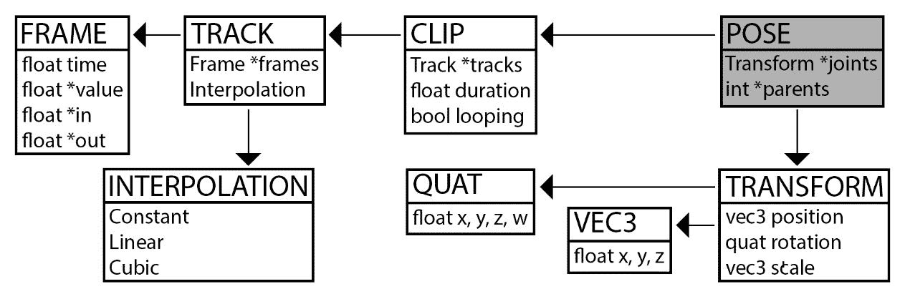
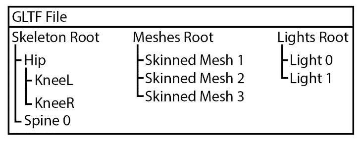

# *第九章*：实现动画片段

动画片段是`TransformTrack`对象的集合。动画片段在时间上对一组变换进行动画处理，被动画处理的变换集合称为姿势。将姿势视为动画角色在特定时间点的骨架。姿势是一组变换的层次结构。每个变换的值都会影响其所有子节点。

让我们来看看生成游戏角色动画一帧的姿势需要做些什么。当对动画片段进行采样时，结果是一个姿势。动画片段由动画轨道组成，每个动画轨道由一个或多个帧组成。这种关系看起来像这样：



图 9.1：生成姿势的依赖关系

在本章结束时，您应该能够从 glTF 文件中加载动画片段，并将这些片段采样为姿势。

# 实现姿势

为了存储变换之间的父子层次关系，需要维护两个并行向量——一个填充有变换，另一个填充有整数。整数数组包含每个关节的父变换的索引。并非所有关节都有父节点；如果一个关节没有父节点，其父节点值为负数。

在考虑骨骼或姿势时，很容易想到一个具有一个根节点和许多分支节点的层次结构。实际上，拥有两个或三个根节点并不罕见。有时，文件格式以骨骼的第一个节点作为根节点，但也有一个所有蒙皮网格都是其子节点的根节点。这些层次结构通常看起来像这样：



图 9.2：一个文件中的多个根节点

动画角色有三种常见的姿势——当前姿势、绑定姿势和静止姿势。静止姿势是所有骨骼的默认配置。动画描述了每个骨骼随时间的变换。在时间上对动画进行采样会得到当前姿势，用于对角色进行蒙皮。绑定姿势将在下一章中介绍。

并非所有动画都会影响角色的每根骨骼或关节；这意味着有些动画可能不会改变关节的值。请记住，在这种情况下，关节表示为`Transform`对象。如果动画`1`播放了，但动画**B**没有？以下列表显示了结果：

+   如果只播放**A**或**B**，一切都很好。

+   如果先播放**B**，然后播放**A**，一切都很好。

+   如果先播放**A**，然后播放**B**，情况会有点混乱。

在上一个示例中，播放动画`1`会保持其从动画`Pose`类中最后修改的变换。

## 声明 Pose 类

`Pose`类需要跟踪要动画的角色骨架中每个关节的变换。它还需要跟踪每个关节的父关节。这些数据保存在两个并行向量中。

在对新的动画片段进行采样之前，需要将当前角色的姿势重置为静止姿势。`Pose`类实现了复制构造函数和赋值运算符，以尽可能快地复制姿势。按照以下步骤声明`Pose`类：

1.  创建一个新的头文件`Pose.h`。在这个文件中添加`Pose`类的定义，从关节变换和它们的父节点的并行向量开始：

```cpp
class Pose {
protected:
    std::vector<Transform> mJoints;
    std::vector<int> mParents;
```

1.  添加默认构造函数和复制构造函数，并重载赋值运算符。`Pose`类还有一个方便的构造函数，它以关节数作为参数：

```cpp
public:
    Pose();
    Pose(const Pose& p);
    Pose& operator=(const Pose& p);
    Pose(unsigned int numJoints);
```

1.  为姿势的关节数添加获取器和设置器函数。当使用设置器函数时，需要调整`mJoints`和`mParents`向量的大小：

```cpp
    void Resize(unsigned int size);
    unsigned int Size();
```

1.  为关节的父级添加获取和设置函数。这两个函数都需要以关节的索引作为参数：

```cpp
    int GetParent(unsigned int index);
    void SetParent(unsigned int index, int parent);
```

1.  `Pose`类需要提供一种获取和设置关节的本地变换的方法，以及检索关节的全局变换。重载`[]运算符`以返回关节的全局变换：

```cpp
    Transform GetLocalTransform(unsigned int index);
    void SetLocalTransform(unsigned int index, 
                           const Transform& transform);
    Transform GetGlobalTransform(unsigned int index);
    Transform operator[](unsigned int index);
```

1.  要将`Pose`类传递给 OpenGL，需要将其转换为矩阵的线性数组。`GetMatrixPalette`函数执行此转换。该函数接受矩阵向量的引用，并用姿势中每个关节的全局变换矩阵填充它：

```cpp
    void GetMatrixPalette(std::vector<mat4>& out);
```

1.  通过重载等式和不等式运算符完成`Pose`类的设置：

```cpp
    bool operator==(const Pose& other);
    bool operator!=(const Pose& other);
};
```

`Pose`类用于保存动画层次结构中每个骨骼的变换。将其视为动画中的一帧；`Pose`类表示给定时间的动画状态。在接下来的部分中，您将实现`Pose`类。

## 实现 Pose 类

创建一个新文件，`Pose.cpp`。您将在此文件中实现`Pose`类。采取以下步骤来实现`Pose`类：

1.  默认构造函数不必执行任何操作。复制构造函数调用赋值运算符。方便构造函数调用`Resize`方法：

```cpp
Pose::Pose() { }
Pose::Pose(unsigned int numJoints) {
    Resize(numJoints);
}
Pose::Pose(const Pose& p) {
    *this = p;
}
```

1.  赋值运算符需要尽快复制姿势。您需要确保姿势没有分配给自己。接下来，确保姿势具有正确数量的关节和父级。然后，进行内存复制以快速复制所有父级和姿势数据：

```cpp
Pose& Pose::operator=(const Pose& p) {
    if (&p == this) {
        return *this;
    }
    if (mParents.size() != p.mParents.size()) {
        mParents.resize(p.mParents.size());
    }
    if (mJoints.size() != p.mJoints.size()) {
        mJoints.resize(p.mJoints.size());
    }
    if (mParents.size() != 0) {
        memcpy(&mParents[0], &p.mParents[0], 
               sizeof(int) * mParents.size());
    }
    if (mJoints.size() != 0) {
        memcpy(&mJoints[0], &p.mJoints[0], 
               sizeof(Transform) * mJoints.size());
    }
    return *this;
}
```

1.  由于父级和关节向量是平行的，`Resize`函数需要设置两者的大小。`size`获取函数可以返回任一向量的大小：

```cpp
void Pose::Resize(unsigned int size) {
    mParents.resize(size);
    mJoints.resize(size);
}
unsigned int Pose::Size() {
    return mJoints.size();
}
```

1.  本地变换的获取和设置方法很简单：

```cpp
Transform Pose::GetLocalTransform(unsigned int index) {
    return mJoints[index];
}
void Pose::SetLocalTransform(unsigned int index, const Transform& transform) {
    mJoints[index] = transform;
}
```

1.  从当前变换开始，`GetGlobalTransform`方法需要将所有变换组合到父级链中，直到达到根骨骼。请记住，变换连接是从右到左进行的。重载的`[]运算符`应被视为`GetGlobalTransform`的别名：

```cpp
Transform Pose::GetGlobalTransform(unsigned int i) {
    Transform result = mJoints[i];
    for (int p = mParents[i]; p >= 0; p = mParents[p]) {
        result = combine(mJoints[p], result);
    }
    return result;
}
Transform Pose::operator[](unsigned int index) {
    return GetGlobalTransform(index);
}
```

1.  要将`Pose`类转换为矩阵的向量，请循环遍历姿势中的每个变换。对于每个变换，找到全局变换，将其转换为矩阵，并将结果存储在矩阵的向量中。此函数尚未经过优化；您将在以后的章节中对其进行优化：

```cpp
void Pose::GetMatrixPalette(std::vector<mat4>& out) {
    unsigned int size = Size();
    if (out.size() != size) {
        out.resize(size);
    }
    for (unsigned int i = 0; i < size; ++i) {
        Transform t = GetGlobalTransform(i);
        out[i] = transformToMat4(t);
    }
}
```

1.  父关节索引的获取和设置方法很简单：

```cpp
int Pose::GetParent(unsigned int index) {
    return mParents[index];
}
void Pose::SetParent(unsigned int index, int parent) {
    mParents[index] = parent;
}
```

1.  在比较两个姿势时，您需要确保两个姿势中的所有关节变换和父索引都是相同的：

```cpp
bool Pose::operator==(const Pose& other) {
    if (mJoints.size() != other.mJoints.size()) {
        return false;
    }
    if (mParents.size() != other.mParents.size()) {
        return false;
    }
    unsigned int size = (unsigned int)mJoints.size();
    for (unsigned int i = 0; i < size; ++i) {
        Transform thisLocal = mJoints[i];
        Transform otherLocal = other.mJoints[i];
        int thisParent = mParents[i];
        int otherParent = other.mParents[i];
        if (thisParent != otherParent) { return false; }
        if (thisLocal.position != otherLocal.position) {
        return false; }
        if (thisLocal.rotation != otherLocal.rotation {
        return false; }
        if (thisLocal.scale != otherLocal.scale { 
        return false; } 
    }
    return true;
}
bool Pose::operator!=(const Pose& other) {
    return !(*this == other);
}
```

一个动画角色通常会有多个活动姿势并不罕见。考虑一个角色同时奔跑和开枪的情况。很可能会播放两个动画——一个影响下半身的**run**动画，一个影响上半身的**shoot**动画。这些姿势混合在一起形成最终姿势，用于显示动画角色。这种动画混合在*第十二章*中有所涵盖，*动画之间的混合*。

在接下来的部分中，您将实现动画剪辑。动画剪辑包含姿势中所有动画关节的动画随时间的变化。`Clip`类用于对动画进行采样并生成用于显示的姿势。

# 实现剪辑

动画剪辑是动画轨道的集合；每个轨道描述了一个关节随时间的运动，所有轨道组合描述了动画模型随时间的运动。如果对动画剪辑进行采样，您将得到一个姿势，该姿势描述了动画剪辑中每个关节在指定时间的配置。

对于基本的剪辑类，您只需要一个`Clip`类的向量，该类还应该跟踪元数据，例如剪辑的名称，剪辑是否循环，以及有关剪辑的时间或持续时间的信息。

## 声明 Clip 类

`Clip`类需要维护一个变换轨迹的向量。这是剪辑包含的最重要的数据。除了轨迹之外，剪辑还有一个名称、开始时间和结束时间，剪辑应该知道它是否循环。

`Clip`类的循环属性可以转移到管道中更深的构造（例如动画组件或类似物）。但是，在实现基本的动画系统时，这是放置循环属性的好地方：

1.  创建一个新文件，`Clip.h`，并开始声明`Clip`类：

```cpp
class Clip {
protected:
    std::vector<TransformTrack> mTracks;
    std::string mName;
    float mStartTime;
    float mEndTime;
    bool mLooping;
```

1.  剪辑的采样方式与轨迹的采样方式相同。提供的采样时间可能超出剪辑的范围。为了处理这个问题，您需要实现一个辅助函数，调整提供的采样时间，使其在当前动画剪辑的范围内：

```cpp
protected:
    float AdjustTimeToFitRange(float inTime);
```

1.  `Clip`类需要一个默认构造函数来为其某些成员分配默认值。在这里，编译器生成的析构函数、复制构造函数和赋值运算符应该是可以的：

```cpp
public:
    Clip();
```

1.  `Clip`类应提供一种获取剪辑包含的关节数量以及特定轨迹索引的关节 ID 的方法。您还需要有一个基于剪辑中关节索引的关节 ID 设置器：

```cpp
    unsigned int GetIdAtIndex(unsigned int index);
    void SetIdAtIndex(unsigned int idx, unsigned int id);
    unsigned int Size();
```

1.  从剪辑中检索数据可以通过两种方式之一完成。`[]运算符`返回指定关节的变换轨迹。如果指定关节没有轨迹，则会创建一个并返回。`Sample`函数接受`Pose`引用和时间，并返回一个也是时间的`float`值。此函数在提供的时间内对动画剪辑进行采样，并将结果分配给`Pose`引用：

```cpp
    float Sample(Pose& outPose, float inTime);
    TransformTrack& operator[](unsigned int index);
```

1.  我们需要一个公共辅助函数来确定动画剪辑的开始和结束时间。`RecalculateDuration`函数循环遍历所有`TransformTrack`对象，并根据组成剪辑的轨迹设置动画剪辑的开始/结束时间。此函数旨在由从文件格式加载动画剪辑的代码调用。

```cpp
    void RecalculateDuration();
```

1.  最后，`Clip`类需要简单的 getter 和 setter 函数：

```cpp
    std::string& GetName();
    void SetName(const std::string& inNewName);
    float GetDuration();
    float GetStartTime();
    float GetEndTime();
    bool GetLooping();
    void SetLooping(bool inLooping);
};
```

此处实现的`Clip`类可用于对任何内容进行动画化；不要觉得自己受限于人类和类人动画。在接下来的部分，您将实现`Clip`类。

## 实现 Clip 类

创建一个新文件，`Clip.cpp`。您将在这个新文件中实现`Clip`类。按照以下步骤实现`Clip`类：

1.  默认构造函数需要为`Clip`类的成员分配一些默认值：

```cpp
Clip::Clip() {
    mName = "No name given";
    mStartTime = 0.0f;
    mEndTime = 0.0f;
    mLooping = true;
}
```

1.  要实现`Sample`函数，请确保剪辑有效，并且时间在剪辑范围内。然后，循环遍历所有轨迹。获取轨迹的关节 ID，对轨迹进行采样，并将采样值分配回`Pose`引用。如果变换的某个组件没有动画，将使用引用组件提供默认值。然后函数返回调整后的时间：

```cpp
float Clip::Sample(Pose& outPose, float time) {
    if (GetDuration() == 0.0f) {
        return 0.0f;
    }
    time= AdjustTimeToFitRange(time);
    unsigned int size = mTracks.size();
    for (unsigned int i = 0; i < size; ++i) {
        unsigned int j = mTracks[i].GetId(); // Joint
        Transform local = outPose.GetLocalTransform(j);
        Transform animated = mTracks[i].Sample(
                             local, time, mLooping);
        outPose.SetLocalTransform(j, animated);
    }
    return time;
}
```

1.  `AdjustTimeToFitRange`函数应该循环，其逻辑与您为模板化的`Track`类实现的`AdjustTimeToFitTrack`函数相同：

```cpp
float Clip::AdjustTimeToFitRange(float inTime) {
    if (mLooping) {
        float duration = mEndTime - mStartTime;
        if (duration <= 0) { 0.0f; }
        inTime = fmodf(inTime - mStartTime, 
                       mEndTime - mStartTime);
        if (inTime < 0.0f) {
            inTime += mEndTime - mStartTime;
        }
        inTime = inTime + mStartTime;
    }
    else {
        if (inTime < mStartTime) {
            inTime = mStartTime;
        }
        if (inTime > mEndTime) {
            inTime = mEndTime;
        }
    }
    return inTime;
}
```

1.  `RecalculateDuration`函数将`mStartTime`和`mEndTime`设置为`0`的默认值。接下来，这些函数循环遍历动画剪辑中的每个`TransformTrack`对象。如果轨迹有效，则检索轨迹的开始和结束时间。存储最小的开始时间和最大的结束时间。剪辑的开始时间可能不是`0`；可能有一个从任意时间点开始的剪辑：

```cpp
void Clip::RecalculateDuration() {
    mStartTime = 0.0f;
    mEndTime = 0.0f;
    bool startSet = false;
    bool endSet = false;
    unsigned int tracksSize = mTracks.size();
    for (unsigned int i = 0; i < tracksSize; ++i) {
        if (mTracks[i].IsValid()) {
            float startTime = mTracks[i].GetStartTime();
            float endTime = mTracks[i].GetEndTime();
            if (startTime < mStartTime || !startSet) {
                mStartTime = startTime;
                startSet = true;
            }
            if (endTime > mEndTime || !endSet) {
                mEndTime = endTime;
                endSet = true;
            }
        }
    }
}
```

1.  `[] operator`用于检索剪辑中特定关节的`TransformTrack`对象。此函数主要由从文件加载动画剪辑的任何代码使用。该函数通过所有轨道进行线性搜索，以查看它们中的任何一个是否针对指定的关节。如果找到符合条件的轨道，则返回对其的引用。如果找不到符合条件的轨道，则创建并返回一个新的：

```cpp
TransformTrack& Clip::operator[](unsigned int joint) {
    for (int i = 0, s = mTracks.size(); i < s; ++i) {
        if (mTracks[i].GetId() == joint) {
            return mTracks[i];
        }
    }
    mTracks.push_back(TransformTrack());
    mTracks[mTracks.size() - 1].SetId(joint);
    return mTracks[mTracks.size() - 1];
}
```

1.  `Clip`类的其余 getter 函数都很简单：

```cpp
std::string& Clip::GetName() {
    return mName;
}
unsigned int Clip::GetIdAtIndex(unsigned int index) {
    return mTracks[index].GetId();
}
unsigned int Clip::Size() {
    return (unsigned int)mTracks.size();
}
float Clip::GetDuration() {
    return mEndTime - mStartTime;
}
float Clip::GetStartTime() {
    return mStartTime;
}
float Clip::GetEndTime() {
    return mEndTime;
}
bool Clip::GetLooping() {
    return mLooping;
}
```

1.  同样，`Clip`类的其余 setter 函数都很简单：

```cpp
void Clip::SetName(const std::string& inNewName) {
    mName = inNewName;
}
void Clip::SetIdAtIndex(unsigned int index, unsigned int id) {
    return mTracks[index].SetId(id);
}
void Clip::SetLooping(bool inLooping) {
    mLooping = inLooping;
}
```

动画剪辑始终修改相同的关节。没有必要重新设置每帧采样到的姿势，使其成为绑定姿势。但是，当切换动画时，不能保证两个剪辑将对相同的轨道进行动画。最好在切换动画剪辑时重置每帧采样到的姿势，使其成为绑定姿势！

在接下来的部分中，您将学习如何从 glTF 文件中加载角色的静止姿势。静止姿势很重要；这是角色在没有动画时的姿势。

# glTF - 加载静止姿势

在本书中，我们将假设一个 glTF 文件只包含一个动画角色。可以安全地假设 glTF 文件的整个层次结构可以视为模型的骨架。这使得加载静止姿势变得容易，因为静止姿势成为其初始配置中的层次结构。

在加载静止姿势之前，您需要创建几个帮助函数。这些函数是 glTF 加载器的内部函数，不应在头文件中公开。在`GLTFLoader.cpp`中创建一个新的命名空间，并将其命名为`GLTFHelpers`。所有帮助函数都在此命名空间中创建。

按照以下步骤实现加载 glTF 文件中静止姿势所需的帮助函数：

1.  首先，实现一个帮助函数来获取`cgltf_node`的本地变换。节点可以将其变换存储为矩阵或单独的位置、旋转和缩放组件。如果节点将其变换存储为矩阵，请使用`mat4ToTransform`分解函数；否则，根据需要创建组件：

```cpp
// Inside the GLTFHelpers namespace
Transform GLTFHelpers::GetLocalTransform(cgltf_node& n){
    Transform result;
    if (n.has_matrix) {
        mat4 mat(&n.matrix[0]);
        result = mat4ToTransform(mat);
    }
    if (n.has_translation) {
        result.position = vec3(n.translation[0], 
             n.translation[1], n.translation[2]);
    }
    if (n.has_rotation) {
        result.rotation = quat(n.rotation[0], 
          n.rotation[1], n.rotation[2], n.rotation[3]);
    }
    if (n.has_scale) {
        result.scale = vec3(n.scale[0], n.scale[1], 
                            n.scale[2]);
    }
    return result;
}
```

1.  接下来，实现一个帮助函数，从数组中获取`cgltf_node`的索引。`GLTFNodeIndex`函数可以通过循环遍历`.gltf`文件中的所有节点来执行简单的线性查找，并返回您正在搜索的节点的索引。如果找不到索引，则返回`-1`以表示无效索引：

```cpp
// Inside the GLTFHelpers namespace
int GLTFHelpers::GetNodeIndex(cgltf_node* target, 
    cgltf_node* allNodes, unsigned int numNodes) {
    if (target == 0) {
        return -1;
    }
    for (unsigned int i = 0; i < numNodes; ++i) {
        if (target == &allNodes[i]) {
            return (int)i;
        }
    }
    return -1;
}
```

1.  有了这些帮助函数，加载静止姿势需要很少的工作。循环遍历当前 glTF 文件中的所有节点。对于每个节点，将本地变换分配给将返回的姿势。您可以使用`GetNodeIndex`帮助函数找到节点的父节点，如果节点没有父节点，则返回`-1`：

```cpp
Pose LoadRestPose(cgltf_data* data) {
    unsigned int boneCount = data->nodes_count;
    Pose result(boneCount);
    for (unsigned int i = 0; i < boneCount; ++i) {
        cgltf_node* node = &(data->nodes[i]);
        Transform transform = 
        GLTFHelpers::GetLocalTransform(data->nodes[i]);
        result.SetLocalTransform(i, transform);
        int parent = GLTFHelpers::GetNodeIndex(
                     node->parent, data->nodes, 
                     boneCount);
        result.SetParent(i, parent);
    }
    return result;
}
```

在接下来的部分中，您将学习如何从 glTF 文件中加载关节名称。这些关节名称按照静止姿势关节的顺序出现。了解关节名称可以帮助调试骨骼的外观。关节名称还可以用于通过其他方式而不是索引来检索关节。本书中构建的动画系统不支持按名称查找关节，只支持索引。

# glTF - 加载关节名称

在某个时候，您可能想要知道每个加载的关节分配的名称。这可以帮助更轻松地进行调试或构建工具。要加载与静止姿势中加载关节的顺序相同的每个关节的名称，请循环遍历关节并使用名称访问器。

在`GLTFLoader.cpp`中实现`LoadJointNames`函数。不要忘记将函数声明添加到`GLTFLoader.h`中：

```cpp
std::vector<std::string> LoadJointNames(cgltf_data* data) {
    unsigned int boneCount = (unsigned int)data->nodes_count;
    std::vector<std::string> result(boneCount, "Not Set");
    for (unsigned int i = 0; i < boneCount; ++i) {
        cgltf_node* node = &(data->nodes[i]);
        if (node->name == 0) {
            result[i] = "EMPTY NODE";
        }
        else {
            result[i] = node->name;
        }
    }
    return result;
}
```

关节名称对于调试非常有用。它们让您将关节的索引与名称关联起来，这样您就知道数据代表什么。在接下来的部分中，您将学习如何从 glTF 文件中加载动画剪辑。

# glTF - 加载动画剪辑

要在运行时生成姿势数据，您需要能够加载动画剪辑。与静止姿势一样，这需要一些辅助函数。

您需要实现的第一个辅助函数`GetScalarValues`读取`gltf`访问器的浮点值。这可以通过`cgltf_accessor_read_float`辅助函数完成。

下一个辅助函数`TrackFromChannel`承担了大部分的重活。它将 glTF 动画通道转换为`VectorTrack`或`QuaternionTrack`。glTF 动画通道的文档位于[`github.com/KhronosGroup/glTF-Tutorials/blob/master/gltfTutorial/gltfTutorial_007_Animations.md`](https://github.com/KhronosGroup/glTF-Tutorials/blob/master/gltfTutorial/gltfTutorial_007_Animations.md)。

`LoadAnimationClips`函数应返回剪辑对象的向量。这并不是最佳的做法；这样做是为了使加载 API 更易于使用。如果性能是一个问题，请考虑将结果向量作为引用传递。

按照以下步骤从 glTF 文件中加载动画：

1.  在`GLTFLoader.cpp`文件的`GLTFHelpers`命名空间中实现`GetScalarValues`辅助函数：

```cpp
// Inside the GLTFHelpers namespace
void GLTFHelpers::GetScalarValues( vector<float>& out, 
                  unsigned int compCount, 
                  const cgltf_accessor& inAccessor) {
    out.resize(inAccessor.count * compCount);
    for (cgltf_size i = 0; i < inAccessor.count; ++i) {
        cgltf_accessor_read_float(&inAccessor, i, 
                                  &out[i * compCount], 
                                  compCount);
    }
}
```

1.  在`GLTFLoader.cpp`中实现`TrackFromChannel`辅助函数。通过设置`Track`插值来开始函数的实现。为此，请确保轨迹的`Interpolation`类型与采样器的`cgltf_interpolation_type`类型匹配：

```cpp
// Inside the GLTFHelpers namespace
template<typename T, int N>
void GLTFHelpers::TrackFromChannel(Track<T, N>& result,
              const cgltf_animation_channel& channel) {
    cgltf_animation_sampler& sampler = *channel.sampler;
    Interpolation interpolation = 
                  Interpolation::Constant;
    if (sampler.interpolation ==
        cgltf_interpolation_type_linear) {
        interpolation = Interpolation::Linear;
    }
    else if (sampler.interpolation ==
             cgltf_interpolation_type_cubic_spline) {
        interpolation = Interpolation::Cubic;
    }
    bool isSamplerCubic = interpolation == 
                          Interpolation::Cubic;
    result.SetInterpolation(interpolation);
```

1.  采样器输入是动画时间轴的访问器。采样器输出是动画值的访问器。使用`GetScalarValues`将这些访问器转换为浮点数的线性数组。帧的数量等于采样器输入中的元素数量。每帧的组件数量（`vec3`或`quat`）等于值元素数量除以时间轴元素数量。调整轨迹的大小以存储所有帧：

```cpp
    std::vector<float> time; // times
    GetScalarValues(time, 1, *sampler.input);
    std::vector<float> val; // values
    GetScalarValues(val, N, *sampler.output);
    unsigned int numFrames = sampler.input->count; 
    unsigned int compCount = val.size() / time.size();
    result.Resize(numFrames);
```

1.  将`time`和`value`数组解析为帧结构，循环遍历采样器中的每一帧。对于每一帧，设置时间，然后读取输入切线、值，然后输出切线。如果采样器是立方的，则输入和输出切线是可用的；如果不是，则应默认为`0`。需要使用本地`offset`变量来处理立方轨迹，因为输入和输出切线的大小与组件的数量一样大：

```cpp
    for (unsigned int i = 0; i < numFrames; ++i) {
        int baseIndex = i * compCount;
        Frame<N>& frame = result[i];
        int offset = 0;
        frame.mTime = time[i];
        for (int comp = 0; comp < N; ++comp) {
            frame.mIn[comp] = isSamplerCubic ? 
                  val[baseIndex + offset++] : 0.0f;
        }
        for (int comp = 0; comp < N; ++comp) {
            frame.mValue[comp] = val[baseIndex + 
                                 offset++];
        }
        for (int comp = 0; comp < N; ++comp) {
            frame.mOut[comp] = isSamplerCubic ? 
                  val[baseIndex + offset++] : 0.0f;
        }
    }
} // End of TrackFromChannel function
```

1.  在`GLTFLoader.cpp`中实现`LoadAnimationClips`函数；不要忘记将该函数的声明添加到`GLTFLoader.h`中。循环遍历提供的`gltf_data`中的所有剪辑。对于每个剪辑，设置其名称。循环遍历剪辑中的所有通道，并找到当前通道影响的节点的索引：

```cpp
std::vector<Clip> LoadAnimationClips(cgltf_data* data) {
    unsigned int numClips = data->animations_count;
    unsigned int numNodes = data->nodes_count;
    std::vector<Clip> result;
    result.resize(numClips);
    for (unsigned int i = 0; i < numClips; ++i) {
        result[i].SetName(data->animations[i].name);
        unsigned int numChannels = 
                 data->animations[i].channels_count;
        for (unsigned int j = 0; j < numChannels; ++j){
            cgltf_animation_channel& channel = 
                      data->animations[i].channels[j];
            cgltf_node* target = channel.target_node;
            int nodeId = GLTFHelpers::GetNodeIndex(
                         target, data->nodes, numNodes);
```

1.  glTF 文件的每个通道都是一个动画轨迹。一些节点可能只会动画它们的位置，而其他节点可能会动画位置、旋转和缩放。检查解析的通道类型，并调用`TrackFromChannel`辅助函数将其转换为动画轨迹。`Track`类的`[]操作符`可以检索当前轨迹或创建一个新的轨迹。这意味着正在解析的节点的`TransformTrack`函数始终有效：

```cpp
            if (channel.target_path == 
                 cgltf_animation_path_type_translation){
               VectorTrack& track = 
                 result[i][nodeId].GetPositionTrack();
               GLTFHelpers::TrackFromChannel<vec3, 3>
                            (track, channel);
            }
            else if (channel.target_path == 
                     cgltf_animation_path_type_scale) {
                VectorTrack& track = 
                      result[i][nodeId].GetScaleTrack();
                GLTFHelpers::TrackFromChannel<vec3, 3>
                            (track, channel);
            }
            else if (channel.target_path == 
                   cgltf_animation_path_type_rotation) {
                QuaternionTrack& track = 
                   result[i][nodeId].GetRotationTrack();
                GLTFHelpers::TrackFromChannel<quat, 4>
                             (track, channel);
            }
        } // End num channels loop
```

1.  在剪辑中的所有轨迹都被填充后，调用剪辑的`ReclaculateDuration`函数。这确保了播放发生在适当的时间范围内：

```cpp
        result[i].RecalculateDuration();
    } // End num clips loop
    return result;
} // End of LoadAnimationClips function
```

能够加载动画剪辑并将其采样为姿势是动画编程中约一半的工作。您可以加载动画剪辑，在应用程序更新时对其进行采样，并使用调试线来绘制姿势。结果是一个动画骨架。在下一章中，您将学习如何使用这个动画骨架来变形网格。

# 总结

在本章中，您实现了`Pose`和`Clip`类。您学会了如何从 glTF 文件中加载静止姿势，以及如何加载动画剪辑。您还学会了如何对动画剪辑进行采样以生成姿势。

本书的可下载内容可以在 GitHub 上找到：[`github.com/PacktPublishing/Game-Animation-Programming`](https://github.com/PacktPublishing/Game-Animation-Programming)。第九章的示例`Chapter09/Sample01`加载了一个 glTF 文件，并使用`DebugDraw`函数来绘制静止姿势和当前动画姿势。要使用调试线绘制骨骼，请从关节的位置绘制一条线到其父级的位置。

请记住，并非所有剪辑都会使每个姿势的关节发生动画。每当您正在采样的动画剪辑发生变化时，它被采样到的姿势都需要被重置。重置姿势很容易——将其赋值为静止姿势的值。这在本章的代码示例中有所展示。

在下一章中，您将学习如何对动画网格进行蒙皮。一旦您知道如何对网格进行蒙皮，您就能够显示一个动画模型。
