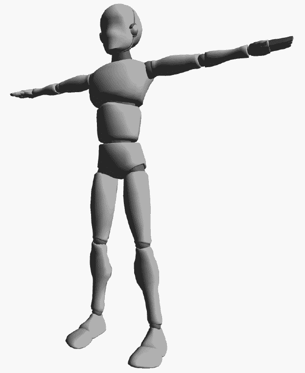
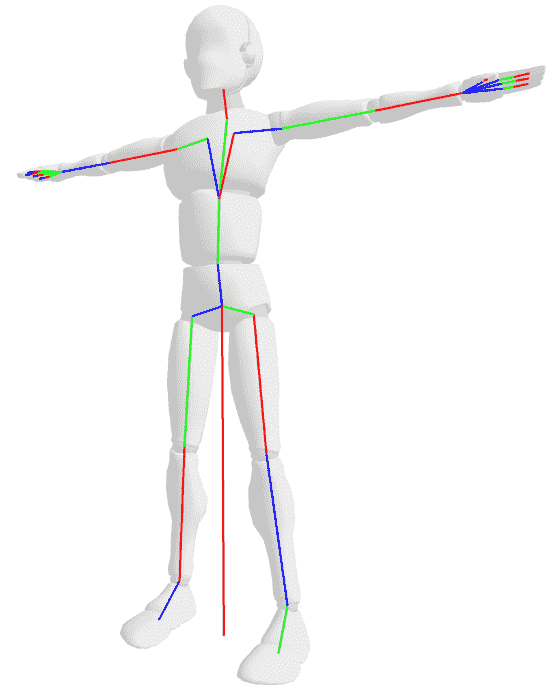
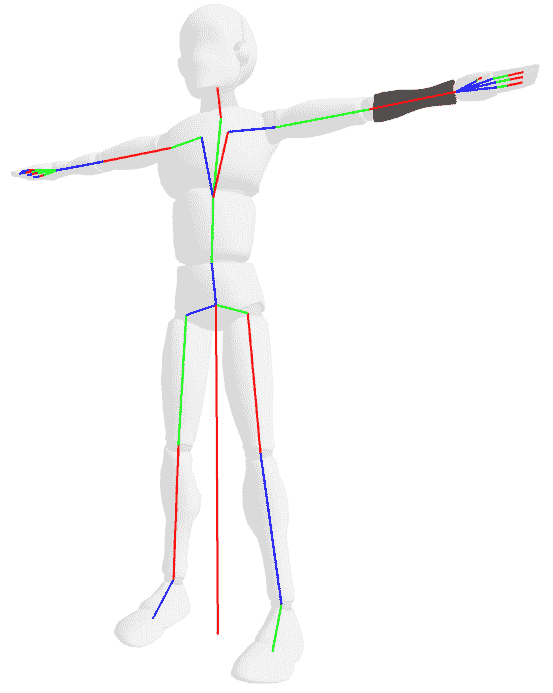
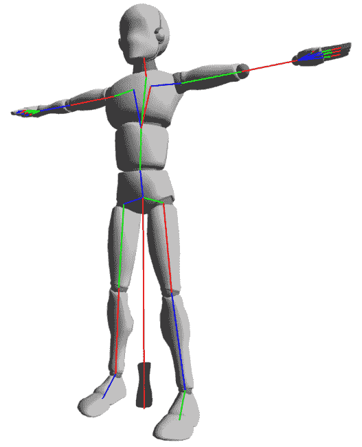
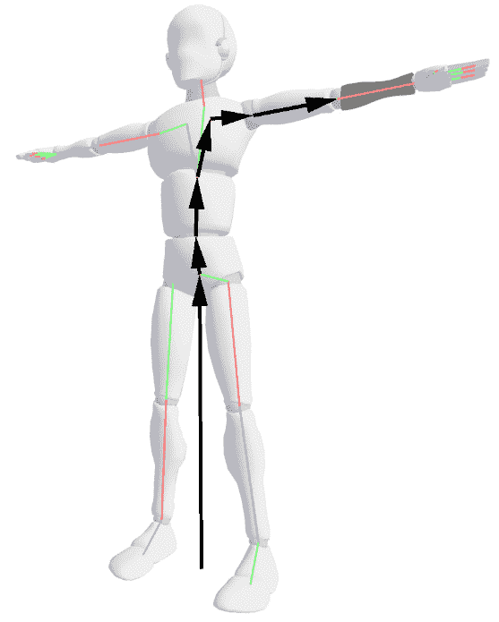
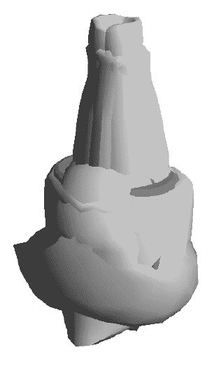
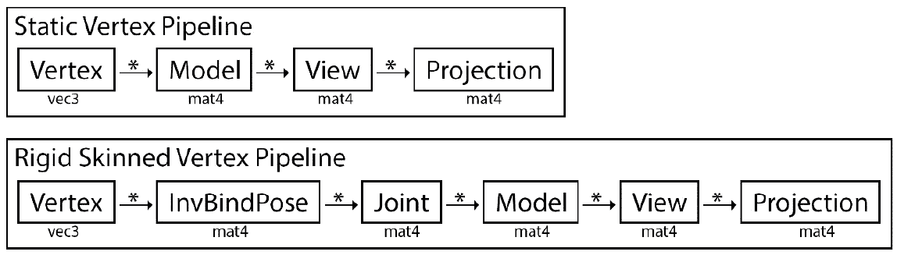
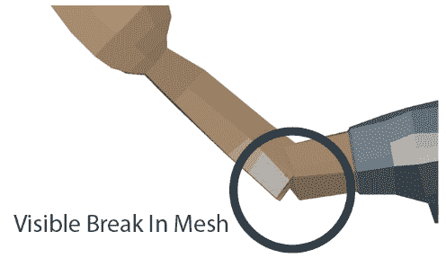
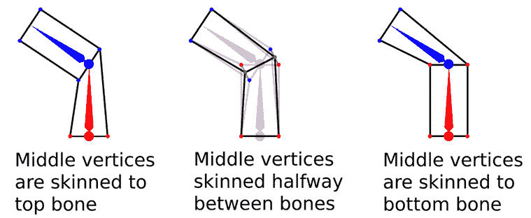

# *第十章*：网格皮肤

将网格变形以匹配动画姿势称为皮肤。为了实现皮肤，首先需要声明一个网格类。一旦声明了网格类，就可以使用着色器（GPU 皮肤）或仅使用 C++代码（CPU 皮肤）对其进行变形。本章涵盖了这两种皮肤方法。在本章结束时，您应该能够做到以下事情：

+   理解有皮肤的网格与无皮肤的网格有何不同

+   理解整个皮肤管道

+   实现骨架类

+   从 glTF 文件加载骨架的绑定姿势

+   实现一个有皮肤的网格类

+   从 glTF 文件加载有皮肤的网格

+   实现 CPU 皮肤

+   实现 GPU 皮肤

# 探索网格

一个网格由多个顶点组成。通常，每个顶点至少有一个位置、一个法线，也许还有一个纹理坐标。这是一个简单静态网格的顶点定义。这个定义有以下顶点组件：

+   位置（`vec3`）

+   法线（`vec3`）

+   纹理坐标（`vec2`）

重要信息：

本章中用于演示皮肤的模型是来自 GDQuest 的 Godot 模特。这是一个 MIT 许可的模型，您可以在 GitHub 上找到它[a t https://github.com/GDQuest/godot-3d-mannequ](https://github.com/GDQuest/godot-3d-mannequin)in。

当一个网格被建模时，它是在特定的姿势中建模的。对于角色来说，这通常是*T*形或*A*形。建模的网格是静态的。下图显示了 Godot 模特的*T*形姿势：



图 10.1：Godot 模特的 T 形姿势

当一个网格被建模时，骨架被创建在网格中。网格中的每个顶点都分配给骨架的一个或多个骨骼。这个过程称为装配。骨架是在适合网格内的姿势中创建的；这是模型的**绑定姿势**。



图 10.2：可视化网格和骨架的绑定姿势

绑定姿势和静止姿势通常是相同的，但并非总是如此。在本书中，我们将把这两者视为不同的姿势。前面的图显示了骨架的绑定姿势渲染在角色网格的顶部。在下一节中，您将探索如何对这样的网格进行皮肤处理。

# 理解皮肤

皮肤是指定哪个顶点应该由哪个骨骼变形的过程。一个顶点可以受到多个骨骼的影响。刚性皮肤是指将每个顶点与一个骨骼关联。平滑皮肤将顶点与多个骨骼关联。

通常，顶点到骨骼的映射是按顶点进行的。这意味着每个顶点都知道它属于哪些骨骼。一些文件格式以相反的方式存储这种关系，其中每个骨骼包含它影响的顶点列表。这两种方法都是有效的；在本书的其余部分，映射是按顶点进行的。

为了（刚性）皮肤一个网格，将每个顶点分配给一个骨骼。要在代码中为顶点分配关节，需要为每个顶点添加一个新属性。这个属性只是一个保存着变形顶点的骨骼索引的整数。在下图中，所有应该分配给左下臂骨骼的三角形都比网格的其余部分颜色更深：



图 10.3：隔离下臂

让我们花点时间更详细地审查一下顶点变换管道。在这里，引入了**空间**的概念。空间指的是通过矩阵对顶点进行变换。例如，如果有一个投影矩阵，它会将一个顶点变换为 NDC 空间。顶点变换管道如下：

+   当一个网格被创建时，它的所有顶点都处于所谓的模型空间中。

+   模型空间顶点乘以模型矩阵，将其放入世界空间中。

+   世界空间顶点乘以视图矩阵，将其放入相机空间。

+   相机空间顶点乘以投影矩阵，将其移动到 NDC 空间。

要对网格进行蒙皮，需要在顶点变换流程中添加一个新的蒙皮步骤。蒙皮步骤将顶点从皮肤空间移动到模型空间。这意味着新步骤在变换流程中位于任何其他步骤之前。

如果将皮肤空间顶点乘以当前动画姿势，则可以将其移回模型空间。这个转换在本章的*实现 CPU 蒙皮*部分中有详细介绍。一旦顶点回到模型空间，它应该已经被动画化。动画姿势矩阵转换实际上进行了动画。动画化顶点转换流程如下：

+   加载一个网格，所有顶点都在模型空间中。

+   模型空间顶点乘以皮肤矩阵，将其移动到皮肤空间。

+   皮肤空间顶点乘以姿势矩阵，将其移回模型空间。

+   模型空间顶点乘以模型矩阵，将其放入世界空间。

+   世界空间顶点乘以视图矩阵，将其放入相机空间。

+   相机空间顶点乘以投影矩阵，将其移动到 NDC 空间。

要对网格进行蒙皮，需要将每个顶点转换为皮肤空间。当皮肤空间中的顶点通过其所属关节的世界变换进行变换时，假设使用的姿势是绑定姿势，顶点应该最终位于模型空间中。

在接下来的部分中，您将通过实际示例探索蒙皮流程。

## 探索刚性蒙皮

要对网格进行蒙皮，需要将每个顶点乘以其所属关节的逆绑定姿势变换。要找到关节的逆绑定姿势变换，需要找到关节的世界变换，然后对其求逆。当矩阵（或变换）乘以其逆时，结果总是单位矩阵。

将皮肤空间网格的顶点乘以绑定姿势中关节的世界空间变换可以撤消原始的逆绑定姿势乘法，`逆绑定姿势 * 绑定姿势 = 单位矩阵`。然而，乘以不同的姿势会导致顶点相对于绑定姿势的偏移。

让我们看看顶点如何在皮肤空间中移动。例如，将 Godot 模特前臂中的所有顶点乘以前臂骨骼的逆绑定姿势，只将前臂三角形放入皮肤空间。这使得网格看起来如下图所示：



图 10.4：逆绑定姿势转换的下臂网格

要将顶点从皮肤空间转换回模型空间，需要依次应用姿势中每个骨骼的变换，直到达到目标骨骼。下图演示了从根骨骼到前臂骨骼需要进行的六个步骤：



图 10.5：可视化到下臂的变换链

在代码中，可以使用矩阵乘法累积需要进行的所有变换。或者，如果使用`Transform`结构，可以使用 combine 方法。将顶点移回模型空间只需使用累积的矩阵或变换一次。

通过将每个顶点乘以其所属关节的逆绑定姿势来将网格转换为皮肤空间。如何获得骨骼的逆绑定姿势矩阵？使用绑定姿势，找到骨骼的世界变换，将其转换为矩阵，然后求逆矩阵。

下图显示了 Godot 模型在皮肤空间中的情况。看到这样的网格表明了蒙皮管道中的错误。出现这种网格的最常见原因是逆绑定姿势和动画姿势的乘法顺序出现错误：



图 10.6：整个网格乘以逆绑定姿势

到目前为止讨论的蒙皮实现称为刚性蒙皮。使用刚性蒙皮时，每个顶点只受一个骨骼的影响。在接下来的部分中，您将开始探索平滑蒙皮，通过将多个骨骼的影响分配给单个顶点来使蒙皮网格看起来更好。

## 刚性蒙皮管道

让我们探索每个顶点必须经历的管道。下图显示了静态网格与刚性蒙皮网格的变换管道。以下图中的步骤顺序从左到右，沿着箭头进行：



图 10.7：顶点蒙皮管道

在前面的图中显示的**刚性蒙皮顶点管道**的工作方式如下：

+   通过将顶点乘以其所分配的关节的逆绑定姿势矩阵将其移动到皮肤空间中。

+   将蒙皮顶点乘以动画关节的世界矩阵。这将导致顶点再次处于本地空间，但它会被变形到动画姿势。

+   一旦顶点处于动画本地位置，就将其通过正常的模型视图投影变换。

+   探索平滑蒙皮

刚性蒙皮的问题在于弯曲关节。由于每个顶点属于一个骨骼，因此在肘部等关节处的顶点不会自然弯曲。在肘部等关节处的网格断裂可以通过将三角形的不同顶点分配给不同的骨骼来避免。由此产生的网格无法很好地保持其体积，并且看起来很尴尬。

刚性蒙皮并不是免费的；它为每个顶点引入了额外的矩阵乘法。这可以优化为只有一个额外的乘法，这将在下一章中介绍。在接下来的部分中，您将探索平滑蒙皮。

## 探索平滑蒙皮

刚性蒙皮的主要问题是它可能在网格中产生视觉断裂，如下图所示。即使这些伪影得到了解决，平滑蒙皮时可弯曲关节周围的变形看起来也不好：



图 10.8：刚性蒙皮的可见伪影

平滑蒙皮比刚性蒙皮具有更少的伪影，并且能更好地保持其体积。平滑蒙皮的理念是一个顶点可以受到多个骨骼的影响。每个影响还有一个权重。权重用于将蒙皮顶点混合成一个组合的最终顶点。所有权重必须加起来等于 1。

将顶点视为在网格上进行多次蒙皮并混合结果。一个骨骼可以有多少影响在这里有很大的影响。一般来说，超过四根骨骼后，每根额外的骨骼的影响就不可见了。这很方便，因为它可以让您使用`ivec4`和`vec4`结构向顶点添加影响和权重。

下图显示了一个网格，其中中间顶点附在左侧的顶部骨骼和右侧的底部骨骼上。这是需要混合的两个蒙皮位置。如果每个姿势的权重为`0.5`，最终插值顶点位置将在两个顶点之间。这在下图的中间图中显示：



图 10.9：将多个关节分配给一个顶点

在顶点上平均关节影响被称为平滑蒙皮，或线性混合蒙皮（LBS）。它有一些缺陷，但这是皮肤角色的标准方式。目前，LBS 是实现蒙皮动画最流行的方式。

在添加对平滑蒙皮的支持后，最终的顶点结构现在如下所示：

+   位置（`vec3`）

+   法线（`vec3`）

+   纹理坐标（`vec2`）

+   关节影响（`ivec4`）

+   影响权重（`vec4`）

重要信息

glTF 支持将蒙皮网格附加到任意节点，并且这些节点可以进行动画。这增加了计算蒙皮矩阵的额外步骤。为了避免这一额外步骤，我们将忽略网格中心点，并假设所有网格节点的全局变换都在原点。只要假定单个 glTF 文件只包含一个蒙皮网格，这就是一个安全的假设。

平滑蒙皮目前是游戏动画中使用的标准形式。大多数游戏每个顶点使用四个骨骼，并且与本章中将要实现的方式类似。在接下来的部分，你将实现一个`Skeleton`类来帮助跟踪皮肤网格所需的一些不同数据。

# 实现骨骼

在对模型进行动画时，有几件事情需要跟踪，比如动画姿势或逆绑定姿势。骨骼的概念是将在动画模型之间共享的数据组合成一个单一的结构。

角色的绑定姿势和逆绑定姿势在所有角色实例之间共享。也就是说，如果屏幕上有 15 个角色，它们每个都有一个独特的动画姿势，但它们都共享相同的静止姿势、绑定姿势、逆绑定姿势和关节名称。

在接下来的部分，你将实现一个新的类——`Skeleton`类。这个`Skeleton`类包含两个动画网格可能需要的所有共享数据。它还跟踪静止姿势、绑定姿势、逆绑定姿势和关节名称。一些引擎将骨骼称为骨架或绑定。

## 骨骼类声明

`Skeleton`类包含角色的静止姿势和绑定姿势，角色的每个关节的名称，以及最重要的逆绑定姿势。由于逆绑定姿势涉及矩阵求逆，因此应该只计算一次。按照以下步骤声明新的`Skeleton`类：

1.  创建一个新文件`Skeleton.h`。在这个文件中声明`Skeleton`类。在`Skeleton`类中添加当前动画模型的静止姿势、绑定姿势、逆绑定姿势和关节名称。逆绑定姿势应该实现为一个矩阵的向量：

```cpp
    class Skeleton {
    protected:
        Pose mRestPose;
        Pose mBindPose;
        std::vector<mat4> mInvBindPose;
        std::vector<std::string> mJointNames;
    ```

1.  添加一个辅助函数`UpdateInverseBindPose`。这个函数在设置绑定姿势时更新逆绑定姿势矩阵：

```cpp
    protected:
        void UpdateInverseBindPose();
    ```

1.  声明一个默认构造函数和一个便利构造函数。还要声明方法来设置骨骼的静止姿势、绑定姿势和关节名称，以及辅助函数来检索骨骼的所有变量的引用：

```cpp
    public:
        Skeleton();
        Skeleton(const Pose& rest, const Pose& bind, 
                 const std::vector<std::string>& names);
        void Set(const Pose& rest, const Pose& bind, 
                 const std::vector<std::string>& names);
        Pose& GetBindPose();
        Pose& GetRestPose();
        std::vector<mat4>& GetInvBindPose();
        std::vector<std::string>& GetJointNames();
        std::string& GetJointName(unsigned int index);
    }; // End Skeleton class
    ```

将`Skeleton`类视为一个辅助类——它将绑定姿势、逆绑定姿势、静止姿势和关节名称放入一个易于管理的对象中。骨骼是共享的；你可以有许多角色，每个角色都有一个独特的动画姿势，但它们都可以共享相同的骨骼。在接下来的部分，你将实现`Skeleton`类。

## 骨骼类的实现

逆绑定姿势存储在骨骼中作为矩阵数组。每当骨骼的绑定姿势更新时，逆绑定姿势也应该重新计算。要找到逆绑定姿势，找到骨骼中每个关节的世界空间矩阵，然后求逆世界空间关节矩阵。创建一个新文件`Skeleton.cpp`。然后，实现骨骼构造函数。采取以下步骤来实现：

1.  创建两个构造函数——默认构造函数不执行任何操作。另一个便利构造函数接受一个静止姿势、一个绑定姿势和关节名称。它调用`Set`方法：

```cpp
    Skeleton::Skeleton() { }
    Skeleton::Skeleton(const Pose& rest, const Pose& bind,
                    const std::vector<std::string>& names) {
        Set(rest, bind, names);
    }
    ```

1.  创建`Set`方法，应该设置骨骼的内部姿势、绑定姿势和关节名称。一旦绑定姿势设置好，调用`UpdateInverseBindPose`函数来填充逆绑定姿势矩阵调色板：

```cpp
    void Skeleton::Set(const Pose& rest, const Pose& bind, 
                     const std::vector<std::string>& names) {
        mRestPose = rest;
        mBindPose = bind;
        mJointNames = names;
        UpdateInverseBindPose();
    }
    ```

1.  接下来实现`UpdateInverseBindPose`函数。确保矩阵向量的大小正确，然后循环遍历绑定姿势中的所有关节。获取每个关节的世界空间变换，将其转换为矩阵，并对矩阵进行反转。这个反转的矩阵就是关节的逆绑定姿势矩阵：

```cpp
    void Skeleton::UpdateInverseBindPose() {
      unsigned int size = mBindPose.Size();
      mInvBindPose.resize(size);
      for (unsigned int i = 0; i < size; ++i) {
        Transform world = mBindPose.GetGlobalTransform(i);
        mInvBindPose[i] = inverse(transformToMat4(world));
      }
    }
    ```

1.  在`Skeleton`类中实现简单的 getter 和 setter 函数：

```cpp
    Pose& Skeleton::GetBindPose() {
        return mBindPose;
    }
    Pose& Skeleton::GetRestPose() {
        return mRestPose;
    }
    std::vector<mat4>& Skeleton::GetInvBindPose() {
        return mInvBindPose;
    }
    std::vector<std::string>& Skeleton::GetJointNames() {
        return mJointNames;
    }
    std::string& Skeleton::GetJointName(unsigned int idx) {
        return mJointNames[idx];
    }
    ```

通过提供显式的 getter 函数来避免返回引用是可能的，比如`Transform GetBindPoseTransform(unsigned int index)`。在你学习如何优化动画数据的下一章之后再这样做更有意义。现在，能够访问这些引用并且不修改它们更有价值。

生成逆绑定姿势矩阵时，你不必将变换转换为矩阵然后再反转它；你可以反转变换然后将其转换为矩阵。两者之间的性能差异是微不足道的。

`Skeleton`类跟踪动画模型的绑定姿势、逆绑定姿势和关节名称。这些数据可以在模型的所有动画实例之间共享。在下一节中，你将实现从 glTF 文件加载绑定姿势。glTF 格式不存储实际的绑定姿势。

# glTF - 加载绑定姿势

现在你已经准备好从 glTF 文件中加载绑定姿势了，但是有一个问题。glTF 文件不存储绑定姿势。相反，对于 glTF 文件包含的每个蒙皮，它存储一个矩阵数组，其中包含影响蒙皮的每个关节的逆绑定姿势矩阵。

像这样存储逆绑定姿势矩阵对于优化是有好处的，这在下一章中会更有意义，但现在我们必须处理这个问题。那么，如何获取绑定姿势呢？

获取绑定姿势，加载休息姿势并将休息姿势中的每个变换转换为世界空间变换。这样可以确保如果皮肤没有为关节提供逆绑定姿势矩阵，就可以使用一个良好的默认值。

接下来，循环遍历`.gltf`文件中的每个蒙皮网格。对于每个蒙皮网格，反转每个关节的逆绑定姿势矩阵。反转逆绑定姿势矩阵会得到绑定姿势矩阵。将绑定姿势矩阵转换为可以在绑定姿势中使用的变换。

这样做是有效的，但是所有关节变换都是在世界空间中。你需要将每个关节转换为相对于其父级的位置。按照以下步骤实现`GLTFLoader.cpp`中的`LoadBindPose`函数：

1.  通过构建一个变换向量来开始实现`LoadBindPose`函数。用休息姿势中每个关节的全局变换填充变换向量：

```cpp
    Pose LoadBindPose(cgltf_data* data) {
        Pose restPose = LoadRestPose(data);
        unsigned int numBones = restPose.Size();
        std::vector<Transform> worldBindPose(numBones);
        for (unsigned int i = 0; i < numBones; ++i) {
          worldBindPose[i] = restPose.GetGlobalTransform(i);
        }
    ```

1.  循环遍历 glTF 文件中的每个蒙皮网格。将`inverse_bind_matrices`访问器读入一个大的浮点值向量中。该向量需要包含`contain numJoints * 16`个元素，因为每个矩阵都是一个 4x4 矩阵：

```cpp
        unsigned int numSkins = data->skins_count;
        for (unsigned int i = 0; i < numSkins; ++i) {
            cgltf_skin* skin = &(data->skins[i]);
            std::vector<float> invBindAccessor;
            GLTFHelpers::GetScalarValues(invBindAccessor, 
                         16, *skin->inverse_bind_matrices);
    ```

1.  对于蒙皮中的每个关节，获取逆绑定矩阵。反转逆绑定姿势矩阵以获得绑定姿势矩阵。将绑定姿势矩阵转换为变换。将这个世界空间变换存储在`worldBindPose`向量中：

```cpp
            unsigned int numJoints = skin->joints_count;
            for (int j = 0; j < numJoints; ++j) { 
                // Read the ivnerse bind matrix of the joint
                float* matrix = &(invBindAccessor[j * 16]);
                mat4 invBindMatrix = mat4(matrix);
                // invert, convert to transform
                mat4 bindMatrix = inverse(invBindMatrix);
                Transform bindTransform = 
                                mat4ToTransform(bindMatrix);
                // Set that transform in the worldBindPose.
                cgltf_node* jointNode = skin->joints[j];
                int jointIndex = GLTFHelpers::GetNodeIndex(
                           jointNode, data->nodes, numBones);
                worldBindPose[jointIndex] = bindTransform;
            } // end for each joint
        } // end for each skin
    ```

1.  将每个关节转换为相对于其父级的位置。将一个关节移动到另一个关节的空间中，即使它相对于另一个关节，将关节的世界变换与其父级的逆世界变换相结合：

```cpp
        //Convert the world bind pose to a regular bind pose
        Pose bindPose = restPose;
        for (unsigned int i = 0; i < numBones; ++i) {
            Transform current = worldBindPose[i];
            int p = bindPose.GetParent(i);
            if (p >= 0) { // Bring into parent space
                Transform parent = worldBindPose[p];
                current = combine(inverse(parent), current);
            }
            bindPose.SetLocalTransform(i, current);
        }
        return bindPose;
    } // End LoadBindPose function
    ```

重建绑定姿势并不理想，但这是 glTF 的一个怪癖，你必须处理它。通过使用休息姿势作为默认关节值，任何没有逆绑定姿势矩阵的关节仍然具有有效的默认方向和大小。

在本节中，您学习了如何从 glTF 文件中加载动画网格的初始姿势。在下一节中，您将创建一个方便的函数，通过一个函数调用从 glTF 文件中加载骨骼。

# glTF——加载骨骼

我们需要实现另一个加载函数——`LoadSkeleton`函数。这是一个方便的函数，可以在不调用三个单独函数的情况下加载骨架。

在`GLTFLoader.cpp`中实现`LoadSkeleton`函数。不要忘记将函数声明添加到`GLTFLoader.h`中。该函数通过调用现有的`LoadPose`、`LoadBindPose`和`LoadJointNames`函数返回一个新的骨骼：

```cpp
Skeleton LoadSkeleton(cgltf_data* data) {
    return Skeleton(
        LoadRestPose(data),
        LoadBindPose(data),
        LoadJointNames(data)
    );
}
```

`LoadSkeleton`函数只是一个辅助函数，允许您通过一个函数调用初始化骨骼。在下一节中，您将实现一个`Mesh`类，它将允许您显示动画网格。

# 实现网格

网格的定义取决于实现它的游戏（或引擎）。在本书的范围之外实现一个全面的网格类。相反，在本节中，您将声明一个简单版本的网格，它在 CPU 和 GPU 上存储一些数据，并提供一种将两者同步的方法。

## Mesh 类声明

网格的最基本实现是什么？每个顶点都有一个位置、一个法线和一些纹理坐标。为了对网格进行蒙皮，每个顶点还有四个可能影响它的骨骼和权重来确定每个骨骼对顶点的影响程度。网格通常使用索引数组，但这是可选的。

在本节中，您将同时实现 CPU 和 GPU 蒙皮。要在 CPU 上对网格进行蒙皮，您需要保留姿势和法线数据的额外副本，以及一个用于蒙皮的矩阵调色板。

创建一个新文件`Mesh.h`，声明`Mesh`类。按照以下步骤声明新的`Mesh`类：

1.  开始声明`Mesh`类。它应该在 CPU 和 GPU 上都维护网格数据的副本。存储位置、法线、纹理坐标、权重和影响力的向量来定义每个顶点。包括一个可选的索引向量：

```cpp
    class Mesh {
    protected:
        std::vector<vec3> mPosition;
        std::vector<vec3> mNormal;
        std::vector<vec2> mTexCoord;
        std::vector<vec4> mWeights;
        std::vector<ivec4> mInfluences;
        std::vector<unsigned int> mIndices;
    ```

1.  前面代码中列出的每个向量也需要设置适当的属性。为每个创建`Attribute`指针，以及一个索引缓冲区指针：

```cpp
    protected:
        Attribute<vec3>* mPosAttrib;
        Attribute<vec3>* mNormAttrib;
        Attribute<vec2>* mUvAttrib;
        Attribute<vec4>* mWeightAttrib;
        Attribute<ivec4>* mInfluenceAttrib;
        IndexBuffer* mIndexBuffer;
    ```

1.  添加一个额外的姿势和法线数据的副本，以及一个用于 CPU 蒙皮的矩阵调色板：

```cpp
    protected:
        std::vector<vec3> mSkinnedPosition;
        std::vector<vec3> mSkinnedNormal;
        std::vector<mat4> mPosePalette;
    ```

1.  为构造函数、拷贝构造函数和赋值运算符以及析构函数添加声明：

```cpp
    public:
        Mesh();
        Mesh(const Mesh&);
        Mesh& operator=(const Mesh&);
        ~Mesh();
    ```

1.  为网格包含的所有属性声明 getter 函数。这些函数返回向量引用。向量引用不是只读的；在加载网格时使用这些引用来填充网格数据：

```cpp
        std::vector<vec3>& GetPosition();
        std::vector<vec3>& GetNormal();
        std::vector<vec2>& GetTexCoord();
        std::vector<vec4>& GetWeights();
        std::vector<ivec4>& GetInfluences();
        std::vector<unsigned int>& GetIndices();
    ```

1.  声明`CPUSkin`函数，应用 CPU 网格蒙皮。要对网格进行蒙皮，您需要骨架和动画姿势。声明`UpdateOpenGLBuffers`函数，将持有数据的向量同步到 GPU：

```cpp
        void CPUSkin(Skeleton& skeleton, Pose& pose);
        void UpdateOpenGLBuffers();
        void Bind(int position, int normal, int texCoord, 
                  int weight, int influence);
    ```

1.  声明绑定、绘制和解绑网格的函数：

```cpp
        void Draw();
        void DrawInstanced(unsigned int numInstances);
        void UnBind(int position, int normal, int texCoord, 
                    int weight, int influence);
    };
    ```

这个`Mesh`类还不是生产就绪的，但它很容易使用，并且将在本书的其余部分中使用。在下一节中，您将开始实现`Mesh`类。

## Mesh 类实现

`Mesh`类包含相同数据的两个副本。它在 CPU 端使用向量保留所有顶点数据，并在 GPU 端使用顶点缓冲对象。这个类的预期用途是编辑 CPU 端的顶点，然后使用`UpdateOpenGLBuffers`函数将更改同步到 GPU。

创建一个新文件`Mesh.cpp`；您将在此文件中实现`Mesh`类。按照以下步骤实现`Mesh`类：

1.  实现默认构造函数，需要确保所有属性（和索引缓冲区）都被分配：

```cpp
    Mesh::Mesh() {
        mPosAttrib = new Attribute<vec3>();
        mNormAttrib = new Attribute<vec3>();
        mUvAttrib = new Attribute<vec2>();
        mWeightAttrib = new Attribute<vec4>();
        mInfluenceAttrib = new Attribute<ivec4>();
        mIndexBuffer = new IndexBuffer();
    }
    ```

1.  实现拷贝构造函数。以与构造函数相同的方式创建缓冲区，然后调用赋值运算符：

```cpp
    Mesh::Mesh(const Mesh& other) {
        mPosAttrib = new Attribute<vec3>();
        mNormAttrib = new Attribute<vec3>();
        mUvAttrib = new Attribute<vec2>();
        mWeightAttrib = new Attribute<vec4>();
        mInfluenceAttrib = new Attribute<ivec4>();
        mIndexBuffer = new IndexBuffer();
        *this = other;
    }
    ```

1.  实现赋值运算符，它将复制 CPU 端的成员（所有向量），然后调用`UpdateOpenGLBuffers`函数将属性数据上传到 GPU：

```cpp
    Mesh& Mesh::operator=(const Mesh& other) {
        if (this == &other) {
            return *this;
        }
        mPosition = other.mPosition;
        mNormal = other.mNormal;
        mTexCoord = other.mTexCoord;
        mWeights = other.mWeights;
        mInfluences = other.mInfluences;
        mIndices = other.mIndices;
        UpdateOpenGLBuffers();
        return *this;
    }
    ```

1.  实现析构函数，确保删除构造函数分配的所有数据：

```cpp
    Mesh::~Mesh() {
        delete mPosAttrib;
        delete mNormAttrib;
        delete mUvAttrib;
        delete mWeightAttrib;
        delete mInfluenceAttrib;
        delete mIndexBuffer;
    }
    ```

1.  实现`Mesh`获取函数。这些函数返回向量的引用。预期在返回后对这些引用进行编辑：

```cpp
    std::vector<vec3>& Mesh::GetPosition() {
        return mPosition;
    }
    std::vector<vec3>& Mesh::GetNormal() {
        return mNormal;
    }
    std::vector<vec2>& Mesh::GetTexCoord() {
        return mTexCoord;
    }
    std::vector<vec4>& Mesh::GetWeights() {
        return mWeights;
    }
    std::vector<ivec4>& Mesh::GetInfluences() {
        return mInfluences;
    }
    std::vector<unsigned int>& Mesh::GetIndices() {
        return mIndices;
    }
    ```

1.  通过在每个属性对象上调用`Set`函数来实现`UpdateOpenGLBuffers`函数。如果 CPU 端的向量之一的大小为`0`，则没有需要设置的内容：

```cpp
    void Mesh::UpdateOpenGLBuffers() {
        if (mPosition.size() > 0) {
            mPosAttrib->Set(mPosition);
        }
        if (mNormal.size() > 0) {
            mNormAttrib->Set(mNormal);
        }
        if (mTexCoord.size() > 0) {
            mUvAttrib->Set(mTexCoord);
        }
        if (mWeights.size() > 0) {
            mWeightAttrib->Set(mWeights);
        }
        if (mInfluences.size() > 0) {
            mInfluenceAttrib->Set(mInfluences);
        }
        if (mIndices.size() > 0) {
            mIndexBuffer->Set(mIndices);
        }
    }
    ```

1.  实现`Bind`函数。这需要绑定槽索引的整数。如果绑定槽有效（即为`0`或更大），则调用属性的`BindTo`函数：

```cpp
    void Mesh::Bind(int position, int normal, int texCoord, 
                    int weight, int influcence) {
        if (position >= 0) {
            mPosAttrib->BindTo(position);
        }
        if (normal >= 0) {
            mNormAttrib->BindTo(normal);
        }
        if (texCoord >= 0) {
            mUvAttrib->BindTo(texCoord);
        }
        if (weight >= 0) {
            mWeightAttrib->BindTo(weight);
        }
        if (influcence >= 0) {
            mInfluenceAttrib->BindTo(influcence);
        }
    }
    ```

1.  实现`Draw`和`DrawInstanced`函数，这些函数调用适当的全局`::Draw`和`::DrawInstanced`函数：

```cpp
    void Mesh::Draw() {
        if (mIndices.size() > 0) {
            ::Draw(*mIndexBuffer, DrawMode::Triangles);
        }
        else {
            ::Draw(mPosition.size(), DrawMode::Triangles);
        }
    }
    void Mesh::DrawInstanced(unsigned int numInstances) {
        if (mIndices.size() > 0) {
            ::DrawInstanced(*mIndexBuffer, 
              DrawMode::Triangles, numInstances);
        }
        else {
            ::DrawInstanced(mPosition.size(), 
              DrawMode::Triangles, numInstances);
        }
    }
    ```

1.  实现`UnBind`函数，该函数还接受整数绑定槽作为参数，但在属性对象上调用`UnBindFrom`：

```cpp
    void Mesh::UnBind(int position, int normal, int texCoord, 
                      int weight, int influence) {
        if (position >= 0) {
            mPosAttrib->UnBindFrom(position);
        }
        if (normal >= 0) {
            mNormAttrib->UnBindFrom(normal);
        }
        if (texCoord >= 0) {
            mUvAttrib->UnBindFrom(texCoord);
        }
        if (weight >= 0) {
            mWeightAttrib->UnBindFrom(weight);
        }
        if (influcence >= 0) {
            mInfluenceAttrib->UnBindFrom(influence);
        }
    }
    ```

`Mesh`类包含用于保存 CPU 数据的向量和用于将数据复制到 GPU 的属性。它提供了一个简单的接口来渲染整个网格。在接下来的部分中，您将学习如何实现 CPU 蒙皮以对网格进行动画处理。

### 实现 CPU 蒙皮

通过首先在 CPU 上实现蒙皮，而无需担心着色器，可以更容易地理解蒙皮。在本节中，您将创建一个 CPU 蒙皮参考实现。GPU 蒙皮将在本章后面介绍。

重要信息：

如果您正在开发的平台具有有限数量的统一寄存器或小的统一缓冲区，则 CPU 蒙皮非常有用。

在实现 CPU 蒙皮时，您需要保留动画网格的两个副本。`mPosition` 和 `mNormal` 向量不会改变。蒙皮后的位置和法线的结果存储在 `mSkinnedPosition` 和 `mSkinnedNormal` 中。然后将这些向量同步到位置和法线属性以进行绘制。

要对顶点进行蒙皮，您需要计算蒙皮变换。蒙皮变换需要通过逆绑定姿势对顶点进行变换，然后再通过当前的动画姿势进行变换。您可以通过在绑定姿势变换上调用逆函数，然后将其与姿势变换组合来实现这一点。

对于每个顶点，存储在`mInfluences`向量中的`ivec4`包含影响顶点的关节 ID。您需要通过所有四个关节对顶点进行变换，这意味着您需要对影响顶点的每个骨骼进行四次蒙皮。

并非每个关节对最终顶点的贡献都相同。对于每个顶点，存储在`mWeights`中的`vec4`包含一个从`0`到`1`的标量值。这些值用于混合蒙皮顶点。如果一个关节不影响顶点，则其权重为`0`，对最终蒙皮网格没有影响。

权重的内容预期被归一化，以便如果所有权重相加，它们等于`1`。这样，权重可以用于混合，因为它们总和为`1`。例如，(`0.5`, `0.5`, `0`, `0`) 是有效的，但 (`0.6`, `0.5`, `0`, `0`) 不是。

按照以下步骤实现 CPU 蒙皮：

1.  开始实现`CPUSkin`函数。确保蒙皮向量有足够的存储空间，并从骨骼获取绑定姿势。接下来，循环遍历每个顶点：

```cpp
    void Mesh::CPUSkin(Skeleton& skeleton, Pose& pose) {
        unsigned int numVerts = mPosition.size();
        if (numVerts == 0) { return;  }
        mSkinnedPosition.resize(numVerts);
        mSkinnedNormal.resize(numVerts);
        Pose& bindPose = skeleton.GetBindPose();
        for (unsigned int i = 0; i < numVerts; ++i) {
            ivec4& joint = mInfluences[i];
            vec4& weight = mWeights[i];
    ```

1.  计算蒙皮变换。对第一个顶点和法线影响进行变换：

```cpp
            Transform skin0 = combine(pose[joint.x], 
                              inverse(bindPose[joint.x]));
            vec3 p0 = transformPoint(skin0, mPosition[i]);
            vec3 n0 = transformVector(skin0, mNormal[i]);
    ```

1.  对可能影响当前顶点的其他三个关节重复此过程：

```cpp
            Transform skin1 = combine(pose[joint.y], 
                              inverse(bindPose[joint.y]));
            vec3 p1 = transformPoint(skin1, mPosition[i]);
            vec3 n1 = transformVector(skin1, mNormal[i]);

            Transform skin2 = combine(pose[joint.z], 
                              inverse(bindPose[joint.z]));
            vec3 p2 = transformPoint(skin2, mPosition[i]);
            vec3 n2 = transformVector(skin2, mNormal[i]);

            Transform skin3 = combine(pose[joint.w], 
                              inverse(bindPose[joint.w]));
            vec3 p3 = transformPoint(skin3, mPosition[i]);
            vec3 n3 = transformVector(skin3, mNormal[i]);
    ```

1.  到这一步，您已经对顶点进行了四次蒙皮——分别对每个影响它的骨骼进行一次。接下来，您需要将这些合并成最终的顶点。

1.  使用`mWeights`混合蒙皮位置和法线。将位置和法线属性设置为新更新的蒙皮位置和法线：

```cpp
            mSkinnedPosition[i] = p0 * weight.x + 
                                  p1 * weight.y + 
                                  p2 * weight.z + 
                                  p3 * weight.w;
            mSkinnedNormal[i] = n0 * weight.x + 
                                n1 * weight.y + 
                                n2 * weight.z + 
                                n3 * weight.w;
        }
        mPosAttrib->Set(mSkinnedPosition);
        mNormAttrib->Set(mSkinnedNormal);
    }
    ```

让我们解释一下这里发生了什么。这是基本的蒙皮算法。每个顶点都有一个名为权重的`vec4`值和一个名为影响的`ivec4`值。每个顶点有四个影响它的关节和四个权重。如果关节对顶点没有影响，权重可能是`0`。

`ivec4`的`x`、`y`、`z`和`w`分量影响动画姿势和逆绑定姿势矩阵数组中的索引。`vec4`的`x`、`y`、`z`和`w`分量是要应用于`ivec4`影响的相同分量的标量权重。

循环遍历所有顶点。对于每个顶点，通过影响该顶点的每个关节的蒙皮变换，变换顶点的位置和法线。蒙皮变换是逆绑定姿势和姿势变换的组合。这意味着你最终会对顶点进行四次蒙皮。按关节的权重缩放每个变换后的位置或法线，并将所有四个值相加。得到的总和就是蒙皮后的位置或法线。

这就是蒙皮算法；无论如何表达，它都是相同的。有几种表示关节变换的方式，比如使用`Transform`对象、矩阵和双四元数。无论表示是什么，算法都是一样的。在接下来的部分，你将学习如何使用矩阵而不是`Transform`对象来实现蒙皮算法。

### 使用矩阵进行蒙皮

对顶点进行蒙皮的常见方法是将矩阵线性混合成单个蒙皮矩阵，然后通过这个蒙皮矩阵变换顶点。为此，使用存储在骨骼中的逆绑定姿势，并从姿势中获取矩阵调色板。

要构建一个蒙皮矩阵，将姿势矩阵乘以逆绑定姿势。记住，顶点应该先被逆绑定姿势变换，然后是动画姿势。通过从右到左的乘法，这将把逆绑定姿势放在右侧。

对影响当前顶点的每个关节的矩阵进行相乘，然后按顶点的权重对结果矩阵进行缩放。一旦所有矩阵都被缩放，将它们相加。得到的矩阵就是可以用来变换顶点位置和法线的蒙皮矩阵。

以下代码重新实现了使用矩阵调色板蒙皮的`CPUSkin`函数。这段代码与你需要实现的在 GPU 上运行蒙皮的着色器代码非常相似：

```cpp
void Mesh::CPUSkin(Skeleton& skeleton, Pose& pose) {
    unsigned int numVerts = (unsigned int)mPosition.size();
    if (numVerts == 0) { return; }
    mSkinnedPosition.resize(numVerts);
    mSkinnedNormal.resize(numVerts);
    pose.GetMatrixPalette(mPosePalette);
    vector<mat4> invPosePalette = skeleton.GetInvBindPose();
    for (unsigned int i = 0; i < numVerts; ++i) {
        ivec4& j = mInfluences[i];
        vec4& w = mWeights[i];
        mat4 m0=(mPosePalette[j.x]*invPosePalette[j.x])*w.x;
        mat4 m1=(mPosePalette[j.y]*invPosePalette[j.y])*w.y;
        mat4 m2=(mPosePalette[j.z]*invPosePalette[j.z])*w.z;
        mat4 m3=(mPosePalette[j.w]*invPosePalette[j.w])*w.w;
        mat4 skin = m0 + m1 + m2 + m3;
        mSkinnedPosition[i]=transformPoint(skin,mPosition[i]);
        mSkinnedNormal[i] = transformVector(skin, mNormal[i]);
    }
    mPosAttrib->Set(mSkinnedPosition);
    mNormAttrib->Set(mSkinnedNormal);
}
```

使用矩阵进行蒙皮的代码看起来有点不同，但蒙皮算法仍然是相同的。不再是对每个顶点进行四次变换并缩放结果，而是对矩阵进行缩放并相加。结果是一个单一的蒙皮矩阵。

即使顶点只被变换一次，也引入了四次新的矩阵乘法。所需操作的数量大致相同，那么为什么要实现矩阵调色板蒙皮？当你实现 GPU 蒙皮时，使用 GLSL 的内置矩阵就很容易了。

在这一部分，你实现了一个`Mesh`类。Mesh 类使用以下顶点格式：

+   位置（`vec3`）

+   普通（`vec3`）

+   纹理坐标（`vec2`）

+   影响（`ivec4`）

+   权重（`vec4`）

有了这个定义，你可以渲染一个蒙皮网格。在接下来的部分，你将学习如何从 glTF 文件中加载网格。

# glTF - 加载网格

现在你有了一个功能性的`Mesh`类，理论上，你可以在 CPU 上对网格进行蒙皮。然而，有一个问题——你实际上还不能从 glTF 文件中加载网格。让我们接下来解决这个问题。

首先创建一个新的辅助函数`MeshFromAttributes`。这只是一个辅助函数，所以不需要将其暴露给头文件。glTF 将网格存储为一组基元，每个基元都是一组属性。这些属性包含与我们的属性类相同的信息，如位置、法线、权重等。

`MeshFromAttribute`辅助函数接受一个网格和一个`cgltf_attribute`函数，以及解析所需的一些附加数据。该属性包含我们网格组件之一，例如位置、法线、UV 坐标、权重或影响。此属性提供适当的网格数据。

所有值都以浮点数形式读取，但影响顶点的关节影响以整数形式存储。不要直接将浮点数转换为整数；由于精度问题，转换可能会返回错误的数字。相反，通过加上 0.5 然后进行转换，将浮点数转换为整数。这样，整数截断总是将其带到正确的数字。

gLTF 将影响关节的索引存储为相对于正在解析的皮肤的关节数组，而不是节点层次结构。而“关节”数组又是指向节点的指针。您可以使用此节点指针，并使用`GetNodeIndex`函数将其转换为节点层次结构中的索引。

按照以下步骤从 glTF 文件中实现网格加载：

1.  在`GLTFHelpers`命名空间中实现`MeshFromAttribute`函数。通过确定当前组件具有多少属性来开始实现：

```cpp
    // In the GLTFHelpers namespace
    void GLTFHelpers::MeshFromAttribute(Mesh& outMesh, 
                      cgltf_attribute& attribute, 
                      cgltf_skin* skin, cgltf_node* nodes, 
                      unsigned int nodeCount) {
        cgltf_attribute_type attribType = attribute.type;
        cgltf_accessor& accessor = *attribute.data;
        unsigned int componentCount = 0;
        if (accessor.type == cgltf_type_vec2) {
            componentCount = 2;
        }
        else if (accessor.type == cgltf_type_vec3) {
            componentCount = 3;
        }
        else if (accessor.type == cgltf_type_vec4) {
            componentCount = 4;
        }
    ```

1.  使用`GetScalarValues`辅助函数从提供的访问器中解析数据。创建对网格的位置、法线、纹理坐标、影响和权重向量的引用；`MeshFromAttribute`函数将写入这些引用：

```cpp
        std::vector<float> values;
        GetScalarValues(values, componentCount, accessor);
        unsigned int acessorCount = accessor.count;
        std::vector<vec3>& positions = outMesh.GetPosition();
        std::vector<vec3>& normals = outMesh.GetNormal();
        std::vector<vec2>& texCoords = outMesh.GetTexCoord();
        std::vector<ivec4>& influences = 
                                 outMesh.GetInfluences();
        std::vector<vec4>& weights = outMesh.GetWeights();
    ```

1.  循环遍历当前访问器中的所有值，并根据访问器类型将它们分配到适当的向量中。通过从值向量中读取数据并直接将其分配到网格中的适当向量中，可以找到位置、纹理坐标和权重分量：

```cpp
        for (unsigned int i = 0; i < acessorCount; ++i) {
            int index = i * componentCount;
            switch (attribType) {
            case cgltf_attribute_type_position:
                positions.push_back(vec3(values[index + 0], 
                                        values[index + 1],
                                        values[index + 2]));
                break;
            case cgltf_attribute_type_texcoord:
                texCoords.push_back(vec2(values[index + 0], 
                                        values[index + 1]));
                break;
            case cgltf_attribute_type_weights:
                weights.push_back(vec4(values[index + 0], 
                                       values[index + 1], 
                                       values[index + 2], 
                                       values[index + 3]));
                break;
    ```

1.  在读取法线后，检查其平方长度。如果法线无效，则返回有效向量并考虑记录错误。如果法线有效，则在将其推入法线向量之前对其进行归一化：

```cpp
            case cgltf_attribute_type_normal:
            {
                vec3 normal = vec3(values[index + 0], 
                                   values[index + 1], 
                                   values[index + 2]);
                if (lenSq(normal) < 0.000001f) {
                    normal = vec3(0, 1, 0);
                }
                normals.push_back(normalized(normal));
            }
            break;
    ```

1.  读取影响当前顶点的关节。这些关节存储为浮点数。将它们转换为整数：

```cpp
            case cgltf_attribute_type_joints:
            {
                // These indices are skin relative.  This 
                // function has no information about the
                // skin that is being parsed. Add +0.5f to 
                // round, since we can't read integers
                ivec4 joints(
                    (int)(values[index + 0] + 0.5f),
                    (int)(values[index + 1] + 0.5f),
                    (int)(values[index + 2] + 0.5f),
                    (int)(values[index + 3] + 0.5f)
                );
    ```

1.  使用`GetNodeIndex`辅助函数将关节索引转换，使其从相对于“关节”数组变为相对于骨骼层次结构：

```cpp
                    joints.x = GetNodeIndex(
                               skin->joints[joints.x], 
                               nodes, nodeCount);
                    joints.y = GetNodeIndex(
                               skin->joints[joints.y], 
                               nodes, nodeCount);
                    joints.z = GetNodeIndex(
                               skin->joints[joints.z], 
                               nodes, nodeCount);
                    joints.w = GetNodeIndex(
                               skin->joints[joints.w], 
                               nodes, nodeCount);
    ```

1.  确保即使无效节点也具有`0`的值。任何负关节索引都会破坏蒙皮实现：

```cpp
                    joints.x = std::max(0, joints.x);
                    joints.y = std::max(0, joints.y);
                    joints.z = std::max(0, joints.z);
                    joints.w = std::max(0, joints.w);
                influences.push_back(joints);
            }
            break;
            }
        }
    }// End of MeshFromAttribute function
    ```

gLTF 中的**网格**由**原始**组成。原始包含诸如位置和法线之类的属性。自从迄今为止创建的框架中没有子网格的概念，因此 glTF 中的每个原始都表示为网格。

现在`MeshFromAttribute`函数已完成，接下来实现`LoadMeshes`函数。这是用于加载实际网格数据的函数；它需要在`GLTFLoader.h`中声明，并在`GLTFLoader.cpp`中实现。按照以下步骤实现`LoadMeshes`函数：

1.  要实现`LoadMeshes`函数，首先循环遍历 glTF 文件中的所有节点。只处理具有网格和皮肤的节点；应跳过任何其他节点：

```cpp
    std::vector<Mesh> LoadMeshes(cgltf_data* data) {
        std::vector<Mesh> result;
        cgltf_node* nodes = data->nodes;
        unsigned int nodeCount = data->nodes_count;
        for (unsigned int i = 0; i < nodeCount; ++i) {
            cgltf_node* node = &nodes[i];
            if (node->mesh == 0 || node->skin == 0) {
                continue;
            }
    ```

1.  循环遍历 glTF 文件中的所有原始。为每个原始创建一个新网格。通过调用`MeshFromAttribute`辅助函数循环遍历原始中的所有属性，并通过调用`MeshFromAttribute`辅助函数填充网格数据：

```cpp
            int numPrims = node->mesh->primitives_count;
            for (int j = 0; j < numPrims; ++j) {
                result.push_back(Mesh());
                Mesh& mesh = result[result.size() - 1];
                cgltf_primitive* primitive = 
                           &node->mesh->primitives[j];
                unsigned int ac=primitive->attributes_count;
                for (unsigned int k = 0; k < ac; ++k) {
                    cgltf_attribute* attribute = 
                             &primitive->attributes[k];
                    GLTFHelpers::MeshFromAttribute(mesh,
                               *attribute, node->skin, 
                               nodes, nodeCount);
                }
    ```

1.  检查原始是否包含索引。如果是，网格的索引缓冲区也需要填充：

```cpp
                if (primitive->indices != 0) {
                    int ic = primitive->indices->count;
                    std::vector<unsigned int>& indices = 
                                       mesh.GetIndices();
                    indices.resize(ic);
                    for (unsigned int k = 0; k < ic; ++k) {
                       indices[k]=cgltf_accessor_read_index(
                                  primitive->indices, k);
                    }
                }
    ```

1.  网格已完成。调用`UpdateOpenGLBuffers`函数以确保网格可以呈现，并返回结果网格的向量：

```cpp
                mesh.UpdateOpenGLBuffers();
            }
        }
        return result;
    } // End of the LoadMeshes function
    ```

由于 glTF 存储整个场景，而不仅仅是一个网格，它支持多个网格——每个网格由原语组成，原语是实际的三角形。在 glTF 中，原语可以被视为子网格。这里介绍的 glTF 加载器假设一个文件只包含一个模型。在下一节中，您将学习如何使用着色器将网格蒙皮从 CPU 移动到 GPU。

# 实现 GPU 蒙皮

您在*第六章*中创建了一些基本的着色器，*构建抽象渲染器和 OpenGL*——`static.vert`着色器和`lit.frag`着色器。`static.vert`着色器可用于显示静态的、未经蒙皮的网格，该网格是使用`LoadMeshes`函数加载的。`static.vert`着色器甚至可以显示 CPU 蒙皮网格。

创建一个新文件，`skinned.vert`。按照以下步骤实现一个可以执行矩阵调色板蒙皮的顶点着色器。代码与用于`static.vert`的代码非常相似；不同之处已经突出显示：

1.  每个顶点都会得到两个新的分量——影响顶点的关节索引和每个关节的权重。这些新的分量可以存储在`ivec4`和`vec4`中：

```cpp
    #version 330 core
    uniform mat4 model;
    uniform mat4 view;
    uniform mat4 projection;
    in vec3 position;
    in vec3 normal;
    in vec2 texCoord;
    in vec4 weights;
    in ivec4 joints;
    ```

1.  接下来，在着色器中添加两个矩阵数组——每个数组的长度为`120`。这个长度是任意的；着色器只需要与蒙皮网格的关节数量一样多的新统一矩阵。您可以通过在代码中每次加载具有新骨骼数量的骨架时生成新的着色器字符串来自动配置这一点：

```cpp
    uniform mat4 pose[120];
    uniform mat4 invBindPose[120];
    out vec3 norm;
    out vec3 fragPos;
    out vec2 uv;
    ```

1.  当着色器的主函数运行时，计算一个蒙皮矩阵。蒙皮矩阵的生成方式与 CPU 蒙皮示例的蒙皮矩阵相同。它使用相同的逻辑，只是在 GPU 上执行的着色器中：

```cpp
    void main() {
    mat4 skin =(pose[joints.x]* invBindPose[joints.x]) 
                      * weights.x;
    skin+=(pose[joints.y] * invBindPose[joints.y]) 
                      * weights.y;
             skin+=(pose[joints.z] * invBindPose[joints.z])
                      * weights.z;
    skin+=(pose[joints.w] * invBindPose[joints.w]) 
                      * weights.w;
    ```

1.  网格在放置在世界之前应该发生变形。在应用模型矩阵之前，将顶点位置和法线乘以蒙皮矩阵。所有相关的代码都在这里突出显示：

```cpp
        gl_Position= projection * view * model * 
                     skin * vec4(position,1.0);

        fragPos = vec3(model * skin * vec4(position, 1.0));
        norm = vec3(model * skin * vec4(normal, 0.0f));
        uv = texCoord;
    }
    ```

要将蒙皮支持添加到顶点着色器中，您需要为每个顶点添加两个新属性，表示最多四个可以影响顶点的关节。通过使用关节和权重属性，构建一个蒙皮矩阵。要对网格进行蒙皮，需要在应用顶点变换管线的其余部分之前，将顶点或法线乘以蒙皮矩阵。

# 摘要

在本章中，您学习了绑定姿势和静止姿势之间的区别。您还创建了一个包含它们两者的`Skeleton`类。您了解了蒙皮的一般概念——刚性（每个顶点一个骨骼）和平滑（每个顶点多个骨骼）蒙皮。

在本章中，我们实现了一个基本的原始网格类，并介绍了在 CPU 和 GPU 上对网格进行蒙皮的过程，以及从不存储绑定姿势数据的 glTF 文件中加载绑定姿势。

您现在可以应用所学的技能。完成蒙皮代码后，您可以显示完全动画的模型。这些模型可以从 glTF 文件中加载，这是一种开放的文件格式规范。

本书的可下载示例中，`Chapter10/Sample01`包含一个示例，绘制了静止姿势、绑定姿势和当前动画姿势。`Chapter10/Sample02`演示了如何同时使用 GPU 和 CPU 蒙皮。

在下一章中，您将学习如何优化动画流水线的各个方面。这包括姿势生成和蒙皮以及缓存变换父级查找步骤。
