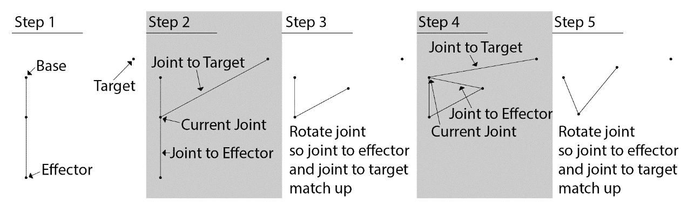
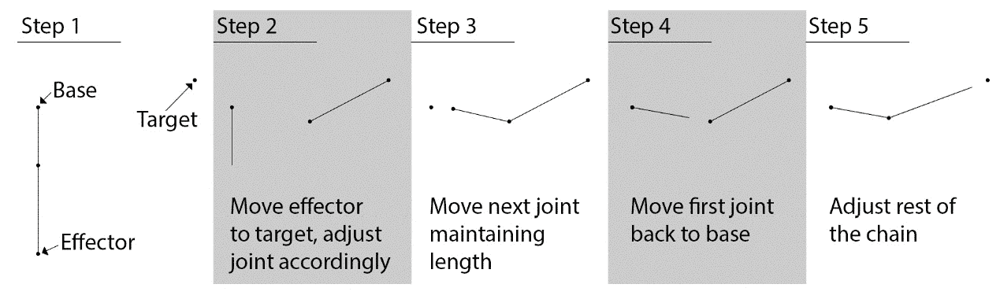
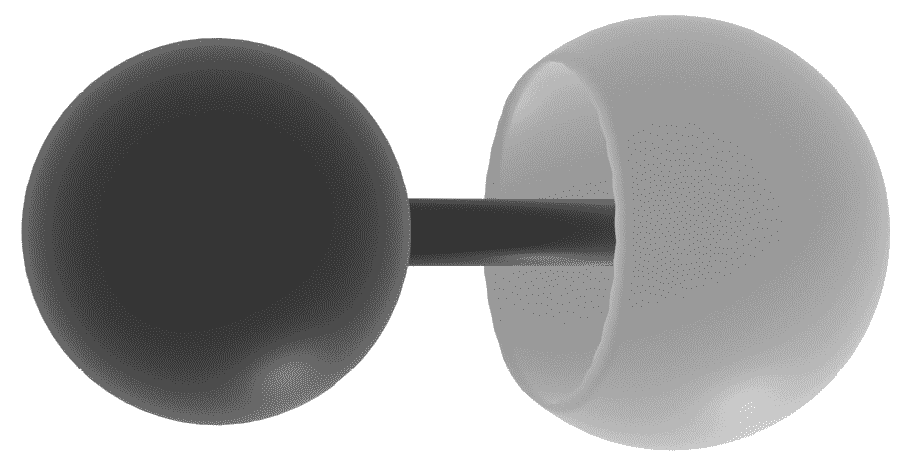
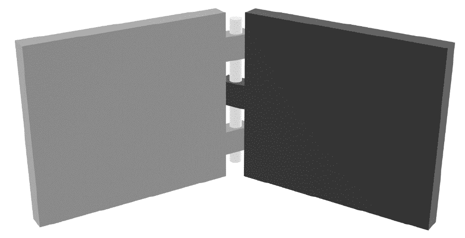
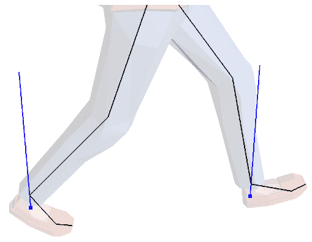
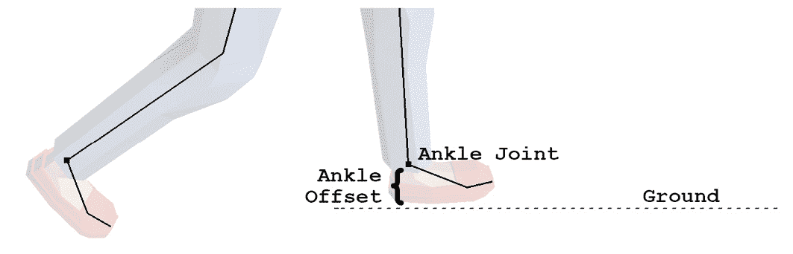
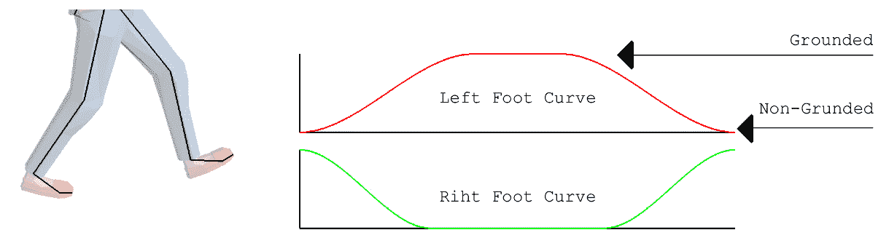
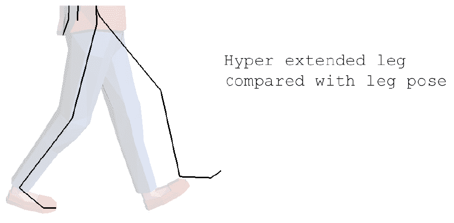
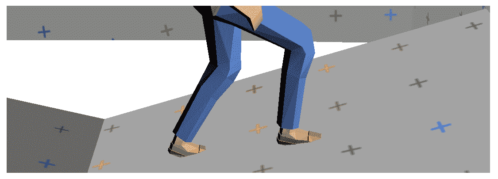
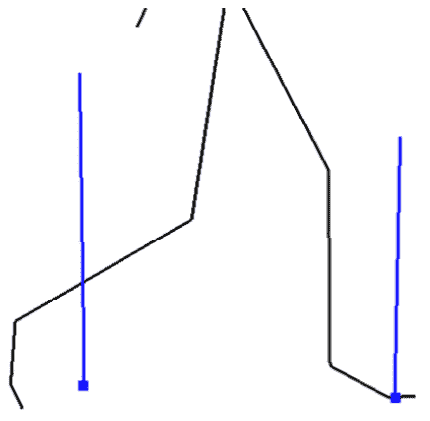

# 第十三章：*第十三章*：实现逆运动学

**逆运动学**（**IK**）是解决一组关节应该如何定位以达到世界空间中指定点的过程。例如，您可以为角色指定一个触摸的点。通过使用 IK，您可以找出如何旋转角色的肩膀、肘部和手腕，使得角色的手指始终触摸特定点。

常用于 IK 的两种算法是 CCD 和 FABRIK。本章将涵盖这两种算法。通过本章结束时，您应该能够做到以下事情：

+   理解 CCD IK 的工作原理

+   实现 CCD 求解器

+   理解 FABRIK 的工作原理

+   实现 FABRIK 求解器

+   实现球和套约束

+   实现铰链约束

+   了解 IK 求解器在动画流水线中的位置和方式

# 创建 CCD 求解器

在本节中，您将学习并实现 CCD IK 算法。**CCD**代表**循环坐标下降**。该算法可用于以使链条上的最后一个关节尽可能接近触摸目标的方式来摆放一系列关节。您将能够使用 CCD 来创建需要使用目标点解决链条的肢体和其他 IK 系统。

CCD 有三个重要概念。首先是**目标**，即您试图触摸的空间点。接下来是**IK 链**，它是需要旋转以达到目标的所有关节的列表。最后是**末端执行器**，它是链条中的最后一个关节（需要触摸目标的关节）。

有了目标、链和末端执行器，CCD 算法的伪代码如下：

```cpp
// Loop through all joints in the chain in reverse, 
// starting with the joint before the end effecor
foreach joint in ikchain.reverse() {
    // Find a vector from current joint to end effector
    jointToEffector = effector.position - joint.position
    // Find a vector from the current joint to the goal
    jointToGoal = goal.position - joint.position
    // Rotate the joint so the joint to effector vector 
    // matches the orientation of the joint to goal vector
    joint.rotation = fromToRotation(jointToEffector, 
                        jointToGoal) * joint.rotation
}
```

CCD 算法看起来很简单，但它是如何工作的呢？从末端执行器前面的关节开始。旋转执行器对链条没有影响。找到从执行器前面的关节到目标的向量，然后找到从关节到执行器的向量。旋转相关的关节，使得这两个向量对齐。对每个关节重复此过程，直到基本关节为止。



图 13.1：CCD 算法的可视化

观察*图 13.1*，末端执行器没有触摸目标。为什么？CCD 是一个迭代算法，前面的步骤描述了一个迭代。需要多次迭代才能实现收敛。在接下来的章节中，我们将学习如何声明 CCD 求解器，这将引导我们实现`CCDSolver`类。

## 声明 CCD 求解器

在本节中，您将声明 CCD 求解器。这将让您有机会在实现之前，熟悉 API 并了解类在高层次上的工作方式。

创建一个新文件`CCDSolver.h`，`CCDSolver`类将在此文件中声明。`CCDSolver`类应包含组成 IK 链的变换向量。假设 IK 链具有父子关系，其中每个索引都是前一个索引的子级，使 0 成为我们的根节点。因此，IK 链中的每个变换都是在本地空间中声明的。按照以下步骤声明 CCD IK 求解器：

1.  首先声明`CCDSolver`类，包含三个变量：用于形成 IK 链的变换列表、要执行的迭代次数和可以用来控制目标与目标之间的距离的小增量。同时声明默认构造函数：

```cpp
class CCDSolver {
protected:
    std::vector<Transform> mIKChain;
    unsigned int mNumSteps;
    float mThreshold;
public:
    CCDSolver();
```

1.  为 IK 链的大小、步数和阈值值实现 getter 和 setter 函数。声明要使用的`[] operator`来获取和设置本地关节变换。声明`GetGlobalTransform`函数，它将返回关节的全局变换：

```cpp
    unsigned int Size();
    void Resize(unsigned int newSize);
    Transform& operator[](unsigned int index);
    Transform GetGlobalTransform(unsigned int index);
    unsigned int GetNumSteps();
    void SetNumSteps(unsigned int numSteps);
    float GetThreshold();
    void SetThreshold(float value);
```

1.  声明`Solve`函数，用于解决 IK 链。提供一个变换，但只使用变换的位置分量。如果链被解决，则`Solve`函数返回`true`，否则返回`false`：

```cpp
    bool Solve(const Transform& target);
};
```

`mNumSteps`变量用于确保求解器不会陷入无限循环。不能保证末端执行器会达到目标。限制迭代次数有助于避免潜在的无限循环。在接下来的部分，您将开始实现 CCD 求解器。

## 实现 CCD 求解器

创建一个名为`CCDSolver.cpp`的新文件，用于实现 CCD 求解器。按照以下步骤实现 CCD 求解器：

1.  定义默认构造函数，为步数和阈值赋值。使用小阈值，如`0.0001f`。默认步数为`15`：

```cpp
CCDSolver::CCDSolver() {
    mNumSteps = 15;
    mThreshold = 0.00001f;
}
```

1.  实现`Size`和`Resize`函数，控制 IK 链的大小，`[]运算符`包含链中每个关节的值：

```cpp
unsigned int CCDSolver::Size() {
    return mIKChain.size();
}
void CCDSolver::Resize(unsigned int newSize) {
    mIKChain.resize(newSize);
}
Transform& CCDSolver::operator[](unsigned int index) {
    return mIKChain[index];
}
```

1.  为求解器包含的步数和阈值实现获取器和设置器函数：

```cpp
unsigned int CCDSolver::GetNumSteps() {
    return mNumSteps;
}
void CCDSolver::SetNumSteps(unsigned int numSteps) {
    mNumSteps = numSteps;
}
float CCDSolver::GetThreshold() {
    return mThreshold;
}
void CCDSolver::SetThreshold(float value) {
    mThreshold = value;
}
```

1.  实现`GetGlobalTransform`函数，这可能看起来很熟悉。它将指定关节的变换与所有父关节的变换连接起来，并返回指定关节的全局变换：

```cpp
Transform CCDSolver::GetGlobalTransform(unsigned int x) {
    unsigned int size = (unsigned int)mIKChain.size();
    Transform world = mIKChain[x];
    for (int i = (int) x - 1; i >= 0; --i) {
        world = combine(mIKChain[i], world);
    }
    return world;
}
```

1.  通过确保链的大小有效并存储最后一个元素的索引和目标位置的向量来实现`Solve`函数：

```cpp
bool CCDSolver::Solve(const Transform& target) {
    unsigned int size = Size();
    if (size == 0) { return false; }
    unsigned int last = size - 1;
    float thresholdSq = mThreshold * mThreshold;
    vec3 goal = target.position;
```

1.  循环从`0`到`mNumSteps`，执行正确数量的迭代。在每次迭代中，获取末端执行器的位置，并检查它是否足够接近目标。如果足够接近，提前返回：

```cpp
    for (unsigned int i = 0; i < mNumSteps; ++i) {
        vec3 effector = GetGlobalTransform(last).position;
        if (lenSq(goal - effector) < thresholdSq) {
            return true;
        }
```

1.  在每次迭代中，循环遍历整个 IK 链。从`size - 2`开始迭代；因为`size - 1`是最后一个元素，旋转最后一个元素对任何骨骼都没有影响：

```cpp
        for (int j = (int)size - 2; j >= 0; --j) {
```

1.  对于 IK 链中的每个关节，获取关节的世界变换。找到从关节位置到末端执行器位置的向量。找到从当前关节位置到目标位置的另一个向量：

```cpp
            effector=GetGlobalTransform(last).position;
            Transform world = GetGlobalTransform(j);
            vec3 position = world.position;
            quat rotation = world.rotation;
            vec3 toEffector = effector - position;
            vec3 toGoal = goal - position;
```

1.  接下来，找到一个四元数，将位置到末端执行器的向量旋转到位置到目标向量。有一种特殊情况，指向末端执行器或目标的向量可能是零向量：

```cpp
            quat effectorToGoal;
            if (lenSq(toGoal) > 0.00001f) {
                effectorToGoal = fromTo(toEffector, 
                                        toGoal);
            }
```

1.  使用这个向量将关节旋转到世界空间中的正确方向。通过关节的上一个世界旋转的逆来旋转关节的世界空间方向，将四元数移回关节空间：

```cpp
            quat worldRotated =rotation * 
                               effectorToGoal;
            quat localRotate = worldRotated * 
                               inverse(rotation);
            mIKChain[j].rotation = localRotate * 
                               mIKChain[j].rotation;
```

1.  随着关节的移动，检查末端执行器在每次迭代中移动到目标的距离。如果足够接近，从函数中提前返回，返回值为`true`：

```cpp
            effector=GetGlobalTransform(last).position;
            if (lenSq(goal - effector) < thresholdSq) {
                return true;
            }
         }
    }
```

1.  如果未达到目标，则 IK 链无法解决，至少不是在指定的迭代次数内。简单地返回`false`以表示函数未能达到目标：

```cpp
    return false;
} // End CCDSolver::Solve function
```

这个 CCD 求解器可以用来解决具有一个起点和一个末端执行器的单链。然而，处理 IK 链的更高级方法是，一个单链可以有多个末端执行器。然而，由于额外的实现复杂性，这些方法要少得多。在下一节中，您将开始探索另一种 IK 算法，FABRIK。

# 创建一个 FABRIK 求解器

**FABRIK**（**前向和后向逆运动学**）具有更自然、类人的收敛性。与 CCD 一样，FABRIK 处理具有基础、末端执行器和要达到的目标的 IK 链。与 CCD 不同，FABRIK 处理的是位置，而不是旋转。FABRIK 算法更容易理解，因为它可以仅使用向量来实现。

在许多方面，FABRIK 可以被用作 CCD 的替代品。这两种算法解决了同样的问题，但它们采取了不同的方法来解决。FABRIK 倾向于更快地收敛，并且对于人形动画效果更好，因此您可能会将其用作角色肢体的求解器。

在处理人形角色绑定时，使用位置而不是旋转将无法很好地工作，因为需要通过旋转关节来进行动画。这可以通过向算法添加预处理和后处理步骤来解决。预处理步骤将把 IK 链中的所有变换转换为世界空间位置向量。后处理步骤将把这些向量转换为旋转数据。

FABRIK 算法有两个部分。首先，从末端执行器向基座进行反向迭代。在进行反向迭代时，将执行器移动到目标位置。接下来，移动每根骨骼，使它们相对于执行器保持不变；这将保持链的完整性。然后，将基座移回原始位置，并将每根骨骼相对于基座移动，以保持链的完整性。

在伪代码中，FABRIK 算法如下所示：

```cpp
void Iterate(const Transform& goal) {
    startPosition = chain[0]
    // Iterate backwards
    chain[size - 1] = goal.position;
    for (i = size - 2; i >= 0; --i) {
        current = chain[i]
        next = chain[i + 1]
        direction = normalize(current - next)
        offset = direction * length[i + 1]
        chain[i] = next + offset
    }
    // Iterate forwards
    chain[0] = startPosition
    for (i  = 1; i < size; ++i) {
        current = chain[i]
        prev = chain[i - 1]
        direction = normalize(current - prev)
        offset = direction * length[i]
        chain[i] = prev + offset
    }
}
```

要可视化 FABRIK，将末端执行器设置到目标位置。找到从末端执行器到最后一个关节的向量。将最后一个关节移动到沿着这个向量的位置，保持其与末端执行器的距离。对每个关节重复此操作，直到达到基座。这将使基座关节移出位置。

要进行正向迭代，将基座放回原来的位置。找到到下一个关节的向量。将下一个关节放在这个向量上，保持其与基座的距离。沿着整个链重复这个过程：



图 13.2：可视化 FABRIK 算法

FABRIK 和 CCD 都会尝试解决 IK 链，但它们以不同的方式收敛到目标。CCD 倾向于卷曲，而 FABRIK 倾向于拉伸。FABRIK 通常为人形动画生成更自然的结果。在接下来的部分，您将开始声明`FABRIKSolver`类，然后实现该类。

## 声明 FABRIK 求解器

FABRIK 求解器将需要更多的内存来运行，因为它必须将本地关节变换转换为全局位置。该算法可以分解为几个步骤，所有这些步骤都可以作为受保护的辅助函数实现。

创建一个新文件，`FABRIKSolver.h`。这个文件将用于声明`FABRIKSolver`类。按照以下步骤声明`FABRIKSolver`类：

1.  首先声明`FABRIKSolver`类，该类需要跟踪 IK 链、最大步数和一些距离阈值。声明一个世界空间位置向量和一个关节长度向量。这些向量是必需的，因为 FABRIK 算法不考虑旋转：

```cpp
class FABRIKSolver {
protected:
    std::vector<Transform> mIKChain;
    unsigned int mNumSteps;
    float mThreshold;
    std::vector<vec3> mWorldChain;
    std::vector<float> mLengths;
```

1.  声明辅助函数，将 IK 链复制到世界位置向量中，进行正向迭代，进行反向迭代，并将最终的世界位置复制回 IK 链中：

```cpp
protected:
    void IKChainToWorld();
    void IterateForward(const vec3& goal);
    void IterateBackward(const vec3& base);
    void WorldToIKChain();
```

1.  声明默认构造函数，获取器和设置器函数用于链的大小、解决链所需的迭代次数以及末端关节需要与目标的距离的 epsilon 值：

```cpp
public:
    FABRIKSolver();
    unsigned int Size();
    void Resize(unsigned int newSize);
    unsigned int GetNumSteps();
    void SetNumSteps(unsigned int numSteps);
    float GetThreshold();
    void SetThreshold(float value);
```

1.  声明用于存储 IK 链中本地变换的获取器和设置器函数。声明一个函数来检索关节的全局变换。最后，声明`Solve`函数，当给定一个目标时解决 IK 链：

```cpp
    Transform GetLocalTransform(unsigned int index);
    void SetLocalTransform(unsigned int index, 
                           const Transform& t);
    Transform GetGlobalTransform(unsigned int index);
    bool Solve(const Transform& target);
};
```

FABRIK 算法的实现比 CCD 算法更复杂，但步骤更容易分解为函数。在接下来的部分，您将开始实现`FABRIKSolver`类的函数。

## 实现 FABRIK 求解器

FABRIK 算法基于世界空间位置。这意味着，每次迭代时，IK 链都需要将本地关节变换转换为世界位置并存储结果。解决链条后，世界位置向量需要转换回相对偏移并存储回 IK 链中。

创建一个新文件`FABRIKSolver.cpp`；`FABRIKSolver`类将在这个文件中实现。按照以下步骤实现`FABRIKSolver`类：

1.  实现`FABRIKSolver`类的构造函数。需要将步数和阈值设置为默认值：

```cpp
FABRIKSolver::FABRIKSolver() {
    mNumSteps = 15;
    mThreshold = 0.00001f;
}
```

1.  实现步数和阈值值的简单 getter 和 setter 函数：

```cpp
unsigned int FABRIKSolver::GetNumSteps() {
    return mNumSteps;
}
void FABRIKSolver::SetNumSteps(unsigned int numSteps) {
    mNumSteps = numSteps;
}
float FABRIKSolver::GetThreshold() {
    return mThreshold;
}
void FABRIKSolver::SetThreshold(float value) {
    mThreshold = value;
}
```

1.  实现链条大小的 getter 和 setter 函数。setter 函数需要设置链条的大小、世界链条和长度向量：

```cpp
unsigned int FABRIKSolver::Size() {
    return mIKChain.size();
}
void FABRIKSolver::Resize(unsigned int newSize) {
    mIKChain.resize(newSize);
    mWorldChain.resize(newSize);
    mLengths.resize(newSize);
}
```

1.  实现获取和设置 IK 链中元素的本地变换的方法：

```cpp
Transform FABRIKSolver::GetLocalTransform(
                        unsigned int index) {
    return mIKChain[index];
}
void FABRIKSolver::SetLocalTransform(unsigned int index,
                                   const Transform& t) {
    mIKChain[index] = t;
}
```

1.  实现获取函数以检索全局变换，并将所有变换连接到根：

```cpp
Transform FABRIKSolver::GetGlobalTransform(
                        unsigned int index) {
    unsigned int size = (unsigned int)mIKChain.size();
    Transform world = mIKChain[index];
    for (int i = (int)index - 1; i >= 0; --i) {
        world = combine(mIKChain[i], world);
    }
    return world;
}
```

1.  实现`IKChainToWorld`函数，将 IK 链复制到世界变换向量中并记录段长度。长度数组存储了关节与其父节点之间的距离。这意味着根关节将始终包含长度`0`。对于非根关节，索引`i`处的距离是关节`i`和`i-1`之间的距离：

```cpp
void FABRIKSolver::IKChainToWorld() {
    unsigned int size = Size();
    for (unsigned int i = 0; i < size; ++i) {
        Transform world = GetGlobalTransform(i);
        mWorldChain[i] = world.position;
        if (i >= 1) {
            vec3 prev = mWorldChain[i - 1];
            mLengths[i] = len(world.position - prev);
        }
    }
    if (size > 0) {
        mLengths[0] = 0.0f;
    }
}
```

1.  接下来实现`WorldToIKChain`函数，它将把世界位置 IK 链转换回本地空间变换。循环遍历所有关节。对于每个关节，找到当前关节和下一个关节的世界空间变换。缓存当前关节的世界空间位置和旋转：

```cpp
void FABRIKSolver::WorldToIKChain() {
    unsigned int size = Size();
    if (size == 0) { return; }
    for (unsigned int i = 0; i < size - 1; ++i) {
        Transform world = GetGlobalTransform(i);
        Transform next = GetGlobalTransform(i + 1);
        vec3 position = world.position;
        quat rotation = world.rotation;
```

1.  创建一个向量，指向当前关节到下一个关节的位置。这是当前节点和下一个节点之间的旋转：

```cpp
        vec3 toNext = next.position - position;
        toNext = inverse(rotation) * toNext;
```

1.  构造一个向量，指向下一个关节的世界空间 IK 链到当前位置的位置。这是当前节点和下一个节点之间的旋转：

```cpp
        vec3 toDesired = mWorldChain[i + 1] - position;
        toDesired = inverse(rotation) * toDesired;
```

1.  使用`fromTo`四元数函数将这两个向量对齐。将最终的增量旋转应用于当前关节的 IK 链旋转：

```cpp
        quat delta = fromTo(toNext, toDesired);
        mIKChain[i].rotation = delta * 
                               mIKChain[i].rotation;
    }
}
```

1.  接下来，实现`IterateBackward`函数，将链条中的最后一个元素设置为目标位置。这会打破 IK 链。使用存储的距离调整所有其他关节，以保持链条完整。执行此函数后，末端执行器始终位于目标位置，初始关节可能不再位于基底位置：

```cpp
void FABRIKSolver::IterateBackward(const vec3& goal) {
    int size = (int)Size();
    if (size > 0) {
        mWorldChain[size - 1] = goal;
    }
    for (int i = size - 2; i >= 0; --i) {
        vec3 direction = normalized(mWorldChain[i] - 
                                    mWorldChain[i + 1]);
        vec3 offset = direction * mLengths[i + 1];
        mWorldChain[i] = mWorldChain[i + 1] + offset;
    }
}
```

1.  实现`IterateForward`函数。此函数重新排列 IK 链，使第一个链接从链的原点开始。此函数需要将初始关节设置为基底，并迭代所有其他关节，调整它们以保持 IK 链完整。执行此函数后，如果链条可解并且迭代次数足够，末端执行器可能位于目标位置：

```cpp
void FABRIKSolver::IterateForward(const vec3& base) {
    unsigned int size = Size();
    if (size > 0) {
        mWorldChain[0] = base;
    }
    for (int i = 1; i < size; ++i) {
        vec3 direction = normalized(mWorldChain[i] - 
                                    mWorldChain[i - 1]);
        vec3 offset = direction * mLengths[i];
        mWorldChain[i] = mWorldChain[i - 1] + offset;
    }
}
```

1.  通过将 IK 链复制到世界位置向量并填充长度向量来开始实现`Solve`函数。可以使用`IKChainToWorld`辅助函数完成。缓存基础和目标位置：

```cpp
bool FABRIKSolver::Solve(const Transform& target) {
    unsigned int size = Size();
    if (size == 0) { return false; }
    unsigned int last = size - 1;
    float thresholdSq = mThreshold * mThreshold;

    IKChainToWorld();
    vec3 goal = target.position;
    vec3 base = mWorldChain[0];
```

1.  从`0`迭代到`mNumSteps`。对于每次迭代，检查目标和末端执行器是否足够接近以解决链条问题。如果足够接近，则使用`WorldToIKChain`辅助函数将世界位置复制回链条，并提前返回。如果它们不够接近，则通过调用`IterateBackward`和`IterateForward`方法进行迭代：

```cpp
    for (unsigned int i = 0; i < mNumSteps; ++i) {
        vec3 effector = mWorldChain[last];
        if (lenSq(goal - effector) < thresholdSq) {
            WorldToIKChain();
            return true;
        }
        IterateBackward(goal);
        IterateForward(base);
    }
```

1.  迭代循环后，无论求解器是否能够解决链条问题，都将世界位置向量复制回 IK 链。最后再次检查末端执行器是否已经达到目标，并返回适当的布尔值：

```cpp
    WorldToIKChain();
    vec3 effector = GetGlobalTransform(last).position;
    if (lenSq(goal - effector) < thresholdSq) {
        return true;
    }
    return false;
}
```

FABRIK 算法很受欢迎，因为它往往会快速收敛到最终目标，对于人形角色来说结果看起来不错，并且该算法易于实现。在下一节中，您将学习如何向 FABRIK 或 CCD 求解器添加约束。

# 实施约束

CCD 和 FABRIK 求解器都能产生良好的结果，但都不能产生可预测的结果。在本节中，您将学习约束是什么，IK 求解器约束可以应用在哪里，以及如何应用约束。这将让您构建更加逼真的 IK 求解器。

考虑一个应该代表腿的 IK 链。您希望确保每个关节的运动是可预测的，例如，膝盖可能不应该向前弯曲。

这就是约束有用的地方。膝盖关节是一个铰链；如果应用了铰链约束，腿的 IK 链看起来会更逼真。使用约束，您可以为 IK 链中的每个关节设置规则。

以下步骤将向您展示在 CCD 和 FABRIK 求解器中应用约束的位置：

1.  约束可以应用于 CCD 和 FABRIK 求解器，并且必须在每次迭代后应用。对于 CCD，这意味着在这里插入一小段代码：

```cpp
bool CCDSolver::Solve(const vec3& goal) {
    // Local variables and size check
    for (unsigned int i = 0; i < mNumSteps; ++i) {
        // Check if we've reached the goal
        for (int j = (int)size - 2; j >= 0; --j) {
           // Iteration logic
           // -> APPLY CONSTRAINTS HERE!
            effector = GetGlobalTransform(last).position;
            if (lenSq(goal - effector) < thresholdSq) {
                return true;
            }
         }
    }
    // Last goal check
}
```

1.  将约束应用于 FABRIK 求解器更加复杂。约束应用于每次迭代，并且 IK 链需要在每次迭代时在世界位置链和 IK 链之间转换。在将数据复制到变换链后，每次迭代都应用约束：

```cpp
bool FABRIKSolver::Solve(const vec3& goal) {
    // Local variables and size check
    IKChainToWorld();
    vec3 base = mWorldChain[0];
    for (unsigned int i = 0; i < mNumSteps; ++i) {
        // Check if we've reached the goal
        IterateBackward(goal);
        IterateForward(base);
        WorldToIKChain();//NEW, NEEDED FOR CONSTRAINTS
        // -> APPLY CONSTRAINTS HERE!
        IKChainToWorld();//NEW, NEEDED FOR CONSTRAINTS
    }
    // Last goal check
}
```

`Solve`函数是虚拟的原因是您可以将每个`IKChain`类扩展为特定类型的链，例如`LegIKChain`或`ArmIKChain`，并直接将约束代码添加到解决方法中。在接下来的几节中，您将探索常见类型的约束。

## 球和插座约束

球和插座关节的工作原理类似于肩关节。关节可以在所有三个轴上旋转，但有一个角度约束阻止它自由旋转。*图 13.3*显示了球和插座约束的外观：



图 13.3：可视化的球和插座约束

要构建球和插座约束，您需要知道当前关节及其父关节的旋转。您可以从这些四元数构造前向矢量，并检查前向矢量的角度。如果角度大于提供的限制，需要调整旋转。

为了限制旋转，找到旋转轴。两个前向方向的叉乘垂直于两者；这是旋转轴。创建一个四元数，将角度限制沿着这个轴带入当前关节的局部空间，并将该四元数设置为关节的旋转：

```cpp
void ApplyBallSocketConstraint(int i, float limit) { 
    quat parentRot = i == 0 ? mOffset.rotation : 
                     GetWorldTransform(i - 1).rotation;
    quat thisRot = GetWorldTransform(i).rotation;
    vec3 parentDir = parentRot * vec3(0, 0, 1);
    vec3 thisDir = thisRot * vec3(0, 0, 1);
    float angle = ::angle(parentDir, thisDir);
    if (angle > limit * QUAT_DEG2RAD) {
        vec3 correction = cross(parentDir, thisDir);
        quat worldSpaceRotation = parentRot * 
            angleAxis(limit * QUAT_DEG2RAD, correction);
        mChain[i].rotation = worldSpaceRotation * 
                             inverse(parentRot);
    }
}
```

球和插座约束通常应用于角色的髋部或肩部关节。这些也往往是肢体 IK 链的根关节。在下一节中，您将探索另一种类型的约束，即铰链约束。

## 铰链约束

铰链约束类似于肘部或膝盖。它只允许在一个特定轴上旋转。*图 13.4*展示了铰链关节的外观： 



图 13.4：可视化的铰链约束

要实施铰链约束，您需要知道当前关节和父关节的世界空间旋转。将轴法线分别乘以旋转四元数，并找到两者之间的四元数；这是您需要旋转以约束关节到一个轴的量。将此旋转带回关节空间并应用旋转：

```cpp
void ApplyHingeSocketConstraint(int i, vec3 axis) { 
    Transform joint = GetWorldTransform(i);
    Transform parent = GetWorldTransform(i - 1);
    vec3 currentHinge = joint.rotation * axis;
    vec3 desiredHinge = parent.rotation * axis;
    mChain[i].rotation = mChain[i].rotation * 
                         fromToRotation(currentHinge, 
                                        desiredHinge);
}
```

铰链约束通常用于肘部或膝盖关节。在下一节中，您将探讨如何使用 IK 将角色的脚对齐到地面。

# 使用 IK 将角色的脚对齐到地面

在本节中，您将学习如何使用 IK 来修改动画，使其看起来更加正确。具体来说，您将学习如何使用 IK 在行走时阻止角色的脚穿过不平整的地面。

现在，您可以使用 CCD 或 FABRIK 来解决 IK 链，让我们探讨这些求解器如何使用。IK 的两个常见用途是定位手部或脚部。在本节中，您将探讨在角色行走时如何将角色的脚夹紧在地面上的方法。

解决脚部夹紧问题，可以检查脚的最后全局位置与当前全局位置是否相符。如果脚部运动在途中碰到任何东西，就将脚固定在地面上。即使最琐碎的解决方案也有边缘情况：如果上升运动距离太远会发生什么？在动画循环的哪个时刻可以在固定和非固定位置之间进行插值？

为了使实现更容易，本章的地面夹紧策略将保持简单。首先，检查脚部是否与其上方的任何东西发生碰撞，例如穿过地形。为此，从角色的臀部到脚踝投射一条射线。

如果射线击中了任何东西，击中点将成为腿部 IK 链的目标。如果射线没有击中任何东西，则角色脚踝的当前位置将成为腿部 IK 链的目标。接下来，进行相同的射线投射，但不要停在角色的脚踝处；继续向下。

如果这条射线击中了任何东西，击中点将成为未来的 IK 目标。如果射线没有击中任何东西，则将未来的 IK 目标设置为当前的 IK 目标。现在有两个目标，一个自由运动，一个固定在地面上。

如果使用当前目标，角色的脚可能会突然贴在地面上。如果使用未来目标，角色将无法行走——它只会在地面上拖着脚。相反，您必须通过某个值在两个目标之间进行插值。

插值值应该来自动画本身。当角色的脚着地时，应使用当前目标；当脚抬起时，应使用未来目标。当角色的脚被抬起或放下时，目标位置应该进行插值。

有了 IK 目标后，IK 求解器可以计算出如何弯曲角色的腿。一旦腿部关节处于世界空间中，我们就调整脚的位置，使其始终在地形上，采取与解决腿部相似的步骤。

在接下来的章节中，您将更详细地探讨这里描述的每个步骤。然而，有一个小问题。大部分需要的值都是特定于用于渲染的模型的；不同的角色将需要不同调整的值。

## 寻找脚的目标

从角色的臀部下方一点到脚踝下方一点向下投射一条射线。这条射线应该直直地向下，沿着脚踝的位置。然而，射线应该从哪里开始，脚踝下方应该走多远，这取决于模型的具体情况：



图 13.5：射线投射以找到脚的目标

记录这条射线投射的结果，无论击中点有多远。这一点将被视为 IK 目标，始终被夹紧在地面上。检查射线是否击中了其起点和脚踝底部之间的任何东西。如果击中了，那将是脚踝的目标。如果没有击中，脚踝的目标将是脚踝的位置。

重要的是要记住，定位的是角色的脚踝，而不是脚底。因此，目标点需要上移脚踝到地面的距离：



图 13.6：偏移以定位角色的脚踝

这些脚部目标将控制 IK 系统如何覆盖动画。在行走时，如果脚部运动没有受到阻碍，IK 系统就不应该被注意到。在下一节中，您将学习如何控制脚部在动画和固定目标点之间的插值。

## 插值脚部目标

为了在当前和未来的 IK 目标之间进行插值，您需要了解当前播放的动画片段。具体来说，您需要知道腿处于什么阶段；它是着地的，被抬起的，悬停的，还是被放置的？编码这些信息的常见方法是使用标量曲线。

想法是创建两条标量曲线，一条用于左腿，一条用于右腿。这些曲线对应于当前步伐的幅度。例如，当左脚离开地面时，左曲线的值需要为 0。如果左脚着地，左曲线的值需要为 1。曲线看起来像这样：



图 13.7：步行循环幅度表示为标量曲线

根据当前的归一化播放时间对这些曲线进行采样。结果值将在 0 和 1 之间。使用这个 0 到 1 的值作为混合权重，将非 IK 调整的动画和 IK 调整的动画混合在一起。这条曲线通常是通过使用曲线编辑器进行手动编写的。该曲线是特定于当前播放的动画的。

在下一节中，您将探讨如何调整 IK 角色的垂直位置，以避免过度伸展肢体。

## 垂直角色定位

接下来，角色需要垂直定位，以便看起来好看。如果角色放得太高，它会以过度伸展的状态结束。太低，IK 系统会过度弯曲腿：



图 13.8：IK 过度伸展与采样动画比较

角色的定位是相对于建模时的情况。如果角色是在假定（0, 0, 0）是地面上的中心点进行建模的，您可以将其放在下方的表面上，并将其稍微陷入表面。

角色需要稍微陷入表面，以便 IK 系统能够进行一些工作并避免过度伸展。这带来了一个问题：角色的脚需要与哪个表面对齐？对齐位置可以来自碰撞/物理系统，或者在一个更简单的例子中，只是从角色正下方向下进行射线投射。

碰撞表面和视觉表面并不相同。考虑一个楼梯：碰撞几何通常是一个坡道。显示几何是看起来像实际楼梯的样子。在这种情况下，角色的位置应该是相对于碰撞几何的，但 IK 目标应该是相对于视觉几何定位的。

如果只有一个几何用于碰撞和视觉，该怎么办？在这种情况下，将角色放置在夹紧的 IK 目标之一，无论哪一个更低。这将确保地面始终可以到达，而不会过度伸展。

## IK 传递

现在是解决腿部 IK 链的时候了。在这之前，将动画姿势中的关节复制到 IK 求解器中。对于每条腿，将髋关节的全局变换复制到 IK 求解器的根部。将膝盖的局部变换复制到关节 1，将脚踝的局部变换复制到关节 2。然后，运行 IK 求解器。求解器将把角色的脚放在目标点上，并将其夹紧在地面上。

## 脚部对齐

在这一点上，夹紧的脚部动画是平滑的，脚部将不再在地面内部剪切。但是只有角色的腿看起来正确，而脚没有。看看角色在非平坦表面上的脚部-仍然有相当多的剪切发生：



图 13.9：腿被夹紧到地面，但脚的方向错误

为了解决这个问题，创建一个脚尖射线。脚尖射线将位于角色的踝关节处，并沿着角色的前向轴一定距离。这将确保脚尖目标始终朝前，即使在动画中脚尖指向下。调整脚尖射线的垂直位置，使其从膝盖上方射到脚尖以下一点的位置：



图 13.10：即使脚尖朝下，也要向前投射偏移

将脚尖定位类似于腿的定位。找到一个目标，即当前脚尖的位置，被夹紧到地面上。通过动画的当前归一化时间在夹紧到地面的目标和活动动画目标之间插值。

这个脚尖目标将用于旋转脚。找到从踝到当前脚尖位置的向量。找到从踝到目标脚尖位置的向量。创建一个在这两个向量之间旋转的四元数。用这个四元数旋转踝部。

在本节中，您学习了如何找到脚目标，在它们之间插值，并使用这些目标和 IK 系统将角色的脚对齐到地面。地面对齐只是 IK 求解器的用例之一。类似的系统可以用于手臂抓取物体或整个身体创建一个布娃娃系统。

# 摘要

在本章中，您实现了 CCD 和 FABRIK IK 求解器。这两个求解器都可以解决 IK 链，但它们的收敛方式不同。哪种算法更好很大程度上取决于上下文。

您还学习了如何使用约束来限制特定关节的运动范围。通过正确的约束，IK 系统修改当前动画，使其与环境互动。您探讨了如何在本章的脚着地部分实现这一点。

本书的可下载内容中，本章有 4 个样本。`Sample00` 包含到目前为止的代码。`Sample01` 演示了如何使用 CCD 求解器，`Sample02` 演示了如何使用 FABRIK 求解器。`Sample03` 演示了角色沿着路径行走时的脚夹和地面对齐。

在下一章中，您将学习如何使用双四元数进行蒙皮。当网格弯曲或旋转时，双四元数蒙皮比线性混合蒙皮更好地保持了网格的体积。

# 进一步阅读

除了 FABRIK 和 CCD，IK 链有时会用解析方法或雅可比矩阵来求解：

+   有关分析 IK 求解器的更多信息，请访问[此处](http://theorangeduck.com/page/simple-two-joint)。

+   完整的雅可比求解器实现在*游戏编程宝石 4*中有介绍。
