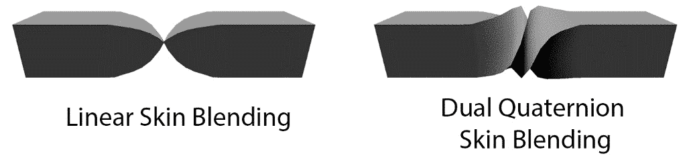
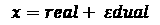
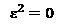
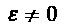
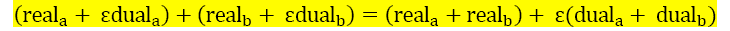
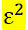

# *第十四章*：使用双四元数进行蒙皮

当前的蒙皮实现在皮肤权重之间线性混合，这称为**线性混合蒙皮（LBS）**或有时称为**线性皮肤混合**。线性混合皮肤不保持模型的体积，这会引入蒙皮伪影。可视化这种伪影的简单方法是将矩形的一端扭曲 180 度，如下面的屏幕截图所示：



图 14.1：比较线性混合和双四元数蒙皮

线性皮肤混合的替代方法是**双四元数皮肤混合**。使用双四元数时，模型的体积得以保持。在本章中，您将实现双四元数网格蒙皮。在本章结束时，您应该能够使用双四元数对动画角色进行蒙皮。本章涵盖以下主题：

+   引入双四元数

+   实现双四元数

+   使用双四元数进行蒙皮

+   了解如何使用双四元数蒙皮

# 引入双四元数

双四元数将线性和旋转变换结合到一个变量中。这个单一变量可以进行插值、变换和连接。双四元数可以用两个四元数或八个浮点数表示。

双数就像复数一样。复数有实部和虚部，双数有实部和虚部。假设是双重运算符，双数可以表示为，其中和。

双数的运算是作为虚数进行的，其中虚部和实部必须分别操作。例如，双四元数的加法可以表示为：



注意实部和虚部是独立添加的。

重要说明

如果您对双四元数背后更正式的数学感兴趣，请查看 Ben Kenwright 的*A Beginner's Guide to Dual-Quaternions*，[网址 https://cs.gmu.edu/~jmlien/teaching/cs451/uploads/Main/dual-quaternion](https://cs.gmu.edu/~jmlien/teaching/cs451/uploads/Main/dual-quaternion.pdf).pdf。

双四元数只是双数的扩展。实部和虚部由四元数代替标量值表示，大多数数学运算都是有效的。在下一节中，您将开始在代码中实现双四元数。

# 实现双四元数

在本节中，您将在代码中实现双四元数。在本节结束时，您将已经实现了一个双四元数结构，以及使用双四元数进行网格蒙皮所需的所有数学函数。

双四元数需要被实现为结构，类似于变换或矩阵。创建两个新文件，`DualQuaternion.h`和`DualQuaternion.cpp`。您将在这些文件中实现与双四元数相关的数学。

首先声明一个`DualQuaternion`结构。这个结构将允许您以两个四元数或八个数字的浮点数组的形式访问双四元数结构中的数据。构造函数应该将双四元数设置为单位。单位双四元数的实部是单位四元数，虚部是零四元数，如下面的代码块所示：

```cpp
struct DualQuaternion {
    union {
        struct {
            quat real;
            quat dual;
        };
        float v[8];
    };
    inline DualQuaternion() : real(0, 0, 0, 1), dual(0, 0, 0, 0) { }
    inline DualQuaternion(const quat& r, const quat& d) :
        real(r), dual(d) { }
};
```

双四元数的实部保存旋转数据，虚部保存位置数据。双四元数不处理缩放。在下一节中，您将声明并实现常见的双四元数操作，如加法和乘法。

在*实现双四元数操作*子节中，您将实现诸如加法、缩放、乘法和比较运算符之类的平凡双四元数运算符。在*测量、归一化和求逆双四元数*部分，您将学习如何为双四元数实现点积，如何测量双四元数以及如何求逆。在*转换变换和双四元数*部分，您将学习如何在`DualQuaternion`和`Transform`结构之间进行转换。最后，在*变换向量和点*部分，您将学习如何使用双四元数来变换向量和点，就像变换或矩阵一样。

## 实现双四元数操作

您需要定义一些数学运算符来处理双四元数。这些函数是加法、标量乘法、双四元数乘法和相等比较运算符。

通过乘法将两个双四元数组合在一起。与矩阵和四元数不同，双四元数从左到右相乘。按照以下步骤实现双四元数操作：

1.  在`DualQuaternion.h`中声明加法、标量乘法、双四元数乘法和相等比较运算符，就像这样：

```cpp
DualQuaternion operator+(const DualQuaternion &l, 
                         const DualQuaternion &r);
DualQuaternion operator*(const DualQuaternion &dq, 
                         float f);
// Multiplication order is left to right
// This is the OPPOSITE of matrices and quaternions
DualQuaternion operator*(const DualQuaternion &l, 
                         const DualQuaternion &r);
bool operator==(const DualQuaternion &l, 
                const DualQuaternion &r);
bool operator!=(const DualQuaternion &l, 
                const DualQuaternion &r);
```

1.  实现加法、标量乘法和比较函数。它们都是逐分量操作。分别在双四元数的实部和双部上执行逐分量操作，如下所示：

```cpp
DualQuaternion operator+(const DualQuaternion &l,
                        const DualQuaternion &r) {
   return DualQuaternion(l.real+r.real,l.dual+r.dual);
}
DualQuaternion operator*(const DualQuaternion &dq, 
                         float f) {
    return DualQuaternion(dq.real * f, dq.dual * f);
}
bool operator==(const DualQuaternion &l, 
                const DualQuaternion &r) {
    return l.real == r.real && l.dual == r.dual;
}
bool operator!=(const DualQuaternion &l, 
                const DualQuaternion &r) {
    return l.real != r.real || l.dual != r.dual;
}
```

1.  首先确保两个双四元数都归一化，然后开始实现双四元数乘法：

```cpp
// Remember, multiplication order is left to right. 
// This is the opposite of matrix and quaternion 
// multiplication order
DualQuaternion operator*(const DualQuaternion &l, const DualQuaternion &r) {
    DualQuaternion lhs = normalized(l);
    DualQuaternion rhs = normalized(r);
```

1.  将两个归一化四元数的实部合并在一起。双部更复杂，因为必须等于`0`。通过将两个四元数的双部和实部相乘并将结果相加来满足此要求，就像这样：

```cpp
    return DualQuaternion(lhs.real * rhs.real, 
                          lhs.real * rhs.dual + 
                          lhs.dual * rhs.real);
}
```

大多数情况下，常见的双四元数运算符是直观的，但是双四元数的乘法顺序与惯例相反，这使它们有点难以处理。在下一节中，您将了解双四元数的点积和正常实现。

## 测量、归一化和求逆双四元数

点积测量两个双四元数的相似程度。双四元数点积的规则与向量和四元数点积相同。点积的结果是一个标量值，具有以下属性：

+   如果双四元数指向相同方向，则为正。

+   如果双四元数指向相反方向，则为负。

+   如果双四元数垂直，则为零。

非单位双四元数可能会引入不需要的扭曲，这是由双四元数表示的变换引起的。要归一化双四元数，实部和双部都需要除以实部的长度。

归一化双四元数就像归一化常规四元数一样，主要操作在实部上。首先，找到双四元数的实部的长度，然后将实部和双部都除以长度。这将实部和双部都归一化为实部的长度。

由于点积只考虑方向，双四元数的虚部不会被使用。找到两个双四元数的实部的点积。双四元数`共轭`操作是四元数共轭的扩展，分别找到实部和双部的共轭。

按照以下步骤实现`点积`、`求逆`和`归一化`函数：

1.  在`DualQuaternion.h`中声明双四元数点积、共轭和归一化函数，如下所示：

```cpp
float dot(const DualQuaternion& l, 
          const DualQuaternion& r);
DualQuaternion conjugate(const DualQuaternion& dq);
DualQuaternion normalized(const DualQuaternion& dq);
void normalize(DualQuaternion& dq);
```

1.  通过找到两个双四元数的实部的四元数点积来实现点积，并返回它们的结果，就像这样：

```cpp
float dot(const DualQuaternion& l, 
          const DualQuaternion& r) {
    return dot(l.real, r.real);
}
```

1.  通过分别对实部和双部取四元数共轭来实现`conjugate`函数，如下所示：

```cpp
DualQuaternion conjugate(const DualQuaternion& dq) {
    return DualQuaternion(conjugate(dq.real), 
                          conjugate(dq.dual));
}
```

1.  通过找到实部的长度并将双部和实部都缩放为长度的倒数来实现`normalized`函数，如下所示：

```cpp
DualQuaternion normalized(const DualQuaternion& dq) {
    float magSq = dot(dq.real, dq.real);
    if (magSq  < 0.000001f) {
        return DualQuaternion();
    }
    float invMag = 1.0f / sqrtf(magSq);
    return DualQuaternion(dq.real * invMag, 
                          dq.dual * invMag);
}
```

1.  实现`normalize`函数。与`normalized`不同，`normalize`函数接受双四元数引用并就地对其进行规范化，如下所示：

```cpp
void normalize(DualQuaternion& dq) {
    float magSq = dot(dq.real, dq.real);
    if (magSq  < 0.000001f) {
        return;
    }
    float invMag = 1.0f / sqrtf(magSq);
    dq.real = dq.real * invMag;
    dq.dual = dq.dual * invMag;
}
```

如果双四元数随时间变化，由于浮点误差可能变得非规范化。如果双四元数的实部长度不是`1`，则需要对双四元数进行规范化。而不是检查长度是否等于一，这将涉及平方根运算，您应该检查平方长度是否为`1`，这样操作速度更快。在接下来的部分，您将学习如何在变换和双四元数之间转换。

## 转换变换和双四元数

双四元数包含与变换类似的数据，但没有缩放分量。可以在两者之间进行转换，但会丢失缩放。

将变换转换为双四元数时，双四元数的实部映射到变换的旋转。要计算双部分，从变换的平移向量创建一个纯四元数。然后，将这个纯四元数乘以变换的旋转。结果需要减半——除以二或乘以 0.5。

将双四元数转换为变换时，变换的旋转仍然映射到双四元数的实部。要找到位置，将双部乘以二并将结果与变换的旋转的倒数组合。这将产生一个纯四元数。这个纯四元数的向量部分就是新的位置。

按照以下步骤实现在`Transform`和`DualQuaternion`对象之间转换的代码：

1.  在`DualQuaternion.h`中声明函数，将双四元数转换为变换和将变换转换为双四元数，如下所示：

```cpp
DualQuaternion transformToDualQuat(const Transform& t);
Transform dualQuatToTransform(const DualQuaternion& dq);
```

1.  实现`transformToDualQuat`函数。生成的双四元数不需要被规范化。以下代码中可以看到这个过程：

```cpp
DualQuaternion transformToDualQuat(const Transform& t) {
    quat d(t.position.x, t.position.y, t.position.z, 0);
    quat qr = t.rotation;
    quat qd = qr * d * 0.5f;
    return DualQuaternion(qr, qd);
}
```

1.  实现`dualQuatToTransform`函数。假定输入的双四元数已经被规范化。以下代码中可以看到这个过程：

```cpp
Transform dualQuatToTransform(const DualQuaternion& dq){
    Transform result;
    result.rotation = dq.real;
    quat d = conjugate(dq.real) * (dq.dual * 2.0f);
    result.position = vec3(d.x, d.y, d.z);
    return result;
}
```

双四元数也可以转换为矩阵，反之亦然；然而，通常不使用该操作。双四元数用于替换蒙皮流程中的矩阵，因此矩阵转换并不是必要的。在接下来的部分，您将探讨双四元数如何转换向量或点。

## 变换向量和点

双四元数包含刚性变换数据。这意味着双四元数可以用于变换向量和点。要通过双四元数变换点，将双四元数分解为旋转和位置分量，然后以变换的方式变换向量，但不包括缩放。

按照以下步骤声明和实现使用双四元数对向量和点进行变换的`transform`函数：

1.  在`DualQuaternion.h`中声明`transformVector`和`transformPoint`函数，如下所示：

```cpp
vec3 transformVector(const DualQuaternion& dq, 
                     const vec3& v);
vec3 transformPoint(const DualQuaternion& dq, 
                    const vec3& v);
```

1.  通过双四元数旋转向量是微不足道的。由于双四元数的实部包含旋转，将向量乘以双四元数的实部，如下所示：

```cpp
vec3 transformVector(const DualQuaternion& dq, 
                     const vec3& v) {
    return dq.real * v;
}
```

1.  要通过双四元数变换点，将双四元数转换为旋转和平移分量。然后，将这些平移和旋转分量应用于向量：`旋转 * 向量 + 平移`。这个公式的工作方式与变换移动点的方式相同，但没有缩放分量。以下代码中可以看到这个过程：

```cpp
vec3 transformPoint(const DualQuaternion& dq, 
                    const vec3& v) {
    quat d = conjugate(dq.real) * (dq.dual * 2.0f);
    vec3 t = vec3(d.x, d.y, d.z);
    return dq.real * v + t;
}
```

现在可以使用双四元数类代替`Transform`类。双四元数可以按层次结构排列，并使用乘法进行组合，通过这些新函数，双四元数可以直接转换点或矢量。

在本节中，您在代码中实现了双四元数。您还实现了所有需要使用双四元数的函数。在下一节中，您将学习如何使用双四元数进行网格蒙皮。

# 使用双四元数进行蒙皮

在本节中，您将学习如何修改蒙皮算法，使其使用双四元数而不是矩阵。具体来说，您将用双四元数替换蒙皮矩阵，这将同时转换顶点位置和法线位置。

双四元数解决的问题是矩阵的线性混合，目前在顶点着色器中实现。具体来说，这是引入蒙皮伪影的代码段：

```cpp
mat4 skin;
skin  = (pose[joints.x] * invBindPose[joints.x]) * weights.x;
skin += (pose[joints.y] * invBindPose[joints.y]) * weights.y;
skin += (pose[joints.z] * invBindPose[joints.z]) * weights.z;
skin += (pose[joints.w] * invBindPose[joints.w]) * weights.w;
```

在动画流水线中有三个阶段，可以用双四元数替换矩阵。每个阶段都会产生相同的结果。应该实现双四元数的三个地方如下所示：

1.  在顶点着色器中将矩阵转换为双四元数。

1.  将当前姿势的矩阵转换为双四元数，然后将双四元数传递给顶点着色器。

1.  将当前姿势的每个变换转换为双四元数，然后累积世界变换为双四元数。

在本章中，您将实现第三个选项，并向`Pose`类添加`GetDualQuaternionPalette`函数。您还将为`Skeleton`类的`GetInvBindPose`函数添加一个重载。在接下来的部分中，您将开始修改`Skeleton`类以支持双四元数蒙皮动画。

## 修改姿势类

`Pose`类需要两个新函数——一个用于检索指定关节的世界双四元数（即`GetGlobalDualQuaternion`），另一个用于将姿势转换为双四元数调色板。按照以下步骤声明和实现这些函数：

1.  在`Pose.h`中的`Pose`类中添加`GetDualQuaternionPalette`和`GetGlobalDualQuaternion`函数的声明，如下所示：

```cpp
class Pose {
// Existing functions and interface
public: // NEW
void GetDualQuaternionPalette(vector<DualQuaternion>& o);
DualQuaternion GetGlobalDualQuaternion(unsigned int i); 
};
```

1.  实现`GetGlobalDualQuaternion`函数以返回关节的世界空间双四元数，如下所示：

```cpp
DualQuaternion Pose::GetGlobalDualQuaternion(
                        unsigned int index) {
    DualQuaternion result = transformToDualQuat(
                            mJoints[index]);
    for (int p = mParents[index]; p >= 0; 
         p = mParents[p]) {
        DualQuaternion parent = transformToDualQuat(
                                mJoints[p]);
        // Remember, multiplication is in reverse!
        result = result * parent;    
    }
    return result;
}
```

1.  实现`GetDualQuaternionPalette`函数，该函数应该循环遍历当前姿势中存储的所有关节，并将它们的世界空间双四元数存储在输出向量中，如下所示：

```cpp
void Pose::GetDualQuaternionPalette(
           vector<DualQuaternion>& out) {
    unsigned int size = Size();
    if (out.size() != size) {
        out.resize(size);
    }
    for (unsigned int i = 0; i < size; ++i) {
        out[i] = GetGlobalDualQuaternion(i);
    }
}
```

双四元数转换发生在关节本地空间中，因此您不需要向`Pose`类添加任何额外的数据，而是能够添加两个新函数。在下一节中，您将修改`Skeleton`类以提供双四元数的逆绑定姿势。

## 修改骨骼类

为了使用双四元数对网格进行蒙皮，网格的逆绑定姿势也需要用双四元数表示。在本节中，您将为`GetInvBindPose`函数添加一个重载，该函数将填充一个双四元数对象的引用。按照以下步骤实现新的`GetInvBindPose`函数：

1.  在`Skeleton`类中声明一个额外的`GetInvBindPose`函数，该函数将以双四元数向量的引用作为参数。当函数完成时，它将填充向量与逆绑定姿势双四元数。可以在以下片段中看到此代码：

```cpp
class Skeleton {
// Existing functions and interface
public: // GetInvBindPose is new
    void GetInvBindPose(vector<DualQuaternion>& pose);
};
```

1.  在`Skeleton.cpp`中重写`GetInvBindPose`函数。调整输入向量的大小与绑定姿势一样大。对于每个关节，获取关节的全局双四元数表示。最后，将每个世界空间双四元数的共轭存储在输出向量中。可以在以下片段中看到此代码：

```cpp
void Skeleton::GetInvBindPose(std::vector<DualQuaternion>& 
    outInvBndPose) {
    unsigned int size = mBindPose.Size();
    outInvBndPose.resize(size);
    for (unsigned int i = 0; i < size; ++i) {
        DualQuaternion world = 
             mBindPose.GetGlobalDualQuaternion(i);
        outInvBndPose[i] = conjugate(world);
    }
}
```

现在可以将骨骼的动画姿势和逆绑定姿势转换为双四元数数组。 但是，为了在着色器中使用这些双四元数，它们需要以某种方式传递到该着色器。 在下一节中，您将实现一个新的双四元数统一类型来执行此操作。

## 创建新的统一类型

为了将双四元数作为矩阵的替代品，需要一种方法将它们用作着色器统一变量。 双四元数可以被视为 2x4 矩阵，并且可以使用`glUniformMatrix2x4fv`函数进行设置。

使用`DualQuaternion`为`Uniform`类声明模板特化。 需要实现`Set`函数。 它应该使用`glUniformMatrix2x4fv`函数将双四元数数组上传为 2x4 矩阵。 实现新的`Set`函数，如下面的代码片段所示：

```cpp
template Uniform<DualQuaternion>;
template<>
void Uniform<DualQuaternion>::Set(unsigned int slot, 
                                  DualQuaternion* inputArray, 
                                  unsigned int arrayLength) {
    glUniformMatrix2x4fv(slot, arrayLength, 
                         false, inputArray[0].v);
}
```

由于`Set`函数是模板化的，因此不需要在头文件中声明； 它只是函数的专门实例。 在下一节中，您将探讨如何实现使用双四元数进行蒙皮的顶点着色器。

## 创建双四元数着色器

为了支持双四元数蒙皮，唯一剩下的事情就是实现顶点着色器。 新的顶点着色器将类似于其线性混合蒙皮对应物。 此着色器将不再具有用于矩阵调色板的两个`mat4`统一数组，而是具有用于双四元数的两个`mat2x4`统一数组。

着色器将不得不混合双四元数。 每当两个四元数（双四元数的实部）混合时，都有可能混合发生在错误的邻域，并且四元数以长方式插值。 在混合时需要牢记邻域。

按照以下步骤实现新的顶点着色器：

1.  开始声明着色器与`model`，`view`和`projection`统一变量，如下所示：

```cpp
#version 330 core
uniform mat4 model;
uniform mat4 view;
uniform mat4 projection;
```

1.  声明顶点结构。 顶点的输入值如下：`position`，`normal`，纹理坐标，权重和关节影响。 每个顶点应该有最多四个权重和影响。 可以在以下代码片段中看到此代码：

```cpp
in vec3 position;
in vec3 normal;
in vec2 texCoord;
in vec4 weights;
in ivec4 joints;
```

1.  声明传递给片段着色器的输出值。 这些是顶点法线，世界空间中的片段位置和`uv`坐标，如下面的代码片段所示：

```cpp
out vec3 norm;
out vec3 fragPos;
out vec2 uv;
```

1.  声明蒙皮统一变量。 这些不再是`mat4`数组； 它们现在是`mat2x4`数组。 `mat2x4`有两列四行。 对`mat2x4`进行下标，索引`0`是双四元数的实部，索引`1`是双部。 代码可以在以下代码片段中看到：

```cpp
uniform mat2x4 pose[120];
uniform mat2x4 invBindPose[120];
```

1.  实现四元数乘法函数。 这个函数的代码与*第四章*中创建的代码相同，可以在以下代码片段中看到：

```cpp
vec4 mulQ(vec4 Q1, vec4 Q2) {
    return vec4(
        Q2.x*Q1.w + Q2.y*Q1.z - Q2.z*Q1.y + Q2.w*Q1.x,
       -Q2.x*Q1.z + Q2.y*Q1.w + Q2.z*Q1.x + Q2.w*Q1.y,
        Q2.x*Q1.y - Q2.y*Q1.x + Q2.z*Q1.w + Q2.w*Q1.z,
       -Q2.x*Q1.x - Q2.y*Q1.y - Q2.z*Q1.z + Q2.w*Q1.w
    );
}
```

1.  实现`normalize`双四元数函数。 通过将其实部和双部分都除以实部的大小来规范化双四元数。 代码可以在以下代码片段中看到：

```cpp
mat2x4 normalizeDq(mat2x4 dq) {
    float invMag = 1.0 / length(dq[0]);
    dq[0] *= invMag;
    dq[1] *= invMag;
    return dq;
}
```

1.  实现双四元数乘法函数以组合双四元数，如下所示：

```cpp
mat2x4 combineDq(mat2x4 l, mat2x4 r) {
    l = normalizeDq(l);
    r = normalizeDq(r);
    vec4 real = mulQ(l[0], r[0]);
    vec4 dual = mulQ(l[0], r[1]) + mulQ(l[1], r[0]);
    return mat2x4(real, dual);
}
```

1.  实现一个通过双四元数变换向量的函数，如下所示：

```cpp
vec4 transformVector(mat2x4 dq, vec3 v) {
  vec4 real = dq[0];
  vec3 r_vector = real.xyz;
  float r_scalar = real.w;

  vec3 rotated = r_vector * 2.0f * dot(r_vector, v) +
   v * (r_scalar * r_scalar - dot(r_vector, r_vector))+
   cross(r_vector, v) * 2.0f * r_scalar;
  return vec4(rotated, 0);
}
```

1.  实现一个通过双四元数变换点的函数，如下所示：

```cpp
vec4 transformPoint(mat2x4 dq, vec3 v) {
    vec4 real = dq[0];
    vec4 dual = dq[1];
    vec3 rotated = transformVector(dq, v).xyz;
    vec4 conjugate = vec4(-real.xyz, real.w);
    vec3 t = mulQ(conjugate, dual * 2.0).xyz;

    return vec4(rotated + t, 1);
}
```

1.  实现顶点着色器的主要方法。 通过将关节 1、2 和 3（`joints.y`，`joints.z`，`joints.w`）邻近到关节 0（`joints.x`）来开始实现：

```cpp
void main() {
    vec4 w = weights;
    // Neighborhood all of the quaternions correctly
    if (dot(pose[joints.x][0], pose[joints.y][0]) < 0.0)
       { w.y *= -1.0; }
    if (dot(pose[joints.x][0], pose[joints.z][0]) < 0.0)
       { w.z *= -1.0; }
    if (dot(pose[joints.x][0], pose[joints.w][0]) < 0.0)
       { w.w *= -1.0; }
```

1.  将每个关节的世界空间双四元数与相同关节的逆绑定姿势双四元数相结合。 记住：双四元数乘法是从左到右的。 将每次乘法的结果存储在一个新变量中。 代码可以在以下代码片段中看到：

```cpp
    // Combine
    mat2x4 dq0 = combineDq(invBindPose[joints.x], 
                           pose[joints.x]);
    mat2x4 dq1 = combineDq(invBindPose[joints.y], 
                           pose[joints.y]);
    mat2x4 dq2 = combineDq(invBindPose[joints.z], 
                           pose[joints.z]);
    mat2x4 dq3 = combineDq(invBindPose[joints.w], 
                           pose[joints.w]);
```

1.  将四个蒙皮双四元数混合在一起。使用双四元数标量乘法和双四元数加法实现混合。不要忘记对皮肤双四元数进行归一化。代码可以在以下片段中看到：

```cpp
    mat2x4 skinDq = w.x * dq0 + w.y * dq1 + 
                    w.z * dq2 + w.w * dq3;
    skinDq = normalizeDq(skinDq);
```

1.  使用`transformPoint`函数和皮肤双四元数对顶点进行蒙皮。将结果的`vec4`通过正常的模型视图投影管线，如下所示：

```cpp
    vec4 v = transformPoint(skinDq, position);
    gl_Position = projection * view * model * v;
    fragPos = vec3(model * v);
```

1.  类似地转换法线。不要忘记将`uv`坐标传递给片段着色器。代码可以在以下片段中看到：

```cpp
    vec4 n = transformVector(skinDq, normal);
    norm = vec3(model * n);
    uv = texCoord;
}
```

任何涉及缩放的动画都无法使用这种方法。这种双四元数实现不支持缩放。可以在双四元数之上实现缩放支持，但涉及的工作量超过了其性能上的好处。

在本节中，您学习了如何使用双四元数实现蒙皮。这包括修改姿势数据和`Skeleton`类，创建新的统一变量，并构建新的着色器。在接下来的部分中，您将探讨如何使用迄今为止编写的双四元数代码。

# 了解如何使用双四元数蒙皮

本节将探讨如何将迄今为止编写的双四元数蒙皮代码应用于现有应用程序。此代码仅供参考；您无需跟随它。

使用双四元数蒙皮着色器非常简单；在运行时轻松切换蒙皮方法。以下步骤演示了如何使用双四元数着色器或线性蒙皮着色器来对同一模型进行动画化。

跟踪双四元数姿势调色板和反向绑定姿势调色板，以及线性混合姿势调色板和反向绑定姿势调色板。看一下以下代码：

```cpp
// For dual quaternion skinning
std::vector<DualQuaternion> mDqPosePalette;
std::vector<DualQuaternion> mDqInvBindPalette;
// For linear blend skinning
std::vector<mat4> mLbPosePalette;
std::vector<mat4> mLbInvBindPalette;
```

应用程序初始化时，将反向绑定姿势缓存为矩阵向量和双四元数向量，如下所示：

```cpp
mCurrentPose = mSkeleton.GetRestPose();
mCurrentPose.GetDualQuaternionPalette(mDqPosePalette);
mSkeleton.GetInvBindPose(mDqInvBindPalette);
mCurrentPose.GetMatrixPalette(mLbPosePalette);
mLbInvBindPalette = mSkeleton.GetInvBindPose();
```

在对动画进行采样时，将生成的姿势调色板转换为双四元数和线性混合版本，如下所示：

```cpp
mPlayTime = mClips[mClip].Sample(mCurrentPose, 
                                 mPlayTime + dt);
mCurrentPose.GetDualQuaternionPalette(mDqPosePalette);
mCurrentPose.GetMatrixPalette(mLbPosePalette);
```

在渲染动画时，请确保使用正确的统一变量，如下所示：

```cpp
if (mSkinningMethod == SkinningMethod::DualQuaternion) {
   Uniform<DualQuaternion>::Set(
           shader->GetUniform("pose"), mDqPosePalette);
   Uniform<DualQuaternion>::Set(
   shader->GetUniform("invBindPose"), mDqInvBindPalette);
}
else {
   Uniform<mat4>::Set(shader->GetUniform("pose"), 
                      mLbPosePalette);
   Uniform<mat4>::Set(shader->GetUniform("invBindPose"),
                      mLbInvBindPalette);
}
```

在此示例中，轻松切换线性混合蒙皮和双四元数蒙皮着色器只需更改`mSkinningMethod`变量的值。这是因为两种着色器之间唯一的区别是姿势调色板统一变量。

# 总结

在本章中，您学习了双四元数背后的数学知识，并实现了双四元数类。您发现了线性混合蒙皮可能产生的一些问题，并了解了如何使用双四元数来避免这些问题。本章中实现的双四元数蒙皮着色器可以用来替换线性混合蒙皮着色器。

如果您在本书的可下载材料中查看`Chapter14`，会发现有两个示例。`Sample00`包含到目前为止的所有代码。`Sample01`将相同的扭曲立方体模型渲染两次。第一个立方体使用线性混合蒙皮着色器进行渲染。第二个使用双四元数着色器进行渲染。

在下一章中，您将探讨如何使用索引绘制来对大型人群进行动画化。这很有趣，因为它涉及将姿势生成移动到**图形处理单元**（**GPU**）并在顶点着色器中执行整个蒙皮动画管线。
