# 第一章：什么是嵌入式系统？

基本上，嵌入式系统中的“嵌入式”部分指的是被嵌入到更大系统中的状态。被嵌入的系统是某种类型的计算机系统，它在整个系统中具有一个或多个非常特定的功能，而不是一个通用组件。这个更大的系统可以是数字的、机械的或模拟的，而额外的集成数字电路与接口、传感器和存储器的数据紧密交互，以实现实际的系统功能。

在本章中，我们将讨论以下主题：

+   嵌入式平台的不同类别

+   每个类别的例子

+   每个类别的发展挑战

# 嵌入式系统的多种面貌

今天设备中的每个计算机化功能都是使用一个或多个微处理器实现的，这意味着一个计算机处理器（中央处理单元或 CPU）通常包含在一个单一的集成电路（IC）中。微处理器至少包括算术逻辑单元（ALU）和控制电路，但逻辑上也包括寄存器和输入/输出（I/O）银行，以及通常针对特定产品类别（可穿戴设备、低功耗传感器、混合信号等）或市场（消费品、医疗、汽车等）定制的更高级功能。

在历史上的这一点上，几乎所有的微处理器都可以在嵌入式系统中找到。即使人们可能拥有计算机、笔记本电脑和智能手机，甚至可能还有平板电脑，但一个家庭中嵌入式微处理器的数量远远超过通用微处理器的数量。

即使在笔记本电脑或个人电脑中，除了通用 CPU 之外，还有许多嵌入式微处理器。这些微处理器的任务包括处理键盘或鼠标输入，处理触摸屏输入，将数据流转换为以太网数据包，或创建视频或音频输出。

在旧系统中，比如 Commodore 64，也可以看到同样的模式，有 CPU IC、声音 IC、视频 IC 等。虽然 CPU 运行应用程序开发人员编写的任何代码，但系统中的其他芯片具有非常具体的目的，甚至包括软盘或硬盘驱动器的控制器 IC。

除了通用计算机之外，我们在各处都可以找到嵌入式微处理器，通常以更进一步集成的 MCU 的形式存在。它们控制厨房设备、洗衣机和汽车发动机，除了更高级的功能和传感器信息的处理。

虽然最初的微波炉是模拟设备，使用机械定时器和可变电阻器来设置功率水平和持续时间，但今天的微波炉至少包含一个微控制器，负责处理用户输入，驱动某种类型的显示器，并配置微波炉的系统。显示器本身可以根据所选择的配置的复杂性具有自己的微控制器。

也许更令人兴奋的是，嵌入式系统还提供监控、自动化和故障安全功能，保持飞机飞行，确保制导导弹和太空火箭按预期执行，并在医学和机器人技术等领域实现不断增加的可能性。飞机的航空电子设备不断监测来自众多传感器的无数参数，运行相同代码的三重冗余配置以检测任何可能的故障。

微小而强大的微处理器使得对化学物质和 DNA 或 RNA 链的快速分析成为可能，而以前需要大量设备。随着技术的进步，嵌入式系统已经变得足够小，可以被送入人体监测其健康状况。

在地球之外，月球、火星和小行星上的空间探测器和探测车每天都在执行各种任务，这都得益于经过充分测试的嵌入式系统。月球任务本身得益于第一个嵌入式系统的主要示例，即阿波罗导航计算机。这种 1966 年的嵌入式系统由装满三输入 NOR 逻辑门的线缠绕板组成，专门用于处理土星五号火箭发射的指挥舱和登月舱的导航、引导和控制。

嵌入式系统的无处不在和多功能性使其成为现代生活中不可分割的一部分。

嵌入式系统通常可以区分为以下几类：

+   **微控制器**（**MCUs**）

+   **片上系统**（**SoC**），通常作为**单板计算机**（**SBC**）

# 微控制器

嵌入式系统领域创新的推动因素之一是成本，因为它们通常是高产量、廉价的消费品。为此，将整个微处理器、存储器、存储器和输入/输出外围设备集成到单个芯片上有助于简化实施工作，减少 PCB 实际面积，同时具有更快、更简单的设计和生产，以及更高的产量。这导致在 20 世纪 70 年代开发了**微控制器**（**MCUs**）：可以以最小成本添加到新设计中的单芯片计算机系统。

随着在 20 世纪 90 年代初将**可擦可编程只读存储器**（**EEPROM**）引入 MCUs，首次有可能重复地重新编写 MCU 的程序存储器，而无需通过 MCU 封装中的特殊石英窗口使用紫外线擦除存储器内容。这使得原型设计变得更加容易，并进一步降低了成本，就开发和低产量生产而言，实现了在线编程。

因此，许多以前由复杂的机械和模拟机制控制的系统（如电梯和温度控制器）现在包含一个或多个 MCU，这些 MCU 处理相同的功能，同时降低成本并提高可靠性。通过在软件中处理功能，开发人员还可以自由添加高级功能，例如复杂的预设程序（用于洗衣机、微波炉等）和简单到复杂的显示以向用户提供反馈。

# TMS 1000

第一个商用 MCU 是德州仪器的 TMS 1000，是一种通用的 4 位单芯片系统。它于 1974 年首次上市销售。原始型号具有 1 KB 的 ROM，64 x 4 位的 RAM 和 23 个 I/O 引脚。它们的时钟速度可以从 100 到 400 KHz，每条指令执行需要六个时钟周期。

后来的型号将增加 ROM 和 RAM 的大小，尽管基本设计在 1981 年停产之前基本保持不变：

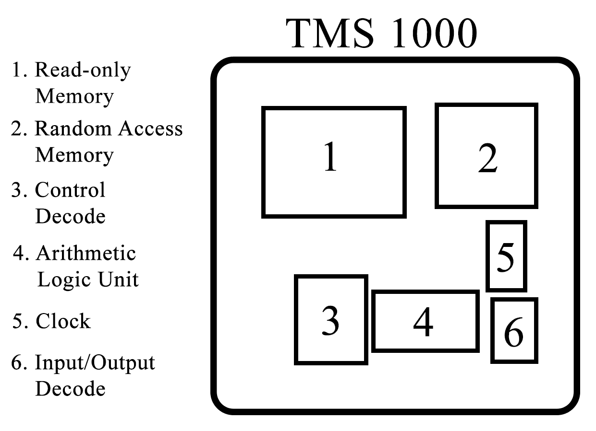

MCU 芯片的尺寸大约为 5 x 5 毫米，足够小以适应 DIP 封装。这种类型的 MCU 使用掩模可编程 ROM，这意味着您不能获得空白的 TMS 1000 芯片并对其进行编程。相反，您必须将经过调试的程序发送给德州仪器，以便使用光刻掩模进行物理生产，从而为每个位产生金属桥。

作为一个相对较原始的设计（相对于后来的 MCUs），它缺乏堆栈和中断，有一组 43 条指令和两个通用寄存器，使其与英特尔 4004 CPU 非常相似。一些型号具有特殊的外围设备，用于驱动**真空荧光显示器**（**VFD**），并且可以持续读取输入以处理用户通过键盘输入而不中断主程序。其基本引脚布局如下：

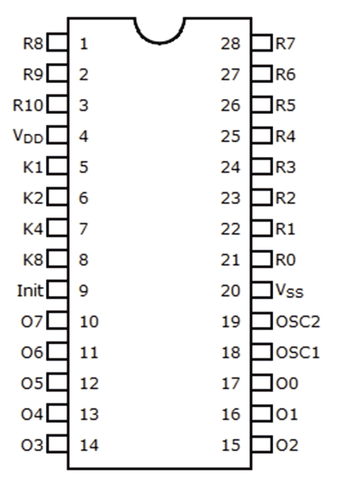

显然，引脚功能早于我们今天所知的通用输入/输出（GPIO）引脚 - K 引脚只能用于输入，而输出引脚标记为 O，控制引脚标记为 R。OSC 引脚需要连接到外部振荡器电路。与离散逻辑 IC 类似，Init 引脚用于在上电时初始化芯片，并且必须保持高电平至少六个周期，而最近的 MCU 则集成了上电复位（POR）和最多需要一个离散电阻和电容的复位引脚。

根据 1974 年德州仪器的原始新闻稿，这些微控制器可以以低至 3 美元的价格购得，如果你大量购买的话甚至更便宜。它们将被用于流行的玩具，如 Speak and Spell，但也会出现在几乎所有其他地方，包括家用电器、汽车和科学设备。到了 1980 年代初停产时，已经销售了数百万台。

有趣的是，尽管一次性可编程的低成本微控制器的价格大大降低，但这类产品仍然存在 - 例如，Padauk PMS150C 现在可以以 0.03 美元的价格购得，虽然它采用 8 位架构，但其 1K 字的 ROM 和 64 字节的 RAM 听起来似曾相识。

# 英特尔 MCS-48

英特尔对德州仪器成功的 TMS 1000 MCU 的回应是 MCS-48 系列，其中 8048、8035 和 8748 是 1976 年发布的第一批型号。8048 具有 1KB 的 ROM 和 64 字节的 RAM。它是一个 8 位设计，采用哈佛结构（分离代码/数据存储器），引入了 8 位本地字长和中断支持（两个单级），并兼容 8080/8085 外围设备，使其成为一款非常多功能的 MCU。更宽的 ALU 和寄存器字长的优势在今天仍然可以感知到，例如，32 位加法在 8 位 MCU 上是作为一系列带进位的 8 位加法依次执行的。

MCS-48 具有超过 96 条指令，其中大多数指令长度为一个字节，并允许在内部存储器之外添加外部存储器。在社区的努力下，MCS-48 系列的相关信息已经被整理并发布在[`devsaurus.github.io/mcs-48/mcs-48.pdf`](https://devsaurus.github.io/mcs-48/mcs-48.pdf)上。

在这里，我们考虑了 MCS-48 功能块图的简单性，并将其与后续产品进行了比较，如下所示：

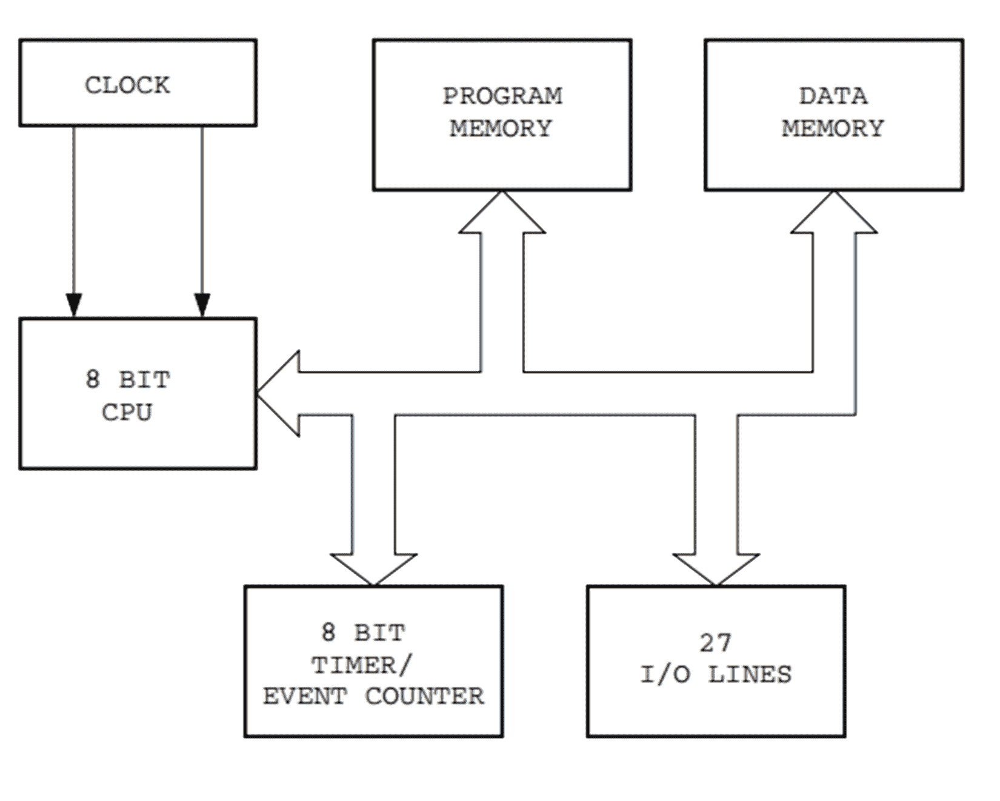

即使是在 TMS 1000 之后的几年内推出的设计，MCU 设计的快速演变也是显而易见的。由于 MCU 设计与当时流行的 CPU 设计一起发展，包括 6502 及其 16 位版本，以及最终成为 M68K 处理器系列的设计，因此可以找到许多相似之处。

由于其灵活的设计，MCS-48 一直保持着流行，并一直生产到 1990 年代，直到 MCS-51（8051）系列逐渐取代它。有关 8051 的更多详细信息，请参见下一节。

MCS-48 被用于原始 IBM PC 的键盘控制器。它还与 80286 和 80386 一起用于执行 A20 线门控和复位功能。后来的 PC 将这些功能集成到超级 I/O 设备中。

MCS-48 的其他显著用途包括 Magnavox Odyssey 视频游戏机和一系列 Korg 和 Roland 模拟合成器。虽然 MCS-48 系列可以选择使用掩模 ROM（最多 2KB），但 87P50 使用外部 ROM 模块进行编程，而 8748 和 8749 则配备了高达 2KB 的 EPROM，这使得 MCU 的内部编程可以重复更改。

与独立的 EPROM 模块一样，这需要包含一个熔合石英窗口的封装，这样紫外线就可以到达 MCU 芯片，正如下面这张 Konstantin Lanzet 拍摄的 8749 MCU 与 EPROM 的照片所示（CC BY-SA 3.0）：

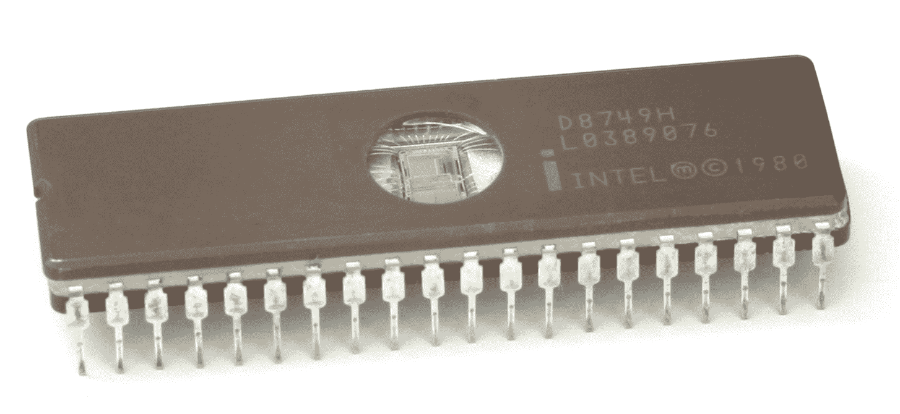

定义写入的 EPROM 单元中存储的电荷在强紫外线照射 20-30 分钟后会消散。在几周的阳光直射下也可以实现相同效果。擦除周期通常意味着取出封装并将其放入密封的擦除设备中。之后，EPROM 可以重新编程。EPROM 的指定数据保留在 85°C 时约为 10-20 年，由于随温度呈指数增长，因此在室温下 100 年或更长时间的声明并不罕见（27C512A：200 年）。

由于制作石英窗口并将其集成到封装中的费用昂贵，一次性可编程 EPROM 曾一度被使用，这样可以轻松编程 EPROM，但将编程后的芯片安装在不透明封装中，因此无法再次重新编程。最终，EEPROM 在 20 世纪 80 年代初开始出现，几乎完全取代了 EPROM。 EEPROM 在开始出现存储数据之前可以重写大约一百万次。它们的数据保留性能与 EPROM 类似。

# 英特尔 MCS-51

从 Cypress CY7C68013A（USB 外围控制器）到 Ti CC2541（蓝牙 SoC）的最新芯片都采用了通用的 8051 核心，这表明英特尔 MCS-51 系列设计至今仍然受欢迎。其他制造商也推出了大量衍生的 MCU，尽管英特尔于 2007 年 3 月停止生产这个系列的 MCU。它是在 20 世纪 80 年代首次推出的，是一种 8 位 MCU，类似于 8048，但在其功能集上有很大的扩展。

如英特尔 80xxAH 数据表中所示的功能模块图如下：

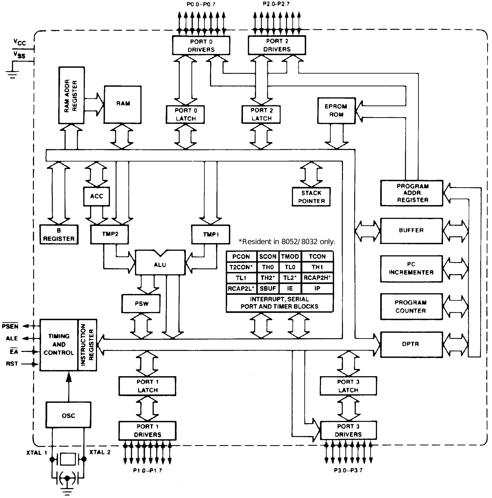

它与 Atmel（现在是微芯片）AT89S51 非常相似，而且至今仍在生产中。

数据表通常在“特性”列表中解释尺寸和性能指标，如下所引用的 AT89S51：

+   4K 字节的**系统内可编程**（ISP）闪存存储器

- 耐久性：10,000 次写入/擦除周期（EEPROM 为 1,000,000 次）

+   4.0V 至 5.5V 的工作范围

+   完全静态操作：0 赫兹至 33 兆赫（曾为 12 兆赫）

+   三级程序存储器锁

+   128 x 8 位内部 RAM

+   32 个可编程 I/O 线路

但随后的列表中还包括现代核心、外围、低功耗和可用性功能：

+   两个 16 位定时器/计数器

+   六个中断源

+   全双工 UART 串行通道

+   低功耗空闲和关机模式

+   中断从掉电模式恢复

+   看门狗定时器

+   双数据指针

+   关机标志

+   快速编程时间

+   灵活的 ISP 编程，字节和页面模式

在过去几十年里，8051 架构的唯一重大变化涉及从原始的**n 型金属氧化物半导体**（NMOS）晶体管技术迁移到**互补 MOS**（CMOS）-通常表示为 80C51-以及最近添加了 USB、I2C 和 SPI 接口，以及自本世纪初以来变得普遍的先进电源管理和调试接口。Atmel 应用说明 3487A 没有对字母 S 给出简明的解释，然而当时新的现场串行编程（ISP）可能因此受到强调。

AT89S51 的引脚图表记录了 SPI 引脚（MOSI，MISO，SCK）：

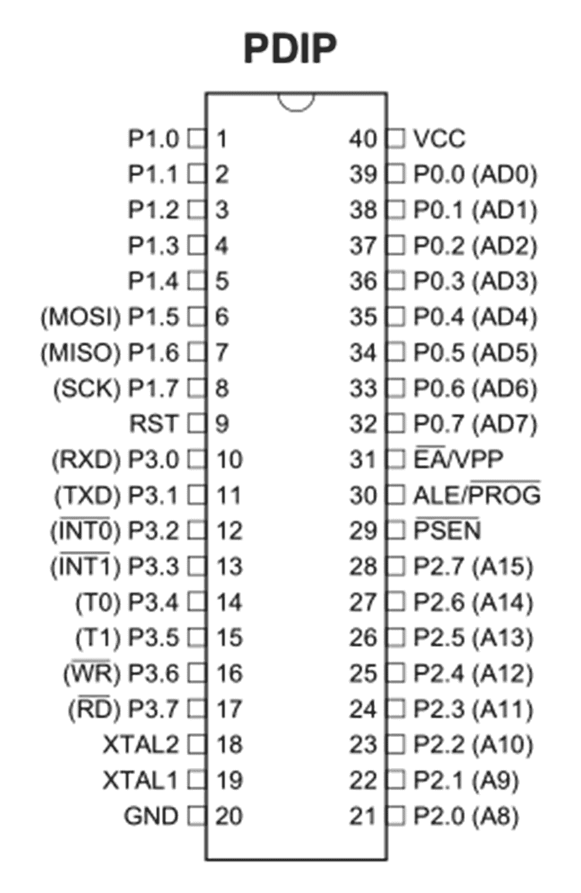

除了独立 MCU 外，8051 核心还集成到更大的系统中，其中低功耗、基本 MCU 专用于各种低速、实时或高 I/O 计数任务。从 Ti CC2541（蓝牙低功耗 SoC）到 Cypress CY7C68013A（FX2LP™ USB 外围控制器）等各种芯片都突显了 8051 架构的实用性和相关性。

在**现场可编程门阵列**（**FPGA**）或**应用特定集成电路**（**ASIC**）开发中，8051 型处理器也常常被部署为软核心，它们被改编并添加到 VHDL 和 Verilog HDL 项目中，以处理更适合顺序执行的任务，而无需紧密的时序或大带宽。软核心的魅力在于能够使用功能齐全的开发和调试工具，同时与其余硬件设计紧密集成。由软核心运行的几百字节程序代码的等效物可能是一个大型状态机，存储器，计数器和 ALU 类似的逻辑，这引发了一个问题，即哪种实现更容易验证和维护。

# PIC

PIC MCU 系列于 1976 年由 General Instrument 首次推出，使用他们的新 CP1600 16 位 CPU。这个 CPU 几乎与 PDP-11 系列处理器兼容，具有其指令集。

1987 年，General Instrument 将其微电子部门剥离出来，创建了 Microchip Technology，该公司于 1989 年成为独立公司。Microchip Technology 至今仍在生产新的 PIC 设计。随着 PIC 核心和外设的发展，芯片内存技术的发展产生了封装紧密的 EPROM，用于及时可编程，后来是 EEPROM，用于电路中的重新编程能力。像大多数 MCU 一样，PIC MCU 具有哈佛结构。如今，PIC 设计从 8 位到 32 位不等，具有各种功能。这是本书撰写时的 PIC 系列：

| **系列** | **引脚** | **内存** | **详情** |
| --- | --- | --- | --- |
| PIC10 | 6-8 | 384-896 字节 ROM，64-512 字节 RAM | 8 位，8-16 MHz，修改的哈佛结构 |
| PIC12 | 8 | 2-16 KB ROM，256 字节 RAM | 8 位，16 MHz，修改的哈佛结构 |
| PIC16 | 8-64 | 3.5-56 KB ROM，1-4 KB RAM | 8 位修改的哈佛结构 |
| PIC17 | 40-68 | 4-16 KB ROM，232-454 字节 RAM | 8 位，33 MHz，被 PIC18 取代，尽管存在第三方克隆产品。 |
| PIC18 | 28-100 | 16-128 KB ROM，3,728-4,096 字节 RAM | 8 位修改的哈佛结构 |
| PIC24（dsPIC） | 14-144 | 64-1,024KB ROM，8-16 KB RAM | 16 位，DsPIC（dsPIC33）MCU 内置数字信号处理（DSP）外设。 |
| PIC32MX | 64-100 | 32-512 KB ROM，8-32 KB RAM | 32 位，200 MHz MIPS M4K 与 MIPS16e 模式，2007 年发布。 |
| PIC32MZ ECPIC32MZ EFPIC32MZ DA | 64-288 | 512-2,048 KB ROM，256-640 KB 静态 RAM（32 MB DDR2 DRAM） | 32 位，MIPS ISA（2013），PIC32MZ DA 版本（2017）具有图形核心。核心速度为 200 MHz（EC，DA）和 252 MHz（EF）。 |
| PIC32MM | 20-64 | 16-256 KB RAM，4-32 KB RAM | 32 位 microMIPS，25 MHz，针对低成本和低功耗进行了优化的变体。 |
| PIC32MK | 64-100 | 512-1,024 KB ROM，128-256 KB RAM | 32 位，120 MHz，MIPS ISA，2017 年推出的变体。针对工业控制和其他形式的深度集成应用。 |

PIC32 系列的有趣之处在于它们基于 MIPS 处理器核心，并使用这个**指令集架构**（**ISA**），而不是所有其他 PIC MCU 使用的 PIC ISA。它们共享的处理器核心设计是 M4K，这是来自 MIPS Technology 的 32 位 MIPS32 核心。在这些系列之间，通过查看各自数据表中的块图，这些差异很容易看出来。

在 PIC 系列微控制器的几十年的发展中，最好以功能块图的形式来体现，因此我们首先看看 PIC10：

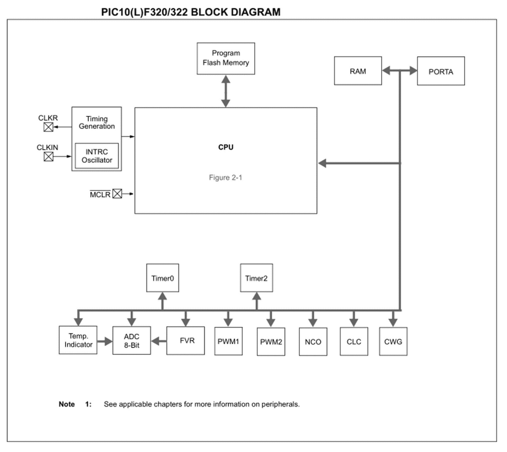

这些都是非常小的 MCU，几乎没有任何外围设备围绕着一个在这里没有更详细定义的处理器核心 - 而参考表中只提到了内存布局。I/O 端口非常简单，我们今天所知道的 I2C 和 UART 接口并没有作为外围逻辑实现。举个例子，接下来的一个控制器，PIC16F84 的数据表非常详细地描述了处理器架构，并显示增加了更多的上电和复位电路，同时扩展了 GPIO 并添加了 EEPROM 以便轻松集成非易失性存储。自包含的串行外围设备仍然不存在。

接下来，我们将看一下 PIC18：

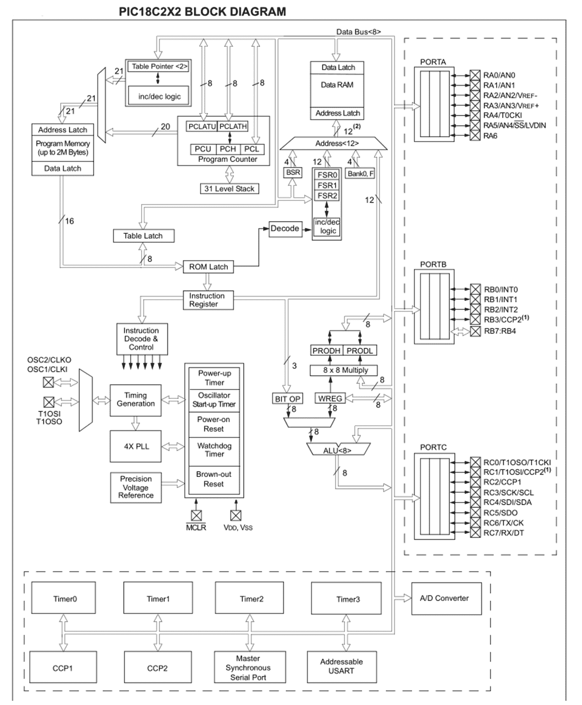

PIC18 系列是最新的 8 位 PIC 架构，MCU 覆盖了各种应用。它比 PIC10、PIC12 和 PIC16 系列有更多的 I/O 选项，同时在 ROM 和 RAM 方面也提供了更多的选项，并且现在提供了 USART 以及用于 4 线 SPI 的同步串行端口。还要注意的是，端口现在具有备用引脚功能，并且从外围设备到引脚的路由以及相应的配置寄存器出于简单起见未显示。

接下来，让我们观察一下在 PIC24 功能块图中，焦点从核心转移到端口和外围设备的能力：

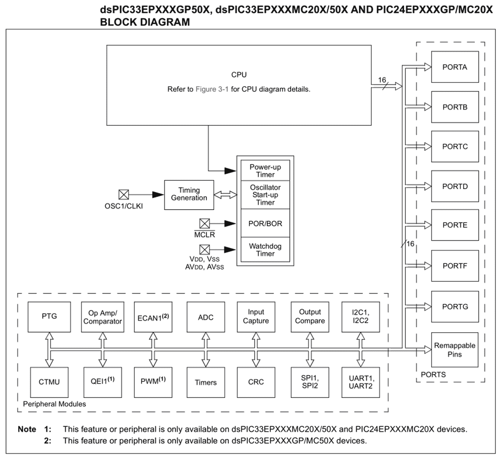

该图与 PIC10 的图类似，CPU 被抽象为相对于 MCU 的单个块。每个`PORT`块都是一组 I/O 引脚，我们的空间已经不足以显示所有可能的引脚功能。

每个 I/O 引脚可以具有固定功能（与外围模块链接），或具有可分配功能（硬件级别重路由，或在软件中完成）。一般来说，MCU 越复杂，I/O 引脚越可能是通用的，而不是固定功能。

最后我们看看 PIC32：

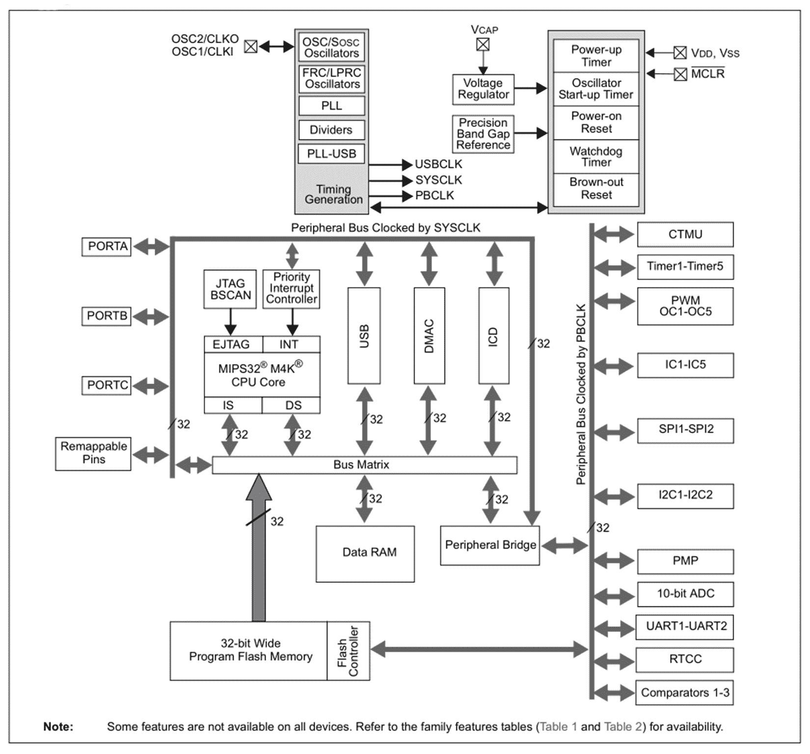

这个块图是 PIC32MX 系列中 PIC32MX1XX/2XX 设备的。它通常以 50 MHz 的频率运行。

PIC32 架构的一个有趣特性是，它通过使程序指令和数据都通过系统总线矩阵传输，有效地将哈佛架构的 M4K MIPS CPU 转变为更类似于冯·诺伊曼架构。请注意，PIC10 图表中专用于单个处理器寄存器的空间现在随意地描绘了一个复杂的数字或混合信号外围设备，或者功能强大的 JTAG 在线编程和调试接口。

# AVR

AVR 架构是由挪威科技学院的两名学生开发的，最初的 AVR MCU 是在北欧 VLSI（现在的北欧半导体）开发的。最初它被称为μRISC，并且可以通过许可获得，直到该技术被出售给 Atmel。第一款 Atmel AVR MCU 于 1997 年发布。

今天，我们可以回顾一系列 8 位 AVR 系列：

| **系列** | **引脚** | **内存** | **详情** |
| --- | --- | --- | --- |
| ATtiny | 6-32 | 0.5-16KB ROM 0-2 KB RAM | 1.6-20 MHz。紧凑、节能的 MCU，具有有限的外围设备。 |
| ATmega | 32-100 | 4-256 KB ROM 0.5-32 KB RAM |  |
| ATxmega | 44-100 | 16-384 KB ROM, 1-32 KB RAM | 32 MHz, 最大的 AVR MCU，具有广泛的外围设备和 DMA 等性能增强功能。 |

Atmel 曾经也有一个 32 位的 AVR32 架构，但随着转向 ARM 32 位架构（SAM），它被 Atmel 废弃了。有关 SAM 的更多详细信息，请参阅*基于 ARM 的 MCU*部分。在相应的[产品选择指南](http://ww1.microchip.com/downloads/en/DeviceDoc/Atmel-45154-Product-Selection-Guide_Brochure.pdf)中可以找到更详细的信息。

此外，Atmel 曾经有所谓的**可编程系统级集成电路**（**FPSLIC**）MCU：混合 AVR/FPGA 系统。这些基本上允许您向 AVR MCU 的硬件添加自己的外围设备和功能。

让我们来看看 ATtiny 系列。这是 ATtiny212/412 系列 MCU 的块图：

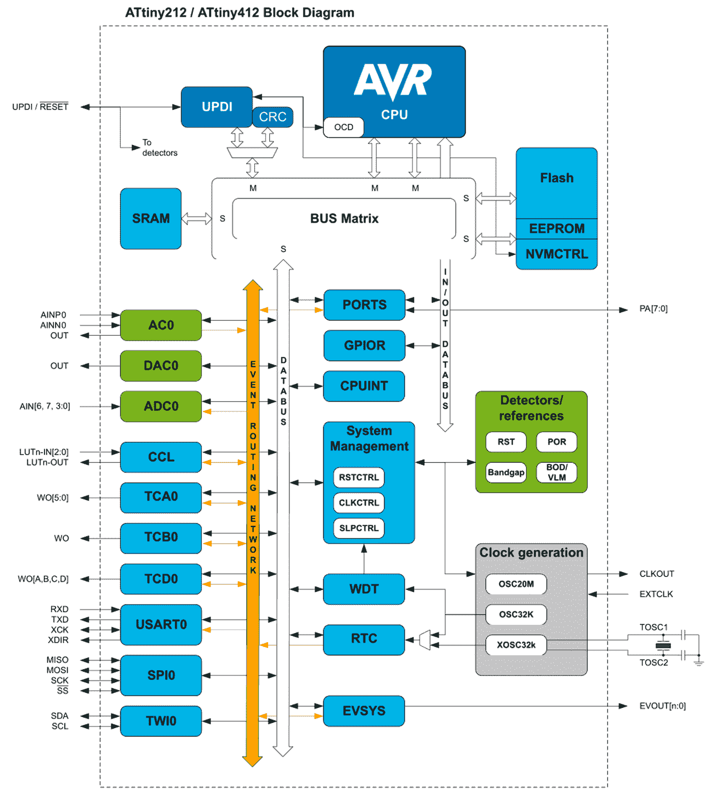

这系列的 ATtiny MCU 可以运行高达 20 MHz，具有高达 4 KB 的 Flash ROM 和 256 字节的 SRAM，以及高达 128 字节的 EEPROM，全部都在一个 8 引脚的封装中。尽管尺寸小，但它有大量的外围设备，可以路由到任何支持的引脚：

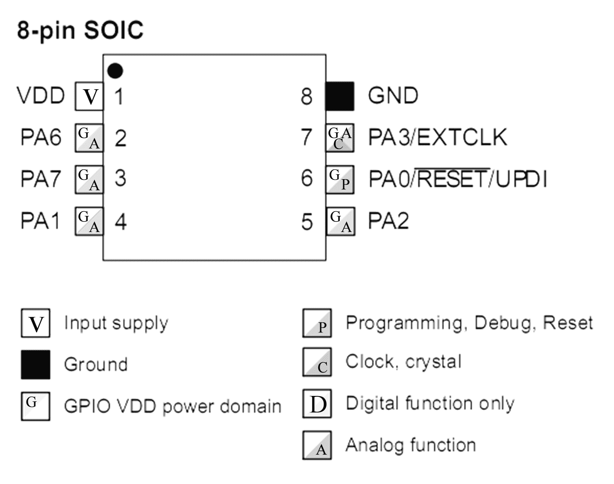

与流行的 ATmega2560 和相关的 MCU 相比，ATtiny 系列 MCU 具有以下特性：

| **设备** | **Flash（KB）** | **EEPROM（KB）** | **RAM（KB）** | **通用 I/O 引脚** | **16 位 PWM 通道** | **UART** | **ADC 通道** |
| --- | --- | --- | --- | --- | --- | --- | --- |
| ATmega640 | 64 | 4 | 8 | 86 | 12 | 4 | 16 |
| ATmega1280 | 128 | 4 | 8 | 86 | 12 | 4 | 16 |
| ATmega1281 | 128 | 4 | 8 | 54 | 6 | 2 | 8 |
| ATmega2560 | 256 | 4 | 8 | 86 | 12 | 4 | 16 |
| ATmega2561 | 256 | 4 | 8 | 54 | 6 | 2 | 8 |

GPIO 引脚数量众多，因此块图相应地更加复杂，有更多的端口块用于 I/O 引脚：

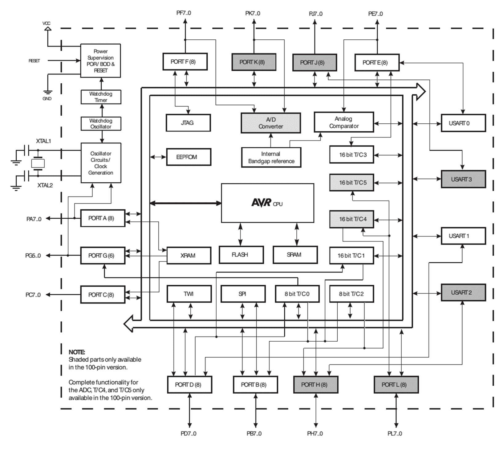

这里，所有的输入和输出箭头都表示一个引脚或引脚块，其中大部分是通用的。由于引脚数量众多，对于物理芯片来说，使用行内封装格式（DIP、SOIC 等）已不再实用。

对于 ATmega640、1280 和 2560，使用了 100 引脚 TQFP 封装，这里显示了每个引脚的功能，如其数据表中所示：

ATxmega 系列与 ATmega 非常相似，具有相似的引脚布局，主要通过架构变化和优化、更多的 ROM 和 RAM 以及外围选项来区分自己。

选择 ATtiny、ATmega 或 ATxmega MCU 首先取决于您对项目的要求，特别是所需的输入和输出、外围设备的类型（串行、SPI、I2C、CAN 等）以及运行此代码所需的代码和 RAM 的大小。

# M68k 和 Z80 基于

Zilog Z80 8 位处理器是与 Intel 8080 兼容的处理器，与其他微处理器在 1980 年代竞争，为家用计算机和游戏系统提供动力，包括任天堂 Game Boy、世嘉 Master System、Sinclair ZX80/ZX81/Spectrum、MSX 和 Tandy TRS-80。

Zilog 于 1994 年推出了基于 Z80 微处理器的 MCU（Z380），并在多年后进行了各种更新，包括 Z8、eZ80 等。Z80 克隆机也很常见。

另一个流行的 1980 年代微处理器是 Motorola 68k（或 68000）。它的 ALU 和外部数据总线为 16 位，但寄存器和内部数据总线为 32 位。在 1979 年推出后，其架构至今仍在使用，Freescale Semiconductor（现在是 NXP）生产了许多 68k 微处理器。

Motorola 推出了许多基于 68k 架构的 MCU，包括 1989 年的 MC68320 通信控制器。当前基于 68k 的 MCU 设计包括 ColdFire，这是一个完全的 32 位设计。

# ARM Cortex-M

一种非常常见的 32 位 MCU 是 ARM Cortex-M 系列。它包括 M0、M0+、M1、M3、M4、M7、M23 和 M33，其中一些具有**浮点单元**（**FPU**）选项，以提高浮点性能。

它们不仅用作独立的 MCU，而且通常集成到**片上系统**（**SoC**）设备中，以提供特定功能，例如触摸屏、传感器或电源管理功能。由于 Arm Holdings 自己不制造任何 MCU，许多第三方制造商已经获得了许可，有时会对设计进行自己的修改和改进。

以下是这些 MCU 的简要概述：

| **核心** | **宣布** | **架构** | **指令集** |
| --- | --- | --- | --- |
| M0 | 2009 | Armv6-M | Thumb-1，部分 Thumb-2。 |
| M0+ | 2012 | Armv6-M | Thumb-1，部分 Thumb-2。 |
| M1 | 2007 | Armv6-M | Thumb-1，部分 Thumb-2。 |
| M3 | 2004 | Armv7-M | Thumb-1，Thumb-2。 |
| M4 | 2010 | Armv7-M | Thumb1，Thumb-2，可选 FPU。 |
| M7 | 2014 | Armv7E-M | Thumb-1，Thumb-2，可选 FPU。 |
| M23 | 2016 | Armv8-M | Thumb-1，部分 Thumb-2。 |
| M33 | 2016 | Armv8-M | Thumb 1，Thumb-2，可选 FPU。 |

Thumb 指令集是紧凑的 16 位长度指令，非常适合嵌入式、资源受限的系统。其他 ARM 微处理器系列也可以支持这个 Thumb 指令集，除了 32 位指令集。

# H8（SuperH）

H8 系列 MCU 通常用于 8 位、16 位和 32 位变体。最初由日立在 1990 年代初创建，直到几年前，瑞萨科技仍在开发新设计，尽管后者建议新设计使用 RX（32 位）或 RL78（16 位）系列。 H8 MCU 的一个显着用途是在使用 H8/300 MCU 的乐高 Mindstorms RCX 控制器中。

# ESP8266/ESP32

ESP 系列是由 Espressif Systems 生产的 32 位 MCU，具有集成的 Wi-Fi（两者）和蓝牙（ESP32）功能。

ESP8266 首次出现在 2014 年，当时由第三方制造商 Ai-Thinker 以模块（ESP-01）的形式销售，可以由另一个 MCU 或基于微处理器的系统使用以提供 Wi-Fi 功能。 ESP-01 模块包含了用于此目的的固件，允许使用 Hayes 风格的调制解调器命令来寻址模块。

其系统规格如下：

+   Tensilica Xtensa Diamond Standard L106 微处理器（32 位）

+   80-160 MHz 的 CPU 速度

+   少于 50 KB 的 RAM 可用于用户应用程序（加载了 Wi-Fi 堆栈）

+   外部 SPI ROM（512 KB 至 16 MB）

+   Wi-Fi 支持 802.11 b/g/n

由于发现 ESP-01 模块上的 32 位 MCU 能够完成比分配给它的简单调制解调器任务更多的任务，因此很快就开始用于更通用的任务，包括一系列升级的 ESP8266 模块（带有集成的 EEPROM 芯片）以及分线板。其中，NodeMCU 风格的板变得非常受欢迎，尽管许多其他第三方制造商也制造了自己的分线板，提供不同的外形和功能。

ESP8266EX 的基本框图如下：

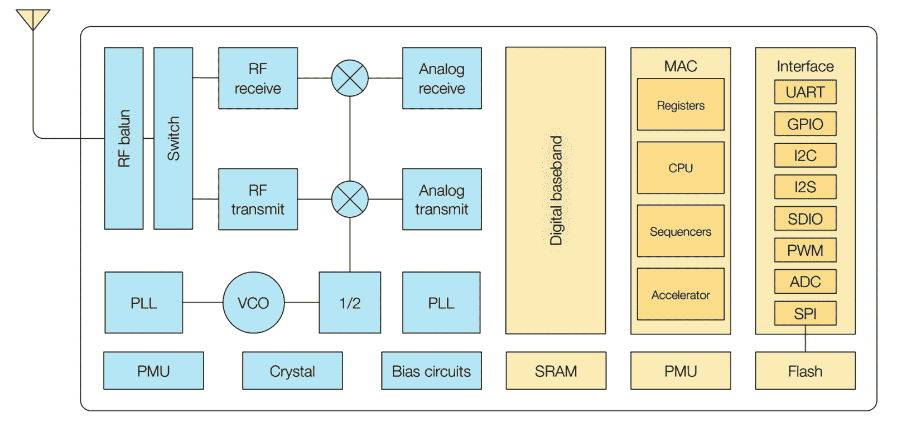

在 ESP8266 取得巨大成功之后，Espressif Systems 开发了 ESP32，其中使用了升级的双核 CPU 等其他更改。其框图如下：

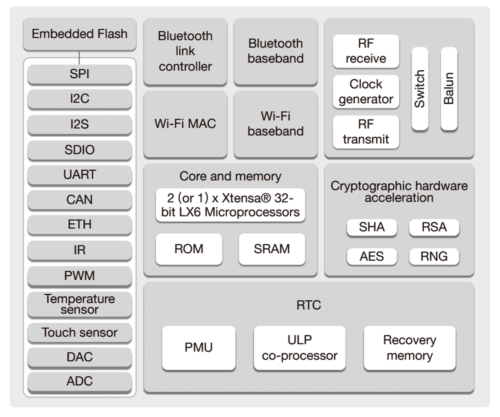

其规格如下：

+   Xtensa 32 位 LX6（双核）微处理器

+   160-240 MHz 的 CPU 速度

+   520 KB 的 SRAM

+   Wi-Fi 支持 802.11 b/g/n

+   蓝牙 v4.2 和 BLE（低功耗）

ESP8266 和 ESP32 通常作为完整的模块出售，其中包括 MCU、外部 ROM 模块和 Wi-Fi 天线，可以集成到板上或者提供外部天线选项：

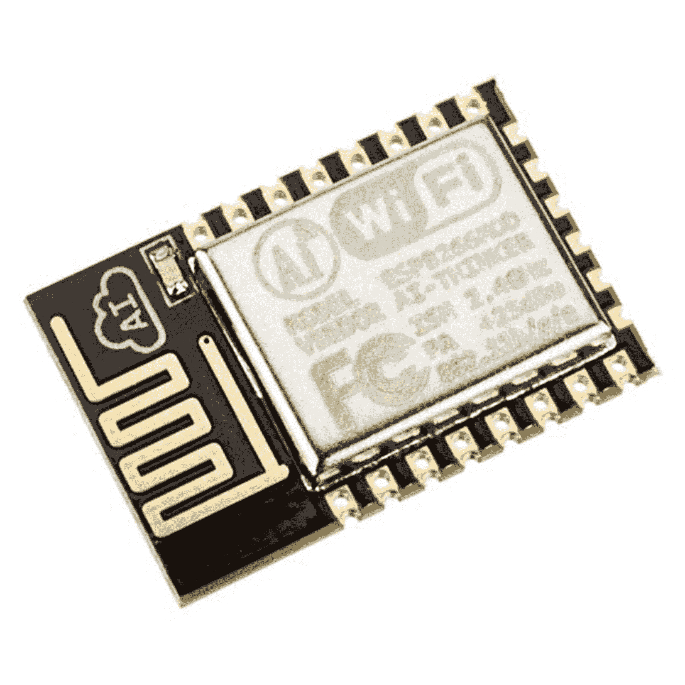

金属屏蔽罩可以保护板子免受电磁干扰的影响，有利于其 Wi-Fi（以及 ESP32 的蓝牙）收发器，但整个设计与固定天线和几何形状对于 FCC 认证和后续作为认可模块的使用是必需的。连接具有更高增益的外部天线可能会违反当地法规。它附带的 FCC ID 对于获得包含这种模块的产品的商业化认可至关重要。

# 其他

除了之前列出的 MCU 之外，还有许多制造商提供不同架构的广泛范围的 MCU。一些，例如 Parallax 的 Propeller MCU 具有多核架构，相当独特，而大多数只是实现通常的单核 CPU 架构，具有许多外围设备、RAM 和内部或外部 ROM。

除了物理芯片，Altera（现在是英特尔）、Lattice Semiconductor 和 Xilinx 提供所谓的软核，这些 MCU 旨在在 FPGA 芯片上运行，可以作为独立组件或作为 FPGA 上更大设计的一部分。这些也可以被 C/C++编译器所针对。

# 挑战

MCU 的主要开发挑战在于相对有限的资源。特别是对于小型、低引脚数的 MCU，你必须清楚一个特定代码需要多少资源（CPU 周期、RAM 和 ROM），以及是否实际上可以添加特定功能。

这也意味着为特定项目选择合适的 MCU 既需要技术知识，也需要经验。前者是为了选择适合任务的 MCU；后者对于最佳 MCU 非常有帮助，并有助于缩短选择所需的时间。

# 片上系统/单板计算机

**片上系统**（**SoCs**）与 MCUs 类似，但它们通过一定程度的集成来区别于那些类型的嵌入式系统，同时仍需要一些外部组件来运行。它们通常作为单板计算机（**SBC**）的一部分，包括 PC/104 标准，以及最近的形式因素，如树莓派和衍生板：

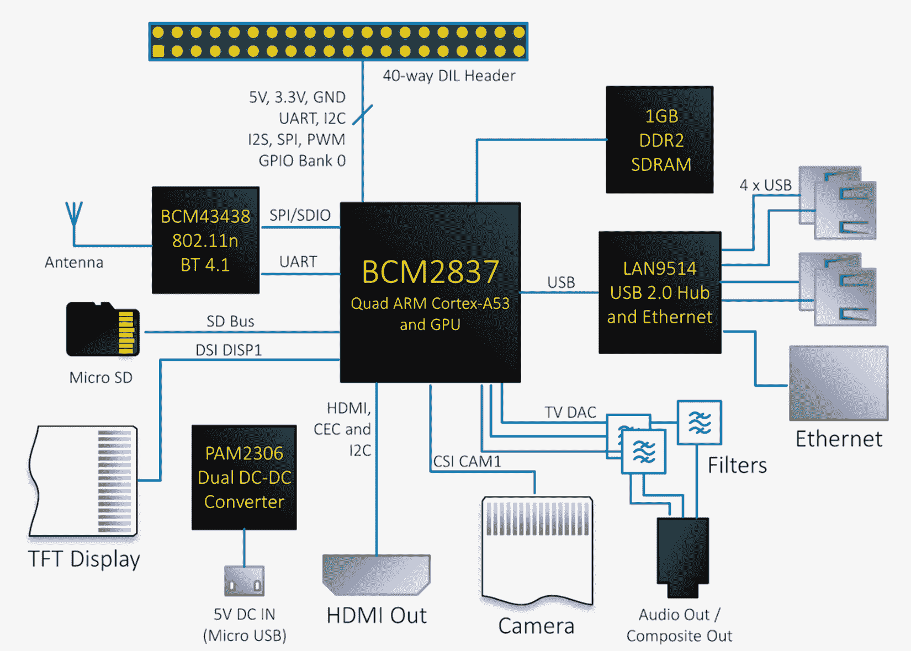

此图表来自[`xdevs.com/article/rpi3_oc/`](https://xdevs.com/article/rpi3_oc/)。它清楚地显示了单板计算机（在本例中是树莓派 3）的布局。BCM2837 是基于 ARM 的 SoC，提供 CPU 核心和基本外围设备（大部分都分布在标题部分）。所有的 RAM 都在外部模块中，以及以太网和 Wi-Fi 外围设备。ROM 以 SD（Flash）卡的形式提供，同时也提供存储。

大多数 SoC 都是基于 ARM（Cortex-A 系列），尽管 MIPS 也很常见。单板计算机在工业环境中常被使用。

其他实例是大量生产的板，比如智能手机的板，它们没有预定义的形式因素，但仍然遵循相同的模式，具有 SoC 和外部 RAM、ROM 和存储，以及各种外围设备。这与上一节的 MCUs 形成对比，后者除了少数需要外部 ROM 外，通常都能够独立运行。

# 挑战

与 MCUs 相比，SoCs 的开发挑战往往要少得多。其中一些是在同一级别，并且具有一个接口，甚至可以直接在设备上进行开发，甚至在设备上进行编译循环，而无需在 PC 上进行交叉编译并复制二进制文件。这也得益于运行完整的操作系统，而不是为裸机开发。

显而易见的缺点是，随着功能的增加，复杂性也增加，导致的问题也增多，比如处理用户帐户、设置权限、管理设备驱动等等。

# 摘要

在本章中，我们深入了解了嵌入式系统的构成。我们学会了如何区分各种类型的嵌入式系统，以及如何确定为项目选择合适的 MCU 或 SoC 的基础知识。

在本章之后，读者应该能够轻松阅读 MCU 和 SoC 的数据表，解释两者之间的区别，并确定对于特定项目需要什么。

下一章将探讨为什么 C++是嵌入式系统编程的高度适合选择。
