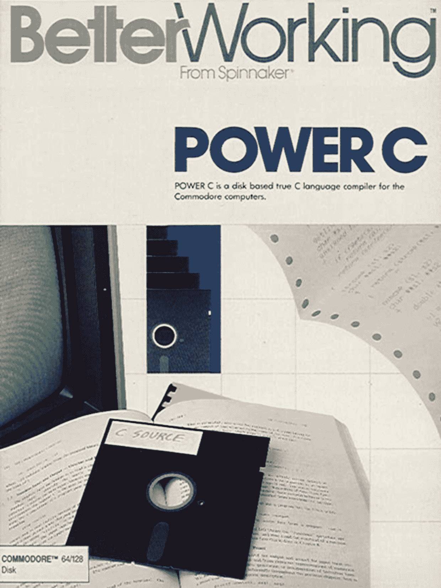

# 第二章：C++作为嵌入式语言

在资源受限的嵌入式系统上进行开发时，通常仅考虑 C 和 ASM 作为可行选择，并伴随着这样的想法：C++的占用空间比 C 大，或者增加了相当多的复杂性。在本章中，我们将详细讨论所有这些问题，并考虑 C++作为嵌入式编程语言的优点：

+   C++相对于 C

+   C++作为多范式语言的优势

+   与现有 C 和 ASM 的兼容性

+   C++11、C++14 和 C++17 的变化

# C++相对于 C

C 和 C++的谱系都可以追溯到 ALGOL 编程语言，该语言于 1958 年推出第一个版本（ALGOL 58），随后在 1960 年和 1968 年进行了更新。ALGOL 引入了命令式编程的概念——一种编程风格，其中语句明确告诉计算机如何对数据进行更改以输出和控制流。

从命令式编程中自然而然地出现的一种范式是使用过程。我们将从一个示例开始，介绍这个术语。过程与子例程和函数是同义词。它们标识了一组语句，并使它们自包含，这样就限制了这些语句的范围，使其仅限于它们所包含的部分，从而创建了层次结构，并因此将这些过程引入为新的、更抽象的语句。这种过程式编程风格的大量使用与所谓的结构化编程并存，结构化编程还包括循环和分支控制结构。

随着时间的推移，结构化和模块化编程风格被引入为改进应用程序代码的开发、质量和可维护性的技术。C 语言是一种命令式、结构化的编程语言，因为它使用了语句、控制结构和函数。

例如，C 中的标准 Hello World 示例：

```cpp
#include <stdio.h> 
int main(void) 
{ 
    printf("hello, world"); 
    return 0; 
} 
```

任何 C（和 C++）应用程序的入口点是`main()`函数（过程）。在这个函数的第一条语句行中，我们调用另一个过程（`printf()`），它包含自己的语句，并可能调用其他语句块，以额外的函数形式。

通过实现一个`main()`逻辑块（`main()`函数），我们已经使用了过程式编程，根据需要调用它。虽然`main()`函数只会被调用一次，但过程式风格在`printf()`语句中再次出现，它在应用程序的其他地方调用语句，而无需显式复制它们。应用过程式编程使得维护生成的代码变得更加容易，并创建可以在多个应用程序中使用的代码库，同时只维护一个代码库。

1979 年，Bjarne Stroustrup 开始了*C with Classes*的工作，他在其中采用了 C 的现有编程范式，并从其他语言中添加了元素，特别是 Simula（面向对象编程：命令式和结构化）和 ML（模板形式的泛型编程）。它还提供了**Basic Combined Programming Language**（**BCPL**）的速度，而不限制开发人员的低级关注。

这种结果是多范式语言在 1983 年更名为**C++**，同时增加了 C 中没有的其他特性，包括运算符和函数重载、虚函数、引用，并开始为这种 C++语言开发独立的编译器。

C++的基本目标一直是为现实世界的问题提供实际解决方案。此外，C++一直意图成为更好的 C，因此得名。 Stroustrup 本人在《Evolving C++ 1991-2006》中定义了一些规则，包括以下规则，这些规则至今仍驱动着 C++的发展：

+   C++的发展必须受到真实问题的驱动

+   每个特性必须有一个相当明显的实现

+   C++是一种语言，而不是一个完整的系统

+   不要试图强迫人们使用特定的编程风格

+   不会有静态类型系统的隐式违规。

+   为用户定义的类型提供与内置类型一样好的支持

+   不留下 C++以下的低级语言（除了汇编语言）

+   不使用的东西就不需要付费（零开销规则）

+   如果有疑问，提供手动控制的手段

相对于 C 语言的差异显然不仅仅是面向对象编程。尽管人们仍然认为 C++只是 C 的一组扩展，但它长期以来一直是自己的语言，增加了严格的类型系统（与当时的 C 的弱类型系统相比），更强大的编程范式和 C 中找不到的特性。因此，它与 C 的兼容性更多地可以被看作是巧合，C 恰好是在正确的时间用作基础语言。

当时 Simula 的问题在于它对于一般用途来说太慢了，而 BCPL 则太低级。C 语言在当时是一个相对较新的语言，它在功能和性能之间提供了合适的平衡。

# C++作为嵌入式语言

大约在 1983 年，当 C++刚刚被构想出来并得到了名字时，面向一般用户以及企业的流行个人计算机系统的规格如下表所列：

| **系统** | **CPU** | **时钟速度（MHz）** | **RAM（KB）** | **ROM（KB）** | **存储（KB）** |
| --- | --- | --- | --- | --- | --- |
| BBC Micro | 6502（B+ 6512A） | 2 | 16-128 | 32-128 | 最大 1,280（ADFS 软盘）最大 20 MB（硬盘） |
| MSX | Zilog Z80 | 3.58 | 8-128 | 32 | 720（软盘） |
| Commodore 64 | 6510 | ~1 | 64 | 20 | 1,000（磁带）170（软盘） |
| Sinclair ZX81 | Zilog Z80 | 3.58 | 1 | 8 | 15（插卡） |
| IBM PC | Intel 8080 | 4.77 | 16-256 | 8 | 360（软盘） |

现在将这些计算机系统与最近的 8 位**微控制器**（**MCU**）AVR ATMega 2560 的规格进行比较：

+   16 MHz 时钟速度

+   8 KB RAM

+   256 KB ROM（程序）

+   4 KB ROM（数据）

ATMega 2560 于 2005 年推出，是当今可用的更强大的 8 位 MCU 之一。它的功能与 1980 年代的计算机系统相比有了很大的提升，而且 MCU 不依赖于任何外部存储器组件。

如今，由于改进的硅 IC 制造工艺，MCU 的核心时钟速度显著更快，这也提供了更小的芯片尺寸、更高的吞吐量，因此成本更低，而且 1980 年代的架构通常需要 2 到 5 个时钟周期来检索、解码、执行指令并存储结果，而 AVR 的单周期执行性能则不同。

当前 MCU（静态）RAM 的限制主要是由成本和功耗约束造成的，但对于大多数 MCU 来说，可以很容易地通过使用外部 RAM 芯片以及添加低成本的基于闪存的或其他大容量存储设备来规避这些限制。

像**Commodore 64**（C64）这样的系统通常是用 C 语言编程的，除了内置的 BASIC 解释器（内置 ROM 中）。Commodore 64 的一个著名的 C 开发环境是 Spinnaker 发布的 Power C：



Power C 是面向 C 开发人员的一种生产力软件品牌。它放在一张单面、双面软盘上，允许您在编辑器中编写 C 代码，然后使用包含的编译器、链接器、头文件和库来编译生成系统的可执行文件。

当时存在许多这样的编译器集合，针对各种系统，显示出了丰富的软件开发生态系统。其中，C++当然是一个新手。Stroustrup 的《C++程序设计语言》第一版是在 1985 年出版的，但最初并没有一个稳固的语言实现与之配套。

然而，对于 C++ 的商业支持开始迅速出现，主要的开发环境，如 Borland C++ 1.0 在 1987 年发布，并在 1991 年更新到 2.0。这些开发环境特别在 IBM PC 及其众多克隆机上得到使用，那里没有像 BASIC 这样的首选开发语言。

虽然 C++ 在 1985 年开始作为非官方标准，但直到 1989 年第二版 *The C++ Programming Language* 的发布作为权威作品，C++ 才达到了大约与 ISO/IEC 14882:1998（通常称为 C++98）首次标准化的功能水平相等。可以说，C++ 在 1990 年摩托罗拉 68040 和 1992 年英特尔 486DX 出现之前就已经有了显著的发展和采用，这将处理能力提升到了 20 MIPS 以上。

现在我们已经考虑了早期硬件规格和 C++ 与 C 以及当时旨在在相对有限的系统上使用的其他语言的发展，似乎可以认为 C++ 完全有能力在这样的硬件上运行，从而在现代微控制器上运行。然而，似乎有必要问问自从那时以来增加到 C++ 中的复杂性在多大程度上影响了内存或计算性能要求。

# C++ 语言特性

我们之前看过数据和系统状态的显式变化性质，这定义了命令式编程与声明式编程的区别，声明式编程不是在循环中操作数据，而是将功能声明为将运算符映射到某些数据，从而阐明功能，而不是具体操作的顺序。但为什么编程语言必须必然是命令式和声明式范式之间的选择呢？

事实上，C++ 的主要区别特征之一是其多范式性质，同时使用命令式和声明式范式。通过将面向对象、泛型和函数式编程纳入 C++，除了 C 的过程式编程之外，似乎自然而然地会认为这一切都必须付出代价，无论是在 CPU 使用率方面还是在内存和/或 ROM 消耗方面。

然而，正如我们在本章前面学到的，C++ 语言特性最终是建立在 C 语言之上的，因此应该没有或几乎没有相对于在纯 C 中实现类似构造的开销。为了解决这个难题，并调查低开销假设的有效性，我们现在将详细研究一些 C++ 语言特性，以及它们最终是如何实现的，以及它们在二进制和内存大小方面的相应成本。

一些专门关注 C++ 作为低级嵌入式语言的例子是在得到 Rud Merriam 的 Code Craft 系列的许可后使用的，该系列已在 Hackaday 上发布：[`hackaday.io/project/8238-embedding-c`](https://hackaday.io/project/8238-embedding-c)。

# 命名空间

命名空间是引入应用程序中的额外作用域级别的一种方式。正如我们在早期关于类的部分中看到的那样，这些是编译器级别的概念。

主要用途在于模块化代码，将其分成逻辑段，以便在类不是最明显的解决方案的情况下，或者在您想要明确将类排序到特定类别中使用命名空间的情况下。这样，您还可以避免类似命名的类、类型和枚举之间的名称和类型冲突。

# 强类型

类型信息对于测试对数据的正确访问和解释是必要的。C++ 中一个与 C 相关的重要特性是强类型系统的包含。这意味着编译器执行的许多类型检查比 C 允许的要严格得多，C 是一种弱类型语言。

当看这段合法的 C 代码时，这一点显而易见，当编译为 C++ 时会生成错误：

```cpp
void* pointer; 
int* number = pointer; 
```

或者，它们也可以以以下方式编写：

```cpp
int* number = malloc(sizeof(int) * 5); 
```

C++禁止隐式转换，要求将这些示例写成如下形式：

```cpp
void* pointer; 
int* number = (int*) pointer; 
```

它们也可以以以下方式编写：

```cpp
int* number = (int*) malloc(sizeof(int) * 5); 
```

由于我们明确指定了要转换的类型，我们可以放心，在编译时任何类型转换都会按我们的期望进行。

同样，如果我们试图从一个没有这个限定符的引用中赋值给一个带有`const`限定符的变量，编译器也会抱怨并抛出错误：

```cpp
const int constNumber = 42; 
int number = &constNumber; // Error: invalid initialization of reference. 
```

为了解决这个问题，您需要显式地进行以下转换：

```cpp
const int constNumber = 42; 
int number = const_cast<int&>(constNumber); 
```

像这样进行显式转换是完全可能和有效的。但是，当使用这个引用来修改被假定为常量值的内容时，可能会在以后引起巨大的问题和头痛。然而，当你发现自己编写类似上面的代码时，可以合理地假定你已经意识到了这些影响。

这种强制使用显式类型的做法有一个重要的好处，就是使得静态分析比在弱类型语言中更有用和有效。这反过来又有利于运行时安全性，因为任何转换和赋值很可能是安全的，没有意外的副作用。

由于类型系统主要是编译器的特性，而不是任何一种运行时代码，（可选的）运行时类型信息是一个例外。在 C++中，具有强类型的类型系统的开销只在编译时才会被注意到，因为对每个变量赋值、操作和转换都必须执行更严格的检查。

# 类型转换

每当将一个值赋给一个兼容的变量时，就会发生类型转换，这个变量的类型并不完全相同。每当存在转换规则时，这种转换可以隐式进行，否则可以向编译器提供一个显式提示（转换）来调用特定的规则，以解决模糊性。

C 只有隐式和显式类型转换，而 C++通过一些基于模板的函数进行了扩展，允许以各种方式转换常规类型和对象（类）：

+   `dynamic_cast <new_type>`（表达式）

+   `reinterpret_cast <new_type>`（表达式）

+   `static_cast <new_type>`（表达式）

+   `const_cast <new_type>`（表达式）

在这里，`dynamic_cast`保证了结果对象是有效的，依赖于**运行时类型信息**（**RTTI**）（请参见后面关于它的部分）。`static_cast`类似，但不验证结果对象。

接下来，`reinterpret_cast`可以将任何东西转换为任何东西，甚至是不相关的类。这种转换是否有意义留给开发人员决定，就像常规的显式转换一样。

最后，`const_cast`很有趣，因为它可以设置或移除一个值的`const`状态，当你只需要一个函数的非`const`版本时，这可能很有用。然而，这也绕过了类型安全系统，应该非常谨慎地使用。

# 类

**面向对象编程**（**OOP**）自 Simula 以来就存在，Simula 以其缓慢的语言而闻名。这导致 Bjarne Stroustrup 基于快速高效的 C 编程语言来实现他的 OOP。

C++使用 C 风格的语言构造来实现对象。当我们看 C++代码及其对应的 C 代码时，这一点变得很明显。

当查看 C++类时，我们看到它的典型结构：

```cpp
namespace had { 
using uint8_t = unsigned char; 
const uint8_t bufferSize = 16;  
    class RingBuffer { 
        uint8_t data[bufferSize]; 
        uint8_t newest_index; 
        uint8_t oldest_index;  
        public: 
        enum BufferStatus { 
            OK, EMPTY, FULL 
        };  
        RingBuffer();  
        BufferStatus bufferWrite(const uint8_t byte); 
        enum BufferStatus bufferRead(uint8_t& byte); 
    }; 
} 
```

这个类也在一个命名空间内（我们将在后面的部分更详细地看一下），一个`unsigned char`类型的重新定义，一个命名空间全局变量定义，最后是类定义本身，包括私有和公共部分。

这段 C++代码定义了许多不同的作用域，从命名空间开始，到类结束。类本身在其公共、受保护和私有访问级别方面增加了作用域。

同样的代码也可以在常规的 C 中实现：

```cpp
typedef unsigned char uint8_t; 
enum BufferStatus {BUFFER_OK, BUFFER_EMPTY, BUFFER_FULL}; 
#define BUFFER_SIZE 16 
struct RingBuffer { 
   uint8_t data[BUFFER_SIZE]; 
   uint8_t newest_index; 
   uint8_t oldest_index; 
};  
void initBuffer(struct RingBuffer* buffer); 
enum BufferStatus bufferWrite(struct RingBuffer* buffer, uint8_t byte); 
enum BufferStatus bufferRead(struct RingBuffer* buffer, uint8_t *byte); 
```

`using`关键字类似于`typedef`，因此在这里有一个直接的映射。我们使用`const`代替`#define`。`enum`在 C 和 C++之间本质上是相同的，只是 C++的编译器在作为类型使用时不需要显式标记`enum`。当涉及到简化 C++代码时，对于结构体也是如此。

C++类本身在 C 中实现为包含类变量的`struct`。当创建类实例时，这实质上意味着初始化了这个`struct`的一个实例。然后，这个`struct`实例的指针在调用 C++类的函数时被传递。

这些基本示例向我们展示了，与基于 C 的代码相比，我们使用的任何 C++特性都没有运行时开销。命名空间、类访问级别（public、private 和 protected）等仅由编译器用于验证正在编译的代码。

C++代码的一个很好的特点是，尽管性能相同，但它需要更少的代码，同时还允许您定义严格的接口访问级别，并且在类被销毁时调用析构函数类方法，从而允许您自动清理分配的资源。

使用 C++类遵循以下模式：

```cpp
had::RingBuffer r_buffer;  
int main() { 
    uint8_t tempCharStorage;     
    // Fill the buffer. 
    for (int i = 0; r_buffer.bufferWrite('A' + i) == 
    had::RingBuffer::OK; i++)    { 
        // 
    } 
    // Read the buffer. 
    while (r_buffer.bufferRead(tempCharStorage) == had::RingBuffer::OK) 
    { 
         // 
    } 
} 
```

这与 C 版本的比较如下：

```cpp
struct RingBuffer buffer;  
int main() { 
    initBuffer(&buffer); 
    uint8_t tempCharStorage;  
    // Fill the buffer. 
    uint8_t i = 0; 
    for (; bufferWrite(&buffer, 'A' + i) == BUFFER_OK; i++) {          
        // 
    }  
    // Read the buffer. 
    while (bufferRead(&buffer, &tempCharStorage) == BUFFER_OK) { // 
    } 
} 
```

使用 C++类与使用 C 风格的方法并没有太大的不同。不需要为每个功能调用手动传递分配的`struct`实例，而是调用类方法，这可能是最大的区别。这个实例仍然以`this`指针的形式可用，指向类实例。

虽然 C++示例在`RingBuffer`类中使用了命名空间和嵌入枚举，但这些只是可选功能。人们仍然可以使用全局枚举，或者在命名空间的范围内，或者有许多层的命名空间。这在很大程度上取决于应用程序的要求。

至于使用类的成本，本节示例的版本已针对 Arduino UNO（ATMega328 MCU）和 Arduino Due（AT91SAM3X8E MCU）开发板进行了编译，给出了编译代码的以下文件大小：

|  | **Uno** | **Due** |  |  |
| --- | --- | --- | --- | --- |
| **C** | **C++** | **C** | **C++** |  |
| **全局范围数据** | 614 | 652 | 11,184 | 11,196 |
| **主范围数据** | 664 | 664 | 11,200 | 11,200 |
| **四个实例** | 638 | 676 | 11,224 | 11,228 |

这些代码文件大小的优化设置为`-O2`。

在这里，我们可以看到一旦编译，C++代码与 C 代码是相同的，除了在全局类实例的初始化上，由于增加的代码来执行这个初始化，Uno 的代码量为 38 字节。

由于这段代码只需要存在一个实例，这是一个我们只需要支付一次的固定成本：在第一行和最后一行，我们有一个和四个类实例或它们的等价物，然而 Uno 固件中只有额外的 38 字节。对于 Due 固件，我们可以看到类似的情况，尽管没有那么明显。这种差异可能受到一些其他设置或优化的影响。

这告诉我们有时我们不希望编译器为我们初始化一个类，但如果我们需要最后几个字节的 ROM 或 RAM，我们应该自己做。然而，大多数情况下这不会成为问题。

# 继承

除了允许您将代码组织成对象之外，类还允许通过多态性将类作为其他类的模板。在 C++中，我们可以将任意数量的类的属性合并到一个新的类中，赋予它自定义的属性和方法。

这是一种非常有效的创建**用户定义类型**（**UDTs**）的方法，特别是当与运算符重载结合使用来使用常见运算符为 UDT 定义加法、减法等操作时。

C++中的继承遵循以下模式：

```cpp
class B : public A { // Private members. public: // Additional public members. }; 
```

在这里，我们声明一个类`B`，它派生自类`A`。这使我们可以在类 B 的实例上使用类 A 中定义的任何公共方法，就好像它们一开始就是在后者中定义的一样。

所有这些似乎都很容易理解，即使在我们开始从多个基类派生的那一刻，事情可能会变得有点混乱。然而，通过适当的规划和设计，多态性可以成为一个非常强大的工具。

不幸的是，这些都没有回答使用多态性会给我们的代码增加多少额外开销的问题。我们之前看到，C++类本身在运行时不会增加任何开销，但通过从一个或多个基类派生，预期生成的代码将会变得复杂得多。

幸运的是，情况并非如此。与简单类一样，由此产生的派生类是基础结构的简单融合，这些基础结构构成了类的实现。继承过程本身以及随之而来的验证，主要是一个编译时问题，为开发人员带来了各种好处。

# 虚基类

有时，对于基类来说，为一个类方法提供实现并不太合理，但与此同时，我们希望强制任何派生类实现该方法。解决这个问题的答案是虚拟方法。

考虑以下类定义：

```cpp
class A { 
public: 
   virtual bool methodA() = 0; 
   virtual bool methodB() = 0; 
}; 
```

如果我们尝试从这个类派生，我们必须实现这两个类方法，否则会得到编译器错误。由于基类中的两个方法都是虚拟的，整个基类被称为虚基类。这对于希望定义一个可以由一系列不同类实现的接口，同时保留只有一个用户定义类型来引用的便利性非常有用。

在内部，这些虚拟方法是使用`vtables`实现的，它是*虚拟表*的缩写。这是一个数据结构，对于每个虚拟方法，都包含一个指向该方法实现的内存地址（指针）：

```cpp
VirtualClass* → vtable_ptr → vtable[0] → methodA() 
```

我们可以将这种间接级别对性能的影响与 C 风格代码和具有直接方法调用的类进行比较。 Code Craft 关于虚拟函数定时的文章（[`hackaday.com/2015/11/13/code-craft-embedding-c-timing-virtual-functions/`](https://hackaday.com/2015/11/13/code-craft-embedding-c-timing-virtual-functions/)）描述了这样一种方法，并得出了有趣的发现：

|  | `Uno` | `Due` |  |  |
| --- | --- | --- | --- | --- |
| `Os` | `O2` | `Os` | `O2` |  |
| **C 函数调用** | 10.4 | 10.2 | 3.7 | 3.6 |
| **C++直接调用** | 10.4 | 10.3 | 3.8 | 3.8 |
| **C++虚拟调用** | 11.1 | 10.9 | 3.9 | 3.8 |
| **多个 C 调用** | 110.4 | 106.3 | 39.4 | 35.5 |
| **C 函数指针调用** | 105.7 | 102.9 | 38.6 | 34.9 |
| **C++虚拟调用** | 103.2 | 100.4 | 39.5 | 35.2 |

这里列出的所有时间都以微秒为单位。

这个测试使用了与比较 C 代码和 C++类之间的编译输出大小相同的两个 Arduino 开发板。使用了两种不同的优化级别来比较这些编译器设置的影响：-Os 优化生成的二进制文件的大小（以字节为单位），而`-O2`设置优化速度，比`-O1`优化级别更为激进。

从这些定时中，我们可以确定虚拟方法引入的间接级别是可以测量的，尽管不是很显著，在 Arduino Uno 开发板的 ATMega328 上增加了整整 0.7 微秒，在更快的基于 ARM 的开发板上增加了约 0.1 微秒。

即使从绝对角度来看，虚拟类方法的使用也不会带来足够的性能损失，除非性能至关重要，这主要是在较慢的 MCU 上。 MCU 的 CPU 速度越快，使用它的影响就越不严重。

# 函数内联

在 C++中，内联关键字是对编译器的提示，让它知道我们希望每次调用以此关键字为前缀的函数时，都会得到该函数的实现，而不是将其复制到调用位置，从而跳过函数调用的开销。

这是一种编译时优化，每次对内联函数的不同调用只会将函数实现的大小添加到编译器输出中一次。

# 运行时类型信息

RTTI 的主要目的是允许使用安全的类型转换，就像使用`dynamic_cast<>`操作符一样。由于 RTTI 涉及为每个多态类存储额外信息，因此会有一定的开销。

这是一个运行时特性，正如名称所示，因此如果您不需要它提供的功能，可以禁用它。在一些嵌入式平台上禁用 RTTI 是常见做法，特别是在低资源平台上很少使用，比如 8 位 MCU。

# 异常处理

异常通常在桌面平台上使用，提供了一种为错误条件生成异常并在 try/catch 块中捕获和处理的方法。

虽然异常支持本身并不昂贵，但生成异常相对昂贵，需要大量的 CPU 时间和 RAM 来准备和处理异常。您还必须确保捕获每个异常，否则可能导致应用程序在没有明确原因的情况下终止。

异常与检查方法返回代码之间的区别是需要根据具体情况来决定的，也可能是个人偏好的问题。这需要一种完全不同的编程风格，可能并不适合每个人。

# 模板

人们经常认为 C++中的模板非常沉重，并且使用它们会带来严重的惩罚。这完全忽略了模板的本质，即模板只是用作从单个模板自动生成几乎相同代码的一种简便方法 - 因此得名。

这实际上意味着对于我们定义的任何函数或类模板，每次引用模板时，编译器都会生成模板的内联实现。

这是我们在 C++标准模板库（STL）中经常看到的一种模式，正如其名称所示，它大量使用模板。例如，像一个简单的 map 这样的数据结构：

```cpp
std::map<std::string, int> myMap; 
```

这里发生的是编译器会获取`std::map`的单一模板，以及我们在尖括号内提供的模板参数，填充模板并在其位置写入内联实现。

实际上，我们得到的是与手动编写整个数据结构实现相同的实现，只是针对这两种类型。由于替代方案将是为每种可想象的内置类型和额外的用户定义类型手动编写每个实现，使用通用模板可以节省大量时间，而不会牺牲性能。

# 标准模板库

C++的标准库（STL）包含了一个全面且不断增长的函数、类等集合，允许执行常见任务而无需依赖外部库。STL 的 string 类非常受欢迎，可以安全地处理字符串，而无需处理空终止符或类似的内容。

大多数嵌入式平台支持 STL 的全部或至少是重要部分，除了可用 RAM 等方面的限制，阻止了完整哈希表和其他复杂数据结构的实现。许多嵌入式 STL 实现都包含针对目标平台的优化，最小化 RAM 和 CPU 的使用。

# 可维护性

在前面的章节中，我们看到了 C++提供的许多特性，以及在资源有限的平台上使用它们的可行性。使用 C++的一个重要优势是通过使用模板来减小代码大小，以及使用类、命名空间等来组织和模块化代码库。

通过在代码中努力实现更模块化的方法，并在模块之间建立清晰的接口，使得在项目之间重用代码变得更加可行。这也通过使特定代码部分的功能更清晰，并为单元测试和集成测试提供明确的目标，简化了代码的维护。

# 总结

在本章中，我们解决了为什么要在嵌入式开发中使用 C++的重要问题。我们看到，由于 C++的开发方式，它非常适用于资源受限的平台，同时提供了许多对项目管理和组织至关重要的特性。

读者现在应该能够描述 C++的主要特性，并提供每个特性的具体示例。在编写 C++代码时，读者将清楚地了解特定语言特性的成本，能够理由为什么一个代码部分的实现优于另一个实现，基于空间和 RAM 约束。

在下一章中，我们将介绍基于**单板计算机**（SBCs）等系统的嵌入式 Linux 开发过程。
