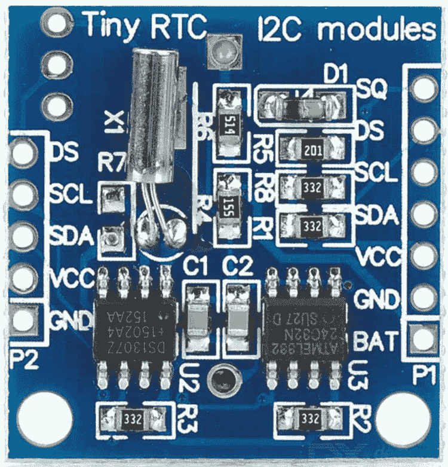
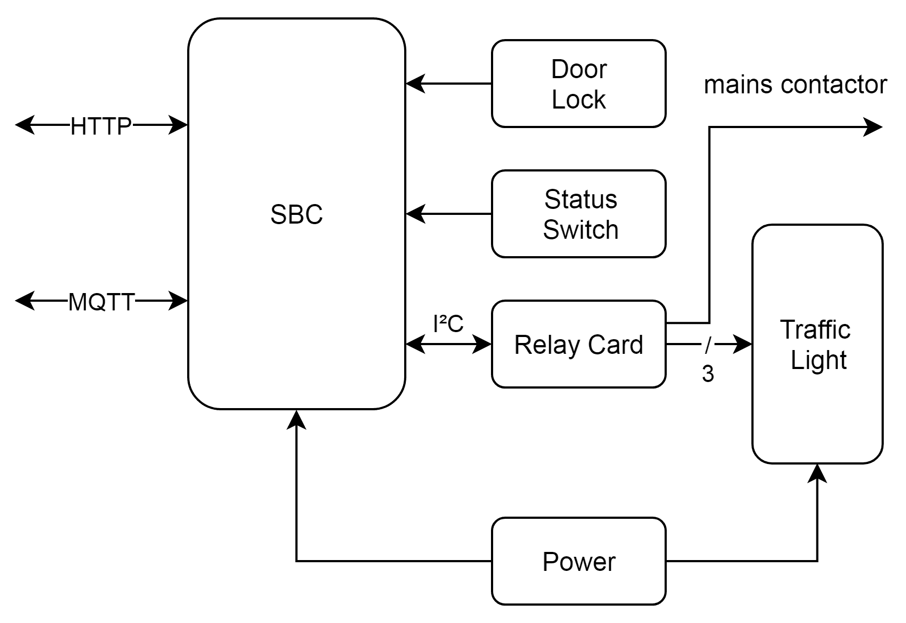
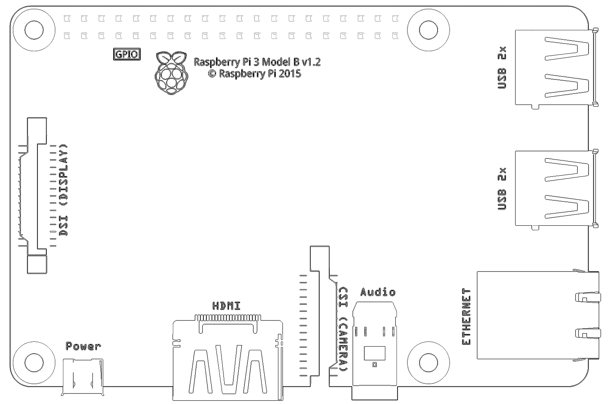
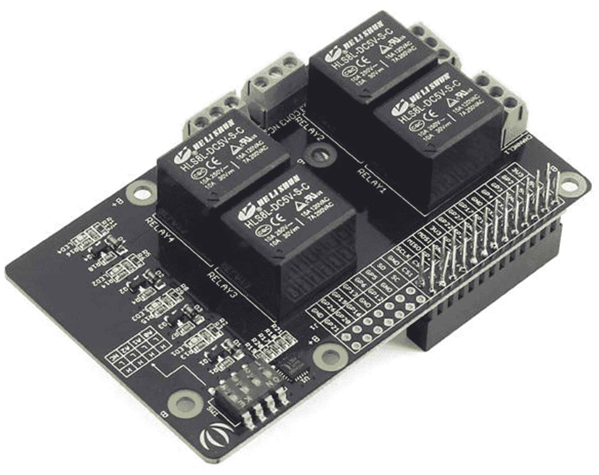
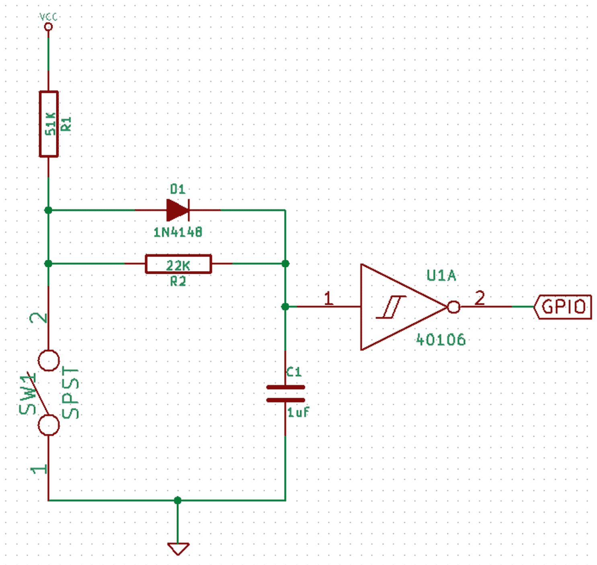
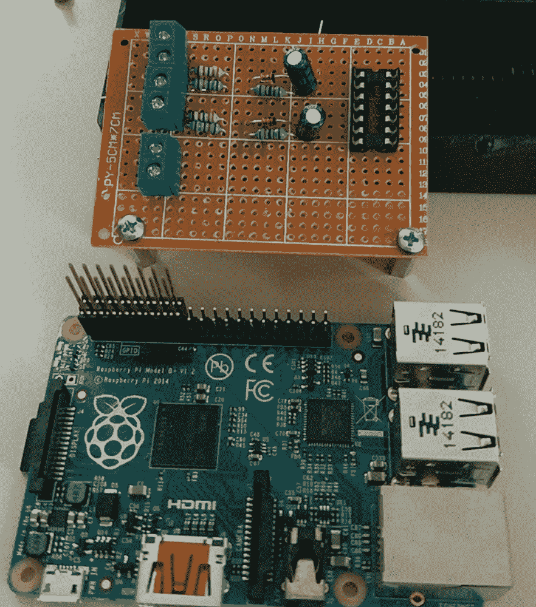
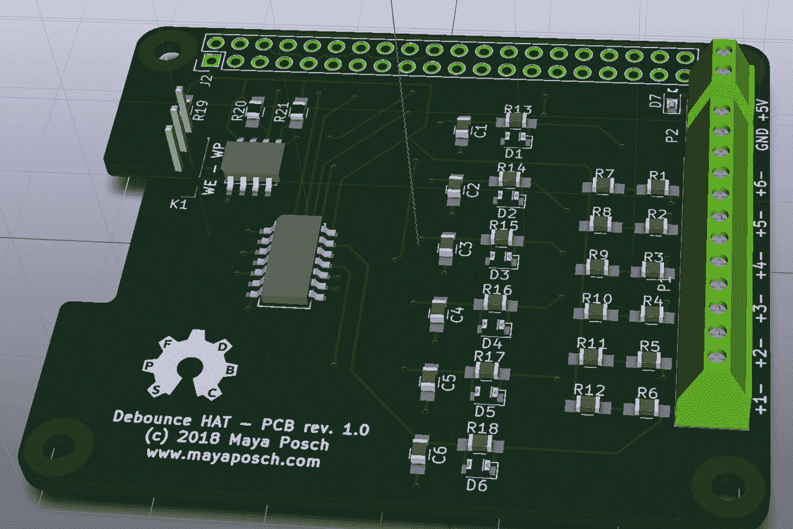
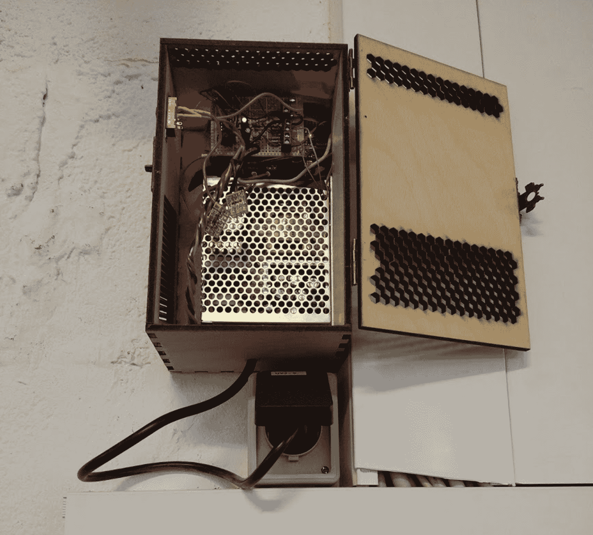
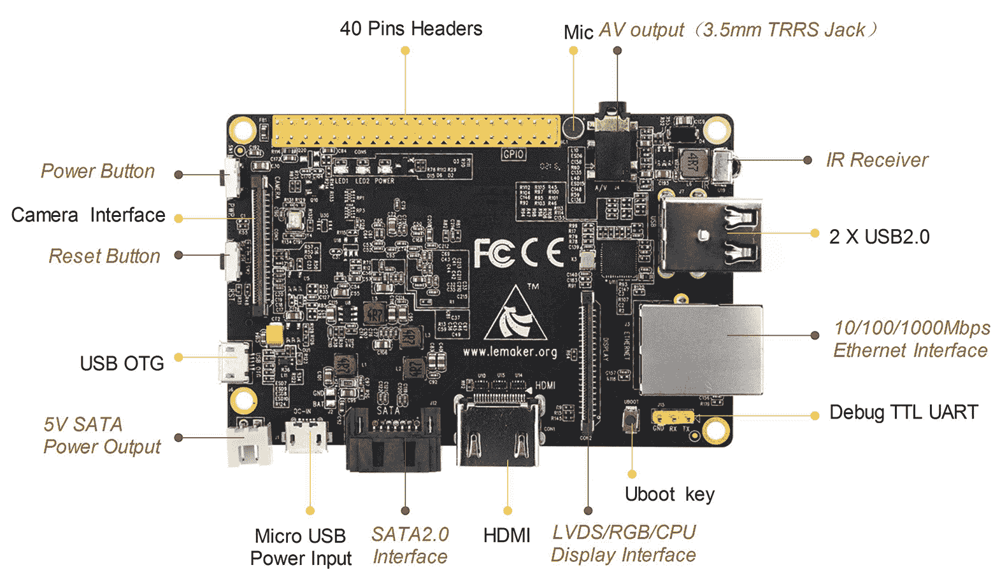

# 第三章：开发嵌入式 Linux 和类似系统

现在，基于 SoC 的小型系统随处可见，从智能手机、视频游戏机、智能电视机，到汽车和飞机上的信息娱乐系统。依赖这些系统的消费类设备非常普遍。

除了消费类设备，它们也作为工业和建筑级控制系统的一部分，用于监控设备、响应输入，并执行整个传感器和执行器网络的定时任务。与 MCU 相比，SoC 的资源限制没有那么严格，通常运行完整的操作系统（OS），如基于 Linux 的操作系统、VxWorks 或 QNX。

在本章中，我们将涵盖以下主题：

+   如何为基于操作系统的嵌入式系统开发驱动程序

+   集成外围设备的方法

+   如何处理和实现实时性能要求

+   识别和处理资源限制

# 嵌入式操作系统

在为嵌入式系统编写应用程序时，通常会使用操作系统，这是一个不切实际的建议。操作系统为应用程序提供了许多抽象硬件的 API，以及使用这些硬件实现的功能，如网络通信或视频输出。

这里的权衡在于便利性和代码大小以及复杂性。

而裸机实现理想上只实现它需要的功能，操作系统则带有任务调度器，以及应用程序可能永远不需要的功能。因此，重要的是要知道何时使用操作系统而不是直接为硬件开发，了解随之而来的复杂性。

使用操作系统的好处在于，如果必须能够同时运行不同的任务（多任务或多线程）。从头开始实现自己的调度器通常不值得。通过使用操作系统，可以更轻松地运行非固定数量的应用程序，并且可以随意删除和添加它们。

最后，当您可以访问操作系统和易于访问的驱动程序以及与其相关的 API 时，高级图形输出、图形加速（如 OpenGL）、触摸屏和高级网络功能（例如 SSH 和加密）的实现会变得更加容易。

常用的嵌入式操作系统包括以下内容：

| **名称** | **供应商** | **许可证** | **平台** | **详情** |
| --- | --- | --- | --- | --- |
| Raspbian | 社区为基础 | 主要 GPL，类似 | ARM（树莓派） | 基于 Debian Linux 的操作系统 |
| Armbian | 社区为基础 | GPLv2 | ARM（各种开发板） | 基于 Debian Linux 的操作系统 |
| Android | Google | GPLv2，Apache | ARM，x86，x86_64 | 基于 Linux |
| VxWorks | Wind River（英特尔） | 专有 | ARM，x86，MIPS，PowerPC，SH-4 | RTOS，单片内核 |
| QNX | BlackBerry | 专有 | ARMv7，ARMv8，x86 | RTOS，微内核 |
| Windows IoT | 微软 | 专有 | ARM，x86 | 以前称为 Windows 嵌入式 |
| NetBSD | NetBSD 基金会 | 2 条款 BSD | ARM，68k，MIPS，PowerPC，SPARC，RISC-V，x86 等 | 最具可移植性的基于 BSD 的操作系统 |

所有这些操作系统的共同之处在于它们处理基本功能，如内存和任务管理，同时使用编程接口（API）提供对硬件和操作系统功能的访问。

在本章中，我们将专门关注基于 SoC 和 SBC 的系统，这反映在前述操作系统列表中。这些操作系统中的每一个都旨在用于至少具有几兆字节 RAM 和几兆字节到几千兆字节存储的系统。

如果目标 SoC 或 SBC 尚未被现有的 Linux 发行版所针对，或者希望大量定制系统，可以使用 Yocto Project 的工具（[`www.yoctoproject.org/`](http://www.yoctoproject.org/)）。

基于 Linux 的嵌入式操作系统非常普遍，Android 就是一个著名的例子。它主要用于智能手机、平板电脑和类似设备，这些设备严重依赖图形用户交互，同时依赖于 Android 应用程序基础设施和相关 API。由于这种专业化水平，它不适合其他用例。

Raspbian 基于非常常见的 Debian Linux 发行版，主要针对树莓派系列的 SBC。Armbian 类似，但覆盖了更广泛的 SBC 范围。这两者都是社区努力的成果。这类似于 Debian 项目，也可以直接用于嵌入式系统。Raspbian、Armbian 和其他类似项目的主要优势在于它们提供了与目标 SBC 一起使用的现成镜像。

与基于 Linux 的操作系统一样，NetBSD 的优势在于它是开源的，这意味着您可以完全访问源代码，并且可以对操作系统的任何方面进行大量定制，包括对自定义硬件的支持。NetBSD 和类似的基于 BSD 的操作系统的一个重大优势是，操作系统是从单一代码库构建的，并由一组开发人员管理。这通常简化了嵌入式项目的开发和维护。

BSD 许可证（三或两条款）对商业项目有重大好处，因为该许可证只要求提供归属，而不要求制造商在请求时提供操作系统的全部源代码。如果对源代码进行某些修改，添加希望保持闭源的代码模块，这可能非常相关。

例如，最近的 PlayStation 游戏机使用了 FreeBSD 的修改版本，使得索尼能够对硬件和游戏机的使用进行大幅优化，而无需与操作系统的其余部分一起发布此代码。

还存在专有选项，例如来自黑莓（QNX）和微软（Windows IoT，以前是 Windows 嵌入式，以前是 Windows CE）的产品。这些产品通常需要按设备收取许可费，并要求制造商提供任何定制的帮助。

# 实时操作系统

实时操作系统（RTOS）的基本要求是能够保证任务在一定时间范围内被执行和完成。这使得可以将它们用于实时应用，其中同一任务批次的执行时间变化（抖动）是不可接受的。

由此，我们可以得出硬实时和软实时操作系统之间的基本区别：低抖动的操作系统是硬实时的，因为它可以保证给定任务总是以几乎相同的延迟执行。有更高抖动的操作系统通常但并非总是能以相同的延迟执行任务。

在这两个类别中，我们可以再次区分事件驱动和时间共享调度器。前者根据优先级切换任务（优先级调度），而后者使用定时器定期切换任务。哪种设计更好取决于系统的使用目的。

时间共享比事件驱动的调度器更重要的一点是，它不仅给予了低优先级任务更多的 CPU 时间，还使多任务系统看起来更加流畅。

一般来说，只有在项目要求必须能够保证输入在严格定义的时间窗口内处理时，才会使用实时操作系统。对于机器人技术和工业应用等应用，确保每次都在完全相同的时间范围内执行动作可能至关重要，否则可能导致生产线中断或产品质量下降。

在本章稍后将要讨论的示例项目中，我们不使用实时操作系统，而是使用常规基于 Linux 的操作系统，因为没有硬实时要求。使用实时操作系统将增加不必要的负担，可能增加复杂性和成本。

将 RTOS 视为尽可能接近直接为硬件（裸机）编程的实时性质，而无需放弃使用完整 OS 的所有便利之一。

# 自定义外围设备和驱动程序

外围设备被定义为向计算机系统添加 I/O 或其他功能的辅助设备。这可以是从 I2C、SPI 或 SD 卡控制器到音频或图形设备的任何东西。其中大多数是 SoC 的一部分，其他通过 SoC 向外部世界暴露的接口添加。外部外围设备的例子包括 RAM（通过 RAM 控制器）和**实时时钟**（**RTC**）。

在使用廉价的 SBC 时，例如树莓派、橙子派和无数类似系统时，可能会遇到的一个问题是它们通常缺乏 RTC，这意味着当它们关闭电源时，它们不再跟踪时间。通常的想法是这些板子无论如何都会连接到互联网，因此 OS 可以使用在线时间服务（**网络时间协议**，或**NTP**）来同步系统时间，从而节省板子空间。

在没有互联网连接的情况下，或者在线时间同步之前的延迟是不可接受的情况下，或者其他无数原因之一，可能会使用 SBC。在这种情况下，可能需要向板上添加 RTC 外围设备并配置 OS 以利用它。

# 添加 RTC

人们可以以低廉的价格获得 RTC 模块，通常基于 DS1307 芯片。这是一个 5V 模块，通过 I2C 总线连接到 SBC（或 MCU）：



这张图片是一个基于 DS1307 的小型 RTC 模块。正如人们可以看到的，它有 RTC 芯片、晶体和 MCU。最后一个用于与主机系统通信，无论它是 SoC 还是 MCU-based board。所有人需要的是能够提供 RTC 模块操作所需的所需电压（和电流）的能力，以及一个 I2C 总线。

将 RTC 模块连接到 SBC 板后，下一个目标是让 OS 也使用它。为此，我们必须确保加载 I2C 内核模块，以便我们可以使用 I2C 设备。

针对 SBC 的 Linux 发行版，如 Raspbian 和 Armbian，通常带有多个 RTC 模块的驱动程序。这使我们可以相对快速地设置 RTC 模块并将其与 OS 集成。对于我们之前看过的模块，我们需要 I2C 和 DS1307 内核模块。对于第一代树莓派 SBC 上的 Raspbian OS，这些模块将被称为`i2c-dev`、`2cbcm2708`和`rtc-ds1307`。

首先，您必须启用这些模块，以便它们在系统启动时加载。对于 Raspbian Linux，可以编辑`/etc/modules`文件来实现这一点，以及其他为该平台提供的配置工具。重新启动后，我们应该能够使用 I2C 扫描工具在 I2C 总线上检测 RTC 设备。

有了 RTC 设备工作，我们可以在 Raspbian 上删除 fake-hwclock 软件包。这是一个简单的模块，用于伪造 RTC，但仅在系统关闭之前将当前时间存储在文件中，以便在下次启动时，由于从存储的日期和时间恢复，文件系统的日期和类似内容将保持一致，而不会创建任何新文件突然变得*更旧*。

相反，我们将使用 hwclock 实用程序，它将使用任何真实的 RTC 来同步系统时间。这需要修改 OS 启动的方式，将 RTC 模块的位置作为引导参数传递，格式如下：

```cpp
rtc.i2c=ds1307,1,0x68
```

这将在 I2C 总线上初始化一个 RTC（`/dev/rtc0`）设备，地址为 0x68。

# 自定义驱动程序

驱动程序（内核模块）的确切格式和集成与 OS 内核的方式因每个 OS 而异，因此在这里不可能完全涵盖。然而，我们将看一下我们之前使用的 RTC 模块的 Linux 驱动程序是如何实现的。

此外，我们将在本章后面看看如何从用户空间使用 I2C 外设，在俱乐部房间监控示例中。使用基于用户空间的驱动程序（库）通常是将其实现为内核模块的良好替代方案。

RTC 功能已集成到 Linux 内核中，其代码位于`/drivers/rtc`文件夹中（在 GitHub 上可以找到，网址为[`github.com/torvalds/linux/tree/master/drivers/rtc`](https://github.com/torvalds/linux/tree/master/drivers/rtc)）。

`rtc-ds1307.c`文件包含我们需要读取和设置 RTC 的两个函数：`ds1307_get_time()`和`ds1307_set_time()`。这些函数的基本功能与我们将在本章后面的俱乐部房间监控示例中使用的功能非常相似，我们只是将 I2C 设备支持集成到我们的应用程序中。

从用户空间与 I2C、SPI 和其他外设通信的一个主要优势是，我们不受 OS 内核支持的编译环境的限制。以 Linux 内核为例，它主要用 C 语言编写，还有一些汇编语言。其 API 是 C 风格的 API，因此我们必须使用明显的 C 风格编码方法来编写我们的内核模块。

显然，这将抵消大部分优势，更不用说尝试一开始就用 C++编写这些模块的意义了。当将我们的模块代码移至用户空间并将其用作应用程序的一部分或共享库时，我们就没有这样的限制，可以自由使用任何和所有 C++概念和功能。

为了完整起见，Linux 内核模块的基本模板如下：

```cpp
#include <linux/module.h>       // Needed by all modules 
#include <linux/kernel.h>       // Needed for KERN_INFO 

int init_module() { 
        printk(KERN_INFO "Hello world.n"); 

        return 0; 
} 

void cleanup_module() { 
        printk(KERN_INFO "Goodbye world.n"); 
} 
```

这是一个必需的 Hello World 示例，以 C++风格编写。

在考虑基于内核和用户空间的驱动程序模块时的最后一个考虑因素是上下文切换。从效率的角度来看，内核模块更快，延迟更低，因为 CPU 不必反复从用户空间切换到内核空间上下文，然后再次与设备通信，并将消息从设备传递回与其通信的代码。

对于高带宽设备（如存储和捕获），这可能会导致系统顺畅运行与严重滞后和难以执行其任务之间的差异。

然而，在考虑本章中的俱乐部房间监控示例及其偶尔使用 I2C 设备时，很明显，内核模块将是严重过度的，没有任何实质性的好处。

# 资源限制

尽管 SBC 和 SoC 往往非常强大，但它们仍无法与现代台式机系统或服务器进行直接比较。它们在 RAM、存储大小和缺乏扩展选项方面有明显的限制。

对于（永久安装的）RAM 容量差异很大的情况，您必须在考虑相对缓慢的 CPU 性能之前，考虑系统上希望运行的应用程序的内存需求。

由于 SBC 通常没有或只有少量具有高耐久率的存储空间（意味着可以经常写入而不受限制的写入周期），它们通常不具有交换空间，并将所有内容保存在可用的 RAM 中。没有交换的支持，任何内存泄漏和过度内存使用将迅速导致系统无法正常工作或不断重启。

尽管多年来 SBC 的 CPU 性能已经显著提高，但通常仍建议使用交叉编译器在快速的台式机系统或服务器上为 SBC 生成代码。

更多关于开发问题和解决方案的内容将在第六章 *测试基于 OS 的应用程序*和附录 *最佳实践*中进行讨论。

# 示例 - 俱乐部房间监控

在这一部分，我们将看到一个基于 SBC 的实际实现，为俱乐部房间执行以下功能：

+   监控俱乐部门锁的状态

+   监控俱乐部状态开关

+   通过 MQTT 发送状态更改通知

+   为当前俱乐部状态提供 REST API

+   控制状态灯

+   控制俱乐部房间的电源

这里的基本用例是，我们有一个俱乐部房间，我们希望能够监控其门锁的状态，并在俱乐部内部有一个开关来调节俱乐部非永久电源插座的通电状态。将俱乐部状态开关调至*on*将为这些插座供电。我们还希望通过 MQTT 发送通知，以便俱乐部房间或其他地方的其他设备可以更新它们的状态。

MQTT 是基于 TCP/IP 的简单的二进制发布/订阅协议。它提供了一种轻量级的通信协议，适用于资源受限的应用程序，如传感器网络。每个 MQTT 客户端与中央服务器通信：MQTT 代理。

# 硬件

`clubstatus`系统的框图如下所示：



对于 SBC 平台，我们使用树莓派，要么是树莓派 B+型号，要么是 B 系列的新成员，比如树莓派 3 型 B：



我们在 SBC 系统中寻找的主要功能是以太网连接，当然还有与树莓派兼容的**通用输入/输出**（**GPIO**）引脚。

使用这块板子时，我们将在μSD 卡上安装标准的 Raspbian 操作系统。除此之外不需要任何特殊配置。选择 B+型号或类似型号的主要原因是它们具有标准的安装孔图案。

# 继电器

为了控制房间中的状态灯和非永久电源插座，我们使用了一些继电器，这种情况下是四个继电器：

| **继电器** | **功能** |
| --- | --- |
| 0 | 非永久插座的电源状态 |
| 1 | 绿色状态灯 |
| 2 | 黄色状态灯 |
| 3 | 红色状态灯 |

这里的想法是，电源状态继电器连接到一个开关，控制着俱乐部状态关闭时未供电的插座的主电源。状态灯指示当前的俱乐部状态。接下来的部分将提供这个概念的实现细节。

为了简化设计，我们将使用一个包含四个继电器的现成继电器板，由 NXP PCAL9535A I/O 端口芯片（GPIO 扩展器）驱动，连接到树莓派 SBC 的 I2C 总线上：



这块特定的板子是 Seeed Studio Raspberry Pi 继电器板 v1.0：[`wiki.seeedstudio.com/Raspberry_Pi_Relay_Board_v1.0/`](http://wiki.seeedstudio.com/Raspberry_Pi_Relay_Board_v1.0/)。它提供了我们需要的四个继电器，允许我们切换高达 30V 直流或 250V 交流的灯和开关。这使得我们可以连接几乎任何类型的照明和进一步的继电器和开关。

与 SBC 的连接是通过将继电器板叠放在 SBC 的 GPIO 引脚上实现的，这使我们可以在继电器板的顶部添加更多的板子。这使我们可以向系统添加去抖动功能，如接线计划图所示。

# 去抖动

去抖动板需要去抖动开关信号，并为树莓派提供电源。去抖动机械开关的理论和原因是，这些开关提供的信号不干净，意味着它们不会立即从开到闭。它们会在短暂地闭合（接触）之后，弹簧金属触点的弹性会导致它们再次打开，并在这两种状态之间快速移动，最终定格在最终位置，正如我们可以从连接到简单开关的示波器的下图中看到的：


这种特性的结果是，到达 SBC 的 GPIO 引脚的信号会在几毫秒内迅速变化（或更糟）。基于这些开关输入变化进行任何操作都会导致巨大问题，因为人们很难区分所需的开关变化和在这种变化过程中开关触点的快速跳动。

消除抖动可以通过硬件或软件来实现。后者的解决方案涉及在开关状态首次改变时启动计时器。这种方法的假设是，在一定时间（以毫秒为单位）过去后，开关处于稳定状态，可以安全地读取。这种方法的缺点在于它给系统增加了额外的负担，占用了一个或多个计时器，或者暂停了程序的执行。此外，在开关输入上使用中断需要在计时器运行时禁用中断，这会给代码增加进一步的复杂性。

在硬件中进行消抖可以使用离散元件，或者使用 SR 触发器（由两个与非门组成）。对于这种应用，我们将使用以下电路，它与最常用的 SPST（单极单刀）类型的开关配合良好：



这个电路的概念是，当开关打开时，电容通过 R1（和 D1）充电，导致反相施密特触发器电路（U1）上的输入变高，导致连接到 U1 输出的 SBC 的 GPIO 引脚读取低电平。当开关关闭时，电容通过 R2 放电到地面。

充电和放电都需要一定的时间，在 U1 输入上发生变化之前会增加延迟。充电和放电速率由 R1 和 R2 的值决定，其公式如下：

+   充电：

+   放电：

在这里，*V(t)*是时间*t*（以秒为单位）时的电压。*V[S]*是源电压，*t*是源电压施加后的时间（以秒为单位）。R 是电路电阻（欧姆），C 是电容（法拉）。最后，*e*是一个数学常数，其值为 2.71828（约），也称为欧拉数。

对于电容器的充电和放电，使用了 RC 时间常数τ（tau），其定义如下：


这定义了电容器充电到 63.2%（1τ）所需的时间，然后是 86%（2τ）。电容器放电 1τ后从完全充电状态下降到 37%，2τ后为 13.5%。这里注意到的一件事是，电容器永远不会完全充电或放电；充电或放电的过程只是减慢到几乎不可察觉的程度。

使用我们的消抖电路的数值，我们得到了以下充电的时间常数：


放电时间如下：


分别对应 51 和 22 微秒。

与任何施密特触发器一样，它具有所谓的滞后特性，这意味着它具有双阈值。这有效地在输出响应上方和下方添加了一个死区，输出不会改变：


施密特触发器的滞后通常用于通过设置明确的触发电平来消除传入信号的噪音。尽管我们已经在使用的 RC 电路应该能够滤除几乎所有的噪音，但添加施密特触发器可以增加一点额外的保险，而不会产生任何负面影响。

当可用时，也可以使用 SBC 的 GPIO 引脚的滞后功能。对于这个项目和选择的去抖电路，我们还希望芯片具有反转属性，这样我们就可以得到连接开关的预期高/低响应，而不必在软件中反转含义。

# 去抖 HAT

使用上一节的信息和去抖电路，组装了一个原型板：



这个原型实现了两个去抖通道，这是项目所需的两个开关。它还添加了一个螺钉端子，用于连接 SBC 电源连接。这样可以通过 5V 引脚为 SBC 供电，而不必使用树莓派的微型 USB 连接器。为了集成的目的，通常更容易直接从电源供应器运行导线到螺钉端子或类似的地方，而不是在微型 USB 插头上进行调整。

当然，这个原型不是树莓派基金会规定的合适的 HAT。这些要求以下功能：

+   它具有包含供应商信息、GPIO 映射和设备信息的有效 EEPROM，连接到树莓派 SBC 上的`ID_SC`和`ID_SD` I2C 总线引脚

+   它具有现代的 40 针（女）GPIO 连接器，还将 HAT 与 SBC 的间距至少 8 毫米

+   它遵循机械规格

+   如果通过 5V 引脚为 SBC 提供电源，HAT 必须能够持续提供至少 1.3 安培

通过添加所需的 I2C EEPROM（CAT24C32）和其他功能，我们可以看到使用倒置六通道提供的倒置六通道施密特触发器 IC（40106）的完整版本是什么样子的：



此 KiCad 项目的文件可以在作者的 GitHub 帐户[`github.com/MayaPosch/DebounceHat`](https://github.com/MayaPosch/DebounceHat)中找到。通过扩展的通道数量，相对容易地集成更多的开关、继电器和其他元素到系统中，可能使用各种传感器来监视诸如窗户之类的东西，输出高/低信号。

# 电源

对于我们的项目，我们需要的所需电压是树莓派板的 5V 和通过继电器开关的灯的第二电压。我们选择的电源必须能够为 SBC 和灯提供足够的电力。对于前者，1-2 A 应该足够，后者取决于所使用的灯和它们的功率要求。

# 实施

监控服务将作为基本的`systemd`服务实现，这意味着它将在系统启动时由操作系统启动，并且可以使用所有常规的 systemd 工具来监视和重新启动服务。

我们将有以下依赖项：

+   POCO

+   WiringPi

+   libmosquittopp（和 libmosquitto）

使用 libmosquitto 依赖项（[`mosquitto.org/man/libmosquitto-3.html`](https://mosquitto.org/man/libmosquitto-3.html)）用于添加 MQTT 支持。 libmosquittopp 依赖项是围绕基于 C 的 API 的包装器，提供了基于类的接口，这使得集成到 C++项目中更容易。

POCO 框架（[`pocoproject.org/`](https://pocoproject.org/)）是一组高度可移植的 C++ API，提供从网络相关功能（包括 HTTP）到所有常见的低级功能。在这个项目中，它的 HTTP 服务器将被使用，以及它对处理配置文件的支持。

最后，WiringPi（[`wiringpi.com/`](http://wiringpi.com/)）是访问和使用树莓派和兼容系统上的 GPIO 头部特性的事实标准头文件。它实现了与 I2C 设备和 UART 的通信 API，并使用 PWM 和数字引脚。在这个项目中，它允许我们与继电器板和去抖板进行通信。

此代码的当前版本也可以在作者的 GitHub 帐户上找到：[`github.com/MayaPosch/ClubStatusService`](https://github.com/MayaPosch/ClubStatusService)。

我们将从主文件开始：

```cpp
#include "listener.h"

 #include <iostream>
 #include <string>

 using namespace std;

 #include <Poco/Util/IniFileConfiguration.h>
 #include <Poco/AutoPtr.h>
 #include <Poco/Net/HTTPServer.h>

 using namespace Poco::Util;
 using namespace Poco;
 using namespace Poco::Net;

 #include "httprequestfactory.h"
 #include "club.h"
```

在这里，我们包括一些基本的 STL 功能，以及来自 POCO 的 HTTP 服务器和`ini`文件支持。监听器头文件是为我们的 MQTT 类，`httprequestfactory`和 club 头文件是为 HTTP 服务器和主要的监控逻辑，分别是：

```cpp
int main(int argc, char* argv[]) {
          Club::log(LOG_INFO, "Starting ClubStatus server...");
          int rc;
          mosqpp::lib_init();

          Club::log(LOG_INFO, "Initialised C++ Mosquitto library.");

          string configFile;
          if (argc > 1) { configFile = argv[1]; }
          else { configFile = "config.ini"; }

          AutoPtr<IniFileConfiguration> config;
          try {
                config = new IniFileConfiguration(configFile);
          }
          catch (Poco::IOException &e) {
                Club::log(LOG_FATAL, "Main: I/O exception when opening configuration file: " + configFile + ". Aborting...");
                return 1;
          }

          string mqtt_host = config->getString("MQTT.host", "localhost");
          int mqtt_port = config->getInt("MQTT.port", 1883);
          string mqtt_user = config->getString("MQTT.user", "");
          string mqtt_pass = config->getString("MQTT.pass", "");
          string mqtt_topic = config->getString("MQTT.clubStatusTopic",    "/public/clubstatus");
          bool relayactive = config->getBool("Relay.active", true);
          uint8_t relayaddress = config->getInt("Relay.address", 0x20);
```

在这一部分中，我们初始化 MQTT 库（libmosquittopp）并尝试打开配置文件，如果在命令行参数中没有指定任何内容，则使用默认路径和名称。

POCO 的`IniFileConfiguration`类用于打开和读取配置文件，如果找不到或无法打开配置文件，则会抛出异常。POCO 的`AutoPtr`相当于 C++11 的`unique_ptr`，允许我们创建一个新的基于堆的实例，而不必担心以后处理它。

接下来，我们读取我们对 MQTT 和继电器板功能感兴趣的值，指定默认值是有意义的地方：

```cpp
Listener listener("ClubStatus", mqtt_host, mqtt_port, mqtt_user, mqtt_pass);

    Club::log(LOG_INFO, "Created listener, entering loop...");

    UInt16 port = config->getInt("HTTP.port", 80);
    HTTPServerParams* params = new HTTPServerParams;
    params->setMaxQueued(100);
    params->setMaxThreads(10);
    HTTPServer httpd(new RequestHandlerFactory, port, params);
    try {
          httpd.start();
    }
    catch (Poco::IOException &e) {
          Club::log(LOG_FATAL, "I/O Exception on HTTP server: port already in use?");
          return 1;
    }
    catch (...) {
          Club::log(LOG_FATAL, "Exception thrown for HTTP server start. Aborting.");
          return 1;
    }
```

在这一部分中，我们启动 MQTT 类，并为其提供连接到 MQTT 代理所需的参数。接下来，读取 HTTP 服务器的配置详细信息，并创建一个新的`HTTPServer`实例。

服务器实例使用提供的端口和一些限制进行配置，用于 HTTP 服务器允许使用的最大线程数，以及它可以保持的最大排队连接数。这些参数对于优化系统性能并将这样的代码适应到资源更少的系统中是有用的。

新的客户端连接由自定义的`RequestHandlerFactory`类处理，我们稍后会看到：

```cpp

             Club::mqtt = &listener;
             Club::start(relayactive, relayaddress, mqtt_topic);

             while(1) {
                   rc = listener.loop();
                   if (rc){
                         Club::log(LOG_ERROR, "Disconnected. Trying to 
                         reconnect...");
                         listener.reconnect();
                   }
             }

             mosqpp::lib_cleanup();
             httpd.stop();
             Club::stop();

             return 0;
 }
```

最后，我们将创建的`Listener`实例的引用分配给静态的`Club`类的`mqtt`成员。这将使`Listener`对象更容易在以后使用，我们将看到。

通过在`Club`上调用`start()`，将处理连接硬件的监视和配置，并且在主函数中完成了这个方面。

最后，我们进入了一个 MQTT 类的循环，确保它保持与 MQTT 代理的连接。离开循环时，我们将清理资源并停止 HTTP 服务器等。然而，由于我们在这里是一个无限循环，这个代码不会被执行到。

由于这个实现将作为一个 24/7 运行的服务，以一种干净的方式终止服务并不是绝对必要的。一个相对简单的方法是添加一个信号处理程序，一旦触发就会中断循环。为了简单起见，这在这个项目中被省略了。

# 监听器

`Listener`类的类声明如下：

```cpp
class Listener : public mosqpp::mosquittopp {
          //

 public:
          Listener(string clientId, string host, int port, string user, string pass);
          ~Listener();

          void on_connect(int rc);
          void on_message(const struct mosquitto_message* message);
          void on_subscribe(int mid, int qos_count, const int* granted_qos);

          void sendMessage(string topic, string& message);
          void sendMessage(string& topic, char* message, int msgLength);
 };
```

这个类提供了一个简单的 API 来连接到 MQTT 代理并向该代理发送消息。我们从`mosquittopp`类继承，重新实现了一些回调方法来处理连接新接收的消息和完成对 MQTT 主题的订阅的事件。

接下来，让我们看一下实现：

```cpp
#include "listener.h"

 #include <iostream>

 using namespace std;
 Listener::Listener(string clientId, string host, int port, string user, string pass) : mosquittopp(clientId.c_str()) {
          int keepalive = 60;
          username_pw_set(user.c_str(), pass.c_str());
          connect(host.c_str(), port, keepalive);
 }

 Listener::~Listener() {
          //
 }
```

在构造函数中，我们使用 mosquittopp 类的构造函数分配唯一的 MQTT 客户端标识字符串。我们使用默认值为 60 秒的保持活动设置，这意味着我们将保持与 MQTT 代理的连接开放的时间，而不会发送任何控制或其他消息。

设置用户名和密码后，我们连接到 MQTT 代理：

```cpp
void Listener::on_connect(int rc) {
    cout << "Connected. Subscribing to topics...n";

          if (rc == 0) {
                // Subscribe to desired topics.
                string topic = "/club/status";
                subscribe(0, topic.c_str(), 1);
          }
          else {
                cerr << "Connection failed. Aborting subscribing.n";
          }
 }
```

每当尝试与 MQTT 代理建立连接时，都会调用此回调函数。我们检查`rc`的值，如果值为零，表示成功，我们开始订阅任何所需的主题。在这里，我们只订阅一个主题：/club/status。如果任何其他 MQTT 客户端向此主题发送消息，我们将在下一个回调函数中收到它：

```cpp

 void Listener::on_message(const struct mosquitto_message* message) {
          string topic = message->topic;
          string payload = string((const char*) message->payload, message->payloadlen);

          if (topic == "/club/status") {
                string topic = "/club/status/response";
                char payload[] = { 0x01 }; 
                publish(0, topic.c_str(), 1, payload, 1); // QoS 1\.   
          }     
 }
```

在这个回调函数中，我们接收一个带有 MQTT 主题和负载的结构体。然后我们将主题与我们订阅的主题字符串进行比较，这种情况下只是/club/status 主题。收到此主题的消息后，我们将发布一个新的 MQTT 消息，其中包含主题和负载。最后一个参数是**服务质量**（**QoS**）值，在这种情况下设置为*至少一次传递*标志。这保证至少有另一个 MQTT 客户端会接收到我们的消息。

MQTT 负载始终是二进制的，例如在这里是`1`。要使其反映俱乐部房间的状态（打开或关闭），我们需要集成来自静态`Club`类的响应，我们将在下一节中讨论这个。

首先，我们来看一下`Listener`类的其余函数：

```cpp
 void Listener::on_subscribe(int mid, int qos_count, const int* granted_qos) {
          // 
 }

 void Listener::sendMessage(string topic, string &message) {
          publish(0, topic.c_str(), message.length(), message.c_str(), true);
 }

 void Listener::sendMessage(string &topic, char* message, int msgLength) {
          publish(0, topic.c_str(), msgLength, message, true);
 }
```

新订阅的回调函数在这里为空，但可以用于添加日志记录或类似功能。此外，我们还有一个重载的`sendMessage()`函数，允许应用程序的其他部分也发布 MQTT 消息。

有这两个不同函数的主要原因是，有时使用`char*`数组发送更容易，例如，作为二进制协议的一部分发送 8 位整数数组，而其他时候 STL 字符串更方便。这样，我们可以同时获得两种方式的最佳效果，而不必在代码中的任何位置发送 MQTT 消息时转换其中一种。

`publish()`的第一个参数是消息 ID，这是一个我们可以自己分配的自定义整数。在这里，我们将其保留为零。我们还使用了*retain*标志（最后一个参数），将其设置为 true。这意味着每当一个新的 MQTT 客户端订阅我们发布保留消息的主题时，该客户端将始终接收到在该特定主题上发布的最后一条消息。

由于我们将在 MQTT 主题上发布俱乐部房间的状态，因此希望 MQTT 代理保留最后的状态消息，以便使用此信息的任何客户端在连接到代理时立即接收到当前状态，而不必等待下一个状态更新。

# 俱乐部

俱乐部头文件声明了构成项目核心的类，并负责处理开关输入、控制继电器和更新俱乐部房间的状态：

```cpp
#include <wiringPi.h>
 #include <wiringPiI2C.h>
```

在这个头文件中值得注意的第一件事是包含的内容。它们为我们的代码添加了基本的 WiringPi GPIO 功能，以及用于 I2C 使用的功能。进一步的 WiringPi 可以包括其他需要这种功能的项目，比如 SPI、UART（串行）、软件 PWM、树莓派（Broadcom SoC）特定功能等等：

```cpp
enum Log_level {
    LOG_FATAL = 1,
    LOG_ERROR = 2,
    LOG_WARNING = 3,
    LOG_INFO = 4,
    LOG_DEBUG = 5
 };
```

我们将使用`enum`定义我们将使用的不同日志级别：

```cpp
 class Listener;
```

我们提前声明`Listener`类，因为我们将在这些类的实现中使用它，但暂时不想包含整个头文件：

```cpp
class ClubUpdater : public Runnable {
          TimerCallback<ClubUpdater>* cb;
          uint8_t regDir0;
          uint8_t regOut0;
          int i2cHandle;
          Timer* timer;
          Mutex mutex;
          Mutex timerMutex;
          Condition timerCnd;
          bool powerTimerActive;
          bool powerTimerStarted;

 public:
          void run();
          void updateStatus();
          void writeRelayOutputs();
          void setPowerState(Timer &t);
 };
```

`ClubUpdater`类负责配置基于 I2C 的 GPIO 扩展器，控制继电器，并处理俱乐部状态的任何更新。POCO 框架中的`Timer`实例用于向电源状态继电器添加延迟，我们将在实现中看到。

这个类继承自 POCO `Runnable`类，这是 POCO `Thread`类所期望的基类，它是围绕本地线程的包装器。

这两个`uint8_t`成员变量镜像了 I2C GPIO 扩展器设备上的两个寄存器，允许我们设置设备上输出引脚的方向和值，从而有效地控制附加的继电器：

```cpp
class Club {
          static Thread updateThread;
          static ClubUpdater updater;

          static void lockISRCallback();
          static void statusISRCallback();

 public:
          static bool clubOff;
          static bool clubLocked;
          static bool powerOn;
          static Listener* mqtt;
          static bool relayActive;
          static uint8_t relayAddress;
          static string mqttTopic;      // Topic we publish status updates on.

          static Condition clubCnd;
          static Mutex clubCndMutex;
          static Mutex logMutex;
          static bool clubChanged ;
          static bool running;
          static bool clubIsClosed;
          static bool firstRun;
          static bool lockChanged;
          static bool statusChanged;
          static bool previousLockValue;
          static bool previousStatusValue;

          static bool start(bool relayactive, uint8_t relayaddress, string topic);
          static void stop();
          static void setRelay();
          static void log(Log_level level, string msg);
 };
```

`Club`类可以被视为系统的输入端，设置和处理 ISR（中断处理程序），并作为所有与俱乐部状态相关的变量（如锁定开关状态、状态开关状态和电源系统状态（俱乐部开放或关闭））的中央（静态）类。

这个类被完全静态化，以便它可以被程序的不同部分自由使用来查询房间状态。

接下来，这是实现：

```cpp
#include "club.h"

 #include <iostream>

 using namespace std;

 #include <Poco/NumberFormatter.h>

 using namespace Poco;

 #include "listener.h"
```

在这里，我们包含了`Listener`头文件，以便我们可以使用它。我们还包括了 POCO `NumberFormatter`类，以便我们可以格式化整数值以进行日志记录。

```cpp
 #define REG_INPUT_PORT0              0x00
 #define REG_INPUT_PORT1              0x01
 #define REG_OUTPUT_PORT0             0x02
 #define REG_OUTPUT_PORT1             0x03
 #define REG_POL_INV_PORT0            0x04
 #define REG_POL_INV_PORT1            0x05
 #define REG_CONF_PORT0               0x06
 #define REG_CONG_PORT1               0x07
 #define REG_OUT_DRV_STRENGTH_PORT0_L 0x40
 #define REG_OUT_DRV_STRENGTH_PORT0_H 0x41
 #define REG_OUT_DRV_STRENGTH_PORT1_L 0x42
 #define REG_OUT_DRV_STRENGTH_PORT1_H 0x43
 #define REG_INPUT_LATCH_PORT0        0x44
 #define REG_INPUT_LATCH_PORT1        0x45
 #define REG_PUD_EN_PORT0             0x46
 #define REG_PUD_EN_PORT1             0x47
 #define REG_PUD_SEL_PORT0            0x48
 #define REG_PUD_SEL_PORT1            0x49
 #define REG_INT_MASK_PORT0           0x4A
 #define REG_INT_MASK_PORT1           0x4B
 #define REG_INT_STATUS_PORT0         0x4C
 #define REG_INT_STATUS_PORT1         0x4D
 #define REG_OUTPUT_PORT_CONF         0x4F
```

接下来，我们定义了目标 GPIO 扩展器设备 NXP PCAL9535A 的所有寄存器。即使我们只使用其中的两个寄存器，将完整列表添加是一个很好的做法，以简化以后代码的扩展。也可以使用单独的头文件，以便轻松使用不同的 GPIO 扩展器，而不需要对代码进行重大更改，甚至根本不需要。

```cpp
 #define RELAY_POWER 0
 #define RELAY_GREEN 1
 #define RELAY_YELLOW 2
 #define RELAY_RED 3
```

在这里，我们定义了哪些功能连接到哪个继电器，对应于 GPIO 扩展芯片的特定输出引脚。由于我们有四个继电器，因此使用了四个引脚。这些连接到芯片上的第一个（总共两个）八个引脚的银行。

当然，重要的是这些定义与实际连接到这些继电器的内容相匹配。根据使用情况，这也可以是可配置的。

```cpp
bool Club::clubOff;
 bool Club::clubLocked;
 bool Club::powerOn;
 Thread Club::updateThread;
 ClubUpdater Club::updater;
 bool Club::relayActive;
 uint8_t Club::relayAddress;
 string Club::mqttTopic;
 Listener* Club::mqtt = 0;

 Condition Club::clubCnd;
 Mutex Club::clubCndMutex;
 Mutex Club::logMutex;
 bool Club::clubChanged = false;
 bool Club::running = false;
 bool Club::clubIsClosed = true;
 bool Club::firstRun = true;
 bool Club::lockChanged = false;
 bool Club::statusChanged = false;
 bool Club::previousLockValue = false;
 bool Club::previousStatusValue = false;
```

由于`Club`是一个完全静态的类，我们在进入`ClubUpdater`类的实现之前初始化了它的所有成员变量。

```cpp
void ClubUpdater::run() {
    regDir0 = 0x00;
    regOut0 = 0x00;
    Club::powerOn = false;
    powerTimerActive = false;
    powerTimerStarted = false;
    cb = new TimerCallback<ClubUpdater>(*this, &ClubUpdater::setPowerState);
    timer = new Timer(10 * 1000, 0);
```

当我们启动这个类的一个实例时，它的`run()`函数被调用。在这里，我们设置了一些默认值。方向和输出寄存器变量最初设置为零。俱乐部房间电源状态设置为 false，与电源计时器相关的布尔变量设置为 false，因为电源计时器尚未激活。这个计时器用于在打开或关闭电源之前设置延迟，我们稍后将会详细介绍。

默认情况下，这个计时器的延迟是十秒。当然，这也可以是可配置的。

```cpp
if (Club::relayActive) {
    Club::log(LOG_INFO, "ClubUpdater: Starting i2c relay device.");
    i2cHandle = wiringPiI2CSetup(Club::relayAddress);
    if (i2cHandle == -1) {
        Club::log(LOG_FATAL, string("ClubUpdater: error starting          
        i2c relay device."));
        return;
    }

    wiringPiI2CWriteReg8(i2cHandle, REG_CONF_PORT0, 0x00);
    wiringPiI2CWriteReg8(i2cHandle, REG_OUTPUT_PORT0, 0x00);

    Club::log(LOG_INFO, "ClubUpdater: Finished configuring the i2c 
    relay device's registers.");
}
```

接下来，我们设置 I2C GPIO 扩展器。这需要 I2C 设备地址，我们之前传递给了`Club`类。这个设置函数的作用是确保在 I2C 总线上的这个地址上有一个活动的 I2C 设备。之后，它应该准备好进行通信。也可以通过将 relayActive 变量设置为 false 来跳过这一步。这是通过在配置文件中设置适当的值来完成的，当在没有 I2C 总线或连接设备的系统上运行集成测试时非常有用。

设置完成后，我们写入了第一个银行的方向和输出寄存器的初始值。两者都写入了空字节，以便它们控制的所有八个引脚都设置为输出模式和二进制零（低）状态。这样，连接到前四个引脚的所有继电器最初都是关闭的。

```cpp
          updateStatus();

          Club::log(LOG_INFO, "ClubUpdater: Initial status update complete.");
          Club::log(LOG_INFO, "ClubUpdater: Entering waiting condition.");

          while (Club::running) {
                Club::clubCndMutex.lock();
                if (!Club::clubCnd.tryWait(Club::clubCndMutex, 60 * 1000)) {.
                      Club::clubCndMutex.unlock();
                      if (!Club::clubChanged) { continue; }
                }
                else {
                      Club::clubCndMutex.unlock();
                }

                updateStatus();
          }
 }
```

完成这些配置步骤后，我们运行了俱乐部房间状态的第一次更新，使用相同的函数，以后当输入发生变化时也会调用。这导致所有输入被检查，并且输出被设置为相应的状态。

最后，我们进入一个等待循环。这个循环由`Club::running`布尔变量控制，允许我们通过信号处理程序或类似方法中断它。实际的等待是使用条件变量进行的，在这里我们等待，直到一分钟等待超时发生（之后，我们经过快速检查后返回等待），或者我们被设置为输入的其中一个中断信号。

接下来，我们看一下用于更新输出状态的函数：

```cpp
void ClubUpdater::updateStatus() {
    Club::clubChanged = false;

    if (Club::lockChanged) {
          string state = (Club::clubLocked) ? "locked" : "unlocked";
          Club::log(LOG_INFO, string("ClubUpdater: lock status changed to ") + state);
          Club::lockChanged = false;

          if (Club::clubLocked == Club::previousLockValue) {
                Club::log(LOG_WARNING, string("ClubUpdater: lock interrupt triggered, but value hasn't changed. Aborting."));
                return;
          }

          Club::previousLockValue = Club::clubLocked;
    }
    else if (Club::statusChanged) {           
          string state = (Club::clubOff) ? "off" : "on";
          Club::log(LOG_INFO, string("ClubUpdater: status switch status changed to ") + state);
          Club::statusChanged = false;

          if (Club::clubOff == Club::previousStatusValue) {
                Club::log(LOG_WARNING, string("ClubUpdater: status interrupt triggered, but value hasn't changed. Aborting."));
                return;
          }

          Club::previousStatusValue = Club::clubOff;
    }
    else if (Club::firstRun) {
          Club::log(LOG_INFO, string("ClubUpdater: starting initial update run."));
          Club::firstRun = false;
    }
    else {
          Club::log(LOG_ERROR, string("ClubUpdater: update triggered, but no change detected. Aborting."));
          return;
    }
```

当我们进入此更新函数时，我们首先确保`Club::clubChanged`布尔值设置为 false，以便可以由其中一个中断处理程序再次设置。

之后，我们检查输入发生了什么变化。如果锁定开关被触发，它的布尔变量将被设置为 true，或者状态开关的变量可能已被触发。如果是这种情况，我们将重置变量，并将新读取的值与该输入的上次已知值进行比较。

作为一种合理检查，如果值没有发生变化，我们会忽略触发。如果中断由于噪音而被触发，例如开关的信号线靠近电源线，这种情况可能会发生。后者的任何波动都会引起前者的激增，这可能会触发 GPIO 引脚的中断。这是处理非理想物理世界的现实的一个明显例子，也展示了硬件和软件对系统可靠性的影响的重要性。

除了这个检查之外，我们还使用我们的中央记录器记录事件，并更新缓冲输入值，以便在下一次运行中使用。

if/else 语句中的最后两种情况处理了初始运行，以及默认处理程序。当我们最初运行此函数时，就像我们之前看到的那样，没有中断会被触发，因此显然我们必须为状态和锁定开关添加第三种情况：

```cpp
    if (Club::clubIsClosed && !Club::clubOff) {
          Club::clubIsClosed = false;

          Club::log(LOG_INFO, string("ClubUpdater: Opening club."));

          Club::powerOn = true;
          try {
                if (!powerTimerStarted) {
                      timer->start(*cb);
                      powerTimerStarted = true;
                }
                else { 
                      timer->stop();
                      timer->start(*cb);
                }
          }
          catch (Poco::IllegalStateException &e) {
                Club::log(LOG_ERROR, "ClubUpdater: IllegalStateException on timer start: " + e.message());
                return;
          }
          catch (...) {
                Club::log(LOG_ERROR, "ClubUpdater: Unknown exception on timer start.");
                return;
          }

          powerTimerActive = true;

          Club::log(LOG_INFO, "ClubUpdater: Started power timer...");

          char msg = { '1' };
          Club::mqtt->sendMessage(Club::mqttTopic, &msg, 1);

          Club::log(LOG_DEBUG, "ClubUpdater: Sent MQTT message.");
    }
    else if (!Club::clubIsClosed && Club::clubOff) {
          Club::clubIsClosed = true;

          Club::log(LOG_INFO, string("ClubUpdater: Closing club."));

          Club::powerOn = false;

          try {
                if (!powerTimerStarted) {
                      timer->start(*cb);
                      powerTimerStarted = true;
                }
                else { 
                      timer->stop();
                      timer->start(*cb);
                }
          }
          catch (Poco::IllegalStateException &e) {
                Club::log(LOG_ERROR, "ClubUpdater: IllegalStateException on timer start: " + e.message());
                return;
          }
          catch (...) {
                Club::log(LOG_ERROR, "ClubUpdater: Unknown exception on timer start.");
                return;
          }

          powerTimerActive = true;

          Club::log(LOG_INFO, "ClubUpdater: Started power timer...");

          char msg = { '0' };
          Club::mqtt->sendMessage(Club::mqttTopic, &msg, 1);

          Club::log(LOG_DEBUG, "ClubUpdater: Sent MQTT message.");
    }
```

接下来，我们检查是否必须将俱乐部房间的状态从关闭更改为打开，或者反之亦然。这是通过检查俱乐部状态（`Club::clubOff`）布尔值相对于存储的上次已知状态的`Club::clubIsClosed`布尔值来确定的。

基本上，如果状态开关从打开到关闭或反之亦然，这将被检测到，并且将开始更改为新状态。这意味着将启动电源定时器，该定时器将在预设延迟后打开或关闭俱乐部房间中的非永久电源。

POCO `Timer`类要求我们在启动之前先停止定时器，如果之前已经启动过。这要求我们添加一个额外的检查。

此外，我们还使用对 MQTT 客户端类的引用，向 MQTT 代理发送消息，其中包括更新后的俱乐部房间状态，这里可以是 ASCII 1 或 0。此消息可用于触发其他系统，这些系统可以更新俱乐部房间的在线状态，或者可以用于更多创造性的用途。

当然，消息的确切有效载荷可以进行可配置。

在下一节中，我们将根据房间内电源的状态更新状态灯的颜色。为此，我们使用以下表格：

| **颜色** | **状态开关** | **锁定开关** | **电源状态** |
| --- | --- | --- | --- |
| 绿色 | 打开 | 解锁 | 打开 |
| 黄色 | 关闭 | 解锁 | 关闭 |
| 红色 | 关闭 | 锁定 | 关闭 |
| 黄色和红色 | 打开 | 锁定 | 打开 |

实现如下：

```cpp

    if (Club::clubOff) {
          Club::log(LOG_INFO, string("ClubUpdater: New lights, clubstatus off."));

          mutex.lock();
          string state = (Club::powerOn) ? "on" : "off";
          if (powerTimerActive) {
                Club::log(LOG_DEBUG, string("ClubUpdater: Power timer active, inverting power state from: ") + state);
                regOut0 = !Club::powerOn;
          }
          else {
                Club::log(LOG_DEBUG, string("ClubUpdater: Power timer not active, using current power state: ") + state);
                regOut0 = Club::powerOn; 
          }

          if (Club::clubLocked) {
                Club::log(LOG_INFO, string("ClubUpdater: Red on."));
                regOut0 |= (1UL << RELAY_RED); 
          } 
          else {
                Club::log(LOG_INFO, string("ClubUpdater: Yellow on."));
                regOut0 |= (1UL << RELAY_YELLOW);
          } 

          Club::log(LOG_DEBUG, "ClubUpdater: Changing output register to: 0x" + NumberFormatter::formatHex(regOut0));

          writeRelayOutputs();
          mutex.unlock();
    }
```

我们首先检查俱乐部房间电源的状态，这告诉我们要使用输出寄存器的第一个位的值。如果电源定时器处于活动状态，我们必须反转电源状态，因为我们要写入当前的电源状态，而不是存储在电源状态布尔变量中的未来状态。

如果俱乐部房间的状态开关处于关闭位置，则锁定开关的状态决定最终的颜色。当俱乐部房间被锁定时，我们触发红色继电器，否则我们触发黄色继电器。后者表示中间状态，即俱乐部房间关闭但尚未锁定。

在这里使用互斥锁是为了确保 I2C 设备输出寄存器的写入以及更新本地寄存器变量是以同步的方式进行的：

```cpp
    else { 
                Club::log(LOG_INFO, string("ClubUpdater: New lights, clubstatus on."));

                mutex.lock();
                string state = (Club::powerOn) ? "on" : "off";
                if (powerTimerActive) {
                      Club::log(LOG_DEBUG, string("ClubUpdater: Power timer active,    inverting power state from: ") + state);
                      regOut0 = !Club::powerOn; // Take the inverse of what the timer    callback will set.
                }
                else {
                      Club::log(LOG_DEBUG, string("ClubUpdater: Power timer not active,    using current power state: ") + state);
                      regOut0 = Club::powerOn; // Use the current power state value.
                }

                if (Club::clubLocked) {
                      Club::log(LOG_INFO, string("ClubUpdater: Yellow & Red on."));
                      regOut0 |= (1UL << RELAY_YELLOW);
                      regOut0 |= (1UL << RELAY_RED);
                }
                else {
                      Club::log(LOG_INFO, string("ClubUpdater: Green on."));
                      regOut0 |= (1UL << RELAY_GREEN);
                }

                Club::log(LOG_DEBUG, "ClubUpdater: Changing output register to: 0x" +    NumberFormatter::formatHex(regOut0));

                writeRelayOutputs();
                mutex.unlock();
          }
 }
```

如果俱乐部房间的状态开关设置为开，我们会得到另外两个颜色选项，绿色是通常的选项，表示俱乐部房间解锁并且状态开关启用。然而，如果后者打开但房间被锁上，我们会得到黄色和红色。

完成输出寄存器的新内容后，我们总是使用`writeRelayOutputs()`函数将我们的本地版本写入远程设备，从而触发新的继电器状态：

```cpp
void ClubUpdater::writeRelayOutputs() {
    wiringPiI2CWriteReg8(i2cHandle, REG_OUTPUT_PORT0, regOut0);

    Club::log(LOG_DEBUG, "ClubUpdater: Finished writing relay outputs with: 0x" 
                + NumberFormatter::formatHex(regOut0));
 }
```

这个功能非常简单，使用 WiringPi 的 I2C API 向连接的设备输出寄存器写入一个 8 位值。我们也在这里记录写入的值：

```cpp
   void ClubUpdater::setPowerState(Timer &t) {
          Club::log(LOG_INFO, string("ClubUpdater: setPowerState called."));

          mutex.lock();
          if (Club::powerOn) { regOut0 |= (1UL << RELAY_POWER); }
          else { regOut0 &= ~(1UL << RELAY_POWER); }

          Club::log(LOG_DEBUG, "ClubUpdater: Writing relay with: 0x" +    NumberFormatter::formatHex(regOut0));

          writeRelayOutputs();

          powerTimerActive = false;
          mutex.unlock();
 }
```

在这个函数中，我们将俱乐部房间的电源状态设置为其布尔变量包含的任何值。我们使用与更新俱乐部房间状态颜色时相同的互斥体。然而，在这里我们不是从头开始创建输出寄存器的内容，而是选择切换其变量中的第一个位。

切换完这个位后，我们像往常一样向远程设备写入，这将导致俱乐部房间的电源切换状态。

接下来，我们看一下静态的`Club`类，从我们调用的第一个函数开始初始化它：

```cpp
bool Club::start(bool relayactive, uint8_t relayaddress, string topic) {
          Club::log(LOG_INFO, "Club: starting up...");

          relayActive = relayactive;
          relayAddress = relayaddress;
          mqttTopic = topic;

          wiringPiSetup();

          Club::log(LOG_INFO,  "Club: Finished wiringPi setup.");

          pinMode(0, INPUT);
          pinMode(7, INPUT);
          pullUpDnControl(0, PUD_DOWN);
          pullUpDnControl(7, PUD_DOWN);
          clubLocked = digitalRead(0);
          clubOff = !digitalRead(7);

          previousLockValue = clubLocked;
          previousStatusValue = clubOff;

          Club::log(LOG_INFO, "Club: Finished configuring pins.");

          wiringPiISR(0, INT_EDGE_BOTH, &lockISRCallback);
          wiringPiISR(7, INT_EDGE_BOTH, &statusISRCallback);

          Club::log(LOG_INFO, "Club: Configured interrupts.");

          running = true;
          updateThread.start(updater);

          Club::log(LOG_INFO, "Club: Started update thread.");

          return true;
 }
```

通过这个功能，我们启动整个俱乐部监控系统，就像我们在应用程序入口点中看到的那样。它接受一些参数，允许我们打开或关闭继电器功能，设置继电器的 I2C 地址（如果使用继电器），以及要发布俱乐部房间状态更改的 MQTT 主题。

在使用这些参数设置成员变量的值后，我们初始化 WiringPi 框架。WiringPi 提供了许多不同的初始化函数，基本上是在如何访问 GPIO 引脚上有所不同。

我们在这里使用的`wiringPiSetup()`函数通常是最方便的函数，因为它将使用虚拟引脚号，这些虚拟引脚号映射到底层的 Broadcom SoC 引脚。WiringPi 编号的主要优势在于它在不同版本的树莓派 SBC 之间保持不变。

通过使用 Broadcom（BCM）编号或 SBC 电路板上引脚排列的物理位置，我们冒着在板子版本之间发生变化的风险，但 WiringPi 编号方案可以弥补这一点。

对于我们的目的，我们在 SBC 上使用以下引脚：

| 锁定开关 | 状态开关 |
| --- | --- |
| BCM | 17 | 4 |
| 物理位置 | 11 | 7 |
| WiringPi | 0 | 7 |

在初始化 WiringPi 库之后，我们设置所需的引脚模式，将我们的两个引脚都设置为输入。然后我们在每个引脚上启用下拉。这将启用 SoC 中的内置下拉电阻，它将始终尝试将输入信号拉低（相对于地面）。是否需要为输入（或输出）引脚启用下拉电阻或上拉电阻取决于情况，特别是连接的电路。

重要的是要观察连接电路的行为；如果连接电路有使线路上的值“浮动”的倾向，这将导致输入引脚上的不良行为，值会随机变化。通过将线路拉低或拉高，我们可以确保我们在引脚上读取的不仅仅是噪音。

在我们的每个引脚上设置模式后，我们首次读取它们的值，这使我们能够在稍后使用`ClubUpdater`类中的当前值运行更新函数。然而，在这之前，我们首先为两个引脚注册我们的中断方法。

中断处理程序只不过是一个回调函数，每当指定的事件发生在指定的引脚上时就会被调用。WiringPi 的 ISR 函数接受引脚编号、事件类型和我们希望使用的处理程序函数的引用。对于我们选择的事件类型，在输入引脚上的值从高变低，或者从低变高时，我们的中断处理程序将被触发。这意味着当连接的开关从开到关，或者从关到开时，它将被触发。

最后，我们通过使用`ClubUpdater`类实例并将其推送到自己的线程中来启动更新线程：

```cpp
void Club::stop() {
          running = false;
 }
```

调用此函数将允许`ClubUpdater`的`run()`函数中的循环结束，这将终止它运行的线程，也允许应用程序的其余部分安全关闭：

```cpp
void Club::lockISRCallback() {
          clubLocked = digitalRead(0);
          lockChanged = true;

          clubChanged = true;
          clubCnd.signal();
 }

 void Club::statusISRCallback() {
          clubOff = !digitalRead(7);
          statusChanged = true;

          clubChanged = true;
          clubCnd.signal();
 }
```

我们的中断处理程序都非常简单。当操作系统接收到中断时，它会触发相应的处理程序，这导致它们读取输入引脚的当前值，并根据需要反转该值。在中断触发时，`statusChanged`或`lockChanged`变量被设置为 true，以指示更新函数中的哪个中断被触发。

在向`ClubUpdate`的`run`循环等待的条件变量上发出信号之前，我们也对`clubChanged`布尔变量执行相同的操作。

这个类的最后一部分是日志函数：

```cpp
void Club::log(Log_level level, string msg) {
    logMutex.lock();
    switch (level) {
          case LOG_FATAL: {
                cerr << "FATAL:t" << msg << endl;
                string message = string("ClubStatus FATAL: ") + msg;
                if (mqtt) {
                      mqtt->sendMessage("/log/fatal", message);
                }

                break;
          }
          case LOG_ERROR: {
                cerr << "ERROR:t" << msg << endl;
                string message = string("ClubStatus ERROR: ") + msg;
                if (mqtt) {
                      mqtt->sendMessage("/log/error", message);
                }

                break;
          }
          case LOG_WARNING: {
                cerr << "WARNING:t" << msg << endl;
                string message = string("ClubStatus WARNING: ") + msg;
                if (mqtt) {
                      mqtt->sendMessage("/log/warning", message);
                }

                break;
          }
          case LOG_INFO: {
                cout << "INFO: t" << msg << endl;
                string message = string("ClubStatus INFO: ") + msg;
                if (mqtt) {
                      mqtt->sendMessage("/log/info", message);
                }

                break;
          }
          case LOG_DEBUG: {
                cout << "DEBUG:t" << msg << endl;
                string message = string("ClubStatus DEBUG: ") + msg;
                if (mqtt) {
                      mqtt->sendMessage("/log/debug", message);
                }

                break;
          }
          default:
                break;
    }

    logMutex.unlock();
 }
```

我们在这里使用另一个互斥体来同步系统日志（或控制台）中的日志输出，并防止应用程序的不同部分同时调用此函数时发生并发访问 MQTT 类。正如我们将在一会儿看到的，这个日志函数也被用在其他类中。

有了这个日志函数，我们可以在本地（系统日志）和远程使用 MQTT 进行日志记录。

# HTTP 请求处理程序

每当 POCO 的 HTTP 服务器接收到一个新的客户端连接时，它都会使用我们的`RequestHandlerFactory`类的一个新实例来获取特定请求的处理程序。因为它是一个如此简单的类，它完全在头文件中实现：

```cpp
#include <Poco/Net/HTTPRequestHandlerFactory.h>
 #include <Poco/Net/HTTPServerRequest.h>

 using namespace Poco::Net;

 #include "statushandler.h"
 #include "datahandler.h"

 class RequestHandlerFactory: public HTTPRequestHandlerFactory { 
 public:
          RequestHandlerFactory() {}
          HTTPRequestHandler* createRequestHandler(const HTTPServerRequest& request) {
                if (request.getURI().compare(0, 12, "/clubstatus/") == 0) { 
                     return new StatusHandler(); 
               }
                else { return new DataHandler(); }
          }
 };
```

我们的类并不比较 HTTP 服务器提供的 URL，以确定要实例化和返回哪种类型的处理程序。在这里，我们可以看到，如果 URL 字符串以`/clubstatus`开头，我们将返回状态处理程序，该处理程序实现了 REST API。

默认处理程序是一个简单的文件服务器，它尝试将请求解释为文件名，我们将在一会儿看到。

# 状态处理程序

此处理程序实现了一个简单的 REST API，返回一个包含当前俱乐部状态的 JSON 结构。这可以被外部应用程序用来显示系统的实时信息，这对于仪表板或网站非常有用。

由于它的简单性，这个类也完全在它的头文件中实现：

```cpp
#include <Poco/Net/HTTPRequestHandler.h>
 #include <Poco/Net/HTTPServerResponse.h>
 #include <Poco/Net/HTTPServerRequest.h>
 #include <Poco/URI.h>

 using namespace Poco;
 using namespace Poco::Net;

 #include "club.h"

 class StatusHandler: public HTTPRequestHandler { 
 public: 
          void handleRequest(HTTPServerRequest& request, HTTPServerResponse& response)  {         
                Club::log(LOG_INFO, "StatusHandler: Request from " +                                                     request.clientAddress().toString());

                URI uri(request.getURI());
                vector<string> parts;
                uri.getPathSegments(parts);

                response.setContentType("application/json");
                response.setChunkedTransferEncoding(true); 

                if (parts.size() == 1) {
                      ostream& ostr = response.send();
                      ostr << "{ "clubstatus": " << !Club::clubOff << ",";
                      ostr << ""lock": " << Club::clubLocked << ",";
                      ostr << ""power": " << Club::powerOn << "";
                      ostr << "}";
                }
                else {
                      response.setStatus(HTTPResponse::HTTP_BAD_REQUEST);
                      ostream& ostr = response.send();
                      ostr << "{ "error": "Invalid request." }";
                }
          }
 };
```

我们在这里使用`Club`类的中央日志函数来注册有关传入请求的详细信息。在这里，我们只记录客户端的 IP 地址，但可以使用 POCO `HTTPServerRequest`类的 API 来请求更详细的信息。

接下来，从请求中获取 URI，并将 URL 的路径部分拆分为一个向量实例。在为响应对象设置内容类型和传输编码设置之后，我们检查我们确实得到了预期的 REST API 调用，此时我们组成 JSON 字符串，从`Club`类获取俱乐部房间状态信息，并返回。

在 JSON 对象中，我们包括有关俱乐部房间状态的一般信息，反转其布尔变量，以及锁的状态和电源状态，其中 1 表示锁已关闭或电源已打开。

如果 URL 路径有更多的段，它将是一个无法识别的 API 调用，这将导致我们返回一个 HTTP 400（错误请求）错误。

# 数据处理程序

当请求处理程序工厂无法识别 REST API 调用时，数据处理程序被调用。它尝试找到指定的文件，从磁盘中读取它，并返回它，以及适当的 HTTP 标头。这个类也在它的头文件中实现：

```cpp
#include <Poco/Net/HTTPRequestHandler.h>
 #include <Poco/Net/HTTPServerResponse.h>
 #include <Poco/Net/HTTPServerRequest.h>
 #include <Poco/URI.h>
 #include <Poco/File.h>

 using namespace Poco::Net;
 using namespace Poco;

 class DataHandler: public HTTPRequestHandler { 
 public: 
    void handleRequest(HTTPServerRequest& request, HTTPServerResponse& response) {
          Club::log(LOG_INFO, "DataHandler: Request from " + request.clientAddress().toString());

          // Get the path and check for any endpoints to filter on.
          URI uri(request.getURI());
          string path = uri.getPath();

          string fileroot = "htdocs";
          if (path.empty() || path == "/") { path = "/index.html"; }

          File file(fileroot + path);

          Club::log(LOG_INFO, "DataHandler: Request for " + file.path());
```

我们在这里假设要提供的任何文件都可以在运行此服务的文件夹的子文件夹中找到。文件名（和路径）从请求 URL 中获取。如果路径为空，我们将分配一个默认的索引文件来代替提供：

```cpp
          if (!file.exists() || file.isDirectory()) {
                response.setStatus(HTTPResponse::HTTP_NOT_FOUND);
                ostream& ostr = response.send();
                ostr << "File Not Found.";
                return;
          }

          string::size_type idx = path.rfind('.');
          string ext = "";
          if (idx != std::string::npos) {
                ext = path.substr(idx + 1);
          }

          string mime = "text/plain";
          if (ext == "html") { mime = "text/html"; }
          if (ext == "css") { mime = "text/css"; }
          else if (ext == "js") { mime = "application/javascript"; }
          else if (ext == "zip") { mime = "application/zip"; }
          else if (ext == "json") { mime = "application/json"; }
          else if (ext == "png") { mime = "image/png"; }
          else if (ext == "jpeg" || ext == "jpg") { mime = "image/jpeg"; }
          else if (ext == "gif") { mime = "image/gif"; }
          else if (ext == "svg") { mime = "image/svg"; }
```

我们首先检查生成的文件路径是否有效，并且它是一个常规文件，而不是一个目录。如果此检查失败，我们将返回 HTTP 404 文件未找到错误。

通过这个检查后，我们尝试从文件路径中获取文件扩展名，以确定文件的特定 MIME 类型。如果失败，我们将使用纯文本的默认 MIME 类型：

```cpp
                try {
                      response.sendFile(file.path(), mime);
                }
                catch (FileNotFoundException &e) {
                      Club::log(LOG_ERROR, "DataHandler: File not found exception    triggered...");
                      cerr << e.displayText() << endl;

                      response.setStatus(HTTPResponse::HTTP_NOT_FOUND);
                      ostream& ostr = response.send();
                      ostr << "File Not Found.";
                      return;
                }
                catch (OpenFileException &e) {
                      Club::log(LOG_ERROR, "DataHandler: Open file exception triggered: " +    e.displayText());

                      response.setStatus(HTTPResponse::HTTP_INTERNAL_SERVER_ERROR);
                      ostream& ostr = response.send();
                      ostr << "Internal Server Error. Couldn't open file.";
                      return;
                }
          }
 };
```

作为最后一步，我们使用响应对象的`sendFile()`方法将文件发送给客户端，以及我们之前确定的 MIME 类型。

我们还处理了此方法可能抛出的两个异常。第一个异常发生在由于某种原因找不到文件时。这会导致我们返回另一个 HTTP 404 错误。

如果由于某种原因无法打开文件，我们将返回 HTTP 500 内部服务器错误，以及异常中的文本。

# 服务配置

对于树莓派 SBC 的 Raspbian Linux 发行版，系统服务通常使用`systemd`进行管理。这使用一个简单的配置文件，我们的俱乐部监控服务使用类似以下内容的配置文件：

```cpp
[Unit] 
Description=ClubStatus monitoring & control 

[Service] 
ExecStart=/home/user/clubstatus/clubstatus /home/user/clubstatus/config.ini 
User=user 
WorkingDirectory=/home/user/clubstatus 
Restart=always 
RestartSec=5 

[Install] 
WantedBy=multi-user.target 
```

此服务配置指定了服务的名称，服务是从“`user`”用户帐户的文件夹启动的，并且服务的配置文件也在同一个文件夹中找到。我们设置了服务的工作目录，还启用了服务在失败后自动重新启动的功能，间隔为五秒。

最后，服务将在系统启动到用户可以登录系统的地步后启动。这样，我们可以确保网络和其他功能已经启动。如果一个系统服务启动得太早，可能会因为尚未初始化的功能缺失而失败。

接下来是 INI 文件配置文件：

```cpp
[MQTT]
 ; URL and port of the MQTT server.
 host = localhost
 port = 1883

 ; Authentication
 user = user
 pass = password

 ; The topic status on which changes will be published.
 clubStatusTopic = /my/topic

 [HTTP]
 port = 8080

 [Relay]
 ; Whether an i2c relay board is connected. 0 (false) or 1 (true).
 active = 0
 ; i2c address, in decimal or hexadecimal.
 address = 0x20
```

配置文件分为三个部分，MQTT、HTTP 和 Relay，每个部分包含相关变量。

对于 MQTT，我们有连接到 MQTT 代理的预期选项，包括基于密码的身份验证。我们还指定了俱乐部状态更新将在此发布的主题。

HTTP 部分只包含我们将监听的端口，默认情况下服务器在所有接口上监听。如果需要，可以通过在启动 HTTP 服务器之前使此属性可配置来使网络接口可配置。

最后，继电器部分允许我们打开或关闭继电器板功能，并配置 I2C 设备地址（如果我们正在使用此功能）。

# 权限

由于 GPIO 和 I2C 都被视为常见的 Linux 设备，它们都有自己的权限集。假设希望避免以 root 身份运行服务，我们需要将运行服务的帐户添加到`gpio`和`i2c`用户组中：

```cpp
    sudo usermod -a -G gpio user
    sudo usermod -a -G i2c user
```

之后，我们需要重新启动系统（或注销并再次登录）以使更改生效。现在我们应该能够无问题地运行服务了。

# 最终结果

通过在目标 SBC 上配置和安装应用程序和`systemd`服务，它将自动启动和配置自身。为了完成系统，您可以将其与合适的电源供应一起安装到一个外壳中，从开关运行信号线、网络电缆等。

这个系统的一个实现安装在德国卡尔斯鲁厄的 Entropia 黑客空间。这个设置在俱乐部门外使用了一个真实的交通灯（合法获得）来指示状态，使用 12 伏 LED 灯。SBC、继电器板、去抖板和电源（5V 和 12V MeanWell 工业电源）都集成在一个单一的激光切割木制外壳中：



但是，您可以自由地以任何您希望的方式集成组件。这里需要考虑的主要事项是，电子设备都受到安全保护，以免受到损害和意外接触，因为继电器板可能会切换主电压，以及可能是电源供应的主电压线。

# 示例 - 基本媒体播放器

基于 SBC 的嵌入式系统的另一个基本示例是媒体播放器。这可以涉及音频和音频-视觉（AV）媒体格式。使用 SBC 的系统用于播放媒体与常规键盘和鼠标输入的区别，以及嵌入式 SBC 媒体播放器的区别在于，后者的系统只能用于该目的，软件和用户界面（物理和软件方面）都经过优化，用于媒体播放器使用。

为此，必须开发一个基于软件的前端，以及一个物理接口外设，用于控制媒体播放器。这可以是一系列连接到 GPIO 引脚的开关，输出到常规 HDMI 显示器。或者，也可以使用触摸屏，尽管这将需要更复杂的驱动程序设置。

由于我们的媒体播放器系统在本地存储媒体文件，我们希望使用支持 SD 卡以外的外部存储的 SBC。一些 SBC 配备了 SATA 连接，允许我们连接容量远远超过 SD 卡的硬盘驱动器（HDD）。即使我们坚持使用紧凑的 2.5 英寸 HDD，这些 HDD 的尺寸与许多流行的 SBC 大致相同，我们可以轻松而相对便宜地获得数 TB 的存储空间。

除了存储要求，我们还需要具有数字视频输出，并且我们希望使用 GPIO 或 USB 端口进行用户界面按钮的操作。

这个目的非常适合的板子是 LeMaker Banana Pro，它配备了 H3 ARM SoC、硬件 SATA 和千兆以太网支持，以及支持 4k 视频解码的全尺寸 HDMI 输出：



在安装 Armbian 或类似操作系统到 SBC 的基础知识之后，我们可以在系统上设置一个媒体播放器应用程序，使其与操作系统一起启动，并配置它加载播放列表，并监听一些 GPIO 引脚上的事件。这些 GPIO 引脚将连接到一些控制开关，允许我们浏览播放列表，并启动、暂停和停止播放列表项。

其他交互方法也是可能的，例如红外线或基于无线电的遥控器，每种方法都有其优缺点。

我们将在接下来的章节中通过创建这个媒体播放器系统并将其转变为信息娱乐系统来进行工作：

+   第六章，*测试基于操作系统的应用*

+   第八章，*示例-基于 Linux 的信息娱乐系统*

+   第十一章，*使用 Qt 开发嵌入式系统*

# 总结

在本章中，我们研究了基于操作系统的嵌入式系统，探索了我们可以使用的许多操作系统，尤其是实时操作系统的显着差异。我们还看到了如何将 RTC 外设集成到基于 SBC 的 Linux 系统中，并探索了基于用户空间和内核空间的驱动程序模块，以及它们的优缺点。

除了本章的示例项目，读者现在应该对如何将一组需求转化为一个功能正常的基于操作系统的嵌入式系统有了一个很好的想法。读者将知道如何添加外部外设并从操作系统中使用它们。

在下一章中，我们将研究为资源受限的嵌入式系统开发，包括 8 位 MCU 及其更大的兄弟。
