# 第四章：资源受限的嵌入式系统

使用较小的嵌入式系统，如微控制器（MCU），意味着具有较少的 RAM、CPU 功率和存储空间。本章涉及规划和有效利用有限资源，考虑到当前可用的各种 MCU 和**片上系统**（**SoC**）解决方案。我们将考虑以下方面：

+   为项目选择合适的 MCU

+   并发和内存管理

+   添加传感器、执行器和网络访问

+   裸机开发与实时操作系统

# 小系统的大局观

当首次面对需要使用至少一种 MCU 的新项目时，可能会感到任务艰巨。正如我们在第一章中看到的，*嵌入式系统是什么*，即使我们仅限于最近发布的 MCU，也有大量 MCU 可供选择。

开始时询问需要多少位可能似乎是显而易见的，比如在选择 8 位、16 位和 32 位 MCU 之间，或者像时钟速度这样易于量化的东西，但这些指标有时会误导，并且通常不利于缩小产品选择范围。事实证明，父类别的可用性是足够的 I/O 和集成外围设备，以便以精简和可靠的方式实现硬件，以及针对设计时面临的要求和预计在产品寿命期间出现的处理能力。

因此，更详细地说，我们需要回答这些问题：

+   **外围设备**：需要哪些外围设备与系统的其余部分进行交互？

+   **CPU**：运行应用程序代码需要多少 CPU 功率？

+   **浮点数**：我们是否需要硬件浮点支持？

+   **ROM**：我们需要多少 ROM 来存储代码？

+   **RAM**：运行代码需要多少 RAM？

+   **电源和热量**：电气功率和热量限制是多少？

每个 MCU 系列都有其自身的优势和劣势，尽管选择一个 MCU 系列而不是另一个最重要的因素之一是其开发工具的质量。对于业余和其他非商业项目，人们主要会考虑社区的实力和可用的免费开发工具，而在商业项目的背景下，人们还会考虑 MCU 制造商和可能的第三方支持。

嵌入式开发的一个关键方面是系统内编程和调试。由于编程和调试是相互交织的，我们将在稍后查看相应的接口选项，以便确定满足我们的需求和约束的内容。

一个受欢迎且强大的调试接口已经成为底层联合测试动作组（JTAG）IEEE 标准 1149.1 的代名词，并且很容易通过经常标记为 TDI、TDO、TCK、TMS 和 TRST 的信号来识别，定义了名副其实的测试动作端口（TAP）。该标准已经扩展到 1149.8，并且并非所有版本都适用于数字逻辑，因此我们将限制我们的范围到 1149.1 和在 1149.7 下描述的降低的引脚计数版本。目前，我们只需要至少支持全功能 JTAG、SWD 和 UPDI 接口中的一个。

在第七章中，我们将深入研究使用片上调试和命令行工具以及集成开发环境来调试基于 MCU 的系统的内容，*测试资源有限的平台*。

最后，如果我们将在未来几年的活跃生产阶段中制造包含所选 MCU 的产品，那么至关重要的是我们确保至少在那段时间内 MCU 的可用性（或兼容替代品的可用性）。值得信赖的制造商将产品生命周期信息作为其供应链管理的一部分提供，提前 1 至 2 年发送停产通知，并建议进行寿命周期购买。

对于许多应用来说，很难忽视廉价、强大且易于使用的 Arduino 兼容板的广泛可用性，特别是围绕 AVR 系列 MCU 设计的流行板。在这些板中，ATmega MCU——mega168/328，特别是 mega1280/2560 变种——为高级功能和输入、控制和遥测数据处理提供了大量的处理能力、ROM 和 RAM，以及不同但丰富的外围设备和 GPIO。

所有这些方面使得在承诺更具体的低规格和（希望）更好的 BOM 成本之前，原型设计变得非常简单。例如，ATmega2560“MEGA”板如下所示，我们将在本章后面的一些示例中更详细地研究其他板，以了解如何为 AVR 平台开发。

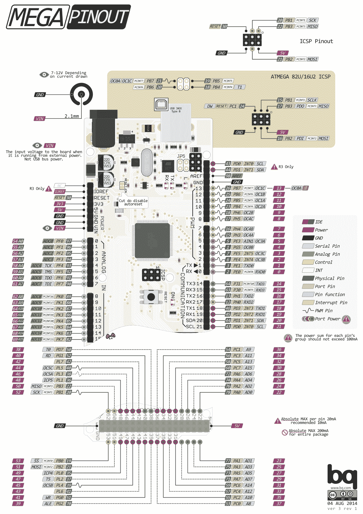

通常，人们会选择一些可能适用于项目的 MCU，获取开发板，将它们连接到预期系统组件的其余部分（通常是在它们自己的开发板或分离板上），并开始为 MCU 开发软件，使一切协同工作。

随着系统的更多部分变得最终确定，开发板和面包板组件的数量将减少，直到开始进行最终**印刷电路板**（**PCB**）布局。这也将经历多次迭代，因为问题得到解决，最后一刻添加功能，并且整个系统经过测试和优化。

在这种系统中，MCU 在物理层面与硬件一起工作，因此通常需要同时指定硬件和软件，因为软件对硬件功能非常依赖。在行业中经常遇到的一个共同主题是硬件模块化，可以作为小型附加 PCB，最小化增加复杂性，为温度控制器和变频驱动器等设备添加传感器或通信接口，或作为全功能的 DIN 轨道模块连接到公共串行总线。

# 示例-激光切割机的机器控制器

使用高功率激光切割各种材料是最快速和最准确的方法之一。随着二氧化碳（CO[2]）的价格多年来急剧下降，这导致了廉价激光切割机的广泛使用，如下图所示：

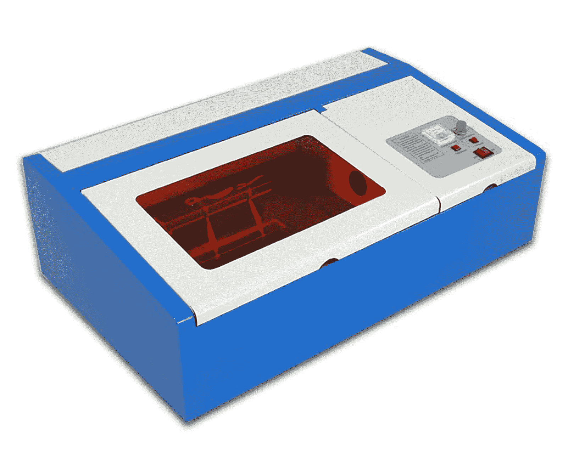

虽然完全可以只使用基本的外壳和用于移动头部横跨机床的步进运动控制板来操作激光切割机，但从可用性和安全性的角度来看，这并不理想。然而，许多可以在线购买的廉价激光切割机完全没有任何安全或可用性功能。

# 功能规格

为了完成产品，我们需要添加一个控制系统，使用传感器和执行器来监视和控制机器的状态，确保它始终处于安全状态，并在必要时关闭激光束。这意味着保护以下三个部分的访问：

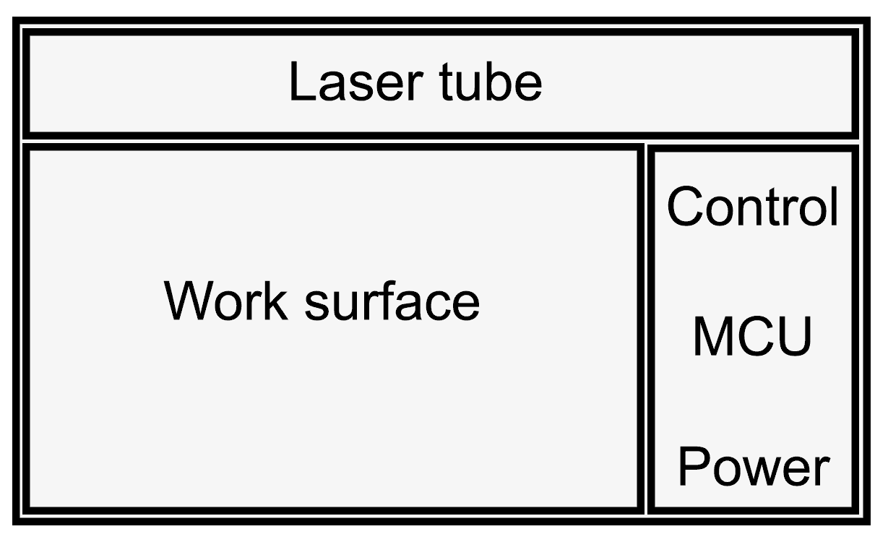

切割光束通常由 CO[2]激光器产生，这是一种 1964 年发明的气体激光器。高电压的应用导致电流流动，从而激发孔内的气体分子，最终形成一束**长波红外**（**LWIR**）或 IR-C 的相干光束，波长为 9.4 或 10.6 微米。

LWIR 的一个特点是它被大量材料强烈吸收，因此可以用于雕刻、切割，甚至是组织的手术，因为生物组织中的水能够高效吸收激光束。这也解释了为什么即使皮肤短暂暴露于 CO[2]激光束也是极其危险的。

为了实现安全操作，必须通过在正常操作期间锁定封闭式空间、关闭激光电源，并在任何互锁打开或任何其他安全条件不再满足时关闭光束快门或最好是这些措施的组合来抑制激光光束的暴露。

例如，必须遵守温度限制：大多数 CO[2]激光器由水冷气体放电管组成，在冷却故障的情况下可能会迅速破裂或弯曲。此外，切割过程会产生刺激性或有毒的烟雾，需要持续从封闭空间中排出，以免在打开盖子时污染光学器件并排出到环境中。

这些要求需要我们监测冷却水流量和温度，排气口的空气流动，以及排气过滤器的空气流动阻力（质量流量的压降）。

最后，我们还希望使用激光切割机变得更加方便，避免需要以机器特定的方式处理设计，然后将其转换并通过 USB 上传到步进电机控制板。相反，我们希望从 SD 卡或 USB 存储设备加载设计项目，并使用简单的 LCD 和按钮来设置选项。

# 设计要求

考虑到之前的要求，我们可以列出控制系统所需的功能列表：

+   操作员安全：

+   访问面板上的互锁开关（关闭时）

+   锁定机制（机械锁定访问面板；冗余）

+   紧急停止

+   激光冷却：

+   泵继电器

+   水箱中的温度传感器（冷却能力，进水温度）

+   排气冷却口的温度传感器（外壳温度）

+   流量传感器（水流速；冗余）

+   排气口：

+   风扇继电器

+   空气过滤器状态（差压传感器）

+   风扇速度（RPM）

+   激光模块：

+   激光功率继电器

+   光束快门（冗余）

+   用户界面

+   警报指示灯：

+   面板互锁

+   空气过滤器状态

+   风扇状态

+   泵状态

+   水温

+   指示灯：

+   待机

+   启动

+   操作

+   紧急停止

+   冷却

+   通讯：

+   与步进电机板的 USB 通信（UART）

+   运动控制：生成步进电机指令

+   从 SD 卡/USB 存储设备读取文件

+   通过以太网/ Wi-Fi 接受文件

+   NFC 读卡器用于识别用户

# 实施相关选择

正如本章开头所指出的，中档 MCU 目前能够提供资源来满足大多数，如果不是所有的设计要求。因此，我们将花钱在硬件组件上还是软件开发上是一个棘手的问题。除了无法预料的因素，我们现在将更仔细地研究三种候选解决方案：

+   单个中档 AVR MCU 板（ATmega2560）

+   更高端的 Cortex-M3 MCU 板（SAM3X8E）

+   中档 MCU 板和带 OS 的 SBC 的组合

我们只需一个 Arduino Mega（ATmega2560）就可以满足设计要求，因为前五个部分在 CPU 速度方面要求不高，只需要一些数字输入和输出引脚，以及根据我们将使用的传感器的确切类型可能需要一些模拟引脚，或者最多需要一个外围接口来使用（例如，用于 MEMS 压力传感器）。

挑战始于前一个功能清单中的通信中的运动控制功能，我们突然需要将**矢量图形文件**（**.svg**）转换为一系列步进命令。这是一个数据传输、文件解析、路径生成和在机器人世界中所知的逆运动学的复合问题。USB 通信对我们的 8 位 MCU 也可能存在问题，主要是因为处理器负载的峰值与 USB 端点通信或 UART RX 缓冲寄存器处理的超时时间重合。

关键在于知道何时改变策略。运动控制是时间关键的，因为它与物理世界的惯性有关。此外，我们受到控制器的处理和带宽资源的限制，使得控制和数据传输、缓冲以及最终的处理和输出生成本身成为可能。作为一个一般模式，更有能力的内部或外部外设可以通过处理事件和内存事务自己来放松时间要求，减少上下文切换和处理开销。以下是这些考虑的一个不完整列表：

+   简单的 UART 需要在 RX 完成（RXC）时收集每个字节。如果未能这样做，将导致数据丢失，如 DOR 标志所示。一些控制器，如 ATmega8u2 到 ATmega32u4，通过 RTS/CTS 线提供原生硬件流控制，可以防止 USB-UART 转换器（如 PL2303 和 FT232）发送数据，迫使它们进行缓冲，直到 UDR 再次方便地清空。

+   专用的 USB 主机外设，如 MAX3421，通过 SPI 连接，有效地消除了大容量存储集成的 USB 定时要求。

+   除了 UART 之外，网络通信外设由于层堆栈的复杂性，在软件中具有固有的缓冲。对于以太网，W5500 是一个有吸引力的解决方案。

+   有时候，添加另一个较小的 MCU 是有意义的，它可以独立处理 I/O 和模式生成，并实现我们选择的接口 - 例如串行或并行。这已经是一些 Arduino 板的情况，其中包含一个 ATmega16u2 用于 USB 串行转换。

NFC 读卡器功能要求**近场通信**（**NFC**，RFID 的一个子集）以防止激光切割机的未经授权使用，这将增加最大的负担。不是因为与 NFC 读卡器本身的通信，而是由于代码大小的增加和处理密码学与证书的 CPU 需求增加，取决于所选择的安全级别。我们还需要一个安全的地方来存储证书，这通常会提高 MCU 的规格。

现在我们到了考虑更高级选项的时候。更简单的 ATmega2560 仍然是一个很好的选择，因为它有大量的 GPIO，并且可以通过 SPI 读取 SD 卡，同时与外部集成的以太网芯片通信。然而，在运动控制和 NFC 读卡器功能清单中的计算或内存密集型任务可能会使 MCU 负担过重，或者导致复杂的“优化”解决方案，可维护性较差。

将 MCU 升级为 Arduino Due 开发板上找到的 ARM Cortex-M3，可能会解决所有这些瓶颈。它将保留我们在 ATmega2560 上习惯的大量 GPIO，同时显著提高 CPU 性能。步进驱动模式可以在 MCU 上生成，它还具有原生 USB 支持，以及其他高级外设（USART、SPI 和 I2C 和 HSMCI，它们也具有 DMA）。

基本的 NFC 标签读卡器可以通过 UART、SPI 或 I2C 连接，这种设计选择会导致一个如图所示的系统：

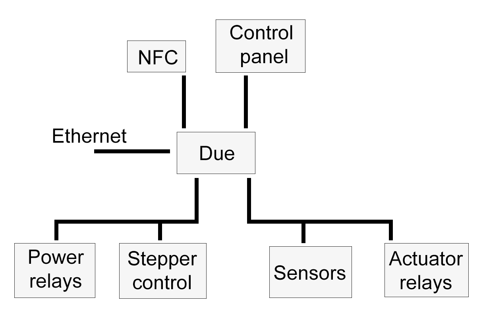

涉及 SBC 的第三种方案将再次使用 ATmega2560，并添加一个运行 OS 的低功耗 SBC。这个 SBC 将处理任何 CPU 密集型任务，以太网和 Wi-Fi 连接，USB（主机）任务等。它将通过 UART 与 ATmega 端通信，可能在两个板之间添加数字隔离器或电平转换器，以适应 3.3V（SBC）和 5V TTL（Atmega）逻辑电平。

选择 SBC + MCU 解决方案将大大改变软件挑战，但在硬件方面只会略微重新组织我们的系统。这将如下所示：

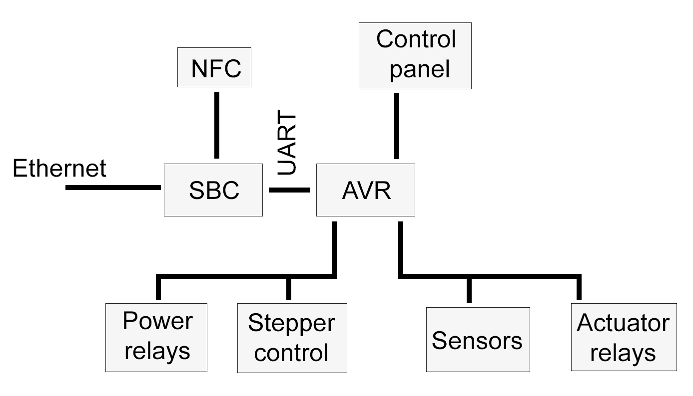

与大多数开发过程一样，只有少数绝对的答案，许多解决方案在功耗、复杂性和维护要求之间进行权衡后，就能满足功能要求，被视为*足够好*的解决方案。

在这个特定的例子中，可以选择高端单板或双板解决方案，而且很可能需要同样多的努力来满足要求。主要的区别之一是基于 OS 的解决方案需要进行频繁的 OS 更新，因为它是一个运行完整 OS 的网络连接系统，而嵌入式以太网控制器具有卸载的硬件 TCP/IP 堆栈和内存，往往更加稳健和可靠。

基于 Cortex-M3 的选项（或者更快的 Cortex-M4）将只包含我们自己的代码，因此不太可能存在可以轻易被攻击的常见安全问题。我们仍然需要进行维护，但我们的代码足够小，可以完全验证和阅读，唯一的遗憾是 Arduino Due 设计未能为 RMII 引出引脚以连接外部以太网 PHY，这会阻碍其内部以太网 MAC 的使用。

按照我们在本章开头整理的清单，但这次考虑到 ATmega2560 + SBC 和应用程序，我们得到了以下的职责分配：

+   **外围设备**：MCU 端主要需要 GPIO，一些模拟（ADC）输入，以太网，USB，以及 SPI 和/或 I2C。

+   **CPU**：所需的 MCU 性能对时间至关重要，但较小，除非我们需要将矢量路径元素处理为步进指令。只要能够为 MCU 端执行足够的命令并避免时间关键的交互，SBC 端可以很复杂。

+   浮点：如果我们有硬件浮点支持，MCU 上的步进指令转换算法将执行得更快。所涉及的长度和时间尺度可能使固定点算术成为可能，从而放宽了这一要求。

+   **ROM**：整个 MCU 代码可能只需要几千字节，因为它并不是非常复杂。SBC 代码将通过调用高级库来提供所需的功能而大幅增加，但这将被类似规模的大容量存储和处理能力所抵消。

+   **RAM**：MCU 上几 KB 的 SRAM 应该足够。步进指令转换算法可能需要修改以适应 SRAM 的限制，包括其缓冲和处理数据的要求。在最坏的情况下，缓冲区可以缩小。

+   **电源和热量**：考虑到激光切割系统的功率需求和冷却系统，我们没有重大的功率或热量限制。包含控制系统的部分已经配备了适当尺寸的冷却风扇，并且已经安装了主电源供应。

在这一点上需要注意的是，尽管我们已经充分意识到了手头任务的复杂性和要求，从而得出了对硬件组件的选择，但如何详细实现这些要求的方面仍然留给软件开发人员。

例如，我们可以定义自己的数据结构和格式，并自行实现特定于机器的路径生成和运动控制，或者采用（RS-274）G 代码中间格式，该格式在数控应用中已经有数十年的历史，并且非常适合生成运动控制命令。G 代码在 diy 硬件社区中也得到了广泛的接受，特别是用于 FDM 3D 打印。

G-code 基于运动控制的一个值得注意的成熟开源实现是 GRBL，引入为：

Grbl 是一个免费的、开源的、高性能的软件，用于控制移动的机器，制造东西，或者使东西移动，并且可以在直接的 Arduino 上运行。如果 maker 运动是一个行业，Grbl 将成为行业标准。

--https://github.com/gnea/grbl

很可能我们将不得不为不同的安全检查违规添加停止和紧急停止功能。虽然温度偏差或堵塞的过滤器最好只是停止激光切割机，并允许在解决问题后恢复工作，但是由于打开机箱而触发的联锁必须立即关闭激光，即使没有完成路径段和运动的最后命令。

模块化运动控制任务并为其生成 G 代码的选择除了具有经过验证的实现可用之外，还有其他好处，使我们可以轻松添加可用性功能，例如手动控制进行设置和校准，以及使用先前在机器端生成的可读代码进行可测试性，就像我们的文件解释和路径生成算法的输出检查一样。

有了需求列表，完成了初始设计，并对我们如何实现目标有了更深入的了解，下一步将是获取一个带有选择的 MCU 和/或 SoC 的开发板（或多个开发板），以及任何外围设备，以便可以开始开发固件并集成系统。

虽然本书所述的机器控制系统的完整实现超出了本书的范围，但我们将在本章的其余部分和第六章中努力实现对微控制器和 SBC 目标品种的开发的深入理解，*测试基于 OS 的应用程序*，第八章，*示例-基于 Linux 的信息娱乐系统*，以及第十一章，*为混合 SoC/FPGA 系统开发*。

# 嵌入式 IDE 和框架

虽然 SoC 的应用开发往往与桌面和服务器环境非常相似，正如我们在上一章中看到的，MCU 的开发需要对正在开发的硬件有更加深入的了解，有时甚至需要了解要在特定寄存器中设置的确切位。

存在一些旨在为特定 MCU 系列抽象这些细节的框架，以便可以开发一个通用 API，而不必担心它在特定 MCU 上的实现方式。其中，Arduino 框架是工业应用之外最为人所知的，尽管也有许多商业框架经过认证可用于生产。

诸如 AVR 和 SAM MCU 的**高级软件框架**（**ASF**）等框架可以与各种 IDE 一起使用，包括 Atmel Studio、Keil µVision 和 IAR 嵌入式工作室。

以下是一些流行的嵌入式 IDE 的非尽事宜列表：

| **名称** | **公司** | **许可证** | **平台** | **备注** |
| --- | --- | --- | --- | --- |
| Atmel Studio | Microchip | 专有 | AVR, SAM (ARM Cortex-M). | 最初由 Atmel 开发，后被 Microchip 收购。 |
| µVision | Keil (ARM) | 专有 | ARM Cortex-M, 166, 8051, 251. | **微控制器开发套件**（**MDK**）工具链的一部分。 |
| 嵌入式工作台 | IAR | 专有 | ARM Cortex-M, 8051, MSP430, AVR, Coldfire, STM8, H8, SuperH 等。 | 每个 MCU 架构都有单独的 IDE。 |
| MPLAB X | Microchip | 专有 | PIC, AVR. | 使用基于 Java 的 NetBeans IDE 作为基础。 |
| Arduino | Arduino | GPLv2 | 一些 AVR 和 SAM MCU（可扩展）。 | 基于 Java 的 IDE。仅支持自己的 C 方言语言。 |

IDE 的主要目标是将整个工作流程集成到一个应用程序中，从编写初始代码到使用编译后的代码对 MCU 内存进行编程和调试应用程序运行时。

是否使用完整的 IDE 是一个偏好问题。当使用基本编辑器和命令行工具时，所有基本功能仍然存在，尽管像 ASF 这样的框架是为了与 IDE 深度集成而编写的。

流行的 Arduino 框架的主要优势之一是，它已经在越来越多的 MCU 架构上支持了各种 MCU 外设和其他功能的 API 标准化。再加上框架的开源性质，使其成为一个新项目的吸引人的目标。当涉及到原型设计时，这一点尤为吸引人，因为有大量为这个 API 编写的库和驱动程序。

不幸的是，Arduino IDE 只专注于 C 编程语言的简化方言，尽管其核心库广泛使用 C++。尽管如此，这使我们能够将库集成到我们自己的嵌入式 C++项目中，正如我们将在本章后面看到的那样。

# 编程 MCU

在为目标 MCU 编译代码之后，二进制图像需要在执行和调试之前写入控制器内存。在本节中，我们将看一下可以实现这一目标的各种方法。如今，只有在晶圆级别之前，已知良好的晶圆片被粘合到引线框架并封装之前，才会使用测试插座进行工厂端编程。表面贴装零件已经排除了轻松移除 MCU 进行（重复）编程的可能性。

存在许多（通常是特定供应商的）选项用于电路内编程，这些选项由它们使用的外设和它们影响的存储器区域来区分。

因此，一个原始的 MCU 通常需要使用外部编程适配器进行编程。这些通常通过设置 MCU 的引脚，使其进入编程模式，之后 MCU 接受包含新 ROM 图像的数据流。

另一个常用的选项是在 ROM 的第一部分添加引导加载程序，允许 MCU 自行编程。这是通过引导加载程序在启动时检查是否应切换到编程模式或继续加载实际程序（放置在引导加载程序部分之后）来实现的。

# 内存编程和设备调试

外部编程适配器通常利用专用接口和相关协议，允许对目标设备进行编程和调试。可以用来编程 MCU 的协议包括以下内容：

| **名称** | **引脚** | **特点** | **描述** |
| --- | --- | --- | --- |
| **SPI（ISP）** | **4** | 程序 | **串行外围接口**（**SPI**），用于与旧 AVR MCU 一起访问其串行编程模式（**电路中串行编程**（**ISP**））。 |

| **JTAG** | **5** | 程序调试

边界 | 专用的，行业标准的芯片内接口，用于编程和调试支持。在 AVR ATxmega 设备上受支持。 |

| **UPDI** | **1** | 程序调试 | 用于较新的 AVR MCU，包括 ATtiny 设备的**统一编程和调试接口**（**UDPI**）。这是 ATxmega 设备上发现的双线 PDI 的继任者的单线接口。 |
| --- | --- | --- | --- |
| **HVPP/****HVSP** | **17/****5** | 程序 | 高电压并行编程/高电压串行编程。AVR 编程模式使用复位引脚上的 12V 和对 8+引脚的直接访问。忽略任何内部保险丝设置或其他配置选项。主要用于工厂编程和恢复。 |
| **TPI** | **3** | 程序 | 用于一些 ATtiny AVR 设备的微型编程接口。这些设备还缺少 HVPP 或 HVSP 的引脚数量。 |

| **SWD** | **3** | 程序调试

边界 | 串行线调试。类似于具有两条线的减少引脚计数 JTAG，但使用 ARM 调试接口功能，允许连接的调试器成为总线主机，访问 MCU 的存储器和外围设备。 |

ARM MCU 通常提供 JTAG 作为其主要的编程和调试手段。在 8 位 MCU 上，JTAG 并不常见，这主要是由于其要求的复杂性。

AVR MCU 倾向于提供通过 SPI 的系统编程（ISP），除了高电压编程模式。进入编程模式要求在编程和验证期间保持复位引脚低，并在编程周期结束时释放和触发。

ISP 的一个要求是 MCU 中相关的（SPIEN 保险丝位）被设置为启用系统编程接口。如果未设置此位，设备将不会在 SPI 线上响应。如果没有 JTAG 可用并通过 JTAGEN 保险丝位启用，则只能使用 HVPP 或 HVSP 来恢复和重新编程芯片。在后一种情况下，不寻常的引脚组合和 12V 供电电压不一定与板电路很好地集成。

大多数串行编程接口所需的物理连接都相当简单，即使 MCU 已经集成到电路中，如下图所示：

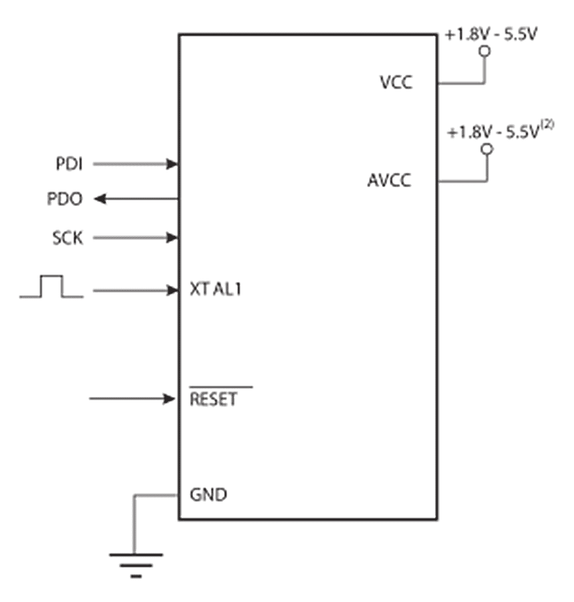

在这里，如果存在内部振荡器，则外部振荡器是可选的。 **PDI**，**PDO**和**SCK**线对应于它们各自的 SPI 线。在编程期间，复位线保持活动（低电平）。以这种方式连接到 MCU 后，我们可以自由地写入其闪存存储器，EEPROM 和配置保险丝。

在较新的 AVR 设备上，我们发现了**统一编程和调试接口**（**UPDI**），它只使用一根线（除了电源和地线）连接到目标 MCU，以提供编程和调试支持。

此接口简化了先前的连接图如下：

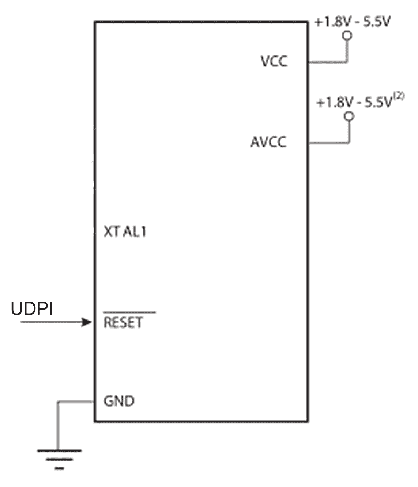

这与 ATxmega 上的 JTAG（IEEE 1149.1）（启用时）有利地比较如下：

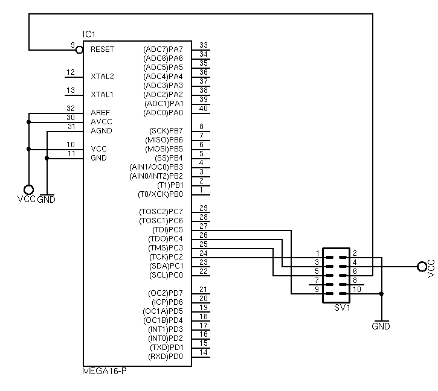

在 ATxmega 上实现的减少引脚计数 JTAG 标准（IEEE 1149）仅需要一个时钟 TCKC，一个数据线 TMSC，因此被称为紧凑 JTAG。在这些接口中，UPDI 仍然需要与目标设备的最少连接。除此之外，它们都支持 AVR MCU 的类似功能。

对于使用 JTAG 进行编程和调试的其他系统，没有标准连接。每个制造商都使用自己首选的连接器，从 2 x 5 引脚（Altera，AVR）到 2 x 10 引脚（ARM），或单个 8 引脚连接器（Lattice）。

由于 JTAG 更多是一种协议标准而不是物理规范，因此应就特定细节咨询目标平台的文档。

# 引导加载程序

引导加载程序已被引入为一个小的额外应用程序，它使用现有接口（例如 UART 或以太网）提供自我编程能力。在 AVR 上，可以在其闪存中保留 256 字节到 4 KB 的引导加载程序部分。此代码可以执行任意数量的用户定义任务，从与远程系统建立串行链接，到使用 PXE 通过以太网从远程镜像引导。

在本质上，AVR 引导加载程序与任何其他 AVR 应用程序没有什么不同，只是在编译时添加了一个额外的链接器标志来设置引导加载程序的起始字节地址：

```cpp
--section-start=.text=0x1800 
```

用特定 MCU 的类似地址替换这个地址（对于 AVR，根据设置的 BOOTSZ 标志和使用的控制器，查看关于引导大小配置的数据表：引导复位地址，例如，引导复位地址为 0xC00 是以字为单位的，部分起始位置以字节定义）。这确保引导加载程序代码将被写入 MCU 的 ROM 的正确位置。将引导加载程序代码写入 ROM 通常通过 ISP 完成。

AVR MCU 将 flash ROM 分为两个部分：**不可读写时写**（对于大多数，如果不是所有的应用内存空间）和**可读写时写**（**RWW**）部分。简而言之，这意味着 RWW 部分可以安全地擦除和重写，而不会影响 CPU 的操作。这就是为什么引导加载程序驻留在 NRWW 部分的原因，也是为什么引导加载程序不容易更新自身的原因。

另一个重要的细节是引导加载程序也不能更新设置 MCU 中各种标志的保险丝。要更改这些标志，必须通过外部编程设备进行。

在使用引导加载程序对 MCU 进行编程后，通常会设置 MCU 中的标志，以让处理器知道已安装引导加载程序。在 AVR 的情况下，这些标志是 BOOTSZ 和 BOOTRST。

# 内存管理

微控制器的存储和内存系统由多个组件组成。有一个**只读存储器**（**ROM**）部分，它只在芯片编程时写入一次，但通常不能被 MCU 本身改变，正如我们在前一节中看到的。

MCU 可能还有一些持久存储，以 EEPROM 或等效形式存在。最后，还有 CPU 寄存器和**随机存取存储器**（**RAM**）。这导致以下示例性的内存布局：

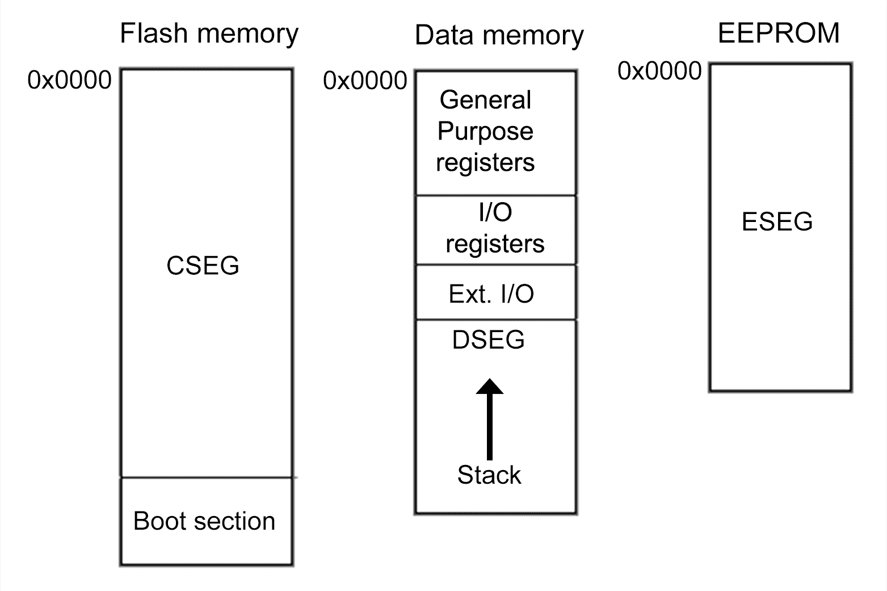

使用修改后的哈佛架构（在某个架构级别上分割程序和数据存储器，通常使用数据总线）在 MCU 中很常见。例如，AVR 架构中，程序存储器位于 ROM 中，对于 ATmega2560，它使用自己的总线与 CPU 核心连接，正如我们在第一章中所看到的那样，这是这个 MCU 的框图，*嵌入式系统是什么？*

将这些内存空间分开为不同的总线的一个主要优势是可以分别访问它们，这样更好地利用了 8 位处理器可用的有限寻址空间（1 和 2 字节宽地址）。这还允许在 CPU 忙于其他内存空间时进行并发访问，进一步优化了可用资源。

对于 SRAM 中的数据存储器，我们可以自由使用它。在这里，我们至少需要一个堆栈才能运行程序。根据 MCU 中剩余的 SRAM 量，我们还可以添加堆。然而，只涉及静态分配内存的中等复杂度的应用程序，不涉及产生带有堆分配代码的高级语言特性，可以实现。

# 堆栈和堆

是否需要在编程的 MCU 上初始化堆栈取决于一个人希望走多低级。当使用 C 运行时（在 AVR 上：`avr-libc`），运行时将通过让链接器将裸代码放入 init 部分（例如由以下指定）来处理初始化堆栈和其他细节：

```cpp
__attribute__ ((naked, used, section (".init3")))
```

在执行任何我们自己的应用代码之前。

AVR 上的标准 RAM 布局是从 RAM 的开始处开始`.data`变量，然后是`.bss`。堆栈从 RAM 的相反位置开始，向开始位置增长。在`.bss`部分的结束和堆栈的结束之间将留下空间，如下所示：

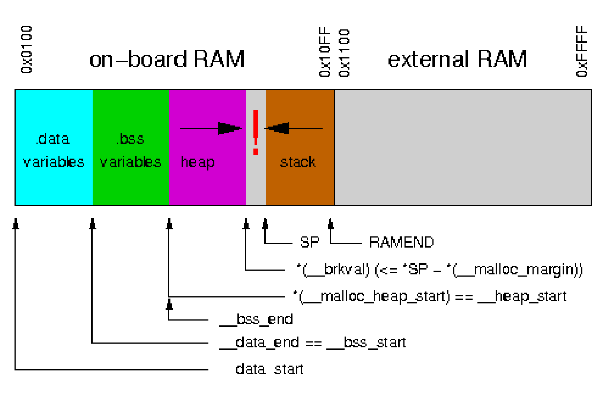

由于堆栈的增长取决于正在运行的应用程序中函数调用的深度，很难说有多少空间可用。一些 MCU 还允许使用外部 RAM，这可能是堆的可能位置如下：

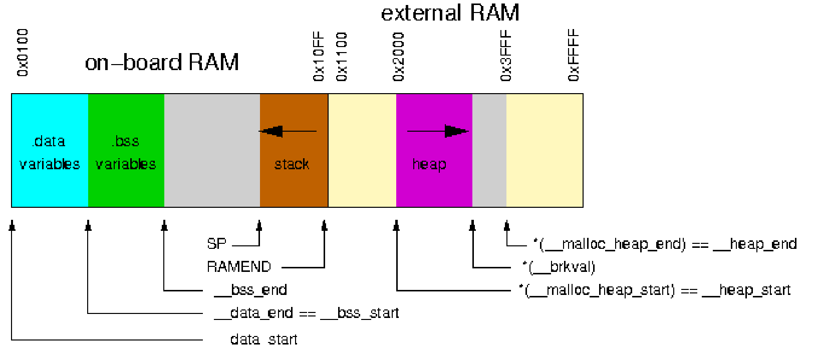

AVR Libc 库实现了一个针对 AVR 架构进行了优化的`malloc()`内存分配器例程。使用它，可以实现自己的`new`和`delete`功能，如果有需要的话，因为 AVR 工具链没有实现这两个功能。

为了在 AVR MCU 上使用外部内存作为堆存储，必须确保已初始化外部内存，之后地址空间才可供`malloc()`使用。堆空间的起始和结束由以下全局变量定义：

```cpp
char * __malloc_heap_start 
char * __malloc_heap_end 
```

AVR 文档对调整堆的建议如下：

如果堆将移动到外部 RAM，`__malloc_heap_end`必须相应调整。这可以在运行时直接写入该变量，也可以在链接时通过调整符号`__heap_end`的值来自动完成。

# 中断，ESP8266 IRAM_ATTR

在台式 PC 或服务器上，整个应用程序二进制文件将加载到 RAM 中。但是在 MCU 上，通常会尽可能多地将程序指令保留在 ROM 中，直到需要它们。这意味着我们应用程序的大部分指令不能立即执行，而必须先从 ROM 中获取，然后 MCU 的 CPU 才能通过指令总线获取它们以执行。

在 AVR 上，每个可能的中断都在向量表中定义，该表存储在 ROM 中。这为每种中断类型提供了默认处理程序或用户定义的版本。要标记中断例程，可以使用`__attribute__((signal))`属性，或者使用`ISR()`宏：

```cpp
#include <avr/interrupt.h> 

ISR(ADC_vect) { 
         // user code 
} 
```

这个宏处理注册中断的细节。只需指定名称并为中断处理程序定义一个函数。然后通过中断向量表调用它。

使用 ESP8266（及其后续产品 ESP32），我们可以使用特殊属性`IRAM_ATTR`标记中断处理程序函数。与 AVR 不同，ESP8266 MCU 没有内置 ROM，而必须使用其 SPI 外设将任何指令加载到 RAM 中，这显然相当慢。

使用此属性与中断处理程序的示例如下：

```cpp
void IRAM_ATTR MotionModule::interruptHandler() {
          int val = digitalRead(pin);
          if (val == HIGH) { motion = true; }
          else { motion = false; }
 }
```

在这里，我们有一个与运动检测器信号连接的中断处理程序，连接到一个输入引脚。与任何良好编写的中断处理程序一样，它非常简单，旨在在返回到应用程序的正常流程之前快速执行。

如果将此处理程序放在 ROM 中，这意味着例程不会立即响应运动传感器输出的变化。更糟糕的是，这将导致处理程序需要更长的时间才能完成，从而延迟应用程序其余代码的执行。

通过使用`IRAM_ATTR`标记，我们可以避免这个问题，因为整个处理程序在需要时已经在 RAM 中，而不是整个系统在等待 SPI 总线返回请求的数据之前就会停顿。

请注意，尽管这种属性可能看起来很诱人，但应该谨慎使用，因为大多数 MCU 的 ROM 比 RAM 多得多。在 ESP8266 的情况下，有 64kB RAM 用于代码执行，可能还有数兆字节的外部 Flash ROM。

在编译我们的代码时，编译器会将带有此属性标记的指令放入一个特殊的部分，以便 MCU 知道将其加载到 RAM 中。

# 并发

除了少数例外，MCU 是单核系统。多任务处理通常不会进行；相反，有一个单一的执行线程，计时器和中断添加了异步操作的方法。

原子操作通常由编译器支持，AVR 也不例外。在以下情况下可以看到需要原子指令块。请记住，虽然存在一些例外情况（MOVW 用于复制寄存器对和通过 X、Y、Z 指针进行间接寻址），但在 8 位架构上的指令通常只影响 8 位值。

+   在主函数中以字节方式读取一个 16 位变量，并在 ISR 中更新它。

+   一个 32 位变量在主函数或 ISR 中被读取、修改，然后存储回去，而另一个例程可能会尝试访问它。

+   代码块的执行时间至关重要（比如位操作 I/O，禁用 JTAG）。

AVR libc 文档中给出了第一种情况的基本示例：

```cpp
#include <cinttypes> 
#include <avr/interrupt.h> 
#include <avr/io.h> 
#include <util/atomic.h> 

volatile uint16_t ctr; 

ISR(TIMER1_OVF_vect) { 
   ctr--; 
} 

int main() { 
         ctr = 0x200; 
         start_timer(); 
         sei(); 
         uint16_t ctr_copy; 
         do { 
               ATOMIC_BLOCK(ATOMIC_FORCEON) 
               { 
                     ctr_copy = ctr; 
               } 
         } 
         while (ctr_copy != 0); 

         return 0; 
} 
```

在这段代码中，一个 16 位整数在中断处理程序中被改变，而主程序正在将其值复制到一个本地变量中。我们调用`sei()`（设置全局中断标志）来确保中断寄存器处于已知状态。`volatile`关键字提示编译器，这个变量及其访问方式不应以任何方式进行优化。

因为我们包含了 AVR 原子头文件，我们可以使用`ATOMIC_BLOCK`宏，以及`ATOMIC_FORCEON`宏。这样做会创建一个代码段，保证以原子方式执行，没有任何干扰来自中断处理程序等。我们传递给`ATOMIC_BLOCK`的参数将全局中断状态标志强制为启用状态。

由于我们在开始原子块之前将此标志设置为相同状态，我们不需要保存此标志的先前值，这节省了资源。

正如前面所述，MCU 往往是单核系统，具有有限的多任务处理和多线程能力。要进行适当的多线程和多任务处理，需要进行上下文切换，不仅要保存运行任务的堆栈指针，还要保存所有寄存器和相关状态。

这意味着虽然在单个 MCU 上可能运行多个线程和任务是可能的，在 8 位 MCU（如 AVR 和 PIC（8 位范围））的情况下，这样做的努力很可能不值得，而且需要大量的劳动。

在更强大的 MCU 上（如 ESP8255 和 ARM Cortex-M），可以运行**实时操作系统**（RTOSes），这些系统实现了这种上下文切换，而不需要做所有的繁重工作。我们将在本章后面讨论 RTOSes。

# AVR 开发与 Nodate

Microchip 为 AVR 开发提供了 GCC 工具链的二进制版本。在撰写本文时，最新版本的 AVR-GCC 是 3.6.1，包含 GCC 版本 5.4.0。这意味着对 C++14 的全面支持和对 C++17 的有限支持。

使用这个工具链非常容易。可以从 Microchip 网站上简单地下载它，将其解压到一个合适的文件夹，并将包含 GCC 可执行文件的文件夹添加到系统路径中。之后，它可以用来编译 AVR 应用程序。一些平台也会通过包管理器提供 AVR 工具链，这样的话过程会更加简单。

安装了这个 GCC 工具链后，一个可能注意到的事情是没有 C++ STL 可用。因此，只能使用 GCC 支持的 C++语言特性。正如 Microchip AVR FAQ 所指出的：

+   显然，C++相关的标准函数、类和模板类都不可用。

+   操作符 new 和 delete 没有被实现；尝试使用它们会导致链接器抱怨未定义的外部引用。（这可能可以修复。）

+   一些提供的包含文件不是 C++安全的，也就是说，它们需要被包装成`extern"C" { . . . }`。（这当然也可以修复。）

+   不支持异常。由于 C++前端默认启用异常，需要在编译器选项中使用`-fno-exceptions`显式关闭异常。如果没有这样做，链接器将抱怨对`__gxx_personality_sj0`的未定义外部引用。

由于缺乏包含 STL 功能的 Libstdc++实现，我们只能通过使用第三方实现来添加这样的功能。这些包括基本上提供完整 STL 的版本，以及不遵循标准 STL API 的轻量级重新实现。后者的一个例子是 Arduino AVR 核心，它提供了类似于 STL 等效的 String 和 Vector 类，尽管存在一些限制和差异。

作为 Microchip AVR GCC 工具链的一种替代方案是 LLVM，这是一个编译器框架，最近为 AVR 添加了实验性支持，并且在未来的某个时候应该允许为 AVR MCU 生成二进制文件，同时通过其 Clang 前端（C/C++支持）提供完整的 STL 功能。

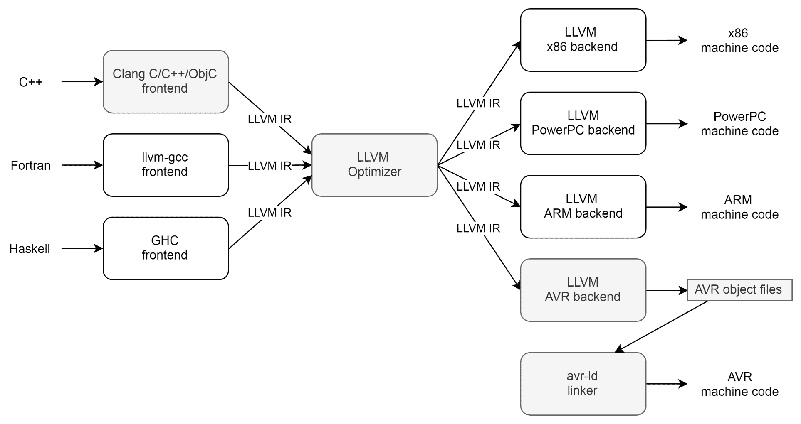

将这视为 LLVM 开发的一个抽象快照，同时说明 LLVM 的一般概念及其对中间表示的强调。

不幸的是，尽管 PIC MCU 系列在许多方面也属于 Microchip 并且类似于 AVR，但在这一点上，Microchip 并没有为其提供 C++编译器，直到将其升级到 PIC32（基于 MIPS）MCU 系列。

# 进入 Nodate

在这一点上，您可以选择使用我们在本章中之前讨论过的 IDE 之一，但这对于 AVR 开发本身来说并不那么有教育意义。因此，我们将看一个为使用修改后的 Arduino AVR 核心开发的 ATmega2560 板的简单应用程序，称为 Nodate（[`github.com/MayaPosch/Nodate`](https://github.com/MayaPosch/Nodate)）。这个框架重构了原始核心，使其可以作为常规 C++库来使用，而不仅仅是与 Arduino C 方言解析器和前端一起使用。

安装 Nodate 非常简单：只需将其下载到系统的适当位置，并将`NODATE_HOME`系统变量指向 Nodate 安装的根文件夹。之后，我们可以以一个示例应用程序作为新项目的基础。

# 示例 - CMOS IC 测试仪

在这里，我们将看一个更全面的示例项目，实现一个用于 5V 逻辑芯片的集成电路（IC）测试仪。除了使用其 GPIO 引脚探测芯片外，该项目还通过 SPI 从 SD 卡读取芯片描述和测试程序（以逻辑表的形式）。用户控制以串行命令行界面的形式添加。

首先，我们看一下该 Nodate 项目的`Makefile`，它位于项目的根目录中：

```cpp
ARCH ?= avr

 # Board preset.
 BOARD ?= arduino_mega_2560

 # Set the name of the output (ELF & Hex) file.
 OUTPUT := sdinfo

 # Add files to include for compilation to these variables.
 APP_CPP_FILES = $(wildcard src/*.cpp)
 APP_C_FILES = $(wildcard src/*.c)

 #
 # --- End of user-editable variables --- #
 #

 # Nodate includes. Requires that the NODATE_HOME environment variable has been set.
 APPFOLDER=$(CURDIR)
 export

 all:
    $(MAKE) -C $(NODATE_HOME)

 flash:
    $(MAKE) -C $(NODATE_HOME) flash

 clean:
    $(MAKE) -C $(NODATE_HOME) clean
```

我们指定的第一项是我们要定位的架构，因为 Nodate 也可以用于定位其他 MCU 类型。在这里，我们将 AVR 指定为架构。

接下来，我们使用 Arduino Mega 2560 开发板的预设。在 Nodate 中，我们有许多类似这样的预设，它们定义了有关开发板的许多细节。对于 Arduino Mega 2560，我们得到以下预设：

```cpp
MCU := atmega2560 
PROGRAMMER := wiring 
VARIANT := mega # "Arduino Mega" board type
```

如果没有定义板预设，就必须在项目的 Makefile 中定义这些变量，并为每个变量选择一个现有值，每个变量都在 Nodate AVR 子文件夹的自己的 Makefile 中定义。或者，可以将自己的 MCU、编程器和（引脚）变体文件添加到 Nodate 中，并添加一个新的板预设，然后使用它。

完成 makefile 后，是时候实现主函数了：

```cpp
#include <wiring.h>
 #include <SPI.h>
 #include <SD.h>

 #include "serialcomm.h"
```

接线头文件提供了对所有与 GPIO 相关的功能的访问。此外，我们还包括了 SPI 总线、SD 卡读卡器设备的头文件，以及一个包装串行接口的自定义类的头文件，稍后我们将会更详细地看到：

```cpp
int main () {
    init();
    initVariant();

    Serial.begin(9600);

    SPI.begin();
```

进入主函数后，我们通过调用`init()`来初始化 GPIO 功能。接下来的调用加载了我们正在针对的特定板的引脚配置（在顶部的`VARIANT`变量或板预设的 Makefile 中）。

在此之后，我们以 9600 波特率启动第一个串行端口，然后是 SPI 总线，最后是欢迎消息的输出，如下所示：

```cpp
   Serial.println("Initializing SD card...");

    if (!SD.begin(53)) {
          Serial.println("Initialization failed!");
          while (1);
    }

    Serial.println("initialization done.");

    Serial.println("Commands: index, chip");
    Serial.print("> ");
```

此时，我们期望 Mega 板上连接了一个 SD 卡，其中包含我们可以测试的可用芯片的列表。在这里，引脚 53 是硬件 SPI 片选引脚，方便地位于板上其他 SPI 引脚旁边。

假设板子已经正确连接并且可以无问题地读取卡片，我们会在控制台屏幕上看到一个命令行提示符：

```cpp
          while (1) {
                String cmd;
                while (!SerialComm::readLine(cmd)) { }

                if (cmd == "index") { readIndex(); }
                else if (cmd == "chip") { readChipConfig(); }
                else { Serial.println("Unknown command.");      }

                Serial.print("> ");
          }

          return 0;
 }
```

这个循环只是等待串行输入上的输入，之后它将尝试执行接收到的命令。我们调用用于从串行输入读取的函数是阻塞的，只有在收到换行符（用户按下*Enter*）或其内部缓冲区大小超过而没有收到换行符时才会返回。在后一种情况下，我们只是忽略输入，并尝试再次从串行输入读取。这结束了`main()`的实现。

现在让我们来看一下`SerialComm`类的头文件：

```cpp
#include <HardwareSerial.h>      // UART.

 static const int CHARBUFFERSIZE 64

 class SerialComm {
          static char charbuff[CHARBUFFERSIZE];

 public:
          static bool readLine(String &str);
 };
```

我们包括了硬件串行连接支持的头文件。这使我们可以访问底层的 UART 外设。这个类本身是纯静态的，定义了字符缓冲区的最大大小，以及从串行输入读取一行的函数。

接下来是它的实现：

```cpp
#include "serialcomm.h"

 char SerialComm::charbuff[CHARBUFFERSIZE];

 bool SerialComm::readLine(String &str) {
          int index = 0;

          while (1) {
                while (Serial.available() == 0) { }

                char rc = Serial.read();
                Serial.print(rc);

                if (rc == '\n') {
                      charbuff[index] = 0;
                      str = charbuff;
                      return true;
                }

                if (rc >= 0x20 || rc == ' ') {
                      charbuff[index++] = rc;
                      if (index > CHARBUFFERSIZE) {
                            return false;
                      }
                }
          }

          return false;
 }
```

在`while`循环中，我们首先进入一个循环，该循环在串行输入缓冲区中没有字符可读时运行。这使得它成为一个阻塞读取。

由于我们希望能够看到我们输入的内容，所以在下一部分中，我们会回显我们已经读取的任何字符。之后，我们检查是否收到了换行符。如果是，我们会向本地缓冲区添加一个终止空字节，并将其读入我们提供引用的 String 实例中，之后返回 true。

这里可以实现的一个可能的改进是增加一个退格功能，用户可以使用退格键删除读取缓冲区中的字符。为此，我们需要为退格控制字符（ASCII 0x8）添加一个情况，它将从缓冲区中删除最后一个字符，并且还可以让远程终端删除其最后一个可见字符。

在尚未找到换行符的情况下，我们继续到下一部分。在这里，我们检查是否收到了被视为 ASCII 0x20 的有效字符，或者空格。如果是，我们继续将新字符添加到缓冲区，最后检查是否已经到达读取缓冲区的末尾。如果没有，我们返回 false 以指示缓冲区已满但尚未找到换行符。

接下来是`index`和`chip`命令的处理函数`readIndex()`和`readChipConfig()`：

```cpp
void readIndex() {
          File sdFile = SD.open("chips.idx");
          if (!sdFile) {
                Serial.println("Failed to open IC index file.");
                Serial.println("Please check SD card and try again.");
                while(1);
          }

          Serial.println("Available chips:");
          while (sdFile.available()) {
                Serial.write(sdFile.read());
          }

          sdFile.close();
 }
```

这个函数大量使用了 Arduino SD 卡库中的`SD`和相关的`File`类。基本上，我们在 SD 卡上打开芯片索引文件，确保我们得到了一个有效的文件句柄，然后继续读取并打印文件中的每一行。这个文件是一个简单的基于行的文本文件，每行一个芯片名称。

在处理程序代码的末尾，我们已经从 SD 卡中读取完毕，文件句柄可以使用`sdFile.close()`关闭。稍后稍长一些的`readChipHandler()`实现也适用相同的方法。

# 用法

举例来说，当我们使用一个简单的 HEF4001 IC（4000 CMOS 系列四输入或门）进行测试时，我们必须向 SD 卡添加一个文件，其中包含了这个 IC 的测试描述和控制数据。`4001.ic`测试文件如下所示，因为它适合跟踪解析它并执行相应测试的代码。

```cpp
HEF4001B
Quad 2-input NOR gate.
A1-A2: 22-27, Vss: GND, 3A-4B: 28-33, Vdd: 5V
22:0,23:0=24:1
22:0,23:1=24:0
22:1,23:0=24:0
22:1,23:1=24:0
26:0,27:0=25:1
26:0,27:1=25:0
26:1,27:0=25:0
26:1,27:1=25:0
28:0,29:0=30:1
28:0,29:1=30:0
28:1,29:0=30:0
28:1,29:1=30:0
33:0,32:0=31:1
33:0,32:1=31:0
33:1,32:0=31:0
33:1,32:1=31:0
```

前三行按原样打印，剩下的行指定了各个测试场景。这些测试是行，并使用以下格式：

```cpp
<pin>:<value>,[..,]<pin>:<value>=<pin>:<value>
```

我们将这个文件命名为`4001.ic`，并将更新后的`index.idx`文件（包含新行上的'4001'条目）写入 SD 卡。为了支持更多的 IC，我们只需重复这个模式，使用它们各自的测试序列，并在索引文件中列出它们。最后是芯片配置的处理程序，它也启动了测试过程：

```cpp
 void readChipConfig() {
          Serial.println("Chip name?");
          Serial.print("> ");
          String chip;
          while (!SerialComm::readLine(chip)) { }
```

我们首先询问用户 IC 的名称，如之前由`index`命令打印出来的：

```cpp
          File sdFile = SD.open(chip + ".ic");      
          if (!sdFile) {
                Serial.println("Failed to open IC file.");
                Serial.println("Please check SD card and try again.");
                return;
          }

          String name = sdFile.readStringUntil('\n');
          String desc = sdFile.readStringUntil('\n');
```

我们尝试打开 IC 详细信息的文件，继续读取文件内容，从正在测试的 IC 的名称和描述开始：

```cpp
          Serial.println("Found IC:");
          Serial.println("Name: " + name);
          Serial.println("Description: " + desc);   

          String pins = sdFile.readStringUntil('\n');
          Serial.println(pins);
```

显示了这个 IC 的名称和描述后，我们读取包含如何将 IC 连接到 Mega 板标头的指令的行：

```cpp

          Serial.println("Type 'start' and press <enter> to start test.");
          Serial.print("> ");
          String conf;
          while (!SerialComm::readLine(conf)) { }
          if (conf != "start") {
                Serial.println("Aborting test.");
                return;
          }
```

在这里，我们询问用户是否确认开始测试 IC。除了`start`命令之外的任何命令都将中止测试并返回到中央命令循环。

收到`start`命令后，测试开始：

```cpp
          int result_pin, result_val;
          while (sdFile.available()) {
                // Read line, format:
                // <pin>:<value>, [..,]<pin>:<value>=<pin>:<value>
                pins = sdFile.readStringUntil('=');
                result_pin = sdFile.readStringUntil(':').toInt();
                result_val = sdFile.readStringUntil('\n').toInt();
                Serial.print("Result pin: ");
                Serial.print(result_pin);
                Serial.print(", expecting: ");
                Serial.println(result_val);
                Serial.print("\n");

                pinMode(result_pin, INPUT);
```

作为第一步，我们读取 IC 文件中的下一行，该行应包含第一个测试。第一部分包含输入引脚设置，等号后的部分包含 IC 的输出引脚及其在此测试中的预期值。

我们打印出了连接到结果引脚的板头编号和预期值。接下来，我们将结果引脚设置为输入引脚，以便在测试完成后读取它：

```cpp
                int pin;
                bool val;
                int idx = 0;
                unsigned int pos = 0;
                while ((idx = pins.indexOf(':', pos)) > 0) {
                      int pin = pins.substring(pos, idx).toInt();
                      pos = idx + 1; // Move to character beyond the double colon.

                      bool val = false
                      if ((idx = pins.indexOf(",", pos)) > 0) {
                            val = pins.substring(pos, idx).toInt();
                            pos = idx + 1;
                      }
                      else {
                            val = pins.substring(pos).toInt();
                      }

                      Serial.print("Setting pin ");
                      Serial.print(pin);
                      Serial.print(" to ");
                      Serial.println(val);
                      Serial.print("\n");
                      pinMode(pin, OUTPUT);
                      digitalWrite(pin, val);
                }
```

对于实际测试，我们使用从文件中读取的第一个字符串进行测试，解析它以获取输入引脚的值。对于每个引脚，我们首先获取它的编号，然后获取值（`0`或`1`）。

在将这些引脚编号和值回显到串行输出之前，我们将这些引脚的模式设置为输出模式，然后将测试值写入到每个引脚，如下所示：

```cpp

                delay(10);

                int res_val = digitalRead(result_pin);
                if (res_val != result_val) {
                      Serial.print("Error: got value ");
                      Serial.print(res_val);
                      Serial.println(" on the output.");
                      Serial.print("\n");
                }
                else {
                      Serial.println("Pass.");
                }
          }     

          sdFile.close();
 }
```

离开内部循环后，所有输入值都将被设置。我们只需稍等片刻，确保 IC 有足够的时间来稳定其新的输出值，然后我们尝试读取其输出引脚上的结果值。

IC 验证是对结果引脚的简单读取，然后将接收到的值与预期值进行比较。然后将此比较的结果打印到串行输出。

测试完成后，我们关闭 IC 文件并返回到中央命令循环，等待下一步指令。

将程序烧录到 Mega 板上并通过串口连接后，我们得到了以下结果：

```cpp
    Initializing SD card...
    initialization done.
    Commands: index, chip
    > index  
```

启动后，我们收到了 SD 卡被找到并成功初始化的消息。我们现在可以从 SD 卡中读取。我们还看到了可用的命令。

接下来，我们指定`index`命令以获取我们可以测试的可用 IC 的概述：

```cpp
    Available chips:
    4001
    > chip
    Chip name?
    > 4001
    Found IC:
    Name: HEF4001B
    Description: Quad 2-input NOR gate.
    A1-A2: 22-27, Vss: GND, 3A-4B: 28-33, Vdd: 5V
    Type 'start' and press <enter> to start test.
    > start  
```

只有一个 IC 可用于测试，我们指定`chip`命令进入 IC 条目菜单，然后输入 IC 的规范。

这将加载我们放在 SD 卡上的文件并打印前三行。然后等待我们连接芯片，按照 Mega 板上的标头编号和 IC 的引脚指示来进行。

确认我们没有搞错任何接线后，我们输入`start`并确认。这启动了测试：

```cpp
    Result pin: 24, expecting: 1
    Setting pin 22 to 0
    Setting pin 23 to 0
    Pass.
    Result pin: 24, expecting: 0
    Setting pin 22 to 0
    Setting pin 23 to 1
    Pass.
    Result pin: 24, expecting: 0
    Setting pin 22 to 1
    Setting pin 23 to 0
    [...]
    Result pin: 31, expecting: 0
    Setting pin 33 to 1
    Setting pin 32 to 0
    Pass.
    Result pin: 31, expecting: 0
    Setting pin 33 to 1
    Setting pin 32 to 1
    Pass.
    >  
```

对于芯片中的四个相同的或门，我们通过相同的真值表运行，测试每个输入组合。这个特定的 IC 通过了测试，并可以安全地用于项目中。

这种测试设备对于测试任何类型的 5V 电平 IC 都是有用的，包括 74 和 4000 逻辑芯片。还可以适应设计，使用 PWM、ADC 和其他引脚来测试输入输出不严格为数字的 IC。

# 使用 Sming 进行 ESP8266 开发

对于基于 ESP8266 的开发，其创建者（Espressif）没有提供官方的开发工具，除了一个裸机和基于 RTOS 的 SDK。包括 Arduino 在内的开源项目提供了一个更加开发者友好的框架来开发应用程序。在 ESP8266 上，C++的替代品是 Sming（[`github.com/SmingHub/Sming`](https://github.com/SmingHub/Sming)），它是一个与 Arduino 兼容的框架，类似于我们在前一节中看到的 AVR 的 Nodate。

在下一章（第五章，*示例-带 Wi-Fi 的土壤湿度监测器*）中，我们将深入研究在 ESP8266 上使用这个框架进行开发。

# ARM MCU 开发

与为 AVR MCU 开发并没有太大的不同，除了 C++得到了更好的支持，还有各种工具链可供选择，就像我们在本章开头看到的那样，有许多流行的 IDE。对于 Cortex-M 的 RTOS，可用的列表比 AVR 或 ESP8266 要大得多。

使用包括 GCC 和 LLVM 在内的免费开源编译器来针对广泛的 ARM MCU 架构（基于 Cortex-M 和类似的架构）进行开发，这就是为 ARM MCU 开发提供了很大自由度的地方，同时可以轻松访问完整的 C++ STL（尽管可能需要暂时放弃异常）。

在为 Cortex-M MCU 进行裸机开发时，可能需要添加这个链接器标志来提供一些通常由操作系统提供的基本存根功能：

```cpp
-specs=nosys.specs 
```

使得 ARM MCU 不那么吸引人的一点是，标准的板和 MCU 要少得多，就像 AVR 的 Arduino 板一样。尽管 Arduino 基金会曾经推出了基于 SAM3X8E Cortex-M3 MCU 的 Arduino Due 板，但这个板使用了与基于 ATmega2560 的 Arduino Mega 板相同的形式因子和大致相同的引脚布局（只是基于 3.3V I/O 而不是 5V）。

因为这种设计选择，MCU 的许多功能没有被拆分出来，除非一个人非常擅长用焊接铁和细线，否则是无法访问的。这些功能包括以太网连接、数十个 GPIO（数字）引脚等等。同样，Arduino Mega（ATmega2560）板也存在同样的问题，但在这个 Cortex-M MCU 上更加明显。

结果是作为开发和原型板，没有明显的通用选择。人们可能会倾向于只使用相对便宜且丰富的原型板，比如 STMicroelectronics 为其一系列基于 Cortex-M 的 MCU 提供的原型板。

# RTOS 的使用

在平均 MCU 上可用的资源有限，而在运行在它们上的应用程序中，通常都是相当简单的处理循环，很难说服人在这些 MCU 上使用 RTOS。直到一个人不得不进行复杂的资源和任务管理时，才会有吸引人使用 RTOS 以节省开发时间的情况。

因此使用 RTOS 的好处主要在于避免重复造轮子。然而，这是一个需要根据具体情况决定的事情。对于大多数项目来说，需要将 RTOS 集成到开发工具链中的可能性更大，而不是一个不切实际的想法，它会增加工作量而不会减轻工作量。

然而，对于一些项目，例如试图在不同的通信和存储接口以及用户界面之间平衡 CPU 时间和系统资源的项目，使用 RTOS 可能是有意义的。

正如我们在本章中看到的，许多嵌入式开发使用简单循环（超级循环）以及许多中断来处理实时任务。在中断函数和超级循环之间共享数据时，开发人员有责任确保安全地进行。

在这里，RTOS 将提供调度程序，甚至可以运行相互隔离的任务（进程）（特别是在具有内存管理单元（MMU）的 MCU 上）。在多核 MCU 上，RTOS 可以轻松地允许用户有效地利用所有核心，而无需自行进行调度。

与所有事物一样，使用 RTOS 并不仅仅是一系列优势的集合。即使忽略了将 RTOS 添加到项目中可能导致的 ROM 和 RAM 空间需求的增加，它也将从根本上改变一些系统交互，并可能导致中断延迟的增加。

这就是为什么，尽管名称中有“实时”，但很难比使用简单的执行循环和一些中断更实时。因此，RTOS 的好处绝对不是可以做出一概而论的事情，特别是当支持裸机编程的库或框架（例如本章中提到的与 Arduino 兼容的库）已经可用于将原型制作和生产开发变得简单，就像将一些现有库绑在一起一样。

# 总结

在本章中，我们看了如何为新项目选择合适的 MCU，以及如何添加外围设备并处理项目中的以太网和串行接口要求。我们考虑了各种 MCU 中内存的布局以及如何处理堆栈和堆。最后，我们看了一个 AVR 项目的示例，如何为其他 MCU 架构开发，并是否使用 RTOS。

在这一点上，读者应该能够根据一组项目要求来论证为什么选择一个 MCU 而不是另一个。他们应该能够使用 UART 和其他外围设备来实现简单的项目，并了解适当的内存管理以及中断的使用。

在下一章中，我们将深入研究如何为 ESP8266 开发嵌入式项目，该项目将跟踪土壤湿度水平并在需要时控制灌溉泵。
