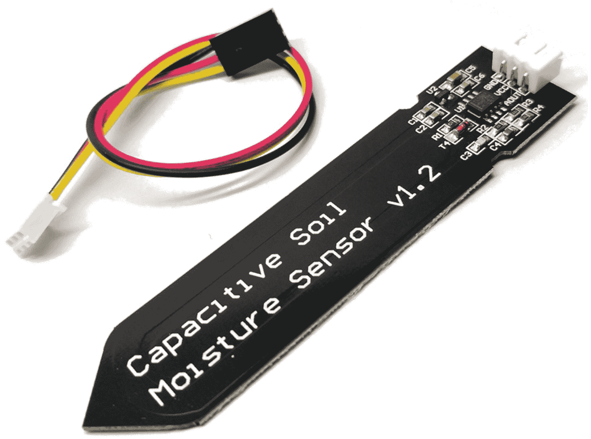
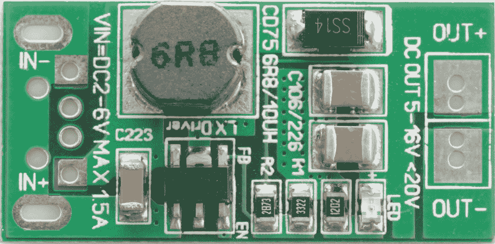
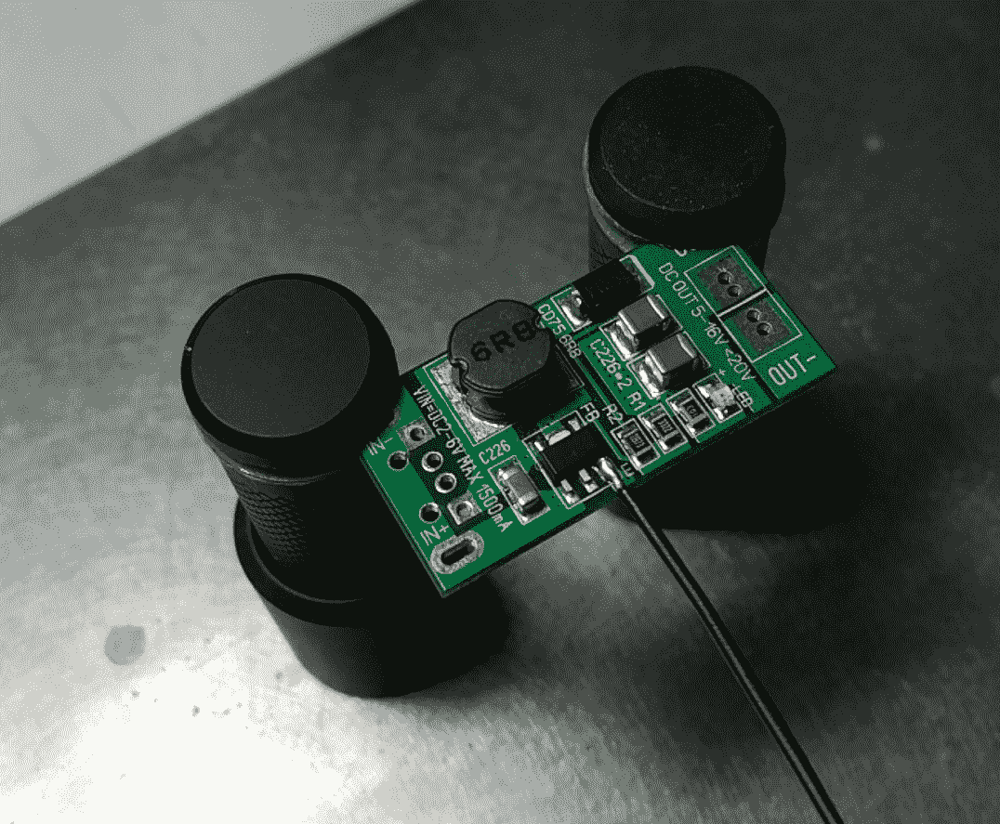
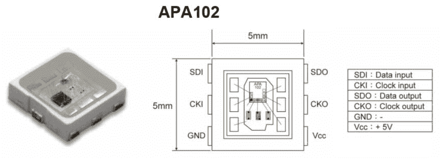
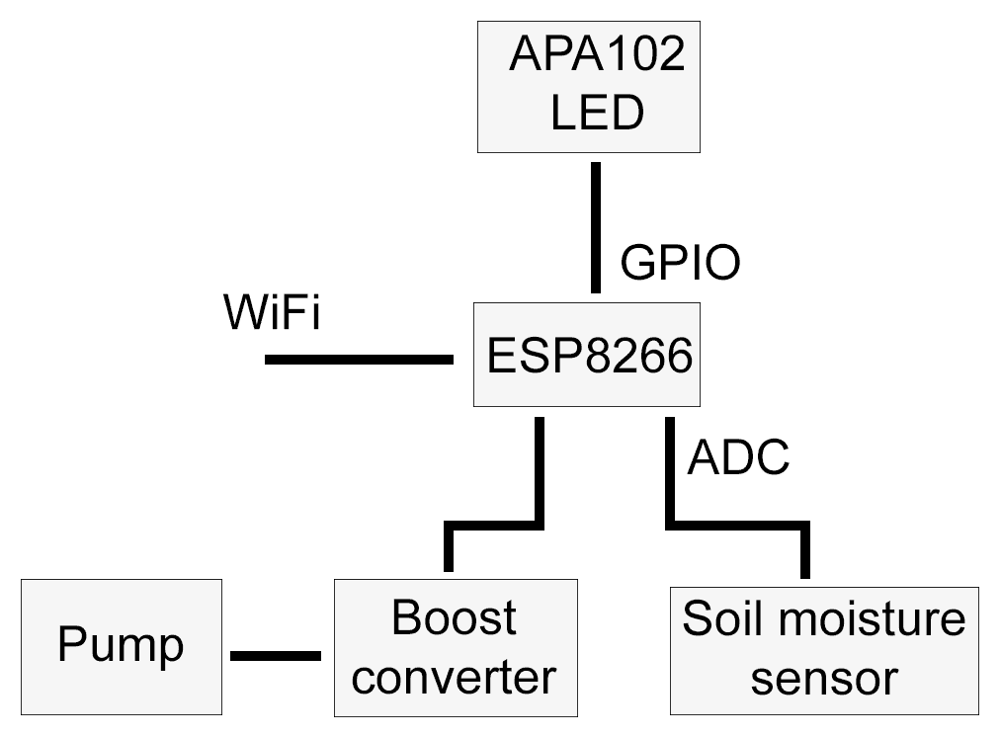

# 第五章：示例-带 Wi-Fi 的土壤湿度监测器

保持室内植物存活并不是一件小事。本章的示例项目将向您展示如何创建一个具有执行器选项（如泵或类似的阀门和重力供水箱）的 Wi-Fi 土壤湿度监测器。使用内置的 Web 服务器，我们将能够使用其基于浏览器的 UI 来监测植物健康和控制系统功能，或者使用其基于 HTTP 的 REST API 将其集成到更大的系统中。

本章涵盖的主题如下：

+   编程 ESP8266 微控制器

+   将传感器和执行器连接到 ESP8266

+   在这个平台上实现一个 HTTP 服务器

+   开发用于监测和控制的基于 Web 的 UI

+   将项目集成到更大的网络中

# 保持植物快乐

要保持植物存活，你需要一些东西：

+   营养

+   光线

+   水

其中，前两者通常由富含营养的土壤和将植物放在光照充足的地方来处理。在满足这两点后，保持植物存活的主要问题通常是第三点，因为这需要每天处理。

在这里，不仅仅是简单地保持水位，而是要保持在土壤有足够但不过多水分的范围内。土壤中水分过多会影响植物通过根部吸收氧气的量。因此，土壤中水分过多会导致植物枯萎死亡。

另一方面，水分过少意味着植物无法吸收足够的水来补偿叶子蒸发的水，也无法将养分输送到根部。在这种情况下，植物也会枯萎死亡。

在人工浇水时，我们倾向于粗略估计植物可能需要更多水的时间，以及通过手指对表层土壤的湿度进行肤浅测试。这告诉我们很少关于植物根部下方土壤中实际存在多少水。

为了更精确地测量土壤的湿度，我们可以使用多种方法：

| **类型** | **原理** | **备注** |
| --- | --- | --- |
| 石膏块 | 电阻—– | 水被石膏吸收，溶解了一些石膏，从而允许电流在两个电极之间流动。电阻值表示土壤湿度张力。 |
| 张力计 | 真空 | 一根空心管的一端有一个真空计，另一端有一个多孔的尖端，允许水自由进出。土壤吸走管中的水会增加真空传感器的读数，表明植物从土壤中提取水分变得更困难（湿度张力）。 |
| 电容探针 | **频域反射计**（**FDR**） | 利用土壤中两个金属电极之间的介电常数在振荡电路中的变化来测量由于湿度变化而引起的这一常数的变化。指示湿度。 |
| 微波传感器 | **时域反射计**（**TDR**） | 测量微波信号传播到并返回平行探针末端所需的时间，这取决于土壤的介电常数。测量湿度。 |
| ThetaProbe | 射频幅度阻抗 | 一个 100 MHz 正弦波无线电信号被发送到包围土壤圆柱体的四个探针之间。正弦波阻抗的变化用于计算土壤中的水分。 |
| 电阻探针 | 电阻 | 这类似于石膏块，只是有电极。因此，这只能测量水分存在（及其导电性），而不能测量土壤湿度张力。 |

所有这些传感器类型都有各自的优点和缺点。在石膏块和张力计的情况下，需要进行大量的维护，因为前者依赖于石膏残留量足够溶解而不会影响校准，而在后者的情况下，必须保持密封以防止空气进入管道。这种密封的任何缺口都会立即使真空传感器失效。

另一个重要的问题是成本。虽然基于 FDR 和 TDR 的探头可能非常准确，但它们也往往非常昂贵。这通常导致只是想要尝试土壤湿度传感器的人选择电阻或电容传感器。在这里，前者传感器类型的主要缺点在一个月或更短的使用期内就变得明显：腐蚀。

在一个含有离子的溶液中悬浮着两个电极，并且在其中一个电极上施加电流，简单的化学反应导致其中一个电极迅速腐蚀（失去材料），直到它不再起作用。这也会使土壤受到金属分子的污染。在单个电极上使用**交流**（**AC**）而不是直流可以在一定程度上减少腐蚀作用，但仍然存在问题。

在便宜而仍然准确的土壤湿度传感器中，只有电容探头符合所有要求。它的准确性足够进行合理的测量和比较（经过校准），不受土壤湿度的影响，也不会对土壤产生任何影响。

要给植物浇水，我们需要有一种方法来给它适量的水。在这里，系统的规模大部分决定了水的输送方式。对于整个田地的灌溉，我们可以使用叶轮泵，能够每分钟输送许多升的水。

对于单个植物，我们需要能够以最多几百毫升每分钟的速度进行供水。在这里，蠕动泵就非常理想。这是你在实验室和医疗应用中也会使用的泵，可以提供高精度的少量流体。

# 我们的解决方案

为了简化问题，我们只会建造一个可以照顾单个植物的系统。这将为我们提供最大的灵活性，因为无论植物放在窗台、桌子还是露台上，我们只需要在每棵植物旁边放置一个系统。

除了测量土壤湿度水平外，我们还希望系统能够在设定的触发水平自动给植物浇水，并且我们能够监控这个过程。这需要某种网络访问，最好是无线的，这样我们就不必再布置更多的电缆了。

这使得 ESP8266 MCU 非常有吸引力，NodeMCU 开发板是开发和调试系统的理想目标。我们会将一个土壤湿度传感器连接到它上面，还有一个蠕动泵。

通过使用 Web 浏览器连接到 ESP8266 系统的 IP 地址，我们可以看到系统的当前状态，包括土壤湿度水平和其他可选信息。配置系统等操作将通过常用的紧凑二进制 MQTT 协议进行，系统还会发布当前系统状态，以便我们将其读入数据库进行显示和分析。

这样，我们还可以后续编写一个后端服务，将这些节点组合成一个统一的系统，并进行集中控制和管理。这实际上是我们将在第九章中详细讨论的内容，*示例-建筑监控和控制*。

# 硬件

我们理想的解决方案将具有最准确的传感器，而不会花费太多。这意味着我们基本上必须使用电容传感器，就像我们在本章前面看到的那样。这些传感器可以作为电容土壤湿度传感器获得，价格不到几欧元或美元，用于简单的基于 555 定时器 IC 的设计，如下所示：



您只需将它们插入土壤，直到电路开始的地方，然后将其连接到电源以及连接到 MCU 的模拟到数字转换器。

大多数蠕动泵需要 12V。这意味着我们需要一个可以提供 5V 和 12V 的电源，或者使用所谓的升压转换器将 5V 转换为 12V。无论哪种方式，我们还需要一些方法来打开或关闭泵。使用升压转换器，我们可以使用其*使能*引脚，通过 MCU 上的 GPIO 引脚来打开或关闭其输出。

对于原型设计，我们可以使用其中一个常见的 5V 到 12V 升压转换器模块，它使用 ME2149 升压开关稳压器：



这些模块没有使能引脚，但我们可以轻松地焊接一根导线到相关引脚上：



然后将这个升压转换器模块的输出连接到蠕动泵：


在这里，我们需要获得一些合适直径的管道，将其连接到水箱和植物。泵本身将旋转任何方向。因为它基本上是内部管道部分上的一组滚轮，它们将液体推入一个方向，泵的任一侧都可以是输入或输出。

一定要事先用两个容器和一些水测试流向，并在泵壳上标出流向，以及使用的正负端子连接。

除了这些组件，我们还想连接一个 RGB LED 进行一些信号传输和外观。为此，我们将使用**APA102** RGB LED 模块，它通过 SPI 总线连接到 ESP8266：



我们可以使用单个电源，可以提供 5V 和 1A 或更多的电流，并且可以应对每次泵启动时增压转换器突然的功率需求。

整个系统看起来会像这样：



# 固件

对于这个项目，我们将在第九章中实现一个模块，*示例-建筑监控和控制*中使用的相同固件。因此，本章将仅涵盖与此植物浇水模块独特的部分。

在开始编写固件之前，我们首先必须设置开发环境。这涉及安装 ESP8266 SDK 和 Sming 框架。

# 设置 Sming

基于 Sming 的 ESP8266 开发环境可以在 Linux、Windows 和 macOS 上使用。最好使用 Sming 的开发分支，在 Linux 上使用它是最简单的方法，也是最推荐的方法。在 Linux 上，建议在`/opt`文件夹中安装，以保持与 Sming 快速入门指南的一致性。

Linux 的快速入门指南可以在[`github.com/SmingHub/Sming/wiki/Linux-Quickstart`](https://github.com/SmingHub/Sming/wiki/Linux-Quickstart)找到。

在 Linux 上，我们可以使用 ESP8266 的 Open SDK，它使用官方的 Espressif（非 RTOS）SDK，并用开源替代品替换所有非开源组件。可以使用以下代码进行安装：

```cpp
    git clone --recursive https://github.com/pfalcon/esp-open-sdk.git
    cd esp-open-sdk
    make VENDOR_SDK=1.5.4 STANDALONE=y  
```

这将获取当前的 Open SDK 源代码并进行编译，目标是官方 SDK 的 1.5.4 版本。虽然 SDK 的 2.0 版本已经存在，但 Sming 框架内可能存在一些兼容性问题。使用 1.5.4 版本提供了几乎相同的体验，同时使用经过充分测试的代码。当然，随着时间的推移，这将会改变，所以请务必查看官方 Sming 文档以获取更新的说明。

`STANDALONE`选项意味着 SDK 将作为 SDK 和工具链的独立安装进行构建，没有进一步的依赖关系。这是在使用 Sming 时所期望的选项。

安装`Sming`就像这样简单：

```cpp
    git clone https://github.com/SmingHub/Sming.git
    cd Sming
    make  
```

这将构建 Sming 框架。如果我们在其`Libraries`文件夹中添加新的库到 Sming 中，我们必须再次执行最后一步，以构建和安装一个新的 Sming 共享库实例。

对于这个项目，将本章软件项目的`libs`文件夹复制到编译 Sming 之前的`Sming/Sming/Libraries`文件夹中，否则项目代码将无法编译。

我们还可以使用 SSL 支持编译 Sming。这要求我们使用`ENABLE_SSL=1`参数对 Make 进行编译。这将使得在整个编译过程中，Sming 库都启用基于 axTLS 的加密支持。

完成这些步骤后，我们只需安装`esptool.py`和`esptool2`。在`/opt`文件夹中，执行以下命令以获取 esptool：

```cpp
    wget https://github.com/themadinventor/esptool/archive/master.zip
    unzip master.zip
    mv esptool-master esp-open-sdk/esptool  
```

`Esptool.py`是一个 Python 脚本，允许我们与每个 ESP8266 模块的 SPI ROM 进行通信。这是我们将用来将 MCU 的 ROM 闪存为我们的代码的方式。这个工具会被 Sming 自动使用：

```cpp
    cd  $ESP_HOME
    git clone https://github.com/raburton/esptool2
    cd esptool2
    make  
```

`esptool2`实用程序是官方 SDK 中一组脚本的替代品，这些脚本将链接器输出转换为我们可以写入 ESP8266 的 ROM 格式。在编译应用程序时，Sming 会调用它。

最后，假设我们在`/opt`下安装了 SDK 和 Sming，我们可以添加以下全局变量和添加到系统`PATH`变量中：

```cpp
    export ESP_HOME=/opt/esp-open-sdk
    export SMING_HOME=/opt/Sming/Sming
    export PATH=$PATH:$ESP_HOME/esptool2
    export PATH=$PATH:$ESP_HOME/xtensa-lx106-elf/bin  
```

最后一行将工具链的二进制文件添加到路径中，这在调试 ESP8266 应用程序时是必需的，我们将在第七章中看到，*测试资源受限平台*。在这一点上，我们可以使用 Sming 进行开发，并创建可以写入 MCU 的 ROM 映像。

# 植物模块代码

在本节中，我们将查看该项目的基本源代码，从核心模块`OtaCore`开始，继续使用所有固件模块注册的`BaseModule`类。最后，我们将查看`PlantModule`类本身，其中包含了我们在本章讨论的项目需求的业务逻辑。

值得注意的是，对于这个项目，我们在项目的 Makefile 中启用了 rBoot 引导管理器和 rBoot 大 Flash 选项。这样做的作用是在我们的 ESP8266 模块上创建 4 个 1MB 的块（我们可用的 4MB ROM 中），其中两个用于固件映像，剩下的两个用于文件存储（使用 SPIFFS 文件系统）。

然后，rBoot 引导加载程序被写入到 ROM 的开头，以便在每次启动时首先加载它。在固件插槽中，任何时候只有一个是活动的。这种设置的一个方便的特性是，它允许我们轻松执行**空中**（**OTA**）更新，方法是将新的固件映像写入到非活动的固件插槽，更改活动插槽，并重新启动 MCU。如果 rBoot 无法从新的固件映像启动，它将退回到另一个固件插槽，这是我们已知的工作固件，我们从中执行了 OTA 更新。

# Makefile-user.mk

在`project`文件夹的根目录中，我们找到了这个 Makefile。它包含了一些设置，我们可能想要根据我们的目的进行设置：

| **名称** | **描述** |
| --- | --- |
| `COM_PORT` | 如果我们总是连接板子到同一个串行端口，我们可以在这里硬编码它，以节省一些输入。 |
| `SPI_MODE` | 在刷写固件映像到 SPI ROM 时设置使用的 SPI 模式。使用 `dio` 只有两条数据线（`SD_D0`，`D1`）或四条（`SD_D0-3`）。并非所有 SPI ROM 都连接了所有四条数据线。`qio` 模式更快，但 `dio` 应该总是有效的。 |
| `RBOOT_ENABLED` | 当设置为 1 时，这将启用 rBoot 引导加载程序支持。我们希望启用这个。 |
| `RBOOT_BIG_FLASH` | 有 4MB 的 ROM 可用，我们希望全部使用。也要启用这个。 |
| `RBOOT_TWO_ROMS` | 如果我们希望将两个固件映像放在单个 1MB ROM 芯片中，可以使用此选项。这适用于一些 ESP8266 模块和衍生产品。 |
| `SPI_SIZE` | 在这里，我们设置 SPI ROM 芯片的大小，对于这个项目应该是 4M。 |
| `SPIFF_FILES` | 包含将写入 MCU 的 SPIFFS ROM 映像的文件的文件夹的位置。 |
| `SPIFFS_SIZE` | 要创建的 SPIFFS ROM 映像的大小。这里，64KB 是标准的，但如果需要的话，我们可以在启用`RBOOT_BIG_FLASH`选项时使用高达 1MB。 |
| `WIFI_SSID` | 我们希望连接的 Wi-Fi 网络的 SSID。 |
| `WIFI_PWD` | Wi-Fi 网络的密码。 |
| `MQTT_HOST` | 要使用的 MQTT 服务器（代理）的 URL 或 IP 地址。 |
| `ENABLE_SSL` | 启用此选项，编译 SSL 支持到 Sming 中，使固件使用与 MQTT 代理的 TLS 加密连接。 |
| `MQTT_PORT` | MQTT 代理的端口。这取决于是否启用了 SSL。 |
| `USE_MQTT_PASSWORD` | 如果希望使用用户名和密码连接到 MQTT 代理，则设置为 true。 |
| `MQTT_USERNAME` | MQTT 代理用户名，如果需要的话。 |
| `MQTT_PWD` | MQTT 代理密码，如果需要的话。 |
| `MQTT_PREFIX` | 可选地在固件使用的每个 MQTT 主题前面添加的前缀，如果需要的话。如果不为空，必须以斜杠结尾。 |
| `OTA_URL` | 每当请求 OTA 更新时固件将使用的硬编码 URL。 |

其中，Wi-Fi、MQTT 和 OTA 设置是必不可少的，因为它们将允许应用程序连接到网络和 MQTT 代理，并且接收固件更新，而无需通过串行接口刷写 MCU。

# Main

主源文件以及应用程序的入口点都非常平凡：

```cpp
#include "ota_core.h"
void onInit() {
    // 
}
void init() {
         OtaCore::init(onInit);
 }
```

由于`OtaCore`类包含了主要的应用逻辑，我们只需调用它的静态初始化函数，同时提供一个回调函数，如果我们希望在核心类完成设置网络、MQTT 和其他功能后执行任何进一步的逻辑。

# OtaCore

在这个类中，我们为特定的功能模块设置了所有基本的网络功能，还提供了用于日志记录和 MQTT 功能的实用函数。这个类还包含了通过 MQTT 接收到的命令的主要命令处理器：

```cpp
#include <user_config.h>
#include <SmingCore/SmingCore.h>
```

这两个包含是使用 Sming 框架所必需的。通过它们，我们包含了 SDK 的主要头文件（`user_config.h`）和 Sming 的头文件（`SmingCore.h`）。这还定义了许多预处理器语句，比如使用开源的**轻量级 IP 堆栈**（**LWIP**）以及处理官方 SDK 中的一些问题。

还值得注意的是`esp_cplusplus.h`头文件，它是间接包含的。它的源文件实现了`new`和`delete`函数，以及一些与类相关功能的处理程序，比如在使用虚拟类时的`vtables`。这使得与 STL 兼容：

```cpp
enum {
          LOG_ERROR = 0,
          LOG_WARNING,
          LOG_INFO,
          LOG_DEBUG,
          LOG_TRACE,
          LOG_XTRACE
 };

 enum ESP8266_pins {
          ESP8266_gpio00 = 0x00001,     // Flash
          ESP8266_gpio01 = 0x00002,     // TXD 0
          ESP8266_gpio02 = 0x00004,     // TXD 1
          ESP8266_gpio03 = 0x00008,     // RXD 0
          ESP8266_gpio04 = 0x00010,     // 
          ESP8266_gpio05 = 0x00020,     // 
          ESP8266_gpio09 = 0x00040,     // SDD2 (QDIO Flash)
          ESP8266_gpio10 = 0x00080,     // SDD3 (QDIO Flash)
          ESP8266_gpio12 = 0x00100,     // HMISO (SDO)
          ESP8266_gpio13 = 0x00200,     // HMOSI (SDI)
          ESP8266_gpio14 = 0x00400,     // SCK
          ESP8266_gpio15 = 0x00800,     // HCS
          ESP8266_gpio16 = 0x01000,     // User, Wake
          ESP8266_mosi = 0x02000,
          ESP8266_miso = 0x04000,
          ESP8266_sclk = 0x08000,
          ESP8266_cs = 0x10000
 };
```

这两个枚举定义了日志级别，以及我们可能想要使用的 ESP8266 的各个 GPIO 和其他引脚。ESP8266 引脚枚举的值对应于位掩码中的位置：

```cpp
#define SCL_PIN 5
#define SDA_PIN 4
```

在这里，我们定义了 I2C 总线的固定引脚。这些对应于 NodeMCU 板上的 GPIO 4 和 5，也被称为**D1**和**D2**。预定义这些引脚的主要原因是它们是 ESP8266 上为数不多的*安全*引脚之一。

在启动过程中，ESP8266 的许多引脚在稳定之前会改变电平，这可能会导致任何连接的外围设备出现意外行为。

```cpp
typedef void (*topicCallback)(String);
typedef void (*onInitCallback)();
```

我们定义了两个函数指针，一个用于功能模块在希望注册 MQTT 主题时使用，以及一个回调函数。另一个是我们在主函数中看到的回调。

```cpp

class OtaCore {
         static Timer procTimer;
         static rBootHttpUpdate* otaUpdater;
         static MqttClient* mqtt;
         static String MAC;
         static HashMap<String, topicCallback>* topicCallbacks;
         static HardwareSerial Serial1;
         static String location;
         static String version;
         static int sclPin;
         static int sdaPin;
         static bool i2c_active;
         static bool spi_active;
         static uint32 esp8266_pins;

         static void otaUpdate();
         static void otaUpdate_CallBack(rBootHttpUpdate& update, bool result);
         static void startMqttClient();
         static void checkMQTTDisconnect(TcpClient& client, bool flag);
         static void connectOk(IPAddress ip, IPAddress mask, IPAddress gateway);
         static void connectFail(String ssid, uint8_t ssidLength, uint8_t *bssid,    uint8_t reason);
         static void onMqttReceived(String topic, String message);
         static void updateModules(uint32 input);
         static bool mapGpioToBit(int pin, ESP8266_pins &addr);

public:
         static bool init(onInitCallback cb);
         static bool registerTopic(String topic, topicCallback cb);
         static bool deregisterTopic(String topic);
         static bool publish(String topic, String message, int qos = 1);
         static void log(int level, String msg);
         static String getMAC() { return OtaCore::MAC; }
         static String getLocation() { return OtaCore::location; }
         static bool starti2c();
         static bool startSPI();
         static bool claimPin(ESP8266_pins pin);
         static bool claimPin(int pin);
         static bool releasePin(ESP8266_pins pin);
         static bool releasePin(int pin);
};
```

类声明本身很好地概述了该类提供的功能。我们注意到的第一件事是它是完全静态的。这确保了当固件启动时立即初始化了该类的功能，并且可以在全局范围内访问，而不必担心特定实例。

我们还可以看到`uint32`类型的第一次使用，它与其他整数类型一样定义，类似于`cstdint`头文件中的定义。

接下来是实现部分：

```cpp
#include <ota_core.h>

#include "base_module.h"

#define SPI_SCLK 14
#define SPI_MOSI 13
#define SPI_MISO 12
#define SPI_CS 15

Timer OtaCore::procTimer;
rBootHttpUpdate* OtaCore::otaUpdater = 0;
MqttClient* OtaCore::mqtt = 0;
String OtaCore::MAC;
HashMap<String, topicCallback>* OtaCore::topicCallbacks = new HashMap<String, topicCallback>();
HardwareSerial OtaCore::Serial1(UART_ID_1); // UART 0 is 'Serial'.
String OtaCore::location;
String OtaCore::version = VERSION;
int OtaCore::sclPin = SCL_PIN; // default.
int OtaCore::sdaPin = SDA_PIN; // default.
bool OtaCore::i2c_active = false;
bool OtaCore::spi_active = false;
uint32 OtaCore::esp8266_pins = 0x0;
```

我们在这里包含了`BaseModule`类的头文件，以便在设置基本功能后，我们可以调用其自己的初始化函数。静态类成员也在这里初始化，其中相关的默认值被赋予。

这里值得注意的是除了默认的 Serial 对象实例之外，还初始化了第二个串行接口对象。这对应于 ESP8266 上的第一个（UART0，Serial）和第二个（UART1，Serial1）UART。

在较旧版本的 Sming 中，与二进制数据有关的 SPIFFS 文件函数存在问题（由于内部假定空终止字符串），这就是为什么添加了以下替代函数的原因。它们的命名是原始函数名称的略微倒置版本，以防止命名冲突。

由于 SPIFFS 上存储的 TLS 证书和其他二进制数据文件必须能够被写入和读取，以使固件能够正确运行，这是一个必要的妥协。

```cpp
String getFileContent(const String fileName) {
         file_t file = fileOpen(fileName.c_str(), eFO_ReadOnly);

         fileSeek(file, 0, eSO_FileEnd);
         int size = fileTell(file);
         if (size <= 0)    {
                fileClose(file);
                return "";
         }

         fileSeek(file, 0, eSO_FileStart);
         char* buffer = new char[size + 1];
         buffer[size] = 0;
         fileRead(file, buffer, size);
         fileClose(file);
         String res(buffer, size);
         delete[] buffer;
         return res;
}
```

该函数将指定文件的整个内容读入返回的`String`实例中。

```cpp
void setFileContent(const String &fileName, const String &content) {
          file_t file = fileOpen(fileName.c_str(),                                                   eFO_CreateNewAlways | eFO_WriteOnly);
          fileWrite(file, content.c_str(), content.length());
          fileClose(file);
 }
```

该函数用提供的`String`实例中的新数据替换文件中的现有内容。

```cpp
bool readIntoFileBuffer(const String filename, char* &buffer, unsigned int &size) {
         file_t file = fileOpen(filename.c_str(), eFO_ReadOnly);

         fileSeek(file, 0, eSO_FileEnd);
         size = fileTell(file);
         if (size == 0)    {
                fileClose(file);
                return true;
         }

         fileSeek(file, 0, eSO_FileStart);
         buffer = new char[size + 1];
         buffer[size] = 0;
         fileRead(file, buffer, size);
         fileClose(file);
         return true;
}
```

该函数类似于`getFileContent()`，但返回一个简单的字符缓冲区，而不是一个`String`实例。它主要用于读取证书数据，该数据传递到基于 C 的 TLS 库（称为 axTLS）中，在那里将其转换为`String`实例会涉及到复制，尤其是证书可能有几 KB 大小时，这种复制是浪费的。

接下来是该类的初始化函数：

```cpp
bool OtaCore::init(onInitCallback cb) {
         Serial.begin(9600);

         Serial1.begin(SERIAL_BAUD_RATE); 
         Serial1.systemDebugOutput(true);
```

我们首先在 NodeMCU 中初始化了两个 UART（串行接口）。尽管 ESP8266 中正式有两个 UART，但第二个仅由 TX 输出线（默认为 GPIO 2）组成。因此，我们希望保持第一个 UART 空闲，以供需要完整串行线的应用程序使用，比如一些传感器。

因此，首个 UART（`Serial`）被初始化，以便我们以后可以将其与功能模块一起使用，而第二个 UART（`Serial1`）被初始化为默认波特率 115,200，系统的调试输出（WiFi/IP 堆栈等）也被定向到此串行输出。因此，这第二个串行接口将仅用于日志输出。

```cpp
         BaseModule::init(); 
```

接下来，`BaseModule`静态类也被初始化。这使得在该固件中激活的所有功能模块都被注册，从而可以在以后激活它们。

```cpp
         int slot = rboot_get_current_rom();
         u32_t offset;
         if (slot == 0) { offset = 0x100000; }
         else { offset = 0x300000; }
         spiffs_mount_manual(offset, 65536);
```

在使用 rBoot 引导加载程序时自动挂载 SPIFFS 文件系统在较旧版本的 Sming 中无法正常工作，这就是为什么我们在这里手动执行它的原因。为此，我们从 rBoot 获取当前固件槽，然后我们可以选择适当的偏移量，可以是在 ROM 中的第二兆字节的开头，也可以是第四兆字节的开头。

确定了偏移量后，我们使用 SPIFFS 手动挂载函数以及我们的偏移量和 SPIFFS 部分的大小。现在我们可以读写我们的存储空间了。

```cpp

          Serial1.printf("\r\nSDK: v%s\r\n", system_get_sdk_version());
     Serial1.printf("Free Heap: %d\r\n", system_get_free_heap_size());
     Serial1.printf("CPU Frequency: %d MHz\r\n", system_get_cpu_freq());
     Serial1.printf("System Chip ID: %x\r\n", system_get_chip_id());
     Serial1.printf("SPI Flash ID: %x\r\n", spi_flash_get_id());
```

接下来，我们在串行调试输出中打印出一些系统详细信息。这包括我们编译的 ESP8266 SDK 版本、当前的空闲堆大小、CPU 频率、MCU ID（32 位 ID）和 SPI ROM 芯片的 ID。

```cpp
         mqtt = new MqttClient(MQTT_HOST, MQTT_PORT, onMqttReceived);
```

我们在堆上创建一个新的 MQTT 客户端，提供一个回调函数，当我们接收到新消息时将被调用。MQTT 代理主机和端口由预处理器填充，从用户为项目添加的细节中获取。

```cpp

         Serial1.printf("\r\nCurrently running rom %d.\r\n", slot);

         WifiStation.enable(true);
         WifiStation.config(WIFI_SSID, WIFI_PWD);
         WifiStation.connect();
         WifiAccessPoint.enable(false);

        WifiEvents.onStationGotIP(OtaCore::connectOk);
        WifiEvents.onStationDisconnect(OtaCore::connectFail);

          (*cb)();
}
```

作为初始化的最后步骤，我们输出当前固件槽，然后启用 Wi-Fi 客户端，同时禁用**无线接入点**（WAP）功能。Wi-Fi 客户端被告知连接到我们在之前的 Makefile 中指定的 Wi-Fi SSID 和凭据。

最后，我们定义了成功的 WiFi 连接和连接尝试失败的处理程序，然后调用我们作为参数提供的回调函数。

固件 OTA 更新后，将调用以下回调函数：

```cpp

void OtaCore::otaUpdate_CallBack(rBootHttpUpdate& update, bool result) {
         OtaCore::log(LOG_INFO, "In OTA callback...");
         if (result == true) { // success
               uint8 slot = rboot_get_current_rom();
               if (slot == 0) { slot = 1; } else { slot = 0; }

               Serial1.printf("Firmware updated, rebooting to ROM slot %d...\r\n",                                                                                                                        slot);
               OtaCore::log(LOG_INFO, "Firmware updated, restarting...");
               rboot_set_current_rom(slot);
               System.restart();
         } 
         else {
               OtaCore::log(LOG_ERROR, "Firmware update failed.");
         }
}
```

在这个回调中，如果 OTA 更新成功，我们会更改活动的 ROM 槽，然后重新启动系统。否则，我们只是记录一个错误，不重新启动。

接下来是一些与 MQTT 相关的函数：

```cpp
bool OtaCore::registerTopic(String topic, topicCallback cb) {
         OtaCore::mqtt->subscribe(topic);
         (*topicCallbacks)[topic] = cb;
         return true;
}

bool OtaCore::deregisterTopic(String topic) {
         OtaCore::mqtt->unsubscribe(topic);
         if (topicCallbacks->contains(topic)) {
               topicCallbacks->remove(topic);
         }

         return true;
}
```

这两个函数分别允许特性模块注册和注销一个 MQTT 主题以及回调函数。MQTT 代理通过订阅或取消订阅请求进行调用，并相应地更新`HashMap`实例：

```cpp
bool OtaCore::publish(String topic, String message, int qos /* = 1 */) {
         OtaCore::mqtt->publishWithQoS(topic, message, qos);
         return true;
}
```

任何特性模块都可以使用此函数在任何主题上发布 MQTT 消息。**服务质量**（QoS）参数确定发布模式。默认情况下，消息以*retain*模式发布，这意味着代理将保留特定主题的最后一条发布消息。

OTA 更新功能的入口点在以下函数中找到：

```cpp
void OtaCore::otaUpdate() {
         OtaCore::log(LOG_INFO, "Updating firmware from URL: " + String(OTA_URL));

         if (otaUpdater) { delete otaUpdater; }
         otaUpdater = new rBootHttpUpdate();

         rboot_config bootconf = rboot_get_config();
         uint8 slot = bootconf.current_rom;
         if (slot == 0) { slot = 1; } else { slot = 0; }

         otaUpdater->addItem(bootconf.roms[slot], OTA_URL + MAC);

         otaUpdater->setCallback(OtaCore::otaUpdate_CallBack);
         otaUpdater->start();
}
```

对于 OTA 更新，我们需要创建一个干净的`rBootHttpUpdate`实例。然后，我们需要使用 rBoot 获取当前固件槽的详细信息，并从中获取当前固件槽号。我们使用这个号码将另一个固件槽的号码提供给 OTA 更新程序。

在这里，我们只配置它来更新固件槽，但我们也可以以这种方式更新其他固件槽的 SPIFFS 部分。固件将通过 HTTP 从我们之前设置的固定 URL 获取。ESP8266 的 MAC 地址将作为唯一的查询字符串参数附加到 URL 的末尾，以便更新服务器知道哪个固件映像适合这个系统。

在设置了我们之前查看的`callback`函数之后，我们开始更新：

```cpp
void OtaCore::checkMQTTDisconnect(TcpClient& client, bool flag) {
         if (flag == true) { Serial1.println("MQTT Broker disconnected."); }
         else { 
               String tHost = MQTT_HOST;
               Serial1.println("MQTT Broker " + tHost + " unreachable."); }

         procTimer.initializeMs(2 * 1000, OtaCore::startMqttClient).start();
}
```

在这里，我们定义了 MQTT 断开连接处理程序。每当与 MQTT 代理的连接失败时，都会调用它，以便我们可以在两秒延迟后尝试重新连接。

如果之前已连接，则将标志参数设置为 true，如果初始 MQTT 代理连接失败（无网络访问、错误的地址等），则设置为 false。

接下来是配置和启动 MQTT 客户端的函数：

```cpp
void OtaCore::startMqttClient() {
         procTimer.stop();
         if (!mqtt->setWill("last/will",                                 "The connection from this device is lost:(",    1, true)) {
               debugf("Unable to set the last will and testament. Most probably there is not enough memory on the device.");
         }
```

如果我们是从重新连接定时器调用的，我们会停止 procTimer 定时器。接下来，我们为该设备设置**遗嘱**（LWT），这允许我们设置一个消息，当 MQTT 代理与客户端（我们）失去连接时，代理将发布该消息。

接下来，我们定义了三条不同的执行路径，只有其中一条将被编译，取决于我们是否使用 TLS（SSL）、用户名/密码登录或匿名访问：

```cpp
#ifdef ENABLE_SSL
         mqtt->connect(MAC, MQTT_USERNAME, MQTT_PWD, true);
         mqtt->addSslOptions(SSL_SERVER_VERIFY_LATER);

       Serial1.printf("Free Heap: %d\r\n", system_get_free_heap_size());

         if (!fileExist("esp8266.client.crt.binary")) {
               Serial1.println("SSL CRT file is missing: esp8266.client.crt.binary.");
               return;
         }
         else if (!fileExist("esp8266.client.key.binary")) {
               Serial1.println("SSL key file is missing: esp8266.client.key.binary.");
               return;
         }

         unsigned int crtLength, keyLength;
         char* crtFile;
         char* keyFile;
         readIntoFileBuffer("esp8266.client.crt.binary", crtFile, crtLength);
         readIntoFileBuffer("esp8266.client.key.binary", keyFile, keyLength);

         Serial1.printf("keyLength: %d, crtLength: %d.\n", keyLength, crtLength);
         Serial1.printf("Free Heap: %d\r\n", system_get_free_heap_size());

         if (crtLength < 1 || keyLength < 1) {
               Serial1.println("Failed to open certificate and/or key file.");
               return;
         }

         mqtt->setSslClientKeyCert((const uint8_t*) keyFile, keyLength,
                                                (const uint8_t*) crtFile, crtLength, 0, true);
         delete[] keyFile;
         delete[] crtFile;

    Serial1.printf("Free Heap: %d\r\n", system_get_free_heap_size());
```

如果我们使用 TLS 证书，我们将使用我们的`MAC`作为客户端标识符与 MQTT 代理建立连接，然后为连接启用 SSL 选项。可用的堆空间将被打印到串行日志输出以进行调试。通常，在这一点上，我们应该还剩下大约 25KB 的 RAM，这足以在内存中保存证书和密钥，以及 TLS 握手的 RX 和 TX 缓冲区，如果后者使用 SSL 分段大小选项配置为可接受的大小。我们将在第九章中更详细地讨论这个问题，*示例-建筑管理和控制*。

接下来，我们从 SPIFFS 中读取 DER 编码（二进制）证书和密钥文件。这些文件有固定的名称。对于每个文件，我们都会打印出文件大小，以及当前的空闲堆大小。如果任一文件大小为零字节，我们将认为读取尝试失败，并中止连接尝试。

否则，我们将使用密钥和证书数据进行 MQTT 连接，这应该导致成功的握手并与 MQTT 代理建立加密连接。

在删除密钥和证书文件数据后，我们打印出空闲堆大小，以便我们可以检查清理是否成功：

```cpp
#elif defined USE_MQTT_PASSWORD
          mqtt->connect(MAC, MQTT_USERNAME, MQTT_PWD);
```

当使用 MQTT 用户名和密码登录代理时，我们只需要在 MQTT 客户端实例上调用先前的函数，提供我们的 MAC 作为客户端标识符，以及用户名和密码。

```cpp
#else
         mqtt->connect(MAC);
#endif
```

要匿名连接，我们与代理建立连接，并将我们的`MAC`作为客户端标识符传递：

```cpp
         mqtt->setCompleteDelegate(checkMQTTDisconnect);

         mqtt->subscribe(MQTT_PREFIX"upgrade");
         mqtt->subscribe(MQTT_PREFIX"presence/tell");
         mqtt->subscribe(MQTT_PREFIX"presence/ping");
         mqtt->subscribe(MQTT_PREFIX"presence/restart/#");
         mqtt->subscribe(MQTT_PREFIX"cc/" + MAC);

         delay(100);

         mqtt->publish(MQTT_PREFIX"cc/config", MAC);
}
```

在这里，我们首先设置了 MQTT 断开处理程序。然后，我们订阅了一些我们希望响应的主题。所有这些都与此固件的管理功能有关，允许系统通过 MQTT 进行查询和配置。

订阅后，我们稍微（100 毫秒）等待，以便代理有时间处理这些订阅，然后我们在中央通知主题上发布，使用我们的`MAC`来让任何感兴趣的客户端和服务器知道这个系统刚刚上线。

接下来是 WiFi 连接处理程序：

```cpp
void OtaCore::connectOk(IPAddress ip, IPAddress mask, IPAddress gateway) {
          Serial1.println("I'm CONNECTED. IP: " + ip.toString());

          MAC = WifiStation.getMAC();
          Serial1.printf("MAC: %s.\n", MAC.c_str());

          if (fileExist("location.txt")) {
                location = getFileContent("location.txt");
          }
          else {
                location = MAC;
          }

          if (fileExist("config.txt")) {
                String configStr = getFileContent("config.txt");
                uint32 config;
                configStr.getBytes((unsigned char*) &config, sizeof(uint32), 0);
                updateModules(config);
          }

          startMqttClient();
 }
```

当我们成功使用提供的凭据连接到配置的 WiFi 网络时，将调用此处理程序。连接后，我们将`MAC`的副本保存在内存中作为我们的唯一 ID。

此固件还支持指定用户定义的字符串作为我们的位置或类似标识符。如果之前已定义了一个，我们将从 SPIFFS 加载它并使用它；否则，我们的位置字符串就是`MAC`。

同样，如果存在，我们会从 SPIFFS 加载定义特征模块配置的 32 位位掩码。如果不存在，所有特征模块最初都处于未激活状态。否则，我们读取位掩码并将其传递给`updateModules()`函数，以便激活相关模块：

```cpp
void OtaCore::connectFail(String ssid, uint8_t ssidLength, 
                                                   uint8_t* bssid, uint8_t reason) {
          Serial1.println("I'm NOT CONNECTED. Need help :(");
          debugf("Disconnected from %s. Reason: %d", ssid.c_str(), reason);

          WDT.alive();

          WifiEvents.onStationGotIP(OtaCore::connectOk);
          WifiEvents.onStationDisconnect(OtaCore::connectFail);
 }
```

如果连接到 WiFi 网络失败，我们会记录这一事实，然后告诉 MCU 的看门狗定时器我们仍然活着，以防止在我们再次尝试连接之前发生软重启。

这完成了所有的初始化函数。接下来是在正常活动期间使用的函数，从 MQTT 消息处理程序开始：

```cpp
void OtaCore::onMqttReceived(String topic, String message) {
         Serial1.print(topic);
         Serial1.print(":\n");
         Serial1.println(message);

         log(LOG_DEBUG, topic + " - " + message);

         if (topic == MQTT_PREFIX"upgrade" && message == MAC) {
                otaUpdate();
         }
         else if (topic == MQTT_PREFIX"presence/tell") {
                mqtt->publish(MQTT_PREFIX"presence/response", MAC);
         }
         else if (topic == MQTT_PREFIX"presence/ping") {
               mqtt->publish(MQTT_PREFIX"presence/pong", MAC);
         }
         else if (topic == MQTT_PREFIX"presence/restart" && message == MAC) {
               System.restart();
         }
         else if (topic == MQTT_PREFIX"presence/restart/all") {
               System.restart();
         }
```

我们在最初创建 MQTT 客户端实例时注册了此回调。每当我们订阅的主题在代理上接收到新消息时，我们都会收到通知，并且此回调会接收一个包含主题的字符串和另一个包含实际消息（有效载荷）的字符串。

我们可以将主题与我们注册的主题进行比较，并执行所需的操作，无论是执行 OTA 更新（如果指定了我们的`MAC`），通过返回带有我们的`MAC`的 pong 响应来响应 ping 请求，还是重新启动系统。

下一个主题是一个更通用的维护主题，允许配置活动特征模块，设置位置字符串，并请求系统的当前状态。有效负载格式由命令字符串后跟一个分号，然后是有效负载字符串组成：

```cpp
   else if (topic == MQTT_PREFIX"cc/" + MAC) {
          int chAt = message.indexOf(';');
          String cmd = message.substring(0, chAt);
          ++chAt;

          String msg(((char*) &message[chAt]), (message.length() - chAt));

          log(LOG_DEBUG, msg);

          Serial1.printf("Command: %s, Message: ", cmd.c_str());
          Serial1.println(msg);
```

我们首先使用简单的查找和子字符串方法从有效负载字符串中提取命令。然后，我们读取剩余的有效负载字符串，注意以二进制字符串形式读取。为此，我们使用剩余字符串的长度，并将分号后的字符作为起始位置。

在这一点上，我们已经提取了命令和有效负载，并可以看到我们需要做什么：

```cpp

         if (cmd == "mod") {
               if (msg.length() != 4) {
                     Serial1.printf("Payload size wasn't 4 bytes: %d\n", msg.length());
                     return; 
               }

               uint32 input;
               msg.getBytes((unsigned char*) &input, sizeof(uint32), 0);
               String byteStr;
               byteStr = "Received new configuration: ";
               byteStr += input;
               log(LOG_DEBUG, byteStr);
               updateModules(input);               
          }
```

此命令设置应该激活哪些特征模块。其有效负载应该是一个无符号 32 位整数形成的位掩码，我们检查以确保我们确实收到了四个字节。

在位掩码中，每个位与一个模块相匹配，这些模块目前是以下这些：

| **位位置** | **值** |
| --- | --- |
| 0x01 | THPModule |
| 0x02 | CO2Module |
| 0x04 | JuraModule |
| 0x08 | JuraTermModule |
| 0x10 | MotionModule |
| 0x20 | PwmModule |
| 0x40 | IOModule |
| 0x80 | SwitchModule |
| 0x100 | PlantModule |

其中，CO2、Jura 和 JuraTerm 模块是互斥的，因为它们都使用第一个 UART（`Serial`）。如果在位掩码中仍然指定了其中两个或更多个，只有第一个模块将被启用，其他模块将被忽略。我们将在第九章中更详细地查看这些其他特征模块，*示例-建筑管理和控制*。

在获取新的配置位掩码后，我们将其发送到`updateModules()`函数：

```cpp
        else if (cmd == "loc") {
               if (msg.length() < 1) { return; }
               if (location != msg) {
                     location = msg;
                     fileSetContent("location.txt", location);
               }
         }
```

使用此命令，如果新位置字符串与当前位置字符串不同，则设置新的位置字符串，并将其保存到 SPIFFS 中的位置文件中，以便在重新启动时保持：

```cpp
         else if (cmd == "mod_active") {
               uint32 active_mods = BaseModule::activeMods();
               if (active_mods == 0) {
                     mqtt->publish(MQTT_PREFIX"cc/response", MAC + ";0");
                     return;
               }

               mqtt->publish(MQTT_PREFIX"cc/response", MAC + ";"                                                         + String((const char*) &active_mods, 4));
         }
         else if (cmd == "version") {
               mqtt->publish(MQTT_PREFIX"cc/response", MAC + ";" + version);
         }
         else if (cmd == "upgrade") {
               otaUpdate();
         }
   }
```

这一部分的最后三个命令返回活动特征模块的当前位掩码、固件版本，并触发 OTA 升级：

```cpp
         else {
               if (topicCallbacks->contains(topic)) {
                     (*((*topicCallbacks)[topic]))(message);
                }
         }
}
```

`if...else`块中的最后一个条目查看主题是否可能在我们的特征模块回调列表中找到。如果找到，将使用 MQTT 消息字符串调用回调。

这意味着只有一个特征模块可以向特定主题注册自己。由于每个模块倾向于在自己的 MQTT 子主题下运行以分隔消息流，这通常不是问题：

```cpp
void OtaCore::updateModules(uint32 input) {
         Serial1.printf("Input: %x, Active: %x.\n", input, BaseModule::activeMods());

         BaseModule::newConfig(input);

         if (BaseModule::activeMods() != input) {
               String content(((char*) &input), 4);
               setFileContent("config.txt", content);
         }
}
```

这个函数非常简单。它主要作为`BaseModule`类的一个传递，但它还确保我们保持 SPIFFS 中的配置文件是最新的，在更改时将新的位掩码写入其中。

我们绝对必须防止对 SPIFFs 的不必要写入，因为底层闪存存储具有有限的写入周期。限制写入周期可以显著延长硬件的使用寿命，同时减少整个系统的负载：

```cpp
bool OtaCore::mapGpioToBit(int pin, ESP8266_pins &addr) {
          switch (pin) {
                case 0:
                      addr = ESP8266_gpio00;
                      break;
                case 1:
                      addr = ESP8266_gpio01;
                      break;
                case 2:
                      addr = ESP8266_gpio02;
                      break;
                case 3:
                      addr = ESP8266_gpio03;
                      break;
                case 4:
                      addr = ESP8266_gpio04;
                      break;
                case 5:
                      addr = ESP8266_gpio05;
                      break;
                case 9:
                      addr = ESP8266_gpio09;
                      break;
                case 10:
                      addr = ESP8266_gpio10;
                      break;
                case 12:
                      addr = ESP8266_gpio12;
                      break;
                case 13:
                      addr = ESP8266_gpio13;
                      break;
                case 14:
                      addr = ESP8266_gpio14;
                      break;
                case 15:
                      addr = ESP8266_gpio15;
                      break;
                case 16:
                      addr = ESP8266_gpio16;
                      break;
                default:
                      log(LOG_ERROR, "Invalid pin number specified: " + String(pin));
                      return false;
          };

          return true;
 }
```

此函数将给定的 GPIO 引脚号映射到其在内部位掩码中的位置。它使用我们为此类的头文件查看的枚举。有了这个映射，我们可以使用一个单一的 uint32 值设置 ESP8266 模块的 GPIO 引脚的使用/未使用状态：

```cpp
void OtaCore::log(int level, String msg) {
         String out(lvl);
         out += " - " + msg;

         Serial1.println(out);
         mqtt->publish(MQTT_PREFIX"log/all", OtaCore::MAC + ";" + out);
}
```

在日志记录方法中，我们在将消息字符串写入串行输出之前将日志级别附加到消息字符串，并在 MQTT 上发布它。在这里，我们在一个单一主题上发布，但作为改进，您可以根据指定的级别在不同主题上记录。

这里的合理性取决于您设置的用于侦听和处理运行此固件的 ESP8266 系统的日志输出的后端类型：

```cpp
bool OtaCore::starti2c() {
         if (i2c_active) { return true; }

         if (!claimPin(sdaPin)) { return false; }
         if (!claimPin(sclPin)) { return false; }

         Wire.pins(sdaPin, sclPin);
         pinMode(sclPin, OUTPUT);
         for (int i = 0; i < 8; ++i) {
               digitalWrite(sclPin, HIGH);
               delayMicroseconds(3);
               digitalWrite(sclPin, LOW);
               delayMicroseconds(3);
         }

         pinMode(sclPin, INPUT);

         Wire.begin();
         i2c_active = true;
}
```

如果 I2C 总线尚未启动，此函数将启动它。它尝试注册它希望用于 I2C 总线的引脚。如果这些引脚可用，它将将时钟线（SCL）设置为输出模式，并首先脉冲它八次以解冻总线上的任何 I2C 设备。

在像这样脉冲时钟线后，我们在引脚上启动 I2C 总线，并记录此总线的活动状态。

如果 MCU 断电时 I2C 设备没有断电并保持在不确定状态，可能会发生冻结的 I2C 设备。通过这种脉冲，我们确保系统不会陷入非功能状态，需要手动干预：

```cpp
bool OtaCore::startSPI() {
    if (spi_active) { return true; }

    if (!claimPin(SPI_SCLK)) { return false; }
    if (!claimPin(SPI_MOSI)) { return false; }
    if (!claimPin(SPI_MISO)) { return false; }
    if (!claimPin(SPI_CS)) { return false; }

    SPI.begin();
    spi_active = true;
 }
```

启动 SPI 总线类似于启动 I2C 总线，但没有类似的恢复机制：

```cpp
bool OtaCore::claimPin(int pin) {
          ESP8266_pins addr;
          if (!mapGpioToBit(pin, addr)) { return false; }

          return claimPin(addr);
    }

    bool OtaCore::claimPin(ESP8266_pins pin) {
          if (esp8266_pins & pin) {
                log(LOG_ERROR, "Attempting to claim an already claimed pin: "                                                                                                      + String(pin));
                log(LOG_DEBUG, String("Current claimed pins: ") + String(esp8266_pins));
                return false;
          }

          log(LOG_INFO, "Claiming pin position: " + String(pin));

          esp8266_pins |= pin;

          log(LOG_DEBUG, String("Claimed pin configuration: ") + String(esp8266_pins));

          return true;
 }
```

这个重载函数用于在启动之前由特征模块注册 GPIO 引脚，以确保没有两个模块同时使用相同的引脚。一个版本接受引脚号（GPIO），并使用我们之前查看的映射函数来获取`esp8266_pins`位掩码中的位地址，然后将其传递给函数的另一个版本。

在该函数中，引脚枚举用于进行按位`AND`比较。如果位尚未设置，则切换并返回 true。否则，函数返回 false，调用模块知道它无法继续初始化：

```cpp
bool OtaCore::releasePin(int pin) {
          ESP8266_pins addr;
          if (!mapGpioToBit(pin, addr)) { return false; }

          return releasePin(addr);
    }

    bool OtaCore::releasePin(ESP8266_pins pin) {
          if (!(esp8266_pins & pin)) {
                log(LOG_ERROR, "Attempting to release a pin which has not been set: "                                                                                                      + String(pin));
                return false;
          }

          esp8266_pins &= ~pin;

          log(LOG_INFO, "Released pin position: " + String(pin));
          log(LOG_DEBUG, String("Claimed pin configuration: ") + String(esp8266_pins));

          return true;
 }
```

这个重载函数用于在特征模块关闭时释放引脚，工作方式类似。一个使用映射函数获取位地址，另一个执行按位`AND`操作来检查引脚是否已经设置，并使用按位`OR`赋值运算符将其切换到关闭位置。

# BaseModule

这个类包含了注册和跟踪当前活动或非活动特征模块的逻辑。其头文件如下所示：

```cpp
#include "ota_core.h"

enum ModuleIndex {
   MOD_IDX_TEMPERATURE_HUMIDITY = 0,
   MOD_IDX_CO2,
   MOD_IDX_JURA,
   MOD_IDX_JURATERM,
   MOD_IDX_MOTION,
   MOD_IDX_PWM,
   MOD_IDX_IO,
   MOD_IDX_SWITCH,
   MOD_IDX_PLANT
};

typedef bool (*modStart)();
typedef bool (*modShutdown)();
```

包含`OtaCore`头文件是为了让我们能够使用日志记录功能。此外，我们创建另一个枚举，将特定特征模块映射到特征模块位掩码（`active_mods`）中的特定位。

最后，定义了函数指针，分别用于启动和关闭特征模块。这些将由特征模块在注册自己时定义：

```cpp
#include "thp_module.h"
#include "jura_module.h"
#include "juraterm_module.h"
#include "co2_module.h"
#include "motion_module.h"
#include "pwm_module.h"
#include "io_module.h"
#include "switch_module.h"
#include "plant_module.h"
```

这些是目前存在于该固件中的特征模块。由于我们只需要植物模块用于这个项目，我们可以注释掉所有其他模块的头文件，以及它们在该类的初始化函数中的初始化。

这不会影响生成的固件映像，除了我们不能启用那些模块，因为它们不存在。

最后，这里是类声明本身：

```cpp
class BaseModule {   
         struct SubModule {
               modStart start;
               modShutdown shutdown;
               ModuleIndex index;
               uint32 bitmask;
               bool started;
         };

         static SubModule modules[32];
         static uint32 active_mods;
         static bool initialized;
         static uint8 modcount;

public:
         static void init();
         static bool registerModule(ModuleIndex index, modStart start,                                                                                    modShutdown shutdown);
```

```cpp

         static bool newConfig(uint32 config);
         static uint32 activeMods() { return active_mods; }
};
```

每个特征模块在内部由一个`SubModule`实例表示，我们可以在类定义中看到其详细信息：

```cpp
#include "base_module.h"

BaseModule::SubModule BaseModule::modules[32];
uint32 BaseModule::active_mods = 0x0;
bool BaseModule::initialized = false;
uint8 BaseModule::modcount = 0;
```

由于这是一个静态类，我们首先初始化其类变量。我们有一个数组，可以容纳 32 个`SubModule`实例，以适应完整的位掩码。此外，没有模块是活动的，所以一切都初始化为零和假：

```cpp
void BaseModule::init() {
    CO2Module::initialize();
    IOModule::initialize();
    JuraModule::initialize();
    JuraTermModule::initialize();
    MotionModule::initialize();
    PlantModule::initialize();
    PwmModule::initialize();
    SwitchModule::initialize();
    THPModule::initialize();
}
```

当我们在`OtaCore`中调用此函数时，我们还触发了在此处定义的特征模块的注册。通过在此函数中有选择地删除或注释掉模块，我们可以将它们从最终的固件映像中移除。在这里调用的那些模块将调用以下函数来注册自己：

```cpp
bool BaseModule::registerModule(ModuleIndex index, modStart start, modShutdown shutdown) {
         if (!initialized) {
               for (uint8 i = 0; i < 32; i++) {
                     modules[i].start = 0;
                     modules[i].shutdown = 0;
                     modules[i].index = index;
                     modules[i].bitmask = (1 << i);
                     modules[i].started = false;
               }

               initialized = true;
         }

         if (modules[index].start) {
               return false;
         }

         modules[index].start = start;
         modules[index].shutdown = shutdown;
         ++modcount;

         return true;
}
```

调用此函数的第一个特征模块将触发`SubModule`数组的初始化，将其所有值设置为中性设置，同时为数组中的此位置创建位掩码，这允许我们更新`active_mods`位掩码，我们将在一会儿看到。

初始化数组后，我们检查数组中的这个位置是否已经有模块为其注册。如果有，我们返回 false。否则，在返回 true 之前，我们注册模块的启动和关闭函数指针，并增加活动模块计数：

```cpp
bool BaseModule::newConfig(uint32 config) {
    OtaCore::log(LOG_DEBUG, String("Mod count: ") + String(modcount));
    uint32 new_config = config ^ active_mods;
    if (new_config == 0x0) {
        OtaCore::log(LOG_INFO, "New configuration was 0x0\. No 
        change.");
        return true; 
    }
    OtaCore::log(LOG_INFO, "New configuration: " + new_config);
    for (uint8 i = 0; i < 32; ++i) {
        if (new_config & (1 << i)) {
            OtaCore::log(LOG_DEBUG, String("Toggling module: ") + 
            String(i));
            if (modules[i].started) { 
                if ((modules[i]).shutdown()) { 
                    modules[i].started = false; 
                    active_mods ^= modules[i].bitmask;
                }
                else { 
                    OtaCore::log(LOG_ERROR, "Failed to shutdown 
                    module.");
                    return false; 
                }
            }
            else { 
                if ((modules[i].start) && (modules[i]).start()) { 
                    modules[i].started = true;
                    active_mods |= modules[i].bitmask;
                }
                else { 
                    OtaCore::log(LOG_ERROR, "Failed to start module.");
                    return false;
                }
            }
        }
    }
    return true;
 }
```

该函数的输入参数是我们从`OtaCore`中提取的 MQTT 有效载荷中的位掩码。在这里，我们使用按位异或比较与活动模块位掩码，以获得指示要进行的任何更改的新位掩码。如果结果为零，我们知道它们是相同的，我们可以返回而无需进一步操作。

因此，我们获得的`uint32`位掩码指示应该打开或关闭哪些模块。为此，我们检查掩码的每一位。如果它是`1`（AND 运算符返回一个不为零的值），我们检查数组中该位置的模块是否存在并且是否已经启动。

如果模块已启动，我们尝试关闭它。如果模块的 shutdown()函数成功（返回 true），我们切换`active_mods`位掩码中的位以更新其状态。同样，如果模块尚未启动，模块已经在该位置注册，我们尝试启动它，如果成功，更新活动模块。

我们检查是否已注册启动函数回调，以确保我们不会意外调用未正确注册的模块并使系统崩溃。

# PlantModule

到目前为止，我们已经详细查看了在编写新模块时使生活变得轻松的支持代码。因为我们不必自己做所有的杂务。我们还没有看到的唯一的事情是一个实际的模块，或者直接与本章项目有关的代码。

在这一部分，我们将看一下谜题的最后一部分，即`PlantModule`本身：

```cpp
#include "base_module.h"
#include <Libraries/APA102/apa102.h>

#define PLANT_GPIO_PIN 5
#define NUM_APA102 1

class PlantModule {
         static int pin;
         static Timer timer;
         static uint16 humidityTrigger;
         static String publishTopic;
         static HttpServer server;
         static APA102* LED;

         static void onRequest(HttpRequest& request, HttpResponse& response);

public:
         static bool initialize();
         static bool start();
         static bool shutdown();
         static void readSensor();
         static void commandCallback(String message);
};
```

在这个类声明中需要注意的是包含了 APA102 库头文件。这是一个简单的库，允许我们将颜色和亮度数据写入 APA102 RGB（全光谱）LED，通过 SPI 总线。

我们还定义了我们希望用来触发蠕动泵（GPIO 5）的引脚以及连接的 APA102 LED 模块的数量（1）。如果需要，您可以串联多个 APA102 LED，只需更新定义以匹配计数。

接下来是类的实现：

```cpp
#include "plant_module.h"

int PlantModule::pin = PLANT_GPIO_PIN;
Timer PlantModule::timer;
uint16 PlantModule::humidityTrigger = 530;
String PlantModule::publishTopic;
HttpServer PlantModule::server;
APA102* PlantModule::LED = 0;

enum {
         PLANT_SOIL_MOISTURE = 0x01,
         PLANT_SET_TRIGGER = 0x02,
         PLANT_TRIGGER = 0x04
};
```

在这一部分，我们初始化静态类成员，设置 GPIO 引脚并定义触发泵应该触发的初始传感器值。应该更新此触发值以匹配您自己的传感器校准结果。

最后，我们定义一个包含可以通过 MQTT 发送到该模块的可能命令的枚举：

```cpp
bool PlantModule::initialize() {
          BaseModule::registerModule(MOD_IDX_PLANT, PlantModule::start,                                                                                                                 PlantModule::shutdown);
}
```

这是`BaseModule`在启动时调用的初始化函数。正如我们所看到的，它导致该模块使用预设值注册自身，包括其启动和关闭回调：

```cpp
bool PlantModule::start() {
         OtaCore::log(LOG_INFO, "Plant Module starting...");

         if (!OtaCore::claimPin(pin)) { return false; }

         publishTopic = MQTT_PREFIX + "plant/response/" + OtaCore::getLocation();
         OtaCore::registerTopic(MQTT_PREFIX + String("plants/") +                                                             OtaCore::getLocation(), PlantModule::commandCallback);

         pinMode(pin, OUTPUT);

         server.listen(80);
         server.setDefaultHandler(PlantModule::onRequest);

         LED = new APA102(NUM_APA102);
         LED->setBrightness(15);
         LED->clear();
         LED->setAllPixel(0, 255, 0);
         LED->show();

         timer.initializeMs(60000, PlantModule::readSensor).start();
         return true;
}
```

当此模块启动时，我们尝试声明我们希望用于触发泵的引脚，并注册一个 MQTT 主题的回调，以便我们可以使用命令处理程序回调接受命令。在此还定义了在处理完命令后我们将响应的主题。

设置输出引脚模式，然后在端口 80 上启动 HTTP 服务器，注册客户端请求的基本处理程序。接下来，我们创建一个新的`APA102`类实例，并使用它使连接的 LED 显示绿色，亮度约为全亮度的一半。

最后，我们启动一个定时器，每分钟触发一次连接的土壤传感器的读数：

```cpp
bool PlantModule::shutdown() {
         if (!OtaCore::releasePin(pin)) { return false; }

         server.shutdown();

         if (LED) {
               delete LED;
               LED = 0;
         }

         OtaCore::deregisterTopic(MQTT_PREFIX + String("plants/") +                                                                                            OtaCore::getLocation());

         timer.stop();
         return true;
}
```

关闭此模块时，我们释放先前注册的引脚，停止 Web 服务器，删除 RGB LED 类实例（检查是否需要删除它），注销我们的 MQTT 主题，最后停止传感器定时器。

```cpp

void PlantModule::commandCallback(String message) {
         OtaCore::log(LOG_DEBUG, "Plant command: " + message);

         if (message.length() < 1) { return; }
         int index = 0;
         uint8 cmd = *((uint8*) &message[index++]);

         if (cmd == PLANT_SOIL_MOISTURE) {
               readSensor();
         }
         else if (cmd == PLANT_SET_TRIGGER) {               
                if (message.length() != 3) { return; }
               uint16 payload = *((uint16*) &message[index]);
               index += 2;

               humidityTrigger = payload;
         }
         else if (cmd == PLANT_TRIGGER) {
               OtaCore::publish(publishTopic, OtaCore::getLocation() + ";" 
                                                                + String(((char*) &humidityTrigger), 2));
         }
}
```

每当我们在注册的 MQTT 主题上发布消息时，都会调用此回调。在我们的消息中，我们期望找到一个定义命令的单个字节（uint8）值，最多八个不同的命令。对于此模块，我们之前定义了三个命令。

这些命令的定义如下：

| **命令** | **意义** | **有效载荷** | **返回值** |
| --- | --- | --- | --- |
| 0x01 | 获取土壤湿度 | - | 0xXXXX |
| 0x02 | 设置触发级别 | uint16（新触发级别） | - |
| 0x04 | 获取触发级别 | - | 0xXXXX |

在这里，每个命令返回请求的值（如果适用）。

在检查我们得到的消息字符串至少有一个字节后，我们提取第一个字节，并尝试将其解释为一个命令。如果我们正在设置一个新的触发点，我们还会从消息中提取新值作为 uint16，然后确保我们有一个格式正确的消息。

最后，这是一个函数，在这个项目中我们一直在努力实现的所有魔术都发生在这个函数中：

```cpp
void PlantModule::readSensor() {
    int16_t val = 0;
    val = analogRead(A0); // calls system_adc_read().

    String response = OtaCore::getLocation() + ";" + val;
    OtaCore::publish(MQTT_PREFIX"nsa/plant/moisture_raw", response);
```

作为第一步，我们从 ESP8266 的模拟输入中读取当前传感器值，并将其发布到 MQTT 主题上：

```cpp
        if (val >= humidityTrigger) {
               digitalWrite(pin, HIGH);

               LED->setBrightness(31);
               LED->setAllPixel(0, 0, 255);
               LED->show();

               for (int i = 0; i < 10; ++i) {
                     LED->directWrite(0, 0, 255, 25);
                     delay(200);
                     LED->directWrite(0, 0, 255, 18);
                     delay(200);
                     LED->directWrite(0, 0, 255, 12);
                     delay(200);
                     LED->directWrite(0, 0, 255, 5);
                     delay(200);
                     LED->directWrite(0, 0, 255, 31);
                     delay(200);
               }

               digitalWrite(pin, LOW);
         }
}
```

在校准一个带有土壤湿度传感器的原型机时，发现完全干燥的传感器（悬空）的值约为 766，而将相同的传感器浸入水中得到 379 的值。由此，我们可以推断出 60%的含水量大约应该在 533 左右的读数，这与我们在静态初始化步骤中设置的初始值相匹配。理想的触发点和目标土壤湿度水平当然取决于土壤类型和具体植物。

当达到这个触发电平时，我们将设置连接到升压转换器使能引脚的输出引脚为高电平，导致其打开输出，从而启动泵。我们希望让它泵送大约十秒钟。

在此期间，我们将 LED 颜色设置为蓝色，然后在每秒钟内将其亮度从 100%降低到几乎关闭，然后再次提高到全亮度，从而产生脉动效果。

完成后，我们将输出引脚设置回低电平，从而禁用泵，并等待下一个土壤湿度传感器读数：

```cpp
void PlantModule::onRequest(HttpRequest& request, HttpResponse& response) {
         TemplateFileStream* tmpl = new TemplateFileStream("index.html");
         TemplateVariables& vars = tmpl->variables();
         int16_t val = analogRead(A0);
         int8_t perc = 100 - ((val - 379) / 3.87);
         vars["raw_value"] = String(val);
         vars["percentage"] = String(perc);

         response.sendTemplate(tmpl);
}
```

最后，我们在这里看到了我们的 Web 服务器的请求处理程序。它的作用是从 SPIFFS 中读取模板文件（在下一节中详细介绍），获取此模板文件中的变量列表，然后继续读取当前传感器值。

使用这个值，它计算当前土壤湿度百分比，并使用原始和计算出的数字填充模板中的两个变量，然后返回它。

# Index.html

为了与 PlantModule 的 Web 服务器配合使用，我们必须将以下模板文件添加到 SPIFFS 中：

```cpp
<!DOCTYPE html>
<html>
<head>
         <title>Plant soil moisture readings</title>
   </head>
   <body>
         Current value: {raw_value}<br>
         Percentage: {percentage}%
</body>
</html>
```

# 编译和刷写

完成应用程序的代码后，我们可以在项目的根目录中用一个命令编译它：

```cpp
make  
```

完成后，我们可以在`out`文件夹中找到包括 ROM 映像在内的二进制文件。由于我们同时使用 rBoot 引导加载程序和 SPIFFs，因此在`firmware`文件夹中总共有三个 ROM 映像。

此时，我们可以连接一个 ESP8266 模块，可以是 NodeMCU 板或其他许多替代品，并注意它将连接到的串行端口。在 Windows 上，这将类似于`COM3`；在 Linux 上，USB 转串口适配器通常注册为`/dev/ttyUSB0`或类似的。

除非我们在用户 Makefile 中指定了串行端口（`COM_PORT`），否则在刷写到 ESP8266 模块时，我们必须明确指定它：

```cpp
    make flash COM_PORT=/dev/ttyUSB0  
```

执行完这个命令后，我们应该看到`esptool.py`实用程序的输出，因为它连接到 ESP8266 的 ROM 并开始将 ROM 映像写入其中。

完成后，MCU 将重新启动，并且应该直接启动到新的固件映像中，等待我们的命令来配置它。

# 首次配置

正如本章前面所述，这个固件是设计为通过 MQTT 进行配置和维护的。这需要有一个 MQTT 代理可用。像 Mosquitto（[`mosquitto.org/`](http://mosquitto.org/)）这样的 MQTT 代理很受欢迎。由于它是一个轻量级服务器，它可以安装在桌面系统、小型 SBC、虚拟机等内部。

除了代理和运行固件的 ESP8266 外，我们还需要我们自己的客户端

与固件交互。由于我们使用二进制协议，我们在那里的选择有些受限

有限，因为大多数常见的 MQTT 桌面客户端都假定是基于文本的消息。一个

发布二进制消息的一种方法是使用 MQTT 发布客户端，

使用 Mosquitto 附带的**echo**命令行工具的十六进制输入来发送

二进制数据作为流由客户端工具发布

因此，本书的作者开发了一个新的 MQTT 桌面客户端（基于 C++和 Qt），旨在围绕 MQTT 上的二进制协议的使用和调试：[`github.com/MayaPosch/MQTTCute`](https://github.com/MayaPosch/MQTTCute)。

有了这三个组件——运行该项目的 ESP8266、MQTT 代理和桌面客户端——我们可以组装整个植物监测和浇水系统，并发送命令以启用植物模块。

在监视 cc/config 主题以获取消息时，我们应该看到 ESP8266 通过发布其`MAC`来报告其存在。我们也可以通过将 USB 连接到 TTL 串行适配器并连接到串行日志输出引脚（NodeMCU 上的`D4`）来获得这一点。通过查看串行控制台上的输出，我们将看到系统的 IP 地址和`MAC`。

当我们组成一个新的主题格式为`cc/<MAC>`时，我们可以发布命令到固件，例如：

```cpp
    log;plant001  
```

这将把系统的位置名称设置为`plant001`。

在使用 MQTTCute 客户端时，我们可以使用回声式二进制输入，使用十六进制输入来激活植物模块：

```cpp
mod;\x00\x01\x00\x00  
```

这将向固件发送`mod`命令，以及值为 0 x 100 的位掩码。之后，植物模块应该被激活并运行。由于我们持久化了位置字符串和配置，除非我们进行 OTA 更新，否则我们不必再重复这一步骤，此时新的固件将具有一个空的 SPIFFS 文件系统，除非我们在 ROM 的两个 SPIFFS 插槽上都刷入相同的 SPIFFS 映像。

在这里，我们可以扩展 OTA 代码，除了固件之外还可以下载 SPIFFS ROM 映像，尽管这可能会增加可能覆盖现有 SPIFFS 文件的复杂性。

在这一点上，我们应该有一个工作的植物监测和浇水系统。

# 使用系统

我们可以使用测量值并将其存储在数据库中，通过订阅`nsa/plant/moisture_raw`主题。可以通过向`plant/<位置字符串>`主题发送新命令来调整触发点。

设备上的 Web 服务器可以通过获取 IP 地址来访问，我们可以通过查看串行控制台上的输出（如前一节所述），或者查看路由器中的活动 IP 地址来找到 IP 地址。

通过在浏览器中打开此 IP 地址，我们应该可以看到 HTML 模板填充了当前的值。

# 进一步进行

您还需要考虑以下事项：

+   在这一点上，您可以通过实施植物浇水配置来进一步完善系统，以增加干旱期或调整特定土壤类型。您可以添加新的 RGB LED 模式，充分利用可用的颜色选择。

+   整个硬件可以构建成一个外壳，使其融入背景，或者使其更加可见。

+   Web 界面可以扩展以允许从浏览器控制触发点等，而不必使用 MQTT 客户端。

+   除了湿度传感器，您还可以添加亮度传感器、温度传感器等，以测量影响植物健康的更多方面。

+   作为额外加分项，您可以自动施加（液体）肥料到植物上。

# 复杂性

您可能会遇到的 ESP8266 的 ADC 的一个可能的复杂性是，在 NodeMCU 板上，紧邻 ADC 引脚的第一个保留（RSV）引脚直接连接到 ESP8266 模块的 ADC 输入。这可能会导致静电放电 ESD 暴露的问题。基本上是将高电压，但低电流的放电输入到 MCU。在这个 RSV 引脚上添加一个小电容到地可以帮助减少这种风险。

这个系统显然无法帮助你保持植物免受害虫侵害。这意味着尽管浇水可能是自动的，但这并不意味着你可以忽视植物。定期检查植物是否有任何问题，以及系统是否存在任何可能正在发展的问题（断开的管道，因猫而倒下的东西等）仍然是一项重要任务。

# 总结

在本章中，我们看了如何将基于简单 ESP8266 的项目从理论和简单要求转变为一个功能设计，具有多功能固件和一系列输入和输出选项，使用这些选项我们可以确保连接的植物得到恰到好处的水分以保持健康。我们还看到了如何为 ESP8266 建立开发环境。

读者现在应该能够为 ESP8266 创建项目，用新固件对 MCU 进行编程，并对这个开发平台的优势和局限性有一个扎实的掌握。

在下一章中，我们将学习如何测试为 SoCs 和其他大型嵌入式平台编写的嵌入式软件。
