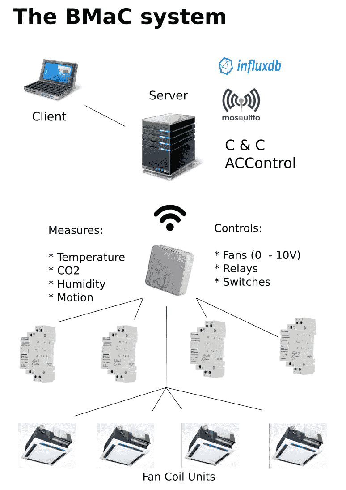

# 第九章：示例 - 建筑物监测和控制

建筑物内部条件的监测，包括温度、湿度和 CO[2]水平，正在变得越来越普遍，目标是调整供暖、制冷和通风系统，以使建筑物的居住者尽可能舒适。在本章中，将探讨并实施这样的系统。将涵盖以下主题：

+   为 ESP8266 创建复杂的固件

+   将 MCU 集成到基于 IP 的网络中

+   添加 CO[2]和基于 I2C 的传感器

+   使用 GPIO 和 PWM 来控制继电器和直流电压控制风扇

+   使用中央控制器连接网络节点

# 植物、房间和更多

在第五章中，我们研究了为 ESP8266 MCU 开发固件，以配合土壤湿度传感器和水泵，以确保连接的植物能够从水箱中获得足够的水。

正如我们在那一章中指出的，所使用的固件是高度模块化的，并具有高度灵活的基于 MQTT 的接口，因此可以用于各种模块。本章涵盖了固件起源的系统：**建筑管理和控制**（**BMaC**），最初只是用于监测房间的温度、湿度和 CO²水平，但后来扩展到监控咖啡机和会议室的占用情况，并最终控制整栋建筑的空调。

BMaC 项目的当前开发状态可以在作者的 GitHub 帐户[`github.com/MayaPosch/BMaC`](https://github.com/MayaPosch/BMaC)中找到。我们在这里涵盖的版本是目前的版本，我们将介绍这个系统的起源以及今天的样子，以及原因。

# 发展历史

BMaC 项目始于在办公楼周围添加传感器以测量温度和其他参数，如相对湿度。在决定使用 ESP8266 MCU 和 DHT22 温湿度传感器后，使用 Sming 框架编写了基本固件，制作了一个简单的原型。

发现 DHT22 传感器通常相当笨重且不太精确。使用的分板还安装了不正确的电阻，导致温度报告错误。这种传感器类型还有一个缺点，即使用自己的单线协议，而不是标准接口方法。

DHT22 传感器被 BME280 MEMS 传感器替换，后者可以测量温度、湿度和气压。还添加了 CO[2]传感器，即 MH-Z19。这也需要固件支持这些额外的传感器。传感器读数将作为 MQTT 消息发送，后端服务订阅这些主题，并将它们写入时间序列数据库（InfluxDB）以供查看和分析。

在考虑从全自动 Jura 咖啡机中读取产品计数器的可能性时，必须做出决定，以及是否需要开发单独的固件。

决定使用相同的固件来处理所有 ESP8266 节点，而不是单独的固件。这意味着它们需要具有某种功能来启用个别功能，并支持特定的传感器和其他功能。这导致了新固件的开发，该固件允许通过 MQTT 发送远程命令来切换功能模块的开启或关闭，以及其他管理功能。

除了新的固件，还添加了一个**命令和控制**（**C&C**）服务器，用于个别节点检索其配置，以及一个管理应用程序，用于添加新节点和添加或编辑节点配置。

有了这个框架，就可以快速添加新功能。这些功能包括添加运动传感器，用于检测房间内人员的存在，最终控制空调单元，因为发现办公楼中的现有集中控制不足以满足需求。

整个系统可以像这样进行可视化：



在接下来的章节中，我们将详细查看每个方面。

# 功能模块

以下是该固件中的模块列表：

| **名称** | **特性** | **描述** |
| --- | --- | --- |
| THP | 温度、湿度、气压 | THP 传感器的中心类。默认情况下启用 BME280 功能。 |
| CO[2] | CO[2]值 | 使用 MH-Z19 或兼容传感器测量 CO[2] <indexentry content="功能模块，建筑管理和控制（BMaC）：CO[2]">值。 |
| Jura | TopTronics EEPROM 计数器 | 从 EEPROM 中读取各种产品的计数器数值。 |
| JuraTerm | TopTronics 远程控制 | 允许远程服务向支持的咖啡机发送 TopTronics（经典，v5 风格）命令。 |
| 运动 | 运动检测 | 使用 HC-SR501 PIR 运动传感器或兼容设备来检测运动。 |
| PWM | PWM 输出 | 在一个或多个引脚上设置脉冲宽度调制输出。 |
| I/O | I/O 扩展 | 通过 I2C 支持 MCP23008 八通道 I/O 扩展器模块。 |
| 开关 | 持久开关 | 控制使用闩锁继电器或等效物进行切换的开关。 |
| 植物 | 浇水植物 | 读取模拟土壤传感器的数值，确定土壤湿度，需要时激活水泵。 |

# 固件源代码

在本节中，我们将查看与 BMaC 系统一起使用的 ESP8266 固件的源代码。

# 核心

我们已经在第五章中查看了固件的核心，*示例-带 Wi-Fi 的土壤湿度监测器*，包括入口点、`OtaCore`类和`BaseModule`类，它们提供了使单独的模块初始化并允许使用 MQTT 接口启用和禁用它们所需的所有功能。

# 模块

在固件模块中，我们已经在第五章中查看了植物模块，*示例-带 Wi-Fi 的土壤湿度监测器*。在这里，我们将查看其余的模块，从 THP 模块开始：

```cpp
#include "base_module.h"
class THPModule {
    public:
    static bool initialize();
    static bool start();
    static bool shutdown();
};
#include "thp_module.h"
#include "dht_module.h"
#include "bme280_module.h"
bool THPModule::initialize() {
    BaseModule::registerModule(MOD_IDX_TEMPERATURE_HUMIDITY, 
    THPModule::start, THPModule::shutdown);
    return true;
}
bool THPModule::start() {
    BME280Module::init();
    return true;
}
bool THPModule::shutdown() {
    BME280Module::shutdown();
    return true;
}
```

该模块具有作为各种温度、湿度和气压传感器的通用接口的功能。由于当时并不需要这个功能，它只是作为 BME280 模块的传递。当被调用时，它会在基础模块中注册自己，并在调用自己的函数时调用 BME280 模块的相应函数。

为了使其更加多功能，该类将被扩展以允许接收命令——可能是通过 MQTT 以及自己的主题——这样就可以在使用单独的温度和气压传感器时启用特定的传感器模块，甚至是它们的集合，例如使用单独的温度和气压传感器。

无论在该固件中是否被使用，让我们来看看 DHT 模块，以便以后可以将其与 BME280 模块进行比较。

```cpp
#include "ota_core.h"

 #include <Libraries/DHTesp/DHTesp.h>

 #define DHT_PIN 5 // DHT sensor: GPIO5 ('D1' on NodeMCU)

 class DHTModule {
    static DHTesp* dht;
    static int dhtPin;
    static Timer dhtTimer;

 public:
    static bool init();
    static bool shutdown();
    static void config(String cmd);
    static void readDHT();
 };
```

值得注意的是，虽然该类是静态的，但会占用大量内存的任何变量——例如库类实例——都被定义为指针。这形成了在使模块易于使用和选择更复杂的完全动态解决方案之间的折衷。由于大多数 MCU 倾向于尽可能将程序代码保存在 ROM 中，直到使用时才将其保存，这应该将 SRAM 和 ROM 的使用保持在最低水平。

```cpp
#include "dht_module.h"

 DHTesp* DHTModule::dht = 0;
 int DHTModule::dhtPin = DHT_PIN;
 Timer DHTModule::dhtTimer;

 bool DHTModule::init() {
    if (!OtaCore::claimPin(dhtPin)) { return false; }
    if (!dht) { dht = new DHTesp(); dht->setup(dhtPin, DHTesp::DHT22); }
    dhtTimer.initializeMs(2000, DHTModule::readDHT).start();    
    return true;
 }
```

为了初始化该模块，我们确保可以安全地使用我们打算使用的**通用输入/输出**（**GPIO**）引脚，从库中创建传感器类的新实例，并在创建执行计划的传感器读数的 2 秒定时器之前对其进行设置。

由于我们在初始化时创建了传感器类的新实例，因此不应该存在此类的现有实例，但我们检查以防 init()函数由于某种原因再次被调用。在计时器上第二次调用初始化函数也可以包括在此块中，但并不是严格要求的，因为再次初始化计时器不会产生有害影响。

```cpp
bool DHTModule::shutdown() {
    dhtTimer.stop();
    if (!OtaCore::releasePin((ESP8266_pins) dhtPin)) { delete dht; return false; }
    delete dht;
    dht = 0;    
    return true;
 }
```

要关闭模块，我们停止计时器并释放我们使用的 GPIO 引脚，然后清理我们使用的所有资源。由于我们在初始化模块时已经声明了我们使用的引脚，所以再次释放它不应该有问题，但我们会检查以确保。

```cpp

 void DHTModule::config(String cmd) {
    Vector<String> output;
    int numToken = splitString(cmd, '=', output);
    if (output[0] == "set_pin" && numToken > 1) {
          dhtPin = output[1].toInt();
    }
 }
```

这是一个示例，说明如何稍后更改模块使用的 GPIO 引脚，这里使用早期版本 BMaC 固件使用的旧文本命令格式。我们也可以通过 MQTT 主题接收此信息，或者通过主动查询命令和控制服务器。

请注意，要更改传感器使用的引脚，必须通过删除类实例并创建新实例来重新启动传感器。

```cpp
 void DHTModule::readDHT() {
    TempAndHumidity th;
    th = dht->getTempAndHumidity();

    OtaCore::publish("nsa/temperature", OtaCore::getLocation() + ";" + th.temperature);
    OtaCore::publish("nsa/humidity", OtaCore::getLocation() + ";" + th.humidity);
 }
```

接下来，对于`BME280`传感器模块，其代码如下：

```cpp
#include "ota_core.h"

 #include <Libraries/BME280/BME280.h>

 class BME280Module {
    static BME280* bme280;
    static Timer timer;

 public:
    static bool init();
    static bool shutdown();
    static void config(String cmd);
    static void readSensor();
 };
```

最后，这是一个看起来很熟悉的实现：

```cpp
#include "bme280_module.h"

 BME280* BME280Module::bme280 = 0;
 Timer BME280Module::timer;

 bool BME280Module::init() {
    if (!OtaCore::starti2c()) { return false; }
    if (!bme280) { bme280 = new BME280(); }

    if (bme280->EnsureConnected()) {
          OtaCore::log(LOG_INFO, "Connected to BME280 sensor.");
          bme280->SoftReset();
          bme280->Initialize();
    }
    else {
          OtaCore::log(LOG_ERROR, "Not connected to BME280 sensor.");
          return false;
    }

    timer.initializeMs(2000, BME280Module::readSensor).start();

    return true;
 }

 bool BME280Module::shutdown() {
    timer.stop();
    delete bme280;
    bme280 = 0;

    return true;
 }

 void BME280Module::config(String cmd) {
    Vector<String> output;
    int numToken = splitString(cmd, '=', output);
    if (output[0] == "set_pin" && numToken > 1) {
          //
    }
 }

 void BME280Module::readSensor() {
    float t, h, p;
    if (bme280->IsConnected) {
          t = bme280->GetTemperature();
          h = bme280->GetHumidity();
          p = bme280->GetPressure
          OtaCore::publish("nsa/temperature", OtaCore::getLocation() + ";" + t);
          OtaCore::publish("nsa/humidity", OtaCore::getLocation() + ";" + h);
          OtaCore::publish("nsa/pressure", OtaCore::getLocation() + ";" + p);
    }
    else {
          OtaCore::log(LOG_ERROR, "Disconnected from BME280 sensor.");
    }
 }

```

正如我们所看到的，这个模块基本上是从 DHT 模块复制过来的，然后修改以适应 BME280 传感器。这两个模块之间的相似之处是开发 THP 模块的动机之一，以利用这些相似之处。

与 DHT 模块一样，我们可以看到我们依赖外部库来为我们完成大部分工作，我们只需调用库类上的函数来设置传感器并从中获取数据。

# CO2 模块

对于 CO[2]模块，尚未尝试使其与多种 CO[2]传感器兼容。首先使用的 CO[2]传感器是 MH-Z14，然后切换到更紧凑的 MH-Z19 传感器。这两者在它们的**通用异步收发器/发送器**（**UART**）接口上使用相同的协议。

在 ESP8266 上有两个 UART，但只有一个是完整的，具有接收（RX）和发送（TX）线。第二个 UART 只有一个 TX 线。这基本上将这个 MCU 限制为单个 UART，因此只能使用基于单个 UART 的传感器。

这些传感器除了基于 UART 的接口外，还有一个单线接口，传感器使用特定的编码输出当前的传感器读数，必须使用信号线上脉冲之间的特定距离进行接收和解码。这类似于 DHT-22 的单线协议。

显然，使用 UART 要容易得多，这也是我们最终使用这个模块的原因：

```cpp
#include "base_module.h"

 class CO2Module {
    static Timer timer;
    static uint8_t readCmd[9];
    static uint8 eventLevel;
    static uint8 eventCountDown;
    static uint8 eventCountUp;

    static void onSerialReceived(Stream &stream, char arrivedChar, unsigned short availableCharsCount);

 public:
    static bool initialize();
    static bool start();
    static bool shutdown();
    static void readCO2();
    static void config(String cmd);
 };
```

我们可以在这里看到将与 UART 一起使用的回调函数，当我们接收数据时将使用它。我们还有一些其他变量，它们的含义将在一会儿变得清晰：

```cpp
#include "CO2_module.h"

 Timer CO2Module::timer;
 uint8_t CO2Module::readCmd[9] = { 0xFF,0x01,0x86,0x00,0x00,0x00,0x00,0x00,0x79};
 uint8 CO2Module::eventLevel = 0;
 uint8 CO2Module::eventCountDown = 10;
 uint8 CO2Module::eventCountUp = 0;

```

在静态初始化中，我们定义了将发送给 CO[2]传感器的命令，告诉它向我们发送当前测量值。我们定义了一些计数器和相关的计时器实例，我们将使用它们来分析我们收到的 CO[2]水平。

```cpp
bool CO2Module::initialize() {
    BaseModule::registerModule(MOD_IDX_CO2, CO2Module::start, CO2Module::shutdown);
    return true;
 }

 bool CO2Module::start() {
    if (!OtaCore::claimPin(ESP8266_gpio03)) { return false; }
    if (!OtaCore::claimPin(ESP8266_gpio01)) { return false; }

    Serial.end();
    delay(10);
    Serial.begin(9600);
    Serial.setCallback(&CO2Module::onSerialReceived);

    timer.initializeMs(30000, CO2Module::readCO2).start();
    return true;
 }
```

启动此模块会触发引脚的注册，我们需要这些引脚用于 UART，UART 以 9600 的波特率启动。我们还注册了接收回调。核心类中的引脚注册例程用于日常维护，因此实际上不会失败。如果与另一个模块存在重叠的引脚映射，我们可能希望在第二次注册失败时释放第一个引脚注册。

串行接口使用的 GPIO 引脚在同一个核心类中设置，并且必须在那里进行修改。这种可配置性缺乏的主要原因是 ESP8266 上的 GPIO 引脚在支持的功能方面相当有限，这就是为什么硬件 UART 基本上总是在这两个引脚上找到，而其他引脚用于其他功能。

我们启动的定时器将每 30 秒读取一次传感器，要记住前 3 分钟的传感器读数是无用的，因为传感器需要大约那么长的时间来预热。

```cpp
bool CO2Module::shutdown() {
    if (!OtaCore::releasePin(ESP8266_gpio03)) { return false; }
    if (!OtaCore::releasePin(ESP8266_gpio01)) { return false; }

    timer.stop();
    Serial.end();
    return true;
 }

 void CO2Module::readCO2() {
    Serial.write(readCmd, 9);
 }
```

读取传感器的操作就像将我们在静态初始化阶段定义的一系列字节写入传感器一样简单，然后等待传感器通过将数据发送回我们的 RX 缓冲区来响应，这将触发我们的回调函数。

```cpp
 void CO2Module::config(String cmd) {
    Vector<String> output;
    int numToken = splitString(cmd, '=', output);
    if (output[0] == "event" && numToken > 1) {
          // 
    }
 }

```

配置方法在这里也没有实现，但可以用来禁用事件（在下一部分中解释）并动态进行各种调整：

```cpp
void CO2Module::onSerialReceived(Stream &stream, char arrivedChar, unsigned short availableCharsCount) {
    if (availableCharsCount >= 9) {
          char buff[9];
          Serial.readBytes(buff, 9);

          int responseHigh = (int) buff[2];
          int responseLow = (int) buff[3];
          int ppm = (responseHigh * 0xFF) + responseLow;
          String response = OtaCore::getLocation() + ";" + ppm;
          OtaCore::publish("nsa/CO2", response);

          if (ppm > 1000) { // T3
                if (eventLevel < 2 && eventCountUp < 10) {
                      if (++eventCountUp == 10) {
                            eventLevel = 2;
                            eventCountDown = 0;
                            eventCountUp = 0;
                            response = OtaCore::getLocation() + ";" + eventLevel + ";1;" + ppm;
                            OtaCore::publish("nsa/events/CO2", response);
                      }
                }
          }
          else if (ppm > 850) { // T2
                if (eventLevel == 0 && eventCountUp < 10) {
                      if (++eventCountUp == 10) {
                            eventLevel = 1;
                            eventCountDown = 0;
                            eventCountUp = 0;
                            response = OtaCore::getLocation() + ";" + eventLevel + ";1;" + ppm;
                            OtaCore::publish("nsa/events/CO2", response);
                      }
                }
                else if (eventLevel == 2 && eventCountDown < 10) {
                      if (++eventCountDown == 10) {
                            eventLevel = 1;
                            eventCountUp = 0;
                            eventCountDown = 0;
                            response = OtaCore::getLocation() + ";" + eventLevel + ";0;" + ppm;
                            OtaCore::publish("nsa/events/CO2", response);
                      }
                }
          }
          else if (ppm < 750) { // T1
                if (eventLevel == 1 && eventCountDown < 10) {
                      if (++eventCountDown == 10) {
                            eventLevel = 0;
                            eventCountDown = 0;
                            eventCountUp = 0;
                            response = OtaCore::getLocation() + ";" + eventLevel + ";0;" + ppm;
                            OtaCore::publish("nsa/events/CO2", response);
                      }
                }
          }
    }
 }
```

在回调函数中，我们会在 RX 线上接收到字符时进行处理。我们等待直到在 RX 缓冲区中有九个字符等待我们，这是我们期望从 CO[2]传感器接收到的字节数。我们还可以验证接收数据的校验和，对于这个，MH-Z19 数据表给出了以下 C 代码：

```cpp
char getCheckSum(char* packet) { 
    char i, checksum; 
    for ( i = 1; i < 8; i++) { 
        checksum += packet[i]; 
    } 

    checksum = 0xff – checksum; 
    checksum += 1; 
    return checksum; 
}
```

这个例程计算接收数据的校验和作为一个单字节，然后我们可以将其与接收数据的第 9 个字节中包含的值进行比较，看看这些值是否匹配。

回到我们自己的代码，我们处理字节来计算传感器检测到的 CO[2]分子的**百万分之几**（**PPM**）。这个值会立即发布到其相应的 MQTT 主题。

之后，我们比较新的 PPM 值，看看我们是否已经超过了三个预设的触发级别中的任何一个，第一个表示安全的 CO[2]水平，第二个表示升高的 CO[2]水平，第三个表示需要注意的非常高的 CO[2]水平。当我们超过或返回到较低的触发级别时，将在 MQTT 主题上发布一个事件。

# Jura

这是另一个使用 UART 的模块。它曾与许多 Jura 咖啡机一起使用，这些咖啡机使用了其他咖啡机制造商常用的 TopTronics 电子设备。为了能够读取这些咖啡机的信息，ESP8266 模块被集成到一个小型塑料外壳中，外壳的一侧只有一个串行连接器。这个连接器通过标准的九针串行电缆连接到机器背面的所谓的服务端口。

当咖啡机通电时，机器上的串行端口提供 5V 电压，这也会在咖啡机开启时打开 ESP8266 节点。塑料外壳可以隐藏在机器后面。

这个功能的模块看起来像这样：

```cpp
#include "base_module.h"

 class JuraModule {
    static String mqttTxBuffer;
    static Timer timer;

    static bool toCoffeemaker(String cmd);
    static void readStatistics();
    static void onSerialReceived(Stream &stream, char arrivedChar, unsigned short availableCharsCount);

 public:
    static bool initialize();
    static bool start();
    static bool shutdown();
 };
```

这个类声明中唯一真正显著的是涉及咖啡机的方法名。我们马上就会看到它的作用：

```cpp
#include "jura_module.h"
 #include <stdlib.h>
 Timer JuraModule::timer;
 String JuraModule::mqttTxBuffer;
 bool JuraModule::initialize() {
    BaseModule::registerModule(MOD_IDX_JURA, JuraModule::start, JuraModule::shutdown);
 }
 bool JuraModule::start() {
    if (!OtaCore::claimPin(ESP8266_gpio03)) { return false; }
    if (!OtaCore::claimPin(ESP8266_gpio01)) { return false; }
    Serial.end();
    delay(10);
    Serial.begin(9600);
    Serial.setCallback(&JuraModule::onSerialReceived);
    timer.initializeMs(60000, JuraModule::readStatistics).start();
    return true;
 }
```

和通常一样，咖啡机的 UART 运行在 9600 波特率。我们设置了串行回调方法，并启动了一个定时器来读取 EEPROM 的产品计数器。因为我们在谈论咖啡机，所以每分钟读取计数器超过一次有点愚蠢：

```cpp
bool JuraModule::shutdown() {
    if (!OtaCore::releasePin(ESP8266_gpio03)) { return false; } // RX 0
    if (!OtaCore::releasePin(ESP8266_gpio01)) { return false; } // TX 0
    timer.stop();
    Serial.end();
    return true;
 }
 void JuraModule::readStatistics() {
    String message = "RT:0000";
    JuraModule::toCoffeemaker(message);
 }
```

要读取 EEPROM 的计数器，我们需要将此命令发送到机器的 UART。这个命令会告诉它向我们发送 EEPROM 的第一行内容。不幸的是，机器的协议不使用纯文本，而是需要一些特殊的编码，我们会在下一个方法中进行编码：

```cpp
bool JuraModule::toCoffeemaker(String cmd) {
    OtaCore::log(LOG_DEBUG, "Sending command: " + cmd);
    cmd += "\r\n";
    for (int i = 0; i < cmd.length(); ++i) {
          uint8_t ch = static_cast<uint8_t>(cmd[i]);
          uint8_t d0 = 0xFF;
          uint8_t d1 = 0xFF;
          uint8_t d2 = 0xFF;
          uint8_t d3 = 0xFF;
          bitWrite(d0, 2, bitRead(ch, 0));
          bitWrite(d0, 5, bitRead(ch, 1));
          bitWrite(d1, 2, bitRead(ch, 2));
          bitWrite(d1, 5, bitRead(ch, 3));
          bitWrite(d2, 2, bitRead(ch, 4));
          bitWrite(d2, 5, bitRead(ch, 5));
          bitWrite(d3, 2, bitRead(ch, 6)); 
          bitWrite(d3, 5, bitRead(ch, 7));
          delay(1); 
          Serial.write(d0);
          delay(1); 
          Serial.write(d1);
          delay(1); 
          Serial.write(d2);
          delay(1); 
          Serial.write(d3);
          delay(7);
    }     
    return true;
 }
```

这个方法接受一个字符串，附加所需的 EOL 字符，并将每个字节编码为四个字节，将数据位放入每个新字节的第二和第五位，其余位都是 1。然后，这四个字节被发送到机器的 UART，每次写入之间有小延迟以确保正确接收：

```cpp
void JuraModule::onSerialReceived(Stream &stream, char arrivedChar, 
unsigned short availableCharsCount) {

    OtaCore::log(LOG_DEBUG, "Receiving UART 0.");
    while(stream.available()){

        delay(1);
        uint8_t d0 = stream.read();
        delay(1);
        uint8_t d1 = stream.read();
        delay(1);
        uint8_t d2 = stream.read();
        delay(1);
        uint8_t d3 = stream.read();
        delay(7);

        uint8_t d4;
        bitWrite(d4, 0, bitRead(d0, 2));
        bitWrite(d4, 1, bitRead(d0, 5));
        bitWrite(d4, 2, bitRead(d1, 2));
        bitWrite(d4, 3, bitRead(d1, 5));
        bitWrite(d4, 4, bitRead(d2, 2));
        bitWrite(d4, 5, bitRead(d2, 5));
        bitWrite(d4, 6, bitRead(d3, 2));
        bitWrite(d4, 7, bitRead(d3, 5));
        OtaCore::log(LOG_TRACE, String(d4));
        mqttTxBuffer += (char) d4;

        if ('\n' == (char) d4) {
            long int espressoCount = strtol(mqttTxBuffer.substring(3, 
            7).c_str(), 0, 16);
            long int espresso2Count = strtol(mqttTxBuffer.substring(7, 
            11).c_str(), 0, 16);
            long int coffeeCount = strtol(mqttTxBuffer.substring(11, 
            15).c_str(), 0, 16);
            long int coffee2Count = strtol(mqttTxBuffer.substring(15, 
            19).c_str(), 0, 16);
            OtaCore::publish("nsa/espresso", OtaCore::getLocation() + 
            ";" + espressoCount);
            OtaCore::publish("nsa/espresso2", OtaCore::getLocation() + 
            ";" + espresso2Count);
            OtaCore::publish("nsa/coffee", OtaCore::getLocation() + ";" 
            + coffeeCount);
            OtaCore::publish("nsa/coffee2", OtaCore::getLocation() + 
            ";" + coffee2Count);
            mqttTxBuffer = "";
          }
    }
 }
```

在串行接收回调中，我们使用与我们用来对发送到机器的数据进行编码相同的过程来解码我们接收到的每个字节，缓冲解码后的字节，直到检测到响应结束（换行符，LF）字符。然后我们读出 16 位计数器，然后将其发布到 MQTT 主题上。

# JuraTerm

JuraTerm 模块类似于 Jura 模块，但它接受远程命令，以与 Jura 模块相同的方式对其进行编码，并返回解码后的响应。在项目中，它曾经是 Jura 类，直到被新的 Jura 类取代，这个类被委托为终端类。在将来的修订版中，这个模块的功能将被合并到主 Jura 类中。

```cpp
#include "base_module.h" 

class JuraTermModule {
    static String mqttTxBuffer;

    static bool toCoffeemaker(String cmd);
    static void onSerialReceived(Stream &stream, char arrivedChar, unsigned short availableCharsCount);

 public:
    static bool initialize();
    static bool start();
    static bool shutdown();
    static void commandCallback(String message);
 };#include "juraterm_module.h"

 String JuraTermModule::mqttTxBuffer;

 bool JuraTermModule::initialize() {
    BaseModule::registerModule(MOD_IDX_JURATERM, JuraTermModule::start, JuraTermModule::shutdown);
 }

 bool JuraTermModule::start() {
    if (!OtaCore::claimPin(ESP8266_gpio03)) { return false; } // RX 0
    if (!OtaCore::claimPin(ESP8266_gpio01)) { return false; } // TX 0

    OtaCore::registerTopic("coffee/command/" + OtaCore::getLocation(), 
                            JuraTermModule::commandCallback); 
    Serial.end();
    delay(10);
    Serial.begin(9600);
    Serial.setCallback(&JuraTermModule::onSerialReceived);

    return true;
 }

 bool JuraTermModule::shutdown() {
    if (!OtaCore::releasePin(ESP8266_gpio03)) { return false; } // RX 0
    if (!OtaCore::releasePin(ESP8266_gpio01)) { return false; } // TX 0

    Serial.end();
    OtaCore::deregisterTopic("coffee/command/" + OtaCore::getLocation());
    return true;
 }

 void JuraTermModule::commandCallback(String message) {
    if (message == "AN:0A") { return; }

    JuraTermModule::toCoffeemaker(message);
 }
```

当我们启动这个模块时，我们注册一个 MQTT 主题来接收命令。这允许我们接收咖啡机命令。我们基本上充当这些命令的直通车，除了这一个特定的命令。我们过滤掉的这个命令会擦除机器的 EEPROM，这是我们不太可能想要的。

我们使用相同的方法来编码命令：

```cpp
 bool JuraTermModule::toCoffeemaker(String cmd) {
    OtaCore::log(LOG_DEBUG, "Sending command: " + cmd);

    cmd += "\r\n";

    for (int i = 0; i < cmd.length(); ++i) {
          uint8_t ch = static_cast<uint8_t>(cmd[i]);
          uint8_t d0 = 0xFF;
          uint8_t d1 = 0xFF;
          uint8_t d2 = 0xFF;
          uint8_t d3 = 0xFF;

          bitWrite(d0, 2, bitRead(ch, 0));
          bitWrite(d0, 5, bitRead(ch, 1));
          bitWrite(d1, 2, bitRead(ch, 2));
          bitWrite(d1, 5, bitRead(ch, 3));
          bitWrite(d2, 2, bitRead(ch, 4));
          bitWrite(d2, 5, bitRead(ch, 5));
          bitWrite(d3, 2, bitRead(ch, 6)); 
          bitWrite(d3, 5, bitRead(ch, 7));

          delay(1); 
          Serial.write(d0);
          delay(1); 
          Serial.write(d1);
          delay(1); 
          Serial.write(d2);
          delay(1); 
          Serial.write(d3);
          delay(7);
    }     

    return true;
 }

 void JuraTermModule::onSerialReceived(Stream &stream, char arrivedChar, unsigned short availableCharsCount) {
    OtaCore::log(LOG_DEBUG, "Receiving UART 0.");

    while(stream.available()){
          delay(1);
          uint8_t d0 = stream.read();
          delay(1);
          uint8_t d1 = stream.read();
          delay(1);
          uint8_t d2 = stream.read();
          delay(1);
          uint8_t d3 = stream.read();
          delay(7);

          uint8_t d4;
          bitWrite(d4, 0, bitRead(d0, 2));
          bitWrite(d4, 1, bitRead(d0, 5));
          bitWrite(d4, 2, bitRead(d1, 2));
          bitWrite(d4, 3, bitRead(d1, 5));
          bitWrite(d4, 4, bitRead(d2, 2));
          bitWrite(d4, 5, bitRead(d2, 5));
          bitWrite(d4, 6, bitRead(d3, 2));
          bitWrite(d4, 7, bitRead(d3, 5));

          OtaCore::log(LOG_TRACE, String(d4));

          mqttTxBuffer += (char) d4;
          if ('\n' == (char) d4) {
                OtaCore::publish("coffee/response", OtaCore::getLocation() + ";" + mqttTxBuffer);
                mqttTxBuffer = "";
          }
    }
 }
```

我们仅仅返回其相应的 MQTT 主题上的响应，而不对数据进行任何解释。

# Motion

运动模块旨在与**被动红外**（**PIR**）传感器一起使用。这些传感器具有内置逻辑，确定何时达到触发点，此时它们将中断引脚更改为高信号。我们可以使用这个来确定一个人是否在房间里，或者是在走廊里走动。

其代码如下：

```cpp
#include "base_module.h"

 #define GPIO_PIN 0

 class MotionModule {
    static int pin;
    static Timer timer;
    static Timer warmup;
    static bool motion;
    static bool firstLow;

 public:
    static bool initialize();
    static bool start();
    static bool shutdown();
    static void config(String cmd);
    static void warmupSensor();
    static void readSensor();
    static void IRAM_ATTR interruptHandler();
 };
```

值得注意的是，我们明确将中断处理程序方法移入 MCU 的 SRAM 中，以防止中断调用时出现任何延迟。

其实现如下：

```cpp
#include "motion_module.h"
int MotionModule::pin = GPIO_PIN;
Timer MotionModule::timer;
Timer MotionModule::warmup;
bool MotionModule::motion = false;
bool MotionModule::firstLow = true;
bool MotionModule::initialize() {
      BaseModule::registerModule(MOD_IDX_MOTION, MotionModule::start, 
      MotionModule::shutdown);
}
bool MotionModule::start() {
    if (!OtaCore::claimPin(ESP8266_gpio00)) { return false; }
    pinMode(pin, INPUT);
    warmup.initializeMs(60000, MotionModule::warmupSensor).start();
   return true;
}
```

PIR 传感器需要预热时间来稳定其读数。我们使用预热计时器给它一分钟。我们还设置了我们使用的 GPIO 引脚的模式。

```cpp

 bool MotionModule::shutdown() {
    if (!OtaCore::releasePin(ESP8266_gpio00)) { return false; } // RX 0

    timer.stop();
    detachInterrupt(pin);

    return true;
 }

 void MotionModule::config(String cmd) {
    Vector<String> output;
    int numToken = splitString(cmd, '=', output);
    if (output[0] == "set_pin" && numToken > 1) {
          //
    }
 }

 void MotionModule::warmupSensor() {
    warmup.stop();
    attachInterrupt(pin, &MotionModule::interruptHandler, CHANGE);

    timer.initializeMs(5000, MotionModule::readSensor).start();
 }
```

传感器完成预热后，我们停止其计时器，并附加中断以处理传感器发出的任何信号。我们将使用中断例程检查共享变量，以查看值是否已更改，并每 5 秒发布当前值：

```cpp
 void MotionModule::readSensor() {
    if (!motion) {
          if (firstLow) { firstLow = false; }
          else {
                OtaCore::publish("nsa/motion", OtaCore::getLocation() + ";0");
                firstLow = true;
          }
    }
    else if (motion) {
          OtaCore::publish("nsa/motion", OtaCore::getLocation() + ";1");
          firstLow = true;
    }
 }
```

在检查当前传感器值时，我们特意忽略传感器报告`LOW`的第一次。这是为了确保我们忽略人们在房间里不经常移动的时刻。然后将得到的值发布到 MQTT 主题上：

```cpp
void IRAM_ATTR MotionModule::interruptHandler() {
    int val = digitalRead(pin);
    if (val == HIGH) { motion = true; }
    else { motion = false; }
 }
```

中断处理程序仅更新本地布尔值。由于大多数 PIR 传感器的处理电路的转换时间相对较长，传感器再次检测到运动之前有相当长的时间（几秒钟），从而产生死区。在这里，我们跟踪上次注册的值。

# PWM

PWM 模块的开发原因是为了通过外部 RC 滤波电路生成模拟输出电压的方法。这是为了控制天花板空调的风扇，其风扇控制器接受 0 至 10 伏特之间的电压。

这个模块的一个有趣特性是它有自己的二进制协议，以实现远程控制，这就是天花板节点通过空调服务直接控制风速的方式：

```cpp
#include "base_module.h"

 #include <HardwarePWM.h>

 class PwmModule {
    static HardwarePWM* hw_pwm;
    static Vector<int> duty;
    static uint8 pinNum;
    static Timer timer;
    static uint8* pins;

 public:
    static bool initialize();
    static bool start();
    static bool shutdown();
    static void commandCallback(String message);
 };
```

实现如下：

```cpp
#include "pwm_module.h"

 HardwarePWM* PwmModule::hw_pwm = 0;
 uint8 PwmModule::pinNum = 0;
 Timer PwmModule::timer;
 uint8* PwmModule::pins = 0;

 enum {
    PWM_START = 0x01,
    PWM_STOP = 0x02,
    PWM_SET_DUTY = 0x04,
    PWM_DUTY = 0x08,
    PWM_ACTIVE = 0x10
 };
```

我们在这里定义 PWM 模块可用的命令作为枚举：

```cpp

 bool PwmModule::initialize() {
    BaseModule::registerModule(MOD_IDX_PWM, PwmModule::start, PwmModule::shutdown);
 }

 bool PwmModule::start() {
    OtaCore::registerTopic(MQTT_PREFIX + String("pwm/") + OtaCore::getLocation(), PwmModule::commandCallback);

    return true;
 }

 bool PwmModule::shutdown() {
    OtaCore::deregisterTopic(MQTT_PREFIX + String("pwm/") + OtaCore::getLocation());

    if (hw_pwm) {
          delete hw_pwm;
          hw_pwm = 0;
    }

    return true;
 }
```

当我们启动这个模块时，我们注册一个 MQTT 主题，以便模块能够接收命令。关闭时，我们再次注销这个主题。我们使用 Sming 的`HardwarePWM`类在单独的引脚上启用 PWM。

模块的其余部分只是命令处理器：

```cpp

 void PwmModule::commandCallback(String message) {
    OtaCore::log(LOG_DEBUG, "PWM command: " + message);
    if (message.length() < 1) { return; }
    int index = 0;
    uint8 cmd = *((uint8*) &message[index++]);

    if (cmd == PWM_START) {
          if (message.length() < 2) { return; }
          uint8 num = *((uint8*) &message[index++]);

          OtaCore::log(LOG_DEBUG, "Pins to add: " + String(num));

          if (message.length() != (2 + num)) { return; }

          pins = new uint8[num];
          for (int i = 0; i < num; ++i) {
                pins[i] = *((uint8*) &message[index++]);
                if (!OtaCore::claimPin(pins[i])) {
                      OtaCore::log(LOG_ERROR, "Pin is already in use: " + String(pins[i]));

                      OtaCore::publish("pwm/response", OtaCore::getLocation() + ";0", 1);

                      return; 
                }

                OtaCore::log(LOG_INFO, "Adding GPIO pin " + String(pins[i]));
          }

          hw_pwm = new HardwarePWM(pins, num);
          pinNum = num;

          OtaCore::log(LOG_INFO, "Added pins to PWM: " + String(pinNum));

          OtaCore::publish("pwm/response", OtaCore::getLocation() + ";1", 1);
    }
    else if (cmd == PWM_STOP) {
          delete hw_pwm;
          hw_pwm = 0;

          for (int i = 0; i < pinNum; ++i) {
                if (!OtaCore::releasePin(pins[i])) {
                      OtaCore::log(LOG_ERROR, "Pin cannot be released: " + String(pins[i]));

                      OtaCore::publish("pwm/response", OtaCore::getLocation() + ";0", 1);

                      return; 
                }

                OtaCore::log(LOG_INFO, "Removing GPIO pin " + String(pins[i]));
          }

          delete[] pins;
          pins = 0;

          OtaCore::publish("pwm/response", OtaCore::getLocation() + ";1");
    }
    else if (cmd == PWM_SET_DUTY) {
          if (message.length() < 3) { return; }

          uint8 pin = *((uint8*) &message[index++]);
          uint8 duty = *((uint8*) &message[index++]);
          bool ret = hw_pwm->setDuty(pin, ((uint32) 222.22 * duty));
          if (!ret) {
                OtaCore::publish("pwm/response", OtaCore::getLocation() + ";0");

                return;
          }

          OtaCore::publish("pwm/response", OtaCore::getLocation() + ";1");
    }
    else if (cmd == PWM_DUTY) {
          if (message.length() < 2) { return; }

          uint8 pin = *((uint8*) &message[index++]);
          uint32 duty = hw_pwm->getDuty(pin);

          uint8 dutyp = (duty / 222.22) + 1;
          String res = "";
          res += (char) pin;
          res += (char) dutyp;
          OtaCore::publish("pwm/response", OtaCore::getLocation() + ";" + res);
    }
    else if (cmd == PWM_ACTIVE) {
          String res;
          if (pins && pinNum > 0) {
                res = String((char*) pins, pinNum);
          }

          OtaCore::publish("pwm/response", OtaCore::getLocation() + ";" + res);
    }
 }
```

前述方法实现的协议如下：

| **命令** | **含义** | **有效负载** | **返回值** |
| --- | --- | --- | --- |
| 0x01 | 启动模块 | uint8（引脚数量）uint8*（每个引脚编号一个字节） | 0x00/0x01 |
| 0x02 | 停止模块 | - | 0x00/0x01 |
| 0x04 | 设置 PWM 占空比 | uint8（引脚编号）uint8（占空比，0-100） | 0x00/0x01 |
| 0x08 | 获取 PWM 占空比 | uint8（引脚编号） | uint8（占空比） |
| 0x10 | 返回活动引脚 | - | uint8*（每个字节一个引脚编号） |

对于每个命令，我们解析接收到的字节串，检查字节数以查看是否获得了预期的数量，然后将其解释为命令及其有效负载。我们要么返回 0（失败）或 1（成功），要么返回所需信息的有效负载。

这里可以明显增加的一个补充是在接收到的命令中添加某种校验和，并对接收到的数据进行合理性检查。虽然这样的代码在具有加密 MQTT 链接和可靠网络连接的安全环境中运行良好，但其他环境可能不太宽容，会出现数据损坏和虚假数据注入的情况。

# I/O

有时我们只需要很多连接到继电器等设备的 GPIO 引脚，以便我们可以打开或关闭加热阀。这就是这个模块背后的原因。安装在天花板上的节点不仅使用于环境传感器的 I2C 总线，还用于 CO[2]测量的 UART 和四个 PWM 输出引脚。

由于需要更多的 GPIO 来控制水线上空调单元的阀门的继电器的开关，因此在 I2C 总线上添加了专用的 GPIO 扩展芯片，以提供另外八个 GPIO 引脚。

此模块允许外部服务（如空调服务）直接将这些新的 GPIO 引脚设置为高电平或低电平：

```cpp
#include "base_module.h"

 #include <Libraries/MCP23008/MCP23008.h>

 class IOModule {
    static MCP23008* mcp;
    static uint8 iodir;
    static uint8 gppu;
    static uint8 gpio;
    static String publishTopic;

 public:
    static bool initialize();
    static bool start();
    static bool shutdown();
    static void commandCallback(String message);
 };
```

该类包装了 MCP23008 I/O 扩展器设备，保留了其方向、上拉和 GPIO 状态寄存器的本地副本，以便轻松更新和控制：

```cpp
#include "io_module.h"

 #include <Wire.h>

 MCP23008* IOModule::mcp = 0;
 uint8 IOModule::iodir;     
 uint8 IOModule::gppu;
 uint8 IOModule::gpio;      
 String IOModule::publishTopic;
```

我们在 I2C GPIO 扩展器设备上保留了三个寄存器的本地副本——I/O 方向（`iodir`），上拉寄存器（`gppu`）和引脚 I/O 电平（`gpio`）：

```cpp

 enum {
    IO_START = 0x01,
    IO_STOP = 0x02,
    IO_STATE = 0x04,
    IO_SET_MODE = 0x08,
    IO_SET_PULLUP = 0x10,
    IO_WRITE = 0x20,
    IO_READ = 0x40,
    IO_ACTIVE = 0x80
 };

 enum {
    MCP_OUTPUT = 0,
    MCP_INPUT = 1
 };
```

我们再次以枚举的形式定义了一些命令，以及 GPIO 扩展器的引脚方向。

```cpp
bool IOModule::initialize() {
    BaseModule::registerModule(MOD_IDX_IO, IOModule::start, IOModule::shutdown);
 }

 bool IOModule::start() {   
    publishTopic = "io/response/" + OtaCore::getLocation();
    OtaCore::registerTopic("io/" + OtaCore::getLocation(), IOModule::commandCallback);

    OtaCore::starti2c();
 }

 bool IOModule::shutdown() {
    OtaCore::deregisterTopic("io/" + OtaCore::getLocation());
    if (mcp) {
          delete mcp;
          mcp = 0;
    }
 }
```

初始化和启动模块与 PWM 模块类似，我们注册一个 MQTT 主题以接收命令。不同之处在于，由于我们使用的是 I2C 设备，因此我们必须确保 I2C 功能已经启动。

接下来，我们将处理命令处理方法：

```cpp
void IOModule::commandCallback(String message) {
    OtaCore::log(LOG_DEBUG, "I/O command: " + message);
    uint32 mlen = message.length();
    if (mlen < 1) { return; }
    int index = 0;
    uint8 cmd = *((uint8*) &message[index++]);
    if (cmd == IO_START) {
        if (mlen > 2) {
            OtaCore::log(LOG_INFO, "Enabling I/O Module failed: too 
            many parameters.");
            OtaCore::publish(publishTopic, OtaCore::getLocation() + 
            ";" + (char) 0x01 + (char) 0x00);
            return; 
        }
        // Read out the desired address, or use the default.
        uint8 addr = 0;
        if (mlen == 2) {
            addr = *((uint8*) &message[index++]);
            if (addr > 7) {                     
            // Report failure. QoS 1.
            OtaCore::log(LOG_INFO, "Enabling I/O Module failed: invalid 
            i2c address.");
            OtaCore::publish(publishTopic, OtaCore::getLocation() + ";" 
            + (char) 0x01 + (char) 0x00);
            return;
        }
    }
    if (!mcp) {
        mcp = new MCP23008(0x40);
    }           
    // Set all pins to output (0) and low (0)
    mcp->writeIODIR(0x00);
    mcp->writeGPIO(0x00);
    // Read in current chip values.
    iodir = mcp->readIODIR();
    gppu = mcp->readGPPU();
    gpio = mcp->readGPIO();
    // Validate IODIR and GPIO registers.
    if (iodir != 0 || gpio != 0) {
        delete mcp;
        mcp = 0;
        OtaCore::log(LOG_INFO, "Enabling I/O Module failed: not 
        connected.");
         OtaCore::publish(publishTopic, OtaCore::getLocation() + ";" +
         (char) 0x01 + (char) 0x00);
         return;
    }
    OtaCore::log(LOG_INFO, "Enabled I/O Module.");
    OtaCore::publish(publishTopic, OtaCore::getLocation() + ";" +                                                                        
    (char) 0x01 + (char) 0x01);
}
    else if (cmd == IO_STOP) {
        if (mlen > 1) {
            OtaCore::log(LOG_INFO, "Disabling I/O Module failed: too 
            many parameters.");
            OtaCore::publish(publishTopic, OtaCore::getLocation() + ";" 
            + (char) 0x02 + (char) 0x00);
            return; 
        }
        if (mcp) {
            delete mcp;
            mcp = 0;
        }
        OtaCore::log(LOG_INFO, "Disabled I/O Module.");
        OtaCore::publish(publishTopic, OtaCore::getLocation() + ";" + 
        (char) 0x02 + (char) 0x01);
    }
    else if (cmd == IO_STATE) {
          if (mlen > 1) {
                OtaCore::log(LOG_INFO, "Reading state failed: too many parameters.");
                OtaCore::publish(publishTopic, OtaCore::getLocation() + ";" + 
                                                                      (char) 0x04 + (char) 0x00);
                return; 
          }

          OtaCore::publish(publishTopic, OtaCore::getLocation() + ";" + 
                                                                      (char) 0x04 + (char) 0x01 + 
                                                                      ((char) iodir) + ((char) gppu) +
                                                                      ((char) gpio));
    }
    else if (cmd == IO_SET_MODE) {
          if (mlen != 3) {
                OtaCore::log(LOG_INFO, "Reading state failed: incorrect number of parameters.");
                OtaCore::publish(publishTopic, OtaCore::getLocation() + ";" + 
                                                                      (char) 0x08 + (char) 0x00);
                return; 
          }

          uint8 pnum = *((uint8*) &message[index++]);
          uint8 pstate = *((uint8*) &message[index]);
          if (pnum > 7) {
                OtaCore::log(LOG_INFO, "Setting pin mode failed: unknown pin.");
                OtaCore::publish(publishTopic, OtaCore::getLocation() + ";" + 
                                                                      (char) 0x08 + (char) 0x00);
                return; 
          }

          if (pstate > 1) {
                // Report failure. QoS 1.
                OtaCore::log(LOG_INFO, "Setting pin mode failed: invalid pin mode.");
                OtaCore::publish(publishTopic, OtaCore::getLocation() + ";" + 
                                                                      (char) 0x08 + (char) 0x00);
                return; 
          }

          // Set new state of IODIR register.
          if (pstate == MCP_INPUT) { iodir |= 1 << pnum; } 
          else { iodir &= ~(1 << pnum); }

          if (mcp) {
                OtaCore::log(LOG_DEBUG, "Setting pinmode in library...");
                mcp->writeIODIR(iodir);
          }

          OtaCore::log(LOG_INFO, "Set pin mode for I/O Module.");
          OtaCore::publish(publishTopic, OtaCore::getLocation() + ";" + 
                                                                      (char) 0x08 + (char) 0x01);
    }
    else if (cmd == IO_SET_PULLUP) {          
          if (mlen != 3) {
                OtaCore::log(LOG_INFO, "Reading state failed: incorrect number of parameters.");
                OtaCore::publish(publishTopic, OtaCore::getLocation() + ";" + 
                                                                      (char) 0x10 + (char) 0x00);
                return; 
          }

          uint8 pnum = *((uint8*) &message[index++]);
          uint8 pstate = *((uint8*) &message[index]);
          if (pnum > 7) {
                OtaCore::log(LOG_INFO, "Setting pull-up failed: unknown pin.");
                OtaCore::publish(publishTopic, OtaCore::getLocation() + ";" + 
                                                                      (char) 0x10 + (char) 0x00);
                return; 
          }

          if (pstate > 1) {
                OtaCore::log(LOG_INFO, "Setting pull-up failed: invalid state.");
                OtaCore::publish(publishTopic, OtaCore::getLocation() + ";" + 
                                                                      (char) 0x10 + (char) 0x00);
                return; 
          }

          if (pstate == HIGH) { gppu |= 1 << pnum; } 
          else { gppu &= ~(1 << pnum); }

          if (mcp) {
                OtaCore::log(LOG_DEBUG, "Setting pull-up in library...");
                mcp->writeGPPU(gppu);
          }

          OtaCore::log(LOG_INFO, "Changed pull-up for I/O Module.");
          OtaCore::publish(publishTopic, OtaCore::getLocation() + ";" + 
                                                                      (char) 0x10 + (char) 0x01);
    }
    else if (cmd == IO_WRITE) {
          if (mlen != 3) {
                OtaCore::log(LOG_INFO, "Writing pin failed: incorrect number of parameters.");
                OtaCore::publish(publishTopic, OtaCore::getLocation() + ";" + 
                                                                      (char) 0x20 + (char) 0x00);
                return; 
          }
          // Set the new GPIO pin level.
          uint8 pnum = *((uint8*) &message[index++]);
          uint8 pstate = *((uint8*) &message[index]);
          if (pnum > 7) {
                OtaCore::log(LOG_INFO, "Writing pin failed: unknown pin.");
                OtaCore::publish(publishTopic, OtaCore::getLocation() + ";" + 
                                                                      (char) 0x20 + (char) 0x00);
                return; 
          }
          if (pstate > 1) {
                OtaCore::log(LOG_INFO, "Writing pin failed: invalid state.");
                OtaCore::publish(publishTopic, OtaCore::getLocation() + ";" + 
                                                                      (char) 0x20 + (char) 0x00);
                return; 
          }
          String state = "low";
          if (pstate == HIGH) { gpio |= 1 << pnum; state = "high"; } 
          else { gpio &= ~(1 << pnum); }

          OtaCore::log(LOG_DEBUG, "Changed GPIO to: " + ((char) gpio));

          if (mcp) {
                OtaCore::log(LOG_DEBUG, "Setting state to " + state + 
                                        " in library for pin " + ((char) pnum));
                mcp->writeGPIO(gpio);
          }

          OtaCore::log(LOG_INFO, "Wrote pin state for I/O Module.");
          OtaCore::publish(publishTopic, OtaCore::getLocation() + ";" + 
                                                                      (char) 0x20 + (char) 0x01);
    }

    else if (cmd == IO_READ) {

          if (mlen > 2) {
                OtaCore::log(LOG_INFO, "Reading pin failed: too many 
                parameters.");
                OtaCore::publish(publishTopic, OtaCore::getLocation()
                                                                     (char) 0x40 + (char) 0x00);
                return; 
          }
          // Read the GPIO pin status and return it.
          uint8 pnum = *((uint8*) &message[index]);

        if (pnum > 7) {
            OtaCore::log(LOG_INFO, "Reading pin failed: unknown pin.");
            OtaCore::publish(publishTopic, OtaCore::getLocation() + ";" 
            + (char) 0x40 + (char) 0x00);
        }
          uint8 pstate;

        if (mcp) {
            OtaCore::log(LOG_DEBUG, "Reading pin in library...");
            pstate = (mcp->readGPIO() >> pnum) & 0x1;
        }
        OtaCore::log(LOG_INFO, "Read pin state for I/O Module.");
        OtaCore::publish(publishTopic, OtaCore::getLocation() + ";" + 
        (char) 0x40 + (char) 0x01 + (char) pnum + (char) pstate);
    }

    else if (cmd == IO_ACTIVE) {

        if (mlen > 1) {
            OtaCore::log(LOG_INFO, "Reading active status failed: too 
            many parameters.");
            OtaCore::publish(publishTopic, OtaCore::getLocation() + 
            ";" + (char) 0x80 + (char) 0x00);
            return; 
        }
        uint8 active = 0;
        if (mcp) { active = 1; }
        char output[] = { 0x80, 0x01, active };
        OtaCore::publish(publishTopic, OtaCore::getLocation() + ";" + 
        String(output, 3));
    }
}
```

其协议如下：

| **命令** | **含义** | **有效负载** | **返回值** |
| --- | --- | --- | --- |
| 0x01 | 启动模块 | uint8 I2C 地址偏移（0-7，可选） | 0x010x00/0x01 |
| 0x02 | 停止模块 | - | 0x020x00/0x01 |
| 0x04 | 返回 I/O 模式，上拉和电平状态 | - | 0x040x00/0x01（结果）uint8（iodir 寄存器）uint8（gppu 寄存器）uint8（gpio 寄存器） |
| 0x08 | 将引脚设置为特定模式（输入/输出） | uint8（引脚编号，0-7）uint8（0：输出，1：输入） | 0x080x00/0x01 |
| 0x10 | 设置引脚的上拉电阻（低/高） | uint8（引脚编号，0-7）uint8（引脚上拉状态，0/1） | 0x100x00/0x01 |
| 0x20 | 将引脚设置为低电平或高电平 | uint8（引脚编号，0-7）uint8（引脚状态，0/1） | 0x20 0x00/0x01 |
| 0x40 | 读取当前引脚值（低，高） | uint8（引脚编号） | 0x40 0x00/0x01 uint8（引脚编号）uint8（引脚值） |
| 0x80 | 返回此模块是否已初始化 | - | 0x80 0x00/0x01 uint8（模块状态，0/1） |

与 PWM 模块的协议类似，返回一个布尔值表示成功，或者返回请求的有效负载。我们还在响应中返回调用的命令。

该命令是一个字节，因为我们使用的是位标志，所以最多可以有八个命令。如果需要，可以将其扩展到 256 个命令。

该模块代码的可能改进包括将重复的代码合并为（内联）函数调用，以及可能使用子类来管理使用更高级 API 设置和切换单个位。

# 切换

由于办公室的每个区域都有自己的中央开关，可以切换流向 FCU 的管道中的水，因此这也必须可以从后端服务器进行控制。使用闸门继电器配置，可以在加热和冷却配置之间进行切换，并且可以具有可以由节点读取的存储元素：

该系统是在一个单板上组装的，用于替换原始手动开关，使用以下模块来进行控制：

```cpp
#include "base_module.h"

 class SwitchModule {
    static String publishTopic;

 public:
    static bool initialize();
    static bool start();
    static bool shutdown();
    static void commandCallback(String message);
 };
```

其实现如下：

```cpp
#include "switch_module.h"
#include <Wire.h>
#define SW1_SET_PIN 5 
#define SW2_SET_PIN 4 
#define SW1_READ_PIN 14 
#define SW2_READ_PIN 12 
String SwitchModule::publishTopic;
enum {
    SWITCH_ONE = 0x01,//Switch the first connected load on, second off.
    SWITCH_TWO = 0x02,//Switch the second connected load on, first off.
    SWITCH_STATE = 0x04,//Returns position of the switch (0x01/0x02).
};
bool SwitchModule::initialize() {
    BaseModule::registerModule(MOD_IDX_SWITCH, SwitchModule::start, 
    SwitchModule::shutdown);
}
bool SwitchModule::start() {
    // Register pins.
    if (!OtaCore::claimPin(ESP8266_gpio05)) { return false; }
    if (!OtaCore::claimPin(ESP8266_gpio04)) { return false; }
    if (!OtaCore::claimPin(ESP8266_gpio14)) { return false; }
    if (!OtaCore::claimPin(ESP8266_gpio12)) { return false; }
    publishTopic = "switch/response/" + OtaCore::getLocation();
    OtaCore::registerTopic("switch/" + OtaCore::getLocation(), 
    SwitchModule::commandCallback);
// Set the pull-ups on the input pins and configure the output pins.
    pinMode(SW1_SET_PIN, OUTPUT);
    pinMode(SW2_SET_PIN, OUTPUT);
    pinMode(SW1_READ_PIN, INPUT_PULLUP);
    pinMode(SW2_READ_PIN, INPUT_PULLUP);
    digitalWrite(SW1_SET_PIN, LOW);
    digitalWrite(SW2_SET_PIN, LOW);
 }
 bool SwitchModule::shutdown() {
    OtaCore::deregisterTopic("switch/" + OtaCore::getLocation());
    // Release the pins.
    if (!OtaCore::releasePin(ESP8266_gpio05)) { return false; }
    if (!OtaCore::releasePin(ESP8266_gpio04)) { return false; }
    if (!OtaCore::releasePin(ESP8266_gpio14)) { return false; }
    if (!OtaCore::releasePin(ESP8266_gpio12)) { return false; }
 }

 void SwitchModule::commandCallback(String message) {
    // Message is the command.
    OtaCore::log(LOG_DEBUG, "Switch command: " + message);

    uint32 mlen = message.length();
    if (mlen < 1) { return; }
    int index = 0;
    uint8 cmd = *((uint8*) &message[index++]);
    if (cmd == SWITCH_ONE) {
          if (mlen > 1) {
                // Report failure. QoS 1.
                OtaCore::log(LOG_INFO, "Switching to position 1 failed: too many parameters.");
                OtaCore::publish(publishTopic, OtaCore::getLocation() + ";" + 
                                                                      (char) 0x01 + (char) 0x00);
                return; 
          }

          // Set the relay to its first position (reset condition).
          // This causes pins 3 & 10 on the latching relay to become active.
          digitalWrite(SW1_SET_PIN, HIGH);
          delay(1000); // Wait 1 second for the relay to switch position.
          digitalWrite(SW1_SET_PIN, LOW);

          OtaCore::log(LOG_INFO, "Switched to position 1.");
          OtaCore::publish(publishTopic, OtaCore::getLocation() + ";" + 
                                                                      (char) 0x01 + (char) 0x01);
    }
    else if (cmd == SWITCH_TWO) {
          if (mlen > 1) {
                OtaCore::log(LOG_INFO, "Switching to position 2 failed: too many parameters.");
                OtaCore::publish(publishTopic, OtaCore::getLocation() + ";" + 
                                                                      (char) 0x02 + (char) 0x00);
                return; 
          }

          // Set the relay to its first position (reset condition).
          // This causes pins 3 & 10 on the latching relay to become active.
          digitalWrite(SW2_SET_PIN, HIGH);
          delay(1000); // Wait 1 second for the relay to switch position.
          digitalWrite(SW2_SET_PIN, LOW);

          OtaCore::log(LOG_INFO, "Switched to position 1.");
          OtaCore::publish(publishTopic, OtaCore::getLocation() + ";" + 
                                                                      (char) 0x02 + (char) 0x01);
    }
    else if (cmd == SWITCH_STATE) {
          if (mlen > 1) {
                OtaCore::log(LOG_INFO, "Reading state failed: too many parameters.");
                OtaCore::publish(publishTopic, OtaCore::getLocation() + ";" + 
                                                                      (char) 0x04 + (char) 0x00);
                return; 
          }

          // Check the value of the two input pins. If one is low, then that
          // is the active position.
          uint8 active = 2;
          if (digitalRead(SW1_READ_PIN) == LOW) { active = 0; }
          else if (digitalRead(SW2_READ_PIN) == LOW) { active = 1; }

          if (active > 1) {
                OtaCore::log(LOG_INFO, "Reading state failed: no active state found.");
                OtaCore::publish(publishTopic, OtaCore::getLocation() + ";" + 
                                                                      (char) 0x04 + (char) 0x00);
                return; 
          }

          OtaCore::publish(publishTopic, OtaCore::getLocation() + ";" + 
                                                                      (char) 0x04 + (char) 0x01 + 
                                                                      (char) active);
    }
 }
```

该模块与 PWM 和 I/O 模块非常相似，注册了一个 MQTT 主题，以允许使用自己的二进制协议进行通信。在这里，被控制的设备相当简单。它是一个带有两个侧面的闸门继电器，其中一个侧面连接到正在切换的连接，而另一侧用作一位存储单元。

由于这种继电器的两侧将同时切换，因此我们可以指望连接到 MCU 的一侧与连接到系统其余部分的一侧的位置相匹配。即使在 MCU 断电或复位后，我们也可以简单地读取与继电器连接的引脚的值，以找出系统的状态。

生成的协议如下所示：

| **命令** | **含义** | **有效负载** | **返回值** |
| --- | --- | --- | --- |
| 0x01 | 切换到位置 1 | - | 0x010x00/0x01 |
| 0x02 | 切换到位置 2 | - | 0x020x00/0x01 |
| 0x04 | 返回当前状态 | - | 0x040x00/0x01（结果）uint8（活动引脚 0x00、0x01） |

# 命令和控制服务器

在本章前面提到过，所谓的**命令和控制**（**C&C**）服务器本质上是一个包含有关各个节点及其配置信息的数据库，供节点自身和下一节中的管理工具使用。

它还包括一个 HTTP 服务器，用于支持基于 HTTP 的**空中**（**OTA**）更新。由于 BMaC 系统是基于 MQTT 的，因此该服务器也被编写为 MQTT 客户端：

```cpp
#include "listener.h"  
#include <iostream> 
#include <string> 

using namespace std; 

#include <Poco/Util/IniFileConfiguration.h> 
#include <Poco/AutoPtr.h> 
#include <Poco/Net/HTTPServer.h> 

using namespace Poco::Util; 
using namespace Poco; 
using namespace Poco::Net; 

#include "httprequestfactory.h" 

int main(int argc, char* argv[]) { 
   cout << "Starting MQTT BMaC Command & Control server...\n"; 

   int rc; 
   mosqpp::lib_init(); 

   cout << "Initialised C++ Mosquitto library.\n"; 

   string configFile; 
   if (argc > 1) { configFile = argv[1]; } 
   else { configFile = "config.ini"; } 

   AutoPtr<IniFileConfiguration> config(new IniFileConfiguration(configFile)); 
   string mqtt_host = config->getString("MQTT.host", "localhost"); 
   int mqtt_port = config->getInt("MQTT.port", 1883); 
   string defaultFirmware = config->getString("Firmware.default", "ota_unified.bin"); 

   Listener listener("Command_and_Control", mqtt_host, mqtt_port, defaultFirmware); 

   UInt16 port = config->getInt("HTTP.port", 8080); 
   HTTPServerParams* params = new HTTPServerParams; 
   params->setMaxQueued(100); 
   params->setMaxThreads(10); 
   HTTPServer httpd(new RequestHandlerFactory, port, params); 
   httpd.start(); 

   cout << "Created listener, entering loop...\n"; 

   while(1) { 
         rc = listener.loop(); 
         if (rc){ 
               cout << "Disconnected. Trying to reconnect...\n"; 
               listener.reconnect(); 
         } 
   } 

   cout << "Cleanup...\n"; 

   mosqpp::lib_cleanup(); 

   return 0; 
} 
```

我们使用 Mosquitto C++ MQTT 客户端以及 POCO 框架来为我们提供所需的功能。

接下来是`Listener`类：

```cpp
#include <mosquittopp.h> 
#include <string> 

using namespace std; 

#include <Poco/Data/Session.h> 
#include <Poco/Data/SQLite/Connector.h> 

using namespace Poco; 

class Listener : public mosqpp::mosquittopp { 
   Data::Session* session; 
   string defaultFirmware; 

public: 
   Listener(string clientId, string host, int port, string defaultFirmware); 
   ~Listener(); 

   void on_connect(int rc); 
   void on_message(const struct mosquitto_message* message); 
   void on_subscribe(int mid, int qos_count, const int* granted_qos); 
}; 
```

我们包括 POCO 的头文件，用于 SQLite 数据库功能，它构成了该应用程序的数据库后端。该类本身派生自 Mosquitto C++类，为我们提供了所有基本的 MQTT 功能以及一些函数存根，我们稍后还需要实现：

```cpp
#include "listener.h" 

#include <iostream> 
#include <fstream> 
#include <sstream> 

using namespace std; 

#include <Poco/StringTokenizer.h> 
#include <Poco/String.h> 
#include <Poco/Net/HTTPSClientSession.h> 
#include <Poco/Net/HTTPRequest.h> 
#include <Poco/Net/HTTPResponse.h> 
#include <Poco/File.h> 

using namespace Poco::Data::Keywords; 

struct Node { 
   string uid; 
   string location; 
   UInt32 modules; 
   float posx; 
   float posy; 
}; 
```

我们为单个节点定义了一个结构：

```cpp
Listener::Listener(string clientId, string host, int port, string defaultFirmware) : mosquittopp(clientId.c_str()) { 
   int keepalive = 60; 
   connect(host.c_str(), port, keepalive); 

   Data::SQLite::Connector::registerConnector(); 
   session = new Poco::Data::Session("SQLite", "nodes.db"); 

   (*session) << "CREATE TABLE IF NOT EXISTS nodes (uid TEXT UNIQUE, \ 
         location TEXT, \ 
         modules INT, \ 
         posx FLOAT, \ 
         posy FLOAT)", now; 

   (*session) << "CREATE TABLE IF NOT EXISTS firmware (uid TEXT UNIQUE, \ 
         file TEXT)", now; 

   this->defaultFirmware = defaultFirmware; 
} 
```

在构造函数中，我们尝试连接到 MQTT 代理，使用提供的主机和端口。我们还建立与 SQLite 数据库的连接，并确保它具有有效的节点和固件表：

```cpp
Listener::~Listener() { 
   // 
} 

void Listener::on_connect(int rc) { 
   cout << "Connected. Subscribing to topics...\n"; 

   if (rc == 0) { 
         string topic = "cc/config";   // announce by nodes coming online. 
         subscribe(0, topic.c_str()); 
         topic = "cc/ui/config";       // C&C client requesting configuration. 
         subscribe(0, topic.c_str()); 
         topic = "cc/nodes/new";       // C&C client adding new node. 
         subscribe(0, topic.c_str()); 
         topic = "cc/nodes/update";    // C&C client updating node. 
         subscribe(0, topic.c_str()); 
         topic = "nsa/events/CO2";     // CO2-related events. 
         subscribe(0, topic.c_str()); 
         topic = "cc/firmware";  // C&C client firmware command. 
         subscribe(0, topic.c_str()); 
   } 
   else { 
         cerr << "Connection failed. Aborting subscribing.\n"; 
   } 
} 
```

我们重新实现了当与 MQTT 代理建立连接时的回调。在这个方法中，我们订阅了所有我们感兴趣的 MQTT 主题。

下一个方法是每当我们在我们订阅的主题中接收到 MQTT 消息时调用的。

```cpp
void Listener::on_message(const struct mosquitto_message* message) { 
   string topic = message->topic; 
   string payload = string((const char*) message->payload, message->payloadlen); 

   if (topic == "cc/config") { 
         if (payload.length() < 1) { 
               cerr << "Invalid payload: " << payload << ". Reject.\n"; 
               return; 
         } 
```

我们验证我们接收到的每个主题的有效负载。对于这个第一个主题，我们期望其有效负载包含想要接收其配置的节点的 MAC 地址。我们确保似乎是这种情况，然后继续：

```cpp
         Data::Statement select(*session); 
         Node node; 
         node.uid = payload; 
         select << "SELECT location, modules FROM nodes WHERE uid=?", 
                     into (node.location), 
                     into (node.modules), 
                     use (payload); 

         size_t rows = select.execute(); 

         if (rows == 1) { 
               string topic = "cc/" + payload; 
               string response = "mod;" + string((const char*) &node.modules, 4); 
               publish(0, topic.c_str(), response.length(), response.c_str()); 
               response = "loc;" + node.location; 
               publish(0, topic.c_str(), response.length(), response.c_str()); 
         } 
         else if (rows < 1) { 
               // No node with this UID found. 
               cerr << "Error: No data set found for uid " << payload << endl; 
         } 
         else { 
               // Multiple data sets were found, which shouldn't be possible... 
               cerr << "Error: Multiple data sets found for uid " << payload << "\n"; 
         } 
   } 
```

我们尝试在数据库中找到 MAC 地址，如果找到，则读取节点的配置并将其作为返回消息的有效负载。

接下来的主题与管理工具一起使用：

```cpp
else if (topic == "cc/ui/config") { 

    if (payload == "map") {

        ifstream mapFile("map.png", ios::binary); 

        if (!mapFile.is_open()) { 

            cerr << "Failed to open map file.\n"; 

            return; 

        } 

        stringstream ss; 

        ss << mapFile.rdbuf(); 

        string mapData = ss.str(); 

        publish(0, "cc/ui/config/map", mapData.length(), 

        mapData.c_str()); 

} 
```

对于此有效负载字符串，我们返回应存在于本地文件夹中的地图图像的二进制数据。该地图包含我们管理的建筑物的布局，用于在工具中显示。

```cpp
         else if (payload == "nodes") { 
               Data::Statement countQuery(*session); 
               int rowCount; 
               countQuery << "SELECT COUNT(*) FROM nodes", 
                     into(rowCount), 
                     now; 

               if (rowCount == 0) { 
                     cout << "No nodes found in database, returning...\n"; 
                     return; 
               } 

               Data::Statement select(*session); 
               Node node; 
               select << "SELECT uid, location, modules, posx, posy FROM nodes", 
                           into (node.uid), 
                           into (node.location), 
                           into (node.modules), 
                           into (node.posx), 
                           into (node.posy), 
                           range(0, 1); 

               string header; 
               string nodes; 
               string nodeStr; 
               UInt32 nodeCount = 0; 
               while (!select.done()) { 
                     select.execute(); 
                     nodeStr = "NODE"; 
                     UInt8 length = (UInt8) node.uid.length(); 
                     nodeStr += string((char*) &length, 1); 
                     nodeStr += node.uid; 
                     length = (UInt8) node.location.length(); 
                     nodeStr += string((char*) &length, 1); 
                     nodeStr += node.location; 
                     nodeStr += string((char*) &node.posx, 4); 
                     nodeStr += string((char*) &node.posy, 4); 
                     nodeStr += string((char*) &node.modules, 4); 
                     UInt32 segSize = nodeStr.length(); 

                     nodes += string((char*) &segSize, 4); 
                     nodes += nodeStr; 
                     ++nodeCount; 
               } 

               UInt64 messageSize = nodes.length() + 9; 
               header = string((char*) &messageSize, 8); 
               header += "NODES"; 
               header += string((char*) &nodeCount, 4); 
               header += nodes; 

               publish(0, "cc/nodes/all", header.length(), header.c_str()); 
         } 
   } 
```

前面的部分读取数据库中的每个节点，并以二进制序列化格式返回。

接下来，我们创建一个新节点并将其添加到数据库中：

```cpp
   else if (topic == "cc/nodes/new") { 
         UInt32 index = 0; 
         UInt32 msgLength = *((UInt32*) payload.substr(index, 4).data()); 
         index += 4; 
         string signature = payload.substr(index, 4); 
         index += 4; 

         if (signature != "NODE") { 
               cerr << "Invalid node signature.\n"; 
               return; 
         } 

         UInt8 uidLength = (UInt8) payload[index++]; 
         Node node; 
         node.uid = payload.substr(index, uidLength); 
         index += uidLength; 
         UInt8 locationLength = (UInt8) payload[index++]; 
         node.location = payload.substr(index, locationLength); 
         index += locationLength; 
         node.posx = *((float*) payload.substr(index, 4).data()); 
         index += 4; 
         node.posy = *((float*) payload.substr(index, 4).data()); 
         index += 4; 
         node.modules = *((UInt32*) payload.substr(index, 4).data()); 

         cout << "Storing new node for UID: " << node.uid << "\n"; 

         Data::Statement insert(*session); 
         insert << "INSERT INTO nodes VALUES(?, ?, ?, ?, ?)", 
                     use(node.uid), 
                     use(node.location), 
                     use(node.modules), 
                     use(node.posx), 
                     use(node.posy), 
                     now; 

         (*session) << "INSERT INTO firmware VALUES(?, ?)", 
                     use(node.uid), 
                     use(defaultFirmware), 
                     now; 
   } 
```

还可以更新节点的配置：

```cpp
   else if (topic == "cc/nodes/update") { 
         UInt32 index = 0; 
         UInt32 msgLength = *((UInt32*) payload.substr(index, 4).data()); 
         index += 4; 
         string signature = payload.substr(index, 4); 
         index += 4; 

         if (signature != "NODE") { 
               cerr << "Invalid node signature.\n"; 
               return; 
         } 

         UInt8 uidLength = (UInt8) payload[index++]; 
         Node node; 
         node.uid = payload.substr(index, uidLength); 
         index += uidLength; 
         UInt8 locationLength = (UInt8) payload[index++]; 
         node.location = payload.substr(index, locationLength); 
         index += locationLength; 
         node.posx = *((float*) payload.substr(index, 4).data()); 
         index += 4; 
         node.posy = *((float*) payload.substr(index, 4).data()); 
         index += 4; 
         node.modules = *((UInt32*) payload.substr(index, 4).data()); 

         cout << "Updating node for UID: " << node.uid << "\n"; 

         Data::Statement update(*session); 
         update << "UPDATE nodes SET location = ?, posx = ?, posy = ?, modules = ? WHERE uid = ?", 
                     use(node.location), 
                     use(node.posx), 
                     use(node.posy), 
                     use(node.modules), 
                     use(node.uid), 
                     now; 
   } 
```

接下来，我们来看一下删除节点配置的主题处理程序：

```cpp
   else if (topic == "cc/nodes/delete") { 
         cout << "Deleting node with UID: " << payload << "\n"; 

         Data::Statement del(*session); 
         del << "DELETE FROM nodes WHERE uid = ?", 
                     use(payload), 
                     now; 

         (*session) << "DELETE FROM firmware WHERE uid = ?", 
                     use(payload), 
                     now; 
   } 
```

当我们之前查看固件的 CO[2]模块时，我们发现它生成了 CO[2]事件。这些事件也会在这个示例中出现，以便以 JSON 格式生成事件，然后将其发送到一些基于 HTTP 的 API。然后，我们使用 POCO 中的 HTTPS 客户端将此 JSON 发送到远程服务器（此处设置为 localhost）。

```cpp
   else if (topic == "nsa/events/CO2") { 
         StringTokenizer st(payload, ";", StringTokenizer::TOK_TRIM | StringTokenizer::TOK_IGNORE_EMPTY); 
         if (st.count() < 4) { 
               cerr << "CO2 event: Wrong number of arguments. Payload: " << payload << "\n"; 
               return; 
         } 

         string state = "ok"; 
         if (st[1] == "1") { state = "warn"; } 
         else if (st[1] == "2") { state = "crit"; } 
         string increase = (st[2] == "1") ? "true" : "false"; 
         string json = "{ \"state\": \"" + state + "\", \ 
                                 \"location\": \"" + st[0] + "\", \ 
                                 \"increase\": " + increase + ", \ 
                                 \"ppm\": " + st[3] + " }"; 

         Net::HTTPSClientSession httpsClient("localhost"); 
         try { 
               Net::HTTPRequest request(Net::HTTPRequest::HTTP_POST, 
                                                   "/", 
                                                   Net::HTTPMessage::HTTP_1_1); 
               request.setContentLength(json.length()); 
               request.setContentType("application/json"); 
               httpsClient.sendRequest(request) << json; 

               Net::HTTPResponse response; 
               httpsClient.receiveResponse(response); 
         } 
         catch (Exception& exc) { 
               cout << "Exception caught while attempting to connect." << std::endl; 
               cerr << exc.displayText() << std::endl; 
               return; 
         } 
   } 
```

最后，为了管理存储的固件映像，我们可以使用以下主题。每个节点的配置中可以设置节点使用哪个固件版本，尽管如前所述，默认情况是使用最新的固件。

使用这个主题，我们可以列出可用的固件映像或上传新的固件：

```cpp
   else if (topic == "cc/firmware") { 
         if (payload == "list") { 
               std::vector<File> files; 
               File file("firmware"); 
               if (!file.isDirectory()) { return; } 

               file.list(files); 
               string out; 
               for (int i = 0; i < files.size(); ++i) { 
                     if (files[i].isFile()) { 
                           out += files[i].path(); 
                           out += ";"; 
                     } 
               } 

               out.pop_back(); 

               publish(0, "cc/firmware/list", out.length(), out.c_str()); 
         } 
         else { 
               StringTokenizer st(payload, ";", StringTokenizer::TOK_TRIM | StringTokenizer::TOK_IGNORE_EMPTY); 

               if (st[0] == "change") { 
                     if (st.count() != 3) { return; } 
                     (*session) << "UPDATE firmware SET file = ? WHERE uid = ?", 
                                             use (st[1]), 
                                             use (st[2]), 
                                             now; 
               } 
               else if (st[0] == "upload") { 
                     if (st.count() != 3) { return; } 

                     // Write file & truncate if exists. 
                     string filepath = "firmware/" + st[1];                       
                     ofstream outfile("firmware/" + st[1], ofstream::binary | ofstream::trunc); 
                     outfile.write(st[2].data(), st[2].size()); 
                     outfile.close(); 
               } 
         } 
   } 
} 
void Listener::on_subscribe(int mid, int qos_count, const int* granted_qos) { 
   // 
} 
```

在每次成功的 MQTT 主题订阅时，将调用此方法，允许我们在需要时执行其他操作。

接下来，我们来看一下 HTTP 服务器组件，从 HTTP 请求处理程序工厂开始：

```cpp
#include <Poco/Net/HTTPRequestHandlerFactory.h> 
#include <Poco/Net/HTTPServerRequest.h> 

using namespace Poco::Net; 

#include "datahandler.h" 

class RequestHandlerFactory: public HTTPRequestHandlerFactory { 
public: 
   RequestHandlerFactory() {} 
   HTTPRequestHandler* createRequestHandler(const HTTPServerRequest& request) { 
         return new DataHandler(); 
   } 
}; 
```

这个处理程序将始终返回以下类的实例：

```cpp
#include <iostream> 
#include <vector> 

using namespace std; 

#include <Poco/Net/HTTPRequestHandler.h> 
#include <Poco/Net/HTTPServerResponse.h> 
#include <Poco/Net/HTTPServerRequest.h> 
#include <Poco/URI.h> 
#include <Poco/File.h> 

#include <Poco/Data/Session.h> 
#include <Poco/Data/SQLite/Connector.h> 

using namespace Poco::Data::Keywords; 

using namespace Poco::Net; 
using namespace Poco; 

class DataHandler: public HTTPRequestHandler { 
public: 
   void handleRequest(HTTPServerRequest& request, HTTPServerResponse& response) { 
         cout << "DataHandler: Request from " + request.clientAddress().toString() << endl; 

         URI uri(request.getURI()); 
         string path = uri.getPath(); 
         if (path != "/") { 
               response.setStatus(HTTPResponse::HTTP_NOT_FOUND); 
               ostream& ostr = response.send(); 
               ostr << "File Not Found: " << path; 
               return; 
         } 

         URI::QueryParameters parts; 
         parts = uri.getQueryParameters(); 
         if (parts.size() > 0 && parts[0].first == "uid") { 
               Data::SQLite::Connector::registerConnector(); 
               Data::Session* session = new Poco::Data::Session("SQLite", "nodes.db"); 

               Data::Statement select(*session); 
               string filename; 
               select << "SELECT file FROM firmware WHERE uid=?", 
                                 into (filename), 
                                 use (parts[0].second); 

               size_t rows = select.execute(); 

               if (rows != 1) { 
                     response.setStatus(HTTPResponse::HTTP_NOT_FOUND); 
                     ostream& ostr = response.send(); 
                     ostr << "File Not Found: " << parts[0].second; 
                     return; 
               } 

               string fileroot = "firmware/"; 
               File file(fileroot + filename); 

               if (!file.exists() || file.isDirectory()) { 
                     response.setStatus(HTTPResponse::HTTP_NOT_FOUND); 
                     ostream& ostr = response.send(); 
                     ostr << "File Not Found."; 
                     return; 
               } 

               string mime = "application/octet-stream"; 
               try { 
                     response.sendFile(file.path(), mime); 
               } 
               catch (FileNotFoundException &e) { 
                     cout << "File not found exception triggered..." << endl; 
                     cerr << e.displayText() << endl; 

                     response.setStatus(HTTPResponse::HTTP_NOT_FOUND); 
                     ostream& ostr = response.send(); 
                     ostr << "File Not Found."; 
                     return; 
               } 
               catch (OpenFileException &e) { 
                     cout << "Open file exception triggered..." << endl; 
                     cerr << e.displayText() << endl; 

                     response.setStatus(HTTPResponse::HTTP_INTERNAL_SERVER_ERROR); 
                     ostream& ostr = response.send(); 
                     ostr << "Internal Server Error. Couldn't open file."; 
                     return; 
               } 
         } 
         else { 
               response.setStatus(HTTPResponse::HTTP_BAD_REQUEST); 
               response.send(); 
               return; 
         } 
   } 
}; 
```

这个类看起来相当令人印象深刻，但大部分只是对节点 ID（MAC 地址）进行 SQLite 数据库查找，并在找到时返回适当的固件映像。

# 管理工具

使用 C&C 服务器实现的 API，使用 Qt5 框架创建了基于 GUI 的管理工具，并开发了 Mosquitto MQTT 客户端库，允许对节点进行基本管理。它们被叠加在建筑物的布局图上。

尽管基本上可用，但发现开发图形工具相当复杂。除非有一个包含所有楼层的大地图，并将节点映射到该地图上，否则它也仅限于建筑物的单个楼层。显然，这将非常笨拙。

在本章提供的源代码中，还可以找到管理工具，作为如何实现的示例。为了简洁起见，这里省略了其代码。

# 空调服务

为了控制空调设备，开发了一个类似 C&C 的服务，使用相同的基本模板。其源代码的有趣部分如下：

```cpp
#include <string>
 #include <vector>

 using namespace std;

 #include <Poco/Data/Session.h>
 #include <Poco/Data/SQLite/Connector.h>

 #include <Poco/Net/HTTPClientSession.h>
 #include <Poco/Net/HTTPSClientSession.h>

 #include <Poco/Timer.h>

 using namespace Poco;
 using namespace Poco::Net;

 class Listener;

 struct NodeInfo {
    string uid;
    float posx;
    float posy;
    float current;    
    float target;
    bool ch0_state;
    UInt8 ch0_duty;
    bool ch0_valid;
    bool ch1_state;
    UInt8 ch1_duty;
    bool ch1_valid;
    bool ch2_state;
    UInt8 ch2_duty;
    bool ch2_valid;
    bool ch3_state;
    UInt8 ch3_duty;
    bool ch3_valid;
    UInt8 validate;
 };

 struct ValveInfo {
    string uid;
    UInt8 ch0_valve;
    UInt8 ch1_valve;
    UInt8 ch2_valve;
    UInt8 ch3_valve;
 };

 struct SwitchInfo {
    string uid;
    bool state;
 };

 #include "listener.h"

 class Nodes {
    static Data::Session* session;
    static bool initialized;
    static HTTPClientSession* influxClient;
    static string influxDb;
    static bool secure;
    static Listener* listener;
    static Timer* tempTimer;
    static Timer* nodesTimer;
    static Timer* switchTimer;
    static Nodes* selfRef;

 public:
    static void init(string influxHost, int influxPort, string influxDb, string influx_sec, Listener* listener);
    static void stop();
    static bool getNodeInfo(string uid, NodeInfo &info);
    static bool getValveInfo(string uid, ValveInfo &info);
    static bool getSwitchInfo(string uid, SwitchInfo &info);
    static bool setTargetTemperature(string uid, float temp);
    static bool setCurrentTemperature(string uid, float temp);
    static bool setDuty(string uid, UInt8 ch0, UInt8 ch1, UInt8 ch2, UInt8 ch3);
    static bool setValves(string uid, bool ch0, bool ch1, bool ch2, bool ch3);
    static bool setSwitch(string uid, bool state);
    void updateCurrentTemperatures(Timer& timer);
    void checkNodes(Timer& timer);

    void checkSwitch(Timer& timer);
    static bool getUIDs(vector<string> &uids);
    static bool getSwitchUIDs(vector<string> &uids);
 };
```

AC 服务中对该类的定义很好地概述了该类的功能。它基本上是围绕一个 SQLite 数据库的封装，包含有关节点、阀门和冷却/加热开关的信息。它还包含将持续触发应用程序以检查系统状态、将其与目标状态进行比较并在必要时进行调整的定时器。

这个类被这个应用程序的`Listener`类广泛使用，用于跟踪节点和连接的空调单元的状态，以及控制水流的开关和阀门：

```cpp
#include <mosquittopp.h>

#include <string>
#include <map>

using namespace std;

#include <Poco/Mutex.h>

using namespace Poco;

struct NodeInfo;
struct ValveInfo;
struct SwitchInfo;

 #include "nodes.h"

 class Listener : public mosqpp::mosquittopp {
    map<string, NodeInfo> nodes;
    map<string, ValveInfo> valves;
    map<string, SwitchInfo> switches;
    Mutex nodesLock;
    Mutex valvesLock;
    Mutex switchesLock;
    bool heating;
    Mutex heatingLock;

 public:
    Listener(string clientId, string host, int port);
    ~Listener();

    void on_connect(int rc);
    void on_message(const struct mosquitto_message* message);
    void on_subscribe(int mid, int qos_count, const int* granted_qos);
    bool checkNodes();
    bool checkSwitch();
 };
```

这个应用程序的工作方式是，`Nodes`类的定时器将导致`Listener`类发布 PWM、IO 和 Switch 模块的主题，查询应该处于活动状态的设备的状态。

这种类型的主动循环系统在工业应用中很常见，因为它提供了对系统的持续验证，以快速检测是否有任何不按预期工作的情况。

# 用于记录传感器读数的 InfluxDB

从一开始，记录传感器读数以及后来从咖啡机读取的统计数据就是一个优先任务。这种数据的理想数据库是时间序列数据库，Influx 是其中一个常见的数据库。这个数据库的最大问题是它不支持 MQTT，只提供其 HTTP 和本地接口。

为了解决这个问题，编写了一个简单的 MQTT 到 Influx HTTP 线协议桥，再次使用 Mosquitto 客户端库以及 POCO 框架的 HTTP 功能：

```cpp
#include "mth.h"

#include <iostream>

using namespace std;

#include <Poco/Net/HTTPRequest.h>
#include <Poco/Net/HTTPResponse.h>
#include <Poco/StringTokenizer.h>
#include <Poco/String.h>

using namespace Poco;

MtH::MtH(string clientId, string host, int port, string topics, string influxHost, 
                int influxPort, string influxDb, string influx_sec) : mosquittopp(clientId.c_str()) {
    this->topics  = topics;
    this->influxDb = influxDb;
    if (influx_sec == "true") { 
          cout << "Connecting with HTTPS..." << std::endl;
          influxClient = new Net::HTTPSClientSession(influxHost, influxPort);
          secure = true; 
    } 
    else {
          cout << "Connecting with HTTP..." << std::endl;
          influxClient = new Net::HTTPClientSession(influxHost, influxPort);
          secure = false; 
    }

    int keepalive = 60;
    connect(host.c_str(), port, keepalive);
 }
```

在构造函数中，我们连接到 MQTT 代理，并创建一个 HTTP 或 HTTPS 客户端，具体取决于配置文件中设置的协议：

```cpp

 MtH::~MtH() {
    delete influxClient;
 }

 void MtH::on_connect(int rc) {
    cout << "Connected. Subscribing to topics...\n";

    if (rc == 0) {
          StringTokenizer st(topics, ",", StringTokenizer::TOK_TRIM | StringTokenizer::TOK_IGNORE_EMPTY);
          for (StringTokenizer::Iterator it = st.begin(); it != st.end(); ++it) {
                string topic = string(*it);
                cout << "Subscribing to: " << topic << "\n";
                subscribe(0, topic.c_str());

                // Add name of the series to the 'series' map.
                StringTokenizer st1(topic, "/", StringTokenizer::TOK_TRIM | StringTokenizer::TOK_IGNORE_EMPTY);
                string s = st1[st1.count() - 1]; // Get last item.
                series.insert(std::pair<string, string>(topic, s));
          }
    }
    else {
          cerr << "Connection failed. Aborting subscribing.\n";
    }
 }
```

我们不再使用固定的 MQTT 主题进行订阅，而是使用在配置文件中定义的主题，这里以单个字符串的形式提供给我们，每个主题之间用逗号分隔。

我们还创建一个 STL 映射，其中包含要记录的主题的时间序列的名称，取自最后一个斜杠后的 MQTT 主题的最后部分。这可以进一步配置，但对于 BMaC 系统中使用的主题来说，这个限制并不是一个考虑，因为没有必要使用更复杂的主题。

```cpp
void MtH::on_message(const struct mosquitto_message* message) {
    string topic = message->topic;      
    map<string, string>::iterator it = series.find(topic);
    if (it == series.end()) { 
          cerr << "Topic not found: " << topic << "\n";
          return; 
    }

    if (message->payloadlen < 1) {
          cerr << "No payload found. Returning...\n";
          return;
    }

    string payload = string((const char*) message->payload, message-
    >payloadlen);
    size_t pos = payload.find(";");
    if (pos == string::npos || pos == 0) {
        cerr << "Invalid payload: " << payload << ". Reject.\n";
        return;
    }

    string uid = payload.substr(0, pos);
    string value = payload.substr(pos + 1);
    string influxMsg; 
    influxMsg = series[topic];
    influxMsg += ",location=" + uid;
    influxMsg += " value=" + value;
    try {
        Net::HTTPRequest request(Net::HTTPRequest::HTTP_POST, 
        "/write?db=" + influxDb, Net::HTTPMessage::HTTP_1_1);
        request.setContentLength(influxMsg.length());
        request.setContentType("application/x-www-form-urlencoded");
        influxClient->sendRequest(request) << influxMsg;

        Net::HTTPResponse response;
        influxClient->receiveResponse(response);
    }
    catch (Exception& exc) {
        cout << "Exception caught while attempting to connect." << 
        std::endl;
        cerr << exc.displayText() << std::endl;
        return;
    }
```

当我们收到一个新的 MQTT 消息时，我们找到它对应的 Influx 时间序列的名称，然后创建一个字符串发送到 InfluxDB 服务器。这里的假设是负载包括发送消息的节点的 MAC 地址，后跟一个分号。

我们只需获取分号后的部分设置为值，并使用 MAC 作为位置。然后我们将其发送到数据库服务器。

# 安全方面

在开发这个系统的过程中，很快就显而易见的是安全将是系统的一个重要方面。因此，我们考虑添加传输层安全（TLS）加密。这将使用 Sming 框架中集成的 axTLS 加密库，以及 AES 证书（主机和客户端）来提供主机（服务器）和客户端（节点）是他们所说的人的验证，同时提供一个安全的加密链接。

在第五章中，*示例-带 Wi-Fi 的土壤湿度监测器*，我们已经看到了如何处理这些客户端证书并建立加密的 MQTT 连接。从中并不明显的一个细节是我们在设置这个证书系统时遇到的麻烦。正如在第五章中提到的，*示例-带 Wi-Fi 的土壤湿度监测器*，ESP8266 没有足够的内存来分配默认的 TLS 握手缓冲区，并且需要在服务器（主机）端使用 SSL 片段大小扩展。

不幸的是，我们发现我们使用的常用 MQTT 代理（Mosquitto）不支持这个 SSL 扩展，因此需要客户端使用默认的双 16 kB 缓冲区。解决这个问题的第一个方法是在对其源代码进行一些更改后重新编译 Mosquitto 代理以更改此设置。

更好的解决方案，也是我们最终实施的解决方案，是安装一个代理软件（HAProxy），它作为 TLS 端点，处理证书并通过本地回环（localhost）接口将解密的流量重定向到 MQTT 代理。

将 SSL 片段大小选项设置为 1-2 kB 后，一切都按预期工作，我们拥有了一个覆盖整栋建筑的无线监控和控制系统，可以安全地传输敏感信息和精密的控制命令。

# 未来发展

这个系统仍然可以进行许多补充。从可以支持的传感器数量，进一步的 GPIO 扩展芯片，空调系统配置，与日历后端连接的房间占用检测，到清除在没有人出现的办公室预定会议等等。

还有一个选择，从 ESP8266 作为 MCU 切换到其他 MCU，比如基于 ARM 的 MCU，以获得有线以太网选项，以及更好的调试和开发工具。虽然将 MCU 与 Wi-Fi 结合在一起非常方便，可以随处粘贴并在理论上使其工作，但 ESP8266 的开发工具并不是那么好，而且缺乏有线通信选项（不使用外部芯片）意味着一切要么工作要么不工作，取决于 Wi-Fi 网络的质量。

由于 BMaC 涉及建筑物的自动化，因此希望具有一定的可靠性，而通过 Wi-Fi 网络很难保证这一点，尽管对于较不重要的组件（咖啡机统计数据、传感器读数等），这可能不是一个问题。可以想象未来可能会出现既有有线选项又有无线选项的混合网络。

# 总结

在本章中，我们看到了如何开发了一个建筑物范围的监控和管理系统，它的组件是什么样的，以及在开发过程中学到了什么教训。

读者现在应该理解这样一个大规模嵌入式系统是如何构建和运行的，并且应该能够自己使用 BMaC 系统或实施类似的系统。

在下一章中，我们将介绍使用 Qt 框架开发嵌入式项目。
