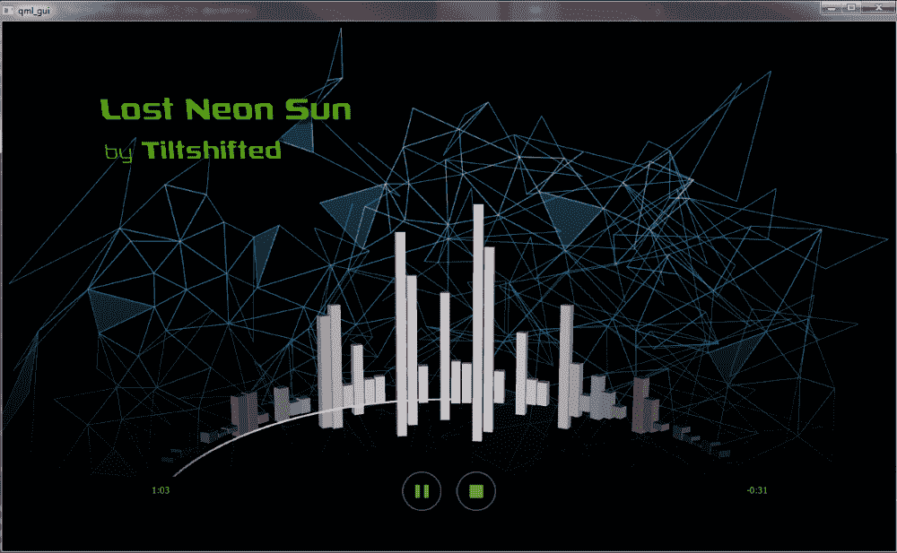

# 第十章：使用 Qt 开发嵌入式系统

Qt（发音为 cute）是一个基于先进的 C++框架，涵盖了各种 API，允许您实现网络、图形用户界面、数据格式的解析、音频的播放和录制等。本章主要涵盖了 Qt 的图形方面，以及如何为嵌入式设备创建高级 GUI，为用户提供吸引人和功能齐全的 UI。

本章涵盖的主题如下：

+   使用 Qt 为嵌入式系统创建高级 GUI

+   使用 Qt 的 3D 设计师创建信息娱乐 UI

+   通过 GUI 扩展现有的嵌入式系统

# 正确框架的力量

框架本质上是一组旨在简化特定应用程序开发的代码集合。它为开发人员提供了一系列类或语言等效物，允许您实现应用程序逻辑，而无需担心与底层硬件的接口，或使用操作系统的 API。

在之前的章节中，我们使用了许多框架来简化开发工作，从 No date 框架（第四章，*资源受限的嵌入式系统*）和 CMSIS 到 Arduino 用于微控制器（MCUs），以及从低级 POCO 框架用于跨平台开发到更高级别的 Qt 框架。

每个框架都有特定类型的系统作为目标。对于 No date、CMSIS 和 Arduino，目标是从 8 位 AVR MCU 到 32 位 ARM MCU 的 MCUs。它们针对裸机系统，没有任何中间操作系统或类似的东西。在复杂性方面，我们还有包括完整操作系统的实时 OS 框架。

诸如 POCO 和 Qt 之类的框架通常针对各种操作系统，从桌面和服务器平台到 SoC 平台。在这里，它们主要作为操作系统特定 API 之间的抽象层，同时在这个抽象层之外提供额外的功能。这使您能够快速构建一个功能齐全的应用程序，而无需在每个功能上花费太多时间。

这对于网络功能特别重要，您不希望从头开始编写基于 TCP 套接字的服务器，而理想情况下只是想实例化一个现成的类并使用它。在 Qt 的情况下，它还提供了与图形用户界面相关的 API，以使跨平台 GUI 的开发更容易。其他提供这种功能的框架还包括 GTK+和 WxWidgets。然而，在本章中，我们将只关注使用 Qt 进行开发。

在第八章，*示例-基于 Linux 的信息娱乐系统*中，我们深入了解了如何使用 Qt 框架进行开发。在那里，我们大多忽略了图形用户界面（GUI）部分，尽管这可能是相对于其他基于操作系统的框架最有趣的部分。能够在多个操作系统上使用相同的 GUI 可能非常有用和方便。

这在大多数基于桌面的应用程序中都是如此，其中 GUI 是应用程序的关键部分，因此不必花费时间和精力在不同操作系统之间进行移植是一个重要的时间节省者。对于嵌入式平台，这也是真的，尽管在这里，您可以选择将其集成得比在桌面系统上更深入，正如我们将在下一刻看到的。

我们还将看一下您可以开发的各种类型的 Qt 应用程序，从简单的命令行界面（CLI）应用程序开始。

# 用于命令行的 Qt

尽管 Qt 框架的图形用户界面是一个重要的卖点，但也可以用它来开发仅限于命令行的应用程序。为此，我们只需使用`QCoreApplication`类来创建输入和事件循环处理程序，就像这个例子中一样：

```cpp
#include <QCoreApplication> 
#include <core.h> 

int main(int argc, char *argv[]) { 
   QCoreApplication app(argc, argv); 
   Core core; 

   connect(&core, &Core::done, &app, &app::quit, Qt::QueuedConnection); 
   core.start(); 

   return app.exec(); 
} 
```

在这里，我们的代码是在一个名为`Core`的类中实现的。在主函数中，我们创建了一个`QCoreApplication`实例，该实例接收命令行参数。然后我们实例化了我们类的一个实例。

我们将我们类的信号连接到`QCoreApplication`实例，这样如果我们发出完成的信号，它将触发后者上的槽来清理和终止应用程序。

之后，我们调用我们类的方法来启动其功能，并最终通过在`QCoreApplication`实例上调用`exec()`来启动事件循环。在这一点上，我们可以使用信号。

请注意，这里也可以使用 Qt4 风格的连接语法，而不是之前的 Qt5 风格：

```cpp
connect(core, SIGNAL(done()), &app, SLOT(quit()), Qt::QueuedConnection); 
```

从功能上讲，这没有任何区别，对于大多数情况来说，使用任何一种都可以。

我们的类如下所示：

```cpp
#include <QObject> 

class Core : public QObject { 
   Q_OBJECT 
public: 
   explicit Core(QObject *parent = 0); 

signals: 
   void done(); 
public slots: 
   void start(); 
}; 
```

在 Qt-based 应用程序中，想要使用 Qt 的信号槽架构的每个类都需要派生自`QObject`类，并在类声明中包含`Q_OBJECT`宏。这对于 Qt 的`qmake 预处理器`工具在应用程序代码被工具链编译之前知道要处理哪些类是必需的。

这是实现：

```cpp
#include "core.h" 
#include <iostream> 

Core::Core(QObject *parent) : QObject(parent) { 
   // 
} 

void hang::start() { 
   std::cout << "Start emitting done()" << std::endl; 
   emit done(); 
} 
```

值得注意的是，我们可以让任何 QObject 派生类的构造函数知道封装父类是什么，从而允许父类拥有这些子类，并在自身被销毁时调用它们的析构函数。

# 基于 GUI 的 Qt 应用程序

回到第八章中基于 Qt 的示例项目，*示例-Linux 基础信息娱乐系统*，我们现在可以比较其主函数和之前的仅限命令行版本，看看在向项目添加 GUI 后会发生什么变化：

```cpp
#include "mainwindow.h" 
#include <QApplication> 

int main(int argc, char *argv[]) { 
    QApplication a(argc, argv); 
    MainWindow w; 
    w.show(); 

    return a.exec(); 
} 
```

这里最明显的变化是我们使用了`QApplication`而不是`QCoreApplication`。另一个重大变化是我们不再使用完全自定义的类，而是从`QMainWindow`派生的类：

```cpp
#include <QMainWindow> 

#include <QAudioRecorder> 
#include <QAudioProbe> 
#include <QMediaPlayer> 

namespace Ui { 
    class MainWindow; 
} 

class MainWindow : public QMainWindow { 
    Q_OBJECT 

public: 
    explicit MainWindow(QWidget *parent = nullptr); 
    ~MainWindow(); 

public slots: 
    void playBluetooth(); 
    void stopBluetooth(); 
    void playOnlineStream(); 
    void stopOnlineStream(); 
    void playLocalFile(); 
    void stopLocalFile(); 
    void recordMessage(); 
    void playMessage(); 

    void errorString(QString err); 

    void quit(); 

private: 
    Ui::MainWindow *ui; 

    QMediaPlayer* player; 
    QAudioRecorder* audioRecorder; 
    QAudioProbe* audioProbe; 

    qint64 silence; 

private slots: 
    void processBuffer(QAudioBuffer); 
}; 
```

在这里，我们可以看到`MainWindow`类确实是从`QMainWindow`派生出来的，这也赋予了它`show()`方法。值得注意的是`MainWindow`实例在 UI 命名空间中声明。这与我们在运行 qmake 工具时生成的自动生成的代码相关联，我们马上就会看到。接下来是构造函数：

```cpp
MainWindow::MainWindow(QWidget *parent) : QMainWindow(parent), 
    ui(new Ui::MainWindow) { 
    ui->setupUi(this); 
```

这里需要注意的第一件事是我们如何从 UI 描述文件中填充 GUI。这个文件通常是通过使用 Qt Creator IDE 中的 Qt Designer 工具直观地布局 GUI 而创建的。这个 UI 文件包含了每个小部件的属性描述，以及应用于它们的布局等等。

当然，也可以以编程方式创建这些小部件并将它们添加到布局中。然而，对于更大的布局来说，这变得相当乏味。通常，您为主窗口创建一个单独的 UI 文件，并为每个子窗口和对话框创建一个额外的 UI 文件。然后可以以类似的方式将它们填充到窗口或对话框中。

```cpp
    connect(ui->actionQuit, SIGNAL(triggered()), this, SLOT(quit())); 
```

GUI 中的菜单操作通过指定菜单操作（`QAction`实例）上的特定信号与内部槽相连接。我们可以在这里看到它们在`ui`对象中，这个对象在 UI 文件的自动生成源代码中可以找到，正如我们之前提到的：

```cpp
    connect(ui->playBluetoothButton, SIGNAL(pressed), this, SLOT(playBluetooth)); 
    connect(ui->stopBluetoothButton, SIGNAL(pressed), this, SLOT(stopBluetooth)); 
    connect(ui->playLocalAudioButton, SIGNAL(pressed), this, SLOT(playLocalFile)); 
    connect(ui->stopLocalAudioButton, SIGNAL(pressed), this, SLOT(stopLocalFile)); 
    connect(ui->playOnlineStreamButton, SIGNAL(pressed), this, SLOT(playOnlineStream)); 
    connect(ui->stopOnlineStreamButton, SIGNAL(pressed), this, SLOT(stopOnlineStream)); 
    connect(ui->recordMessageButton, SIGNAL(pressed), this, SLOT(recordMessage)); 
    connect(ui->playBackMessage, SIGNAL(pressed), this, SLOT(playMessage)); 
```

GUI 中的按钮小部件以类似的方式连接，尽管它们当然会因为它们是不同类型的小部件而发出不同的信号：

```cpp
    silence = 0; 

    // Create the audio interface instances. 
    player = new QMediaPlayer(this); 
    audioRecorder = new QAudioRecorder(this); 
    audioProbe = new QAudioProbe(this); 

    // Configure the audio recorder. 
    QAudioEncoderSettings audioSettings; 
    audioSettings.setCodec("audio/amr"); 
    audioSettings.setQuality(QMultimedia::HighQuality);     
    audioRecorder->setEncodingSettings(audioSettings);     
    audioRecorder->setOutputLocation(QUrl::fromLocalFile("message/last_message.amr")); 

    // Configure audio probe. 
    connect(audioProbe, SIGNAL(audioBufferProbed(QAudioBuffer)), this, SLOT(processBuffer(QAudioBuffer))); 
    audioProbe→setSource(audioRecorder); 
```

我们可以在这里做任何其他构造函数中会做的事情，包括设置默认值和创建我们以后需要的类的实例：

```cpp
    QThread* thread = new QThread; 
    VoiceInput* vi = new VoiceInput(); 
    vi->moveToThread(thread); 
    connect(thread, SIGNAL(started()), vi, SLOT(run())); 
    connect(vi, SIGNAL(finished()), thread, SLOT(quit())); 
    connect(vi, SIGNAL(finished()), vi, SLOT(deleteLater())); 
    connect(thread, SIGNAL(finished()), thread, SLOT(deleteLater())); 

    connect(vi, SIGNAL(error(QString)), this, SLOT(errorString(QString))); 
    connect(vi, SIGNAL(playBluetooth), this, SLOT(playBluetooth)); 
    connect(vi, SIGNAL(stopBluetooth), this, SLOT(stopBluetooth)); 
    connect(vi, SIGNAL(playLocal), this, SLOT(playLocalFile)); 
    connect(vi, SIGNAL(stopLocal), this, SLOT(stopLocalFile)); 
    connect(vi, SIGNAL(playRemote), this, SLOT(playOnlineStream)); 
    connect(vi, SIGNAL(stopRemote), this, SLOT(stopOnlineStream)); 
    connect(vi, SIGNAL(recordMessage), this, SLOT(recordMessage)); 
    connect(vi, SIGNAL(playMessage), this, SLOT(playMessage)); 

    thread->start(); 
} 
```

这里需要记住的一件关键的事情是这个类在 UI 线程上运行，这意味着我们不应该在这里做任何繁重的工作。这就是为什么我们将这样的类实例移到它们自己的线程中，就像这样：

```cpp
MainWindow::~MainWindow() { 
    delete ui; 
} 
```

在构造函数中，我们删除 UI 和所有相关元素。

# 嵌入式 Qt

Qt 框架的一个主要目标是桌面系统之外的**嵌入式系统**，特别是**嵌入式 Linux**，在那里有几种不同的使用 Q 的方式。嵌入式 Qt 的主要目的是通过允许您直接启动到优化的 Qt 环境中来优化软件库，并允许多种方式渲染到显示器。

Qt for Embedded Linux 支持以下用于渲染的平台插件：

| **插件** | **描述** |
| --- | --- |
| EGLFS | 提供对 OpenGL ES 或类似的 3D 渲染 API 的接口。通常是嵌入式 Linux 的默认配置。有关 EGL 的更多详细信息，请访问以下网址：[`www.khronos.org/egl`](https://www.khronos.org/egl). |
| LinuxFB | 通过 Linux 的 fbdev 子系统直接写入帧缓冲。仅支持软件渲染内容。因此，在某些设置上，显示性能可能会受到限制。 |
| DirectFB | 使用 DirectFB 库直接写入图形卡的帧缓冲。 |
| Wayland | 使用 Wayland 窗口系统。这允许多个并发窗口，但当然对硬件要求更高。 |

除此之外，Qt for Embedded Linux 还配备了各种 API，用于处理触摸和笔输入等。为了优化基于 Qt 的应用程序的系统，通常会删除任何不相关的服务、进程和库，从而使系统在几秒钟内启动到嵌入式应用程序中。

# 使用样式表的自定义 GUI

桌面系统通常使用的标准基于小部件的 GUI 不太容易定制。因此，通常要么需要覆盖`QWidget`实例中的绘图函数并处理小部件绘制的每个像素，要么使用基于样式表的定制。

Qt 样式表允许您动态地调整单个小部件的外观和感觉。它们基本上是使用与 HTML 页面一样的**层叠样式表**（**CSS**）语法编写的。它们允许您更改小部件的元素，如边框、圆角、或元素的厚度和颜色。

# QML

**Qt 建模语言**（**QML**）是一种用户界面标记语言。它基于 JavaScript，并且甚至使用内联 JavaScript。它可以用于创建动态和完全定制的用户界面，并通常与 Qt Quick 模块一起使用。

在本章的后面，我们将深入研究如何创建动态 GUI。

# 3D 设计师

使用 Qt 5 引入了 Qt 3D 模块，它简化了对 OpenGL 渲染 API 的访问。这个新模块被用作 Qt 3D Designer 编辑器和相关运行时的基础。它可以用于创建高度动态的 GUI，具有 2D 和 3D 元素的组合。

它与手工制作的基于 QML 的 GUI 非常相似，但提供了更简化的工作流程，易于添加动画，并预览项目。它类似于 Qt Designer Studio，后者更专注于 2D GUI，但需要购买许可证，不免费提供。

# 向信息娱乐系统添加 GUI 的示例

在这个例子中，我们将使用 C++、Qt 和 QML 来创建一个图形用户界面，能够显示当前播放的音轨，执行音频可视化，指示播放进度，并允许您使用屏幕按钮切换不同的输入模式。

这个例子是基于 Qt 文档中的*音频可视化器*示例。它可以在 Qt 安装文件夹中找到（如果安装了示例），也可以在 Qt 网站上找到：[`doc.qt.io/qt-5/qt3d-audio-visualizer-qml-example.html.`](https://doc.qt.io/qt-5/qt3d-audio-visualizer-qml-example.html.)

这段代码与官方示例的主要区别在于，`QMediaPlayer`媒体播放器被移入了 C++代码中，还有其他一些函数。而在新的`QmlInterface`类中，QML UI 和 C++后端之间使用了一些信号和槽来处理按钮按下、更新 UI 和与媒体播放器的交互。

这样的 GUI 可以连接到现有的信息娱乐项目代码中，以控制其功能，使用 GUI 以及语音驱动界面。

在这个示例中，我们组合的 GUI 在操作时看起来是这样的：



# 主要

主要源文件如下所示：

```cpp
#include "interface.h" 
#include <QtGui/QGuiApplication> 
#include <QtGui/QOpenGLContext> 
#include <QtQuick/QQuickView> 
#include <QtQuick/QQuickItem> 
#include <QtQml/QQmlContext> 
#include <QObject> 

int main(int argc, char* argv[]) { 
    QGuiApplication app(argc, argv); 

    QSurfaceFormat format; 
    if (QOpenGLContext::openGLModuleType() == QOpenGLContext::LibGL) { 
        format.setVersion(3, 2); 
        format.setProfile(QSurfaceFormat::CoreProfile); 
    } 

    format.setDepthBufferSize(24); 
    format.setStencilBufferSize(8); 

    QQuickView view; 
    view.setFormat(format); 
    view.create(); 

    QmlInterface qmlinterface; 
    view.rootContext()->setContextProperty("qmlinterface", &qmlinterface); 
    view.setSource(QUrl("qrc:/main.qml")); 

    qmlinterface.setPlaying(); 

    view.setResizeMode(QQuickView::SizeRootObjectToView); 
    view.setMaximumSize(QSize(1820, 1080)); 
    view.setMinimumSize(QSize(300, 150)); 
    view.show(); 

    return app.exec(); 
} 
```

我们的自定义类被添加到 QML 查看器（`QQuickView`）作为上下文类。这充当了 QML UI 和我们的 C++代码之间的代理，我们马上就会看到。查看器本身使用 OpenGL 表面来渲染 UI。

# QmlInterface

我们自定义类的头部包含了许多添加，以使属性和方法对 QML 代码可见：

```cpp
#include <QtCore/QObject> 
#include <QMediaPlayer> 
#include <QByteArray> 

class QmlInterface : public QObject { 
    Q_OBJECT     
    Q_PROPERTY(QString durationTotal READ getDurationTotal NOTIFY durationTotalChanged) 
    Q_PROPERTY(QString durationLeft READ getDurationLeft NOTIFY durationLeftChanged) 

```

`Q_PROPERTY`标签告诉 qmake 解析器，这个类包含一个属性（变量），应该对 QML 代码可见，参数指定变量的名称，用于读取和写入变量的方法（如果需要），最后是每当属性发生变化时发出的信号。

这允许设置自动更新功能，以保持此属性在 C++代码和 QML 端之间同步：

```cpp

    QString formatDuration(qint64 milliseconds); 

    QMediaPlayer mediaPlayer; 
    QByteArray magnitudeArray; 
    const int millisecondsPerBar = 68; 
    QString durationTotal; 
    QString durationLeft; 
    qint64 trackDuration; 

public: 
    explicit QmlInterface(QObject *parent = nullptr); 

    Q_INVOKABLE bool isHoverEnabled() const; 
    Q_INVOKABLE void setPlaying(); 
   Q_INVOKABLE void setStopped(); 
   Q_INVOKABLE void setPaused(); 
    Q_INVOKABLE qint64 duration(); 
    Q_INVOKABLE qint64 position(); 
    Q_INVOKABLE double getNextAudioLevel(int offsetMs); 

    QString getDurationTotal() { return durationTotal; } 
    QString getDurationLeft() { return durationLeft; } 

public slots: 
    void mediaStatusChanged(QMediaPlayer::MediaStatus status); 
    void durationChanged(qint64 duration); 
    void positionChanged(qint64 position); 

signals: 
    void start(); 
    void stopped(); 
    void paused(); 
    void playing(); 
    void durationTotalChanged(); 
    void durationLeftChanged(); 
}; 
```

同样，`Q_INVOKABLE`标签确保这些方法对 QML 端可见，并且可以从那里调用。

这是实现：

```cpp
#include "interface.h" 
#include <QtGui/QTouchDevice> 
#include <QDebug> 
#include <QFile> 
#include <QtMath> 

QmlInterface::QmlInterface(QObject *parent) : QObject(parent) { 
    // Set track for media player. 
    mediaPlayer.setMedia(QUrl("qrc:/music/tiltshifted_lost_neon_sun.mp3")); 

    // Load magnitude file for the audio track. 
    QFile magFile(":/music/visualization.raw", this); 
    magFile.open(QFile::ReadOnly); 
    magnitudeArray = magFile.readAll(); 

    // Media player connections. 
    connect(&mediaPlayer, SIGNAL(mediaStatusChanged(QMediaPlayer::MediaStatus)), this, SLOT(mediaStatusChanged(QMediaPlayer::MediaStatus))); 
    connect(&mediaPlayer, SIGNAL(durationChanged(qint64)), this, SLOT(durationChanged(qint64))); 
    connect(&mediaPlayer, SIGNAL(positionChanged(qint64)), this, SLOT(positionChanged(qint64))); 
} 
```

构造函数与原始示例项目有很大不同，这里创建了媒体播放器实例及其连接。

我们在这里加载了与原始项目中使用的相同音乐文件。将代码集成到信息娱乐项目或类似项目中时，您可以使其动态化。同样，我们在这里加载的用于获取音乐文件振幅的文件在完全集成时可能会被省略，而选择动态生成振幅值：

```cpp
bool QmlInterface::isHoverEnabled() const { 
#if defined(Q_OS_IOS) || defined(Q_OS_ANDROID) || defined(Q_OS_QNX) || defined(Q_OS_WINRT) 
    return false; 
#else 
    bool isTouch = false; 
    foreach (const QTouchDevice *dev, QTouchDevice::devices()) { 
        if (dev->type() == QTouchDevice::TouchScreen) { 
            isTouch = true; 
            break; 
        } 
    } 

    bool isMobile = false; 
    if (qEnvironmentVariableIsSet("QT_QUICK_CONTROLS_MOBILE")) { 
        isMobile = true; 
    } 

    return !isTouch && !isMobile; 
#endif 
} 
```

这是以前存在于 QML 上下文类中的唯一方法。它用于检测代码是否在具有触摸屏的移动设备上运行：

```cpp
void QmlInterface::setPlaying() { 
   mediaPlayer.play(); 
} 

void QmlInterface::setStopped() { 
   mediaPlayer.stop(); 
} 

void QmlInterface::setPaused() { 
   mediaPlayer.pause(); 
} 
```

我们有许多控制方法，连接到 UI 中的按钮，以允许控制媒体播放器实例：

```cpp
void QmlInterface::mediaStatusChanged(QMediaPlayer::MediaStatus status) { 
    if (status == QMediaPlayer::EndOfMedia) { 
        emit stopped(); 
    } 
} 
```

这个槽方法用于检测媒体播放器是否已经到达了活动曲目的结尾，以便 UI 可以被通知应该更新以指示这一点：

```cpp
void QmlInterface::durationChanged(qint64 duration) { 
    qDebug() << "Duration changed: " << duration; 

    durationTotal = formatDuration(duration); 
    durationLeft = "-" + durationTotal; 
    trackDuration = duration; 
    emit start(); 
    emit durationTotalChanged(); 
    emit durationLeftChanged(); 
} 

void QmlInterface::positionChanged(qint64 position) { 
    qDebug() << "Position changed: " << position; 
    durationLeft = "-" + formatDuration((trackDuration - position)); 
    emit durationLeftChanged(); 
} 
```

这两个槽方法连接到媒体播放器实例。持续时间槽是必需的，因为新加载的曲目的长度（持续时间）不会立即可用。相反，它是一个异步更新的属性。

因此，我们必须等到媒体播放器完成并发出信号，表明它已经完成了这个过程。

接下来，为了让我们能够更新当前曲目的剩余时间，我们还会不断地从媒体播放器获取当前位置的更新，这样我们就可以用新值更新 UI。

持续时间和位置属性都使用了我们在这个类的头文件描述中看到的链接方法在 UI 中进行更新。

最后，我们发出一个`start()`信号，它与 QML 代码中的一个槽连接，将启动可视化过程，我们稍后会在 QML 代码中看到：

```cpp
qint64 QmlInterface::duration() { 
    qDebug() << "Returning duration value: " << mediaPlayer.duration(); 
    return mediaPlayer.duration(); 
} 

qint64 QmlInterface::position() { 
    qDebug() << "Returning position value: " << mediaPlayer.position(); 
    return mediaPlayer.position(); 
} 
```

持续时间属性也被可视化代码使用。在这里，我们允许直接获取它。同样，我们也使位置属性可用，可以直接调用：

```cpp
double QmlInterface::getNextAudioLevel(int offsetMs) { 
    // Calculate the integer index position in to the magnitude array 
    qint64 index = ((mediaPlayer.position() + offsetMs) / millisecondsPerBar) | 0; 

    if (index < 0 || index >= (magnitudeArray.length() / 2)) { 
        return 0.0; 
    } 

    return (((quint16*) magnitudeArray.data())[index] / 63274.0); 
} 
```

这种方法是从原始项目的 JavaScript 代码移植过来的，执行的是根据之前从文件中读取的振幅数据来确定音频级别的相同任务：

```cpp
QString QmlInterface::formatDuration(qint64 milliseconds) { 
    qint64 minutes = floor(milliseconds / 60000); 
    milliseconds -= minutes * 60000; 
    qint64 seconds = milliseconds / 1000; 
    seconds = round(seconds); 
    if (seconds < 10) { 
        return QString::number(minutes) + ":0" + QString::number(seconds); 
    } 
    else { 
        return QString::number(minutes) + ":" + QString::number(seconds); 
    } 
} 
```

同样，这个方法也是从原始项目的 JavaScript 代码移植过来的，因为我们将依赖于它的代码移入了 C++代码中。它接受曲目持续时间或位置的毫秒计数，并将其转换为包含分钟和秒的字符串，与原始值匹配。

# QML

接下来，我们已经完成了 C++端的工作，现在可以看一下 QML UI 了。

首先，这是主要的 QML 文件：

```cpp
import QtQuick 2.0 
import QtQuick.Scene3D 2.0 
import QtQuick.Layouts 1.2 
import QtMultimedia 5.0 

Item { 
    id: mainview 
    width: 1215 
    height: 720 
    visible: true 
    property bool isHoverEnabled: false 
    property int mediaLatencyOffset: 68 
```

QML 文件由一系列元素组成。在这里，我们定义了顶层元素，给它指定了尺寸和名称：

```cpp
    state: "stopped" 
    states: [ 
        State { 
            name: "playing" 
            PropertyChanges { 
                target: playButtonImage 
                source: { 
                    if (playButtonMouseArea.containsMouse) 
                        "qrc:/images/pausehoverpressed.png" 
                    else 
                        "qrc:/images/pausenormal.png" 
                } 
            } 
            PropertyChanges { 
                target: stopButtonImage 
                source: "qrc:/images/stopnormal.png" 
            } 
        }, 
        State { 
            name: "paused" 
            PropertyChanges { 
                target: playButtonImage 
                source: { 
                    if (playButtonMouseArea.containsMouse) 
                        "qrc:/images/playhoverpressed.png" 
                    else 
                        "qrc:/images/playnormal.png" 
                } 
            } 
            PropertyChanges { 
                target: stopButtonImage 
                source: "qrc:/images/stopnormal.png" 
            } 
        }, 
        State { 
            name: "stopped" 
            PropertyChanges { 
                target: playButtonImage 
                source: "qrc:/images/playnormal.png" 
            } 
            PropertyChanges { 
                target: stopButtonImage 
                source: "qrc:/images/stopdisabled.png" 
            } 
        } 
    ]    
```

定义了 UI 的一些状态，以及应该触发的变化：

```cpp
    Connections { 
        target: qmlinterface 
        onStopped: mainview.state = "stopped" 
        onPaused: mainview.state = "paused" 
        onPlaying: mainview.state = "started" 
        onStart: visualizer.startVisualization() 
    } 
```

这些是将 C++端的信号链接到本地处理程序的连接。我们将我们的自定义类作为这些信号的源，然后为我们希望处理的每个信号定义处理程序，通过为其添加前缀并添加应该执行的代码。

在这里，我们看到启动信号与一个处理程序链接，触发可视化模块中启动该模块的函数：

```cpp
    Component.onCompleted: isHoverEnabled = qmlinterface.isHoverEnabled() 

    Image { 
        id: coverImage 
        anchors.fill: parent 
        source: "qrc:/images/albumcover.png" 
    } 
```

这个`Image`元素定义了背景图像，我们从构建项目时添加到可执行文件中的资源中加载：

```cpp
    Scene3D { 
        anchors.fill: parent 

        Visualizer { 
            id: visualizer 
            animationState: mainview.state 
            numberOfBars: 120 
            barRotationTimeMs: 8160 // 68 ms per bar 
        } 
    } 
```

3D 场景将填充可视化器的内容：

```cpp
    Rectangle { 
        id: blackBottomRect 
        color: "black" 
        width: parent.width 
        height: 0.14 * mainview.height 
        anchors.bottom: parent.bottom 
    } 

    Text { 
        text: qmlinterface.durationTotal 
        color: "#80C342" 
        x: parent.width / 6 
        y: mainview.height - mainview.height / 8 
        font.pixelSize: 12 
    } 

    Text { 
        text: qmlinterface.durationLeft 
        color: "#80C342" 
        x: parent.width - parent.width / 6 
        y: mainview.height - mainview.height / 8 
        font.pixelSize: 12 
    } 
```

这两个文本元素与我们自定义的 C++类中的属性相关联，就像我们之前看到的那样。这些值将随着 C++类实例中的值的变化而保持更新：

```cpp
    property int buttonHorizontalMargin: 10 
    Rectangle { 
        id: playButton 
        height: 54 
        width: 54 
        anchors.bottom: parent.bottom 
        anchors.bottomMargin: width 
        x: parent.width / 2 - width - buttonHorizontalMargin 
        color: "transparent" 

        Image { 
            id: playButtonImage 
            source: "qrc:/images/pausenormal.png" 
        } 

        MouseArea { 
            id: playButtonMouseArea 
            anchors.fill: parent 
            hoverEnabled: isHoverEnabled 
            onClicked: { 
                if (mainview.state == 'paused' || mainview.state == 'stopped') 
                    mainview.state = 'playing' 
                else 
                    mainview.state = 'paused' 
            } 
            onEntered: { 
                if (mainview.state == 'playing') 
                    playButtonImage.source = "qrc:/images/pausehoverpressed.png" 
                else 
                    playButtonImage.source = "qrc:/images/playhoverpressed.png" 
            } 
            onExited: { 
                if (mainview.state == 'playing') 
                    playButtonImage.source = "qrc:/images/pausenormal.png" 
                else 
                    playButtonImage.source = "qrc:/images/playnormal.png" 
            } 
        } 
    } 

    Rectangle { 
        id: stopButton 
        height: 54 
        width: 54 
        anchors.bottom: parent.bottom 
        anchors.bottomMargin: width 
        x: parent.width / 2 + buttonHorizontalMargin 
        color: "transparent" 

        Image { 
            id: stopButtonImage 
            source: "qrc:/images/stopnormal.png" 
        } 

        MouseArea { 
            anchors.fill: parent 
            hoverEnabled: isHoverEnabled 
            onClicked: mainview.state = 'stopped' 
            onEntered: { 
                if (mainview.state != 'stopped') 
                    stopButtonImage.source = "qrc:/images/stophoverpressed.png" 
            } 
            onExited: { 
                if (mainview.state != 'stopped') 
                    stopButtonImage.source = "qrc:/images/stopnormal.png" 
            } 
        } 
    } 
} 
```

源代码的其余部分用于设置用于控制播放的各个按钮，包括播放、停止和暂停按钮，根据需要进行切换。

接下来，我们将看一下振幅条文件：

```cpp
import Qt3D.Core 2.0 
import Qt3D.Render 2.0 
import Qt3D.Extras 2.0 
import QtQuick 2.4 as QQ2 

Entity { 
    property int rotationTimeMs: 0 
    property int entityIndex: 0 
    property int entityCount: 0 
    property int startAngle: 0 + 360 / entityCount * entityIndex 
    property bool needsNewMagnitude: true 
    property real magnitude: 0 
    property real animWeight: 0 

    property color lowColor: "black" 
    property color highColor: "#b3b3b3" 
    property color barColor: lowColor 

    property string entityAnimationsState: "stopped" 
    property bool entityAnimationsPlaying: true 

    property var entityMesh: null 
```

在我们深入到动画状态变化处理程序之前，定义了一些属性：

```cpp
    onEntityAnimationsStateChanged: { 
        if (animationState == "paused") { 
            if (angleAnimation.running) 
                angleAnimation.pause() 
            if (barColorAnimations.running) 
                barColorAnimations.pause() 
        } else if (animationState == "playing"){ 
            needsNewMagnitude = true; 
            if (heightDecreaseAnimation.running) 
                heightDecreaseAnimation.stop() 
            if (angleAnimation.paused) { 
                angleAnimation.resume() 
            } else if (!entityAnimationsPlaying) { 
                magnitude = 0 
                angleAnimation.start() 
                entityAnimationsPlaying = true 
            } 
            if (barColorAnimations.paused) 
                barColorAnimations.resume() 
        } else { 
            if (animWeight != 0) 
                heightDecreaseAnimation.start() 
            needsNewMagnitude = true 
            angleAnimation.stop() 
            barColorAnimations.stop() 
            entityAnimationsPlaying = false 
        } 
    } 
```

每当音频播放停止、暂停或开始时，动画都必须更新以匹配这种状态变化：

```cpp
    property Material barMaterial: PhongMaterial { 
        diffuse: barColor 
        ambient: Qt.darker(barColor) 
        specular: "black" 
        shininess: 1 
    } 
```

这定义了振幅条的外观，使用 Phong 着色：

```cpp
    property Transform angleTransform: Transform { 
        property real heightIncrease: magnitude * animWeight 
        property real barAngle: startAngle 

        matrix: { 
            var m = Qt.matrix4x4() 
            m.rotate(barAngle, Qt.vector3d(0, 1, 0)) 
            m.translate(Qt.vector3d(1.1, heightIncrease / 2 - heightIncrease * 0.05, 0)) 
            m.scale(Qt.vector3d(0.5, heightIncrease * 15, 0.5)) 
            return m; 
        } 

        property real compareAngle: barAngle 
        onBarAngleChanged: { 
            compareAngle = barAngle 

            if (compareAngle > 360) 
                compareAngle = barAngle - 360 

            if (compareAngle > 180) { 
                parent.enabled = false 
                animWeight = 0 
                if (needsNewMagnitude) { 
                    // Calculate the ms offset where the bar will be at the center point of the 
                    // visualization and fetch the correct magnitude for that point in time. 
                    var offset = (90.0 + 360.0 - compareAngle) * (rotationTimeMs / 360.0) 
                    magnitude = qmlinterface.getNextAudioLevel(offset) 
                    needsNewMagnitude = false 
                } 
            } else { 
                parent.enabled = true 
                // Calculate a power of 2 curve for the bar animation that peaks at 90 degrees 
                animWeight = Math.min((compareAngle / 90), (180 - compareAngle) / 90) 
                animWeight = animWeight * animWeight 
                if (!needsNewMagnitude) { 
                    needsNewMagnitude = true 
                    barColorAnimations.start() 
                } 
            } 
        } 
    } 
```

当振幅条在屏幕上移动时，它们相对于摄像机的位置会发生变化，因此我们需要不断计算新的角度和显示高度。

在这一部分，我们还用我们的 C++类中的新方法调用替换了原始的音频级别方法的调用：

```cpp
    components: [entityMesh, barMaterial, angleTransform] 

    QQ2.NumberAnimation { 
        id: angleAnimation 
        target: angleTransform 
        property: "barAngle" 
        duration: rotationTimeMs 
        loops: QQ2.Animation.Infinite 
        running: true 
        from: startAngle 
        to: 360 + startAngle 
    } 

    QQ2.NumberAnimation { 
        id: heightDecreaseAnimation 
        target: angleTransform 
        property: "heightIncrease" 
        duration: 400 
        running: false 
        from: angleTransform.heightIncrease 
        to: 0 
        onStopped: barColor = lowColor 
    } 

    property int animationDuration: angleAnimation.duration / 6 

    QQ2.SequentialAnimation on barColor { 
        id: barColorAnimations 
        running: false 

        QQ2.ColorAnimation { 
            from: lowColor 
            to: highColor 
            duration: animationDuration 
        } 

        QQ2.PauseAnimation { 
            duration: animationDuration 
        } 

        QQ2.ColorAnimation { 
            from: highColor 
            to: lowColor 
            duration: animationDuration 
        } 
    } 
} 
```

文件的其余部分包含了一些动画变换。

最后，这是可视化模块：

```cpp
import Qt3D.Core 2.0 
import Qt3D.Render 2.0 
import Qt3D.Extras 2.0 
import QtQuick 2.2 as QQ2 

Entity { 
    id: sceneRoot 
    property int barRotationTimeMs: 1 
    property int numberOfBars: 1 
    property string animationState: "stopped" 
    property real titleStartAngle: 95 
    property real titleStopAngle: 5 

    onAnimationStateChanged: { 
        if (animationState == "playing") { 
            qmlinterface.setPlaying(); 
            if (progressTransformAnimation.paused) 
                progressTransformAnimation.resume() 
            else 
                progressTransformAnimation.start() 
        } else if (animationState == "paused") { 
            qmlinterface.setPaused(); 
            if (progressTransformAnimation.running) 
                progressTransformAnimation.pause() 
        } else { 
            qmlinterface.setStopped(); 
            progressTransformAnimation.stop() 
            progressTransform.progressAngle = progressTransform.defaultStartAngle 
        } 
    } 
```

这一部分从与本地媒体播放器实例的交互改为与 C++代码中的新实例交互。除此之外，我们没有做任何改动。这是主要的处理程序，用于处理由用户交互引起的场景变化，或者曲目的开始或结束：

```cpp
    QQ2.Item { 
        id: stateItem 

        state: animationState 
        states: [ 
            QQ2.State { 
                name: "playing" 
                QQ2.PropertyChanges { 
                    target: titlePrism 
                    titleAngle: titleStopAngle 
                } 
            }, 
            QQ2.State { 
                name: "paused" 
                QQ2.PropertyChanges { 
                    target: titlePrism 
                    titleAngle: titleStopAngle 
                } 
            }, 
            QQ2.State { 
                name: "stopped" 
                QQ2.PropertyChanges { 
                    target: titlePrism 
                    titleAngle: titleStartAngle 
                } 
            } 
        ] 

        transitions: QQ2.Transition { 
            QQ2.NumberAnimation { 
                property: "titleAngle" 
                duration: 2000 
                running: false 
            } 
        } 
    } 
```

为曲目标题对象定义了一些属性变化和转换：

```cpp
    function startVisualization() { 
        progressTransformAnimation.duration = qmlinterface.duration() 
        mainview.state = "playing" 
        progressTransformAnimation.start() 
    } 
```

这个函数是启动整个可视化序列的方法。它使用我们的 C++类实例获取的曲目持续时间来确定曲目播放动画的进度条尺寸，然后开始可视化动画：

```cpp
    Camera { 
        id: camera 
        projectionType: CameraLens.PerspectiveProjection 
        fieldOfView: 45 
        aspectRatio: 1820 / 1080 
        nearPlane: 0.1 
        farPlane: 1000.0 
        position: Qt.vector3d(0.014, 0.956, 2.178) 
        upVector: Qt.vector3d(0.0, 1.0, 0.0) 
        viewCenter: Qt.vector3d(0.0, 0.7, 0.0) 
    } 
```

为 3D 场景定义了一个摄像机：

```cpp
    Entity { 
        components: [ 
            DirectionalLight { 
                intensity: 0.9 
                worldDirection: Qt.vector3d(0, 0.6, -1) 
            } 
        ] 
    } 

    RenderSettings { 
        id: external_forward_renderer 
        activeFrameGraph: ForwardRenderer { 
            camera: camera 
            clearColor: "transparent" 
        } 
    } 
```

为场景创建了渲染器和光源：

```cpp
    components: [external_forward_renderer] 

    CuboidMesh { 
        id: barMesh 
        xExtent: 0.1 
        yExtent: 0.1 
        zExtent: 0.1 
    } 
```

为振幅条创建了一个网格：

```cpp
    NodeInstantiator { 
        id: collection 
        property int maxCount: parent.numberOfBars 
        model: maxCount 

        delegate: BarEntity { 
            id: cubicEntity 
            entityMesh: barMesh 
            rotationTimeMs: sceneRoot.barRotationTimeMs 
            entityIndex: index 
            entityCount: sceneRoot.numberOfBars 
            entityAnimationsState: animationState 
            magnitude: 0 
        } 
    } 
```

定义了条的数量以及其他属性：

```cpp
    Entity { 
        id: titlePrism 
        property real titleAngle: titleStartAngle 

        Entity { 
            id: titlePlane 

            PlaneMesh { 
                id: titlePlaneMesh 
                width: 550 
                height: 100 
            } 

            Transform { 
                id: titlePlaneTransform 
                scale: 0.003 
                translation: Qt.vector3d(0, 0.11, 0) 
            } 

            NormalDiffuseMapAlphaMaterial { 
                id: titlePlaneMaterial 
                diffuse: TextureLoader { source: "qrc:/images/demotitle.png" } 
                normal: TextureLoader { source: "qrc:/images/normalmap.png" } 
                shininess: 1.0 
            } 

            components: [titlePlaneMesh, titlePlaneMaterial, titlePlaneTransform] 
        } 
```

这个平面包含了没有曲目播放时的标题对象：

```cpp
        Entity { 
            id: songTitlePlane 

            PlaneMesh { 
                id: songPlaneMesh 
                width: 550 
                height: 100 
            } 

            Transform { 
                id: songPlaneTransform 
                scale: 0.003 
                rotationX: 90 
                translation: Qt.vector3d(0, -0.03, 0.13) 
            } 

            property Material songPlaneMaterial: NormalDiffuseMapAlphaMaterial { 
                diffuse: TextureLoader { source: "qrc:/images/songtitle.png" } 
                normal: TextureLoader { source: "qrc:/images/normalmap.png" } 
                shininess: 1.0 
            } 

            components: [songPlaneMesh, songPlaneMaterial, songPlaneTransform] 
        } 
```

这个平面包含了曲目激活时的歌曲标题：

```cpp
        property Transform titlePrismPlaneTransform: Transform { 
            matrix: { 
                var m = Qt.matrix4x4() 
                m.translate(Qt.vector3d(-0.5, 1.3, -0.4)) 
                m.rotate(titlePrism.titleAngle, Qt.vector3d(1, 0, 0)) 
                return m; 
            } 
        } 

        components: [titlePlane, songTitlePlane, titlePrismPlaneTransform] 
    } 
```

为了在播放和非播放转换之间转换平面，使用了这个变换：

```cpp
    Mesh { 
        id: circleMesh 
        source: "qrc:/meshes/circle.obj" 
    } 

    Entity { 
        id: circleEntity 
        property Material circleMaterial: PhongAlphaMaterial { 
            alpha: 0.4 
            ambient: "black" 
            diffuse: "black" 
            specular: "black" 
            shininess: 10000 
        } 

        components: [circleMesh, circleMaterial] 
    } 
```

添加了一个提供反射效果的圆形网格：

```cpp
    Mesh { 
        id: progressMesh 
        source: "qrc:/meshes/progressbar.obj" 
    } 

    Transform { 
        id: progressTransform 
        property real defaultStartAngle: -90 
        property real progressAngle: defaultStartAngle 
        rotationY: progressAngle 
    } 

    Entity { 
        property Material progressMaterial: PhongMaterial { 
            ambient: "purple" 
            diffuse: "white" 
        } 

        components: [progressMesh, progressMaterial, progressTransform] 
    } 

    QQ2.NumberAnimation { 
        id: progressTransformAnimation 
        target: progressTransform 
        property: "progressAngle" 
        duration: 0 
        running: false 
        from: progressTransform.defaultStartAngle 
        to: -270 
        onStopped: if (animationState != "stopped") animationState = "stopped" 
    } 
} 
```

最后，这个网格创建了进度条，它从左到右移动以指示播放进度。

整个项目通过运行 qmake 然后 make 来编译，或者通过在 Qt Creator 中打开项目并从那里构建来编译。运行时，它将自动开始播放包含的歌曲并显示振幅可视化，同时可以通过 UI 中的按钮进行控制。

# 总结

在本章中，我们看了 Qt 框架在开发嵌入式系统方面的多种用途。我们简要地比较了它与其他框架的区别，以及 Qt 如何针对这些嵌入式平台进行优化，然后通过一个基于 QML 的 GUI 示例来演示如何将其添加到我们之前创建的信息娱乐系统中。

您现在应该能够创建基本的 Qt 应用程序，包括纯粹基于命令行的应用程序和带有图形用户界面的应用程序。您还应该清楚地了解 Qt 提供的开发 GUI 的各种选项。

在下一章中，我们将看看嵌入式平台的下一个演进，使用可编程门阵列（FPGAs）来为嵌入式平台加入定制的基于硬件的功能，以加快其速度。
